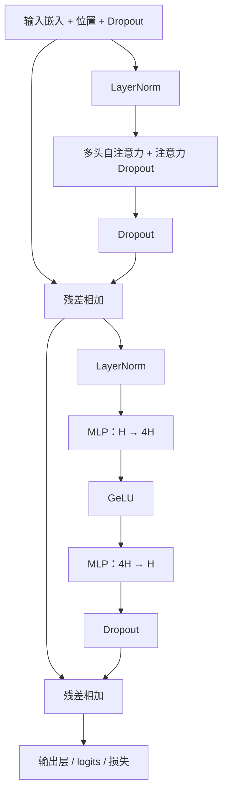
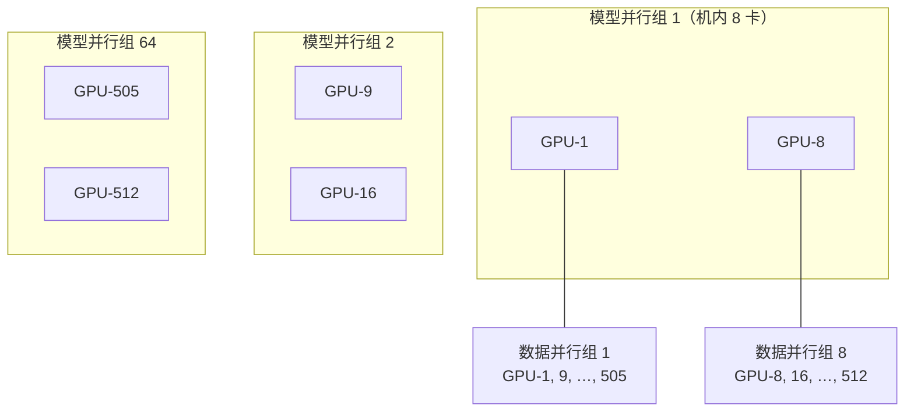

# Megatron-LM：Transformer 的矩阵天生可切，模型并行不必换编译器

<!-- release-date: 2019-09-17 -->

> 本文依据 NVIDIA 的 **Megatron-LM: Training Multi-Billion Parameter Language Models Using Model Parallelism**，即 arXiv:1909.08053 **v4**（2020-03-13），共 15 页。封面水印为 `arXiv:1909.08053v4 [cs.CL] 13 Mar 2020`。作者六人全部署名 NVIDIA：Mohammad Shoeybi、Mostofa Patwary、Raul Puri（三人 equal contribution）、Patrick LeGresley、Jared Casper、Bryan Catanzaro。页码均指这份 PDF。全文把三件事分开标注：**论文明确写了什么**、**我们如何解释或验算它**、**哪些是外部资料补充**。
>
> 动笔前核过 [arXiv:1909.08053](https://arxiv.org/abs/1909.08053)：v1（2019-09-17，3,472 KB）、v2（2019-09-19，3,472 KB）、v3（2019-10-05，3,472 KB）、v4（2020-03-13，4,006 KB）。本地件与官方最新版一致，未做替换。本文一律用 v4。v1–v3 的逐条差异不以二手摘要补写；v4 正文能直接看见的一处是引用了 2020 年的 Microsoft Turing-NLG。
>
> `release-date` 取 **2019-09-17**。这是一篇训练系统论文，对象从未作为产品对外可用，按该技术首次官方公开日取值，即 arXiv v1。v4 修订日不回写。论文自己把代码放在 [https://github.com/NVIDIA/Megatron-LM](https://github.com/NVIDIA/Megatron-LM)（PDF p. 2）。今天仓库里的 Megatron Core 是另一代系统，本模块只讲 2019/2020 这份 PDF 当年写了什么。
>
> 本地 `pdfinfo` 的 Subject 写成了 ICML 2020。正文标题页没有会议录用信息，arXiv 也只标预印本。本文不把它当成正式发表于 ICML 2020。
>
> **不要把后作读进来。** 本库另有一篇尚未解读的 `NVIDIA/Megatron-LM-2`（Narayanan 等人，张量 + 流水 + 数据并行组合）。1 trillion parameters、502 petaFLOP/s、3072 GPUs、interleaved pipelining 10+% 都属于那一篇。本文只写 **intra-layer（层内）** 切分。

## 读前先认识几个词

这篇论文的门槛不在新公式，在于它同时用了矩阵乘和分布式训练两套词汇。先说人话。

- **Token（词元）**：模型读写文本的最小单位。
- **GEMM（GEneral Matrix Multiply，通用矩阵乘）**：把两块矩阵乘起来。Transformer 里绝大部分算力花在这上面：QKV 投影、注意力输出投影、MLP 的两层、词表上的 logits。
- **数据并行（data parallelism）**：同一份模型复制到多张卡，各吃不同的一小批数据，反向之后把梯度加起来。模型仍然要完整放进一张卡。
- **模型并行（model parallelism）**：把一份模型拆到多张卡上。一张卡装不下时，必须走这条路。
- **层内切分（intra-layer model parallelism）**：不按层切，而把同一层里的一张大矩阵切开，几张卡各算一块。后来常被叫做张量并行（tensor parallelism，TP）。这篇论文自己用的词是 intra-layer model parallel，正文没有写 TP 这个缩写。
- **流水线并行（pipeline model parallelism）**：按层切。前面几层在卡 A，后面几层在卡 B，激活顺着管子往后传。GPipe 走这条路。这篇论文明确说自己和它正交、互补，但本文不做流水线。
- **All-Reduce（全归约）**：一组卡每张都有一份同样形状的张量，把它们加总，再让每张卡都拿到那份总和。
- **注意力头（attention head）**：多头注意力把隐藏向量拆成几组小的 Q、K、V，各组独立做注意力再拼回来。头与头之间没有依赖，这是后面切分能成立的关键。
- **LayerNorm（层归一化）**：把一个 Token 的隐藏向量在特征维上拉回比较稳定的尺度。
- **残差连接（residual connection）**：子层的输出加回输入，形成一条直通的主干。LayerNorm 加在残差的哪一侧，是这篇 BERT 实验真正要打的结。
- **弱缩放（weak scaling）**：加卡的同时把问题做大——这里是把模型做大，让每张卡仍然有大约同等的工作量。它不是把同一份 1.2B 模型摊到 512 张卡上。

如果你只想先记住一句：

> **大 Transformer 卡在「一张卡塞不下整份权重和优化器状态」。当时的 GPipe、Mesh-TensorFlow 能切，但要重写模型或靠定制编译器。Megatron 的主张是：Transformer 里的 GEMM 本来就可以按列、按行切开，只要在 PyTorch 里插入少量 All-Reduce，不必新编译器。**

## 一句话先说清

Megatron-LM 不是新的注意力公式，也不是新的优化器。它是一套层内模型并行的切法，外加用这套切法真正训起来的两个大模型。（PDF p. 1–2）

它要同时做成三件事：

1. **把单卡装不下的 Transformer 切开**，而且切完之后 GPU 仍然大部分时间在做矩阵乘，而不是在等通信。
2. **证明这套切法能弱缩放到 8.3B、512 张 V100**，相对一条很强的单卡基线仍有大约四分之三的效率。
3. **证明变大之后下游真的更好**，并且指出 BERT 原版的 LayerNorm / 残差位置在放大时会让训练退化。

后文所有设计都围着第一件事转。第二、第三件是它拿来证明「切得动」不等于「切完就废了」。

## 报告地图：15 页里各写了什么

这是一篇系统论文，附带两套语言模型实验。密度最高的是第 3 节的切法和第 5 节的缩放与下游数字。

| 报告章节 | PDF 页 | 讲了什么 | 密度 |
|---|---|---|---|
| 标题、摘要 | p. 1 | 8.3B / 512 GPU / 15.1 PFLOPS / 76%；GPT-2 与 BERT 的 SOTA 口径 | 高 |
| §1 引言 + 图 1 | p. 1–2 | 单卡基线 1.2B、39 TFLOPS、30% peak；与 GPipe / Mesh-TF 的对立 | 高 |
| 贡献清单 + §2.1 | p. 2 | 开源地址；预训练为什么把模型越做越大 | 中 |
| 图 2 + §2.2–2.3 | p. 3 | 他们用的 Transformer 结构；数据并行 vs 模型并行；流水线 vs 张量切分 | 高 |
| 图 3 + 式 1–3 + Code 1 | p. 4 | MLP 列切再行切；注意力按头切 QKV；`f`/`g` 这一对共轭通信 | 高 |
| 图 4 + 词表切分 + §4 | p. 5 | 一层只有 4 次 All-Reduce；词表并行与融合交叉熵；数据与超参开头 | 高 |
| 表 1 + 图 5 + §5.1 | p. 6 | 弱缩放配置；8 卡 77%、512 卡 74%；硬件是 32 台 DGX-2H | 高 |
| 表 2–4 + 图 6 + §5.2 | p. 7 | GPT-2 8.3B 的 WikiText103 / LAMBADA；BERT 规格；Turing-NLG 一句 | 高 |
| 表 5 + 图 7 + §5.3–§6 | p. 8 | BERT 的 LN/残差消融；RACE 90.9%；结论与未来工作 | 高 |
| 参考文献 | p. 9–11 | GPipe、Mesh-TF、ALBERT、GPT-2、Turing-NLG | 低 |
| 附录 A–B + 图 8 | p. 11–12 | BERT 微调超参；8 路模型并行 × 64 路数据并行怎么编组；随机数 | 高 |
| 附录 C | p. 12–14 | 8.3B 的生成样例 | 低 |
| 附录 D–E | p. 14–15 | 头数对效率的影响；1.2B 强缩放；WikiText103 / LAMBADA 的评测口径 | 高 |

## 第一层矛盾：模型已经比卡大，当时的切法都要换栈

2018–2019 年的故事，论文开篇写得很具体。（PDF p. 1）

无监督预训练把语言模型越做越大。BERT、GPT-2 已经证明：同一套结构，参数变多，补全、问答、推理都会变好。微调这些预训练模型，就能在下游拿到当时的先进结果。可是模型一大，就超过了当时加速器的显存。激活检查点（activation checkpointing）能省激活，但 Adam 还要给每个参数另存动量和二阶统计，单卡能装下的模型继续被压缩。

数据并行解决不了这件事。数据并行要求 **整份模型放进每一个 worker**。（PDF p. 3）加卡只能加大 batch。batch 太大又会伤收敛，而且再大也塞不进一张装不下的模型。

于是必须做模型并行。论文把当时的两条路写清楚了。（PDF p. 1、p. 3）

**流水线，按层切。** 一组算子在这张卡上跑完，把输出交给下一张卡上的另一组算子。GPipe 用同步梯度，避免参数服务器那种不一致。代价是：要额外逻辑去编排通信和计算，会有流水线气泡降低效率；或者改优化器本身，那会伤精度。论文原话是 *orthogonal and complimentary*——正交而且互补——但他们自己不走这条路。（PDF p. 1、p. 3）

**更一般的张量切分。** Mesh-TensorFlow 让用户用一门语言声明「沿哪个维度切」，再由编译器插入集合通信。FlexFlow 则试图自动选并行策略。洞察是对的，论文也承认自己用了和 Mesh-TensorFlow 类似的想法：注意力头之间本来就能并行。（PDF p. 3）

卡住的不是「能不能切」，是「切完还要不要重写模型和换编译器」。论文对 GPipe 和 Mesh-TensorFlow 的批评就这一句：它们要求重写模型，并且依赖仍在开发中的定制编译器和框架。（PDF p. 1）

所以 Megatron 给自己立的成功标准很窄，也很硬：

> **利用 Transformer 里已经存在的可切结构，在原生 PyTorch 里插入几个通信原语。不要新编译器，不要改库，不要自定义 C++。**（PDF p. 1、p. 4）

我们补一句读法，不是论文原话：它赌的是「结构比编译器更重要」。Transformer 的 MLP 和多头注意力几乎全是 GEMM 加逐元素非线性。只要切法顺着 GEMM 的行列走，通信次数可以被压到每层几次 All-Reduce。这个赌注后文用 76% / 74% 的缩放效率来还。

## 他们用的 Transformer 长什么样

图 2 是论文实际采用的结构，不是 2017 年原版 Transformer 的复刻。（PDF p. 3）



这是根据论文 Figure 2（PDF p. 3）重画的 **机制示意**。紫色块在原图里是全连接层；蓝色块是重复 $N$ 次的 Transformer 层。残差从子层输入绕到子层输出，LayerNorm 加在注意力和 MLP 之前。这已经是后来常说的 pre-norm，不是原版 BERT 的 post-norm。BERT 那一侧要到 Figure 7 才单独打一场。

两处和 2017 年原版不同，论文自己点了名：（PDF p. 3）

- 非线性是 **GeLU**，不是 ReLU；
- LayerNorm 加在多头注意力和前馈的输入上，原版 Transformer 加在输出上。

GPT-2 用 Decoder（从左到右），BERT 用 Encoder（双向）。切分本身不依赖这一点：被切的是两边都有的那些 GEMM。

## 核心设计一：MLP 先切列、再切行，把非线性留在本地

一层 Transformer 是「自注意力 + 两层 MLP」。论文对两块分别做模型并行，先讲 MLP，因为道理更干净。（PDF p. 4）

第一层是一次 GEMM 加 GeLU：

$$
Y = \operatorname{GeLU}(XA)
$$

$X$ 是输入激活，$A$ 是第一层权重。有两种切法。

**切行。** 把 $A$ 沿行切开，同时把 $X$ 沿列切开：

$$
X = [X_1, X_2],\qquad
A = \begin{bmatrix} A_1 \\ A_2 \end{bmatrix}
$$

本地只能算出 $X_1 A_1$ 和 $X_2 A_2$。要得到 $Y$，必须先把两块加起来，再做 GeLU。因为 GeLU 不是线性的：

$$
\operatorname{GeLU}(X_1 A_1 + X_2 A_2) \neq \operatorname{GeLU}(X_1 A_1) + \operatorname{GeLU}(X_2 A_2)
$$

非线性之前必须同步一次。这个同步点论文不要。（PDF p. 4）

**切列。** 把 $A$ 沿列切开，$A = [A_1, A_2]$。每张卡算自己那一块，GeLU 可以就地做：

$$
[Y_1, Y_2] = [\operatorname{GeLU}(XA_1),\ \operatorname{GeLU}(XA_2)]
$$

第二层权重 $B$ 于是沿行切，正好吃进 $Y_1$、$Y_2$，中间不再通信。两路局部结果在进 Dropout 之前做一次 All-Reduce，加回完整的隐藏向量。（PDF p. 4，Figure 3a）

可以把它想成把一张宽书桌从中间劈开。左边的人算左半列，右边的人算右半列。GeLU 是对每个格子单独做的，劈开之后各做各的，不必先把桌子拼回去。真正要拼的，是第二层把「4 倍宽」的中间结果压回原来宽度的时候——那一次加法必须全球归约。

这一对切法后来常被叫做 column-parallel 接 row-parallel。论文自己的说法是：两张 GEMM 被融成一组，中间去掉一个同步点。（PDF p. 4）

通信被收成一对共轭算子，论文叫 $f$ 和 $g$：（PDF p. 4，Figure 3 图注）

| 算子 | 前向 | 反向 |
|---|---|---|
| $f$ | 恒等，什么都不做 | All-Reduce 梯度 |
| $g$ | All-Reduce 激活 | 恒等 |

MLP 整块前向只需一次 $g$，反向只需一次 $f$。实现是几行 PyTorch。论文把 $f$ 写成了 Code 1：（PDF p. 4）

```python
class f(torch.autograd.Function):
    def forward(ctx, x):
        return x
    def backward(ctx, gradient):
        all_reduce(gradient)
        return gradient
```

$g$ 把恒等和 All-Reduce 对调即可。这就是「插入少量通信原语」的全部形状：不是新的图编译器，是两张自定义 autograd Function。

## 核心设计二：注意力按头切开，QKV 本地算完再行切输出

自注意力看起来比 MLP 乱，其实更适合切。多头注意力里，每个头的 Q、K、V 矩阵乘彼此独立。（PDF p. 4，Figure 3b）

做法和 MLP 同构：

1. **Q、K、V 三张投影按列切。** 切完之后，每张卡拿到若干完整的头。头内部的 $QK^\top$、softmax、乘 $V$ 全部本地完成，**做完自注意力之前不需要通信**。论文原话是 *doesnt require any immediate communication to complete the self-attention*。（PDF p. 4）
2. **输出投影按行切。** 它直接吃各卡上已经算好的头输出，中间同样没有同步。
3. 行切的结果用 $g$ 加总，再进 Dropout。

所以注意力也是「两张 GEMM 融成一组、中间零同步」。一层 Transformer 里，注意力一块、MLP 一块，前向两次 All-Reduce，反向两次，合计四次。Figure 4 把这件事画成两个「Model Parallel」盒子，每个盒子底下写着 *2 All-Reduce (forward + backward)*。（PDF p. 5）


这是根据论文 Figure 4（PDF p. 5）重画的 **机制示意**，不是实测时间线。反向时两条 $g$ 变成恒等，两条 $f$ 变成 All-Reduce，次数不变。

一个很容易问的问题：头数必须能被模型并行度整除吗？论文没有写成一条硬规则，但 Figure 3b 的切法是「按头切」。附录 D 用 8.3B、8 路模型并行，把头数从 16 扫到 32，都能跑，说明他们的实现允许每卡多个头。（PDF p. 15，Table 7）头数变多时，单个头更瘦，注意力内部的 GEMM 变小，softmax 的元素变多，效率会掉一点。这是后文缩放里会出现的那 77% 对 82%。

## 核心设计三：词表也要切，但不要把 logits 在网上搬来搬去

输出嵌入的形状是隐藏维 $H$ 乘词表大小 $v$。GPT-2 的词表是 50,257，已经大到值得单独切。（PDF p. 4–5）

Transformer 里输入嵌入和输出嵌入 **共享权重**，所以两边都要改。论文沿词表维把 $E_{H \times v}$ 按列切开：$E = [E_1, E_2]$。每张卡只持有一部分词的向量。输入嵌入之后要做一次 $g$，把各卡的部分嵌入加回完整隐藏向量。（PDF p. 5）

输出侧如果先拼出完整 logits 再算交叉熵，All-Gather 的体积是 $b \times s \times v$（batch × 序列 × 词表）。词表一大，这比隐藏向量的 All-Reduce 贵得多。论文的修法是：**把并行 GEMM 的输出直接和交叉熵融在一起**，通信对象从 logits 变成标量损失，体积降到 $b \times s$。（PDF p. 5）

**我们的读法：** 这是整篇里最「像在省总线」的一刀。层内 All-Reduce 走的是隐藏维，形状跟 $H$ 成正比；词表 logits 跟 $v$ 成正比，$v$ 往往比 $H$ 大一个数量级。不融合的话，模型并行的账单会被输出层单独吃掉。

## 为什么通信开销可以接受：这篇写的是少通信，不是藏通信

用户常会用后来的经验去补一句「通信被计算掩盖了」。**这篇 PDF 没有写 overlap、也没有写把 All-Reduce 藏进下一层 GEMM。** 它写的是另一件事：减少同步次数和通信量，让 GPU 保持 compute bound。（PDF p. 5）

具体五条，全部来自正文：

1. **同步点少。** 一层只有两次前向 All-Reduce、两次反向 All-Reduce。（PDF p. 4–5）
2. **非线性本地做。** 列切让 GeLU 不必先同步。（PDF p. 4）
3. **注意力内部零通信。** 头在卡上是完整的。（PDF p. 4）
4. **不通信的就重复算。** Dropout、LayerNorm、残差如果只在一张卡上算再广播，广播本身就很贵。他们选择每张卡都算一遍，LayerNorm 参数在各卡留一份副本。（PDF p. 5）
5. **词表损失融掉 $b \times s \times v$ 的 All-Gather。**（PDF p. 5）

优化器也顺着这个布局走：每个模型并行 worker 只优化自己那份参数。凡是本地的或已复制的值，模型并行组里都不必再同步更新后的权重。（PDF p. 5）

数据并行和模型并行正交。同一组卡先按模型并行切开一份模型；不同组之间再做数据并行，相同位置的卡持有同一份分片，反向时在数据并行组内 All-Reduce 梯度。通信全部是 PyTorch 里对 NCCL 的 Python 调用。（PDF p. 5、p. 11）

**我们的推断，不是论文原话：** 8 路模型并行被放在同一台 DGX-2H 里面（一台 16 卡，组大小 8），走 NVSwitch 的 300 GB/s；数据并行经常跨机，走 100 GB/s 的 InfiniBand。（PDF p. 6、p. 12，Figure 8）论文没有把「模型并行不要跨节点」写成原则，但实验布局就是这样。后文 8 卡 77%、512 卡 74%，掉下去的那一截，正文归给数据并行还要额外传梯度。（PDF p. 6）

## 和流水线正交：这篇只切层内，不切层间

这句话在摘要、引言、第 3 节末尾各出现一次，口径一致：本方法与 GPipe 倡导的流水线模型并行正交、互补。（PDF p. 1、p. 5）

互补的意思，按论文自己的程度讲就够了：

- 流水线按层切，切的是深度；
- Megatron 按矩阵切，切的是宽度；
- 两者不抢同一条轴，理论上可以叠。

论文立刻补了流水线的代价：要额外的编排逻辑，有气泡，或者改优化器伤精度。（PDF p. 3）所以 2019 年这篇选择先把层内切法做简单、做可实现。

结论里的未来工作把边界说得更白。超过 16B 的模型会超过一台 DGX-2H 的 16 张卡所能提供的显存，那种规模「更适合」混合使用层内切分、层间切分，以及跨节点的模型并行。（PDF p. 8–9）**这是这篇自己写下的下一问，不是后作的结果。** 后作怎么答，见文末隔离说明。

## 全景：512 张 V100 上，模型和数据怎么铺

硬件是上限 32 台 DGX-2H，合计 512 张 Tesla V100 SXM3 32GB。机内 GPU 之间 300 GB/s（NVSwitch），机间 100 GB/s，每台 8 个 InfiniBand 适配器。（PDF p. 6）

训练侧还叠了三件当时已经常用的省显存手段，和模型并行不是同一件事：（PDF p. 5）

- 混合精度 + 动态 loss scaling，吃 V100 的 Tensor Core；
- 每个 Transformer 层做一次激活检查点；
- Adam + weight decay $\lambda = 0.01$，全局梯度范数裁剪 1.0。

权重先按 $W \sim \mathcal{N}(0, 0.02)$ 初始化，残差之前再乘 $1/\sqrt{2N}$，$N$ 是层数。Dropout 一律 0.1。（PDF p. 5）

8.3B 那次最大实验的编组，附录 B 和图 8 写得很清楚：（PDF p. 11–12）



这是根据论文 Figure 8（PDF p. 12）重画的 **机制示意**。8 路模型并行 × 64 路数据并行 = 512 卡。同一模型并行组里的卡一起做那四次 All-Reduce；数据并行组里「同一个分片位置」的卡一起做梯度 All-Reduce，而且多组梯度 All-Reduce 是并行跑的。（PDF p. 11）

随机数要分开两套。残差旁路上的 Dropout 在模型并行区域之外，各卡必须丢得一模一样，所以训练开始时用同一颗种子。注意力内部的 Dropout 在模型并行区域之内，各卡应该丢得不同，所以另备一个按 worker 独有种子的生成器。（PDF p. 11–12）

这件事今天看起来像边角，当时不处理就会静默把 Dropout 做坏：要么各卡掩码不一致、残差对不齐，要么注意力里的正则在所有分片上长成同一张面具。

## 数据、词表、训练设置：写了的和没写的

### 语料

他们把当时几份最大的语言模型语料合在一起：Wikipedia、CC-Stories、RealNews、OpenWebtext。WikiText103 测试集里出现过的维基文章被删掉，避免训练泄漏。CC-Stories 里预处理造成的多余换行也清了。BERT 另外加入 BooksCorpus；GPT-2 **不加**，因为和 LAMBADA 任务重叠。（PDF p. 5）

合并之后：丢掉不足 128 个 token 的文档；用 LSH 做去重，Jaccard 相似度大于 0.7 的视为重复。最终是 **174 GB** 去重文本。（PDF p. 5）

**论文没有写这份 174 GB 对应多少 token，也没有写 tokenizer 的名字。** GPT-2 一侧能确定的是词表大小和序列长度；BERT 一侧能确定的是沿用原版 BERT 词表。

泄漏检查按 GPT-2 论文的 8-gram 重叠来做。WikiText103 测试集与他们训练集的重叠至多 10.8%，LAMBADA 至多 1.4%。论文还注明：WikiText103 自己的训练/测试重叠已经是 9.09%。（PDF p. 7）

### GPT-2 风格

- 序列长度 1024，全局 batch 512，共 300k iteration；（PDF p. 5–6）
- 学习率 $1.5 \times 10^{-4}$，前 3k iteration 热身，其余 297k 做单周期余弦衰减，下限 $1 \times 10^{-5}$；（PDF p. 6）
- 原始词表 50,257。为了让每张卡上的词表尺寸是 128 的倍数，并且他们要研究到 8 路模型并行，词表被 pad 到能被 $128 \times 8 = 1024$ 整除，得到 **51,200**。（PDF p. 6）

一个 epoch 被定义成 68,507 次 iteration。8.3B 在 512 卡上，一个 epoch 大约两天（表 2 写 2.10 天）。（PDF p. 7）

**我们的换算，不是论文数字：**

- 训练 token $\approx 512 \times 1024 \times 300{,}000 = 1.573 \times 10^{11}$，约 157B；
- $300{,}000 / 68{,}507 \approx 4.38$ 个 epoch；
- 按表 2 的 2.10 天/epoch，300k iteration 大约 9.2 天墙钟。v4 正文没有写出「9.2 天」这个整数。

### BERT 风格

大体跟 ALBERT 的训练流程走：原版 BERT 词表 30,522；用句序预测替换下一句预测；用 SpanBERT 的整词 n-gram 掩码。全局 batch 1024，学习率 $1.0 \times 10^{-4}$，前 10,000 iteration 热身，之后线性衰减 200 万 iteration。其余超参与原版 BERT 相同。（PDF p. 6）

336M 与 1.3B 训 200 万 iteration；3.9B 训了 150 万 iteration，**论文写它当时仍在训练**。（PDF p. 8）

**论文没有写出 BERT 的序列长度。** 只说其他训练参数与 Devlin 等人 2018 相同。本文不按原版 BERT 去补 512。

## 缩放实验：先钉死一条很强的单卡基线

弱缩放的四档配置是 Table 1。为了让自注意力里的 GEMM 尺寸一致，**每个头的隐藏维固定为 96**，靠增加头数和层数把模型从 1.2B 拉到 8.3B。（PDF p. 6）

| 隐藏维 | 头数 | 层数 | 参数 | 纯模型并行卡数 | 模型+数据并行卡数 |
|---:|---:|---:|---:|---:|---:|
| 1536 | 16 | 40 | 1.2B | 1 | 64 |
| 1920 | 20 | 54 | 2.5B | 2 | 128 |
| 2304 | 24 | 64 | 4.2B | 4 | 256 |
| 3072 | 32 | 72 | 8.3B | 8 | 512 |

（PDF p. 6，Table 1）

1.2B 仍能放进一张 32GB V100。8.3B 需要 8 路模型并行。纯模型并行时 batch 固定为 8；模型+数据并行时全局 batch 固定为 512，对应 64 路数据并行。（PDF p. 6）

基线是 Table 1 第一行、单卡 1.2B：**整个训练过程持续 39 TFLOPS，相当于 DGX-2H 里单卡理论峰值的 30%。** 论文把它称为 strong baseline。（PDF p. 2、p. 6）

**我们的换算：** $39 / 0.30 = 130$ TFLOPS。论文没有写出峰值的绝对数，只给了「39 是 30%」。不要把 130 当成原文规格。

弱缩放的意思必须按正文读。通常弱缩放是加大 batch。论文特意反对这种用法：加大 batch 既解决不了「模型塞不进单卡」，又会在极大 batch 上伤收敛。这里的弱缩放是 **把模型做大**，让以前根本训不了的规模变得可训。（PDF p. 6）

### 口径差：76%、74%、77%、15.1 PFLOPS 分别是哪条线

摘要和引言：（PDF p. 1–2）

- 8.3B、512 GPU、8 路模型并行；
- 整个应用持续 **15.1 PFLOPS**；
- 相对单卡 39 TFLOPS 的缩放效率 **76%**。

§5.1.1 和 Figure 5：（PDF p. 6）

| 设置 | 卡数 | 正文 / 图上的效率 |
|---|---:|---:|
| 纯模型并行 | 1 | 100%（就是那条 1.2B 单卡基线） |
| 纯模型并行 | 2 | 95%（读自 Figure 5） |
| 纯模型并行 | 4 | 82%（读自 Figure 5） |
| 纯模型并行，8.3B | 8 | **77%**（正文写出） |
| 模型+数据并行 | 64 | 96%（读自 Figure 5） |
| 模型+数据并行 | 128 | 83%（读自 Figure 5） |
| 模型+数据并行 | 256 | 79%（读自 Figure 5） |
| 模型+数据并行，8.3B | 512 | **74%**（正文写出） |

**我们的验算：** $15.1 \times 10^{15} / (39 \times 10^{12} \times 512) \approx 75.6\%$，和摘要的 76% 对得上；$0.74 \times 39 \times 512 \approx 14.8$ PFLOPS，和 15.1 差一截。论文没有解释这两套数为什么不完全重合。按手册「以表和正文为准」：缩放实验的主口径是 §5.1.1 的 **8 卡 77%、512 卡 74%**；15.1 PFLOPS 与 76% 是摘要/引言的「up to」口径，两套一起保留，不互相改写。

Figure 1 是同一件事的 FLOPS 绝对量，纵轴对数。蓝线是最多 8 路模型并行、大约每卡 1B 参数的弱缩放；绿线是同样配置再乘 64 路数据并行。虚线是理想线性。具体点的 PFLOPS 正文没有逐点写出，本文不从图上估。（PDF p. 2）

还有一条容易混：后面真正拿去评测的 GPT-2 8.3B，**不是** Table 1 那档 32 头配置。它改成了 24 头、每头 128 维，层数和隐藏维不变。（PDF p. 7，Table 2）附录 D 专门测过头数对 8 路模型并行效率的影响：（PDF p. 15，Table 7）

| 头数 | 每头隐藏维 | 缩放效率 |
|---:|---:|---:|
| 16 | 192 | 82% |
| 24 | 128 | 80% |
| 32 | 96 | 77% |

头越多，注意力内部 GEMM 越瘦，softmax 越大，效率越低。论文提醒以后设计大 Transformer 时，速度和精度要在这个超参上做权衡。（PDF p. 14）

### 强缩放：切分也能加速「还塞得进单卡」的模型

模型并行的主业是训单卡装不下的模型，但同一套切法也可以在 batch 不变时加速更小的模型。附录 D.2 把 1.2B、batch=8 固定，只用模型并行加卡：（PDF p. 15，Table 8）

| GPU 数 | 1 | 2 | 4 | 8 |
|---|---:|---:|---:|---:|
| 加速比 | 1.0 | 1.64 | 2.34 | 2.98 |

两张卡快 64%。再往上，每卡计算量下降，显存带宽和通信开始占主导，收益递减。（PDF p. 15）**我们的读法：** 这是在提醒「能切」不等于「切得越碎越好」。8 路已经只剩约 3 倍墙钟；同一份 1.2B 再往 16 路走，这篇没有给出数字，但趋势不看好。

## GPT-2 风格 8.3B：变大确实带来零样本收益

评测用的三档不是缩放研究那四档。355M 对标 BERT-Large 的体量；2.5B 已经大于当时的 GPT-2；8.3B 据他们所知是当时训过的最大从左到右 Transformer 语言模型。（PDF p. 6–7）

| 参数 | 层数 | 隐藏维 | 头数 | 每头维 | GPU | 每 epoch 天数 |
|---:|---:|---:|---:|---:|---:|---:|
| 355M | 24 | 1024 | 16 | 64 | 64 | 0.86 |
| 2.5B | 54 | 1920 | 20 | 96 | 128 | 2.27 |
| 8.3B | 72 | 3072 | 24 | 128 | 512 | 2.10 |

（PDF p. 7，Table 2）

弱缩放在墙钟上的含义，这张表比 Figure 5 更直观：2.5B 和 8.3B 每个 epoch 都大约两天。模型大了将近 3.3 倍，卡数从 128 加到 512，时间几乎持平。355M 用 64 卡，每 epoch 不到一天，因为它本身小得多。

Figure 6 是验证集困惑度对 iteration。三条曲线都训满 300k。模型越大，下降越快，终点越低；8.3B 验证困惑度到 **9.27**。（PDF p. 7）这是他们自己的验证集，不是 WikiText103。

零样本下游是 Table 3。SOTA 分别来自 Khandelwal 等人 2019（WikiText103）和 Radford 等人 2019（LAMBADA）：（PDF p. 7）

| 模型 | WikiText103 困惑度 ↓ | LAMBADA 准确率 ↑ |
|---|---:|---:|
| 355M | 19.31 | 45.18% |
| 2.5B | 12.76 | 61.73% |
| 8.3B | **10.81** | **66.51%** |
| 此前 SOTA | 15.79 | 63.24% |

摘要把这组数收成 10.8 vs 15.8、66.5% vs 63.2%。（PDF p. 1）**以 Table 3 为准。** 论文强调 WikiText103 的 10.81 是 **properly adjusted** 困惑度，口径在附录 E，下面单独讲。

v4 在这一节加了一句当时已经发生的事：Microsoft 与 NVIDIA 合作，用 Megatron 训了 170 亿参数的 GPT-2 风格模型 Turing-NLG，准确率随规模继续涨。（PDF p. 7）这是本 PDF 里出现的 17B，不是后作那篇万亿参数实验。

附录 C 给了几段 8.3B 续写。流畅，但事实会飘。例如在一段关于 GPT-2 的提示后面，模型写出「DeepMind 于 2016 年 12 月发布了 15 亿参数的 GPT-3」——时间、机构、型号都不对。（PDF p. 13）论文把样例放进附录，没有把它们当成评测分数。

## BERT 的关键消融：原版放大后会退化，要先挪 LayerNorm

BERT 这一侧的主线不是切分能不能跑——切分已经在 GPT-2 一侧证明了——而是 **原版 BERT 结构放大之后会坏**。

ALBERT 已经报告：把 BERT 做到超过 BERT-Large 的 336M，会出现意外的模型退化；他们的修法是参数共享。（PDF p. 7）Megatron 走了另一条路：不共享参数，改 LayerNorm 和残差的顺序。论文声称，就他们所知，这是第一次报告「这个改动使更大的 BERT 可以训练」。（PDF p. 7）

Figure 7 左右两套结构，中间一张训练损失图。（PDF p. 8）

```mermaid
flowchart TB
    subgraph A["(a) 原版 BERT：先算子，后 LN"]
        IA["输入"] --> SA["Self-Attention"]
        SA --> AD1["残差相加"]
        IA --> AD1
        AD1 --> LN1["LayerNorm"]
        LN1 --> M1["MLP"]
        M1 --> AD2["残差相加"]
        LN1 --> AD2
        AD2 --> LN2["LayerNorm"]
        LN2 --> OA["输出"]
    end
    subgraph B["(b) 重排：先 LN，后算子"]
        IB["输入"] --> LN3["LayerNorm"]
        LN3 --> SA2["Self-Attention"]
        SA2 --> AD3["残差相加"]
        IB --> AD3
        AD3 --> LN4["LayerNorm"]
        LN4 --> M2["MLP"]
        M2 --> AD4["残差相加"]
        AD3 --> AD4
        AD4 --> OB["输出"]
    end
```



这是根据论文 Figure 7（PDF p. 8）重画的 **机制示意**。(a) 是 post-norm：子层算完，加上残差，再 LayerNorm。(b) 是 pre-norm：先 LayerNorm，再算子，残差绕过归一化。图 2 那张「我们用的结构」已经是 (b) 这一侧。

损失曲线读自 Figure 7 右图，横轴是 iteration ×1000：（PDF p. 8）

- 黄线：336M + 结构 (a)，稳定下降；
- 红线：752M + 结构 (a)，大约 20 万 iteration 之后损失拉升到约 6，训练不稳；
- 蓝线：752M + 结构 (b)，全程稳定，终点更低。

原版结构在 336M 上没问题，换到 752M 就垮。改顺序之后，752M 不但稳住，损失还低于 336M。这就是「LayerNorm 放哪儿」为什么被写进摘要。

**我们的读法：** GPT-2 一侧本来就用输入侧 LayerNorm，所以放大 GPT-2 没有撞上这堵墙。BERT 原版把 LN 放在残差之后，深层的残差流缺少那条「未归一化的直通公路」，宽度一加就容易炸。ALBERT 用参数共享减小有效深度/容量来绕；这篇把公路改直。两条路都对「336M 以上会退化」负责，修的不是同一个零件。

用结构 (b) 之后，三档 BERT 如下。每头隐藏维固定 64。（PDF p. 7–8，Table 4）

| 参数 | 层数 | 隐藏维 | 头数 | GPU |
|---:|---:|---:|---:|---:|
| 336M | 24 | 1024 | 16 | 128 |
| 1.3B | 24 | 2048 | 32 | 256 |
| 3.9B | 48 | 2560 | 40 | 512 |

1.3B 就是 ALBERT 里那个 BERT-xlarge 配置，此前被报告比 336M 更差。3.9B 同时加宽加深。3% held-out 上的验证困惑度单调下降：1.58 → 1.30 → 1.16。（PDF p. 8）

下游按 RoBERTa 的微调程序，先在 batch 和学习率上做超参搜索，再对 5 个随机种子取中位数。RACE 测试集用开发集上中位数对应的那个 checkpoint。SQuAD 开发集和 RACE 测试集另外报了 5 路 ensemble。（PDF p. 8）微调超参在附录 Table 6；那张表把最大模型写成了 **3.8B**，与正文 Table 4/5 的 **3.9B** 不一致。本文按正文 3.9B 报分数，把 3.8B 视为同一档模型在附录里的写法。（PDF p. 8、p. 11）

Table 5 的 *trained tokens ratio* 是「预训练消耗的 token」相对他们 336M 的归一化。Megatron 三档都写 1；RoBERTa 2、XLNet 2、ALBERT 3。也就是说，他们用的预训练 token 不多于这些对照，分数却随模型变大单调涨。（PDF p. 8）

| 模型 | token 比 | MNLI m/mm | QQP | SQuAD 1.1 F1/EM | SQuAD 2.0 F1/EM | RACE m/h |
|---|---:|---|---|---|---|---|
| RoBERTa | 2 | 90.2 / 90.2 | 92.2 | 94.6 / 88.9 | 89.4 / 86.5 | 83.2（86.5 / 81.8） |
| ALBERT | 3 | 90.8 | 92.2 | 94.8 / 89.3 | 90.2 / 87.4 | 86.5（89.0 / 85.5） |
| XLNet | 2 | 90.8 / 90.8 | 92.3 | 95.1 / 89.7 | 90.6 / 87.9 | 85.4（88.6 / 84.0） |
| Megatron-336M | 1 | 89.7 / 90.0 | 92.3 | 94.2 / 88.0 | 88.1 / 84.8 | 83.0（86.9 / 81.5） |
| Megatron-1.3B | 1 | 90.9 / 91.0 | 92.6 | 94.9 / 89.1 | 90.2 / 87.1 | 87.3（90.4 / 86.1） |
| Megatron-3.9B | 1 | 91.4 / 91.4 | 92.7 | 95.5 / 90.0 | 91.2 / 88.5 | 89.5（91.8 / 88.6） |
| ALBERT ensemble | — | — | — | 95.5 / 90.1 | 91.4 / 88.9 | 89.4（91.2 / 88.6） |
| Megatron-3.9B ensemble | — | — | — | 95.8 / 90.5 | 91.7 / 89.0 | **90.9（93.1 / 90.0）** |

（PDF p. 8，Table 5。MNLI / QQP / SQuAD 是开发集，RACE 是测试集。）

三件观察按正文来：（PDF p. 8）

1. 模型变大，所有下游都变好，包括那个曾经「越大越差」的 1.3B 配置；
2. 3.9B 单模型在这些 BERT 家族对照的开发集上是当时最好；
3. RACE 测试集上，单模型 89.5、ensemble **90.9**，相对 ALBERT ensemble 的 89.4。

摘要里的「90.9% compared to SOTA 89.4%」是 **ensemble 对 ensemble**，不是 3.9B 单模型对 ALBERT 单模型。（PDF p. 1、p. 8）单模型自己已经到 89.5，也超过 ALBERT 单模型的 86.5。

## 评测口径：WikiText103 的 10.81 不是「直接对子词算 PPL」

附录 E 值得单独留下，因为 10.81 这个 SOTA 完全建立在这套调整上。（PDF p. 15）

困惑度是平均交叉熵的指数。WikiText103 测试集自带一份词级分词，前人按这份分词报 PPL。他们的模型吃的是子词，所以必须：

$$
\mathrm{PPL} = \exp\Bigl(-\frac{1}{T_o}\sum_{t} \log P(t \mid 0:t-1)\Bigr)
$$

分母是 **原始词级 token 数** $T_o$，不是模型实际吃进去的子词数 $T$。WikiText103 测试集 $T_o = 245{,}566$，$T = 270{,}329$。（PDF p. 15）另外先用可逆 detokenizer 去掉标点和空白上的预处理痕迹，而且 $T_o$ 在这段预处理之前算。

Transformer 还有一个 RNN 没有的限制：窗口固定为 1024，算不出真正的 $P(t \mid 0:t-1)$，只能算 $P(t \mid t-w:t-1)$。对每个位置都跑一个完整窗口又太贵。他们采用 overlapping evaluation：滑动窗口每次前进 $o=32$ 个 token，只对窗口最后 32 个位置计损失。（PDF p. 15）

LAMBADA 测的是长程完形填空：4–5 句上下文，最后一个词被遮住。模型用子词，所以必须在未处理的原始 LAMBADA 上，把组成那个词的全部子词都预测对，才算对。评测用 teacher forcing。（PDF p. 15）

这两套口径说明：10.81 和 66.51% 不是「换个分词器随便跑一下」。换分母、换窗口、换「整词全对」，分数都会动。论文把调整写进附录，是因为它要跟词级 PPL 的旧 SOTA 比。

## 限制、未公开信息，以及不要和 Megatron-LM-2 混

先说这篇自己承认的边界。

- **16B 以上，单机 16 卡不够。** 未来工作明确说，那种规模需要层内 + 层间 + 跨节点模型并行。（PDF p. 8–9）本文实验最大 8.3B、8 路模型并行，没有跨节点切同一份层。
- **3.9B BERT 当时还没训完。** 150 万 iteration，对照档是 200 万。（PDF p. 8）下游数字是这个未完成预训练上的微调结果。
- **没有和 GPipe、Mesh-TensorFlow 做同模型、同硬件的墙钟对比。** 对立写在方法层：要不要重写、要不要编译器、有没有气泡。效率数字只相对他们自己的 1.2B 单卡基线。
- **没有通信–计算 overlap 的测量。** 没有把 All-Reduce 时间从 GEMM 时间里拆出来。77% / 74% 是端到端弱缩放效率，分子分母都是「整个应用」。
- **没有序列并行。** LayerNorm / Dropout / 残差的方案是「各卡重复计算」，不是沿序列维再切一刀。后来的序列并行是另一篇文章的事。
- **没有流水线气泡数字、没有 1F1B、没有交错流水线。** 这些如果出现，都属于后作。

论文没写、本文也不补的：

- 174 GB 语料对应的 token 数、BERT 序列长度、tokenizer 算法名；
- V100 峰值 TFLOPS 的绝对数；
- 15.1 PFLOPS 与 Figure 5 的 74% 为什么差两个百分点；
- 优化器状态是否跨数据并行再切（正文只说模型并行 worker 优化自己那份参数，数据并行组仍 All-Reduce 梯度）；
- 融合 kernel、特定 NCCL 算法、是否把 All-Reduce 与下一层重叠。

**和 Megatron-LM-2 的隔离，按下面几条执行：**

1. 本文件名是 `Megatron-LM`，不是 `Megatron-LM-2`。
2. 正文只出现本 PDF 里的规模：最大 8.3B、512 张 V100、8 路层内切分。Turing-NLG 的 17B 是本 v4 自己引用的外部工作，保留。
3. 结论里「超过 16B 需要混合层内和层间」只作为这篇的未来工作引用，不填入后作的实现、调度名和加速比。
4. 1 trillion、502 petaFLOP/s、3072 GPUs、interleaved pipelining 10+% 不出现在本文任何表格或换算里。
5. 邻文 [Ultra-Scale-Playbook](/reports/HuggingFace/Ultra-Scale-Playbook) 会把「先列切后行切、TP 尽量不跨节点」写成今天的操作手册。那是 2025 年的教学，用来对照思想可以，用来改写 2019 年的数字不行。

GPipe、ZeRO、Zero-Bubble 在本库是另几份原件，其中部分尚未解读。本文按本 PDF 的引用程度讲 GPipe（正交、互补、要改编译器/有气泡），**不去那些 PDF 里借数字，也不把它们写成「本站已有专文」。**

## 论文之后发生了什么（外部补充，不是本 PDF）

本模块讲当年写了什么。下面这些明确标成外部，只为防止读者把 2026 年的仓库现状读回 2019。

- 论文给出的代码地址仍是 [NVIDIA/Megatron-LM](https://github.com/NVIDIA/Megatron-LM)。今天这份 README 把仓库拆成 Megatron-LM 参考实现和 **Megatron Core** 库，并行维度已经包括 TP / PP / DP / EP / CP，精度包括 FP8 / FP4。这些都不在 1909.08053 里。仓库自己的 citation 仍然指向本篇 arXiv。
- 同一方向的后作是 Narayanan 等人 2021 的 *Efficient Large-Scale Language Model Training on GPU Clusters Using Megatron-LM*，本库登记为 `NVIDIA/Megatron-LM-2`，尚未解读。它回答的是这篇未来工作里那句「层内 + 层间」。
- NVIDIA 自己后来有一篇 2020-05-14 的开发者博客，讲 A100 上的 Megatron（[Language Modeling Using Megatron on the NVIDIA A100 GPU](https://developer.nvidia.com/blog/language-modeling-using-megatron-a100-gpu/)）。硬件换代，不是本 PDF 的实验。
- 原版 BERT 的双向预训练与微调协议见本站 [BERT](/reports/Google/BERT)。Figure 7(a) 就是那边的 post-norm 层；本篇证明它在 752M 以上会不稳。

## 能带走的几条

### 1. 先问矩阵能不能就地切开，再问要不要新框架

这篇最能迁移的不是 NCCL 调用方式，是判断标准：非线性在不在切缝上。GeLU 在列切之后仍是逐元素，所以列切合法；行切会逼你在非线性之前同步，所以不合法。自己切 Conv、切 MoE 专家、切词表，都可以先画这张真值表，再决定框架。

### 2. 通信次数是设计目标，不是实现细节

一层四次 All-Reduce，是「把两张 GEMM 融成一组」的直接推论，不是调参调出来的。词表融合交叉熵，是同一条原则用在更大的那张 GEMM 上。先减次数、减体积，再谈 overlap。这篇甚至还没做到 overlap，74% 已经够用——前提是模型并行组还在 NVSwitch 里。

### 3. 重复计算有时比通信便宜

LayerNorm、Dropout、残差选择各卡算一遍。2019 年的答案不是序列并行。当被切的维度上操作没法拆，有两条路：切另一维，或者承认这份计算很便宜、复制它。先算通信体积，再决定自尊。

### 4. 弱缩放的对象是模型，不是 batch

数据并行把 batch 做大，会撞上收敛。这篇把「加卡」花在「加参数」上，每张卡的 GEMM 仍然饱满，epoch 墙钟才能在 2.5B 和 8.3B 之间几乎持平。今天把数据并行、模型并行、流水线叠在一起之前，先分清自己加的是哪一种规模。

### 5. 结构缺陷会伪装成「模型不能再大」

ALBERT 看到 336M 以上退化，选择共享参数。这篇把 LayerNorm 挪到子层前面，1.3B 和 3.9B 的下游重新单调变好。遇到「放大即崩溃」，先画残差和归一化的顺序，再决定减容量。

### 6. SOTA 数字绑在评测口径上

10.81 用原始词数做分母，用 32 token 重叠窗口。66.51% 要求一个词的全部子词都对。90.9% 是 5 路 ensemble。把这些整数写进幻灯片之前，先把附录 E 和 Table 5 的脚注带上。

## 关键词回看

- **Intra-layer model parallelism（层内模型并行）**：把同一层的 GEMM 按列或按行切开。这篇的主方法。（PDF p. 1、p. 4）
- **Column-parallel / row-parallel**：先按列切第一张权重，再按行切第二张，中间的逐元素非线性本地完成。（PDF p. 4）
- **$f$ / $g$**：一对共轭通信。$f$ 前向恒等、反向 All-Reduce；$g$ 相反。（PDF p. 4）
- **多头切分**：QKV 列切后每卡持有完整的若干头，注意力内部零通信。（PDF p. 4）
- **词表并行 + 融合交叉熵**：沿 $v$ 切开嵌入，通信 $b \times s$ 的标量损失而不是 $b \times s \times v$ 的 logits。（PDF p. 5）
- **数据并行**：与层内切分正交。8 × 64 = 512。（PDF p. 6、p. 11）
- **流水线并行**：按层切。本文不做，只声明正交互补。（PDF p. 1、p. 3、p. 5）
- **弱缩放**：这里指模型变大、每卡工作量大致不变，不是加大 batch。（PDF p. 6）
- **Pre-norm / post-norm**：LayerNorm 在子层前还是残差后。BERT 放大必须从前挪到后一种的反面，也就是改成 pre-norm。（PDF p. 8）
- **Activation checkpointing**：每层存一次激活、反向重算。与模型并行叠用。（PDF p. 5）

## 最后的判断

这篇论文的价值，不在于发明「把矩阵切开」——Mesh-TensorFlow 已经能声明这种切法。它的价值在于把切法收成 **Transformer 上的两条具体规则**，并且用原生 PyTorch 跑到 8.3B：

1. MLP 和注意力都走「列切 → 本地非线性 / 本地多头 → 行切 → 一次 All-Reduce」；
2. 凡是切不掉的小算子，复制计算，不要广播。

规则成立的前提全部写在 2019 年的硬件上：模型并行组还在一台 DGX-2H 的 NVSwitch 里；激活检查点和混合精度已经把单卡基线推到 30% peak；词表再大，也大不过一次融合交叉熵能砍掉的那一截。跨节点之后层内 All-Reduce 会不会仍是 74%，这篇没有测。超过 16B 要不要上流水线，这篇只作为未来工作提出来。

它留下的实证同样具体。GPT-2 风格 8.3B 在调整后的 WikiText103 上到 10.81，LAMBADA 到 66.51%。BERT 风格 3.9B 在 RACE ensemble 上到 90.9%。更重要的不是这三个整数，而是中间那张 Figure 7：不改 LayerNorm 位置，752M 的 BERT 就会在原版结构上炸掉。切分解决的是「装得下」；「放大之后仍然更好」要另外改结构。

如果只带走一句：

> **先顺着 GEMM 的行列把同步点减到每层几次 All-Reduce，再决定要不要为模型并行发明一门语言。Transformer 已经把可切的结构写在层里了。**

## 参考资料与边界

- 原始依据：本地 `papers/NVIDIA/Megatron-LM.pdf`，即 [arXiv:1909.08053v4](https://arxiv.org/abs/1909.08053)，2020-03-13 修订，15 页。arXiv 至今最新是 v4。
- `release-date` 取 **2019-09-17**：arXiv v1 公开日（2019-09-17 19:42:54 UTC）。v4 修订日不回写。
- 论文给出的代码：[NVIDIA/Megatron-LM](https://github.com/NVIDIA/Megatron-LM)。阅读今天的 README 时以具体 commit 为准；其中 Megatron Core、EP、CP、FP8/FP4 等不是本 PDF 的内容。
- 本 v4 引用的同期外部工作：Microsoft，[Turing-NLG: A 17-billion-parameter language model by Microsoft](https://www.microsoft.com/en-us/research/blog/turing-nlg-a-17-billion-parameter-language-model-by-microsoft/)，2020。数字以本 PDF p. 7 的转述为准。
- 后作（不要把数字读进本篇）：Narayanan 等人，*Efficient Large-Scale Language Model Training on GPU Clusters Using Megatron-LM*，本库 `papers/NVIDIA/Megatron-LM-2.pdf`，尚未解读。
- 邻文（操作手册，不是本方法的出处）：[Ultra-Scale Playbook](/reports/HuggingFace/Ultra-Scale-Playbook)。
- BERT 原版结构对照：[BERT](/reports/Google/BERT)。
- 本文没有根据 2026 年的 Megatron Core 源码或文档改写论文结论。开源解读模块如果以后覆盖该仓库，讲的是 **现在的代码**；两边不一致是设计如此。
