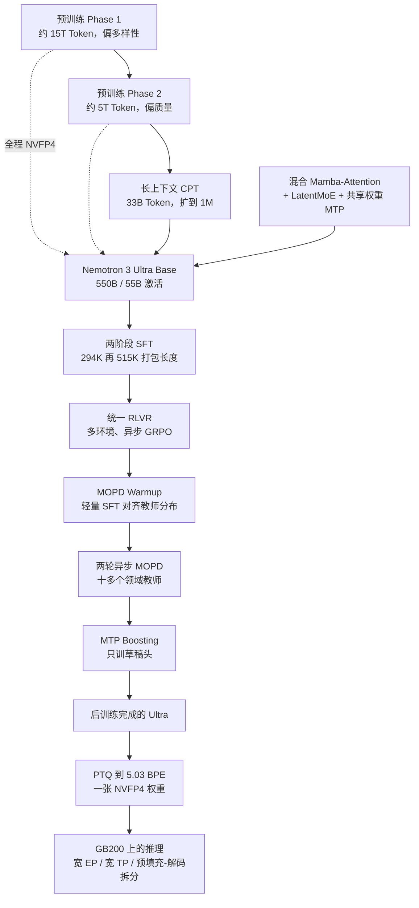
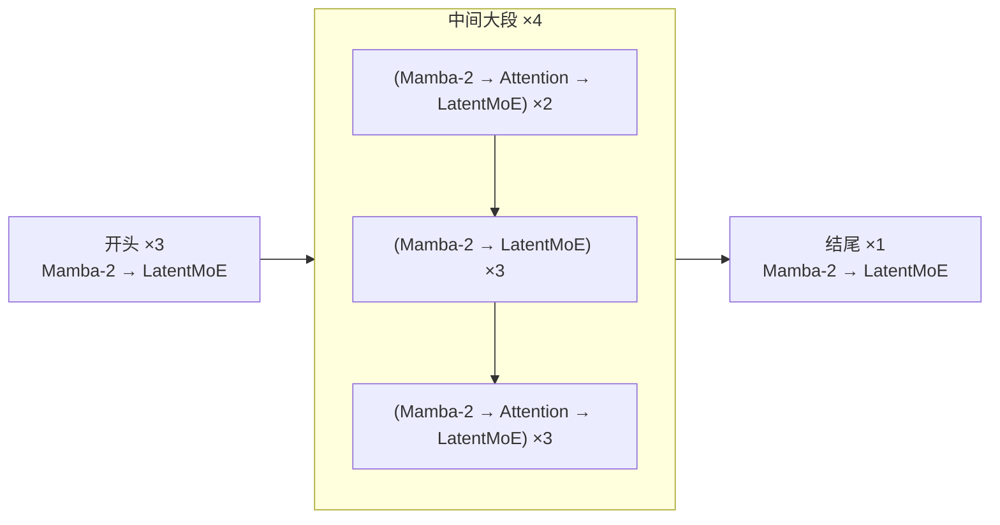
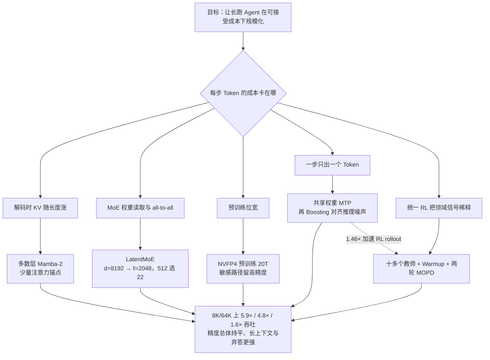

# Nemotron 3 Ultra：550B 只激活 55B，把长跑 Agent 的吞吐做进精度前沿

<!-- release-date: 2026-06-04 -->

> 本文依据 NVIDIA 发布的 **Nemotron 3 Ultra: Open, Efficient Mixture-of-Experts Hybrid Mamba-Transformer Model for Agentic Reasoning**，即本地 `papers/NVIDIA/Nemotron-3-Ultra.pdf`（封面 2026-6-9，65 页），官方 PDF https://research.nvidia.com/labs/nemotron/files/NVIDIA-Nemotron-3-Ultra-Technical-Report.pdf。截至 2026-09-10 核验过该 URL，本地文件与官方 PDF 一致。页码均指这份 PDF。网页产品页、家族页和 LatentMoE 独立页只作伴随材料。全文把三件事分开标注：**报告明确写了什么**、**我们如何解释或验算它**、**哪些是外部资料补充**。

## 先说清楚这是一份什么文件

这份 PDF 一共 65 页。正文到第 51 页的结论，接着是贡献者名单、参考文献，附录 A 从第 64 页讲后训练评测协议和 harness 鲁棒性。封面日期是 2026-6-9；arXiv 上对应预印本是 [arXiv:2606.15007v1](https://arxiv.org/abs/2606.15007)，2026-06-12 提交。本文以 NVIDIA Research 放出的这份 65 页 PDF 为准，不拿 arXiv 页码。

它不是 2025 年 12 月那份 13 页家族白皮书的加长版。白皮书当时只上线了 Nano，Super 与 Ultra 还在「后续数月」。本篇是 **Nemotron 3 Ultra 这一具名模型自己的技术报告**：550B 总参数、每 Token 激活 55B，把白皮书里押在大模型上的 LatentMoE、NVFP4、MTP 真正训到这个规模，并且把后训练从「连续多段 RL」改成了 **SFT + 统一 RLVR + 多教师在线策略蒸馏（MOPD）**。

读它的正确姿势是：**这是一本施工手册，不是一张地图。** 架构表、数据配比、超参、两次预训练发散、教师清单、量化逐算子精度、GB200 上的吞吐对比，都在这份 PDF 里。它仍然会把一部分机制细节指到前作：混合架构「与 Super 相同」、NVFP4 recipe「与 Super 相同」、LatentMoE 引用 Elango 等人 2026 的独立工作。指过去的部分，本文标成外部补充，不冒充 Ultra 正文。

报告自己给出的目录可以还原成：

| 章 | 内容 | PDF 页 |
|---|---|---|
| §1 引言 | 550B/55B、吞吐对比、开源清单 | p.1–3 |
| §2 预训练 | 架构、NVFP4、数据、超参、1M 上下文、基座评测、稳定性 | p.3–14 |
| §3 后训练 | SFT、RLVR、MOPD、MTP Boosting、思考预算、RL 基础设施、后训练评测 | p.15–40 |
| §4 量化 | BPE 扫描、FP4 算法、最终 recipe、SSM cache、一张 NVFP4 权重 | p.41–47 |
| §5 推理 | 预填充 / 解码两种负载、超大规模并行与拆分 | p.48–51 |
| §6 结论 | 一句话收束 | p.51 |
| 附录 A | 若干评测协议、harness 矩阵 | p.64–65 |

## 阅读前的最小词汇表

后面会反复出现这些词，先用人话过一遍。

- **Token（词元）**：模型读写文本时的基本小块。
- **KV Cache（Key-Value Cache，键值缓存）**：注意力层把已经读过的位置留下中间结果，生成下一个 Token 时不必从头重算。它随上下文变长而变大。
- **MoE（Mixture-of-Experts，混合专家）**：把一层前馈网络拆成很多个「专家」小网络，每个 Token 只让其中几个干活。参数可以很多，单次计算量却不用同比增长。
- **Mamba-2**：一种状态空间模型。它不保存全部历史，而是维护一个**固定大小**的状态，读一个 Token 就更新一次。
- **LatentMoE（潜空间混合专家）**：路由专家不在模型的隐藏维度里算，而先把 Token 投影到更窄的潜空间再分发、计算、收回。
- **MTP（Multi-Token Prediction，多 Token 预测）**：一次前向不只预测下一个 Token，还顺带预测后面几个，推理时拿来做投机解码的草稿。
- **NVFP4**：NVIDIA 的 4 位浮点格式。元素是 E2M1，再配块级缩放。
- **RLVR（Reinforcement Learning with Verifiable Reward，可验证奖励的强化学习）**：奖励来自程序或环境能判定对错的信号，而不是只靠另一个模型打分。
- **MOPD（Multi-teacher On-Policy Distillation，多教师在线策略蒸馏）**：学生自己生成轨迹，多个领域教师在这些轨迹上给稠密的 Token 级监督。
- **Agentic（智能体式）**：模型不是回答一句就结束，而是反复调工具、读结果、再决定下一步。一次任务可能跑几十上百轮，输出往往很长。

## 一句话先说清

Nemotron 3 Ultra 要解决的矛盾不是「再堆一个更大的模型」，而是：

> **长跑 Agent 的成本结构已经被改写了：真正贵的是每一步都要读很长的历史、吐很长的思考。如果每张 GPU 每秒吐不出足够的 Token，精度再高也规模化不了。**

报告开篇把这个场景写得很直白：应用已经从聊天机器人变成能自己写代码、做研究、做完复杂任务的长程 Agent，这时候「快而省的推理」变成一等需求（PDF p.1）。Ultra 的回答是三件事叠在一起：

1. **混合 Mamba-Attention MoE** 把大多数层的记忆从「随长度线性膨胀的 KV Cache」换成「固定大小的状态」，再用稀疏注意力做高保真路由；
2. **LatentMoE + MTP + NVFP4** 分别砍专家通信、解码步数和训练 / 推理位宽；
3. **SFT → 统一 RLVR → 两轮 MOPD** 专门补 Agent 需要的长程工具使用，而不是只刷单轮推理题。

它给出的主数字是：在 8K 输入 / 64K 输出这个偏解码的设置上，相对 GLM-5.1-754B-A40B、Kimi-K2.6-1T-A32B、Qwen-3.5-397B-17B，吞吐分别是 **5.9×、4.8×、1.6×**，精度「大致持平」（PDF p.1）。摘要里把同一件事说成「最高约 6 倍」（PDF p.1）。后文会看到，这组倍数有明确的负载条件和测量口径，换到预填充很重的负载上，结论会反过来。

## 全景：一条从 20T Token 到一张 NVFP4 权重的流水线

先把报告自己的系统图画出来。下面这张图是根据 PDF p.1 的训练叙述、p.15 图 9 的后训练流水线、以及 §4–§5 的量化与推理重画的**机制示意**，不含实测时长。

开源清单在引言末尾（PDF p.2–3），报告写明放出：

| 类别 | 报告给出的对象 |
|---|---|
| 权重 | Base BF16、后训练 BF16、后训练 NVFP4、RLHF 用的 GenRM |
| 新预训练数据 | Code-v3（173B GitHub Token，截到 2025-09-30）、Legal-v1、Specialized-v1.2 |
| 后训练数据 | Nemotron-Posttraining-v3 |
| Recipe | [NVIDIA-NeMo/Nemotron](https://github.com/NVIDIA-NeMo/Nemotron) |

产品页还多列了几个 Hugging Face 链接，那是网页伴随材料，不是 PDF 正文的一部分。

## 核心设计一：混合 Mamba-Attention MoE，108 层里注意力只是锚点

### 旧问题：Agent 的生成账单，跟聊天不是同一种账

标准 Transformer 每吐一个 Token，都要回头看全部历史。为了不重算，历史的 Key 和 Value 进 KV Cache。上下文从几千拉到一百万时，每生成一个字都要把这一大坨缓存从显存读一遍。瓶颈从算力变成**内存带宽**。

长跑 Agent 把这件事放大到极致：输入已经很长，输出往往更长。一次终端任务、一次仓库修补、一次带搜索的调研，解码步数动辄上万。报告后文把 8K/64K 选成主对比点，不是随便选的，这个点就是「历史不短、输出很长」的 Agent 负载。

### 新设计：大多数层只维护一份固定大小的状态

Ultra 用的是和 Nemotron 3 Super 相同的混合 Mamba-Attention MoE，只是规模扩到 550B 总参数、每 Token 激活 55B（PDF p.3）。三种层的分工，报告自己的推理节写得很清楚（PDF p.48）：

- **Mamba-2**：预填充时序列长度是亚二次的，解码时 KV 占用有上界，因为状态大小固定；
- **稀疏的全局注意力锚点**：需要把任意两个位置精确连起来时才上场；
- **LatentMoE**：用隐藏维度换更多路由专家，推理成本几乎不涨。

可以这样对比：注意力像逐字翻全部会议纪要；Mamba-2 像只维护一份不断更新的会议摘要。摘要会丢细节，所以必须留一些注意力层做「高保真全对全路由」。这是我们的类比，不是报告原话；报告原话是 hybrid Mamba-2 stack with sparse global Attention anchors（PDF p.48）。

### 工作机制：图 2 的块模式 + 表 1 的尺寸

图 2 给出层模式（PDF p.3）。从左到右是：

这是根据 PDF p.3 图 2 重画的**结构示意**，不含时间或性能数据。注意力不是均匀撒开的：开头和结尾都是纯 Mamba-MoE，注意力集中在中间那段重复结构里。

表 1 给出关键尺寸（PDF p.4）：

| 配置 | Nemotron 3 Ultra |
|---|---:|
| 总层数 | 108 |
| 模型隐藏维度 $d$ | 8192 |
| 查询头 / KV 头 | 64 / 2 |
| 头维度 | 128 |
| Mamba 状态维 / 组 / 头 / 头维 | 128 / 8 / 256 / 64 |
| 路由专家中间维 | 5120 |
| 共享专家中间维 | 10240 |
| 每层专家数 | 512 |
| 每 Token 激活专家（Top-$k$） | 22 |
| MoE 潜空间维度 $\ell$ | 2048 |
| MTP 层（共享权重） | 2 |

几件必须当场读出来的事：

1. **GQA 非常狠**。64 个查询头共用 2 个 KV 头，相当于 32:1。注意力层本来就少，KV 头再压到 2，解码时要搬的注意力缓存进一步变小。
2. **潜空间是隐藏维度的 1/4**。$8192 / 2048 = 4$。报告后文说 LatentMoE「用隐藏维度换更多路由专家」（PDF p.48），这个 4 倍就是那笔账的比例。
3. **MTP 两个头共享参数**。每个头是一层注意力加一层 MoE，共享是为了自回归草稿更稳（PDF p.3）。

**一个从图上数不出来的缺口。** 表 1 写总层数 108。若把图 2 每个色块当一层来数：开头 $3 \times 2 = 6$，中间一次 $2\times 3 + 3\times 2 + 3\times 3 = 21$、重复 4 次得 84，结尾 2，合计 92，对不上 108。报告没有给逐层清单，也没有解释这个差。后文「最后 15% 的网络（16 层）」按 $16/108 \approx 14.8\%$ 倒是对得上 108（PDF p.3–4）。所以本文只把 **108** 当作报告明确写出的深度，块模式按图描述，不把 92 写成官方层数。

### 收益：解码变便宜，精度仍靠稀疏注意力和 MoE 容量

混合架构的收益出现在两条线上。

基座评测表 2 显示，550B-A55B Base 在知识、数学、代码、多语言和长上下文上全面强于当时公开的 DeepSeek-V3.2-Exp-Base、Mistral-Large-3-675B-Base、Kimi-K2-Base、GLM-4.5-Base（PDF p.10）。最能说明「混合没有把长上下文做坏」的是 RULER：64K 为 95.30，128K 为 92.49，256K 为 86.22，512K 为 84.54，1M 为 76.83。对照模型在 256K 之后大多是空缺，GLM-4.5-Base 在 64K 已经掉到 16.12、128K 为 0（PDF p.10）。

后训练之后，图 1 右半边给出 8K/64K 的相对吞吐：Ultra NVFP4 为 5.9，GLM-5.1 为 1.0，Kimi-K2.6 为 1.2，Qwen-3.5 为 3.7（PDF p.2）。$5.9 / 1.2 \approx 4.92$，报告写成 4.8×；$5.9 / 3.7 \approx 1.59$，报告写成 1.6×（PDF p.1）。这是我们按图 1 柱高做的验算，和引言一致。

### 代价与边界

报告自己在 §5.1 把边界写出来了（PDF p.48–49）。预填充是计算受限，代价跟**激活参数**走；Ultra 激活 55B，Qwen-3.5 激活 17B，报告估算大约 3.2 倍 FLOPs 惩罚。所以在 50K 输入 / 2K 输出这种预填充很重的负载上，Ultra 相对 GLM 是 3.9，Qwen 是 4.6，Ultra **落后**（PDF p.49 图 15）。大 batch 解码时几乎所有专家都会被点到，代价改跟**总权重 I/O** 走，550B 对 397B 大约只剩 1.39 倍差距，这时 Mamba-2 每步代价不随长度涨，Ultra 才反过来领先。

另外，图 1 的吞吐口径不是「同一套引擎、同一个开关」（PDF p.2）：Ultra 用 TensorRT-LLM，对照用 vLLM；各模型开或关投机解码，取各自最好的数；精度都是 NVFP4，卡都是 GB200，指标是最大吞吐下的 output tokens/s/GPU。**5.9× 支持的是这个特定测量协议，不是任意框架上的端到端延迟。**

### 可迁移启发

> **先确认产品的负载是解码重还是预填充重，再决定把钱花在「减少逐步 KV」还是「减少每 Token FLOPs」。**

Ultra 把主对比点放在 8K/64K，是因为它认定 Agent 的贵在长输出。如果你的系统其实是 RAG 预填充、短回答，这份架构的优势会缩小，甚至变成劣势。同一套混合骨架，在两种负载下会给出相反的排名——报告用图 15 把这件事写死了。

## 核心设计二：LatentMoE —— 把专家搬进 2048 维，512 个专家只点 22 个

### 旧问题：MoE 在真实服务里，卡的常常不是 FLOPs

标准 MoE 的卖点是「少激活几个专家，用很低的计算换很多参数」。服务阶段却经常不是这样。延迟优先时，每步要把专家权重从 HBM 读出来；吞吐优先时，要把 Token 在 GPU 之间 all-to-all 分发。两条路径都跟**被路由的向量有多宽**有关。

Ultra 正文没有重新推这两条公式。它只说自己用了 LatentMoE，并且在推理节把它概括成：在固定推理成本下，用隐藏维度换更多路由专家（PDF p.3、p.48）。表 1 给出的实现数字是：隐藏维度 8192，潜空间 2048，512 个专家，Top-$k$ 为 22（PDF p.4）。

### 新设计：路由载荷和专家计算进潜空间，路由器留在原维度

**以下机制来自报告引用的 LatentMoE 独立页，标成外部补充，不是 Ultra PDF 的逐句原文。** [LatentMoE 项目页](https://research.nvidia.com/labs/nemotron/LatentMoE/) 把做法写成三步：

1. 每个 Token 先从 $d$ 投影到 $\ell$；
2. 分发、专家计算、合并都在 $\ell$ 维里做；
3. 结果再投影回 $d$。

路由器仍然看原始隐藏状态，共享专家也留在 $d$ 维。Ultra 表 1 的共享专家中间维 10240，是路由专家中间维 5120 的两倍，和「共享专家不进潜空间、宽度更大」这一设定对得上。这是我们按表 1 做的对照，不是 PDF 自己写的推导。

按 $d / \ell = 4$，通信量和专家权重读取都大约缩小 4 倍；省下的预算用来把专家变多、Top-$k$ 变大。家族白皮书里 8B 激活的对照实验用的就是 128 专家 / Top-6 对 512 专家 / Top-22，和 Ultra 表 1 的 512 / 22 同构。**那组 8B 数字属于白皮书，不写进 Ultra 的「报告写了什么」。** Ultra 自己没有再做一组「标准 MoE vs LatentMoE」的同规模消融。

### 收益与代价

收益是表达力：同样的服务成本下，专家组合空间变大。代价是多了一对上下投影，以及潜空间不能压过任务需要的特征秩。独立页把「不要压过特征秩」列为设计原则之一；Ultra PDF 没有讨论 $\ell = 2048$ 是怎么选的。量化节则从反面给了一条证据：潜空间投影被留在 BF16，因为量化后精度损失压不过推理收益（PDF p.43）。这说明这条路径对表示质量敏感，不能当成可以随便降精度的边角。

### 可迁移启发

> **瓶颈公式里哪个变量只出现在成本侧，就动哪个。**

LatentMoE 的迁移价值不在「再做一个 2048 维潜空间」，而在先写出：通信跟 $K \times d$ 走，非线性预算跟 $K \times m$ 走，然后只压缩 $d$。路由器、共享专家、注意力投影这些「不是带宽大头、但对选择质量敏感」的路径，反而要留在高维。Ultra 后来的 PTQ recipe 也沿用了同一判断：路由专家进 NVFP4，潜空间投影和注意力线性层留 BF16（PDF p.41 表 12）。

## 核心设计三：MTP —— 一次搬运多带几个草稿，训练和推理都要用

### 旧问题：为了一个 Token，要把整份权重搬一遍

自回归解码在小 batch 时几乎总是内存带宽受限。每步的固定开销是「把模型权重读一遍」，产出却只有一个 Token。投机解码的经典做法是另训一个小草稿模型；那又多一个要维护的模型。

### 新设计：共享权重的 MTP 头，训练贯穿全程，推理当原生草稿

Ultra 在预训练就带两个共享权重的 MTP 头（PDF p.3）。损失缩放系数 0.1，两个头各 0.05（PDF p.12）。SFT 阶段仍保留这个辅助目标（PDF p.15）。推理时 MTP 头从主干隐状态递归地提出 $k$ 个候选，主干一次前向验证（PDF p.32）。

报告强调一个 Super 就用过、Ultra 继续用的细节：**两个头共享参数，是为了自回归打草稿更稳**（PDF p.3）。草稿不是「第二个独立模型」，而是同一套头滚几步。

### 工作机制：训练分布和推理分布并不一样，所以要做 MTP Boosting

这是 Ultra 相对「只在预训练里加 MTP」多出来的一节（PDF p.29–30）。

教师强制训练时，第 2 步 MTP 看到的是上一步 MTP 自己产的整段移位隐状态。推理时却不是这样：新状态在生成时仍在看主干的 $(h_1,\ldots,h_n)$，后面几步会越来越多地混进 MTP 自己的噪声隐状态。草稿越深，接受率越差。这是报告写明的训练-推理分布错位（train-inference mismatch）（PDF p.29）。

MTP Boosting 的做法（PDF p.29–30）：

- 从 MOPD 检查点出发，**冻住主干，只更新 MTP 头**，避免把已经训好的 Agent 能力训回退；
- 前向时，第 $k$ 步的输入隐状态从第 $1,\ldots,k-1$ 步的隐状态里采样，而不总是取上一步，让训练见到推理时那种噪声；
- 损失改成对主干 logits 的温度缩放前向 KL，关掉对金标 Token 的交叉熵，让头去拟合主干的完整分布而不是 one-hot。温度 $T=2$，MTP 步数 $N_{\mathrm{mtp}}=7$（PDF p.30）：

$$\mathcal{L}_{\mathrm{MTP}}(\theta)=\frac{T^{2}}{N_{\mathrm{mtp}}|\mathcal{A}|}\sum_{k=1}^{N_{\mathrm{mtp}}}\sum_{t\in\mathcal{A}}D_{\mathrm{KL}}\bigl(\sigma(z_{t+k}/T)\,\big\|\,\sigma(z^{\mathrm{mtp}_{k}}_{t+k}/T)\bigr)$$

其中 $\mathcal{A}$ 是 assistant Token 位置，$\sigma$ 是 softmax。数据是 MOPD 检查点对通用和 Agent 种子提示、温度 1 采的 on-policy rollout，训 12K 步、全局 batch 64、序列截到 8K（PDF p.30）。

### 收益

表 6 在 SPEED-Bench 质量划分上、草稿长度 7，报告平均接受长度：基线 MTP 为 4.387（采样 4.165），Boosting 后为 4.584（采样 4.331），与 Qwen3.5-397B-A17B 的 4.580 持平，明显高于 DeepSeek-V4-Flash 的 2.667（PDF p.30）。相对加速从摘要任务的 3.15% 到代码任务的 5.82%。主数字是贪心解码，括号里是温度 1。

训练侧，MTP 还被拿去加速 RL 的 rollout。图 12：$k=5$ 时平均每步 rollout 生成时间是无 MTP 的 1.46 倍快；加速集中在最长尾的那些轨迹上（PDF p.32）。原因是长轨迹 Token 更多，而且它们往往在 batch 末尾、并发已经降下来，投机解码这时最划算。

推理侧，图 16 在单用户、ISL/OSL/BS = 10K/16K/1、单节点 GB200、TP=4 上扫草稿长度，峰值在 DL=6，相对无 MTP 为 **2.89×**，再加长会因为验证开销超过边际接受收益而回落（PDF p.50）。

混合模型还有一个纯注意力没有的问题：草稿被拒时，Mamba 的 SSM 状态是每个序列一个固定槽、每步覆盖写，回不到更早的 Token。Ultra 的做法是**每一步草稿都给 SSM 状态做快照**；同一机制再放粗，就能给 Mamba 做跨请求前缀缓存（PDF p.48）。

### 代价与边界

- 大 batch 时每步成本被计算主导，验证开销会吃吞吐，这时要降低草稿长度甚至关掉 MTP（PDF p.48）。草稿长度被做成部署时旋钮，不是训练时写死的常数。
- Boosting 只改头、不改主干，所以它提高的是接受长度，不是 Agent 精度。表 6 没有声称 Boosting 让 SWE-Bench 涨分。
- 预训练里 MTP-2 的损失对输出层精度极其敏感：第一次发散就是因为输出层本地梯度累加从 FP32 降到 BF16，MTP 对共享输出层的 $wgrad$ 贡献在 7 位尾数里被丢掉（PDF p.12）。辅助头不是「加了就免费」。

### 可迁移启发

> **草稿头要按推理时的噪声来训，不能按教师强制的干净移位来训。**

更一般的句子是：任何「训练用教师强制、推理用自回归」的附加头，深度一加大概率会在某一步开始条件分布错位。Ultra 的修复很便宜——冻主干、只训头、把输入改成「从历史草稿状态里采样」——对别的投机解码头、扩散草稿、甚至检索草稿都适用。

## 核心设计四：NVFP4 预训练 —— 到 20T 仍然主要在 4 位上跑

### 旧问题：4 位能不能从「能跑几百 B Token」变成「能跑 20T」

把预训练从 BF16 或 FP8 再压到 FP4，省的是通信、存储和矩阵乘吞吐。风险是量化噪声在万亿 Token 尺度上累积，训练损失悄悄漂走，或者直接发散。Ultra 说，据他们所知，这是迄今最大规模、仍然稳定且准确的 NVFP4 训练演示（PDF p.4）。

### 新设计：主体走 NVFP4，敏感路径留高精度

recipe 与 Super 相同（PDF p.3）。NVFP4 层用 E2M1，权重做二维块量化，wgrad 的输入做随机 Hadamard 变换，梯度做随机舍入。以下路径留在更高精度（PDF p.3–4）：

- 网络最后 15%，即 16 层；
- Mamba 的输出投影；
- 潜空间投影；
- QKV 与注意力投影；
- MTP 层；
- 嵌入层。

矩阵乘走 Transformer Engine 开源的 cuBLAS NVFP4 GEMM，覆盖 fprop、dgrad、wgrad（PDF p.3）。

### 证据：BF16 旁路说明量化噪声不是第一次发散的原因

他们从 5T、10T、16T 检查点把所有张量切回 BF16，再各训 74B Token，看相对训练 loss（PDF p.4 图 3）。三段旁路开头 5B Token 的平均 gap 分别是 0.27%、0.28%、0.25%；74B 之后，5T / 10T 的 gap 升到 0.33% / 0.34%，16T 反而降到 0.03%。平均低于 0.4%，并且低于他们在更小模型上见过的 NVFP4–BF16 gap（PDF p.4）。

图 3 下半幅更关键：从 16T 切回 BF16 **并没有修好** §2.7 的第二次发散（PDF p.5）。所以第二次发散不能简单归咎于 4 位格式。

### 代价

高精度旁路不是装饰。最后 16 层、注意力投影、潜空间投影、MTP、嵌入，都是「量化了就伤精度、而它们又不是计算大头」的路径。这和 LatentMoE 的分层降本是同一判断在精度轴上的版本。

报告没有给出 20T NVFP4 相对「全程 BF16 训一个 550B」的墙钟或能耗账单。0.4% 以下的 loss gap 是代理指标，不是端到端精度等价证明。

### 可迁移启发

> **低精度要先保护「每步都碰、而且没有稀疏性挡着」的那几条路径。**

输出层、嵌入、注意力投影、潜空间投影，都是每个 Token 必经、而且宽度并不特别大的矩阵。它们对数值格式的敏感度高于「512 选 22」的路由专家。Ultra 后来做 PTQ 时，又一次做出几乎相同的选择。

## 数据与 20T Token：先多样性，再质量，再加 33B 的 1M 上下文

### 课程，不是一锅炖

学习率是 Warmup-Stable-Decay，总视野 20T Token（PDF p.8–9）：前 200B warmup 到峰值 $2.5\times 10^{-4}$，最后 5T 按 minus-sqrt 衰减到 $2.5\times 10^{-6}$。数据同样切两段（PDF p.8）：大约 15T、占预训练约 75% 的 Phase 1 偏多样性，之后 5T 的 Phase 2 偏质量。图 4 给出两段配比（PDF p.9）。

高质量过滤和合成网页是最大头：Phase 1 约占 49%，Phase 2 约占 38%（crawl-medium / medium-high / high 以及对应的 syn-crawl）。其余包括 FinePDFs、数学、代码、Nemotron-CC-Code、Wikipedia、学术、法律、11 种语言的多语数据、Crawl++（OpenWebText、BigScience、Reddit），以及 sft-code / sft-stem / sft-general 这类合成 SFT 风格数据（PDF p.8）。多语列表是阿拉伯语、中文、法语、德语、希伯来语、印地语、意大利语、日语、韩语、葡萄牙语、西班牙语。

MTP 损失缩放 0.1；其余超参与 Super 相同（PDF p.9）。预训练过程中用离线检查点合并做分析，滑动窗口 500B Token、检查点间隔 25B，权重按学习率衰减来模拟。最终选的是 500B 窗口、在知识 / 数学 / 代码之间比较均衡的一版，再送进长上下文阶段（PDF p.9）。

### 相对 Super 新加的数据，报告写了消融

§2.3 只讲「自 Super 以来新加、并公开」的部分（PDF p.4）。

| 数据集 | 报告写了什么 | 消融证据 |
|---|---|---|
| Code-v3 | 从 GitHub 新切 173B Token，截止 2025-09-30 | 没有单独消融数字 |
| Multiple-Choice / Generative | 用公开训练集当种子合成问答，不用测试集 | 某 Nemotron 家族检查点上 100B Token 的 phase-3 CPT：MMLU-Pro 64.8→66.6，平均代码 73.2→75.1，常识 72.9→74.5，GPQA 30.8→41.9，数学 87.6→87.9（PDF p.6） |
| Fact-Seeking | 从 Finewiki 抽事实再生成问答 | 在 Nano 中间检查点最后 100B 注入，SimpleQA 代理分 40.24→50.16；题目被改成选择题，不能直接比原始 SimpleQA（PDF p.6） |
| Moral-Scenarios | 把已有道德情景题做成思维链版 | 没有单独消融 |
| Legal-v1 | 法规、判例、合同、ToS 等抽取 + 合成 | 从 Nano 14.9T 检查点再训 100B，LegalBench 代理平均 64.6→74.7（PDF p.3、p.8） |

这些消融都跑在 **Nano 或更小的家族检查点** 上，不是 550B 本体。报告没有说 550B 上再做一遍同样的加减法会得到相同的点数。法律那组从 64.6 到 74.7，是「小模型、短续训」上的存在性证据，用来论证这批数据值得加进 Ultra 的配比。

### 长上下文：92% 的迭代在 1M，8% 回到 4K

LC-Phase 是预训练末尾的持续预训练（PDF p.9）。恒定学习率 $2.5\times 10^{-6}$。并行：上下文并行 32、张量并行 8、专家并行 128、流水线并行 2，跑在 GB200。混合是 46% 长上下文数据 + 54% Phase 2 数据；长上下文里除了 Super / Nano 用过的文档 QA，还加了长上下文 SFT 风格数据。**配比里没有 RULER 风格数据。**

92% 的迭代在 1,048,576 Token 上训，8% 在 4,096，而且同一次迭代不混两种长度。每次迭代固定 25,165,824 个 Token。4K 迭代只放数学和代码 SFT 风格数据，报告说这样最能保住短基准、同时拿到强 RULER。LC-Phase 一共 33B Token（PDF p.9）。

基座 RULER 1M 的 76.83 是这一阶段的产物（PDF p.10）。后训练之后同一指标涨到 94.7（PDF p.38 表 10）。报告没有把这个涨幅拆成「长上下文 SFT」还是「RL / MOPD」的贡献。

### 可迁移启发

> **长上下文阶段不要只喂长数据。**

Ultra 明确用 8% 的 4K 迭代、而且只放数学和代码，来对抗「一拉到 1M 短任务就掉点」。另外一条是：RULER 分数可以很高，但训练配比里可以完全没有 RULER 风格数据。想测真实长程能力，就不要在训练里直接刷测试形态。

## 预训练稳定性：第一次查清了，第二次没有

§2.7 是这份报告里最有工程含量的章节之一。他们观察到两次发散，共同特征是训练交叉熵和 $wgrad$ 的 L2 同时上升（PDF p.11–12 图 5）。

**第一次，约 8T Token。** 原因定位到输出层本地梯度累加从 FP32 降到 BF16，目的是让数据并行的梯度在线上走 BF16 以换吞吐。MTP 两个头的损失各乘 0.05，对共享输出层的 $wgrad$ 贡献在 BF16 的 7 位尾数里几乎丢光。图 6 显示 MTP-2 的损失先于主损失开始尖刺（PDF p.12）。回滚到更早检查点、恢复完整 FP32 梯度归约，训练重新稳住。

**第二次，约 16T Token。** 消融发现：回滚到 15T，立刻开始学习率退火（试过 5T 和 10T 衰减视野），可以避免再发散（PDF p.12 图 7）。他们最终做了一个工程决定：把总 Token 视野从原计划砍到 20T。

第二次没有找到「抽烟枪」。他们记录了两个相关现象，并明确写了「相关，不因果」（PDF p.12–14）：

1. **专家不平衡与死专家。** 用 DeepSeek 的 MaxVio 度量峰值负载相对均匀均值的偏离：

$$\mathrm{MaxVio}=\frac{\max_{1\le i\le E}T_i}{\mu}$$

理论上限是 $E/k$。Ultra / Super 为 $512/22=23.27$，Nano 为 21.33（PDF p.13）。每个检查点在训练和验证集上各看约 20 个 iteration、合计 500M Token。Ultra 一开始中位数 MaxVio 为 1.2、最大值 4.8（第一层 MoE）；到 12T，中位数仍约 1.2，最大值涨到约 12，仍然是第一层（PDF p.14）。训练集约 1.2、验证集约更高——Nano 训练 / 验证大约 1.3 / 5，Super 大约 2 / 6。

2. **残差流范数在深度上差了 4 个数量级。** Super 是 3 个数量级，Ultra 是 4 个。Nano / Super 的早期层范数先升后降再稳住，后期层缓慢上升；Ultra 早期层从约 7.5T 开始抬头，11T 附近出现大幅尖刺（PDF p.14 图 8）。作者把它读成信号传播变差、训练不稳定性在增加。

BF16 旁路修不好第二次发散，说明问题不在 NVFP4 本身。报告把 20T 当成「能交差的稳定视野」，没有声称 550B 混合 MoE 在 NVFP4 下可以任意加 Token。

### 可迁移启发

> **辅助损失一旦共享主干上的某块矩阵，这块矩阵的累加精度就要按「最小损失系数」而不是「主损失」来配。**

MTP 系数 0.05 乘上 BF16 的量化步长，梯度可以直接下溢成 0。另一条是：MaxVio 和残差范数不必等 loss 爆炸才看。Ultra 的最大值一路爬到 12 时，中位数仍然平静——只看平均路由会漏掉「第一层已经开始倾斜」。

## 后训练：统一 RL 不够，要把十多个教师蒸馏回学生

后训练是 Ultra 相对 Super「大幅重设计」的部分（PDF p.15）。图 9 的顺序是：Base → SFT → RLVR →（循环）MOPD Warmup + MOPD → MTP Boosting → 最终模型。

### SFT：先 294K，再 515K

两阶段，跟随 Super（PDF p.15）：

| | Stage 1 | Stage 2 |
|---|---|---|
| 打包长度 | 294,912 | 515,000（补到 512K 的长上下文） |
| 全局 batch | 64 | 64 |
| 样本数 | 204,800 | 19,200 |
| 峰值 / 最小学习率 | $1.5\times 10^{-5}$ / $1\times 10^{-6}$ | $1\times 10^{-5}$ / $2\times 10^{-6}$ |
| warmup 样本 | 9,600 | 6,400 |
| MTP | 两层共享权重，每 Token 辅助损失 0.1 | 同左 |

打包用长度感知的 best-fit（PDF p.19）：不截断、不拆对话；包内去重，避免同一 prompt 在同一序列里出现两次；源文件 round-robin 读入。报告把「彻底混匀」写成大规模训练稳定性的前提——按源 shard 直接拼接会造成分布局部性。

SFT 数据覆盖长上下文、推理效率与控制、安全、搜索、终端使用、对话式工具、软件缺陷修复、数学 / 证明、科学、聊天、竞赛代码、CUDA、RTL、多语言（PDF p.15–19）。几条值得记住的数量：

- 安全：Super 的 45K 英文字段，翻译成德 / 西 / 法 / 日 / 意 / 中，回译相似度低于 0.8 的丢掉约 10–15%，最终约 135K（英文约 45K，每种翻译语言约 15K）（PDF p.16）；
- 搜索：保留 Super 的 Wikidata 多跳轨迹；另从 OpenResearcher 抽出商业许可可用的约 21.7K 条（PDF p.16）；
- 终端：约 370K 多轮对话，DeepSeek-V3.2 在 Terminus-2 / Harbor 里当执行 Agent（PDF p.17）；
- 竞赛代码：120 万 Python 推理、100 万 C++14、130 万 Python 工具调用（PDF p.18）；
- CUDA：约 10 万条生成 / 修复 / 优化（PDF p.18）；
- RTL：ACE-RTL 约 120 万条（PDF p.19）；
- 数学：180 万工具调用 + 190 万非工具，另有证明生成 / 验证 / 精炼（PDF p.18）。

软件缺陷修复的轨迹过滤特别具体（PDF p.17）：必须以合法提交结束；禁止 push / pull / fetch / clone 等 git 操作；打击「改-测-改」死循环和只读不改；检查畸形工具调用和最终补丁里的 `print(` / `pdb` / `breakpoint()`；改了代码却从不跑测试的也丢掉。报告承认：原始 rollout 里有很多「任务完成了、但不该让模型学」的行为。

### RLVR：一个阶段覆盖所有环境

SFT 之后是统一的 RLVR，目标包括终端、办公生产力、软件工程、搜索、通用工具调用、数学、代码、STEM、安全、聊天、指令跟随、长上下文 QA、归纳 / 转导推理、结构化输出和通用可用性（PDF p.20）。harness 类环境会换多种实现和交互格式，降低对单一脚手架过拟合。

算法大体是 Super 的异步 GRPO 加稳定性修补，基础设施改动放在 §3.6。全局 batch 8192，每条样本 16 条 rollout。生成长度从 48K 提到后来的 64K（PDF p.20）。数据混合和课程用 Nano 报告里的高斯方法。

报告在这里没有给「RLVR 相对 SFT」的完整大表；那张表出现在 MOPD 结果里，RLVR 是学生起点。

### 为什么还要 MOPD：环境一多，每个领域在 batch 里只剩几条

混合环境 RLVR 能把面铺开，但环境继续增加时，每个领域在一个 batch 里的样本变少，领域信号被稀释，也更难平衡（PDF p.20）。Ultra 的回答是：再训十多个领域教师，每个走自己的数据与训练流水线；然后让学生在所有领域上生成轨迹，由对应教师给稠密奖励。

这就是 MOPD。它不是「把教师的答案当 SFT 再喂一遍」，而是**学生自己采样，教师在学生产生的前缀上打分**。完全在线时，目标是最小化反向 KL $D_{\mathrm{KL}}(\pi_\theta(\cdot|s_t)\,\|\,\pi^{T_i}(\cdot|s_t))$，也就是最大化（PDF p.21）：

$$\mathcal{J}_{\mathrm{MOPD}}(\theta)=\sum_{i=1}^{N}\lambda_i\,\mathbb{E}_{q\sim\mathcal{D}_i,\,y\sim\pi_\theta(\cdot|q)}\Biggl[\sum_{t=1}^{H}\log\pi^{T_i}(y_t|s_t)-\log\pi_\theta(y_t|s_t)\Biggr]$$

和稀疏、依赖环境的 RLVR 奖励不同，这里每个 Token 都有来自教师分布的学习信号。

实际实现是异步的：rollout、教师打分、学习者三条流水线并行。轨迹可能来自过期的行为策略 $\pi_{\mathrm{behav}}$，学习者优化的是更新的学生。他们把行为策略和作为信任域中心的近端策略 $\pi_{\mathrm{prox}}$ 拆开（PDF p.21–22）。稠密蒸馏优势是相对近端策略的采样负反向 KL：

$$\hat A_t=\mathrm{sg}\bigl[\ell^{T_i}_t-\ell^{\mathrm{prox}}_t\bigr]$$

再配行为-近端重要性比率 $c_t$ 和近端-当前比率 $r_t(\theta)$，用 PPO 风格对 $r_t$ 做 clip，Token 掩码用 IcePop（PDF p.22 式 3）。训练最大生成长度 192K，与教师训练中最长的那档对齐；每 batch 1024 条 prompt，每条一条 rollout。消融里多样本没有额外好处（PDF p.22）。

图 10 给出两轮教师清单（PDF p.21）。第一轮：STEM、Chat、指令跟随，加上终端、对话工具、SWE、搜索、办公、可用性、Agent 安全；RLVR 学生自己还当「没有专师的领域」的教师。第二轮从 MOPD1 再长出 Coding、Chat 2、对话工具 2、SWE 2、办公 2，并复用第一轮若干教师，蒸馏成 Ultra Final。

### 教师各自解决的旧问题

报告 §3.3.2 不是一张超参表，而是「每个教师针对哪一种失败模式」（PDF p.22–26）：

- **SWE**：三阶段。先 Agent 数据 SFT，再 PivotRL 做单步环境，最后端到端 SWE-RL，仓库多轮交互后跑隐藏测试、二元奖励走 GRPO。未完成轨迹（打满轮数或超时）掩掉损失；畸形推理和工具调用给负优势。为防作弊读金补丁：开跑前把容器里的仓库改写成「停在 base commit 的新鲜 clone」，未来 commit 物理删除；运行时过滤远程 git 和从 GitHub 网页 / raw / Pages 下载。生成长度 192K，最多 200 Agent 轮（PDF p.22）。
- **办公 / GDPVal 类**：从通用 SFT 后的 Ultra 出发，用 AfterQuery 任务上强模型的完整轨迹做轻量 SFT，再在 MOPD 里用这些轨迹的 pivot 蒸馏（PDF p.22–23）。GDPVal 要的不是「答案对」，而是能读材料、组织中间证据、产出人能接受的交付件。
- **搜索**：Super 没教过上下文管理。Ultra 的搜索教师专门在轨迹里加入 discard-all 重置和摘要压缩，让模型能在官方上下文长度之外「搜得更久」（PDF p.23）。
- **终端**：针对最长一小时的超时任务，用 PivotRL，准确率饱和就重新 profiling（PDF p.23）。
- **对话工具**：在 Super 配方上扩展成有依赖的多步动作，抑制对话 Agent 过早结束（PDF p.23）。
- **可用性**：从结构化 schema 扩到文档抽取、引用格式、自由文本格式；schema 覆盖 JSON / YAML / XML / TOML / CSV（PDF p.23）。
- **Agent 安全**：间接提示注入。用户请求是良性的，读工具返回里藏了针对另一个写工具的攻击。四类：未授权动作、改数据、拒绝服务、数据外泄。红队是 Nemotron 3 Super，防守是 Nano，只留能打穿的攻击。验证器看的是「有没有带着目标参数去调攻击指定的工具」（PDF p.24）。
- **Chat**：政策模型一大就会钻奖励模型的空子。他们在 Ultra SFT 上训了一个更大的 GenRM，输出两个回复的分数和排序；有用户原则时按原则判，没有时按通用有用性。RLHF 只用总体分。多轮迭代：每轮看内部聊天基准的弱点，再补数据；带原则的 GenRM 让他们不用每次重训奖励模型（PDF p.24）。这个 GenRM 就是开源清单里的那份权重。
- **指令跟随与事实性**：在 RLVR 检查点上继续做领域 RLVR，混合指令跟随、弃答、RLHF。弃答奖励动态校准，在准确率和减少幻觉之间找平衡（PDF p.24–25）。
- **STEM / 通识推理**：从表 3 看，教师在 MMLU-Pro（87.7）、LiveCodeBench v6（90.0）、IMOAnswerBench（92.5）、Apex Shortlist（85.4）上达到或超过 DeepSeek V4 Pro High；HLE 32.1 仍低于 V4 Pro 的 34.5，GPQA 88.5 略低于 89.1（PDF p.25）。SFT 混合按 Token 而不是条数：40B 生成 Token 里科学 58.75%、数学 23.63%、竞赛代码 10.13%、通用 7.50%，打包长度同样 294,912（PDF p.26）。RL 阶段故意转向人文和社会学——SFT 之后数理已经很强——结果却是**所有领域都涨**，不只非 STEM（PDF p.26）。这是作者观察，对照是「同一套 RL、更小 batch（prompt 128、全局 2048）」。
- **竞赛代码教师**：在通识推理教师之上再做 Competitive Coding RL，只留「通识教师 8/8 条 rollout 还没全对」的 3.5K 题，LiveCodeBench v6 再 +2.4（PDF p.26）。

### Warmup：教师和学生若 SFT 分布不同，MOPD 会蒸馏到空气里

关键发现：教师若走了和自己完全不同的 SFT，直接 MOPD 合并不好使（PDF p.27）。作者的假设是：学生轨迹对教师过分布，教师打分不可靠。实践里教师和学生是并行开发的，这个问题一定会发生。

解决办法是 MOPD 前做一次**非常轻的 SFT**，数据来自教师的训练分布，让学生的推理轨迹落到教师支持里。规模故意做小，以免在无关领域上退步；退了的点后面 MOPD 再捞回来。

表 4（PDF p.27）：

| 基准 | 学生 | 有 Warmup 的 MOPD | 无 Warmup | 教师 |
|---|---:|---:|---:|---:|
| GDPVal | 28.9 | 46.7 | 35.3 | 49.5 |
| BrowseComp | 31.0 | 44.4 | 33.0 | 51.0 |
| HLE（无工具） | 25.6 | 26.7 | 26.3 | 32.1 |

Agent 域上 Warmup 几乎是在「能不能蒸馏」和「白跑一趟」之间做选择；HLE 上可有可无。后文把这个差异解释成：HLE 上教师的优势来自学生没见过的离线 SFT/RL 数据，不是对「学生已经会采样的轨迹」的不同偏好。

### 结果：Agent 域回收率高，自包含推理回收率低

表 5 是全文最重要的后训练表（PDF p.27）。回收率定义为 $(\mathrm{MOPD2}-\mathrm{RLVR})/(\mathrm{Teacher}-\mathrm{RLVR})$。

| 基准 | SFT | RLVR | MOPD1 | MOPD2 | 教师 | 回收率 |
|---|---:|---:|---:|---:|---:|---:|
| Terminal Bench 2.0 | 34.5 | 44.5 | 50.8 | 54.0 | 50.0 | 172.7% |
| GDPVal | 23.2 | 28.9 | 46.7 | 46.7 | 49.5 | 86.4% |
| SWE-Bench Verified | 63.5 | 65.8 | 70.1 | 71.7 | 72.5 | 88.1% |
| TauBench Telecom | 55.7 | 82.7 | 91.2 | 92.9 | 94.0 | 90.3% |
| BrowseComp | 14.3 | 31.0 | 41.0 | 44.4 | 51.0 | 67.0% |
| LiveCodeBench v6 | 85.5 | 87.4 | 90.0 | 89.0 | 92.4 | 32.0% |
| IMOAnswerBench（无工具） | 85.1 | 84.5 | 88.1 | 88.6 | 92.5 | 51.3% |
| HLE（无工具） | 19.7 | 25.6 | 25.9 | 26.7 | 32.1 | 16.9% |
| OmniScience 非幻觉 | 4.8 | 46.3 | 77.9 | 78.7 | 87.0 | 79.6% |
| IFBench（prompt loose） | 62.3 | 78.4 | 80.0 | 81.7 | 83.0 | 71.7% |
| Multi-Challenge | 53.3 | 60.3 | 62.8 | 63.8 | 63.3 | 116.7% |

读这张表时要分开三件事。

**报告明确支持的：** MOPD 在学生已经能采样的轨迹上，能把教师的 Token 级偏好合回来。工具选择、环境交互、弃答、多步执行，这类模式回收率高。有的项甚至超过对应教师（Terminal Bench 172.7%、Multi-Challenge 116.7%），作者解释为跨教师的正迁移，例如办公流程帮到了 Terminal Bench 里的数据科学题（PDF p.28）。

**作者观察：** HLE 回收只有 16.9%，是在线蒸馏设定的限制，不是教师不行。通识教师从学生初始化，但增益来自 DeepSeek-V4-Pro 生成的另一套推理混合上的大规模 SFT+RL。学生没直接见过那些数据。教师的优势也就不是「对学生已有轨迹的不同偏好」，MOPD 最强的那种信号用不上（PDF p.28）。

**未公开 / 未做的：** 他们试过用 top-$k$ 或全词表的分布匹配代替采样 Token 目标，在 Terminal Bench 这类 Agent 基准上不如采样目标（PDF p.28）。没有系统比较「先统一 SFT 再分教师」或「教师先产 SFT 再训学生」这两条更干净的奠基路径，原因是时间和资源（PDF p.29）。长程端到端 Agent 和单轮推理混在同一 MOPD batch 里会因 rollout 时间差极大而浪费算力，实践中大多数 Agent 任务改用类似 PivotRL 的单轮 rollout（PDF p.29）。端到端能否再涨、如何处理分布错位，留作开放问题。

### 可迁移启发

> **蒸馏信号的质量，取决于学生轨迹是否落在教师的支持里。**

这条比「多教师」这个名词更值得带走。教师更强并不自动等于学生能喝到；如果学生根本采样不到教师擅长的那些推理路径，在线蒸馏会变成在错误前缀上匹配一组校准很差的 logits。Warmup 是便宜的对齐；对「能力来自另一份离线数据」的教师，需要对教师数据做离线暴露，而不是加一轮 MOPD。

另一条：环境一多，统一 RL 的边际收益会先被稀释吃掉。这时与其把 batch 做得更大更杂，不如把领域专家做成可插拔的教师，再用在线蒸馏合并。合并步骤本身要有 Warmup，否则专家会互相噪声。

## 推理预算控制：三种思考模式，换的是 Token 不是结构

Ultra 训了三种推理模式：关思考、常规、中等努力。后两种可以叠加推理时预算控制（PDF p.31）。报告把它定位成覆盖准确率-效率整条谱，并和 Agent 的轮数上限这类任务级控制互补。

中等努力在 SFT 引入，RLVR 再优化。约 2.5% 的 RLVR prompt 走中等努力，覆盖数学、STEM 和代码，奖励按长度做调整。同一套 recipe 也训了 Super。效果泛化到训练没覆盖的任务；最终档位靠超参校准（PDF p.31）。SFT 里还有一类样本：推理轨迹被截到随机预算，答案保持不变；相对 Nano / Super 的改动是，截断样本里的 `</think>` **不进 SFT 损失**（PDF p.16）。

图 11：纵轴是 Artificial Analysis Intelligence Index V4，横轴是相对啰嗦程度（以 Qwen 3.5 397B 在 AA Index V4 十个任务上的平均 Token 为 1）。Ultra 中等努力平均大约少用 **2.5 倍 Token**，准确率大约掉 **7%**（PDF p.31）。图上 Ultra 常规模式靠近 GLM-5 / MiniMax-2.7，中等努力明显更左、更低；Super 在图的右下，Token 更多、指数更低。

这张图是作者画的帕累托，不是控制变量消融。横轴的参考模型是 Qwen 3.5，换分母会改相对位置。报告没有给出「预算控制」本身在 SWE-Bench 上的逐档表。

### 可迁移启发

> **思考长度应该是推理时的旋钮，而且必须在训练里见过被打断的样子。**

只在推理时强行插入结束标记、训练从未见过这种截断，模型往往会在截断后胡写。Ultra 把截断样本放进 SFT，并且不让 `</think>` 成为「被截断」的监督目标——避免模型学会「一看到结束标记就当这是完整思考」。这个细节很小，但比「我们支持 budget control」这句营销更可迁移。

## 量化：一张 NVFP4 检查点，Blackwell 走 W4A4，Hopper 走 W4A16

后训练之后做 PTQ，不是再训一遍（PDF p.41）。起点是 Super 上 AutoQuantize 敏感度分析得到的混合精度启发式，再扫有效 bits-per-element（BPE）和 FP4 权重量化算法。

表 12 的逐算子精度（PDF p.41）：

| 层 / 算子 | BF16 基线 | 量化后 |
|---|---|---|
| 嵌入、输出分类、MTP | BF16 | BF16 |
| MoE 路由专家 | BF16 | NVFP4 |
| MoE 共享专家 | BF16 | FP8 per-tensor |
| Mamba mixer 线性层 | BF16 | FP8 per-tensor |
| 注意力线性层 | BF16 | BF16 |
| Latent MoE 投影 | BF16 | BF16 |
| Mamba conv1d | BF16 | BF16 |
| KV cache | BF16 | FP8 |
| Mamba SSM cache | FP32 | FP16 + 随机舍入 |

### BPE：真正有分辨力的轴是长上下文

表 13 在一个固定中间检查点上扫 4.85 到 7.19 BPE（PDF p.42）。SciCode、GPQA Diamond、HLE、IFBench、Omniscience 在整个区间内平坦，变化落在多次重复的噪声里。唯一有台阶的是 AA-LCR：4.85→5.03 时 +2.4，之后到 7.19 都停在 64.2–65.0。这个台阶正好是「在 NVFP4-amax 之上引入混合 FP8 层」。再把预算加到 7.19（多 43% 的 bit）没有任何基准再涨。于是选 **5.03 BPE（NVFP4 + 混合 FP8）** 作为工作点（PDF p.41–42）。

两条报告自己写下的限制是（PDF p.42）：CritPt 在 3%–5% 地板附近、非单调，当噪声；Omniscience 非幻觉率在 4.85 上略高（54.13 对 51.59），他们归为方差而不是精度换准确率。

### 权重尺度：Four-Over-Six 赢在 5.03，输在 4.85

激活仍用 NVFP4 默认的 max 校准。权重试了 max、MSE、Four-Over-Six（PDF p.42–43）。Four-Over-Six 把全局 per-tensor 权重尺度放大 1.75×，每个微块在 $M=4$ 和 $M=6$ 两套 FP4 网格里选重建误差更小的那个。在 49,152 个来自 48 层 MoE 的投影上，相对标准 max，中位相对 MSE 降 16.4%；MSE 校准还能再降 27.1%，但下游没有稳定涨点。最终在 5.03 上选 Four-Over-Six；在更狠的 4.85（连 Mamba 也进 NVFP4）上它掉到 84.71 的中位恢复，而 max 是 98.32——作者认为 Mamba 线性层对离群点敏感，更喜欢 max（PDF p.43 表 14）。

最终 GEMM recipe（PDF p.43）：路由专家 NVFP4，动态 max 激活尺度 + max 校准的 4/6 权重尺度；共享专家和 Mamba 线性层 FP8 per-tensor、静态 max；注意力线性层和 MoE 潜空间投影留 BF16。

### 为什么必须一张权重伺候两代 GPU

Hopper 没有原生 FP4 Tensor Core。直觉上 Hopper 该走 FP8（W8A8）。Ultra 的规模把这笔账翻过来（PDF p.46）：

- BF16 模型大约 1.1 TB，单节点塞不下（PDF p.44）；
- 8×H100（合计 640 GiB）上，FP8 检查点约 540 GiB，每卡只剩约 10 GiB 给激活、KV、Mamba 状态；NVFP4 约 330 GiB，每卡约 40 GiB；
- FP8 的缓存预算把最大 batch 卡死，负载一直停在内存带宽受限，走不到 FP8 Tensor Core 有意义的计算受限区；
- 测到的吞吐-延迟帕累托上，W4A16 全程不低于 W8A8；
- 再叠 MTP：W4 省下的空间让 MTP 权重能跟 8 卡单节点、单 NVLink 域放在一起；FP8 要 MTP 就得扩到两台 H100，丢掉单域。

W4A8 看起来能两头占，但 NVFP4 的 E2M1 + E4M3 块尺度等效 E6M4，范围超过 FP8 的 E4M3，直接把 NVFP4 权重量到 FP8 会饱和、精度崩掉。要保住精度就得 W4→BF16→FP8 绕一圈，每层 GEMM 前多一次 cast。既然纯 W8A8 已经慢于 W4A16，多一次 cast 的 W4A8 只会更差（PDF p.46）。

表 17 把同一张 NVFP4 权重分别当 W4A16 和 W4A4 来跑（PDF p.47）：W4A16 在五任务里四个优于 W4A4（HLE 除外），四个不低于 BF16 1 个点以内（HLE 除外），完成 Token 数也不比 W4A4 更多（Omniscience 除外）。表 18 是最终 BF16 对 NVFP4 大表：Agent 项大多在 1–3 点内，RULER 1M 94.7→94.0，Terminal Bench 2.1 56.4→53.9，BrowseComp 44.4→41.4；IFBench 和若干知识项 NVFP4 甚至略高（PDF p.47）。BF16 用 vLLM 0.17.1，NVFP4 用 vLLM 0.22.0，引擎版本不同，细差不宜过度解释。

### Mamba cache：短序列上它比 KV 还大

图 14：batch=1 时，32-bit Mamba cache 在序列短于 64K 时比 FP8 KV cache 更大（PDF p.44–45）。所以 SSM 状态既是显存占用，也是解码时的 DRAM 读压力。他们先把 cache 从 FP32 收到 FP16 + 随机舍入；8-bit 方案在 Super 上做过仿真（表 16，PDF p.45）。关键观察：尾数精度和随机舍入是保精度的配方；朴素 FP16 最近舍入会让准确率掉约 1%、啰嗦度涨约 10%；随机舍入几乎抹平。块缩放 INT8 + 随机舍入大体保住 FP32；FP8 E4M3 更差。周期性 checkpoint（每 $CC$ 步存一次状态，中间靠激活 replay 往前赶）能减少连续量化次数。当前发布仍用 FP16 + 随机舍入，优化过的 8-bit 内核还在做（PDF p.46）。

这些 8-bit 数字来自 **Super 的仿真**，不是 Ultra 550B 的实测。报告写得很清楚。

### 可迁移启发

> **量化预算要扫的是「哪一类任务还在涨」，不是平均 bit 数。**

Ultra 的 BPE 扫描里，大多数能力在最低档就饱和，多出来的 bit 只买回长上下文。另一条是跨硬件：在 Hopper 这种「HBM 刚好够塞下 FP8、但 cache 只剩渣」的节点上，更窄的权重可能比「理论上算得更快的 FP8」更能把 batch 做上去。第三：NVFP4 不是 FP8 的子集，不能直接 reinterpret_cast。

## 推理：5.9× 从哪来，在哪会吐回去

§5 把架构选择放回真实服务（PDF p.48–51）。Headline 对比在 §1 / 图 1，细节在这里。

### 两种负载，两种赢家

图 15 与图 1 同一套 8K/64K 口径，再加 50K/2K（PDF p.49）。投机解码关掉，NVFP4，GB200 NVL72，最大吞吐，相对 GLM-5.1 归一：

| 负载 | Ultra | GLM-5.1 | Kimi-K2.6 | Qwen-3.5 |
|---|---:|---:|---:|---:|
| 8K/64K（解码重） | 5.9 | 1.0 | 1.2 | 3.7 |
| 50K/2K（预填充重） | 3.9 | 1.0 | 0.9 | 4.6 |

解码重时 Ultra 相对 Qwen 仍是 1.6×；预填充重时 Qwen 领先。报告把原因写死了：预填充跟激活参数走（55B 对 17B，约 3.2 倍 FLOPs），解码大 batch 跟总权重 I/O 走（550B 对 397B，约 1.39 倍），此时序列混合机制成为决定因素，Mamba-2 每步代价不随长度涨（PDF p.48）。

### 超大规模上的并行：小 batch 用宽 TP，大 batch 用宽 EP

550B 单卡放不下。小 batch 绑在权重读取带宽上，宽张量并行把每步 HBM 流量除以 TP 倍数，单条隐状态的 NVLink AllReduce 可以忽略。大 batch 变成激活通信绑，专家并行胜出：卡间流量只剩路由专家块两端的 all-to-all，Attention、Mamba、专家 GEMM 都是 rank 本地，临界路径上没有 AllReduce（PDF p.49）。Ultra 的实践选择：高吞吐用宽 EP，低延迟用宽 TP；有些低延迟点上 TP+EP、Attention/Mamba 再加 DP，比单用更好。宽 EP 必须做负载均衡，因为 all-to-all 是同步的，一个 rank 空转会卡住整组；请求打到当前最空的 worker，热点专家可以跨 EP rank 复制（EPLB）。GB200 NVL72 的 72 卡共享一个 NVLink 域，宽 EP 不必为跨域互联付费（PDF p.49）。

### 预填充-解码拆分必须同时搬走 KV 和 SSM 状态

两种阶段对硬件的压力不同，绑在同一副本上会强迫同一套并行和调度伺候两种负载。拆分是标准答案，但对混合模型要额外保证 KV **和** Mamba SSM 状态都被传对，消费 cache 事件的一方还要分得清这两种。他们把混合 cache 组的语义 KV-event 元数据和多节点 Ray 所需的 NIXL 旁路主机解析修进了上游，vLLM 上混合 Mamba-Attention 的拆分可以开箱即用（PDF p.50）。当前预填充重负载上端到端大约 **10%** 吞吐提升，并预期软件栈成熟后还会再涨。

其它系统数字：

- 专家并行下，路由 all-to-all 在 50K/2K 上约占总运行时间 15–20%。默认 vLLM 方案是 AllGather + ReduceScatter，每个 rank 都拿到全部 Token。换成 FlashInfer 的 NVLinkOneSided，端到端大约 **5%**（PDF p.50）。分析认为 all-to-all 内核本身还有空间。更根本的替代是 DWDP：保持数据并行，把每层专家权重拉到每个 rank，藏在前一层计算后面。
- 预填充切块变大之后，路由专家内核会撞上资源上限——Attention/Mamba 按 DP 分请求，专家内核却要处理所有 DP rank 的 Token 并集。修复是 MoE 侧再切块，已合入 vLLM 上游（PDF p.50–51）。
- 若干（TP、量化、硬件）组合会让每 rank GEMM 形状不满足内核对齐。当前做法是加载时对权重做 padding，运行时忽略 pad 位。报告希望下一代直接把模型内部维度选成对所有预期元组都友好（PDF p.51）。

### 可迁移启发

> **同一模型在预填充和解码上可以、而且应该用不同的并行轴。**

更具体的一条：混合模型的 cache 不是一种对象。任何拆分、前缀缓存、投机回滚，都要为「变长的 KV」和「定长、覆盖写的 SSM 状态」各做一套语义。Ultra 把 SSM 快照做成和草稿步绑定的原语，前缀缓存只是把同一原语放粗——这比给 Mamba 另做一套 cache 体系更干净。

## 后训练基础设施：失败几乎全在生成和沙箱，不在算法

§3.6 不改模型，但决定 MOPD 和 RLVR 能不能在 GB200 上跑完。生产集群是 GB200 + Slurm，沙箱在同机 CPU。失败归因表 7（PDF p.32）：生成引擎失败 / 超时 56%，沙箱 / 工具调用 36%，其它软件 8%。大约 92% 不在损失函数里。

表 8 的优化前后（PDF p.33）：

| 问题 | 之前 | 之后 |
|---|---|---|
| Ray GCS 启动 | 30+ 分钟 | 10 分钟 |
| 检查点阻塞 | 60 秒 | <1 秒 |
| 冷启动 JIT | 38.8 分钟 | 0.4 分钟 |
| 多节点 vLLM 启动 | 25 分钟 | 9.5 分钟 |
| 容器解压 | 2–3 分钟，并有级联失败 | 热节点约 0 秒 |

几条可独立拿走的做法（PDF p.33–36）：

- 多角色启动不要对每个节点发一次 `srun`。Slurm 控制器串行处理 RPC，节点一多就是 $O(n)$。改成一次多节点 `srun` 变成 $O(1)$。
- 3K+ GPU 时 Ray 单线程 GCS 会被 actor 注册打满。短命 actor 改 task、每节点池化初始化 actor，并等 Anyscale 在 Ray 2.55 修 GCS。
- GB200 NVL72 的 NVLink 域是整机柜 72 卡。EP 组一旦跨柜，MoE all-to-all 就掉到 InfiniBand。他们在 `ray start` 前用 `nvidia-smi` 读 ClusterUUID，注册成 Ray 自定义资源，再按 `(domain_min_topo_rank, topo_rank, gpu_id)` 排 bundle。这一项端到端 **+20%**。
- Grace 双插座上 GPU 0/1 属 NUMA 0、GPU 2/3 属 NUMA 1。不绑的话 tokenizer、优化器 offload、pinned memory 会走跨插座。显式绑到本地插座 **+10%**。
- 异步检查点 + 重叠 NCCL 与 D2H + 常驻检查点进程 + 后台 finalize + 缓存分布式 save plan，阻塞从 60 秒降到不到 1 秒。
- JIT 冷启动 38.8 分钟里 FlashInfer cubin 28 分钟、Inductor 5.5、Triton autotune 2、CUDA graph 2.5。解法是共享存储上的持久热缓存、启动时解到节点本地 `/tmp`、FlashInfer cubin 直接打进容器。热启动只剩 0.4 分钟模型加载。
- 44 GB 容器在数千节点同时从共享存储读会打爆存储。Enroot 本地 squashfs 缓存 + 只有一个 sidecar 在作业结束时回写 JIT 缓存。

未来工作针对两个主失败类：快速故障隔离、生成 worker / 沙箱独立重启、沙箱与工具调用拆分、对在飞 rollout / KV / 对话状态做细粒度检查点（PDF p.36）。

这些数字是 **RL 训练基础设施** 的，不是推理 serving 的 5.9×。不要混。

## 实验怎么证明，哪些其实没赢

### 基座：知识、代码、长上下文的存在性证明

表 2（PDF p.10）支持的结论是：NVFP4 预训练 + 混合架构 + 33B 的 1M CPT，得到的 Base 在公开基座里处于第一档。MMLU-Pro 79.07 对下一档的 69.15（Kimi-K2-Base），MATH 82.00 对 68.40，HumanEval 83.84 对 78.20，RULER 1M 只有 Ultra 给了 76.83。GSM8K 上 Mistral-Large-3 和 Kimi-K2 更高（91.21 / 91.05 对 Ultra 的 88.10）。常识几项 Ultra 并不占优，WinoGrande 79.32 低于所有对照。所以「显著更高」是报告对总体的概括，不是每一格都最高。

### 后训练大表：Agent 优先、精度持平，不是全面第一

表 10 对比 MiniMax-2.7、GLM-5.1、Kimi-K2.6、Qwen-3.5、DeepSeek-V4-Pro、DeepSeek-V4-Flash（PDF p.38）。Ultra 列是 550B-A55B。注意表头把 GLM-5.1 写成 **744B-A40B**，引言和图 1 写成 **754B-A40B**（PDF p.1–2、p.38）。报告没有解释这个差，引用时按出现位置标注。

**报告当作设计目标达成的：**

- 长上下文：RULER 1M 为 94.7，对照里只有 Qwen 3.5（90.1）、V4-Pro（94.2）、V4-Flash（87.7）有数，GLM / Kimi / MiniMax 为空，因为最大上下文不够（PDF p.38–39）。
- 可靠性：AA-Omniscience 非幻觉 78.7，是表里最高；V4-Pro 只有 5.7，Qwen 3.5 只有 7.4（PDF p.38）。高非幻觉伴随的是准确率只有 24.1，低于 V4-Pro 的 46.8——Ultra 更会弃答。
- 指令跟随：IFBench 81.7，仅低于 V4-Flash 的 82.0。
- 专业深研：ProfBench（Search）56.0，与 Kimi-K2.6 并列，低于 V4-Pro 的 59.9。
- PinchBench 90.0，距最高 V4-Flash 的 91.3 和 Kimi 的 90.2 很近。PinchBench 和 ProfBench 被明确写成**开发期不用、最终模型只评一次**的留出泛化闸门（PDF p.39）。

**报告写了但容易被产品页抹掉的：**

- SWE-Bench Verified 70.7，低于表里所有对照（GLM 76.2、Kimi 75.7、MiniMax 75.3）。Multilingual 同样不是第一（67.7 对 Kimi 77.1）。
- Terminal Bench 2.1 56.4，低于 Kimi 67.2、GLM 59.3。
- GDPVal 46.7，低于 GLM 54.7、V4-Pro 54.6。
- BrowseComp 44.4，低于 Kimi 61.3、GLM / V4-Pro 59.4。
- HLE 无工具 26.7，低于 Kimi 34.8、V4-Pro 37.7；带工具 37.4，差距更大。
- IOI 2025 为 570.0 / 600，报告说相当于 2025 年 IOI 官方榜第二到第三名之间的人类选手（PDF p.39）；Kimi 585.0、V4-Pro 580.1 更高。

产品页和图 1 的叙事是「精度持平、吞吐显著更高」。表 10 支持「持平」这个词，**不支持「全面领先」**。Agent 项里 Ultra 的真正强项是长上下文、弃答、指令跟随、以及 PinchBench / ProfBench 这种留出闸门；仓库修补和浏览并不是它的峰值。

图 1 还把 IOI 画成 95.0 / 94.1 这种百分数（570/600=95%），和表 10 的 570.0 分是同一件事的两种刻度。

### 测试时扩展：高算力搜索，不是单次前向

§3.7.3 把 Ultra 当作 generate–verify–refine 流水线的底座，评 IMO-ProofBench Advanced、IMO 2025、Putnam 2025、USAMO 2026（PDF p.40 表 11）：

| 比赛 | 准确率 |
|---|---|
| IMO-ProofBench Advanced | 82.3%（173/210） |
| IMO 2025 | 83.3%（35/42） |
| Putnam 2025 | 96.7%（116/120） |
| USAMO 2026 | 97.6%（41/42） |

图 13：IMO-ProofBench Advanced 上 R1 到 R5 从 77/210 爬到 173/210。对照线是 Aletheia（Gemini Deep Think）的 91.9%。和原论文的差异：每题从 128 个证明尝试起步，上下文允许 512K，其余超参相同（PDF p.40 脚注）。这是**测试时算力**的数字，不能直接和表 10 的单次评测比。

### Harness 矩阵：同一模型换脚手架，分数可以垮掉

附录图 17（PDF p.65）把 SWE-bench Verified 和 Terminal-Bench 2.1 按 harness 展开。SWE-bench Verified 上 Ultra 在 Pi 70.4、OpenHands 70.3、Hermes 69.9，但 Codex 只有 **21.2**，七个脚手架平均 60.6，低于 GLM-5.1 的 73.8 和 Kimi-2.6 的 71.6。Terminal-Bench 2.1 平均 48.9，同样低于两名对照。报告的主张是：每个任务垂直至少用两种 harness 训练（Stirrup、OpenHands、OpenCode、Terminus、Droid、内部自定义），以避免只在一种执行上下文里好用（PDF p.64–65）。图 17 **同时**说明这件事还没做完：Codex 列是明显的洞。

表 10 的 70.7 与图 17 的平均 60.6 不是同一口径，前者应是某个默认 harness 上的主数字。报告没有在表 10 标注用的是哪一个。

### 评测协议里要带着走的限制

- 同一套 Agent 资源（CPU、超时）、输入、提示词、重复次数和指标实现；温度、top_p、最大 Token 取各模型卡片推荐值（PDF p.37）。
- 主工具链是 Nemo Evaluator SDK + Nemo Gym / Nemo Skills / Harbor。BrowseComp、Tau Bench 3、ProfBench、PinchBench、Vals.ai Financial Agent、LongBench v2 还没进开源工具，用官方实现或内部脚手架，后者计划开源（PDF p.37）。
- TauBench V3 给用户模拟器加了额外提示以防过早结束；Banking 域开 terminal_use；用户模拟器是 GPT-5.2 low reasoning；8 次平均（PDF p.64）。
- ProfBench（Search）开搜索和浏览，256K 上下文、不做上下文管理，16 次平均（PDF p.64）。
- BrowseComp 用自定义搜索 harness + Tavily + 终端；检索结果落到磁盘，模型只看到摘要，用 grep / head / sed 按需查看，避免网页全文撑爆上下文（PDF p.64）。
- Vals.ai FAB 评的是 200 题（50 公开验证 + 150 私有许可验证），不是完整 337 题私有测试集（PDF p.64）。

这些设定意味着：BrowseComp、ProfBench 的绝对分数高度依赖 harness 和工具。换搜索引擎、换是否落盘，分数会动。报告自己把「harness 鲁棒性」当成后训练目标，恰恰说明分数对脚手架敏感。

## 限制、未公开、该怎么读这些数字

把判断分成三层。

**实验支持：**

- 8K/64K、NVFP4、GB200、最大吞吐、Ultra 用 TRT-LLM、对照用 vLLM、投机解码取各自最好——在这个协议下，相对 GLM-5.1 / Kimi-K2.6 / Qwen-3.5 的 5.9× / 4.8× / 1.6× 成立（PDF p.1–2、p.49）。
- 同一套协议换到 50K/2K，Qwen-3.5 领先（PDF p.49）。
- NVFP4 预训练可以跑到 20T，BF16 旁路的训练 loss gap 平均低于 0.4%（PDF p.4）。
- MOPD 在 Agent 与指令跟随 / 弃答上回收教师差距的大部分，HLE 上回收很少（PDF p.27–28）。
- 一张 5.03 BPE 的 NVFP4 检查点可以把后训练精度保持在大多数量表的噪声范围内（PDF p.47）。
- RULER 1M 在后训练后到 94.7，对照里能跑 1M 的模型没有显著超过它（PDF p.38）。

**作者观察，证据较弱：**

- 第二次预训练发散的根因。MaxVio 和残差范数是相关现象，作者写了「本身并不构成因果」（PDF p.14）。
- STEM 教师在非 STEM 上做 RL，结果所有领域都涨（PDF p.26）。没有「只做 STEM RL」的对照。
- 中等努力模式少 2.5× Token、掉约 7% 准确率（PDF p.31）。图 11 是多模型散点，不是 Ultra 自己的受控曲线。
- 「精度与 SOTA 开源模型持平」是总体印象，表 10 里仓库修补、浏览、HLE 并不持平于峰值。

**报告没写、本文不补：**

- 550B 预训练的 GPU 小时、能耗、集群规模；
- 图 2 块模式如何加总成 108 层；
- LatentMoE 在 550B 上相对标准 MoE 的同规模消融（只有独立页上更小模型的证据，属外部补充）；
- 注意力层是否使用 RoPE——本报告没提。家族白皮书写过 Nemotron 3 注意力层不用 RoPE，那是另一篇，不写进 Ultra 的「报告写了什么」；
- 表 10 主数字对应哪一个 harness；
- GLM-5.1 到底是 754B 还是 744B；
- 8-bit Mamba cache 在 Ultra 本体上的精度；
- 端到端 Agent rollout（相对 PivotRL 单轮）能否再涨。

外部资料只用于补背景，结论不从那里借：

- 家族白皮书与本站 [Nemotron 3 解读](/reports/NVIDIA/Nemotron-3)：七项技术谁有谁没有、Accuracy per byte 这把尺子。白皮书写作时 Ultra 尚未发布，里面的 8B 代理实验不是本篇的主证据。
- [Nemotron 3 Ultra 产品页](https://research.nvidia.com/labs/nemotron/Nemotron-3-Ultra/)（标注 Published: June 04, 2026）：开源链接、5.9×/4.8×/1.6× 的同一组数字。吞吐图是网页配图，数字与 PDF 图 1 一致。
- [家族页](https://research.nvidia.com/labs/nemotron/Nemotron-3/)：Nano / Super / Ultra 的定位。Super 是 12B 激活 / 120B 总参，**这些数字不属于 Ultra 报告**，只作家族背景。
- [LatentMoE 独立页](https://research.nvidia.com/labs/nemotron/LatentMoE/)：五条设计原则、小规模表、万亿参数服务投影最高 3.5×。Ultra PDF 只采用了这套结构并给出 $d=8192,\ell=2048,512,k=22$。
- [NVIDIA 技术博客 2026-06-04](https://developer.nvidia.com/blog/nvidia-nemotron-3-ultra-powers-faster-more-efficient-reasoning-for-long-running-agents/)：产品叙事、合作伙伴列表、OpenMDW-1.1 许可。博客里「最多 5× 吞吐、任务完成成本最多低 30%」与 PDF 的 5.9× / 未写 30% 不是同一组数字，**不以博客覆盖 PDF**。
- Hugging Face 权重卡：Release Date June 4, 2026；训练时间写 December 2025 – April 2026；预训练数据截止 2025-09，后训练数据截止 2026-05。

## 可迁移启发

1. **先选负载点，再选架构。** Ultra 全部效率手段都对着「解码长、预填充中等」的 Agent。换到预填充为王的负载，激活参数更小的稠密-稀疏混合（Qwen-3.5 的 17B）会赢。技术选型时把 ISL/OSL 写进需求，不要只写「要更快」。
2. **分层降本，而不是全局降本。** 路由专家进潜空间、进 NVFP4；路由器、潜空间投影、注意力、嵌入、MTP、最后 16 层留高维高精度。同一判断在架构、预训练精度、PTQ 里出现了三次。
3. **辅助目标会污染共享矩阵。** MTP 系数 0.05 足以让 BF16 输出层梯度消失。任何「多一个损失头、共享一块大矩阵」的设计，累加精度都要按最小头来配。
4. **在线蒸馏的前提是支持重叠。** 教师强只是必要非充分。Agent 域用 Warmup 就能大幅改善；HLE 这种「教师吃过学生没见过的离线数据」的差距，MOPD 几乎喝不到。先问「学生会不会采样到教师擅长的轨迹」，再决定蒸馏还是继续 SFT。
5. **推理优化会回流成训练速度。** MTP 为服务而做，最终让 RL rollout 快 1.46×，而且专门砍长尾。RL 已经成为后训练主力时，投机解码、混合 cache、宽 EP 都是训练件。
6. **一张量化检查点可以是产品约束，而不是精度约束。** Hopper 上选 W4A16 不是因为 FP4 更准，是因为 330 GiB 比 540 GiB 更能把 MTP 和 KV 留在单 NVLink 域里。量化格式的第一问题有时是「还剩多少 HBM 给状态」，不是「Tensor Core 峰值」。
7. **脚手架是策略的一部分。** 附录用至少两种 harness 训每个垂直，图 17 仍显示 Codex 列崩溃。评 Agent 模型却只报一个默认脚手架，等于只评了「模型和那个脚手架的联合政策」。

## 用一张图把因果链收起来

这是根据 PDF p.1、p.3、p.15、p.20、p.32、p.48 重画的**因果关系示意**，不含实测墙钟。虚线是「推理件回流到训练」。

## 关键词回看

- **Hybrid Mamba-Attention MoE**：以 Mamba-2 做序列建模主力，稀疏注意力做高保真路由，LatentMoE 做前馈容量。Ultra 表 1 写 108 层、隐藏维度 8192、每 Token 激活 55B。
- **LatentMoE**：路由载荷和专家计算在潜空间 $\ell$ 里做，路由器和共享专家留在 $d$。Ultra 取 $\ell=2048$、$512$ 专家、Top-$k=22$。
- **MTP / MTP Boosting**：共享权重的多 Token 预测头做原生投机解码；Boosting 冻主干、用推理噪声分布再训头。
- **NVFP4**：E2M1 + 二维块量化；预训练主体 4 位，PTQ 工作点 5.03 BPE。
- **WSD**：Warmup-Stable-Decay 学习率，20T Token，最后 5T 衰减。
- **LC-Phase**：预训练末尾 33B Token 的 1M 上下文持续预训练，92% 迭代 1M、8% 迭代 4K。
- **MaxVio**：专家负载峰值相对均匀均值的偏离，上限 $E/k$。
- **RLVR**：可验证奖励的强化学习；Ultra 用统一多环境异步 GRPO。
- **MOPD**：多教师在线策略蒸馏，最小化学生相对教师的反向 KL；异步时拆行为策略与近端策略。
- **MOPD Warmup**：蒸馏前用教师分布做轻量 SFT，提高学生轨迹落在教师支持内的概率。
- **PivotRL**：多数 Agent 任务在 MOPD 里用的单轮 pivot，避免端到端长程 rollout 拖死异步流水线。
- **GenRM**：带推理的生成式奖励模型，Ultra 用来做 RLHF，并作为开源权重之一。
- **推理预算控制**：关思考 / 常规 / 中等努力，后两种可在推理时截断思考。
- **BPE（bits per element）**：把混合精度 recipe 收成一个平均位宽，便于扫描工作点。
- **Four-Over-Six**：NVFP4 权重微块在 $M=4$ 与 $M=6$ 网格之间选重建误差更小者。
- **EPLB**：宽专家并行下复制热点专家，减轻同步 all-to-all 的短板。
- **预填充-解码拆分**：混合模型要同时迁移 KV 与 SSM 状态。

## 资料与阅读边界

- **原始依据**：本地 `papers/NVIDIA/Nemotron-3-Ultra.pdf`，正式标题 *Nemotron 3 Ultra: Open, Efficient Mixture-of-Experts Hybrid Mamba-Transformer Model for Agentic Reasoning*，封面 2026-6-9，65 页。官方 URL https://research.nvidia.com/labs/nemotron/files/NVIDIA-Nemotron-3-Ultra-Technical-Report.pdf，2026-09-10 核验可访问。PDF 元数据 CreationDate 为 2026-06-10。对应预印本 [arXiv:2606.15007v1](https://arxiv.org/abs/2606.15007) 于 2026-06-12 提交，本文不采用 arXiv 页码。
- **`release-date` 取 2026-06-04**。这是 Nemotron 3 Ultra 这一具名模型首次通过官方渠道向公众开放使用的日期，不是 2025-12-15 的家族 Nano 首发日，也不是 PDF 封面 2026-06-09。证据：① [NVIDIA Research 产品页](https://research.nvidia.com/labs/nemotron/Nemotron-3-Ultra/) 标注 Published: June 04, 2026，并给出 Base / 后训练 / NVFP4 / GenRM 的 Hugging Face 链接；② [NVIDIA 技术博客](https://developer.nvidia.com/blog/nvidia-nemotron-3-ultra-powers-faster-more-efficient-reasoning-for-long-running-agents/) 日期 Jun 04, 2026，写明当日可在 Hugging Face、NIM、build.nvidia.com 使用；③ NVFP4 与 BF16 模型卡均写 Release Date June 4, 2026，以及 Hugging Face - 06/04/2026。
- **被排除的其它候选日**：Hugging Face `nvidia/NVIDIA-Nemotron-3-Ultra-550B-A55B-NVFP4` 与 `...-BF16` 的 initial commit / 大文件夹上传发生在 2026-06-03 14:50–15:08 UTC，README 也在 6 月 3 日晚有提交。按本站口径，权重仓会提前建好、发布当天才解禁，`createdAt` 不用，文件提交时间只作「权重在发布日前一日已上传」的旁证，不以 6 月 3 日为公开可用日。模型卡自己把 Release Date 写成 6 月 4 日。PDF 封面 2026-6-9 与 arXiv 2026-06-12 都晚于开放日，属文档日期。
- **官方仓库与数据**：报告脚注的 recipe 在 [NVIDIA-NeMo/Nemotron](https://github.com/NVIDIA-NeMo/Nemotron)。评测容器与示例在 Nemo Evaluator SDK 的 `examples/nemotron/nemotron-3-ultra`。
- **外部补充，非本报告正文**：家族白皮书（本站 [Nemotron 3](/reports/NVIDIA/Nemotron-3)）、[LatentMoE 页](https://research.nvidia.com/labs/nemotron/LatentMoE/)、[家族页](https://research.nvidia.com/labs/nemotron/Nemotron-3/)、[产品页](https://research.nvidia.com/labs/nemotron/Nemotron-3-Ultra/)、[2026-06-04 技术博客](https://developer.nvidia.com/blog/nvidia-nemotron-3-ultra-powers-faster-more-efficient-reasoning-for-long-running-agents/)。产品页与 PDF 共享 5.9×/4.8×/1.6×；博客额外出现的「5×」「成本低 30%」以及 PinchBench 91% 等与表 10 不完全同口径的数字，不以博客覆盖 PDF。Super / Nano 的参数量、吞吐倍数只作家族背景，不写入 Ultra 的「报告写了什么」。
- **图表**：文中 Mermaid 均为根据对应 PDF 图或章节重画的机制 / 结构 / 因果示意，图下已注明页码，不含实测墙钟。表格数字来自 PDF 原表与已逐页核对的图 1、图 15、图 17。图 1 柱高与表 10 的 Terminal Bench / SWE-Bench / TauBench / GDPVal / ProfBench / PinchBench / IOI / RULER 一致；吞吐柱高 5.9 / 3.7 / 1.2 / 1.0 与引言 5.9× / 4.8× / 1.6× 在验算误差内一致。
