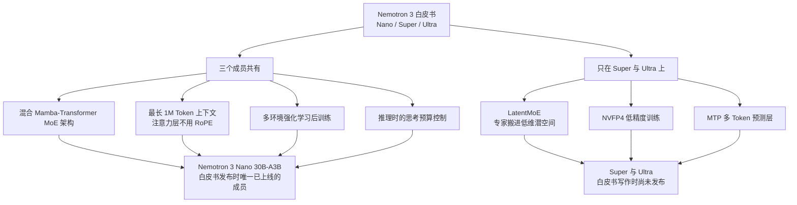
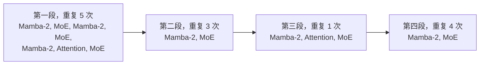
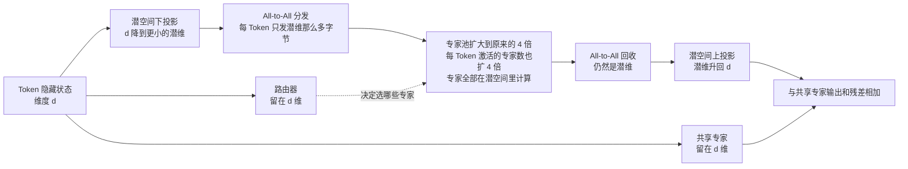
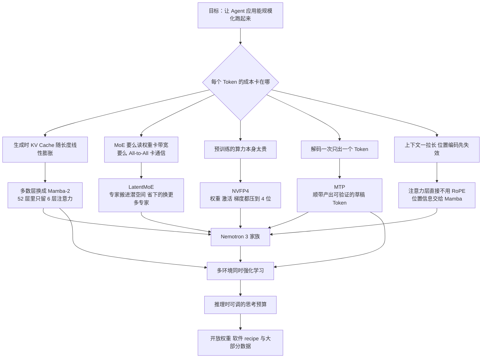

# NVIDIA Nemotron 3：把「每个字节换到多少精度」当成架构目标

<!-- release-date: 2025-12-15 -->

> 本文依据 NVIDIA 发布的 **NVIDIA Nemotron 3: Efficient and Open Intelligence**，即 arXiv:2512.20856v1，PDF 页眉标注 2025-12-25，arXiv 首次提交为 2025-12-24。页码均指 PDF 本身的页码。截至写作时 arXiv 上只有 v1，本地原件与官方版本一致。文中会明确区分「报告写了什么」「我们如何解释它」和「外部资料补充」。

## 先说清楚这是一份什么文件

这份 PDF 一共 13 页：正文 9 页，贡献者名单 3 页，参考文献 1 页。

它是一份 **白皮书**，不是完整技术报告。原文自己交代得很清楚：Nano 是和「它自己的技术报告」以及「这份白皮书」一起发布的，Super 与 Ultra 要等后续几个月（PDF p.1）。图 2 的图注也直接写着，细节请看 Nemotron Nano 3 的技术报告（PDF p.2）。

所以读它的正确姿势是：**这是一张地图，不是一本施工手册**。它告诉你 NVIDIA 在这一代押了哪七个技术注，每个注为什么值得押，以及有哪些初步证据。它不会给你超参表、算力账单和数据配比。

这一点会反复影响后面的判断，所以先放在最前面。

## 阅读前的最小词汇表

下面几个词后面会一直出现，先用人话过一遍：

- **Token（词元）**：模型读写文本时的基本小块。一个汉字、一个英文单词或一个标点，都可能被切成一个或多个 Token。
- **KV Cache（Key-Value Cache，键值缓存）**：Transformer 生成文字时，会把读过的每个 Token 的中间结果存下来，免得每吐一个新字就把全文重算一遍。它随上下文变长而不断变大。
- **MoE（Mixture-of-Experts，混合专家）**：把一层前馈网络拆成很多个「专家」小网络，每个 Token 只让其中几个干活。参数可以很多，单次计算量却不用同比增长。
- **SSM（State Space Model，状态空间模型）**：另一类序列建模方式。它不保存全部历史，而是维护一个**固定大小**的状态，一边往前读一边更新这个状态。其中 **Mamba-2** 是当前一种高效的 SSM 实现。
- **GQA（Grouped Query Attention，分组查询注意力）**：多个查询头共用一套 Key/Value，用来压缩 KV Cache。共用得越狠，缓存越小。
- **RoPE（Rotary Position Embedding，旋转位置编码）**：一种把「第几个位置」编进向量的方法，做法是按位置把向量旋转一个角度。
- **Agentic AI（智能体式 AI）**：模型不是回答一句就结束，而是反复调工具、读结果、再决定下一步。一个任务可能跑几十上百轮。

## 一句话先说清

Nemotron 3 想解决的不是「模型不够聪明」，而是 **「模型跑起来太贵，所以 Agent 规模化不起来」**。

Agent 场景有一个和聊天完全不同的成本结构：一次任务要来回几十上百轮，每轮都要读很长的历史、吐很长的思考。这时候真正卡住产品的往往不是准确率差那几个点，而是每张 GPU 每秒只能吐多少 Token。

所以这份白皮书里几乎每一项设计，都指向同一个分母 —— **字节**：

- 生成时每步要从显存里搬多少 KV Cache 的字节？→ 把大部分层换成 Mamba-2；
- 算一层 MoE 要读多少专家权重、要在卡间传多少字节？→ LatentMoE 把专家搬进低维潜空间；
- 训练时每个数要占几个 bit？→ NVFP4 把权重、激活、梯度都压到 4 位；
- 每搬一次全模型的权重，只换回一个 Token 值不值？→ MTP 顺带产出草稿 Token；
- 上下文拉到一百万，位置编码会不会先崩？→ 注意力层干脆不用 RoPE。

白皮书 §2.2 的小标题直接把这把尺子写了出来：**Improved Accuracy per Byte**，也就是「每字节换到的精度」（PDF p.3）。这句话可以当整篇文章的主轴。

## 全景：七项技术，分别装在谁身上

先看一件很容易读漏、但非常关键的事：**这七项技术并不是三个模型都有。**

这张图依据 PDF p.1 的摘要与引言、以及 p.9 的 Key Takeaways 重画，是**归属关系示意**，不含任何实测数据。

它带来一个直接后果：**LatentMoE、NVFP4 和 MTP 这三项，在白皮书里都还没有被一个已上线的模型证明过。** 它们的证据主要来自代理实验 —— 专门训练的 8B 激活参数量级模型，训练量 1T Token（NVFP4 那一节另外还有一条 Nano 规模的曲线）。这不是缺陷，是白皮书的性质；但读的时候必须一直记着。

三个成员的定位（PDF p.1）：

| 成员 | 白皮书给的定位 | 发布状态 |
|---|---|---|
| Nano | 最小，精度胜过同档模型，推理成本极低 | 与白皮书同时发布 |
| Super | 面向协作式 Agent 与大批量负载，例如 IT 工单自动化 | 后续数月 |
| Ultra | 最大，提供最强精度与推理能力 | 后续数月 |

白皮书没有给出 Super 与 Ultra 的参数规模、层配置或具体时间表。

## 核心设计一：混合 Mamba-Transformer MoE

### 旧问题：注意力的账，是随长度线性变贵的

标准 Transformer 生成文字时，每吐一个 Token，都要回头看全部历史。为了不重算，它把历史的 Key 和 Value 存进 KV Cache。

问题是这个缓存**随上下文长度线性增长**。上下文一万 Token 时它还好；上下文一百万 Token 时，光是每生成一个字就要把这一大坨缓存从显存里读一遍。这时候瓶颈已经不是算力，而是**内存带宽**：GPU 的计算单元在等数据。

Agent 场景把这个问题放大到极致，因为 Agent 天生就是长上下文 + 长输出。

### 新设计：让大多数层只保存一个固定大小的状态

Mamba-2 属于状态空间模型。它换了一种记忆方式：不保存全部历史，而是维护一个**固定大小**的状态，读一个 Token 就更新一次状态（PDF p.2–3）。

可以这样对比：

- 注意力像**逐字翻查全部会议纪要**。信息一点不丢，但纪要越长翻得越久。
- Mamba-2 像**只维护一份不断更新的会议摘要**。摘要大小固定，所以读第一百万个字和读第一千个字，代价一样。

白皮书的原话是：注意力层生成时要「attend over a linearly increasing KV Cache」，而 Mamba-2 层「require storing only a constant state during generation」（PDF p.2）。

那为什么不全换成 Mamba-2？因为固定大小的状态必然会丢信息。所以 Nemotron 3 保留了少数注意力层，白皮书给它们的职责是「high-fidelity all-to-all information routing」—— 高保真的全对全信息路由，也就是**在需要时把任意两个位置精确地连起来**（PDF p.3）。

三种层各司其职（PDF p.3）：

| 层类型 | 负责什么 | 生成时的成本特征 |
|---|---|---|
| MoE | 稀疏地扩参数，同样算力下换更高精度 | 只读被选中的专家权重 |
| 自注意力 | 高保真的全对全信息路由 | KV Cache 随长度线性增长 |
| Mamba-2 | 序列建模主力 | 推理计算与显存都是常数 |

### Nano 到底怎么排这些层

图 1 给出了 Nemotron 3 Nano 的层模式（PDF p.2）。它由四段重复结构串起来：

这是根据 PDF p.2 图 1 重画的**结构示意**，不含时间或性能数据。

把它数一遍很有意思：

- 第一段每次 3 个 Mamba-2、1 个 Attention、3 个 MoE，重复 5 次 → 15 / 5 / 15；
- 第二段每次 1 个 Mamba-2、1 个 MoE，重复 3 次 → 3 / 0 / 3；
- 第三段 1 个 Mamba-2、1 个 Attention、1 个 MoE → 1 / 1 / 1；
- 第四段每次 1 个 Mamba-2、1 个 MoE，重复 4 次 → 4 / 0 / 4。

合计 **23 个 Mamba-2 层、6 个注意力层、23 个 MoE 层，共 52 层**。这个计数是我们从图 1 数出来的，白皮书正文没有直接写这三个数字。

52 层里只有 6 层注意力，大约九分之一。再配合后面 §2.4 提到的「每个注意力层的 GQA 只有 2 个 KV head」（PDF p.6），Nano 的 KV Cache 已经被压到很小。

还有一个细节值得注意：注意力层不是均匀撒开的。按上面的段落顺序把层号排出来，6 个注意力层分别落在第 6、13、20、27、34、43 层 —— **前 35 层里挤了 5 个，大约每 7 层一个；之后密度骤降，最后 9 层完全没有注意力**。白皮书没有解释这个安排的理由。

### 收益：图 2 的两组数字

图 2 把 Nano 和两个同量级开放模型放在一起（PDF p.2）。左半边是精度，右半边是相对吞吐。

| 评测 | Nemotron-3-Nano-30B-A3B | Qwen3-30B-A3B-Thinking-2507 | GPT-OSS-20B-A4B |
|---|---:|---:|---:|
| Arena-Hard-v2-Avg（对话） | 67.7 | 57.8 | 48.5 |
| AIME25（数学） | 89.1 | 85.0 | 91.7 |
| AIME25 带工具 | 99.2 | — | 98.7 |
| IFBench（指令跟随） | 71.5 | 51.0 | 65.0 |
| τ²-Bench（工具使用） | 49.0 | 47.7 | 47.5 |
| SWE-Bench（编程） | 38.8 | 22.0 | 34.0 |
| LiveCodeBench v6（编程） | 68.2 | 66.0 | 61.0 |
| RULER @ 1M（长上下文） | 86.3 | 77.5 | N/A |
| 相对吞吐，输入 8k / 输出 16k | 3.3 | 1.0 | 1.5 |

正文对应的一句是：在常见推理负载（8k 输入 / 16k 输出）下，Nano 30B-A3B 的吞吐是 Qwen3-30B-A3B 的 **3.3 倍**，更长序列上加速还会更多（PDF p.2）。

几点必须说清楚：

1. **吞吐是相对值**，以 Qwen3 为 1.0。白皮书没有写用的是哪张卡、什么推理框架、什么批大小。纵轴只标了「Output tokens/s/GPU」。
2. **不是每项都赢**。AIME25 不带工具时 GPT-OSS-20B 的 91.7 高于 Nano 的 89.1。带工具后 Nano 反超（99.2 对 98.7），但这已经是另一种设置。
3. **RULER @ 1M 那栏 GPT-OSS 是 N/A**，因为它不支持这个长度，不是它考了 0 分。
4. 白皮书没有给这些评测的具体协议（几次采样、什么 harness、什么系统提示）。图注直接把读者指向 Nano 的技术报告。

所以图 2 支持的结论是：**在这个特定负载点上，混合架构同时拿到了有竞争力的精度和明显更高的吞吐**。它不支持「Nemotron 3 Nano 在所有任务上都最强」。

### 代价与适用边界

白皮书没有列这一节，下面是我们的判断，不是原文结论：

- Mamba-2 的固定状态一定会损失信息。Nemotron 3 靠留 6 层注意力来补，但「留几层、留在哪」目前只有工程经验，白皮书没有给消融。
- 混合架构对推理框架不友好：一套系统要同时管注意力的 KV Cache 和 Mamba 的循环状态，两者的形状、更新频率、淘汰规则完全不同。白皮书完全没有写推理系统怎么实现这一点。
- 后面表 3 会看到，Nano 在 128k–512k 这些「中等长度」上的 RULER 分数其实**低于**上一代 Nemotron 2 Nano。混合 MoE 换来的是更平缓的衰减，不是全长度更强。

### 可迁移启发

> **先确认瓶颈是算力还是搬运，再决定往哪个维度加钱。**

如果你的系统在生成阶段是内存带宽受限的，那么「换更快的 GPU」的收益会远小于「让每步要读的字节变少」。Nemotron 3 的做法是把大部分层的**记忆结构**从「随长度增长」换成「固定大小」—— 这个思路在流式处理、在线特征、长会话状态管理里都成立：能用固定大小的摘要顶住的地方，就不要留全量历史。

## 核心设计二：LatentMoE —— 把专家搬进低维空间，省下的钱再买更多专家

这是白皮书里最完整、最有推广价值的一节。

### 旧问题：MoE 在两种部署模式下，卡的根本不是同一件事

白皮书先做了一个很清晰的区分（PDF p.3）：

**延迟优先的部署**：一次只处理几十到几百个 Token，目标是尽快回一句话。这时 MoE 层是 **memory-bandwidth-bound（内存带宽受限）** —— 把专家权重从显存读出来的时间，远超真正的乘加时间。每个专家矩阵大小是 $d \times m$，其中 $d$ 是模型隐藏维度，$m$ 是专家前馈网络的中间维度。想省带宽，只能减 $d$ 或减 $m$。

**吞吐优先的部署**：一次处理几千个 Token。这时主要瓶颈变成 **all-to-all 通信** —— 把 Token 分发到持有目标专家的 GPU 上，再把结果收回来。

关键在于这两个瓶颈对参数的敏感方向不一样。通信量大致是：

$$V_{\text{comm}} \propto K \times d$$

其中 $K$ 是每个 Token 激活的专家数，$d$ 是隐藏维度。注意：**它与专家中间维度 $m$ 无关**（PDF p.3）。

而前馈层的表达力，白皮书说主要由「有效非线性预算」决定，大致正比于：

$$\text{nonlinear budget} \propto K \times m$$

把这两条并排看，矛盾就出来了：$K$ 同时出现在两边。想加表达力就得加 $K$，但加 $K$ 会直接把通信量顶上去。

### 新设计：换掉 $d$，而不是换掉 $K$

LatentMoE 的招数是：**通信量里的 $d$ 是可以替换的**（PDF p.3–4）。

具体做法：

1. 每个 Token 先从隐藏维度 $d$ 投影到一个更小的潜空间维度 $\ell < d$；
2. 分发、专家计算、回收，全部在 $\ell$ 维里做；
3. 结果再投影回 $d$ 维。

注意第 2 步说的是「被搬来搬去的那份数据」在 $\ell$ 维。仍然留在 $d$ 维的是 **决定选哪些专家的路由门本身**，理由下面马上讲。

于是每个专家的权重加载量和每次 all-to-all 的通信量，都按 $d/\ell$ 的比例缩小。白皮书说这个比例典型取 **约 4 倍**（PDF p.3）。

省下来的预算不落袋，而是**原地再投资**：

$$N' = N \cdot \frac{d}{\ell}, \qquad K' = K \cdot \frac{d}{\ell}$$

- $N$ 是专家总数，$N'$ 是扩容后的专家总数；
- $K$ 是每 Token 激活的专家数，$K'$ 是扩容后的激活数。

算一下账就明白它为什么成立：

- **通信量**：$K' \times \ell = K \cdot \frac{d}{\ell} \cdot \ell = K \times d$ —— 和原来一样；
- **专家计算量**：$K'$ 个专家，每个是 $\ell \times m$ → $K \cdot \frac{d}{\ell} \cdot \ell \cdot m = K \cdot d \cdot m$ —— 和原来一样；
- **有效非线性预算**：$K' \times m = \frac{d}{\ell} \cdot K \times m$ —— 变成原来的 $d/\ell$ 倍。

也就是说，**在通信和算力账单几乎不变的前提下，模型的非线性预算和专家多样性都涨了约 4 倍**。这就是「accuracy per byte」的字面含义。

### 什么留在原维度，为什么

白皮书特意强调，不是所有东西都搬进潜空间 —— **路由门（gating network）、共享专家、以及所有非专家层，都留在原始的 $d$ 维**，理由是它们并不显著贡献于上面那两个瓶颈（PDF p.4）。

这是根据 PDF p.3 图 3b 重画的**数据流示意**，不含实测时间或吞吐。

这个取舍很值得学：**降维是有代价的，代价是表示能力**。所以只在「瓶颈确实在这里」的路径上降维，其他地方保持全精度、全维度。路由器如果也降到潜空间，选专家的判断质量可能直接下降 —— 而路由器本身并不是带宽大头。

### 证据：表 1

白皮书用一对配平的模型做对照（PDF p.4）：

| | Standard MoE | LatentMoE |
|---|---|---|
| 激活参数 / 总参数 | 8.09B / 72.6B | 8.02B / 72.8B |
| 隐藏或潜维 | $d = 4096$ | $\ell = 1024$ |
| 专家总数 | 128 | 512 |
| 每 Token 激活专家 | 6 | 22 |
| 训练量 | 1T Token | 1T Token |
| 超参 | 完全相同 | 完全相同 |

结果（PDF p.4）：

| 评测 | Standard MoE | LatentMoE | 差值 |
|---|---:|---:|---:|
| MMLU-Pro | 48.30 | 52.87 | +4.57 |
| MMLU | 70.10 | 72.11 | +2.01 |
| Code | 51.95 | 55.14 | +3.19 |
| Math | 78.32 | 80.19 | +1.87 |
| Commonsense Understanding | 81.73 | 82.10 | +0.37 |

其中三个是聚合分：Code 是 HumanEval、HumanEval+、MBPP、MBPP+ 的平均；Math 是 GSM8K CoT 与 MATH-500 的平均；Commonsense Understanding 是 RACE、ARC-Challenge、HellaSwag、Winogrande 的平均（PDF p.4）。

这张表的说服力在于它**控制得很干净**：同样的激活参数、同样的总参数、同样的 Token 数、同样的超参，只换 MoE 层的组织方式。这是白皮书里对照最严格的一组实验。

它的边界也很清楚：

- 只有一个规模点（8B 激活 / 73B 总参），只跑到 1T Token。规模更大时收益会不会保持，没有数据。
- 增益不均匀：MMLU-Pro 涨 4.57，常识理解只涨 0.37。这说明收益更多来自「需要更多知识与更细区分」的任务，而不是全面平移。
- 表里的是基座评测，不是后训练后的 Agent 能力。

### 一个白皮书没解释的小疙瘩

按公式，$K' = K \cdot d/\ell = 6 \times 4 = 24$。但实际用的是 **22**（PDF p.4）。专家总数倒是严格对齐：$128 \times 4 = 512$。

白皮书没有解释为什么少了 2 个。

**以下是我们的推测，不是原文结论。** LatentMoE 多出了一对下投影和上投影，这部分参数和计算需要有人买单；把激活专家从 24 降到 22 大约削掉 8% 的路由专家激活量，正好和表里 8.02B 略低于 8.09B 的激活参数对得上。合理，但没有证据。

### 可迁移启发

> **先算清楚瓶颈公式里每个变量的位置，再决定动哪一个。**

这一节最漂亮的地方不是「降维」这个动作，而是它先把两条公式摆出来：通信 $\propto K \times d$，表达力 $\propto K \times m$。一旦看清 $d$ 只出现在成本侧、$m$ 只出现在收益侧，接下来该动谁就是显然的。

第二条启发是 **「省下的预算要原地再投资」**。很多优化做完就停在「快了 4 倍」，但如果目标是精度，更值钱的做法是把这 4 倍换成模型能力。降维本身会掉精度，扩专家会涨精度，两个动作合起来才是净赚。

第三条是 **分层降本**：不是整层统一降精度或降维度，而是逐条路径判断「这条路径是不是瓶颈」。路由器、共享专家留在高维，就是这个判断的产物。

## 核心设计三：MTP —— 一次前向，多看几步

### 旧问题：解码一次只出一个 Token，权重却要全搬一遍

自回归生成有个很不划算的地方：为了产出**一个** Token，你得把整个模型的权重从显存里过一遍。批量很小的时候（比如单用户对话），GPU 的算力几乎是闲着的，全在等数据搬运。

### 新设计：让模型顺带预测后面几个 Token

MTP（Multi-Token Prediction，多 Token 预测）让模型在预测下一个 Token 之外，同时预测再后面几个（PDF p.4）。它带来两种收益，白皮书都提到了：

**训练侧**：预测多个未来 Token 提供了更密的监督信号，也促使模型提前几步做规划（PDF p.4–5）。

**推理侧**：这些额外预测天然可以当 **speculative decoding（投机解码）** 的草稿 Token。投机解码的思路是：先用便宜的方式猜几个 Token，再用完整模型一次性验证 —— 猜对了就白赚，猜错了就丢掉重来。MTP 的好处是**不需要单独训练一个草稿模型**（PDF p.5）。

### 证据：表 2 与 97% 接受率

白皮书在一个 8B 激活参数的 **transformer MoE**（注意：不是混合架构）基座模型上做消融，训练 1T Token，平均提升约 **2.4%**（PDF p.5）：

| 类别 | 任务 | 基线 | 基线 + MTP |
|---|---|---:|---:|
| 通用知识 | MMLU（5-shot, acc） | 70.06 | 71.26 |
| 通用知识 | MMLU-Pro（5-shot, CoT EM） | 45.05 | 47.84 |
| 代码 | MBPP-Sanitized（3-shot） | 65.58 | 66.89 |
| 常识理解 | ARC-Challenge（25-shot, acc_norm） | 86.43 | 88.05 |
| 常识理解 | WinoGrande（0-shot, acc） | 74.59 | 75.45 |
| 阅读理解 | RACE（0-shot, acc） | 84.02 | 85.36 |
| 数学 | GSM8K（8-shot, acc） | 82.49 | 84.46 |

推理侧的数字是：白皮书设计了一个轻量 MTP 模块，在 8B 激活 MoE 模型的消融里，**前两个预测 Token 的接受率约 97%**（PDF p.5）。

97% 是个很高的数字。它的直觉解释是：MTP 头和主干共享表示，所以它的预测和主模型高度一致 —— 白皮书用的词是「high agreement with the base model」（PDF p.5）。接受率越高，投机解码的加速越接近理想值。

### 边界

- 消融跑在 **transformer MoE** 上，而 Nemotron 3 是 **hybrid Mamba-Transformer MoE**。白皮书没有给混合架构上的 MTP 消融。
- 白皮书没有写 MTP 的深度（预测多远）、模块结构、训练时的损失权重。
- 「约 2.4% 平均提升」需要看清口径。表 2 里 7 个任务的**绝对**提升是 +0.86 到 +2.79 个百分点，平均约 +1.58 点；换成**相对**提升（提升量除以基线）则是 1.15% 到 6.19%，平均约 2.4%。所以正文那个 2.4% 是相对提升的平均。这是我们按表 2 复算的，白皮书只写了结果没写口径。
- MTP 层只装在 Super 和 Ultra 上，Nano 没有（PDF p.1、p.9）。所以已发布的 Nano 用不上这一条。

### 可迁移启发

> **如果一次昂贵的搬运只换回一个结果，想办法在同一次搬运里多带点货出来。**

这个模式不限于 LLM。任何「固定开销大、单次产出小」的流水线都适用：一次数据库往返多取几行、一次页面渲染多预取几屏、一次模型前向多输出几个候选。关键是要有一个**便宜的验证机制**把猜错的丢掉 —— 投机解码之所以安全，是因为主模型的验证保证了输出分布不变。

## 核心设计四：NVFP4 训练 —— 把 4 位浮点真的用在预训练里

### 旧问题：低精度到底是「模拟」还是「真跑」

先说清楚 FP4 是什么：一个浮点数只用 **4 个二进制位** 表示。对比一下，BF16 用 16 位，FP8 用 8 位。位数越少，能表示的数值范围和精度越粗糙，但每次搬运的字节越少、专用硬件上的乘加吞吐越高。

白皮书给的硬件数字：在 GB300 上，**FP4 的峰值吞吐是 FP8 的 3 倍**（PDF p.5，引自 NVIDIA Blackwell Ultra 数据手册）。

这里有个很重要的区别，白皮书自己点了出来（PDF p.5–6）：

- 先前的 NVFP4 预训练工作是用 **quantize-dequantize（量化再反量化）** 函数**模拟** NVFP4 的数值行为，底下跑的仍然是 BF16 的矩阵乘；
- 这份工作用的是 **native NVFP4 GEMM（原生 NVFP4 矩阵乘）**，走 cuBLAS 后端接进 Transformer Engine。

差别在于：模拟只能验证「精度掉不掉」，拿不到真实的速度收益；原生跑才同时拿到两者，但也会暴露模拟看不到的数值问题。

权重（weight）、激活（activation）、梯度（gradient）三类张量都量化到 NVFP4，因此前向（fprop）、对输入求梯度（dgrad）、对权重求梯度（wgrad）三个矩阵乘都能用 NVFP4 GEMM（PDF p.5）。

### NVFP4 格式的四个要素

白皮书列了四条（PDF p.6）：

1. **细粒度 micro-block scaling，每 16 个元素一组**：每 16 个数共享一个缩放因子。分组越小，就越能照顾局部的数值分布差异。
2. **块缩放因子用 E4M3 格式**：缩放因子本身是一个 8 位浮点数，4 位指数 + 3 位尾数。
3. **第二级 FP32 全局缩放**：在 block scale 之上再套一层全张量的 32 位缩放。
4. **元素本身是 E2M1**：4 位里 1 位符号、2 位指数、1 位尾数。

为什么要两级缩放？因为 4 位能表示的动态范围极窄。分组缩放的作用，是把 **「表示范围」这个负担从数值本身挪到缩放因子上** —— 数值只负责表达组内的相对大小，绝对量级交给 scale。分组越细，组内数值越接近，浪费的表示能力越少。

配套还有三个数值技巧（PDF p.6）：

- **权重量化用二维（2D）block scaling**：不只沿一个方向分组，而是按二维小块分组。权重矩阵在前向和反向里会被按不同方向读取，二维分组让两个方向都有合理的缩放。
- **wgrad 的输入上做 Random Hadamard Transform（随机 Hadamard 变换，RHT）**：这是一种廉价的正交变换，效果是把少数异常大的数值「摊平」到更多维度上。异常值是低精度量化的头号敌人，因为一个离群点会把整组的 scale 顶上去，让其他数全部损失精度。
- **梯度用 stochastic rounding（随机舍入）**：不是就近取整，而是按距离概率性地取上或取下。这样大量小梯度的期望不会被系统性地舍成零，累加起来仍然朝正确方向走。

### 关键做法：精度不是一刀切，而是按层分级

这是这一节最值得学的部分。白皮书明确列出了哪些地方**不用** NVFP4（PDF p.6）：

| 部件 | 保留的精度 | 白皮书给的理由 |
|---|---|---|
| 网络最后 15% | 高精度 | 维持稳定性 |
| LatentMoE 的潜空间投影 | BF16 | 对单步时间影响很小 |
| MTP 层 | BF16 | 位于网络末端，且要保住 MTP 能力 |
| QKV 与注意力投影 | BF16 | 注意力层本来就少，每层 GQA 只有 2 个 KV head，必须保住保真度 |
| Mamba 输出投影 | MXFP8 | 量化到 NVFP4 后 flush-to-zero 比例过高 |

最后一条特别有意思。白皮书观察到：Mamba 输出投影层量化到 NVFP4 时，**flush-to-zero（下溢归零）比例在 Nano 上高达 40%**（PDF p.6）。

翻译成人话：这一层里有 40% 的数值小到 NVFP4 表示不了，直接变成 0，信息就没了。所以把它退回到 MXFP8。

这个诊断方式非常值得借鉴：**flush-to-zero 比例是一个可以直接测量的、指向具体层的信号**。你不需要先跑完整训练再看 loss 差在哪，只要统计每层量化后有多少数变成 0，就能定位敏感层。

QKV 与注意力投影保 BF16 的逻辑也值得注意：它是一个 **「稀缺资源要保护」** 的判断 —— 因为整个网络只有 6 层注意力，且每层 KV head 只有 2 个，这些层承担的信息路由责任重、冗余度低，掉一点就没得补。反过来，Mamba 层数量多、彼此冗余，容忍度就高。

### 证据：图 4 与图 5

**图 4** 画的是 NVFP4 训练相对 BF16 训练的 loss 相对差异，左边训练 loss、右边验证 loss，横轴是训练 Token 数（0 到 1T）（PDF p.6）。三条线：

- 深蓝：更大的 MoE 模型（A8B），NVFP4 recipe；
- 绿：Nemotron 3 Nano（A3B），NVFP4 recipe；
- 浅蓝：Nano 的消融 —— 从 500B Token 的 NVFP4 checkpoint 出发，把敏感层（Mamba 输出、QKV、注意力投影）也降到 NVFP4。

结论有两条（PDF p.6）：

1. **规模越大，差距越小**。Nano（A3B）上 NVFP4 与 BF16 的相对 loss 差 **小于 1%**；换到 8B 激活参数的更大 MoE 模型，差距降到 **小于 0.6%**。白皮书说这与先前关于量化感知训练缩放律的工作一致。
2. **敏感层不能降**。浅蓝那条消融线明显更差，直接证明了上面那张精度分级表里的取舍是必要的。

**图 5** 是 8B 激活 MoE 模型训到 1T Token 的下游评测轨迹，8 个任务（MMLU、MATH-500、GSM8K、MBPP-Sanitized、MMLU-Pro、ARC-Challenge、HumanEval、WinoGrande），NVFP4 与 BF16 两条线基本重合（PDF p.7）。图注还特意说明：**评测本身是在 BF16 下做的**（PDF p.7）。

这一条印证了一个反直觉但重要的结论：**小的 loss 差距不一定翻译成下游精度下降**。白皮书说这和先前在 Mamba-MLP 模型上的工作一致（PDF p.6）。

### 25T 这个数字要看清楚

白皮书 §2.4 开头写的是：在混合 Mamba-MoE 架构上，用 NVFP4 完成了**最多 25T Token** 的稳定且准确的预训练（PDF p.5）。

但要注意，图 4 和图 5 展示的曲线**只覆盖到 1T Token**。25T 是正文的陈述，图上没有对应的证据曲线。两者不矛盾，但不能把图 4 的「< 1% loss 差」直接外推成「25T 全程都是 < 1%」。

### 边界

- 「网络最后 15% 保持高精度」—— 白皮书没说这 15% 具体是哪些层，也没说「高精度」是 BF16 还是 MXFP8。
- 没有给 NVFP4 训练的端到端加速比。3 倍是硬件峰值 FLOPs 比，不是实测训练吞吐比。
- Nano 的**发布权重**是不是 NVFP4 训出来的，白皮书没有正面说。摘要写的是「Super 与 Ultra 用 NVFP4 训练」（PDF p.1），而图 4 里的 Nano NVFP4 曲线看起来是实验运行。这里保留不确定。

### 可迁移启发

> **降精度要按敏感度分级，并且找一个能直接测量的敏感度指标。**

flush-to-zero 比例就是这样一个指标。类似的还有：量化后的相对误差分布、激活的动态范围、每层的梯度范数。正确的顺序是 **先测量、再分级、最后才是统一 recipe** —— 而不是先定一个「全网 FP4」的目标再回头救火。

第二条：**保护稀缺路径**。当某种层在网络里只剩几层时，它的每一层都变得不可替代，降精度的性价比会急剧变差。这个判断在剪枝、蒸馏、混合精度部署里都通用。

## 核心设计五：一百万 Token —— 靠「不用 RoPE」绕开外推问题

### 旧问题：RoPE 在训练长度之外会失灵

RoPE 把位置信息编成一个旋转角度：第 1 个 Token 转一点，第 1000 个 Token 转很多。模型在训练中见过的角度范围是有限的。一旦推理时的序列比训练时长得多，出现的角度就是**训练中从没见过的分布**，注意力的行为会失控。

白皮书的原话就是把 RoPE 称为扩展上下文的「a known hurdle」—— 一个已知的障碍（PDF p.7）。

业界的常见对策是各种 RoPE 缩放/插值方法，本质是把没见过的角度压回见过的范围。

### 新设计：既然 Mamba 已经带位置信息，就不要 RoPE 了

Nemotron 3 的做法很直接：**注意力层根本不用 RoPE**（PDF p.7）。

理由是：Mamba 层是**顺序**处理序列的 —— 它一个 Token 一个 Token 地更新状态，先后顺序天然编码在状态里。白皮书说 Mamba 层「provide implicit positional information」（提供隐式位置信息），所以注意力层不需要显式位置编码，也就**不会遇到 RoPE 的分布外问题**（PDF p.7）。

这是混合架构给的一个「意料之外的红利」：为了推理效率引入 Mamba，顺手解决了长上下文外推的老大难。

白皮书还提到，纯 Transformer 上的类似探索见 SWAN（Puvvada et al., 2025）（PDF p.7、p.13）。

### 训练时怎么把长度撑上去

Nemotron 3 Nano 的三个阶段（PDF p.7）：

| 阶段 | 序列长度 |
|---|---|
| CPT（continued pre-training，继续预训练） | 512k |
| SFT（supervised fine-tuning，有监督微调） | 256k |
| RL（强化学习）中的长上下文环境 | 输入最长 32k |

三个阶段都加入了为长程检索、多跳推理、多文档信息聚合等能力设计的**合成数据**（PDF p.7）。

有一句很值得注意：在 CPT 里，他们**没有发现需要走 8k → 512k 的阶梯式长度扩展**（PDF p.7）。

这和很多长上下文方案不同 —— 通常大家会分几档逐步拉长。我们的解读是：**阶梯式扩展主要是为了让位置编码平滑适应新范围；既然没有 RoPE，这个理由就消失了。** 白皮书没有这么解释，这是我们的推断。

注意这里有个落差：训练最长到 512k，但宣称支持 1M。所以 1M 这一档本身就是外推出来的 —— 表 3 正好在测这件事。

### 证据：表 3 的 RULER 分数

RULER 是一个专门测「模型在长上下文里能不能真的找到东西」的评测集。表 3 对比上一代 dense hybrid 与这一代 MoE hybrid（PDF p.8）：

| 模型 | 128k | 256k | 512k | 1M |
|---|---:|---:|---:|---:|
| Nemotron-Nano-12B-v2-Base（dense hybrid） | 85.13 | 79.85 | 75.12 | 23.43 |
| Nemotron-3-Nano-30B-A3B-Base（MoE hybrid） | 74.48 | 71.67 | 66.02 | 54.19 |

**两个模型都只训练到 512k 序列长度**（PDF p.8）。所以 1M 这一列，对两者都是纯外推。

这张表必须完整地读：

- 在 128k、256k、512k 三档，**上一代反而更高**，而且 128k 上高出 10 个多点；
- 只有在 1M 这一档，新一代大幅反超：54.19 对 23.43。

白皮书的表述是准确的：dense hybrid 在 512k 到 1M 之间出现「abrupt dropoff」（断崖式下跌），而 MoE hybrid 表现出「graceful degradation」（优雅衰减）（PDF p.8）。

它证明的是**外推的鲁棒性更好**，不是**长上下文能力全面更强**。这个区别很重要，别把它读成后者。

另外，白皮书把这个差异归因于「MoE hybrid 对比 dense hybrid」（PDF p.7–8），但两个模型同时还差着总参数量（30B 对 12B）、激活参数量、训练数据和训练配方。所以 **这不是一个受控实验**，不能把功劳单独记在 MoE 头上。

### 证据：图 6 的 NLL 曲线

第二个证据换了个角度（PDF p.7–8）。

思路是：如果模型真的在用长上下文，那么**同一篇连贯文本里，越靠后的 Token 应该越好预测** —— 因为前文提供了越来越多信息。用 NLL（negative log-likelihood，负对数似然）度量，NLL 越低表示预测得越好。

他们在**超过 100 万 Token 的仓库级代码序列**上测累积平均 NLL（PDF p.8）。图 6 显示 NLL 单调下降，从位置 128 处的约 1.2 一路降到 1M 处的约 0.42（这两个端点是从图上读数，白皮书没有给出数值表），幂律拟合的 $R^2 = 0.883$ 则是图标题里明写的（PDF p.8）。

这个证据的优点是它不依赖人造的「大海捞针」任务，直接看模型的语言建模行为。缺点是它只覆盖了代码这一种数据，且累积平均本身会平滑掉局部波动。白皮书的措辞也很克制：「suggesting that the model is able to use long input context up to the tested range」—— 是 suggesting，不是 proving。

### 可迁移启发

> **一个模块引入后，检查它是否顺手让另一个模块的补丁变得多余。**

RoPE 缩放、位置插值这些技巧，都是在「显式位置编码 + 长度外推」这个组合下的补丁。当 Mamba 已经隐式携带顺序信息时，整条补丁链就可以拆掉。系统设计里这种机会经常被错过 —— 换了新组件，却把旧组件的配套补丁一起留着。

第二条：**外推能力和绝对能力是两件事**。表 3 是个很好的提醒。选模型时要问清楚「你的实际长度落在哪一档」，128k 上的最优选择和 1M 上的最优选择可能不是同一个。

## 核心设计六：多环境强化学习 —— 所有任务一起练

### 旧问题：分阶段训练会让先学的东西退化

以前的做法是给不同能力分设训练阶段：先练数学，再练代码，再练工具调用。问题是**后面的阶段会冲掉前面的能力** —— 白皮书直接说，分阶段方法「often results in degradation of some capabilities」，并引用了 NVIDIA 自己上一代和 DeepSeek 的经验（PDF p.8）。

### 新设计：一次 RL run 同时优化所有环境

Nemotron 3 构建了一大批 RL 环境，覆盖：数学与科学推理、竞赛编程、指令跟随、软件工程、搜索、聊天、通用 Agent 工具使用、长上下文等（PDF p.8）。

关键改动是：**所有任务同时训练，不再分阶段**（PDF p.8）。

白皮书给的观察是三条：更稳定、更不容易 reward hacking（奖励作弊，指模型找到钻奖励函数空子的捷径而非真正解题）、整体更好（PDF p.8）。

图 7 展示了单次 RL run 内 8 个 benchmark 随训练步数（约 0 到 550 步）的变化：AALCR、AIME25、GPQA、IFBench Prompt、LiveCodeBench、MMLU Pro、SciCode、τ²-Bench average（PDF p.9）。曲线整体上行，但噪声明显 —— 例如 AALCR 和 SciCode 的抖动幅度相当大。

**这里必须诚实**：图 7 只有「同时训练」这一条曲线，没有「分阶段训练」的对照曲线。所以「同时训练更好」在白皮书里是**作者的观察与判断**，不是这张图证明出来的结论。

### 算法与系统：GRPO + masked importance sampling

白皮书用 **GRPO**（Group Relative Policy Optimization，组相对策略优化）做 RL，配 **masked importance sampling（带掩码的重要性采样）**，理由是要处理**训练策略与 rollout 策略之间的差异**（PDF p.8）。

这句话背后是异步 RL 的一个根本矛盾，值得展开：

大规模 RL 里，生成轨迹（rollout）和更新参数是分开跑的。为了效率，白皮书采用**异步 RL 架构，把训练和推理解耦**（PDF p.8）。但一解耦就会出现：**用来采样的模型参数，已经比正在更新的模型旧了几步。**

强化学习的数学要求样本来自当前策略。样本来自旧策略时，需要用重要性采样做修正 —— 大致是给每个样本乘上一个比值：

$$w = \frac{\pi_{\text{train}}(a \mid s)}{\pi_{\text{rollout}}(a \mid s)}$$

- $\pi_{\text{train}}$：当前正在更新的策略给这个动作的概率；
- $\pi_{\text{rollout}}$：当初实际采样时那个策略给的概率；
- $a$ 是生成的 Token，$s$ 是当时的上下文。

这个比值在两个策略接近时约等于 1，差得远时会变得极大或极小，让梯度爆炸。「masked」应该就是指对某些位置或某些比值范围做掩码处理，但**白皮书没有写具体的 mask 规则**，所以到此为止，不再往下猜。

系统侧还有一条呼应前文的设计：**用 MTP 加速 rollout 生成**（PDF p.8）。这就把前面 §2.3 的投机解码收益接进了训练回路 —— RL 训练里 rollout 生成往往是最大的时间开销，rollout 快一倍，整轮 RL 就快很多。同理，白皮书也说混合架构本身的高推理吞吐，在大规模 rollout 生成时相对其他开源模型是显著优势（PDF p.8）。

**这是一条很值得记住的因果链**：为推理效率做的架构选择（Mamba 混合 + MTP），最后回过头来加速了训练本身。推理优化和训练优化在 RL 时代不是两件事。

### 开源

整个后训练软件栈以 Apache 2.0 开源（PDF p.8）：

- [NeMo-RL](https://github.com/NVIDIA-NeMo/RL)：可扩展的 RL 训练；
- [NeMo-Gym](https://github.com/NVIDIA-NeMo/Gym)：RL 环境集合。

### 边界

- 没有环境列表、配比、奖励设计、训练超参、rollout 规模。
- 没有 masked importance sampling 的具体定义。
- 没有异步架构的具体形态（几个副本、多少步的参数滞后、怎么同步）。
- 「更不容易 reward hacking」没有给出度量方式。
- 图 7 没有对照组。

## 核心设计七：推理时的思考预算控制

### 旧问题：思考多久，不该是固定的

推理模型会先生成一长串思考过程再回答。问题是难题和简单题需要的思考量差很多，但模型的默认行为是固定的。用户想要「这道题快点答」时，只能靠 `max_tokens` 硬砍 —— 而硬砍会得到一个被截断的、根本没进入回答阶段的输出。

### 新设计：到预算就补一个结束标记，让它直接开始答

做法非常朴素（PDF p.9）：

用户给定一个思考轨迹的最大 Token 预算。模型思考到达预算时，系统**把 `</think>` 这个结束标记直接追加进序列**，然后让模型继续生成。模型于是基于**部分思考轨迹**给出回答。

关键在于「trained to work with」这个措辞 —— 模型是**被训练成能接受这种打断**的（PDF p.9）。它见过「思考被截断然后要立刻作答」这种输入形态，所以不会因为思考没写完就崩掉。这和推理时单纯设个上限完全不同。

图 8 画了四条精度对「每次查询平均生成 Token 数」的曲线（PDF p.9）：

| 评测 | 图中横轴覆盖范围 |
|---|---|
| AIME25 | 2K 到 32K |
| GPQA | 2K 到 16K |
| LiveCodeBench | 4K 到 16K |
| MMLU Pro | 1K 到 4K |

四条曲线都是单调上升但**逐渐变平**的形状。这正是「测试时算力」的典型回报曲线：前期加预算收益很大，后期边际收益递减。

注意各条曲线的横轴范围差别很大 —— AIME25 要到 32K，MMLU Pro 只画到 4K。这本身就说明**不同任务的合理预算差一个数量级**，一刀切地拉满是浪费。

### 可迁移启发

> **想让一个行为在推理时可调，就得在训练时让模型见过这种调法。**

这是这一节最重要的一句。同样是「限制输出长度」，在训练时见过截断的模型和没见过的模型，表现完全不同。任何你希望在部署时打开的开关 —— 长度、格式、语气、工具使用 —— 最好在训练分布里就存在对应的样本形态。

第二条：**把「花多少算力」暴露成用户可调的参数，而不是模型的固有属性**。图 8 那种「先陡后平」的曲线，意味着大多数任务存在一个性价比拐点。产品层面能做的事情是让调用方自己选，而不是替所有人选一个中间值。

## 开放到什么程度

白皮书在开头和结尾各说了一次，但措辞略有差别，值得对照读：

- 摘要（PDF p.1）：将公开发布模型权重、预训练与后训练软件、recipe，以及**所有我们持有再分发权的数据**；
- 引言（PDF p.1）：将发布全部模型权重、训练 recipe，以及 **超过 10 万亿 Token 的数据集**；
- Key Takeaways（PDF p.9）：将发布模型权重、预训练与后训练软件、训练 recipe，以及**大部分训练数据**。

「所有我们持有再分发权的数据」和「大部分训练数据」是同一件事的两种说法：**有一部分数据因为许可原因放不出来**。这是一个诚实的限定，也是判断「完全开源」宣称时该注意的地方 —— 权重、软件和 recipe 是完整的，数据是有缺口的。

后训练软件栈明确是 Apache 2.0（PDF p.8）。白皮书没有写模型权重本身用的是什么许可。

## 白皮书没有写的东西

这是一份 9 页正文的白皮书，缺口很多。明确没写的包括：

**模型层面**

- Nano 的完整超参：隐藏维度、专家数、每 Token 激活专家数、FFN 中间维度、词表大小。图 1 只给了层的排列模式。
- Super 与 Ultra 的参数规模、层配置、发布时间。
- Nano 的最终评测细节 —— 图 2 的图注直接把读者指向单独的技术报告。
- MTP 的深度、模块结构、损失权重。
- LatentMoE 的投影是否共享、是否带归一化、是否有额外的辅助损失。

**训练层面**

- 预训练数据的来源配比、过滤规则、去重方式、污染检查。
- 训练总算力、GPU 数量、训练时长、成本。
- Nano 的预训练 Token 数（§2.4 里的 25T 是 NVFP4 实验的表述，白皮书没有直接说这就是 Nano 的预训练量）。
- 「网络最后 15% 保持高精度」具体指哪些层。
- 多环境 RL 的环境清单、配比、奖励函数、超参。
- masked importance sampling 的具体形式。
- 异步 RL 架构的具体拓扑。

**系统层面**

- 1M 上下文的推理实现：注意力的 KV Cache 与 Mamba 的循环状态怎么共存、怎么分页、怎么淘汰。
- 图 2 吞吐测试的硬件、框架、批大小。
- NVFP4 训练的端到端实测加速比。
- 安全评测与红队结果（白皮书有「Evaluation, Safety and Release」的贡献者分组，但正文没有对应章节）。

**外部补充（明确标注，非报告内容）**：Nano 的这些细节写在一份单独的技术报告里 —— [NVIDIA Nemotron 3 Nano Technical Report](https://research.nvidia.com/labs/nemotron/files/NVIDIA-Nemotron-3-Nano-Technical-Report.pdf)。本文不引用它的任何数字，因为本模块只解读手上这份白皮书；需要 Nano 的完整配置时请直接读那一份。

## 哪些结论有实验支撑，哪些只是作者判断

这是读完这份白皮书后最该留下的东西。

**有对照实验支撑的**

- LatentMoE 优于标准 MoE。表 1 是同激活参数、同总参数、同 Token 数、同超参的严格对照（PDF p.4）。这是全文最干净的一组。
- MTP 提升基座精度。表 2 是同一模型加不加 MTP 的对照（PDF p.5）。
- NVFP4 的敏感层必须保高精度。图 4 的浅蓝消融线是直接对照（PDF p.6）。
- NVFP4 与 BF16 的下游轨迹接近。图 5 是同设置双线对照（PDF p.7）。

**有测量但不是受控对照的**

- MoE hybrid 比 dense hybrid 更抗长度外推。表 3 的两个模型同时差着参数量、数据和配方（PDF p.8）。
- Nano 的吞吐是 Qwen3 的 3.3 倍。图 2 是跨模型对比，没有公开测试环境（PDF p.2）。
- 模型能用上 1M 上下文。图 6 的 NLL 下降是观察性证据，白皮书自己用的词是 suggesting（PDF p.8）。

**只是作者的观察或工程判断**

- 多环境同时 RL 比分阶段 RL 更稳定、更不易 reward hacking、整体更好。图 7 没有对照组（PDF p.8）。
- CPT 不需要阶梯式长度扩展。这是「we did not observe the need」，是没观察到需要，不是证明了不需要（PDF p.7）。
- 注意力层为什么按图 1 那样前密后疏地排布。完全没有解释（PDF p.2）。
- 激活专家取 22 而不是公式给的 24 的原因。没有解释（PDF p.4）。

**属于宣告而非结果的**

- Super 与 Ultra 的能力描述（PDF p.1）。这两个模型在白皮书写作时还没发布。
- 数据、软件和 recipe 的开放承诺（PDF p.1、p.9）。

## 最值得带走的六条

### 1. 给系统找一把统一的尺子

Nemotron 3 的尺子是「每字节换到多少精度」。有了这把尺子，架构选型、MoE 组织方式、数值精度、解码策略这些看起来毫不相干的决定，就能放在同一个坐标系里比较。没有统一尺子的优化，往往是各自局部最优、整体互相打架。

### 2. 先写出瓶颈公式，再决定动哪个变量

LatentMoE 那一节是范本：通信 $\propto K \times d$，表达力 $\propto K \times m$。两条公式一摆，「该动 $d$」就是显然的。很多优化之所以做得吃力，是因为跳过了把成本和收益写成同一组变量的函数这一步。

### 3. 省下来的预算要原地再投资

降维省了 4 倍带宽，就把专家数和激活数各扩 4 倍。如果只是把省下的落袋为安，你得到的是一个更快但更笨的模型。

**优化的终点不一定是「更快」，也可以是「同样快但更强」。**

### 4. 降精度要按敏感度分级，并且找一个能测量的指标

flush-to-zero 比例高达 40% —— 这是一个可以在训练前就测出来、且直接指向具体层的信号。比起「先全量化再看 loss 崩不崩」，这种事前诊断便宜得多。同时记住保护稀缺路径：整个网络只有 6 层注意力时，这 6 层的每一层都不能省。

### 5. 新组件可能让旧补丁变得多余

引入 Mamba 是为了推理效率，结果顺手让 RoPE 外推这条补丁链整个消失了。换组件时要主动问一遍：**旧方案里哪些复杂度，是专门为被替换掉的那个组件服务的？**

### 6. 推理优化会回流到训练

MTP 是为了投机解码加速推理设计的，最后被用来加速 RL 的 rollout 生成；混合架构的高吞吐也直接缩短了 RL 的采样时间。在 RL 已经成为后训练主力的今天，**推理速度就是训练速度**。这条因果链在做技术选型时容易被低估。

## 用一张图重新串起来

这张图是**因果关系示意**，依据 PDF p.1 到 p.9 的整体叙事重画，不含实测数据。注意 S1 和 S4 各有一条额外的箭头指向 P：这就是上面第 6 条讲的「推理优化回流到训练」。

## 关键词回看

- **Hybrid Mamba-Transformer MoE**：以 Mamba-2 层为主、少量注意力层、与 MoE 层交错的混合架构。Nano 的 Mamba-2、注意力、MoE 三种层各有 23、6、23 个，共 52 层。
- **Mamba-2**：一种状态空间模型实现。生成时只维护固定大小的状态，因此计算与显存都是常数。
- **LatentMoE**：把路由专家的计算和 all-to-all 通信搬进更小的潜空间，用省下的带宽把专家总数和激活专家数各扩大同样的倍数。
- **Accuracy per byte（每字节精度）**：白皮书 §2.2 的标题概念，也是全文的统一尺子。
- **MTP（Multi-Token Prediction）**：训练时额外预测后面几个 Token；推理时这些预测直接充当投机解码的草稿。
- **投机解码（Speculative Decoding）**：先便宜地猜几个 Token，再用完整模型一次性验证；猜对即白赚，输出分布不变。
- **NVFP4**：4 位浮点格式，元素 E2M1、每 16 个元素一个 E4M3 块缩放因子、外加一层 FP32 全局缩放。
- **Flush-to-zero（下溢归零）**：数值小到低精度格式表示不了，直接变成 0。它的比例是定位量化敏感层的实用指标。
- **Random Hadamard Transform（随机 Hadamard 变换）**：一种廉价正交变换，把异常大值摊平到更多维度，减轻量化的离群点问题。
- **Stochastic rounding（随机舍入）**：按距离概率性地取上或取下，避免大量小值被系统性地舍成零。
- **RULER**：专门度量长上下文中实际检索与推理能力的评测集。
- **GRPO（Group Relative Policy Optimization）**：这份白皮书采用的 RL 算法。
- **Importance sampling（重要性采样）**：修正「样本来自旧策略、更新的是新策略」这个偏差的权重方法。
- **Reasoning budget control（思考预算控制）**：思考达到预算就补上结束标记让模型直接作答；模型在训练时就见过这种打断。

## 最后的判断

这份白皮书的价值不在于任何单项技术的新颖度 —— Mamba 混合、MoE、MTP、低精度训练、多环境 RL，每一项都有前作。它的价值在于**把一整套效率手段挂在同一根轴上，并说清楚每一项为什么值得押**。

它最强的一段是 LatentMoE：从「两种部署模式瓶颈不同」出发，写出两条方向相反的比例关系，然后精准地换掉了那个只出现在成本侧的变量，最后用一组配平严格的对照实验收尾。这段推理的质量，比结论本身更值得学。

它最弱的一段是多环境 RL：结论很有价值（同时训练比分阶段更好），但白皮书只给了单条曲线，没有对照。这是一个**值得相信但尚未被这份材料证明**的判断。

还有一个必须记住的结构性事实：**LatentMoE、NVFP4 和 MTP 这三项都只装在 Super 与 Ultra 上，而这两个模型在白皮书写作时还没有发布。** 已经上线的 Nano 用的是混合架构 + 无 RoPE 长上下文 + 多环境 RL + 预算控制这四项。读的时候不要把七项技术的收益全部记在 Nano 头上。

如果只记一句话，可以记：

> **当推理成本成为产品的硬约束时，「加多少参数」这个问题应该被换成「同样的字节预算下，怎样买到更多智能」。**

## 资料与阅读边界

- 原始依据：本地 `papers/NVIDIA/Nemotron-3.pdf`，NVIDIA Nemotron 3 白皮书，[arXiv:2512.20856v1](https://arxiv.org/abs/2512.20856)，2025-12-24 提交，PDF 页眉标注 2025-12-25。截至写作时 arXiv 上只有 v1。
- 首发日证据：本文取 **2025-12-15**，即 Nemotron 3 家族首个成员 Nano 通过官方渠道对外开放的那一天。三处官方来源一致：[NVIDIA 官方新闻稿 NVIDIA Debuts Nemotron 3 Family of Open Models](https://nvidianews.nvidia.com/news/nvidia-debuts-nemotron-3-family-of-open-models)、同日的 [NVIDIA 官方技术博客](https://developer.nvidia.com/blog/inside-nvidia-nemotron-3-techniques-tools-and-data-that-make-it-efficient-and-accurate/) 与 [NVIDIA Research Nemotron 3 页面](https://research.nvidia.com/labs/nemotron/Nemotron-3/)，都写明 Nano 当日可在 Hugging Face 与各推理服务商处使用，Super 与 Ultra 后续发布。
- 被排除的其它候选日：Hugging Face 权重仓的 `createdAt` 是 2025-12-03 至 12-06（Base、BF16、FP8 三个仓分别为 12-03、12-04、12-06），这是发布前的预置时间，按本站口径不作首发日；这些仓的 README 首次提交也落在 2025-12-15。白皮书 PDF 页眉的 2025-12-25 与 arXiv 提交日 2025-12-24 都晚于实际开放日，属于文档日期，不参与排序。
- 报告点名的开源实现：[NeMo-RL](https://github.com/NVIDIA-NeMo/RL) 与 [NeMo-Gym](https://github.com/NVIDIA-NeMo/Gym)，Apache 2.0（PDF p.8）。
- **外部补充，非本白皮书内容**：Nano 的完整超参、层数、预训练数据与详细评测写在单独的 [NVIDIA Nemotron 3 Nano Technical Report](https://research.nvidia.com/labs/nemotron/files/NVIDIA-Nemotron-3-Nano-Technical-Report.pdf) 中。本文没有引用它的任何数字。
- 白皮书引用的关键前作，均已按 PDF p.13 的参考文献核实：[Transformers are SSMs（Mamba-2）](https://arxiv.org/abs/2405.21060)、[Pretraining Large Language Models with NVFP4](https://arxiv.org/abs/2509.25149)、[RULER](https://arxiv.org/abs/2404.06654)、[NVIDIA Nemotron Nano 2](https://arxiv.org/abs/2508.14444)、[Nemotron-H](https://arxiv.org/abs/2504.03624)、[Scaling Law for Quantization-Aware Training](https://arxiv.org/abs/2505.14302)。这些链接只用于帮助读者追溯背景，本文没有把它们的结论当作本白皮书的结论。
- 关于图表：文中所有 Mermaid 图都是根据 PDF 对应图重画的机制或结构示意，已在图下注明依据页码，且不含任何实测时间或吞吐数据。表格中的数字全部来自 PDF 原表与原图，并已逐页视觉核对（文本抽取会把 τ²-Bench 的上标丢成「2-Bench」，此处以页面渲染为准）。
