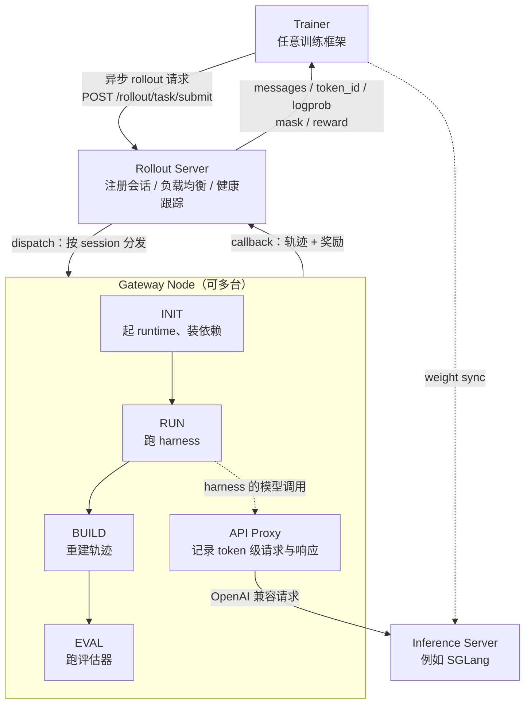
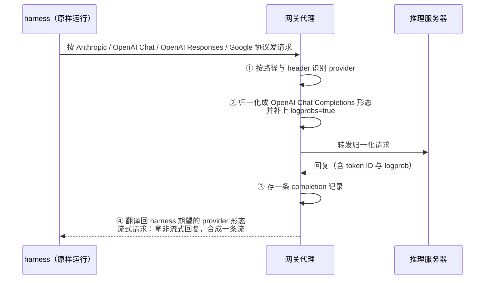
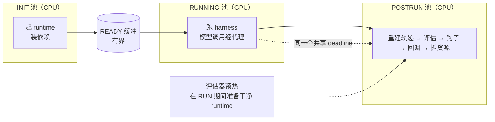

# Polar：把 RL 的观测点挪到模型 API 这一层，harness 就能原样当训练环境

<!-- release-date: 2026-05-14 -->

> 本文依据 **Polar: Agentic RL on Any Harness at Scale**，即 arXiv:2605.24220v1、2026-05-22 提交、共 17 页的预印本（正文与结论 p. 1–12、参考文献 p. 13–14、附录 A.1–A.5 p. 15–17）。首页列出十二位作者，没有逐人标注单位；页眉是 NVIDIA 标识，版权行为「© 2026 NVIDIA」，脚注给出的代码仓库在 NVIDIA-NeMo 组织下（PDF p. 1），本站放在 NVIDIA 目录。下文括号里的 `PDF p. N` 均指这份 17 页原件的文件页码。
>
> **版本说明**：截至 2026-09-08 核验，arXiv 上只有 v1（提交于 2026-05-22T21:06:12Z），与本地原件一致，未替换原件。**`release-date` 取 2026-05-14**，理由与证据见文末「资料与阅读边界」：这是一篇系统论文，对象不是可用的模型，按流程取该技术首次官方公开的日期；已核查到的最早官方公开事件，是官方仓库 [NVIDIA-NeMo/ProRL-Agent-Server](https://github.com/NVIDIA-NeMo/ProRL-Agent-Server) 的 PR #28「Merging Polar to Main」于 2026-05-14 合入默认分支（合并提交 `75de6df3`），早于 arXiv v1 八天。
>
> 这是一篇系统论文，没有模型架构和预训练 recipe 可讲；它讲的是**怎样把一个现成的 Agent 程序原封不动地变成 RL 环境**。全文把三件事分开写：**论文明确写了什么**（带页码）、**本文如何解释它**（凡属推算、换算或从图上读数都会写明）、**外部资料补充**（会给出链接并标注）。它的前作 ProRL Agent（arXiv:2603.18815）本站另有一篇解读与本篇同批撰写，本文只在需要对照时引用那份原件，并标为外部补充。

## 读之前需要的最少背景

这篇论文假设你知道「用强化学习（Reinforcement Learning，RL）训练 Agent」大致是怎么回事。不熟的话，先记住下面几个词就够读完全文。

**harness（脚手架，本文保留英文）**：让大模型能干活的那层程序。Claude Code、Codex CLI、Qwen Code、Pi 这些命令行编码助手都是 harness。它管系统提示词、工具定义、什么时候调用哪个工具、上下文太长时怎么压缩（论文里叫 **compaction**）、要不要派出子 Agent、什么时候停。模型只负责在每一步「看到一段上下文，吐出一段文本」；把这些步骤串成一次完整任务的，是 harness。

**RL 后训练的一轮循环**：拿一批任务，让当前模型在 harness 里跑，跑出来的每一次完整执行叫一条 **trajectory（轨迹）**；给每条轨迹打一个 **reward（奖励）**，例如代码补丁能不能让测试通过；再用带奖励的轨迹更新模型参数。「让模型跑一批」这个动作叫 **rollout**。本篇用的算法是 **GRPO（Group Relative Policy Optimization，组相对策略优化）**：对同一道题采样一组回答，用组内的相对好坏当优势，出处见本站 [DeepSeekMath 解读](/reports/DeepSeek/DeepSeekMath)。

**behavior policy（行为策略）与 log probability（对数概率）**：生成轨迹时用的那版模型叫行为策略。RL 的梯度要算在「模型当时真的采样出来的那些 token」上，而且通常还需要模型当时给这些 token 的对数概率。如果训练时拿到的 token 和采样时的不是同一串，梯度就算错了对象。

**retokenization drift（重分词漂移）**：把模型输出的 token 解码成文本，再把文本编码回 token，得到的 token 序列可能和原来不一样。分词器对同一段文本可以有多种切法，「文本一样」不等于「token 一样」。这个问题在 Agent 训练里格外常见，因为 harness 和模型之间走的是文本接口，而不是 token 接口。

**loss mask（损失掩码）**：一条训练序列里，哪些 token 参与算梯度、哪些只当上下文。标 1 的参与，标 0 的只看不学。

**proxy（代理）**：夹在客户端和服务端之间的一层程序。客户端以为自己在跟真正的服务说话，其实说给了代理；代理转发、记录，再把回复原样交回。本篇的全部设计都建立在「在 harness 和推理服务器之间放一个代理」这一件事上。

## 一句话先说清

这篇论文要解决的矛盾可以这样说：

> **今天最能干的 Agent 是一整个软件系统，不是一个 Python 函数。可是 RL 框架都要求你把 Agent 改写成一个 `env.step()` 才肯训练它。**

论文对这个矛盾的描述很直接（PDF p. 2）：传统 RL 假设训练对象可以被暴露成一个简单、标准化的接口，研究者只管算法。到了 Agent 时代，训练对象是一个复杂的软件系统，它可能同时涉及异构环境、各种外部工具、长时间运行的工作流，可能用不同语言实现，甚至以闭源二进制分发。要把这样的东西改写成 RL 框架的环境接口，要么工作量巨大，要么根本做不到，而且改写过程往往会丢掉真实执行路径上的细节。

论文提出的问题是一句话（PDF p. 2）：

> Can we train agents with RL without opening the box?

它的回答建立在一个观察上：**Agent 内部实现千差万别，但每一个基于大模型的 Agent 都必须去调模型。** 这个「模型 API 边界」是所有 Agent 共有的、而且位于 Agent 之外的接口（PDF p. 2）。于是 Polar 不去集成 harness，而是**监听 harness 发出的模型调用**：把它的提示词、采样出的 token、对数概率和回复记下来，转换成 RL 轨迹。Agent 本身一行不改（PDF p. 2–3）。

围绕这个观察，论文列了四条贡献（PDF p. 3）：前三条是设计，第四条是在真实编码 harness 上的端到端验证。三条设计是：

1. **代理式 rollout**：在 harness 和推理服务器之间放一个兼容各家 API 协议的代理，harness 只需把模型地址指向它。
2. **token 保真的轨迹重建**：把代理记下的一堆零散模型调用，还原成训练器能直接吃的轨迹；提供保守的逐请求策略和更省的前缀合并策略。
3. **rollout 即服务**：把 runtime 准备、harness 执行、轨迹重建、评估和回调拆到异步的服务边界后面，让慢而长尾的 Agent rollout 独立于 GPU 训练扩展。

论文给的验证是（PDF p. 1、10）：同一个 Qwen3.5-4B 基座、同一个 GRPO 配方、同一批 SWE-Gym 训练题，分别套在 Codex、Claude Code、Qwen Code、Pi 四个 harness 里训练，SWE-Bench Verified 的 pass@1（一次尝试就通过的题目比例）分别提升 **22.6、4.8、0.6、6.2** 个百分点。四个数字差得这么远，本身就是本文最想让你记住的东西——**harness 是策略的一部分，换 harness 就等于换了一个要优化的行为。** 另外一组数字是：前缀合并相对逐请求重建，把同样三个训练步的墙钟时间从 189.5 分钟压到 35.2 分钟（PDF p. 10）。

## 全景：两个组件、一个代理、四段流水

先把论文 Figure 1 的信息落到一张图上（PDF p. 1）。

这是根据 PDF p. 1 的 Figure 1 与 §3.1（PDF p. 5）重画的**机制示意图**，箭头表示请求与数据的流向，不表示实测时长。四段流水的名字取自 Figure 1 的方块；图中的端点名取自附录 A.5（PDF p. 17），Figure 1 上只写了「Async Rollout Request」；正文里 BUILD 和 EVAL 合并在一个叫 POSTRUN 的池子里（PDF p. 6），后面会讲。

论文说 Polar 只有两个核心组件（PDF p. 5）：

| 组件 | 职责 | 为什么这样分 |
|---|---|---|
| **Rollout Server（rollout 服务）** | 接收 `TaskRequest`，展开成 `num_samples` 个独立 session；把 session 分发给网关；持久化紧凑的终态结果；提供轮询接口；接收网关回调 | 它管的是**耐久的任务状态**，不碰任何一条 session 的执行细节 |
| **Gateway Node（网关节点）** | 拥有每个 session 的完整生命周期：起 runtime、准备 harness、跑 harness 命令、从捕获的模型调用里重建轨迹、评估、拆资源、回传；**同时托管 harness 用的代理端点** | 它管的是**单个 session 的执行与捕获**。代理和 session 注册表放在同一个进程里，捕获到的模型调用天然绑定到对应 session，不需要单独的 trace 收集服务 |

**session 是调度单元**。它带着 session ID、task ID、超时预算、runtime 规格、agent 规格、轨迹构建器、评估器和回调 URL（PDF p. 5）。附录 A.3 给了一份代表性的任务载荷（PDF p. 16）：一个任务写明 `num_samples` 为 8、`timeout_seconds` 为 1200、runtime 用 Docker 镜像、harness 是 `codex`、构建器是 `prefix_merging`、评估器是 `swebench_harness` 并要求刷新 runtime，元数据里带 `group_id`、`policy_version`、`rollout_step`。**训练框架只通过这份载荷和回调跟 Polar 打交道**，所以论文说它与 harness、训练基础设施、RL 算法三者都无关（PDF p. 1），训练框架独立于 Polar 的服务（PDF p. 5）。

四条流水段和两个组件之间，还有一条不在正文小节里、但贯穿全文的线：**Trainer 到 Inference Server 的权重同步**。Figure 1 用一条虚线画了它（PDF p. 1），正文没有讲怎么做。本文由此推断：**Polar 不负责权重同步**，那是训练框架和推理服务器之间的事；论文没有明说这一点。

## 第一层矛盾：为什么「把 harness 改写成环境」走不通

### 传统做法把 Agent 拆成零件

论文 Figure 2 左边画的是传统 rollout 框架看待 Agent 的方式（PDF p. 2）：把系统提示词、工具调用、多 Agent、上下文工程、定时任务这些**组件**一个个拆出来，塞进框架自己的 `env.init()`、`env.step()`、`env.reset()` 里，再由框架记录轨迹。图上在组件和环境接口之间画了一个红色问号。

论文对这条路的判断（PDF p. 2）：

- 它让**训练器依赖 harness 专用的集成代码**，每来一个新 harness，就要写一份框架专用的适配；
- 它**可能丢掉原生执行路径上的细节**——你在框架里重写的 Codex，未必还是那个 Codex。

论文点名了两类现有系统（PDF p. 2）。SkyRL-Agent 和 PRIME-RL 把 Agent 执行直接集成进 RL 流水线，要求用户把自己的 Agent 改成适配 RL 基础设施的样子，而不是让基础设施适配现有 Agent。Agent Lightning 和 rLLM 走得更远，用标准化的追踪接口和 LLM 调用捕获机制来降低负担，但仍然要求 Agent 遵守规定的接口——**降低了集成成本，没有消除它**。而 harness 越来越复杂，有些甚至不暴露内部实现，这条路会越走越窄。

### Polar 把 Agent 当整体

Figure 2 右边是 Polar 的看法（PDF p. 2）：harness 是一个**黑盒**，它只在一个地方露出接口——它会向 `v1/chat/completions`、`v1/responses`、`v1/messages` 或 Google 风格的端点发请求。Polar 在这个位置放一个代理，监听这些模型请求，然后在 harness **外面**重建轨迹。

这个选择在相关工作一节里说得更具体（PDF p. 4）：对很多编码和终端 Agent 来说，**最可靠的接口不是 SDK 的回调图，而是 harness 已经在用的那个 provider API 端点**。代理因此成了观测设备：它接受 Anthropic、OpenAI Chat、OpenAI Responses 和 Google 风格的请求，翻译给本地推理后端，记录训练器需要的 token 级字段。论文自己也承认这个选择**比通用的可观测性插桩窄**，但它对以命令行程序、包管理工具或二进制形式分发的 harness 都有效。

### 论文自己画的设计选择对照

附录 A.1 的 Table 3 把七个系统按四个维度打了分（PDF p. 15）。本文把它转成原生表格：

| 系统 | 异步 RL 支持 | 异步 rollout 分阶段 | rollout 即服务 | 原生 harness 无关 |
|---|:-:|:-:|:-:|:-:|
| Polar | ✓ | ✓ | ✓ | ✓ |
| ProRL Agent | ✓ | ✓ | ✓ | ✗ |
| SkyRL-Agent | ✓ | ✓ | ✗ | ● |
| PRIME-RL | ✓ | ✗ | ✗ | ✗ |
| Agent Lightning | ● | ✗ | ● | ● |
| rLLM | ● | ✗ | ✗ | ✗ |
| OpenClaw-RL | ✓ | ✗ | ✗ | ● |

四列的定义（PDF p. 15）：**异步 RL 支持**指训练可以在生成继续的同时消费 rollout，且有明确的策略版本或陈旧度处理；**异步 rollout 分阶段**指 rollout 执行被拆成可独立调度的 runtime 准备、执行、后处理重建与评估、清理几个阶段；**rollout 即服务**指有一个耐久的任务 API，可以和具体的训练循环分离；**原生 harness 无关**指 CLI、SDK 或应用形态的 harness 不必被重新实现成框架的环境就能训练。✓ 是一等支持，● 是部分或计划中的支持，✗ 是作者在对方代码或文档里**没有找到**这条作为主要设计契约。

读这张表要注意两点。第一，它是作者打的分，最后一列的 ✗ 定义是「没找到」而不是「做不到」，论文也在表后专门写了一段解释那些 ● 为什么不是 ✗（PDF p. 15）。第二，**ProRL Agent 和 Polar 只差最后一列**。这是两代在这张表上的唯一差异：前者要用户在 rollout 服务里实现一个 agent handler，后者只要用户提供一个「准备配置、启动原生可执行文件」的 harness adapter，代理从外面观察（PDF p. 3）。

### 和评估框架 Harbor 的分界

论文还专门对比了 Harbor（PDF p. 4）。Harbor 也在容器里跑 Claude Code、OpenHands、Codex CLI 这些原生 harness，把原生日志转成评估轨迹，这和 Polar「harness 原生」的动机高度一致。差别在**模型边界和训练数据契约**：Harbor 用各 provider 的配置启动 harness，不提供翻译协议、居中调解模型流量的网关；所以想让 Qwen 的 checkpoint 跑在 Claude Code 里，得在 Harbor 之外自己搭一个 Anthropic 兼容端点。Polar 把代理放在这个位置，同样的 harness 执行就能产出 token ID、对数概率、loss mask 和奖励，直接喂给训练器。

这一段揭示了 Polar 的另一个用途：**它同时是一个「让任意模型跑在任意 harness 里」的适配层**。后面「离线数据生成」一节会回到这一点。

## 设计一：模型 API 代理——观测点为什么要放在这么低的位置

### 旧问题

要从 Agent 的执行里拿到训练信号，得知道模型每一步看到了什么、生成了什么。传统做法是在 Agent 内部插桩，但 harness 不一定给你插桩的机会：它可能是别人写的二进制，可能用你不熟的语言，可能内部结构一个版本一变。

### 新设计：harness 不改，只改一个环境变量

Polar 让 harness 通过它**自己正常的环境变量或配置文件**，把模型 base URL 指向网关（PDF p. 6）。harness 以为自己在跟 OpenAI 或 Anthropic 说话，其实说给了网关里的代理。

对每一个进来的模型请求，网关做四步（PDF p. 6）：

这是根据 §3.2 的四步描述（PDF p. 6）重画的**机制示意图**。四步逐条说：

1. **识别 provider API**。用请求路径和 header 区分 Anthropic Messages、OpenAI Chat Completions、OpenAI Responses 和 Google `generateContent` 风格的调用。
2. **归一化请求**。一个 provider 转换器把角色、内容分段、工具定义、工具选择、停止控制和生成参数转成本地推理服务器消费的 OpenAI Chat Completions 形态，**并加上训练需要的字段，例如 `logprobs=true`**。
3. **捕获 token 级数据**。把归一化请求转给推理服务器，存下一条 completion 记录：请求消息、响应消息、prompt token ID、采样出的响应 token ID、结束原因、推理后端给的对数概率。
4. **还原 provider 形态**。把响应翻译回 harness 期望的 schema。对流式请求，实现是**先向上游拿一个非流式响应，再合成一条 provider 形态的流**。论文说这简化了忠实的 token 捕获，同时保住了与那些期望 server-sent events 的 harness 的兼容性。

论文用一句话说明这个边界为什么放得这么低（PDF p. 6）：代理**刻意位于 Agent 框架之下**。它不需要理解 harness 怎么规划、怎么管理工具、什么时候停，只需要保持 API 兼容，并记下足够重建训练样本的信息。

### 两个配套件

**harness adapter 很小**（PDF p. 6）。它可以安装配置、注册 MCP（Model Context Protocol，模型上下文协议）服务器或 skills、写 provider 设置，然后返回启动 Agent 的 shell 命令。有一个通用的 shell 命令 harness 可以包住任意 Agent；论文还把常用的 harness 做成快捷方式：`claude_code`、`codex`、`gemini_cli`、`qwen_code`、`opencode`、`pi`。

**runtime 接口只有六个动作**（PDF p. 6）：start、stop、exec、upload、download、cancellation。首版支持 Docker 和面向 HPC（高性能计算集群）的 rootless Apptainer。网关代码只依赖这个接口，所以一个任务可以换隔离后端而不用改别的。

### 收益、代价与边界

**收益**是全文的前提：harness 一行不改就能训练；同一套代理让 Qwen 模型跑在 Claude Code 里成为可能（PDF p. 4）。

**代价与边界**，论文写了的和没写的分开说：

- **它要求推理后端能返回 token ID 和对数概率。** 第二步补的 `logprobs=true` 就是为此（PDF p. 6）。如果后端是一个只回文本的商业 API，这条路就断了——这是本文按设计推出来的，论文没有明说。
- **流式响应是合成的。** harness 拿到的是一条「事后合成」的流，而不是逐 token 推过来的（PDF p. 6）。对训练来说这无所谓，但意味着 harness 在流式模式下感知到的首 token 延迟和真实部署不同。论文没有讨论这一点。
- **协议翻译的覆盖范围是隐含假设。** 论文列出了四种协议、以及要翻译的字段种类（PDF p. 6），但没有讨论 provider 专有字段（例如推理内容、缓存控制）怎么处理。§2.4 提到 provider API 可能返回「文本、tool-call JSON、reasoning 字段或流式事件」（PDF p. 4），说明作者知道这些形态存在，但正文没有写代理对 reasoning 字段的处理规则。
- **代理本身的开销没有测。** 全文没有任何一个关于代理延迟或吞吐的数字。

**可迁移的部分**：

> **要观测一个你控制不了的系统，先找它必须经过、且你控制得了的那个接口。**

这个原则不限于 RL。任何「别人的程序 + 你的模型」的组合，模型 API 都是天然的观测点和控制点：你可以在这里记录、改写、限流、替换模型，而对方的程序不需要知道。

## 设计二：token 保真的轨迹重建——从零散调用还原成训练序列

代理记下来的是一堆 completion 记录，每条对应 harness 的一次模型调用。一次 SWE 任务可能有几十上百次调用。怎么把它们变成训练器要的东西，是论文技术含量最高的一节。

### 旧问题：文本接口天然会漂移

§2.4 把问题说清楚了（PDF p. 4）：**Agent RL 的训练信号只有附着在行为策略真正采样出的 token 上才是对的。** 但 provider API 返回的往往是文本、tool-call JSON、reasoning 字段或流式事件，而不是推理后端用的确切 token ID 和对数概率。把一段对话解码再重新编码，token 序列可能就变了——这就是 retokenization drift。论文引用了 vLLM 博客上 Agent Lightning 团队对此的讨论。

Polar 的原则是（PDF p. 4）：**生成出来的 assistant token 直接从推理响应里复制；非生成的「夹层」token 取自规范的 prompt 分词；loss mask 只把行为策略的 token 标成可训练。**

### 数据结构

轨迹构建器把一个有序的 `CompletionSession`（一次 harness session 里代理捕获的模型调用序列）转成一个 `Trajectory`。一个 `Trajectory` 含一条或多条 `Trace`，每条 `Trace` 带 prompt token ID、response token ID、loss mask、prompt 消息、response 消息、工具定义、对数概率、奖励和元数据（PDF p. 7）。附录 A.4 给了一条代表性的训练器视角 trace（PDF p. 16–17）。构建策略是注册表式的，可以自定义；论文提供两种（PDF p. 7）。

### 策略一：逐请求（`per_request`）

每个 completion 变成一条 trace（PDF p. 7）。它对单次调用是**无损**的，但会把一个连贯的多轮 session 打碎成很多短样本。论文说对复杂的编码 harness，解一道题就能产生**数百条**这样的 trace，加重下游训练器的负担（PDF p. 7）。

### 策略二：前缀合并（`prefix_merging`）

想法是：**harness 的很多轮调用，其实是同一段对话在不断追加。** 第二次调用的 prompt = 第一次的 prompt + 第一次的回复 + 工具结果 + 新指令。如果能把这种「只追加」的调用串起来，就能还原成一条长序列，训练器一次看完整个过程。

但论文强调它**不假设整个 session 是一段对话**（PDF p. 7）。它先把 completion 切成若干条**链**，再在每条链内合并。

#### 第一步：切链

设一个 session 有 $T$ 次 completion $C_1,\dots,C_T$，第 $i$ 次的 prompt token 序列是 $p_i$、原始采样出的响应 token 序列是 $a_i$、响应的对数概率是 $\ell_i$、prompt 与响应的消息是 $m_i$。Polar 把它们分成有序的链（PDF p. 7）：

$$
\mathcal{G}=\{G_1,\dots,G_J\},\qquad G_j=(C_{i^j_1},C_{i^j_2},\dots,C_{i^j_{K_j}}),\qquad i^j_1<i^j_2<\dots<i^j_{K_j}
$$

一次新的 completion 要加入某条链，必须**同时**满足两个条件（PDF p. 7）：

1. 一个**归一化的消息级分组键**认定它是候选的续写；
2. **严格的 token 前缀关系**对该链的最后一个 prompt 成立。对链内相邻的两次 completion，这个检查写成：

$$
p_{i_{m+1}}[1:|p_{i_m}|]=p_{i_m}
$$

也就是后一次的 prompt 的前 $|p_{i_m}|$ 个 token，必须和前一次的 prompt 逐 token 相同。

于是子 Agent、并行分支、上下文压缩、prompt 改写、独立的工具中介对话，都会自然地**形成新的链**，而不是被硬塞进一条全局 trace（PDF p. 8）。原因很简单：压缩之后 prompt 变了，前缀关系不再成立；子 Agent 有自己的系统提示词，前缀关系从第一个 token 就不成立。

#### 第二步：链内合并

论文说主要的困难在于（PDF p. 8）：后一次的 prompt $p_{m+1}$ 里包含的是**服务器按规范渲染的上一轮 assistant 回复**，再加上 harness 在下一次生成之前插进去的夹层上下文（工具结果、新指令等）。**上一轮 assistant 的正文不能从这份规范渲染里复制**，因为行为策略的 token 是原始采样出来的 $a_m$，而不是渲染出来的那份。

处理办法是把 $p_{m+1}$ 多出来的那一截单独拿出来。记 $e$ 是回合结束（end-of-turn）token 的 ID，定义规范尾巴：

$$
t_m=p_{m+1}[|p_m|+1:]
$$

然后在 $t_m$ 里找第一个 $e$（PDF p. 8）：

- 如果 $a_m$ 本来就以 $e$ 结尾，夹层 $u_m$ 就是 $t_m$ 里那个 $e$ **之后**的后缀；
- 否则 $u_m$ **从那个 $e$ 开始**，这样 assistant 的回合在进入下一段 prompt 上下文之前仍然是闭合的。

也就是说，$e$ 要么属于 $a_m$（模型自己生成的结束符），要么属于 $u_m$（模型没生成、由服务器补上的结束符）——两种情况都保证序列里恰好有一个结束符，但只有前一种会被算梯度。

这条链代表的完整 token 序列是（PDF p. 8）：

$$
z^{(j)}=p_1\,\|\,a_1\,\|\,u_1\,\|\,a_2\,\|\,u_2\,\|\cdots\|\,a_K
$$

其中 $\|$ 表示拼接。发出的 trace 把 $p_1$ 存成 prompt，把剩下的后缀 $a_1\|u_1\|\cdots\|a_K$ 存成 response（PDF p. 8）。loss mask 在从采样响应复制来的 $a_m$ 上为 1，在从规范夹层复制来的 $u_m$ 上为 0。$a_m$ 的 token 复制真实的对数概率；$u_m$ 的位置填**合成的**对数概率条目，只是为了让 `response_logprobs` 和 `response_ids` 对齐——可训练性完全由 `loss_mask` 控制（PDF p. 8）。

论文把整个构造压成一条**正确性不变式**（PDF p. 8）：

> Every trainable token matches the behavior policy during rollout, and any non-generated tokens are masked out.

每一个可训练的 token 都和 rollout 时的行为策略一致；所有非生成的 token 都被掩掉。

### 用 Figure 4 的例子走一遍

论文 Figure 4 画了一个 session（PDF p. 7）：主 Agent 三轮对话，中间发生一次 harness 级的上下文压缩，还派出了一个子 Agent。方块的含义按图例：黄色是预填充的 prompt 内容，绿色是模型生成的，蓝色是上下文压缩，橙色网格是被掩掉的。

本文把图上的两列整理成表：

| 主 Agent 的模型调用序列 | `per_request` 的产出（4 条） | `prefix_merging` 的产出（3 条） |
|---|---|---|
| SYS, U → A1 | trace2：prompt SYS, U；response A1 | trace2：prompt SYS, U；response A1 ‖ T1（掩）‖ A3 |
| SYS, U, A1, T1 → A3 | trace3：prompt SYS, U, A1, T1；response A3 | （并入上一行） |
| C([SYS, U, A1, T1, A3, T2]) → A4 | trace4：prompt C(…)；response A4 | trace3：prompt C(…)；response A4 |
| 子 Agent：SYS' → A2 | trace1：prompt SYS'；response A2 | trace1：prompt SYS'；response A2 |

这张表是本文按 Figure 4 整理的，论文没有列成表。三处要点：

1. **前两次调用被合并成一条**，因为第二次的 prompt 是第一次的 prompt 加上 A1 和 T1，前缀关系成立。合并后 A1 和 A3 可训练，T1（工具结果）被掩掉。
2. **压缩之后是一条新链**。第三次调用的 prompt 是 C(…)，即 harness 把前面全部历史压缩成的新上下文，它和之前的 prompt 没有前缀关系。所以 A4 单独成一条 trace，prompt 就是压缩后的上下文。
3. **子 Agent 也是一条新链**，因为它有自己的系统提示词 SYS'。

论文对这张图的总结是（PDF p. 7）：前缀合并在有效的地方恢复只追加的对话链，而压缩和子 Agent 的边界自然形成独立的链；每条合并后的 trace 里，只有采样出的 assistant token 是可训练的，规范夹层被掩掉，**既保住了行为策略的保真度，又减少了训练器要处理的样本数。**

### 附录例子里一个值得留意的细节

附录 A.4 的代表性 trace（PDF p. 16–17）里，`response_ids` 的结尾是 `[…, 151645, 271, 151644]`，对应的 `loss_mask` 结尾是 `[…, 0, 0, 1]`；`response_logprobs` 里 token_id 151645 的对数概率是 0.0。按 Qwen 系列分词器的常见约定，151644 和 151645 通常是 `<|im_start|>` 和 `<|im_end|>`（这是本文的外部推断，论文没有解释这些 ID）。如果推断成立，那么这个例子展示的是「$a_m$ 没有以 $e$ 结尾、于是 $e$ 归入 $u_m$」的情形：结束符被掩掉，并拿到一个合成的 0.0 对数概率。**但紧随其后的 151644 却标成了 1**——按论文自己的规则，下一轮的回合开始符应属于规范夹层，应该被掩掉。这份例子标注了「representative」，很可能是手写示意，不必当作实现细节；但读者拿它对照算法时，要知道它和正文的规则不完全自洽。这是本文核对后留下的观察，不是论文的说法。

### 收益、代价与边界

**收益**在实验一节有硬数字（PDF p. 10）：同样三个训练步，前缀合并把送进训练器的更新数从 1,185 个请求级更新压到 218 个合并 trace 更新，墙钟时间从 189.5 分钟压到 35.2 分钟。后面「实验」一节会拆这组数字。

**代价与边界**：

- **合并只覆盖「只追加」的那部分。** 一次压缩就切一刀，一个子 Agent 就多一条链。对上下文管理激进的 harness，合并率会低；论文没有报告各 harness 的平均链数或链长。
- **`per_request` 配合结果奖励广播会出问题。** 论文试过把 session 级的结果奖励广播给每条请求级 trace，观察到**显著的 reward hacking**；原因是 credit assignment 噪声太大：一条请求级 trace 拿到了 session 级的功劳，却没有 session 归一化或过程奖励模型来校正。论文把这两样列为路线图，明确说在本文范围之外（PDF p. 10）。论文的四个 harness 实验全部用 `prefix_merging`（PDF p. 9）；把这两件事连起来读是本文的推断，论文没有写明选择的原因。
- **「归一化的消息级分组键」怎么算，论文没写**（PDF p. 7）。这是决定哪些调用有资格进同一条链的第一道门，而它的定义不在正文里。
- **夹层 token 的来源是「规范的 prompt 分词」**（PDF p. 4）。这一步隐含了一个假设：训练器用的分词与推理服务器渲染 prompt 时用的分词一致。论文没有讨论两边不一致时会怎样。

**可迁移的部分**：

> **数据从哪个接口出来，就在哪个接口上保真；不要在中间任何一层「翻译回去」。**

token 保真的关键不是算法多聪明，而是**从头到尾不让 token 经过文本这一层**：采样 token 从推理响应里直接抄，夹层 token 从服务器的规范分词里直接抄，两者拼起来，再用 mask 分清哪部分是模型说的。任何「记录 → 转换 → 还原」的数据管线都可以问同一个问题：中间是否存在一个有损的中转格式。

## 设计三：网关内的分阶段异步与 rollout 即服务

### 旧问题：一次 Agent rollout 里混着好几种完全不同的成本

论文列了一次长程 harness rollout 的成本清单（PDF p. 6）：runtime 启动、依赖准备、harness 执行、评估器设置、测试执行、补丁应用、拆除。它们瓶颈各异——起容器是 CPU 和 I/O，跑 harness 是 GPU 推理，跑测试套件可能要几分钟。如果一个 worker 从头到尾串着做，大部分时间都在等某一段。

### 新设计：三个池加一个缓冲

每个网关用**相互隔离的 worker 池**（PDF p. 6）：

| 阶段 | 做什么 | 瓶颈资源（按 Figure 3 图例） |
|---|---|---|
| **INIT** | 启动 runtime，执行 prepare 动作 | CPU |
| **READY**（有界缓冲） | 存放已初始化、等待运行槽位的 runtime | — |
| **RUNNING** | 执行 harness | GPU |
| **POSTRUN** | 重建轨迹、跑评估器、执行 post-run 钩子、发回调、拆资源 | CPU |

READY 缓冲的作用是**让 CPU 密集的 runtime 准备在后台先做好，不阻塞 GPU 密集的 Agent 执行**（PDF p. 6）。Figure 3 给了一个配置示例（PDF p. 5）：`n_init_worker` 为 2、`n_run_worker` 为 4、`n_postrun_worker` 为 4；图上六个 session 的 INIT、RUN、POSTRUN 方块在时间轴上错开，RUN 之间互相重叠，INIT 提前于 RUN 完成。

这是根据 PDF p. 5 的 Figure 3 与 §3.3（PDF p. 6）重画的**机制示意图**，表示阶段之间的交接关系，不表示实测时长。

### 两个细节

**评估器预热**（PDF p. 6）：如果评估器要求一个干净的 runtime（例如 SWE-Bench 要在没被 Agent 改过的环境里跑测试），网关**在 Agent 还在跑的时候**就开始准备那个 runtime。Figure 3 里的 INIT(EVAL) 方块画的就是它。附录 A.3 的载荷里 `refresh_runtime: true` 对应这项（PDF p. 16）。

**一个共享的 deadline**（PDF p. 6）：每个 session 只有一个总超时。如果 harness 超时了，但模型调用已经被捕获，网关**仍然进入 post-run**，把部分轨迹带着「timeout」终态回收。也就是说，超时不等于白跑——已经采样出来的 token 还能进训练。这对长尾任务很重要：一条跑了半小时才超时的轨迹，前面几十次调用都是真实的行为策略样本。

### rollout 即服务：训练器只看见五个端点

附录 A.5 列出了 rollout 服务的全部 API（PDF p. 17）：

| 端点 | 用途 |
|---|---|
| `POST /rollout/task/submit` | 提交一个非阻塞的任务请求 |
| `GET /rollout/task/{task_id}` | 轮询任务状态、部分结果和最终结果 |
| `GET /rollout/status` | 查看任务状态、节点状态和待处理 session |
| `POST /callbacks/session_result` | 接收网关的 session 回调 |
| `POST /nodes/register`、`POST /nodes/{node_id}/heartbeat` | 维护网关成员关系和调度指标 |

网关另外暴露一个 session 的创建、查询、删除控制面，加一个**兜住所有 provider 风格模型请求的代理面**；session 删除只是终态持久化之后的尽力清理（PDF p. 17）。

论文用 Slime 做了一个接入示例（PDF p. 5）：一个后台 worker 向 Polar 提交任务、接收任务完成回调、把 trace 转成 Slime 的 `Sample` 对象、做轨迹感知的奖励后处理。Figure 5(a) 展示的就是这条流水线跑起来的样子（PDF p. 8）：横轴是训练步（0 到 300 多步），rollout 侧 GPU 利用率几乎全程接近 100%，训练器侧大部分时间为 0、只在收到足够多的已评估轨迹组时短暂拉到 100%。图上标注了两句话：「Trainer steps upon enough trajectories」和「Async rollout period with served policy」——**rollout 服务一直拿现有策略在推，训练器凑够一批就走一步**（PDF p. 8）。

### 和前作的分工（外部补充）

**以下依据 ProRL Agent 原件 arXiv:2603.18815v1，属于外部补充。** ProRL Agent 已经有一条 INIT → RUN → EVAL 的三阶段异步流水线，三个阶段各有独立 worker 池和队列，可以分别调整大小（ProRL Agent 原件 p. 4、8）；它的集成契约是让用户实现一个 `AgentHandler`，提供 `init`、`run`、`eval` 三个生命周期方法（原件 p. 4）；它也已经用 token-in/token-out 避免重分词漂移（原件 p. 9）。本文对照两份原件后的归纳：Polar 在这一层的变化是**把 RUN 和 EVAL 之间插进了「BUILD」（轨迹重建）**，并把「用户写 handler」换成「用户给 adapter、代理从外面看」。Polar 论文自己的说法是：它继承了「rollout 应该是一个服务」这个高层想法，但改变了集成契约（PDF p. 3）。

### 收益、代价与边界

**收益**：论文的证据只有 Figure 5(a) 这一张定性的利用率曲线（PDF p. 8）和一句「让慢而长尾的 Agent rollout 独立于 GPU 训练扩展」（PDF p. 3）。

**代价与边界**，这里要说得直白一些：

- **标题里的「at Scale」没有对应的扩展性实验。** 全文没有节点数、GPU 数、并发 session 数与吞吐的关系曲线，没有和任何其他 rollout 框架的吞吐对比，也没有 rollout 服务在多网关下的调度开销数字。这和本站已收录的 [AReaL](/reports/AntGroup/AReaL)、[Laminar](/reports/ByteDance/Laminar) 那种成百上千卡的强扩展实验完全不是一个量级的证据。
- **异步带来的陈旧度问题被整体交给了训练器。** Polar 只在任务元数据里带 `policy_version` 和 `rollout_step`（PDF p. 16），怎么用它们做异策略修正，是 Slime 那一侧的事；论文在 Table 4 只写了一行「TIS Enabled」（PDF p. 15），没有定义缩写也没有展开。本文的解释：TIS 通常指 truncated importance sampling，即对陈旧样本的重要性比做截断的修正，但这是本文的补充，不是论文的说明。
- **READY 缓冲的大小、三个池的配比怎么定，论文没有给指导**，只有 Figure 3 那个 2/4/4 的示例（PDF p. 5）。

**可迁移的部分**：

> **把「准备」「执行」「收尾」拆成不同的池，瓶颈资源不同的阶段才能互相重叠。**

这是经典的流水线思想，但 Polar 多了两个值得记的小动作：**评估用的干净环境在执行期间就提前准备**，以及**超时后仍然走收尾流程回收部分结果**。前者把评估的准备成本藏进执行时间里，后者让长尾任务的失败不再是全损。

## 评估器与奖励怎么传回轨迹

评估器是注册表式的自定义策略，在轨迹构建之后运行；它拿到轨迹、session 产物，以及（可选的）刷新过的 runtime 上下文（PDF p. 9）。内置三种：session 完成奖励、可配置的「对输出跑测试」评估器、SWE-Bench/SWE-Gym harness 评估器。

奖励怎么落到 trace 上，论文分了两种（PDF p. 9）：**结果奖励可以广播给每一条 trace**；带过程奖励的任务则可能需要**逐 trace 赋值**。注册表允许扩展成规则校验、Agent 当评委、任务专属的奖励整形。

这一节要和前面「`per_request` 配合结果奖励广播会 reward hacking」的观察连起来读（PDF p. 10）：广播本身是被支持的机制，问题出在**广播给了太碎的 trace**。前缀合并把一条链合成一条 trace，广播的粒度就变成了「一段连贯的对话」，credit assignment 的噪声随之下降。论文没有把这层因果写出来，这是本文的解释。

## 实验一：同一个 4B 模型、同一个配方、四个 harness

### 配置

四个实验共享（PDF p. 9–10、15）：

| 项目 | 取值 |
|---|---|
| 基座 | Qwen/Qwen3.5-4B |
| 训练数据 | NovaSky-AI/SkyRL-v0-293-data 的训练切分，293 道 SWE-Gym 任务 |
| 训练器 | Slime 异步 GRPO |
| 轮数 | 1 epoch |
| rollout batch size | 4 |
| 每题采样数 | 16 |
| 轨迹构建 | `prefix_merging` |
| 优化器 / 学习率 / 权重衰减 | Adam / $1\times10^{-6}$ / 0.1 |
| TIS | Enabled |
| 评估 | SWE-Bench Verified，pass@1，跑在对应的 harness 上 |
| 奖励 | `swebench_harness` 在一个新 runtime 里给最终补丁打分 |

Table 4 的图注写明这些是 `examples/swegym_slime_grpo` 里的普通优化与 rollout 参数，**集群拓扑和 worker 放置被省略了**（PDF p. 15）。

两个外部补充帮助理解规模：SWE-Bench Verified 是 OpenAI 与 SWE-bench 作者从原基准里人工筛出的 500 道题（[OpenAI 的介绍页](https://openai.com/index/introducing-swe-bench-verified/)）；SkyRL-v0-293-data 在 Hugging Face 上是 293 行训练加 23 行验证的 SWE-Gym 子集（[数据集页](https://huggingface.co/datasets/NovaSky-AI/SkyRL-v0-293-data)）。论文只写了「293 tasks」（PDF p. 15）。

### 结果

Table 1（PDF p. 10）：

| harness | 基座 | Polar RL 后 | 增益 |
|---|---:|---:|---:|
| Codex | 3.8% | 26.4% | +22.6 |
| Claude Code | 29.8% | 34.6% | +4.8 |
| Qwen Code | 34.6% | 35.2% | +0.6 |
| Pi | 34.2% | 40.4% | +6.2 |

训练曲线（Figure 6，PDF p. 9）用前十步和后十步的平均 pass@1 奖励概括（PDF p. 10）：

| harness | 前十步均值 | 后十步均值 |
|---|---:|---:|
| Codex | 9.5% | 54.5% |
| Claude Code | 28.8% | 67.0% |
| Qwen Code | 61.6% | 66.0% |
| Pi | 61.6% | 76.2% |

本文按 Figure 6 读图补两句：四张面板的横轴都到 70 步左右，也就是每个 harness 大约训了 70 步；Qwen Code 那条曲线论文自己也说「更嘈杂」（PDF p. 10），图上确实在 0.5–0.7 之间来回。

### 怎么读这组数字

**第一，基座在不同 harness 里的起点差了九倍。** 同一个 4B 模型，在 Codex 里只有 3.8%，在 Qwen Code 里有 34.6%（PDF p. 10）。论文的解释是：Codex 给一个 Qwen 模型呈现的是**陌生的动作协议、上下文策略和补丁提交风格**，这个模型从来没有被当成 Codex 原生策略训练过（PDF p. 10）。这一句是全文最重要的实验观察：**评测分数不只是模型的分数，是「模型 × harness」的分数。**

**第二，增益最大的地方正是起点最低的地方。** Codex 上 +22.6，论文说「很可能是因为不熟悉的工具 schema」（PDF p. 10）；RL 在这里学的主要是「怎么在这个 harness 里正确地行动」。Qwen Code 是模型的原生 harness，起点已经高，只涨了 0.6。论文的总结是：harness 原生的 RL 对陌生执行路径能带来大幅适配增益，对基座已经对齐的 harness 仍能保住增益（PDF p. 10）。

**第三，这些增益的来源是「奖励贴在真实执行路径的 token 上」。** 论文的表述是：Polar 保持 harness 不变，把奖励附着在**真正流经 Codex 执行路径的采样 token**上，所以 GRPO 优化的正是模型在评测时必须使用的那种行为（PDF p. 10）。这是设计一和设计二在实验上的合流。

**第四，几处论文没有说的。** pass@1 是一次运行还是多次平均，没有写；四个 harness 的版本号没有写（离线数据生成一节倒是钉死了 pi 的版本）；训练用了多少 GPU、跑了多久，没有写；没有任何一个「不用 Polar、用别的框架训同样的模型」的对照，所以这组数字证明的是**Polar 能让四个 harness 都产生可训练的信号**，而不是「Polar 比其他框架训得更好」。论文自己对实验的定位也是这样（PDF p. 9）：测试的是「未经修改的 harness 能否产出可训练的 trace」。

## 实验二：重建策略的消融

在相同的模型、硬件和拓扑下，只改一件事——捕获的 completion 是按 `per_request` 发出，还是按 `prefix_merging` 合并（PDF p. 10）。同样三个训练步：

| | `per_request` | `prefix_merging` |
|---|---:|---:|
| 送进训练器的更新数 | 1,185 个请求级更新 | 218 个合并 trace 更新 |
| 三步的墙钟时间 | 189.5 分钟 | 35.2 分钟 |
| rollout GPU 平均利用率 | 20.4% | 87.7% |

论文报告的加速是 **5.39×**（PDF p. 10）。顺带一个核对：189.5 除以 35.2 是 5.38，Figure 5(b) 和正文写的都是 5.39×，差 0.01，多半是用未取整的原始时间算的。本文照录论文的数字。

**这张图为什么能解释利用率的差别？** 本文按 Figure 5(b) 读图（PDF p. 8，读数近似）：横轴是墙钟时间 0–190 分钟。橙色（前缀合并）的训练器和 rollout 两条曲线都挤在前 35 分钟：rollout 侧几乎一直在 90% 以上，训练器侧在 0 与 100% 之间快速抖动。蓝色（逐请求）完全是另一副样子：训练器从大约 35 分钟起到 190 分钟几乎一直贴着 100%，而 rollout 只在大约 7–27、63–75、135–150 三段接近满载，其余时间为 0。也就是说，**逐请求策略下，训练器要吞掉一千多个碎样本，每一步都要算很久，rollout 侧只能停下来等它**。前缀合并把样本数压掉五分之四，训练器每步快得多，rollout 侧几乎不停。图上的「5.39x Speedup」箭头就画在 35 分钟到 190 分钟之间。

**这组数字证明了什么、没证明什么。** 它证明了在这套系统里，重建策略对训练效率的影响是数量级的。它没有证明前缀合并训出来的模型更好——论文只在四 harness 实验里全用了前缀合并，没有同一 harness 上两种策略的最终分数对照；而且论文已经说了 `per_request` 配合奖励广播会 reward hacking（PDF p. 10），所以这个对照即使做了也未必公平。另外「三个训练步」是一个很短的窗口，正文也写明这是「a partial utilization profile」（PDF p. 10）。

## 实验三：把 Polar 当离线数据工厂

### 设置

论文说，让 Polar 适合 RL 的那些原语——每 session 容器隔离、自动重试、网关调度——同样适合把一个固定 checkpoint 和一个 harness 扇出到整个集群、把每个 session 落盘、再筛选后处理成下游训练数据（PDF p. 10）。案例的配置刻意极简（PDF p. 11）：

| 项目 | 取值 |
|---|---|
| 推理 | 单个 8×H100 的 SGLang 服务作业，Qwen3.5-122B-A10B，TP（张量并行）=8，`max_model_len` 32,768 |
| harness | pi-coding-agent v0.67.68 |
| 任务 | 七个 SWE-Gym 仓库的 1,638 个实例 |
| 隔离 | 每个任务一个 Apptainer SIF 镜像，基于 SWE-Gym 参考镜像叠加 Node.js 22 和 harness；工具 `bash`、`read`、`edit`、`write` 作用在目标 commit 的新 checkout 上 |
| 提交参数 | `max_concurrent` 5–8、`max_retries` 1、单任务超时 3,600 秒；以 `empty_generation` 结束的轨迹重试一次，其余原样接受 |
| 接受判据 | SWE-Bench 评估 harness 报告最终补丁**解决了每一个 FAIL_TO_PASS 测试且没有弄红任何 PASS_TO_PASS 测试** |
| 成本 | 交互分区上约 64 GPU 小时 |

模型名里的「A10B」按 Qwen 的命名习惯指每 token 激活约 10B 参数（本文的解释，论文没有展开）。

### 结果

Table 2（PDF p. 11）：

| 仓库 | 尝试 | 接受 | 接受率 |
|---|---:|---:|---:|
| getmoto/moto | 343 | 184 | 53.6% |
| python/mypy | 257 | 101 | 39.3% |
| conan-io/conan | 71 | 27 | 38.0% |
| pydantic/pydantic | 81 | 24 | 29.6% |
| iterative/dvc | 219 | 45 | 20.5% |
| pandas-dev/pandas | 477 | 98 | 19.7% |
| dask/dask | 141 | 25 | 17.7% |
| **合计** | **1,638** | **504** | **30.8%** |

论文的解读是接受率随任务难度差异很大：以修 bug 为主的 moto 超过 50%，测试套件更长的数据框与数据流类仓库低于 20%（PDF p. 11）。

**这里要留一句核对。** 本文把七行的「尝试」列加起来是 1,589，不是合计行的 1,638，差 49；而 pandas 那一行 98 除以 477 是 20.5%，不是表里的 19.7%（其余六行的比率和合计行的 504/1,638 = 30.8% 都能对上）。两处不一致指向同一行：如果 pandas 的尝试数是 497，比率就是 19.7%，但七行之和仍是 1,609。论文没有解释，本文照录原表，只提醒读者这一行的数字不能直接拿去做二次计算。

### 发布的东西

每条被接受的记录含 SWE-Gym 实例元数据（`instance_id`、`repo`、`problem_statement`、`base_commit`、`version`）和完整的多轮对话，后者是 OpenAI 风格的消息列表（`role`、`content`、`tool_calls`、`tool_call_id`），以产出被接受补丁的那个 assistant 回合结尾（PDF p. 11）。轨迹很长：平均每个 session 104 条消息、51 个 assistant 回合，长尾超过 200 个回合。语料以 Apache-2.0 许可发布为 Hugging Face 数据集，按仓库分层做 90/10 的训练/测试切分（PDF p. 11，脚注 3）。

论文特意把筛选器保持成**单一的二值校验器**，为的是让案例可复现；同一套部署不改 runtime 就能做拒绝采样（多采几次只留通过的）、校验器训练数据（把被拒的也留下）、偏好数据（同题配对通过与被拒）。扩到全量 2,438 个 SWE-Gym 实例、换更强的教师模型、加 `codex` 或 `claude_code` 这样的 harness，都不用改编排代码（PDF p. 11）。

**外部核对**：截至 2026-09-08，脚注 3 给出的数据集地址 `nvidia/polar-swegym-pi-qwen35-122b-a10b-trajectories` 用匿名身份访问 Hugging Face API 返回 401，datasets-server 报告「不存在或需要认证（私有或 gated）」，站内搜索 `polar-swegym` 也没有结果。**本文无法确认这个数据集当前是否公开可得**，也就无法核对 504 条记录的 90/10 切分。

## 论文没有回答的问题

逐项列出（以下判断依据论文全文，凡属推断都已标明）：

1. **没有扩展性实验。** 标题写「at Scale」，正文没有任何节点数、GPU 数与吞吐的关系，也没有和其他 rollout 框架的吞吐对比。唯一的效率证据是 Figure 5 两张利用率曲线（PDF p. 8）。
2. **没有对照框架。** 四 harness 实验证明的是「能训」，不是「训得比别人好」；没有同模型同 harness 下用其他框架的分数。
3. **RL 实验的算力、拓扑与墙钟没有公开。** Table 4 的图注明说省略了集群拓扑和 worker 放置（PDF p. 15）。
4. **异策略修正交给了训练器。** 论文只写「TIS Enabled」（PDF p. 15），没有定义它，也没有报告陈旧度。
5. **代理的开销没有测。** 延迟、吞吐、协议翻译失败率都没有数字。
6. **分组键的定义没有写**（PDF p. 7）。
7. **reasoning 字段与 provider 专有字段的处理规则没有写**（PDF p. 4 只提到这些形态存在）。
8. **`per_request` 的 reward hacking 只有一句定性描述**（PDF p. 10），没有现象、没有数字。
9. **各 harness 的合并率没有报告**：平均每个 session 被切成几条链、每条链多长，都没有。
10. **Table 2 的求和不一致没有解释**（PDF p. 11，见上文核对）。
11. **「已注册为 NeMo Gym 环境之一」的具体形式没有写**（PDF p. 1）。见下文外部补充。
12. **pass@1 的运行次数、评测时的 harness 版本没有写**。

## 这一篇和 ProRL Agent、AReaL、Laminar、HybridFlow 怎么串起来读

本站「训练方法与强化学习」方向里已经有几篇 RL 系统论文，分工不同，放在一起看最省事：

| | [HybridFlow](/reports/ByteDance/HybridFlow)（2024-09） | [AReaL](/reports/AntGroup/AReaL)（2025-05） | [Laminar](/reports/ByteDance/Laminar)（2025-10） | Polar（本篇，2026-05） |
|---|---|---|---|---|
| 回答的问题 | 四个模型的数据流怎么写 | 一批里最慢的轨迹拖住集群怎么办 | 全局权重同步点怎么取消 | 现成的 Agent 程序怎么原样当环境 |
| 改的是哪一层 | 训练框架的编程模型 | 生成/训练解耦 + 算法修正 | 异步的粒度（批 → 条） | **rollout 与 Agent 之间的集成边界** |
| 主指标 | 吞吐、转换时间 | 吞吐、AIME 等分数 | 吞吐、扩展效率、收敛墙钟 | 四 harness 的 SWE-Bench Verified 增益、重建策略的墙钟 |
| 有没有扩展性实验 | 有 | 有 | 有 | **没有** |
| 和其他框架比吞吐 | 有 | 有 | 有 | **没有** |

三条接续关系：

1. **Polar 站在「rollout 与训练解耦」已经是共识的位置上。** AReaL、Laminar 花大力气证明的是解耦之后怎么把吞吐做上去；Polar 把解耦当前提（它甚至不做权重同步），把力气花在解耦边界的**另一侧**——rollout 服务和 Agent 程序之间。前面三篇的环境都是「一个 Python 函数」或「一个沙箱」，Polar 的环境是「Claude Code」。
2. **Polar 的前作 ProRL Agent 已经解决了「rollout 是一个服务」**（PDF p. 3；ProRL Agent 原件 p. 4，外部补充）。Polar 只改了集成契约。Table 3 里两者只差最后一列（PDF p. 15）。
3. **异步的算法代价，Polar 完全没有碰。** AReaL 和 Laminar 都在陈旧度上花了篇幅（前者改了 PPO 目标，后者靠陈旧度自然很小），Polar 把这个问题整个交给了训练器，只留了一行「TIS Enabled」（PDF p. 15）。读 Polar 时不要以为它解决了异步 RL 的全部问题——它只解决了「怎么把 Agent 接进来」。

至于「今天的 ProRL-Agent-Server 仓库长什么样」，那是本站「开源解读」模块的事，与本篇时间轴不同。**本篇只负责回答 2026 年 5 月那份论文写了什么。**

## 外部补充：论文之后

**以下这一段全部是外部资料，不是论文内容。**

- **代码在前作的仓库里，没有单独的 Polar 仓库。** 截至 2026-09-08，[NVIDIA-NeMo/ProRL-Agent-Server](https://github.com/NVIDIA-NeMo/ProRL-Agent-Server) 的仓库描述已改成「Agentic RL on Any Harness at Scale」，默认分支 `stable`，Apache-2.0 许可，源码目录是 `src/polar/`（含 `gateway`、`rollout`、`runtime`、`trajectory`、`agent`、`platform` 等子目录），示例目录里有 `swegym_slime_grpo`（即 Table 4 提到的那个例子）。`NVIDIA-NeMo/Polar` 这个仓库名不存在（GitHub API 返回 404）。
- **Polar 代码进入公开默认分支的时间早于论文。** PR #28「Merging Polar to Main」于 2026-05-14T16:46Z 创建、17:22Z 合入 `stable`（合并提交 `75de6df3`），PR 没有描述文字。PR 包含的提交里最早一条是 2026-03-18 的「init migrate」（作者时间）；仓库里的 `polar` 分支至今仍在更新（最近提交 2026-06-06），但它何时首次推到公开仓库无法从 API 判断，所以本文不用它当首发证据。仓库没有任何 GitHub release 或 tag（API 返回空数组）。
- **「已注册为 NeMo Gym 环境之一」的现状要打个折扣。** [NVIDIA-NeMo/Gym](https://github.com/NVIDIA-NeMo/Gym) 仓库里的 PR #1349「Polar integration」于 2026-05-16 创建，截至 2026-09-08 **仍是 open 状态**，评审意见里提到它是一条「只做推理」的通路、绕过了 Polar 的 rollout server 和 Gym 的 model server；Gym 主分支的 `resources_servers/` 与 `responses_api_agents/` 目录里都没有 `polar`。也就是说，论文第 1 页那句「has been registered as one of NeMo Gym environments」在本文核验时还没有以合入代码的形式兑现。
- **论文发布后的一则作者口径**：作者之一 Shaokun Zhang 在 X 上的帖子（<https://x.com/ShaokunZhang1/status/2059328565309821410>，按雪花 ID 推算发布于 2026-05-26T17:39Z）把 Polar 称为「ProRL Agent V2」，并提到它也能训练 OpenClaw、Hermes 以及 LangChain、Autogen、AG2 这类框架构建的 Agent。本文没能直接打开原帖（X 对匿名抓取返回 402），以上内容来自搜索引擎索引到的该帖标题文本，**仅作线索，不作依据**。
- **发布的数据集当前不可匿名访问**（见「实验三」的外部核对）。

**再强调一次：上面这些都不是论文写的。**

## 可迁移启发

### 1. 找那个「对方必经、你可控」的接口，而不是改对方

Polar 全文的第一因是一句观察：每个 LLM Agent 都得调模型（PDF p. 2）。不去改 harness，只把模型地址指向自己，观测、记录、替换模型全都有了。任何你控制不了的上游程序，都值得先问一句：它有没有一个必经的、协议公开的出口。

### 2. 数据在哪个接口出来，就在哪个接口保真

token 保真的全部技巧就是**不让 token 经过文本这一层**（PDF p. 4、8）：采样 token 从推理响应里抄，夹层 token 从规范分词里抄，mask 分清谁是谁。检查自己的数据管线时，找一找有没有一个「先转成人类可读、再转回机器格式」的中转——那就是漂移的来源。

### 3. 合并的粒度决定 credit assignment 的噪声

同样的结果奖励，广播给几百条碎 trace 会 reward hacking，广播给几条连贯的链就能训（PDF p. 10）。**奖励能贴多细，取决于你有没有能力把功劳算清楚。** 没有过程奖励模型或 session 归一化的时候，宁可把样本合粗一点。

### 4. 不假设整段执行是一段对话——让结构自己切

前缀合并只在「严格 token 前缀成立」的地方合并（PDF p. 7），压缩、子 Agent、并行分支自动断开。这比「规定一个 session 就是一条轨迹」稳得多：结构性事件（上下文被改写、新的系统提示词出现）会在数据里留下明确的痕迹，用这些痕迹切分，不需要理解 harness 的语义。

### 5. 评估的准备工作可以藏进执行时间里

评估器要干净环境，就在 Agent 还在跑的时候起它（PDF p. 6）。凡是「执行完之后还要做一件很慢的准备」的流程，都可以看看那件准备能不能提前并行。

### 6. 超时不该是全损

一个共享 deadline，超时后仍进 post-run 回收已捕获的模型调用（PDF p. 6）。长尾任务的前半程同样是真实的行为策略样本；把它们扔掉，既浪费又会让训练数据偏向短任务——后一点是本站 [DeepSeek-V4 解读](/reports/DeepSeek/DeepSeek-V4) 里「rollout 从头重生成会引入长度偏置」那个观察的同一类问题。

### 7. 评测分数是「模型 × harness」的分数

同一个 4B 模型在四个 harness 里的起点从 3.8% 到 34.6%（PDF p. 10）。看到任何 Agent 榜单时，先问 harness 是什么、模型有没有在那个 harness 里训过；比较两个模型时，确认它们跑在同一个 harness 里。

### 8. 系统论文的「更快」要连着分母读

5.39× 是同一个系统内两种重建策略的比值（PDF p. 10），不是 Polar 对其他框架的加速比。论文没有任何跨框架的效率对照，也没有扩展性曲线。

## 关键词回看

- **harness（脚手架）**：让模型能执行任务的那层程序，管提示词、工具、上下文、子 Agent 和停止条件。本篇的训练对象。
- **model API proxy（模型 API 代理）**：夹在 harness 和推理服务器之间、兼容 Anthropic / OpenAI Chat / OpenAI Responses / Google 协议的网关组件；识别协议、归一化、捕获 token 级数据、还原协议形态（PDF p. 6）。
- **harness adapter**：安装配置、注册 MCP 或 skills、写 provider 设置、返回启动命令的小适配器；替代前作里要用户实现的 agent handler（PDF p. 3、6）。
- **session**：Polar 的调度单元，一个任务展开成 `num_samples` 个 session（PDF p. 5）。
- **rollout server / gateway node**：前者管耐久的任务状态，后者管单个 session 的执行与捕获并托管代理（PDF p. 5）。
- **INIT / READY / RUNNING / POSTRUN**：网关内四段隔离的 worker 池与缓冲，CPU 密集的准备与 GPU 密集的执行互相重叠（PDF p. 6）。
- **evaluator prewarm（评估器预热）**：评估需要干净 runtime 时，在 Agent 执行期间提前准备（PDF p. 6）。
- **CompletionSession / Trajectory / Trace**：代理捕获的模型调用序列 → 训练器视角的轨迹 → 轨迹里的每条样本（PDF p. 7）。
- **per_request**：每个 completion 一条 trace 的保守策略；无损但碎（PDF p. 7）。
- **prefix_merging（前缀合并）**：先按分组键与严格 token 前缀切链，再在链内把采样 token 和规范夹层拼接成一条序列（PDF p. 7–8）。
- **canonical tail / interstitial（规范尾巴 / 夹层）**：$t_m=p_{m+1}[|p_m|+1:]$ 里回合结束符之后（或从它开始）的那段非生成 token $u_m$，被掩掉（PDF p. 8）。
- **token fidelity / retokenization drift**：训练 token 必须等于采样 token；文本往返会破坏这一点（PDF p. 4）。
- **loss mask**：采样 token 为 1、夹层为 0；可训练性的唯一开关（PDF p. 8）。
- **rollout-as-a-service**：一个耐久的任务 API，可与具体训练循环分离（PDF p. 15、17）。
- **SWE-Gym / SWE-Bench Verified**：前者是训练用的软件工程任务集（论文用 293 题子集训练、2,438 题全集可扩），后者是评测集（PDF p. 9、11）。

## 最后的判断

这篇论文真正的贡献只有一句话，而且它说得很清楚（PDF p. 12）：

> **把集成边界挪到模型端点。harness 正常运行，代理观察 token 级的模型流量，rollout 服务把完成的执行变成可训练的轨迹和奖励。**

这一步之所以值得一篇论文，是因为它同时改变了两件事：

- **哪些东西可以被训练。** 以前只有「被改写成环境接口」的 Agent 能训；现在闭源二进制也能训，只要它调模型。
- **训练的是什么行为。** 奖励贴在真实执行路径的采样 token 上，所以模型学的是「在这个 harness 里怎么做」，而不是「在一个模仿这个 harness 的环境里怎么做」。Codex 上那 22.6 个百分点（PDF p. 10）就是这一点的直接证据。

支撑它的两项技术都不花哨，但都到位：前缀合并用「严格 token 前缀」这一个判据就让轨迹在压缩和子 Agent 处自动断开，用「采样 token 直接抄、夹层直接掩」保住了行为策略的保真；网关分阶段则是把前作已经有的流水线再加一段重建、再加一个评估预热。

它的边界同样要记清：

- **标题里的「at Scale」没有实验**；全文没有扩展性曲线，没有跨框架吞吐对照；
- **四 harness 实验证明的是「能训」而不是「训得更好」**，没有对照框架，也没有算力与墙钟；
- **异步 RL 的算法代价被整体交给了训练器**，只留一行「TIS Enabled」；
- **`per_request` 的 reward hacking 只有一句定性描述**，而这恰恰是「奖励贴多细」这个核心问题的反面证据；
- **Table 2 的合计与各行对不上**，发布的数据集当前不可匿名访问，「已注册为 NeMo Gym 环境」在本文核验时仍是未合入的 PR。

如果只记一句话，可以记：

> **训练一个你没法打开的系统，不必打开它；找到它必须经过的那个接口，站在那里听。**

## 资料与阅读边界

- **原始依据**：本地 `papers/NVIDIA/Polar.pdf`，**Polar: Agentic RL on Any Harness at Scale**，arXiv:2605.24220v1，共 17 页（正文与结论 p. 1–12、参考文献 p. 13–14、附录 A.1 框架对比 p. 15、A.2 超参 p. 15、A.3 任务载荷 p. 16、A.4 代表性 trace p. 16–17、A.5 服务 API p. 17）。PDF 页眉标记为 `arXiv:2605.24220v1 [cs.DC] 22 May 2026`，`pdfinfo` 读出 Pages: 17。本文所有页码指 PDF 页码。
- **版本核验**：[arXiv:2605.24220](https://arxiv.org/abs/2605.24220)。提交历史只有一版：v1 于 2026-05-22T21:06:12Z（[arXiv API](https://export.arxiv.org/api/query?id_list=2605.24220) 的 published 与 updated 相同），评论栏写「17 pages, 6 figures. 2 tables」。**截至 2026-09-08 核验，arXiv 仍为 v1，与本地原件一致，未替换本地 PDF。**
- **`release-date` 取 2026-05-14**。理由：Polar 是一套系统，不是对外可用的模型，按流程取「该技术首次官方公开日」，并在多个官方渠道里取最早的公开事件。候选依次是：① 官方仓库 [NVIDIA-NeMo/ProRL-Agent-Server](https://github.com/NVIDIA-NeMo/ProRL-Agent-Server) 的 [PR #28「Merging Polar to Main」](https://github.com/NVIDIA-NeMo/ProRL-Agent-Server/pull/28)，2026-05-14T16:46:19Z 创建、2026-05-14T17:22:33Z 合入默认分支 `stable`，合并提交 `75de6df3`（[GitHub API：PR](https://api.github.com/repos/NVIDIA-NeMo/ProRL-Agent-Server/pulls/28)、[GitHub API：stable 分支提交历史](https://api.github.com/repos/NVIDIA-NeMo/ProRL-Agent-Server/commits?sha=stable&until=2026-05-15T00:00:00Z)）——这是 Polar 以自己的名字进入公开默认分支的最早可验证事件，在此之前 `stable` 上最近的一次提交是 2026-04-02 的「Add citation reference (#24)」；② NeMo Gym 的 [PR #1349「Polar integration」](https://github.com/NVIDIA-NeMo/Gym/pull/1349)，2026-05-16 创建，仍未合入；③ arXiv v1，2026-05-22；④ 作者在 X 上的[公告](https://x.com/ShaokunZhang1/status/2059328565309821410)，按雪花 ID 推算 2026-05-26。**为什么不取更早的**：PR #28 包含的提交最早到 2026-03-18（作者时间），`polar` 分支至今仍存在，但分支首次推送到公开仓库的时间无法核实，不能当公开事件；仓库本身创建于 2025-09-24，那是 ProRL Agent 的仓库创建日，不是 Polar 的。**为什么不取 arXiv 日期**：按流程，官方仓库的公开合入早于论文上传八天，取最早的官方公开事件。截至 2026-09-08，仓库没有任何 GitHub release 或 tag，也未找到 NVIDIA 官方博客、NeMo 文档页或发布日志提及 Polar。
- **外部补充清单**（均已在正文标注，不与论文内容混用）：
  - arXiv 提交历史：[arXiv API](https://export.arxiv.org/api/query?id_list=2605.24220)；
  - 官方仓库现状（描述、默认分支、目录结构、许可）：[GitHub API](https://api.github.com/repos/NVIDIA-NeMo/ProRL-Agent-Server) 与仓库 README；PR #28 的提交列表：[GitHub API](https://api.github.com/repos/NVIDIA-NeMo/ProRL-Agent-Server/pulls/28/commits)；release 与 tag 均为空：[releases](https://api.github.com/repos/NVIDIA-NeMo/ProRL-Agent-Server/releases)、[tags](https://api.github.com/repos/NVIDIA-NeMo/ProRL-Agent-Server/tags)；
  - NeMo Gym 集成状态：[NVIDIA-NeMo/Gym#1349](https://github.com/NVIDIA-NeMo/Gym/pull/1349)；`NVIDIA-NeMo/Polar` 不存在（GitHub API 404）；
  - ProRL Agent 原件：本地 `papers/NVIDIA/ProRL-Agent.pdf`，[arXiv:2603.18815](https://arxiv.org/abs/2603.18815) v1，2026-03-19，22 页；本文引用了它的 p. 4、8、9；
  - SWE-Bench Verified 的构成：[OpenAI, Introducing SWE-bench Verified](https://openai.com/index/introducing-swe-bench-verified/)；
  - 训练数据集规模：[NovaSky-AI/SkyRL-v0-293-data](https://huggingface.co/datasets/NovaSky-AI/SkyRL-v0-293-data)；
  - 论文发布的数据集地址（当前不可匿名访问）：<https://huggingface.co/datasets/nvidia/polar-swegym-pi-qwen35-122b-a10b-trajectories>；
  - 作者在 X 上的公告（仅作线索，原帖未能直接打开）：<https://x.com/ShaokunZhang1/status/2059328565309821410>。
- **本文核对但存疑之处**：Table 2 七行「尝试」之和为 1,589 而合计行为 1,638，pandas 行 98/477 与所标 19.7% 不符（PDF p. 11）；附录 A.4 例子里 `loss_mask` 末位的 1 与正文「夹层掩掉」的规则不完全自洽（PDF p. 16–17）；189.5/35.2 = 5.38 而论文写 5.39×（PDF p. 10）；附录 A.3 载荷的 `num_samples` 为 8 而 Table 4 的每题采样数为 16（PDF p. 15–16），载荷标注为「representative」，本文不把它当实验配置。
- **未公开 / 无法核实的缺口**：扩展性实验（论文没做）、跨框架对照（没做）、RL 实验的算力/拓扑/墙钟（省略）、TIS 的定义与陈旧度（没写）、代理开销（没测）、分组键定义（没写）、reasoning 字段处理（没写）、reward hacking 的现象与数字（没写）、各 harness 的链数与链长（没报）、pass@1 运行次数与评测时 harness 版本（没写）、发布数据集的可得性（当前 401）、NeMo Gym 注册形式（PR 未合入）。
- **图表说明**：本文所有 Mermaid 图均为重画的**机制示意图**，已在图下注明依据的 PDF 图号与页码，均不表示实测时长。标注为「本文按图读出」的数字来自对 PDF 渲染页的目视读数，精度有限，不能替代论文正文给出的数字。
- **跨篇参考**：GRPO 的出处见 [DeepSeekMath](/reports/DeepSeek/DeepSeekMath)；RL 训练框架的编程模型见 [HybridFlow](/reports/ByteDance/HybridFlow)；异步 RL 的陈旧度与算法修正见 [AReaL](/reports/AntGroup/AReaL)，轨迹级异步见 [Laminar](/reports/ByteDance/Laminar)。本文提到的 SkyRL-Agent、PRIME-RL、Agent Lightning、rLLM、Harbor、OpenClaw-RL 只依据 Polar 论文对它们的描述（PDF p. 2–4、15），本文没有阅读这些系统自己的论文或代码。**两边说法若有出入，以各自原件为准，不为对齐而改动任何一边。**
