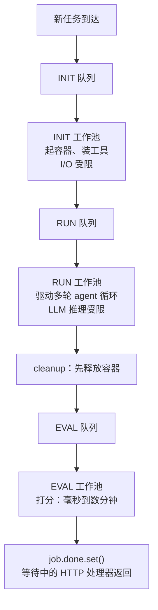
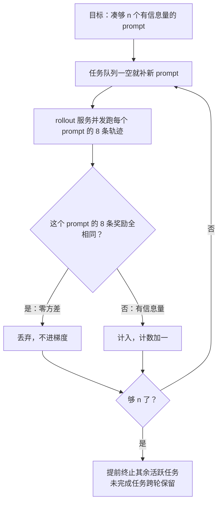
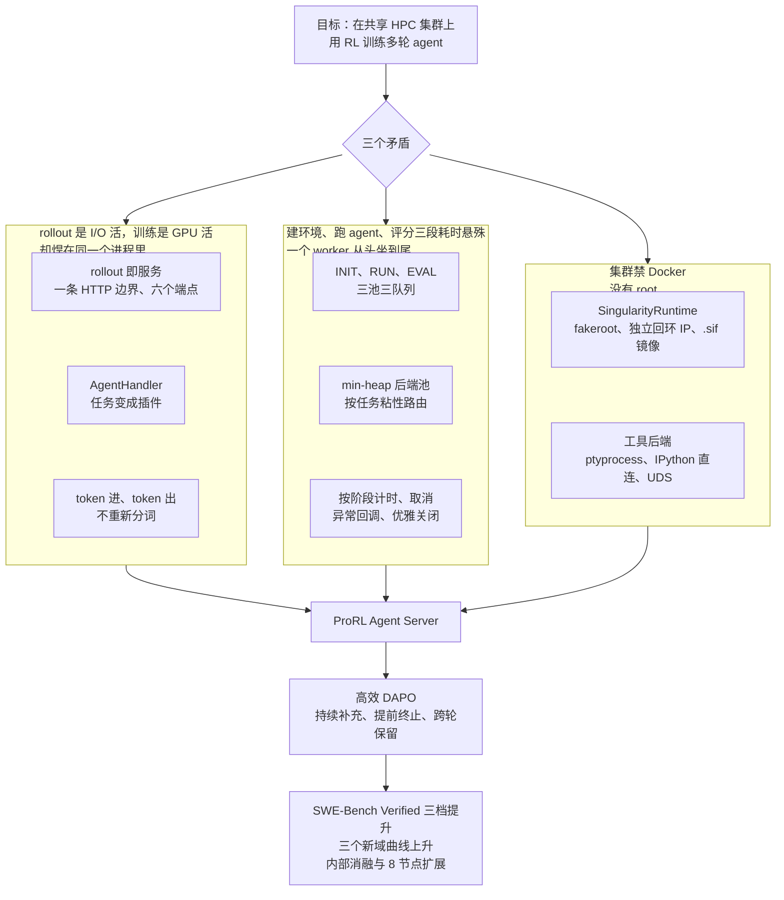

# ProRL Agent：多轮 Agent 的 rollout 是 I/O 活，别把它焊死在 GPU 训练循环里

<!-- release-date: 2026-03-19 -->

> 本文依据 **ProRL Agent: Rollout-as-a-Service for RL Training of Multi-Turn LLM Agents**，即 arXiv:2603.18815v1、2026-03-19 提交、共 22 页的预印本（正文与结论 p. 1–14、参考文献 p. 15–17、附录 A 五张架构图 p. 18–22）。十三位作者中，Hao Zhang、Mingjie Liu、Shaokun Zhang 三人标星为核心贡献者，末位是 Yi Dong；首页没有逐人标注单位，只有页脚的「© 2026 NVIDIA」（PDF p. 1）。它是 NVIDIA 同一团队 ProRL 训练框架的配套 rollout 基础设施，所以放在 NVIDIA 目录下。页码均指 PDF 本身的页码。
>
> **版本说明**：截至 2026-09-08 核验，arXiv 提交历史只有一条「[v1] Thu, 19 Mar 2026 12:08:51 UTC」，与本地原件一致，无需替换。**`release-date` 取 2026-03-19**，理由与证据链见文末「资料与阅读边界」——一句话说：代码仓库确实早于论文就存在，但查不到任何早于 arXiv v1 的**官方**公开事件。
>
> 这是一篇系统论文，没有模型架构和预训练 recipe 可讲；它讲的是「让多轮 agent 在沙箱里跑出轨迹」这件事本身该怎么组织。全文会把三件事分开写：**论文明确写了什么**（带页码）、**本文如何解释它**（凡属推算、换算或从图上读数都会写明）、**外部资料补充**（会给出链接并标注）。

## 读之前需要的最少背景

这篇论文假设你知道「用强化学习训练一个会用工具的 agent」大概长什么样。如果不熟，记住下面几件事就够读完全文。

**多轮 agent 的一条轨迹是怎么来的。** 给模型一个任务（比如「修好这个仓库里的 bug」）。模型看一眼当前上下文，写出一个动作——一条 shell 命令、一段 Python、一次文件编辑、一次搜索。动作在一个隔离环境里执行，执行结果（观察）追加回上下文，模型再写下一个动作。如此往复几十次，直到它宣布完成或者超出轮数上限。这一整串「动作 → 观察 → 动作 → 观察」叫一条 **trajectory（轨迹）**，生成它的过程叫 **rollout**。论文开篇说，这类任务的轨迹「往往跨越几十个回合、几万个 token」（PDF p. 1）。

**RL 训练怎么用这些轨迹。** 训练器（trainer）拿一批任务，让当前策略模型各跑若干条轨迹，用一个可验证的规则给每条打分——代码任务就跑测试，数学任务就比对答案。这叫 **RLVR（Reinforcement Learning from Verifiable Rewards，可验证奖励强化学习）**。然后用打分后的轨迹算优势、反向传播、更新模型。更新完，再用新模型跑下一批。本站 [DeepSeek-R1](/reports/DeepSeek/DeepSeek-R1) 与 [DeepSeekMath](/reports/DeepSeek/DeepSeekMath) 两篇讲的是这条循环的算法侧。

**这篇论文关心的是上面那一步里最不像「训练」的部分。** 单轮数学题的 rollout 只是「让模型写一段文字」；多轮 agent 的 rollout 却包括：为每个任务启动一个隔离环境、装好工具、跑几十次工具调用、收集产物、再跑一遍评测。它的瓶颈是磁盘、网络、进程管理，不是 GPU。

四个后面会反复出现的词：

- **沙箱（sandbox）**：让 agent 跑命令、改文件的隔离环境。通常是一个容器。
- **scaffold / harness（脚手架）**：包在模型外面、负责组织提示词、解析动作、调用工具的那层代码。OpenHands、SWE-agent 都是这类东西。
- **Docker 与 Singularity**：两种容器技术。Docker 需要一个常驻的、以 root 身份运行的守护进程；Singularity 不需要守护进程，以普通用户身份运行，镜像是单个文件。后者是高性能计算（HPC）集群的常见选择。这一句是外部背景，论文只给了结论，见后文「沙箱」一节。
- **Slurm**：HPC 集群上最常见的作业调度器。你不能在节点上随便起服务，一切都要按作业提交，而且没有 root。

最后，这篇论文和本站另外几篇是同一条线上的不同层：[HybridFlow](/reports/ByteDance/HybridFlow) 讲同步 RLHF 框架的编程模型，[AReaL](/reports/AntGroup/AReaL) 与 [Laminar](/reports/ByteDance/Laminar) 讲生成与训练异步后的陈旧度问题，[DAPO](/reports/ByteDance/DAPO) 讲长思维链 RL 的算法改动。本文会在后面单独用一节交代它们的分工，中间不重复它们的内容。

## 一句话先说清

这篇论文要解决的问题，可以用一句大白话讲完：

> **现有的 agent RL 框架，把「跑 agent」这件事写在训练器的进程里。于是一个 I/O 密集的活和一个 GPU 密集的活被绑在同一套代码、同一批机器上，谁也动不了谁。**

论文指出这种耦合有两笔具体的账（PDF p. 1–2）：

1. **资源需求冲突。** rollout 是 I/O 密集的：建沙箱、维持长生命周期的工具会话、协调几百个并发实例。训练是 GPU 密集的：前向、反向、梯度同步。把两者放在一起会互相干扰，整体资源效率下降。
2. **难迁移、难维护。** rollout 逻辑嵌在训练器里，换一个训练后端就得把整条 agent 执行流水线重写一遍；反过来，给 rollout 加一种新环境、新任务，改动也会波及训练代码。两边的实验和优化都变慢。

论文给的答案借了推理引擎的思路：vLLM、SGLang 把「推理」做成一个服务，谁都可以通过 API 调用；那就把「rollout」也做成一个服务（PDF p. 2）。论文把这叫 **rollout-as-a-service（rollout 即服务）**：

> **ProRL Agent 是一个独立的 HTTP 服务。训练器提交一个任务实例，服务在内部跑完整条 agent 轨迹——从建环境到评分——然后把带奖励的轨迹交回去。训练器不管理 rollout 生命周期的任何一部分。**（PDF p. 2）

为了让这个服务在真实集群上跑得动，论文另外做了三件事（PDF p. 2）：

1. **token 进、token 出**：训练链路里全程传 token id，不传文本，避免重新分词带来的漂移；
2. **可扩展的沙箱环境**：任务逻辑封装成插件，容器运行时用 Singularity；
3. **免 root 部署**：能在共享的 Slurm 集群上跑几百个并发 rollout。

论文报告的结果是：用 DAPO 在 32 张 H100 上训练，Qwen3 的 4B、8B、14B 三档模型在 SWE-Bench Verified 上分别从 14.8 涨到 21.2、9.6 涨到 18.0、15.4 涨到 23.6（PDF p. 11，Table 2）。**先记住一点：这篇论文没有任何「比别的框架快多少」的对比实验**。它证明的是「这套东西能把 RL 训起来、而且能扩展」，消融只在自己内部做（PDF p. 13）。这个区别在后面读实验时很重要。

## 阅读路线

- 只想知道它做了什么：读「全景」和紧跟着的「一条任务的一生」，十分钟够了。
- 想学系统设计：六个设计各自按「旧问题 → 新设计 → 工作机制 → 收益 → 代价」展开，每节末尾有一条可迁移的判断。
- 想知道实验到底证明了什么：读「实验怎么证明」和「限制与未公开信息」，那里把每个数字的分母摆开了。
- 想把它放进 RL 系统的版图：读「这一篇和 HybridFlow、AReaL、Laminar 怎么串起来读」和「外部补充：论文之后」。

## 全景：三层，一条 HTTP 边界

```mermaid
flowchart TB
    subgraph T["③ RL trainer（veRL 或 NeMo RL，跑在 GPU 节点）"]
        T1["准备一批任务实例"] --> T2["POST /process"]
        T5["收齐轨迹与奖励"] --> T6["张量化 → 算优势 → 更新 actor"]
        T6 --> T7["新权重装进推理引擎"]
        T7 --> T8["POST /clear_llm_server<br/>再 POST /add_llm_server"]
    end
    subgraph S["② ProRL Agent Server（独立 HTTP 服务）"]
        Q1["INIT 队列与工作池"] --> Q2["RUN 队列与工作池"] --> Q3["EVAL 队列与工作池"]
        H["LLM 后端池<br/>min-heap，按任务计数"]
    end
    subgraph E["① 沙箱环境"]
        AH["AgentHandler<br/>init / run / eval"]
        C["Singularity 容器<br/>fakeroot，独立回环 IP"]
    end
    I["推理引擎池（如 vLLM）<br/>权重由 trainer 负责更新"]
    T2 -->|HTTP| Q1
    Q1 -->|init| AH
    AH --> C
    Q2 -->|run：多轮 agent 循环| AH
    Q2 -->|token id 进出| H
    H --> I
    Q3 -->|eval| AH
    Q3 -->|轨迹 + 奖励| T5
    T8 --> H
```

这是根据 PDF p. 4 的 Figure 2 与 p. 18 的 Figure 6 重画的**机制示意图**，箭头表示数据流与控制流方向，不表示实测时长。三层各自的职责（PDF p. 4）：

| 层 | 组件 | 干什么 |
|---|---|---|
| ① 沙箱环境 | `SingularityRuntime` + `AgentHandler` | 每条 rollout 在一个 Singularity 容器里执行；`AgentHandler` 暴露 `init()`、`run()`、`eval()` 三个生命周期方法，分别对应环境准备、多轮 agent 执行、奖励打分 |
| ② ProRL Agent Server | 三阶段异步流水线 + LLM 后端池 + HTTP 管理 API | 用三个独立的工作池管理几百条并发 rollout；维护一个 min-heap 的 LLM 后端池，支持动态注册与 checkpoint 交换 |
| ③ RL trainer | 任何训练框架 | 只通过 HTTP 与服务交互：`POST /process` 提交任务，`/add_llm_server` 与 `/cancel` 管理后端和任务；收回轨迹与奖励后更新策略 |

这张图里有两条边界值得先看清。

**第一条是那条 HTTP 线。** 训练器这边只有「提交任务」和「收回结果」两个动作；沙箱怎么起、工具怎么调、评测怎么跑，全在线的另一侧。论文说这带来三个实际后果（PDF p. 4–5）：训练器和 rollout 逻辑可以独立开发、独立部署，rollout 节点和训练节点分开调优；加一个新任务只需要在服务端写一个 handler 插件，训练代码一行不改；agent 的脚手架可以随便换，训练基础设施不受影响。

**第二条边界容易漏看：推理引擎不在服务里，权重更新也不归服务管。** 图里那个「推理引擎池」是训练器起的 vLLM 之类的服务，训练器把它的地址注册进 rollout 服务；训练器更新完策略，也是训练器自己把新权重装进推理引擎，然后通知 rollout 服务「换后端」（PDF p. 8）。也就是说，**ProRL Agent 解耦的是 agent 执行与训练，不是生成与训练**。生成侧的推理引擎仍然是训练框架的一部分。这一点决定了它和 AReaL、Laminar 那一类「异步 RL 系统」根本不在同一个问题上，后面会专门说。

### 一条任务的一生

把上面的图变成一条时间线。以一个软件工程任务为例，按附录 Figure 6 与正文的 Listing 2、Listing 3 走一遍（PDF p. 7–9、18）：

1. **提交。** 训练器的驱动进程准备一批任务实例，对每个任务发一个 `POST /process`，请求体里是任务实例和采样参数（PDF p. 8、18）。服务端的 HTTP 处理器把任务放进 INIT 队列，然后等在这个任务的完成事件上。Figure 6 写的是「按任务收 HTTP 响应」；实验里每个实例要跑 8 条 rollout（PDF p. 11），这 8 条是 8 个请求还是一个请求里的采样参数，论文没有写。
2. **建环境。** INIT 池的一个 worker 取到任务，在注册表里按任务名找到 handler，调它的 `init`：起一个 Singularity 容器、分配回环 IP、装好这个任务的工具集，返回运行时、元数据和配置（PDF p. 5–6、18）。任务进 RUN 队列。
3. **跑 agent。** RUN 池的 worker 调 `run`。它先从 min-heap 里挑一个推理后端并固定给这个任务（PDF p. 9）；然后进入 `for turn in range(50)` 的循环（PDF p. 18）：把当前上下文的 token id 发给 vLLM，收回 response 的 token id 与逐 token 对数概率（PDF p. 9）；解析出动作，经 UDS 发给容器内的执行服务器，拿回观察（PDF p. 6–7）；观察分词后追加到上下文，下一轮。循环结束时收齐轨迹和产物；worker 调 `cleanup(job.runtime)` 释放容器（PDF p. 8）。任务进 EVAL 队列。
4. **评分。** EVAL 池的 worker 调 `eval`：应用 git patch、跑测试、算奖励（PDF p. 18）；`final_result` 把结果序列化；`job.done.set()` 唤醒第 1 步里等着的 HTTP 处理器，轨迹与奖励作为响应返回训练器（PDF p. 5、8）。
5. **训练。** 训练器收齐一批——DAPO 的补充与提前终止逻辑在这一步介入（PDF p. 10）——张量化、算优势、更新 actor（PDF p. 18）；把新权重装进推理引擎；`POST /clear_llm_server`，再逐个 `POST /add_llm_server`（PDF p. 8）。下一批开始。
6. **出岔子的时候。** 任何阶段抛异常，对应的 `*_exception` 回调填一个结构化的兜底结果，照样置完成事件（PDF p. 9）；训练器把出错的 rollout 排除在梯度之外（PDF p. 11）。训练器攒够了有效样本，对剩下的任务发 `POST /cancel`（PDF p. 9）。

这六步里，训练器只出现在第 1、5、6 步，而且每次都只是发一个 HTTP 请求。**这就是「rollout 即服务」的全部含义：训练器知道任务什么时候提交、什么时候回来，不知道中间发生了什么。**

## 第一层矛盾：耦合到底长什么样

论文最有用的一部分不在正文，在附录：它把五个现有框架的进程放置各画了一张图（PDF p. 19–22）。正文只用一张表总结（PDF p. 3，Table 1）：

| 框架 | 训练与 rollout 解耦 | 免 root 沙箱 | 不绑定特定脚手架 |
|---|:---:|:---:|:---:|
| SkyRL-Agent | ✗ | ✗ | ✓ |
| VeRL-Tool | ✗ | ✗ | ✓ |
| Agent Lightning | ✗ | ✗ | ✗ |
| rLLM | ✗ | ✗ | ✓ |
| GEM | ✗ | ✗ | ✓ |
| ProRL Agent | ✓ | ✓ | ✓ |

表格只给了勾叉，附录的图才说清「✗」是什么意思。本文按五张图把它们归成三种耦合形状：

| 形状 | 谁 | 附录图里的证据 | 论文的判词 |
|---|---|---|---|
| **推理与环境都外包了，但 agent 循环还在训练进程里** | SkyRL-Agent | 训练驱动进程里跑 512 个协程（64 条 prompt × 8 条轨迹），每个协程自己走 `for turn in range(50)`，用 Ray RPC 打远程 vLLM、用 HTTP 打远程 Docker（PDF p. 19，Figure 7） | 「虽然推理与环境执行被卸载了，rollout 控制仍留在训练驱动里」 |
| **只把工具执行外包** | VeRL-Tool | `AgentLoopWorker` 在 trainer 里做 GENERATE → PARSE → TOOL CALL → APPEND；工具服务器在 CPU 节点，用 CRC32 做粘性路由到 8 个后端 worker（PDF p. 21，Figure 9） | 「rollout 控制仍在 trainer 内」 |
| **全部塞在一个进程树里** | rLLM、GEM、Agent Lightning | rLLM 用 `ThreadPoolExecutor(64)` 在单个驱动进程里建 Docker 环境、跑 agent、算奖励（PDF p. 21，Figure 10）；GEM 把 16 个环境当内存里的 Python 对象，直接 `env.step()`（PDF p. 22，Figure 11）；Agent Lightning 的 `LightningStoreServer` 是训练进程里的一个后台线程，rollout worker 是它的子进程——训练进程一退出，store 也停，worker 全断（PDF p. 20，Figure 8） | 「没有独立的 rollout 服务生命周期」 |

这三种形状的共同点是：**rollout 什么时候开始、跑到哪一步、什么时候算完，都由训练进程的代码决定。** 论文由此推出两条判断：其一，换训练后端「往往要把整个 rollout 栈重新实现或移植一遍」；其二，这层摩擦「常常比训练算法本身消耗更多工程精力」（PDF p. 3）。

**一处要留个记号。** Table 1 给 Agent Lightning 的「不绑定脚手架」打了 ✗（PDF p. 3）。Agent Lightning 自己的说法恰恰是「训练任何 agent」；同一个 NVIDIA 团队两个月后的 Polar 论文，给它这一项打的是「部分满足」（外部对照，见文末）。两份材料的口径不一致，本文照录，不替它们裁决。

### 沙箱这一侧的另一个耦合

除了 rollout 与训练的耦合，论文还点了一个更底层的问题：现有沙箱平台——R2E-Gym、SWE-bench、OpenHands、SWE-agent——「深度依赖 Docker」（PDF p. 4）。Docker 假设你有守护进程和 root 等价的权限，而共享的 Slurm 集群通常两样都不给。于是实践者要么为评测和部署各维护一套基础设施，要么承担在受限系统上跑特权容器运行时的运维复杂度（PDF p. 4）。

这一点是全文「免 root」那条线的来历。它不是锦上添花：**如果沙箱起不来，前面所有的解耦都是纸上谈兵。**

## 设计一：把任务写成一个三段式插件

### 旧问题

不同的 agent 任务——软件工程、数学推理、电脑操作——各有各的环境准备、agent 行为和奖励算法。把这些差异硬编码进服务器，服务器会变得脆弱，而且「永远依赖大量人工」（PDF p. 5）。

### 新设计：AgentHandler

论文把所有任务相关的逻辑封进一个抽象接口 `AgentHandler`，它定义三个生命周期方法，一一对应流水线的三个阶段（PDF p. 5）：

- `init`：为任务初始化沙箱环境，给 agent 配好工具集；
- `run`：在准备好的沙箱里驱动多轮 agent 循环，收集动作—观察轨迹和任务产物；
- `eval`：把 agent 的输出和标准答案比对，返回一个标量奖励。

每个 handler 还要提供三个按阶段的异常回调（`init_exception`、`run_exception`、`eval_exception`）和一个 `final_result` 方法负责序列化响应，「保证即使 rollout 中途失败，服务器也总能吐出一个格式良好的输出」（PDF p. 5）。Listing 1 里三个核心方法都是 `async def`，`init` 返回 `(Runtime, Metadata, Config)` 三元组，`run` 和 `eval` 返回字典（PDF p. 5）。

任务域各自继承 `AgentHandler`、用一个唯一名字注册。服务器收到任务后，读出任务实例、在注册表里查到对应 handler、按顺序调它的生命周期方法（PDF p. 5–6）。

### 为什么是三段而不是一个 `run()`

这三段的划分不是为了代码整洁，是为了下一节的流水线：**只有把 I/O 受限的 `init`、推理受限的 `run`、时长不定的 `eval` 切开，它们才能被分到三个独立的工作池里并行推进**（PDF p. 7）。如果 handler 只有一个 `run()`，服务器就只能给每个任务派一个 worker 从头等到尾。

### 收益与代价

收益是论文反复强调的那句：「加一个新任务只需要在 rollout 服务端实现一个 handler 插件，训练代码零改动」（PDF p. 5）。第四节的四个域——软件工程、STEM、数学、代码——正是四个不同的 handler 加各自的工具配置和奖励设计（PDF p. 12）。

代价是**每个任务都得有人写这个 handler**，而且 `run()` 里那个多轮 agent 循环就是脚手架本身。也就是说，agent 的逻辑仍然要以「实现一个 handler」的形式被搬进服务里。这是这套设计的天然边界，也是它的后继者 Polar 决定推翻的那一点（外部对照，见文末）。

### 可迁移的部分

> **给一个长流程定接口时，先按「资源类型」切段，再按「业务含义」切段。** 三段各自的瓶颈不同（磁盘、GPU、CPU 或子进程），这才是它们能并行的前提；错误回调按段配置，也才能让「哪一段坏了」变成一条结构化信息而不是一个未捕获的异常。

## 设计二：三条队列、三个工作池

### 旧问题

论文用装配线打比方（PDF p. 8）。朴素做法是给每个任务派一个 worker，让它把三件事做完再接下一个：起容器、跑 agent、评分。问题是三段的耗时和资源完全不同：

- 起容器慢，因为在等磁盘 I/O 和网络；
- agent 执行每次调用都快，但要发几十次 LLM 请求，瓶颈是 GPU 吞吐；
- 评测可能瞬间完成（比对一个数学答案），也可能跑好几分钟（跑整套测试）。

「一个 worker 顺序坐完三段，大部分时间都在等当下最慢的那一段」（PDF p. 8）。论文把服务器的第一条需求写成：「在每个任务内部执行这三段，不应让吞吐被最慢的一段限制住」（PDF p. 7）。

### 新设计：按阶段解耦

这是根据 PDF p. 7–8 的 Listing 2 与 §3.3.1 正文重画的**机制示意图**，方框是同一个任务依次经过的站点，三个工作池同时在处理不同任务，不表示实测时长。

Listing 2 把机制写得很直白（PDF p. 7–8）：

- `STAGES = [INIT, RUN, EVAL]`，每个阶段一个线程安全的 FIFO 队列和一个 `ThreadPool(N[s])`；
- 每个 worker 的循环是：从本阶段队列取任务 → 若任务已被标记 `discarded` 则跳过 → 在 `job.timer.phase(stage)` 里执行 handler 的对应方法（**只有这一段计入超时**）→ 出异常就改调 `handler[stage + '_exception']` → 把结果存进任务；
- **RUN 阶段结束时先 `cleanup(job.runtime)`，「在 eval 开始前释放容器」**；
- 不是 EVAL 就把任务放进下一阶段的队列，是 EVAL 就 `job.done.set()`，唤醒等在 HTTP 处理器上的那个请求。

于是任何时刻三个池都在忙不同的任务：一个在评测、一个在跑 agent、一个在起容器。而且三个池可以分别设大小：init 池多开几个吸收慢启动，测试套件特别长时就多开 eval 池（PDF p. 8）。

Listing 2 只有二十来行，但每一行都换来一条具体的保证。本文按 Listing 2 逐行整理（PDF p. 7–8）：

| Listing 2 里的那一行 | 它买到了什么 |
|---|---|
| 每阶段一个 `Queue()` 和一个 `ThreadPool(N[s])` | 三段可以按各自的负载独立设并发度 |
| `if job.id in discarded: continue` | 取消是「打标记、让 worker 跳过」，不用去队列里删元素，也不用加锁改队列 |
| `with job.timer.phase(stage)` | 排队时间不计入超时预算 |
| `except Exception` 后改调 `handler[stage + '_exception']` | 单个任务的失败不会让 worker 线程死掉、也不会卡住池 |
| `if stage == RUN: cleanup(job.runtime)` | 容器只活到 agent 循环结束，评测期间不占它 |
| `job.done.set()` | HTTP 处理器可以「等一个事件」，不必轮询 |

### 一个论文没有明说、但从 Listing 2 能推出来的细节

RUN 一结束就释放容器，那 EVAL 靠什么跑测试？软件工程任务的评测是「apply git patch, run tests」（PDF p. 18，Figure 6）。这两条放在一起，只有一种解释成立（**以下是本文的推断，论文没有写**）：`run` 阶段收集的「任务产物」（PDF p. 5）——对代码任务来说就是 agent 改出来的 patch——被带出容器；`eval` 阶段在自己的评测环境里应用 patch、跑测试。这样做的好处很明确：**agent 干活的那个容器在评测期间不必活着**，容器占用时间缩短到 `run` 一段。代价是评测环境要能独立重建，这对有标准 Docker 镜像的 SWE 类任务是现成的，对状态更复杂的任务（比如 GUI 操作）未必。

### 收益与代价

收益在消融里有一个侧面证据：去掉「陈旧任务清理」——也就是等所有任务都跑完再进下一步——吞吐从 0.37 降到 0.30 实例/秒，GPU 利用率从 78% 掉到 65%（PDF p. 13，Table 3）。这一条测的不是流水线本身，但它说明**在这套负载里，「等最慢的那个」这个动作确实值一成多的吞吐**。三阶段流水线消除的是同一类等待。

代价论文没有讨论，本文核对后的观察是：

1. **队列是纯 FIFO，没有优先级。** 一个刚被取消的任务前面若排着几十个待评测任务，它的释放也只能等。论文没有说明各池的 `N[s]` 怎么设、有没有背压。
2. **三个池的大小仍要人调。** 论文只说「可以分别设」，没有给任何设置值或自动调整机制。
3. **`cleanup` 在 `run` 之后、`eval` 之前**，意味着一条轨迹的中间状态在评测期间已经不存在了；评测失败没法回到容器里看。

### 可迁移的部分

> **当一个作业由几段资源类型不同的子任务组成时，不要按作业分 worker，要按阶段分 worker。** 判据是：如果某一段的耗时方差很大（这里是评测的「毫秒到数分钟」），按作业分 worker 会让整条流水线的节奏被这一段的最慢样本拖住；按阶段分则只让这一段自己排队。

## 设计三：LLM 后端池——谁来算下一步

### 旧问题

agent 循环的每一步都要一次 LLM 补全：模型读当前对话历史，产出下一个动作。几百条 rollout 并行时，这些请求同时、高频地打到推理层，单个 LLM 服务器很快成为瓶颈，所以 RL 训练通常同时部署一池 LLM 服务器（PDF p. 8）。问题是谁来管这个池。论文的答案是 rollout 服务自己管，「训练框架不必自己协调 LLM 访问」（PDF p. 8）。

服务器的第二条需求由此而来（PDF p. 7）：训练框架要能动态控制推理后端——集群扩容时注册新服务器、模型 checkpoint 更新时换后端、梯度批次已经推进时取消陈旧的在途任务——而且不能耦合到服务器内部。

### 新设计：一个管理 API 加一个 min-heap

管理 API 只有六个端点（PDF p. 8，Listing 3）：

| 端点 | 作用 |
|---|---|
| `POST /add_llm_server {"address": "http://host:port/v1"}` | 注册一个推理后端 |
| `POST /clear_llm_server` | 清空全部后端 |
| `POST /process {"instance": {...}, "sampling_params": {...}}` | 提交一个任务 |
| `POST /cancel {"job_id": "..."}` | 中止一个在跑的任务 |
| `POST /start`、`POST /stop` | 服务生命周期 |
| `GET /status` | 各队列深度 |

**checkpoint 交换是这样做的**（PDF p. 8）：训练器更新完策略，旧的 LLM 权重失效；它不重启 rollout 服务，而是先调 `/clear_llm_server` 清空所有已注册后端，再把重新加载过的 LLM 服务器端点注册回来。「从那一刻起，所有后续 rollout 自动使用更新后的模型，已在流水线中的任务不受打断」（PDF p. 8）。

**负载均衡用一个 min-heap**（PDF p. 9）。每个后端连同一个分配计数放在堆里；每次 RUN 阶段要发 LLM 调用时，服务器选计数最小的后端，把**整个任务**分给它。选定后端 $s^{*}$ 并更新计数的规则是：

$$
s^{*} = \arg\min_{s} w_s,\qquad w_{s^{*}} \leftarrow w_{s^{*}} + 1
$$

其中 $w_s$ 是服务器 $s$ 自注册以来被分配的次数。**计数按任务加一，不按调用加一**——同一个任务后续所有调用都固定路由到同一个后端，「以最大化前缀缓存复用」（PDF p. 9）。因为选择正比于分配计数，收到更多流量的服务器优先级自然后退，形成「类似轮询的均衡，且不需要任何全局同步」；整个操作用一把锁保护（PDF p. 9）。

### 为什么按任务而不按调用

这一条是全节最值得记的设计判断。一条多轮轨迹的每一步都以前面所有回合为前缀。如果第 $k$ 步和第 $k+1$ 步落在不同的推理服务器上，第 $k+1$ 步的前缀在那台机器上是冷的，要从头 prefill 几万个 token；落在同一台上，前缀的 KV Cache 大概率还热着。**多轮 agent 的推理成本主要是 prefill，而 prefill 的成本主要能靠前缀缓存省掉——前提是别把一条轨迹拆到多台机器上。** 这就是「粘性路由」在这里比「每次调用都找最闲的」更重要的原因。VeRL-Tool 的工具服务器用 CRC32 做粘性会话（PDF p. 21，Figure 9），解决的是同一个问题的另一侧。

### 两处措辞不一致，本文照录

1. Listing 2 里 `llm_backends = MinHeap()` 的注释写「按在途计数（in-flight count）作键」（PDF p. 7），而正文说计数是「自注册以来被分配的总数」、只增不减（PDF p. 9）。前者是「最少在途」调度，后者是「累计轮询」调度，行为并不相同——比如一个后端上的任务早早跑完，「在途」口径会立刻把它排到前面，「累计」口径不会。论文没有说明实际实现是哪一种。
2. 正文先说计数「按任务加一而非按调用」，紧接着又说 $w_s$ 「统计分配给服务器 $s$ 的推理调用总数」（PDF p. 9）。结合上下文应理解为按任务计数，「调用」是笔误。

### 收益与代价

收益有消融数字：把负载均衡换成「给每个 LLM 服务器分配相同数量的实例」，GPU 利用率从 78% 掉到 42%，吞吐从 0.37 掉到 0.25 实例/秒（PDF p. 13，Table 3）。本文换算，这是所有消融项里最大的一笔：吞吐掉了 32%。它说明**静态均分对 agent 负载是灾难性的**——不同任务的轨迹长度、轮数、每轮上下文差异极大，均分实例数根本不等于均分推理负载。

代价论文没有讨论，本文核对后的观察是：

1. **按任务计数只均衡了「任务数」，没有均衡「token 数」。** 一个跑满 50 轮、每轮上下文几万 token 的任务，和一个三轮就结束的任务，在堆里都算 1。粘性路由拿到了前缀缓存，就必然放弃了细粒度均衡；论文选择了前者，但没有测量由此带来的不均衡有多大。
2. **checkpoint 交换时的在途任务用的是什么权重，论文没写。** 「已在流水线中的任务不受打断」只是说它们不会被取消。如果推理服务器是原地重载权重（端点地址不变），那么一条正在跑的轨迹前半段用旧权重、后半段用新权重生成——这正是 [Laminar](/reports/ByteDance/Laminar) 那篇用整整一节批评「部分 rollout」时指出的混版本问题；如果是另起新服务器、旧服务器继续服务在途任务直到退役，就没有这个问题，但要多占一份显存。两种实现的算法含义完全不同，论文没有交代是哪一种。
3. **`/clear_llm_server` 之后、`/add_llm_server` 之前有一个后端池为空的窗口。** 这段时间新的 LLM 调用怎么处理——阻塞、报错还是重试——论文没有写。

### 可迁移的部分

> **有前缀缓存的推理负载，均衡的单位应该是「会话」而不是「请求」。** 更一般地：当一个请求序列的后续步骤强依赖前序步骤在服务端留下的状态时，把序列固定到一台机器上带来的收益，通常大于逐请求均衡带来的收益。要补的是对「会话大小」的估计，而不是退回逐请求均衡。

## 设计四：token 进、token 出

### 旧问题

如果轨迹在训练链路里以纯文本传递，「重新分词可能是有损的：得到的 token 序列可能和 rollout 时实际生成的那一串不同，导致意料之外的离策略偏差」（PDF p. 9）。论文把这叫 **re-tokenization drift（重分词漂移）**，引的是 Agent Lightning 团队 2025 年的一篇博客（PDF p. 2、9）。

论文自己没有解释漂移为什么会发生，本文按那篇博客补一段背景（**外部补充**，[vLLM 博客，2025-10-22](https://vllm.ai/blog/2025-10-22-agent-lightning)）。漂移来自三处：其一，分词不唯一——同一个词，模型生成时可能切成 `H` + `AVING`，再编码时却切成 `HAV` + `ING`，文本相同而 token id 不同；其二，工具调用的序列化——`<tool_call>{...}</tool_call>` 被解析成对象再渲染回文本，空白和格式可能变了；其三，不同框架的聊天模板略有差异。博客给的后果是训练曲线不稳定，因为「模型当初没有生成过这串 token，你却在用它算这串 token 的概率」。博客提出的修法是让 vLLM 从 v0.10.2 起支持在请求里加 `return_token_ids: true`，响应里直接带 `prompt_token_ids` 与 `token_ids`。

### 新设计

ProRL Agent 把 token id 当作贯穿整个训练过程的规范表示（PDF p. 9）：

- rollout worker 把 `prompt_ids` 直接发给 LLM 后端，收回 `response_ids` 和逐 token 的对数概率；
- 每条消息额外带 `input_ids`、`output_ids`、`logprobs` 三个字段，生成时填好、之后原样传递；
- 多轮 rollout 里，**先前的 assistant 回合保留原始 token id、直接拼进输入缓冲区；只有新消息（比如环境观察）才被分词后追加**。

于是「返回给训练器的每一个 token id 都与 rollout 时产出的完全一致」（PDF p. 9）。

### 它保证了什么、没保证什么

它保证的是**模型自己生成的那些 token** 不会被改写。环境观察本来就不是模型生成的，重新分词也谈不上「漂移」；把它们分词后追加是唯一可行的做法。

它没有覆盖的是**聊天模板**这一层：训练器在算对数概率时怎么拼接系统提示、角色标记，和 rollout 侧是否逐 token 一致，论文没有讨论。博客把这列为三种漂移来源之一，ProRL Agent 的机制只堵住了前两种。

### 可迁移的部分

> **凡是要在两端算同一个概率的数据，两端拿到的必须是同一串离散符号，不能是「等价的文本」。** 这条规则不只适用于 RL：任何「生成 → 序列化 → 反序列化 → 再评分」的链路，都要问一句：反序列化回来的东西，是原物还是等价物？

## 设计五：免 root 的沙箱

### 旧问题

大多数 agent 沙箱假设你在云或工作站上，Docker 随手可得。HPC 集群「通常出于安全原因禁止 Docker 守护进程，要求所有用户进程在 Slurm 之类的批调度器下以非 root 身份运行」（PDF p. 6）。

### 新设计：SingularityRuntime

论文实现了一个「不需要常驻守护进程、完全作为非特权用户进程运行」的容器系统（PDF p. 6）。具体做了四件事：

**隔离与端口。** 每个容器作为一个子进程在自己的会话里启动；关闭时先发 `SIGTERM`，必要时升级到 `SIGKILL`。为了让同一节点上的许多容器互不抢端口，每个容器实例通过一个线程安全的分配器拿到一个 `127.x.x.x` 范围内唯一的回环 IP（PDF p. 6）。

**两个标志。** `--fakeroot` 给容器模拟的 root 权限，用来装软件包，不需要宿主机的真实特权；`--network none` 可选地切断外网，把 rollout 与外界干扰隔离（PDF p. 6）。

**镜像。** 打包成 Singularity Image File（`.sif`），一个文件装下整套执行环境，「特别适合没有常驻容器守护进程的 Slurm 共享文件系统」。配套的 `SingularityRuntimeBuilder` 从 Jinja2 模板构建镜像，支持三种缓存模式：`Scratch` 每次全量重建；`Versioned` 在基础镜像与框架版本不变时复用缓存；`Lock` 在依赖锁文件相同时复用（PDF p. 6）。

**可特化。** 模板驱动的设计让不同环境可以各自特化，比如 GUI 任务用的 QEMU 虚拟机可以给 builder 提供自定义 definition 文件，不用改核心构建逻辑（PDF p. 6）。

一点外部背景（**外部补充**，来自 Singularity/Apptainer 的通用知识，不是论文内容）：Singularity 是为 HPC 设计的容器运行时，2021 年社区版改名 Apptainer；它的特点正是无守护进程、以调用者的用户身份运行、镜像是单文件，`--fakeroot` 依赖 Linux 用户命名空间把容器内的 uid 0 映射到宿主机的普通用户。论文选它，不是选了一个「更好的 Docker」，是选了一个能在 Slurm 下起得来的东西。

### 为什么每个容器要一个独立 IP

这条和下一节的 UDS 是同一个问题的两半。同一节点上跑几十个容器，每个容器里都有一个小执行服务器要监听端口。如果大家共用 `127.0.0.1`，就只能靠端口号区分，端口分配要全局协调、还容易冲突；给每个容器一个自己的回环 IP，端口空间就互不重叠了（PDF p. 6–7）。

### 收益与代价

收益是全文「能在共享 HPC 上跑几百个并发 rollout」这条主张的基础（PDF p. 2、7）。它没有对应的消融——论文没有拿 Docker 版本做对照，也不可能在禁 Docker 的集群上做。

代价论文没有讨论。本文核对后的观察：`--fakeroot` 的可用性取决于集群是否开启了用户命名空间，这是管理员的决定，不是用户能改的；`.sif` 单文件镜像的代价是每次依赖变化都要重建整个文件，三种缓存模式正是为了缓解这一点。

## 设计六：工具后端的三处减法

### 旧问题

agent 与环境交互几乎全靠工具：读写文件、跑 shell、执行 Python、浏览网页。**每次工具调用对 agent 来说都是同步阻塞的**——不拿到观察，它不能决定下一步。一条轨迹几十次调用，单次延迟直接累加进总时长；高并发下「这笔开销可能盖过 LLM 推理，成为首要瓶颈」（PDF p. 6）。

### 三处新设计

| 工具 | 传统做法 | ProRL Agent 的做法 | 论文的说法（PDF p. 6–7） |
|---|---|---|---|
| Bash | 命令经 tmux 会话转发，承担终端复用的开销 | 基于 `ptyprocess` 的直接伪终端，给 agent 一个没有 tmux 中介的原始 shell | 「显著降低 shell 命令的往返延迟」 |
| IPython | 经 Jupyter kernel gateway，即使内核与 agent 同机也要一次网络往返 | 通过内核的进程内 API 直连 | 「完全消除这笔开销」 |
| 动作通道 | agent 进程把动作发给容器内的小执行服务器，走 TCP 回环 | 换成 Unix domain socket（UDS） | 消息「直接经 OS 内核传递，没有任何网络开销」 |

第二条还有一个前提值得单独说：为什么要一个**持久的** IPython 内核。agent 多步写代码时常常在自己先前的工作上叠加——导入一次库、后面反复用；定义一个辅助函数、后面再调。持久内核让一步里定义的变量和导入在后续步骤里仍然可用，agent 不必每次重跑准备代码（PDF p. 6）。

第三条的理由除了快，还有前面说过的端口问题：TCP 回环下共用 IP 的进程只能靠端口区分；UDS 用文件系统路径寻址，根本不占端口（PDF p. 7）。

### 收益

有消融数字：把 Bash 换回 OpenHands 原版实现，平均动作执行时间从 0.42 秒涨到 0.78 秒，吞吐从 0.37 降到 0.29 实例/秒，GPU 利用率从 78% 降到 68%（PDF p. 13，Table 3）。本文换算：动作时间涨了 86%，吞吐掉了 22%。

**这组数字有一个值得多看一眼的地方**：动作时间几乎翻倍，但吞吐只掉两成多。这说明在这套负载里，shell 动作的耗时只是总耗时的一部分；LLM 推理和其他阶段摊薄了它。论文的解释是「Efficient Bash 靠减少动作执行时间提升吞吐，负载均衡与陈旧任务清理靠提升 GPU 利用率」（PDF p. 13）——两类优化作用在不同的分母上。

IPython 和 UDS 各自的收益论文没有单独测。

### 可迁移的部分

> **在一条「模型想一步、环境执行一步」的串行链路里，环境侧每一毫秒的固定开销都要乘以轮数。** 优化的顺序应该是：先去掉每次调用都要经过、但只为「通用性」存在的中间层（tmux、gateway、TCP），再考虑更花哨的东西。

## 任务的生命周期：超时、取消与失败隔离

这一节的四个机制都很短，但它们是「服务」和「函数」的区别所在——一个进程内的 rollout 函数不需要考虑这些，一个被几百个并发请求打着的服务必须考虑（PDF p. 9）。

**阶段感知的超时。** 每个任务带一个 `PausableTimer`，只在活跃的流水线阶段（init、run、eval）累计时间，排除在阶段间队列里等待的时间。「这保证超时预算反映真实执行时间，而不是服务端暂时的延迟」（PDF p. 9）。换句话说，一个任务不会因为前面排队的人多就被判超时。

**取消。** 训练框架随时可以 `POST /cancel` 中止任何在途任务。服务器收到后做四件事（PDF p. 9）：把任务标记为 `discarded`，尚未取到它的 worker 会跳过；取消当前正在执行的异步任务；关闭关联的容器运行时，立即释放资源；触发任务的完成事件，让等待中的 HTTP 处理器不阻塞地返回。论文点明了这条 API 的用途：「训练器在收集到足够多的有效样本后，可以丢弃未完成的 rollout」（PDF p. 9）。它是下一节 DAPO 提前终止的执行手段。

**失败隔离。** 每个阶段注册一个专门的异常回调。一旦失败，回调往 `JobDetails` 里填一个结构化的兜底结果并置完成事件，「防止任何单个失败的 rollout 卡住共享的工作池」（PDF p. 9）。

**优雅关闭。** 收到 `POST /stop`，服务器取消所有在途任务，通过进程组扫描终止 Singularity 进程，排空工作池，干净退出，「不在节点上留下孤儿容器」（PDF p. 9）。

这四条里最容易被低估的是最后一条。在共享的 Slurm 集群上，作业结束时留下的孤儿进程会继续占用别人的节点；「按进程组扫描」是在说：容器是服务的子进程，服务退出时它们必须一起退出。

## 连接训练器：两层负载均衡与「高效 DAPO」

### 支持谁

论文实现了对 VeRL 和 NeMo RL 两个训练器的支持（PDF p. 10）。附录给了一张进程放置示例（PDF p. 18，Figure 6）：训练侧是 4 个 GPU 节点、每节点 8 张卡上的驱动进程，做「准备一批任务实例 → `POST /process` → 收每个任务的 HTTP 响应 → 张量化 → 算优势 → 更新 actor」；服务侧是 CPU 或 GPU 节点上的 `start_server.py`，起一个监听 8000 端口的 FastAPI，里面跑三阶段流水线，RUN 阶段的 agent 循环是 `for turn in range(50)`。**最大 50 轮这个数只出现在这张图里**，正文没有提。

### 客户端的两层负载均衡

训练器这边还做了一层分配：把 LLM 服务器分给各个 ProRL Agent 服务器（PDF p. 10）。这说明部署形态是**多个 rollout 服务器实例**，每个持有一部分推理后端。分配分两步：先按 IP 匹配，把 LLM 服务器优先分给同一物理节点上的 rollout 服务器，减少网络延迟；剩下的按轮询分配，保持全局均衡（PDF p. 10）。

### 高效 DAPO

论文用 DAPO 做核心算法（PDF p. 10）。DAPO 的一个关键动作是过滤「零方差 prompt」——同一道题的所有 rollout 奖励全相同（全对或全错），没有梯度信号，直接扔掉；本站 [DAPO 解读](/reports/ByteDance/DAPO) 里叫「动态采样」。这在单轮数学题上很便宜：多采几道题就是了。在 agent 任务上不便宜，因为「agent rollout 通常是长时间运行、异步、计算昂贵的」（PDF p. 10）。

朴素做法是按批来：训练器要 $n$ 个 prompt，过滤掉没信息量的，再触发新一批，直到攒够 $n$ 个有信息量的。论文说这「极其低效」：同步等待造成 worker 空转；为了凑数会多生成超出目标的冗余 rollout；批末丢弃未完成的 rollout 又是一笔数据浪费（PDF p. 10）。

论文的异步补充机制有三条（PDF p. 10）：

1. **持续吞吐**：任务队列一空就立刻补充，维持最大 rollout 吞吐；
2. **提前终止**：一旦攒够目标数量的有信息量 prompt，终止其余活跃任务；
3. **跨迭代保留**：未完成的任务带到下一轮迭代，保留部分进度。

这是根据 PDF p. 10 的 §3.4 正文与 Figure 3 重画的**机制示意图**，「8 条」取自实验设置的每实例 8 条 rollout（PDF p. 11），不表示实测时长。

Figure 3 用 $n=4$ 画了两种实现的对比（PDF p. 10）。本文按图描述：基础实现里，三个 worker 在 Batch 1 各接一个 prompt，其中两个有信息量、两个没有；worker 1 和 2 早早做完就灰掉等着，直到 Batch 2 开始；Batch 2 再来四个 prompt，又是同样的等待。高效实现里，三个 worker 连续接活，Prompt 1 到 6 首尾相接，灰色的空转时间只剩 worker 2 末尾一小块。

### 两条论文没有回答的问题

**第一，「提前终止」和「跨迭代保留」怎么共存？** 前者说攒够了就终止其余活跃任务，后者说未完成的任务带到下一轮。如果终止就是 `/cancel`——它会关容器、释放资源（PDF p. 9）——那被取消的任务没有可保留的进度；如果保留，那就不是终止。一种可能的读法是「停止向队列补充，让在跑的自然跑完并计入下一轮」，但论文没有这么写。

**第二，跨轮保留的轨迹是用旧策略生成的。** 一条在第 $t$ 轮开始、第 $t+1$ 轮才完成的轨迹，它的前半段（如果 checkpoint 交换发生在中途）或全部（如果推理服务器另起）出自更新前的权重。它进入第 $t+1$ 轮的梯度，就是一条陈旧度为 1 的离策略样本。[AReaL](/reports/AntGroup/AReaL) 为这种样本专门改了 PPO 的目标函数，[Laminar](/reports/ByteDance/Laminar) 靠系统设计把陈旧度压到个位数并做了分布统计；**ProRL Agent 完全没有讨论陈旧度**——没有上限、没有修正、没有测量。这不是说它做错了，而是说它把这个问题原封不动地留给了训练器。

### 收益

有消融数字：去掉「陈旧任务清理」、改为等所有任务完成，吞吐从 0.37 降到 0.30 实例/秒，GPU 利用率从 78% 降到 65%（PDF p. 13，Table 3）。这一项对应的是提前终止那一条。

## 沙箱环境与任务集怎么组织

论文用四个域验证这套基础设施。它们各自的环境、数据、工具和奖励整理如下（PDF p. 11–12）：

| 域 | 训练数据 | 主要工具 | 其他工具 | 奖励 | 评测 |
|---|---|---|---|---|---|
| 软件工程 | SWE-Gym 的 293 条子集（SkyRL-v0 用的那份） | 代码仓库操作（附录图示：apply git patch、run tests） | — | 隐藏测试 | SWE-Bench Verified |
| STEM | SCP-116K | 网页搜索（后端 Tavily） | Bash、IPython | 未写明（曲线报的是平均奖励） | 训练奖励曲线 |
| 数学 | DeepScaleR | IPython 执行（预装 NumPy、SciPy、SymPy） | `think` 工具做显式规划 | 未写明 | AMC 上的 pass@1 |
| 代码 | Eurus-2-RL-Data | `str_replace_editor` 编辑 `/workspace/solution.py` | Bash 跑测试脚本、IPython 快速原型 | 隐藏测试用例 | Codeforces 测试集的 pass@1 |

这张表是本文按 §4.2、§4.3 整理的，论文没有列成表。几处细节值得展开：

**软件工程用的是 OpenHands 的脚手架。** 正文没有直说，证据有两处：附录 Figure 6 里服务的核心叫 `OpenHandsServer`（PDF p. 18）；消融里「去掉 Efficient Bash」的对照组是「OpenHands 的原版 Bash 实现」（PDF p. 13）。外部补充可以印证：仓库的 git 历史直接嫁接在 OpenHands 0.40 的提交之上（见文末）。**8B 和 14B 是思考模型，训练时开了 thinking 模式**（PDF p. 11）。

**代码 agent 是「测试驱动」的。** agent 被明确要求先写验证脚本、对着题目附带的期望输出跑通，再提交；奖励则用**隐藏**测试用例评 `/workspace/solution.py` 里的最终解（PDF p. 12）。这个设计把「自我验证」变成了 agent 必须学会的动作，也是论文说「基座模型一开始不会用 `str_replace_editor` 和测试验证」的来历（PDF p. 12）。

**三个非软件工程域都是「沿用 ProRL 的配方，换一套工具」。** STEM 和数学、代码的训练数据都注明「following ProRL」（PDF p. 11–12）。论文的结论是：扩展到新域「只需要合适的工具配置和奖励设计」（PDF p. 12）。这句话成立的前提正是设计一——每个域一个 handler。

## 实验怎么证明

### 先把分母摆清楚

配置只有一段（PDF p. 11）：

| 项目 | 取值 |
|---|---|
| 算法 | DAPO；过滤解决率为 100% 或 0% 的实例 |
| 批大小 / mini-batch | 32 个实例 / 8 |
| 每实例 rollout 数 | 8 |
| 出错的 rollout | 排除在梯度计算之外 |
| KL 系数 | $1\times10^{-4}$ |
| 学习率 | $1\times10^{-6}$ |
| 算力 | 32 张 NVIDIA H100 |

本文换算：每步 32 × 8 = 256 条轨迹。**32 张卡怎么在训练、推理引擎、rollout 服务之间划分，论文没有写**；附录 Figure 6 的示例是训练侧 4 节点 × 8 卡，恰好 32 张，rollout 服务另起在「CPU/GPU 节点」上（PDF p. 18），但那是示例图，不是实验配置。

### 主结果：SWE-Bench Verified

| 规模 | 模型 | 复现值 | 报告值 |
|---|---|---:|---:|
| 4B | Qwen3-4B-Instruct-2507 | 14.8 | — |
| 4B | ProRL Agent-4B（RL） | 21.2 | — |
| 8B | Qwen3-8B | 9.6 | — |
| 8B | SkyRL-Agent-8B-v0 | — | 9.4 |
| 8B | ProRL Agent-8B（RL） | 18.0 | — |
| 14B | Qwen3-14B | 15.4 | — |
| 14B | SkyRL-Agent-14B-v0 | — | 21.6 |
| 14B | ProRL Agent-14B（RL） | 23.6 | — |

以上是 PDF p. 11 的 Table 2。「复现值」是论文自己测的，「报告值」是引自先前工作的数字（PDF p. 11）。

本文换算三档的增量：4B 涨 6.4 分（相对 43%），8B 涨 8.4 分（相对 88%），14B 涨 8.2 分（相对 53%）。论文强调的是 8B 那一档：18.0 对 SkyRL-v0 报告的 9.4，「接近 2× 的提升」（PDF p. 11）；本文算是 1.91×。

**读这张表要记住三件事：**

1. **它证明的是「能训起来」，不是「比别的框架训得好」。** SkyRL 的两个数字是引用值，评测 harness、上下文长度、采样设置是否与本文一致，论文没有说明；14B 那一档 23.6 对 21.6 只高 2 分。
2. **训练集只有 293 条实例**（PDF p. 11）。SWE-Bench Verified 是 SWE-bench 测试集里经人工校验的 500 条实例（外部背景，见文末），两者都来自真实 Python 仓库的 issue 与 PR，但一个是训练环境、一个是测试集。用 293 条题训出 6–8 分的提升，说明 RL 在这里学到的更多是「怎么用工具、怎么验证」，而不是「这些题的答案」——这是本文的解释，论文没有做这个分析。
3. **没有报告标准差、重复次数或采样温度。** 一个 4B 模型在 500 道题上的 pass@1 波动一两分很正常。

### 三个新域：训练曲线

论文对 STEM、数学、代码只给了训练曲线（PDF p. 12，Figure 4），正文的口径是：STEM 的平均奖励「从大约 0.2 涨到 60 步后的约 0.65」；数学 agent 在 AMC 上的 pass@1「从 0.4 涨到约 0.9」；代码 agent 在 Codeforces 上的 pass@1「从 0.23 涨到约 0.42」（PDF p. 12）。

**本文按图逐条核对了一遍**（读数精度有限）：

| 曲线 | 正文口径 | 本文读图 |
|---|---|---|
| (a) STEM 平均奖励 | 0.2 → 0.65，60 步 | 平滑曲线起点约 0.43（原始值约 0.38），终点约 0.70；原始值在最后一步冲到约 0.88。**起点与正文的「0.2」不符** |
| (b) 数学 AMC pass@1 | 0.4 → 0.9 | 起点 0.40，第 2 步约 0.63，第 4 步约 0.77，20 步后在 0.85–0.92 之间平台，约 102 步时约 0.92。与正文一致 |
| (c) 代码 Codeforces pass@1 | 0.23 → 0.42 | 起点 0.23，约 74 步时 0.42–0.44。与正文一致 |

(a) 那一处出入本文没有解释，只能照录：图上的曲线从 0.4 附近起步，正文写的是 0.2。另外 (b) 值得多看一眼：**绝大部分提升发生在前五步**——从 0.40 到 0.77——之后八十多步只再涨了一成多。论文的解释是基座「还不熟练于通过简单工具使用来解数学题」（PDF p. 12）；本文的读法是，这条曲线主要记录的是「学会调用 IPython」这个格式层面的跃迁，而不是数学能力本身的缓慢积累。

这三条曲线**都没有对应的下游 benchmark 绝对分数**，也没有和不用工具的基线比。它们能支持的结论只有一条：这套基础设施能把三种不同工具配置的 agent RL 跑起来、且奖励在上升。

### 消融：三个组件各值多少

消融在 8 张 H100 上用 Qwen3-14B-Instruct-2507 做 DAPO 训练，逐个去掉组件测 rollout 吞吐（PDF p. 13）。注意这个模型和主实验的 Qwen3-14B 不是同一个（后者是思考模型）。

| 负载均衡 | Efficient Bash | 陈旧任务清理 | 动作时间（秒） | GPU 利用率 | 吞吐（实例/秒） |
|:---:|:---:|:---:|---:|---:|---:|
| ✓ | ✓ | ✓ | 0.42 | 78% | 0.37 |
| | ✓ | ✓ | 0.42 | 42% | 0.25 |
| ✓ | | ✓ | 0.78 | 68% | 0.29 |
| ✓ | ✓ | | 0.42 | 65% | 0.30 |

以上是 PDF p. 13 的 Table 3。三个对照组的做法（PDF p. 13）：去负载均衡 → 给每个 LLM 服务器分同样多的实例；去 Efficient Bash → 换回 OpenHands 原版 Bash；去陈旧任务清理 → 等所有任务完成再继续。

本文换算成相对全开配置的损失：去负载均衡掉 32%，去 Efficient Bash 掉 22%，去陈旧任务清理掉 19%。三者作用在两个不同的分母上：负载均衡与清理动的是 GPU 利用率（78% 对 42% 和 65%），Bash 动的是动作时间（0.42 对 0.78 秒），论文自己也是这么归因的（PDF p. 13）。

**这张表里最值得记的是第二行。** 均分实例数这个看起来「公平」的策略，能把 GPU 利用率压到 42%——一半的卡在等。这是「agent 负载的方差极大」这件事最直接的量化证据，虽然论文没有从这个角度解读它。

### 扩展性

论文在 1、2、4、8 个计算节点上测软件工程任务的 rollout 吞吐（PDF p. 13，Figure 5），结论是「几乎线性增长」。本文按图读出的近似值：

| 节点数 | 4B | 8B | 14B |
|---:|---:|---:|---:|
| 1 | 约 0.35 | 约 0.35 | 约 0.26 |
| 2 | 约 0.65 | 约 0.65 | 约 0.47 |
| 4 | 约 1.12 | 约 0.62 | 约 0.77 |
| 8 | 约 1.68 | 约 1.72 | 约 1.26 |

单位是实例/秒。**这里要留一句核对。** 节点从 1 到 8 涨了 8 倍，三档模型的吞吐分别涨了约 4.8×、4.9×、4.8×——扩展效率约六成，说「几乎线性」偏宽松。更明显的是 8B 那条线在 4 节点处**回落**到约 0.62，低于 2 节点的 0.65，论文没有解释。一个「节点」包含什么（几张卡、rollout 服务和推理引擎怎么摆）论文也没有写。

## 限制与未公开信息

逐项列出，凡属推断都已在前文标明：

1. **没有任何跨框架的性能对比。** 全文没有一张图把 ProRL Agent 和 SkyRL-Agent、VeRL-Tool 之类放在同一负载下比吞吐或墙钟时间。Table 1 是特性对比，Table 3 是内部消融。
2. **陈旧度完全没有讨论。** 跨轮保留的轨迹、checkpoint 交换时的在途任务，都会把旧策略的样本送进新一轮梯度；没有上限、没有修正、没有测量。
3. **checkpoint 交换的实现细节没写。** 推理服务器是原地重载还是另起新实例，决定了在途轨迹是否混版本。
4. **min-heap 的键到底是「在途」还是「累计」**，代码注释与正文说法不一致。
5. **三个工作池的大小、超时阈值、最大轮数**都没有给实验值（最大 50 轮只出现在附录示例图里）。
6. **32 张 H100 的划分**没有写。
7. **评测口径**没有写：SWE-Bench Verified 的 harness、上下文上限、采样温度、是否多次取平均。
8. **三个新域没有下游 benchmark 分数**，只有训练曲线；STEM 曲线的起点与正文不符。
9. **Figure 5 的扩展效率**只有定性描述，8B 在 4 节点的回落无解释。
10. **IPython 直连与 UDS 的单独收益**没有测；工具后端的消融只有 Bash 一项。
11. **容错只到「单个任务失败不卡池」**。一个 rollout 节点整机挂掉、在途任务能否恢复，论文没有写；结论里把「集群规模的健壮性」列为未来工作（PDF p. 14）。
12. **`--fakeroot` 的前提**（集群开启用户命名空间）没有讨论。

## 这一篇和 HybridFlow、AReaL、Laminar 怎么串起来读

四篇都是 RL 后训练的系统论文，但它们切的是同一条流水线上的不同刀口。**把分工说清，比各读一遍更有用。**

| | [HybridFlow](/reports/ByteDance/HybridFlow)（2024-09） | [AReaL](/reports/AntGroup/AReaL)（2025-05） | [Laminar](/reports/ByteDance/Laminar)（2025-10） | ProRL Agent（本篇，2026-03） |
|---|---|---|---|---|
| 回答的问题 | 四个模型的数据流怎么写出来 | 生成与训练异步之后，算法怎么接住陈旧数据 | 异步的单位能不能从「一批」降到「一条」 | agent 的执行环境怎么从训练进程里搬出去 |
| 解耦的是什么 | 控制流与计算（单控制器 / 多控制器） | 生成 GPU 与训练 GPU | 每条轨迹与全局权重同步点 | **agent 循环、沙箱、评测**与训练器 |
| 生成引擎归谁 | 训练框架内（3D-HybridEngine 切换并行） | 生成 worker 池 | rollout 副本 + relay 层 | **训练框架**（rollout 服务只持有它的地址） |
| 权重同步 | 同一批卡上重分片 | 打断生成、换权重 | 每个 rollout 自己去 relay 拉 | `/clear_llm_server` 再 `/add_llm_server`，细节未写 |
| 陈旧度 | 无（同步） | 可调上限 + 解耦 PPO | 由系统动力学决定，个位数 | **未讨论** |
| 任务形态 | 单轮 | 单轮为主 | 单轮 + 多轮工具调用 | **多轮 agent，几十次工具调用** |
| 主要证据 | 吞吐、转换时间 | 吞吐 + 数学 benchmark | 吞吐、扩展效率、收敛墙钟 | SWE-Bench Verified 提升 + 内部消融 |

三条具体的接续关系：

1. **ProRL Agent 站在 HybridFlow 的编程模型上。** 它支持的两个训练器之一是 veRL（PDF p. 10），附录的驱动进程做的正是 HybridFlow 那种单控制器循环：准备批 → 生成 → 算优势 → 更新 actor（PDF p. 18）。ProRL Agent 只是把「生成」那一步里属于 agent 的部分挖出去变成 HTTP 调用；训练器内部的东西一点没动。
2. **AReaL 与 Laminar 解决的问题，ProRL Agent 一个都没碰。** 那两篇的核心是「生成慢、训练快，怎么让两边不互等」以及「等出来的陈旧数据怎么办」。ProRL Agent 的服务在训练器之外，但**推理引擎仍然在训练器手里**，权重什么时候换、换的时候在途轨迹算什么，仍然是训练器要回答的问题。Laminar 用 30.2% 这个数字说明多轮任务里环境交互占了三成时间；ProRL Agent 做的正是把这三成搬到另一台机器上——但搬走之后，那三成的长尾还在，只是不再占 GPU。
3. **它们不冲突，而是可以叠加。** 一个训练器完全可以一边用 Laminar 那样的轨迹级异步管生成与训练，一边用 ProRL Agent 这样的服务管沙箱与工具。论文没有做这种组合，本站也没有见到；这是读者要自己看见的空白。

## 外部补充：论文之后

**以下这一段全部是外部资料，不是论文内容。**

- **代码仓库比论文早半年就在了，但公开时间不可证。** [NVIDIA-NeMo/ProRL-Agent-Server](https://github.com/NVIDIA-NeMo/ProRL-Agent-Server) 的 `created_at` 是 2025-09-24；PR #1 是 2025-10-01 的内部 CI 模板，PR #2 是 2025-10-06 的「upload project」；提交 [1b84ee8](https://github.com/NVIDIA-NeMo/ProRL-Agent-Server/tree/1b84ee8c45e2444719feac6e63d2f4f7c4891aa7)（2025-11-25）的 README 已经完整描述了论文里的东西：三阶段流水线、`AgentHandler`、Singularity、UDS、token 进出、`ptyprocess` Bash。那版 README 还给了两个论文里没有的数字——Bash 工具「比 tmux 快 6 倍」；在 32 张 A100 上把 Qwen3-4B-Instruct-2507 从 14.2 训到 20.8（论文是 32 张 H100、14.8 到 21.2）。数字口径不同，本文不替它们对齐。
- **仓库的 git 历史直接嫁接在 OpenHands 上。** 顺着 `stable` 分支往回走，2025-10-07 的「update ProRLagent server」之前就是 OpenHands 0.40 的上游提交（2025-06-03「Release 0.40.0 (#8731)」等）。这印证了正文关于脚手架的推断。
- **论文发布后不到两个月，仓库被 Polar 重写。** 2026-05-14 的 PR #28「Merging Polar to Main」之后，默认分支 `stable` 的 README 已是「Polar: a RL rollout framework for real-world agent harnesses」，训练器桥接只写了 Slime，NeMo RL 与 veRL 列为计划。论文描述的 ProRL Agent 代码对应的是那之前的历史（最后一个纯 ProRL Agent 提交是 2026-04-02 的「Add citation reference (#24)」）。截至 2026-09-08 核验，仓库没有任何 release 或 tag。
- **Polar 论文自己说了它和本篇的关系。** [arXiv:2605.24220](https://arxiv.org/abs/2605.24220)（2026-05-22 提交）的摘要写「Polar 改写了它的前作 ProRL Agent」；正文 §2.1 说 ProRL Agent「引入了多轮 agent rollout 的服务边界」，Polar「继承了 rollout 应当是服务这一高层想法，但改变了集成契约：不再在 rollout 服务内实现一个 agent handler，而是由用户提供一个启动原生可执行文件的 harness 适配器，模型代理从外部观察它」。Polar 的框架对比表给 ProRL Agent 的评价是：异步 RL 支持 ✓、异步 rollout 分阶段 ✓、rollout 即服务 ✓、**不绑定 agent harness ✗**。也就是说，本文「设计一」末尾指出的那条边界——agent 逻辑仍要以 handler 形式搬进服务——正是后继者选择推翻的那一点。本站另有 Polar 一篇，发布后可从索引进入。
- **NeMo Gym 的现状。** 论文说 ProRL Agent「并入 NVIDIA NeMo Gym」（PDF p. 1、14）。截至 2026-09-08 核验，[NVIDIA-NeMo/Gym](https://github.com/NVIDIA-NeMo/Gym) 的 README 没有提到 ProRL Agent 或 Polar；Polar 论文摘要则说 Polar「已注册为 NeMo Gym 环境之一」。集成的具体形态本文没有查到。
- **SWE-Gym 与 SWE-Bench Verified 是什么。** SWE-Gym（[arXiv:2412.21139](https://arxiv.org/abs/2412.21139)）是 2438 条真实 Python 仓库任务实例组成的训练环境，每条带可执行运行时和单元测试；论文用的是 SkyRL-v0 从中挑出的 293 条子集（PDF p. 11）。SWE-Bench Verified 按其[数据卡](https://huggingface.co/datasets/princeton-nlp/SWE-bench_Verified)的说法，是「SWE-bench 测试集里经人工校验质量的 500 条样本」，用作评测。
- **ProRL 是什么。** 论文说自己「与 ProRL 训练框架集成」（PDF p. 2）。ProRL 指同一团队的 [arXiv:2505.24864](https://arxiv.org/abs/2505.24864)「ProRL: Prolonged Reinforcement Learning Expands Reasoning Boundaries in Large Language Models」（2025-05-30 提交），讲的是把 RL 训练拉长后推理边界会扩展；本篇三个新域的数据选择都注明「following ProRL」。

**再强调一次：上面这些都不是论文写的。**

## 可迁移启发

### 1. 先问「这两件事的瓶颈资源一样吗」，再决定要不要放在一个进程里

论文全部的动机可以压缩成一句：rollout 是 I/O 活，训练是 GPU 活（PDF p. 1）。瓶颈资源不同的两件事共享一个进程、一套代码，得到的不是「简单」，是两边都改不动。判据不是代码量，是**资源类型**。

### 2. 服务边界要放在「协议最薄」的地方

ProRL Agent 的 HTTP 接口只有六个端点、两种数据（任务实例进，轨迹加奖励出）。协议薄，两边才能各自演化。它的后继者 Polar 把边界又往外推了一层，放到 LLM API 调用上——那是一条更薄的协议，因为任何 agent 都必须经过它。**边界越薄，两侧可替换性越强。**

### 3. 按阶段分 worker，不按作业分 worker

三阶段流水线的价值不在「并行」这个词，在于**耗时方差大的那一段只让自己排队**。任何由「慢启动 → 主体 → 长尾收尾」构成的作业都适用：数据管道里的「拉取 → 转换 → 校验」，CI 里的「拉镜像 → 跑测试 → 上传产物」。

### 4. 有会话状态的负载，均衡的单位是会话

min-heap 按任务计数、不按调用计数，换来的是前缀缓存命中。反例就在消融里：均分实例数把 GPU 利用率打到 42%（PDF p. 13）。会话粘性和细粒度均衡不可兼得，先算清哪一边更贵。

### 5. 离散符号跨系统传递时，传原物不传等价物

token 进、token 出解决的漂移，本质是「文本 → token」这个映射不是单射。任何要在两端对同一串离散对象算概率、算哈希、做比对的链路，都不能中途换成「等价的」表示。

### 6. 环境侧的固定开销要乘以轮数

去掉 tmux、去掉 kernel gateway、TCP 换 UDS，每一项单看都是毫秒级；乘以几十轮、几百并发，就是 Table 3 里 0.42 对 0.78 秒的差别。串行链路里，**先砍每次都要过的中间层**。

### 7. 「等最慢的那个」是一个可以量化的开销

去掉陈旧任务清理，吞吐掉 19%（PDF p. 13）。这个数字给了一个很实用的判据：如果你的系统里有一个「等全部完成」的屏障，先测一下去掉它能省多少，再决定要不要为此改算法（比如接受离策略样本）。

### 8. 把「运维约束」当设计输入，而不是部署时的麻烦

免 root、无守护进程、按进程组清理孤儿——这些不是论文的技术亮点，但它们决定了这套东西能不能在真实的共享集群上跑。**一个在你的集群上起不来的沙箱，设计得再好也是零。**

## 用一张图重新串起全文

这是本文按全篇内容整理的**总结示意图**，不对应论文的任何一张图；三个矛盾的划分是本文的归纳，论文正文把它们写成引言里的两条限制（PDF p. 1–2）加相关工作里的沙箱一段（PDF p. 4）。

## 关键词回看

- **rollout-as-a-service（rollout 即服务）**：把从建环境到评分的整条 agent 轨迹生成过程做成一个独立的 HTTP 服务，训练器只提交任务、收回结果。本文的核心主张。
- **rollout-level decoupling（rollout 级解耦）**：rollout 编排与训练进程完全分离；注意它解耦的是 agent 执行，不是生成引擎。
- **AgentHandler**：任务插件接口，`init` / `run` / `eval` 三个生命周期方法加三个按阶段的异常回调和 `final_result`。
- **三阶段异步流水线**：INIT、RUN、EVAL 各一条 FIFO 队列和一个独立工作池；RUN 结束先释放容器再进 EVAL。
- **SingularityRuntime**：无守护进程、非特权用户进程的容器运行时；`--fakeroot` 模拟 root，`--network none` 断网，`.sif` 单文件镜像，三种构建缓存模式。
- **每容器回环 IP**：`127.x.x.x` 范围内唯一地址，让同节点容器互不抢端口。
- **UDS（Unix domain socket）**：agent 进程与容器内执行服务器之间的动作通道，替代 TCP 回环。
- **token-in/token-out**：训练链路全程传 token id 与 logprob，旧 assistant 回合原样拼接，只有新消息被分词；目的是消除 **re-tokenization drift（重分词漂移）**。
- **LLM 后端池与 min-heap**：按任务计数选计数最小的后端，整个任务粘在同一后端上以复用前缀缓存；`/clear_llm_server` 加 `/add_llm_server` 完成 checkpoint 交换。
- **PausableTimer**：只计活跃阶段、不计队列等待的超时计时器。
- **零方差 prompt / 有信息量 prompt**：DAPO 里所有 rollout 奖励全同（无梯度）的题，与有梯度的题。
- **异步补充机制**：持续吞吐、提前终止、跨迭代保留三条，替代按批凑数的朴素 DAPO 实现。
- **SWE-Bench Verified / SWE-Gym**：评测集与训练环境；论文用 293 条 SWE-Gym 子集训练（PDF p. 11），在 SWE-Bench Verified 上评测（它有 500 条，这是外部背景，论文没写这个数）。
- **实例/秒（instances/sec）**：论文的吞吐单位，指每秒完成的任务实例数，不是 token 数。

## 最后的判断

这篇论文的贡献不在任何一个单独的机制。min-heap、UDS、`ptyprocess`、三条队列，每一样单拿出来都是普通的工程选择。它的贡献是一次**边界的重新划定**：

> **多轮 agent 的 RL 训练里，「跑 agent」这件事不属于训练器。它是一个 I/O 密集、状态复杂、依赖运维环境的独立服务，应该像推理引擎一样被当作服务来调用。**

一旦边界划在这里，几件事跟着变了：加任务变成写插件；换训练器变成换客户端；沙箱能在禁 Docker 的集群上起来；三段耗时悬殊的工作能各自排队。论文用 SWE-Bench Verified 上三档模型 6–8 分的提升（PDF p. 11）和一组内部消融（PDF p. 13）证明这套东西能跑、能扩展。

它的边界同样清楚，而且都值得记：

- **它没有和任何现有框架比过性能**，Table 1 比的是特性；
- **它没有碰陈旧度**，checkpoint 交换与跨轮保留把离策略样本原封不动交给了训练器；
- **agent 逻辑仍要以 handler 的形式搬进服务**，这是它的后继者两个月后就推翻的那一点；
- **三个新域只有训练曲线**，其中一条的起点还和正文对不上；
- **扩展效率约六成**，论文说的是「几乎线性」。

这些不是瑕疵清单，而是一份「下一步该做什么」的题目单——其中「harness 当黑盒」这一条，同一团队已经在 Polar 里做了。

如果只记一句话，可以记：

> **当一个系统里两件事的瓶颈资源不同、演化节奏不同、运维约束不同时，把它们放进同一个进程不叫简单，叫耦合。先划边界，再谈优化。**

## 资料与阅读边界

- **原始依据**：本地 `papers/NVIDIA/ProRL-Agent.pdf`，**ProRL Agent: Rollout-as-a-Service for RL Training of Multi-Turn LLM Agents**，arXiv:2603.18815v1，共 22 页（正文与结论 p. 1–14、参考文献 p. 15–17、附录 A p. 18–22，附录只有五张进程放置图，没有正文）。PDF 页眉标记为 `arXiv:2603.18815v1 [cs.AI] 19 Mar 2026`，首页页脚 `© 2026 NVIDIA. All rights reserved.`。本文所有页码指 PDF 页码。
- **版本核验**：[arXiv:2603.18815](https://arxiv.org/abs/2603.18815)。提交历史只有一版：v1 于 2026-03-19T12:08:51Z。**截至 2026-09-08 核验，arXiv 最新版本仍是 v1，与本地原件一致。**
- **`release-date` 取 2026-03-19**，理由：ProRL Agent 是一套基础设施，不是对外可用的模型，按流程取「该技术首次官方公开日」。已核查的候选事件如下，均不构成更早的**官方公开**证据：① 摘要里「open-sourced at ProRL Agent」的超链接指向 [NVIDIA-NeMo/ProRL-Agent-Server](https://github.com/NVIDIA-NeMo/ProRL-Agent-Server)（PDF 内嵌 URI），该仓库 `created_at` 为 2025-09-24，但仓库创建时间不等于公开时间，GitHub API 也不暴露「转公开」的时刻；② 仓库最早的 fork 是 2025-11-12（作者 Binfeng Xu）和 2025-11-18（作者 Mingjie Liu），都是 NVIDIA 内部人员，不能证明外部可见；2025-12-17 的 fork 归属不明；外部账号的 fork 潮从 2026-03-22 开始，外部 issue 从 2026-05-29 开始；③ GitHub 全站 issue 搜索里，2026-03-19 之前提到该仓库名的只有仓库自身的 PR；④ archive.org 最早快照是 2026-05-26，Software Heritage 没有该仓库的记录；⑤ 没有 NVIDIA 官方博客或 research.nvidia.com 页面（截至 2026-09-08 检索）；⑥ 论文后续没有会议版本。**结论：仓库确实早于论文就存在，但其公开时间无法证明，按流程回退到 arXiv v1 日期。**
- **外部补充清单**（均已在正文中标注，不与论文内容混用）：
  - arXiv 提交历史：[arXiv:2603.18815](https://arxiv.org/abs/2603.18815)；
  - 仓库元数据、PR 与 fork 记录：[GitHub API](https://api.github.com/repos/NVIDIA-NeMo/ProRL-Agent-Server)、[issues 列表](https://github.com/NVIDIA-NeMo/ProRL-Agent-Server/pulls?q=is%3Apr+sort%3Acreated-asc)、[forks](https://github.com/NVIDIA-NeMo/ProRL-Agent-Server/forks)；
  - 论文发布前的 README：[commit 1b84ee8](https://github.com/NVIDIA-NeMo/ProRL-Agent-Server/blob/1b84ee8c45e2444719feac6e63d2f4f7c4891aa7/README.md)；
  - Polar 论文：[arXiv:2605.24220](https://arxiv.org/abs/2605.24220)，本地另有 `papers/NVIDIA/Polar.pdf`；
  - 重分词漂移的来源与修法：[Agent Lightning 团队在 vLLM 博客的文章](https://vllm.ai/blog/2025-10-22-agent-lightning)（2025-10-22）；
  - ProRL 论文：[arXiv:2505.24864](https://arxiv.org/abs/2505.24864)；SWE-Gym 论文：[arXiv:2412.21139](https://arxiv.org/abs/2412.21139)；SWE-Bench Verified 数据卡：[princeton-nlp/SWE-bench_Verified](https://huggingface.co/datasets/princeton-nlp/SWE-bench_Verified)；
  - NeMo Gym 仓库：[NVIDIA-NeMo/Gym](https://github.com/NVIDIA-NeMo/Gym)。
- **未公开 / 无法核实的缺口**：跨框架性能对比（论文没做）、陈旧度的处理与测量（论文没写）、checkpoint 交换时推理服务器是原地重载还是另起（论文没写）、min-heap 的键是在途数还是累计数（代码注释与正文矛盾）、三个工作池大小与超时阈值（论文没给）、32 张 H100 的划分（论文没写）、SWE-Bench Verified 的评测口径与重复次数（论文没写）、三个新域的下游 benchmark（论文没做）、Figure 4(a) 起点与正文「0.2」的出入（论文没解释）、Figure 5 中 8B 在 4 节点的回落（论文没解释）、IPython 与 UDS 的单独收益（论文没测）、整机故障时在途任务的恢复（论文列为未来工作）、NeMo Gym 集成的具体形态（本文没查到）。
- **图表说明**：本文所有 Mermaid 图均为重画的**机制示意图**，已在图下注明依据的 PDF 图号与页码，均不表示实测时长。所有标注为「本文按图读出」的数字来自对 PDF 渲染页的目视读数，精度有限，不能替代论文正文给出的数字。
- **跨篇参考**：verl 的编程模型见 [HybridFlow](/reports/ByteDance/HybridFlow)；异步 RL 的陈旧度问题见 [AReaL](/reports/AntGroup/AReaL) 与 [Laminar](/reports/ByteDance/Laminar)；DAPO 的动态采样见 [DAPO](/reports/ByteDance/DAPO)。本文对 SkyRL-Agent、VeRL-Tool、Agent Lightning、rLLM、GEM 五个框架的所有描述都只转述本篇论文附录的说法（PDF p. 19–22），不代表它们各自原文的立场；本文对 Polar 的描述只依据 Polar 论文的摘要、§2.1 与附录 Table 3，Polar 的完整解读另文。**两边说法若有出入，以各自原件为准，不要为了对齐而改动任何一边。**
