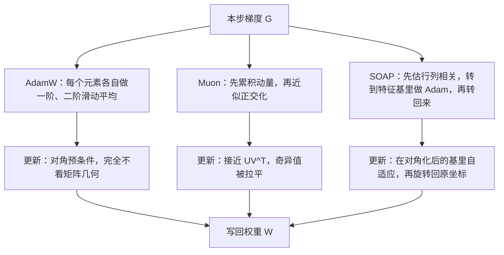
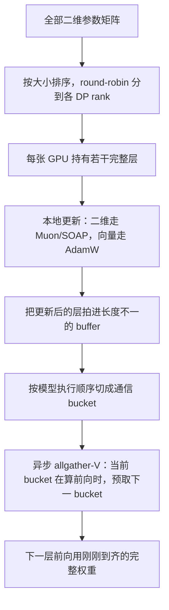
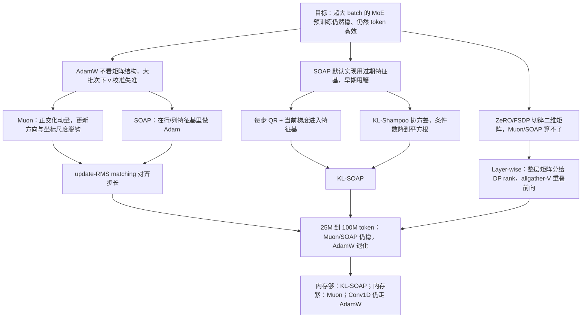

# SOAP 和 Muon 能把预训练 batch 推到一亿 token，但 SOAP 必须先把过期预条件修好

<!-- release-date: 2026-07-13 -->

> 本文依据 NVIDIA 发布的 **SOAP, Muon, and Beyond: Pushing LLM Pretraining Scales**，即 arXiv:2607.20548v1。作者十四人全部署名 NVIDIA：Mikail Khona、Aditya Vavre、Boxiang Wang、Deyu Fu、Hao Wu、Mike Chrzanowski、Bryan Catanzaro、Dheevatsa Mudigere、Jeff Pool、Michael Lightstone、Mohammad Shoeybi、Mostofa Patwary、Nima Tajbakhsh、Tijmen Blankevoort。PDF 共 32 页；封面内部日期写 **2026-7-24**，那是文稿日期，不是首发日。arXiv 首次公开为 **2026-07-13**（提交时间 2026-07-13 21:47:08 UTC），版权行是 © 2026 NVIDIA。页码均指这份 PDF 本身的页码。截至 2026-09-10，arXiv 只有 v1，与本地原件一致。
>
> 全文把三件事分开：**论文明确写了什么**（带页码）、**我们如何解释它**（会写明「我们的读法」「读自 Figure」）、**外部资料补充**（给链接并标成补充）。论文引用的 Moonshot 2025 报告是另一篇，解决的问题不同；那些数字不得混进本篇的「论文结果」，只在文末「外部对照」里说明两篇各自在做什么。

## 阅读前的最小地图

这是一篇优化器论文，不是新模型报告。读它之前，先用人话过一遍后面会反复出现的词。第一次看不懂定义没关系，正文会再讲一遍。

- **优化器（optimizer）**：拿到梯度之后，决定「这一步权重到底怎么改」的规则。
- **AdamW**：目前大模型预训练的默认优化器。它对每个参数**单独**统计梯度的一阶、二阶滑动平均，再给每个坐标配一个步长。
- **预条件（preconditioning）**：不直接用原始梯度去改权重，而是先用一组统计量把梯度「摆正」——压住已经走得很猛的方向，抬一抬几乎没人管的方向。
- **Muon**（MomentUm Orthogonalized by Newton-Schulz，动量经 Newton-Schulz 迭代正交化）：一种只认真对待**二维权重矩阵**的优化器。它先累积动量，再把这个矩阵近似「正交化」，让各个方向的更新幅度更均匀。
- **SOAP**：Vyas 等人 2024 的优化器，原论文标题是「Improving and Stabilizing Shampoo using Adam」。做法是先估计权重矩阵行、列两个方向的相关结构，把梯度转到这组「特征方向」里，在那里做 Adam 式的逐元素自适应，再转回来。
- **更新 RMS（update RMS）**：一步更新里所有元素平方平均后开根号，衡量「这一步改动有多大」。
- **Kronecker 因子**：不存完整的「所有坐标两两相关」大矩阵，而是分别存一个「行相关」矩阵和一个「列相关」矩阵，用它们的组合去近似完整相关。SOAP 和 Shampoo 都靠这个省内存。
- **MoE（Mixture-of-Experts，混合专家）**：一层前馈拆成很多专家，每个 token 只激活其中几个。全局 batch 很大时，单个专家实际看到的样本仍然不多。

## 一句话先说清

这篇论文要回答的不是「Muon 好不好」或「SOAP 好不好」，而是一个更具体、也更贵的问题：

> **当预训练的全局 batch 被推到几千万、甚至一亿 token 时，AdamW、Muon、SOAP 谁还稳得住？SOAP 在这个区间为什么会先崩？崩了之后算法和系统分别要改什么，才能在 Megatron-LM 里真的跑起来？**

论文的答案分三层。（PDF p.1–2）

1. **在他们测过的多十亿参数、数万亿 token 规模上，SOAP 和 Muon 都持续优于 AdamW。** 全局 batch 最高到 **1 亿 token** 做 next-token prediction 时，这两个优化器仍能稳住训练质量和稳定性，AdamW 则会退化。
2. **SOAP 的默认实现在大批次下会「甩鞭」。** 根因是预条件矩阵跟不上当前梯度。修法是：每一步都用当前梯度做 QR 正交化，再换上 KL 散度正则的协方差估计。
3. **算法收益必须配一套不把矩阵切碎的分布式实现。** 他们给 Megatron-LM 写了 layer-wise distributed optimizer：整层矩阵分给不同数据并行 rank，不近似优化器计算。

结论节的推荐更直白：**内存不是瓶颈时，选 KL-SOAP，不要选 Muon。**（PDF p.19）

评测规模以论文精确措辞为准：实验跑在 8B 稠密 GPT、3B 激活 / 30B 纯 Transformer MoE，并扩到 **8B 激活 / 72B 混合 Mamba-Transformer MoE**；贡献列表写的是「evaluation on up to 72-billion parameter MoE models」。（PDF p.2、p.7）

## 真正卡住的不是「二阶方法更准」，而是「看得到矩阵结构的优化器，装不进现在这套训练系统」

引言把优化器放在一个很少被单独拿出来讲的位置：它同时决定两件事。（PDF p.1）

- **系统侧**：优化器状态通常比模型参数本身更吃内存，直接决定怎么切分、怎么管显存；它能不能在极端 batch 下保持稳定，决定训练能扩到多大集群、会不会被同步通信卡住。
- **算法侧**：它管数据效率、收敛速度和泛化。

过去十几年的实际选择，被一条很土的张力绑住了：AdamW、RMSProp、LaProp 这类**按元素做的标量优化器**最好写、最好切、最好扩；真正去近似损失曲率的高阶方法，理论上能迈更大步，但复杂度让人不敢在前沿模型上用。（PDF p.1）

AdamW 的盲点论文写得很清楚：它把每个参数元素的更新当成独立事件，**忽略梯度之间的相关，也忽略神经网络权重作为算子的结构**。（PDF p.1）一个线性层的权重是「把一个向量空间映射到另一个向量空间」的矩阵，不是一袋互不相干的数字。AdamW 只知道第 $(i,j)$ 个数该加多少。

中间地带已经出现：Shampoo 及其变体 SOAP、Eigen-corrected Shampoo、KL-Shampoo，以及 Muon、Scion 这类谱方法。它们想用可管理的计算和内存，换到接近二阶方法的好处。但论文马上补了一句：**这些方法面对细粒度 MoE 这类前沿模型时，仍然过不了可扩展性这关。**（PDF p.2）

所以这篇工作的主轴不是再发明一个优化器名字，而是把三件事绑在一起做完：公式怎么写、大批次上实证怎么比、Megatron 里矩阵怎么保住完整。

### 五条贡献，对应五堵墙

论文把自己的贡献写成五条。（PDF p.2）

| 贡献 | 它针对的旧问题 | 论文落到哪 |
|---|---|---|
| 用 update-RMS matching 公平迁移学习率，在 MoE 上做大批次对照 | 换优化器后学习率不可比，优势可能只是步长没对齐 | §3 动机，§5.3 与 §5.5 实证；评测到 72B 参数 MoE，全局 batch 到 100M token |
| 修好 SOAP 预条件计算的不稳定 | 标准 SOAP 实现在大批次下，预条件和当前梯度脱节 | §5.4：每步用当前梯度更新特征基，并接入 KL-Shampoo 的协方差估计 |
| 在大批次设定下比较 SOAP 和 Muon | 「两者都比 AdamW 好」之后，还要知道彼此差多少、结论边界在哪 | §5.5；KL-SOAP 略优于 Muon，同时讨论限制 |
| 与 Megatron-LM 兼容的 layer-wise 分布式实现 | ZeRO / FSDP 会把二维矩阵切碎，Muon / SOAP 算不了完整更新 | §3.3 约束，§6 实现 |
| 开源 Emerging-Optimizers | 研究用的优化器实现散落各处 | 文中给出仓库 |

开源库地址在摘要末尾：[https://github.com/NVIDIA-NeMo/Emerging-Optimizers](https://github.com/NVIDIA-NeMo/Emerging-Optimizers)。（PDF p.1）仓库 README 是外部材料，后面单独标，不拿它补论文没写的结论。

## 三种优化器到底差在「改权重之前多看了哪一层结构」

先把位置关系画清楚，再进入公式。下图是**机制示意**，根据 PDF p.2–3 的 §2 与附录 A.1 重画，不是实测时间线。

论文后半有一句把三者焊在一起的话，值得先记住：**关掉 Shampoo 的滑动平均之后，它的预条件更新在数学上就是 Muon 的极因子 $UV^\top$。**（PDF p.3）SOAP 则是另一头：如果特征基是单位阵，它就退化回 AdamW。（PDF p.3）

### AdamW：每个坐标自己决定步长

先说这一段要算什么：**对扁平化之后的梯度向量，分别维护「平均梯度」和「平均平方梯度」，再用后者当每个坐标的步长分母。**

令 $g_t \in \mathbb{R}^{d=mn}$ 是把参数张量 $G_t \in \mathbb{R}^{m \times n}$ 摊平后的梯度，$\beta_1,\beta_2$ 是滑动平均的时间尺度。（PDF p.2）

$$
m_t = \beta_1 m_{t-1} + (1-\beta_1)g_t,\qquad
v_t = \beta_2 v_{t-1} + (1-\beta_2)\, g_t \odot g_t
$$

$\odot$ 是逐元素相乘。忽略一阶动量和偏差修正之后，更新方向是：（PDF p.2）

$$
u_t = m_t \circ \operatorname{diag}\!\left(\frac{1}{(v_t)^{1/2}+\epsilon}\right)
$$

人话版：某个坐标最近梯度又大又稳，$v$ 就大，步长被压小；某个坐标几乎没动过，$v$ 很小，步长相对更大。这就是「自适应」。

好处是系统侧的：状态和计算都按元素走，**可以任意切分**。（PDF p.3）代价也在这里：行与行、列与列、头与头、专家与专家之间的相关，AdamW 看都不看。（PDF p.3）

### Shampoo：不摊平，分别记住行相关和列相关

Shampoo 把梯度重新当成矩阵。它维护两个对称协方差：（PDF p.3）

$$
L_t = \beta_2 L_{t-1} + (1-\beta_2) G_t G_t^\top,\qquad
R_t = \beta_2 R_{t-1} + (1-\beta_2) G_t^\top G_t
$$

$L_t$ 是「行和行有多一起动」，$R_t$ 是「列和列有多一起动」。完整的「所有元素两两相关」矩阵大小是 $(mn)\times(mn)$，存不下；Kronecker 分解把它拆成 $m\times m$ 加 $n\times n$。

更新方向用这两个因子的逆四分之一次幂：（PDF p.3）

$$
u_t = \bigl(R_t^{-1/4} \otimes L_t^{-1/4}\bigr) g_t
$$

$\otimes$ 是 Kronecker 积。直觉是：哪组行（或列）方向上梯度能量已经很大，就在那个方向上把步长打下来。这叫**白化（whitening）**——先把相关结构「洗平」，再迈步。

### SOAP：在 Shampoo 的特征基里做 Adam

SOAP 不直接用 Shampoo 那种矩阵幂去乘梯度，而是分三步：（PDF p.3，式 1）

1. 把梯度转到 $L_t$、$R_t$ 的特征基里，这一步大约对角化了行、列相关；
2. 在这个旋转过的坐标系里，做 Adam 式的逐元素自适应；
3. 再转回原来的坐标。

$$
u_t = Q_L\,\operatorname{Adam}(Q_L^\top m_t Q_R)\, Q_R^\top
$$

$Q_L$、$Q_R$ 分别是左右 Kronecker 因子的特征向量矩阵。

**我们的读法：** 可以把它想成「先把桌子转一个角度，让相关的坐标轴尽量分开，再在每条轴上用 Adam 的老办法调节步长，最后把桌子转回去」。特征基如果碰巧是单位阵，旋转什么也没做，SOAP 就是 AdamW。这是论文说 SOAP 比古典 Shampoo 更接近 AdamW、超参可能更好迁移的原因。（PDF p.3）

代价写得很明确：Shampoo 和 SOAP 都要维护全精度的预条件矩阵和 Kronecker 因子，**内存明显比 AdamW 大**。（PDF p.3）

### Muon：不存预条件，直接把动量矩阵「梳齐」

Muon 的策略相反：不估计、也不存储那些预条件矩阵。它像 AdamW / Shampoo 一样先做动量，然后把动量矩阵正交化。（PDF p.3）

目标是动量 $M_t$ 的**极因子（polar factor）**，也就是离它最近的正交矩阵。若 $M_t = U\Sigma V^\top$，极因子就是 $UV^\top$：方向还在，奇异值全部变成 1。精确 SVD 每步、每个矩阵都做一次太贵，所以用 Newton-Schulz 迭代，靠矩阵多项式去逼近。（PDF p.3）

对二维权重来说，这是一次**谱更新**：它管的是「各个奇异方向上的尺度」，不是每个坐标自己的分母。（PDF p.3）

论文给了一条把三者连起来的极限：（PDF p.3）

$$
(GG^\top)^{-1/4}\, G\, (G^\top G)^{-1/4} = UV^\top
$$

令 Shampoo 的 $\beta_1=\beta_2=0$，预条件更新就变成 Muon。附录 A.1 把这条 SVD 故事写完整：把梯度转到特征基后得到奇异值对角阵；Adam 若再退化成符号函数，更新就是 $-\eta UV^\top$。（PDF p.26，式 8）

**我们的读法：** AdamW 调节「每个格子迈多大」；Muon 调节「整张地图各个方向迈得多均匀」；SOAP 先把地图转到「相关已经被拉开」的坐标系，再在那里做 AdamW。三者不是毫无关系的三个品牌，而是同一条「别让少数主导方向吃掉全部更新预算」的谱上，取了三个不同的工程点。

### 规模化时的定性差别

论文在 §2 末尾用一段话把系统代价说完。（PDF p.3–4）

- **AdamW** 最好扩：状态和计算都按元素，可以无限切。
- **SOAP** 更有表达力，但必须维护 Kronecker 因子和特征基，对数值稳定、预条件新鲜度更敏感，内存更大，切分布局更麻烦。
- **Muon** 不维护二阶矩，**内存占用比 AdamW 还低**；可它仍然要求完整的二维矩阵更新，切分问题和 SOAP 同类。Muon 的优化器步计算更重，开销随 Newton-Schulz 迭代次数涨。

## 为什么 MoE 的「大批次」其实是两套物理

### 专家并没有看到你以为的那个 batch

§3.1 是全文最值得记的动机之一。MoE 里绝大多数参数住在专家线性层，论文写 **常常超过总参数的 90%**。（PDF p.4）这些层因为 top-$k$ 路由，**有效 batch 比全局 batch 小得多**。

设全局 batch 为 $B_{\mathrm{Global}}$ 个 token，共 $N$ 个专家，每个 token 激活 $k$ 个。理想负载均衡时，单个专家看到的有效 batch 是：（PDF p.4，式 2）

$$
B_{\mathrm{eff}}^{\mathrm{expert}} = B_{\mathrm{Global}} \times \frac{k}{N}
$$

细粒度 MoE 里 $k \ll N$。论文举的例子：top-8、256 个专家，比值是 $0.03125$。（PDF p.4）也就是说，全局 batch 放大 32 倍，单个专家才刚刚看到原来稠密模型那个 batch。

后果很具体：

- **稀疏专家**仍停在「比较好优化」的小有效 batch 区；
- **稠密参数和共享参数**必须吞下全部全局 batch。

所以把全局 batch 推大，压力主要落在稠密部件能不能扛住大批次，而不是落在专家身上。（PDF p.4）MoE 预训练特别依赖「稠密参数在极端 batch 下仍稳、仍 token 高效」的优化器。

用他们自己的配置把式 2 算一遍（这是**本文按式 2 做的算术，不是论文另给的表**）：

| 模型 | $k/N$ | 全局 25M token 时单个专家有效 batch |
|---|---:|---:|
| Nemotron-3-Nano-30B-A3B | $6/128=0.0469$ | 约 1.17M |
| Nemotron-3-72B-A8B | $6/512=0.0117$ | 约 0.29M |
| Qwen3-30B-A3B | $8/128=0.0625$ | 约 1.56M |

72B 那一档，专家仍接近「百万 token 以下」的小 batch，而注意力、共享专家、Mamba 里的稠密投影要面对完整的 25M、50M、75M 甚至 100M。优化器必须对这两类参数同时成立。

### 换 batch 时，先把更新方差对齐，再谈谁更好

他们的对照会把全局 batch 最多改到 **4 倍**。如果不先规定学习率怎么跟着变，后面所有「优化器 A 优于 B」都可能只是步长没对齐。（PDF p.4）

§3.2 用 SGD 把逻辑讲清楚。小批量梯度的协方差与 batch 成反比，$\operatorname{Cov}(\hat g_B)=\Sigma/B$。参数更新 $\Delta\theta=\eta\hat g_B$ 的协方差就是 $\eta^2\Sigma/B$。（PDF p.4）

要从 $B$ 换到 $B'$，又希望更新的随机波动尺度差不多，令两边协方差相等，得到**平方根缩放**：（PDF p.5，式 3）

$$
\eta' = \eta \sqrt{\frac{B'}{B}}
$$

论文明确说线性缩放也被提过，但 batch 跳得很猛时，平方根更安全，避免学习率爆炸。（PDF p.5）后文的 batch ramp-up 会把这条规则和学习率 warmup 绑在一起。

### 张量并行下，预条件有三种诚实程度

Muon 和 SOAP 的大批次好处，只有在系统能**保住完整矩阵结构**、又不额外露出通信时才兑现。张量并行（Tensor Parallelism，TP）会把一层的权重切到多张 GPU 上。Emerging-Optimizers 支持三种预条件范围：（PDF p.5）

| 模式 | 做什么 | 适用 |
|---|---|---|
| **blocking** | 只拿本卡拥有的那一块权重做预条件 | 最简单，但是近似 |
| **Duplicated** | 先在 TP 组内 all-gather 完整权重，每张卡各自跑 Newton-Schulz | 小层、通信是瓶颈时更合适 |
| **Distributed** | 每次 Newton-Schulz 迭代里，第一次矩阵乘的中间结果做 all-reduce | 大层、计算是瓶颈时更合适 |

后两种会用**整层**的统计量做归一化，从而和「没有 TP」在数学上等价。（PDF p.5）后文 Muon 对 SOAP 的受控比较，两边都故意用了最简单的 blocking，并且关掉 Muon 的 QKV 切分，为的是只比算法、不比切分策略。（PDF p.14）

ZeRO-1 那类「把优化器状态均匀切到数据并行 rank」的办法，**不能直接用在 Muon / SOAP 上**：每张卡只看到碎片，算不出完整更新，还得额外通信把张量拼回来。（PDF p.5）他们的回答是 layer-wise：不同层的参数分给不同 DP rank，每张 GPU 拿到的是**完整的若干层**，预条件才算得动。细节在 §6。

## 相关工作：Shampoo 族在算法侧补预条件，系统侧在补「不要切碎矩阵」

§4 不是综述展览，它在给后面的选择定位。

**算法侧。** Shampoo 用 Kronecker 分解近似 Fisher / 经验协方差，把梯度当张量而不是扁平向量，从而保住层内结构。（PDF p.6）Anil 等人后来用 blocking（只对矩阵的子块做预条件）和耦合迭代来避免特征分解，把内存和计算压下来，使每步 wall-clock 接近 Adam，同时收敛仍优于一阶方法。（PDF p.6）现代变体包括 Eigen-decomposed Shampoo、KL-Shampoo、SOAP、DASH，核心都是把预条件估计得更准、更稳。（PDF p.6）

谱下降本身更早。Pethick 等人给所有层类型提供了谱下降框架；Bernstein 等人则用「不同范数约束下的最速下降」把 AdamW 和 Muon 放进同一张图。（PDF p.6）论文还列了一串 2025–2026 的 Muon 变体：Muon+、Muon++、AdaMuon、NorMuon、Muon-Hyperball、spectral sphere、NAMO、SPEL、Newton-Muon、Mousse。本篇实验用的是带权重衰减、PolarExpress 正交化、Kimi 式 RMS 缩放的 Muon，以及接入 KL-Shampoo 协方差的 SOAP，不是去把这份名单再赛一遍。

**系统侧。** 常规 FSDP 把张量切成对称的逐元素碎片，和「必须看见完整二维矩阵」的优化器冲突。（PDF p.6）veScale-FSDP 的 RaggedShard 允许不对称、任意粒度的切分，把完整参数动态聚集到一台设备做复杂局部计算，再异步散回。Canzona 则把优化器状态的逻辑归属和模型参数的物理分布解开：DP 上保持矩阵原子性，TP 上用异步流水线掩盖矩阵重建。（PDF p.6）

NVIDIA 这篇选择的工程点不同：不另起一套 FSDP，而是在 **Megatron-LM 里做 layer-wise 分配**，并强调**不近似优化器计算**。（PDF p.1、p.18）

## 实验怎么比才算公平：update-RMS matching

### 模型、数据、默认配方

实验跑在三类架构上，数据是 Nemotron-3 全集的 1T 和 3T 子集。（PDF p.7）所有模型注意力头维度 128，32 个头，并用 GQA。（PDF p.7，Table 1）

| 模型 | Hidden | 层数 | GQA | FFN / 专家隐层 |
|---|---:|---:|---:|---:|
| Nemotron-3-Nano-30B-A3B | 2688 | 52 | 2 | 1856 |
| 8B Dense Transformer | 4096 | 32 | 8 | 21504 |
| Nemotron-3-72B-A8B | 4096 | 52 | 8 | 2688 |
| Qwen3-30B-A3B | 2048 | 48 | 4 | 768 |

（Table 1，PDF p.7）

| 模型 | 专家总数 | Top-$k$ | 共享专家隐层 |
|---|---:|---:|---:|
| Nemotron-3-Nano-30B-A3B | 128 | 6 | 3712 |
| Nemotron-3-72B-A8B | 512 | 6 | 5376 |
| Qwen3-30B-A3B | 128 | 8 | 无 |

（Table 2，PDF p.7）

MoE 用 sigmoid 打分加 sequence-level auxiliary loss，系数 $1\times 10^{-4}$，用来惩罚路由塌缩。（PDF p.7）8B Hybrid MoE 扩到 512 专家、top-6，外加共享专家中间维 5376。

默认全局 batch：**3072 条样本 × 8192 token = 2500 万 token**，权重衰减统一 0.1，micro-batch 为 1。（PDF p.7–8）学习率是 Warmup-Stable-Decay（WSD），末段用 minus-square-root（`minus_sqrt`）衰减。（PDF p.8）

| 模型 | 最大学习率 | 最小学习率 |
|---|---:|---:|
| Nemotron-3-Nano-30B-A3B | $1.0\times 10^{-3}$ | $1.0\times 10^{-5}$ |
| 8B Dense GPT | $8.0\times 10^{-4}$ | $8.0\times 10^{-6}$ |
| Nemotron-3-72B-A8B | $8.0\times 10^{-4}$ | $8.0\times 10^{-6}$ |
| Qwen3-30B-A3B | $1.6\times 10^{-3}$ | $1.6\times 10^{-5}$ |

（Table 3，PDF p.8）

后文 $n\times\mathrm{GBS}$ 都以 25M 为 1 倍：2 倍是 50M，3 倍是 75M，4 倍是 100M。Table 5 图注把 1× 写成「25xM tokens」，按上下文就是 25M。（PDF p.12）

### 为什么必须对齐更新 RMS

换优化器最脏的作弊方式，是让一方每一步改权重改得更大。看起来 loss 掉得快，其实只是学习率没对齐。论文采用 Kimi-Moonshot 提出的 **update RMS matching**，让不同优化器的参数更新 RMS 一致，从而把为 AdamW 调好的学习率迁过去，少付一次网格搜索的算力。（PDF p.8）

SOAP 和 AdamW **天然 RMS 相同**，因为旋转不改变 Frobenius 范数。推导先说要证什么：**SOAP 的更新 $\Delta W=Q_L N Q_R^\top$ 和旋转前的 $N$ 范数相等。**（PDF p.8）

$$
\|\Delta W\|_F^2 = \operatorname{Tr}(\Delta W^\top \Delta W) = \operatorname{Tr}(N^\top N) = \|N\|_F^2
$$

中间用到 $Q_L^\top Q_L=I$、$Q_R^\top Q_R=I$。所以 SOAP 在特征基里做完 Adam 再转回来，**更新的大小没有被旋转改写**，学习率可以和 AdamW 直接比。

Muon 没有这个性质。正交化之后的矩阵，范数由形状和谱决定，不自动等于 AdamW。论文把 Kimi 的 RMS matching 接到 Algorithm 1 上，并给出一个依赖动量 EMA 阻尼的修正因子：（PDF p.8）

$$
\sqrt{\frac{1-\beta_1}{1+\beta_1}} \approx 0.2
$$

$\beta_1=0.9$ 时，$\sqrt{0.1/1.9}\approx 0.229$，他们写成约 0.2。Algorithm 1 第 12 行明写的缩放是 $\sqrt{\max(\mathrm{in},\mathrm{out})}$，标注为「Kimi scaling for update RMS matching」；约 0.2 的阻尼因子写在 §5.2 正文，没有再乘进算法框。**我们的读法：** 0.2 可能被折进可迁移的学习率，实现时应对着开源代码看这一步，不要只抄框。

还有一个和常见 Muon 配方不同的选择：**Nesterov 动量在他们的实验里没有改善收敛，Muon 和 SOAP 都改用普通 EMA。**（PDF p.8）这不是「Nesterov 普遍无用」，只是这篇大规模预训练设定下的观察。

### Algorithm 1：Muon 这一步到底做了什么

先说这 13 行要完成的事：**累积动量 → 用多项式迭代逼近极因子 → 按矩阵形状缩放 → 解耦权重衰减后写回。**（PDF p.9）

1. $G_t=\nabla_W L(W_{t-1})$，本步梯度。
2. $M_t \leftarrow \beta_1 M_{t-1} + (1-\beta_1)G_t$，普通 EMA 动量，不是 Nesterov。
3. $X_0 \leftarrow M_t / \max(\|M_t\|_F,\epsilon)$，先按 Frobenius 范数归一化，$\epsilon$ 防止范数过小。
4. 迭代 $n$ 次：$A=X X^\top$，$B=b_i A + c_i A^2$，$X \leftarrow a_i X + B X$。这是对每个奇异值套同一个多项式。
5. 得到正交化方向 $O_t$。
6. $\Delta W \leftarrow O_t \cdot \sqrt{\max(\mathrm{in},\mathrm{out})}$，抵消形状带来的尺度差。
7. $W_t \leftarrow (1-\eta_t\lambda_t)W_{t-1} - \eta_t\Delta W$，解耦权重衰减。

超参见表 4。（PDF p.9）

| 符号 | 含义 | 取值 |
|---|---|---|
| $\beta_1$ | 动量 EMA | 0.9 |
| $\lambda_t$ | 解耦权重衰减 | 0.1 |
| $n$ | Newton-Schulz 迭代次数 | **16** |
| $(a_i,b_i,c_i)$ | 多项式系数 | PolarExpress |
| $\epsilon$ | Frobenius 归一化下限 | $10^{-7}$ |

迭代 16 次、系数来自 PolarExpress，比许多公开 Muon 实现更「舍得在正交化上花钱」。附录 Figure 11 把这套 PolarExpress 16 步和更早的五次系数 Newton-Schulz 比过：最终 loss 几乎重合，插图相对差大约在 $\pm 0.5\%$ 量级。（读自 Figure 11，PDF p.31）也就是说，在 Nano-V3、1T 这个点上，**把正交化从「常用五次多项式」换成 PolarExpress 16 步，并没有单独拉开训练曲线。** 真正和「近似够不够」有关的对照，是后面用精确 SVD 极分解替换 Newton-Schulz 的 MOP。

## Muon 在大批次上比 AdamW 稳，而且能继续吃更大的数据并行

§5.3 的主张分两句。（PDF p.8–9）

- 基线 1× batch 上，Muon 已经更低 loss、更少尖峰。
- 把全局 batch 再放大时，AdamW 很快碰到不稳定和收益递减；Muon 仍能用上多出来的数据并行。

他们假设：极端 batch 下梯度噪声变小，AdamW 的逐元素二阶矩 $v_t$ 会校准失准或过度自信，步长变得次优；Muon 的正交化按结构归一化更新方向，**不依赖坐标尺度**，对大批次的方差波动更不敏感。（PDF p.9）这是假设，不是单独消融出来的机制证明。

### 曲线在说什么

**Figure 1**（PDF p.10）：NVIDIA-Nemotron-Nano-V3-30B-A3B，3T token 视野。四条线是 AdamW 1×、Muon 1× / 2× / 3×。主图纵轴约从 2.0 降到 1.3 附近；AdamW 在中后段能看见若干向上的尖刺，Muon 三条都更平滑。内嵌图是相对 AdamW 的 loss 差：大批次 Muon 早期可能暂时更高，随后追上并略低。图注自己写：**更大的 batch 通常先更差，token 视野拉长之后才会超过更小 batch。**（PDF p.10）大约 2.5T 处所有曲线一起下降，对应 WSD 的衰减段。

**Figure 2**（PDF p.10）：72B-A8B 混合 Mamba-MoE，1T token。Muon 用 **2× batch（50M）** 对 AdamW 的 1×（25M）。AdamW 在约 0.7T–0.8T 出现明显 loss 尖峰；Muon 没有对应尖峰，全程略低。这是「评测到 72B MoE」的主曲线，**不是 100M batch**。100M 出现在后面 Qwen3-30B-A3B 的 4× 对照。

### Batch ramp-up：先从小 batch 爬上去

大批次实验（Muon 和 AdamW 都是）在训练早期加了一段 batch 爬坡，让模型用更大 batch 跑完大部分 token，同时仍能在最终 loss 和下游指标上超过小 batch 的 AdamW。（PDF p.9）

规则很简单：从 **256 条样本（2M token）** 起，每隔 $S$ 步翻倍，在固定的 $N$ 步视野内爬到目标 batch，与总 token 视野无关。（PDF p.11）论文没有给出 $S$ 和 $N$ 的具体数字。学习率 warmup 绑在 batch 爬坡上，近似保持 $\eta \propto \sqrt{B}$，让更新方差尺度在 batch 变化时大致不变。（PDF p.11）

他们承认：**没有按模型规模去调这段 ramp-up**。临界 batch 通常随训练 loss 变，更大模型理应更早到达更高临界 batch。（PDF p.11）

**Figure 3**（PDF p.11）两张爬坡图：左图目标 50M，横轴大约到 50B token；右图目标 75M，横轴大约到 120B token。蓝线是实际 batch，红线是最终目标。形状是阶梯加倍，最后一跳贴上 50M / 75M。

### 下游评测：总体 Muon 更好，但不是每一格都赢

评测两套架构。（PDF p.11）

- NVIDIA-Nemotron-Nano-V3：混合注意力-Mamba MoE，30B 总 / 3B 激活，**3T token**。
- 带 MTP 的混合 LatentMoE：72B 总 / 8B 激活，**1T token**。

论文说：两种架构上，Muon 在基线 batch 就匹配或超过 AdamW，并且随 batch 放大继续变好，AdamW 则不会（对应附录 Figure 10）。收益最明显的是 **coding 和 commonsense**。（PDF p.11）他们还发现一个架构敏感性：**Muon 最好只打在稠密线性投影上；Mamba 的 conv1D 权重退回 AdamW 收敛更好。**（PDF p.11）这些结果被用来说明 Muon 的大批次效率能迁到 MoE，直到约 **$5\times 10^{22}$ 预训练 FLOPs**。（PDF p.11）

Table 5 全文如下。1×GBS = 25M token / batch。（PDF p.12）

| 指标 | Nano Muon 3× | Nano Muon 2× | Nano Muon 1× | Nano AdamW 1× | 8B Hybrid Muon 2× | 8B Hybrid AdamW 1× |
|---|---:|---:|---:|---:|---:|---:|
| MMLU | 74.00 | 74.80 | 73.71 | 73.38 | 74.89 | 74.59 |
| MMLU PRO CoT | 55.61 | 56.77 | 58.19 | 54.45 | 59.60 | 57.52 |
| HumanEval | 62.22 | 64.79 | 62.56 | 63.26 | 65.79 | 57.62 |
| HumanEval+ | 59.18 | 62.13 | 59.63 | 58.63 | 61.86 | 56.40 |
| MBPP | 68.15 | 69.92 | 68.91 | 67.61 | 70.99 | 66.79 |
| MBPP+ | 58.02 | 57.94 | 57.80 | 59.36 | 55.26 | 55.07 |
| Coding Avg. | 61.89 | 63.70 | 62.23 | 62.22 | 63.48 | 58.97 |
| Math 500 | 73.25 | 74.05 | 75.50 | 71.50 | 75.60 | 80.20 |
| GSM8k CoT | 89.69 | 89.08 | 89.54 | 87.79 | 85.97 | 87.87 |
| Math Avg. | 81.47 | 81.57 | 82.52 | 79.65 | 80.79 | 84.04 |
| Race | 85.84 | 85.55 | 85.45 | 85.17 | 86.32 | 85.26 |
| ARC Challenge | 89.16 | 89.50 | 88.05 | 88.40 | 89.16 | 89.09 |
| Winogrande | 74.19 | 72.69 | 74.51 | 72.93 | 75.37 | 73.95 |
| Hellaswag | 81.23 | 81.39 | 81.51 | 81.06 | 82.37 | 82.33 |
| Commonsense Avg. | 82.61 | 82.28 | 82.38 | 81.89 | 83.31 | 82.66 |

读这张表时不要只记「Muon 全面更好」。几处反向或接近的格子同样是论文数据：

- Nano 的 Coding Avg. 在 1× 上几乎打平（62.23 对 62.22），Muon 2× 才拉开到 63.70；3× 反而降回 61.89。
- Nano 的 MBPP+：AdamW 59.36，高于所有 Muon 列。
- **8B Hybrid 的数学：AdamW 的 Math 500 是 80.20，Muon 2× 是 75.60；Math Avg. 84.04 对 80.79。** GSM8k 也是 AdamW 更高。
- 8B Hybrid 的代码差距才真正大：Coding Avg. 63.48 对 58.97，HumanEval 65.79 对 57.62。

所以「收益最明显在 coding 和 commonsense」这句话，有表支撑；「所有下游任务 Muon 都赢」则没有。72B 档的数学是 AdamW 更好。论文没有单独解释这一格。

附录 C 把 AdamW 自己放大 batch 的失败写清楚：**让 Muon 能跑大批次的那些技巧（ramp-up + 平方根学习率）帮不了 AdamW。** Figure 10 里 Nano-V3 用 AdamW 跑 1T：50M batch 比 25M 尖峰更多，最终还略差。（PDF p.29–30；读自 Figure 10）他们把 AdamW 的 $\beta_1,\beta_2,\epsilon$ 随 batch 怎么调，列为未来工作。

## SOAP 在大批次上会「甩鞭」：过期预条件比公式本身更致命

§5.4 先承认：把 SOAP 扩到大批次、大参数时，他们撞上了严重的经验障碍。（PDF p.11）

### 诊断：Slingshot instability

参考实现（脚注指向 `nikhilvyas/SOAP`）为了省 QR，**不频繁刷新特征基**，例如每 10 步一次，而且刷新时**把当前步梯度排除在特征基计算之外**。（PDF p.11–12）小模型和更高的重计算间隔上，这无所谓；大批次预训练里，它会在训练早期造成剧烈不稳：权重梯度范数先振荡，语言模型 loss 紧跟着尖峰。（PDF p.12）

论文把原因叫 **stale preconditioner（过期预条件）**。大批次训练早期，损失面变化很快，却拿过时的梯度统计去转当前梯度，优化轨迹就会像甩鞭。（PDF p.12）

两条尺度完全不同的曲线：

- **621M 纯 Transformer，全局 batch 12.5M token**：振荡最终被阻尼掉，模型还能收敛。Figure 4 里 loss 能冲到 12 以上、梯度范数冲过 140，尖峰之后是下一轮；大约 0.018T 之后才平下来。（PDF p.12、p.14；读自 Figure 4）
- **8B 稠密模型**：同样的滞后变成灾难，训练发散，质量显著差于 AdamW。Figure 5 蓝线（过期预条件）在 0.27T 前反复爆到图外，随后中断；橙线（用当前梯度算预条件）平滑降到约 1.73。（PDF p.12、p.15；读自 Figure 5）

**我们的读法：** 这不是「SOAP 的特征基想法错了」，而是「特征基的刷新策略在大批次早期不够快、也不够新」。优化器状态里最贵的那部分，一旦变成过期地图，步长越大，走错方向的惩罚越大。AdamW 没有这张地图，也就没有这张过期地图。

### 只把刷新频率改成每步，还不够

§5.4.2 的关键句是：

> 如果当前迭代的梯度仍被排除在外，仅仅把特征基更新频率提高到每一步，是不够的。真正解决问题的，是**每步 QR** 加上**把当前步梯度算进特征基**这一组合。（PDF p.13）

改成实时梯度统计之后，SOAP 消除 loss 尖峰，语言模型 loss 与 Muon 相当（Figure 7）。论文注明：这一实现本来就存在于 SOAP 里，**并不存在于** Anil 等人的可扩展 Shampoo 以及 KL-Shampoo 等后续工作中。（PDF p.13）

附录 E 补了一刀：他们发现必须**每步**做 QR 才能压尖峰，因为训练早期预条件基变化很快，更慢的日程跟不上。频率已经是每步时，QR 和 `eigh`（对称特征分解）对大规模预训练 loss 的差别可以忽略，所以默认用更便宜的 QR。（PDF p.31；Figure 13 两条线几乎重合，PDF p.32）

### Algorithm 2：KL-SOAP 一步在干什么

先说整张算法框要完成的五件事：**用 KL-Shampoo 规则累积 Kronecker 因子 → 按频率用 QR 刷新特征基并搬运 Adam 动量 → 把梯度转到特征基 → 在基里做 Adam → 转回来并做权重衰减。**（PDF p.13）

状态包括：Adam 的 $m_t,v_t$，左右因子 $L_t,R_t$，以及它们的特征基 $Q_L,Q_R$。

**累积因子（KL-Shampoo）。** 先用当前特征基抽出近似特征值 $\lambda_L=\operatorname{diag}(Q_L^\top L_{t-1} Q_L)$，右侧同理。然后：

$$
L_t \leftarrow (1-\beta_{\mathrm{kron}})L_{t-1} + \frac{\beta_{\mathrm{kron}}}{\mathrm{out}}\, G_t(\lambda_R+\epsilon)^{-p} G_t^\top
$$

$R_t$ 对称，用 $\mathrm{in}$ 和 $\lambda_L$。这就是「每一侧用另一侧的谱去耦合更新」。附录 A.3 把固定点写成：标准 Shampoo 跟踪 $\Lambda\approx\Sigma^2$（协方差），KL-Shampoo 跟踪 $\Lambda\approx\Sigma$（奇异值本身）。（PDF p.28）表 6 取 $p=-1$。算法框写的是 $(\lambda+\epsilon)^{-p}$；**我们按附录的固定点来理解机制**（另一侧的逆），具体幂次以开源实现为准，不要只凭框里的符号抄。

**刷新特征基（每 $F$ 步，实验里 $F=1$）。** 先用旧基把动量转回参数空间 $\hat m = Q_L m Q_R^\top$，再

$$
Q_L = \operatorname{QR}(L_t Q_L).Q
$$

这是一次正交迭代：拿当前 $L$ 乘上旧的 $Q$，做 QR，留下新的 $Q$。然后把动量转到新基 $m=Q_L^\top \hat m Q_R$。不做这一步，特征基转了、Adam 动量还停在旧坐标系，等于用错的二阶矩去除新方向上的梯度。

**Adam 与写回。** $G'_t=Q_L^\top G_t Q_R$，在旋转坐标里更新 $m,v$，再 $\Delta W=Q_L N Q_R^\top$，最后解耦权重衰减。算法框第 15–16 行把 EMA 写成 $(1-\beta_1)m_{t-1}+\beta_1 G'$，与 Algorithm 1 的 $\beta_1 M_{t-1}+(1-\beta_1)G$ **系数左右相反**。原版 SOAP 实现用的是标准 Adam 写法（$\beta\cdot\mathrm{old}+(1-\beta)\cdot\mathrm{new}$）。**这是算法框与 §2 / Algorithm 1 的一处不一致；写代码时以 Emerging-Optimizers 为准，不要按框面值对调 EMA。**

实验超参见表 6。（PDF p.13）

| 符号 | 含义 | 取值 |
|---|---|---|
| $\beta_{\mathrm{kron}}$ | Kronecker 因子 EMA | 0.95 |
| $\beta_1$ | 旋转基里的一阶 EMA | 0.9 |
| $\beta_2$ | 旋转基里的二阶 EMA | 0.95 |
| $p$ | KL 协方差更新指数 | $-1$ |
| $F$ | 特征基重计算频率 | **1（每步）** |
| $\lambda_t$ | 解耦权重衰减 | 0.1 |
| $\epsilon$ | 数值地板 | $10^{-8}$ |

### KL 协方差：第二层稳定器

即使已经实时更新，Kronecker 因子按 $GG^\top$、$G^\top G$ 累积，在规模上仍可能不稳。他们换成 KL 散度正则的协方差估计，作为第二层稳定。（PDF p.14）Figure 6 在 Qwen-3-30B-A3B 上：无 KL 的 SOAP（橙）在 1T 视野里多次尖峰，相对差插图能到 $+10\%$；KL-SOAP（蓝）更平滑、最终 loss 略低。（PDF p.16；读自 Figure 6）

稳定收益来自谱性质。附录 A.3 证明，KL-Shampoo 把要分解 / 求逆的 Kronecker 因子条件数降到标准 Shampoo 的平方根：（PDF p.14，式 4；p.28，式 13）

$$
\kappa(S_{\mathrm{KL\text{-}Shampoo}}) = \sqrt{\kappa(S_{\mathrm{Shampoo}})} = \frac{\sigma_{\max}}{\sigma_{\min}}
$$

标准 Shampoo 跟踪 $\Sigma^2$，条件数是 $(\sigma_{\max}/\sigma_{\min})^2$；KL 跟踪 $\Sigma$，条件数是 $\sigma_{\max}/\sigma_{\min}$。梯度病态时，后者在特征分解里更不容易被浮点噪声放大，从而少一次后续的梯度爆炸。论文把这写成**假设**。（PDF p.14）

附录 A.2 还补了 Hessian 视角：Shampoo 近似 Hessian 的特征向量是左右奇异向量的 Kronecker 积 $u_i\otimes v_j$，特征值 $\lambda_{ij}\propto\sigma_i^2\sigma_j^2$。预条件（Shampoo 用 $H^{-1/4}$，SOAP 用 $H^{-1/2}$）会压住大奇异方向、抬起小奇异方向。（PDF p.27）这是解释，不是新的实验。

## 受控比较：KL-SOAP 略优于 Muon，但优势薄，限制也写在同一节

§5.5 为了只比算法，做了两处对齐。（PDF p.14）

- TP 都用最简单的 **blocking**；
- **关掉 Muon 的 QKV 切分**，把融合的 QKV 投影当成一张矩阵，匹配他们 SOAP 实现的默认行为。

对象是 Qwen-3-30B-A3B。他们还加了一个叫 **MOP**（Momentum Orthogonalized by Polar）的对照：Muon 的 Newton-Schulz 换成经 SVD 的精确极分解。（PDF p.16）脚注指向 Keller Jordan 的 cifar10-airbench。这就是摘要里「empirically evaluate the orthogonalization quality of Muon」的落点。

**Figure 7**（PDF p.17）：同一架构，1× / 2× / 4× GBS，**没有 batch ramp-up**。4× 就是 100M token。三张图里橙线（SOAP）都略低于蓝线（Muon）；插图「SOAP vs Muon」在 warmup 之后贴着 0 轴略负。2× 中后段两边都出现过单次尖峰，4× 更齐。正文对应句：实时梯度统计的 SOAP 与 Muon 的 LM loss 相当。（PDF p.13）

**Figure 8**（PDF p.18）：全局 batch **固定 24M token**，Muon / MOP / SOAP，同样 blocking、不切 QKV。SOAP 和 MOP 都略低于 Muon。正文：预训练的大部分时间里，**KL-SOAP 对 Muon 保持一致但轻微的交叉熵优势**。（PDF p.16）

**我们的读法：** MOP 略优于近似正交化的 Muon，说明 Newton-Schulz 在这个规模上还没把极因子吃干；但 Figure 11 里 PolarExpress 16 步又几乎等于旧五次多项式。两件事可以同时成立：换一套近似配方不够把曲线拉开，换成精确 SVD 则能看到一点。论文没有把这个差别量化成「值不值得每步做 SVD」。

### $\epsilon$ 不是同一个旋钮

SOAP 的 $\epsilon$ 类似 AdamW：给旋转后的二阶矩分母、以及 KL-Shampoo 累积里的特征值，铺一层地板；因为 SOAP 对 Kronecker 特征值做近似逆平方，这个 $\epsilon$ 也可以看成 Shampoo 预条件最小有效特征值的软下限。（PDF p.16）

Muon 的 $\epsilon$ 完全不同：它出现在 Newton-Schulz 之前的归一化 $M/\max(\|M\|_F,\epsilon)$，下界的是 Frobenius 范数，不是逐元素二阶矩。（PDF p.16）

所以 $\epsilon$ 被当成优化器自己的超参。取值：**SOAP 和 AdamW 用 $10^{-8}$，Muon 用 $10^{-7}$。他们没有系统搜索 $\epsilon$。** 它该如何随模型规模、参数化、精度和训练视野缩放，列为后续工作。（PDF p.16）这是 §5.5 自己写下的限制，不是我们外加的。

## 分布式实现：整层给一张卡，而不是把一张矩阵切碎

§6 把系统瓶颈说得很硬：Muon / SOAP 要的是**未切碎的二维权重**，还不能让通信露在关键路径上。这和 ZeRO、FSDP 的切分哲学冲突。（PDF p.18）他们做的是 Megatron-LM 原生策略，代码在 `megatron/core/optimizer/layer_wise_optimizer.py`。（PDF p.18）

下图是**数据流示意**，根据 PDF p.18–19 的三条实现要点重画，不是实测通信时间。

三条设计对应三个旧问题。（PDF p.18–19）

1. **负载均衡。** 不把单个张量摊平切开，而是整张矩阵按大小排序、轮转分给 GPU。内存大致均匀，矩阵不被切碎。
2. **参数更新。** 每张 GPU 只更新自己分到的层：二维走 Muon / SOAP，普通向量走 AdamW，再拍进 buffer，留给下一步前向去 gather。
3. **重叠的参数 All-Gather。** 同步按 Megatron DDP 的 bucket 顺序切开，限制消息大小并流水线化。当前 bucket 在算激活时，异步 all-gather 下一 bucket 的更新后权重。因为完整矩阵导致各卡参数量略不均，不能用等长 all-gather，改用 **allgather-V**（变长）。这样不用为对齐去 padding，也不用把张量再切碎。

摘要强调的那句「avoiding approximations to the optimizer computations」指的就是这件事：blocking 那种「只拿本卡碎片做预条件」是近似；layer-wise 让每张卡看见完整层，优化器数学保持原样。（PDF p.1、p.18）

§3.3 的 Duplicated / Distributed 是另一条轴：在 **TP 内部** 要不要、以及如何为 Newton-Schulz 拼回整层。Layer-wise 解决的是 **DP 上的优化器状态切分**。两者不要合成一个故事。

结论里他们承认 SOAP 在这套实现上还没走完：layer-wise 还需要原生支持 SOAP 的 TP、融合张量（例如注意力 QKV 切分）、以及 KL-Shampoo 特征基更新的矩阵乘吞吐。（PDF p.19）

更远的方向是让 DDP 的 1D 连续 buffer 变成**优化器驱动的布局**：由优化器预先决定参数和梯度 buffer 怎么切，使通信 bucket 对齐二维计算的结构。Megatron-LM 的这条工作在 PR #4509，计划用 reduce-scatter 替换梯度 all-reduce。（PDF p.19）

## 附录里还有四件会改变「能不能直接搬去生产」的事

### MXFP8：loss 略差，多数下游反而更高

附录 B 用 NVIDIA 在 Blackwell 上的 MXFP8 recipe，搭配 Muon，把 Nano-V3 和 8B Hybrid Mamba-Attention LatentMoE 各训 1T token。结论：MXFP8 有小的 loss 差距，但多数下游评测高于 BF16。（PDF p.29）所有实验都在 **2×GBS = 50M token**、Muon 作主干优化器。他们还发现：剩下仍走 AdamW 的参数换成 Lion（$\beta_1,\beta_2=(0.95,0.98)$）会再改善 loss 和评测。（PDF p.29）

Table 7 摘主要聚合值。（PDF p.29）

| 指标 | Nano BF16 | Nano MXFP8 | 8B Hybrid BF16 | 8B Hybrid MXFP8 | 8B Hybrid MXFP8+Lion |
|---|---:|---:|---:|---:|---:|
| MMLU | 69.33 | 67.84 | 74.89 | 75.7 | 76.00 |
| MMLU PRO CoT | 51.20 | 50.37 | 59.6 | 61.6 | 62.2 |
| Coding Avg. | 56.55 | 58.78 | 63.48 | 64.02 | 65.00 |
| Math Avg. | 77.64 | 76.31 | 80.79 | 83.15 | 82.63 |
| Commonsense Avg. | 78.76 | 79.46 | 83.31 | 83.53 | 84.65 |

Nano 的 MMLU 和数学在 MXFP8 上略降，代码和常识略升；8B Hybrid 上 MXFP8 多数更好，Lion 再把代码和常识往上推，数学平均值则略低于纯 MXFP8（82.63 对 83.15）。论文说「大多数下游更高」，表支持这个概括，但不是每一格都升。

### Conv1D：正交化不是对所有算子都几何合理

附录 D：混合架构里的 Mamba2 SSM，把 Conv1D 参数从 Muon 里拿出来改走 AdamW，训练和验证 loss 有温和但稳定的改善。Figure 12 写约 **0.1%**。（PDF p.29、p.32）理由：Conv1D 编码的是在每个序列位置共享、反复使用的局部时间滤波器，正交性约束在几何上缺乏动机，不像普通线性投影。（PDF p.31）结论节补充：给 Mamba2 Conv1D 做正交化会伤精度，有时以 NaN 的形式失稳。（PDF p.19–20）

这不是小技巧，它指向一个原则：**矩阵优化器默认假设「这块参数是满秩线性算子」；不是这种算子，就不要硬套。** 论文把 MLA、LoRA 与满秩预条件假设如何互动，列为待查，并指向混合配方：按张量形状和算子职能把参数路由给 AdamW 或 Muon。（PDF p.20）

### 切不切 QKV：早期有差，1T 终点没有

附录 D.1 / Figure 9：Qwen-3-30B-A3B 上，Muon 在正交化前把融合 QKV 切开，早期 loss 更低；**1T 终点两条线重合**。（PDF p.30–31）所以 §5.5 为了和 SOAP 对齐而关掉 QKV 切分，主要牺牲的是早期曲线，不是终点。结论节仍把「给 SOAP 做 QKV 切分」列为未来工作，说明他们并不认为这件事已经不重要，只是本篇的受控比较故意关掉了它。

### 正交化的数值地板

结论最后一条未来工作几乎是给下一代规模的警告。（PDF p.20）模型变大，矩阵变大，梯度奇异值的长尾更重。优化器步在 FP32 里做，这些小奇异值及其向量很容易掉到 FP32 机器精度以下：$2^{-23}\approx 1.19\times 10^{-7}$。Muon 的 Newton-Schulz 若在 BF16 里做，更粗：$2^{-7}=0.0078125$。小奇异值往往是噪声不是信号，等于在 FP32 里铺了一层噪声地板。截断或正则化的正交化，以及更硬件友好的算法，仍是开放问题。

## 结论：内存够就选 KL-SOAP

§7 把推荐写死：（PDF p.19）

- SOAP 和 Muon 都持续优于 AdamW，并能扩到明显更大的预训练 batch；
- **KL-SOAP 总体最有效；内存占用不是限制因素时，推荐 KL-SOAP 而不是 Muon。**

他们开源了 Megatron-LM 集成和 Emerging-Optimizers。

未来工作五条，前面已经分散出现，这里按论文顺序收束：（PDF p.19–20）

1. SOAP 的 TP、融合张量 / QKV 切分、KL 特征基更新吞吐；
2. 优化器驱动的 DDP buffer 布局；
3. 优化器与架构共设计（Conv1D / MLA / LoRA）；
4. 大批次与 batch-size scaling law：本篇**没有**导出或测量 scaling law，只把 batch 当系统约束往上推，目标是减小数据并行通信、提高 GPU 利用率；
5. 更大规模、更长视野上更准确的正交化，以及长尾奇异值的数值问题。

## 外部对照：Moonshot 2025 解决的是另一件事

**以下整节是外部对照，不是本篇论文的结果。** 邻居文章是 Moonshot 的 [Muon is Scalable for LLM Training](/reports/Moonshot/Muon-is-Scalable-for-LLM-Training)（2025-02）。那篇要回答的是：原版 Muon 怎样才能复用 AdamW 的超参，并扩到 LLM 预训练。它补的是权重衰减，以及把更新 RMS 对齐到 AdamW 的量级。

NVIDIA 这篇（2026-07）要回答的是：在**超大批次 MoE 预训练**上，SOAP 与 Muon 相对 AdamW 是否仍然成立；SOAP 的不稳定具体怎么修；以及在 Megatron 上如何分布式实现、还不近似优化器计算。

两篇都用 update RMS，但协议和规模不同，不要合成一个故事：

| | Moonshot 2025 | 本篇 NVIDIA 2026 |
|---|---|---|
| 核心问题 | Muon 怎样才能迁学习率、扩到 LLM | SOAP / Muon 在超大 batch MoE 上还是否成立，SOAP 怎么修，怎么分布式 |
| 正交化 | 原版五次系数，5 次迭代 | PolarExpress，16 次迭代 |
| 动量 | Nesterov | 普通 EMA；他们观察 Nesterov 无收益 |
| 对照对象 | 主要是 AdamW | AdamW、Muon、SOAP、MOP |
| 系统 | ZeRO-1 上为完整矩阵多做 gather | Megatron layer-wise，整层分配 |

Moonshot 文中的模型规模、token 数、FLOPs 倍数，**不是**本篇的实验数字，这里不写入。DeepSeek-V4 使用 Muon 的训练配方（Nesterov、更新 RMS 重缩放、迭代分段系数、QK-Clip 取舍）同样不要读进本篇。

**外部补充，开源库现状。** 论文给出的 [NVIDIA-NeMo/Emerging-Optimizers](https://github.com/NVIDIA-NeMo/Emerging-Optimizers) 自述是研究项目，API 仍在变；文档另有 [layer-wise distributed optimizer 说明](https://docs.nvidia.com/nemo/emerging-optimizers/latest/primer/layerwise-distributed-optimizer.html)，与 §6 一致，并指向 Megatron-LM 的 `layer_wise_optimizer.py`。这些不能替代论文里的实验结论。原版 SOAP 参考实现是 [nikhilvyas/SOAP](https://github.com/nikhilvyas/SOAP)。KL-Shampoo 出处是 Lin 等人 2025 的工作（论文参考文献 [10]）。Muon 名称与最初定义见 Keller Jordan 的 [Muon 说明](https://kellerjordan.github.io/posts/muon/)。PolarExpress 是 Amsel 等人 2025 的矩阵符号函数工作（参考文献 [15]）。

## 论文自己怎么限制结论

把限制写全，避免把「在他们测过的尺度上成立」读成「优化器问题已经结束」。

**实验设计上的限制（论文写明的）：**

- 没有系统搜索 $\epsilon$；SOAP / AdamW 用 $10^{-8}$，Muon 用 $10^{-7}$。（PDF p.16）
- 没有按模型规模调 batch ramp-up；也没有导出 batch-size scaling law。（PDF p.11、p.20）
- Muon 对 SOAP 的受控比较使用 blocking、关闭 QKV 切分；Figure 7 的 1×/2×/4× **没有 ramp-up**。（PDF p.14、p.17）
- Nesterov 被关掉，只是「在这个设定下没帮助」，不是普遍结论。（PDF p.8）
- 让 Muon 能跑大批次的技巧，帮不了 AdamW；AdamW 的 $\beta_1,\beta_2,\epsilon$ 随 batch 怎么变，留作未来。（PDF p.29）

**规模上不要合并的事实：**

- 摘要和贡献 1 的 **100M token**，落点是 Qwen3-30B-A3B 的 4× GBS（Figure 7），不是 72B 模型。
- 72B-A8B 的主结果是 Muon **50M** 对 AdamW **25M**、1T token（Figure 2）。
- Nano-V3 的 3× 是 75M、3T token（Figure 1、Table 5）。

**表上的反向格子：** 8B Hybrid 的数学平均值 AdamW 更高（Table 5）。论文的「持续优于」主要靠训练 loss、稳定性、以及代码 / 常识；不能说成所有下游任务。

**未公开或未充分给出的：**

- 具体 GPU 数、墙钟、token / s、优化器步相对前向的开销；
- $S$、$N$ 两个 ramp-up 超参的数值；
- Algorithm 2 与 Algorithm 1 的 EMA 系数写法不一致，开源实现与算法框是否逐行吻合，论文没有核对表；
- SOAP 相对 Muon 的内存倍数、以及「内存不是瓶颈」在 72B 上到底是否成立的实测；
- KL-SOAP 相对 Muon 的优势没有下游表，只有 CE loss 曲线上的「slight edge」；
- 完整数据配比（只说 Nemotron-3 的 1T / 3T 子集）。

**作者观察而非单独证明的：** AdamW 在极端 batch 下 $v_t$ 校准失准；KL 条件数下降是尖峰消失的原因；正交化质量（MOP）带来的那一点 CE 优势是否值得付 SVD 的成本。

## 最值得带回自己项目的启发

### 1. 换优化器之前，先对齐「一步到底改了多大」

update-RMS matching 不是装饰。学习率数字相同，不代表更新尺度相同。SOAP 因为旋转保范，可以直接沿用 AdamW 的学习率；Muon 必须补形状缩放。任何新优化器对比，缺了这一步，排名都不可信。

### 2. MoE 的大批次压力在稠密部分

全局 batch 加到 100M，专家可能仍然只看到一两百万 token。优化器好不好，要分别问：共享注意力、共享专家、Mamba 卷积，能不能在「真大批次」下保持 token 效率。把 MoE 当小模型优化，会误判。

### 3. 过期的二阶统计比「没有二阶统计」更危险

SOAP 的 slingshot 说明：预条件地图一旦落后，大批次早期会把模型甩飞。AdamW 没有地图，Muon 的地图是「当前动量的正交化」，都比一张过期的 $L_t,R_t$ 更安全。任何带状态的预条件，刷新频率和「当前样本进不进统计」都该当成一等超参。

### 4. 每步 QR 加当前梯度，比换特征求解器更重要

`eigh` 对 QR 在 $F=1$ 时几乎无差。真正改变稳定性的是新鲜度，不是分解算法的精度。先把过期问题修掉，再考虑更贵的求解器。

### 5. 分片边界必须服从算法语义

Muon / SOAP 要完整矩阵，ZeRO 式切碎就改变了算法。Layer-wise 的选择是：牺牲「每个张量切得绝对均匀」，换「每个优化器步骤在数学上仍是原来那个优化器」。框架抽象让步，比把算法改成「碎片版 Muon」更干净。

### 6. 不是所有二维张量都该被正交化

Mamba Conv1D 是共享的局部滤波器。给它套 $UV^\top$，几何假设是错的，有时直接 NaN。按算子职能路由优化器（稠密线性走 Muon / SOAP，这类滤波器走 AdamW），比全模型一刀切更接近真实网络。

### 7. 「略好」也要标价

KL-SOAP 相对 Muon 是 consistent albeit slight 的 CE 优势，前提是内存不是瓶颈。SOAP 要存全精度 Kronecker 因子和特征基。生产上先问显存，再问那一点 CE。论文自己的推荐已经把这个价写在句子里。

### 8. 大批次是系统约束，不是自动的算法红利

本篇把 batch 往上推，是为了减小数据并行通信、提高 GPU 利用率，不是因为 scaling law 告诉他们 100M 最优。AdamW 用同一套 ramp-up 并不能跟上去。优化器和并行度必须一起设计；把 batch 当免费加速旋钮，会先把默认优化器转垮。

## 用一张图把全文因果链收回来

这是依据 PDF p.1–20 章节结构重画的**叙事示意**，不含实测时间。

## 关键词回看

- **AdamW**：逐元素一阶、二阶滑动平均；最好切分，不看矩阵几何。
- **Shampoo**：用行、列 Kronecker 因子近似二阶信息，更新是逆四分之一次幂的 Kronecker 预条件。
- **SOAP**：把梯度转到 Shampoo 特征基，在基里做 Adam，再转回；特征基为单位阵时退回 AdamW。
- **KL-SOAP / KL-Shampoo**：用另一侧因子的逆耦合更新 Kronecker 统计，固定点跟踪奇异值而非其平方，条件数降为原来的平方根。
- **Muon**：动量之后近似极因子 $UV^\top$，不存二阶矩；本篇用 PolarExpress、16 次迭代、普通 EMA、Kimi 式形状缩放。
- **MOP**：用精确 SVD 极分解替换 Newton-Schulz 的 Muon，用来衡量正交化近似的质量。
- **更新 RMS matching**：让不同优化器每步更新的 RMS 一致，以便迁移学习率。SOAP 因旋转保范而自然对齐；Muon 需要额外缩放。
- **平方根学习率缩放**：batch 从 $B$ 变到 $B'$ 时 $\eta\propto\sqrt{B'/B}$，用来保住更新方差。
- **有效专家 batch**：$B_{\mathrm{Global}}\times k/N$；细粒度 MoE 里专家仍停在小 batch，稠密参数才吃满全局 batch。
- **Slingshot instability**：过期预条件导致梯度范数振荡、loss 尖峰；大批次早期尤其严重，8B 上会发散。
- **Per-step QR**：每一步用 $QR(LQ).Q$ 刷新特征基，并计入当前梯度；频率到位后 QR 与 `eigh` 几乎无差。
- **blocking / Duplicated / Distributed**：TP 下预条件的三种范围：只看本卡碎片、先 all-gather 再各算、在迭代内 all-reduce 中间结果。
- **Layer-wise distributed optimizer**：按层把完整矩阵分给 DP rank，变长 allgather-V 与前向重叠，不近似优化器数学。
- **PolarExpress**：一套用于矩阵符号 / 极因子的多项式迭代系数；本篇 Muon 默认用它跑 16 步。

## 最后的判断

这篇报告最有用的不是「Muon 和 SOAP 比 AdamW 好」这句已经流传过的话，而是它把这句话在 **超大批次、细粒度 MoE、Megatron 可运行** 三个约束下重新检验了一遍，并且把失败写进了正文。

有实验支持的：Nano-V3 3T 上 Muon 1×/2×/3× 相对 AdamW 1× 的更稳曲线和总体更好的代码 / 常识指标；72B-A8B 上 Muon 50M 对 AdamW 25M 无尖峰、loss 更低；Qwen3-30B-A3B 上 1×/2×/4×（到 100M）SOAP 与 Muon 都稳、KL-SOAP 略低 CE；621M 上过期预条件的振荡、8B 上的发散、实时特征基加 KL 之后尖峰消失；Conv1D 退回 AdamW 约 0.1% 的 loss；MXFP8 在 2× batch 上可与 Muon 一起用。

只是观察或轻微优势的：AdamW 二阶矩失准的机制；KL 条件数是稳定的原因；KL-SOAP 相对 Muon 那一点 CE；MOP 显示的正交化近似误差。

明确没做完的：$\epsilon$ 的缩放、batch 的 scaling law、SOAP 的完整 TP、QKV 切分进 SOAP、优化器驱动的 DDP 布局、以及 72B 上 100M batch 的直接实验。

如果只记一句话：

> **大批次会放大优化器的几何假设：AdamW 看不见矩阵，SOAP 看见了但地图会过期，Muon 每步重做一张粗糙地图；系统若把矩阵切碎，后面所有几何都是假的。**

## 资料与阅读边界

- 原始依据：本地 `papers/NVIDIA/SOAP-Muon-and-Beyond.pdf`，32 页，与 [arXiv:2607.20548v1](https://arxiv.org/abs/2607.20548) 一致。截至 2026-09-10 arXiv 只有 v1（2026-07-13 提交），**没有更新的修订版**。封面内部日期 2026-7-24 是文稿日期，不作为 `release-date`。
- `release-date` 取 **2026-07-13**：对象不是对外可用的模型，按流程取该技术首次官方公开日，即 arXiv v1。
- 论文给出的实现：[NVIDIA-NeMo/Emerging-Optimizers](https://github.com/NVIDIA-NeMo/Emerging-Optimizers)；Megatron-LM 集成见论文脚注的 [`layer_wise_optimizer.py`](https://github.com/NVIDIA/Megatron-LM/blob/main/megatron/core/optimizer/layer_wise_optimizer.py)。阅读源码时以具体 commit 为准；本文没有把源码中未写入报告的细节冒充论文结论。
- 官方文档补充（外部）：[Layer-wise distributed optimizer](https://docs.nvidia.com/nemo/emerging-optimizers/latest/primer/layerwise-distributed-optimizer.html)。
- SOAP 原始定义：Vyas 等人，[SOAP: Improving and Stabilizing Shampoo using Adam](https://arxiv.org/abs/2409.11321)，参考文献 [8]。参考实现 [nikhilvyas/SOAP](https://github.com/nikhilvyas/SOAP)。
- KL-Shampoo：Lin 等人 2025，参考文献 [10]。
- Muon 名称与最初定义补充：[Muon: An optimizer for hidden layers in neural networks](https://kellerjordan.github.io/posts/muon/)。这是 Muon 作者的说明，不是本篇新增结论。
- PolarExpress：Amsel 等人，参考文献 [15]。
- 与 Moonshot 2025 的关系：正文「外部对照」一节；邻居解读见本站 `/reports/Moonshot/Muon-is-Scalable-for-LLM-Training`。两篇都用 update RMS，问题、协议和规模不同。
- 与 DeepSeek-V4 的关系：V4 报告里的 Muon 配方是另一套训练系统的选择，**不是**本篇实验设定。本篇明确关掉了 Nesterov，并用 PolarExpress 16 步。
