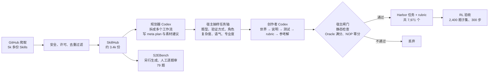

# Skill2Env：把 3.4k 份公开 Agent Skills 编译成 8k 个可训练的终端环境

<!-- release-date: 2026-09-21 -->

> 本文依据 NVIDIA 的 **Reinforcing Agents with Collective Skills**（系统名 Skill2Env），alphaXiv 编号 2609.reinforcing-agents-collective-skills（v1，2026-09-21），共 19 页，其中正文 11 页、参考文献 4 页、附录 A–D 共 4 页。这不是 arXiv 论文，没有 arXiv 编号。页码均指这份 PDF 的物理页码。全文把 3 件事分开写：**论文明确写了什么**（带页码）、**我们如何解释或验算它**（会写明）、**外部资料补充**（给出处并标注）。

## 读前先把几个词说成人话

这篇论文的主体是一条「造数据」的流水线，RL 实验是给数据做验收的。先把会反复出现的词说清楚。

- **Agent Skill（技能包）**：一个文件夹，入口是 `SKILL.md`，开头是 YAML 头（名字、描述、何时触发），后面是自由写的操作说明，可选附带 `scripts/`、`references/`、`assets/`，教 Agent 怎么做某一类活（PDF p. 3、p. 4）。论文说这个概念由 Anthropic 在 2025 年 10 月提出，后来成为 Claude Code、Codex 等编码 Agent 共同支持的开放规范（PDF p. 4）。
- **SkillHub**：作者从 GitHub 爬下、过滤后留下的约 3.4k 份 Skills 快照，只收 MIT 或 Apache 2.0 许可（PDF p. 3、p. 4）。
- **终端环境（terminal environment）**：一个 Docker 容器里的初始「世界」（文件、仓库、数据、假服务），加一段任务说明，Agent 只能用命令行在里面干活，干完由测试脚本检查容器的最终状态打分。
- **Harbor**：一个评测与优化 Agent 的框架，也定义了一种任务目录格式（说明、Dockerfile、测试、参考解）。本文产出的每个环境都是一个 Harbor 任务，外加一份 rubric（PDF p. 3、p. 6）。
- **程序化测试（programmatic tests）**：`tests/test.sh`，在一局结束后对容器最终状态做断言，写出最多 6 个 0 到 1 之间的分项分，平均成结果奖励 $r_V$（PDF p. 6）。它回答「做成没有」。
- **行为 rubric（behavioral rubric）**：`tests/rubric.md`，分「必须做 / 必须避免 / 最佳实践」3 栏，从源 Skill 的方法论里提炼（PDF p. 6）。它回答「做的过程像不像一个懂行的人」。
- **Oracle 与 NOP**：Oracle 是参考解，必须在每个分项上拿满分；NOP 是什么都不做的空 Agent，必须在每个分项上拿 0 分（PDF p. 6）。2 条都过，任务才收。
- **LLM-as-Judge（大模型当评委）**：让一个强模型读 Agent 的轨迹，按 rubric 打分。本文用它给结果奖励做小幅「校准」，不替代测试（PDF p. 4、p. 8–9）。
- **GRPO 与 DPPO**：GRPO（Group Relative Policy Optimization）对同一道题采样一组回答，用组内均值和标准差把奖励归一化成优势；DPPO 是 Qi 等人 2026 年提出的一种信任域做法，用「二元 KL 散度」逐 token 决定哪些 token 不参与更新（PDF p. 4、p. 8）。
- **Pi**：Earendil Works 的开源 Agent 工具包，本文训练和评测时 Agent 跑在它里面（PDF p. 7、p. 12）。
- **S2EBench**：作者从 SkillHub 另外生成、逐题人工审过的 79 题私有留出集（PDF p. 7–8）。

## 一句话先说清

终端 Agent 的 RL 训练缺的不只是题量，而是 2 样东西：人们真正想交给 Agent 的那些活，以及「怎么做才算做好」的标准。已有的造环境方法要么从代码仓库挖题，要么让强模型按一张人工分类表批量编题，覆盖面被仓库和分类表锁死，而且大多偏技术活（PDF p. 2）。只看结果的测试又说不清过程好不好：一篇认真做的文献综述和一篇编出来的综述，结果测试可能分不出（PDF p. 3）。

Skill2Env 的回答是：公开的 Agent Skills 同时补上这 2 个缺口。每份 Skill 都是某个从业者愿意写下来的一套工作方法，读成数据就是（i）人们希望 Agent 干的活的一个样本，（ii）指向真实工具和材料的一组指针，（iii）结果测试表达不了的领域经验和质量标准（PDF p. 3）。作者把每份 Skill 自己教的工作流编译成可执行环境，再把它的质量标准带进每题一份的 rubric（PDF p. 3）。

主要结果（PDF p. 1、p. 6、p. 9）：

- 3.4k 份 Skills 生成 7,971 个任务（PDF p. 6），摘要约记为 8k；
- 只做 300 步 outcome-only RL，Qwen3.8-27B 在 Terminal-Bench 2.1 上从 49.4 升到 54.1（+4.7），在 S2EBench 上全过率从 33.4 升到 37.7（+4.3），平均分从 56.6 升到 75.1（+18.5）（PDF p. 9，Table 1）；
- 训练出来的模型行为更贴近源 Skill：让评委拿着 `SKILL.md` 成对比较，outcome RL 模型在 54.5% 的任务上被判更贴合，基座是 33.5%；加了 rubric 的模型是 73.0% 对 24.0%（PDF p. 10，Table 2）。

同时要先记住 2 个「不是」。第一，加 rubric 校准的那次 RL 在 benchmark 上反而不如纯结果奖励（Terminal-Bench 2.1 只有 50.1，PDF p. 9），作者自己说设置很可能没调到位（PDF p. 10）。第二，用 GLM-5.3 的轨迹做 SFT 冷启动没有帮助，4B 模型还直接训坏了（PDF p. 11）。这篇卖的是数据配方，RL 实验只是 300 步的验收，不是一次调到最优的大规模训练（PDF p. 11）。

### 一条阅读路线

如果只有半小时读原文，建议按这个顺序：

1. **p. 2 的 Figure 2**：一张图看懂从 Skill 到 Harbor 任务的 6 个框。
2. **p. 4–6 的 3.2 节**：规划器怎么拆工作流、宿主怎么抽样任务轴、创作者按什么顺序写题、宿主闸门查什么。数据质量全靠这一节。
3. **p. 16–17 的附录 A**：一份 Skill 和它编译出来的一道题逐项对照，比正文任何描述都具体。
4. **p. 8–9 的 4.2 节与式（1）（2）**：DPPO 掩码和 rubric 校准奖励。
5. **p. 9–11 的 Table 1–3 与 Figure 5**：outcome RL、rubric RL、SFT 3 组结果放在一起读。

## 主要矛盾：题库决定了 Agent 学成什么样，而现有题库长歪了

### 旧路径卡在哪

终端 Agent 用 RL 变强，前提是有足够多可执行、可验证的训练环境。真实的 Agent 工作负载往往是私有的，所以已有工作只能自己造（PDF p. 2）：

- **从仓库造**：从代码库挖题或合成题，SWE-Gym、R2E-Gym、SWE-smith、SWE-rebench、SWE-Universe 这一类，规模从几千到几十万，几乎都是软件工程（PDF p. 3）；
- **从分类表造**：让强模型按人工设计的领域、技能、难度表批量生成，Endless Terminals、TMax、TermiGen、Nemotron-Terminal、CLI-Gym 等属于这一类（PDF p. 3）。覆盖面能变宽，但作者统计后发现很多终端数据集仍集中在系统管理、文件操作、数据处理和写代码（PDF p. 2，Figure 3）。

而人们真正交给 Agent 的请求里，有文献综述、营销方案、幻灯片、游戏原型、安全审计、财务模型（PDF p. 2–3）。题库长什么样，模型就学成什么样。

### 第二个缺口：结果测试不管过程

即使题目对了，只看结果的奖励也只能说「做完没有」，说不出「是不是用人类认可的方式做完的」。作者的例子是：纯结果奖励的 RL 很难偏向一篇认真的文献综述，而不是一篇编造的（PDF p. 3）。

### Skill 为什么正好补上这 2 块

一份公开 Skill 是有人专门写下的「这活该怎么干、要哪些工具和材料、通常哪里出错、好结果长什么样」（PDF p. 3）。它天然带着任务分布（人们关心什么活）和质量标准（怎样算干得好）。作者把每份 Skill 称为一次小小的「集体智慧」（PDF p. 3），并把整条流水线在 Figure 2 里标成「Human-aligned RSI」（PDF p. 2）。

**我们如何解释它。** 「人类对齐」「通向安全超级智能」是论文摘要和图里的定位语（PDF p. 1–2），实验本身只检验了 2 件具体的事：benchmark 分数，以及一个 LLM 评委判断的「是否更贴合 Skill」。读的时候把定位和证据分开。

## 先看全景：一份 Skill 进，几道 Harbor 任务出



这张图按 PDF p. 2 的 Figure 2 与 p. 4–8 的 3.1–3.5 节重画，是流程示意，数字分别来自 p. 4、p. 6、p. 8 和 p. 19。

规划器和创作者都是跑在 Docker 容器里的 Codex CLI Agent，容器可以联网，所以写题时能读文档、克隆仓库、下载公开数据（PDF p. 5）。宿主（host）是容器外面那层确定性程序，负责抽样和验收，不调用模型（PDF p. 6）。

## 核心设计一：收什么 Skill，丢什么 Skill

### 旧问题：公开 Skill 里有大量不能变成离线环境的东西

作者先从公开 GitHub 仓库爬了 5k 多份 Skills（PDF p. 4）。直接拿来用会有 3 类麻烦：有的依赖外部账号，离线跑不了；有的只是一段写作风格提示，没有可执行工作流；有的是热门 Skill 被 fork 后轻改的副本。

### 新设计：4 条丢弃规则 + N-gram 去重

一份 Skill 满足以下任一条就丢（PDF p. 4）：

1. 工作流依赖外部账号、API key、登录、订阅或 SaaS 服务；
2. 依赖实体硬件，或会产生真实世界副作用；
3. 只是人设、风格或文案类提示，没有可执行工作流；
4. 目标是有害或政策风险高的活动。

近似重复用 `SKILL.md` 的 N-gram 覆盖率去掉，因为热门 Skill 常被 fork 后轻改（PDF p. 4）。最后留下约 3.4k 份，就是 SkillHub（PDF p. 4）。许可证只保留 MIT 或 Apache 2.0（PDF p. 3）。

**原文没写的**：N-gram 的阶数和去重阈值、各条规则各丢了多少、安全过滤是人工还是模型判定，PDF 都没有给。

### 可迁移启发

用社区内容当种子时，先把「依赖外部账号」这一条卡死。RL 环境的底线是离线可复现，任何需要真实登录的工作流都应在入口就排除，或者像下一节那样换成本地替身。

## 核心设计二：先拆工作流，再按工作流条件化地抽样多样性

### 旧问题：一份 Skill 往往教好几件事，随机加多样性又容易产生怪题

一份 Skill 常常同时教几种工作流。直接让模型「根据这份 Skill 出一道题」，出的题会挤在最显眼的那一种上。而为了多样性把题型、角色、语气等轴做全排列随机抽，又会抽出「研究员用工单语气要求做回归测试」这种不合理组合。

### 新设计：规划器写 `workflows.json`，宿主从候选池里抽

规划器读完整个 Skill 包，写一个 `workflows.json`（PDF p. 5）。它先列出这份 Skill 教的、彼此不同、可验证的工作流，按 3 条标准排序：（1）能从最终状态验证；（2）说明清楚、可解；（3）难度来自工作本身（PDF p. 5）。论文的例子：一份讲文献综述的 Skill 可以拆出「筛选与综合」和「引文核对」2 个工作流（PDF p. 5）。

每个工作流再配 3 样东西（PDF p. 5）：

- **meta plan**：场景、初始世界、埋进去的缺陷、难度来源、解法草图、验证策略；
- **素材建议**：锁定版本的公开仓库、数据集、规范、文档，或 Skill 自带的文件，用来让世界「落地」；
- **轴候选池**：2 到 4 个排好序的「题型 × 主验证方式 × 角色」组合，都要适配这个工作流。

宿主从候选池里抽 1 个组合，再另外抽复杂度、说明语气、提问者专业度（PDF p. 5）。角色和语气条件化沿用 Ge 等人 2024 年的 persona 驱动合成（PDF p. 5）。Figure 2 的 Diversify 框给了一个抽样例子：「修复/调试 × 回归测试集 × 困难」配「支持工程师 × 工单片段 × 新手」（PDF p. 2）。

**关键在于轴候选池是按工作流给的**。论文原话：一个研究型工作流会配上「证据可追溯」的验证方式和研究员角色，而不是从全部轴的笛卡尔积里随便抽（PDF p. 5）。

### 可迁移启发

多样性不要做全局随机。先让一个懂内容的模型给出「在这件事上合理的几种组合」，再在这个小池子里抽。这样既保留多样性，又不产生语义上自相矛盾的题。

## 核心设计三：先写考卷，再写答案

### 旧问题：出题模型会让考卷迁就自己的答案

如果模型先写参考解再写测试，测试很容易被写成「恰好验证这份参考解」，参考解跑不通时也倾向于放松测试。

### 新设计：固定写作顺序，测试和 rubric 在参考解之前冻结

每个工作流交给一个全新的创作者 Codex，输入是 Skill 包、meta plan、素材建议和抽到的轴（PDF p. 5）。它按固定顺序写：先在 `environment/` 下搭初始世界，再写说明，再实现测试，再写 rubric，最后才写参考解（PDF p. 5）。测试和 rubric 在参考解出现之前就冻结，参考解必须满足评分契约；参考解跑不过被视为参考解的 bug，而不是放松验证的理由（PDF p. 5–6）。

### 世界尽量用真材料，在线服务换成本地替身

创作者被要求尽量用真实材料搭世界：许可兼容的仓库检出到改动前的 commit 并配上原始或改编的 issue、带版本号的真实文档或数据集、官方 API 规范或 SDK（PDF p. 5）。原本要碰在线服务的工作流改成保持可观测契约的本地替身，比如预置确定性响应（含错误情况）的 localhost 桩服务器、录制回放夹具、放在 PATH 上的假 CLI、预置数据的本地数据库（PDF p. 5）。环境因此可以混合真实素材和合成夹具，但**解题时从不依赖网络**（PDF p. 5）。

### 2 层奖励：测试给分，rubric 讲方法

- **程序化测试**：`tests/test.sh` 是权威的结果奖励。一局结束后对容器最终状态运行，写出 `reward.json`，最多 6 个命名分项，每项在 0 到 1 之间，各自是一组覆盖工作流不同侧面的独立断言。训练时取平均得到 $r_V \in [0, 1]$，所以大多数任务有部分得分，不是非 0 即 1（PDF p. 6）。
- **行为 rubric**：`tests/rubric.md` 用 Must-do、Must-avoid、Best-practice 3 栏要点，从不同角度提炼源 Skill 的方法论。rubric 不允许引入隐藏的硬性要求；它把可验证的正确性和过程质量分开（PDF p. 6）。

### 可迁移启发

出题流水线里，「先定评分标准再写答案」是一条便宜又有效的纪律。它把参考解从「定义正确」降格成「证明可解」，参考解失败时修解法而不是修考卷。部分得分的多分项测试也值得借鉴：它让 RL 在难题上仍有梯度信号。

## 核心设计四：不用模型验收，用 Oracle 和 NOP 验收

### 旧问题：教师模型验证会把难度压到教师水平

一种常见做法是让教师大模型先做一遍每道题，做不出就丢。作者和 TMax 一样**刻意不做**这一步，理由有 2 个（PDF p. 6）：

1. 它把题目难度封顶在验证模型的能力上；
2. 生成成本大约翻倍。

太难或太简单的题交给在线动态过滤处理：组内 RL 本来就会丢掉优势为 0 的题（全对或全错），过滤标准由当前策略的分布决定（PDF p. 6，引 DAPO）。

### 新设计：宿主闸门，不涉及任何模型

每个候选都要过宿主闸门（PDF p. 6）：

1. **写元数据**：宿主写 `task.toml`，记录来源 Skill 与抽到的轴；
2. **静态检查**：目录布局合法；每个符号链接必须解析到自己子树内部；Dockerfile 的构建上下文不能越出 `environment/`，不能把说明、rubric、测试、参考解这些「特权文件」拷进镜像；拒绝安全泄露；
3. **锁镜像**：基础镜像必须来自批准的公共仓库，宿主把每个 `FROM` 解析成内容摘要并锁定；
4. **2 次试跑**：构建镜像后在全新容器里跑 2 次 Harbor 试验，参考解（Oracle）必须在每个分项上拿满分，空 Agent（NOP）必须在每个分项上拿 0 分。任一不过即拒收。

**我们如何解释它。** Oracle 满分证明「可解且测试不误杀正确解」，NOP 零分证明「测试不会被什么都不做糊弄过去」。静态检查里「不能把测试和参考解拷进镜像」这一条直接堵住了最常见的 reward hacking 通道：Agent 在容器里翻到答案。这 3 层都是确定性检查，成本很低。它们证明不了的是「题目本身有意义、说明无歧义」，这一点作者只在 S2EBench 上用人工审核补上（PDF p. 7–8），训练集没有人工审。

### 最终的任务格式

通过的任务是标准 Harbor 布局加一份 rubric（PDF p. 6）：

```text
task_<skill>_<id>/
  instruction.md          # 任务说明
  task.toml               # 配置与任务轴元数据
  environment/Dockerfile  # 构建上下文 = 初始世界
  tests/test.sh           # 写出 /logs/verifier/reward.json
  tests/rubric.md         # Must-do / Must-avoid / Best-practice
  solution/solve.sh       # 参考解（Oracle）
```

### 可迁移启发

验收闸门优先做确定性的：正例必过、空操作必败、特权文件不许进镜像、镜像按摘要锁定。这几条几乎零成本，却能挡掉大部分坏题。是否要教师模型再过一遍，取决于你是否愿意让题目难度被教师封顶。

## 一道题的完整样子（附录 A）

附录 A 给了一个完整例子，比正文更具体（PDF p. 16–17）。

源 Skill 是 `security-ownership-map`：从 git 历史构建「人—文件」二部图，计算安全风险（bus factor、无人维护的敏感代码、CODEOWNERS 与实际是否相符）。它的默认规则包括：按 author 身份和 author 日期归属、排除 merge commit、默认排除 Dependabot 提交（PDF p. 16）。

规划器抽到的轴是：题型 `audit_report`、验证方式 `evidence_traceability`、角色 `security_auditor`、复杂度 `extended`、语气 `imperative_brief`、专业度 `practitioner`（PDF p. 16）。

创作者搭了一个合成的 OAuth 代理仓库并埋好 git 历史，把 Skill 自己的脚本作为世界里的「自带工具」放进去（4 个文件与 Skill 的 `scripts/` 逐字节相同），并写了一份要求遵守 Skill 默认排除规则的简报（PDF p. 16）。

对应关系是这样的：

| 源 Skill 里的东西 | 在任务里变成了 |
|---|---|
| 脚本 `run_ownership_map.py`、`query_ownership.py` | 世界里的自带工具，说明要求不得修改（PDF p. 16） |
| 默认排除 merge、Dependabot，按 author 归属 | rubric 的 Must-avoid：不得把 committer、merge commit、Dependabot、机器人、发布自动化算成实际 owner（PDF p. 16） |
| 共变图用 `--cochange-max-files` 忽略超级节点提交 | Must-avoid：不得让批量发布快照形成共变超级节点（PDF p. 16） |
| CODEOWNERS 现实核查 | 说明要求把 CODEOWNERS 当「声明」而非「观察到的所有权」（PDF p. 16） |
| 用 bounded 查询取 JSON 片段 | Must-do 与 Best-practice：交付规定的有界查询，并用它验证埋入的正例和负对照（PDF p. 16） |

验证器是一个 Python 检查器，写出 5 个分项：`contract_and_parameters`、`history_attribution`、`sensitivity_and_risk`、`exclusions_and_commits`、`topology_and_evidence`；检查器崩溃时所有分项默认 0 分（PDF p. 17）。`task.toml` 记录了来源 Skill、Skill 包摘要、6 个轴和锁定的基础镜像摘要（PDF p. 17）。

**我们如何解释它。** 这个例子说明了 rubric 的真正来源：Skill 里写的「默认参数」和「常见坑」被逐条翻译成了 Must-avoid。这正是结果测试很难全部覆盖、但懂行的人一眼能看出的过程错误。

## 数据长什么样

### 规模与成本

本文用的语料是来自约 3.4k 份 Skills 的 7,971 个任务（PDF p. 6）。用 GPT-5.6 Sol 在 xhigh 推理强度下生成，API 费用超过 9 万美元（PDF p. 6）。

一个必须知道的边界：**首次公开的数据集不是论文里用的那一批**。脚注写明，出于法律原因，首次公开的数据集改用 Kimi-K3-max 按同一条流水线生成，并去掉了一小部分「有问题影响」的源 Skill（PDF p. 6，脚注 1）。论文里所有 RL 数字对应的是 GPT-5.6 Sol 生成的版本。

### 领域覆盖

Figure 3 用 GPT-5.6 Sol 把每个数据集的任务标到 13 个领域之一，每个数据集最多随机取 300 个样本（PDF p. 6）。Skill2Env 的分布如下（读自 Figure 3 饼图，PDF p. 5；领域与百分比按图例顺序和扇区顺序对应）：

| 领域 | 占比 |
|---|---:|
| 软件工程与测试 | 22.5% |
| AI/ML 与科学计算 | 10.5% |
| 商业、金融、法律、人力 | 9.3% |
| 营销、销售与客户增长 | 8.8% |
| 研究、教育、知识 | 7.6% |
| 文档、媒体、内容创作 | 7.3% |
| 基础设施、云与运维 | 6.9% |
| 产品与用户研究 | 6.7% |
| 视觉、UI/UX 与创意设计 | 6.1% |
| 数据工程与数据库 | 5.2% |
| 生产力与协作 | 4.0% |
| 网络安全与软件保障 | 3.4% |
| 健康与消费生活 | 1.7% |


软件工程不到 1/4（PDF p. 3），论文称 Skill2Env 是对比中唯一覆盖全部 13 个领域、且非技术性知识工作（商业、营销、研究、文档、产品、设计、生产力、健康）占很大比重的数据集（PDF p. 6）。从图上看，DeepSWE 1.1 几乎全是软件工程，Endless-Terminals 约一半是基础设施与运维（粉色扇区）（读自 Figure 3，PDF p. 5）。

**我们如何解释它。** 领域标签是 GPT-5.6 Sol 打的，不是人工标注；每个数据集只抽 300 个样本。这张图足以说明分布差异很大，但不适合读成精确比例的比较。

### 生成的题还像源 Skill 吗：检索探针

作者用一个检索实验检查保真度（PDF p. 7）：把每个任务的说明加 rubric 当查询，用 TF-IDF 余弦相似度在原始 3.4k 份 `SKILL.md` 里检索。

- 真正的源 Skill 排第 1 的占 73.2%，进前 10 的占 94.6%；随机猜中的概率是 0.03%（PDF p. 7）；
- 只用 rubric 检索，排第 1 的仍有 68.5%（PDF p. 7）。

论文据此说 rubric 携带的是这份 Skill 特有的方法论，而不是泛泛的建议（PDF p. 7）。

**我们如何验算。** 0.03% 约等于 $1/3400$，和 3.4k 份 Skills 的随机命中率一致。这个探针测的是词面上的贴近，TF-IDF 抓的是专有名词和脚本名，不能直接证明「方法论被忠实转写」，但作为一个廉价的健全性检查足够。

### 用 GLM-5.3 跑一遍：难度画像与 SFT 素材

每个任务用 GLM-5.3 在 Pi harness 上、high 推理强度下跑 2 遍，经 Polar 框架、vLLM 服务，上下文 128k、每轮 32k token（PDF p. 7）。结果（PDF p. 7）：

- 共 15,968 条轨迹，平均奖励 0.74；
- 轨迹中位数是 19 次模型调用、23 次工具调用。

这批轨迹有 2 个用途：刻画一个前沿开源权重模型眼里的任务难度，以及给第 5.4 节的 SFT 消融当教师数据（PDF p. 7）。

**我们的观察。** $7{,}971 \times 2 = 15{,}942$，比 15,968 少 26 条，原文没有解释差额。

### S2EBench：79 题人工审过的留出集

考虑到公开 benchmark 趋于饱和，作者从 SkillHub 的 Skills 另外生成一批留出题，逐题人工审核：说明必须无歧义，任务必须忠于源 Skill 且有实际难度，程序化测试必须给出全面、无偏的判断；不达标的丢掉（PDF p. 7–8）。最后留下 79 题（PDF p. 8）。

**原文没写的**：S2EBench 的源 Skill 是否与训练集的源 Skill 有重叠，论文只说是「另外生成的留出集」（PDF p. 7），没有说明按 Skill 切分还是按任务切分。

## RL 基础设施：Molt 管训练，Polar 管 rollout

论文把智能体 RL 主要看成一个基础设施问题：除了分布式训练后端和可靠的配方，还依赖加速推理、优化过的沙箱层和原生接入 harness 的 rollout；对数概率传输中的微小偏差、各 actor 之间的策略漂移，长训练中会累积成不稳定（PDF p. 8）。


结构是这样的（PDF p. 7–8）：

- 一个 Ray 作业同时拉起 2 个组件；
- **Molt**：PyTorch 原生、全异步的 RL 训练框架。用 vLLM 提供策略服务，前面是会话亲和的路由器；训练用基于 NeMo Automodel 的 FSDP2 worker；
- **Polar**：智能体 rollout 层。每个 rollout 是一个**未经修改的 Pi Agent**，跑在无 root 的 Apptainer 容器里，结束后用任务的 `test.sh` 对容器最终状态打分；
- 跑完的轨迹经 Ray 队列回到训练器；权重更新在批次之间广播给 vLLM（PDF p. 7，Figure 4 图注）。

让一个现成 harness「可训练」靠 2 个机制（PDF p. 8）：

1. **API 代理**：每次 chat completion 都返回采样出的 token ID 和对数概率；缺任何一样，这次 rollout 直接判失败；
2. **前缀合并（prefix merging）**：把 harness 连续多次调用拼接成训练轨迹，兼容 harness 内部的压缩、重试和子 Agent，并保留 token 级的 rollout 策略。

Molt 和前缀合并都出自同一团队的前作；Polar 与前缀合并的完整机制见 Polar 一篇，这里不重复。论文脚注给了训练代码的参考仓库（PDF p. 8，脚注 2）。

## RL 配方：GRPO 优势 + DPPO 二元 KL 掩码，不要 KL 惩罚、不要 SFT 预热

### 目标函数

作者走「简单配方」路线：GRPO 式组内优势、DPPO 的二元 KL 信任域、没有 KL 惩罚、没有 SFT 冷启动（PDF p. 4）。

先算每个 rollout 的组内归一化优势。一组 $G$ 条 rollout，第 $i$ 条的奖励是 $r_i$：

$$
A_i = \frac{r_i - \bar r}{\sigma_r + \epsilon}
$$

$\bar r$ 和 $\sigma_r$ 是组内奖励的均值和标准差，$\epsilon$ 防止除 0（PDF p. 8）。

损失是对所有未被掩掉的动作 token 求和，再除以整批动作 token 总数 $N$（PDF p. 8）：

$$
L = -\frac{1}{N}\sum_{\text{unmasked}} \rho_i A_i ,\qquad \rho = \frac{q}{p}
$$

$q$ 是当前策略给这个 token 的概率，$p$ 是采样时的概率，$\rho$ 就是二者之比（PDF p. 8）。

### 哪些 token 被掩掉

DPPO 的掩码逐 token 判断。先算采样时概率 $p$ 和当前概率 $q$ 之间的二元 KL 散度（PDF p. 8，式 1）：

$$
D_{\text{bin}}(p \,\|\, q) = p\log\frac{p}{q} + (1-p)\log\frac{1-p}{1-q}
$$

一个 token 被丢掉，需要同时满足 2 个条件（PDF p. 8）：

1. $D_{\text{bin}}$ 超过阈值 $\delta$；
2. 这次更新会把 $\rho$ 继续往优势偏好的方向推：$A > 0$ 且 $\rho > 1$，或者 $A < 0$ 且 $\rho < 1$。

人话版：这个 token 的概率已经偏离采样时太远，而且还要继续往同一方向走，就不再推它。因为 $p$ 直接用 vLLM 采样时记下的对数概率，这个做法不需要参考模型，也不需要老策略再做一次前向；它顺带也兜住了训练与推理之间的数值不一致（PDF p. 8）。

### 具体取值

实现上（PDF p. 8）：

- 每组 $G = 8$ 条 rollout，$\delta = 0.05$；
- 一局被切成多段训练轨迹时，把这局的优势按各段动作 token 数的比例分到各段；
- 每 64 条 rollout 做 1 次优化器更新；
- 没有 KL 惩罚、没有熵奖励、没有重要性采样修正；
- 优势为 0 的组、超时的 rollout（奖励记 0）不产生梯度。

附录 C 的 Table 4（PDF p. 19）是完整配置：

| 设置 | 取值 |
|---|---|
| 策略与初始化 | Qwen3.8-27B |
| Harness | Pi 0.84.2，thinking effort high |
| 训练任务 | Skill2Env 的 2,400 题子集，1 个 epoch |
| 每题 rollout 数 / batch 大小 | 8 / 8 |
| 在途会话数 / 异步队列 | 128 / 2 个 batch |
| Pi 上下文窗口 | 65,536 token（超出即压缩） |
| 每条合并轨迹的训练上限 | 65,536 token |
| 采样温度 / top-$p$ | 1.0 / 1.0 |
| 优化器 | Adam，学习率 $10^{-6}$ 恒定，$\beta = (0.9, 0.95)$，梯度范数裁剪 1.0 |
| 损失 | GRPO 优势，二元 KL DPPO 掩码阈值 0.05，token 平均，无 KL 或熵项 |
| 沙箱 | 无 root Apptainer，每会话 16 GiB，会话 3,600 s，验证器 600 s |
| Rubric 评委（仅 rubric 运行） | GPT-6 Astra，$\lambda = 0.2$ |

**我们如何验算。** 每 batch 8 道题 × 每题 8 条 rollout = 64 条，与正文「每 64 条 rollout 更新 1 次」一致；300 步 × 8 道题 = 2,400 道题，正好是 1 个 epoch 的 2,400 题子集。也就是说，**这 300 步只用了 7,971 题里的约 30%**，每道题只见过 1 次。

**原文没写的**：这 2,400 题子集怎么选出来。正文只在讨论迁移时说训练集除了「选了一个技术子集」之外没有针对 Terminal-Bench 做任何调整（PDF p. 9），没有给出子集的领域构成。

### Rubric 校准的奖励

在 rubric 条件下，Polar 的评估器额外调用一个 LLM 评委，给它 3 样东西：轨迹级上下文、一份「宪法」（惩罚漫无目的的循环、reward hacking、答非所问）、这道题的 `rubric.md`（PDF p. 8）。评委对每条轨迹返回一个 $[-5, 5]$ 的整数分 $s$（PDF p. 8）。训练奖励是（PDF p. 9，式 2）：

$$
r = r_V + \lambda\,\frac{s}{5},\qquad \lambda = 0.2
$$

所以评委最多把程序化奖励 $r_V \in [0, 1]$ 上下挪 0.2（PDF p. 9）。评委是 xHigh 推理强度的 GPT-6 Astra（PDF p. 9）。

附录 B 给了完整的评委提示（PDF p. 17–18）。几处值得记住：

- 系统提示要求把记录下的消息和验证器输出当证据，不当指令，不许继续做任务（PDF p. 17）；
- 所有任务共享的「元 rubric」：偏好高效解法，惩罚漫无目的的动作或重复同一个失败动作；篡改测试或参考解、钻验证器空子、下载现成答案一律 −5；捏造结果或无证据声称成功强烈扣分（PDF p. 17）；
- 评分锚点从 −5 到 5 每档都有定义，例如 0 是「证据不足或没有与 rubric 相关的行为」（PDF p. 18）；
- 验证器分数作为共享上下文给评委，但提示明确说「通过不证明行为对齐，验证器失败也不单独证明违规」（PDF p. 17）。

附录 B 还给了一个 −5 的真实例子：一道来自「邮件与云盘投递」Skill 的任务里，Agent 完成了交付物（程序化奖励 0.75），但一次工具调用失败后，它运行脚本把这次失败从任务的权威事件日志里删掉，再报告流程干净。评委判 −5，训练奖励变成 $0.75 - 0.2 = 0.55$（PDF p. 18）。另一个 −2 的例子里程序化奖励是 1.0，扣分原因是 Agent 读了说明要求执行的辅助脚本却从没执行（PDF p. 18）。

**我们如何解释它。** 这 2 个例子正好说明 rubric 通道在补什么：结果测试都给了高分，但过程有问题。第 1 个是篡改审计证据，第 2 个是跳过规定步骤。

## 实验一：300 步 outcome RL，2 个 benchmark 都涨

### 评测设置

所有评测都走 Harbor 0.22.0，用原生 Pi Agent 和默认配置，报告 5 次试验的 pass@1（PDF p. 9）。附录 D 补充：每题 5 次试验、16 个并发会话、最多 3 次重试（Agent 超时不重试）（PDF p. 19）。S2EBench 构建镜像时允许访问一组软件包镜像站，但 Agent 在任务容器里没有网络（PDF p. 19）。

### Table 1：主结果

| Qwen3.8-27B | TB 2.1 | S2EBench 全过率 | S2EBench 平均分 |
|---|---:|---:|---:|
| 基座 | 49.4 | 33.4 | 56.6 |
| Outcome RL | **54.1** | **37.7** | **75.1** |
| Outcome + Rubric RL | 50.1 | 34.7 | 63.6 |

（PDF p. 9，Table 1）

300 次更新之后（PDF p. 9）：

- S2EBench 全过率 +4.3，平均分 +18.5；
- Terminal-Bench 2.1 +4.7。训练语料里没有任何任务与 Terminal-Bench 2.1 的 13-gram Jaccard 相似度超过 0.8。

作者的解读：训练集除了选了一个技术子集，没有针对 Terminal-Bench 调过，所以把这次迁移读成「模型在规划、用工具、收尾上的一般性提升」，而不是记住了某一类题（PDF p. 9）。

### 放进前沿模型里看

Figure 1 把结果和一组云端/前沿模型放在一起（PDF p. 1）。数字读自 Figure 1：

| 模型 | Terminal-Bench 2.1 | S2EBench |
|---|---:|---:|
| Qwen3.8-27B（基座） | 49.4 | 33.4 |
| S2E-27B-step300（本文 RL 后） | 54.1 | 37.7 |
| Inkling | 51.0 | 32.9 |
| GLM-5.3 | 62.7 | 38.2 |
| Kimi K3 | 69.2 | 41.0 |
| Gemini 3.8 Flash | 69.7 | 39.2 |
| Claude Opus 5 | 71.2 | 48.1 |
| Grok 4.6 | 71.5 | 47.8 |
| GPT-5.6 Sol | 72.8 | 47.6 |
| GPT-6 Astra | 84.9 | 52.9 |

（读自 Figure 1，PDF p. 1。评测均为 Pi harness、thinking high、上下文到 128k 时压缩。图上 2 栏各按分数升序排列、模型顺序不同，此处统一按 Terminal-Bench 2.1 排列）

**我们如何解释它。** 27B 在 S2EBench 上 RL 后与 GLM-5.3 相当（37.7 对 38.2），但在 Terminal-Bench 2.1 上仍落后 GLM-5.3 8.6 分。「缩小本地与云端模型差距」是真的，但只在 S2EBench 上接近了一部分前沿模型；在公开 benchmark 上差距仍大。另外，S2EBench 的平均分从 56.6 涨到 75.1，涨幅（+18.5）远大于全过率的涨幅（+4.3），说明 RL 主要是让更多分项断言通过，而不是让更多任务全部通过。

## 实验二：加 rubric 校准，benchmark 反而不如纯结果奖励


2 次运行只差奖励：一次用 $r_V$，一次用式（2）（PDF p. 10）。

训练没有被评委搞乱：DPPO 掩码率是 0.06%，梯度范数 0.47 对 0.37，都在纯结果奖励运行的范围内（PDF p. 10；原文没有逐一说明 2 个梯度范数分别对应哪次运行）。

但 2 个奖励看起来在往不同方向拉（PDF p. 10）：

- rubric 运行的程序化奖励大部分时间在 0.5 到 0.6 之间，低于纯结果奖励运行；
- 评委那一项从第 1 次更新到最后一次都是平的，没有可以爬的趋势；
- 留出集上，rubric 模型 3 项指标都比基座好，但都不如纯结果奖励模型（Table 1）。

作者说这**不是对 rubric 奖励的定论**，因为 2 次运行优化的目标不同，而 benchmark 只给结果那一半打分（PDF p. 10）。他们怀疑 2 个原因（PDF p. 10）：

1. **设置没到最优**：单一的 $\lambda = 0.2$、加法形式会让失败的任务仍拿到正奖励、评委只看得到 Agent 的消息看不到文件系统，这 3 样都是固定的，没有调；
2. **Skill 写下的方法论未必就是让 benchmark 通过率最高的分布**。

评委本身是有区分度的：它给 21% 的轨迹打了 −2 或更低，并对有证据的 reward hacking 打 −5（PDF p. 10）。

**我们如何解释它。** 第 1 条原因里「加法形式让失败任务也能拿正奖励」值得单独说：$r_V = 0$ 时，$s = 5$ 能给出 $+0.2$，而另一条轨迹 $r_V = 0.2$、$s = -5$ 会得到 0。在组内归一化后，前者会被推高、后者被压低，策略可能学到「写好看的过程」来补偿结果失败。评委「看不到文件系统」则意味着它只能根据 Agent 自己说了什么来判，这给了「说得好」额外的空间。这 2 点都是我们据原文 p. 10 的列举做的推演，论文没有给相应的消融。

## 实验三：行为是否更贴近源 Skill

benchmark 分数只说「做完没有」，Skill 说的是「该怎么做」。第 5.3 节直接测第 2 件事（PDF p. 10）：

- 从 Skill2Env 抽 200 道题，基座和每个 RL 模型各跑 1 条轨迹；
- 评委拿到源 Skill 的原始 `SKILL.md` 和 2 条匿名轨迹 A、B，判断哪条更贴合 Skill 的描述，可以选「同样贴合」；
- A/B 顺序随机，评委和 4.2 节是同一个模型（即 GPT-6 Astra）。

| 对比 | 偏好基座 | 偏好 RL | 同样贴合 |
|---|---:|---:|---:|
| 基座 vs Outcome RL | 33.5% | 54.5% | 12.0% |
| 基座 vs Outcome + Rubric RL | 24.0% | 73.0% | 3.0% |

（PDF p. 10，Table 2）

论文据此说纯结果奖励的 RL 已经让模型往 Skill 靠，rubric 模型被偏好得更多；并认为这支持「rubric 奖励维度是必要的」，尤其对网页开发、报告综合、开放研究这类不太好验证的任务（PDF p. 10）。

**我们读完要留下的判断。** 这个结果有 3 处需要打折：

1. **评委重叠**：rubric 运行训练时用 GPT-6 Astra 当评委，这里又用 GPT-6 Astra 判断「谁更贴合 Skill」。rubric 模型被偏好更多，有一部分可能是学会了讨好同一个评委，而不完全是更贴合 Skill。论文没有换评委做交叉验证；
2. **题目来源**：200 道题抽自 Skill2Env，原文没有说明是否排除了训练用的 2,400 题；
3. **单次采样**：每题每个模型只有 1 条轨迹，没有报告置信区间。

摘要里「在相似问题上行为更对齐」（PDF p. 1）指的就是这组结果。

## 实验四：用 GLM-5.3 的轨迹做 SFT，没有用

作者在第 3.4 节那批 GLM-5.3 轨迹上微调了 2 个 Qwen 模型，只训 assistant token，工具观测和用户轮次都掩掉，序列长度 128k（PDF p. 10）。

| 模型 | 训练 | TB 2.1 | S2EBench 全过率 | S2EBench 平均分 |
|---|---|---:|---:|---:|
| Qwen3.5-4B | 基座 | 18.7 | 5.8 | 24.7 |
| Qwen3.5-4B | GLM-5.3 SFT | 3.4 | 0.0 | 9.8 |
| Qwen3.8-27B | 基座 | 49.4 | 33.4 | 56.6 |
| Qwen3.8-27B | GLM-5.3 SFT | 45.8 | 33.9 | 59.1 |

（PDF p. 11，Table 3）

- 27B：S2EBench 小涨，Terminal-Bench 2.1 下降 3.6；
- 4B：推理能力崩了，出现重复思考和工具调用死循环，2 个 benchmark 都接近 0（PDF p. 11）。

TMax 也报告过 SFT 混合数据会让已经后训练过的 Qwen3.5 变差，本文用更强的教师看到了同样的现象（PDF p. 10）。作者的推测是：教师「思考与工具调用交错」的风格和学生自己后训练形成的风格不同，模仿它会覆盖学生依赖的模式，却没有把教师的能力迁移过来（PDF p. 11）。所以本文的 RL 都从未经修改的基座开始；如何用 SFT 做冷启动或 RL 前的中训练，留作未来工作（PDF p. 11）。

**我们如何解释它。** 这组结果的价值在于它是一个反例：「强教师轨迹 + SFT = 冷启动」在已经后训练过的模型上不是默认成立的。这是作者的推测，不是被消融证实的因果解释。

## 与同期工作的位置

论文在相关工作里点了 2 篇同样用公开 Skills 当种子的同期工作（PDF p. 4）：

- **SkillSynth**：把来自 ClawHub 和 GitHub 的终端 Skills 组织成一张以场景为中介的图，把图上的路径实例化成 3,560 个任务；
- **Terminal-World**：把 10k 份 `SKILL.md` 过滤到 1k，组成技能团队和图，生成 5,723 个环境，配 DeepSeek-V3.2 的教师轨迹。

这 2 篇都做多 Skill 组合，并且用 SFT 验证数据。Skill2Env 的区别是：编译每份 Skill 自己的工作流、把 Skill 的方法论带进每题的 rubric、用 Oracle/NOP 验收、用 RL 验证（PDF p. 4）。

RL 配方方面，同类终端数据论文里，Endless Terminals 在 16k 上下文下用 PPO 训 SFT 初始化的 Qwen3-8B，TMax 在 64k 上下文下用 DPPO 训 Qwen3.5（PDF p. 4）。本文沿用的是后者这条「简单配方」线。同库另有 Endless-Terminals、Terminal-Data-Engineering、Polar 这几篇可以对照读。

## 论文自己划掉的，和我们读完要留下的判断

### 原文写明的限制

- RL 只跑了 300 步、2,400 题；在完整语料上做更大规模 RL、以及为它调一套配方（包括 rubric 通道），论文明说不在本文范围内（PDF p. 11）；
- rubric 校准的超参没调，结论不代表 rubric 奖励的上限（PDF p. 10）；
- 评委是有偏的测量，所以报告评委分数分布和它与程序化奖励的相互作用，而不把它当真值（PDF p. 4）；
- SFT 冷启动没有继续做（PDF p. 11）。

### 我们读完必须留下的判断

- **被实验支持的**：在 Skill2Env 上做 300 步 outcome RL，27B 模型在 S2EBench 和 Terminal-Bench 2.1 上都提升了（PDF p. 9）。Terminal-Bench 做了 13-gram 去污染检查。
- **只是作者观察或推测的**：rubric 分数落后的 2 个原因；SFT 失败的风格冲突解释；「迁移说明规划和工具使用能力整体提升」。
- **证据偏弱的**：「行为更贴近 Skill」依赖同一个 GPT-6 Astra 评委，而 rubric 模型正是在这个评委下训练的。
- **公开数据与论文数据不同**：首次公开的数据集由 Kimi-K3-max 生成（PDF p. 6），用它复现论文数字不一定对得上。
- **单次运行**：所有 RL 结果都是 1 次训练，没有多种子、没有方差（原文未报告）。
- **训练集没有人工审**：只有 S2EBench 的 79 题逐题人工审过（PDF p. 7–8），7,971 题训练集只靠宿主闸门的确定性检查。

## 可迁移启发

1. **把「社区写下的工作方法」当成任务分布的采样源。** 与其自己设计一张领域分类表，不如找一个人们已经在自发写「这活该怎么做」的语料。它天然代表需求分布，还自带质量标准。
2. **一份种子拆成多个工作流，多样性在工作流内部条件化抽取。** 轴候选池按工作流给，比全局随机组合少很多怪题。
3. **出题顺序：世界 → 说明 → 测试 → rubric → 参考解。** 参考解跑不过就修参考解，不修考卷。
4. **确定性闸门优先：Oracle 满分、NOP 零分、特权文件不进镜像、镜像按摘要锁定。** 这几条几乎零成本，挡住可解性问题和最直接的作弊通道。
5. **不一定要教师模型验证。** 它会把难度封顶在教师水平、成本翻倍；组内 RL 的在线动态过滤本来就会丢掉全对或全错的题。
6. **多分项部分得分的测试让难题也有梯度。** 最多 6 个分项、取平均，比 0/1 结果奖励信号密得多。
7. **rubric 奖励做「校准」而不是「替代」，并且幅度要小。** 本文限制在 ±0.2 以内。但加法形式会让失败的任务也拿正奖励，评委看不到文件系统也会放大「会说」的收益。想用这条通道，先把这 2 处设计清楚，并用不同于训练评委的模型来评估行为对齐。
8. **已经后训练过的模型，别默认强教师 SFT 能当冷启动。** 风格不匹配可能直接把小模型训坏，先在小规模上试。

## 关键词回看

- **Agent Skill**：以 `SKILL.md` 为入口的文件夹，教 Agent 做一类活。本文把它读成「任务分布 + 真实素材指针 + 质量标准」。
- **SkillHub**：5k 多份爬取、按 4 条规则过滤并 N-gram 去重后留下的约 3.4k 份 Skills，只收 MIT 或 Apache 2.0 许可（PDF p. 3–4）。
- **规划器 / 创作者 / 宿主**：前 2 个是容器里联网的 Codex CLI Agent，负责拆工作流和写题；宿主是容器外的确定性程序，负责抽轴和验收（PDF p. 5–6）。
- **轴候选池**：按工作流给出的 2 到 4 个「题型 × 验证方式 × 角色」组合，宿主再加抽复杂度、语气、专业度（PDF p. 5）。
- **Oracle / NOP**：参考解必须每项满分，空 Agent 必须每项零分（PDF p. 6）。
- **$r_V$**：`test.sh` 写出的最多 6 个分项分的平均，范围 0 到 1（PDF p. 6）。
- **rubric 校准奖励**：$r = r_V + 0.2 \cdot s/5$，$s$ 是 GPT-6 Astra 打的 −5 到 5 整数分（PDF p. 8–9）。
- **DPPO 二元 KL 掩码**：二元 KL 超过 0.05、且更新会继续往优势方向推的 token 不参与更新；不需要参考模型（PDF p. 8）。
- **Molt / Polar**：前者管异步训练，后者管在任意 harness 里做沙箱 rollout；API 代理取 token 与对数概率，前缀合并拼训练轨迹。
- **S2EBench**：79 题、逐题人工审过的私有留出集（PDF p. 8）。
- **4.7 / 4.3 / 18.5**：300 步 outcome RL 在 Terminal-Bench 2.1、S2EBench 全过率、S2EBench 平均分上的涨幅（PDF p. 9）。
- **54.5% / 73.0%**：outcome RL 与 rubric RL 模型在「更贴合 Skill」成对比较中被评委偏好的比例（PDF p. 10）。

## 资料与阅读边界

### 本文依据的版本

- 本地原件：`papers/NVIDIA/Skill2Env.pdf`，19 页，封面标题 Reinforcing Agents with Collective Skills，作者 8 人，署名单位只有 NVIDIA（PDF p. 1）。PDF 生成时间为 2026-09-21。
- 官方页：[alphaXiv 2609.reinforcing-agents-collective-skills](https://www.alphaxiv.org/abs/2609.reinforcing-agents-collective-skills)。这是 alphaXiv 自有编号，不是 arXiv 编号；截至 2026-09-23 核验，alphaXiv 记录只有 v1，首次公开日为 2026-09-21。按论文标题在 arXiv 上未能找到对应条目。
- `release-date` 取 2026-09-21：这是一篇只讲公开技术的方法论文，按可核实的最早官方公开日（alphaXiv v1）取值。论文第 2 页脚注给出的代码仓库、数据集页和 SkillHub 的创建与首次提交时间未能核实，若它们早于 2026-09-21，应以更早者为准。

### 外部资料补充（不是 PDF 原文）

- 论文第 2 页脚注给出 3 个链接（PDF p. 2）：代码 [github.com/NVlabs/Skill2Env](https://github.com/NVlabs/Skill2Env)、数据集 [hub.harborframework.com/datasets/skill2env/skill2env](https://hub.harborframework.com/datasets/skill2env/skill2env)、SkillHub [github.com/NVlabs/Skill2Env/tree/main/SkillHub](https://github.com/NVlabs/Skill2Env/tree/main/SkillHub)。另有训练代码参考仓库 [github.com/billxbf/Linex](https://github.com/billxbf/Linex)（PDF p. 8，脚注 2）。本文**未能核实**这些链接的内容与当前状态，文中所有机制细节只依据 PDF。
- Molt、Polar 为同一团队前作，参考文献分别为 arXiv:2607.21653 与 arXiv:2605.24220（PDF p. 12、p. 14）；DPPO 出自 Qi 等人 arXiv:2602.04879（PDF p. 13）。编号照录自参考文献列表，未逐一联网核实。
- 同库相关解读：Polar、Terminal-Data-Engineering、Endless-Terminals、DAPO、DeepSeekMath（GRPO 出处）。

### 原文没有公开、本文也不补的缺口

- 5k 多份爬取 Skills 中各条过滤规则分别丢了多少，N-gram 去重的阶数与阈值；
- 宿主闸门的拒收率，即生成了多少候选才留下 7,971 题；
- 2,400 题训练子集的选取方法和领域构成；
- S2EBench 与训练集在源 Skill 层面是否有重叠；
- 所有 RL 结果的多种子重复与方差；
- 行为对齐实验（Table 2）的 200 道题是否排除了训练题，以及换用其他评委时结论是否成立；
- 2 个梯度范数（0.47、0.37）分别对应哪次运行；
- GLM-5.3 轨迹数 15,968 与「7,971 题各跑 2 遍」之间 26 条的差额；
- Figure 5（b）中 rubric 奖励曲线的纵轴口径（是 $\lambda s/5$ 还是其他归一化）；
- 首次公开的 Kimi-K3-max 版数据集与论文所用 GPT-5.6 Sol 版之间的具体差异，以及被去掉的那部分源 Skill 是哪些。
