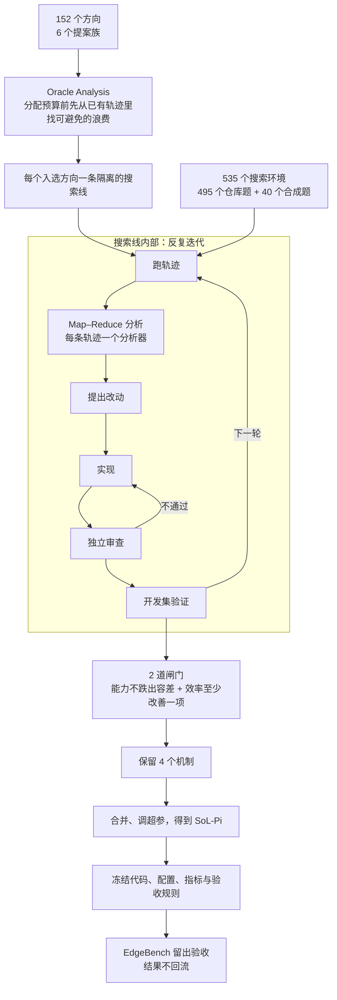
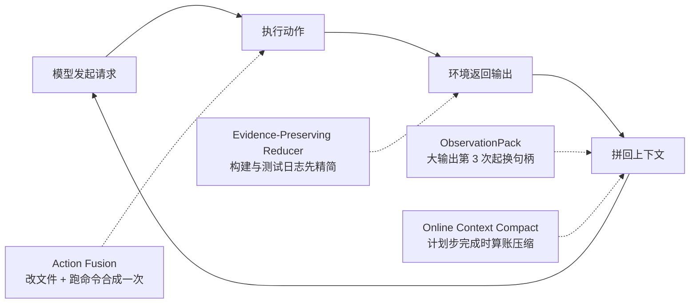

# SoL-Pi：让 AI 替 harness 做研究，4 个机制把 Agent 的 token 账单砍掉 1/3

<!-- release-date: 2026-09-17 -->

> 本文依据 NVIDIA（联合南洋理工大学 NTU 与 MIT）的 **SoL-Pi: Recursively Scaling Auto-Research Loops for Efficient Agent Harness**，即 arXiv:2609.20519v1（2026-09-17），共 15 页。页码均指这份 PDF 的物理页码。这是一篇技术论文，不是基模报告：没有训练任何模型，也没有改模型权重，它改的是模型外面那层程序。全文把 3 件事分开写：**论文明确写了什么**（带页码）、**我们如何解释或验算它**（会写明）、**外部资料补充**（给出处并标注）。

## 读前先把几个词说成人话

这篇论文的难点不在公式（全文一个公式都没有），而在它同时讲 2 层东西：一层是被优化的 Agent 程序，一层是去优化它的「研究 AI」。先把词分清。

- **Harness（外壳程序）**：包在大模型外面、让它能干活的那层代码。它决定给模型看什么（上下文怎么拼、工具输出怎么塞回去）、让模型能做什么（有哪些工具、参数长什么样）、什么时候停。Codex CLI、Claude Code 都是厂商自带的 harness（论文称 native harness）；**Pi** 是 Earendil Works 的开源编码 Agent 工具包，本文的起点（PDF p. 14，参考文献 35）。
- **Agent 循环**：模型发一次请求（一次 API call，也叫一轮 model turn），harness 执行它要的工具，把结果（observation，观测）拼回上下文，再发下一次请求。长任务里这个循环会转几百上千次。
- **Token 流量（token traffic）**：整个任务里所有请求累计发送和接收的 token 数。论文把它拆成 4 列：新输入（Input）、命中缓存的输入（Cache Read）、写入缓存的输入（Cache Write）、模型输出（Output）（PDF p. 6，Table 1）。
- **Prompt cache（提示缓存）**：API 服务商把上一次请求的前缀存起来，下次同样前缀再来时按「缓存读」计价，比新输入便宜得多。但只要前缀被改动，改动之后的部分就得重新「缓存写」，写比读贵。论文在 p. 9 引 Anthropic 的 Prompt Caching 文档说明「改动已缓存的前缀会降低缓存复用」，并在 p. 5 用「缓存写 / 读单价比」估算重写开销。
- **Token 效率（token efficiency）**：论文定义为「每拿到 1 分任务得分要花多少美元」，即 API 费用 ÷ 平均得分，越低越好（PDF p. 6）。
- **RSI（Recursive Self-Improvement，递归自我改进）**：AI 改进自己（或改进造出自己的流程）的设想。本文只借它的思路，在 harness 这一层做：让 AI 去改 Agent 的外壳（PDF p. 2）。
- **Auto-research loop（自动研究循环）**：一个 AI 研究员反复「提想法 → 写代码 → 跑实验 → 看结果 → 留下、修改或丢弃」的循环（PDF p. 3，引用 Karpathy 的 autoresearch）。
- **Held-out（留出集）**：搜索过程中完全看不到、只在最后验收时才用的评测任务。本文的留出集是 EdgeBench（PDF p. 3）。

本文要讲的 4 个机制名字先列在这里，后面逐个展开（PDF p. 4）：

- **Action Fusion（动作融合）**：改完文件顺手跑命令，2 个动作合成 1 次请求；
- **Online Context Compact（在线上下文压缩）**：在计划步骤完成时算账，划算才压缩上下文；
- **ObservationPack（观测打包）**：大的工具输出只完整发 2 次，之后换成句柄加摘录；
- **Evidence-Preserving Reducer（保证据的日志精简器）**：让便宜模型从构建和测试日志里抽证据，再用确定性校验兜底。

同库里 GEPA、ADAS、Darwin-Godel-Machine 3 篇讲的是「让 AI 自动设计 Agent」的前作，AIDE2 一篇讲 AI 自动做 ML 研究的循环；本文在它们的方向上，把优化目标换成了 token 账单。

## 一句话先说清

Agent 越跑越久，花钱的大头已经不是「每个 token 多贵」，而是「一个任务要来回发多少 token」。以前省钱的办法都在压单价：更快的 attention kernel、推理服务、量化、换便宜模型（PDF p. 2）。这篇论文走另一条正交的路：不碰模型，只改 harness，让同一个模型完成同一个任务时少发 token。

难点是 harness 的各个部件耦合得很紧：工具、上下文管理、校验、委托、恢复、终止，一处局部省了，可能在下游引发失败，或者只是把 token 成本挪到了后面（PDF p. 2）。人工去看长轨迹、找反复出现的浪费、改代码，又贵又难扩展。

所以作者让 AI 来做这份研究，并把研究流程本身做成可以横向扩展的「漏斗」：

1. 研究 AI 读基础 harness 的执行轨迹，提出约 150 个方向（精确是 152 个），在 535 个可执行环境里跑了 3,000 多次实验、60,000 多次 Agent 与环境的交互（PDF p. 2、p. 3）；
2. 每个候选必须过 2 道预先固定的闸门：能力指标不能跌出容差，效率指标至少改善一项（PDF p. 3）；
3. 最后留下 4 个机制，合并成 SoL-Pi，冻结之后才去留出集 EdgeBench 上验收，验收结果永不回流到搜索里（PDF p. 3、p. 6）。

主要结果（PDF p. 1、p. 6–7）：

- EdgeBench 公开的 51 题上，SoL-Pi 在 GPT-5.6 Sol 和 Opus 5 这 2 个模型后端上的分数与 Pi 相当（保留 Pi 分数的 93.7% 与 94.3%），token 流量降 49.0% 与 44.7%，API 费用降约 1/3（33.2% 与 33.5%）（PDF p. 6）；
- 相对各自的原生 harness，费用降 50.0%（对 GPT-5.6 Sol 上的 Codex）和 54.3%（对 Opus 5 上的 Claude Code）（PDF p. 1，Figure 1 图注）；
- 机制只在 GPT-5.6 Sol 的轨迹上搜出来，原样搬到 Opus 5 也有效，论文称之为跨模型迁移的「初步证据」（PDF p. 6）。

同时要先记住 2 个「不是」：SoL-Pi 的完整版不是更强，是更省，分数比 Pi 低约 2.8 分（42.0 对 44.8，PDF p. 6）；Terminal-Bench 4 上它比 Pi 少解 3 题（15 对 18，PDF p. 7）。它卖的是「差不多的活，2/3 的钱」。

### 一条阅读路线

如果只有半小时读原文，建议按这个顺序：

1. **p. 1 的 Figure 1**：一张图看懂研究循环和最终账单。
2. **p. 3 的 2.1 节与 Figure 2**：2 道闸门、指标预先冻结、留出集不回流。这是全文方法论的核心。
3. **p. 4–5 的 2.4 节与 Figure 4**：4 个机制各自在 Agent 循环的哪一步动手。
4. **p. 6–7 的 Table 1、Table 2**：2 个后端、2 个工作点的完整账单。
5. **p. 9 的 Table 4 与「Cache Reuse and Total Cost」一段**：为什么砍的几乎全是缓存读，以及为什么多花了缓存写反而更省。
6. **p. 10 的 Figure 8 与 3.5 节**：一个机制从发现到保留的 27 轮迭代，看自动研究到底在做什么。

第 3.2、3.3 节（Terminal-Bench 4、IMO 2026、多 Agent 集群）是旁证，样本都很小，读时注意这一点。

## 主要矛盾：harness 最值得改，却最难靠人改

### 旧路径卡在哪

第 1 节开篇先划清战场（PDF p. 2）：Agent 的任务从「补全一段代码」变成「无人值守地跑一整夜」，每个任务都是一条长长的推理、工具调用和反馈轨迹。这时 token 效率成了一阶的系统问题。

已有的省钱思路都在降单价：更快的 kernel 与服务框架（论文引 FlashAttention-2、PagedAttention）、量化（SmoothQuant、GPTQ）、换便宜模型（FrugalGPT、RouteLLM）（PDF p. 2）。这些都有效，但它们不管「一个任务要发多少 token」。

Harness 层正好管这个量，而且不需要再训模型（PDF p. 2）。问题在于它难改：

- 部件互相牵连。把上下文压短，可能导致模型忘掉关键信息，后面多走几轮；把工具输出截短，可能让模型看不到报错，反复重跑（PDF p. 2 说的「把 token 成本挪到后面的阶段」）。
- 发现浪费要看长轨迹。人得一条条翻执行记录，找出重复出现的模式，再翻译成代码改动，扩展不到大量任务与环境上（PDF p. 2）。

### 自动化已有人做，但卡在「过拟合」

让 AI 自动改 harness 已经有先例。论文点了 2 篇（PDF p. 2）：Meta-Harness 在可执行的 harness 程序空间里搜索，并评估向留出数据集和模型的迁移；RHI（Recursive Harness Self-Improvement）针对单个任务迭代地改 Agent 循环的提示级规范。

但另一篇研究（Wang 等人，Rethinking the evaluation of harness evolution for agents）在留出任务上发现：进化出来的 harness 会过拟合搜索时用的任务，到没见过的任务上只剩边际收益（PDF p. 2、p. 11）。这就是本文要解的具体矛盾：

> 自动搜索 harness 很容易在「搜索用的那几道题」上刷出好看的数字。怎么让搜出来的改动在没见过的任务、没见过的模型上仍然成立？

论文的回答不是一个新算法，而是一套研究流程纪律，归成 3 条原则（PDF p. 2）：

1. **广度与深度**：广度是提更多假设，深度是对有希望的候选反复实现、审查、加固；
2. **独立验证**：候选冻结之后才看留出集证据，证据永不回到搜索中，免得验收失败被「打补丁」修成针对任务的特解；
3. **可扩展的编排**：每条搜索线都是隔离的、用完即弃的实例，一条失败不连累别的。

## 先看全景：一个从宽到深的研究漏斗

这张图按 PDF p. 2–4 的文字与 Figure 2、Figure 3 重画，是流程示意，不是论文原图，也没有时间先后的实测含义。原文 Figure 2 画的是单条搜索线内部的 6 个阶段与冻结线（PDF p. 3），Figure 3 画的是 2 类环境汇成 535 个搜索环境、EdgeBench 在冻结线另一侧（PDF p. 4）。

读这张图要抓住一件事：**整条流水线里只有 2 个地方在「做决定」，而且都被锁死了。** 一个是闸门的指标和容差，搜索开始前就定好，并且不让正在做优化的 Agent 碰（PDF p. 3）；另一个是留出验收，只能否决，不能反馈（PDF p. 3）。其余所有环节都可以让 AI 自由发挥。

## 核心设计一：先把「验收规则」锁在 AI 够不着的地方

### 旧问题：优化器会钻验收标准的空子

让一个 AI 去优化指标，它迟早会找到「改指标比改系统容易」的路。论文把这一层说得很直白：能力指标、可接受容差和效率指标在实验开始前就固定，全程不变，并且与优化 Agent 严格隔离，防止它去操纵验收标准（PDF p. 3）。

### 新设计：2 道顺序闸门，再取非支配解

候选要过 2 道闸门，先后顺序固定（PDF p. 3）：

1. **能力闸门**：每一项能力指标都必须落在预先声明的容差之内；
2. **效率闸门**：至少一项声明过的效率指标得到改善。

2 道都过的候选里，再保留在这些指标下「非支配」的那些（PDF p. 3）。非支配（nondominated）的意思是：找不到另一个候选在所有指标上都不比它差、且至少一项更好。这相当于保留一条帕累托前沿，而不是按一个加权总分排序。

**我们如何解释它。** 第一道闸门是「不许退步」，第二道才是「必须进步」。顺序很关键：如果把能力和效率合成一个分数，省 50% token、掉 3 分的方案可能压过省 10%、不掉分的方案，而后者才是可以放心上线的那种。先卡能力，就把「用能力换效率」的交易排除在单个机制的层面之外。

### 留出集只能否决，不能反馈

EdgeBench 被整个留作最终验证，与搜索过程隔离（PDF p. 3）。在留出评测前，机制源码、配置、指标、能力容差和验收规则都要冻结；验收失败只会让候选被拒，不会触发进一步优化（PDF p. 3、p. 6）。

具体切法是：EdgeBench 公开的 51 道题里，11 道用于对冻结候选做「单向验收」，剩下 40 道留作最终泛化评测（PDF p. 6）。

**我们如何解释它。** 「单向」是这里的关键词：信息只从候选流向验收，不从验收流回搜索。这是机器学习里训练集、验证集、测试集纪律在 Agent 研究里的翻版。论文把这条纪律的动机引到 Gao 等人关于奖励模型过度优化的规模定律（PDF p. 2），意思是：只要优化压力足够大，任何能被看到的评估信号都会被过拟合。

有一处原文没有交代清楚。3.1 节说评测用的是这 51 题公开集（PDF p. 6），摘要也写「51-task EdgeBench evaluation」（PDF p. 1）；但 p. 6 同时说 11 题用于验收、40 题留作最终评测。论文没明说表里的数字是在 51 题上还是只在那 40 题上算的。**我们对照原图原表验算**：Figure 6、Figure 7 的全部触发率都是 1/51 的整数倍（如 78.4% = 40/51，33.3% = 17/51，56.9% = 29/51，PDF p. 9–10），换成 40 题则除不尽；摘要里「每小时节省」也恰好按 51 题 × 2 小时摊出来（见文末）。所以统计口径几乎可以肯定是全部 51 题，也就是说其中 11 题已经参与过候选的取舍，不是严格意义上的「从未见过」。这是我们的推断，原文没有写明。

### 可迁移启发

自己搭自动调参或自动改 prompt 的流水线时，先把「谁有权改验收标准」这件事做成物理隔离，而不是写在提示词里请 AI 自觉。验收集最好只返回一个比特（过或不过），不返回可以被拿去针对性修补的细节。

## 核心设计二：从宽到深，用隔离的搜索线换规模

### 外层：152 个方向，6 个提案族

外层搜索从 152 个提出的方向开始，分在 6 个提案族里：上下文、进度、工具、委托、提示与策略、改进与评估（PDF p. 3）。在分配实验预算之前，先做一步 **Oracle Analysis**（「先知分析」）：在已有的开发轨迹上找出基础 harness 里本可避免的工作（PDF p. 3）。每个入选方向都必须指明一个具体的开销来源，并给出针对它的 harness 改动（PDF p. 3）。

**我们如何解释它。** Oracle Analysis 的作用是「先估天花板，再花钱」。比如后面 Action Fusion 的案例里，它先测出直接可省的空间是 12.3%（PDF p. 10，Figure 8），觉得值得才开一条专门的搜索线。这一步便宜，因为只是回放和统计已有轨迹，不用跑新实验。

提案族只标记假设从哪来，不限制改动落在哪。论文的例子是：ObservationPack 起源于 2 个「上下文」族的假设，最终却改的是观测边界（PDF p. 3）。

### 内层：一条搜索线怎么迭代

每条独立搜索线按常规的自动研究循环走：提出改动、实现、跑一个固定实验、看结果、保留或修改或丢弃（PDF p. 3，引用 Karpathy 的 autoresearch）。作者在此基础上加了一个基于 Ralph Loop 的迭代实现环（PDF p. 3）。参考文献 24 指向 Claude Code 仓库里 ralph-wiggum 插件的 ralph-loop 命令（PDF p. 13），论文没有展开它的内容。这个迭代环是：

- 实现者按一个明确的完成标准打磨候选；
- 独立审查者在评估前检查它，审查不过就返工；
- 每轮迭代可能产出多条探索轨迹。独立的分析器各看一条，找 4 类信号：重复动作、上下文膨胀、大观测、稀疏的诊断信号；
- 一个汇总器（reducer）把各分析器的发现合成候选级的摘要，指导下一轮提案（PDF p. 3）。

这就是 Figure 2 里「Map–Reduce Analysis」的含义：每条轨迹一个 map，最后一次 reduce（PDF p. 3）。

**我们如何解释它。** 执行轨迹动辄几十万 token，一个模型读不完也读不准。拆成「每条轨迹一个分析器」既能并行，也能让每个分析器的上下文保持短小。这个做法和后面 Evidence-Preserving Reducer「让小模型先读日志」的思路是同一类：先用便宜的读者把长材料压成证据，再让贵的决策者看证据。

### 用完即弃的实例

每条搜索线都是同一个共享 skill 模板的一次性实例：模板里只有一个最小研究循环和操作说明。每个实验复制模板、设参数、跑到结束；保留候选和证据，丢弃被改过的编排代码（PDF p. 3）。广度来自多跑几条隔离的循环，深度来自每条循环里的反复打磨（PDF p. 3）。

论文特意加了一句：这些数量只描述搜索的范围，不构成规模定律（PDF p. 3）。

### 搜索环境：495 个真实仓库题 + 40 个合成题

搜索集共 535 个可执行环境（PDF p. 3）：

| 类别 | 数量 | 怎么造 | 成功怎么判 |
|---|---:|---|---|
| 仓库派生 | 495 | GitHub 上一对 issue 与 PR，取修复前的仓库状态和离线依赖；已合入的补丁和改动历史作为参考轨迹 | 隐藏的回归测试：补丁前失败、补丁后通过的才保留 |
| 验证器驱动 | 40 | 先生成一个定义成功的可执行验证器，再围绕它搭任务环境 | 验证器；允许多种合法解法，不需要参考轨迹。接口主要沿用 Terminal-Bench 2 的风格 |

表内容整理自 PDF p. 3–4 与 Figure 3。PR 和回归测试对 Agent 隐藏（PDF p. 4）。

**我们如何解释它。** 仓库题提供「真实软件改动」的分布，合成题提供「开放式解题」的分布，两者让搜出来的机制不至于只适配一种任务形态。Figure 1(a) 左侧画了 Python、TypeScript、Go、Rust、C++、Java 以及数据科学、Web 应用、ML 流水线、CLI 工具、基础设施脚本、文档站点等环境类型（PDF p. 1），但正文没有给出各语言或各类型的数量分布。

### 可迁移启发

1. 自动研究的规模化靠的不是一个更聪明的研究 AI，而是**隔离**：每条搜索线独立、可丢弃，失败不传染，才敢一口气开上百条。
2. 先用廉价的回放统计估出每个方向的天花板，再决定开不开实验线。
3. 长轨迹分析用 map–reduce，不要让一个模型硬读全部。

## 核心设计三：4 个留下来的机制，各管 Agent 循环的一环

先看这 4 个机制分别卡在循环的哪一环（PDF p. 4–5）：

这张图按 PDF p. 5 第 2.4 节末段的文字重画，是机制示意。原文的说法是：改代码时 Action Fusion 把编辑和后续命令合并；环境返回输出时 Reducer 从日志里抽证据，ObservationPack 避免大结果被反复完整发送；完成一个计划步时 Online Context Compact 检查压缩是否划算，所以它们针对的是互补的开销来源（PDF p. 5）。

### 机制一：Action Fusion，省掉一次「空转」的往返

**旧问题。** 基础版 Pi 常常先改一个文件，再单独发一条命令去测试、构建或运行它（PDF p. 4）。中间那次模型往返几乎没有信息量：模型看一眼「文件已改」，然后说「跑测试吧」。但每次往返都要把整个上下文再发一遍。

**新设计。** 把 2 个动作合进一次工具请求，2 个结果放在同一个观测里返回，省掉中间一次模型往返（PDF p. 4）。实现上是给改文件类的工具加一个可选的后续命令参数（Figure 4 里画作 `then_run`）（PDF p. 5）。需要先看改动结果才能决定下一步的命令，仍然分开执行（PDF p. 4）。

Figure 4(a) 把这件事画成 3 次 API 调用变 2 次，省 1 次（PDF p. 5）。

**收益有多大。** 论文的案例研究给了先知分析阶段的估算（PDF p. 10，Figure 8 (d)–(f)）：

- 改文件之后的下一个动作里，85.1% 是 bash，14.9% 是其他；
- 如果每次都触发融合，模型轮次从 1,386 降到 1,237，少 149 轮（10.8%）；
- 总 token 从 32.38M 降到 28.64M，少 3.74M（11.5%）。

注意这是「全部触发」假设下的投影，不是实测（PDF p. 10 图注明确写 project）。

**代价与边界。** 合并意味着模型要提前决定「改完就跑什么」，放弃看一眼再决定的机会。所以需要检查改动结果的命令被排除在外（PDF p. 4）。

**可迁移启发。** 在自己的 Agent 里统计「动作 A 之后紧跟动作 B」的频率。高频且 B 不依赖 A 的结果细节的组合，都值得做成一个带可选后续步的复合工具。

### 机制二：Online Context Compact，在任务的自然断点上算账

**旧问题。** 上下文会随着轮次单调增长。Figure 4(b) 示意：基线每轮的上下文长度是第 1 轮的 1.0 倍、1.3 倍、1.6 倍、1.9 倍，一直带着完整历史（PDF p. 5）。压缩（compaction，让模型把历史总结成一段短文本）能止住增长，但压缩有代价：它改写了上下文前缀，之前缓存好的前缀就作废了，下一次要付一笔更贵的缓存写（PDF p. 4、p. 9）。什么时候压，是个经济问题。

**新设计。** 用「计划步骤完成」作为考虑压缩的时机（PDF p. 4）。Agent 通过 `update_plan` 工具维护自己的计划。每到一个计划步完成的边界，harness 做一次估算（PDF p. 4）：

1. **还剩多少次请求**：用已完成步骤之间观察到的请求数，乘以未完成的步骤数来估；
2. **封顶**：这个估计不能超过「按当前增长速度把上下文窗口填满」所需的请求数；
3. **成本闸门**：比较预计能省下的输入成本和重写 prompt 缓存的额外成本，前者大才压；
4. **后续压缩更保守**：之后的压缩还要算上前几次尚未收回的重写成本，并要求更大的节省余量。

闸门通过，或者上下文用量接近窗口上限时，harness 调用 Pi 原生的压缩功能，前提是压缩真能让上下文变短（PDF p. 4）。重写开销用上下文大小和「缓存写单价 ÷ 缓存读单价」来估，**不单独计入**生成摘要那次调用的费用（PDF p. 5）。

Figure 4(b) 的示意数字是：压缩后第 3、4 轮的上下文降到 0.55 倍和 0.75 倍（PDF p. 5）。这是示意图里的相对长度，不是实测值。

**我们如何解释它。** 压缩的收益与「后面还要发多少次请求」成正比：每次请求都要重发整个前缀，前缀短一截，后面每一次都省一截；而成本是一次性的。所以任务越靠前、剩余步数越多，越值得压。计划步完成是一个天然的好时机：刚结束的子任务的细节大概率不再需要，而剩余工作量可以用计划里还没打勾的项来估。

**代价与边界。** 估算依赖 Agent 真的在用 `update_plan` 维护计划；在 Opus 5 上它只在 33.3% 的任务里触发，而 GPT-5.6 Sol 上是 92.2%（PDF p. 9，Figure 6）。论文推测这与机制只在 GPT-5.6 Sol 轨迹上优化有关（PDF p. 8）。另外摘要调用本身的费用没进闸门，是一个已知的低估。

**可迁移启发。** 压缩不要按固定 token 阈值触发，而要按「剩余请求数 × 每次可省 − 缓存重写成本」算账，并把压缩点对齐到任务的语义边界上。

### 机制三：ObservationPack，大输出只完整发 2 次

**旧问题。** 一个大的工具输出（比如一次完整的测试报告），一旦进入上下文，之后每次请求都会被重发，哪怕里面大部分内容早就用不上了（PDF p. 4）。Figure 4(c) 用红色标出这部分「更高的输入成本」（PDF p. 5）。

**新设计。** 超过 10 KiB 的结果先在本地存档，接下来的 2 次请求里照常完整发送；从第 3 次起，替换成一个稳定句柄、原始大小，以及一小段由完整首行和尾行组成的摘录（PDF p. 4）。Figure 4 的示意写的是「句柄 + 1 KB 摘录」（PDF p. 5）。Agent 需要时可以用句柄取回原文里的精确片段；较小的结果不动（PDF p. 4）。

**我们如何解释它。** 为什么是「前 2 次完整」？因为模型通常在拿到结果后的头 1–2 轮就会消化它，之后它就只剩「存在过」的意义。「稳定」二字也要紧：句柄不变，替换后的上下文前缀在后续轮次里保持一致，缓存能继续命中。

**代价与边界。** 在 GPT-5.6 Sol 上单独启用 ObservationPack 时，它是 4 个机制里平均分最高的配置（47.208，PDF p. 9，Table 4），但在完整组合里它变得更挑剔：触发任务比例从 80.4% 降到 56.9%（PDF p. 10，Figure 7）。论文推测是与 Reducer 在大观测轨迹上重叠（PDF p. 8）。

**可迁移启发。** 给工具输出加「过期时间」：大输出在上下文里的完整寿命可以很短，只要留一个可回查的句柄。这比一开始就截断更安全，因为模型在最需要的那 1–2 轮看到的是全文。

### 机制四：Evidence-Preserving Reducer，让便宜模型读日志，但不信它

**旧问题。** 构建和测试日志又长又啰嗦，真正有用的往往只是几行报错。让前沿模型逐字读完很贵。

**新设计。** 对一组预定义命令产生的、至少 4 KiB 的构建和测试日志做精简；文件读取和搜索结果不走这条路（PDF p. 5）。流程是（PDF p. 5）：

1. 把原始输出精确存档；
2. 让一个更便宜的模型（实现中是 GPT-5.6 Luna，推理强度 high，PDF p. 5）从中抽取关键证据，写成一张紧凑的「回执」（receipt）；
3. 一个**确定性**校验器检查回执的格式（schema）、原文哈希、退出状态、逐字引文和大小；
4. 校验失败、疑似含凭据、或回执并没有更小，就回退到原始日志。

这 2 个机制之间有明确的先后：Reducer 先处理工具结果，ObservationPack 再投影模型上下文；ObservationPack 认得回执标记，会跳过这些结果，以免把已经校验过的证据再压一遍（PDF p. 5）。分工上，辅助模型只负责抽证据，诊断和决定下一步动作仍由主 Agent 负责（PDF p. 5）。

**我们如何解释它。** 这里的关键设计是「逐字引文」加「原文哈希」。小模型可能概括错、漏掉关键行、甚至编出不存在的报错；但只要要求它给出的每条证据都是原文里能逐字找到的片段，就能用字符串匹配这种零成本、零误判的方式验证。便宜模型负责「挑」，确定性代码负责「验」，前沿模型负责「判」。

**代价与边界。** 多了一次小模型调用。论文 Table 4 里，GPT-5.6 Sol 上单独加 Reducer 后的新输入（Input）从 0.0011B 升到 0.0051B（PDF p. 9），我们推测这就是回执作为新内容进入上下文的痕迹，原文没有解释这一列的变化。它在 Opus 5 上的单机制平均分（43.405）低于 Pi 基线（44.756）（PDF p. 9），是 4 个机制里唯一在 Opus 5 上掉分的。

**可迁移启发。** 任何「让小模型先读、大模型再看」的管线，都给小模型的输出设计一个能被确定性代码验证的格式。逐字引用 + 哈希，是最便宜的防幻觉手段。

## 实验一：EdgeBench 上的完整账单

EdgeBench 是字节跳动 Seed 发布的评测，参考文献里的全名是「EdgeBench: Scaling laws of environment learning」（PDF p. 13）。它共 134 题，其中 51 题开源，本文用的就是这 51 题（PDF p. 6）。评测报告平均分、token 流量（单位是十亿，B）和 API 费用；所有费用按 2026-08-17 的 API 价格计（PDF p. 6，Table 1 注）。

### Table 1：GPT-5.6 Sol 上 8 种配置

论文报告 2 个 SoL-Pi 工作点（PDF p. 6）：

- **SoL-Pi [Efficiency]**：固定的 4 机制完整组合，面向 token 效率；
- **SoL-Pi [Performance]**：从 Table 4 里挑平均分最高的单机制配置，每个后端单独挑。GPT-5.6 Sol 上它就是 Pi + ObservationPack。

| Harness | 缓存读（B） | 缓存写（B） | 输出（B） | 总计（B） | 费用（美元） | 平均分 | 美元 / 分 |
|---|---:|---:|---:|---:|---:|---:|---:|
| EdgeBench 官方 @2h（GPT-5.5） | – | – | – | – | – | 31.2 | – |
| Codex | 3.0287 | 0.0145 | 0.0052 | 3.0537 | 1,787 | 34.738 | 1.0086 |
| OpenSquilla | 1.2533 | 0.0776 | 0.0044 | 1.3353 | 1,243 | 24.506 | 0.9945 |
| Oh-My-Pi | 2.0448 | 0.0484 | 0.0168 | 2.2235 | 1,832 | 26.921 | 1.3347 |
| OpenCode | 2.2625 | 0.2865 | 0.0164 | 2.5668 | 3,422 | 29.552 | 2.2704 |
| Oh-My-Opencode | 2.4373 | 0.1286 | 0.0121 | 2.5825 | 2,678 | 38.523 | 1.3633 |
| Pi | 2.1326 | 0.0141 | 0.0059 | 2.1538 | 1,339 | 44.833 | 0.5855 |
| SoL-Pi [Efficiency] | 1.0605 | 0.0316 | 0.0061 | 1.0990 | 894 | 42.003 | 0.4174 |
| SoL-Pi [Performance] | 2.0005 | 0.0160 | 0.0056 | 2.0224 | 1,271 | 47.208 | 0.5280 |

数据来自 PDF p. 6 Table 1。为了窄屏可读，省掉了「新输入（Input）」一列：它在各行只有 0.0001B–0.1135B（PDF p. 6），对总计影响很小。EdgeBench 官方那一行是不参与排名的纯分数参照（PDF p. 6）。

论文对这张表的读法（PDF p. 6）：

- Efficiency 点总共 1.10B token，比 Pi 少 49.0%，保留 Pi 平均分的 93.7%（42.0 对 44.8），token 费用低 33.2%；
- Performance 点把平均分从 44.8 提到 47.2（+5.3%），同时 token 流量少 6.1%，token 效率提升 9.8%。

我们用表中数字验算过这 5 个百分比，均与原文一致（例如 $1.0990 / 2.1538 \approx 0.510$，$894 / 1339 \approx 0.668$）。

**读表要知道的 3 件事。**

第一，**几乎全部流量都是缓存读。** Pi 的 2.1538B 里有 2.1326B 是缓存读，占 99% 以上（PDF p. 6）。Agent 循环每一轮都重发整个前缀，前缀命中缓存，所以在账单上表现为海量的缓存读。这解释了为什么 4 个机制几乎都在「让前缀变短或变少」：输出 token 和新输入 token 本来就没多少可省。这是我们的读法，论文在 p. 9 的「Cache Reuse and Total Cost」一段里表达了同一个判断。

第二，**Pi 本身已经是一个很强的起点。** 在 6 个现成 harness 里，Pi 的平均分最高、每分成本最低（PDF p. 6）。SoL-Pi 是在最好的起点上继续省，不是在一个差的基线上刷数字。

第三，**Efficiency 点并不「白省」。** 42.003 对 44.833，掉了约 2.8 分（PDF p. 6）。论文用「comparable（相当）」概括，但没有给多次运行的方差或置信区间，读者无法判断 2.8 分是否在噪声之内。

### Table 2：原样搬到 Opus 5

为了检验迁移，作者把在 GPT-5.6 Sol 上开发的 SoL-Pi 不做任何再搜索或适配，直接用在 Opus 5 上（PDF p. 6）。Opus 5 这一块（PDF p. 7，Table 2）：

| Harness | 缓存读（B） | 缓存写（B） | 输出（B） | 总计（B） | 费用（美元） | 平均分 | 美元 / 分 |
|---|---:|---:|---:|---:|---:|---:|---:|
| Claude Code | 1.8116 | 0.1701 | 0.0226 | 2.0045 | 2,535 | 43.689 | 1.1377 |
| Pi | 2.3203 | 0.0348 | 0.0145 | 2.3697 | 1,741 | 44.756 | 0.7625 |
| SoL-Pi [Efficiency] | 1.2626 | 0.0352 | 0.0123 | 1.3101 | 1,158 | 42.224 | 0.5376 |
| SoL-Pi [Performance]（Pi + Action Fusion） | 2.0520 | 0.0352 | 0.0144 | 2.1016 | 1,605 | 50.482 | 0.6235 |

Opus 5 块的新输入列除 Claude Code 为 0.0002B 外均为 0.0000B（PDF p. 7），同样省略。GPT-5.6 Sol 块与 Table 1 对应行相同。

在 Opus 5 上，SoL-Pi [Efficiency] 保留 Pi 平均分的 94.3%，token 流量少 44.7%，API 费用少 33.5%（PDF p. 6）。Performance 点在 Opus 5 上换成了 Action Fusion，平均分 50.482，比 Pi 高 12.8%，token 效率提升 18.2%（我们按表算出，对应结论里的「5.3–12.8%」与「9.8–18.2%」2 个区间，PDF p. 12）。

一个值得注意的细节：Claude Code 的总 token（2.0045B）其实比 Pi（2.3697B）还少，但费用高出很多（2,535 对 1,741 美元）（PDF p. 7）。它的缓存写是 0.1701B，约为 Pi 的 5 倍，输出也多出约一半（0.0226B 对 0.0145B）（PDF p. 7）。**我们如何解释它**：缓存写和输出都比缓存读贵得多，少发 token 不等于少花钱，前缀稳不稳定同样决定账单。这正好是下一节的主题。

### 缓存复用的账：少命中缓存，反而更省

这是全文最反直觉、也最值得带走的一段（PDF p. 9）。

直觉上，prompt cache 越多命中越好。但论文指出：缩短上下文如果改动了之前缓存的前缀，就会降低缓存复用；而缓存命中的输入也是要付钱的，所以在整个任务的尺度上，死守一个长前缀并不总是最便宜（PDF p. 9）。Online Context Compact 和 ObservationPack 都是「拿一部分前缀复用，换更少的重复输入」（PDF p. 9）。

GPT-5.6 Sol 上完整组合的账（PDF p. 9）：

| | Pi | SoL-Pi [Efficiency] | 变化 |
|---|---:|---:|---|
| 缓存读（B） | 2.1326 | 1.0605 | 约减半 |
| 缓存写（B） | 0.0141 | 0.0316 | 约 2.2 倍 |
| 总费用（美元） | 1,339 | 894 | 少 445 |

缓存写涨了一倍多，总费用仍然从 1,339 美元降到 894 美元（PDF p. 9）。论文的结论是：应该把任务的总成本和任务质量一起评估，而不是只看缓存复用率（PDF p. 9）。

**我们如何解释它。** 设缓存读单价为 $c_r$、缓存写单价为 $c_w$（通常 $c_w \gg c_r$）。一次压缩要把长度为 $L'$ 的新前缀写进缓存，一次性多付约 $L' \cdot c_w$；之后剩下的 $n$ 次请求，每次少读 $\Delta L$ 个 token，共省 $n \cdot \Delta L \cdot c_r$。只要

$$
n \cdot \Delta L \cdot c_r > L' \cdot c_w
$$

压缩就划算。这就是 Online Context Compact 的成本闸门在比较的东西（PDF p. 4 的文字描述；这个不等式是我们按文字写出的示意，原文没有给公式）。当剩余请求很多、每次省得多时，左边远大于右边。

### 可迁移启发

1. 评估 Agent 成本时，把 token 拆成新输入、缓存读、缓存写、输出 4 列分别看，按各自单价算钱。只看总 token 或只看缓存命中率都会误导。
2. 长时程 Agent 的钱大多花在「反复重发前缀」上，省钱的第一抓手是前缀长度乘以请求次数，而不是输出长度。

## 实验二：4 个机制各自贡献多少

### Table 4：逐个单独加到 Pi 上

作者用「加一个」（add-one）的方式评估每个机制的独立贡献：Pi 基线、4 个各加一个机制的变体、完整组合，在 2 个后端上各跑一遍（PDF p. 8）。

| 配置 | GPT-5.6 Sol 总 token（B） | 费用（美元） | 平均分 | 美元 / 分 | Opus 5 总 token（B） | 费用（美元） | 平均分 | 美元 / 分 |
|---|---:|---:|---:|---:|---:|---:|---:|---:|
| Pi 基线 | 2.1538 | 1,339 | 44.833 | 0.5855 | 2.3697 | 1,741 | 44.756 | 0.7625 |
| + Action Fusion | 1.8968 | 1,235 | 46.664 | 0.5190 | 2.1016 | 1,605 | 50.482 | 0.6235 |
| + Online Context Compact | 1.2881 | 935 | 41.993 | 0.4365 | 1.9152 | 1,537 | 49.155 | 0.6130 |
| + Evidence-Preserving Reducer | 1.9375 | 1,200 | 44.630 | 0.5274 | 1.9131 | 1,456 | 43.405 | 0.6578 |
| + ObservationPack | 2.0224 | 1,271 | 47.208 | 0.5280 | 1.4418 | 1,176 | 47.047 | 0.4899 |
| SoL-Pi [Efficiency] | 1.0990 | 894 | 42.003 | 0.4174 | 1.3101 | 1,158 | 42.224 | 0.5376 |

数据来自 PDF p. 9 Table 4，只保留总计、费用、平均分和每分成本 4 列；分列的缓存读写见原表。

论文的读法（PDF p. 8–9）：每个机制在 2 个后端上都降低了总 token；ObservationPack 在 GPT-5.6 Sol 上平均分最高，Action Fusion 在 Opus 5 上最高；完整组合在 2 个后端上都是总 token 和费用最低的点；每个单机制配置在 2 个后端上的每分成本都低于 Pi。

**我们如何解释它。** 这张表里有 3 个原文没展开的信号：

1. **GPT-5.6 Sol 上，省 token 的大头是 Online Context Compact。** 它单独就把总 token 从 2.1538B 压到 1.2881B，完整组合也只再压到 1.0990B（PDF p. 9）。它单独时的平均分（41.993）也和完整组合（42.003）几乎一样，是 GPT-5.6 Sol 上唯一明显掉分的单机制。完整组合的「省」和「掉分」都与这一个机制最像；不过 add-one 评测只能看出这种相似，不能证明掉分就是它造成的。
2. **在 Opus 5 上，情况倒过来。** Online Context Compact 单独只省到 1.9152B，却让平均分涨到 49.155；省得最多的单机制变成 ObservationPack（1.4418B）（PDF p. 9）。同一个机制在不同后端上的作用差别很大。
3. **组合的分数低于任何一个「涨分」的单机制。** 在 Opus 5 上，4 个单机制里有 3 个平均分高于 Pi，但完整组合是 42.224，低于 Pi 的 44.756，也低于全部 4 个单机制（PDF p. 9），甚至低于原生 Claude Code 的 43.689（PDF p. 7）。GPT-5.6 Sol 上同样如此：4 个单机制里 2 个涨分，组合却低于 Pi（PDF p. 9）。论文没有解释为什么组合后分数反而掉了。「机制互补」的说法（见下文 Figure 7）是在效率上成立的，在分数上这张表并不支持。

### 同一套机制，换个模型就不太爱触发

论文定义了 2 个指标（PDF p. 8）：**触发率**是机制被激活的任务占比；**触发强度**是在被触发的任务里平均激活多少次。原文 Figure 6 是 3 组柱状图，读数整理如下（PDF p. 9）：

| 机制 | 触发率 Sol / Opus | 触发强度 Sol / Opus | 触发任务上效率提升 Sol / Opus |
|---|---|---|---|
| Action Fusion | 78.4% / 76.5% | 70.58 / 13.54 | 24.7% / 23.3% |
| Online Context Compact | 92.2% / 33.3% | 2.04 / 1.59 | 20.9% / 7.2% |
| Evidence-Preserving Reducer | 39.2% / 23.5% | 12.75 / 3.42 | 20.1% / 25.5% |
| ObservationPack | 80.4% / 68.6% | 8.59 / 5.40 | 10.2% / 35.8% |

2 个指标在 Opus 5 上都更低，论文推测这反映了 harness 只在 GPT-5.6 Sol 的轨迹上优化过（PDF p. 8）。但 Opus 5 上每个配置在它被触发的任务上仍然提升了 token 效率，完整组合在 2 个后端上的「分数–效率」取舍也相近（PDF p. 8）。

**我们如何解释它。** 最刺眼的是 Action Fusion 的触发强度：GPT-5.6 Sol 上平均每个触发任务融合 70.58 次，Opus 5 上只有 13.54 次（PDF p. 9）。触发靠的是模型主动去用那个带后续命令的工具参数，而工具描述和提示词是在 GPT-5.6 Sol 上调出来的（见后文 Figure 8）。换一个模型，它对同一份工具说明的「使用习惯」就不同。这提醒我们：harness 机制里凡是需要模型「主动配合」的部分，都带着模型特异性。但反过来说「由 harness 自己判定的就更好迁移」，这张图并不能完全支持：ObservationPack 在 Opus 5 上效率提升高达 35.8%，触发率却也从 80.4% 降到 68.6%；同样按大小阈值自动触发的 Reducer，触发率从 39.2% 降到 23.5%、强度从 12.75 降到 3.42（PDF p. 9）。原因大概是阈值能不能被碰到，仍取决于模型跑不跑构建测试、读不读大文件。论文没有做这种区分。

### 合在一起时，谁变了

原文 Figure 7 把每个机制「单独启用」和「在完整组合里」的表现并排比，均在 GPT-5.6 Sol 上，读数整理如下（PDF p. 10）：

| 机制 | 触发率 单独 / 组合 | 触发强度 单独 / 组合 | 效率提升 单独 / 组合 |
|---|---|---|---|
| Action Fusion | 78.4% / 92.2% | 70.58 / 55.26 | 24.7% / 27.4% |
| Online Context Compact | 92.2% / 92.2% | 2.04 / 2.40 | 20.9% / 29.0% |
| Evidence-Preserving Reducer | 39.2% / 41.2% | 12.75 / 7.67 | 20.1% / 29.0% |
| ObservationPack | 80.4% / 56.9% | 8.59 / 1.66 | 10.2% / 28.7% |

论文的判断有 2 条（PDF p. 8、p. 10）：ObservationPack 在组合里变得更挑剔，可能因为与 Reducer 在大观测轨迹上重叠；每个机制在组合里的效率提升都比单独时大，这「与互补性一致」。

论文自己加了限定：每个配置的提升都是在它自己被触发的那部分任务上、相对它自己的关闭基线算的，所以这些比较只是描述性的，不能隔离交互效应（PDF p. 8、p. 10 图注）。**我们补一句**：组合的「提升」是相对于同样开着其他 3 个机制但关掉这 1 个的基线，还是相对于 Pi？图注只写「corresponding disabled baseline」，没说清。如果是后者，组合里的数字自然会包含其他机制的贡献，「每个都变大」就不奇怪了。

### 可迁移启发

1. 做 Agent 改进的消融时，除了端到端分数和成本，一定要记录**触发率**和**触发强度**。机制没被用上，和机制用上了但没效果，是 2 种完全不同的失败。
2. 多个机制可能在同一类输入上抢活（这里是 Reducer 和 ObservationPack 都在处理大输出）。显式约定它们的先后与跳过规则（Reducer 的回执标记让 ObservationPack 跳过），比让它们各自为政可靠。

## 实验三：旁证，样本都很小

### Terminal-Bench 4 与 IMO 2026

Table 3（PDF p. 7）：

| Harness | TB4 解题数（共 63） | TB4 总费用（美元） | TB4 每题费用（美元） | IMO 通过数（共 6） | IMO 总费用（美元） | IMO 每题费用（美元） |
|---|---:|---:|---:|---:|---:|---:|
| Codex | 18 | 272.35 | 15.13 | 5 | 114.47 | 22.89 |
| Pi | 18 | 286.45 | 15.91 | 3 | 75.95 | 25.32 |
| SoL-Pi | 15 | 211.12 | 14.07 | 3 | 62.69 | 20.90 |

- **Terminal-Bench 4**：只用了 63 道只需 CPU 的题，依赖 GPU 的题因基础设施限制被排除（PDF p. 7）。相对 Pi，SoL-Pi 总费用少 26.3%，每道已解题的费用少 11.6%（PDF p. 7）。
- **IMO 2026**：6 道题，全部用 GPT-5.6 Sol（推理强度 xhigh），要求解答在 Lean 4 中形式化并通过验证；使用 AxiomMath/IMO2026 的形式化题面，按 Humanfia 的验证设置；每题限时 150 分钟（PDF p. 7）。SoL-Pi 通过 3 题，每道通过题费用 20.90 美元，是 3 者最低（PDF p. 7）。

**我们如何解释它。** 这 2 组结果都要打折读：

- TB4 上 SoL-Pi 比 Pi 和 Codex 都少解 3 题（15 对 18），论文用「每道已解题更便宜」来概括，但这个指标会奖励「放弃难题」：少解的恰好是最难最贵的题时，每题均价自然下降。论文也没写 TB4 用的是哪个模型后端。
- IMO 只有 6 题，Codex 过 5 题，SoL-Pi 和 Pi 都是 3 题。3 题对 3 题比的是费用，但 Codex 多过 2 题，每题费用只比 SoL-Pi 高约 2 美元。以 6 题的样本，这里很难得出方向性结论。
- 2 个评测都没有报告重复次数或方差。

### 多 Agent 集群：20 个工人的内核优化

任务是一个以模拟机器周期（cycles，越少越好）衡量的内核优化基准，来自 Anthropic 公开的「original performance take-home」（PDF p. 7、p. 14 参考文献 28）。比较 3 种配置，各跑一次 2 小时（PDF p. 7）：

1. 单个 Codex Agent；
2. Codex 协调者 + 20 个 Pi 基线工人；
3. Codex 协调者 + 20 个启用全部 4 个机制的 SoL-Pi 工人。

单 Agent 和协调者用 GPT-5.6 Sol（xhigh），所有工人用 GPT-5.6 Luna（xhigh）。每次都从同一个冻结的起点开始，起点需要 147,734 个周期；会话全新，不带之前运行的解法或笔记（PDF p. 7）。

2 个集群里，工人分成 5 组、每组 4 人，各有独立工作区，组内共享一块证据板；组内交换笔记来复现或组合有希望的发现，协调者负责跨组转达。只有当协调者提交一个不可变的候选快照、且独立验证确认严格改进时，共享的最优结果才会更新（PDF p. 7）。

结果（PDF p. 8）：

| 配置 | 最终周期数 | 模型费用（美元） | 8 档速度门槛 |
|---|---:|---:|---|
| 协调者 + 20 个 SoL-Pi 工人 | 1,127 | 60.11 | 全过 |
| 单个 Codex | 1,333 | 39.20 | 全过 |
| 协调者 + 20 个 Pi 工人 | 1,366 | 82.12 | 过 7 档，差最后一档「少于 1,363」 |

同样的执行时长下，SoL-Pi 集群比 Pi 集群的 API 费用低 26.8%，单 Agent 仍然最便宜；所有最终候选都通过官方正确性检查（PDF p. 8）。

**我们如何解释它。** 这组结果最有意思的不是 SoL-Pi 赢了 Pi 集群，而是 **Pi 集群输给了单个 Agent**：花了 2 倍多的钱（82.12 对 39.20 美元），结果还更差（1,366 对 1,333 周期）（PDF p. 8）。换成 SoL-Pi 工人后，集群才第一次跑赢单 Agent。论文把这解读为「更高效的 harness 能帮多 Agent 系统把固定预算变成更有效的集体探索」（PDF p. 8）。但有 3 点要打折：每种配置只跑了 1 次，内核优化又是高方差任务；集群工人用的是 GPT-5.6 Luna，单 Agent 用的是 GPT-5.6 Sol（PDF p. 7），所以「集群不如单 Agent」混进了模型差异，不能全算在 harness 或并行方式头上；SoL-Pi 集群虽然周期数最低，费用仍是单 Agent 的约 1.5 倍（60.11 对 39.20 美元，PDF p. 8）。这组数字只能当作一个有启发的样例，不能当统计结论。从 Figure 5(b) 的曲线看，3 种配置都在开头约 10 分钟内从 147,734 周期降到数千周期以内，之后是漫长的小步改进；大部分时段单 Agent 的曲线最靠前，SoL-Pi 集群临近 2 小时结束才反超（读自 Figure 5(b)，PDF p. 8）。换个预算长度，名次可能不同。

## 案例研究：一个机制是怎么被「研究」出来的

第 3.5 节以 Action Fusion 为例，展示一个候选如何被发现和保留（PDF p. 10–11）。记录下来的这条搜索线跨 4 个阶段、共 27 轮迭代（PDF p. 10）：

| 阶段 | 迭代 | 做了什么 | 结果 |
|---|---|---|---|
| 01 先知分析 | 第 0 轮，1 轮 | 测量错过的相邻动作 | 直接可省空间 12.3%，决定优化 |
| 02 建立基线 | 第 1–6 轮，6 轮 | 让 Action Fusion 稳定执行 | 使用率 87.7%，无效调用 0 次，得到稳定基线 |
| 03 提示优化 | 第 7–24 轮，18 轮 | 去掉第 8 轮的改动；打磨提示词和工具 schema | 第 10 个搜索批次整体最好：触发率 100%，任务得分 87.0 |
| 04 最终验证 | 第 26–27 轮，2 轮 | 独立的最终检查 | 确认发布行为，就绪 |

表格读自 PDF p. 10 Figure 8(a)。图中第 25 轮没有出现在任何阶段里，原文没有说明。

这条线里有 2 个转折点值得看（PDF p. 10–11）：

1. **只靠提示词触发不可靠。** 建基线阶段发现，光在提示词里叫模型「改完顺手跑」不稳定。Agent 于是扩展了工具 schema，把融合动作直接暴露成工具参数，才得到无效调用为 0 的稳定基线。
2. **Agent 自己发明了中间指标。** 在开发任务上打磨提示词和 schema 时，它引入了「触发率」，和任务得分一起作为中间验收指标。最终配置按这 2 个指标一起选出、冻结，并在留出验证后被保留。论文把这当作一个证据：自动研究可以为特定机制发展出专用的中间指标，与端到端表现一起引导优化（PDF p. 11）。

上图（b）（c）是 10 个保留下来的搜索批次：触发率在第 5 批跌到 28.3%，第 10 批升到 100%；任务得分最高的是第 9 批的 88.9，第 10 批为 87.0（PDF p. 10，读自 Figure 8）。图注说明：部分步骤会并行评估多个候选，每个并行批次只保留最好的一个（PDF p. 10）。

**我们如何解释它。** 被选中的是第 10 批（得分 87.0、触发率 100%），而不是得分最高的第 9 批（88.9、触发率 66.7%）。这正是引入触发率的意义：一个只在约 2/3 的机会上被用到的机制，得分高可能只是运气；100% 触发意味着机制行为稳定、可预测。用「机制是否按设计在工作」来补充「最终结果好不好」，是把一个噪声很大的端到端指标，换成了一个噪声小、直接可控的过程指标。

### 可迁移启发

Agent 的新工具，「写在提示词里请模型用」和「做成工具 schema 的一部分」可靠性差很多。想让模型稳定地用某个能力，把它变成结构化接口，而不是自然语言建议。

## 论文自己划掉的，和我们读完要留下的判断

### 原文写明的限制与未来方向

第 5.1 节列了 4 条（PDF p. 12）：

- **预训练 harness（Pre-Training the Harness）**：把通过 RSI 发现的 harness 改动推广到新任务仍是难题。作者类比预训练：让 harness 接触大量任务、从轨迹中更新，并假设扩大可执行环境和研究想法的多样性能带来持续收益。这是一个长期方向，不是本文结论。
- **多后端训练**：当前 harness 只从一个模型的轨迹里学；在另一个后端上机制触发更少、更弱。跨多个后端训练和验证可能更稳健。
- **递归的效率改进（Recursive Efficient Improvement）**：更高效的 harness 能降低下一轮自动研究的成本，让同样预算覆盖更多环境和想法。作者计划把 SoL-Pi 作为下一轮研究的起点 harness，但明确说这是长期设想，**本文并没有证明**这种复利效应。
- **搜索覆盖与成本**：完整跑自动研究循环很贵，在固定预算下对比搜索广度和深度的受控实验尤其难做；沿这些维度的规模定律留给未来。

### 我们读完必须留下的判断

- **被实验支持的**：在 EdgeBench 公开集上，4 机制组合在 2 个后端上都把 token 流量降了 44.7%–49.0%、费用降了约 1/3（PDF p. 6）；每个单机制在 2 个后端上都降低了每分成本（PDF p. 9）；「缓存写变多、总费用反而下降」这笔账在表里清清楚楚（PDF p. 9）。
- **只是作者的解读或初步证据的**：「分数相当」没有方差支撑；「跨模型迁移」只测了 1 个额外模型；完整组合在 2 个后端上都比 Pi 低约 2.5–2.8 分（保留 93.7% 与 94.3%），论文据此说取舍相近（PDF p. 6、p. 8），但在 Opus 5 上它还低于原生 Claude Code（42.224 对 43.689，PDF p. 7），结论里「strong cross-model generalization」（PDF p. 12）说得偏满；「机制互补」的比较是描述性的（PDF p. 10）；Terminal-Bench 4 少解 3 题、IMO 与集群实验样本极小。
- **没有公开的**：整个自动研究过程花了多少钱、多少 GPU 小时或多少 API 费用；152 个方向里各族分别留下多少、淘汰原因分布；闸门里具体的能力指标和容差数值；合并阶段各机制的超参是怎么调的（PDF p. 3 只说「refine its hyperparameters」）；研究 AI 本身用的是哪个模型。
- **一个口径问题**：原文说 40 题留作最终评测，但按触发率和每小时换算反推，表里数字是在全部 51 题上算的，前文已述（PDF p. 6、p. 9–10）。
- **一处单位差异**：ObservationPack 的阈值正文写 10 KiB，图里写「> 10 KB」；Reducer 正文写 4 KiB，图里写「> 4 KB」（PDF p. 4、p. 5）。以正文为准。

### 每小时省多少钱，是怎么来的

摘要写「估计每小时节省 8.75–13.50 美元（相对 Codex 与 Claude Code），4.36–5.71 美元（相对 Pi）」（PDF p. 1），正文没有给推导。**我们验算发现**，这 4 个数正好等于「总费用差 ÷ 102 小时」，而 102 = 51 题 × 2 小时（EdgeBench 官方行标注的正是「@2h」，PDF p. 6）：

- 对 Codex：$(1787 - 894) / 102 \approx 8.75$；
- 对 Claude Code：$(2535 - 1158) / 102 = 13.50$；
- 对 Pi（GPT-5.6 Sol）：$(1339 - 894) / 102 \approx 4.36$；
- 对 Pi（Opus 5）：$(1741 - 1158) / 102 \approx 5.716$，原文写 5.71，4 个数都与「截断到两位小数」一致。

这只是我们反推出来的口径，原文没有写明每题的实际运行时长，也没有说明这一换算的依据。读这组数字时应当把它理解为「把 EdgeBench 的总账平摊到名义时长上」，而不是实测的每小时成本。

## 可迁移启发

1. **Agent 的成本大头是「前缀 × 请求次数」。** 先把账单拆成新输入、缓存读、缓存写、输出 4 列。长任务里缓存读往往占 99% 以上，所有省钱手段都应该对准「少发几次」和「每次发短一点」。
2. **缓存命中率不是目标，总成本才是。** 为了省后面的重复读，主动打破缓存、多付一次缓存写，可能是划算的。决策依据是剩余请求数、每次可省的长度和写读单价比。
3. **压缩和截断要选时机。** 在计划步完成这类语义边界上压缩，大输出在头 2 轮完整呈现、之后换句柄。都是「在信息价值下降之后才削减」，而不是一上来就截。
4. **便宜模型可以读，但要用确定性规则验。** 逐字引用 + 哈希 + 退出码 + 大小检查，失败就回退原文。这套「挑—验—判」的分工可以搬到任何需要小模型预处理的管线里。
5. **想让模型稳定地用一个能力，把它做进工具 schema。** 提示词里的建议会被不同模型不同程度地忽略；结构化接口更可靠，也更容易迁移。
6. **自动研究要先锁验收，再放手搜索。** 指标和容差在开始前冻结、与优化者隔离；留出集只返回「过或不过」。这是防止自动优化过拟合的最低纪律。
7. **自动研究可以产出自己的过程指标。** 触发率这种「机制是否按设计在工作」的指标，噪声远小于端到端得分，适合作为中间验收条件。
8. **依赖模型主动配合的机制，换模型时最先失效。** Action Fusion 的触发强度在 Opus 5 上掉到约 1/5；按阈值自动触发的机制也会因模型行为不同而少触发。换后端时要准备重新调提示词和 schema，并重新看触发率。

## 关键词回看

- **Harness**：模型外面那层程序，管上下文、工具、观测和终止。本文只改它，不改模型。
- **Auto-research loop**：AI 研究员「提议—实现—实验—检查—取舍」的循环。本文把它做成 152 个方向、535 个环境上的隔离搜索线。
- **2 道闸门**：先要求能力不跌出预设容差，再要求至少一项效率指标改善；2 道都过的候选里取非支配解。
- **留出验收**：EdgeBench 在冻结后才用，失败只否决不反馈。51 题公开集中 11 题做单向验收、40 题做最终评测。
- **Action Fusion**：改文件 + 跑命令合成一次请求。依赖模型主动用，换模型后触发强度大降。
- **Online Context Compact**：计划步完成时比较「剩余请求 × 可省输入」与缓存重写成本，划算才压缩。
- **ObservationPack**：超过 10 KiB 的输出只在接下来 2 次请求里完整发送，之后换稳定句柄加首尾摘录，可按需取回原文。
- **Evidence-Preserving Reducer**：至少 4 KiB 的构建与测试日志交给便宜模型写回执，确定性校验 schema、哈希、退出码、逐字引文与大小，失败回退。
- **Token 效率**：API 费用 ÷ 平均得分。Efficiency 点优化它，Performance 点优化平均分。
- **缓存读 / 缓存写**：前缀命中缓存按读计价，前缀被改动的部分要按更贵的写计价。完整组合让写翻倍、读减半，总费用降约 1/3。
- **触发率 / 触发强度**：机制被激活的任务比例，以及每个触发任务里的平均激活次数。Action Fusion 案例里，触发率是 Agent 自己引入的中间指标。

## 资料与阅读边界

### 本文依据的版本

- 本地原件：`papers/NVIDIA/SoL-Pi.pdf`，15 页，页边标注 `arXiv:2609.20519v1 [cs.AI] 17 Sep 2026`。首页右上角另印有日期 2026-08-17（PDF p. 1），与正文中 API 价格的取价日相同（PDF p. 6），不是公开日。
- 官方页：[arXiv:2609.20519](https://arxiv.org/abs/2609.20519)。截至 2026-09-23 核验只有 v1，提交于 2026-09-17，与本地原件一致。
- `release-date` 取 2026-09-17。这是一篇讲公开技术的方法论文，按 arXiv v1 提交日取首次官方公开日。
- 作者单位：第一作者与多数作者来自 NVIDIA，另有 NTU 与 MIT 的作者（PDF p. 1）。

### 外部资料补充（不是 PDF 原文）

- 论文首页给出代码仓库 [github.com/NVlabs/SoL-Pi](https://github.com/NVlabs/SoL-Pi) 与项目博客 [nvlabs.github.io/SoL-Pi](https://nvlabs.github.io/SoL-Pi/) 2 个链接（PDF p. 1）。本文**未能核实**两者的内容与当前状态，文中所有机制细节只依据 PDF。
- 对照的基线 harness 均为开源项目，仓库地址见 PDF p. 14 参考文献 30–36：Codex CLI、OpenSquilla、Oh My Pi、OpenCode、Oh My OpenCode（现名 oh-my-openagent）、Pi（原名 pi-mono）、Claude Code。
- 相关的自动 Agent 设计工作在同库另有解读：GEPA、ADAS、Darwin-Godel-Machine；自动 ML 研究循环见 AIDE2 一篇。

### 原文没有公开、本文也不补的缺口

- 自动研究过程本身的总成本与所用模型；
- 能力闸门的具体指标、容差数值，以及合并阶段调过的超参；
- 152 个方向的分族统计与淘汰原因；
- 各评测的重复次数、方差或置信区间；
- Terminal-Bench 4 所用的模型后端；
- EdgeBench 表格数字是在 51 题还是 40 题上计算（我们反推为 51 题）；
- 「每小时节省」的换算依据；
- 4 个机制在组合后平均分为何低于多个单机制配置的解释。
