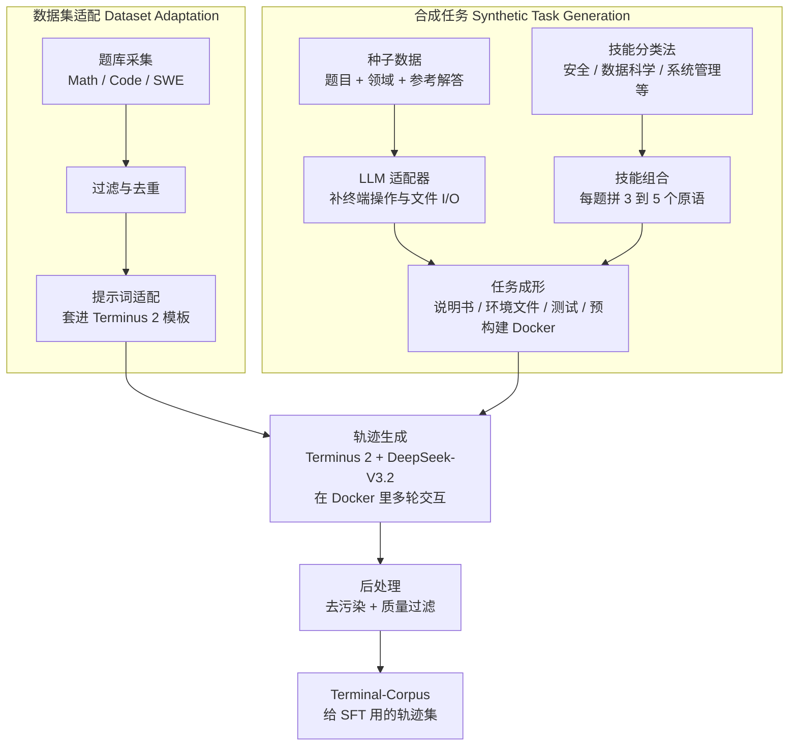

# Nemotron-Terminal：终端 Agent 缺的不是更大的脚手架，是能规模化的公开训练轨迹

<!-- release-date: 2026-02-24 -->

> 本文依据 **On Data Engineering for Scaling LLM Terminal Capabilities**（Renjie Pi、Grace Lam（并列\*）、Mohammad Shoeybi、Pooya Jannaty、Bryan Catanzaro、Wei Ping（†）；全部 NVIDIA），即 arXiv:2602.21193v1、**2026-02-24** 首次公开、共 24 页的预印本。页码均指这份 PDF 本身的页码。封面右上角印着内部日期 2026-2-25，那不是首发日。v1 提交于 2026-02-24 18:51:04 UTC。截至 2026-09-10 核验，arXiv 只有 v1，与本地 `papers/NVIDIA/Terminal-Data-Engineering.pdf` 一致。
>
> 这是一篇 **数据工程 + 监督微调（Supervised Fine-Tuning，SFT）** 论文，没有新的模型架构，也没有强化学习配方。全文把三件事分开写：**论文明确写了什么**（带页码）、**本文如何解释它**（凡属推算、换算或从图上读数都会写明）、**外部资料补充**（给链接并标明是补充）。
>
> 它和本站 [Endless Terminals](/reports/Stanford/Endless-Terminals) 共用 Terminal-Bench 2.0、Harbor 和 Terminus，**不要把两边的数字合成一个故事**。Endless Terminals 是程序化出题之后用 **vanilla PPO** 训练；本篇是造题、让教师在 Docker 里滚轨迹，再做 **SFT**。本篇不是 RL 环境工厂论文。

## 读之前需要的最少背景

这篇论文只讲一件事：前沿终端 Agent 的训练数据配方几乎不公开。要让开源模型在命令行里多轮干活，缺的是**能规模化、还能拿来做模仿学习的轨迹**，不是再换一套更花哨的脚手架。

不熟的话，先记住下面这些词。

**终端 Agent。** 模型待在一个 Linux 容器里，一轮看输出、一轮敲命令，直到文件系统、进程或配置变成题目要求的终态。它不是「写一段 bash 交差」，而是多轮交互：命令可能失败，必须根据终端回显改主意。

**监督微调（SFT）。** 拿现成的「好轨迹」做模仿学习。本篇的轨迹不是人标的，是教师模型 DeepSeek-V3.2 套在 Terminus 2 脚手架上、在 Docker 里滚出来的。论文把这条路写成 coarse-to-fine：先用已有题库铺广度，再用合成题补终端特有技能。

**脚手架（scaffold）。** 包在模型外面、规定它怎么行动的那层程序：系统提示、工具、上下文怎么拼、何时停。本篇固定使用 **Terminus 2**：容器里只给一个交互式 tmux，模型按 JSON 吐击键，不另配专用编辑器或浏览器。

**Terminal-Bench 2.0。** 89 道人工整理、人工核实的终端评测题，覆盖科学计算、软件工程、机器学习、安全、系统管理和数据科学等。它是评测集，不是本篇的训练集（PDF p. 3）。后文一律写 TB2.0。

**数据集适配器（dataset adapter）。** 把已有的数学、代码、软件工程题，改写成 Terminal-Bench 那种「说明书 + 容器」格式，不必让大模型重新出题。适配本身不用 LLM；真正费钱的是后面让教师去滚轨迹。

**Harbor / Singularity / Daytona。** Harbor 是 Terminal-Bench 配套的容器内编排框架。本篇给它加了 Singularity（HPC 里常用的另一种容器，原名也叫这个）以便在集群上滚轨迹；评测则交给 Daytona 的云端沙箱。SFT 训练用 veRL（即 HybridFlow 那套框架）。

三个容易和邻居搞混的切面，先摆正，后文不再展开：

| 工作 | 它管的那一层 | 本站 |
|---|---|---|
| [Endless Terminals](/reports/Stanford/Endless-Terminals) | 程序化生成「任务 + 容器 + 可执行测试」，再用 vanilla PPO | 环境工厂 + RL，不是本篇 |
| [SkyRL-Agent](/reports/Berkeley/SkyRL-Agent) | 多轮轨迹里 init / 生成 / 判分怎么叠流水 | 调度，不生产终端任务 |
| [Polar](/reports/NVIDIA/Polar) | 把现成 harness 当黑盒，在模型 API 上监听 | 观测点，不生成任务 |
| 本篇 | **终端 SFT 数据怎么造、怎么滤、怎么混**，训出 Nemotron-Terminal | 本文 |

## 一句话先说清

这篇论文要解决的矛盾可以这样说：

> **Claude Code、Codex CLI 这类系统已经能在终端里干活，可它们的训练数据配方不公开。现成 benchmark 是为评测做的，只有几十上百道；人标轨迹又贵又慢；把已有题库套一层命令行，又继承了那些题从来不是为多轮环境交互设计的结构。**

论文原话更硬：state-of-the-art 终端 Agent 背后的训练数据策略 largely undisclosed（PDF p. 1）。引言把瓶颈写成两条（PDF p. 2）：

1. **基础资源不够。** 缺多样的任务提示、依赖文件、预配置环境。
2. **轨迹采集贵。** 真人交互难抓；用 LLM Agent 合成则每道题都要起一份新环境、走多轮交互。

它的回答不是换强化学习算法，而是一条 **coarse-to-fine 数据流水线**：用适配器把已有数学 / 代码 / SWE 题改成终端格式，铺广度；再用 Terminal-Task-Gen 从种子题和技能分类法合成新题，补终端特有技能。两边的题都交给教师 DeepSeek-V3.2 + Terminus 2，在 Docker 里滚轨迹，经过去污染和过滤，得到 Terminal-Corpus，再 SFT 出 Nemotron-Terminal 家族（PDF p. 1–2）。

摘要里必须连页码一起记的三组数字如下。基座在 PDF 里有两套写法，**是同一组检查点**，不是两套实验。

**摘要四舍五入**（PDF p. 1）：

| 模型 | 训练前 | 训练后 |
|---|---:|---:|
| Nemotron-Terminal-8B | 2.5% | 13.0% |
| Nemotron-Terminal-14B | 4.0% | 20.2% |
| Nemotron-Terminal-32B | 3.4% | 27.4% |

**主结果表带误差条**（PDF p. 8，Table 3；Table 4 的 Overall 行把基座写成 2.50 / 4.00 / 3.40，PDF p. 9）：

| 模型 | 基座 Qwen3 | Nemotron-Terminal |
|---|---|---|
| 8B | $2.47\pm 0.5$ | $13.0\pm 2.2$ |
| 14B | $4.04\pm 1.3$ | $20.2\pm 2.7$ |
| 32B | $3.37\pm 1.6$ | $27.4\pm 2.4$ |

论文还写：32B 的 $27.4\pm 2.4$ 超过 Qwen3-Coder-480B 的 $23.9\pm 2.8$（PDF p. 3、8）。这个对照在 Table 1 和 Table 3 里都有，不是二手文章后加的。**本文核对：** 两条误差条在 $25.0$–$26.7$ 之间重叠，论文比的是点估计。

请先记住一个读数顺序：**13.0 / 20.2 / 27.4 是 Terminus 2 脚手架下、对 Qwen3 做 SFT 的成绩。** 不要拿去和 Endless Terminals 那条「瘦脚手架 + vanilla PPO、最好 8B 到 6.7%」的曲线比高低。两边的训练目标、脚手架和起点检查点都不是同一套。

## 全景：题从两条河汇进教师的 Docker，再变成 SFT 语料

先按 Figure 1 把流水线落到一张图上（PDF p. 1）。这是机制示意，不是实测时间轴。

这是根据 PDF p. 1 的 Figure 1 重画的**机制示意图**。图上蓝块是 Dataset Adaptation：Prompt Collection → Filtering & Deduplication → Prompt Adaptation。绿块是 Synthetic Task Generation：一条从 Seed Data（Problem + Domain + Reference Solution）走到 LLM Adapter，一条从 Skill Taxonomy 走到 Skill Composition，汇进 Task Formulation（Instruction、Environment files、Test cases、Pre-built Domain Docker Images）。两条河在 Trajectory Generation 汇合，标注 Agent: Terminus 2、Model: DeepSeek-V3.2；然后是 Post-Processing（Data Decontamination、Data Filtering），产出 Terminal-Corpus。

名字有一点需要当场说清。摘要把 **Terminal-Task-Gen** 写成「轻量合成任务生成流水线」（PDF p. 1）；Figure 1 的标题却是 Overview of Terminal-Task-Gen，把适配器也画进去了；§4.2 又把 Terminal-Task-Gen 收成合成半边（PDF p. 5）。**本文按 Figure 1 讲全景，按各节正文讲细节，不把两个用法焊成一个精确定义。**

整套系统可以看成三段，不要焊在一起：

| 段 | 它解决什么 | 对应章节 |
|---|---|---|
| **出题** | 已有题怎么改成终端格式；新题怎么从种子和技能分类长出来 | §4.1、§4.2 |
| **做题** | 教师在 Terminus 2 里怎么滚轨迹，滚完怎么滤 | §4.3、§4.4、附录 A.2 |
| **学题** | 滤完的轨迹怎么 SFT，过滤 / 课程 / 长上下文 / 规模各自值多少分 | §5 |

出题和过滤是这篇真正卖掉的东西。做题段几乎是在说：脚手架固定成 Terminus 2，教师固定成 DeepSeek-V3.2，算法固定成 SFT。

## 旧方案为什么绕开了数据配方

### 两条公开瓶颈

引言把现状写得很具体（PDF p. 2）。Claude Code 和 Codex CLI 已经证明命令行能力有用，Terminal-Bench 上也有前沿模型的成绩；可训练数据混合物不公开，研究者只能昂贵地试错。

当前改进终端能力的两条路是（PDF p. 2）：

1. **改脚手架。** 一长串引用指向 Ante、II-Agent、Junie、Letta、Mux、Warp、Factory Droid 等。相关工作补了一句：有效脚手架常常绑死特定模型，基座变强之后，复杂脚手架的边际收益会下降（PDF p. 3）。
2. **改底层模型。** 引用 Anthropic、DeepMind、DeepSeek-V3.2、MiniMax、Kimi、OpenAI。本篇站在这一边，但做的是 SFT，不是再发明一个 Agent 循环。

后训练里有一种现成做法：用适配器把已有数据集包进命令行（DCAgent 的 bash textbook traces、ML Foundations 的 staqc / code-contests traces）。Terminal-Bench 作者也提供了一仓库适配器，本意是给评测用，但也可以拿来放大训练数据（PDF p. 2）。论文的批评是：这些适配器继承了源数据集的结构假设，而那些数据集从来不是为顺序环境交互设计的。

更「原则」的一路是多智能体出题：头脑风暴、写任务、设计 Docker、再校验（Austin, 2025；Peng et al., 2025，即 LiteCoder-Terminal）。论文认为协调阶段太多，算力随规模涨得不好（PDF p. 2–3）。

**本文的理解：** 三条路其实是同一类退让——配方不公开，就去借脚手架、借现成题库、借多智能体。本篇把退让收回来，代价是必须先发明一套「题从哪来、轨迹怎么滚、滚完留哪些」的工序。它明确不探索 agentic design 的变体，把预算花在 targeted SFT 上（PDF p. 3）。

### 相关工作把自己放在哪

§2 拆成三块（PDF p. 3）。

**Agent Design。** 脚手架能显著抬分，但模型一变往往要重做。本篇不走这条。

**Dataset Adapters。** Hugging Face 上已经有人把竞赛编程和数学提示词丢进终端环境滚轨迹。论文说：这类数据很多，却没有人系统研究「适配器的哪些特性会影响下游训练」。本篇用自己的数据和适配器补这一刀。

**Synthetic Task Generation。** Evol-Instruct、Code Evol-Instruct、AgentInstruct、LAB、MAGPIE 都是指令数据合成的前作。搬到终端之后，最近工作用多智能体同时管出题、环境和校验。本篇的简化是：去掉不必要的协调阶段，并把环境校验优化成可规模化的一步——后面会看到，这一步的具体答案是**每领域一份预构建镜像，而不是每道题一份 Dockerfile**（PDF p. 7）。

**本文的理解，不是论文原话：** 相关工作没有点名 Endless Terminals。Endless 的 v1 是 2026-01-23，本篇 v1 是 2026-02-24，时间上够得着，但配方切面不同：那边滤的是「这道题 o3 做不做得出来」，再用 PPO；这边滤的是「这条教师轨迹完不完整、过不过测试」，再用 SFT。后文实验里「不过滤反而更好」，和 Endless 的 pass@16 闸不是同一类对象。

## 评测对象：89 道人类题，脚手架瘦到只剩 tmux

### Terminal-Bench：测的是工作流，不是函数

§3.1 把 Terminal-Bench 写成终端环境的标准基准（PDF p. 3）。**89** 道手写、人验的任务，覆盖科学计算、软件工程、机器学习、安全、系统管理和数据科学。和只评孤立函数的代码生成基准不同，这里要走完端到端工作流：编译、训练模型、配系统、排环境。

每道题四件套（PDF p. 4，Figure 2）：

1. 自然语言说明书（`instruction.md`）；
2. 容器化 Docker 环境（`environment/Dockerfile` 等）；
3. 程序化检查是否完成的测试（`tests/`）；
4. 一份示范合法做法的 oracle 解答（`solution/`）。

本篇全程用 Terminal-Bench **2.0** 做主评测，并用基准自带的、模型无关的参考 Agent **Terminus 2** 来对齐不同检查点（PDF p. 4）。

### Terminus 2：每一步只许吐 JSON 击键

传统编码 Agent 会给一堆专用工具。Terminus 2 只提供沙箱 Docker 里的一个交互式 tmux。模型决定击键，击键被送进 tmux，于是任何命令行工具理论上都能用（PDF p. 4）。

每一步，Agent 看到当前终端输出，模型必须按 Figure 3 的 JSON 回答（PDF p. 4）：

- `analysis`：现在看到了什么、做完了什么、还差什么；
- `plan`：下一步准备跑哪些命令、期望各自完成什么；
- `commands`：对象数组，每个有 `keystrokes` 和 `duration`；
- `task_complete`：可选，做完了就标 true。

附录 Figure 7 把系统提示全文铺开（PDF p. 17）。实质约束只有几条，不必整页抄：

- `keystrokes` 会**原样**打进终端，多数 bash 命令要以 `\n` 结尾才会执行；
- 特殊键用 tmux 转义：`C-c`、`C-d`；
- `duration` 默认 1.0 秒；`cd` / `ls` 这类立刻返回的用 0.1，编译和下载再加长；
- 宁可短等、再发一条空击键去 poll，单次等待不要超过 60 秒；
- JSON 必须合法，前后多余文本会警告但能容忍。

**本文的理解：** 这和 Endless Terminals「每轮一条 `<command>`」是同一类瘦脚手架，协议更啰嗦——多了 analysis / plan / duration。两边都在说：若主张不在脚手架，就先把脚手架钉死。本篇钉的是 Terminus 2，评测和滚轨迹用同一套，避免「训练时一种循环、评测时另一种循环」。

## 数据工程第一段：把已有题库改写成终端作业

§4 把策略写成两段：适配器铺广度，合成任务做技能精修。论文称之为 coarse-to-fine：适配器把数据量从现成题库里放大，合成侧才精细控制技能组合、难度和领域（PDF p. 4）。

### 提示词从哪来

三路提示词都来自 **Nemotron-Cascade** 的 Stage-2 SFT 数据（PDF p. 5）：

| 域 | 来源 | 论文写的规模 | 再过滤之后 |
|---|---|---|---|
| Math | OpenMathReasoning，Cascade 丢掉 DeepSeek-R1 回复短于 2K token 的易题 | 163K 条不重复提示 | Table 5 实际 SFT 样本 162,692 |
| Code | OpenCodeReasoning 的 79K，再过滤去重 | 35K 子集 | Table 5：31,960 |
| SWE | SWE-Bench-Train、SWE-reBench、SWE-Smith、SWE-Fixer-Train 共 127K | 32K 条不重复 | Table 5：31,661 |

SWE 每条提示带问题陈述和一份或多份有 bug 的代码文件（PDF p. 5）。

**本文核对：** 163K / 35K / 32K 是提示词库存；Table 5 的 162,692 / 31,960 / 31,661 是真正进 SFT 的轨迹条数。差的那一截论文没有解释，可能是滚轨迹失败或去污染，不要把两套数字焊成同一个计数。

### 适配本身不用 LLM

§4.1.2 写得很干脆：适配是把现成提示填进 Terminus 2 系统提示的 `{instruction}` 占位符，再按域追加一句后缀，**不需要 LLM 在回路里**（PDF p. 5）。后缀在附录 Figure 8–10（PDF p. 18）：

- 数学：把最终答案写到 `/app/solution.txt`；
- 代码：用 Python 解题，代码放到 `/app/solution.py`；
- SWE：先按 issue 定位 bug，生成 `SEARCH/REPLACE` 编辑，把 diff 存成 `/app/solution.patch`。

SWE 提示里出现的每个代码文件，会在环境里实例化成对应文件。Cascade 数据只有提示、没有测试，所以适配出来的任务是「说明书 + 环境」，**没有测试用例**（PDF p. 5）。后面过滤实验因此对适配器只能做「轨迹是否完整」，做不了「是否通过测试」。

**可迁移的部分：** 想快速铺量，先问自己手里有没有已经很难、已经去过易题的提示词。本篇没有从零写 16 万道数学题，它把 Cascade 已经筛过的 Stage-2 提示套进终端。套法本身廉价；昂贵的是让教师真的在容器里把题做一遍。

## 数据工程第二段：种子改编 vs 技能组合

适配器再强，也受源仓库格式限制。§4.2 把 Terminal-Task-Gen 写成：在可执行任务上精确控制技能复杂度和环境约束（PDF p. 5）。两条互补的生成路：seed-based 和 skill-based。都用 LLM 出题，但一个改编已有题，一个从原语拼新题。

### 种子生成：灵感来自旧题，结构是新的终端作业

种子生成**不是**把原题包一层脚手架，而是提示 LLM 从种子问题合成一道新的终端任务（PDF p. 5）。适合那些「题本身定义清楚，却没有终端结构」的材料：科学计算挑战、算法题、领域编程练习。

每条种子是一条结构化记录（PDF p. 5–6）：

1. 问题描述；
2. 可选领域标签（生物学、物理学、优化等）；
3. 可选参考解答。

参考解答只用来生成测试期望，**永远不给正在交互的 Agent 看**（PDF p. 6）。这和 Endless Terminals 的特权真值是同一类隔离，对象不同：那边隔离的是终态答案，这边隔离的是参考实现。

LLM 当任务适配器，做三件具体的事（PDF p. 6）：

1. 给抽象题补上软件工程约束：装包、从指定路径读输入、实现、写到指定输出；
2. 生成真实感的输入文件，含边界和边角；
3. 合成基于 pytest 的测试：检查输出文件在不在、格式对不对、数值精度（浮点带容差）、边角有没有处理。有参考解答时，把它放进生成上下文，并明确要求按它设计测试。

转换提示还编码了几条质量原则：复杂题必要时拆成可验证单元；补上输入规模和精度这类现实约束；输出格式必须能无歧义地程序化检查（PDF p. 6）。

**未公开：** 种子数据从哪个仓库来、用了多少条种子、生成模型的温度和采样次数，正文都没写。§4.3 说教师 DeepSeek-V3.2 同时用于「生成合成任务和轨迹」（PDF p. 7），所以出题模型至少包括它；有没有别的模型帮忙，写不出来。

### 技能生成：不改编旧题，从分类法长出新场景

技能生成的起点不是现成题，而是一份终端操作原语的分类法。LLM 负责扩展和重组这些原语（PDF p. 6）。

**九个任务域。** 正文列出（PDF p. 6）：data processing、data querying、data science、debugging、**dependency management**、file operations、scientific computing、security、software engineering。每个域有一份专用生成提示。例如数据科学偏向统计分析与变换，安全偏向密码学与访问控制验证。

这里有一处论文内部对不齐，必须按原文并排写，不替它合并。附录 Table 10 的九个域是 Security、Software Engineering、File Operations、Data Querying、Data Science、Debugging、Scientific Computing、Data Processing、**System Administration**（PDF p. 15）。Figure 1 技能框写的是 Security, data science, system admin, etc.。附录 Figure 12–20 的域模块也是系统管理，没有单独的 dependency management 页。**本文不把「依赖管理」擅自改写成「系统管理」。** 九份预构建镜像这个数字，两边倒是一致的（PDF p. 7）。

每个域的原语跨六类（PDF p. 6）：

1. 算法：图遍历、约束满足、回溯；
2. 系统：文件 I/O、进程、网络配置；
3. 数据处理：解析、序列化、变换流水线；
4. 数学：数值积分、统计建模；
5. 测试：校验、验证、benchmark；
6. Web / 安全：HTTP、认证、漏洞分析。

LLM 被要求每题组合 **3–5** 个原语，而且要非平凡地组合，强调 novelty，不要机械拼接（PDF p. 6）。附录 Figure 11 的用户消息把这句话写死：CREATE A NOVEL TASK that combines 3–5 primitives in a creative, unexpected way（PDF p. 19）。

**可迁移的部分：** 适配器解决「题不够多」，技能分类法解决「题不够像终端」。只做前一件，模型会在 `/app/solution.py` 里当竞赛选手；只做后一件，广度又要从头长。本篇把两件事分成两个旋钮。

## 任务格式：可验证、不泄漏、环境不按题重建

两条生成路产出同一套标准件（PDF p. 7）：

1. 自然语言任务提示，写明目标和约束；
2. 带可配置权重的 pytest，支持部分分；
3. 补充输入文件；
4. 领域专用 Docker 环境。

文件布局与 Terminal-Bench 的 Figure 2 相同。**不生成 oracle 解答**：没有人验的话，ground-truth 代码极难保证；他们改成「容易验证、难以求解」，用合成测试检查 Agent 对不对（PDF p. 7）。

### 说明书里不许藏答案

所有生成提示都要求：Agent 看见的任务提示不得泄漏算法、实现路径或任何解题代码。种子里的参考解答只用于推导测试期望（PDF p. 7）。Figure 11 的 Critical Rules 第一条就是 No Leakage（PDF p. 19）。

### 九份预构建镜像，是这篇对「每题一个 Dockerfile」的拒绝

关键工程选择：不像 Austin (2025) 和 Peng et al. (2025) 那样每题生成一份 Dockerfile，而是维护一组**领域级、预先构建好的镜像**，把该域常用包装进去——数据科学预装 pandas 和 scikit-learn，安全预装密码学库（PDF p. 7）。论文给了三条可规模化的理由：

1. **去掉 Dockerfile 校验开销。** 不为每题环境做多轮修复，才能单次通过地出题。
2. **资源脚印小。** 9 份共享基础镜像，而不是缓存成千上万个独特容器。
3. **环境和任务解耦。** 在稳定环境里仍能长出多样场景；Agent 运行时还可以自己装额外依赖。

**本文的理解：** 这是和 Endless Terminals 最容易被误读成同一件事的地方。Endless 的阶段 II 恰恰是「每题写定义文件、构建、跑初始测试，失败回灌最多三轮」。本篇认为那种 per-task 环境生成是规模化的敌人。两边都要可执行测试，但对「环境从哪来」的答案相反：一个按题长环境，一个按域复用环境。不要把「都用了 Docker」读成同一条流水线。

Agent 仍被允许在运行时安装额外包；技能提示的 `<test_requirements>` 也给测试侧列额外 Python 包（PDF p. 19）。预构建镜像不是把世界冻死，是把冷启动从「构建镜像」改成「起一份已知镜像」。

## 教师：DeepSeek-V3.2 既出题也做题

教师选 DeepSeek-V3.2，理由是它在 TB2.0 上够强（PDF p. 7）。Table 3 里它是 $38.2\pm 2.9$、685B（PDF p. 8）。为了证明它也适合滚**适配器**轨迹，论文把几份标准基准改成 Terminal-Bench 格式，仍用 Terminus 2 去评（PDF p. 7，Table 2）：

| 基准（pass@1） | DeepSeek-V3.2 |
|---|---:|
| AIME 2024、AIME 2025 | 93.33 |
| LiveCodeBench v6 | 67.20 |
| SWE-bench Verified | 52.40 |

这张表测的是「把数学 / 代码 / SWE 题适配进终端之后，教师还做得做得好」，不是这些基准的官方非终端分数。不要拿 93.33 去和标准 AIME 榜对比。

**本文的理解：** 学生 32B 的 27.4 仍低于教师的 38.2。SFT 蒸馏默认买下教师天花板——Endless Terminals 把这条写成蒸馏路线的固有限制。本篇结论自己也说，下一步想接 RL、用可验证执行反馈做自我纠正（PDF p. 11）。那是展望，不是本篇实验。

**未公开：** 教师滚轨迹时的温度、最大轮数、超时、每题采样几条，正文都没写。附录只说全部 SFT 轨迹都用 Terminus 2 生成（PDF p. 15）。

## 过滤：先去污染，再决定「失败轨迹要不要留」

§4.4 的过滤分两层（PDF p. 8）。

**质量层，始终开：**

- 去掉与 TB2.0 测试样本有 **14-gram** 重叠的提示，防污染；
- 去掉 identity leak；
- 丢掉含中文字符的回复。

**策略层，拿来做消融：**

- 去掉教师生成的不完整轨迹，以免学生变得过于啰嗦；
- 有测试时，进一步只留通过测试的轨迹。

适配器没有测试，所以策略层对它只剩 complete-only vs no filter。合成任务三条都做：complete-only、success-only、no filter。具体数字在 §5.4，这里先记住设计意图：完整性和成功率是两个旋钮，不是默认必须拧紧。

## 实验设定：Qwen3 三档，Harbor 滚轨迹，Daytona 评测，veRL 做 SFT

§5.1 把配方钉死（PDF p. 8）。消融主模型是 Qwen3-8B；14B 和 32B 用来看规模是否跟着走。

| 项目 | 取值 |
|---|---|
| 学习率 | $2\times 10^{-5}$ |
| 权重衰减 | $1\times 10^{-4}$ |
| epoch | 2 |
| 最大序列长度 | 32,768 token |
| 全局 batch | 128 |
| 每 GPU micro-batch | 1 |
| 优化器 | AdamW，$\beta=0.9,0.95$ |
| 学习率调度 | cosine，10% warmup |
| 梯度裁剪 | 1.0 |
| 8B / 14B 硬件 | 4 节点 × 8 GPU = 32 GPU，序列并行 2 |
| 32B 硬件 | 16 节点 = 128 GPU |
| 共性 | 全部 CPU offloading |

基础设施三条（PDF p. 8）：

- **滚轨迹：** Harbor，并扩展支持 Singularity，以便在 HPC 上跑。论文承认 fakeroot overlay 会引入偶发失败，对合成数据可以接受。
- **评测：** Daytona，在隔离的云沙箱里做可靠并行。
- **SFT：** veRL（Sheng et al., 2024），即本站 [HybridFlow](/reports/ByteDance/HybridFlow) 那套开源训练框架。本篇只把它当 SFT 后端用，没有做 RL。

**未公开：** GPU 型号、评测温度、Terminus 2 的最大轮数、误差条来自几次独立运行、Daytona 沙箱的 CPU / 内存规格。Table 3 的 $\pm$ 没有写明是标准差还是置信区间。

## 主结果：相对基座是五到八倍，绝对分数仍低于教师和闭源前沿

### Table 3：同一套 Terminus 2 下的对照

§5.2 把主结果写成（PDF p. 8）：Nemotron-Terminal-8B 相对 Qwen3-8B 是 five-fold（$13.0\pm 2.2$ vs $2.47\pm 0.5$）；14B 的 $20.2\pm 2.7$ 超过 120B GPT-OSS 的 $18.7\pm 2.7$ 和 Gemini 2.5 Flash 的 $16.9\pm 2.4$；32B 的 $27.4\pm 2.4$ 超过 480B Qwen3-Coder 的 $23.9\pm 2.8$。论文的读法：高质量轨迹能填上「小而高效的模型」和「巨大前沿模型」之间的沟。

Table 1 是引言里的预告表，闭源没有误差条（PDF p. 2）。完整数字以 Table 3 为准：

**闭源**（PDF p. 8，Table 3；凡写入的闭源数字都带误差条）：

| 模型 | Size | TB2.0 |
|---|---:|---|
| GPT-5-Nano | – | $7.90\pm 1.9$ |
| GPT-5-Mini | – | $24.0\pm 2.5$ |
| GPT-5 | – | $35.2\pm 3.1$ |
| GPT-5.1 | – | $47.6\pm 2.8$ |
| GPT-5.2 | – | $54.0\pm 2.9$ |
| Grok Code Fast 1 | – | $14.2\pm 2.5$ |
| Grok 4 | – | $23.1\pm 2.9$ |
| GLM 4.6 | – | $24.5\pm 2.4$ |
| Gemini 2.5 Flash | – | $16.9\pm 2.4$ |
| Gemini 2.5 Pro | – | $32.6\pm 3.0$ |
| Gemini 3 Flash | – | $51.7\pm 3.1$ |
| Gemini 3 Pro | – | $56.9\pm 2.5$ |
| Claude Haiku 4.5 | – | $28.3\pm 2.9$ |
| Claude Sonnet 4.5 | – | $42.8\pm 2.8$ |
| Claude Opus 4.5 | – | $57.8\pm 2.5$ |

Table 1 另外有一个 Qwen3-Max-Thinking 22.5，没有误差条，也没有进 Table 3（PDF p. 2）。

**开源与本篇**（PDF p. 8）：

| 模型 | Size | TB2.0 |
|---|---:|---|
| Qwen3-8B | 8B | $2.47\pm 0.5$ |
| Qwen3-14B | 14B | $4.04\pm 1.3$ |
| Qwen3-32B | 32B | $3.37\pm 1.6$ |
| Qwen3-Coder | 480B | $23.9\pm 2.8$ |
| GPT-OSS (high) | 20B | $3.10\pm 1.5$ |
| GPT-OSS (high) | 120B | $18.7\pm 2.7$ |
| MiniMax M2 | 230B | $30.0\pm 2.7$ |
| MiniMax M2.1 | 230B | $29.2\pm 2.9$ |
| Kimi K2 Thinking | 1T | $35.7\pm 2.8$ |
| DeepSeek-V3.2 | 685B | $38.2\pm 2.9$ |
| **Nemotron-Terminal-8B** | 8B | $13.0\pm 2.2$ |
| **Nemotron-Terminal-14B** | 14B | $20.2\pm 2.7$ |
| **Nemotron-Terminal-32B** | 32B | $27.4\pm 2.4$ |

读这张表要按论文的分层，而不是按「谁分最高」：

**第一层，相对自己的 Qwen3 基座。** 8B 从 2.47 到 13.0，14B 从 4.04 到 20.2，32B 从 3.37 到 27.4。这是被同一套 Terminus 2 口径撑住的。基座 32B（3.37）甚至略低于基座 14B（4.04），说明「把 Qwen3 做大」本身带不来终端能力。

**第二层，跨规模的开源对照。** 32B 的点估计超过 480B Qwen3-Coder 的 23.9，14B 的点估计超过 120B GPT-OSS 的 18.7。论文把这写成轨迹质量填补参数差距。**本文核对：** 32B vs Coder 的误差条重叠；14B vs GPT-OSS 120B 的误差条重叠得更厉害（$20.2\pm 2.7$ 与 $18.7\pm 2.7$）。点估计方向与论文一致，统计上不是干净的「显著超过」。

**第三层，不要假装已经接近闭源前沿。** 同表里 Claude Sonnet 4.5 是 $42.8\pm 2.8$，Opus 4.5 是 $57.8\pm 2.5$，Gemini 3 Pro 是 $56.9\pm 2.5$。32B 的 27.4 大约是 Sonnet 4.5 的六成。Endless Terminals 把同一个 Claude Sonnet 4.5 + Terminus-2 的 42.8% 放在自己 6.7% 旁边（该篇 PDF p. 7），两边的闭源锚点一致，**训练曲线仍不能横比**。

**第四层，教师仍在上面。** DeepSeek-V3.2 的 38.2 是这条 SFT 路的可见天花板之一。学生没有超过老师。

### Table 4：涨分发生在基座为零的类别，不是均匀撒胡椒面

论文用类别表证明：合成数据打开了基座「完全不会」的能力（PDF p. 9）。Qwen3-14B 和 32B 在 Data Querying 与 Model Training 都是 0.0，Nemotron-Terminal-32B 分别到 60.0 和 50.0。32B 上 Security 2.5→27.5、Data Processing 5.0→50.0、Software Engineering 5.0→31.7。System Administration 6.7→31.1，Debugging 0.0→33.3。论文的句子是：更大参数本身不足以带来强终端能力。

完整类别表如下。括号里是该类别的题数。16 类相加 $24+9+3+8+4+8+4+1+7+4+3+4+1+1+1+7=89$，与 §3.1 的 89 道一致（PDF p. 3、9）。

| 类别 | Qwen3-8B | Qwen3-14B | Qwen3-32B | NT-8B | NT-14B | NT-32B |
|---|---:|---:|---:|---:|---:|---:|
| Software Engineering (24) | 1.70 | 6.70 | 5.00 | 9.20 | 18.3 | 31.7 |
| System Administration (9) | 13.3 | 6.70 | 6.70 | 22.2 | 28.9 | 31.1 |
| Debugging (3) | 0.00 | 0.00 | 0.00 | 20.0 | 40.0 | 33.3 |
| Security (8) | 0.00 | 0.00 | 2.50 | 12.5 | 17.5 | 27.5 |
| File Operations (4) | 0.00 | 0.00 | 0.00 | 0.00 | 10.0 | 5.00 |
| Data Science (8) | 2.50 | 7.50 | 0.00 | 7.50 | 17.5 | 27.5 |
| Data Processing (4) | 0.00 | 0.00 | 5.00 | 35.0 | 40.0 | 50.0 |
| Data Querying (1) | 0.00 | 0.00 | 0.00 | 20.0 | 40.0 | 60.0 |
| Scientific Computing (7) | 0.00 | 0.00 | 2.90 | 0.00 | 2.90 | 0.00 |
| Mathematics (4) | 0.00 | 0.00 | 0.00 | 0.00 | 0.00 | 0.00 |
| Machine Learning (3) | 0.00 | 0.00 | 0.00 | 6.70 | 13.3 | 13.3 |
| Model Training (4) | 0.00 | 0.00 | 0.00 | 5.00 | 20.0 | 50.0 |
| Personal Assistant (1) | 0.00 | 0.00 | 0.00 | 80.0 | 80.0 | 100 |
| Games (1) | 0.00 | 0.00 | 0.00 | 0.00 | 0.00 | 0.00 |
| Video Processing (1) | 0.00 | 0.00 | 0.00 | 0.00 | 0.00 | 0.00 |
| Unknown (7) | 5.70 | 8.60 | 8.60 | 34.3 | 34.3 | 34.3 |
| **Overall** | **2.50** | **4.00** | **3.40** | **13.0** | **20.2** | **27.4** |

Overall 行用的是摘要那种四舍五入（2.50 / 4.00 / 3.40），与 Table 3 的 2.47 / 4.04 / 3.37 是同一组。

表里有几条论文没写成口号、但必须一起记：

- **Mathematics (4) 全程是 0。** 适配了 16 万道数学轨迹，TB2.0 的数学题仍然全军覆没。说明「把 AIME 套进 `/app/solution.txt`」和「Terminal-Bench 里的数学任务」不是同一个分布。
- **Scientific Computing：** 32B 基座 2.90，Nemotron-Terminal-32B 掉回 0.00；8B 两边都是 0。不是单调变好。
- **File Operations：** 8B 仍为 0，32B 只有 5.00，还低于 14B 的 10.0。
- **Games / Video Processing：** 三个规模全 0。
- **Personal Assistant (1) 和 Data Querying (1)：** 单题类别，32B 到 100 和 60，分母太小，不能当「该领域已解决」。
- **Unknown (7)：** 三个 Nemotron-Terminal 都是 34.3，完全没随规模动。

**本文的理解：** 论文用来卖的是「基座为零的类别被打开」。这在 Data Querying、Model Training、Debugging、Data Processing 上成立。它没有声称每个 Terminal-Bench 类别都被同样治好。Endless Terminals 在失败分析里也写过数学 / 机器学习 / 模型训练为零；两边的类别划分还不一样（Endless 的 software-engineering 是 26 道，本篇 Software Engineering 是 24 道），**不要用类别百分比横比两篇。**

## 数据成分：适配器要混着训，合成侧几乎全靠技能题

§5.3 全部是 Qwen3-8B 的子集 SFT（PDF p. 9–10，Table 5）。

| 数据划分 | 样本数 | TB2.0 |
|---|---:|---|
| 适配器 · Math | 162,692 | $5.39\pm 1.65$ |
| 适配器 · Code | 31,960 | $6.29\pm 1.65$ |
| 适配器 · SWE | 31,661 | $7.02\pm 2.13$ |
| 适配器 · All | 226,313 | $9.66\pm 2.11$ |
| 合成 · Seed-based | 124,366 | $6.18\pm 1.91$ |
| 合成 · Skill-based | 139,841 | $12.4\pm 2.38$ |
| 合成 · All | 264,207 | $12.4\pm 2.29$ |

论文的读法（PDF p. 9）：

- 适配器单路里 SWE 最好（7.02），Math / Code 更低；三路合并跳到 9.66，说明混域比单源强。
- 合成侧的主收益来自 skill-based（12.4）；加上 seed-based 均值不涨，但方差从 2.38 收到 2.29，模型更稳。

**本文核对与推算：**

- 适配器三行 $162692+31960+31661=226313$，合成两行 $124366+139841=264207$，加法成立。
- 主结果 8B 的 $13.0\pm 2.2$ 高于合成 All 的 $12.4\pm 2.29$，也高于适配器 All 的 9.66。Table 9 的 mixed 是 $13.03\pm 2.16$（PDF p. 11），与主结果是同一量级。**本文推断：** 主模型吃的是适配器 + 合成的混合，不是合成单独。论文没有把「226,313 + 264,207」写成一个官方总数；相加得 490,520，这是本文算术，不是原文数字。
- 技能题 13.98 万条就到 12.4，种子题 12.4 万条只有 6.18，几乎和适配器里最弱的 Math 一个水平。技能分类法才是合成半边真正值钱的旋钮。

**可迁移的部分：** 「把数学题塞进终端」能给一个非零底（5.39），但远不如「按终端技能组合新题」（12.4）。想省钱时，优先生成技能题，而不是把最大的那份竞赛数学再适配一遍。

## 过滤策略：把失败轨迹扔掉，分会腰斩

### 适配器：没有测试，完整与否在全量上仍是「不过滤更好」

Table 6（PDF p. 10）。适配器没有测试用例，只能比 complete-only 和 no filter。

| 子集 | Complete-only 样本 / TB2.0 | No filter 样本 / TB2.0 |
|---|---|---|
| Math | 147,718 / $7.19\pm 1.87$ | 162,692 / $5.39\pm 1.65$ |
| Code | 20,169 / $6.07\pm 1.73$ | 31,960 / $6.29\pm 1.65$ |
| SWE | 29,053 / $5.39\pm 1.68$ | 31,661 / $7.02\pm 2.13$ |
| All | 196,940 / $8.09\pm 1.84$ | 226,313 / $9.66\pm 2.11$ |

论文说各子集「没有显著差异」，因此在全量上采用 no-filter 的 9.66（PDF p. 9）。**本文核对：** Math 上 complete-only 的点估计其实更高（7.19 vs 5.39），SWE 上则是 no-filter 更高（7.02 vs 5.39）。「各子集无显著差异」是作者的显著性判断，正文没有 p-value；他们最终拍板看的是 All 这一行。Complete-only 三行 $147718+20169+29053=196940$，加法成立。

### 合成任务：success-only 是最差的一档

Table 7（PDF p. 10）：

| 过滤 | 样本数 | TB2.0 |
|---|---:|---|
| Complete-only | 104,603 | $6.74\pm 2.20$ |
| Success-only | 83,448 | $5.06\pm 2.11$ |
| No filter | 264,207 | $12.4\pm 2.29$ |

论文的解释有两句（PDF p. 10）：严格过滤有害，因为它丢掉一半以上训练数据；留下不成功的轨迹能提供有价值的监督，让模型见到真实的错误状态和恢复模式，从而更稳健。

**本文核对：** success-only 留下 $83448/264207\approx 31.6\%$，丢掉约 68%；complete-only 留下约 39.6%。和「over half」一致。success-only 的 5.06 甚至低于适配器里单路 Math 的 5.39——只留满分轨迹，比「拿数学适配器硬训」还差。

**可迁移的部分，也是全文最值得借走的实验结论之一：**

> **Agent 的 SFT 语料不是竞赛满分卷。失败、超时、中途卡住，本身就是终端使用的一部分。把它们滤掉，学生就学不会报错之后怎么办。**

这和「出题时丢掉无解题」不是同一件事。Endless 滤的是任务（o3 十六次全失败就丢题）；本篇滤的是轨迹（教师这局没做完或没通过）。闸的对象不同，拧紧的后果也不同。

## 长上下文：把窗口拉到 65K，分还略掉

附录 Figure 5 / 6 把轨迹的 token 数和轮数画出来，适配器与合成分开（PDF p. 15–16）。图上印着的统计量，本文按图读出：

| | N | token 均值 / 中位数 | 轮数均值 / 中位数 |
|---|---:|---|---|
| 适配器轨迹 | 226,313 | 17,307 / 13,861 | 17.5 / 16.0 |
| 合成任务轨迹 | 264,207 | 17,363 / 17,836 | 16.3 / 16.0 |

正文的定性结论：多数轨迹装得进 Qwen3 默认的 32,768；非平凡的一小部分会被 SFT 截断，所以他们拿 Qwen3-8B 试长上下文（PDF p. 10）。

Table 8（PDF p. 10）：

| SFT 最大长度 | 评测最大长度 | SFT YaRN2 | 评测 YaRN2 | TB2.0 |
|---:|---:|:-:|:-:|---|
| 32,768 | 40,960 | | | $13.0\pm 2.2$ |
| 32,768 | 65,536 | | ✓ | $11.9\pm 2.0$ |
| 65,536 | 65,536 | | | $10.3\pm 2.0$ |
| 65,536 | 65,536 | ✓ | ✓ | $11.9\pm 2.1$ |

YaRN2 引用的是 Peng et al., 2023 的 YaRN 论文（PDF p. 10、13）。论文观察：这几档没有显著差异；标准 Qwen3-8B 设定（评测 40,960）反而最强。他们的读法：加长上下文略伤分；高质量监督已经落在标准窗口里，长尾轨迹更吵、信息量更低（PDF p. 10）。

**本文的理解：** 这不是「长上下文无用」的一般结论。它说的是：在这份终端 SFT 语料上，把被截断的长尾硬塞进 65K，回报为负。若你的失败模式是「轮次用尽 / 上下文爆炸」而不是「根本不会」，这条消融不一定成立。本篇没有报告被 32K 截断的轨迹占比，也没有按长度做分段分数。

## 课程学习：先适配器后合成，还不如一把混

两种策略（PDF p. 10–11）：

1. 两阶段课程：先训适配器，再训合成任务；
2. 单阶段：所有数据一起训。

Table 9（PDF p. 11）：

| 模型 | 策略 | TB2.0 |
|---|---|---|
| Qwen3-8B | mixed | $13.03\pm 2.16$ |
| Qwen3-8B | curriculum | $10.39\pm 1.71$ |

两阶段没有优势。其余实验全部采用单阶段混合。mixed 的 $13.03\pm 2.16$ 与主表 8B 的 $13.0\pm 2.2$ 是同一量级的两种写法。

**本文的理解：** 适配器是广度、合成是技能精修，听起来很像「先学走再学跑」。实验拒绝了这个直觉。一种可能是：适配器分布和 TB2.0 差得远，先在上面训两 epoch 会把模型推到错误的终端习惯里，再切合成也救不回来。论文没有做「先合成后适配器」的反向课程，所以这只是本文的猜测。

## 规模：合成数据从 0% 加到 100%，8B 和 14B 都在涨

§5.7 把 Qwen3-8B 和 14B 放在合成训练数据的 0%、1%、2%、5%、10%、100% 上微调（PDF p. 11，Figure 4）。两条曲线都随数据量上升；14B 绝对水平更高，从额外数据里拿到的增益也更大。结论：模型容量和数据规模都关键。

Figure 4 是带 95% CI 的误差带图，正文没有写出各百分比的精确分数。**本文读图，不是正文数字：** 8B 从 0% 附近的约 3% 升到 100% 附近的约 13%；14B 从约 4% 升到约 20%。0% 接近各自基座，100% 接近各自主结果。读图精度有限，以正文「consistent performance improvements」为准。

一个需要标明的含糊：论文写的是 percentages of **synthetic** training data。0% 从读图看像未做 SFT 的基座，而不是「只训适配器」（只训适配器应在 9.66 附近，图的左端没有那么高）。100% 的 8B 又接近合成 All 的 12.4 和混合主结果的 13.0，图上分不开。**本文不把 100% 断言成「完整 mixed 配方」或「纯合成」。**

32B 没有进这张缩放图。

## 结论：数据工程被写成比参数规模更关键，RL 留作下一步

§6 把贡献收成（PDF p. 11）：Terminal-Task-Gen 把大规模数据集适配和定向合成任务生成协同起来；精确的数据工程让 Nemotron-Terminal 显著超过 Qwen3 基座，并在 TB2.0 上 rival 更大的前沿模型；**高质量、多样的轨迹比单纯参数规模更关键。** 展望是接强化学习，用可验证执行反馈做长程任务的自我纠正和规划。他们发布模型和**大部分**合成数据，包括适配器和 skill-based 子集。

最后这句「most of / including the adapter and skill-based task subsets」值得记住：seed-based 那 124,366 条没有被写成发布对象。后文外部补充会回到 Hugging Face 上实际出现了什么。

## 附录提示词：只留下约束，不整页粘贴

附录 A.2–A.3 和 Figure 7–20 是模板仓库（PDF p. 15–24）。对理解流水线真正有约束的，只有这些：

**滚轨迹。** 全部走 Terminus 2。`{instruction}` 对合成任务填生成出来的说明书；对适配器填「原提示 + 域后缀」。`{terminal_state}` 填最新终端输出（PDF p. 15）。

**技能出题的骨架**（Figure 11，PDF p. 19）：

- 角色：某个域的出题专家；
- 插入该域的模块（Figure 12–20）；
- 普遍要求：难解、易验、自包含、像专业人士会碰到的题；
- 输出必须用 XML：`<prompt>`、`<tests>`、`<weights>`、`<info>`、`<files>`、`<test_requirements>`；
- 硬规则：不泄漏解法、优先程序化可验证、不要抄教程、规格写全（路径、格式、约束）；
- 用户消息还附上预设计的 Dockerfile 内容，并要求组合 3–5 个原语、不要机械拼接。

**域模块**反复出现同一组形容词：challenging to solve、easy to verify、self-contained、realistic。安全模块强调 exploit payload 与漏洞识别，数据处理强调带插值的变换流水线（PDF p. 16）。Table 10 给了每域的技能类型和一条例句，例如 Software Engineering 的「用 BFS/DFS 做依赖解析」，Debugging 的「用约束分析解决包依赖冲突」（PDF p. 15）。

这些模板说明合成题被故意做成竞赛风格：规格写死，测试才能自动判。Endless Terminals 的 Discussion 把这写成限制——程序化题不像真人含糊请求。本篇附录把这个选择编码进了提示词，但正文没有把「不像真人」写成一条限制。

## 可迁移启发

### 1. 配方不公开时，先造能训的轨迹，再问要不要换算法

本篇和 Endless Terminals 撞在同一个症状上：终端 RL / SFT 都缺粮食。两边开出的药不同。Endless 认为环境是瓶颈，上 PPO；本篇认为公开数据是瓶颈，上 SFT。自己的项目若卡在终端 Agent 不涨分，先数手里有多少条**能自动跑、且不是评测集本身**的轨迹。轨迹不够时换 PPO 变体或换脚手架，多半是在空锅里搅拌。

### 2. 广度用适配器，技能用分类法，两件事不要合成一个生成器

适配器不用 LLM 就能把 16 万道数学题变成终端作业；技能生成才控制 3–5 个原语怎么组合。Table 5 显示技能题单独就到 12.4，种子改编只有 6.18。想模仿本篇，先把「改写现成题」和「按技能长新题」做成两个旋钮，再决定预算怎么分。

### 3. 环境按域复用，而不是按题重建

九份预构建镜像是这篇对多智能体 per-task Dockerfile 的拒绝。校验镜像的成本会被乘到每一道题上。若你的主张是数据规模，先问能不能把环境冻结成少数几个已知底座，让出题模型只填说明书和测试。Agent 仍可在运行时装额外包——冻的是冷启动，不是世界。

### 4. 测试需要的真值，不要泄漏给策略

种子里的参考解答只用于写 pytest，不进 Agent 上下文。适配器甚至根本没有测试。泄漏的那一刻，模型学的就变成「读答案」而不是「用终端」。

### 5. 失败轨迹可能是监督，不是脏数据

success-only 从 12.4 掉到 5.06。终端 Agent 的日常就是报错、重试、改命令。只蒸馏满分卷，等于不让学生见过 stderr。若过滤策略来自数学 SFT 的「只留短而对的答案」，搬到 Agent 上要重新做消融。

### 6. 先适配器后合成的课程，实验上是负的

听起来合理的 coarse-to-fine 训练，Table 9 里输给一把混。课程是关于数据的假设，不是免费午餐。没有反向课程和中间检查点，不要把 10.39 vs 13.03 解释成「适配器有毒」，只能解释成「这个顺序没帮上忙」。

### 7. 加长上下文解决不了「长尾又吵又少」

多数轨迹已经在 32K 内。把窗口拉到 65K 略掉分。遇到截断，先看被截断的那一截是不是高质量监督，再决定要不要付长上下文的训练税。

### 8. 评测分数是「模型 × 脚手架」的分数，跨篇不能横比

本篇全程 Terminus 2。Endless 训练时比 Terminus 更瘦，并把 Claude Sonnet 4.5 + Terminus-2 的 42.8% 当作对照。本篇 Table 3 里同一个 Sonnet 4.5 是 $42.8\pm 2.8$。闭源锚点可以对照，8B 的 13.0 和 Endless 的 6.7 不能合成「SFT 比 PPO 更强」。Polar 后来还证明：同一个 4B 换四个 harness，起点能差九倍。看任何终端榜，先问脚手架是什么。

### 9. 点估计超过大模型，误差条重叠时要照实写

32B vs Qwen3-Coder 480B 的 27.4 vs 23.9 是论文卖点，Table 1 和 Table 3 都有。误差条重叠。迁移这条结论时，写成「点估计更高」，不要写成「已经统计显著地超过 480B」。

## 关键词回看

- **Terminal-Task-Gen：** Figure 1 里的总流水线，含适配器与合成；§4.2 又用它专指合成半边（PDF p. 1、5）。
- **Terminal-Corpus：** 去污染和过滤之后的 SFT 轨迹集（PDF p. 1）。
- **Nemotron-Terminal：** 从 Qwen3-8B / 14B / 32B SFT 得到的终端模型家族。摘要 2.5→13.0、4.0→20.2、3.4→27.4；Table 3 带误差条（PDF p. 1、8）。
- **数据集适配器：** 把 Cascade 的 Math / Code / SWE 提示填进 Terminus 2 模板，并追加 `/app/solution.txt` 等后缀；无测试用例（PDF p. 5、18）。
- **seed-based / skill-based：** 从前一个已有题合成新终端作业；从原语分类法每题拼 3–5 个技能（PDF p. 5–6）。
- **预构建域镜像：** 9 份共享 Docker 镜像，替代每题一份 Dockerfile（PDF p. 7）。
- **Terminus 2：** 只给 tmux 击键的参考脚手架，输出 JSON 的 analysis / plan / commands / task_complete（PDF p. 4、17）。
- **14-gram 去污染：** 去掉与 TB2.0 测试样本 14-gram 重叠的提示（PDF p. 8）。
- **complete-only / success-only / no filter：** 轨迹完整性过滤、仅留测过的轨迹、不过滤。合成侧不过滤最好（PDF p. 10）。
- **YaRN2：** 本篇对 Peng et al., 2023 YaRN 的称呼，用于 65K 上下文消融（PDF p. 10）。
- **Harbor + Singularity / Daytona / veRL：** 分别负责 HPC 上滚轨迹、云沙箱评测、SFT 训练（PDF p. 8）。
- **DeepSeek-V3.2 教师：** TB2.0 $38.2\pm 2.9$；适配后的 AIME 93.33、LiveCodeBench v6 67.20、SWE-bench Verified 52.40（PDF p. 7–8）。

## 最后的判断

这篇 24 页预印本卖掉的不是新的注意力或新的策略梯度，而是一条能把终端 SFT 粮食造出来的数据工序。适配器把已有题库改成终端作业，技能分类法按 3–5 个原语长新题，九份预构建镜像把环境从「每题构建」改成「按域复用」，DeepSeek-V3.2 在 Terminus 2 里把题做成轨迹。过滤、课程、长上下文和缩放，是这条工序上的四个旋钮。

被实验撑住的部分很具体：

- 同一套 Terminus 2 下，8B / 14B / 32B 相对 Qwen3 基座从个位数涨到 13.0 / 20.2 / 27.4（PDF p. 8）；
- 技能题单独就能到 12.4，适配器全混是 9.66，种子改编只有 6.18（PDF p. 10）；
- 合成侧不过滤（12.4）显著好于只留成功轨迹（5.06）（PDF p. 10）；
- 一把混好于先适配器后合成（13.03 vs 10.39）（PDF p. 11）；
- 默认 32K / 40K 好于把窗口拉到 65K（PDF p. 10）；
- 基座为零的 Data Querying、Model Training、Debugging 被打开（PDF p. 9）。

撑不住、或必须打折扣的部分同样具体：

- 32B 的 27.4 相对 Claude Sonnet 4.5 的 42.8、教师的 38.2 仍然低（PDF p. 8）；
- 超过 Qwen3-Coder 480B 的 23.9 是点估计，误差条重叠（PDF p. 8）；
- TB2.0 数学题仍为 0，科学计算和视频 / 游戏也几乎不动（PDF p. 9）；
- 没有 RL 实验，结论里的 RL 是展望（PDF p. 11）；
- 九个任务域在正文和附录里对不齐（PDF p. 6、15）。

如果只记一句话，可以记：

> **公开的终端训练数据不够，就把已有题适配进来、再按技能把新题合成出来，让教师在 Docker 里滚轨迹。SFT 能把 8B / 14B / 32B 从 2.5% / 4.0% / 3.4% 拉到 13.0% / 20.2% / 27.4%；失败轨迹要留，课程和超长上下文在这份语料上帮不上忙。这是数据工程论文，不是 PPO 论文。**

## 资料与阅读边界

- **原始依据：** 本地 `papers/NVIDIA/Terminal-Data-Engineering.pdf`，**On Data Engineering for Scaling LLM Terminal Capabilities**，arXiv:2602.21193v1，2026-02-24，共 24 页（正文 §1–§6 与参考文献 p. 1–14，附录 A 与 Figure 7–20 为 p. 15–24）。`pdfinfo` 读出 Pages: 24。本文所有页码指这份 PDF 的文件页码。
- **版本核验：** [arXiv:2602.21193](https://arxiv.org/abs/2602.21193)。提交历史只有 v1：2026-02-24 18:51:04 UTC（[arXiv API](https://export.arxiv.org/api/query?id_list=2602.21193) 的 published 与 updated 同为该时刻）。**截至 2026-09-10 核验，仍为 v1，与本地原件一致，未替换。** 封面内部日期 2026-2-25 不是首发日。
- **`release-date` 取 2026-02-24。** 对象是一套公开技术 / 预印本，并同时发布模型与数据；按流程取最早官方公开事件。已核查：arXiv v1 在 2026-02-24；Hugging Face 集合页卡片显示模型与 Corpus 更新日期为 Feb 27、Synthetic-Tasks 为 Feb 23（见外部补充）。Synthetic-Tasks 的卡片「Updated Feb 23」早于 arXiv 一天，但 Hugging Face 的 `updated` 不是仓库创建日，也不是权重解禁日，**不能单独当作首发证据**。按用户已核验口径与 arXiv v1，取 2026-02-24。
- **作者与归属：** Renjie Pi\*、Grace Lam\*、Mohammad Shoeybi、Pooya Jannaty、Bryan Catanzaro、Wei Ping†。脚注：Pi 与 Lam 同等技术贡献，通信邮箱 `renjiep@nvidia.com`、`gralam@nvidia.com`、`wping@nvidia.com`；Ping leads the effort（PDF p. 1）。全部 NVIDIA，本站放 `reports/NVIDIA/`。
- **外部补充清单**（均已标明，不与 PDF 数字混用）：
  - arXiv 提交历史：[arXiv:2602.21193](https://arxiv.org/abs/2602.21193)；
  - 官方集合：[nvidia/nemotron-terminal](https://huggingface.co/collections/nvidia/nemotron-terminal)。截至 2026-09-10 可见五项：`Nemotron-Terminal-8B` / `14B` / `32B`，数据集 `Nemotron-Terminal-Synthetic-Tasks` 与 `Nemotron-Terminal-Corpus`。卡片上的 15B / 33B 是 Hugging Face 对 Qwen3 参数量的显示，**不是 PDF 的 14B / 32B 写法**；
  - [Nemotron-Terminal-Corpus](https://huggingface.co/datasets/nvidia/Nemotron-Terminal-Corpus) 卡片写大约 366k 条轨迹，viewer 分出 `dataset_adapters`（226k）、`skill_based_easy`（44.8k）、`skill_based_medium`（89.3k）、`skill_based_mixed`（5.69k），页脚 Number of rows: **366,154**。$226313+139841=366154$，与 PDF Table 5 的适配器 All + skill-based 相加一致，**不含** seed-based 的 124,366。这与结论「发布 most of、包括 adapter 和 skill-based 子集」相符。easy / medium / mixed 的切分**只出现在卡片上，PDF 没有这些数字**，不得回写成论文方法；
  - [Nemotron-Terminal-Synthetic-Tasks](https://huggingface.co/datasets/nvidia/Nemotron-Terminal-Synthetic-Tasks) 卡片复述了四件套任务结构和 9 份预构建镜像，与 PDF §4.2.3 一致；viewer 当前不可用。下载量与「Updated」日期不当作论文结果；
  - Harbor 仓库（论文引用 Shaw, 2025，PDF p. 8、13）：<https://github.com/laude-institute/harbor>；
  - veRL / HybridFlow 的机制背景见本站 [HybridFlow](/reports/ByteDance/HybridFlow)，本篇只使用 PDF 写出的「SFT 用 veRL」；
  - 邻居切面：[Endless Terminals](/reports/Stanford/Endless-Terminals)、[SkyRL-Agent](/reports/Berkeley/SkyRL-Agent)、[Polar](/reports/NVIDIA/Polar)。Endless 的 6.7% 与 Claude 42.8% 是 PPO + 更瘦脚手架的数字；Polar 把 Harbor 当「能跑原生 harness、但不提供 token 级训练接口」的评测框架。两边说法若有出入，以各自原件为准。
- **本文标为「读图」或「本文推算」的地方：** Figure 4 各百分比的近似终值；Figure 5 / 6 的均值与中位数（印在图上，正文未抄）；适配器 + 合成相加 490,520；success-only 留下约 31.6%；32B vs Qwen3-Coder 误差条重叠；HF 366,154 与 PDF 两行之和的对应。这些不是论文正文给出的精确结论。
- **未公开 / 无法核实的缺口：**
  - 种子数据的具体来源、条数、生成温度；
  - 教师滚轨迹的温度、最大轮数、超时、每题采样数；
  - 评测时 Terminus 2 的最大轮数、温度、独立运行次数，以及 $\pm$ 是标准差还是置信区间；
  - GPU 型号、Daytona 沙箱规格、被 32K 截断的轨迹占比；
  - 正文九域里的 dependency management 与附录 System Administration 如何对应；
  - 主模型是否真的吃了 226k+264k 的全量混合（只有 8B 的 mixed 13.03 与主表 13.0 接近）；
  - identity leak 的操作定义、含中文回复丢掉了多少条、14-gram 去污染去掉了多少条；
  - seed-based 子集为何不在「发布 most of」的名单里（结论只点了 adapter 与 skill-based）。
- **图表说明：** 文中唯一一张 Mermaid 是按 Figure 1 重画的机制示意图，不表示实测时长。Figure 4–6 未复制进站内图片；能写成表格的数字已改写成表格。Figure 5 / 6 的柱高未逐根读数，只用了图上印刷的 N / 均值 / 中位数。
