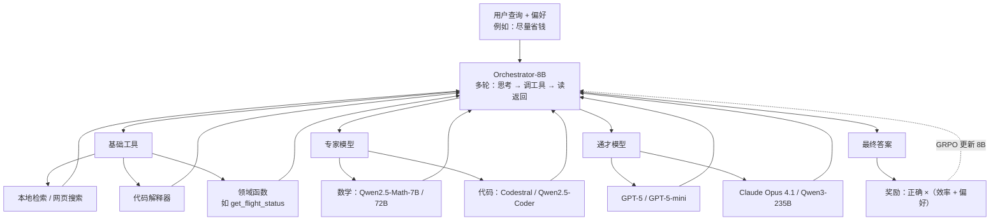

# ToolOrchestra：提示词编排出偏差，8B 编排器要把「该不该花这笔钱」写进奖励

<!-- release-date: 2025-11-27 -->

> 本文依据 **ToolOrchestra: Elevating Intelligence via Efficient Model and Tool Orchestration**，即 arXiv:2511.21689v1、2025-11-26 提交、封面日期 2025-11-27、共 21 页的预印本（正文与结论 p. 1–10、参考文献 p. 11–14、附录 A–L p. 15–21）。首页作者为 Hongjin Su、Shizhe Diao（共同一作，Hongjin 在 NVIDIA 实习期间完成）、Ximing Lu、Mingjie Liu、Jiacheng Xu、Xin Dong、Yonggan Fu、Peter Belcak、Hanrong Ye、Hongxu Yin、Yi Dong、Evelina Bakhturina、Tao Yu、Yejin Choi、Jan Kautz、Pavlo Molchanov；单位是 NVIDIA 与香港大学（PDF p. 1）。下文括号里的 `PDF p. N` 均指这份 21 页原件的文件页码。
>
> **版本说明**：截至 2026-09-10 核验，[arXiv:2511.21689](https://arxiv.org/abs/2511.21689) 只有 v1（提交于 2025-11-26T18:59:46Z），与本地原件一致，未替换原件。**`release-date` 取 2025-11-27**，理由与证据见文末「资料与阅读边界」：对象是可下载使用的 Orchestrator-8B 权重，按流程取最早官方公开使用日；官方仓库 [NVlabs/ToolOrchestra](https://github.com/NVlabs/ToolOrchestra) 的 News 写明「2025/11/27：发布代码、训练数据和模型权重」，代码于当天提交到默认分支，作者同日公开宣布「released everything」。Hugging Face 仓库 `createdAt`（2025-11-25）按流程不能当首发日。
>
> 这是一篇方法 / 系统论文，没有基模全貌和预训练 recipe 可讲；它讲的是**怎样把一个 8B 小模型训成调度员，让它在多轮对话里决定调用哪些工具、哪些更强的模型**。全文把三件事分开写：**论文明确写了什么**（带页码）、**本文如何解释它**（凡属推算、换算或从图上读数都会写明）、**外部资料补充**（会给出链接并标注）。

## 读之前需要的最少背景

这篇论文假设你知道「让语言模型调用外部工具」大致是怎么回事。不熟的话，先记住下面几个词就够读完全文。

**工具调用（function calling / tool use）**：模型不直接给最终答案，而是输出一段结构化请求——「我要调用这个函数，参数是这些」。外部系统真的去执行，再把返回值塞回对话。搜索、代码解释器、查航班状态，都是工具。

**编排器（orchestrator）**：本文主角。它自己不一定解题，而是决定「这一步该用哪个工具、哪个模型、按什么顺序、花多少钱」。可以先粗暴理解成一个项目经理。站内另一篇编排器解读是 [Sakana Fugu](/reports/Sakana/Fugu)；Fugu 主要在前沿模型之间调兵，本篇把模型和搜索、代码解释器放进**同一套工具接口**。两边不要互相补写。

**单体系统（monolithic setup）**：只用一个很强的模型包办所有步骤。给它搜索和计算器可以，但整个任务仍由它自己想、自己调、自己答（PDF p. 2）。

**强化学习（Reinforcement Learning，RL）**：让模型自己生成一整条解题轨迹，答对了就强化这种行为，答错就压下去。本篇用的算法是 **GRPO（Group Relative Policy Optimization，组相对策略优化）**：对同一道题采样一组轨迹，用组内相对好坏当优势。出处见本站 [DeepSeekMath 解读](/reports/DeepSeek/DeepSeekMath)。

**人类最后一场考试（Humanity's Last Exam，HLE）**：一套很难的跨学科问答基准，用来压前沿模型的上限。本篇评测用的是其中的**纯文本子集**，不是含图的全集（PDF p. 7 表注、p. 15）。

## 一句话先说清

这篇论文要解决的矛盾可以这样说：

> **给现成大模型一份工具清单、再写一段「请又准又省」的提示词，它不会变成合格的调度员。它会偏心：要么狂调自己的亲戚，要么无脑把最贵的模型叫来。**

论文自己的试点实验把这件事画出来了（PDF p. 2 的 Figure 3，附录 A 给了数字，PDF p. 15）。用同一套提示词、同一组候选模型，在 300 道 HLE 题上：

- 让 **GPT-5** 当编排器，它把 **98%** 的模型调用给了 GPT-5 或 GPT-5-mini；
- 让 **Qwen3-8B** 当编排器，它把 **73%** 的调用给了 GPT-5。

论文把前一种叫 **自我增强偏差（self-enhancement bias）**——编排器偏爱自己的变体；把后一种叫 **他人增强偏差（other-enhancement bias）**——编排器不管成本和相对效用，默认调用最强的那个（PDF p. 2、p. 15）。提示词里已经写了「成绩最好、成本最低」，这两种偏差仍然出现。

于是论文的回答不是「再写更好的提示词」，而是把编排本身当成一个要训练的策略。方法名叫 **ToolOrchestra**，训出来的模型叫 **Orchestrator-8B**：骨干是 Qwen3-8B，用强化学习在多轮轨迹上同时优化三件事——答案对不对、花了多少钱和多少时间、有没有顺着用户对工具的偏好（PDF p. 1–2、p. 4）。

论文给的验证是（PDF p. 1、p. 7）：在 HLE 纯文本子集上，Orchestrator-8B 拿到 **37.1%**，超过他们自己测到的 GPT-5 配基础工具的 **35.1%**，摘要称效率高 **2.5 倍**；在 FRAMES 上 76.3 对 GPT-5 的 74.0，在 $\tau^2$-Bench 上 80.2 对 77.7，摘要称成本大约只有 GPT-5 的 **30%**。这些数字怎么读、对照的是哪一档 GPT-5，正文实验部分会拆开。它真正想让你记住的不是「8B 赢了 GPT-5」这句宣传，而是：

> **更强的模型应当被当成一种贵工具，而不是默认大脑。调度「该不该花这笔钱」这件事，提示词教不会，得写进奖励里训。**

## 全景：一个 8B 指挥，三类工具，三条奖励

先把论文 Figure 2 的信息落到一张图上（PDF p. 2）。

这是根据 PDF p. 2 的 Figure 2 重画的**机制示意图**，箭头表示调用与返回，不表示实测时长。图里的美元符号是论文原图用来表示相对贵贱的图标，不是报价单。

和「给 GPT-5 配一套搜索」的差别在这里（PDF p. 2）：

- 工具箱里不只有搜索和代码解释器，**各种能力、各种价格的语言模型也被当成工具**；
- 编排器的职责是为当前任务挑对的工具、排对的顺序，并尊重用户偏好、压低成本；
- 论文的赌注是：把大问题拆成更窄的子问题交给智能工具，整个系统有可能比系统里任何一个工具、也比领先的单体方案更强。

训练时，论文用三条奖励一起优化这条策略：结果对不对、算力和时延、用户偏好（PDF p. 2）。为了让强化学习有可验证的多轮数据，他们还做了一条自动合成流水线，覆盖 10 个领域，数据集叫 **ToolScale**（PDF p. 2–3、p. 5）。

## 第一层矛盾：为什么「提示一个现成模型去编排」走不通

### 旧问题：工具用上了，调度还是人的活

已有的工具使用研究，主要是给**一个**很强的模型配上搜索、计算器这类效用工具（PDF p. 1）。这在很多场景有效，但论文认为它低估了工具的潜力：人在推理时会去请比自己更强的专家、更复杂的软件，而不是一切都自己扛（PDF p. 1）。

把这件事交给提示词，看起来最省事：拿一个现成语言模型当编排器，只在它认为必要时才去调更强的模型（PDF p. 2）。论文说这条路又脆、又带系统性偏差。

### 试点：同一套提示词，两种偏心

附录 A 把实验写死了（PDF p. 15）：提示词模板和正式评测相同，允许调用 GPT-5、GPT-5-mini、Qwen3-32B、Qwen2.5-Coder-32B，并明确要求成绩最好、成本最低。在 300 道 HLE 题上，`max_tokens=32,000`，温度 $T=0$。

Figure 3 的柱状图读数如下（PDF p. 2，百分比为本文按图读出，与附录 A 的 73% / 98% 一致）：

| 谁在编排 | GPT-5 | GPT-5-mini | Qwen3-32B | Qwen2.5-Coder-32B |
|---|---:|---:|---:|---:|
| GPT-5（提示词） | 32% | 66% | 0% | 2% |
| Qwen3-8B（提示词） | 73% | 5% | 16% | 5% |
| Orchestrator-8B（RL 训出来） | 33% | 33% | 27% | 6% |

GPT-5 那一行 32% + 66% = 98%，就是附录 A 说的「GPT-5 或 GPT-5-mini 占 98%」。Qwen3-8B 那一行的 73% 是正文和附录都写明的数字，不是读图。

**这张图要说明的不是「小模型不会编排」，而是「提示词改变不了默认习惯」。** GPT-5 习惯把活留给自己的家族；Qwen3-8B 习惯把活交给场上最强的那个。两种习惯都会把成本结构锁死，也都会让工具箱里其余选项形同虚设。

论文因此下了一个判断（PDF p. 2）：当编排器既可以调用比自己弱的工具、也可以调用比自己强的模型时，这件事和普通的工具调用不是同一类问题，需要专门的训练方法。工具使用智能体在**成本效率**和**用户偏好**这两轴上的可控性，也仍然被低估（PDF p. 2，参看 §7）。

### 新设计：不提示一个编排器，训一个编排器

ToolOrchestra 的定位是：把一个小语言模型训成异构工具使用智能体的「大脑」（PDF p. 2）。他们选择 8B，是因为假设小模型只要学会战略性地协调更智能的工具就够用（PDF p. 4）。这和论文引用的另一条判断一致：小语言模型在智能体系统里往往足够强，而且更省（PDF p. 3，引用 [14, 15]）。

后面所有设计——统一工具接口、三条奖励、数据合成、训练时随机抽工具子集——都是在给这个 8B 大脑造一个它真正能学的环境。

**可迁移启发**：如果你的系统已经有多个模型和多个工具，先做一次「只改提示词」的对照。如果路由分布严重偏向某一个名字，问题多半不在提示词写得不够好，而在模型把「自己人」或「最强者」当成了默认动作。这种偏差要用奖励或标签去拆，不能指望再加一句「请考虑成本」。

## 问题怎么形式化：多轮工具使用是一条 MDP

论文把多轮工具使用写成马尔可夫决策过程（Markov Decision Process，MDP）（PDF p. 3）。第一次读不必把每个花体字母都背下来，只要抓住它在优化什么。

给定用户指令 $u$、用户对每个动作的偏好 $p_a$，编排器在第 $k$ 步看到历史 $h_k$，按策略 $\pi_\theta(a_k \mid h_k)$ 选出动作 $a_k$。每个动作带着成本 $c_i$、时延 $l_i$ 和与用户偏好的对齐 $p_{a_i}$。走完 $N$ 步得到轨迹 $\tau$，环境再给一个正确性奖励 $r(\tau)\in[0,1]$。

目标不是只最大化 $r(\tau)$，而是同时（PDF p. 3）：

- 最大化正确性奖励 $r(\tau)$；
- 最大化整条轨迹上的偏好对齐 $\sum p_{a_i}$；
- 最小化总成本 $\sum c_i$ 和总时延 $\sum l_i$。

**这一段的作用是把「又准又省又听话」从一句口号变成四个可加的量。** 后面的奖励设计，就是把这四个量收进一个标量里。

### 多轮怎么滚

一次 rollout 从系统提示词和问题开始。每一轮是「思考—动作—观察」（PDF p. 3）：

1. **思维链（reasoning）**：看当前状态，计划下一步；
2. **工具调用（action）**：从可用集合里选一个工具并填参数；
3. **工具返回（observation）**：环境执行工具调用块，把输出以 user 角色追加进上下文。

循环直到环境发出终止信号，或达到最多 **50** 轮（PDF p. 3）。评测时同样最多 50 轮，温度设为 0（PDF p. 7）。

论文没有写系统提示词的原文，也没有写工具调用块的具体标记格式。GitHub 仓库里能看到实现，那是论文之后的代码，本文不拿它补写论文。

## 设计一：把模型和搜索放进同一套 JSON 接口

### 旧问题

先前的工具使用智能体，工具箱通常是 API、搜索、解释器（PDF p. 4 引用 ToRL、Search-R1）。如果专家模型和通才模型不能以同样的方式被调用，编排器就无法在「搜一下」和「请 GPT-5 看一眼」之间做同一种决策。

### 新设计：所有工具都是带 schema 的 JSON 对象

ToolOrchestra 把工具集扩到领域专家模型，并用**单一、统一的接口**暴露它们（PDF p. 4）。工具写成 JSON 对象列表，每个对象有名字、描述、带类型的参数 schema。

语言模型当工具时，描述不是人手写的说明书，而是用另外一个 LLM 根据轨迹总结出来的（PDF p. 4）：

1. 随机抽 10 个训练任务；
2. 记下这些 LLM 完成任务的轨迹；
3. 再请一个 LLM，根据任务指令、轨迹、以及它们有没有做完，写出描述。

附录 C 给了 Qwen3-32B 的描述样本：数学和定量推理强、生物学好、化学命名弱、编码和函数调用中等、会在参数上出错（PDF p. 15）。也就是说，编排器看到的不是「Qwen3-32B」这个品牌，而是一段关于**会什么、不会什么**的话。

训练时的完整工具目录在附录 D（PDF p. 15–16）。每一条 rollout **随机抽一个子集**，用来模拟用户并不是总能用上全部工具（PDF p. 6、p. 15）。目录按功能分成五类：

| 类别 | 训练时出现的例子（PDF p. 15–16） |
|---|---|
| 查询改写 | GPT-5、GPT-5-mini、Llama-3.3-70B、Llama-3.1-8B、DeepSeek-R1、Llama-3.1-Nemotron-Ultra-253B、Phi-4-mini、Gemma-3-27B、Qwen3-32B |
| 网页搜索 | Tavily API |
| 本地检索 | Faiss + Qwen3-Embedding-8B |
| 写代码 + 解释器 | GPT-5、GPT-5-mini、StarCoder2-15B、Qwen2.5-Coder-32B，外加 Python 沙箱 |
| 数学 | Qwen2.5-Math-72B、Qwen2.5-Math-7B |
| 通才 | GPT-5、GPT-5-mini、Llama-3.3-70B、Llama-3.1-8B、DeepSeek-R1、Nemotron-Ultra-253B、Phi-4-mini、Qwen3-32B |

评测时工具集被**固定**，以便公平对比（PDF p. 6）：基础工具是 Tavily 网页搜索、Python 沙箱、Qwen3-Embedding-8B 的 Faiss 本地检索，外加 `get_flight_status` 这类领域函数；专家模型是 GPT-5 / GPT-5-mini 当写代码的人、Qwen2.5-Coder-32B、Qwen2.5-Math-72B / 7B；通才是 GPT-5、GPT-5-mini、Llama-3.3-70B、Qwen3-32B。

注意：训练目录里有 DeepSeek-R1、Nemotron-Ultra-253B、Gemma-3，评测固定集里没有它们。后面「泛化到未见工具」一节会用另一套名单来测这件事。

**收益**：编排器面对的决策空间是「下一个 JSON 工具是谁」，而不是「先选模型还是先选搜索」。模型和确定性工具变成了同一类动作。

**代价**：描述质量取决于那 10 条轨迹和写描述的那个 LLM。论文没有消融「描述写得好不好会影响调度多少」，也没有公开这 10 条任务是什么。

**可迁移启发**：要把异构后端收进同一个智能体，先统一接口，再谈策略。让编排器读「这段话描述了它会什么」，比让它读一个品牌名更接近真实决策。描述可以从轨迹里自动总结，不必等每个人工写一份 model card。

## 设计二：三条奖励收成一个标量，答错则整条归零

这是全文最值得慢慢看的一节。编排器要学的不是「会不会调工具」，而是「在对、省、听话之间怎么权衡」。论文把权衡写进奖励，而不是写进提示词。

### 结果奖励：对就是 1，错就是 0

每条轨迹 $\tau$ 先拿一个二元正确性奖励（PDF p. 4，式 1）：

$$
r_{\text{outcome}}(\tau)=\begin{cases}1 & \text{if solved}(\tau)\\0 & \text{otherwise}\end{cases}
$$

对答案的判定用 GPT-5 做裁判，比较名字、日期这类形式不完全相同的预测（PDF p. 4）。ToolScale 上「算不算做对」另有三条规则，后面数据一节会讲。

### 效率奖励：钱和墙钟都取负

为了惩罚又贵又慢的解法（PDF p. 4）：

$$
r_{\text{compute}}(\tau)=-\operatorname{Cost}(\tau),\qquad r_{\text{latency}}(\tau)=-\operatorname{Clock}(\tau)
$$

$\operatorname{Cost}(\tau)$ 是这条轨迹的金钱成本（论文原文用美元符号记），$\operatorname{Clock}(\tau)$ 是墙钟时间。开源模型和专有模型的算力被统一折成钱：输入 token 和输出 token 都按第三方 API 标价计（PDF p. 4）。训练时用过 TogetherAI、Venice、Chutes、NEBIUS、Lambda、Hyperbolic、Cloudflare、Novita、AIML、Fireworks 等报价；**评测统一用 Together AI 的标价**，专有模型用官方价（PDF p. 6–7、p. 16）。

论文没有给出具体单价表，也没有给出「一个 GPT-5 调用值多少美分」这种细目。Table 1 的成本列是评测结果，不是训练时的报价。

### 偏好向量：用户想优化哪一维，就给哪一维打分

设工具集合为 $\{t_1,\ldots,t_n\}$。对轨迹 $\tau$，论文先构造一个向量（PDF p. 4）：

$$
M^\tau=\big[m^\tau_{t_1},\ldots,m^\tau_{t_n},\,r_{\text{outcome}}(\tau),\,r_{\text{compute}}(\tau),\,r_{\text{latency}}(\tau)\big]
$$

$m^\tau_{t_\bullet}$ 是工具 $t_\bullet$ 在这条轨迹里被调用的次数。然后在同一个 rollout 组 $\mathrm{T}$ 里，对每个维度做最小—最大归一化：

$$
M^\tau_{\text{normalized}}[k]=\frac{M^\tau[k]-M^{\mathrm{T}}_{\min}[k]}{M^{\mathrm{T}}_{\max}[k]-M^{\mathrm{T}}_{\min}[k]}
$$

如果这一维在组内是常数，就把它置零，等于「大家都一样，这条信号没信息」（PDF p. 4）。

用户偏好是另一个向量 $P=[p_{t_1},\ldots,p_{t_n},p_{\text{outcome}},p_{\text{compute}},p_{\text{latency}}]$，每个分量在 0 到 1 之间。例如 $p_{t_1}=1$ 表示强烈希望用工具 $t_1$；$p_{\text{outcome}}=1$ 且 $p_{\text{compute}}=0$ 表示只追准确率、不管算力（PDF p. 4）。

最终奖励是（PDF p. 4，式 2）：

$$
R(\tau)=\begin{cases}M^\tau_{\text{normalized}}\cdot P & \text{if }r_{\text{outcome}}(\tau)\\0 & \text{otherwise}\end{cases}
$$

**先停一下。这个式子里最重要的不是点积，而是那条否则为 0。**

答错的轨迹，效率和偏好全部作废。模型不能靠「很便宜但答错」混到正奖励，也不能靠「狂调用户喜欢的本地检索但没做对」混到正奖励。先做对，再在做对的那些轨迹里比谁更省、谁更听话。

这是一个很硬的课程学习：正确性是门，效率和偏好是门后的排序。

### 偏好指令从哪来

论文用 LLM 生成「偏好指令 $PI$ + 偏好向量 $P$」对，再用另一个 LLM 检查两者是否一致，然后拆成训练集和评测集（PDF p. 6）。训练时把 $PI$ 拼到题目前面，用式 2 和 $P$ 算奖励；评测时用附录 L 的式 6（PDF p. 6、p. 21）。

附录 F 给了一条样本（PDF p. 16）。用户说自己是公司员工、服务器里有机密、有很多 GPU，希望尽量避免调 API。对应的向量是 $P=[0,1,1,1,0,0,0,0,0]$：六个工具里只给本地检索、Qwen3-235B-A22B、Llama-3.3-70B 打 1，网页搜索和 o3 / o3-mini 打 0，最后三维（准确率、成本、时延）也是 0。标题写成了 「Humane preference example」，应是 Human 的笔误。

### 工作机制：组内相对好坏

Orchestrator 用 GRPO 微调（PDF p. 4）。对每个任务，策略 $\pi_\theta$ 生成一组轨迹 $\mathrm{T}$，每条拿到标量 $R(\tau)$，再在组内标准化成优势（PDF p. 4，式 3）：

$$
A(\tau)=\frac{R(\tau)-\operatorname{mean}_{\tau\in\mathrm{T}}R(\tau)}{\operatorname{std}_{\tau\in\mathrm{T}}R(\tau)}
$$

然后最大化带裁剪的代理目标（PDF p. 5，式 4）：

$$
\mathcal{L}_{\text{GRPO}}(\theta)=\mathbb{E}_{\tau\sim\pi_\theta}\Big[\min\big(\operatorname{ratio}_\theta(\tau)\,A(\tau),\,\operatorname{clip}(\operatorname{ratio}_\theta(\tau),1-\epsilon,1+\epsilon)\,A(\tau)\big)\Big]
$$

其中 $\operatorname{ratio}_\theta(\tau)=\pi_\theta(\tau)/\pi_{\text{old}}(\tau)$，是当前策略和旧策略的似然比。$\epsilon$ 的具体数值论文没给。

为了稳住训练、避免这个智能体系统里 KL 损失爆炸，反向传播时做了三种过滤（PDF p. 5）：

1. **同质过滤（homogeneity filtering）**：一组 rollout 的奖励标准差小于 0.1，说明大家行为太像，训练信号弱，丢掉；
2. **格式过滤**：输出对不齐工具调用格式，丢掉；
3. **无效输出过滤**：没有给出有效答案或输出，丢掉。

论文提到要避免 KL 爆炸，但**没有写实际训练是否加了 KL 惩罚、$\beta$ 是多少**。三种过滤的阈值除了 0.1 这一处，其余也没有再定量。

### 收益、代价、边界

**收益**：一个点积就把「用谁、对不对、贵不贵、慢不慢」收成同一个可反传的标量；答错归零避免了「靠省钱刷分」；组内归一化让绝对价格不必在不同题目之间可比。

**代价**：奖励的尺度完全取决于**这一组**里最贵和最便宜的那条。如果一组里碰巧大家都贵，便宜的相对优势会被放大；如果一组里只有一条做对，效率和偏好的比较空间会变得很窄。论文没有讨论这种组内动态。

**边界**：结果裁判是 GPT-5。GPT-5 同时是工具箱里的一员。论文没有讨论「用 GPT-5 判对错、又让编排器决定要不要叫 GPT-5」会不会带来循环偏差。

**可迁移启发**：任何「既要做对、又要省、还要听人话」的调度问题，都值得把正确性设成硬门，把其余目标放在门后比较。把门和排序混成一个加权和，模型很容易学会用「很便宜的错误答案」去换平均分。

## 设计三：没有可验证的多轮数据，就先造环境和标准答案

### 旧问题

端到端强化学习需要「做完能自动打分」的多轮工具任务。论文说这类数据稀缺（PDF p. 5）。HLE、FRAMES 这种评测集又不能拿来训练，否则泛化主张就空了。

### 新设计：先造世界，再造题目，再加难度

ToolScale 分两步（PDF p. 5，Figure 4 在同一页）：

1. **模拟环境**：选定领域 $D$，让 LLM 生成数据库 schema、主要主题、数据库条目，再提出该领域常用工具 API；
2. **生成任务**：先提出该领域常见意图，再结合数据库细节写成具体题目。每道题带任务指令 $I$、标准函数调用序列 $A=a_1,\ldots,a_l$，以及解题过程中必须提到的短信息 $o$。再用另一个 LLM 加约束、加实体，把题变难。

附录 I 比正文多写了一步质检：每条数据库记录要检查是否符合 schema、跨字段是否一致、内容是否合理（PDF p. 17）。正文 Figure 4 的左上角画的就是电影订票表：`booking_id`、`user_id`、`movie_time`、`total_price`（PDF p. 5）。

过滤掉三类题（PDF p. 5）：

1. 执行标准函数调用就报错；
2. LLM 在 pass@8 下做不出来；
3. 不调用任何动作也能做出来。

第 2 条值得单独说：**太难的题丢掉，太容易的题也丢掉。** 留下的是「需要动手、而且至少有一种模型在 8 次尝试里能做对」的题。这是在给 RL 留一个既非零、又非饱和的奖励。

一条轨迹 $\tau$ 算做对，必须同时满足三条（PDF p. 5）：

1. **执行正确**：按 $A$ 执行和按 $\tau$ 执行之后，数据库内容一致；
2. **过程保真**：必须提到的信息 $o$ 在 $\tau$ 里出现过；
3. **操作完整**：$A$ 里动过的数据库条目，$\tau$ 也动过。

这比「最终答案字符串匹配」严。它要求过程上真的走了该走的工具，而不是碰巧把库改对。

### ToolScale 有多大

附录 J 的 Table 5 按 10 个领域列出工具数、库条目数和任务数（PDF p. 17）。领域名第一列印成了 「Finanace」，应是 Finance：

| | Finance | Sport | E-commerce | Medicine | Entertainment | Railway | Restaurant | Education | Travel | Weather |
|---|---:|---:|---:|---:|---:|---:|---:|---:|---:|---:|
| 工具 | 22 | 19 | 15 | 19 | 24 | 25 | 23 | 21 | 15 | 14 |
| 库条目 | 686 | 423 | 577 | 920 | 852 | 790 | 683 | 816 | 752 | 549 |
| 任务 | 396 | 247 | 343 | 622 | 561 | 414 | 348 | 426 | 331 | 375 |

本文把三行加总：**197 个工具、7048 条库记录、4063 道任务**。论文自己只说「数千条可验证的多轮工具使用训练例子」（PDF p. 2），没有写这个合计。Hugging Face 上的 ToolScale 卡片写 `num_examples: 4063`，与这里的加总一致；这是外部核对，不是论文原话。

附录 K 把造数据用的提示词原样列了出来（PDF p. 18–20 的 Table 6–13）：生成主题、schema、库条目、校验条目、函数、意图、任务，以及把旧题变难。Table 14 给了一段电影库 schema 样本（PDF p. 20）。

### 训练时还故意把工具箱弄乱

除了造题，论文还在每次训练实例上做两件事，专门防过拟合（PDF p. 6）：

- **随机抽可用工具子集**，模拟不同用户能用的工具不同；
- **改报价表**，让同一套工具在不同实例上价格不同，逼编排器按价格重做优化。

评测时工具集和报价都被固定。后面 §6.3 和附录 H 会分别把工具名单和报价表换成训练时没见过的版本，看它会不会塌。

**可迁移启发**：可验证的智能体数据不必先有真实用户。先规定一个带 schema 的世界和一套 API，再从世界里长出题目和标准动作，最后用「标准动作能跑通 / pass@8 能做对 / 不能不调用」三道过滤，就能得到 RL 能吃的轨迹。难度过滤比「越多越好」更重要：太容易的题让模型学会偷懒，太难的题让奖励长期为 0。

## 实验怎么摆：三档基线，三个基准

### 三个基准测的不是同一件事

附录 B（PDF p. 15）：

- **HLE**：博士级跨学科问答，评的是迭代搜索和密集推理。题型是选择题或短答，大约 10–14% 需要图片。本篇只用纯文本子集，并且声称这些题不能靠简单网页搜索做掉。
- **FRAMES**：面向检索增强生成的端到端评测，824 道多跳题，每题需要 2–15 篇维基百科，覆盖数值、表格、时间和多约束推理。
- **$\tau^2$-Bench**：评的是在与用户对话里用工具解决问题，三个领域是电信、零售、航空。没有工具就做不了，所以 Table 1 里「无工具」那一档这一列是空的（PDF p. 7）。

### 基线分成三档，不要混着读

Table 1 把系统按「手里有什么」分成三档，外加一行厂商自报 SOTA（PDF p. 7）：

1. **无工具**：模型自己答；
2. **只有基础工具**：领域函数 + 搜索 + 代码解释器；
3. **基础工具 + 专家模型 + 通才模型**：和 Orchestrator-8B 同一套扩大工具箱。

对比的模型包括 GPT-5、Claude Opus 4.1、Llama-3.3-70B、Qwen3-235B-A22B、Llama-3.3-Nemotron-Super-49B-v1、Qwen3-8B。后两档里，这些模型本身也在当编排器——它们是**提示出来的编排器**，不是训出来的（PDF p. 6）。

成本和时延的单位：Table 1 写明是**美分**和**分钟**，并且是 **HLE 与 FRAMES 的平均**；$\tau^2$-Bench 的成本和时延另见 Table 16（PDF p. 7、p. 21）。Figure 1 右侧散点图的横轴是**美元**（PDF p. 1），9.2 美分 = 0.092 美元，和散点图左端 Orchestrator-8B 的位置一致。这是单位换算，不是论文另给的数字。

训练配置（PDF p. 7）：骨干 Qwen3-8B；数据是 GeneralThought-430K 加上 §3.3 的合成数据；学习率 $1\times 10^{-6}$；最长输入 24,000、最长生成 8,000；训练 batch 16、rollout batch 8；最多 50 轮；全程 16 张 NVIDIA H100。论文**没有写训练步数、墙钟、是否先做 SFT、GeneralThought 和 ToolScale 如何混合**。

## 主结果：8B 赢在扩大工具箱这一档，而且 GPT-5 在这一档是掉分的

Table 1 全文如下（PDF p. 7）。粗体是 Orchestrator-8B 那一行。厂商自报 SOTA 的 HLE 是全集，其余是纯文本子集；GPT-5 在 $\tau^2$-Bench 上厂商报 84.2，他们自己复现只到 77.7。

| 工具档 | 模型 | HLE ↑ | FRAMES ↑ | $\tau^2$-Bench ↑ | 成本 ↓ | 时延 ↓ |
|---|---|---:|---:|---:|---:|---:|
| 厂商自报 SOTA | GPT-5 | 35.2 | — | 84.2 | — | — |
| | o3 | 24.3 | — | 68.4 | — | — |
| | GPT-4o | 5.3 | — | 43.8 | — | — |
| 无工具 | Qwen3-8B | 3.2 | 24.2 | — | 0.2 | 0.6 |
| | Llama-Nemotron-49B | 3.6 | 25.6 | — | 0.4 | 1.1 |
| | Llama-3.3-70B | 3.8 | 32.4 | — | 0.5 | 1.4 |
| | Qwen3-235B-A22B | 5.2 | 34.3 | — | 2.6 | 3.3 |
| | Claude Opus 4.1 | 11.7 | 58.2 | — | 27.4 | 8.2 |
| | GPT-5 | 23.4 | 66.3 | — | 6.2 | 4.1 |
| 基础工具 | Qwen3-8B | 4.7 | 26.5 | 40.7 | 1.3 | 2.2 |
| | Llama-Nemotron-49B | 6.8 | 28.2 | 23.2 | 2.5 | 3.5 |
| | Llama-3.3-70B | 4.6 | 42.3 | 17.6 | 2.8 | 4.3 |
| | Qwen3-235B-A22B | 14.0 | 39.5 | 52.9 | 12.3 | 10.2 |
| | Claude Opus 4.1 | 19.8 | 63.5 | 46.0 | 76.2 | 32.5 |
| | GPT-5 | 35.1 | 74.0 | 77.7 | 30.2 | 19.8 |
| 基础 + 专家 + 通才 | Qwen3-8B | 30.6 | 68.9 | 72.3 | 27.6 | 18.3 |
| | Llama-Nemotron-49B | 25.8 | 57.9 | 66.7 | 25.6 | 17.1 |
| | Llama-3.3-70B | 19.7 | 52.4 | 55.8 | 19.7 | 13.4 |
| | Qwen3-235B-A22B | 32.8 | 74.2 | 75.6 | 29.7 | 21.2 |
| | Claude Opus 4.1 | 34.6 | 72.8 | 76.8 | 52.5 | 25.6 |
| | GPT-5 | 21.2 | 57.5 | 62.3 | 17.8 | 13.6 |
| | **Orchestrator-8B** | **37.1** | **76.3** | **80.2** | **9.2** | **8.2** |

### 必须分开读的四件事

**第一，无工具档证明题目本身很难。** Qwen3-235B 无工具只有 5.2，GPT-5 无工具 23.4，离 37.1 还很远。论文说这说明工具或额外推理机制是必需的（PDF p. 7）。这个判断成立。

**第二，只给基础工具，强模型会涨，但涨得很贵。** Claude Opus 4.1 的 HLE 从 11.7 到 19.8，FRAMES 从 58.2 到 63.5，代价是成本约 2.8 倍、时延约 4 倍（PDF p. 7；27.4→76.2、8.2→32.5）。GPT-5 配基础工具已经把 HLE 拉到 35.1，和厂商在全集上自报的 35.2 几乎一样。小模型配基础工具仍然不行：Qwen3-8B 只有 4.7（PDF p. 7）。

**第三，把专家模型和通才模型也塞进工具箱，效果会分叉。** Qwen3-235B-A22B 的 HLE 从 14.0 涨到 32.8，FRAMES 从 39.5 涨到 74.2，成本和时延都超过 2 倍（PDF p. 7）。Qwen3-8B 更夸张：HLE 从 4.7 跳到 30.6——提示词版 8B 一旦可以调用 GPT-5，分数就主要来自 GPT-5，这和试点里 73% 的调用去向一致。

**第四，也是全表最有信息量的一行：GPT-5 拿到同一套扩大工具箱之后，三个基准全部掉分。** HLE 35.1→21.2，FRAMES 74.0→57.5，$\tau^2$-Bench 77.7→62.3（PDF p. 7）。论文把原因归于固有偏差，常常默认调用 GPT-5-mini（PDF p. 7，指向 §6.1）。Figure 5 里 GPT-5 的饼图有 52.3% 是 GPT-5-mini（PDF p. 8），和这句话对得上。

所以摘要里「HLE 上 37.1% 超过 GPT-5 的 35.1%」比的是 **GPT-5 + 基础工具**，不是「GPT-5 + 和 Orchestrator 同一套工具箱」。后一种对比是 37.1 对 21.2，差距大得多，但那个 GPT-5 是被自己的偏差拖垮的，不是 GPT-5 单体能力的上限。

$\tau^2$-Bench 上，论文写 Orchestrator-8B 比「只用基础工具的 GPT-5」高 2.5 个百分点（PDF p. 8）。80.2 − 77.7 = 2.5，对得上。厂商自报的 84.2 他们复现不到，所以不能说它超过了 GPT-5 的官方 $\tau^2$ 分数。

### 「2.5 倍更高效」和「大约 30% 成本」分别指什么

摘要写：HLE 上效率高 2.5 倍；$\tau^2$-Bench 和 FRAMES 上成本大约只有 GPT-5 的 30%（PDF p. 1）。论文**没有定义 2.5 倍的分母是成本还是时延**。

用 Table 1 里 GPT-5 + 基础工具那一行做分母（成本 30.2 美分、时延 19.8 分钟，对 Orchestrator 的 9.2 和 8.2）：

- 成本：9.2 / 30.2 ≈ 30.5%，也就是大约 3.3 倍便宜；
- 时延：8.2 / 19.8 ≈ 2.41 倍快。

**2.5 倍更接近时延比，30% 更接近成本比。** 这是本文按表计算的读法，不是论文自己的换算。若改用 GPT-5 + 扩大工具箱（成本 17.8），成本比变成 9.2 / 17.8 ≈ 52%，就不再是「大约 30%」。摘要把「宽裕的领先」和「30% 成本」写在同一句里，实际对应的是两个不同的 GPT-5 档，读的时候要拆开。

Figure 1 右侧那张 HLE 准确率对成本的散点图，和正文 Figure 6 是同一类图（PDF p. 1、p. 8）：Orchestrator-8B 的曲线在左上，GPT-5 在它右下，Claude 和 Qwen3-235B 更靠下。横轴单位是美元。

## 调用分布：8B 学到的不是「少调 GPT-5」，而是「别把篮子押在一个名字上」

Figure 5 是四个饼图，平均了 HLE、FRAMES、$\tau^2$-Bench 上各工具的调用占比（PDF p. 8）。附录 Table 15 给出每个工具的**平均调用次数**，不是占比（PDF p. 21）。次数除以该行总和，才能和饼图对上。

Orchestrator-8B 那一行的次数是：GPT-5 1.6、GPT-5-mini 1.7、Qwen-32B 1.3、Coder-32B 0.2、Math-72B 0.0、Math-7B 0.1、Llama-70B 0.0、本地检索 1.8、网页搜索 0.7、代码解释器 0.8（PDF p. 21）。本文加总为 8.2 次/题。对应占比：

| 工具 | 平均次数（Table 15） | 约占 |
|---|---:|---:|
| 本地检索 | 1.8 | 22.0% |
| GPT-5-mini | 1.7 | 20.7% |
| GPT-5 | 1.6 | 19.5% |
| Qwen3-32B | 1.3 | 15.9% |
| 代码解释器 | 0.8 | 9.8% |
| 网页搜索 | 0.7 | 8.5% |

这六块正好对上 Figure 5 里 Orchestrator-8B 饼图标注的 22.0%、20.7%、19.5%、15.9%、9.8%、8.5%（PDF p. 8）。其余模型的饼图也可以用 Table 15 复算：Claude 对 GPT-5 是 6.2 / 10.9 ≈ 56.9%；GPT-5 对 GPT-5-mini 是 5.6 / 10.7 ≈ 52.3%；Qwen3-235B 对 GPT-5 是 6.2 / 14.7 ≈ 42.2%。都对得上。

几个值得记住的对比：

- Claude Opus 4.1 当编排器时，**56.9%** 的调用是 GPT-5；Qwen3-235B 是 **42.2%**。它们把扩大工具箱主要用来请 GPT-5。
- GPT-5 当编排器时，**52.3%** 是 GPT-5-mini，**25.2%** 是它自己。这就是分数从 35.1 掉到 21.2 的机制：它没有去用 Qwen 的数学和代码模型（Math-72B 和 Math-7B 都是 0.0，Qwen-32B 也是 0.0，PDF p. 21）。
- Orchestrator-8B 的 GPT-5 调用只有 **1.6 次/题**，是表里最少的之一；本地检索反而是它用得最多的工具（1.8）。论文在 $\tau^2$-Bench 上还写过，它只在大约 **40%** 的步骤里调用 GPT-5，其余用更便宜的模型或工具，仍然超过「每一步都用大模型」的智能体（PDF p. 3）。40% 是 $\tau^2$-Bench 的步骤占比，1.6 次是三套基准的平均次数，口径不同，不要合成一个数。

Qwen3-8B 提示版在 Table 15 里平均调用 GPT-5 **6.0 次**，是 Orchestrator-8B 的将近四倍，HLE 却只有 30.6，低于 37.1。所以「多叫 GPT-5」既不是充分条件，也不是必要条件。

Math-72B 在 Orchestrator-8B 上是 0.0，Math-7B 只有 0.1。论文没有解释为什么数学专家几乎没被用上。这是一个未讨论的空白：工具箱里有的东西，训出来的策略可以学成「不用」。

## 成本曲线：同一预算下，编排器一直在 GPT-5 上面

Figure 6 把 HLE 准确率画成成本的函数，实验设置是允许的最大轮数取 10、20、50、100（PDF p. 8）。轮数上限上升，成本上升，所有模型的分数都上升。Orchestrator-8B 的曲线始终在 GPT-5、Claude Opus 4.1、Qwen3-235B-A22B 之上，并且能在明显更低的成本上达到相近分数（PDF p. 8）。

这张图和 Figure 1 右侧是同一类证据。它支持的是**帕累托意义上的更好**，不是「任意成本下都绝对更高」。论文没有把四个点的坐标写成表，本文也不从图上估具体百分数。

Table 16 把 $\tau^2$-Bench 的成本和时延单独拆开（PDF p. 21）。Orchestrator-8B 是 80.2 分、10.3 成本、8.6 时延。只用基础工具的 GPT-5 是 77.7 / 31.3 / 20.2；扩大工具箱之后的 GPT-5 掉到 62.3 / 18.2 / 14.5。Claude 配基础工具贵到 81.2 成本、32.8 时延，分数只有 46.0。

## 泛化：换一套没见过的模型，分数掉，但相对位置还在

§6.3 把评测工具箱换成训练时没见过的模型，基础工具保持不变，模型描述仍按 §3.1 的三步自动生成（PDF p. 8–9）：

- 查询改写：Claude Opus 4.1、o3-mini、GPT-4o；
- 写代码：Claude Opus 4.1、Claude Sonnet 4.1、Codestral-22B-v0.1；
- 数学：OpenMath-Llama-2-70b、DeepSeek-Math-7b-Instruct；
- 通才：Claude Opus 4.1、Claude Sonnet 4.1、Gemma-3-27b-it。

Table 2（PDF p. 9）：

| 模型 | HLE ↑ | FRAMES ↑ | $\tau^2$-Bench ↑ | 成本 ↓ | 时延 ↓ |
|---|---:|---:|---:|---:|---:|
| Qwen3-8B | 12.6 | 34.9 | 38.3 | 37.9 | 10.6 |
| Llama-Nemotron-49B | 13.9 | 32.7 | 22.9 | 53.6 | 8.3 |
| Llama-3.3-70B | 13.2 | 49.3 | 12.8 | 63.3 | 10.1 |
| Qwen3-235B-A22B | 14.7 | 63.5 | 38.7 | 87.2 | 13.8 |
| Claude Opus 4.1 | 17.8 | 53.6 | 43.4 | 102.4 | 19.5 |
| GPT-5 | 16.4 | 54.8 | 44.8 | 81.3 | 14.6 |
| Orchestrator-8B | 22.0 | 73.8 | 48.8 | 34.8 | 8.2 |

和 Table 1 的主设定比，Orchestrator-8B 的 HLE 从 37.1 掉到 22.0，FRAMES 从 76.3 掉到 73.8，$\tau^2$-Bench 从 80.2 掉到 48.8，成本从 9.2 升到 34.8。**绝对性能明显依赖工具箱里有没有 GPT-5 这种强通才。** 论文没有强调这个落差，只强调它仍然是这一列里最好、也最便宜的（PDF p. 9）。后半句成立：22.0 仍高于 Claude 的 17.8 和 GPT-5 的 16.4，34.8 仍低于所有基线。

这个实验真正支撑的是：「没见过的模型，只要给一段描述，编排器还能用。」它不支撑「换了工具箱成绩几乎不掉」。

附录 H 换的是报价而不是模型：同一套工具，改用 DeepInfra 的价格（PDF p. 16–17）。Table 4（PDF p. 17）：

| 模型 | HLE ↑ | FRAMES ↑ | $\tau^2$-Bench ↑ | 成本 ↓ | 时延 ↓ |
|---|---:|---:|---:|---:|---:|
| Qwen3-8B | 29.7 | 68.2 | 71.9 | 27.4 | 17.9 |
| Nemotron-49B | 25.6 | 57.8 | 66.3 | 24.3 | 17.2 |
| Llama-3.3-70B | 19.6 | 52.2 | 55.4 | 17.9 | 12.0 |
| Qwen3-235B-A22B | 32.4 | 74.1 | 75.3 | 27.9 | 20.8 |
| Claude Opus 4.1 | 34.5 | 72.3 | 76.4 | 52.3 | 25.1 |
| GPT-5 | 20.8 | 57.3 | 61.9 | 17.5 | 13.2 |
| Orchestrator-8B | 36.9 | 76.6 | 80.4 | 7.5 | 7.8 |

和 Table 1 几乎同一水平，成本从 9.2 降到 7.5。换报价比换模型轻松得多。这说得通：训练时已经在随机改价，测时换一张价目表是同分布的扰动；换一批没见过的模型则是真的出分布。

## 用户偏好：评测口径和训练口径不是同一套公式

Table 3 的数字看起来像准确率，其实不是（PDF p. 9）。它们是附录 L 定义的**偏好感知奖励**在整个评测集上的求和（PDF p. 21）。

训练时直接用式 2。评测时先跑一份起始 checkpoint（例如 Qwen3-8B）得到基线向量 $M_0$，再跑待测 checkpoint 得到 $M_s$，然后按维度方向归一化（PDF p. 21，式 5）：

$$
M^{\tau(e)}_{\text{normalized},s}[k]=\begin{cases}M_s[k]/\max(1,M_0[k]) & 1\le k\le n+1\\M_0[k]/\max(1,M_s[k]) & \text{otherwise}\end{cases}
$$

前 $n+1$ 维是各工具调用次数和结果奖励，比基线高就加分；后两维是成本和时延，比基线低才加分。然后（式 6）：

$$
R_e(\tau)=\begin{cases}M^{\tau(e)}_{\text{normalized},s}\cdot P & \text{if }r_{\text{outcome}}(\tau)\\0 & \text{otherwise}\end{cases}
$$

基准分数是所有例子的 $R_e$ **求和**，不是平均（PDF p. 21）。因此 Table 3 的 46.7、68.4、79.5 不能和 Table 1 的准确率放在同一把尺子上。

Table 3（PDF p. 9）：

| 模型 | HLE | FRAMES | $\tau^2$-Bench |
|---|---:|---:|---:|
| Qwen3-8B | 25.3 | 43.2 | 55.7 |
| Llama-Nemotron-49B | 27.6 | 50.1 | 56.9 |
| Llama-3.3-70B | 22.3 | 44.5 | 55.4 |
| Qwen3-235B-A22B | 37.9 | 54.5 | 68.2 |
| Claude Opus 4.1 | 40.2 | 63.4 | 73.5 |
| GPT-5 | 34.6 | 62.3 | 70.3 |
| Orchestrator-8B | 46.7 | 68.4 | 79.5 |

论文的判断是：即便 GPT-5 这种强单体，也很难忠实遵守用户偏好；Orchestrator-8B 明显更好（PDF p. 9）。数字方向支持这个判断。但因为这是相对 Qwen3-8B 基线、再按 $P$ 加权、再对做对的题目求和，**它不能单独证明「用户偏好被精确执行了」**，只能证明在这套自定义指标上更高。

论文没有给出「偏好指令被遵守的比例」或「不该调用的工具实际调用率」这类更直的统计。

## 相关工作：它认为自己比 OTC 多走的那一步

§7 分两支（PDF p. 9）。

第一支从工具学习走到通才智能体：早期是 SFT 配 GPT-4 生成的对话（Toolformer、ToolLLM），后来把工具使用写成强化学习的序列决策（WebGPT、Search-R1、ToRL、StepTool、SWiRL、Nemotron-Research-Tool-N1、ToolRL），再往后是 deep research 和 compound AI systems，以及 SmolAgent、OWL、AutoAgent 这类开源框架。

第二支从「调对工具」走到「又省又可控」：提示词方法有 Self Divide-and-Conquer、Efficient Agents、SMART；RL 方法开始把长度、难度、人类反馈收进奖励。论文点名 **OTC** 是最相关的前作——用惩罚过多调用的方式提高效率、同时保住准确率。它说自己和 OTC 的差别是：OTC 还在优化调用次数，自己要解决的是更广的编排问题，用 RL 协调多样的工具和模型，在正确、效率、用户偏好之间做更细的对齐（PDF p. 9）。

这一节是定位，不是实验。本文不把相关工作里的系统拿来和 Table 1 比。

结论段把贡献收成三句（PDF p. 10）：一个小编排模型统一工具和专家模型；端到端 RL 让策略同时被结果、效率和人类偏好引导；ToolScale 给 RL 提供复杂的用户—智能体—工具合成数据。最后一句展望是「更复杂的递归编排器系统」，**正文没有任何递归实验**。

## 论文没有写的：一份缺口清单

**1. 没有消融。**

三条奖励各自值多少？答错归零这一刀砍掉了多少「便宜的错误」？同质过滤的 0.1 阈值敏感吗？随机抽工具子集是不是泛化的原因？自动生成的模型描述能不能换成品牌名？**这些都是论文自己的设计动机，都没有对照实验。**

**2. 训练过程几乎是黑盒。**

知道骨干是 Qwen3-8B、学习率 $1\times 10^{-6}$、batch 16、rollout 8、16 张 H100、最多 50 轮（PDF p. 7）。不知道训练步数、墙钟、token 消耗、是否先 SFT、GeneralThought-430K 和 ToolScale 如何混合、GRPO 的 $\epsilon$、是否加 KL、$\beta$ 是多少。GitHub 上有 `prepare_sft_data.py`，那是代码仓库，不是论文内容。

**3. 「2.5 倍更高效」没有定义。**

摘要给出这个倍数（PDF p. 1），正文从未说明是成本、时延还是某种加权。按 Table 1 计算，它更接近时延比。

**4. 主表把两个 GPT-5 档混进同一句宣传。**

37.1 对 35.1 用的是 GPT-5 + 基础工具；「大幅领先」更符合 GPT-5 + 扩大工具箱的 21.2。30% 成本同样是对基础工具档。论文没有在摘要里标出这一点。

**5. 没有失败模式。**

编排器选错会怎样？GPT-5 裁判和 GPT-5 工具会不会互相强化？工具超时、搜索失败怎么进奖励？论文没有讨论。附录 F 的偏好例子涉及机密数据和「尽量不调 API」，全文没有安全或隐私章节。

**6. 评测覆盖就是三个推理基准。**

HLE、FRAMES、$\tau^2$-Bench。没有代码生成、没有开放网页交互、没有长程软件工程。结论里的「递归编排器」也没有实验（PDF p. 10）。*外部补充*：项目页 [research.nvidia.com/labs/lpr/ToolOrchestra](https://research.nvidia.com/labs/lpr/ToolOrchestra) 后来写了一条 Coverage 限制，明确说还没在代码生成和网页交互上评过。这是项目页的话，不是 PDF 原文。

**7. 数学专家几乎没被调用，论文没解释。**

Table 15 里 Orchestrator-8B 对 Math-72B 是 0.0、对 Math-7B 是 0.1（PDF p. 21）。工具箱里放了却学成不用，这本身可以是合理策略，但需要分析。

**8. 偏好评测不可直接解读成准确率。**

Table 3 是相对 Qwen3-8B 的加权求和（PDF p. 21）。没有「偏好遵守率」。

## 可迁移启发

按「能直接用」到「需要条件」的顺序排。

**1. 先测提示词编排的调用分布，再决定要不要训。**

Figure 3 和附录 A 的方法很便宜：同一套提示词、同一组工具，看调用是不是塌缩到一个名字（PDF p. 2、p. 15）。如果已经 73% 或 98% 集中在某一侧，再调提示词的回报通常很低。

**2. 正确性做成硬门，效率和偏好放在门后。**

式 2 的「否则为 0」（PDF p. 4）几乎零成本，却挡住了「用便宜的错误答案刷平均分」。凡是调度、路由、级联系统，都可以先抄这一刀。

**3. 把更强模型当成贵工具，而不是默认大脑。**

GPT-5 拿到扩大工具箱之后三个基准全部掉分（PDF p. 7），是因为调用塌缩到 GPT-5-mini。系统变强的路径不一定是「让最强模型看到更多工具」，而可能是「让另一个策略网络决定什么时候才配用最强模型」。

**4. 模型和确定性工具走同一套接口。**

JSON schema + 一段从轨迹总结出来的能力描述（PDF p. 4），比「模型走 chat API、工具走 function calling」两套逻辑更容易被一个策略学习。新模型进池子时，先跑 10 道题、让另一个 LLM 写描述，不必重训编排器的接口层。

**5. 可验证的多轮数据可以先造世界再造题。**

ToolScale 的顺序是：领域 → schema 和库 → 工具 API → 意图 → 题目和标准动作 → 加难 → 三道过滤（PDF p. 5）。过滤条件里「pass@8 做不出就丢」和「不调用也能做对就丢」同样重要。

**6. 训练时把工具子集和报价随机掉，测时的泛化才有来源。**

换报价（Table 4）几乎不掉分，换模型（Table 2）掉很多但仍保持相对第一（PDF p. 9、p. 17）。随机化要覆盖你真正担心的那一维：怕价格变，就随机价格；怕模型换代，就随机模型子集——本篇对后者只做了训练时抽子集，评测时的「未见模型」仍是一次单独的压力测试。

**7. 组内奖励方差太小就不要更新。**

同质过滤（标准差小于 0.1 就丢掉，PDF p. 5）是一条很具体的工程规则。智能体 RL 里很容易出现「一组轨迹全错或全对」，这时 GRPO 的优势接近 0，硬更新只会搅乱策略。

**8. 读智能体榜单时，先问工具箱是哪一档。**

Table 1 里同一个 GPT-5，无工具 23.4、基础工具 35.1、扩大工具箱 21.2（PDF p. 7）。三个数字差的不是模型，是它被允许调用的东西、以及它会不会调用。拿 37.1 和「GPT-5」比，必须写明是哪一档 GPT-5。

## 关键词回看

- **编排器（orchestrator）**：决定「这一步用哪个工具或模型」的策略模型，本篇是 8B 的 Orchestrator。
- **单体系统（monolithic setup）**：一个强模型包办所有步骤（PDF p. 2）。
- **自我增强偏差 / 他人增强偏差**：提示词编排器偏爱自己的变体，或无脑调用最强模型（PDF p. 2、p. 15）。
- **统一工具调用**：模型和搜索、代码解释器都暴露成带 schema 的 JSON 工具（PDF p. 4）。
- **结果 / 效率 / 偏好奖励**：对错二元、成本和时延取负、再与用户向量点积；答错则整条为 0（PDF p. 4）。
- **偏好向量 $P$**：每个工具以及准确率、成本、时延各一个 0–1 的权重（PDF p. 4）。
- **GRPO**：用同组轨迹的均值和标准差当基线的策略优化（PDF p. 4–5）。
- **同质 / 格式 / 无效输出过滤**：反向传播前丢掉没信号或坏格式的样本（PDF p. 5）。
- **ToolScale**：10 个领域、4063 道带标准动作的合成任务（PDF p. 17；合计为本文加总）。
- **pass@8 过滤**：标准动作能跑通、8 次尝试里至少做对一次、且不能不调用（PDF p. 5）。
- **HLE / FRAMES / $\tau^2$-Bench**：跨学科难题、多跳事实推理、对话式工具使用（PDF p. 15）。

## 最后的判断

这篇论文真正做对的事情，是把一个大家都见过、但很少被定量的失败写成实验：**提示词编排器会偏心，而且偏心会直接反映在成本和准确率上。** GPT-5 在扩大工具箱里掉到 21.2（PDF p. 7），不是因为它变弱了，是因为它把 52.3% 的调用送给了 GPT-5-mini（PDF p. 8）。Orchestrator-8B 的 37.1 能超过 35.1，靠的不是 8B 自己会解 HLE，而是它学会了「GPT-5 很贵，本地检索和 Qwen-32B 有时够用，GPT-5 留到该用的时候」。

支撑这个判断的技术并不花哨。统一 JSON 接口让模型和工具变成同一类动作；式 2 把正确性做成硬门；ToolScale 给 RL 造了能自动打分的多轮世界；训练时随机抽工具、随机改价，是为了让策略别背名单。主表、调用次数表、未见工具表、换报价表，方向一致：训过的 8B 在「同一工具箱」里又准又便宜，换模型会掉绝对分，但相对位置还在。

它的边界同样清楚。没有消融，所以我们不知道三条奖励各自值多少；没有训练步数和费用，所以「小编排器更划算」只被推理成本支撑，没被训练成本支撑；HLE 的 2 个百分点领先用的是 GPT-5 的基础工具档，不是扩大工具箱档；评测只覆盖三个推理基准。把摘要读成「8B 全面超越 GPT-5」，超出了表格能支撑的范围。

如果只记一句话，可以记：

> **调度「该不该花这笔钱」不能写在提示词里碰运气；它得写进奖励，而且答错的时候效率和偏好必须一起归零。**

## 资料与阅读边界

- **原始依据**：本地 `papers/NVIDIA/ToolOrchestra.pdf`，**ToolOrchestra: Elevating Intelligence via Efficient Model and Tool Orchestration**，arXiv:2511.21689v1，共 21 页（正文与结论 p. 1–10、参考文献 p. 11–14、附录 A 试点 p. 15、B 基准 p. 15、C 模型描述 p. 15、D 训练工具 p. 15–16、E 第三方 API p. 16、F 偏好例子 p. 16、G LLM 使用声明 p. 16、H 报价泛化 p. 16–17、I 数据合成 p. 17、J ToolScale 统计 p. 17、K 提示词 p. 18–20、L 偏好评测公式 p. 21）。PDF 页眉标记为 `arXiv:2511.21689v1 [cs.CL] 26 Nov 2025`，封面另印 `2025-11-27`，`pdfinfo` 读出 Pages: 21。本文所有页码指 PDF 页码。
- **版本核验**：[arXiv:2511.21689](https://arxiv.org/abs/2511.21689)。提交历史只有一版：v1 于 2025-11-26T18:59:46Z（[arXiv API](https://export.arxiv.org/api/query?id_list=2511.21689) 的 published 与 updated 相同），评论栏写「21 pages, 6 figures」。**截至 2026-09-10 核验，arXiv 仍为 v1，与本地原件一致，未替换本地 PDF。**
- **`release-date` 取 2025-11-27**。理由：对象是可下载使用的 Orchestrator-8B 权重，按流程取「首次通过任一官方渠道向公众开放使用的日期」。候选依次是：① Hugging Face 仓库 [nvidia/Orchestrator-8B](https://huggingface.co/nvidia/Orchestrator-8B)（现重定向为 [nvidia/Nemotron-Orchestrator-8B](https://huggingface.co/nvidia/Nemotron-Orchestrator-8B)）的 `createdAt` 为 2025-11-25T23:23:02Z——按流程**明确不能当首发日**，当日只有空的 initial commit；② 权重文件 `model-0000*-of-00007.safetensors` 于 2025-11-26T23:02:50Z–23:03:45Z 提交，当时仓库是否已经解禁、是否可匿名下载，无法核实，典型模式是「提前上传、发布当日解禁」，故不取 11-26；③ arXiv v1 于 2025-11-26T18:59:46Z 上传，那是论文公开，不是权重可用；④ 官方仓库 [NVlabs/ToolOrchestra](https://github.com/NVlabs/ToolOrchestra) 于 2025-11-25T23:53:41Z 创建，2025-11-26T08:05:31Z 首次提交只上传了 assets，**代码和 README 于 2025-11-27T03:57:29Z** 提交（commit `9d34d87`，「upload code and README」）；README 的 News 写明「**2025/11/27**：We release the code, training data, and model checkpoints of ToolOrchestra」；⑤ 共同一作 Shizhe Diao 于 2025-11-27 发帖称「We released everything, model checkpoint, data, and code」；⑥ NVIDIA 技术博客 [Train Small Orchestration Agents to Solve Big Problems](https://developer.nvidia.com/blog/train-small-orchestration-agents-to-solve-big-problems/) 日期为 2025-12-01，晚于仓库发布。**取 2025-11-27**，因为这是官方仓库自己写下的代码、数据和权重发布日，也是代码实际出现在默认分支、作者公开宣布「released everything」的日期。
- **外部补充清单**（均已在正文标注，不与论文内容混用）：
  - arXiv 提交历史：[arXiv API](https://export.arxiv.org/api/query?id_list=2511.21689)；
  - 官方代码仓库：[NVlabs/ToolOrchestra](https://github.com/NVlabs/ToolOrchestra)（Apache-2.0）；创建与提交时间来自 [GitHub API](https://api.github.com/repos/NVlabs/ToolOrchestra)；
  - 权重：[nvidia/Nemotron-Orchestrator-8B](https://huggingface.co/nvidia/Nemotron-Orchestrator-8B)（旧名 `nvidia/Orchestrator-8B` 会重定向到这里）；文件提交时间来自 Hugging Face commits API；
  - 数据集：[nvidia/ToolScale](https://huggingface.co/datasets/nvidia/ToolScale)，卡片写 `num_examples: 4063`，与本文对 Table 5 的加总一致；
  - 项目页：[research.nvidia.com/labs/lpr/ToolOrchestra](https://research.nvidia.com/labs/lpr/ToolOrchestra)（后来补充了代码生成 / 网页交互尚未评测这条限制）；
  - NVIDIA 技术博客（2025-12-01）：[Train Small Orchestration Agents to Solve Big Problems](https://developer.nvidia.com/blog/train-small-orchestration-agents-to-solve-big-problems/)；博客写「552 道合成题、1,296 条提示词」，**论文没有这两个数字**，本文不采用；
  - 作者宣布帖：[x.com/shizhediao/status/1994034482706567415](https://x.com/shizhediao/status/1994034482706567415)；
  - GeneralThought-430K 的 Hugging Face 地址是论文脚注给出的：<https://huggingface.co/datasets/natolambert/GeneralThought-430K-filtered>；
  - 站内对照：[Sakana Fugu](/reports/Sakana/Fugu) 同属编排器，本文只对齐「编排器」这个词，不拿 Fugu 的数字或机制补写本篇；GRPO 的算法出处见 [DeepSeekMath](/reports/DeepSeek/DeepSeekMath)。
- **本文核对但存疑之处**：摘要「2.5 倍更高效」未定义分母，按 Table 1 更接近时延比 19.8/8.2≈2.41（PDF p. 1、p. 7）；Table 5 领域名 「Finanace」 应为 Finance（PDF p. 17）；附录 F 标题 「Humane」 应为 Human（PDF p. 16）；正文 p. 7 把 §3.3 写成了 「S3.3」；Table 15 把 Nemotron 印成 「Nemontron-49B」（PDF p. 21）；HLE 厂商自报用全集、本篇用纯文本子集（PDF p. 7 表注），两套分数不宜直接相减。
- **未公开 / 无法核实的缺口**：奖励消融、训练步数与墙钟、SFT 是否存在及如何与 RL 衔接、GRPO 的 $\epsilon$ 与 KL 系数、模型描述所用的 10 条任务、GPT-5 裁判与 GPT-5 工具的循环偏差、偏好遵守率、数学专家几乎不被调用的原因、递归编排器、代码生成与网页交互评测、权重在 2025-11-26 当晚是否已经解禁。
- **图表说明**：本文所有 Mermaid 图均为重画的**机制示意图**，已在图下注明依据的 PDF 图号与页码，均不表示实测时长。Table 1、2、3、4、5、15、16 已转成原生表格。Figure 3 的柱高百分比为本文按图读出，并与附录 A 的 73%、98% 交叉核对；Figure 5 的饼图百分比用 Table 15 的次数复算后与图上标注一致。标注为「本文按表计算」的比值（30%、2.41 倍等）不能替代论文正文给出的数字。
- **本文没有做的事**：没有补写论文未公开的实现（训练步数、SFT 配方、系统提示词、工具调用标记），没有把 GitHub 代码现状写进论文结论，没有把 NVIDIA 博客里的 552 / 1,296 当成论文数字，没有把项目页后来补充的限制写成 PDF 原文。论文说没写的地方，本文一律写明没写。
