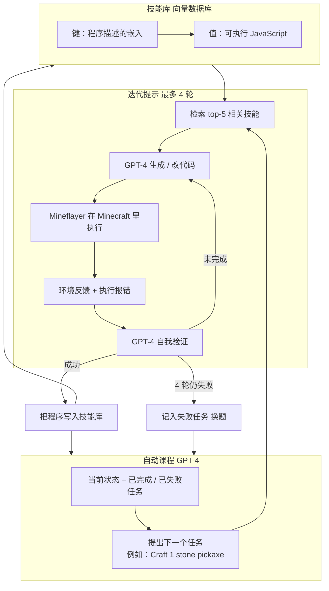

# Voyager：开放世界的终身学习不更新参数，把技能写成可复用代码

<!-- release-date: 2023-05-25 -->

> 本文依据 **Voyager: An Open-Ended Embodied Agent with Large Language Models**，即 arXiv:2305.16291v2、2023-10-19 修订、共 42 页的预印本（正文与结论 p. 1–11、参考文献 p. 11–18、附录 A 方法 p. 19–37、附录 B 实验 p. 38–42）。封面水印 `arXiv:2305.16291v2 [cs.AI] 19 Oct 2023`。作者为 Guanzhi Wang（NVIDIA / Caltech，通讯）、Yuqi Xie（UT Austin）、Yunfan Jiang（Stanford，共同一作）、Ajay Mandlekar（NVIDIA，共同一作）、Chaowei Xiao（NVIDIA / UW Madison）、Yuke Zhu（NVIDIA / UT Austin）、Linxi 「Jim」 Fan（NVIDIA，共同指导，通讯）、Anima Anandkumar（NVIDIA / Caltech，共同指导）。单位栏第一位是 NVIDIA，本站放在 NVIDIA 目录；Caltech、Stanford、UT Austin、UW Madison 的合作关系写在正文里。致谢写明这项工作完成于 Guanzhi Wang 在 NVIDIA 的实习期间（PDF p. 11）。项目页 [voyager.minedojo.org](https://voyager.minedojo.org)。页码均指这份 42 页 PDF 的文件页码。截至 2026-09-10 核验，arXiv 最新版本仍是 v2，与本地原件一致。
>
> 这不是 NASA 的旅行者号探测器，也不是一篇训练 Minecraft 策略网络的论文。它讲的是：**把 GPT-4 当黑盒查询，用可执行代码当动作，在开放世界里做终身学习，全程不更新模型参数。** 全文把三件事分开写：**论文明确写了什么**（带页码）、**本文如何解释它**（凡属推算、换算或从图上读数都会写明）、**外部资料补充**（会给出链接并标注）。

## 读之前需要的最少背景

这篇论文假设你知道「让大语言模型在游戏里当智能体」大概长什么样。不熟的话，先记住下面几个词就够读完全文。

**具身智能体（embodied agent）**：不只聊天，还要在一个环境里移动、拿东西、改变世界。本文的环境是 Minecraft。它和大多数 AI 研究过的游戏不同：没有预设终局，没有固定剧情，地图程序生成，科技树要靠自己采集资源往上爬（PDF p. 2）。

**Minecraft 科技树（tech tree）**：木器 → 石器 → 铁器 → 钻石。每一级都依赖前一级的工具和材料。论文把它当成「会不会组合技能」的压力测试（PDF p. 7）。

**上下文学习（in-context learning）**：不改模型权重，只把例子、状态、报错写进提示词，让模型当场改行为。Voyager 自称做的是「上下文里的终身学习」（PDF p. 1）。

**灾难性遗忘（catastrophic forgetting）**：神经网络学新任务时，旧能力被覆盖。Voyager 的对策不是正则化或回放缓冲区，而是把学会的技能存成一段段代码（PDF p. 1、3）。

**Mineflayer**：一套用 JavaScript 控制 Minecraft 机器人的高层 API。Voyager 不看屏幕像素、不按键盘，而是让 GPT-4 写调用这些 API 的程序。底层仿真搭在 MineDojo 上（PDF p. 6、38）。

**提示迭代（prompting iteration）**：论文的时间单位。一次迭代大致等于「生成或改一轮代码并在环境里执行」。探索实验最多 160 次，零样本任务最多 50 次（PDF p. 7–8）。它不是墙钟时间，也不是游戏内 tick。

四个角色后面会反复出现，不要把它们当成四个独立的模型：它们都是对同一类 GPT API 的不同提示。

- **课程智能体（curriculum agent）**：看当前状态，提出下一个任务。用 GPT-4。
- **动作智能体（action agent）**：把任务写成 Mineflayer JavaScript。用 GPT-4。
- **评判智能体（critic agent）**：判断这段代码有没有完成任务。用 GPT-4。
- **技能管理器（skill manager）**：把成功的程序存进向量库，下次检索。描述和查询用 GPT-3.5，向量用 `text-embedding-ada-002`（PDF p. 4、6、19）。

## 一句话先说清

这篇论文要解决的矛盾可以这样说：

> **开放世界里的终身学习，旧办法几乎都要改模型参数：强化学习在原始动作上爬，模仿学习从演示里抄。参数一改，旧技能就容易忘；动作一碎，长程任务就组不起来。Voyager 的回答是：参数冻结，动作换成代码，记忆换成技能库。**

论文把「有效的终身学习智能体」拆成三件人类玩家会做、当时的 LLM 智能体还不会做的事（PDF p. 2）：

1. **按自己的水平和眼前的世界出题**，而不是执行一张写死的任务表。沙漠里先学采沙子和仙人掌，森林里才先学砍树。
2. **根据环境反馈改技能，并把改好的技能记下来**，下次遇到类似情况直接复用。打僵尸和打蜘蛛应当能共享一部分程序。
3. **自己去找新任务**，而不是等人给目标。

对应到系统，就是三个模块（PDF p. 1–2，Figure 2）：

1. **自动课程（automatic curriculum）**：最大化探索，自下而上出题。
2. **技能库（skill library）**：可执行代码的向量库，越积越复杂。
3. **迭代提示机制（iterative prompting）**：把环境反馈、执行报错、自我验证折回提示词，改程序直到过关。

GPT-4 只接受黑盒查询。论文写得很干脆：这套做法「绕开了对模型参数的访问，以及显式的基于梯度的训练或微调」（PDF p. 2）。「训练」在这里不是梯度下降，是代码执行；「训好的模型」不是一组浮点矩阵，是一份可以组合的技能代码库。

经验数字要带着分母读。摘要里的三句话是（PDF p. 1）：

- 独特物品多 $3.3\times$；
- 走过的距离长 $2.3\times$；
- 科技树关键节点最快 $15.3\times$。

对照的「先前 SOTA」是他们重实现的 ReAct、Reflexion、AutoGPT 这三套 **LLM 智能体**，不是 VPT、DreamerV3 那种看像素、出键鼠的方法。论文自己说后者不是同一类比较（PDF p. 6）。$15.3\times$ 只发生在木器这一级，对的是 AutoGPT 的 $92$ 次迭代除以 Voyager 的 $6$ 次（PDF p. 7，Table 1）。后文会把每条数字拆开。

## 阅读路线

- 只想知道它做了什么：读「全景」和「一次任务的一生」，十分钟够了。
- 想学系统设计：三个模块各自按「旧问题 → 新设计 → 工作机制 → 收益 → 代价」展开，每节末尾有一条可迁移的判断。
- 想知道实验到底证明了什么：读「实验怎么证明」和「限制」，那里把每个倍数的分母和试次数摆开了。
- 想把它放进 2023 年的 agent 版图：读「它和谁不是一类比较」和「可迁移启发」。

## 全景：三个模块，一次黑盒查询循环

先把论文 Figure 2 落到一张图上（PDF p. 2）。

这是根据 PDF p. 2 的 Figure 2 与 p. 19 的 Pseudocode 1 重画的**机制示意图**，不是实测时间轴。原图左边是自动课程的四个游戏截图转圈（砍原木、做工作台、打僵尸、挖钻石），中间是一段 `combatZombie` 的 JavaScript，右边是技能库条目列表。

整条循环里，**没有任何一步在改 GPT-4 的权重。** 变的是三样外存：

1. 课程记住哪些任务做成了、哪些失败了；
2. 技能库多了一段函数；
3. 游戏世界的背包、装备、位置变了。

这就是论文说的「上下文终身学习」的字面意思：学习发生在提示词和代码库里，不发生在参数里（PDF p. 1、3）。

## 旧方案卡在哪

论文第 1 节把两条旧路都否掉了，但否掉的理由不一样。

**强化学习与模仿学习。** 它们在原始动作上工作：按键、鼠标、离散控制。论文认为这条路在三件事上吃力：系统探索、可解释性、泛化（PDF p. 2）。Minecraft 的长程任务——从空手到钻石镐——需要的是「一段时间里成立的组合动作」，不是每一步的原子控制。

**当时的 LLM 智能体。** 它们已经会用预训练里的世界知识出计划或出可执行策略，也已经用在游戏、机器人和纯文本任务上。论文的批评只有一句，但足够当全文动机（PDF p. 2）：

> 这些智能体还不是终身学习者，不能在很长的时间跨度里逐步获取、更新、积累和迁移知识。

附录 Table A.2 把这句话画成了一张对照表（PDF p. 38）。按本文的理解整理如下，勾表示论文原表里的对勾：

| | VPT | DreamerV3 | DECKARD | DEPS | Plan4MC | Voyager |
|---|---|---|---|---|---|---|
| 演示 | 视频 | 无 | 视频 | 无 | 无 | 无 |
| 奖励 | 稀疏 | 稠密 | 稀疏 | 无 | 稠密 | 无 |
| 观察 | 仅像素 | 像素 + 元信息 | 像素 + 背包 | 反馈 + 背包 | 像素 + 元信息 | 反馈 + 元信息 + 背包 |
| 动作 | 键鼠 | 离散 | 键鼠 | 键鼠 | 离散 | **代码** |
| 自动课程 | | | 有 | | | 有（上下文里 GPT-4 出题） |
| 迭代规划 | | | | 有 | | 有（三类反馈） |
| 技能库 | | | | | 有（预定义） | 有（自己生成） |
| 无梯度 | | | | | | **有** |

读这张表时有一个容易踩的坑：Voyager **不是**「Minecraft 打得最好的智能体」，它是「唯一把自动课程、迭代规划和自生成技能库叠在一起、并且不走梯度」的那一列。VPT 和 DreamerV3 看像素、出键鼠，论文明确说不拿它们做对等比较（PDF p. 6）。

附录 Table A.3 再把 LLM 基线拆开（PDF p. 39）。ReAct 有思维链、环境反馈和智能体状态；Reflexion 在此之上加了自我验证和执行报错；AutoGPT 有思维链、环境反馈、执行报错和状态。**技能库和自动课程是 Voyager 独有的两行。** 自我验证这一行 Reflexion 也有，但论文后来说自己的验证同时做「成没成」和「下一步怎么改」，比 Reflexion 的自我反思更完整（PDF p. 5）。

## 核心设计一：自动课程——让 GPT-4 当「刚刚好难一点」的导师

### 旧问题

开放世界里目标的难度差几个数量级。写死一张「先砍树再挖矿」的表，看起来很合理，但有两个具体毛病：

1. **它看不见现场。** 人在河边、手里已经有鱼竿，下一题不该还是「再砍三棵树」。
2. **它不可扩展。** 论文后文用一张人工课程做消融：十步走到挖钻石（PDF p. 39）。这条路需要 Minecraft 专家来写，而且写完就只能走这一条，谈不上开放探索。

随机出题更糟：从 Voyager 自己拿到过的 101 种物品里随机抽一个当下一题，发现物品数掉 $93\%$（PDF p. 8）。原因很直白：顺序错了，题就会难到做不动。

### 新设计

自动课程把出题这件事交给 GPT-4，总目标只有一句（PDF p. 2、4）：

> My ultimate goal is to discover as many diverse things as possible.

论文把它看成一种**上下文里的新颖性搜索（novelty search）**（PDF p. 2）。课程是自下而上展开的：先做当前状态允许的事，再被已经做成的和已经失败的任务推着往前走，而不是自上而下拆一个总目标（PDF p. 3）。

Figure 3 是五条真实出题例子，每条都是「左侧游戏截图 + 状态 → GPT-4 → 推理和任务」（PDF p. 3）。目视核对后，五条是：

| 现场状态（论文摘录） | GPT-4 的下一题 |
|---|---|
| 背包有木镐和石头 | Craft 1 stone pickaxe |
| 生物群系是河，背包有鱼竿 | Catch 1 fish |
| 饥饿 0/20，附近有猪 | Kill 1 pig |
| 有熔炉、原铁和煤 | Smelt 4 raw iron |
| 夜晚，附近有僵尸，已装备石剑和盾 | Kill 1 zombie |

这五条不是「总目标拆子目标」，是「看见什么、缺什么、就做什么」。论文认为这才叫开放探索。

### 工作机制

提示词里有四类东西（PDF p. 4），附录 A.3 给了完整结构（PDF p. 20–21）：

1. **指令和约束。** 下一题必须是单句、可验证、不太难、要新奇。格式被收成 `Mine / Craft / Smelt / Kill / Cook / Equip` 这种短语（PDF p. 21–22）。
2. **当前状态。** 背包、装备、附近 32 格内的方块和实体、最近见过的方块、已知箱子、生物群系、时间、生命和饥饿、三维坐标。
3. **已完成和已失败的任务。** 这就是探索进度和能力边界。
4. **额外上下文。** 用 GPT-3.5 根据当前状态自问自答；可选地用 MineDojo 的 wiki 知识库按「概念」检索文档再回答。论文说，实践中 wiki 不是必须的，因为 GPT-3.5 已经懂 Minecraft；换一个 GPT-3.5 没见过的领域，外部知识库才划算（PDF p. 20）。标准 NLP 任务用 GPT-3.5 而不是 GPT-4，理由是省钱（PDF p. 4）。

还有一个容易漏掉的实现细节：**热身时间表（warm-up schedule）**（PDF p. 20–21，Table A.1）。状态不是一开始就全塞进提示词的。核心背包、装备、附近方块、位置从第 0 个完成任务起就给；附近实体要等完成 5 个任务；完整背包要等 7 个；生物群系和「最近见过的其他方块」要等 10 个；生命、饥饿、时间、额外上下文要等 15 个。论文的理由是：提示词里的信息随探索进度逐渐变多，课程才会从基本技能走到更复杂、更多样的技能。

温度也分开设：课程用 $0.1$ 鼓励多样性，其余全部 $0$（PDF p. 6）。

### 收益、代价、可迁移启发

消融里，换成随机课程，发现物品数掉 $93\%$；换成人工钻石课程，曲线在大约 17 种物品处就平台了，低于完整 Voyager 的约 63 种（PDF p. 8–9，Figure 9 左；63 是正文数字，17 是本文按该图读的终点）。自动课程的收益是：它既不会把智能体扔进做不动的题，也不会把它锁在一条人工路径上。

代价在第 4 节写得很清楚：课程会幻觉出游戏里不存在的物品，例如「铜剑」「铜胸甲」（PDF p. 10）。它没有一个「这东西在 Minecraft 里是否存在」的硬校验，只靠 GPT-4 自己的记忆。

可迁移的不是「用 GPT-4 给 Minecraft 出题」这句话，而是两条更窄的原则：

- **出题器必须看见现场状态，也必须看见失败历史。** 只看见总目标的分解器，会把智能体按在一条和当前世界无关的路径上。
- **状态不要一次倒进提示词。** 热身时间表是一种廉价的课程：先让模型在信息很少时学会基本操作，再把世界打开。这不依赖 Minecraft。

## 核心设计二：技能库——记忆不写进权重，写进函数

### 旧问题

即便 GPT-4 偶尔能写出一段能跑的代码，这段代码如果用完即弃，智能体仍然不是终身学习者。论文点了两个具体后果：

1. **复杂行为组不出来。** 打钻石需要的不是再写一遍「怎么砍树」，而是把已经验证过的 `craftWoodenPickaxe`、`mineIronOre` 嵌进新函数（PDF p. 2–3）。
2. **会忘。** 神经网络式的持续学习有灾难性遗忘；把技能存成代码，旧函数还在，新函数只是去调用它（PDF p. 3）。

没有技能库的 Voyager，探索曲线在后期会平台（PDF p. 8，Figure 9 左）。目视该图：蓝线（去掉技能库）大约在 40 种物品附近走平，橙线（完整系统）继续爬到约 63。

### 新设计

每个技能是一段可执行 JavaScript，脚手架起一段时间里成立的动作，用来完成课程刚刚出的那道题（PDF p. 4）。论文的灵感来自程序的通用性、可解释性和普遍性，引用了 Elias 等人关于程序作为表示的工作（PDF p. 4，参考文献 [45]）。

技能库是一个向量数据库（PDF p. 4，Figure 4）：

- **键**：程序描述的嵌入。描述由 GPT-3.5 生成。
- **值**：程序本身。

Figure 4 上半是「写入」。目视该图：GPT-4 写出的 `combatZombie` 源码一路向右成为值；同一段代码先经 GPT-3.5 变成自然语言描述（「装备石剑打僵尸，没有就先合成，再合成盾，饿了就烧肉……」），描述再变成嵌入，作为键。两者一起 Add 进黄色的技能列表。

Figure 4 下半是「读出」。新任务是 Craft Iron Pickaxe。先让 GPT-3.5 回答「Minecraft 里怎么做铁镐」，得到「需要 3 个铁锭和 2 根木棍……」，再和环境反馈拼成查询，嵌入后到技能库里取 **top-5**。该图列出的五条是：Smelt Iron Ingot、Craft Stick、Make Crafting Table、Make Furnace、Craft Wooden Pickaxe。

检索不是拿任务名去精确匹配函数名，是拿「解题思路 + 现场反馈」去近邻搜索。所以打蜘蛛时有机会拿到打僵尸的程序。

### 工作机制

生成新技能时，GPT-4 的提示词包括（PDF p. 4–5、24–25）：

1. 代码规范。论文特别要求函数可复用：「Your function will be reused for building more complex functions. Therefore, you should make it generic and reusable.」
2. 控制原语 API，以及从技能库检索来的相关技能。论文认为这两样是上下文学习能成立的关键。
3. 上一轮代码、环境反馈、执行报错、评判意见。
4. 当前状态。
5. 先推理再写代码的思维链。

他们自己包的控制原语有（PDF p. 24–25）：`exploreUntil`、`mineBlock`、`craftItem`、`placeItem`、`smeltItem`、`killMob`、`getItemFromChest`、`depositItemIntoChest`。另外还把 Mineflayer 的寻路、装备、钓鱼、睡觉、右键方块等 API 写进提示词当例子。这些原语里大量插入了 `bot.chat()`，执行过程中会往聊天日志打进度，聊天日志再作为环境反馈折回下一轮（PDF p. 5、38）。

附录给了四段真实技能代码（PDF p. 32–34）。值得看的不是语法，是它们怎么组合：

- `craftWoodenPlanks` 会先检查六种原木里有没有任意一种，没有就调用 `mineWoodLog`，再按原木种类合成对应木板。这是「泛化」，不是写死橡木。
- `mineTenCobbledDeepslateBelowY0` 先装备铁镐，再用 `exploreUntil` 在 $y<0$ 处找深板岩。这是「带空间约束的探索」。
- `smeltFiveRawIron` 没有熔炉就先 `craftFurnace`，再找空位放下，再用煤来烧。这是「缺什么补什么」。
- `fillBucketWithWater` 先找到水，走到旁边，右键桶。这是「原语编排」。

新技能通过自我验证之后才入库（PDF p. 5–6）。失败的代码不进库。

检索质量单独测过：309 个样本，top-1 准确率 $80.2\pm 3.0\%$，top-5 $96.5\pm 0.3\%$（PDF p. 42，Table A.4）。论文把 top-5 写进提示词，所以这个数字的意思是：合成新技能时，该拿的旧技能十次里有九次以上会出现在那五条里。

### 收益、代价、可迁移启发

科技树上，去掉技能库的 Voyager 木器 $7\pm 2$、石器 $9\pm 4$、铁器 $29\pm 11$，钻石 $0/3$；完整系统是 $6\pm 2$、$11\pm 2$、$21\pm 7$，钻石 $102$（仅 $1/3$）（PDF p. 7，Table 1）。木器和石器几乎不需要技能库，铁器和钻石开始拉开。这和「后期才会平台」的探索曲线是同一件事：技能库的价值在组合，不在入门。

零样本实验把这件事说得更清楚。把背包清空、世界重置、换四个没见过的任务，技能库仍然能用。它不但帮 Voyager，还给 AutoGPT 当插件：AutoGPT 原本四项全 $0/3$，插上 Voyager 的技能库之后，钻石镐 $1/3$、金剑 $1/3$、指南针 $2/3$（PDF p. 8，Table 2）。论文的原话是：技能库是「即插即用的资产」（PDF p. 8）。

代价有三条，论文写了两条，第三条是本文的解释：

- 描述和查询走 GPT-3.5，生成走 GPT-4。省钱的同时，检索质量绑在 3.5 的摘要能力上（PDF p. 4）。
- 没有视觉。技能是「看见背包和方块名」的程序，不是「看见画面」的程序（PDF p. 9）。
- （本文的解释）技能库假设函数可以被别的函数调用。如果生成的代码都是一次性脚本、名字乱、副作用满地，组合就不会发生。论文用提示词去要求「generic and reusable」，但没有报告有多少技能实际上被后续技能调用过。

可迁移的判断：

> **终身学习的记忆，不一定是权重，也可以是一份带检索的、可执行的代码库。** 关键不在「用了向量数据库」，在于写入标准是「环境里真的跑通过」，读出标准是「语义上像当前任务」，而不是靠参数里的隐式记忆。

## 核心设计三：迭代提示——三种失败，三种回传

### 旧问题

论文引用 Codex 那条老经验：LLM 很难一次写出正确的动作代码（PDF p. 3，参考文献 [41]）。开放世界把这个问题放大了。任务不是「写一个排序函数」，是「在当前背包、当前地形、当前 API 集合下，写一段会改变世界的程序」。一次失败的原因至少有三类，混在一起当「再试一次」会浪费轮次。

### 新设计

迭代提示机制把三类信号分开折回 GPT-4（PDF p. 5）：

1. **环境反馈（environment feedback）**：程序跑到一半，世界告诉你卡在哪。例子：「I cannot make an iron chestplate because I need: 7 more iron ingots」。
2. **执行报错（execution errors）**：解释器抛出的非法操作或语法错误。
3. **自我验证（self-verification）**：另一个 GPT-4 当评判，看当前状态是否已经完成任务；没完成就给 critique，建议下一步。

论文强调第三项比 Reflexion 的自我反思更完整：它既判断成功，也反思错误（PDF p. 5）。开放课程不能给每道新题手写成功判定，所以评判也必须是 LLM。

Figure 5 是两段代码 diff，目视核对如下（PDF p. 5）。

左边，环境反馈是「做木棍还缺 2 块木板、做石铲还缺 2 根木棍」。GPT-4 在 `craftStoneShovelWithTable` 里插入：先数背包里的木板，不够就砍金合欢原木、合成木板，再合成木棍，最后才合成石铲。

右边，执行报错是 `No item named acacia_axe`。GPT-4 把函数从 `craftAcaciaAxe` 改成 `craftWoodenAxe`，把 `craftItem(bot, "acacia_axe", 1)` 换成 `craftItem(bot, "wooden_axe", 1)`。游戏里没有金合欢斧这个物品，有的是木斧——用金合欢木板也能做。

Figure 6 是四条自我验证（PDF p. 6）。目视核对：

| 任务 | 背包里的关键证据 | 评判 |
|---|---|---|
| Mine 5 coal ores | 已有 5 个煤 | Success: True（挖煤矿得到的是煤） |
| Craft a spyglass | 有 3 个铜锭，没有紫水晶碎片 | Success: False，建议去地下挖紫水晶 |
| Kill 3 sheep | 2 个白羊毛、6 个羊肉 | Success: False，再杀一只羊 |
| Kill 1 zombie | 1 个腐肉 | Success: True |

评判看的是状态，不是代码。挖矿任务看产物不看「是不是对着 coal_ore 方块挥了镐」；杀羊看掉落数量。这让成功标准跟着游戏机制走，但也把幻觉风险留给了评判自己——论文后面承认，它有时认不出蛛丝是打蜘蛛成功的信号（PDF p. 10）。

### 工作机制

每一轮的顺序在 Pseudocode 1 里写死了（PDF p. 19）：

1. 用当前任务和环境反馈检索技能；
2. 动作智能体生成代码（带上上一轮代码、反馈、报错、评判、技能）；
3. 环境执行，得到新状态、聊天日志、异常；
4. 评判智能体看任务和状态，返回 `success` 和 `critique`；
5. 成功就停，失败就进入下一轮。

**每题最多 4 轮。** 4 轮仍失败，就把这题记入失败列表，向课程要下一题（PDF p. 6、19）。成功则把代码写入技能库，并把这题记入完成列表。

附录 A.5 显示评判必须按 JSON 返回 `reasoning`、`success`、`critique`（PDF p. 36–37）。例子包括：2 个橡木原木加 2 个云杉原木算「已经有 4 个木原木」；附近有耕地和小麦就算种麦成功；饥饿已经 $20.0/20.0$ 就算吃东西成功；往箱子存了东西但背包仍占 28 格，评判会要求继续存到只占 20 格。这些启发式全部来自 GPT-4，不是规则引擎。

为了省 token，他们不做多轮对话，每次都是系统提示加用户提示拼成一次补全（PDF p. 20）。

### 收益、代价、可迁移启发

Figure 9 右把三类反馈分别拿掉（PDF p. 9）。目视读终点，完整系统仍在约 63；去掉执行报错大约 27；去掉环境反馈大约 22；去掉自我验证大约 17。论文给的是相对值：去掉自我验证，发现物品数掉 $73\%$，它是三类反馈里最重要的（PDF p. 9）。原因论文写了：验证决定「这题过了没有」——过了才能入库、才能换题；不过就还在原地打转。

去掉环境反馈或执行报错也会平台，但平台得更高。本文的解释（不是论文原话）：报错修的是「代码根本跑不起来」，环境反馈修的是「代码跑起来了但世界不答应」，验证修的是「你以为做完了其实没做完」。三种失败的修复位置不同，不能互相替代。

代价同样在第 4 节：

- 迭代之后仍会卡住，写不出正确技能。课程可以以后再试这题（PDF p. 10）。
- 评判会漏判。
- GPT-4 会幻觉调用提示词里没有的函数，直接变成执行报错（PDF p. 10）；也会把圆石当成燃料——游戏里圆石不能烧东西。

可迁移的判断：

> **开放任务不要手写成功判定，但也不要把所有失败都当成同一种「再生成一次」。** 解释器报错、环境拒绝、目标未达成，是三条不同的信道。把它们分开写回提示词，比只做自我反思更接近调试。

## 一次任务的一生

把三个模块按时间串起来，就是论文的主循环。下面不再重复机制，只标谁在什么时候动手。

1. 环境重置，读出初始状态（PDF p. 19）。
2. 课程智能体根据已完成 / 已失败任务汇总探索进度，再结合当前状态出下一题。
3. 进入最多 4 轮的代码循环：
   - 技能管理器按任务和环境反馈取 top-5；
   - 动作智能体写代码；
   - 代码在 Mineflayer 里执行；
   - 评判智能体看状态，决定成功还是给出修改意见。
4. 成功：代码入库，任务标完成，回到第 2 步。
5. 失败：任务标失败，回到第 2 步。

有几条实现约定只写在附录 B.1，但对读实验很重要（PDF p. 38）：

- 机器人死了会在最近的地面复活，**背包保留**，探索不中断；
- 每次程序跑完会回收工作台和熔炉；
- Mineflayer 函数里加了大量 `bot.chat()` 和 try-catch，保证反馈连续、执行不因为单次异常而整段停掉。

「背包保留」意味着死亡不是一次真正的进度回滚。这是实验便利，不是 Minecraft 原版规则。读「探索了 160 次迭代」时要记得：智能体不用从空手再开一局。

## 实验怎么证明

评测四件事：探索、科技树、地图覆盖、新世界里的零样本。模型是 `gpt-4-0314`、`gpt-3.5-turbo-0301`、`text-embedding-ada-002`（PDF p. 6）。每组方法跑三轮。

### 基线是重实现的 LLM 智能体，不是像素 SOTA

因为当时没有开箱即用的 Minecraft LLM 智能体，作者把 ReAct、Reflexion、AutoGPT 从纯 NLP 任务改写成能在 MineDojo 里执行的版本（PDF p. 6、38）：

- ReAct：思维链 + 环境反馈 + 状态；每题先从头生成一轮，再改三轮，循环直到迭代用尽。
- Reflexion：在 ReAct 上加执行报错和 Voyager 的自我验证模块，轮次结构相同。
- AutoGPT：用 GPT-4 把总目标拆成子目标，每个子目标按 ReAct 风格执行。没有技能库、没有自我验证、没有自动课程。子目标若没报错就视为完成；否则最多改三轮（共四轮生成）再进入下一个。连续三个子目标都不新增物品，就重新分解。

探索实验里，所有基线的总目标都是同一句：「explore the world and get as many items as possible」（PDF p. 38）。

论文特意写了不比什么：不和看 Minecraft 屏幕像素、输出底层控制的方法比，因为 Voyager 依赖高层 Mineflayer API，重点是「把 GPT-4 的终身学习推到哪」，不是解决三维感知或感觉运动控制。它声称和 VPT 这类基于梯度的方法正交，只要控制器提供代码 API 就可以组合（PDF p. 6–7）。

### 探索：63 种物品，倍数对的是 AutoGPT 的约 19 种

Figure 1 是封面那张带物品图标的探索曲线（PDF p. 1）。横轴是提示迭代，纵轴是独特物品数，阴影是三轮的波动。目视该图：

- 橙线 Voyager 一直在爬，160 次附近到约 63，钻石工具标注大约在 125 次；
- 蓝线去掉技能库，大约 75 次之后走平在 40 出头，铁器标注大约在 125–150 次；
- 紫线 AutoGPT 走平在约 19，木器大约 75 次、石器大约 90 次；
- 绿线 ReAct、红线 Reflexion 几乎贴在 5 附近。

正文数字：160 次迭代内发现 63 种独特物品，是对照方法的 $3.3\times$（PDF p. 7）。「对照」曲线上看就是 AutoGPT。本文按附录 B.4.1 的三轮物品名单清点（PDF p. 40）：AutoGPT 三轮分别 11、22、25 种，均值 $19.3$；$63 / 19.3 \approx 3.3$。ReAct 三轮是 4、4、2 种，Reflexion 是 5、5、5 种，远不够当 $3.3\times$ 的分母。

63 本身也是三轮的规模，不是单局传奇。附录列出的三轮物品表，第一轮恰好 63 条，第二轮约 58 条，第三轮约 67 条，均值接近正文的 63（PDF p. 40）。第三轮出现了 `diamond` 和 `diamond_sword`，和科技树「只有一轮挖到钻石」对得上。

### 科技树：$15.3\times$ 只发生在木器对 AutoGPT

Table 1 全文抄在这里，因为倍数全部从这张表来（PDF p. 7）。分数是三轮里成功的轮数；数字是成功轮的平均提示迭代，越少越快。$0/3$ 记为 N/A，表示 160 次内没解锁。

| 方法 | 木器 | 石器 | 铁器 | 钻石 |
|---|---|---|---|---|
| ReAct | N/A（$0/3$） | N/A（$0/3$） | N/A（$0/3$） | N/A（$0/3$） |
| Reflexion | N/A（$0/3$） | N/A（$0/3$） | N/A（$0/3$） | N/A（$0/3$） |
| AutoGPT | $92\pm 72$（$3/3$） | $94\pm 72$（$3/3$） | $135\pm 103$（$3/3$） | N/A（$0/3$） |
| Voyager 去掉技能库 | $7\pm 2$（$3/3$） | $9\pm 4$（$3/3$） | $29\pm 11$（$3/3$） | N/A（$0/3$） |
| Voyager | $6\pm 2$（$3/3$） | $11\pm 2$（$3/3$） | $21\pm 7$（$3/3$） | $102$（$1/3$） |

正文说：木器快 $15.3\times$，石器快 $8.5\times$，铁器快 $6.4\times$，而且只有 Voyager 解锁了钻石（PDF p. 7）。本文按表验算：

$$
\frac{92}{6}\approx 15.3,\qquad \frac{94}{11}\approx 8.5,\qquad \frac{135}{21}\approx 6.4
$$

分母都是 AutoGPT。ReAct 和 Reflexion 连木器都没摸到，不能当倍数的分母。AutoGPT 的标准差极大（木器 $92\pm 72$），三轮之间快慢可以差一个数量级，所以 $15.3\times$ 是「平均值之比」，不是「每局都快十五倍」。

钻石这一格更要读细：只有 $1/3$ 成功，成功的那一轮用了 102 次迭代，没有标准差。论文可以写「唯一解锁钻石的方法」，不能被读成「稳定能打出钻石」。去掉技能库的 Voyager 钻石也是 $0/3$，说明技能库在这一级不是锦上添花。

### 地图：$2.3\times$ 距离，原文没有给出米数

Figure 7 是两张鸟瞰地图，上面叠了半透明圆（PDF p. 7）。橙、绿、红、紫分别是 Voyager、ReAct、Reflexion、AutoGPT。橙色圆明显最大，覆盖多种地形色块；基线的圆挤在出生点附近。

这些圆不是轨迹本身。附录 B.4.2 写明：Figure A.2 按「每次和 GPT-4 交互时的位置」描轨迹，Figure 7 再对每条轨迹画最小外接圆（PDF p. 41）。目视 Figure A.2：橙色折线穿过河流、沙漠、雪原、海岸，明显更长；紫、绿、红折线短，有的几乎是一段。

正文声称 Voyager 走过的距离是基线的 $2.3\times$，并穿过更多地形（PDF p. 7）。**原文没有给出各方法的轨迹长度表，本文无法从外接圆半径独立复原 $2.3\times$。** 能独立核对的是地形名单（PDF p. 41）：Voyager 三轮分别走过 8、5、12 种生物群系（含草原、沙漠、热带草原、竹林、溶洞、雪原、冻河、雪坡、冻峰、向日葵平原、石岸、海洋等）；AutoGPT 是 4、1、4 种；Reflexion 有一轮只在雪原针叶林里。论文把这件事归因于课程的求新：它没有被明确要求「走远」，但要发现新东西就不得不换地形（与项目页的叙述一致；PDF 正文只说基线更常困在局部）。

### 零样本：技能库是可插拔的，但不是唯一原因

四个未见过的任务：钻石镐、金剑、岩浆桶、指南针。背包清空，世界新建。Voyager 和 AutoGPT 都额外用 GPT-4 把任务拆成子目标（PDF p. 8）。上限 50 次迭代。

Table 2（PDF p. 8）：

| 方法 | 钻石镐 | 金剑 | 岩浆桶 | 指南针 |
|---|---|---|---|---|
| ReAct | N/A（$0/3$） | N/A（$0/3$） | N/A（$0/3$） | N/A（$0/3$） |
| Reflexion | N/A（$0/3$） | N/A（$0/3$） | N/A（$0/3$） | N/A（$0/3$） |
| AutoGPT | N/A（$0/3$） | N/A（$0/3$） | N/A（$0/3$） | N/A（$0/3$） |
| AutoGPT + Voyager 技能库 | $39$（$1/3$） | $30$（$1/3$） | N/A（$0/3$） | $30$（$2/3$） |
| Voyager 去掉技能库 | $36$（$2/3$） | $30\pm 9$（$3/3$） | $27\pm 9$（$3/3$） | $26\pm 3$（$3/3$） |
| Voyager | $19\pm 3$（$3/3$） | $18\pm 7$（$3/3$） | $21\pm 5$（$3/3$） | $18\pm 2$（$3/3$） |

Figure 8 画了金剑和岩浆桶的中间进度，纵轴是科技树上的中间物品，横轴是代码生成的提示迭代（PDF p. 8）。目视：橙线 Voyager 大约在 15–20 次到达目标虚线；黄线去掉技能库更慢，但最终也能到；浅紫 AutoGPT 停在很浅的层；深紫 AutoGPT + 技能库能爬完，但更晚。附录 Figure A.3 是另外两个任务，形状相同（PDF p. 42）：钻石镐上 AutoGPT + 技能库大约 40 次才到，指南针上浅紫 AutoGPT 卡在铁镐附近再也没动。

读这张表最有用的对比不是「Voyager 全胜」，而是两列消融：

- **只插技能库、不换 AutoGPT 的循环**，已经能把 $0/3$ 变成部分成功。技能作为外存，确实可以跨方法迁移。
- **Voyager 去掉技能库仍然全面强于 AutoGPT + 技能库。** 迭代提示、自我验证、以及零样本里 GPT-4 的子目标分解，并不只是技能库的附庸。

ReAct 和 Reflexion 在 Figure 8 / A.3 里没有曲线，因为「没有任何有意义的进度」（PDF p. 8、42）。

### 消融：课程顺序、技能积累、GPT-4 写代码，缺一不可

六个消融变体的定义在附录 B.3（PDF p. 39）：

- **人工课程**：十步走到挖钻石，从「Mine 3 wood log」到「Mine 1 diamond」。
- **随机课程**：从 Voyager 拿到过的 101 种物品里随机抽下一题。
- **去掉技能库 / 环境反馈 / 执行报错 / 自我验证**。去掉验证时，每题固定改 3 轮（总共 4 轮生成），不再由评判决定何时停。
- **GPT-3.5**：只换代码生成；课程和验证仍用 GPT-4。

Figure 9 左（PDF p. 9）目视终点：完整系统约 63；去掉技能库约 42 并走平；人工课程约 17 并走平；GPT-3.5 约 11 并走平；随机课程约 6。正文相对值：随机课程掉 $93\%$；GPT-4 写代码拿到的独特物品是 GPT-3.5 的 $5.7\times$（PDF p. 8–9）。本文按 $63 / 11 \approx 5.7$ 对齐了第二条。第一条 $93\%$ 按 $63\times 0.07\approx 4.4$，和图上约 6 的终点同量级，精确值应以论文的 $93\%$ 为准，图是带阴影的均值曲线。

Figure 9 右：自我验证最关键（$-73\%$），前面已经用过。

论文把 GPT-4 对 GPT-3.5 的优势写成「代码能力的量子跃迁」，并说开源 LLM 当时也给不了这一跃迁（PDF p. 9–10，引用 [56, 57, 60]）。这是 v2 文本里仍保留的判断。2023 年之后开源模型的代码能力不在本篇范围内，不拿后来的模型回写这一节。

### 人在回路：没有视觉时，人可以顶替课程或评判

当时的 GPT-4 API 是纯文本，Voyager 不支持视觉感知（PDF p. 9）。第 3.5 节用人类反馈演示了两种替代（PDF p. 9，Figure 10）：

1. **人当评判**（等价于自我验证）：人看画面，指出 3D 结构哪里摆错，Voyager 改上一轮代码。论文说这是为了修它「看不见」的空间细节。
2. **人当课程**（等价于自动课程）：人把复杂建造拆成小步。

Figure 10 是两行各四张游戏截图，从左到右是进度（PDF p. 9）。上排「Build Nether Portal」：先在雪地里摆出一个不完整的黑曜石方框，再补成完整门框，最后一帧门框里亮起紫色传送门。下排「Build House」：从几块木板和泥土，到四面墙，到带屋顶和窗的小屋，门前有树。这是定性演示，没有成功率表，也没有说离开人类反馈它能否自己建传送门。

### v2 附录里多出来的稳健性

附录 B.4.5 用 `gpt-4-0613` 重跑探索，声称和 `gpt-4-0314`「大致相同」（PDF p. 42，Figure A.4）。目视该图：橙线 0314 全程略高于紫线 0613，160 次附近两者都到约 60，0314 稍高一点，阴影重叠很多。这是 v2（2023-10-19）才有条件做的实验：`gpt-4-0613` 的快照日期在 v1（2023-05-25）之后。论文没有提供 v1 到 v2 的修改清单，本文不把「v2 新增了什么」写成已核实事实，只按 v2 文本报告这个对照。

## 限制、幻觉和它明确没做的事

第 4 节三条限制，建议原样记住（PDF p. 10）。

**贵。** GPT-4 API 比 GPT-3.5 贵 $15\times$。论文仍然认为必须用 GPT-4 写代码，因为 Figure 9 显示 3.5 写不出那一跃。它没有报告一局 160 次迭代花了多少美元，也没有报告每次补全的平均 token 数。

**不准。** 迭代之后仍会卡住。课程可以以后再试。自我验证会漏判，例子是不把蛛丝当成打蜘蛛成功。

**幻觉。** 课程会出不存在的物品（铜剑、铜胸甲）。代码会把圆石当燃料，会调用提示词里没有的函数。

另外几件论文自己划清、读的时候不该补进去的边界：

- **不看屏幕。** 观察是背包、方块名、实体名、坐标，不是像素（PDF p. 6、9，Table A.2）。
- **不训练新的 Minecraft 策略网络。** 没有强化学习更新，没有模仿学习拟合视频。VPT、DreamerV3、MineDojo 自己的视频预训练是另一条线（PDF p. 10）。
- **死亡不掉背包**（PDF p. 38）。这让探索曲线更好看，也让「终身」少了一类真正的失败。
- **每组三轮。** 钻石 $1/3$、AutoGPT 标准差超过均值，统计上很薄。
- **零样本的四个任务仍然是科技树附近的合成题**，不是任意语言指令，更不是对玩家建筑风格的模仿。
- **更广的影响一节只有一段：** 研究在 Minecraft 这个无害环境里做；若迁到实体机器人，需要人类额外加安全约束（PDF p. 11）。没有机器人实验。

相关工作里，论文把自己放在「高层规划器」一侧：和 DEPS、Plan4MC 一样用 LLM 出计划，和 Volum 等人一样用 Mineflayer 当底层控制器；不同的是课程自下而上、由好奇心驱动，而那些工作按合成配方把总任务拆开，缺少完整的探索自由度（PDF p. 10）。SPRING 被标成同期工作：用 GPT-4 从游戏手册抽机制，再在有向无环图上问答、预测下一步动作。论文对所有这类工作的总评是：它们缺少用来发展更复杂行为的技能库（PDF p. 10）。

## 可迁移启发

这些原则不依赖 Minecraft，但依赖「动作能写成程序、程序能在环境里跑、跑得过才能入库」这一条。

1. **终身学习可以发生在外存里。** 权重冻结时，能积累的是提示词、失败历史和一份带检索的代码库。想做持续学习，先问记忆是不是必须写进梯度。
2. **动作空间选对了，组合是免费的。** 代码天然能调用代码。键鼠轨迹不能。如果任务是长程的、可分解的，先考虑程序而不是 primitive action。
3. **课程要看见现场，也要看见失败。** 自上而下的任务分解假定世界配合你；自下而上的出题假定世界经常不配合。开放环境更接近后者。
4. **写入标准必须是环境里的真成功。** 技能库不是备忘录。自我验证决定「这段代码配不配被记住」。没有这条门闸，库会迅速被失败程序污染。
5. **三类错误不要合成一种 retry。** 语法/API 错误、资源不足、目标未达成，修法不同。调试型 agent 至少要有这三条信道。
6. **把贵模型用在会失败的地方。** Voyager 让 GPT-4 写出题、写代码、当评判，让 GPT-3.5 写描述、做问答、做检索查询。钱花在「一错就会入库或换题」的步骤上。
7. **即插即用是检验外存的标准。** 技能库能抬高 AutoGPT，说明它不是和 Voyager 绑死的内部状态。自己做记忆模块时，可以问：换一个循环，这份记忆还能否用。

不能直接复用的：Mineflayer 这种「几乎把游戏逻辑摊开成 API」的控制器；死亡保留背包；以及 2023 年那种「只有 GPT-4 会写代码」的模型格局。

## 关键词回看

- **黑盒查询（blackbox query）**：只调用 GPT-4 的 API，不看内部激活，不微调。Voyager 的全部学习都建立在这上面。
- **以代码为动作空间（code as action space）**：一次动作是一段可执行程序，而不是一个按键。程序可以表示一段时间里成立的组合行为。
- **自动课程 / 上下文新颖性搜索**：GPT-4 按「发现尽可能多样的东西」和当前状态出下一题，自下而上，而不是拆一个总目标。
- **技能库**：成功程序的向量数据库。键是描述的嵌入，值是代码。新技能由旧技能组合而成。
- **迭代提示**：环境反馈、执行报错、自我验证三类信号折回同一套代码生成提示，每题最多 4 轮。
- **自我验证**：另一个 GPT-4 当评判，既给成功布尔值，也给修改意见。开放课程下无法手写每题判定器。
- **提示迭代**：论文的时间单位，一次大约是一轮代码生成加执行。倍数都按这个单位算，不是墙钟。
- **热身时间表**：按已完成任务数逐步把状态和 wiki 问答放进课程提示，避免一开始信息过载。

## 资料与阅读边界

- **原始依据**：本地 `papers/NVIDIA/Voyager.pdf`，**Voyager: An Open-Ended Embodied Agent with Large Language Models**，arXiv:2305.16291v2，共 42 页（正文与结论 p. 1–11、参考文献 p. 11–18、附录 A p. 19–37、附录 B p. 38–42）。封面水印 `arXiv:2305.16291v2 [cs.AI] 19 Oct 2023`。`pdfinfo` 读出 Pages: 42，Page size: 612 × 792 pts（letter），File size: 18830859 bytes，CreationDate / ModDate 均为 2023-10-20 08:41:15 CST。PDF 元数据 Title / Author 为空，标题与作者以封面为准。本文所有页码指这份 PDF 的文件页码。
- **版本核验**：[arXiv:2305.16291](https://arxiv.org/abs/2305.16291)。提交历史两条：v1 于 2023-05-25 17:46:38 UTC（13,286 KB）；v2 于 2023-10-19 16:27:03 UTC（13,649 KB），标注为 this version。**截至 2026-09-10 核验，arXiv 最新版本仍是 v2，与本地水印、页数和创建时间一致，未替换本地 PDF。** 本文按 v2 写。
- **`release-date` 取 2023-05-25**。对象是一套公开技术 / 预印本加开源代码，不是对外可用的模型权重，按流程取该技术首次官方公开日。已核查的候选事件：① arXiv v1，2023-05-25 17:46:38 UTC；② GitHub [MineDojo/Voyager](https://github.com/MineDojo/Voyager) 默认分支上的「Voyager release」提交在 2023-05-26；③ 通讯作者 Jim Fan 的宣布帖在 2023-05-26；④ NVIDIA 官方博客 [A Mine-Blowing Breakthrough](https://blogs.nvidia.com/blog/ai-jim-fan/) 在 2023-10-04，晚于论文。**没有找到早于 arXiv v1 的 NVIDIA 官方发布页或项目页时间戳。** Hugging Face Papers 卡片的日期跟着 arXiv，按流程不采用 Hugging Face `createdAt`。
- **作者与归属**：封面单位为 ¹NVIDIA、²Caltech、³UT Austin、⁴Stanford、⁵UW Madison。Yunfan Jiang 与 Ajay Mandlekar 共同一作；Linxi 「Jim」 Fan 与 Anima Anandkumar 共同指导；通讯作者是 Guanzhi Wang 与 Jim Fan。项目页 [voyager.minedojo.org](https://voyager.minedojo.org) 把第 5 个单位写成 ASU，与本地 v2 封面的 UW Madison 不一致；**本文以本地 PDF 封面为准**，不按项目页改归属。本站目录按主要归属方 NVIDIA。
- **外部补充清单**（均不与 PDF 数字混用）：
  - arXiv 提交历史：[abs/2305.16291](https://arxiv.org/abs/2305.16291)；
  - 项目页：[voyager.minedojo.org](https://voyager.minedojo.org)；
  - 代码：[MineDojo/Voyager](https://github.com/MineDojo/Voyager)；
  - 环境框架 MineDojo 论文：Fan 等人，参考文献 [23]；
  - NVIDIA 博客（2023-10-04）是访谈，不是实验报告；
  - 2023 年之后用开源权重重跑或改进 Voyager 的工作（例如后来的 MindForge 等）**不是本篇内容**，本文不引用它们的数字来「更新」Voyager。
- **本文标为「读图」或「本文验算」的地方**：Figure 1 / 9 / A.4 的终点物品数；Figure 8 / A.3 到达目标的大致迭代；Table 1 三个倍数的除法；$63 / 19.3 \approx 3.3$ 对附录物品名单的清点；Figure 9 去掉验证后约 17 种与 $-73\%$ 的对应。这些不能替代论文正文给出的 $3.3\times$、$2.3\times$、$15.3\times$、$93\%$、$73\%$、$5.7\times$。
- **未公开 / 无法核实的缺口**：
  - 一局探索的美元成本和平均 token 数；
  - $2.3\times$ 距离的原始轨迹长度（只有外接圆图和倍数）；
  - 技能库中有多少函数实际被后续技能调用（组合是机制主张，没有调用计数）；
  - 自我验证的误判率（只给了蛛丝这一个例子）；
  - 热身时间表每一档对课程质量的单独贡献；
  - 死亡保留背包关掉之后曲线会掉多少；
  - v1 与 v2 的完整 diff（本文未下载 v1 PDF 做逐页对照）；
  - 与 VPT / DreamerV3 在同一控制器下的对等比较（论文明确没做）。
- **图表说明**：文中 Mermaid 均为根据 PDF Figure 2 与 Pseudocode 1 重画的**机制示意图**，不含实测时长。Table 1、Table 2、Table A.1、Table A.2、Table A.3、Table A.4 已转成原生表格。Figure 1、2、3、4、5、6、7、8、9、10、A.1、A.2、A.3、A.4 均已打开对应 PDF 页目视，不把截图拷进 `public/`。Figure 10 的建造进度用文字描述；地图类图用外接圆和轨迹的相对大小描述，不估像素半径。
- **本文没有做的事**：没有把 GitHub 当前代码现状写进论文结论，没有用 2023 年之后的开源 LLM 重跑来「修正」GPT-3.5 写不出代码这句话，没有把项目页上的 ASU 单位写进作者栏，没有把 NASA 旅行者号或任何航天内容写进来，没有声称本文训练了新的 Minecraft 策略网络。论文说没写的地方，本文一律写明没写。
