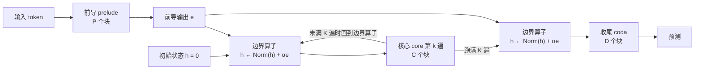
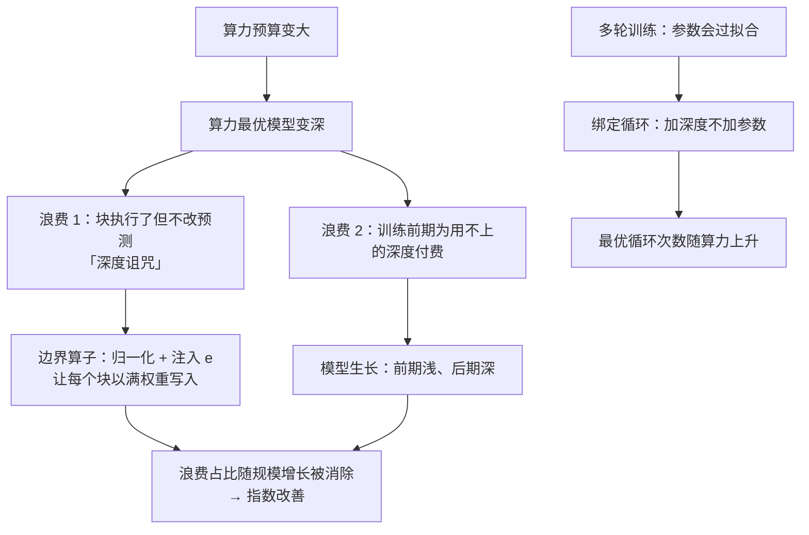

# 让模型边训边长深：模型生长与边界算子如何改写缩放指数

<!-- release-date: 2026-09-16 -->

> 本文依据纽约大学（NYU）与 Q Labs 的 **How Model Growth, Recursion, and Boundary Operators Influence Scaling Exponents**，即 arXiv:2609.19107v2（2026-09-17），共 44 页。页码均指这份 PDF 的物理页码。这是一篇预训练方法论文：没有发布模型权重，研究对象是「架构改动能不能改变缩放律的指数」。全文把 3 件事分开写：**论文明确写了什么**（带页码）、**我们如何解释或验算它**（会写明）、**外部资料补充**（给出处并标注）。

## 读前先把几个词说成人话

这篇论文的难点不在网络结构，结构很简单；难点在它讨论的对象是「曲线的斜率」，而不是某一个点上的分数。先把词分清。

- **缩放律（scaling law）**：训练算力越多，损失（loss）怎么下降的经验公式。它通常是一条幂律：在双对数坐标上画出来接近一条直线（PDF p. 3–4）。
- **算力最优（compute-optimal）**：给定算力预算，模型参数量和训练 token 数怎么分才能让损失最低。Chinchilla 一篇给出的经验是二者要按比例一起涨（PDF p. 3，引 Hoffmann 等人 2022）。
- **缩放指数与缩放常数**：幂律 $L(C) = E + A\,(C/C_0)^{-\gamma}$ 里，$\gamma$ 是**指数**，决定曲线有多陡；$A$ 是**常数**，决定曲线整体上下平移（PDF p. 4，式 1）。常数更好，每个规模都省同样的倍数；指数更好，省下的倍数随规模越滚越大（PDF p. 14）。
- **算力倍数（compute multiplier）**：标准 Transformer 要花多少倍算力，才能追上某个变体的损失。倍数随规模不变，说明只改了常数；倍数随规模上升，说明改了指数（PDF p. 2、p. 4、p. 9）。
- **循环 Transformer（looped transformer）**，也叫**递归深度（recursive depth）**：一次前向里把同一组层反复跑 $K$ 遍，每一遍共享同一套权重（PDF p. 2）。
- **prelude–core–coda（前导、核心、收尾）**：Geiping 等人 2025 年的循环模型写法。前导块把输入编码成表示 $e$；核心块被循环 $K$ 次；收尾块产出预测（PDF p. 2、p. 6）。
- **执行深度与存储块数**：一个 token 实际经过的层数叫执行深度（executed depth）；显存里真正存着几份权重叫存储块数（stored blocks）。循环会让前者大于后者（PDF p. 6）。
- **边界算子（boundary operator，BO）**：每次进入核心、以及进入收尾之前，先把残差流归一化，再加回前导输出 $e$（PDF p. 6–7）。
- **模型生长（model growth）**：训练中途把模型变深。本文的做法是把核心的遍数从 2 加到 4（PDF p. 7–8）。
- **权重绑定（tied）与解绑（untied）**：绑定是每一遍核心用同一套权重；解绑是每一遍各有一份权重，等价于一个带边界算子的更深的普通 Transformer（PDF p. 7）。
- **TPP（tokens per parameter，每参数 token 数）**：训练 token 数除以存储参数量，是算力最优配方里的核心旋钮（PDF p. 8、p. 26）。
- **深度诅咒（curse of depth）**：pre-norm Transformer 里残差流随深度变大，越往后的块改动占比越小，深层块趋于「什么也没做」（PDF p. 6）。
- **KL 有效深度（KL effective depth）**：用 logit lens（把中间层残差流直接解码成预测）逐层看，从哪一层开始预测已经和最终输出差不多。它是「模型真正用上了几层」的一个代理指标（PDF p. 6、p. 13–14）。
- **CORE**：DCLM 提出的 22 个下游任务合集，本文按 nanochat 的实现评测（PDF p. 34）。

## 一句话先说清

业内的常识是：架构改动一般只能改缩放常数，改不动缩放指数（PDF p. 1，引 Bansal 等人、Hestness 等人、Chen 等人）。常数的收益是固定倍数，规模一大就被别的因素淹没；指数的收益是复利，规模越大省得越多。

这篇论文说，常识不对，至少在他们测到的范围内不对（PDF p. 1–2）：

1. **模型生长改指数，而且改得最多。** 核心在训练中途从 2 遍加到 4 遍、权重解绑（Untied-Grow），在 $10^{20}$ FLOPs 时比标准 Transformer 省 1.55 倍算力，而且这个倍数随规模上升（PDF p. 2、p. 9）。
2. **循环是一种不加参数的生长方式。** 权重绑定的生长（Loop-Grow）参数量和标准 Transformer 相同，在 $10^{20}$ FLOPs 时倍数 1.36 倍，只比解绑版差一个固定倍数（PDF p. 2）。
3. **只加一个边界算子也改指数。** 不循环、不生长，普通 Transformer 里加上「归一化再注入前导输出」，倍数从 $10^{18}$ FLOPs 的 1.12 倍升到 $10^{20}$ FLOPs 的 1.25 倍（PDF p. 9）。
4. **外推站得住。** 在拟合范围最大算力的 8 倍上训了一个 7.4B 的 Untied-Grow，损失落在外推曲线上（甚至略低 0.03）；CORE 得分 0.3865，与 GPT-3 13B 的参考值 0.3852 持平，算力 $1.23\times 10^{21}$ 对 $2.31\times 10^{22}$ FLOPs，约少 20 倍（PDF p. 10–11）。
5. **数据不够、要重复多轮时，循环本身变成正则。** 1 亿 token 训 10 轮，最优循环次数随算力从约 1.4 升到约 6.7；循环加次数比加参数省 2.2 倍算力（PDF p. 2、p. 12）。

作者把这一切归到同一个概念上：**计算深度（computational depth）**，即在给定算力下，真正能影响预测的层数。边界算子让已经执行的层不浪费，生长让模型不在还用不上深度的训练前期为深度付费（PDF p. 3、p. 13）。

同时要先记住 3 个「不是」：

- 指数差的绝对值很小：标准 Transformer 是 0.111，最好的 Untied-Grow 是 0.117（PDF p. 9，Figure 3）。它值钱是因为会复利，不是因为单点上差很多。
- 20 倍对 GPT-3 的那句不是受控对照：数据不同、评测管线不同，作者自己写的是「指示性的」（PDF p. 10）。
- 单轮训练、数据充足时，**单纯共享权重不改指数**，只改常数（PDF p. 5、p. 10）。循环的好处要么来自生长，要么来自多轮训练里的正则。

### 一条阅读路线

如果只有半小时读原文，建议按这个顺序：

1. **p. 3 的 Figure 1**：6 个变体是同一个家族，按 3 条轴两两对照。
2. **p. 4 的式 1 与算力倍数定义**：先弄清「倍数上升 = 指数改善」这条读图规则。
3. **p. 7–8 的 4.1 节与 Algorithm 1**：每个架构单独拟合配方，这是结论可信的前提。
4. **p. 9 的 Figure 3 与 4.2 节**：主结果。3 张子图分别看损失、倍数、指数与常数。
5. **p. 10–11 的 4.3 节与 Figure 4**：7.4B 外推验证与下游 CORE。
6. **p. 11–12 的第 5 节与 Figure 5**：多轮训练里循环为什么更划算。
7. **p. 13–14 的第 6 节与 Figure 6**：用 KL 有效深度解释以上现象。

附录 A（p. 20–31）是配方细节，附录 B（p. 32–36）是消融，附录 C（p. 34–40）是下游评测与外推方法，附录 D（p. 41–44）是多轮训练的补充实验。

## 主要矛盾：架构改动为什么总被认为「只值一个常数」

### 旧路径卡在哪

缩放律告诉我们：在算力最优的训练下，损失随算力按幂律下降（PDF p. 3–4）。一个新架构如果只是把整条曲线往下平移，那它在每个规模上省的倍数都一样。这当然也有用：论文开头就举了 Muon 优化器的例子，在正确的超参缩放下，Muon 相对 AdamW 在各个规模上都有约 40% 的算力效率收益（PDF p. 1，引 Qiu 等人 2026、Liu 等人 2025；同库有 Muon-is-Scalable-for-LLM-Training 一篇）。

但指数更值钱。指数改善意味着曲线更陡，规模越大，领先的倍数越大。论文在背景里点了几个前例：Transformer 相对 LSTM 在参数上的指数更好；细粒度 MoE 的缩放律预测其相对稠密模型的优势随预算增长（PDF p. 5）。这些都是很大的结构变化，不是在 Transformer 里改 1、2 处。

作者认为，架构改动「只改常数」的印象，部分来自实验做法（PDF p. 2、p. 5）：

- 早期的模型生长研究关注的是复用小模型的训练：Du 等人 2024 年发现层堆叠在同等损失下提速 50%；Shen 等人 2022 的分阶段训练、Wang 等人 2026 的 MoE 检查点回收等工作，也都只在 1 个或少数几个目标规模上报收益，没有看算力最优缩放律本身（PDF p. 5）；
- 循环 Transformer 的研究主要用于推理时加算力或省参数，不是用来在固定训练预算下训得更好（PDF p. 2）；
- 受控对比的结果是混杂的：Prairie 等人 2026 在固定参数和数据下看到循环更好，但没有在参数和数据联合最优时证明优势；Schwethelm 等人 2026 发现在同等计算深度、联合最优时，更多循环反而更差（PDF p. 5）；
- 最关键的是**超参缩放**。超参缩放不对，本身就会得到一条更差的算力最优曲线（PDF p. 5，引 Yang 等人 2022、Qiu 等人 2026）。拿标准 Transformer 的配方直接套到新架构上，新架构的指数优势可能就被吃掉了。

### 这篇论文把问题换成什么

于是论文要回答的问题变成：

> 如果**每个架构都单独拟合一整套算力最优配方**，再把各自的缩放律放在一起比，差别是「一条平行线」还是「一条更陡的线」？

后面所有实验都围绕这一问展开。第 4 节是单轮、数据充足；第 5 节是多轮、数据受限；第 6 节给出解释。

## 先看全景：同一个 3 段式家族，3 条轴各做一次对照

Figure 1 是全文最重要的一张图（PDF p. 3）。它画的是最小规模（d6，前导 / 核心 / 收尾各 2 块）下的 6 个变体：

| 变体 | 核心遍数 $K$ | 边界算子 | 权重 | 生长 | 执行深度 | 存储块数 |
|---|---|---|---|---|---|---|
| Vanilla | 1 | 无 | — | 无 | 6 | 6 |
| Operator-1 | 1 | 有 | — | 无 | 6 | 6 |
| Loop-2 | 2 | 有 | 绑定 | 无 | 8 | 6 |
| Untied-2 | 2 | 有 | 解绑 | 无 | 8 | 8 |
| Loop-Grow | 2 → 4 | 有 | 绑定 | 有 | 8 → 12 | 6 |
| Untied-Grow | 2 → 4 | 有 | 解绑 | 有 | 8 → 12 | 12 |

表中数字读自 Figure 1（PDF p. 3）。每一对比较只差一条轴（PDF p. 3、p. 7）：

- **Vanilla 对 Operator-1**：参数量和 FLOPs 都相同，只差边界算子；
- **Loop-2 对 Untied-2**：FLOPs 与执行深度相同，只差权重是否共享；
- **Loop-2 对 Loop-Grow、Untied-2 对 Untied-Grow**：只差训练中途是否把核心遍数翻倍。

另有 2 个图里没画的对照组（PDF p. 7）：**Deep Vanilla** 是去掉边界算子的 Untied-2，也就是一个更深的普通 Transformer；**Deep Vanilla Grow** 是去掉边界算子的 Untied-Grow，用来看「没有边界算子时生长还灵不灵」。

下面这张图按 PDF p. 6 的式 2 与 p. 8 的 Algorithm 1 重画，是一次前向的机制示意，不是论文原图：

一个 token 经过的执行深度是 $\ell = P + KC + D$（PDF p. 6）。绑定时每一遍核心是同一份权重；解绑时第 $k$ 遍用自己的 $\theta_k$。生长只改 $K$，而且只在一次训练内部改；沿缩放阶梯变大时，前导、核心、收尾 3 段一起按比例变大（PDF p. 7）。

## 核心设计一：边界算子，让深层块不再「白跑」

### 旧问题：pre-norm 的残差流越来越大

pre-norm Transformer 把归一化放在每个块的输入上，而不放在残差流本身上。残差流因此随深度变大，每个块的更新只占其中越来越小的一部分，深层块逐渐趋于什么也没做（PDF p. 6，引 Liu 等人 2020、Sun 等人 2025）。这就是深度诅咒。已有的缓解办法有 3 类：在残差分支里缩放归一化输出、直接归一化残差流、把前面的表示注入后面（PDF p. 6）。这些办法都能在固定规模上降损失，但没人证明过它们能改缩放指数（PDF p. 6）。

### 新设计：归一化 + 注入，2 处边界都做

边界算子定义为（PDF p. 6，式 3）：

$$
\mathrm{BO}(h, e) = \mathrm{Norm}(h) + \alpha\, e
$$

$h$ 是当前残差流状态，$e$ 是前导输出，$\alpha$ 是注入强度（配方里叫 injection weight，初值 1，PDF p. 27 Table 3）。它有 2 个动作，各管一件事（PDF p. 7）：

1. **归一化**让每一遍都能「以满权重」写入，不被越积越大的残差流稀释；
2. **加回 $e$** 让每一遍都重新看到输入，不在循环中漂走。

在循环模型里，相邻 2 遍之间归一化是标准做法，注入输入也见于多种循环模型和 nanochat、modded-nanogpt 这类固定深度的 Transformer（PDF p. 7）。本文的新意在一处细节：以往的循环模型在收尾前只归一化、不注入 $e$；本文在**收尾前也做完整的归一化加注入**，并发现这很重要（PDF p. 7）。

### 证据：基准规模的消融

Table 4（PDF p. 26）在 d8 规模上把每个变体单独调参，训 1B token，宽度 1024，执行深度 11：

| 架构 | 核心边界 $\phi$ | 收尾前 $\rho$ | 调好后损失 | 训练时间（分钟） |
|---|---|---|---:|---:|
| Deep Vanilla | $h$ | $h$ | 3.2772 | 6.49 |
| Loop-2 | BO | BO | 3.2704 | 6.54 |
| Loop-2 去掉收尾注入 | BO | Norm | 3.2912 | 6.45 |
| **Untied-2** | BO | BO | **3.2563** | 6.54 |
| Untied-2 去掉收尾注入 | BO | Norm | 3.2731 | 6.53 |
| Deep Vanilla + 只归一化 | Norm | Norm | 3.2781 | 6.48 |
| Deep Vanilla + 只注入 | $h+\alpha e$ | $h+\alpha e$ | 3.2690 | 6.52 |

读这张表要看 2 件事。第一，完整的边界算子最好，拆掉 2 个动作中的任何 1 个或拿掉收尾注入都会变差。第二，训练时间几乎没变：6.49 分钟对 6.54 分钟（PDF p. 26）。边界算子只多了 1 个 RMSNorm 和几次向量加法（PDF p. 20）。

更关键的消融在缩放阶梯上（PDF p. 32–33，Figure 15a）。接近 $10^{20}$ FLOPs 时，完整的 Untied-2 相对 Vanilla 的倍数约 1.34 倍；只归一化、只注入、或去掉收尾注入的版本只有约 1.17–1.19 倍；没有边界算子的 Deep Vanilla 约 1.08 倍（PDF p. 32）。

### 可迁移启发

如果你在做深的 pre-norm 模型，**「归一化残差流 + 周期性注入早期表示」是一个几乎零成本的改动**。它在本文里不只是降损失，而是让优势随深度变大。注意 2 个前提：一是收尾前也要注入；二是要给改动后的模型重新调超参（下一节会讲，不重调，指数优势会消失）。

## 核心设计二：模型生长，把深度留到需要的时候再买

### 旧问题：固定深度的模型在训练前期为用不上的深度付钱

神经网络在训练早期先学简单模式，后期才学更复杂、更细的结构（PDF p. 2、p. 13，引 Nakkiran 等人 2019、Rahaman 等人 2019）。一个从头到尾都是固定深度的模型，前期也在为全部层付算力，而那时它可能根本用不上这么深（PDF p. 13）。

过去的模型生长研究，动机是「不浪费小模型的训练」：训完小模型，把权重复用来初始化大模型（PDF p. 5）。本文明确放下这个动机，把生长当成**提高最终模型计算深度的手段**（PDF p. 5）。

### 新设计：训练中途把核心遍数从 2 翻到 4

生长的规则很简单（PDF p. 7）：

- **绑定（Loop-Grow）**：已有的核心直接多跑几遍，不增加任何权重；
- **解绑（Untied-Grow）**：把训练好的核心复制一份，之后各自训练，就是 Du 等人 2024 年的纵向堆叠（depthwise stacking）。

其余选择一律固定：初始状态 $h_0 = 0$；循环次数固定而非随机采样；梯度穿过每一遍（PDF p. 7）。

Algorithm 1（PDF p. 8）把 Untied-Grow 写成伪代码。用人话讲是这样：

1. 初始化前导、收尾和 $K_0$ 份独立的核心；
2. 前 $g$ 步正常训练，每一步：前导算出 $e$，$h$ 从 0 开始，每进一遍核心之前先做 $h \leftarrow \mathrm{RMSNorm}(h) + \alpha e$，跑完全部核心后在收尾前再做一次，再算交叉熵；
3. 第 $g+1$ 步把已有的 $K_0$ 份核心各复制 $m-1$ 次，$K$ 变成 $K_f = mK_0$；
4. 之后所有活跃参数一起更新，反向传播穿过全部 $K$ 遍。

本文实际用的是 $K_0 = 2$、$K_f = 4$（PDF p. 8）。

### 为什么是 2 → 4，什么时候长

这 2 个问题在拟合配方时单独扫过：

- **长到几遍**：从 2 遍出发扫了 3、4、6、8，4 遍在每个测试预算上损失都最低；更大的目标能提高 KL 有效深度，但损失不稳定改善（PDF p. 8、p. 22）。
- **什么时候长**：设 $\rho$ 为生长之后处理的 token 占比，$\rho$ 越大越早长（PDF p. 22）。3 个小模型锚点上拟合的平均最优 $\rho$，Deep Vanilla Grow 是 0.544，Loop-Grow 是 0.170，Untied-Grow 是 0.271（PDF p. 29，Figure 13）。换成训练进度，也就是在训练进度 1/2 到 4/5 之间生长（PDF p. 8）。
- **长完之后 token 怎么分**：生长后每 token 平均算力变高，最优 token 分配要重拟合。生长偏好**更小的初始模型、训更多 token**：按训练平均算力参数计的最优 TPP，绑定版从 6.39 升到 6.97，解绑版从 7.43 升到 8.97（PDF p. 23）。

最优点附近很平。把 Untied-Grow 的 TPP 从 8 换回 6，匹配损失所需算力变化小于约 5%；把逐规模拟合的 $\rho$ 换成常数 0.30，损失变化在 −0.0009 到 +0.0019 之间（PDF p. 23、p. 29）。所以作者推荐的简化配方是：用固定的生长比例和取整的 TPP（PDF p. 23、p. 26）。

### 7.4B 模型的「一开始是 5B」

Table 2（PDF p. 20）列出了各规模的块划分与参数量。命名规则是：$d\ell$ 表示名义深度 $\ell$，宽度固定为 $128\ell$（PDF p. 6、p. 20）。

| 规模 | 前导 / 核心 / 收尾 | 执行深度（2 → 4 遍） | 宽度 | Vanilla | Loop-Grow | Untied-2 | Untied-Grow |
|---|---|---|---:|---:|---:|---:|---:|
| d6 | 2/2/2 | 8 → 12 | 768 | 120M | 120M | 130M | 160M |
| d8 | 2/3/3 | 11 → 17 | 1,024 | 210M | 210M | 240M | 320M |
| d10 | 3/4/3 | 14 → 22 | 1,280 | 330M | 330M | 410M | 580M |
| d12 | 4/4/4 | 16 → 24 | 1,536 | 490M | 490M | 610M | 830M |
| d14 | 4/5/5 | 19 → 29 | 1,792 | 730M | 730M | 920M | 1.3B |
| d16 | 5/6/5 | 22 → 34 | 2,048 | 1.0B | 1.0B | 1.3B | 2.0B |
| d18 | 6/6/6 | 24 → 36 | 2,304 | 1.4B | 1.4B | 1.8B | 2.5B |
| d20 | 6/7/7 | 27 → 41 | 2,560 | 1.8B | 1.8B | 2.4B | 3.5B |
| d22 | 7/8/7 | 30 → 46 | 2,816 | 2.4B | 2.4B | 3.2B | 4.7B |
| d24 | 8/8/8 | 32 → 48 | 3,072 | 3.0B | 3.0B | 3.9B | 5.7B |
| d26 | 8/9/9 | 35 → 53 | 3,328 | 3.8B | 3.8B | 5.0B | 7.4B |

表中参数量是存储参数。Untied-Grow 从一开始就为 4 份核心分配了存储（PDF p. 20，Table 2 表注）；训练前段只有 2 份核心在参与计算，所以正文把 d26 的 7.4B 模型描述成「从 5B 参数起步」（PDF p. 10）。

### 可迁移启发

**深度不必从第 1 步就全买齐。** 先浅后深、在训练后段把核心复制一遍，就能在同样的训练算力下得到一个更深、效果更好的模型。复制核心的实现非常简单（就是拷贝权重），难点在配方：生长时机、生长后的 token 分配、学习率缩放都要按新架构拟合。能直接复用的是结论「2 → 4、在后段长、长之前用更小的模型训更多 token」；具体的 $\rho$ 与 TPP 是在本文的数据、宽深比和优化器下拟合出来的。

## 核心设计三：每个架构单独拟合配方，否则比的是调参

这一节不是新架构，却是全文结论能成立的前提。作者反复强调：指数上的差距，只有在每个架构都调好的前提下才有意义，否则可能只是调参差距（PDF p. 7）。

### 一个反例先摆出来

把 Vanilla 调好的配方直接用在 Operator-1 上，d8 规模下损失就差 $7.8\times 10^{-3}$，而且沿缩放阶梯看，Operator-1 的指数改善消失了，变成常数改善（PDF p. 7，Figure 16b 见 p. 35）。

Table 6（PDF p. 27）列出把 Vanilla 配方迁移给各变体的损失代价：

| 架构 | 用 Vanilla 配方的损失 | 用自己配方的损失 | 迁移代价（$10^{-3}$） |
|---|---:|---:|---:|
| Vanilla | 3.3275 | 3.3279 | −0.3 |
| Deep Vanilla | 3.2869 | 3.2772 | +9.8 |
| Operator-1 | 3.3135 | 3.3057 | +7.8 |
| Loop-2 | 3.2777 | 3.2704 | +7.2 |
| Untied-2 | 3.2697 | 3.2563 | +13.3 |

Vanilla 自己的 −0.3 是低于采纳阈值的噪声（PDF p. 27）。附录正文把这一范围写成「$7$–$26\times 10^{-3}$」（PDF p. 26），但 Table 6 里最大值是 13.3，2 处对不上；以表为准时范围是 7.2 到 13.3。

### 反过来，配方不调也会让新架构「显得更好」

附录 B.2 给了另一面（PDF p. 32，Figure 15c）：所有架构都用基准规模调好的**常数配方**、不做学习率缩放时，循环与生长模型相对 Vanilla 的倍数反而更大，Figure 15c 上最高约 2 倍（读自 PDF p. 33 Figure 15c）。原因是 Vanilla 最需要随规模降低学习率：Table 8 里常数配方下全局学习率的漂移指数 $\beta$，Vanilla 是 −0.78，Operator-1 是 −0.62，Loop-2 是 −0.58，Untied-2 是 −0.66（PDF p. 31）。不给 Vanilla 缩放学习率，就是在拖它的后腿。

**我们如何解释它。** 2 个方向的错误都存在：套用基线配方会**低估**新架构，不缩放基线的学习率会**高估**新架构。这篇论文可信的地方，在于它把 2 个方向都堵上了，并把消融数字都摆了出来。

### 配方分 4 步，外加 3 个全家族共用的选择

全家族共用的 3 个选择，用绑定变体在 1B token、匹配参数量下定下（PDF p. 8、p. 21–22）：

1. **块怎么分到 3 段**：最优的核心占比基本不随深度变，于是平均分，余数先给核心再给收尾；
2. **固定变体跑几遍核心**：数据充足时最优点在每个预算上都落在 1 到 2 遍之间，所以固定变体用 2 遍；
3. **生长到几遍**：从 2 遍出发，4 遍在每个预算上最好。

然后每个架构各自走 4 步（PDF p. 8、p. 26–31）：

| 步骤 | 做什么 | 结果 |
|---|---|---|
| 1 基础超参 | 在 d8、1B token 上逐个超参做链式调参，2 轮，每轮 9 组扫描（Vanilla 8 组），每组 8 个并行 run | Table 5 各架构的最优超参（PDF p. 27） |
| 2 每参数 token 数 | 在 5 个算力预算上各训 5 个规模，拟合最优 TPP | Vanilla 5；带边界算子 6；生长 7–8。没有一个架构的最优 TPP 随规模显著漂移（PDF p. 8、p. 28） |
| 3 生长时机 | 只对生长变体，扫 $\rho$ | 见上一节（PDF p. 29） |
| 4 学习率缩放 | 在 d8–d10 上拟合 $\mathrm{GLR}(N) = \mathrm{GLR}_{d8}\,(N/N_{d8})^{\beta}$ | $\beta$ 取 −0.5 到 −0.8（PDF p. 29、p. 31） |

第 2 步的具体数字在 Table 7（PDF p. 28）：平均最优 TPP 是 Vanilla 5.33、Deep Vanilla 5.66、Operator-1 5.79、Loop-2 6.39、Untied-2 6.08；尺度漂移检验的 p 值都大于 0.05。每个循环变体都比 Vanilla 偏好稍高的 TPP，作者读作参数效率更高（PDF p. 28）。

第 4 步只缩放学习率就够了：再加输出乘子或权重衰减的缩放，算力倍数的变化最多约 3%（PDF p. 8、p. 30）。最终配方在 Table 9（PDF p. 31）：

| 架构 | 学习率指数 $\beta$ | token 分配 | 实测规模 |
|---|---:|---|---|
| Vanilla | −0.8 | TPP 5 | d6–d20 偶数 |
| Deep Vanilla | −0.7 | TPP 6 | d6–d18 偶数 |
| Operator-1 | −0.6 | TPP 6 | d6–d20 偶数 |
| Loop-2 | −0.6 | TPP 6 | d6–d18 偶数 |
| Untied-2 | −0.6 | TPP 6 | d6–d18 偶数 |
| Deep Vanilla Grow | −0.8 | 参考 TPP 6 | d6–d18 偶数 |
| Untied-Grow | −0.6 | 参考 TPP 8 | d6–d18 偶数 |
| Loop-Grow | −0.5 | 参考 TPP 7 | d6–d18 偶数 |

所有架构的 d8 基础学习率都是 0.04，只有 Deep Vanilla Grow 是 0.036（PDF p. 31）。

### 共同的训练设定

Table 1 与附录 A.1 给出全体共用的协议（PDF p. 20）：

- 数据 FineWeb，GPT-2 分词器（词表 50,257，补齐到 50,304）；上下文 2048；全局 batch 524,288 token；
- pre-norm 解码器，RoPE、SwiGLU、QK 归一化，没有 bias，也没有可学习的归一化增益；注意力与 MLP 的输出投影、LM head 初始化为 0；
- 矩阵参数用 Muon，嵌入与 LM head 用 AdamW；
- 宽深比固定为 128；
- 大多数 run 用 1 个 8 卡 H100 节点，最大的 d26 外推 run 用 2 个节点。

### 可迁移启发

**比较 2 个架构的缩放律时，配方必须各自拟合。** 最低限度是：各自调基础超参、各自拟合 TPP、各自拟合学习率随规模下降的指数。只做一个规模、或共用基线配方的对比，得到的「常数改善」或「没改善」都不可靠。本文的经验是只缩放学习率就够，其余超参保持基础调优值，这一点可以直接借用，但前提是你的优化器与参数化和本文相近。

## 主结果：谁改了指数，谁只改了常数

### 怎么拟合、怎么读图

先用 Huber 损失在 Vanilla 上拟合不可约损失 $E$，其余架构共用这个 $E$，在双对数空间里做线性回归（PDF p. 9）：

$$
\log(L - E) = -\gamma \log(C / C_0) + \log A
$$

斜率给出指数 $\gamma$，截距给出常数 $\log A$。所有拟合的斜率回归标准误都小于 $10^{-3}$（PDF p. 9）。算力倍数用相邻 2 个测点在对数损失、对数算力空间里线性插值得到，不外推（PDF p. 9）。阶梯的算力范围是 $10^{18}$ 到 $10^{20}$ FLOPs（PDF p. 10）。

Figure 3 图例给出的 8 个指数（PDF p. 9）：

| 架构 | $\gamma$ | 相对 Vanilla 的倍数：$10^{18}$ → $10^{20}$ FLOPs | 读法 |
|---|---:|---|---|
| Vanilla | 0.111 | 1 | 基线 |
| Deep Vanilla | 0.111 | 约 1.08，基本持平 | 只改常数 |
| Operator-1 | 0.114 | 1.12 → 1.25 | 边界算子改指数 |
| Loop-2 | 0.114 | 上升，终点约 1.25（读自图） | 边界算子 + 更深 |
| Untied-2 | 0.114 | 1.19 → 1.34 | 同上，常数更好 |
| Deep Vanilla Grow | 0.114 | 上升（读自图） | 无边界算子的生长 |
| Loop-Grow | 0.116 | 上升，终点 1.36 | 绑定生长 |
| Untied-Grow | 0.117 | 1.30 → 1.55 | 最好 |

倍数数字除标注「读自图」者外，均取自正文与图注（PDF p. 2、p. 9–10）。

### 4 条结论

**第一，边界算子改指数。** Operator-1 与 Vanilla 参数和 FLOPs 都相同，只差边界算子，倍数从 1.12 倍升到 1.25 倍（PDF p. 9）。从 Deep Vanilla 到 Untied-2 也只差边界算子，同样成立（PDF p. 9）。

**第二，生长改指数。** Untied-Grow 与 Untied-2 只差中途把核心遍数翻倍。前者的倍数从 1.30 倍升到 1.55 倍，后者从 1.19 倍升到 1.34 倍；两者相除，生长本身的倍数从 1.09 倍升到 1.16 倍，也在上升（PDF p. 9）。生长不依赖边界算子：Deep Vanilla Grow 相对 Deep Vanilla 的提升，与 Untied-Grow 相对 Untied-2 的提升大致相同，2 种改善是叠加的，不是一个成全另一个（PDF p. 10）。绑定的 Loop-Grow 相对 Loop-2 的提升略小（PDF p. 10）。

**第三，解绑只改常数。** Untied-2 相对 Loop-2 是 1.08 倍（$10^{18}$）和 1.06 倍（$10^{20}$）；Untied-Grow 相对 Loop-Grow 是 1.16 倍和 1.14 倍（PDF p. 10）。不升反略降，所以共享权重的代价是每个规模上一个固定倍数，不随预算放大（PDF p. 10）。这也是为什么绑定的 Loop-Grow 能在不加参数的情况下保住生长带来的指数改善（PDF p. 10）。

**第四，更深的形状只改常数。** Deep Vanilla 与 Untied-2 执行同样多的块，但没有边界算子，它相对 Vanilla 一直约 1.08 倍，说明最优宽深比比 128 更小一些（PDF p. 10）。再往深走（深宽比 1:64，即宽度只有深度的 64 倍）并不能继续改善（PDF p. 10、p. 32，Figure 16c 见 p. 35）。这一点与 Kaplan 等人 2020 的「形状不影响缩放律」相左（PDF p. 10；同库有 Kaplan-Scaling-Laws 一篇）。

### 换成墙钟时间也成立

Figure 15b 把横轴从 FLOPs 换成记录的优化时间（PDF p. 32–33）。生长变体在匹配损失时的时间节省同样随规模上升，Untied-Grow 最大（PDF p. 32）。作者据此说收益在他们的硬件上扛住了实现开销（PDF p. 32）。

### 下游指标没有和验证损失分叉

Figure 19（PDF p. 38–39）在 8 个架构的 58 个检查点上评测下游。循环与生长变体在 answer NLL 与筛选后的 CORE 准确率上普遍更省算力；完整 CORE 准确率不平滑，倍数波动大（PDF p. 38）。控制住验证损失后，Untied-Grow 的 CORE NLL 普遍低于合并拟合线的预测，逐任务看，Dyck Languages 与几个阅读理解任务的收益最明显（PDF p. 38）。作者提醒这些残差依赖所选的线性参考线（PDF p. 38）。

### 我们如何解释：0.006 的指数差值多少钱

指数差看起来只有 0.111 对 0.117。它的量级要换算成倍数才有感觉。

**我们的推导（非原文）。** 若 2 个架构共用同一个 $E$，要达到同样的损失，需要 $A_A (C_A/C_0)^{-\gamma_A} = A_B (C_B/C_0)^{-\gamma_B}$。整理后，算力倍数 $C_A / C_B$ 随基线算力按下式增长：

$$
\frac{C_A}{C_B} \propto C_A^{\,1 - \gamma_A/\gamma_B}
$$

用 Figure 3 的 0.111 与 0.117，指数 $1 - 0.111/0.117 \approx 0.051$，意思是基线算力每涨 100 倍，倍数大约再乘 $100^{0.051} \approx 1.27$。

拿论文自己的外推来核对。第 4.3 节用 FineWeb-Edu 上的指数 0.1095 与 0.1146（PDF p. 34），指数差给出 $1 - 0.1095/0.1146 \approx 0.045$。从 $10^{20}$ FLOPs 的 1.6 倍出发：

- 到 $1.23\times 10^{21}$，倍数约 $1.6 \times 10^{1.09 \times 0.045} \approx 1.8$；
- 到 $10^{25}$，倍数约 $1.6 \times 10^{5 \times 0.045} \approx 2.7$。

这 2 个结果与论文报告的 1.8 倍和 2.7 倍一致（PDF p. 10）。所以论文的外推数字，本质上就是「指数差 × 对数算力跨度」的复利。它的可信度完全取决于指数估计在 $10^{20}$ 之外是否还成立，这正是下一节 7.4B 外推要检验的。

另外一点是我们的判断：所有非 Vanilla 架构都**共用在 Vanilla 上拟合的 $E$**（PDF p. 9）。$E$ 的取值会影响每条线的斜率估计；这种做法让比较口径统一，但各架构若真有不同的不可约损失，指数差的绝对值会跟着变。论文没有报告换用各自 $E$ 时的结果（FineWeb 与 FineWeb-Edu 之间倒是各自拟合了 $E$，PDF p. 34）。

## 外推：8 倍算力上的 7.4B，和一次与 GPT-3 的非受控对照

### 做法

作者先在 FineWeb-Edu 上用同一套配方重跑 Vanilla 与 Untied-Grow 2 条阶梯（PDF p. 10）。换数据集后，指数差大致保留：FineWeb 上 0.1168 对 0.1113，FineWeb-Edu 上 0.1146 对 0.1095（PDF p. 34）。换数据集本身在下游表现上带来一个常数倍的改善：要达到 GPT-3 参考分，FineWeb 约需 FineWeb-Edu 的 1.5–1.6 倍算力（PDF p. 34）。

然后在 Llama 3 报告的下游缩放律方法上，搭了一条「算力 → 每任务 answer NLL → 每任务准确率 → CORE 总分」的预测管线（PDF p. 10、p. 38）。3 步分别是（PDF p. 38）：

1. 对选出的 17 个任务，各拟合一条算力到 NLL 的幂律；
2. 每个任务拟合一条 NLL 到准确率的 sigmoid；
3. 17 个任务的预测均分，用一个无截距系数换算成 22 个任务的完整 CORE。

17 个任务是只用 Vanilla 的 8 个检查点、按「比随机高至少 2 个百分点、且准确率随训练量单调（Kendall $\tau_b \ge 0.50$）」冻结选出的，之后所有架构共用（PDF p. 37）。CORE 每次评测全部 91,037 个样本（PDF p. 34）。

目标设为 GPT-3 13B 的 CORE 参考值。缩放律预测：d26 的 Untied-Grow（7.4B，从 5B 起步）用算力最优配方就能达到（PDF p. 10）。

### 结果

- **验证损失**：落在外推曲线上，实际比预测还低 0.03（PDF p. 11，Figure 4 图注）；
- **answer NLL**：与预测相差 0.002 以内（PDF p. 11）；
- **CORE**：实测 $0.3865 \pm 0.0015$，预测 0.3837（PDF p. 38）；误差条是评测种子间的 1 个标准差，不含外推本身的不确定性（PDF p. 38）；
- **对 GPT-3 13B**：0.3865 对 0.3852，算力 $1.23\times 10^{21}$ 对 $2.31\times 10^{22}$ FLOPs（PDF p. 10）。我们算了一下，两者之比约 18.8，论文写作「约 20 倍」；
- **对 Vanilla**：在这次 run 的算力上倍数为 1.8 倍；在阶梯终点 $10^{20}$ 是 1.6 倍；缩放律投射到现代预训练规模 $10^{25}$ FLOPs 是 2.7 倍（PDF p. 10）；
- **与 GPT-3 各规模参考线的交点**：Vanilla 与 Untied-Grow 达到 GPT-3 2.7B 到 175B 各档 CORE 分所需算力之比，从 2.5 倍升到 3.5 倍（PDF p. 11）。这组数字依赖小规模关系能一直外推下去（PDF p. 38）。

### 这组结果能说明什么、不能说明什么

**论文自己划的边界**：2 个模型的训练数据不同；GPT-3 的分数是另一条评测管线得到的估计；所以约 20 倍是**指示性的**，不是受控对比（PDF p. 10）。

**我们的补充判断**：

- 外推只有 1 个点。它落在曲线上，是对「指数差在 8 倍外仍然成立」的一次成功检验，但 2.7 倍（$10^{25}$）是再往外 4 个数量级的投射，没有实测。
- 这里比的是**训练算力**。7.4B 的 Untied-Grow 存储参数约为同规模 Vanilla（d26 为 3.8B）的 2 倍，执行深度 53 对 26（Vanilla 的执行深度等于名义深度，PDF p. 20，Table 2），推理时每 token 的计算与显存都更贵。论文没有讨论推理成本。

## 数据受限：多轮训练里，循环变成了正则

### 旧问题：数据要重复用，参数越多越过拟合

算力增长快于高质量文本的存量，预训练会越来越多地重复数据（PDF p. 6、p. 11）。重复的 token 不如新 token 值钱，模型会过拟合，而且模型越大越严重；标准疗法是权重衰减，但它要在每个规模上重新调（PDF p. 6，引 Muennighoff 等人 2023、Kim 等人 2026）。

循环提供了另一种加容量的办法：**只加深度，不加可以过拟合的参数**（PDF p. 11）。

### 实验设定

固定 1 亿个不重复的 FineWeb token，每个模型训 10 轮，共 10 亿 token 的训练量（PDF p. 11）。用第 4 节的 Operator-1 家族，除权重衰减外其余超参都固定在调好的值（PDF p. 11）。然后有 2 种加算力的方式：固定循环次数加参数，或固定参数加循环。作者在 2 个方向上都铺了网格：从 Operator-1 到 Loop-12，参数量 120M 到 1.4B，并在同一网格上扫权重衰减（PDF p. 12）。

### 结果

1. **最优循环次数随算力上升。** 每条固定循环次数的曲线最终都会过拟合、往上翘，但循环次数越多，拐点越晚、最低点越低（PDF p. 12）。匹配算力时，最优循环次数从约 1.4 升到约 6.7，与 Operator-1 的损失差距从 0.00 拉大到 0.11（PDF p. 12，Figure 5 图注）。
2. **加循环比加规模省 2.2 倍算力，而且不太需要调参。** 加规模、每个规模都重调权重衰减，在 $7.5\times 10^{18}$ FLOPs 时才到 3.40 的损失；固定规模、固定权重衰减、只加循环次数，用少 2.2 倍的算力就追平；在加循环的基础上再调权重衰减，最多只再降 0.02（PDF p. 12）。
3. **循环的边际收益与存储参数无关。** 同一深度下，循环 $K$ 次的损失减去 Operator-1 的损失，每条曲线都单调下降；从 d8 起，不同深度的曲线在每个循环次数上相差不超过 0.006（PDF p. 12）。
4. **最优权重衰减跟着存储参数走，不跟着执行深度走。** Figure 5 第 4 张图里，最优权重衰减随深度从 0.4（d6）升到 0.8（d8–d10）再到 1.2（d12–d14），但在同一深度下，从 Operator-1 到 Loop-12 几乎不变（读自 PDF p. 12 Figure 5；附录给出更大深度 d16–d18 为 1.6，PDF p. 42）。
5. **权重共享才是关键，不是深度本身。** 解绑的循环用更多参数加同样的深度，打不过 Operator-1（PDF p. 12，Figure 24 见 p. 44）。更细地看，解绑版在 2 个最小预算上略好，在 3 个较大预算上更差（PDF p. 43–44）。

### 附录 D 补充的 3 点

- **重复程度决定偏好。** 同样约 10 亿 token 的训练量，新数据与 2.5 亿 token 重复 4 轮时，最优循环次数都停在 1–2 遍附近；只有 1 亿 token 重复 10 轮时，最优循环次数才随算力明显上升（PDF p. 41）。
- **权重衰减与循环互补。** 在 $\{0.05, 0.2, 0.4, 0.8, 1.2, 1.6\}$ 这 6 档权重衰减上重复 10 轮实验：正则越弱，越偏好多循环；加强正则会缓和这种偏好，但不会消除循环的收益（PDF p. 42）。
- **超参在循环次数之间的迁移。** 新数据下在 d8 对 $K = 2, 4, 8$ 扫 5 个超参：绑定模型的最优点大体稳定，解绑模型偏移更大，尤其偏向更小的学习率和残差乘子（PDF p. 42–43）。

### 作者的假说

模型过拟合的是**它存储的参数**，不是它执行的块（PDF p. 12）。预算小时模型受算力限制，新参数比复用的参数更有用，和新数据的情形一样；一旦存储的参数开始把语料背下来，循环就成了更好的加容量方式，所以最优循环次数随算力上升（PDF p. 12）。上面的第 3、4 条结果直接支持这个假说（PDF p. 12）。

### 可迁移启发

**如果你的数据只够重复很多轮，把「加循环次数」当作和「加参数、调权重衰减」并列的旋钮。** 本文里它更省算力，还几乎不用重调权重衰减：在 1 个循环次数上调好的值，可以直接用到更大的循环次数。要注意适用边界：本文只在 1 亿 token 重复 10 轮这一种强重复设定下看到了明显收益，重复 4 轮时优势并不明显（PDF p. 41）。

## 解释框架：计算深度

### 2 种浪费

作者定义计算深度为：真正显著影响预测分布的块数（PDF p. 13）。执行深度和计算深度可以不一致，花在深度上的算力有 2 种浪费方式（PDF p. 13）：

1. **块执行了，却不改变预测**，也就是深度诅咒；
2. **块从头到尾都在消耗算力，网络却可能只在后期才需要它。**

只有当浪费的比例随规模增长时，它才会影响指数。作者的假说是：2 种浪费都随深度占比变大，而算力最优模型会随预算变深，所以 2 种浪费都随规模增长（PDF p. 13）。边界算子治第 1 种，生长治第 2 种，这解释了为什么两者都能改指数（PDF p. 13）。

下面这张图按 PDF p. 13 的论证重画，是论证结构示意，不是实验数据：

### 证据：KL 有效深度

测法是用 logit lens 把每个块之后的残差流解码成预测，记录 KL 峰值之后第一个与最终输出相差不超过 2 nats 的块（PDF p. 14，Figure 6 图注）。

- **边界算子**：Untied-2 与 Deep Vanilla 执行同样的块，在 $10^{20}$ FLOPs 时 KL 有效深度是 24 对 20（PDF p. 13–14）。Operator-1 基本落在 Vanilla 的曲线上，说明浅的时候边界算子作用不大，越深差距越大，与假说一致（PDF p. 13）。另一条证据是只加宽度、不加深度时，Operator-1 对 Vanilla、Untied-2 对 Deep Vanilla 的指数改善都退化为常数改善（PDF p. 13、p. 32，Figure 16e）。
- **生长**：Untied-Grow 在 $10^{20}$ FLOPs 时 KL 有效深度 36，Untied-2 是 24；生长变体大约是 Vanilla 的 2 倍（PDF p. 13–14）。同一组内绑定与解绑的曲线重合，说明权重共享不改变 KL 有效深度（PDF p. 14）。另 2 条旁证：生长时机的扫描有内部最优点，太早太晚都亏；生长变体偏好更小的初始模型、更多 token，最优 TPP 从 6 升到 7–8（PDF p. 13）。
- **多轮循环**：在最大预算上，加循环的 KL 有效深度 18，加深度（重调权重衰减）是 14（PDF p. 13）。

### 这些证据有多硬

论文自己说得很清楚：KL 有效深度**只是计算深度的代理**。落在阈值内不代表后面的块不再改变预测，网络中间没被用上的块也测不出来（PDF p. 13）。第 6 节的每一条都以「我们假设」开头（PDF p. 13）。

**我们的判断。** 被实验直接支持的是：指数确实变了（Figure 3、Figure 4）；KL 有效深度与指数改善的排序一致（Figure 6）。「计算深度是原因」是一个与证据相容的解释，不是被证明的因果。有 1 处要留意：生长变体的 KL 有效深度约是 Vanilla 的 2 倍，但指数只从 0.111 到 0.117，有效深度的变化远大于指数的变化，二者之间没有给出定量关系。

## 附录里值得知道的 3 个负面或边界结果

### 随机循环次数：不划算

在 Loop-Grow 配方上，生长后每一步从 $\{2, 3, 4, 5, 6\}$ 里均匀采样循环次数（均值仍为 4），按实际循环次数计算算力，评测用 4 遍（PDF p. 34）。这条阶梯在匹配算力时比固定 4 遍略差（PDF p. 34，Figure 16d）。

它的好处在推理时多跑几遍：推理时跑 8 遍，随机训练版相对跑 4 遍的损失变化在 −0.0003 到 +0.0028 之间，固定训练版则增加 0.008 到 0.042（PDF p. 34）。7 个随机训练的检查点里有 5 个在 5 遍时有一个很浅的最低点，但改善不到 0.001，再多跑也不继续变好（PDF p. 34、p. 36）。结论是：随机循环主要是降低多跑几遍的惩罚，而不是带来持续的推理时收益（PDF p. 34）。

### 块分配要按比例放大

在去掉收尾注入的基础上，再只放大核心、把前导与收尾固定在 2 块和 3 块（NCI 2/C/3）时，Loop-2 在最大预算上的倍数跌到 1 以下；Operator-1 固定成 1 块前导、2 块收尾时，早期优势先升后降（PDF p. 32，Figure 15a 见上文配图）。这支持 3 段按比例一起放大（PDF p. 32）。

### Muon 与 Adam：优化器也会影响指数

只放大宽度时，Muon 相对 Adam 是一个常数改善，与 Qiu 等人 2026 一致；但宽度与深度一起放大时，Muon 的算力效率优势随规模缩小（PDF p. 34，Figure 16f）。作者据此说 Muon 在更深的网络上可能不如 Adam 有效，并认为架构与优化器的交互值得研究（PDF p. 34）。

**我们的提醒**：这是本文主实验所用的优化器（矩阵参数用 Muon，PDF p. 20）。换成别的优化器时，本文各架构的指数是否保持原样，论文没有测。

## 作者的展望

第 7 节把结论推广成一条研究方向（PDF p. 14）：

- 上下文长度、MoE 的专家数、宽度都随算力增长，但都在训练开始前定死；按网络需要的节奏去**生长**它们，也可能改变指数；
- 深度本身也可以分多段生长，比如 2 遍、再 4 遍、再 6 遍；
- 更一般地，「常数改善还是指数改善」应当成为评估新架构与新训练配方的标准环节：更好的常数在每个规模上省同样的倍数，更好的指数省下的倍数随预算复利增长。

这几条都是展望，论文里没有对应实验。

## 限制与没有公开的部分

论文自己写明的：

- 阶梯用固定 batch 与同一套硬件，配方没有处理 batch 与模型规模的联合最优（PDF p. 38）；
- 与 GPT-3 的约 20 倍对比不是受控实验（PDF p. 10）；
- 外推的 CORE 预测依赖逐任务的 NLL 拟合与校准，并假设小规模关系持续成立（PDF p. 38）；
- KL 有效深度只是计算深度的代理（PDF p. 13）；
- 计算深度解释是假说（PDF p. 13）。

我们读完需要补上的判断：

- **拟合范围窄。** 缩放律拟合在 $10^{18}$ 到 $10^{20}$ FLOPs 之间，外推验证只有 1 个 $1.23\times 10^{21}$ 的点。
- **设定单一。** 只有 FineWeb 与 FineWeb-Edu 2 个语料、GPT-2 分词器、2048 上下文、稠密模型、Muon 优化器（PDF p. 7、p. 20）。
- **没有讨论推理成本。** 解绑生长的存储参数约为同名义规模 Vanilla 的 2 倍，执行深度也更大；绑定循环不加参数但推理 FLOPs 同样变大。论文所有倍数都按训练算力计。
- **指数差的绝对值依赖共享 $E$。** 非 Vanilla 架构共用 Vanilla 拟合的不可约损失（PDF p. 9）。
- **附录内部有 1 处数字不一致。** 正文写迁移 Vanilla 配方的代价为 $7$–$26\times 10^{-3}$（PDF p. 26），Table 6 最大为 $13.3\times 10^{-3}$（PDF p. 27）。

## 可迁移启发

1. **评估新架构时，把「倍数随规模怎么变」画出来。** 只在 1 个规模上报一个提升百分比，分不出是常数还是指数。本文的算力倍数曲线是一个很便宜的判别工具：平线是常数，上升是指数。
2. **配方要按架构拟合，至少拟合学习率缩放。** 套用基线配方可能吃掉新架构的指数优势；不给基线缩放学习率又会虚增新架构的优势。2 个方向都要堵。
3. **边界算子几乎免费，越深越值。** 归一化残差流、周期性注入早期表示，并且在输出段之前也注入。
4. **深度可以后买。** 训练前段用浅模型、更多 token，后段把核心复制一遍。实现只是拷贝权重，关键是生长时机和 token 分配。
5. **参数紧张时用绑定生长。** 绑定只比解绑差一个固定倍数，却保住了生长的指数收益，存储参数与标准 Transformer 相同。
6. **数据要重复很多轮时，循环是一种便宜的正则。** 它加深度不加参数，最优次数随算力上升，而且权重衰减基本不用重调。
7. **把训练算力和推理成本分开记账。** 本文省的是训练算力；落到部署时，解绑生长多出的参数和循环多出的执行深度都要另算。

## 关键词回看

- **缩放指数 $\gamma$ / 缩放常数 $A$**：前者决定曲线斜率，后者决定平移。本文的 8 个架构 $\gamma$ 在 0.111 到 0.117 之间。
- **算力倍数**：基线要多花几倍算力才能追平。上升即指数改善。
- **prelude–core–coda**：前导编码输入，核心循环 $K$ 次，收尾输出。本文 3 段平均分块。
- **边界算子**：$\mathrm{Norm}(h) + \alpha e$，进核心前和进收尾前都做。单独使用就能改指数。
- **模型生长**：核心遍数从 2 到 4，在训练后段发生。解绑版是复制核心，绑定版是多跑几遍。
- **绑定 / 解绑**：只差一个固定倍数，不改指数。
- **执行深度 / 存储块数 / 计算深度**：分别是跑了几层、存了几层、真正用上了几层。
- **KL 有效深度**：logit lens 下预测与最终输出相差 2 nats 以内的第一层，是计算深度的代理。
- **TPP**：每存储参数 token 数。Vanilla 5，带边界算子 6，生长 7–8。
- **多轮训练里的循环**：最优次数随算力上升，比加参数省 2.2 倍算力。

## 资料与阅读边界

### 本文依据的版本

- 本地原件：`papers/NYU/Model-Growth-Scaling-Exponents.pdf`，44 页，页边标注 `arXiv:2609.19107v2 [cs.LG] 17 Sep 2026`。作者为 Zixi Chen（纽约大学，工作完成于 Q Labs 实习期间）、Akshay Vegesna、Samip Dahal（Q Labs）、Andrew Gordon Wilson（纽约大学与 Q Labs）（PDF p. 1）。
- 官方页：[arXiv:2609.19107](https://arxiv.org/abs/2609.19107)。截至 2026-09-23 有 2 个版本：v1 提交于 2026-09-16，v2 提交于 2026-09-17。本地原件为最新的 v2。
- `release-date` 取 2026-09-16，即 arXiv v1 提交日。这是一篇讲公开技术的方法论文，没有对外发布的模型，按首次官方公开日取值；修订版 v2 不回写。

### 外部资料补充（不是 PDF 原文）

- 论文首页给出代码仓库 [github.com/qlabs-eng/scaling-exponents](https://github.com/qlabs-eng/scaling-exponents)（PDF p. 1）。本文**未能核实**仓库内容与当前状态，文中所有实现细节只依据 PDF。
- 致谢提到工作部分受 Q Labs slowrun 项目中一次递归 LLM 记录的启发（PDF p. 15，参考文献 Gupta 2026）。
- 同库相关篇目：Chinchilla（算力最优的 token 与参数分配）、Kaplan-Scaling-Laws（本文在「形状只改常数」上与之结论相左）、Muon-is-Scalable-for-LLM-Training（本文用作「常数改善」的例子，并用 Muon 训练全部模型）。

### 原文没有公开、本文也不补的缺口

- 各阶梯每个检查点的原始损失数值（正文只给图与少量关键倍数）；
- 推理时延、推理显存与推理 FLOPs 的对比；
- 不同 batch 大小下结论是否保持；
- 超过 $1.23\times 10^{21}$ FLOPs 的实测点；
- 各架构各自拟合不可约损失 $E$ 时的指数；
- 除 Muon / Adam 外其他优化器下的结果；
- MoE、长上下文等论文展望中提到的生长方向，均无实验。
