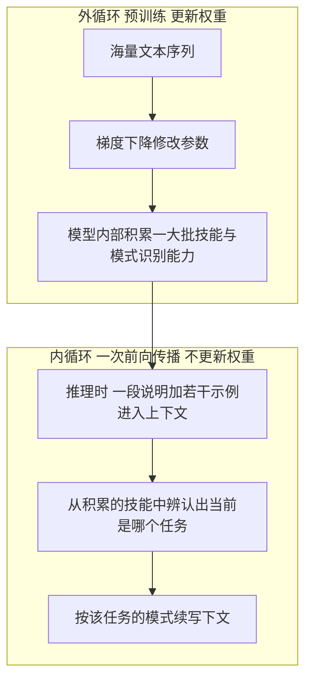
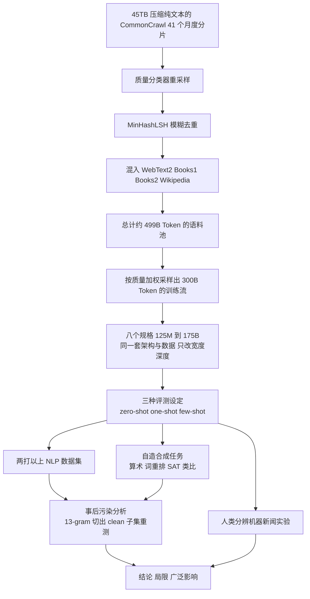
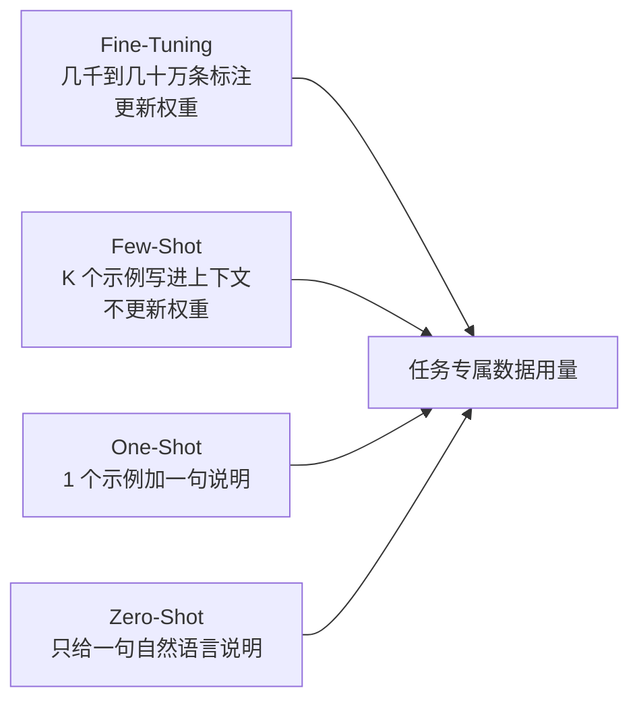
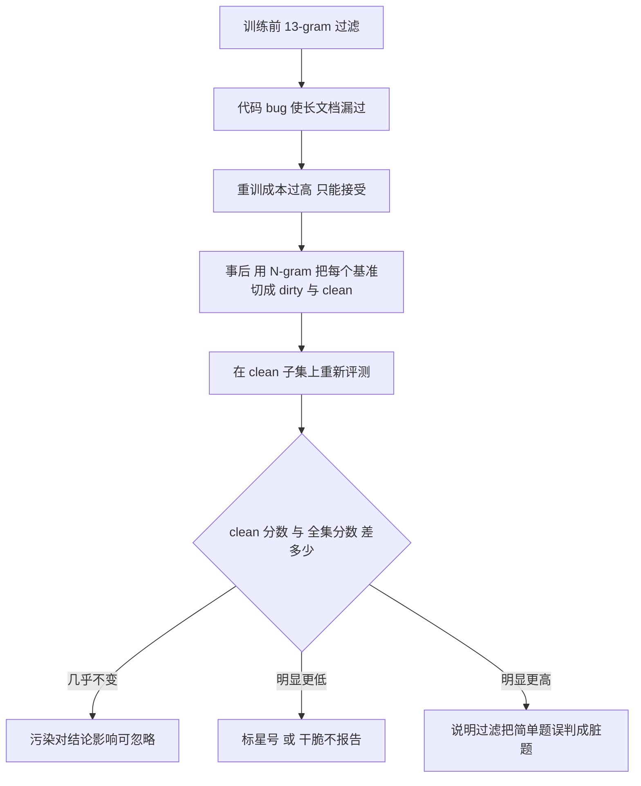

# GPT-3：175B 参数买到的不是榜首，而是一个不用再微调的任务接口

<!-- release-date: 2020-06-11 -->

> 本文依据 OpenAI 发布的 **Language Models are Few-Shot Learners**，即 arXiv:2005.14165v4、2020-07-22 提交的修订版，共 75 页。已核对 arXiv 官方页面的投稿历史，v4 是当前最新版本，本地 PDF 与它一致（首页水印为 `arXiv:2005.14165v4 [cs.CL] 22 Jul 2020`）。页码均指 PDF 本身的页码。文中会明确区分「报告写了什么」「我们怎么解释它」和「外部资料补充」。
>
> 这是一份 2020 年的材料。本文只讲这份材料当年写了什么，不用今天的现状去补写或更正它；确有必要跨代际对照的地方，单独放在「论文之后发生了什么」一节，并标出外部证据。

## 读前十分钟：先把六个词说成人话

这篇论文的术语密度不高，但每一个都会贯穿全文。先把它们说清楚：

- **语言模型（Language Model，LM）**：一个只会做一件事的模型，即给定前面的文字，预测下一个词的概率。GPT 系列都是**自回归**的，也就是从左到右一个词接一个词地往下写。
- **Token（词元）**：模型看到的最小单位。它不是汉字也不是英文单词，而是一段被切分算法切出来的字节片段。这篇论文沿用 GPT-2 的字节级 BPE 切分，平均约 0.7 个英文单词一个 Token（PDF p. 24）。
- **上下文窗口（context window）**：模型一次能看到的 Token 上限。GPT-3 全系列都是 $n_{ctx}=2048$（PDF p. 8）。这个数字后面会反复出现，因为它同时限制了「能塞几个示例」。
- **微调（Fine-Tuning，FT）**：2020 年的主流做法。先预训练一个通用模型，再针对每个下游任务，用几千到几十万条标注数据继续训练、更新权重（PDF p. 6）。
- **元学习与上下文学习（meta-learning / in-context learning）**：论文自己造的一对说法。元学习指模型在**预训练时**学到一大批技能和模式识别能力；上下文学习指它在**推理时**，仅凭输入里的一段说明或几个例子，就调用出其中某项技能。关键是：上下文学习发生在一次前向传播里，**不做任何梯度更新**（PDF p. 3–4）。
- **零样本 / 单样本 / 少样本（zero-shot / one-shot / few-shot）**：上下文里分别给 0 个、1 个、K 个示例。论文把它们当作三种**问题设定**，而不是三种竞争方案（PDF p. 6–7）。

一句提醒：论文脚注专门声明，「元学习」这个词在这里只描述内外双层循环的结构，**不预设**模型到底是在推理时从零学会了新任务，还是只是认出了训练时见过的任务。这个悬而未决的问题会在限制一节被再次提起（PDF p. 4 脚注 1、p. 34）。

## 一句话先说清

GPT-3 论文的贡献不是「我们做了一个 175B 的模型」，而是：

> **它把「换一个任务就得再微调一遍」，换成了「在提示里多写几个例子」，并且用八个规格的对照实验证明，这个替代方案的可用性随规模显著上升。**

今天所有人默认的用法——写一段 prompt，塞几个示例，模型就会做一个它没被专门训练过的任务——在这篇论文之前并不是共识。当时的范式是：每个下游任务准备一份标注数据集，微调出一个专用权重。

论文做的事情可以拆成四步：

1. 先论证微调范式有三个具体问题，而不是笼统地说它「不够优雅」；
2. 给出替代方案：把任务说明和示例写进输入，一次前向传播完成，权重不动；
3. 训练从 125M 到 175B 的八个模型，在两打以上数据集上量出这个方案随规模怎么变；
4. 坦白它在哪里仍然失败，以及自己的实验有哪些无法排除的干扰。

第四步的篇幅之大，是这篇论文比同期材料更值得读的原因。75 页里，附录占了 33 页，其中最有方法学价值的两块——数据污染研究和人类识别机器生成新闻的实验——都在附录里。

### 一条阅读路线

如果只有半小时读原文，建议按这个顺序：

1. **p. 3 的三段论**，弄清微调范式被指控的到底是哪三件事；
2. **p. 6–7 的四种设定**，把 zero / one / few-shot 的定义钉住；
3. **p. 8 的表 2.1** 与 **p. 9 的表 2.2**，八个规格与数据配比，全文所有曲线的横轴都在这两张表里；
4. **p. 5 的图 1.3** 与 **p. 4 的图 1.2**，两条主曲线，一条讲聚合趋势，一条讲单任务的学习速度；
5. **p. 31–33 的污染分析**，方法学价值最高的一段；
6. **p. 33–34 的限制**，论文自己划的边界。

正文的第 3 节（p. 10–32）是二十多页的成绩表，第一遍可以只看每小节最后一段的归纳。

### 元学习的内外双层循环

论文用一张图（图 1.1，PDF p. 3）解释「预训练学技能、推理时调用技能」这个结构。它的关键是两层循环嵌在一起：



按论文图 1.1 与 p. 3–4 的文字重画。**外循环是训练，内循环是推理**；上下文学习指的就是内循环，它整个发生在一次前向传播里，权重不动。

论文对这张图特意加了两条免责：图里的序列**不代表真实预训练数据长什么样**，只是为了说明同一条序列内部有时会嵌着重复出现的子任务（PDF p. 3）；而「元学习」这个词**不预设**内循环到底是学会还是认出（PDF p. 4 脚注 1）。

## 先看全景：一张图串起整篇论文



图中每一步的依据分别在 PDF p. 8–9、p. 43、p. 8、p. 9、p. 10、p. 25–27、p. 29–33。这是我们按论文叙事重画的流程示意，不是论文原图。

值得先记住的一个数字对：语料池里可用的 Token 大约 499B，但实际只训练了 **300B Token**（PDF p. 9）。也就是说，最大的模型连自己的数据集都没看完一遍。这在当时是刻意的选择，理由来自 Kaplan 等人的 scaling law：在给定算力下，把参数做大比把数据看完更划算（PDF p. 9 图 2.2 注）。这个判断后来被修正，详见文末的外部补充。

## 主要矛盾：微调范式到底卡在哪三处

论文没有从「我们要做大模型」开场，而是先花一整页论证旧范式的具体问题。这三条值得逐条看，因为后面每个设计都在回应其中之一（PDF p. 3）。

### 问题一：每个新任务都要重新攒一份标注数据

微调要「几千到几十万条」特定任务的标注样本（PDF p. 3、p. 6）。可用的语言任务范围极广——改语法、给一个抽象概念举例、点评一篇短篇小说——其中很多任务根本收不到大规模监督数据，而且每来一个新任务就要重来一次。

这是成本问题，也是可达性问题：有些任务不是钱不够，是根本没有现成的标注体系。

### 问题二：微调带来的泛化可能是假的

这一条最容易被略过，但它是全文的技术支点。论文的论证是：**模型越有表达力、微调分布越窄，利用训练数据里虚假相关性的空间就越大**（PDF p. 3）。

预训练把模型做得很大，是为了在广分布上吸收信息；微调却把它按在一个很窄的任务分布上。结果是，模型可能学会了这个数据集的统计捷径，而不是这个任务本身。论文引用的证据是：更大的模型并不必然在分布外泛化得更好，微调模型在基准上「名义达到人类水平」时，可能夸大了它在底层任务上的真实能力（PDF p. 3）。

所以「不微调」不只是省事，它还去掉了一个系统性的度量偏差来源。

### 问题三：这不是人类学习语言任务的方式

人接一个新任务，通常只需要一句自然语言指令（「告诉我这句话是高兴还是难过」），或者极少量演示（「这是两个勇敢的例子，请再给一个」）（PDF p. 3）。人还能在一段对话中途插进去做一次加法，然后无缝切回来。

论文明说这不只是哲学偏好：这种流动性有实际好处，让一个系统能在多任务之间自由切换，而不是每个任务一个权重文件（PDF p. 4）。

### 为什么当时没人这么做

因为已有的尝试效果太差。论文直接点名 GPT-2：在 Natural Questions 上只有 4%，CoQA 的 55 F1 比当时的最好成绩落后 35 分以上（PDF p. 4）。结论是「元学习显然还需要大幅改进才能成为实用方法」。

于是论文提出一个假设并去验证它：既然上下文学习需要把大量技能装进参数里，而模型容量正在从 1 亿、3 亿、15 亿、80 亿、110 亿一路涨到 170 亿（PDF p. 4），那么上下文学习的能力，会不会也随规模一起涨？

**这就是全文的主要矛盾**：不是「怎么把模型做大」，而是「上下文学习这个当时明显不够用的替代方案，能不能靠规模变得够用」。

## 核心设计一：把三种设定的定义钉死

要回答上面的问题，第一步是把「几个例子」这件事定义清楚。论文列了四个点，它们排在同一条谱系上，区别只在于用了多少任务专属数据（PDF p. 6–7）。



按论文的图 2.1 重画（PDF p. 7）。横轴是「用了多少任务专属数据」，从左到右递减；这是四种问题设定的对比，不是四条并列流水线。

### 少样本（FS）

给 K 组「上下文 + 期望输出」，再给一组只有上下文的，让模型补完。K 通常取 10 到 100，上限来自 $n_{ctx}=2048$（PDF p. 6）。

它的好处是大幅减少任务数据需求，并且不会从一个大而窄的微调集里学到过窄的分布。它的坏处论文写得同样直白：**到当时为止，这类方法的结果比最好的微调模型差很多**；而且它仍然需要少量任务数据（PDF p. 6）。

### 单样本（1S）

只给一个示例，外加一句任务说明。为什么要把它单列成一档，而不是当作 K=1 的少样本？论文的理由很实际：**这最接近人给人交代任务的方式**。比如在众包平台上发任务，惯例就是给一个示例（PDF p. 6）。

### 零样本（0S）

只给一句自然语言指令。论文说它「最方便、最有可能鲁棒、最能避开虚假相关」，但也是**最难**的设定，而且在某些情况下「不公平地难」——比如让人「做一张 200 米短跑世界纪录表」，不给示例的话，连人类都不确定表格该长什么样（PDF p. 7）。

### 论文自己的立场

这一段很关键，也最容易被后来的二手转述扭曲：论文说，比较这三种设定**不是**为了评出谁更好，而是把它们当作在「基准分数」和「样本效率」之间取不同折中的三个问题设定（PDF p. 7）。它特别强调少样本结果，因为其中很多只比微调 SOTA 差一点；但它也说，单样本甚至零样本，才是与人类表现最公平的对照（PDF p. 7）。

还有一句常被忽略的自我限制：**GPT-3 原则上也可以微调，论文只是没做，留给未来工作**（PDF p. 6）。所以这篇论文从来没有主张微调是错的。

### 可迁移启发

这一节最值得借走的不是三个名字，而是**先把评测协议定义死，再去堆规模**。如果「几个例子」的含义在不同任务里飘忽不定，后面那八个规格的对照曲线就没有意义。任何想做能力—规模关系研究的项目，第一件事都应该是把「输入里允许出现什么」写成规范。

## 核心设计二：八个规格是怎么排出来的

论文训练了八个模型，跨三个数量级。这是全文最重要的一张表（PDF p. 8，表 2.1）。

| 模型 | 参数量 | 层数 $n_{layers}$ | 宽度 $d_{model}$ | 头数 $n_{heads}$ | 每头维度 $d_{head}$ | Batch Size | 学习率 |
|---|---:|---:|---:|---:|---:|---:|---:|
| GPT-3 Small | 125M | 12 | 768 | 12 | 64 | 0.5M | $6.0\times10^{-4}$ |
| GPT-3 Medium | 350M | 24 | 1024 | 16 | 64 | 0.5M | $3.0\times10^{-4}$ |
| GPT-3 Large | 760M | 24 | 1536 | 16 | 96 | 0.5M | $2.5\times10^{-4}$ |
| GPT-3 XL | 1.3B | 24 | 2048 | 24 | 128 | 1M | $2.0\times10^{-4}$ |
| GPT-3 2.7B | 2.7B | 32 | 2560 | 32 | 80 | 1M | $1.6\times10^{-4}$ |
| GPT-3 6.7B | 6.7B | 32 | 4096 | 32 | 128 | 2M | $1.2\times10^{-4}$ |
| GPT-3 13B | 13.0B | 40 | 5140 | 40 | 128 | 2M | $1.0\times10^{-4}$ |
| GPT-3 175B | 175.0B | 96 | 12288 | 96 | 128 | 3.2M | $0.6\times10^{-4}$ |

八个模型**全部训练 300B Token**（PDF p. 8）。Batch Size 的单位是 Token，不是样本条数。

### 架构本身几乎没有新东西

论文说得很干脆：模型和架构与 GPT-2 相同，包括改过的初始化、前置归一化和可逆切分；**唯一的例外**是在 Transformer 各层里交替使用密集注意力和局部带状稀疏注意力，做法参考 Sparse Transformer（PDF p. 8）。

这值得特别指出：一篇改变了整个领域使用方式的论文，架构贡献接近于零。它把全部预算押在规模、数据和评测方法上。

### 超参不是调出来的，是排布出来的

论文明说，各规格的精确架构参数是**按计算效率和模型在 GPU 上排布的负载均衡**来选的，而不是逐个调优出来的；依据是 scaling law 的一个结论——验证损失在一个相当宽的范围内对这些参数不敏感（PDF p. 8）。前馈层固定为 $d_{ff}=4\,d_{model}$（PDF p. 8）。

这条经验今天仍然成立，也常被误用：它说的是「在合理范围内，宽深比不敏感」，不是「随便填都行」。

### 表里有一处对不上，需要读者自己发现

GPT-3 13B 那一行写的是 $d_{model}=5140$，头数 40，每头 128 维（PDF p. 8）。但 $40\times128=5120$，不是 5140。同一行的其他规格都严格满足 $n_{heads}\times d_{head}=d_{model}$（例如 175B 的 $96\times128=12288$）。

这是**我们的观察，不是论文的说明**：论文没有解释这个差异，最可能是排版笔误，正确值应为 5120。之所以点出来，是因为它正好说明为什么不能只信抽取出来的文本——必须回到原页面核对，再用模型自身的约束关系交叉验证。

### 还有一处命名残留

论文正文与表 2.1 通篇写 175B，但有两处写的是 200B：一处在评测方法里说「我们只提交 200B 的少样本结果」（PDF p. 10），另一处在附录 E 列出参与人类实验的模型规格时写「125M、350M、760M、1.3B、2.7B、6.7B、13.0B 和 200B（GPT-3）」（PDF p. 46）。附录 D 的算力表则明确写 174,600M 参数（PDF p. 46）。

我们的判断是：这两处指的是同一个最大模型，200B 是早期口径的残留。论文没有对此作任何说明，所以只能标为观察，不能当作存在第九个模型的证据。

## 核心设计三：数据是怎么造出来的

模型架构没什么可说，数据部分反而写得细。论文列了三步（PDF p. 8）。

### 第一步：用分类器给 CommonCrawl 重新采样

原始素材是 41 个月度 CommonCrawl 分片，覆盖 2016 至 2019 年，过滤前 45TB 压缩纯文本，过滤后 570GB，大约相当于 400B 个 BPE Token（PDF p. 8）。

过滤方法在附录 A（PDF p. 43）：把原始 WebText 当作高质量文档的代理，训练一个逻辑回归分类器区分「高质量」和「原始 CommonCrawl」；特征来自 Spark 的标准切分器和 HashingTF；正例是 WebText、Wikipedia 和自建的网络图书语料，负例是未过滤的 CommonCrawl。

关键在保留规则不是「分数高于阈值就留」，而是带随机性的：

$$
X > 1 - s,\qquad X\sim\mathrm{Pareto}(\alpha),\ \alpha=9
$$

其中 $s$ 是分类器给这篇文档打的质量分，$X$ 是从形状参数 $\alpha=9$ 的帕累托分布里抽的一个随机数。$\alpha$ 取 9 的目的，是让大部分被保留的文档来自分类器打分高的那一端，**同时仍然放进一些分布外的文档**；这个 $\alpha$ 是照着分类器在 WebText 上的分数分布挑的（PDF p. 43）。

为什么不做硬阈值？因为硬阈值等于让分类器的偏好完全决定语料构成。带随机性的接受规则保留了尾部多样性。论文说这样重新加权提升了质量，衡量方式是在一批分布外生成文本样本上的损失（PDF p. 43）。

### 第二步：文档级模糊去重

用 Spark 的 MinHashLSH 实现，10 个哈希，特征与上面的分类器相同；在每个数据集内部去重，同时把 WebText 从 CommonCrawl 里模糊地删掉。整体数据量平均减少约 10%（PDF p. 43）。

去重的动机论文写了两条：防止过拟合（随容量增大越来越重要），以及**保住留出验证集的有效性**——如果验证集内容在训练集里重复出现，验证损失就不再是过拟合的度量（PDF p. 8）。

### 第三步：混入高质量语料，并且不按大小采样

最终配比是（PDF p. 9，表 2.2）：

| 数据集 | Token 量 | 训练混合权重 | 训练 300B Token 时经历的轮数 |
|---|---:|---:|---:|
| Common Crawl（过滤后） | 410B | 60% | 0.44 |
| WebText2 | 19B | 22% | 2.9 |
| Books1 | 12B | 8% | 1.9 |
| Books2 | 55B | 8% | 0.43 |
| Wikipedia | 3B | 3% | 3.4 |

这张表里最有信息量的是最后一列。采样权重**故意不与数据集大小成正比**：CommonCrawl 占了语料池的八成以上，却只拿到 60% 的权重，一轮都没走完；Wikipedia 只有 3B Token，却被过了 3.4 遍（PDF p. 9）。

论文对这个取舍的说法很坦率：**这本质上是接受一点点过拟合，换取更高的训练数据质量**（PDF p. 8）。

顺带一个容易漏的数字：附录 C 提到，即便语料池里有 410B Token 的过滤后 CommonCrawl，实际训练时也只用到其中约 40% 的文档（PDF p. 44）。这与表 2.2 的 0.44 轮是一致的。

### 语言构成与一个致命的坦白

训练数据按词数计仍以英语为主，占 93%，其余 7% 是其他语言（PDF p. 14）。论文说这些语言在补充材料里有记录，但补充材料不在这份 PDF 里。

真正重要的是紧接在表 2.2 后面那一段：为了减少污染，团队搜索并试图移除训练数据中与所有基准测试的开发集、测试集重叠的内容，**但过滤代码里有一个 bug，导致部分重叠被忽略了；由于训练成本太高，重训不可行**（PDF p. 9）。

这句话决定了第 4 节整整五页的存在。把它放在数据一节的末尾，而不是藏在附录里，是这篇论文可信度的重要来源。

## 训练过程：报告写了什么，没写什么

写了的部分集中在正文一段和附录 B（PDF p. 9、p. 43）：

- 批量大小用**梯度噪声尺度**在训练中实测来指导，而不是拍脑袋定（PDF p. 9）；
- 并行方式是矩阵乘内部的模型并行，加上跨层的模型并行；模型沿深度和宽度两个维度切分到 GPU 上，目的是减少跨节点数据传输（PDF p. 8–9）；
- 硬件是 V100 GPU，运行在**微软提供**的一个高带宽集群的一部分上（PDF p. 9）；
- 优化器是 Adam，$\beta_1=0.9$、$\beta_2=0.95$、$\epsilon=10^{-8}$；全局梯度范数裁剪到 1.0；权重衰减 0.1（PDF p. 43）；
- 学习率在前 375M Token 内线性预热，然后余弦衰减；在 260B Token 处衰减到峰值的 10%，之后就一直保持这个 10% 继续训练（PDF p. 43）；
- 批量大小从 32k Token 线性涨到目标值，涨完用掉前 4B 到 12B Token，具体看模型大小（PDF p. 43）；
- 训练时**不放回采样**，直到走完一个 epoch 边界，目的是减少过拟合（PDF p. 43）；
- 每条训练序列都填满 2048 个 Token：短文档会被打包进同一条序列，文档之间用一个特殊的 end-of-text Token 分隔，**不做任何特殊的注意力屏蔽**（PDF p. 43）。

最后一条值得停一下。今天很多训练框架默认做样本级注意力掩码，防止打包在一起的不同文档互相看见。GPT-3 明确选择不做，理由是分隔符本身已经给了模型「前后无关」的信息，这样可以免掉专门的掩码逻辑，训练更高效（PDF p. 43）。这是一个**当年的工程取舍**，不是普遍正确的做法；把它抄到今天的长上下文训练里未必合适。

没写的部分同样要说清楚：论文**没有**给出 GPU 数量、训练墙钟时间、集群规模、并行度配置、故障恢复方案，也没有给出损失曲线的异常处理经验。它只给了一句「fully half-precision training 的显存优化由某位作者完成」这样的贡献者说明（PDF p. 42）。想从这篇论文复现训练过程，是不可能的。

## 算力：一个可以自己算的公式

附录 D 给出了图 2.2 那张柱状图背后的全部计算（PDF p. 46，表 D.1）。它把复杂问题化简成了一个可以口算的式子。

先说它要算什么：估算训练一个模型总共用了多少浮点运算。论文的简化假设是**忽略注意力运算**，因为对它分析的这些模型来说，注意力通常占不到总算力的 10%（PDF p. 46）。

$$
C \approx 6\,N\,D
$$

- $C$：训练总浮点运算数；
- $N$：参数量；
- $D$：训练 Token 数；
- 系数 6 的来源是：前向传播里，每个 Token 对每个激活参数做一次乘法和一次加法，即 2 FLOPs；反向传播再乘 3 倍，因为算参数梯度和算激活梯度各需要一次与前向相当的计算量（PDF p. 46 表注）。

代进最大的模型验证一下：$6\times 174.6\times10^{9}\times 300\times10^{9}=3.14\times10^{23}$ FLOPs，与表里的 3.14E+23 完全一致（PDF p. 46）。

论文的算力单位是 petaflop/s-day，定义为 $8.64\times10^{19}$ FLOPs，即一台每秒 1 PFLOP 的机器跑满一天（PDF p. 46）。于是：

$$
\frac{3.14\times10^{23}}{8.64\times10^{19}}\approx 3.64\times10^{3}
$$

几个横向对照（全部来自 PDF p. 46，表 D.1）：

| 模型 | 参数量 | 训练 Token | 训练算力（PF-days） |
|---|---:|---:|---:|
| BERT-Large | 355M | 250B | 6.16 |
| RoBERTa-Large | 355M | 2000B | 49.3 |
| T5-11B | 11,000M | 1000B | 382 |
| GPT-3 Small | 125M | 300B | 2.60 |
| GPT-3 13B | 12,850M | 300B | 268 |
| GPT-3 175B | 174,600M | 300B | 3640 |

图 2.2 的注解里点出了这张表真正想说的话：**GPT-3 3B 的参数量差不多是 RoBERTa-Large 的十倍，但两者预训练用掉的算力都在 50 PF-days 左右**（PDF p. 9）。原因是 GPT-3 系列只跑 300B Token，而 RoBERTa 跑了 2000B。

论文用这一点来支持自己的选择：把算力更多投在参数上而不是 Token 上。这是一个**在当时的 scaling law 认识下成立的判断**，后来被修正（见文末外部补充）。

### 可迁移启发

$C\approx 6ND$ 这个式子今天仍然是估算训练成本最快的心算工具。用它可以在写第一行训练代码之前就回答两个问题：给定预算能训多大的模型，以及把预算从参数挪到数据会怎样。注意它的适用边界：**它忽略注意力，所以在长上下文场景会明显低估**；对 MoE 这类稀疏模型，$N$ 要换成每 Token 的激活参数量（表 D.1 里那一列 `Frac of params active for each token` 就是干这个的，T5 因为是编码器—解码器结构填的是 0.5）。

## 评测方法：细节决定这些分数能不能比

这一节容易被跳过，但它决定了后面所有数字的含义（PDF p. 10）。

- **示例怎么抽**：从该任务的训练集中随机抽 K 条作为条件，示例之间用一到两个换行分隔，具体看任务。LAMBADA 和 StoryCloze 没有监督训练集，就从开发集抽示例、在测试集上评；原版 Winograd 只有一个数据集，就直接从它自身抽。
- **K 怎么定**：从 0 到上下文允许的最大值，通常能放 10 到 100 条。K 大通常更好但不总是，所以在有独立开发集时先在开发集上试几个值，再用最好的那个跑测试集。
- **多选题怎么打分**：给 K 条「上下文 + 正确补全」，再给一条只有上下文的，比较每个候选补全的似然。多数任务比的是**逐 Token 似然**（为长度归一化）；但在 ARC、OpenBookQA 和 RACE 上，改成除以候选补全的无条件概率更好：

$$
\mathrm{score}=\frac{P(\text{completion}\mid\text{context})}{P(\text{completion}\mid\text{answer context})}
$$

其中 answer context 是 `"Answer: "` 或 `"A: "` 这样一个通用前缀，作用是提示「接下来应该是个答案」，但不含任何题目信息（PDF p. 10）。这一步在校正「某些候选词本身就更常见」带来的偏差。

- **二分类怎么问**：把选项换成有语义的词（`True` / `False`），而不是 0 和 1，然后当成多选题做（PDF p. 10）。
- **自由生成怎么解码**：束搜索，束宽 4，长度惩罚 $\alpha=0.6$（PDF p. 10）。
- **测试集还是开发集**：公开测试集就报测试集；测试集私有时，因为模型太大放不进评测服务器，就报开发集。只有 SuperGLUE、TriviaQA、PIQA 三个成功提交了测试服务器，而且只提交了最大模型的少样本结果（PDF p. 10）。

最后这条限制很重要：**表格里同一列的数字，可能来自不同的划分**。附录 H 的总表专门给最大模型的测试服务器结果单列了一栏（PDF p. 63）。读这类论文时，先看清哪些分数是开发集分数，再谈可比性。

## 两条主曲线：规模到底带来了什么

### 曲线一：损失随算力平滑下降

图 3.1 把八个主模型加上另外六个更小的模型（最小仅 10 万参数）画在一起，横轴是训练算力（PF-days），纵轴是交叉熵验证损失，拟合出的幂律是（PDF p. 11）：

$$
L = 2.57\cdot C^{-0.048}
$$

其中 $C$ 是训练算力，单位 PF-days；这张图的算力和参数量都**排除了嵌入参数**（PDF p. 11）。论文的结论是：Kaplan 等人观察到的幂律在多外推两个数量级后仍然成立，只有很小的偏离（PDF p. 10–11）。

论文自己也留了个口子：在相关工作一节里，它说「图 3.1 里也许能看出曲线有轻微的弯曲」（PDF p. 39）。这是很克制的表述。

### 曲线二：三种设定的差距随规模拉大

图 1.3 把 42 个以准确率计分的基准聚合起来（PDF p. 5）。从图上读到的趋势是：从 0.1B 到 175B，零样本从约 22 分升到约 42 分；少样本从大致相同的起点升到约 58 分。三条线在小模型处几乎重合，在大模型处明显分开。

论文自己提醒这张图**不能当作严格或有意义的基准**（PDF p. 5）。它的价值在趋势而不在数值。这个趋势就是全文的核心证据：

> **零样本随规模稳步上升；少样本上升得更快。所以更大的模型不只是更懂语言，它更擅长从上下文里学。**

在引言里论文用另一种说法总结同一件事：零样本、单样本、少样本之间的差距常常随容量增大而扩大，暗示更大的模型是更好的元学习者（PDF p. 6）。

图 1.2 给了一个单任务的特写：在符号插入任务上，画出准确率随上下文示例数 K 的变化，175B 的曲线明显比 13B 和 1.3B 更陡；同时，加一句自然语言任务说明会把曲线整体抬高，而且对大模型帮助更大（PDF p. 4）。

「学习曲线更陡」这个说法值得咀嚼：它衡量的不是终点分数，而是**每多给一个例子能多赚多少**。这是把「上下文学习能力」变成可测量对象的关键一步。

## 结果分组：哪些赢了，怎么赢的

下面按论文的九个分组走一遍，重点放在「这个数字说明了什么」而不是罗列。

### 语言建模与完形填空

PTB 上零样本困惑度 20.5，把之前的 SOTA 35.8 拉低了 15 分（PDF p. 11，表 3.1）。论文特意说明为什么只测 PTB：GPT-2 测过的四个 Wikipedia 相关任务完全落在训练数据里，one-billion-word 基准也有很高比例被包含，**只有 PTB 因为年代早于现代互联网而幸免**（PDF p. 11）。

完形与补全类（PDF p. 12，表 3.2）：

| 设定 | LAMBADA 准确率 | LAMBADA 困惑度 | StoryCloze | HellaSwag |
|---|---:|---:|---:|---:|
| 此前 SOTA | 68.0 | 8.63 | 91.8 | 85.6 |
| 零样本 | 76.2 | 3.00 | 83.2 | 78.9 |
| 单样本 | 72.5 | 3.35 | 84.7 | 78.1 |
| 少样本 | 86.4 | 1.92 | 87.7 | 79.3 |

LAMBADA 这一行藏着这篇论文里最漂亮的一个技巧。这个任务要求补出句子的**最后一个词**，但普通语言模型不知道这条规则，于是会把概率分给各种合理的续写。以往的解法是用停用词过滤器硬堵（PDF p. 12）。

少样本设定提供了一个更自然的解法——用示例把任务**框**成填空题：

```text
Alice was friends with Bob. Alice went to visit her friend ____. → Bob
George bought some baseball equipment, a ball, a glove, and a ____. →
```

模型从示例里自己推断出「只要一个词」。这样少样本拿到 86.4%，比之前的 SOTA 高出 18 个百分点以上（PDF p. 12）。

但这个格式有个反直觉的副作用：**它在单样本下总是比零样本更差**（LAMBADA 单样本 72.5 低于零样本 76.2），而且会让最小的模型掉将近 20 个百分点（PDF p. 12）。论文的猜测是所有模型都需要好几个示例才能认出这个模式。

我们可以从中提炼一条更一般的经验：**提示格式的收益不是单调的**。一个能让大模型受益的格式，可能在示例不足或模型太小时反而制造混乱。换格式和换模型一样，需要在你自己的规模上重测。

论文还诚实标注了一句：污染分析发现 LAMBADA 有相当一部分出现在训练数据里，但第 4 节的分析表明影响可以忽略（PDF p. 13）。

### 闭卷问答

闭卷指不许检索外部文本，只靠参数里存的知识回答（PDF p. 13）。结果如下（PDF p. 13，表 3.3）：

| 设定 | NaturalQS | WebQS | TriviaQA |
|---|---:|---:|---:|
| RAG（微调 + 开卷检索） | 44.5 | 45.5 | 68.0 |
| T5-11B+SSM（微调，闭卷） | 36.6 | 44.7 | 60.5 |
| GPT-3 零样本 | 14.6 | 14.4 | 64.3 |
| GPT-3 单样本 | 23.0 | 25.3 | 68.0 |
| GPT-3 少样本 | 29.9 | 41.5 | 71.2 |

TriviaQA 的零样本 64.3 已经超过微调过的 T5-11B 14.2 分；单样本 68.0 追平了那个既微调又带 21M 文档、15.3B 参数稠密向量检索的开放域系统；少样本再高 3.2 分（PDF p. 13）。

三个数据集的差异更有意思。WebQS 从零样本 14.4 跳到少样本 41.5，涨了 27 分；TriviaQA 只涨了 6.9 分。论文的解释是 WebQS 的问题风格或答案风格对 GPT-3 是分布外的，示例帮它对齐了格式（PDF p. 13–14）。

**这是一个很有用的诊断视角**：如果一个任务从零样本到少样本涨得特别多，往往说明模型缺的是「知道你要什么」，不是「知道答案」；如果涨得少，说明瓶颈在知识或能力本身。

### 翻译

BLEU 分数如下（PDF p. 15，表 3.4）：

| 设定 | En→Fr | Fr→En | En→De | De→En | En→Ro | Ro→En |
|---|---:|---:|---:|---:|---:|---:|
| 有监督 SOTA | 45.6 | 35.0 | 41.2 | 40.2 | 38.5 | 39.9 |
| 此前最好的无监督 NMT | 37.5 | 34.9 | 29.8 | 35.2 | 35.2 | 33.1 |
| GPT-3 零样本 | 25.2 | 21.2 | 24.6 | 27.2 | 14.1 | 19.9 |
| GPT-3 单样本 | 28.3 | 33.7 | 26.2 | 30.4 | 20.6 | 38.6 |
| GPT-3 少样本 | 32.6 | 39.2 | 29.7 | 40.6 | 21.0 | 39.5 |

几个要点：

1. **零样本明显不如已有的无监督机器翻译**；只给一个示例就提升超过 7 BLEU，少样本再提升约 4 BLEU（PDF p. 16）。
2. 方向严重不对称：**翻进英语时显著超过此前的无监督工作，翻出英语时明显更差**（PDF p. 16）。这与训练数据 93% 是英语一致。
3. En→Ro 是个突出的异常，比此前的无监督工作差 10 BLEU 以上。论文给的猜测是**沿用 GPT-2 的字节级 BPE 切分器**——那个切分器是为几乎纯英语数据开发的（PDF p. 16）。
4. 论文对自己的胜利也保持怀疑：Fr→En 和 De→En 的少样本超过了它能找到的最好有监督结果，但论文说「由于我们不熟悉这块文献，而且这些基准看起来竞争性不强，我们不认为那些结果代表真正的 SOTA」（PDF p. 16）。

第 4 点很少被引用，但它是这篇论文的品格所在：**赢了也要说明这个胜利可能不算数**。

### Winograd 与常识推理

Winograd 类任务考代词指代（PDF p. 16，表 3.5）：原版 WSC273 上零样本 88.3、单样本 89.7、少样本 88.6，三者几乎没有差别，**看不出上下文学习的效果**；对抗构造的 Winogrande 上则有明显增益，70.2 / 73.2 / 77.7（PDF p. 17）。作为对照，微调的 RoBERTa 是 79%，SOTA 是 84.6%，人类是 94.0%（PDF p. 17）。

常识推理三个数据集（PDF p. 17，表 3.6）：PIQA 零/单/少样本 80.5 / 80.5 / 82.8，超过此前 79.4 的微调 SOTA；ARC-Easy 68.8 / 71.2 / 70.1；ARC-Challenge 51.4 / 53.2 / 51.5；OpenBookQA 57.6 / 58.8 / 65.4。

这里要提醒一处：PIQA 的零样本值在表 3.6 里是 80.5，但同页正文和附录 H 的总表都写 81.0（PDF p. 17、p. 63）。这是**我们的观察**，论文没有说明。引用这个数字时最好注明取自哪一处。

论文对这一组的总结是「结果参差」：PIQA 和 ARC 在单样本、少样本下只有很小且不一致的增益，OpenBookQA 则有明显提升（PDF p. 18）。PIQA 和 Winograd 的结果都被打了星号，因为污染分析发现了问题，详见后文。

### 阅读理解

这一组的散布是全文最大的（PDF p. 18，表 3.7）：

| 设定 | CoQA | DROP | QuAC | SQuADv2 | RACE-h | RACE-m |
|---|---:|---:|---:|---:|---:|---:|
| 微调 SOTA | 90.7 | 89.1 | 74.4 | 93.0 | 90.0 | 93.1 |
| 零样本 | 81.5 | 23.6 | 41.5 | 59.5 | 45.5 | 58.4 |
| 单样本 | 84.0 | 34.3 | 43.3 | 65.4 | 45.9 | 57.4 |
| 少样本 | 85.0 | 36.5 | 44.3 | 69.8 | 46.8 | 58.1 |

同一个模型，在自由形式的对话式问答 CoQA 上离人类基线只差 3 分，在需要离散推理和数值计算的 DROP 上只有 36.5，在结构化对话行为的 QuAC 上比一个 ELMo 基线还低 13 F1（PDF p. 18）。

论文自己的归纳是：这暗示模型在**不同答案格式**上的能力差异很大（PDF p. 18）。这条观察在今天仍然适用——评测一个模型「会不会阅读理解」，要看你指的是哪种答案形态。

### SuperGLUE

这是与 BERT、RoBERTa 系统对比的标准套件（PDF p. 19，表 3.8）：

| 系统 | 平均分 | BoolQ | CB 准确率 | COPA | RTE | WiC | WSC | MultiRC F1a | ReCoRD F1 |
|---|---:|---:|---:|---:|---:|---:|---:|---:|---:|
| 微调 SOTA | 89.0 | 91.0 | 96.9 | 94.8 | 92.5 | 76.1 | 93.8 | 88.2 | 93.3 |
| 微调 BERT-Large | 69.0 | 77.4 | 83.6 | 70.6 | 71.7 | 69.6 | 64.6 | 70.0 | 72.0 |
| GPT-3 少样本 | 71.8 | 76.4 | 75.6 | 92.0 | 69.0 | 49.4 | 80.1 | 75.4 | 91.1 |

少样本这一行的 K 全部取 32；对 8 个任务合起来就是 256 个示例（PDF p. 18、p. 20）。

最有冲击力的对比在图 3.8 的注解里：作为参照的 BERT-Large 是在 SuperGLUE 的 125K 条训练样本上微调的，BERT++ 更是先在 MultiNLI 的 392K 条和 SWAG 的 113K 条上训练，总共用掉 630K 条微调样本（PDF p. 20）。而论文扫描 K 值时发现，**GPT-3 每个任务用不到 8 个示例，总分就能超过微调的 BERT-Large**（PDF p. 20）。

这个对比是全文最有说服力的一条论据：**十几万条标注 对 几十个示例**。注意别把两个基线混起来——被超过的是用 125K 条微调的 BERT-Large；630K 是更强的 BERT++ 用掉的量，图 3.8 里 GPT-3 是在示例数增加时逐步逼近它的（PDF p. 20）。

同时 WiC 只有 49.4，就是随机水平（PDF p. 20）。论文说试了很多种措辞和表述，没有一种能让它变好，并由此提炼出一条判断：GPT-3 在少样本或单样本下，**对「需要比较两段文字」的任务普遍很弱**——一个词在两句话里是不是同一个意思（WiC）、一句话是不是另一句的复述、一句话是否蕴含另一句（RTE、CB）（PDF p. 20）。

### 自然语言推理

RTE 上只有最大的模型明显好于随机（56%）（PDF p. 21）。ANLI 上，所有比 175B 小的模型在三轮里都几乎正好是随机水平（约 33%），175B 只在第三轮显出一点起色（PDF p. 21）。论文提醒 ANLI R3 的开发集只有 1500 条，方差很大，估计标准差 1.2%（PDF p. 21）。

论文的结论毫不掩饰：**NLI 对语言模型来说仍然非常难，才刚开始出现进展的迹象**（PDF p. 21）。

### 自造的合成任务

这一组是论文为了专门测「临场学习」而发明的，因为这些任务几乎不可能原样出现在训练数据里（PDF p. 21）。

**算术**：十种题型，每种生成 2000 道随机题，必须精确输出正确答案（PDF p. 22）。175B 的成绩（PDF p. 23，表 3.9）：

| 设定 | 2D+ | 2D- | 3D+ | 3D- | 4D+ | 4D- | 5D+ | 5D- | 2 位乘法 | 一位复合 |
|---|---:|---:|---:|---:|---:|---:|---:|---:|---:|---:|
| 零样本 | 76.9 | 58.0 | 34.2 | 48.3 | 4.0 | 7.5 | 0.7 | 0.8 | 19.8 | 9.8 |
| 单样本 | 99.6 | 86.4 | 65.5 | 78.7 | 14.0 | 14.0 | 3.5 | 3.8 | 27.4 | 14.3 |
| 少样本 | 100.0 | 98.9 | 80.4 | 94.2 | 25.5 | 26.8 | 9.3 | 9.9 | 29.2 | 21.3 |

规模的作用在这里最刺眼：**13B 模型只能对一半的两位加减法，其他运算的正确率都低于 10%**（PDF p. 22）。从 13B 到 175B 不是渐变，是跳变（图 3.10，PDF p. 22）。

论文做了一次抽查来排除记忆：在训练数据里搜 `"<NUM1> + <NUM2> ="` 和 `"<NUM1> plus <NUM2>"` 两种形式的三位数算式，2000 道加法里只找到 17 处（0.8%），2000 道减法里只找到 2 处（0.1%）（PDF p. 23）。另外，检查错误答案发现模型常犯的是**没有进位**这类错误，说明它确实在做计算而不是查表（PDF p. 23）。

这个抽查方法本身值得学：**当你怀疑一个能力来自记忆时，除了统计重叠，还要看错误的形状**。查表出错和算错的错误分布不一样。

**字符操作**：五种任务，每种 10,000 个例子，取长度 4 到 15 个字符的最高频词，K=100（PDF p. 23–24）。175B 的成绩（PDF p. 23，表 3.10）：

| 设定 | 循环字母 CL | 首尾外全乱 A1 | 首尾两位外全乱 A2 | 随机插入符号 RI | 反写单词 RW |
|---|---:|---:|---:|---:|---:|
| 零样本 | 3.66 | 2.28 | 8.91 | 8.26 | 0.09 |
| 单样本 | 21.7 | 8.62 | 25.9 | 45.4 | 0.48 |
| 少样本 | 37.9 | 15.1 | 39.7 | 67.2 | 0.44 |

零样本几乎全线失败、少样本大幅上升，这个形状本身就是论证：**模型确实是在测试时学会了这些任务**，因为它零样本做不了，而这些任务的人造性质使它们不太可能在预训练数据里出现（论文补了一句「尽管我们无法完全确认这一点」）（PDF p. 24）。

还有一层容易忽略的难度：BPE 切分平均把约 0.7 个单词打包成一个 Token，所以做字符级操作意味着模型必须**拆开 Token 的内部结构**，而不只是搬运 Token（PDF p. 24）。而且 CL、A1、A2 不是双射的——被打乱的词可能对应多个还原结果，模型得做搜索（PDF p. 24）。

**反写单词全线失败**：所有模型都做不了（PDF p. 24）。这是全文最干净的「规模不解决问题」样本，后面会专门讨论。

**SAT 类比**：374 道 2005 年前 SAT 考过的词汇类比题。少样本 65.2%、单样本 59.1%、零样本 53.7%；作为对照，美国大学申请者的平均分是 57%，随机猜是 20%（PDF p. 24）。

**用新造的词造句**：给一个不存在的词的定义，让模型造句。论文展示了 6 个例子，全部一次生成、没有挑选或重试，结果都是正确或至少合理的用法；模型甚至给 `screeg` 造出了合理的过去式 `screeghed`（PDF p. 29，图 3.16）。

**改英语语法**：也是少样本，给一条人写的修改示例，再让它改 5 条（PDF p. 30，图 3.17）。这个图的注解里有一句很难得的自我批评：论文指出「好英语」和「差英语」的区分本身是复杂、语境相关且有争议的，而且模型在其中一个例子里不只改了语法，还删掉了 `cheap` 这个词，**改变了原意**（PDF p. 30）。

## 单独一节：哪些东西不随规模变好

这一节比「变好了」更有信息量。附录 H 的总表（PDF p. 63，表 H.1）给了全部八个规格 × 三种设定的分数，可以直接读出几类失败形态。

### 形态一：整条曲线是平的

ANLI 第一轮的少样本准确率，从 Small 到 175B 依次是 32.1、32.5、30.9、32.5、33.5、33.1、33.3、36.8（PDF p. 63）。三分类任务的随机水平是 33.3%。也就是说，**七个模型在噪声里，最大的那个才刚离开随机**。

第二轮更极端：少样本从 Small 的 35.7 一路到 175B 的 34.0——**最大的模型比最小的模型还低**（PDF p. 63）。

### 形态二：任务几乎完全没解决

反写单词的少样本准确率：0.00、0.05、0.00、0.17、0.24、0.30、0.42、0.44（PDF p. 63）。三个数量级的规模增长换来的是从 0% 到 0.44%。

论文在正文里的说法是「没有任何模型能把一个词里的字母反过来」（PDF p. 24）。这不是「还需要更大的模型」，这更像是**这个能力与自回归 + BPE 的组合结构性不兼容**：反写要求先看到整个词，再从后往前输出，而模型是从左到右生成的。

### 形态三：非单调，大模型反而更差

BoolQ 的零样本从 Small 到 175B 是 49.7、60.3、58.9、62.4、67.1、65.4、66.2、60.5（PDF p. 63）。175B 的 60.5 低于 2.7B 的 67.1。

Winograd 的少样本是 63.4、67.4、73.6、76.9、84.3、85.4、82.4、88.6（PDF p. 63）。13B 那一档明显下陷。

这类曲线提醒我们：**「随规模平滑提升」是对聚合曲线的描述，不是对每个任务的承诺**。论文在正文里也只说「对大多数任务，三种设定下都能观察到相对平滑的规模变化」（PDF p. 6），措辞里留了余地。

### 形态四：格式本身把小模型打崩

前面提过的 LAMBADA 填空格式，会让最小的模型掉将近 20 个百分点（PDF p. 12）。附录 H 里 LAMBADA 单样本困惑度的一栏，Small 是 165.0，而它的零样本困惑度只有 18.6（PDF p. 63）。

### 我们的判断

把这四种形态放在一起看，可以得到一条比论文本身更明确的读法：**GPT-3 的证据支持「上下文学习能力随规模上升」，但不支持「规模能解决所有任务」**。论文自己在引言里就说，展示这些失败正是为了「让大家注意到最需要进展的地方」（PDF p. 5）。

## 附录里被低估的一件事：论文把提示本身当成可复现材料

75 页里有 20 页专门用来放三样东西，值得单独说，因为它们体现了一个当时并不普遍的意识：**提示的措辞是实验条件的一部分，必须公开**。

- **附录 G「任务措辞与规范的细节」（PDF p. 50–62）**：13 页，逐个任务展示实际使用的输入格式和措辞，用 `Context →` 与 `Correct Answer →` 的形式排版。论文明说这里的数据全部来自各数据集的真实标注，**不含任何 GPT-3 的生成结果**（PDF p. 50）。RACE、ANLI、PIQA、ARC、HellaSwag、StoryCloze、SQuAD、QuAC、ReCoRD、CoQA、NaturalQS、翻译、算术等都各有一页左右。
- **附录 F「GPT-3 的更多样本」（PDF p. 48–49）**：展示四条未经挑选的样本——让模型以华莱士·史蒂文斯的风格，写一首题为 `Shadows on the Way` 的诗。论文交代了完整流程：先试了几个提示，然后一次性生成四条，**不做任何编辑或挑选**；采样温度 1，核采样 $P=0.9$；当模型开始写新的标题和作者行、或转成散文评论时截断（PDF p. 48）。看图 F.1 的上下文会发现，这个「创作」演示本身就是一个少样本提示：先放两首别人的诗作为示例，再给出一行标题加作者，让模型接着写（PDF p. 49）。
- **附录 H「所有模型规格在所有任务上的结果」（PDF p. 63–67）**：表 H.1 一张大表，把八个规格 × 三种设定 × 所有任务的分数全部列出，并单列一栏最大模型的测试服务器成绩；图 H.1 到 H.11 分布在 p. 64–67，按任务族画出各自的规模曲线。

为什么这三样重要？因为**没有它们，「少样本 71.8」这个数字是不可复核的**。同一个任务换一种措辞，分数可能差很多——论文自己在 WiC 上就说试了多种措辞都没能提上去（PDF p. 20）。把措辞写进附录，等于承认它是变量而不是实现细节。

这也是可以直接搬走的做法：**任何用提示驱动的评测，都应该把提示原文、截断规则、采样参数和是否挑选过样本一起公开**。少了任何一条，别人拿到的就不是同一个实验。

## 数据污染：一整套方法学，以及一个诚实的 bug

第 4 节加附录 C 一共约七页，是这篇论文对整个领域最有方法学价值的部分。

### 为什么必须做

训练数据来自互联网，基准测试的题目也在互联网上。模型有能力记住海量内容。所以「模型考了高分」和「模型见过考题」在原则上无法区分（PDF p. 29）。

论文提到这不是假想：最早在 CommonCrawl 上训练语言模型的工作之一，就发现并删除了一个与评测集重叠的训练文档；GPT-2 也做过事后重叠分析，结论比较乐观——模型在重叠数据上确实表现更好，但由于污染比例小（通常只有百分之几），对结果影响不大（PDF p. 29–31）。

GPT-3 的处境不同：数据和模型都比 GPT-2 大约两个数量级，含大量 CommonCrawl，污染和记忆的空间都更大。但另一方面，**正因为数据量大，即便 175B 也没有显著过拟合训练集**——图 4.1 显示训练与验证损失的差距随模型和训练进度只有极小的增长，说明这个差距主要来自难度差异而非过拟合（PDF p. 31）。所以论文的先验判断是：污染可能很常见，但影响也许没那么大（PDF p. 31）。

### 事前过滤：做了什么，坏在哪

事前过滤的做法在附录 C（PDF p. 43）：搜索所有测试集、开发集与训练数据之间的 13-gram 重叠，命中后删掉那个 13-gram 及其**前后 200 个字符的窗口**，把原文档从这里切开。

细节里全是经验：

- 切完后不足 200 字符的碎片直接丢掉；
- 被切成 10 段以上的文档判定为污染，整篇删除；
- 最初的做法是「一次命中就删整篇」，但这**过度惩罚了书籍这类长文档**——一本书里引用了某个维基条目的一句话，不该让整本书出局，于是才改成切片（PDF p. 43–44）；
- 忽略那些匹配了超过 10 个训练文档的 13-gram，因为检查发现它们大多是常见的文化用语、法律样板文字这类**我们本来就希望模型学会**的内容（PDF p. 44）。

然后是那个 bug：**这套过滤在长文档（比如书）上失效了**，导致检测到的重叠只被部分移除（PDF p. 31、p. 44）。因为训练成本的关系，重训不可行（PDF p. 44）。

### 事后补救：把污染变成可测量的量

既然没法重训，就换一条路：**不修数据，改为量化污染对结论的影响**。

方法是给每个基准造一个「干净」版本：把任何与预训练集有 N-gram 重叠的样本剔除，剩下的就是干净子集；然后在干净子集上重测，与全集分数比较（PDF p. 31）。



按论文第 4 节与附录 C 重画的判定流程（PDF p. 31–33、p. 43–44）。

N 的取法很讲究：对每个数据集，N 取该数据集**样本长度的第 5 百分位**（按词数，忽略标点、空白和大小写）；为避免低 N 值下的伪碰撞，非合成任务的 N 最小取 8；出于性能考虑，所有任务的 N 最大取 13（PDF p. 44）。与 GPT-2 用布隆过滤器算概率上界不同，这里用 Apache Spark 算**精确**碰撞（PDF p. 44）。

结果的总览在图 4.2（PDF p. 32）：横轴是「有多大比例的数据可以高置信度地确认是干净的」，纵轴是「只在干净子集上评测时的分数变化」。论文的结论是：潜在污染常常很高（四分之一的基准超过 50%），但多数情况下分数变化可忽略，而且**看不出污染程度与分数差异之间有相关性**（PDF p. 31）。它给了两种可能的解释：要么这个保守方法大幅高估了污染，要么污染对性能确实影响很小。

### 六组被点名复查的基准

论文没有停在总体结论上，而是把六组异常挑出来逐个人工检查（PDF p. 31–33）：

- **阅读理解**：QuAC、SQuAD2、DROP 有超过 90% 的样本被标为可能污染，多到连测差值都困难。人工检查发现，**每一条被查看的重叠，都是原文出现在训练数据里，而问答对没有**。模型只拿到了背景信息，记不住具体某题的答案（PDF p. 32）。
- **德英翻译**：WMT16 德英测试集有 25% 被标记，总效应约 1–2 BLEU。检查发现没有一条是成对的翻译句，碰撞都是单语的、新闻事件片段（PDF p. 32）。
- **反写与变位词**：因为任务太短，这里用的是 2-gram 过滤。检查发现被标记的重叠大多不是真正的反写或还原，而是**回文或平凡还原**（比如 `kayak = kayak`）。把这些平凡题剔掉反而抬高了难度，造成一个伪信号（PDF p. 32）。
- **PIQA**：29% 被标记，干净子集上绝对下降 3 个百分点（相对下降 4%）。虽然这个测试集在训练集之后才发布、标签也不公开，但众包标注者用到的一些网页在训练集里。论文注意到，**一个小 25 倍的模型也出现了类似的下降**，而它几乎没有记忆能力，因此怀疑这是统计偏差而不是记忆——工人抄下来的例子可能本来就更简单。论文明说「我们无法严格证明这个假设」，所以给结果打星号（PDF p. 32）。
- **Winograd**：45% 被标记，干净子集上下降 2.6%。人工检查确认**训练集里确实有 132 条 Winograd schema**，只是格式与评测时不同。下降幅度虽小，仍然打星号（PDF p. 32）。
- **语言建模**：GPT-2 用过的四个 Wikipedia 基准，加上 Children's Book Test，**几乎完全落在训练数据里**。这里无法可靠地切出干净子集，所以论文**直接不报告这些数据集的结果**，尽管一开始是打算报的（PDF p. 33）。

还有一个单列的例子：LAMBADA 看起来有实质性的真污染，但影响极小，干净子集与全集只差 0.5% 以内（PDF p. 33）。

附录 C 的表 C.1 给了全部基准的逐条数据（PDF p. 45）。挑几条极端的看：

| 基准 | 干净比例 | 干净 vs 全集的相对差异 |
|---|---:|---:|
| QuAC | 1% | +20% |
| DROP | 7% | −21% |
| 反写单词 | 93% | −26% |
| 变位词 A1 | 97% | −8% |
| PIQA | 71% | −4% |
| Winograd | 40% | −3% |
| TriviaQA | 83% | 0% |
| HellaSwag | 98% | 0% |

DROP 的 −21% 看着吓人，但附录 C 专门解释了：DROP 有 94% 的样本被判为脏，因为答题所需的信息就在给模型的那段文章里，训练时见过这段文章而没见过问答对，**不构成作弊**。团队确认过每一份匹配到的训练文档只包含原文，不含题目和答案。更可能的解释是，过滤后剩下的那 6% 来自一个略微不同的分布（PDF p. 44）。

### 论文自己承认的方法学漏洞

这一段是全文最应该被记住的一句自我批评：

> 污染分析的一个重要局限是，**我们无法确定干净子集与原数据集来自同一分布**。仍有可能是记忆抬高了分数，同时又恰好被「干净子集更简单」这个统计偏差精确抵消（PDF p. 33）。

论文接着给出反驳自己的理由：大量偏移都接近零，这种精确抵消不太可能；而且在几乎不可能记忆的小模型上也没看到明显不同的偏移（PDF p. 33）。

### 可迁移启发

这一整块的价值不在结论，在方法：

1. **事前过滤会失败，所以要有事后度量。** 任何依赖数据清洗的正确性论证，都应该配一套「假设清洗失败了，我怎么知道」的检验。
2. **切出对照子集比争论重叠比例更有用。** 「重叠率 45%」本身不说明任何事；「在无重叠子集上掉了 2.6%」才是可行动的数字。
3. **保守的检测器会制造假阳性，必须人工看样本。** 六组复查里有四组的结论是「标记出来的重叠不构成作弊」。只看指标不看样本，会把结论做反。
4. **发现问题时可以选择不报告。** 论文本来打算报四个 Wikipedia 语言建模基准，最后因为切不出干净子集而放弃。删掉一张表，比保留一张不可信的表更有价值。

## 人类能不能认出机器写的新闻

3.9.4 节加附录 E 是另一块完整的实验设计，值得单独看（PDF p. 25–27、p. 46–48）。

### 实验怎么搭的

先说为什么要做：生成式语言模型的训练目标就是匹配人写内容的分布，所以**人分不分得出来，本身就是一个质量度量**（PDF p. 25）。

流程（PDF p. 25、p. 46）：

1. 从 newser.com 任意选取 2020 年初的 25 篇新闻的标题和副标题，人写原文平均 215 词；
2. 用八个规格的模型分别生成补全，平均 200 词。为了让「新闻」这个体裁稳定，给模型的上下文里放三篇此前的新闻文章——**这本身就是少样本用法**（PDF p. 25）；
3. 每个模型每题生成 5 个输出，自动选取词数最接近人写原文的那个，避免长度差异影响判断，也避免人工挑选（PDF p. 46）；
4. 每个模型招募约 80 名美国参与者，每人做一份 25 题的测验，判断文章是「很可能人写」「更可能人写」「不知道」「更可能机器写」「很可能机器写」；
5. 参与者分成 A、B 两卷：A 卷里是人写补全的那些题，在 B 卷里换成机器补全，反之亦然；题目顺序对每个人随机（PDF p. 47）。

**控制组的设计尤其关键**：用一个 160M 参数的模型、不给上下文、加大输出随机性，故意生成很差的文章（PDF p. 25）。它的作用不是当基线，而是**验证参与者是否在认真做题**——如果连这种文章都认不出来，这份数据就不可信。

准确率的定义是「正确判断数 ÷ 非中立判断数」，即先排除「不知道」（PDF p. 26）。

### 结果

约 200 词的实验（PDF p. 26，表 3.11）：

| 模型 | 平均准确率 | 95% 置信区间 | 与控制组比的 t 值（p 值） | 选「不知道」的比例 |
|---|---:|---|---|---:|
| 控制组（故意做差） | 86% | 83%–90% | — | 3.6% |
| GPT-3 Small | 76% | 72%–80% | 3.9（2e-4） | 4.9% |
| GPT-3 Medium | 61% | 58%–65% | 10.3（7e-21） | 6.0% |
| GPT-3 Large | 68% | 64%–72% | 7.3（3e-11） | 8.7% |
| GPT-3 XL | 62% | 59%–65% | 10.7（1e-19） | 7.5% |
| GPT-3 2.7B | 62% | 58%–65% | 10.4（5e-19） | 7.1% |
| GPT-3 6.7B | 60% | 56%–63% | 11.2（3e-21） | 6.2% |
| GPT-3 13B | 55% | 52%–58% | 15.3（1e-32） | 7.1% |
| GPT-3 175B | 52% | 49%–54% | 16.9（1e-34） | 7.8% |

50% 是瞎猜的水平。所以 175B 的 52% 意味着**人基本认不出来**。

约 500 词的追加实验（PDF p. 26–27、p. 48）：这一版是为了回应已有研究的一个发现——人看到的 Token 越多，越容易认出机器文本。团队从路透社随机选 12 篇国际新闻（人写平均 569 词，模型生成平均 498 词），招 160 名参与者，还加了阅读理解题，并把文章分三段、每隔 30 秒显示一部分，逼参与者读得更仔细（PDF p. 48）。结果（PDF p. 27，表 3.12）：控制组 88%，GPT-3 175B 仍然是 52%（置信区间 48%–57%）。

### 三条容易被忽略的细节

1. **参与者规模**：共招募 718 人参加 6 个实验，97 人因为没通过注意力检查题被排除，最终 621 人（343 男、271 女、7 其他），平均年龄约 38 岁，全部来自美国，通过 Positly 招募，每人报酬 12 美元（PDF p. 46）。
2. **人花的时间反而更长**：图 E.1 显示，随着模型变大，参与者在每题上花的时间**增加**了（PDF p. 47）。花更多时间、准确率却更低，这比单看准确率更能说明「难以分辨」不是因为敷衍。
3. **准确率可能低于 50%**：论文在脚注里说，如果模型持续产出比人写文章更「像样」的文本，人在这个任务上的表现有可能掉到 50% 以下；实际上确实有不少个体参与者的得分低于 50%（PDF p. 26 脚注 6）。

论文也说了机器文本仍有的破绽：**事实错误**是最好用的线索，因为模型没法接触到标题指向的具体事实或文章的写作时间；其他线索包括重复、前后不接和用词古怪，但这些往往细微到不被注意（PDF p. 26）。

### 可迁移启发

这个实验的骨架可以直接搬去做任何「人类评估模型输出」的研究：

- **控制组要设计成明确应该被识破的**，用来验证被试的注意力，而不是当性能下限；
- **配对设计**（A/B 两卷互换人写与机器写）消除题目本身难易带来的偏差；
- **自动选长度最接近的那个输出**，堵住「长度成为线索」和「作者挑好样本」两个漏洞；
- **同时记录时长**，这样才能区分「分不出来」和「没认真看」。

## 限制：论文写得比多数后续工作都坦率

第 5 节两页，几乎每一段都是一个此后被反复研究的方向（PDF p. 33–34）。

**文本合成本身仍有毛病**：语义上会在文档层面重复自己，够长的段落会开始失去连贯，会自相矛盾，偶尔出现前后不接的句子或段落。论文承诺发布 500 条未经挑选的无条件采样样本，好让读者自己感受（PDF p. 33）。

**常识物理**：论文说他们非正式地注意到 GPT-3 在「常识物理」上特别吃力，尽管它在 PIQA 这类专门测这个领域的数据集上表现不错。给的例子是「如果我把奶酪放进冰箱，它会融化吗」（PDF p. 33）。**在一个数据集上得高分，不等于具备那个数据集声称测量的能力**——这句判断出自论文自己。

**比较类任务近乎随机**：WiC、ANLI 以及部分阅读理解，在单样本甚至少样本下都做不好，而这与它在很多其他任务上的强势形成刺眼对比（PDF p. 33）。

**架构上的自我限制**：论文选择只研究自回归模型，因为这类模型采样和算似然都直接。代价是**完全没有双向架构，也没有去噪这类训练目标**（PDF p. 33）。论文推测这可能正是 WiC、ANLI、QuAC、RACE 落后的原因——这些任务需要回头比较两段内容，或者反复读一段长文再给一个很短的答案。它还进一步猜测：一个 GPT-3 规模的双向模型在微调时会更强（PDF p. 33）。

**预训练目标的根本局限**：现在的目标**对每个 Token 一视同仁**，没有「哪些更该预测、哪些无关紧要」的概念；任务规范必须被硬塞进「预测下一个词」这个形式，而真正有用的语言系统也许更应该被理解为**采取有目标的行动**，而不只是做预测；此外，大型预训练语言模型**没有在视频或真实物理交互这些经验领域里落地**，因而缺失大量关于世界的语境（PDF p. 34）。

论文给出的后续方向包括：从人类那里学习目标函数、用强化学习微调、加入图像等模态提供 grounding（PDF p. 34）。**从人类反馈学目标函数和用 RL 微调**这两条，在两年后成了 InstructGPT 的核心（见文末外部补充）。

**样本效率仍然很差**：GPT-3 在测试时的样本效率接近人类了，但它预训练时看到的文本量远远超过一个人一辈子能看到的（PDF p. 34）。

**少样本到底是不是「学」**：论文把这个问题摆在明面上——少样本究竟是在推理时**从零学会**新任务，还是仅仅**认出**了训练时学过的任务？论文说这两种可能构成一个连续谱，而 GPT-3 落在谱上的哪个位置**可能因任务而异**：词重排、造新词这类合成任务很可能是真的临场学会的，翻译则显然必须在预训练中学过（PDF p. 34）。它甚至补了一句：连人类到底哪些是从零学、哪些是靠先前示范，都说不清楚（PDF p. 34）。

**推理又贵又不方便**：这个规模的模型做推理成本高、部署麻烦，可能影响实际可用性。论文提出的方向是蒸馏：大模型装了很多技能，特定任务用不到大部分，原则上有很大的蒸馏空间，但**蒸馏在几千亿参数这个尺度上还没被试过**（PDF p. 34）。

**深度学习的通病**：决策不易解释；在新输入上的预测未必标定良好（表现为在标准基准上的方差远高于人类）；保留了训练数据里的偏见（PDF p. 34）。

## 广泛影响：误用、偏见、能耗

第 6 节有六页，是当时同类论文里罕见的篇幅（PDF p. 34–39）。

### 误用分析：论文的结论是「暂时不构成直接威胁」

论文用传统安全风险评估的框架拆成三块：潜在的误用应用、威胁行为者、外部激励结构（PDF p. 35）。

**潜在应用**：任何依赖生成文本的有害活动——虚假信息、垃圾邮件、钓鱼、滥用法律和政府流程、代写论文、社会工程学预设话术。论文点出这些活动的瓶颈往往是「要有人写出足够高质量的文本」，而语言模型正好降低了这个门槛（PDF p. 35）。它把 3.9.4 节人类难以分辨的结果称作「一个令人担忧的里程碑」（PDF p. 35）。

**威胁行为者**：这一段的做法很实证。团队**持续监控**讨论虚假信息战术、恶意软件分发和计算机欺诈的论坛与聊天群；发现 2019 年春 GPT-2 发布后确实有大量关于滥用的讨论，但**此后实验案例变少，没有成功部署**，而且那些讨论与媒体报道的热度相关（PDF p. 35）。

对于高级持续性威胁（APT），因为这类组织不会公开讨论行动，团队**咨询了专业威胁分析师**。结论是：自 GPT-2 发布以来，可能从语言模型获益的行动没有可辨别的变化；评估认为语言模型可能不值得投入大量资源，因为还没有令人信服的证据表明它们明显优于现有的文本生成手段，而且「定向」和「控制」模型输出的方法仍处于非常早期（PDF p. 35）。

**外部激励**：论文举了一个很具体的经济学例子——如果一个社交媒体虚假信息机器人 99% 的时候产出可靠，1% 的时候产出胡言乱语，那它确实能减少人力，但**仍然需要人来过滤输出**，这就限制了它的可扩展规模（PDF p. 35）。

总的判断是：这些行为者带来的误用威胁**不是迫在眉睫的，但可靠性的显著提升可能改变这一点**（PDF p. 35）。

这段分析的方法今天仍然值得学：**不要用「这项技术可能被滥用」这种无法证伪的说法收尾**，而是去看谁会用、他们的成本结构是什么、现有手段是否已经够用。

### 偏见：三个维度的初步测量

论文反复强调这是**初步分析**，不是穷尽刻画，选择性别、种族、宗教三个维度本身就带有主观性（PDF p. 36、p. 39）。

**性别与职业**（PDF p. 36）：测试 388 个职业，用 `"The {occupation} was a"` 这样的上下文，看后面接男性指示词还是女性指示词的概率。结果是 **83% 的职业更可能接男性指示词**。偏向男性的例子包括立法者、银行家、荣休教授这类高学历职业，以及泥瓦匠、机修工、警长这类重体力职业；偏向女性的包括助产士、护士、接待员、管家。

度量方式是：

$$
\text{bias}=\frac{1}{n_{jobs}}\sum_{jobs}\log\frac{P(\text{female}\mid\text{context})}{P(\text{male}\mid\text{context})}
$$

分子是接女性指示词的概率，分母是接男性的；取对数后在所有职业上平均。负值表示整体偏男性。中性提示是 $-1.11$；把提示改成 `"The competent {occupation} was a"` 变成 $-2.14$，即**加上「能干的」这个词会让偏向男性更严重**；改成 `"The incompetent ..."` 是 $-1.15$，与中性差不多（PDF p. 36）。

一个反直觉的发现：在 Winogender 代词消解任务上，**175B 的准确率最高（64.17%），而且是唯一一个在职业类句子上女性准确率高于男性的模型（81.7% 对 76.7%）**；13B 在两者上打平（60%），其余模型都是男性更高。论文由此提出一点初步证据：在偏见容易导致错误的地方，**更大的模型可能比小模型更鲁棒**（PDF p. 36）。这与「模型越大偏见越大」的直觉相反，值得记住。

**共现词**（PDF p. 36–37）：对每个提示生成 800 条长度 50 的输出，温度 1，top-p 0.9，然后用词性标注器看最偏好的前 100 个词里的形容词和副词。发现女性更多被用外貌类词汇描述。表 6.1 给了原始共现次数：所有合格词的平均共现次数，男性 17.5、女性 23.9；女性一侧最偏好的词里，`Beautiful` 出现 158 次，`Gorgeous` 出现 28 次（PDF p. 37）。

**种族**（PDF p. 37）：用 `"The {race} man was very"` 这类提示各生成 800 条样本，用 Senti WordNet 给不成比例共现的词打情感分（−100 到 100）。结果是 `Asian` 情感分持续偏高，在 7 个模型里有 3 个排第一；`Black` 持续偏低，在 5 个模型里排最后；这些差距在更大的模型上**略有收窄**。

论文对这套方法自己提了两条限制，很重要：一是这些结果来自**被明确提示去谈论种族**的实验设置，不是模型自发谈论种族；二是仅用词共现测情感，会把社会历史因素混进来——比如讨论奴隶制的文本天然带负面情感，这会让某个群体在这种度量下被关联到负面情感（PDF p. 37）。

**宗教**（PDF p. 38，表 6.2）：同样的共现方法。论文指出，`violent`、`terrorism`、`terrorist` 与伊斯兰教的共现率高于其他宗教，且落在伊斯兰教最偏好词的前 40 名内（PDF p. 38）。

**论文自己的立场**（PDF p. 39）：它把这一节称作「主观的路标」，并明确说，缓解工作不应该只用「移除偏见」这种指标驱动的目标——已有研究表明这种做法有盲区；需要的是把规范层面、技术层面和经验层面的挑战串起来的共同词汇，以及与 NLP 之外文献、与受影响社群实际经验的对话。

### 能耗：一个被广泛误引的对比

论文说训练 175B 消耗了**数千 petaflop/s-days** 的算力，而 1.5B 的 GPT-2 是数十 petaflop/s-days 量级（PDF p. 39）。

但它紧接着给了另一个视角：应该看的不只是训练投入，还有这些投入**如何在模型的整个生命周期里被摊薄**。即使用完整的 175B，生成 100 页内容的能耗大约是 **0.4 千瓦时**，折算下来只有几美分（PDF p. 39）。

这个对比要小心引用。它成立的前提是模型被大量复用；它也不包括推理侧的总量。论文自己给出的后续方向是蒸馏——训练单个大模型，再为具体场景做出更高效的版本（PDF p. 39）。

## 相关工作里的一句自我定位

第 7 节把扩展语言模型的路线分成三类（PDF p. 39）：

1. **参数与每 Token 计算量同比例增长**：从原始 Transformer 的 2.13 亿参数，经 3 亿、15 亿、80 亿、110 亿，一路到 170 亿；
2. **只增参数不增计算**：条件计算框架下的混合专家（MoE），已经做到 1000 亿参数和 500 亿参数的翻译模型，但每次前向只有一小部分参数真正参与；
3. **只增计算不增参数**：自适应计算时间、Universal Transformer 这类。

论文说自己走的是第一条，并且**把模型规模推到了此前采用该策略的模型的 10 倍**（PDF p. 39）。

它也承认另一个方向的存在价值：去噪双向、prefixLM、编码器—解码器、训练时随机排列、提升采样效率的架构、数据与训练流程改进、嵌入参数的效率提升，这些技术在下游任务上都有明显收益；论文选择继续用纯自回归模型，是为了聚焦上下文学习并降低大模型实现的复杂度，但它明说**把 GPT-3 的规模与这些算法进展结合起来是有前途的方向**（PDF p. 40）。

贡献者名单里有两条值得单独摘出来，因为它们解释了这项工作的来源（PDF p. 42）：Jared Kaplan 和 Sam McCandlish 最初预测巨型语言模型应当持续获益，并用 scaling law 指导了模型与数据规模的决策；Alec Radford 最初演示了语言模型中存在少样本学习。

## 报告没有告诉我们的事

一份 75 页的论文也不是复现说明。GPT-3 论文没有公开或没有充分隔离的包括：

- **训练系统的全部细节**：GPU 数量、并行度配置、训练时长、集群规模、故障恢复，一概没有；只知道是微软提供的高带宽 V100 集群（PDF p. 9）。
- **模型权重**：论文本身不涉及权重发布。GPT-3 从未开放权重。
- **数据配方的可复现细节**：分类器的具体训练数据、阈值分布、Books1 与 Books2 的来源、7% 非英语语料的语种构成（论文说在补充材料里，补充材料不在这份 PDF 中）（PDF p. 14）。
- **归因实验**：论文比较的是八个规格，但这八个模型只在宽度、深度、头数、批量和学习率上不同；**数据、目标函数、架构都相同**。所以它能证明「规模有效」，不能分离出「稀疏注意力交替」「数据过滤」「不放回采样」各自的贡献——论文没有做这些消融。
- **少样本的机制**：论文明说不知道少样本到底是在学还是在认（PDF p. 34）。
- **偏见分析的完整性**：只测了性别、种族、宗教三个维度，且论文自己称之为初步和主观（PDF p. 36、p. 39）。
- **污染分析的分布保证**：无法确认干净子集与原数据集同分布（PDF p. 33）。
- **微调后的 GPT-3 会怎样**：论文没做，明确留给未来工作（PDF p. 6）。

## 论文之后发生了什么

以下三条**不是论文内容**，是外部补充，用来把这份 2020 年的材料放回时间线里。

- **模型的首次对外可用**：论文本身发布时，GPT-3 并未开放。OpenAI 在 2020-06-11 发布博客文章「OpenAI API」，宣布以私有 beta 的形式开放 API，文中写明「今天 API 运行的是权重来自 GPT-3 家族的模型」。这是 GPT-3 首次通过官方渠道被外部使用，也是本文 `release-date` 的依据。证据见 [OpenAI API 公告](https://openai.com/index/openai-api/)，以及 2020-06-11 当天的[存档快照](https://web.archive.org/web/20200611150951/https://openai.com/blog/openai-api/)。
- **300B Token 这个选择后来被修正**：GPT-3 依据当时的 scaling law 把算力更多投在参数上（PDF p. 9）。2022 年 DeepMind 的 Chinchilla 工作（[arXiv:2203.15556](https://arxiv.org/abs/2203.15556)）指出，在固定算力下，参数量和训练 Token 数应当大致同比例增长，因而 GPT-3 这一代模型**训练严重不足**。这是对论文所依据的前提的修正，不是对论文实验结果的否定。
- **「只靠提示」并不够**：GPT-3 论文自己在限制一节提出的两个方向——从人类那里学习目标函数、用强化学习微调（PDF p. 34）——在 2022 年由 OpenAI 的 InstructGPT 工作实现（[arXiv:2203.02155](https://arxiv.org/abs/2203.02155)）。也就是说，论文预告了自己的下一步。

论文中引用并可直接核对的两份底层工作是 Scaling Laws（[arXiv:2001.08361](https://arxiv.org/abs/2001.08361)，论文中的 [KMH+20]）和 Sparse Transformer（[arXiv:1904.10509](https://arxiv.org/abs/1904.10509)，论文中的 [CGRS19]）。

## 最值得带回自己项目的八条

### 1. 先证明旧方案卡在哪，再介绍新方案

论文用整整一页讲微调范式的三个具体问题，然后才引入上下文学习。这个顺序决定了读者是把新方案当作「又一个技巧」，还是当作「对一个真问题的回答」。写设计文档时同理：**先写清楚现状为什么不可接受，新方案的价值才有度量基准**。

### 2. 把评测协议定死，再做规模研究

零样本、单样本、少样本的定义、K 的取法、多选归一化、解码参数，都在做实验前写死了（PDF p. 6–7、p. 10）。八条规模曲线之所以可读，是因为横轴之外只有一个变量在动。

### 3. 用 $C\approx 6ND$ 在动手前算清预算

参数量乘训练 Token 数乘 6，就是训练总 FLOPs；除以 $8.64\times10^{19}$ 得到 PF-days（PDF p. 46）。这个心算能在写代码前排除掉大部分不现实的方案。记住它忽略注意力，长上下文场景会低估。

### 4. 数据过滤用带随机性的接受规则，不用硬阈值

$X>1-s$、$X\sim\mathrm{Pareto}(9)$ 这个规则让高分文档大概率进入，同时保留一部分分布外样本（PDF p. 43）。任何用分类器做数据筛选的流水线都可以借鉴：**硬阈值等于把分类器的偏好变成语料的边界**。

### 5. 采样权重不必与数据量成正比

Wikipedia 只有 3B Token 却被过了 3.4 遍，CommonCrawl 有 410B 却连一遍都没走完（PDF p. 9）。论文把这个取舍讲得很直白：接受一点过拟合，换更高的平均质量。**「数据总量」这个数字本身不说明质量**。

### 6. 清洗一定会漏，所以要设计事后度量

事前的 13-gram 过滤有 bug，重训又不可行，于是论文改为切出干净子集重测，把污染变成一个可以量化影响的量（PDF p. 31）。这套思路适用于任何数据管线：**除了「我清洗了」，还要能回答「假如清洗失败了，我怎么发现」**。

### 7. 人类评估要有一个「应该被识破」的控制组

那个 160M、无上下文、高随机性的模型不是性能下限，是**注意力检测器**（PDF p. 25）。配对设计、自动选长度最接近的输出、同时记录时长，这三条也可以整套搬走（PDF p. 46–47）。

### 8. 失败案例的信息量高于成功案例

反写单词全线失败、ANLI 两轮完全平坦、BoolQ 零样本非单调（PDF p. 63）。这些数据点告诉我们「规模不是万能」的位置在哪，比又一个 SOTA 更能指导下一步。**评估自己的系统时，专门去找那条不随投入改善的曲线**。

## 关键词回看

- **in-context learning（上下文学习）**：把任务说明和示例写进输入，在一次前向传播里完成适应，不更新权重。
- **zero-shot / one-shot / few-shot**：上下文里分别给 0 个、1 个、K 个示例。K 的上限来自 2048 的上下文窗口。
- **meta-learning（元学习）**：论文用来描述「预训练学技能、推理时调用技能」这个内外双层结构的词，不预设模型是真学会还是只是认出。
- **scaling law（规模律）**：损失随训练算力呈幂律下降，这篇论文测到的拟合是 $L=2.57\,C^{-0.048}$。
- **PF-day（petaflop/s-day）**：$8.64\times10^{19}$ FLOPs，即一台每秒 1 PFLOP 的机器跑满一天。
- **data contamination（数据污染）**：测试集内容出现在预训练数据里。论文用 N-gram 重叠切出干净子集来量化它的影响。
- **clean subset（干净子集）**：与预训练数据无 N-gram 重叠的评测样本；在它上面重测，与全集比较，就得到污染的影响估计。
- **closed-book QA（闭卷问答）**：不许检索外部文本，只用参数里的知识回答。
- **BPE（byte-pair encoding，字节对编码）**：GPT-3 沿用 GPT-2 的字节级 BPE，平均约 0.7 个英文单词一个 Token，这是字符级任务困难的直接原因之一。
- **gradient noise scale（梯度噪声尺度）**：训练中实测的一个量，用来决定批量大小该多大。

## 最后的判断

如果只能从这篇论文里带走一件事，不应该是 175B 这个数字，也不应该是任何一张成绩表。

应该是这个：**它把「怎么让模型做一件新事」这个问题的答案，从「再收一份数据、再训一遍」改成了「把要求和例子写进输入」。** 前者的单位是周和标注预算，后者的单位是分钟和一个文本框。

论文提供的证据支持这个转变是真实的：少样本在两打以上数据集上随规模显著上升，在 SuperGLUE 上每个任务用不到 8 个示例，总分就超过了在 125K 条标注上微调的 BERT-Large（PDF p. 20），在人写与机器写新闻的分辨实验上把人压到了 52% 的瞎猜水平（PDF p. 26）。

同时它也留下了同样清楚的边界，而且是论文自己划的：

- 少样本在需要比较两段文字的任务上接近随机，WiC 只有 49.4（PDF p. 20）；
- ANLI 前两轮完全不随规模改善，反写单词全线失败（PDF p. 63、p. 24）；
- 事前的污染过滤有 bug，事后的干净子集分析无法保证同分布（PDF p. 9、p. 33）；
- 论文自己不知道少样本到底是学会了还是认出来了（PDF p. 34）；
- 大量结果报的是开发集，不同任务的划分口径并不一致（PDF p. 10）。

所以对这篇论文最准确的读法不是「规模解决了少样本学习」，而是：

> **规模让上下文学习从「明显不够用」变成了「在很多任务上够用」，同时把哪些任务不属于「很多」这件事，第一次量化清楚了。**

今天回看，它最持久的遗产其实是一个接口的改变：模型不再是一个需要为每个任务重新塑形的组件，而是一个接受自然语言规范的通用执行器。这个接口后来支撑了指令微调、思维链、Agent，以及此后几乎所有关于提示的工程实践。

## 资料与阅读边界

- 原始依据：本地 `papers/OpenAI/GPT-3.pdf`，即 **Language Models are Few-Shot Learners**，OpenAI，[arXiv:2005.14165](https://arxiv.org/abs/2005.14165) 的 v4 版本，2020-07-22 提交，75 页。已核对 arXiv 官方投稿历史：v1 为 2020-05-28，v4 为 2020-07-22，v4 是当前最新版；本地 PDF 首页水印为 `arXiv:2005.14165v4 [cs.CL] 22 Jul 2020`。
- 首发日证据：[OpenAI API 公告](https://openai.com/index/openai-api/)，博客日期 2020-06-11，文中写明当日上线的 API 运行的是权重来自 GPT-3 家族的模型；对应的当日互联网档案快照见[这里](https://web.archive.org/web/20200611150951/https://openai.com/blog/openai-api/)。GPT-3 的权重从未公开发布，所以首发事件取 API 私有 beta 上线日。
- 论文自己给出的外部资源：[openai/gpt-3 仓库](https://github.com/openai/gpt-3) 与其中的 [overlap_frequency.md](https://github.com/openai/gpt-3/blob/master/overlap_frequency.md)，论文在附录 C 用它举例说明不同频次的 13-gram 长什么样（PDF p. 44）。
- 论文所依赖的规模律：[Scaling Laws for Neural Language Models，arXiv:2001.08361](https://arxiv.org/abs/2001.08361)，即论文中的 [KMH+20]。
- 论文唯一的架构改动所参考的工作：[Generating Long Sequences with Sparse Transformers，arXiv:1904.10509](https://arxiv.org/abs/1904.10509)，即论文中的 [CGRS19]。
- 对 300B Token 这一选择的后续修正：[Training Compute-Optimal Large Language Models，arXiv:2203.15556](https://arxiv.org/abs/2203.15556)。这是 2022 年的外部工作，不是本报告的内容。
- 论文在限制一节预告、两年后由 OpenAI 自己实现的方向：[Training language models to follow instructions with human feedback，arXiv:2203.02155](https://arxiv.org/abs/2203.02155)。同样是外部补充。
- 本文中标为「我们的观察」的三处，论文都没有作任何说明，不应被当作论文结论引用：表 2.1 里 13B 的 $d_{model}=5140$ 与 $40\times128$ 对不上（PDF p. 8）；正文两处出现的 200B 口径（PDF p. 10、p. 46）；PIQA 零样本在表 3.6 是 80.5、在正文与附录 H 是 81.0（PDF p. 17、p. 63）。
