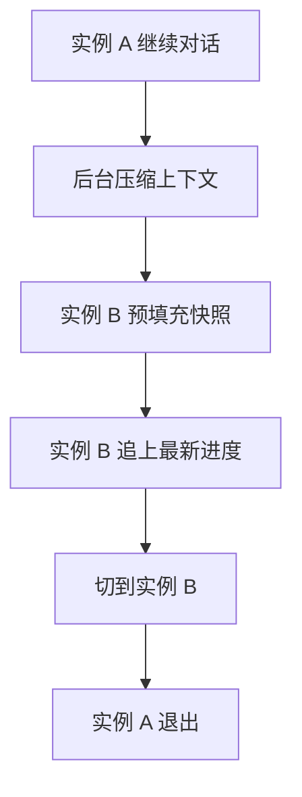

# GPT-Live：把「说话」和「思考」拆到两条路上，为全双工语音重做一套实时系统

<!-- release-date: 2026-07-08 -->

> 本文依据 OpenAI 官方工程博客 **How we built a realtime system for responsive voice AI in six months**，作者 Justin Uberti 与 Zahan Malkani，2026 年 8 月 3 日发布，访问日期 2026-09-24。
>
> 原文地址：<https://openai.com/index/continuous-voice-interaction-with-gpt-live/>
>
> 原文小节标题不带编号，下文的事实锚一律写「原文某某一节」，用英文原标题，便于在页面上搜到。全文把三件事分开标注：**原文明确写了什么**、**我们如何解释它**、**哪些是外部资料补充**。外部补充主要来自三处：OpenAI 的 GPT-Live 发布页、OpenAI 更早一篇讲语音基础设施的工程博客、ByteByteGo 对两位作者的采访稿。

## 读前先把几个词说成人话

这篇工程博客讲的是一套语音系统怎么搭，而不是模型怎么训。下面这些词会反复出现：

- **轮次（turn）与轮次检测器（turn detector）**：老一代语音助手把对话切成「你说一段、它说一段」。什么时候算你说完了，由一个很小的模型来猜，这个小模型就是轮次检测器。
- **全双工（full-duplex）**：像打电话一样，双方可以同时说、同时听。全双工的语音模型一边持续吃进用户的音频，一边持续吐出自己的音频，要不要开口由模型自己决定，不再需要轮次检测器。
- **级联（cascaded）**：语音转文字、大模型、文字转语音三个模型串起来跑。
- **语音到语音（speech-to-speech）**：一个模型直接吃音频、吐音频，但仍然按轮次工作。
- **帧（frame）**：音频按固定时长切成的一小片，流式系统一片一片地收发。
- **WebRTC**：浏览器和手机上通用的实时音视频标准，负责打洞连通、加密、编解码协商、抗丢包。
- **RTT（Round-Trip Time，往返时延）**：一个包发出去、回应回来的时间。建连要来回几次，就要付几个 RTT。
- **有状态推理（stateful inference）**：一个会话长期绑定在一台模型实例上，历史上下文和 KV cache 一直留在这台机器的显存里，新来的音频只需要增量处理。
- **KV cache**：模型把已处理 token 的注意力键值存下来，后续生成直接复用，不必重算。
- **委托（delegation）**：语音模型遇到需要搜索、深度推理或调用工具的问题时，把活交给后台的前沿文本模型（发布时是 GPT-5.5），自己继续陪用户聊。
- **上下文压缩（context compaction）**：对话太长、超过模型上下文上限时，把历史压短再继续。
- **静默测试（silent test）**：把一部分真实线上会话同时复制一份给新系统跑，新系统的输出不给用户听。原文把新系统这一路叫 shadow path。
- **p95、p999**：延迟分布的第 95 和第 99.9 百分位，也就是最慢的 5% 和最慢的 0.1% 从哪里开始。

## 一句话先说清

GPT-Live 是 OpenAI 的第三代语音系统：语音模型改成全双工，轮次检测器被拿掉；遇到难题，就把活委托给后台的 GPT-5.5，对话本身不停。原文讲的是为此重做的那套系统，核心原则只有一句：**声音必须一直流动**（原文 Responsive, from client to model 一节）。围绕这句话，系统做了五件事：媒体走专用快路径，其余一切放到异步 RPC 边界之后；推理改成每个会话独占、有状态，并能在实例之间无缝热切换；委托链路提前预填充；从连续语音里推断出「轮次」给外围系统用；用 WARP 与 Instant Connect 把建连压到一个 UDP 包。上线前，他们用真实流量做了静默测试，学到的第一课是：**容量不能只按 GPU 吞吐算，要按「能稳住多少个并发会话、且每一帧都准时」来算**。

上图引自原文 Moving from turn taking to streaming 一节末尾的系统架构图。图例把两条路分开画：白底方框是实时媒体路径，浅蓝底方框是异步委托路径。

### 一条阅读路线

1. 主要矛盾：为什么请求-响应式的推理撑不起一条不能断的音频流。
2. 核心设计一到五：快路径与异步边界、有状态推理与热切换、委托、从连续语音推断轮次、一个包起会话。
3. 上线前的静默测试学到了什么，全双工系统该怎么评测。
4. 限制、没有公开的东西、可迁移启发。

## 主要矛盾：请求-响应式推理，撑不起一条不能断的音频流

原文开篇先讲旧架构卡在哪（原文开头与 Moving from turn taking to streaming 一节）：

| 代际 | 做法 | 卡在哪 |
|---|---|---|
| 级联 | 语音转文字、大模型、文字转语音串行 | 三段延迟相加；转写丢掉语气和节奏 |
| 语音到语音 | 一个模型直接处理音频 | 仍靠轮次检测器决定何时开始推理，交互还是一问一答 |
| GPT-Live（全双工） | 模型持续听、持续说，自己决定何时开口 | 系统必须保证音频不断流 |

轮次检测器的处境原文写得很清楚：猜早了，用户被打断；猜晚了，回应显得迟钝。而且只有它拍板之后，大模型才能开始干活。**外部补充**：ByteByteGo 的采访稿还提到另外两点。一是打断检测面临同样的两难：太灵敏会被背景噪声误触发，太保守又会漏掉「嗯」「不」这类短插话。二是语音到语音模型每换一个更强的基座，都要重新训一轮，所以语音模型总是落后于最新的前沿模型。

全双工把难题从模型搬到了系统。原文 Enabling continuous inference 一节的说法是：轮次制的系统能容忍音频包到得早一点、晚一点；实时媒体系统必须让每一帧都准时送达，传输、处理、推理任何一处延迟，都会直接变成用户听得见的停顿或杂音。

**我们的解释**：这和文本聊天的推理服务是两种负载。文本聊天是「请求来了，算完，空闲」，衡量的是单个请求的首 token 延迟和吞吐；全双工语音是「会话一开就一直在算」，衡量的是这条流在整个会话期间有没有断过。下面五个设计，都是在把推理服务从前一种形态改造成后一种形态。

## 核心设计一：媒体走专用快路径，其余一切放到异步 RPC 边界之后

原文 Making the media flow quickly 一节说，这是他们最早做的决定之一：**把媒体流和应用、业务逻辑彻底分开**。音频在客户端和语音模型之间走专用快路径；委托、工具调用和其他应用逻辑都放在一道异步 RPC 边界后面。慢的工具调用或后端服务只会拖慢它自己的结果，拖不住媒体流。

| | 实时媒体路径 | 异步委托路径 |
|---|---|---|
| 跑什么 | 媒体管线与推理循环 | 委托、工具调用、持久化、其他应用逻辑 |
| 节拍 | 固定时钟，每帧都要准时 | 可以慢，但要尽快 |
| 慢了会怎样 | 用户直接听到停顿或杂音 | 只推迟那一个结果 |
| 谁能改 | 保持小而可预测，不随业务改动 | 应用可以自由换工具、策略和后端行为 |

这道边界还有一个好处：定制点清楚了。应用改工具、改策略、改后端，都不会碰到负责让音频流动的媒体前端（原文同一节）。

实现上有两处具体做法：

- **媒体前端与推理逻辑用 Go 重写**，替换原来的 Python asyncio 实现。帧投递的平稳度明显提升：**新系统的 p95 追平了旧系统的 p50**（原文同一节）。
- **传输层仍用 WebRTC**。它为低延迟媒体设计，能扛住丢包、时钟漂移和客户端网络切换；包到晚了，WebRTC 会把音频轻微拉长以免出现空白，再短暂加速播放追回实时（原文同一节）。

**外部补充**：原文提到的「更早重建的语音基础设施」，是 OpenAI 2026-05-04 的工程博客 How OpenAI delivers low-latency voice AI at scale（作者 Yi Zhang、William McDonald）。那一篇讲的是 WebRTC 在哪里终结：他们没有用多人会议常见的 SFU（选择性转发单元），而是让一个 Go 写的 transceiver 服务独占每个会话的 ICE、DTLS、SRTP 状态，再在前面加一层只转发不解密的 relay。relay 从客户端第一个 STUN 包的 ICE ufrag 里读出路由信息，把包送到持有该会话的 transceiver，这样公网只需暴露少量固定 UDP 端口。GPT-Live 的媒体前端就建在这层基础之上。

### 可迁移启发

- 系统里有一段必须按固定节拍运行的工作时，先把它和其他一切隔开，边界做成异步的。慢的东西只能拖慢自己，不能拖慢节拍。
- 语言与运行时的选择会直接体现在尾延迟上。p95 追平旧 p50，说明这类负载的瓶颈常在调度抖动，不在平均算力。

## 核心设计二：有状态推理，以及不停机的实例热切换

### 为什么要有状态

原文 Enabling continuous inference 一节说，GPT-Live 把流式一路推到模型内部，建了一套新的、为连续对话设计的有状态推理系统。**外部补充**（ByteByteGo 采访稿）把原因讲得更直白：聊天模型算完一个请求就空闲，全双工模型没有空闲，每秒都要对每个用户多次采样。如果每次都把整段对话重读一遍，成本扛不住。所以每个会话一直连着那台在显存里保存着这段对话的模型实例，新的一帧音频到来，只处理这一帧。

### 有状态带来的两个麻烦

原文 Keeping the (stateful) conversation going 一节点出了代价：一个语音会话可能持续很久，上下文一直在长；而模型实例会随负载增减，也要升级、会故障。会话绑死在一台实例上，这台实例一动，会话就断。

原文的解法是一个**无缝交接机制**：

1. 需要切换时，在原实例旁边热起一台替代实例；
2. 用当前会话的上下文给它预填充；
3. 两台实例 **并行推理** 一段时间；
4. 新实例完全就绪后切过去。

### 同一套机制顺手解决上下文压缩

对话越来越长，终究会超过模型的上下文上限。压缩能把上下文缩回上限以内，但有两笔代价：压缩本身要时间；压缩改写了历史，原来的 KV cache 全部作废，得重新预填充，又是一段延迟（原文同一节）。

原文把压缩也当成一次受管理的交接：原实例继续陪用户聊，系统在旁边压缩上下文、用压缩后的上下文准备好替代实例，就绪后切过去，媒体流不中断。这样长通话可以按需反复压缩。

这张图根据原文 Live context compaction 示意图与同一节文字重画。原图画的是：服务器 A 生成压缩快照后结束；服务器 B 先预填充快照，再「追上」（catch up）A 在此期间的进度，然后接手；两者之间有多条双向箭头。追上这一步具体怎么做（比如是否重放期间新到的音频帧），原文没有展开。

**我们的解释**：这是把数据库里的「在线迁移」搬到了推理服务上。显存里的 KV cache 就是会话的状态；迁移、扩缩容、压缩这三件事，都被统一成「在旁边准备好新副本，再原子切换」。代价是切换期间有两台实例同时为一个会话算，要付双份显卡。原文没有给出这笔开销有多大、多久切一次。

### 可迁移启发

- 长连接、有状态的推理服务，要把「状态迁移」当成一等公民来设计，而不是出了故障再补。一旦有了可靠的热切换，扩缩容、滚动升级、上下文压缩都能复用同一套机制。
- 会改写历史的操作（压缩、摘要、删消息）都会让 KV cache 作废，不能放在关键路径上同步做。

## 核心设计三：委托——让 GPT-5.5 在后台想，语音模型接着聊

委托是 GPT-Live 最有产品感的设计：语音模型负责「说」，前沿文本模型负责「想」（原文 Delegation without blocking the conversation 一节）。原文说，要让两个模型用起来像一个系统，得解决两个问题：结果要回来得够快，才能用得上；产品里其他系统需要的是一条条离散消息，所以连续的对话还得转成它们能理解的形式。第二个问题留到核心设计四，这里先讲快。

### 把整条委托回路都算进响应预算

原文 Making delegation fast enough to feel natural 一节的原则是：委托一发出，就以「前沿模型产出对对话有用的东西」所需的时间为优化目标。语音模型能用应答、自言自语式的过渡撑一小会儿，但藏不住任意慢的回复。所以 **路由、提示词处理、推理、工具调用** 整条回路都算进响应预算。

具体有三步：

| 做法 | 省掉什么 |
|---|---|
| 语音会话一开始，应用服务器就为前沿模型建好推理会话，用初始对话上下文预填充 | 第一次委托时的整段提示词处理 |
| 整个通话期间保持这个推理会话，后续请求用稳定的会话亲和性（session affinity）打到同一处，配合提示词缓存 | 每次委托重复处理历史；同时 worker 故障仍容易恢复 |
| 调整推理强度、输出上限、工具 schema、模型与工具之间的往返次数 | 委托路径上多余的工作 |

**外部补充**：GPT-Live 发布页写明，GPT-Live-1（instant）与 GPT-Live-1 mini 在后台用 GPT-5.5 Instant，GPT-Live-1 Medium 与 High 用 GPT-5.5 Thinking 的中、高推理强度。ByteByteGo 采访稿补了一句动机：这种拆分让语音模型可以保持小而快、毫秒级响应，换上更新的前沿模型也几乎不需要重新训练语音模型。

**我们的解释**：「会话开始就预填充一个用不用得上都不知道的推理会话」，是拿算力换延迟。它之所以划算，是因为语音会话本来就长、委托很常见；对只偶尔调工具的场景，这笔预付未必值得。

### 可迁移启发

- 大模型当工具调用时，延迟的大头常在提示词处理而不在生成。能预知会被调用的，就在空闲时预填充，并用会话亲和性让缓存命中。
- 一个快模型对话、一个强模型干活，能同时拿到速度和质量。前提是快模型能在等待时做点有意义的事，而这要在模型行为上专门训练。

## 核心设计四：从连续语音里推断出「轮次」

语音模型本身没有轮次，但它周围的系统有：ChatGPT 的对话界面、一部分分析和安全基础设施，都按「用户一条、助手一条」工作。于是应用服务器要把重叠、偶尔含糊的对话拆成离散消息（原文 Deriving discrete turns from continuous speech 一节）。

原文描述的做法：

- 音频到来时，服务器用部分转写和时间信号推断谁在说话，维护一个消息队列。最新一条始终是 **临时的**：文本、时间和说话人归属都可能随后续语音改变。某个说话人持续占据话轮足够久、归属可靠之后，这条消息才定稿。
- 重叠说话更麻烦：用户说话时助手的一句「嗯哼」「好的」不一定要单独成一条消息，但有实质内容的插话往往应该成一条；用户中途插话时，也要优先保证助手回答的连贯。
- 任何切分策略都在「新鲜」与「确定」之间取舍：定稿太早，历史碎片化、顺序不稳；等太久，转写和依赖它的功能都会延迟。所以系统同时维护两份视图：**推测视图** 反映当前状态，**权威记录** 记下确定说过的话。界面能处理更新，用推测视图；写进分析流水线的必须是定稿转写。

**我们的解释**：这就是分布式系统里「乐观读」与「提交日志」的分离。实时展示用可回滚的推测状态，下游持久化只消费已提交的状态。把轮次这个概念从实时路径上拿掉，但在外围按需重建，外围系统就不必为全双工全部重写。

## 核心设计五：一个 UDP 包起会话——WARP 与 Instant Connect

原文 Starting sessions with a faster protocol 一节说，响应从用户按下按钮那一刻就开始计时。会话开始前，系统必须先建好媒体通道、开始把音频喂给模型，所以启动序列的每一步都在关键路径上。

WebRTC 是很好的实时基础，但原生 WebRTC 建连要经过多得出奇的握手和往返。它早于 QUIC 那一代「尽量少往返」的协议设计，底下几层协议叠在一起用时会重复干活，比如每一层都带了自己的防 DoS 机制，放在完整 WebRTC 栈里其实用不着（原文同一节）。

上图引自原文 Starting sessions with a faster protocol 一节的 WARPing the WebRTC handshake 图。

**WARP（WebRTC Abridged Roundtrip Protocol）** 把媒体和数据通道的建连从 6 个网络往返压到 1 个。它由一组向后兼容的协议改进组成（原文同一节）：

| 改进 | 做什么 | 对应的标准文档（外部补充，已核对标题） |
|---|---|---|
| SPED | 把 DTLS 握手捎带在 ICE 连通性检查里 | IETF 草案 draft-hancke-webrtc-sped，STUN Protocol for Embedding DTLS |
| DTLS 1.3 | 用更快的 DTLS 1.3 握手 | RFC 9147 |
| SNAP | 预先协商 SCTP 握手 | IETF 草案 draft-hancke-tsvwg-snap，SCTP Negotiation Acceleration Protocol |
| 预协商数据通道 | 不再用 DCEP 现场开通道 | 被替代的是 RFC 8832，WebRTC Data Channel Establishment Protocol |

WARP 本身写成了开放规范（IETF 草案 draft-uberti-tsvwg-warp），与 WebRTC 社区合作推进，正在 IETF 的 TSVWG 工作组走流程。原文说 libwebrtc 和 Pion 已经支持 WARP，其他实现也在跟进。

压完媒体握手，剩下最显眼的延迟是信令：WebRTC 连接前要交换 SDP 参数。**Instant Connect** 把这一步提前：事先协商好参数，既不预留服务器容量，也不需要改动现有 WebRTC 实现。它和标准信令并行跑：预协商的参数有效，服务器在收到第一个媒体包时就把会话建起来；参数过期或无效，标准信令本来就在进行中，客户端回退不增加任何延迟（原文同一节）。

两者合起来，**客户端用一个 UDP 包就能开始会话**，服务器立刻响应（原文同一节）。

**外部补充**：ByteByteGo 采访稿给了一个量级感：移动网络上一个往返约 60 毫秒，原生 WebRTC 的 6 个往返光建连就要超过三分之一秒。这是采访稿的估算，原文没有给出 WARP 上线前后的实测启动时间。

### 可迁移启发

- 分层协议叠在一起时，逐层检查有没有重复的握手、重复的防护。把后一层的握手捎带进前一层，往往是最便宜的提速。
- 「乐观预协商 + 标准流程并行兜底」是一种零风险的提速模式：猜对了省掉一整步，猜错了也不比原来慢。

## 上线前：用真实流量做静默测试

原文 Safely testing GPT-Live in production with real data 一节说，系统在纸面上快，不代表在真实语音流量下不会卡。让 GPT-Live 真正和用户说话之前，他们把一小部分、逐步增加的线上 ChatGPT Voice 会话同时送给旧的 Advanced Voice Mode 和新系统：旧系统照常服务用户，新系统那一路以只读方式跑推理。这让新系统接触到真实的客户端、网络、会话时长和地理分布，而用户听到的东西不变。

原文列出的教训：

| 教训 | 原文的发现 | 改法 |
|---|---|---|
| 容量不能只看 GPU 吞吐 | 语音会话长期打开、持续发帧，CPU 侧的流处理、队列和网络路径要和推理一起扩；真实负载下，一个支撑组件比压测预估更早饱和，推理请求堆积，延迟层层放大 | 把问题从「一张 GPU 能处理多少请求」改成「系统能稳住多少并发会话、且每一帧都准时」 |
| 地理是一等问题 | 把会话路由到远处的容量，会在启动和流式传输的多个环节加延迟 | 模型发布连同区域容量与流量调度配置一起验证，按来源地区拆解延迟；把推理放近用户 |
| 有些故障只在真实会话生命周期里出现 | 长会话暴露内存与持久化压力；重连考验压缩与状态恢复；普通断线暴露关停握手里的竞态 | 这些问题依赖时间、累积状态和跨服务行为，短压测很少复现 |
| 可观测性与发布控制不够 | 有指标混淆了不同来源的延迟；有看板的聚合值掩盖了个别不健康的引擎；测试与部署的配置有漂移 | 更细的遥测、对照已知良好配置校验、分阶段放量、能快速隔离或关闭单条路径 |

原文的总结是：静默测试成了一次提前的上线演练，演练的不只是系统能接多少流量，还有出了故障多快能发现、控制和恢复。

### 全双工系统怎么评测（外部补充）

原文只写了静默测试。ByteByteGo 的采访稿补了另外两层：

- **对话行为**：模型要持续判断该沉默、该打断还是该说话，用户插话时还要判断是真打断还是背景噪声。这两类判断叫 endpointing（判断用户说完）和 barge-in 检测（判断用户插话），可以逐个决策当作预测题打分：收集自然对话、按这些维度标注、跑推理、评分。
- **流的健康度要看 p999**：普通服务用 p95 就够，因为一个用户偶尔才发一次请求，偶尔慢一次很快就忘了。全双工模型持续运行，p95 事件每 20 次推理就出现一次，也就是每分钟好几次，连 p99 事件都常见。所以系统要按 p999 来设计，实践上就是要能快速恢复，因为每个会话都注定会遇到慢帧。

GPT-Live 发布页另有模型层面的评测：在 5–10 分钟的匹配对话里做人工偏好对比，覆盖整体偏好、轮次衔接、打断、对话流畅度与自然感，GPT-Live-1 和 GPT-Live-1 mini 都明显胜过 Advanced Voice Mode；在 GPQA、BrowseComp 和内部变体 τ³-Voice Telecom 上也优于 Advanced Voice Mode。这些属于模型能力，工程博客原文没有涉及。

### 可迁移启发

- 长连接服务的容量单位是「并发会话」，不是「每秒请求」。压测要模拟真实的会话时长和生命周期（重连、断线、长会话），否则 CPU 侧组件、内存泄漏和关停竞态都测不出来。
- 影子流量是上线有状态新系统最稳的办法：真实输入、真实环境，输出丢弃，用户无感。
- 持续运行的系统里，低概率事件会高频出现。先估一下「每个会话每分钟会撞上几次 p99」，再决定盯哪个分位。

## 限制与没有公开的东西

- **模型本身几乎没写**：语音模型的架构、参数量、音频 token 化方式、帧长、训练数据与全双工行为怎么训出来，工程博客都没有涉及。发布页也只有能力描述与评测对比。
- **延迟数字很少**：全文唯一的量化结果是「新系统 p95 追平旧系统 p50」，而且没有给出绝对值。WARP 与 Instant Connect 的实测启动时间、端到端响应时间、委托回路的时延分布，都没有公开。
- **热切换的代价没有量化**：两台实例并行推理多久、切换多频繁、占多少额外算力，原文没有说；「追上进度」这一步的具体机制也没展开。
- **委托协议没有细节**：语音模型何时决定委托、结果以什么形式回到语音模型（图上只写 results/guidance）、失败或超时怎么兜底，原文没写。采访稿里 Zahan Malkani 也说，让语音模型在保持对话流畅的同时委托任务，仍然是没解决好的问题。
- **成本没有公开**：全双工持续采样、每会话独占有状态实例，单会话要多少 GPU 资源，原文没有给。

## 可迁移启发

把全文串回一条线：GPT-Live 的系统设计，是把推理服务从「请求-响应」改造成「长会话、固定节拍、不能断流」。可以带走的原则：

1. **先隔离节拍**。必须准时的工作放在专用快路径上，其余一切放到异步边界之后，慢的只能拖慢自己。
2. **状态迁移是一等公民**。有状态推理要配可靠的热切换；有了它，扩缩容、升级、上下文压缩都走同一套「旁边准备好、再原子切换」。
3. **快模型对话，强模型干活**。委托回路提前预填充、保持会话亲和，把整条回路都算进延迟预算。
4. **连续与离散分层**。实时路径上没有轮次，外围按需从连续流中推断轮次，并区分可回滚的推测视图和已提交的权威记录。
5. **协议栈逐层找重复往返**。捎带握手、乐观预协商加标准流程兜底，能在不改客户端生态的前提下把建连压到一个包。
6. **用真实会话演练上线**。容量按并发会话算，尾延迟按会话里的出现频率选分位，影子流量测出短压测测不到的东西。

这些原则大多不依赖语音：实时翻译、长时间运行的 agent、游戏与协作编辑这类长连接服务都用得上。依赖 OpenAI 规模的是全球 relay 与地理调度这一层；小团队更可能直接用 SFU 或托管的实时服务。

## 关键词回看

- **全双工（full-duplex）**：模型同时听和说，自己决定何时开口，取代轮次检测器。
- **实时媒体路径 / 异步委托路径**：前者只跑媒体管线与推理循环，固定节拍；后者跑委托、工具、持久化，在异步 RPC 边界之后。
- **有状态推理**：会话绑定一台实例，上下文与 KV cache 常驻显存，新帧增量处理。
- **无缝交接（handoff）**：热起替代实例、预填充、并行推理、就绪后切换；上下文压缩也走这套。
- **委托（delegation）**：语音模型把难题交给 GPT-5.5，会话开始即预填充，通话期间保持会话亲和。
- **推测视图 / 权威记录**：界面用可更新的推测视图，分析流水线只用定稿转写。
- **WARP**：把 WebRTC 建连从 6 个往返压到 1 个的一组向后兼容改进（SPED、DTLS 1.3、SNAP、预协商数据通道）。
- **Instant Connect**：提前协商 SDP 参数，与标准信令并行，失效时零成本回退。
- **静默测试（silent test）**：真实流量同时送新旧系统，新系统只读运行、输出不给用户听。

## 资料与阅读边界

- **原始依据**：OpenAI 官方工程博客 [How we built a realtime system for responsive voice AI in six months](https://openai.com/index/continuous-voice-interaction-with-gpt-live/)，Justin Uberti、Zahan Malkani，2026-08-03。正文依据互联网档案馆 2026-08-14 的快照，访问日期 2026-09-24。正文有 3 张示意图：系统架构图与 WARP 握手对比图原样引用，上下文压缩图改画成 Mermaid。另有一段可播放的委托对话示例，快照里只剩标题「Delegation for deeper work」和图注，本文没有引用它的内容。
- **`release-date` 的口径**：报告解读取模型首次对外可用日。GPT-Live 发布页 [Introducing GPT-Live](https://openai.com/index/introducing-gpt-live/) 标注 2026-07-08，当天开始向全球 ChatGPT 用户推送 GPT-Live-1 与 GPT-Live-1 mini；工程博客晚于它，是 2026-08-03。
- **跟进的链接与外部补充**：
  - OpenAI 发布页（2026-07-08）：模型分档与后台所用的 GPT-5.5 版本、人工偏好与三项基准的对比结论。
  - OpenAI 工程博客 [How OpenAI delivers low-latency voice AI at scale](https://openai.com/index/delivering-low-latency-voice-ai-at-scale/)（Yi Zhang、William McDonald，2026-05-04）：transceiver 与 relay 的 WebRTC 部署架构，也就是原文所说「更早重建的语音基础设施」。
  - IETF 与 RFC：[draft-uberti-tsvwg-warp](https://datatracker.ietf.org/doc/draft-uberti-tsvwg-warp/)、[draft-hancke-webrtc-sped](https://datatracker.ietf.org/doc/draft-hancke-webrtc-sped/)、[draft-hancke-tsvwg-snap](https://datatracker.ietf.org/doc/draft-hancke-tsvwg-snap/)、[RFC 9147](https://www.rfc-editor.org/rfc/rfc9147.html)、[RFC 8832](https://www.rfc-editor.org/rfc/rfc8832.html)，标题已逐个核对。
  - ByteByteGo [How OpenAI Built GPT-Live](https://blog.bytebytego.com/p/how-openai-built-gpt-live)（2026-09-22）：基于对两位作者的采访，本文从中取了轮次检测器与打断检测的两难、每帧增量处理的动机、p999 的论证、endpointing 与 barge-in 评测、60 毫秒往返的估算。它是第三方文章，凡引自它的内容都标成了外部补充。
- **与其他篇的分工**：全双工语音模型本身怎么建模，可对照 Moshi 与 MiniCPM-o-4.5 两篇（Moshi 的音频帧是 80 毫秒一帧）。推理服务的延迟与容量指标见知识库「推理服务指标」一篇。
