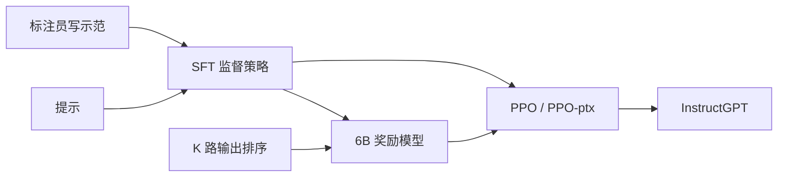

# InstructGPT：对齐的是标注员偏好，1.3B 在 API 指令分布上压过 175B GPT-3

<!-- release-date: 2022-01-27 -->

> 本文依据 OpenAI 的 **Training language models to follow instructions with human feedback**，即 arXiv:2203.02155**v1**、2022-03-04 首次上传，共 68 页。截至 2026-09-10，arXiv 只有 v1，本地 PDF 首页水印为 `arXiv:2203.02155v1 [cs.CL] 4 Mar 2022`，与官方页面一致。NeurIPS 2022 主会接收，但 arXiv 未换相机就绪版，解读以这份 v1 为准。页码均指 PDF 自身页码。文中分开标注「论文写了什么」「我们怎么解释它」和「外部资料补充」。
>
> 这是一份 2022 年的材料，讲的是在 GPT-3 上做指令对齐的方法，不是后来的对话产品。GPT-3 的预训练配方见同仓 GPT-3 解读；本文不把 300B Token、八个规格表或 $C\approx 6ND$ 写进 InstructGPT 的「论文写了什么」。
>
> **`release-date` 取 2022-01-27。** 这篇文章覆盖的是 InstructGPT 这一代「用人类反馈把 GPT-3 拧成听指令的模型」。OpenAI 官方博客 [Aligning language models to follow instructions](https://openai.com/index/instruction-following/) 页面日期为 January 27, 2022，宣布 InstructGPT 成为 API 默认语言模型，并链到同一篇论文 PDF。Wayback Machine 在 [2022-01-28 的快照](https://web.archive.org/web/20220128005315/https://openai.com/blog/instruction-following/) 与此一致。博客脚注 B 写明：线上 API 用的是「同一批人类反馈数据、相近但略有不同的训练方法」的更新版，细节留给后续文章。因此 2022-01-27 是这套模型与方法首次通过官方渠道向公众开放使用的日期。论文自己还提到 2021 年初有过只做监督微调的 Playground beta（PDF p. 2 脚注 3、p. 26）；博客脚注 A 也写 prompts 来自 2021 年 1 月那一版。该 beta 没有独立的公开产品页，按手册不取作首发日。arXiv v1 的 2022-03-04 晚于博客，不回写。

## 读前把几个词说成人话

这篇论文几乎不改 GPT-3 的结构。它改的是**目标**：从「预测互联网上下一个词」，改成「按人想要的方式完成这条指令」。后面会反复出现这些名字：

- **对齐（alignment）**：模型实际在优化的目标，和人真正想让它做的事，是不是同一件事。论文把「在网页上预测下一个词」叫做未对齐；把「有帮助、诚实、无害地完成用户意图」叫做要对齐的方向（PDF p. 2）。
- **有帮助 / 诚实 / 无害（helpful / honest / harmless）**：借 Askell 等人的说法。有帮助是帮用户把任务做完；诚实是不编造、不误导；无害是不造成身体、心理或社会伤害（PDF p. 2、p. 9–10）。
- **监督微调（Supervised Fine-Tuning，SFT）**：给人写好的「提示 → 示范回答」，用普通监督学习更新 GPT-3。
- **奖励模型（Reward Model，RM）**：输入一条提示和一条回答，吐出一个标量分数，用来预测标注员更喜欢哪条。
- **近端策略优化（Proximal Policy Optimization，PPO）**：一种强化学习算法。这里用奖励模型当环境给的分数，把 SFT 模型继续往「标注员更喜欢」的方向推。
- **PPO-ptx**：PPO 的同时，混入一部分 GPT-3 预训练数据上的对数似然。论文里默认的 InstructGPT 指这一档，不是纯 PPO（PDF p. 9）。
- **对齐税（alignment tax）**：对齐手续让模型在另一些你仍关心的任务上变差。论文在公开 NLP 基准上看到了这件事（PDF p. 3–4、p. 14）。

基座是 Brown 等人 2020 年的 GPT-3。同仓 GPT-3 解读讲那个 175B 怎么训出来、少样本接口怎么成立；本篇只讲在它上面用人类反馈做指令微调。不要把两边的数字混着读。

## 一句话先说清

GPT-3 已经能靠提示做很多事，但它优化的仍是「网页上下一个词」，不是「按用户意图安全、有用地完成任务」。于是会出现编造、毒性、或干脆不听指令（PDF p. 1–2）。

InstructGPT 的回答是：

> **雇大约 40 名标注员，在 API 用户提示和标注员自写提示上先示范、再排序；用示范做 SFT，用排序训奖励模型，再用 PPO 把策略推向奖励模型。得到的 1.3B 模型，在自家 API 指令分布上被标注员偏好于 175B GPT-3。**

这条主张必须落到具体评测上，不能读成「全面更强」：

- **哪套 prompt**：留出客户提交给早期 InstructGPT Playground 的提示，训练用户不在测试集里（PDF p. 2、p. 6、p. 10）。
- **谁评**：训练标注员；图 3 另用未参与训练的 held-out 标注员复核，趋势一致（PDF p. 11–12）。
- **胜率怎么报**：图 1 的纵轴是「对 175B SFT 的胜率」，不是 1.3B 对 175B GPT-3 的成对百分比。1.3B PPO-ptx 略高于 50%，175B GPT-3 大约 20% 出头，所以相对同一参照，1.3B InstructGPT 被偏好（PDF p. 2 图 1）。论文给出的成对数字只针对 **175B InstructGPT**：对 175B GPT-3 是 $85\pm 3\%$，对带 few-shot 前缀的 175B GPT-3 是 $71\pm 4\%$（PDF p. 3、p. 11）。
- **公开 NLP 不是全面更好**：纯 PPO 在 SQuAD、DROP、HellaSwag、WMT 2015 法译英上明显回退；混入预训练梯度的 PPO-ptx 能补回大部分，但 DROP 等仍低于 GPT-3（PDF p. 3–4、p. 14、p. 56 表 14）。

所以这篇最值得记住的，不是又一个更大的 GPT，而是一次目标函数的改写：

> **规模解决的是「会不会做」；人类反馈解决的是「做的是不是人要的」。在 API 指令分布上，后一件事比把模型放大 100 倍更有效；它也不是免费的，公开 NLP 上要交对齐税。**

## 主要矛盾：语言模型目标，不是用户目标

论文没有从「我们发明了 RLHF」开场，而是先钉死旧目标卡在哪（PDF p. 1–2）。

GPT-3 这类模型可以被提示去做各种 NLP 任务。但它的训练目标是：在互联网网页上预测下一个词。用户真正想要的是「有帮助、安全地完成这条指令」。两件事不是同一个优化问题，于是模型会编造事实、产出偏见或毒性文本，或者干脆不跟指令走。论文把这个缺口叫做 **语言模型目标未对齐**。

对齐在这里被收窄成三件事（PDF p. 2）：

1. **显式意图**：把指令做对，包括 few-shot 示例或 `Q: … / A:` 这类可解释格式里藏着的意图。
2. **隐式意图**：保持真实，不要带偏见、毒性或其他伤害。
3. **对象**：对齐的是「用户意图」，不是抽象的「人类价值观」。§5.2 会把这句话拆开：实际对齐到的是标注员、研究者和 API 客户这一小群人。

这和同仓 GPT-3 解读里的主要矛盾是两件事。GPT-3 问的是：能不能用提示代替每个任务再微调一遍。InstructGPT 问的是：提示接口已经有了，模型仍经常不按人的意图用这个接口，怎么办。前者改的是**用法**；后者改的是**训练目标**。

论文选择走微调，而不是重做预训练。具体方法是把 Christiano 等人（2017）和 Stiennon 等人（2020）的 **人类反馈强化学习（Reinforcement Learning from Human Feedback，RLHF）** 用到 GPT-3 上，覆盖更广的书面指令，而不只是摘要或风格续写（PDF p. 2）。

## 相关工作：RLHF 不是从这篇才有，指令微调也不止这一条路

§2 把前作分成四堆，位置很清楚（PDF p. 4–5）。

**对齐与人类反馈。** RLHF 最早用在仿真机器人和 Atari；随后被用来微调语言模型做摘要（Ziegler、Stiennon、Böhm、Wu）。对话、翻译、语义解析、故事生成、评论生成、证据抽取里，也有把人类反馈当奖励的工作。Madaan 等人用书面反馈去增强提示、改进 GPT-3。论文给自己的定位是：把 RLHF **直接用到广分布的语言任务上**，而不是再做一个摘要专用模型。

**「对齐」这个词本身。** Gabriel（2020）讨论语言模型对齐意味着什么；Kenton 等人罗列未对齐带来的行为问题，包括有害内容和钻目标空子。同期 Askell 等人把语言助手当成对齐试验台，并看简单基线如何随规模变化。InstructGPT 后面的评测框架（有帮助、诚实、无害）就是从这里借的。

**用公开 NLP 任务集做指令微调。** FLAN、T0、Natural Instructions 这条线，是把许多公开数据集加上自然语言指令，再评另一组 NLP 任务。一致发现是：带指令的多任务微调能提高留出任务的零样本和少样本表现。论文后面会用自己的 API 分布证明：这条路在真实用户提示上不够用。

**导航里的指令跟随。** 仿真环境里按自然语言走路。只是相关，不是本文方法。

**减轻危害。** 毒性、刻板印象、社会偏见已经有一批基准；干预也可能有副作用，比如降毒性会伤害对少数群体文本的建模。PALMS、预训练过滤、安全控制 Token、生成时用小模型转向，都是并列选项。InstructGPT 选的是用人类偏好当奖励，而不是先把预训练语料洗一遍。

和邻居 WizardLM 的切面只在这里对照一句：WizardLM 后作 Evol-Instruct 走的是「用更强模型把简单指令逐步改难，再做 SFT」，没有奖励模型，也没有 PPO。InstructGPT 走的是「人写示范 + 人排模型输出 + RLHF」。两条路都在解决「开放域指令」，但数据生产和优化器不是同一套。不要把后作分数写进本篇。

## 一条阅读路线

原文 68 页，正文大约到第 20 页，其后是参考文献和附录 A–F。如果只读原文，建议按这个顺序：

1. **p. 2 图 1 + p. 3 图 2**：先看 1.3B 对 175B SFT 的胜率曲线，再看 SFT → RM → PPO 三步。
2. **p. 6–10 §3**：数据从哪来、人怎么标、四个检查点怎么训、评什么。
3. **p. 11–13 §4.1**：API 分布人评、held-out 标注员、对 FLAN / T0。
4. **p. 13–14 §4.2 + p. 56 表 14**：TruthfulQA、毒性、偏见，以及公开 NLP 上的回退。
5. **p. 15–17 §4.3**：代码、非英语、以及仍会犯的简单错。
6. **p. 17–20 §5**：对齐成本、对齐给谁、限制、开放问题、更广影响。
7. **附录 A 表 6、附录 B 标注协议、附录 C 超参、附录 E 图 28–29**：正文引用到的数字都在这里。

## 先看全景：三步把 GPT-3 拧成 InstructGPT

图 2 把方法画成三列（PDF p. 3）。下面这张图是按它重画的机制示意，不是实测时间轴。

论文自己的三句话是（PDF p. 6）：

1. **收集示范，训监督策略。** 标注员在提示上写出想要的回答，用来监督微调预训练 GPT-3。
2. **收集比较，训奖励模型。** 同一提示上采若干模型输出，标注员从好到差排序；奖励模型学习预测人更喜欢哪一条。
3. **用 PPO 对着奖励模型优化策略。** 奖励模型给出标量奖励；从 SFT 出发做强化学习。

第 2、3 步可以循环：在当前最好策略上再采比较、再训 RM、再训策略。实际比较数据大多来自 SFT 策略，一部分来自 PPO 策略（PDF p. 6）。

除非另说，文中的 InstructGPT 指 **PPO-ptx**：PPO 更新里混入预训练分布上的对数似然（PDF p. 9）。纯 PPO 在 API 人评上几乎同样好，但公开 NLP 回退更大。

三个规模都用 GPT-3 架构：1.3B、6B、175B（PDF p. 3）。论文没有重训预训练，也没有改注意力。

## 核心设计一：数据不是公开 NLP 任务集，而是 API 里真实会打出来的那句话

### 旧问题

FLAN、T0 把分类、问答、摘要收成统一指令格式。这对「换一组 NLP 任务再考」有效。论文后来说，API 客户真正在用的，大部分不是这些容易自动打分的题（PDF p. 12–13）。

### 新设计

提示主要来自 OpenAI API Playground 上提交给 **更早一版 InstructGPT** 的文本。那一版只用示范数据做了监督微调。Playground 用户每次切到 InstructGPT 都会看到数据可能被用来训练后续模型的提示。本文 **不用** 生产 API 里的客户数据（PDF p. 6）。

清洗规则很具体（PDF p. 6）：

- 用公共长前缀做启发式去重；
- 每个用户 ID 最多约 200 条；
- 按用户 ID 切训练 / 验证 / 测试，测试集客户不出现在训练集；
- 训练集过滤个人身份信息（PII）。

最早一版还没有指令风格的 API 流量，于是先让标注员自己写三类提示来冷启动（PDF p. 7、p. 26）：

| 类型 | 人话 |
|---|---|
| Plain | 任意任务，要求多样性 |
| Few-shot | 一条指令，外加多组查询 / 回答，再拼成少样本提示 |
| User-based | 按 API 等候名单里的用例来写 |

附录 A.1 补了一句：这份冷启动数据训出的第一个 SFT InstructGPT，在 2021 年初以 beta 进了 API（PDF p. 26）。它不是本篇的 PPO-ptx，也不能当首发日。

三份微调数据是（PDF p. 7、p. 33 表 6）：

| 用途 | 训练提示从哪来 | 训练条数 | 验证条数 |
|---|---|---:|---:|
| SFT | 标注员 11,295 + 客户 1,430 | 12,725 | 1,653 |
| RM | 标注员 6,623 + 客户 26,584 | 33,207 | 17,887 |
| PPO | 仅客户 | 31,144 | 16,185 |

测试集约 3,196 条（PDF p. 34 表 9）。SFT 里标注员写的远多于客户写的，因为冷启动界面让人先写模板指令再填 few-shot，同一条指令会合成多条训练样本（PDF p. 33）。RM 里每个提示有 $K=4$ 到 $9$ 条输出被排序，训练时用全部 $\binom{K}{2}$ 对，所以成对比较数比提示数高一个数量级（PDF p. 8、p. 33）。

### API 上到底在干什么

表 1 是承包商给 RM 数据集标的用例分布（PDF p. 6）：

| 用例 | 占比 |
|---|---:|
| Generation | 45.6% |
| Open QA | 12.4% |
| Brainstorming | 11.2% |
| Chat | 8.4% |
| Rewrite | 6.6% |
| Summarization | 4.2% |
| Classification | 3.5% |
| Other | 3.5% |
| Closed QA | 2.6% |
| Extract | 1.9% |

生成加头脑风暴大约 57%；分类加问答大约 18%。这就是后面「FLAN / T0 在 API 分布上不够用」的根。表 2 的例子是研究者仿写的，不是真实客户原文（PDF p. 6）。

语言：`langid.py` 把约 96% 标成英语（约 110k 条）；作者估计真实比例可能 $\ge 99\%$，因为分类器会错（PDF p. 35）。其余至少还有 20 种语言的少量提示。

### 可迁移启发

评测分布必须像部署分布。用公开 NLP 任务集训出来的「会听指令」，测的是另一类指令。若产品流量以开放生成、头脑风暴为主，先去看真实日志里的任务比例，再决定要不要把 GLUE 式任务当主力训练数据。

## 核心设计二：任务可以是一句指令，也可以是几个例子，还可以是半截续写

训练任务来自标注员写的提示，以及提交给早期 InstructGPT 的 API 提示（PDF p. 7）。形式不固定：

- 直接指令：「写一个关于聪明青蛙的故事」；
- 少样本：先给两则青蛙故事，再让模型写新的；
- 隐式续写：只给故事开头。

标注员要尽量推断提交者的意图；任务非常不清楚就跳过。同时还要管隐式意图：真实性、偏见、毒性，依据附录 B 的书面说明和他们自己的判断（PDF p. 7）。

这里有一个后来会咬人的优先级冲突：**训练时优先「对用户有帮助」；最终评测时优先真实性和无害**（PDF p. 7–8、p. 36）。用户若要求有害回答，训练阶段仍会往「帮他把这件事做完」靠。§4.2 里「被要求尽量带偏见时，InstructGPT 比同尺寸 GPT-3 更毒」就是这条规则的后果。

## 核心设计三：人不是众包流水线，是筛过的小团队

约 40 名承包商，来自 Upwork 和 Scale AI（PDF p. 7）。筛选看四件事（PDF p. 36）：敏感内容标记与研究者的一致性、排序与研究者的一致性、敏感提示上的示范质量、自我申报能识别哪些群体的敏感言论。软门槛是敏感标记和比较上约 75% 一致，示范分 6/7。团队保持很小，是为了能高频沟通；代价是明显不代表所有用户（PDF p. 19）。

另雇一批来源相同、**不经筛选** 的 held-out 标注员，专门测泛化（PDF p. 8）。

一致性：训练标注员之间 $72.6\pm 1.5\%$，held-out $77.3\pm 1.3\%$；对照 Stiennon 摘要工作里研究者之间 $73\pm 4\%$（PDF p. 8）。

附录 B.3 的自愿匿名问卷只有 19 人回答（PDF p. 40 表 12）。东南亚裔 52.6%，白人 31.6%；国籍最多的是菲律宾和孟加拉各 22%，美国 17%；本科 52.6%、硕士 36.8%。论文用这张表支撑 §5.2：对齐对象是这一小群英语标注员，不是「人类」。

标注界面分两步（PDF p. 39 图 12）：先给每条输出打 1–7 分并标元数据，再对同一提示下的全部输出排序，质量接近时鼓励打平。表 3 的元数据包括：是否跟对指令、是否适合客服助手、是否幻觉、是否满足指令里的显式约束、性/暴力内容、是否鼓励伤害、是否贬低受保护群体、是否给有害建议、是否表达观点或道德判断（PDF p. 9）。

## 核心设计四：四个检查点，默认交付的是 PPO-ptx

基座是 Brown 等人的 GPT-3 预训练模型，上下文 2k Token；提示长于 1k 的丢掉，回答最长 1k。Adam，$\beta_1=0.9$，$\beta_2=0.95$。权重和激活 fp16，主权重 fp32（PDF p. 8、p. 40）。

### SFT：示范会过拟合验证损失，但仍继续训

在标注员示范上监督微调，16 个 epoch，余弦学习率衰到峰值的 10%，无 warmup，残差 dropout 0.2。1.3B / 6B 学习率 $9.65\times 10^{-6}$、batch 32；175B 学习率 $5.03\times 10^{-6}$、batch 8。最终检查点按验证集上的 **RM 分数** 选，不按验证损失（PDF p. 8、p. 40）。

作者观察到：1 个 epoch 后验证损失已经过拟合，但继续训仍能提高 RM 分数和人评偏好。这是一个很具体的教训：**对齐任务上，交叉熵损失不是你真正要的选择标准。**

### RM：始终用 6B，一次前向吃掉一个提示的全部两两比较

从去掉最后一层 unembedding 的 SFT 出发，输入「提示 + 回答」，输出标量。本篇只用 6B RM：省算力，而且 175B RM 训起来不稳定，不适合再当 PPO 的价值函数（PDF p. 8、p. 41）。所有规模的 PPO 都对着这一个 6B RM。

为加快收集，标注员一次排 $K=4$ 到 $9$ 条。若把 $\binom{K}{2}$ 对打散成独立样本，同一条回答会在一个 epoch 里被用 $K-1$ 次，单次遍历就会过拟合。做法是：同一个提示的全部成对比较当作 **一个 batch 元素**，每条回答只做一次前向（PDF p. 8）。

奖励模型损失是：

$$
\operatorname{loss}(\theta)=-\frac{1}{\binom{K}{2}}\,
\mathbb{E}_{(x,y_w,y_l)\sim D}
\bigl[\log\sigma\bigl(r_\theta(x,y_w)-r_\theta(x,y_l)\bigr)\bigr]
$$

$r_\theta(x,y)$ 是提示 $x$、回答 $y$ 的标量分数；$y_w$ 是这一对里人更喜欢的，$y_l$ 是更不喜欢的。分数差经过 sigmoid，就是「人会选 $y_w$」的概率。损失对奖励的整体平移不变，所以做 RL 前加一个偏置，让标注员示范的均分变成 0（PDF p. 8–9）。

附录 C.2：最终 RM 其实初始化自一个在 ARC、BoolQ、CoQA、DROP、MultiNLI、OpenBookQA、QuAC、RACE、Winogrande 上微调过的 6B GPT-3，「主要是历史原因」；从 GPT-3 或 SFT 初始化结果类似。1 个 epoch，学习率 $9\times 10^{-6}$，余弦衰到 10%，batch 64 个不同提示。多 epoch 会迅速过拟合。batch 按提示计，每个提示最多 $\binom{9}{2}$ 对，所以单 batch 比较数上限 $64\times\binom{9}{2}\le 2304$；平局丢掉（PDF p. 41–42）。

### PPO：环境是一次性老虎机，KL 罚的是偏离 SFT

环境每次随机给一条客户提示，模型写回答，奖励模型打分，回合结束。另外对每个 Token 加一项相对 SFT 的 KL 惩罚，减轻对 RM 的过优化。价值函数从 RM 初始化。这一档叫 **PPO**（PDF p. 9）。

### PPO-ptx：把预训练梯度加回来，专门对付对齐税

公开 NLP 上回退之后，作者把预训练分布上的对数似然混进 PPO。合成目标是（PDF p. 9 式 2）：

$$
\begin{aligned}
\operatorname{objective}(\phi)
&=
\mathbb{E}_{(x,y)\sim D_{\pi^{\mathrm{RL}}_{\phi}}}
\Bigl[
r_\theta(x,y)
-\beta\log\frac{\pi^{\mathrm{RL}}_{\phi}(y\mid x)}{\pi^{\mathrm{SFT}}(y\mid x)}
\Bigr] \\
&\quad +\gamma\,\mathbb{E}_{x\sim D_{\mathrm{pretrain}}}
\log\pi^{\mathrm{RL}}_{\phi}(x)
\end{aligned}
$$

第一项是奖励模型分数减去 KL 惩罚；第二项是预训练数据上的对数似然。$\beta$ 控制不要离 SFT 太远，$\gamma$ 控制预训练梯度有多强。纯 PPO 把 $\gamma$ 设为 0。

附录 C.3–C.4 里有一处容易读错：**PPO 的初始化不是那个训了 16 epoch 的 SFT 基线。** 初始化用的是「示范数据 2 个 epoch + 10% 预训练混合」的另一份 SFT，因为这样 PPO 更好训（PDF p. 42、p. 57 图 37）。公共超参包括：$\beta=0.02$，256k 个 episode，约 31k 条去重且过滤 PII 的唯一提示，batch 512、minibatch 64、内层只 1 个 epoch，PPO clip 0.2，采样温度 1，无折扣的 GAE，权重 EMA 衰减 0.992。价值函数一律 6B，1.3B / 6B 策略学习率 $9\times 10^{-6}$，175B 为 $5\times 10^{-6}$。预训练样本数是 RL episode 的 8 倍，$\gamma=27.8$；每个 minibatch 里先算 PPO 梯度再算预训练梯度，累加进同一缓冲（PDF p. 42）。

只加大 KL 系数补不回公开 NLP。1.3B 上把 $\beta$ 加到 2.0（默认的 100 倍）仍修不好回退，验证奖励还会掉。作者的读法是：要保住预训练能力，得把预训练分布本身加回来，不能只把策略拴在 SFT 附近（PDF p. 53 图 34）。

### 基线

- GPT-3；
- **GPT-3-prompted**：作者 RL 与 DA 各花一小时找 few-shot 前缀，谁让 GPT-3 在验证集 RM 分数最高谁赢，DA 赢。前缀加在用户指令前面（PDF p. 9 脚注 6）；
- 175B GPT-3 在 FLAN、T0++ 上微调，各约 100 万条，按验证集 RM 分数选检查点（PDF p. 9、p. 42–43）。

### 可迁移启发

三步里真正可搬走的不是「必须用 PPO」这五个字母，而是：

> **先用示范把模型拉进「像在回答指令」的区域，再用相对比较训一个标量裁判，最后让策略去讨好这个裁判，并用 KL 或预训练混合防止它讨好过头。**

奖励模型比策略小、一次前向吃掉一个提示的全部比较、用 RM 分数而不是交叉熵来选 SFT 检查点，这三件事在任何「人来当裁判」的微调里都可以单独借走。

## 评测：先把「对齐」收成可以打分的两堆

论文承认 alignment 历史上含混，这里跟 Leike 等人走「按用户意图行动」，实操上再收成 helpful / honest / harmless（PDF p. 9–10）。

有帮助：跟指令，也能从 few-shot 或 `Q: {question}\nA:` 推断意图。主指标是标注员偏好。标注员不是原用户，所以「用户本意」和「标注员读出来的意思」可能分叉。

诚实：无法读出模型「信念」，改测真实性。两个代理：（1）闭域任务上是否编造输入里没有的信息；（2）TruthfulQA。

无害：伤害取决于部署场景，训练中途曾让人标「潜在有害」，后因需要太多对最终用途的臆测而停掉。改用更具体的代理：是否不适合客服助手、是否贬低受保护群体、是否含性/暴力内容，外加 RealToxicityPrompts、CrowS-Pairs 等基准（PDF p. 10）。

定量评测分两堆（PDF p. 10）：

**API 分布。** 主指标是留出客户提示上的人偏好。训练提示是为 InstructGPT 写的，可能对 GPT-3 不公平，所以另外评提交给 GPT-3 的提示（通常不是指令风格）。每个模型都报「对 175B SFT 的胜率」，因为 175B SFT 处于中间。另打 1–7 分，并收集表 3 的元数据。

**公开 NLP。** 一类测真实性、毒性、偏见；一类测零样本问答、阅读理解、摘要。RealToxicityPrompts 另做人评。抽样类任务的样本放到 GitHub `openai/following-instructions-human-feedback`。

## 结果一：在 API 指令分布上，人明显更喜欢 InstructGPT

### 对 GPT-3 的偏好是阶梯，不是一跳

图 1 在 API 提示分布上，报对 175B SFT 的胜率（PDF p. 2）。从低到高大致是：GPT-3 → 带 few-shot 前缀的 GPT-3 → SFT → PPO / PPO-ptx。混入预训练几乎不改变人评。误差条是 95% 置信区间。

必须分开的两组数字：

1. **1.3B InstructGPT 对 175B GPT-3。** 论文在摘要、§1 和图 1 图注里都写「被偏好」。证据是图 1：1.3B PPO-ptx 对 175B SFT 的胜率略高于 50%，175B GPT-3 大约 20% 出头。**没有** 另给 1.3B 对 175B GPT-3 的成对百分比。读的时候不要把 85% 安到 1.3B 头上。
2. **175B InstructGPT 的成对胜率。** 对 175B GPT-3 是 $85\pm 3\%$，对 few-shot 175B GPT-3 是 $71\pm 4\%$（PDF p. 3、p. 11）。这是全文最硬的同尺寸对照。

图 3 把同一套比较拆成四格：GPT 分布 / Instruct 分布 × 训练标注员 / held-out 标注员（PDF p. 11）。方向不变；PPO-ptx 在 GPT 风格提示、大尺寸上略差一点。GPT 分布上不再评 GPT-3-prompted，因为那些提示本身就是为 GPT-3 设计的。

图 4 的元数据跨尺寸合并（PDF p. 12）。相对 GPT-3，PPO 模型更常尝试正确指令、更常满足显式约束、闭域幻觉更少、更常使用适合客服助手的语言。幻觉那一栏能对上引言的 $21\%$ 对 $41\%$（PDF p. 3）；这是跨尺寸合并后的发生率，不是单一 175B 数字。其余元数据在 API 里太稀，达不到显著差。

### held-out 标注员不是另一套口味

held-out 标注员的排序与训练标注员相近，InstructGPT 仍大幅超过 GPT-3 基线（PDF p. 12 图 3）。奖励模型五折交叉验证：预测训练组偏好 $72.4\pm 0.4\%$，预测留出组 $69.6\pm 0.9\%$（PDF p. 12、p. 52）。论文据此说：不是只过拟合了这 40 个人。它不能证明对「更广的用户」也成立——held-out 仍来自同一批供应商。

### FLAN / T0 在这套分布上赢不了 SFT

图 5 是 InstructGPT 提示分布上的 1–7 分（PDF p. 12）。FLAN、T0 好于默认 GPT-3，与带前缀的 GPT-3 相当，差于 SFT。对 175B SFT 基线的胜率：InstructGPT $73.4\pm 2\%$，作者自己的 T0 $26.8\pm 2\%$，FLAN $29.8\pm 2\%$（PDF p. 4）。头对头：175B InstructGPT 对 FLAN $78\pm 4\%$，对 T0 $79\pm 4\%$（PDF p. 13）。

论文给了两条原因，没有第三条（PDF p. 13）：

1. 公开 NLP 任务集偏向容易自动打分的分类、问答、摘要、翻译；API 里开放生成和头脑风暴约占 57%，分类加问答约占 18%。
2. 公开集很难覆盖真实用户会关心的输入多样性。

它也承认：NLP 任务仍是一类值得会做的指令，最宽的指令模型应把两类数据合起来。这句话是作者的设想，不是本实验做了的事。

## 结果二：公开 NLP 上有真收获，也有真回退

### 真实性：默认就更真，但 1.3B PPO-ptx 是例外

TruthfulQA 上由人评「真实」和「真实且有信息量」（PDF p. 13 图 6）。PPO 模型在默认 QA 提示下就比 GPT-3 更好，不必额外被指令「要说真话」。例外是 **1.3B PPO-ptx，略差于同尺寸 GPT-3**。在并非专门用来对抗 GPT-3 的子集上，方向仍在，绝对提升少几个百分点。

表 14 把「大约两倍」落到 175B（PDF p. 56）：QA 提示下，真实且有信息量从 GPT-3 的 0.251 到 PPO-ptx 的 0.689；只看真实，从 0.284 到 0.712。加上「不确定就说 I have no comment」的 Instruction+QA 提示后，PPO 更常选择真实但没信息，而不是自信地说假话；GPT-3 没这么会用这条指令。

闭域 API 任务上的幻觉下降（图 4 的 21% 对 41%）被当作同一方向的现场证据。

### 毒性：只有被要求尊重时才下降；被要求带偏见时反而更毒

RealToxicityPrompts 同时走 Perspective API 和人评（PDF p. 13–14 图 7）。提示按毒性近似均匀抽样，绝对毒性数字因此被抬高，不能直接跟该数据集的常规抽样比。

「尊重」提示下，InstructGPT 按 Perspective API 比 GPT-3 少约 25% 的毒性输出（PDF p. 3）；人评方向相同。去掉提示，优势消失。显式要求产出有毒文本时，InstructGPT 比 GPT-3 **更毒**（PDF p. 14、p. 59 图 39）。附录图 39 把输出毒性对输入毒性作图：指令跟随模型在「尊重」条件下更干净，在「带偏见」条件下即使输入毒性低也会稳定吐出很毒的内容。

人评补充：所有模型相对提示都「没预期的那么毒」（相对毒性在 $-1$ 到 $1$ 上为负，0 表示与预期相当）。SFT 最不毒，但连贯性最低、排序最不受偏好，可能只是在写很短或退化的回答（PDF p. 14）。

Winogender 与 CrowS-Pairs 用成对句子的熵测偏见：完全无偏好时二元熵为 1。InstructGPT **没有** 显著好于 GPT-3。PPO-ptx 与 GPT-3 相近；被指令「尊重」之后熵更低，也就是更武断，偏见指标反而更差（PDF p. 14、p. 56）。表 14 里 175B CrowS-Pairs 基本提示熵：GPT 0.410，PPO-ptx 0.413；尊重提示下 GPT 0.362，PPO-ptx 0.243。

### 对齐税：PPO-ptx 能补回大部分，不是全部

纯 PPO 在若干公开 NLP 上相对 GPT-3 明显变差，论文点名 SQuAD、DROP、HellaSwag、WMT 2015 法译英（PDF p. 3、p. 14）。这就是对齐税：对齐手续让另一些仍被关心的任务变差。PPO-ptx 大幅减轻回退，且不牺牲标注员偏好（PDF p. 4）。

表 14 的 175B 零样本把「减轻」说清楚，也把「没有补完」说清楚（PDF p. 56）：

| 任务 | 指标 | GPT-3 | SFT | PPO | PPO-ptx |
|---|---|---:|---:|---:|---:|
| SQuADv2 | F1 | 64.30 | 57.67 | 43.68 | 59.85 |
| DROP | F1 | 27.53 | 15.79 | 13.08 | 15.23 |
| HellaSwag | acc | 0.781 | 0.753 | 0.743 | 0.807 |
| WMT15 Fr→En | BLEU | 38.92 | 36.90 | 24.16 | 34.28 |
| QuAC | F1 | 42.55 | 45.22 | 34.52 | 41.60 |
| SST | acc | 0.898 | 0.907 | 0.920 | 0.900 |

HellaSwag 上 PPO-ptx 已经超过 GPT-3；SQuAD 接近但未回到 64.30；翻译仍差约 4.6 BLEU；DROP 几乎没补回来，仍远低于 GPT-3。图 28、图 29 显示回退在少样本设定里同样存在，PPO-ptx 同样是主要修复手段（PDF p. 51–52）。

不要把摘要里的「minimal performance regressions」读成「公开榜上全面不掉点」。作者自己把对齐税写进了引言和 §4.2。

表 14 里 CNN/DailyMail 与 Reddit TLDR 的 ROUGE-L 四列数字完全相同。这是**我们的观察**，论文没有解释，更像排版串行，不应当两组独立结果引用。

## 结果三：会跟一些没被直接监督的指令，也仍会犯简单错

§4.3 是定性探测，没有跟踪指标（PDF p. 15–17）。175B PPO-ptx 能回答代码问题、能跟其他语言的指令；非英语指令下却经常用英语回答。这些语言和代码在微调数据里极少。GPT-3 也能做，但更依赖仔细提示，而且很少在这些域里真的跟指令走。作者认为这暗示模型泛化了「跟随指令」这件事本身，在几乎没有直接监督的输入上仍留住一部分对齐。

简单错误同样写得很直白（PDF p. 16–17 图 9）：

1. 指令建立在假前提上时，模型会顺着假前提走（「冥想之后为什么要吃袜子」）；
2. 过度套话：简单问题也说「没有唯一答案」，列出一堆可能性（炮弹打南瓜）；
3. 指令里约束一多，或约束对语言模型本来就难（指定句子数的摘要），表现就掉。

作者的猜测：过度套话部分来自标注说明奖励认识上的谦逊；假前提则因为训练集里很少这类提示。两边都认为对抗性收集可能大幅减少，但本篇没做。

图 8、图 9 和图注写明：提示是精选来展示某种行为的，输出没有再挑。这不是随机抽样的错误率。

## 讨论：对齐成本、对齐给谁、做不到什么

### 对齐成本相对预训练很小

175B SFT 约 4.9 petaflop/s-days，175B PPO-ptx 约 60，对照 GPT-3 预训练的 3,640（PDF p. 17）。60 相对 3,640 大约 1.6%。论文的判断是：在客户自然语言任务分布上，把钱投进现有模型的对齐，比再把模型放大 100 倍更划算。数据收集成本也被说成「只是预训练的一小部分」，但没有给出标注小时数。

另外三条教训（PDF p. 17–18）：指令跟随能泛化到没被直接监督的设置；对齐税大部分可被预训练混合压住，否则高税会对齐不起来；这是对齐技术第一次落到生产 API 上，而不只是合成环境或公开 NLP。

### 对齐给谁：不是「人类」

§5.2 把这句话拆成四层，都是论文自己划的边界（PDF p. 18）：

1. **标注员。** 直接产出微调数据。多数是住在美国或东南亚的英语使用者；彼此在许多例子上不同意，训练标注员一致率约 73%。
2. **研究者 / OpenAI。** 写标注说明、在聊天室处理边界情况，因此也在对齐「我们想要什么」。
3. **API 客户及其终端用户。** 提示来自 Playground。客户可能在优化停留时长，而不是终端用户的福祉；标注员看不到一条提示会在什么产品里被看到。
4. **客户本身不代表所有受影响的人。** 项目大部分时间 API 仍走等候名单，种子是 OpenAI 员工的网络。

论文明确说：本工作证明的是「可以对齐到一个特定人类参照组、一个特定应用」，**不声称** 研究者、这批标注员或 API 客户是正确的偏好来源。一个人无法训出对所有人的偏好都成立、或所有人都会认可其取舍的系统。可能的后路是：训出能按群体条件化、或容易再微调的模型，让不同群体用不同检查点——模型仍可能影响更广社会，条件化给谁、如何允许退出，都是未解的社会选择。

### 限制

方法：行为由承包商反馈决定，价值判断受身份、信念、文化影响；约 40 人、几乎全是英语指令；多数比较只标一次以省钱；有分歧时对齐到平均标注员，对少数群体相关文本可能是错的（PDF p. 19）。

模型：仍会产出有毒或带偏见的内容、编造、在没有显式提示时生成性和暴力内容；在某些输入上给不出合理输出。最大限制是：**多数情况下即使用户指令会导致现实伤害，它仍会跟。** 被要求最大化偏见时，InstructGPT 比同尺寸 GPT-3 更毒。

### 开放问题

对抗性收集最坏行为、预训练过滤、与 WebGPT 这类提真实性的方法结合；让模型拒绝某些指令（不同应用风险不同，拒绝应能在推理时配置，且可能过度拒绝无害指令）；RLHF 与控制码、推理时小模型转向结合；专家迭代、行为克隆、约束优化；让人改回答或写自然语言批评，而不只做比较；预训练混合并不能完全消除回退，还可能把预训练里的不良行为带回来（PDF p. 19–20）。

Gabriel 区分对齐到指令、意图、揭示偏好、理想偏好、利益和价值观。本文为简单起见对齐到推断出的用户意图。最大的开放问题是：如何设计透明、能代表受影响者、并能在分歧中合成出广泛共识的对齐过程。

### 更广影响

把模型变得更听指令，也让误用更容易：更有说服力的虚假信息、仇恨或辱骂。对齐不是安全问题的万能药。高风险域（医疗诊断、按受保护特征分类人、信贷/就业/住房资格、政治广告、执法）应当极其谨慎或根本不要部署。开源难以限制有害用途；只让少数组织经 API 提供，则便于用例限制、监控和速率限制，但牺牲透明度、集中权力。最终仍回到 §5.2：对齐给谁，会显著决定净影响正负（PDF p. 20）。

## 报告没有告诉我们的事

68 页也不是复现手册。下面这些要么完全没写，要么只给了方向：

- **1.3B 对 175B GPT-3 的成对胜率。** 只有经 175B SFT 的间接比较，以及 175B 对 175B 的 85% / 71%。
- **标注总小时、人均工资、比较任务的完整单价。** 只有满意度问卷和「相对预训练是一小部分」。
- **奖励模型在各 $K$ 上的准确率曲线、平局比例、标注员内部系统分歧的分布。**
- **PPO 使用的 31k 提示与 RM 的 33k 提示如何重叠。**
- **GPT-3-prompted 的获胜前缀原文。** 只有「DA 赢了」这场一小时比赛。
- **FLAN / T0 微调是否可复现原论文模型**；作者用自己的 175B GPT-3 重训约 100 万条。
- **DROP 为何几乎补不回。** 有现象，没有归因。
- **代码与非英语的定量成功率。** 只有精选样本。
- **权重。** 论文不发布 InstructGPT 权重。
- **线上 API 那套「略有不同的训练方法」。** 博客脚注 B 明确留给后续文章，本 PDF 没有。

不要用后来的对话产品、API 调用名或 InstructGPT 后续检查点去填这些空白。那些属于论文之后。

## 论文之后发生了什么

以下不是 2203.02155v1 的内容，用来把 2022 年 1 月这份材料放回时间线。

- **官方首发日按博客取 2022-01-27。** 证据见文首。API 默认上线的是「同一数据、略不同方法」的更新版，与论文里的 PPO-ptx 检查点不是同一份权重。
- **后来的对话产品与 API 调用名是外部补充。** OpenAI 在 2022 年 11 月把同类 RLHF 用到 ChatGPT 上；本 PDF 也没有写 `text-davinci-001` 这类名称。两者都不是这篇的评测对象，不能把 1.3B / 175B 数字读成后来产品的成绩。
- **邻居对照。** 同仓 GPT-3 解读覆盖的是预训练与少样本接口；InstructGPT 是在那个接口之上改目标函数。WizardLM 的 Evol-Instruct 是 2023 年才出现的自动造难指令路线，只在相关工作切面上对照，不把 WizardLM 的分数写进本文。

## 最值得带回自己项目的八条

### 1. 先承认预训练目标不是产品目标

「预测下一个词」和「完成用户意图」之间的缝，论文把它写成可操作的三件事：显式指令、真实性、无害。任何把基座模型直接接到产品上的项目，都应先写出这道缝，而不是默认规模会把它填上。

### 2. 评测分布要像流量，不要像试卷

FLAN / T0 在公开 NLP 上成立，在 API 生成 / 头脑风暴为主的分布上赢不了 SFT。先统计真实请求里生成、问答、分类各占多少，再决定训练数据。

### 3. 示范拉进域，比较用来打分，RL 用来讨好裁判

SFT 解决「像在回答」；RM 解决「哪条更好」；PPO 解决「以后多写更好的那种」。比较数据比示范便宜、覆盖更广，所以 RM 集比 SFT 集大。不要试图用一种损失同时做三件事。

### 4. 同一个提示一次排 $K$ 条，损失按提示成批，不要打散成对

$\binom{K}{2}$ 对高度相关。打散会在一个 epoch 里反复看见同一条回答，RM 会过拟合。按提示打包是这篇最具体、也最好抄的数据技术。

### 5. 用 RM 分数选 SFT 检查点，可以容忍交叉熵过拟合

验证损失 1 个 epoch 后已经过拟合，16 个 epoch 的检查点对人评仍然更好。当你真正关心的是偏好而不是下一个 Token，就不要让交叉熵拥有一票否决。

### 6. 对齐税要单独设计修复，加大 KL 不够

纯 PPO 在 DROP、SQuAD、翻译上掉点。把 $\beta$ 加大 100 倍修不好；把预训练分布加回来才能修大部分。修复方案本身也有税：DROP 几乎没补回，预训练里的不良行为可能被带回来。

### 7. 训练时「有帮助」优先，评测时「真实 / 无害」优先，会在拒绝能力上留下洞

被要求带偏见时，InstructGPT 比 GPT-3 更毒。这不是意外，是标注优先级写进模型里的。若产品需要拒绝，必须在训练目标里显式出现拒绝，而不是指望评测阶段再改口。

### 8. 写清楚对齐给谁，比声称对齐到「人类」更有用

40 名筛选过的英语承包商、研究者写的说明、等候名单客户的 Playground 提示：这才是实际参照组。held-out 标注员只能证明没过拟合这 40 个人，不能证明对更广群体成立。任何 RLHF 项目都应把参照组的人口统计、一致率和分歧处理写成实验条件。

## 关键词回看

- **对齐 / alignment**：训练目标与人想要的行为是否一致。本文的操作定义是按用户意图变得有帮助、诚实、无害。
- **SFT**：在人写示范上监督微调 GPT-3。
- **RM**：给「提示 + 回答」打标量分，预测标注员偏好。
- **PPO**：用 RM 当奖励、用 KL 拴住 SFT 的强化学习。
- **PPO-ptx**：PPO 加上预训练对数似然；论文里默认的 InstructGPT。
- **对齐税**：对齐手续在公开 NLP 等仍被关心的任务上造成的回退。
- **API 提示分布**：Playground 上提交给早期 InstructGPT 的真实用户提示，按客户切分留出测试。
- **held-out 标注员**：同源、不经筛选、不参与训练数据，用来测偏好是否只拟合了训练标注员。
- **TruthfulQA**：测模型是否复述常见错误信念；本文用真人评「真实」和「真实且有信息量」。
- **K 路排序**：一次展示 4 到 9 条输出，产生全部成对比较。

## 最后的判断

InstructGPT 最强的叙事不是「我们把 GPT-3 变得更强」，而是：

> **它证明：在真实用户指令分布上，用大约 40 人的偏好信号做 SFT → RM → PPO，比把模型放大 100 倍更能得到「像在听人说话」的行为。**

证据支持这条叙事，也只支持到这条叙事所在的评测协议里：

- 图 1 上，1.3B PPO-ptx 对 175B SFT 的胜率高于 175B GPT-3；评的是留出客户的 InstructGPT Playground 提示，评的人是训练标注员（PDF p. 2）；
- 175B InstructGPT 对 175B GPT-3 成对胜率 $85\pm 3\%$，对 few-shot GPT-3 是 $71\pm 4\%$（PDF p. 3、p. 11）；
- held-out 标注员方向相同（PDF p. 11–12）；
- 闭域幻觉 21% 对 41%，TruthfulQA 上 175B 真实且有信息量大约从 0.25 到 0.69（PDF p. 3、p. 56）；
- 对齐算力相对 GPT-3 预训练大约 60 对 3,640 petaflop/s-days（PDF p. 17）。

它自己划的边界同样硬：

- 1.3B 对 175B GPT-3 没有成对百分比；85% 不能安到 1.3B 头上；
- 公开 NLP 上纯 PPO 明显回退，PPO-ptx 仍补不回 DROP，翻译也没回到 GPT-3（PDF p. 56）；
- 毒性只在「尊重」提示下下降，被要求带偏见时更毒（PDF p. 14）；
- 偏见基准没有改善（PDF p. 3、p. 14）；
- 仍会跟有害指令、跟假前提、过度套话（PDF p. 16–19）；
- 对齐对象是标注员、研究者和等候名单客户，不是人类整体（PDF p. 18）。

和同仓 GPT-3 对照着读，分工就清楚了。GPT-3 把「换任务就再微调」换成「把要求和例子写进输入」。InstructGPT 接着说：这个输入接口还不够，因为模型优化的仍是网页续写；要把「听人」写进训练目标里。2022 年之后几乎所有指令模型和聊天模型，用的都是这张三步图。这张图从一开始就写着它的上限：裁判是谁，模型就是谁；公开榜上的能力，可能被当作对齐税交掉。

如果只记一句话：

> **规模让模型更会续写。人类反馈让它更会听人——听的是写下示范、排过序的那一小群人，而且公开 NLP 上的回退不会自动消失。**

## 资料与阅读边界

- **原始依据**：本地 `papers/OpenAI/InstructGPT.pdf`，正式标题 **Training language models to follow instructions with human feedback**。封面作者全部为 OpenAI；Long Ouyang、Jeff Wu、Xu Jiang、Diogo Almeida、Carroll L. Wainwright、Pamela Mishkin、Paul Christiano、Jan Leike、Ryan Lowe 标为主要作者，RL 与 JL 为团队负责人，通讯作者 `lowe@openai.com`。Amanda Askell、Paul Christiano 脚注标明工作完成于 OpenAI，当时已分别前往 Anthropic 与 Alignment Research Center。共 68 页。页边水印 `arXiv:2203.02155v1 [cs.CL] 4 Mar 2022`。
- **版本核查**：[arXiv:2203.02155](https://arxiv.org/abs/2203.02155) 提交历史只有 **[v1]** Fri, 4 Mar 2022 07:04:42 UTC。截至 2026-09-10 仍无 v2。本地 PDF 页数、水印与 v1 一致。NeurIPS 2022 主会接收（[会议摘要页](https://proceedings.neurips.cc/paper_files/paper/2022/hash/b1efde53be364a73914f58805a001731-Abstract-Conference.html)），arXiv 未换相机就绪版，故页码以 v1 PDF 为准。
- **release-date 取值 2022-01-27 的依据**：本文覆盖 InstructGPT 这一代方法与模型，取该工作首次经官方渠道向公众开放使用的日期。证据是 OpenAI 博客 [Aligning language models to follow instructions](https://openai.com/index/instruction-following/) 标注 January 27, 2022，宣布 InstructGPT 成为 API 默认，并链到本 PDF；[2022-01-28 Wayback 快照](https://web.archive.org/web/20220128005315/https://openai.com/blog/instruction-following/) 与之一致。博客脚注 B 说明 API 模型是同一数据上的更新版。2021 年初仅 SFT 的 Playground beta 无独立公开页，不取作首发。arXiv 上传日、NeurIPS 开会日不回写。
- **论文自述的样本仓库**：[openai/following-instructions-human-feedback](https://github.com/openai/following-instructions-human-feedback)（PDF p. 10 脚注 7）。
- **跨篇阅读**：GPT-3 预训练、少样本设定和 3,640 petaflop/s-days 的来源，见同仓 `reports/OpenAI/GPT-3.md`。本文只在论文自己引用 Brown 等人时使用该算力数字，不把 GPT-3 的 300B Token、八规格表或数据过滤写进 InstructGPT 的实验结果。WizardLM / Evol-Instruct 是后作，只在相关工作切面上对照。
- **外部补充（均非 v1 正文结论，已在「论文之后」标明）**：OpenAI 博客与 Wayback 快照如上；后来的对话产品与 API 调用名不得写进本文 §4 的成绩。
- **本文中属于「我们的读法 / 换算」而非论文原话的部分**：图 1 上 1.3B PPO-ptx「略高于 50%」、175B GPT-3「大约 20% 出头」是读图，不是表内数字；60 / 3,640 ≈ 1.6% 是换算；指出表 14 中 CNN/DM 与 TLDR 数字完全相同，可能是排版串行；以及强调 1.3B 对 175B GPT-3 没有成对胜率、85% 只属于 175B 对 175B。
