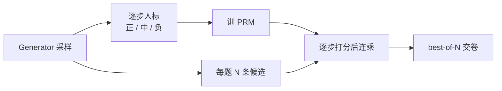

# Let's Verify Step by Step：过程监督能挑出对的解，78.2% 钉在 500 道 MATH 子集的 best-of-1860

<!-- release-date: 2023-05-31 -->

> 本文依据 OpenAI 发布的 **Let's Verify Step by Step**，即 arXiv:2305.20050**v1**（2023-05-31），共 29 页。封面水印为 `arXiv:2305.20050v1 [cs.LG] 31 May 2023`。截至 2026-09-10，arXiv 只有 v1。ICLR 2024 正式录用，但 arXiv 未换相机就绪版，解读以这份 v1 为准。页码均指这份 PDF。全文把三件事分开标注：**论文明确写了什么**、**我们如何解释它**、**哪些是外部资料补充**。
>
> 这不是一份「再做一个 GPT-4」的报告。大规模模型全部是从 **base GPT-4** 微调来的：只做过下一个词预测，没有经过 RLHF（PDF p.3）。不要读成「他们从零训了一个 GPT-4」。

## 读前把几个词说成人话

后文会反复出现这些名字，先说清楚：

- **MATH**：Hendrycks 等人的竞赛级数学题集。原划分是 7,500 道训练、5,000 道测试。这篇 **没有按原划分评测**。
- **思维链（chain-of-thought，CoT）**：不直接报答案，先把中间步骤写出来。这篇要求 generator 用换行把每一步切开，方便逐步打标。
- **结果监督（outcome supervision）**：只看最终答案对不对，给整条解答一个标签。
- **过程监督（process supervision）**：给推理的每一步打标。这篇用三档：正（positive）、负（negative）、中（neutral）。
- **结果监督奖励模型（outcome-supervised reward model，ORM）**：只拿最终对错来训，测试时用最后一个 token 的分数给整条解答打分。
- **过程监督奖励模型（process-supervised reward model，PRM）**：在每一步最后一个 token 上预测这一步对不对。
- **Generator**：固定的解题模型。它负责写候选解答，论文 **不用强化学习去改它**。
- **Best-of-N**：同一道题均匀采 $N$ 条解答，用奖励模型挑分最高的那条，再按最终答案自动判对错。这篇的主指标就是这个。
- **多数投票（majority voting）**：也叫自洽。采很多条，按最终答案票数决定，不训奖励模型。
- **主动学习（active learning）**：不随机给人看解答，优先挑「当前最好的 PRM 觉得很像对、但最终答案其实错」的样本。
- **PRM800K**：他们公开的逐步人标数据集。过滤后约 80 万条步级标签。

再补两个后文会用到的记号：

- 大规模那只最好的过程奖励模型，小规模实验里叫做 $\mathrm{PRM}_{\mathrm{large}}$。
- 小规模里先用来挑样本的模型叫做 $\mathrm{PRM}_{\mathrm{selector}}$。

## 一句话先说清

这篇论文要回答的不是「把生成器再训一遍会不会更会做数学」，而是：

> **生成器固定时，给奖励模型看每一步对不对，比只看最终答案，更能从一堆候选里挑出真正对的解。**

摘要里的「78%」必须落到具体评测上，不能读成 GPT-4 的 MATH 裸分，也不能读成用 PRM 做完强化学习之后的生成器成绩（PDF p.1–2、p.7）：

- **哪一套题**：MATH 原测试集里随机留下的 **500 道**。另外 4,500 道测试题进了 PRM800K 训练集，就是为了少过拟合那 7,500 道原训练题（PDF p.4–5、p.18）。
- **怎么交卷**：每题从 generator 最多采 1,860 条，用 PRM 挑最高分，再按最终答案自动判。表上写的是 **best-of-1860**。
- **对照同一口径**：PRM 78.2%，ORM 72.4%，多数投票 69.6%（PDF p.7 Figure 3）。

所以这篇最值得记住的，不是又一个更大的解题模型，而是一次监督信号的改写：

> **结果监督告诉模型「这条路最后到没到」；过程监督告诉模型「哪一步开始走偏」。在 MATH 这种一步错就全盘皆输的题上，后一件事更能把蒙对的解揪出来。N 越大，差距越拉开。**

## 一条阅读路线

原文 29 页，正文大约到第 13 页，后面是参考文献和附录 A–I。如果只读原文，建议按这个顺序：

1. **第 2 页的四条贡献 + 第 3 页 §2.1**：先看清他们评的是奖励模型的 best-of-N，不是用 RL 改 generator。
2. **第 4–6 页的标注界面、PRM800K 规模、以及「只标到第一个错步」**：这是过程监督比结果监督多出来的信息，也是人标成本为什么还能对齐。
3. **第 7 页 Figure 3**：78.2 / 72.4 / 69.6 都在这张表上；曲线随 $N$ 拉开，才是主结果。
4. **第 8–9 页 Figure 4**：大规模那张表不能直接横比，真正的过程 vs 结果对照在小规模合成监督；主动学习的 2.6 倍也在这里。
5. **第 10 页 Table 1**：新出的 AP / AMC，用来挡「是不是背过 MATH」。
6. **第 10–12 页 §6**：信用分配、负对齐税、以及 4,500 道测试题进训练集这件事，正文自己写了，不要藏。
7. **附录 B、C、F、G**：原始 108 万条如何滤成 80 万、500 道子集怎么抽、四种打分策略、按难度分层。

第 7 节相关工作第一遍可以只记一句：Uesato 等人在小学应用题上看到过程和结果差不多；这篇换到更难的 MATH、用更强的基座、标了多得多的过程数据，结论才反过来（PDF p.12）。

## 先看全景：一条「采、标、训、搜」的流水线

这是根据 PDF p.3–7 的方法段重画的机制示意，不是论文原图，也不含实测时间。

有一个很容易看漏的动作：**箭头从来不回到 generator。** 论文明确说，讨论过程监督和结果监督时，指的只是奖励模型拿到的监督；他们不讨论「如果用这个奖励模型做 RL，generator 还会拿到什么监督」。用 RL 微调 generator 是自然的下一步，但 **故意不是这篇的重点**（PDF p.3）。

**本文的读法是**：把这条流水线记成「验证器 + 搜索」，不要记成「训练了一个会逐步检查自己的 GPT-4」。后来用 PRM 做强化学习、用蒙特卡洛自动打过程分，都是后作，数字不要倒灌回来。

## 他们到底在跟什么较劲

### 矛盾一：多步推理里，一步逻辑错误就够毁掉整条解答

大模型已经能按思维链做复杂推理，但仍然会在没把握时编造事实。论文把这类假话叫做幻觉（hallucination）。在需要多步推理的领域，单步逻辑错误会带偏后面整条路（PDF p.1）。

于是问题从「模型会不会写步骤」变成「怎样发现步骤里的错」。一个有效办法是训奖励模型，用来区分好输出和坏输出，再拿它做强化学习，或做拒绝采样搜索（PDF p.2）。整套系统的上限就是奖励模型本身可不可靠。

### 矛盾二：只看最终答案，会把「过程错、答案蒙对」当正样本

Uesato 等人（2022）把奖励模型的训法分成两种（PDF p.2）：

- **ORM**：只看思维链的最终结果。
- **PRM**：给思维链的每一步反馈。

过程监督看起来更合理。它能指出错误发生的位置；对人来说更好解释；也更直接奖励「人认可的推理过程」。逻辑推理里，结果监督经常会奖励「推理错、答案对」的解（论文点名 Zelikman、Creswell）。Uesato 等人已经表明，过程监督能减轻这种未对齐行为。

但 Uesato 等人在小学数学上发现：两种监督的最终表现差不多。这篇换了三个条件再比一次（PDF p.2）：

1. 更强的基座；
2. 显著更多的人类反馈；
3. 更难的 MATH，而不是小学应用题。

### 矛盾三：人标过程很贵，所以必须先问值不值

MATH 的最终答案可以自动核对，结果监督几乎免费。过程监督没有简单的自动化办法，只能让人逐步打标（PDF p.3）。人类反馈贵，所以值得认真比较两种方法，而不是默认「标得越细越好」。

这也是他们同时做大规模和小规模的原因：大规模追求最强的 ORM 和 PRM，但两套训练集不可直接横比；小规模用大 PRM 代替人，才能把「过程 vs 结果」和「要不要主动学习」拆开（PDF p.3）。

## 方法：监督的是奖励模型，不是生成器

### 范围：固定 generator，只比谁更会挑

每个规模只用一个固定模型生成全部解答，叫做 generator。评奖励模型的办法是：对每道测试题，在 generator 均匀采样的解答上做 best-of-N，自动按最终答案打分，报告选对的比例。更可靠的奖励模型，应该更常把正确解答排到最前面（PDF p.3）。

**本文的读法是**：主指标测的是「验证器的检索能力」，不是「生成器第一次就写对」。邻居 RFT 走的是另一条路：拒绝采样留下结果正确的路径，再回头微调生成器。两边都在用采样，但一个改验证器，一个改生成器。不要把 RFT 的 maj1@1 数字写进这篇。

### 基座：从 GPT-4 微调，再加一层 MathMix

大规模模型全部从 base GPT-4 微调。这个 GPT-4 只做过下一个词预测，没有 RLHF（PDF p.3）。小规模基座设计上类似 GPT-4，但预训练算力大约少 200 倍。

所有模型还要再做一步数学向预训练：在大约 1.5B 个与数学相关的 token 上微调，这批数据叫 **MathMix**。他们引用 Lewkowycz 等人（Minerva），认为这能提高数学推理（PDF p.3–4）。细节在附录 A（PDF p.16）：

| 数据类型 | Token 数 | 是否已在预训练里 |
|---|---:|---|
| 数学题与解答 | 275M | 否 |
| 自由形式数学讨论（1） | 430M | 否 |
| 自由形式数学讨论（2） | 450M | 是 |
| 合成数据（1） | 30M | 否 |
| 合成数据（2） | 100M | 是 |
| 评语 / 打分数据 | 500M | 否 |

和 Minerva 的 38.5B token 比，MathMix 更小、过滤更狠，而且 **没有显式混入通用语言数据**——他们觉得里面已经有足够的自然语言。大规模大约训 2 个 epoch、合计约 3B token；小规模去掉评语数据、只剩约 1B，训 6 个 epoch、约 6.6B token（PDF p.16）。

他们对 MathMix 相对 MATH 测试集做了去污染，包括去掉 LaTeX 再搜匹配 n-gram，但明确说 **不能对去污染效果做强保证**（PDF p.16）。

### Generator：只教格式，不教新技能

为了方便按步切开，他们把 generator 训成「换行分隔的逐步格式」。具体做法：对 MATH 训练题做 few-shot 生成，滤到最终答案正确的，再拿这批数据对基座微调 **一个 epoch**。论文写得很死：这一步不是为了教 generator 新技能，只是为了让它按指定格式写（PDF p.4）。

**本文的读法是**：主实验里的「GPT-4」已经不是纯基座，而是「base GPT-4 → MathMix → 正确解答格式微调」。78.2% 里有这层格式微调的贡献，但论文没有单独消融「不做这一 epoch 会掉多少」。

### 数据收集：给人看逐步解答，标到第一个错步为止

标注员看到的是大规模 generator 写出的逐步解答。每一步标正、负或中，界面是 Figure 1（PDF p.4）：

- **正**：这一步正确，而且合理。
- **负**：这一步不正确，或不合理。
- **中**：有歧义。实际中，如果这一步有点误导，或者建议很差但技术上仍成立，就会标中。

允许中性标签，是为了把「歧义怎么处理」推迟到测试时：中性可以当正，也可以当负（PDF p.4）。附录 D 的操作定义更硬一点（PDF p.19）：

- 中性：在上下文里合适、合理、正确，而且只包含容易核对的计算。
- 正：满足中性，并且朝答案推进。
- 其余为负。

标注员 **不给参考解答**，以免被绑到某一条解题路径；但 **给最终标准答案**，因为有时能帮标注员纠正自己的误解（PDF p.19）。

整份步级标签叫 PRM800K。训练集含 80 万条步级标签，覆盖 75,000 条解答、12,000 道题（PDF p.4）。**这是本文把两处数字加在一起**：7,500 道 MATH 训练题（PDF p.18）加上 4,500 道 MATH 测试题（PDF p.5），等于 12,000。评测因此只剩 500 道。

不是随机把解答丢给人。如果错误很明显，人标的信息量低。他们优先给人看 **看起来很能骗过当前最好 PRM、但最终答案是错的** 解答，论文叫做 convincing wrong-answer solutions。「对错」只由最终答案决定，自动打分偶尔会判错。这类样本里，PRM 至少在某一步上是错的，所以信息量更大（PDF p.5）。

收集过程中，他们会在若干节点用最新数据重训 PRM。每一轮每题先生成 $N$ 条，只把最能骗人的 $K$ 条错解给人看。$K$ 可以按题切，也可以在全数据集上切。大规模做不起这些决策的消融，所以放到第 4 节用大 PRM 当打标预言机做代理实验（PDF p.5）。

过程监督 **故意只标到第一个错步**。这样和结果监督的信息差更干净（PDF p.6）：

- 正确解答：两种方法给出的信息一样，即每一步都对。
- 错误解答：两种方法都揭示「至少有一个错」；过程监督额外指出错在哪一步。
- 如果连第一个错步之后也标，过程监督的信息优势会更大。

对人来说，成本也更接近：不靠好核对的最终答案时，判断一条解答对不对，等价于找到第一个错步。MATH 大多有好核对的答案，他们预期更复杂的领域不会一直如此。

### ORM：沿用 Cobbe 等人的 token 级验证器

ORM 的训法接近 Cobbe 等人（2021）的 token-level verifier（PDF p.5、p.19）。从 generator 每题均匀采固定条数，让 ORM 预测整条解答对不对。实践中通常自动核对最终答案；原则上也可以由人提供。测试时用最后一个 token 的预测当整条分数。

自动打标不可靠：推理错但答案对的假阳性会被标成正。附录 E 的配方是：温度 1.0 均匀采样，不重平衡正负；只训 1 个 epoch，不用 dropout，也不联合做语言建模；每个 token 的目标都相同，等于整条解答的对错（PDF p.19）。

### PRM：在每一步末尾预测对错，整条分是逐步正确概率的乘积

PRM 在每一步最后一个 token 上预测这一步是否正确。这个预测就是一个 token，训练时最大化这些目标 token 的对数似然。因此 PRM 可以放进标准语言模型流水线，不需要特殊结构。测试时对整条解答做一次前向，就能得到所有步级预测（PDF p.5–6）。

比较多条解答时，需要一个标量。他们把一条解答的 PRM 分数定义成：**PRM 认为每一步都正确的概率**，实现上是各步正确概率的乘积。附录 F 还试了最小值，以及把中性当负；主文默认把中性当正、用乘积（PDF p.6、p.20）。

记第 $i$ 步被判为正的概率是 $p_i$，共 $T$ 步，则

$$
s(y)=\prod_{i=1}^{T} p_i
$$

乘积相对最小值，会对步数多的解答略有惩罚。论文自己写了这句（PDF p.20）。

## 大规模：同一张图上的 78.2、72.4、69.6

大规模 PRM 用 PRM800K 的步级标签来训。为了让 ORM 基线尽量强，他们从 generator 每题采 100 条均匀样本来训 ORM。这意味着（PDF p.7）：

- ORM 训练集和 PRM800K **没有重叠**；
- ORM 训练集大约大一个数量级；
- 两套数据仍然 **不能直接横比**。

只在 PRM800K 上训 ORM 会有问题，因为主动学习把数据严重偏向错解。他们试过把均匀样本混进 PRM800K 的超集再训 ORM，**没有提高 ORM**。

Figure 3 是全文最重要的一张图（PDF p.7）。Best-of-1860 的数字是：

| 方法 | 500 道 MATH 子集上解出的比例 |
|---|---:|
| PRM | 78.2% |
| ORM | 72.4% |
| 多数投票 | 69.6% |

三条观察是论文自己写下的：

1. ORM 略高于多数投票。
2. PRM 在所有 $N$ 上都高于两者。
3. **$N$ 越大，PRM 与另外两条的差距越宽。**

$N\le 1000$ 时，他们从每题总共 1,860 条里反复子采样，画出方差。他们还试过用奖励模型加权投票（RM-weighted voting）把 PRM 和多数投票合起来，**没有明显提升**（PDF p.8）。

**本文的读法是**：这张图支持的是「PRM 更会在大搜索预算下挑对解」，不是「PRM 让模型本身更会做题」。generator 的单次通过率在难题上可以低到百分之零点几（附录 I），78.2% 是搜出来的。ORM 在 $N$ 很大时几乎走平，PRM 还在涨，说明多出来的候选里，有一些「看起来像那么回事、其实中间错了」的解，只有逐步检查才能丢掉。

按难度切开会更清楚。附录 G 用 generator 的通过率把题分成五档（PDF p.21 Figure 6）：

- 过程与结果的差距 **在所有难度上都在**，不只出现在最难的题。
- 最容易的那一档，ORM 随 $N$ 增大还略降：能找到骗过 ORM 的对抗样本。PRM 在同一批样本上保持稳健。
- 增加采样次数，对最难那一档的正收益最大。这符合直觉：难题需要很多候选，才可能碰到一条既对又像那么回事的解。

图上没有另给数值表。从曲线能读到的量级是：最易档两者都接近 1；中间档 PRM 明显高于 ORM；最难档两者都低，PRM 仍在 $N$ 增大时继续涨。这些是读图，不是论文原表。

## 小规模合成监督：把两个混淆因素拆开

大规模 PRM 赢了，但有两个因素缠在一起（PDF p.8）：

1. 训练集不可比：PRM 数据来自主动学习、偏向错解，而且大约小一个数量级。
2. 最终答案打标会给「推理错、答案对」的解正标签，可能伤害 ORM。这件事该不该算进「结果监督」本身，并不显然。

人标太贵，没法直接消融。他们改用 $\mathrm{PRM}_{\mathrm{large}}$ 去监督小模型，用不大的成本模拟大量收集。Figure 4 报三个随机种子的均值和标准差（PDF p.8–9）。

### 过程 vs 结果：同一批解答，三种监督

从小规模 generator 每题采 1 到 200 条。对同一批数据给三种监督（PDF p.9）：

1. 来自 $\mathrm{PRM}_{\mathrm{large}}$ 的过程监督；
2. 来自 $\mathrm{PRM}_{\mathrm{large}}$ 的结果监督；
3. 来自最终答案核对的结果监督。

唯一差别是监督形式。附录 H 写了合成标签怎么造（PDF p.22）：$\mathrm{PRM}_{\mathrm{large}}$ 给某一步的负标签概率超过 20%，就当这一步错。阈值是任意的，理由是大 PRM 略微偏向正标签、校准不够。过程监督会把逐步标签返回到第一个被标负的步骤，模仿真人收集；结果监督则当且仅当每一步都被认为正确，才把整条标对。

Figure 4a 用 best-of-500 看数据量。过程监督在所有收集规模上都明显高于两种结果监督。Figure 4b 把每条曲线最好的奖励模型拿出来，看不同测试预算：用 $\mathrm{PRM}_{\mathrm{large}}$ 做结果监督，明显好过只核对最终答案。解释是：大 PRM 能给「答案对、推理错」的解更好的监督（PDF p.9）。

哪种结果监督才算更公平的基线，论文自己也不敢说死。最终答案更「结果」，但它的假阳性问题在 MATH 上可能被放大。用 $\mathrm{PRM}_{\mathrm{large}}$ 做结果监督，更接近假阳性没那么严重的领域。他们把后者当成更相关的基线，同时请读者自己判断（PDF p.9）。

**本文的读法是**：即便把「MATH 假阳性伤害 ORM」这个对过程监督最有利的因素拿掉，过程仍然赢。这才是小规模实验真正要守住的点。大 PRM 当老师，也会把自己的偏差传给学生，所以这是便宜的消融，不是和真人标注等价。

### 主动学习：同样的标签预算，约 2.6 倍数据效率

他们先用每题 1 条样本训一个小规模 $\mathrm{PRM}_{\mathrm{selector}}$，再用它给每题 1,000 条打分。训更大的奖励模型时，每题选 $N$ 条，其中（PDF p.9）：

- 80% 是 selector 认为最能骗人的错解；
- 20% 是剩下样本里最能骗人的（对错都要）。

选出来的样本用 $\mathrm{PRM}_{\mathrm{large}}$ 打分再训练。这样保证：样本在 selector 看来都比较能骗人，很大一部分已知至少有一个错，整份数据又不会过度偏向错解。

比较有无主动学习的最佳拟合线斜率，他们估计这种主动学习比均匀打标大约 **2.6 倍数据高效**（PDF p.9）。每题 200 条那一档略低于趋势线。他们给的最好解释是：200 已经占 1,000 条候选池的很大一块，多样性不够，主动学习的上行空间被堵住。

他们还初步试过在收集过程中反复重训 $\mathrm{PRM}_{\mathrm{selector}}$，观察到不稳定，诊断不出来，得到的奖励模型不比上面这套更好。他们仍然预期某种迭代重训会有用，但 **目前没有具体证据**（PDF p.10）。

大规模收集其实已经在用「迭代重训当前最好 PRM + 只给人看高分错解」。小规模 2.6 倍不能直接当成大规模人标的倍率，它是代理实验里的斜率比。

## 分布外：新出的 AP 和 AMC

为了看分布外泛化，他们拿大规模 ORM 和 PRM 去评一组留出的 STEM 题，来自当时最新的 AP Physics、AP Calculus、AP Chemistry、AMC 10 和 AMC 12。这些考试在预训练数据集编好之后才发布，所以他们有把握模型没见过（PDF p.10）。评测是 best-of-100。Table 1 如下：

| 来源 | ORM | PRM | 多数投票 | 题数 |
|---|---:|---:|---:|---:|
| AP Calculus | 68.9% | 86.7% | 80.0% | 45 |
| AP Chemistry | 68.9% | 80.0% | 71.7% | 60 |
| AP Physics | 77.8% | 86.7% | 82.2% | 45 |
| AMC 10/12 | 49.1% | 53.2% | 32.8% | 84 |
| 合计 | 63.8% | 72.9% | 61.3% | 234 |

正文写的是 224 道，表上四项相加是 234。**以 Table 1 为准**，224 多半是正文笔误（PDF p.10）。

趋势和 MATH 子集一致：PRM 高于 ORM，也高于多数投票。论文的结论只说到：PRM 能容忍适度的分布偏移，强表现在全新测试题上站得住。它没有声称「任何学科、任何题型都这样」。

AMC 上多数投票掉到 32.8%，ORM / PRM 仍在 50% 上下。这和 MATH 最难档一样：正确答案票数不够时，验证器比投票更有用。

## 讨论：信用分配、对齐，以及那 4,500 道测试题

### 信用分配：难的不是知道错了，是知道哪一步错

过程监督比结果监督更精确。ORM 要泛化，必须自己判断错解从哪一步开始偏。难题上大多数模型解答某处都有错，结果监督给的负标签边际价值低。过程监督更富：它既说明开头连续多少步其实是对的，也标出第一个错步的位置。论文相信，**更容易做信用分配，就是 PRM 更强的原因**（PDF p.10–11）。

**本文的读法是**：这是对 Figure 3「$N$ 越大差距越宽」的机制解释，不是单独消融。他们没有做「只告诉第一个错步的位置、不给逐步正标签」这种更细的对照。

### 对齐：他们把过程监督写成负对齐税

过程监督有几条跟对齐相关的好处（PDF p.11）：

- 更可能产生可解释的推理，因为它鼓励模型走被人认可的过程；
- 更直接奖励对齐的思维链，而不是拿结果当对齐行为的代理；
- 结果作为不完美代理，最坏情况下会让模型学会钻奖励的空子。

有些更安全的方法会换来性能下降，这个成本叫 **对齐税（alignment tax）**。对齐税会阻碍人们采用更安全的方法，因为部署压力总是偏向更强的模型。他们的结果是：在数学领域，过程监督实际上是 **负对齐税**——更安全，也更强。这可能提高采用率。这些结果能推广到数学以外多远，未知；他们把「在其它领域看过程监督」写成重要的未来工作。

**本文的读法是**：「负对齐税」是作者的对齐叙事，不是 Table 1 那种直接测量。实验测的是最终答案正确率，以及 PRM 能否标出人认可的步骤。它没有测奖励黑客、没有测非数学任务上的安全性，也没有把 generator 用 PRM 做 RL 后再看它会不会钻空子。后一件事恰恰被 §2.1 排除在范围外。

### 测试集污染：4,500 道 MATH 测试题进了训练集，这件事正文写了

MATH 测试题在网上很多地方讨论过，一部分很可能已经进了预训练。他们对 MathMix 用字符串匹配启发式试图去掉 MATH 题，但人可以发很难检测的改写，无法对重叠做强保证（PDF p.11）。

检查模型解答时，他们没看到明显在背 MATH。但无法排除更隐蔽的记忆，污染仍可能把 MATH 测试成绩略微抬高。即便如此，他们预期污染会以相似方式影响所有方法，相对比较大体不受影响。

他们还补了两条：PRM 经常能从 generator 通过率只有个位数百分比的题里翻出正确解（附录 I）；第 5 节在保证未污染的新题上看到定性相同的结果。因此他们认为污染没有显著影响这项工作（PDF p.11–12）。

另一件必须写清楚、而且更容易被二次引用藏起来的事，在 §2.4 和附录 C，不在 §6.3 的标题下：

> 为了避免在 7,500 道 MATH 训练题上过拟合，他们把 4,500 道 MATH **测试题** 加进训练集。评测只剩随机留下的 500 道。他们相信这 500 道的难度和科目分布能代表整个测试集，Figure 5 画了两张直方图（PDF p.5、p.18）。

**本文的读法是**：78.2% 不能直接和「在全部 5,000 道 MATH 测试题上、训练从未见过测试题」的数字横比。500 道是均匀随机抽的，科目和难度看起来齐，但方差一定比 5,000 道大；更重要的是，奖励模型在另外 4,500 道「原测试题」上见过大量逐步标签。论文把这写成减少过拟合的办法，不是偷偷换榜。读这篇的人应该把口径一起带走。

他们把具体 500 道的名单放到了 GitHub。这是外部补充，见文末。

## 相关工作：和 Uesato 的表面冲突，被数据量解释掉

§7 分三块（PDF p.12–13）。

**过程 vs 结果。** 最近的前作是 Uesato 等人（2022）在小学数学上的比较：两种方法最终答案错误率相近，过程监督用更少数据达到同样结果。核心方法很像，差别有三：这篇用更强的模型收集 PRM800K 并做大规模实验；评的是比 GSM8K 难得多的 MATH；过程监督数据量大得多。小规模第 4 节说明，不一定要大规模模型才能看到过程监督的好处。

表面上，Uesato「两者差不多」和这篇「过程更好」冲突。他们用 Figure 4a 的数据规模趋势来解：少量过程监督加上大量结果监督，成绩可以接近，这和 Uesato 一致；过程监督放大之后，即便只按最终结果评判，也会超过结果监督，这和他们第 3 节一致。

**合成监督。** Gao 等人（2022）用大奖励模型监督小模型，研究 RLHF 过优化。那类实验需要大量人类偏好，所以用金牌奖励模型代替人。这篇用大规模奖励模型监督小奖励模型，和他们相近。

**自然语言推理。** Minerva 说明在大量技术内容上微调能显著提高 MATH；Wang 等人的自洽在很多推理基准上很强，而且不用额外微调；Wei、Nye 说明中间步骤（思维链 / scratchpad）对多步任务很关键；Kojima 说明只靠一句简单提示也能零样本引出这种行为。

邻居 RFT 的位置在这里对照一句就够：RFT 承认过程奖励这条前作，自己选的是不训过程奖励、只按结果收下正确路径再微调。本站 RFT 篇是结果级拒绝采样；本篇是步级人标 + 验证器搜索。后作会继续走自动过程标注。其中本批并行的 Qwen-Math-PRM 尚未发布，这里只点名一句：**后作会批评蒙特卡洛估计过程分、以及 best-of-N 这种口径**，具体数字等那一篇自己写，不编进本文。

## 结论：他们公开的是过程标签，不是一个更强的解题策略

第 8 节很短（PDF p.13）。三句话：

1. 在数学推理里，过程监督能训出比结果监督可靠得多的奖励模型。
2. 主动学习可以只把最有价值的模型输出给人看，从而降低人标成本。
3. 他们公开 PRM800K，希望去掉这道显著的入门门槛，推动大模型对齐相关研究。

他们认为过程监督目前仍被低估，并希望后续工作更深入地看这些方法能推广多远。

致谢里点名 Scale 和许多标注员做出了 PRM800K；MathMix 有 Giambattista Parascandolo 和 Daniel Selsam 的贡献（PDF p.13）。

## 附录里不该跳过的细节

### PRM800K 的两阶段，以及「错解里仍有很多对的步骤」

他们一共收集了 1,085,590 条步级标签，覆盖 101,599 条解答，这份未过滤数据也叫 PRM800K。训练时丢掉质控标签，以及标注员没能完成的步骤，滤完大约 80 万条、7.5 万条解答（PDF p.17）。

**第一阶段**大约只占 5%，约 4 万条步级标签。这一阶段会在每一步收集多个候选续写。种子数据有了，但很笨：很多候选重复，标注员把时间耗在又长又无聊的解答上，标签也更重复。

**第二阶段**把流程改成可放大的：预生成整条解答，遇到第一个负步骤就停。一共 10 代。每一代从 generator 每题采 $N$ 条，用当前最好 PRM 排序，把最高分错解给人。每一代之间用全部最新数据重训 PRM。偶尔会手动注入正解，或因为自动打分出错而看到正解，但这一阶段绝大多数标签都在错解上。

Table 3 把正负平衡写出来了（PDF p.17）：

| | 第一阶段 | 第二阶段 | 合计 |
|---|---:|---:|---:|
| 最终答案正确的解答占比 | 85.1% | 13.2% | 14.2% |
| 步骤正确占比 | 58.6% | 74.1% | 73.1% |

第二阶段绝大多数解答是错的，但步骤正确率反而更高。因为他们标到第一个错步就停，前面那些步经常是对的。小规模 4.2 节认为：这种偏向高分错解的主动学习，尽管数据不平衡，仍然提高了成绩。

第二阶段有质控题。研究者先标出哪些步骤标负是合理的，再看标注员能不能稳定把那些步骤标负。进入第二阶段前，每人先标 30 道质控，和金牌标签一致率至少 75% 才录取。之后每一代指定 10–20 道题做持续质控，随机插进任务流，用来淘汰质量下滑的人，并据此写常见错误教材（PDF p.17–18）。

**外部补充，不是本 PDF 的数字。** GitHub [openai/prm800k](https://github.com/openai/prm800k) 把三档标成 $-1/0/+1$，和正文的负 / 中 / 正对应。字段里能看到 `generation`、`is_quality_control_question`、`is_initial_screening_question`、`finish_reason`。`finish_reason` 可以是找到错误、到达正确解答、题目坏了、或标注员放弃。仓库在 2026-05-29 被归档为只读。这些是发布后的数据格式说明，不要当成论文正文里的超参。

### 四种打分策略：78.2% 来自「中性当正 + 连乘」

Table 4 是 best-of-1860（PDF p.20）：

| | 连乘 | 取最小 |
|---|---:|---:|
| 中性当正 | 78.2% | 77.6% |
| 中性当负 | 77.4% | 77.8% |

最好的是连乘且中性当正，但四种策略差距很小。主文全部用这一档。PRM 训 2 个 epoch；从小数据看到 2 个 epoch 好过 1 个，再加 epoch 到某个点就不再明显有用。超参在 PRM800K 的前约 10% 上扫过。从普通语言建模改成这种分类，分布偏移很大，他们发现低学习率对稳定很重要（PDF p.20）。具体学习率没写。

### 附录 I：PRM 能从通过率 0.1% 的题里翻出正解，也会被计数错误骗过

所有例子都来自大规模 generator（GPT-4），并注明 generator 通过率，用来感觉难度。True positive 是挑过的：PRM 在 1,860 条里排第一且确实对。例如 Problem 1 通过率 0.1%，一长串不明显的三角恒等变换；Problem 4 通过率 4.5%，用到 Sophie-Germain 恒等式（PDF p.23–25）。

True negative 说明它能抓住「用了平方差但式子并不是平方差」、口算错、因式分解错（PDF p.25–27）。False positive 则集中在计数和漏项：换同色球少乘 2、合并同类项时右边忘了动、循环小数漏前导零、数列周期 10 却写成 12（PDF p.27–29）。论文把这些当例证，不是错误率统计。

## 可以带回自己项目的原则

**一、先分清你在优化生成器还是验证器。**
这篇的 78.2% 是固定 generator 之后的 best-of-N。如果你的线上只能贪心解一次，这个数字搬不过去。邻居 RFT 优化的是一次解码；这篇优化的是「采一堆再挑」。先写清预算是 $N=1$ 还是 $N=1860$。

**二、78% 这类主张必须带口径。**
要写清：哪一个测试子集、训练有没有见过原测试题、N 是多少、选的是 PRM 还是投票。这篇自己把 4,500 道测试题放进训练集；藏掉这一句，78.2% 就会被读成标准 MATH 榜。

**三、结果监督的假阳性是方法问题，不只是打分 bug。**
自动核对最终答案，会把「过程错、答案对」标成正。MATH 上这个问题被放大。如果你的任务容易蒙对，ORM 会系统性地学坏；PRM 的好处有一部分就是在打这些假阳性。

**四、过程标签不必标完整条错解。**
只标到第一个错步，信息差已经成立，人标成本也更接近「判断整条对不对」。错解里仍然能积累大量正确步骤，Table 3 就是证据。

**五、给人看的样本，应该是当前验证器会看走眼的。**
均匀展示会把预算耗在明显的错上。优先标「高分但最终答案错」的解，等于专打验证器的盲区。小规模里这值大约 2.6 倍数据效率；大规模人标没有对照实验，不能把 2.6 直接写成省了多少钱。

**六、中性标签是在买推迟决策的权利。**
训练时保留三档，测试时再决定中性当正还是当负。这篇四种策略只差一个点左右，说明主结论不靠这个选择撑着。真正贵的是「这一步到底算不算推进」。

**七、搜索预算加大时，才看得出验证器好不好。**
$N$ 小的时候，PRM 和 ORM 都还能碰对；N 大了，ORM 会开始挑中能骗过自己的对抗样本，PRM 还能继续涨。只报一个固定 $N$ 的点，看不出这件事。

**八、不要把 best-of-N 的验证器成绩，说成模型学会了逐步自检。**
这篇没有用 PRM 做 RL，也没有让 generator 在写的时候调用 PRM。后作会把过程奖励接到策略训练上，那是另一篇的因果链。

## 关键词回看

- **过程监督 / PRM**：逐步打标，再在每一步末尾预测对错。主分数是各步正确概率的连乘。
- **结果监督 / ORM**：只看最终对错；每个 token 共用同一个目标，测试时用最后 token 的分。
- **Generator**：固定解题模型。大规模从 base GPT-4 微调；本篇不用 RL 改它。
- **Best-of-N**：每题均匀采 $N$ 条，用奖励模型挑最高分再自动判。主结果是 $N=1860$。
- **PRM800K**：过滤后约 80 万条步级人标，覆盖 7.5 万条解答、1.2 万道题。原始未过滤是 1,085,590 条、101,599 条解答。
- **500 道子集**：MATH 原 5,000 道测试题里随机留下的 500 道；另外 4,500 道进了训练。
- **Convincing wrong-answer**：当前最好 PRM 打分高、但最终答案错的解。主动学习优先标这些。
- **2.6×**：小规模里，主动学习相对均匀打标的数据效率，来自拟合线斜率，不是大规模人标的对照。
- **MathMix**：约 1.5B 数学相关 token 的轻量预训练层；大规模约 2 个 epoch / 3B token。
- **负对齐税**：作者对「过程监督既更安全又更强」的叫法，范围限于数学、且评的是验证器而不是 RL 后的策略。
- **只标到第一个错步**：有意限制过程监督的信息优势，使人标成本和结果监督更可比。

## 最后的判断

这篇最值得记住的，不是 78.2% 这个分数，而是它把「逐步检查有没有用」做成可以分开验证的几件事，并且把评测口径写在明处。

**被表格直接支持的：**

- 在 500 道 MATH 子集、best-of-1860 上，PRM 78.2% > ORM 72.4% > 多数投票 69.6%，且 $N$ 越大 PRM 领先越多（PDF p.7 Figure 3）。
- 四种 PRM 打分策略都在 77.4%–78.2%，主结论不靠某一种归约（PDF p.20 Table 4）。
- 新出的 AP / AMC 上，best-of-100 仍是 PRM 72.9% > ORM 63.8% > 多数投票 61.3%（PDF p.10 Table 1，合计 234 道）。
- 小规模里，同一批解答上过程监督高于两种结果监督；用大 PRM 做结果监督又高于只核对最终答案（PDF p.8–9 Figure 4）。
- 主动学习相对均匀打标，拟合斜率大约 2.6 倍数据高效（PDF p.9）。
- 第二阶段 86.8% 的解答最终是错的，但步骤正确率 74.1%，说明「标错解」仍能积累大量正步骤（PDF p.17 Table 3）。

**有实验、但归因不完整的：**

- 「信用分配更容易解释了 PRM 更强」（PDF p.10–11）——和 Figure 3、Figure 6 一致，没有把「只给第一错步位置」单独消融。
- 大规模 ORM / PRM 训练集不可比，作者自己承认；小规模合成监督是补丁，老师仍是大 PRM，不是人。
- 迭代重训 selector 失败，他们预期某种迭代会有用，但写明没有证据（PDF p.10）。
- 污染「会差不多地影响所有方法，所以相对比较仍成立」（PDF p.11）——这是判断，不是测量。

**只是作者观察或外推的：**

- 数学领域过程监督是负对齐税（PDF p.11）。测到的是验证器准确率，不是 RL 之后的安全行为。
- 这些结果能推广到数学以外多远，未知。论文把这句话写在结论里。
- 正文 224 道 OOD 和 Table 1 的 234 不一致，只能当笔误处理，以表为准。

**完全没公开、或公开了但对不齐的：**

- 没有用 PRM 或 ORM 对 generator 做强化学习。§2.1 写明了。
- GPT-4 和「类似 GPT-4、算力少约 200 倍」的小规模模型，参数量、层数、上下文长度都没写。
- PRM / ORM 的学习率、batch、训练步数，除了「低学习率很重要」「PRM 2 个 epoch、ORM 1 个 epoch」之外没有完整配方。
- 大规模主动学习的 $N$、$K$、按题切还是全局切，没有对照数字。
- MathMix 的具体来源、合成数据怎么造、评语数据是什么，Table 2 只有类别和 token 数。
- 没有报告 500 道子集上多次划分的方差，也没有在全部 5,000 道原测试题上的对照。
- 标注员人数、人均题量、和金牌标签的持续一致率，除录取门槛 75% 外没有完整质量表。

如果只记一句话：

> **78.2% 不是 GPT-4 会做 MATH 的分数。它是：把 4,500 道测试题放进训练之后，在剩下 500 道上采最多 1,860 条，用逐步人标训出的验证器挑出来的成绩。过程监督赢在能指出哪一步开始错，而这篇故意没有用这个验证器再去训生成器。**

## 资料与阅读边界

- 原始依据：本地 `papers/OpenAI/Lets-Verify-Step-by-Step.pdf`，即 arXiv:2305.20050v1，页边日期 31 May 2023，共 29 页。封面正式标题为 *Let's Verify Step by Step*。第一作者行是 Hunter Lightman、Vineet Kosaraju、Yura Burda、Harri Edwards；第二行 Bowen Baker、Teddy Lee、Jan Leike、John Schulman、Ilya Sutskever；第三行 Karl Cobbe。标了星号的主要作者是 Lightman、Kosaraju、Burda、Cobbe，通信作者 Karl Cobbe。归属 OpenAI。
- 版本核验：[arXiv 论文页](https://arxiv.org/abs/2305.20050)。提交历史只有 **[v1] 2023-05-31 17:24:00 UTC**（10,363 KB）。截至 2026-09-10 最新版本仍是 v1，与本地原件一致，**不需要替换 PDF**。ICLR 2024 录用；解读仍以这份 v1 为准。卡片上的首发日取官方博客与 arXiv 同日的 2023-05-31。
- 官方博客：[Improving mathematical reasoning with process supervision](https://openai.com/index/improving-mathematical-reasoning-with-process-supervision/)，日期 May 31, 2023。这是外部补充。博客把同一套工作写成「逐步奖励而不是只奖励最终答案」，并强调对齐收益；数字和设定仍以 PDF 为准。
- 官方数据与评测代码：[openai/prm800k](https://github.com/openai/prm800k)。这是外部补充。仓库提供 phase1 / phase2 的 jsonl、两阶段标注说明、非标准 MATH 划分（`math_splits/`）、Figure 3 用的大规模打分样本，以及基于 sympy 的答案核对（`grader.grade_answer`）。README 写明：解在 1,024 token 内没写出答案的样本被丢掉，所以有的题不足 1,860 条，评测逻辑会把这件事算进去。仓库已于 2026-05-29 归档。
- 评测集：[MATH](https://arxiv.org/abs/2103.03874)（Hendrycks 等人）。原训练 7,500、原测试 5,000；本 PDF 改成训练 12,000（含 4,500 道原测试题）、测试 500。
- 基座模型：本站 **GPT-4 篇** 对应 OpenAI 2023 的 GPT-4 技术报告。本 PDF 用的是未经 RLHF 的 base GPT-4，再加 MathMix 和格式微调；不要把 GPT-4 报告里的公开 MATH 分数和这篇的 78.2% 混成一张表。
- 方法前作，只在相关工作里作为对照，不把它们的数字写成这篇的实现：Uesato 等人（2022）的过程 / 结果反馈（GSM8K）、Cobbe 等人（2021）的 GSM8K 验证器、Wang 等人的自洽、Lewkowycz 等人的 Minerva、Gao 等人（2022）的奖励模型过优化、Stuhlmüller 与 Byun 的 *Supervise process, not outcomes*。
- 邻居与后作不要倒灌：本站 **RFT 篇** 是结果级拒绝采样 + 再做 SFT，主指标是一次贪心解码；本篇是步级人标 + 冻结 generator 上的 best-of-N。Math-Shepherd 一类用蒙特卡洛自动打过程分的工作、以及后来把 PRM 接到 RL 上的训练配方，都不是这份 2023-05 的 PDF。本批并行的 **Qwen-Math-PRM** 尚未发布，正文只保留「后作会批评 MC 估计与 BoN 口径」这一句，不写入任何它的数字。
