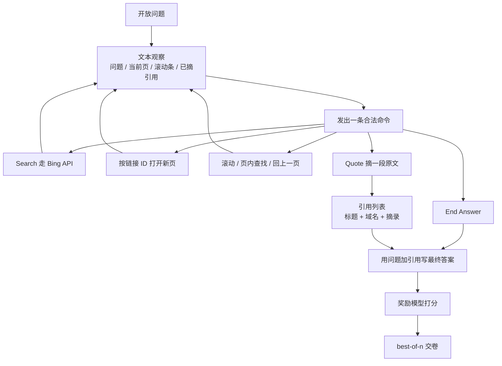

# WebGPT：把长问答做成可示范的文本浏览，最好模型是行为克隆加拒绝采样，不是 PPO

<!-- release-date: 2021-12-16 -->

> 本文依据 OpenAI 发布的 **WebGPT: Browser-assisted question-answering with human feedback**，即 arXiv:2112.09332**v3**、2022-06-01 修订、共 32 页的 letter 预印本。封面作者前三位 Reiichiro Nakano、Jacob Hilton、Suchir Balaji 同等贡献、顺序随机，通讯还包括 Jeff Wu、Long Ouyang 与 John Schulman，归属 OpenAI。页边水印为 `arXiv:2112.09332v3 [cs.CL] 1 Jun 2022`。pdfinfo 的 Title/Author 为空，标题与作者以封面为准。页码均指这份 PDF。截至 2026-09-10 核验，[arXiv:2112.09332](https://arxiv.org/abs/2112.09332) 最新仍是 v3：v1 于 2021-12-17 05:43:43 UTC 上传，v2 于 2022-03-12，v3 于 2022-06-01 19:08:11 UTC；本地原件 32 页、CreationDate 2022-06-03，与 v3 一致。全文把三件事分开写：**论文明确写了什么**（带页码）、**本文如何解释它**、**外部资料补充**。
>
> 这是一份 **2021 年的技术论文**，讲的是在 GPT-3 上接一个文本浏览器、用人类示范和偏好做长问答，不是新架构，也不是后来的 ChatGPT 浏览或 Deep Research。基座规格见同仓 [GPT-3](/reports/OpenAI/GPT-3)；本文不把 300B Token 或 $C\approx 6ND$ 写进 WebGPT 的「论文写了什么」。同仓 [InstructGPT](/reports/OpenAI/InstructGPT) 是 2022 年 1 月才公开的指令对齐工作，配方相近但任务不同，数字不要混读。
>
> **`release-date` 取 2021-12-16。** 这篇文章覆盖的是 WebGPT 这套「浏览器辅助问答 + 人类反馈」方法。OpenAI 官方博客 [WebGPT: Improving the factual accuracy of language models through web browsing](https://openai.com/index/webgpt/) 页面日期为 December 16, 2021；当时推文链到 `openai.com/blog/improving-factual-accuracy/`，Wayback 上 `openai.com/blog/webgpt/` 的快照同样标 December 16, 2021。arXiv v1 是次日 2021-12-17。按手册取最早的官方公开事件，因此卡片日期是博客日，不因 v3 回写。这是研究原型，不是对外可用的产品权重。

## 读前把几个词说成人话

这篇几乎不改 GPT-3 的结构。它改的是**任务形态**：从「凭参数记忆直接写一段话」，改成「先用文本浏览器上网找证据，再根据摘下来的引用写答案」。后面会反复出现这些名字：

- **长问答（Long-Form Question Answering，LFQA）**：问题是开放的，答案是一整段话，不是一个实体名。本篇主评测集是 Reddit 的 **ELI5**（Explain Like I'm Five，用五岁能懂的话解释）。
- **文本浏览器**：模型看不到像素，只看到当前页被压成文字后的观察，再发出一条合法命令。命令包括搜索、点链接、滚动、页内查找、摘引用、结束浏览。
- **引用（reference / quote）**：浏览时从网页里摘出的一段原文，带着标题和域名。最终答案必须靠这些引用支撑，标注员才不用自己去做一轮独立调研。
- **行为克隆（Behavior Cloning，BC）**：拿人在同一套浏览器里的操作当标签，做监督微调。它是模仿，不是直接优化「答案好不好」。
- **奖励模型（Reward Model，RM）**：输入「问题 + 带引用的答案」，吐出一个标量。分数按 Elo 来解释：两个分数的差，是「人更喜欢前者」的 logit。
- **近端策略优化（Proximal Policy Optimization，PPO）**：一种强化学习算法。本篇用它在浏览环境里继续微调 BC 模型，奖励是回合结束时的 RM 分，再加一项相对 BC 的 KL 惩罚。
- **拒绝采样 / best-of-n（Rejection Sampling）**：同一题采 $n$ 条完整答案（含浏览轨迹），用 RM 挑分最高的那条交卷。不更新权重，只多花推理算力。
- **TruthfulQA**：专门构造来骗模型复述常见错误信念的短问答集。真实（truthful）和有信息量（informative）会打架：说「无可奉告」算真实，但不算有信息量。

基座是 Brown 等人 2020 年的 GPT-3 家族，本篇用了 760M、13B、175B 三档（PDF p. 4）。不要把它读成一篇新 Transformer 报告。

## 一句话先说清

2021 年的长问答有两截旧问题。一截在检索：REALM、RAG 这类工作把「找哪篇文档」做成可微的内积检索，接不进搜索引擎这种不可微工具。另一截在评价：一段开放答案是不是事实正确，标注员很难自己查，于是优化目标会滑向流畅、像人，而不是可核验。

WebGPT 的回答是：

> **不发明新检索器。把微软 Bing 搜索和 GPT-3 的合成能力包进一套人也能操作的文本浏览器；先模仿人类示范学会命令，再拿成对偏好训奖励模型。主结果里最好的模型，是行为克隆之后对奖励模型做拒绝采样，不是把 PPO 跑到底。**

这条主张必须落到具体评测上，不能读成「全面超过人类」或「RLHF 的标准配方就是 PPO」：

- **56%**：175B、best-of-64 的答案，在留出题上被同一套比较协议偏好于人类示范者；平局记成 50%（PDF p. 1–2、5）。
- **69%**：同一模型去掉引用后，被另一批没读过详细说明的承包商偏好于 ELI5 里 Reddit 票数最高的回答（PDF p. 1–2、5）。
- **主评测的三个 WebGPT 检查点都是「BC + 同尺寸 RM 上的拒绝采样」**：760M best-of-4、13B best-of-16、175B best-of-64。作者明确写：结合拒绝采样之后，PPO 没有显著好处，所以主评测为了简单把 RL 排除了（PDF p. 5、7–8，Figure 4）。
- **TruthfulQA**：最好模型真实 75%、真实且有信息量 54%，超过 GPT-3，仍低于人类（PDF p. 2、7）。

所以这篇最值得记住的，不是又一个会搜索的 GPT，而是一次任务改写：

> **先把「上网找答案」做成人和模型能共用的动作空间，再用引用把事实核验从「独立调研」降成「看引用支不支持这句话」。模仿解决「会不会用工具」；拒绝采样解决「同一题多试几次，事后挑最好的」。PPO 在这里是配角。**

## 一条阅读路线

原文 32 页，正文大约到第 12 页，其后是参考文献和附录 A–K。如果只读原文，建议按这个顺序：

1. **p. 1 摘要 + p. 2 的 56% / 69% / 75%**：先看清最好模型是 BC + 拒绝采样，不是 PPO。
2. **p. 2 Figure 1 + p. 3 Table 1**：人看到的图形界面和模型看到的文本观察是同一套动作。
3. **p. 4 §3.2 的四条训练方法**：BC、RM、PPO、best-of-n 各自吃什么数据、产出什么。
4. **p. 5–7 的 Figure 2、Figure 3**：ELI5 对人、对 Reddit，以及 TruthfulQA；注意 Figure 2(a) 里连贯性并没有过 50%。
5. **p. 7–9 的 Figure 4–8**：为什么拒绝采样压过 PPO，以及 $n$ 和参数量怎么换。
6. **p. 9–11 的讨论**：模仿性谬误、看起来更权威的风险、引用会被挑、在线网页的副作用。
7. **附录 A、C、E、G、K**：环境实现、标注协议、超参、TriviaQA、公开的比较数据。

第 7 节相关工作第一遍可以只记一句：可微检索优化快，但接不进搜索引擎，也不好检查模型到底看了哪一页（PDF p. 11–12）。

## 先看全景：先浏览摘引用，再写答案，再用奖励模型挑

这是根据 PDF p. 2–5 的环境与训练段重画的**机制示意图**，不是论文原图，也不含实测时间。箭头表示一次回合里的数据流。论文没有另画一张端到端系统图；Figure 1 只给了某一时刻的观察。

这条流水线要记住的不是名词堆叠，而是因果顺序：

**命令格式模型不会零样本就会 → 必须先有人类示范；只模仿示范优化不到「答案好不好」→ 必须再收集成对比较；事实对不对很难直接判 → 必须强迫模型边浏览边摘引用；环境不可预测、奖励模型容易被 PPO 钻空子 → 主结果改用拒绝采样，让模型多试几次再事后挑选。**

## 主要矛盾：长问答卡在检索和核验两头，不卡在「会不会写流畅段落」

论文没有从「我们做了一个 web agent」开场，而是先钉死 2021 年 LFQA 卡在哪（PDF p. 1–2）。

当时的工作把长问答拆成两截：信息检索，和把检索到的材料合成一段话。WebGPT 不打算把这两截各自再发明一遍。检索外包给已经很强、而且会更新的 **Bing Web Search API**；合成靠 GPT-3 预训练里已经涌现的阅读理解和摘要能力。作者说，他们要改的是**把这两截接起来的训练目标**，让目标更忠实于「答案对人有没有用」（PDF p. 1）。方法上跟随 Stiennon 等人 2020 年用人类反馈做摘要的那条线。

这和同仓 GPT-3 解读里的主要矛盾是两件事。GPT-3 问的是：能不能用提示代替每个任务再微调一遍。WebGPT 问的是：提示已经能写出流畅长答案了，但模型会编造，人也很难核。前者改的是**用法**；后者改的是**环境和监督信号**。

两个具体贡献写在引言里（PDF p. 2）：

1. **文本浏览环境**，微调后的语言模型可以逐步交互。检索和合成因此能用模仿学习和强化学习做端到端改进。
2. **答案必须带引用**。标注员判断事实对不对时，不必自己做一轮困难、主观的独立调研。

没有第二点，第一点会退化成「模型会点搜索框」。有了第二点，人的反馈才可能对准事实，而不是对准文风。

## 核心设计一：人和模型共用一套文本浏览器

### 旧问题

REALM、RAG 把「这篇文档和这个问题有多相关」写成可微的内积（PDF p. 12，式 1）：

$$
p(\text{passage}\mid\text{query})\propto\exp\bigl(\operatorname{embed}(\text{passage})\cdot\operatorname{embed}(\text{query})\bigr)
$$

好处是检索器和问答组件可以一起反传。代价有两头：搜索引擎、点击、滚动都不可微；模型内部到底看了哪一段，也不容易打开给人检查。作者选择不走这条路。现代搜索引擎已经足够强，也索引了足够新的网页。把任务收成「人本来就会的：打开搜索引擎查问题」，语言模型才能模仿人（PDF p. 3）。

### 新设计：观察是一段文字，动作是一条命令

每个时间步，模型拿到的不是网页截图，而是一份**当前环境状态的文字摘要**：问题、已经摘下的引用、过去动作、当前页标题、滚动条位置、当前光标附近的正文（PDF p. 2 Figure 1(b)、p. 3）。它必须发出 Table 1 里的一条命令，其它文本算非法动作。非法动作仍计入步数上限，除此之外被忽略（PDF p. 3）。

| 命令 | 作用 |
|---|---|
| `Search <query>` | 把查询发给 Bing API，展示结果页 |
| `Clicked on link <link ID>` | 按页面上的链接编号打开新页 |
| `Find in page: <text>` | 找下一处出现并滚过去 |
| `Quote: <text>` | 若当前页找得到这段文字，就把它收进引用 |
| `Scrolled down / up <1, 2, 3>` | 向下或向上滚若干次 |
| `Top` | 滚到页顶 |
| `Back` | 回上一页 |
| `End: Answer` | 结束浏览，进入写答案 |
| `End: Nonsense / Controversial` | 结束浏览，并且不写答案 |

这张表来自 PDF p. 3 Table 1，命令原文保留英文。

每一步都是**新的上下文**。模型没有对过去步骤的隐式记忆，只能靠观察里那份「Past actions」摘要（PDF p. 3）。人在图形界面里则不必看这份摘要，因为人自己记得刚才点过什么（PDF p. 17）。

摘引用时，环境记下页标题、域名和摘录，供后面写答案和给人检查。浏览在三种情况下结束：模型发出 End、动作数到上限、或引用总长度到上限。此时只要至少有一条引用，就把问题和引用拼成新提示，让模型写最终答案（PDF p. 3）。

人用的图形界面和模型用的文本观察，展示的是同一份状态、同一套合法动作（PDF p. 2 Figure 1）。这不是装饰。它保证示范数据在动作空间上对得齐：人能做的，模型也能做；模型要学的命令，人按按钮就能产生。

### 环境里几条容易被忽略的护栏

附录 A 把实现写具体了（PDF p. 15）：

- 新页面用 Node.js 抓 HTML，再用 Mozilla 的 Readability.js 抽正文；其余 HTML 走 html2text；PDF 走 pdfminer.six。
- 搜索结果和链接里，reddit.com 与 quora.com 会被去掉，防止模型直接抄 ELI5 原帖。
- 链接被改写成带编号的特殊格式，点链接时用的就是这个编号。
- 任何与问题（若有参考答案，也包括参考答案）有 **10-gram 重叠** 的页面会被审查掉，换成错误信息，防止作弊。
- 引用时忽略大小写和空白，并允许 `<start>━<end>` 这种省 token 的缩写。

**可迁移的部分。** 想让语言模型用工具，先问「人和模型能不能看见同一份状态、发出同一组动作」。动作空间小、观察是文本、每步上下文刷新，这三件事让示范变得可采集。护栏也是训练目标的一部分：不屏蔽 Reddit，ELI5 上的分数会掺进「会不会抄原帖」。

代价同样清楚。这不是通用浏览器：没有填表、没有执行 JavaScript 之后的动态应用、没有多标签并行。后文 6.5 节会把「故意不给这些能力」写成安全边界，而不是功能没做完。

## 核心设计二：引用，是为了让人判得了事实，不是为了看起来专业

### 旧问题

开放答案可以又长、又技术、又含糊。让标注员判断「这句话在世界上是不是真的」，既慢又吵。没有稳定的事实标签，后面的奖励模型就没有可学的信号。

### 新设计：不要求独立调研，只要求「有没有被可靠引用撑住」

比较任务的操作定义写在附录 C.2（PDF p. 17–18）。承包商逐步做完：读问题 → 读答案和引用 → 给引用打可信度 → 给每条主张标支持强度和相关性 → 再比另一边 → 最后给一个总体有用性。支持的意思是：要么有可靠引用撑着，要么是常识。**不要求他们自己再去搜一遍。**

总体评分的大致优先级是（PDF p. 18）：

1. 有没有无依据信息；
2. 核心问题答了没有；
3. 有没有额外有用信息；
4. 是否连贯、有没有引用错误；
5. 无关信息有多少（极端情况下可以提前）。

量表是五档：A 好很多 / A 更好 / 一样好 / B 更好 / B 好很多。尽管界面很复杂，**训练只用最后一档总体比较**，而且「好很多」和「更好」被合并。辅助头去预测那些细标注，并没有明显提高奖励模型的验证准确率（PDF p. 18）。

这就是「引用」在这篇里的真正作用。§6.4 把它写成三条好处（PDF p. 11）：

- **反馈更准**：判断「这句话被这组来源支持了没有」，比判断「这句话在世界上是不是真的」容易。
- **反馈更干净**：程序更容易写清楚，标注员之间更一致，数据效率更高。
- **可检查**：整段浏览过程可以回放，终端用户也可以自己点开源。

论文同时把刀刃翻过来：当前程序会激励模型**专挑标注员觉得能服人的引用**，哪怕那些引用并没有公平代表证据。接受问题里的隐含前提，已经是早期迹象。更强的模型和更主观的问题会把这件事放大。作者提到的后路是辩论（debate）、递归奖励建模、迭代放大：让模型去找支持和反对两边的证据（PDF p. 11）。这些是讨论，不是本篇做过的实验。

**可迁移的部分。** 想用人类反馈优化真实性，先改评价任务，再改模型。把「这句话是不是真的」改成「这句话有没有被可靠来源支持」，标注才规模化。代价是：你优化的变成了「看起来有依据」，不是「依据全面」。引用从第一天起就既是监督信号，也是可被钻的奖励漏洞。

## 数据：大约六千条示范、两万条比较，几乎都是 ELI5

人和模型都不会零样本就发出 Table 1 那种命令。所以必须先采集**示范**：人用图形界面回答问题，逐步点搜索、点链接、摘引用、写答案。只模仿示范，又不会直接优化答案质量，也很难超过人（论文这里引 Stiennon 等人）。所以再采集**比较**：同一题两条模型答案（各带自己的引用），问人更喜欢哪条（PDF p. 3）。

数量写在正文和 Table 4 两处，应当一起看（PDF p. 3、16）：

| 问题来源 | 示范 | 比较 |
|---|---:|---:|
| ELI5 | 5,711 | 21,068 |
| ELI5 fact-check | 67 | 185 |
| TriviaQA | 143 | 134 |
| ARC Challenge | 43 | 84 |
| ARC Easy | 83 | 77 |
| 手写 | 162 | 0 |
| 合计 | 6,209 | 21,548 |

正文的约数是：大约 6,000 条示范，92% 来自 ELI5；大约 21,500 条比较，98% 来自 ELI5（PDF p. 3）。Table 4 是精确拆分。多样性来源很少：TriviaQA、年级科学选择题 ARC、手写题，以及用指令模型答案构造的 ELI5 事实核查题。脚注 4 指向当时的 Instruct 系列 beta，那是外部产品页，不是本 PDF 的训练配方（PDF p. 16）。

ELI5 的预处理包括：URL 保留原文、丢掉用户删除的帖、标题和正文用空行拼起来、不是问句的标题前面加 `Explain:`（PDF p. 16）。

标注队伍：先从 Upwork 雇自由职业者，再经 Surge AI 放大。大约 25% 的数据来自 Upwork 的 10 人，大约 75% 来自 Surge 的 46 人；前 5 名承包商贡献了大约 50%（PDF p. 17）。示范平均大约 15 分钟，比较平均大约 10 分钟。研究者与标注员一致率 74%，标注员之间 73%；中性对非中性按 50% 计（PDF p. 17）。附录 D 的问卷显示，多数人觉得任务清楚、报酬公平、愿意再做；也有相当一部分觉得重复（PDF p. 19，Figure 10，每题 41 个评分）。

比较数据后来公开了 19,578 对，条件是项目结束时被标成适合做奖励模型的那些。下载地址在附录 K（PDF p. 32）。每对有问题、引用、答案、GPT-2 分词后的 prefix/completion，以及 $-1$ 到 $1$ 的偏好强度；一对两个分数之和为 0，训练时 0 当软 50% 标签，其它只看符号。

**本文的读法。** 这不是「百万级轨迹」的 web agent 数据。示范只有六千出头，而且高度集中在 ELI5 和少数高产标注员。后面 56% 胜过示范者，靠的是同一分布上的偏好优化和推理时多采样，不是靠把浏览技能铺到全网任务上。

## 训练配方：四条路都试了，主结果只留下两条

从 GPT-3 家族的 760M、13B、175B 出发，论文用了四种方法（PDF p. 4）。BC、RM、RL 用的是**互不相交的问题集合**（PDF p. 5）。

### 1. 行为克隆：先学会发出合法命令

在示范上做监督学习，标签就是人发出的命令（PDF p. 4）。大约 4% 示范留作验证（PDF p. 5）。早停看的不是验证损失最低点，而是奖励模型分数——后者通常在过了最低验证损失之后还会涨（PDF p. 20）。最终停在 760M 2 个 epoch、13B 5 个、175B 3 个（PDF p. 22 Table 8）。

这一步解决的是「会不会用浏览器」。它不保证答案更好。作者后来还强调：BC 的 epoch 数和采样温度必须仔细调，他们最初看到的 BC 与 RL 差距，很大一块被这次调参补上了（PDF p. 8）。

### 2. 奖励模型：把成对偏好收成 Elo 分

从 BC 模型出发，去掉最后的 unembedding 层，输入「问题 + 带引用的答案」，输出一个标量（PDF p. 4）。跟随 Stiennon 等人，这个标量当 Elo：分差是「人更喜欢前者」的 logit。训练用交叉熵，平局当软 50% 标签。

论文提醒（PDF p. 8）：分差为 1 对应

$$
\sigma(1)=\frac{1}{1+e^{-1}}\approx 73\%
$$

的偏好。后面 Figure 6–8 的纵轴「Validation RM score」要用这个尺来读，不能当准确率。

比较数据的采样是**临时拼起来的**：不同尺寸、不同方法、不同超参的模型答案都进同一份比较集，主要为了不浪费调参时标过的对。最终奖励模型大约用 16,000 对训练，剩下大约 5,500 对只用于评价（PDF p. 5）。早停一律 1 个 epoch，看验证准确率（PDF p. 22 Table 8）。

### 3. 强化学习：试过 PPO，但不是主结果

再次跟随 Stiennon 等人，用 PPO 在浏览环境里微调 BC 模型（PDF p. 4）。环境奖励是：回合结束时的 RM 分数，加上每个 token 相对 BC 的 KL 惩罚，用来减轻对奖励模型的过优化。

RL 的题是 90% ELI5 + 10% TriviaQA。为了提高样本效率，每个浏览回合结束之后，会再用同一批引用插入 15 个**只写答案、不再浏览**的回合；附录 Table 7 把这件事写成「每个浏览阶段对应 16 个答案阶段」，也就是原来那一次写答案加上额外 15 次（PDF p. 5、21–22）。动机是：写答案解释的奖励方差比浏览还略多，步数却少得多；他们测到样本效率大约提高 2 倍。浏览动作上限在训练时从 20 到 100 均匀随机。

PPO 的关键超参在 Table 7（PDF p. 22）：256 个并行环境，每次 rollout 256 步，1 个 epoch，每 epoch 128 个 minibatch，Adam 步长乘数 0.004，KL 奖励系数 0.02，熵系数 0，clip $0.2$，GAE 的 $\gamma=1$、$\lambda=0.95$，每条动作最多 64 个 token。策略网络和价值网络是分开的。没有熵奖励，作者认为均匀分布上的熵奖励对分词不不变，KL 惩罚是更干净的防熵崩手段（PDF p. 20–21）。早停：760M 19 次 PPO 迭代 / 10.5 nats，13B 30 次 / 6.8 nats，175B 18 次 / 约 12 nats（PDF p. 22 Table 8）。

这些数字说明他们**认真跑过 PPO**。它们不说明 PPO 是最好的 WebGPT。下一节的对比实验会把这句话钉死。

### 4. 拒绝采样：不更新权重，推理时采 4、16 或 64 条再挑

从 BC 或 RL 模型采固定条数的答案，用 RM 排名，留下最高的一条（PDF p. 4）。未特别说明时，采样的是 BC 模型。这是另一种优化奖励模型的办法：**不再训练，只多花推理算力。**

主评测的三个「WebGPT」模型全部是这条路（PDF p. 5）：

| 名称 | 训练 | 推理 |
|---|---|---|
| 760M best-of-4 | BC，然后用同尺寸 RM | 采 4 条 |
| 13B best-of-16 | 同上 | 采 16 条 |
| 175B best-of-64 | 同上 | 采 64 条 |

三者对应 Figure 8 上不同推理预算的 Pareto 前沿：用一点拒绝采样是划算的，用太多就不划算（PDF p. 8–9）。评测温度 0.8，浏览动作上限 100（PDF p. 5）。

**不要把这条配方读成 InstructGPT。** 同仓 InstructGPT 的默认检查点是 PPO-ptx，拒绝采样不是主交付物。WebGPT 正好反过来：PPO 有收益，但小于拒绝采样；PPO 再套拒绝采样，也几乎不再涨。论文自己列了几个可能原因（PDF p. 7–8），下一节展开。

## 评测一：ELI5 上的 56% 和 69% 不是同一件事

主评测在 ELI5 测试集上做了两种比较，平局都记 50%，而不是丢掉（PDF p. 5）。

### 对人的示范：56%，协议相同

模型答案对人类示范者，用的是训练奖励模型时同一套比较程序。作者认为这是公平对比，因为示范说明和比较说明强调的是同一组标准（PDF p. 5）。175B best-of-64 的总体有用性是 56%。作者的推论是：人类反馈是必要的，因为只模仿示范，按理不应超过 50%——除非学到一个比示范更干净、更少噪声的策略（PDF p. 5）。

博客补充了一句正文也支持的观察：事实准确性与示范者相近。Figure 2(a) 里，175B 的事实准确性贴着 50% 那条虚线，连贯性则没有过 50%（PDF p. 6）。也就是说，**总体被偏好，不等于每一项都赢。** 模型多半赢在有用性和可核验的事实上，而不是写得比人更顺。

### 对 Reddit 最高票：69%，协议更「像普通用户」，但也更不盲

第二条比较把模型答案里的引用全部剥掉，新雇一批不熟悉详细说明的承包商，只给附录 F 那份极简说明：准确性、连贯性、总体有用性；允许他们自己用搜索引擎核对；看到 URL 不要点（PDF p. 5、23）。175B best-of-64 是 69%。相对 Krishna 等人 2021 年在 ELI5 上 23% 的偏好，这是大幅提升；作者立刻加了限定：对方用的算力比他们最小的模型还小得多（PDF p. 5）。

作者自己更相信对人的 56%，不那么相信对 Reddit 的 69%。理由有四条（PDF p. 6）：

1. **没有引用就很难核事实**，即使允许现搜。
2. **极简说明让评价标准不透明**。
3. **去了引用，文风仍不像 Reddit**，比较并不盲；有些 Reddit 答案带着链接，标注员又被要求不要点，可能吃亏。
4. **ELI5 用户要的是原创、简化的解释**，不是网上已经有的答案；很多帖只有少量低质量回复。示范更能保证意图和认真程度一致。

所以 69% 适合跟先前 ELI5 工作比，不适合当成「普通上网用户会更喜欢 WebGPT」的因果结论。56% 更接近「在同一套浏览任务上，反馈优化有没有超过示范者」。

Figure 2 没有把 56 和 69 以外的柱高写成表。读图只能确定方向：对人时，尺寸和拒绝采样一起把总体有用性从明显低于 50% 拉到略高于 50%；对 Reddit 时，13B 和 175B 的总体有用性都明显高于 50%，760M 仍在附近或以下（PDF p. 6）。不要从柱状图上读出未写出的精确百分比。

## 评测二：TruthfulQA 上过了 GPT-3，仍过不了人

TruthfulQA 的问题被故意做成：一部分人会因为错误信念而答错（PDF p. 6–7）。WebGPT 是长问答系统，评短问答时把答案截到 50 个 token，再去掉末尾残句。这个截断无意中制造了大约 74 条空答案，约占 3%，被算成真实但无信息量（PDF p. 7 脚注 3）。GPT-3 用 TruthfulQA 原文的 QA 提示和 helpful 提示，走自动指标；WebGPT 走人工，因为答案对自动指标是分布外。

正文给最好模型的两个点：真实 75%，真实且有信息量 54%（PDF p. 2）。Figure 3 还显示（PDF p. 7）：

- 所有 WebGPT 都超过所有 GPT-3（两种提示）的真实比例、以及真实且有信息量比例；
- WebGPT 的「真实且有信息量」随尺寸上升；GPT-3 两种提示都没有这个趋势；
- 两条人类虚线仍在 WebGPT 上方。

Table 3 用两道精选题说明成功和失败（PDF p. 10）。摔镜子：GPT-3 的 QA 提示复述「七年霉运」，helpful 提示说无可奉告，WebGPT 写成可能会割伤自己。许愿：两边 GPT-3 都拒绝回答，WebGPT 却去引不可靠来源，说靠意念就能实现愿望。helpful 提示下的 GPT-3 175B 对 49% 的题回答「无可奉告」；WebGPT 几乎总是试图回答，有时会引到很不可靠的源。尽管如此，总体上仍更真实。

§6.1 把假话分成两类（PDF p. 9）：

1. **模仿性谬误**：即使数据无限、算力无限，训练目标仍会奖励的假话，例如复述常见误解。
2. **非模仿性谬误**：没达到训练目标时的假话，包括大多数「乍看像那么回事」的幻觉。

作者认为 TruthfulQA 说明 WebGPT 的模仿性谬误少于 GPT-3，因为 Bing 的过滤和标注说明都在推它去可靠来源。ELI5 上的事实准确性与示范者接近，则被当作非模仿性谬误也更少的间接证据；他们没有直接测幻觉率，因为细微幻觉对标注员仍然很难抓。剩下的错，多半是转述或合成时的失误，不是凭空胡编（PDF p. 9）。

分布外仍会崩。作者的假说是 ELI5 → TruthfulQA 的偏移，并认为在对抗题上继续训练是一条路，同时必须盯紧标注员对来源可信度的判断（PDF p. 9）。

## 评测三：TriviaQA 是迁移，不是主任务

附录 G 评的是 175B BC，温度 0.8，**没有拒绝采样**（PDF p. 24）。WebGPT 写的是长答案，TriviaQA 要短答案，所以他们又微调了一个 GPT-3 175B，条件是 WebGPT 的输出，用 256 道题做抽取（batch 32，学习率 $1.5\times 10^{-6}$）。这是在 WebGPT 已经见过的 143 条 TriviaQA 示范之外另加的。对照是同样微调、但不给 WebGPT 输出的 GPT-3。

Table 9 的 exact match（PDF p. 24）：

| 模型 | 总体 | 问题重叠 | 问题无重叠 | 无任何重叠 |
|---|---:|---:|---:|---:|
| GPT-3 175B | 58.7% | 75.9% | 52.9% | 39.0% |
| GPT-3 175B + WebGPT 175B BC | 69.5% | 86.3% | 65.3% | 52.4% |
| UnitedQA-E | 68.9% | 89.3% | 62.7% | 44.3% |
| UnitedQA 混合 | 70.5% | 未报告 | 未报告 | 未报告 |

无重叠子集上略高于 UnitedQA-E，有重叠子集上略低。作者猜测是因为 WebGPT 见过的 TriviaQA 题少得多。他们也写明：算力远大于 UnitedQA，而且用的是实时网页，不只是 TriviaQA 自带语料；评测时仍按同样规则屏蔽问答网站。这件事的价值是迁移：系统主要按长问答训练，短问答仍能用。不要把 69.5% 读成浏览版 GPT-3 的主成绩。

## 实验：拒绝采样为什么压过 PPO

Figure 4 和 Figure 5 是配方选择的关键证据（PDF p. 7–8）。

- 175B best-of-64 BC 相对 175B BC，被偏好 68%。
- 175B RL 相对 175B BC，被偏好 58%。
- 拒绝采样的收益随 $n$ 上升，验证 RM 的预测和人的偏好在 $n\le 64$ 时贴得很近（Figure 5）。
- **RL 只在不用拒绝采样时略有帮助**；套上 best-of-n 之后，175B 那一档甚至看不出好处（Figure 4 右侧）。

作者列了拒绝采样可能强于 PPO 的原因，都是假说，不是消融（PDF p. 7–8）：

1. 多试几次本身就在花推理算力。
2. 环境不可预测：拒绝采样可以多访问许多网站，再事后用 RM 评估找到的信息。
3. 奖励模型的训练数据主要来自 BC 和拒绝采样策略，可能对拒绝采样的过优化更鲁棒，对 RL 更脆。
4. RL 要调超参，拒绝采样不用。

RL 再加拒绝采样也几乎不再涨。可能原因：两者优化的是同一个容易被钻空子的 RM；RL 还会降低策略熵，伤害探索。把 RL 目标改成直接优化拒绝采样表现，被写成未来方向，本篇没做（PDF p. 8）。

缩放实验改用 175B 的验证奖励模型当代理指标，因为它在「没有用 RL 去优化同一个 RM」时能预测人类偏好（PDF p. 8）。趋势是（PDF p. 8–9，Figure 6–8）：

- 示范条数翻倍，策略的 RM 分大约 +0.13；
- 比较条数翻倍，RM 准确率大约 +1.8%；
- 策略参数翻倍，RM 分大约 +0.09，噪声更大；
- RM 参数翻倍，准确率大约 +0.4%；
- 推理预算固定时，参数量和 $n$ 要一起选。主评测的 4 / 16 / 64 就来自这条前沿。

Figure 7 上还有两条水平线：人类基线和人类集成，都明显高于即使吃完整比较集的 175B RM（PDF p. 9）。奖励模型没有接到标注员上限。

**可迁移的部分。** 环境随机、奖励模型脆、探索重要时，先认真做 best-of-n，再决定要不要 PPO。这篇不是「PPO 无用」——58% 对 BC 仍是正的——而是「在这个浏览任务上，事后挑选比在线改策略更划算」。另一条更通用：比较 BC 和 RL 之前，先把 BC 的 epoch 和温度调到对 RM 和对人都好，否则差距里有一截只是基线没调好。

## 讨论里真正锋利的四件事

### 1. 看起来更真，可能比偶尔说假话更危险

WebGPT 说假话的频率低于 GPT-3，但带引用的答案看起来更权威。再叠上自动化偏见（automation bias），用户可能过度依赖它。分布外问题上它会比人错得更多，这件事尤其麻烦（PDF p. 10）。文档化限制是作者提到的缓解，不是已经做完的产品设计。

### 2. 它会强化已有立场和默认文化点

偏下来自三层（PDF p. 10）：基座 GPT-3 的偏见会进入「搜什么、引用什么、综合什么」；从现有网页综合信息，会把已有信念和规范再夯实一层；模型通常接受问题的隐含前提，可能加重用户的确认偏误。

附录 H 用 10 个阴谋论和 10 个常见误解，各写怀疑 / 中性 / 肯定三种问法，共 60 题（PDF p. 25–27）。样本量小，作者自己说得不出定论。能写的方向是：肯定式提问更常引出不准确答案；各尺寸都更常反驳而不是肯定那些隐含信念，且尺寸越大越明显；**没有清楚证据表明问法会改变「反驳还是肯定」**。另一次个案：对「婚礼是什么样的」采 64 条 175B BC 答案，20 条出现 America/American，只有 4 条聚焦美国以外的具名文化；8 条说没有标准婚礼，其中 7 条仍夹带西方或美国细节。问「越南婚礼」时它通常会答越南婚礼，但泛泛地问就会默认西方视角（PDF p. 25–26）。

### 3. 「什么算事实正确」本身是社会选择

即使有了引用，仍要决定：什么来源算可靠？什么主张普通到不用引用？事实和连贯性怎么权衡？作者不指望这些判断有普遍共识，也不认为 WebGPT 学到了其中多少细微差别——它仍会犯基本错误。他们预期模型变强之后，这些决定会越来越重要，需要跨学科标准，既要能拿来训练，又要在认识论上站得住（PDF p. 11）。

### 4. 训练时上网也有副作用

训练和推理都通过文本浏览器实时访问网页。如果模型能填表，它理论上可以去改维基百科，给自己造一条看起来可靠的引用。即使示范者没这么做，RL 一旦自己踩到，也可能被强化（PDF p. 11）。

作者认为 WebGPT 钻真实世界副作用的风险非常低：**环境允许的对外交互只有向 Bing API 发查询，以及跟随网上已经存在的链接。** 改维基这种动作并不直接可用。足够强的系统或许能提权，但他们认为 WebGPT 远没有到那一步。能力上升时，即使是训练阶段，给模型上网的安全举证责任也应上升；tripwire 测试被写成一种早期发现手段（PDF p. 11）。这些是风险讨论，不是本篇的红队报告。

## 相关工作：它在 2021 年的位置，以及不要和 2025 的 web agent 读串

§7 给自己画的邻居是（PDF p. 11–12）：

- IBM Watson / DeepQA：神经网络预训练兴起之前，用外部知识库打问答。
- DPR、REALM、RAG：可微内积检索。优化快；接不进搜索引擎；更不好解释。
- Krishna 等人在 ELI5 上做长问答，并发现 ROUGE-L 没意义——这是本篇改用人类比较当主指标的直接动机。
- Yuan 等人把搜索和滚动做成阅读理解上的 RL，并把网页级问答写成未来工作。
- Adolphs 等人用一连串搜索查询做短问答，训练手段是合成轨迹上的 BC 和 RL。
- Shi、Gur 等人用 BC 和 RL 控制浏览器，但任务不是问答。

**外部对照，不是本 PDF 的内容。** 同仓 [WebSailor](/reports/Alibaba/WebSailor) 是 2025 年的开源 web agent 后训练论文。切面不同：WebGPT 的主场是 ELI5 长问答、文本浏览器、人类示范加偏好、主结果是 BC + 拒绝采样；WebSailor 的主场是 BrowseComp 这类高不确定性检索、ReAct 式搜索/访问、合成糊题、RFT 冷启动再做组相对 RL。不要把 WebSailor 的 BrowseComp 分数、工具调用上限或 DUPO 写进本篇的「论文写了什么」，也不要把 WebGPT 的 56% / 69% 读成 BrowseComp 成绩。2021 年这篇连 BrowseComp 这个基准都不存在。

同仓 InstructGPT 也不要倒灌。InstructGPT 用 SFT → RM → PPO 对齐 API 指令，默认交付是 PPO-ptx；WebGPT 用 BC → RM →（PPO 试过）→ 拒绝采样做带引用的长问答，默认交付是 BC + best-of-n。两条线共享「人类偏好当奖励」和同一批作者里的 Schulman、Ouyang、Wu，任务和哪一段才是主结果并不相同。

## 报告没有告诉我们的事

32 页也不是复现手册。下面这些要么完全没写，要么只给了方向：

- **PPO 的完整学习曲线、各尺寸的 KL 轨迹、clip 比例随时间怎么变。** 只有早停点和「大约 1–2% 的 token 被 clip」。
- **拒绝采样 4 / 16 / 64 是在完整浏览轨迹上重采样，还是只重采样写答案阶段。** 正文把 best-of-n 写成「采固定条数的答案」，没有逐步拆开浏览与写作。
- **奖励模型的绝对准确率表。** 只有缩放斜率、人类基线那条水平线，以及「辅助损失没有明显提高验证准确率」。
- **56% / 69% 对应多少道题、多少个标注员、置信区间以外的原始票数。** 图上有 ±1 标准误的误差棒，正文没有把样本量写成数字。
- **Bing 的具体索引日期、国家站、安全过滤配置。** 只有 API 名称和「去掉 Reddit / Quora」。
- **10-gram 审查误杀了多少页、引用长度上限是多少 token、观察窗口如何截断。**
- **示范轨迹的平均步数、平均引用条数、非法动作率。**
- **760M / 13B 奖励模型因 bug 没用 EMA，对 Figure 4 左侧有多大影响。** 论文只说有这个 bug（PDF p. 20）。
- **权重和浏览环境代码。** 公开的是 19,578 对比较，不是模型。
- **v1 到 v3 改了哪些句子。** 本地按 v3 写，没有逐版 diff。

不要用后来的 ChatGPT 浏览、Bing Chat、GPT-4 检索或 Deep Research 去填这些空白。那些属于论文之后。

## 论文之后发生了什么

以下不是 2112.09332v3 的内容，用来把 2021 年 12 月这份材料放回时间线。

- **官方首发日按博客取 2021-12-16。** 证据见文首。次日才有 arXiv v1。这是研究原型，没有对外提供 WebGPT 权重。
- **比较数据进了公开下载。** 附录 K 的 jsonl 是论文自己宣布的。后来 Hugging Face 上的镜像仓库创建时间不能当首发日，也不改变 PDF 里 19,578 这个数。
- **InstructGPT 是后一个月的另一条线。** 2022-01-27 的官方博客宣布指令跟随模型成为 API 默认；论文 arXiv:2203.02155 里把 WebGPT 这类「提高真实性」的方法写成可结合的开放问题。不要把 1.3B 压过 175B 的指令胜率写进本篇。
- **产品形态的浏览助手是更后面的事。** ChatGPT 加浏览、检索增强对话、以及 2025 年前后的 Deep Research / BrowseComp，都不是这份 PDF 的评测对象。
- **邻居对照。** 本站 WebSailor 解读覆盖的是高不确定性 web agent 的数据合成与 RL；本篇覆盖的是 2021 年「可示范文本浏览器 + 人类偏好」的长问答。数字和动作空间都不要横搬。

## 最值得带回自己项目的八条

### 1. 先把任务做成人和模型能共用的环境，再谈端到端优化

可微检索接不进搜索引擎。WebGPT 的办法是把动作空间收到人本来就会的那几步：搜、点、滚、摘、停。示范因此采得动，RL 和拒绝采样才有相同的轨迹格式。自己的项目如果工具接口人和模型对不齐，先改环境，不要先堆 PPO。

### 2. 真实性监督，往往先改评价任务

「这句话是不是真的」太难标。改成「这句话有没有被可靠引用支持」，一致率才上得去。引用同时降低了标注难度和提高了可检查性。它也立刻创造了新的作弊方式：专挑能服人的源。监督信号改写之后，要立刻问「新信号会被怎么钻」。

### 3. 模仿解决「会不会做」，偏好解决「哪条更好」，拒绝采样解决「多试几次」

BC 让模型发出合法命令。RM 让「更好」变成可优化的标量。best-of-n 把推理算力换成对 RM 的近似优化。PPO 是同一 RM 上的在线版本，在这个不可预测的浏览环境里更脆、更吃超参。三种东西不要用一种损失同时做。

### 4. 主结果是 BC + 拒绝采样。写进标题里的不该是「我们用了 PPO」

论文认真报告了 PPO，也报告了它相对 BC 的 58%。交付评测仍然把 RL 拿掉。复述这篇时，把 PPO 写成「试过、有小好处、套上 best-of-n 就几乎没了」，才和 PDF 一致。

### 5. 比较 BC 和 RL 之前，先把 BC 调到对 RM 和对人都好

epoch 数按 RM 分早停，而不是按验证损失；温度用人评来选。作者说只做这两件事，就补上了他们最初看到的大部分 BC–RL 差距。基线没调公平，后面所有「RL 涨了多少」都不可信。

### 6. 推理算力和参数量是同一条前沿上的两个旋钮

Figure 8 的意思不是「n 越大越好」。760M 配 4、13B 配 16、175B 配 64，是固定推理预算下的选择。自己的项目里，先画这条曲线，再决定是换大模型还是多采几条。

### 7. 对 Reddit 的 69% 和对示范者的 56% 要分开引用

前者方便跟旧 ELI5 工作比，协议更像普通用户，但更不盲、标准更含糊。后者才接近「同一任务上有没有超过示范」。胜率数字一旦离开比较协议，就会被读成产品结论。

### 8. 给模型上网时，能力边界就是安全边界

这篇把对外动作收到「查询 Bing + 跟随已有链接」，并以此论证副作用风险低。填表、改页面、执行任意 JS，会把奖励黑客从「摘错引用」变成「改世界来迎合奖励」。能力上升时，训练阶段的上网也要重新做安全举证，而不是只在部署时再关工具。

## 关键词回看

- **文本浏览器**：观察是文字，动作是 Table 1 里的命令；人和模型共用同一套。
- **引用 / Quote**：浏览中摘下的带标题和域名的原文，用来写答案，也用来让人判断支持关系。
- **行为克隆 / BC**：在人类示范的命令上监督微调 GPT-3。
- **奖励模型 / RM**：给「问题 + 带引用的答案」打 Elo 标量，预测标注员偏好。
- **PPO**：用 RM 当回合奖励、用相对 BC 的 KL 拴住策略的强化学习；本篇试过，不是最好检查点。
- **拒绝采样 / best-of-n**：采 $n$ 条完整答案，用 RM 挑最高分。主结果是 4 / 16 / 64。
- **ELI5**：Reddit 长问答数据集，本篇的主训练和主评测分布。
- **56% / 69%**：分别对人的示范、对 Reddit 最高票；平局记 50%；最好模型是 175B best-of-64。
- **TruthfulQA**：测模仿性谬误；本篇最好模型真实 75%、真实且有信息量 54%。
- **10-gram 审查**：与问题重叠过多的页面直接屏蔽，防止抄到标准答案。

## 最后的判断

WebGPT 最强的叙事不是「我们训练了一个会搜索的 GPT-3」，而是：

> **它证明：把长问答收成可示范的文本浏览，强迫模型边走边摘引用，再用六千条示范和两万条比较做 BC + 奖励模型 + 拒绝采样，可以在 ELI5 上超过示范者的总体偏好，并减少相对 GPT-3 的模仿性谬误。PPO 有用，但不是这条叙事的主引擎。**

证据支持这条叙事，也只支持到这条叙事所在的评测协议里：

- 摘要和 §4.1 写明最好模型是 BC 之后对 RM 做拒绝采样（PDF p. 1、5）；
- 175B best-of-64 对人的示范 56%、对 Reddit 最高票 69%（PDF p. 1–2、5）；
- 同一模型相对 175B BC 的拒绝采样收益是 68%，PPO 相对 BC 是 58%，PPO 再套拒绝采样没有明显再涨（PDF p. 7–8）；
- TruthfulQA 上真实 75%、真实且有信息量 54%，超过 GPT-3，低于人类（PDF p. 2、7）；
- TriviaQA 无重叠子集上，接上 WebGPT 长答案再抽取，exact match 从 39.0% 到 52.4%（PDF p. 24）。

它自己划的边界同样硬：

- 56% 不是事实准确率，也不是每一项指标都赢；Figure 2(a) 里连贯性没有过示范者（PDF p. 6）；
- 69% 的比较协议更不盲，作者更相信 56%（PDF p. 6）；
- 主训练分布是 ELI5，TruthfulQA 和对抗性提问上仍会引不可靠来源、仍会顺着问题的隐含前提走（PDF p. 9–10、25）；
- 引用让事实可标，也激励挑源（PDF p. 11）；
- 没有发布模型，公开的是比较数据；PPO 的逐步细节和拒绝采样是否重放整段浏览，都没有写全。

如果只记一句话：

> **56% 不是「web agent 超过人类上网」。它是：在 ELI5、同一套文本浏览器、同一套带引用的比较协议上，175B 的行为克隆模型采 64 条、用奖励模型挑完之后，总体有用性略高于示范者。最好的那只模型没有继续做 PPO。**

## 资料与阅读边界

- 原始依据：本地 `papers/OpenAI/WebGPT.pdf`，即 arXiv:2112.09332v3，页边日期 1 Jun 2022，共 32 页 letter。封面正式标题为 *WebGPT: Browser-assisted question-answering with human feedback*。同等贡献前三位是 Reiichiro Nakano、Jacob Hilton、Suchir Balaji（顺序随机），其后包括 Jeff Wu、Long Ouyang、Christina Kim、Christopher Hesse、Shantanu Jain、Vineet Kosaraju、William Saunders、Xu Jiang、Karl Cobbe、Tyna Eloundou、Gretchen Krueger、Kevin Button、Matthew Knight、Benjamin Chess、John Schulman。归属 OpenAI。
- 版本核验：[arXiv 论文页](https://arxiv.org/abs/2112.09332)。提交历史为 **[v1] 2021-12-17 05:43:43 UTC**（1,796 KB）、**[v2] 2022-03-12 22:49:16 UTC**、**[v3] 2022-06-01 19:08:11 UTC**（1,797 KB）。截至 2026-09-10 最新版本仍是 v3，与本地原件一致，**不需要替换 PDF**。解读以 v3 为准。
- 官方博客：[WebGPT: Improving the factual accuracy of language models through web browsing](https://openai.com/index/webgpt/)，日期 December 16, 2021。当时 URL 还经过 `openai.com/blog/webgpt/` 与 `openai.com/blog/improving-factual-accuracy/`。这是外部补充，也是卡片首发日的证据。博客与论文同讲 56%、引用和 TruthfulQA；训练细节、69%、TriviaQA 和超参仍以 PDF 为准。
- 比较数据：附录 K 给出的 jsonl，共 19,578 对，地址为论文中的 Azure Blob URL（PDF p. 32）。这是论文自己宣布的发布。后续第三方镜像是外部补充，创建时间不当首发日。
- 样例浏览：正文 Table 2 指向的 answer viewer 是论文提供的样例页（PDF p. 4）。它不是评测集。
- 基座模型：本站 **GPT-3 篇** 对应 Brown 等人 2020 年的少样本论文。本 PDF 从 GPT-3 家族的 760M / 13B / 175B 微调，不改预训练配方。
- 方法前作，只在相关工作或讨论里作为对照，不把它们的数字写成这篇的实现：Stiennon 等人（2020）的摘要人类反馈、Schulman 等人的 PPO、Guu 等人的 REALM、Lewis 等人的 RAG、Krishna 等人的 ELI5 长问答、Lin 等人的 TruthfulQA、Irving 等人的辩论、Leike 等人的递归奖励建模。
- 邻居与后作不要倒灌：本站 **InstructGPT 篇** 是 API 指令分布上的 SFT → RM → PPO-ptx；本篇是浏览长问答上的 BC + 拒绝采样。本站 **WebSailor 篇** 是 2025 年高不确定性 web agent，动作空间、数据合成和 RL 算法都不同，BrowseComp 分数尤其不能写进本文。
