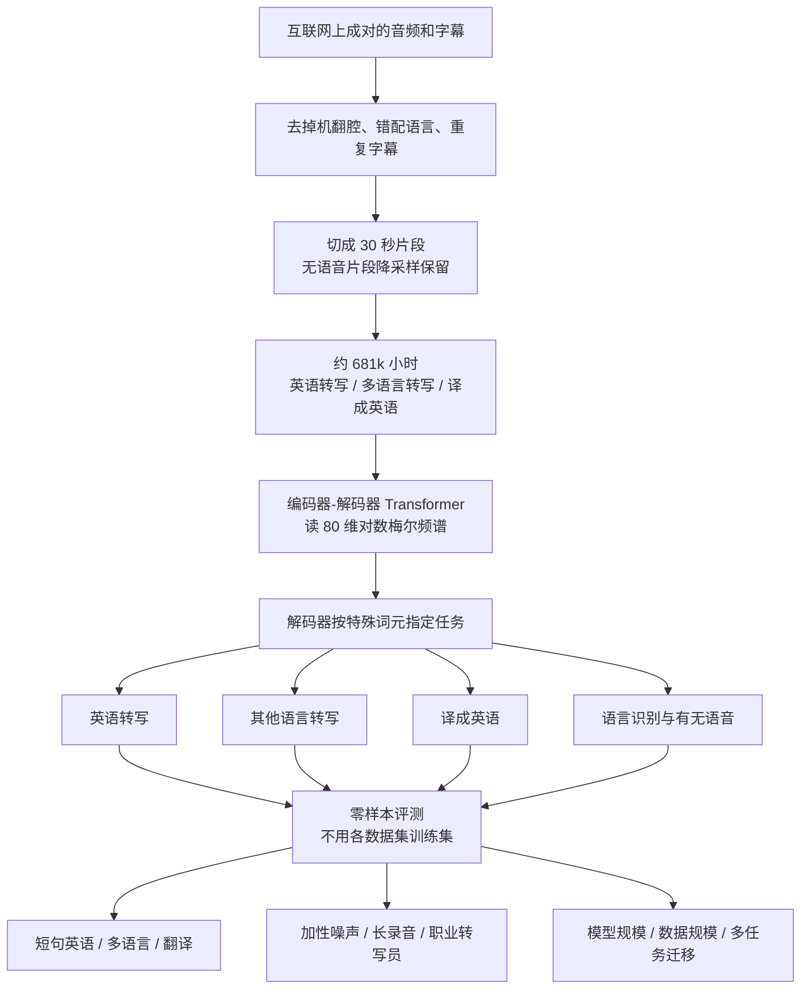
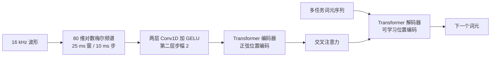
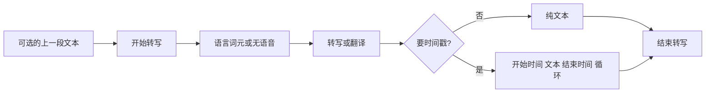

# Whisper：68 万小时弱监督，买到的不是 LibriSpeech 榜首，而是开箱即用的鲁棒语音识别

<!-- release-date: 2022-09-21 -->

> 本文依据 OpenAI 发布的 **Robust Speech Recognition via Large-Scale Weak Supervision**，系统名 **Whisper**，即 arXiv:2212.04356v1、2022-12-06 上传、共 28 页的 letter 预印本。封面作者 Alec Radford*、Jong Wook Kim*、Tao Xu、Greg Brockman、Christine McLeavey、Ilya Sutskever，归属 OpenAI；星号表示同等贡献。页边水印为 `arXiv:2212.04356v1 [eess.AS] 6 Dec 2022`。pdfinfo 的 Title 为空，Author 写成 Anonymous Submission，Subject 残留 ICML 2022 投稿模板，标题与作者以封面为准。页码均指这份 PDF。截至 2026-09-11 核验，[arXiv:2212.04356](https://arxiv.org/abs/2212.04356) 只有 v1，本地原件 28 页、水印与官方 PDF 一致。全文把三件事分开写：**论文明确写了什么**（带页码）、**本文如何解释它**、**外部资料补充**。
>
> 这是一份 **2022 年的技术论文**，讲的是用大规模弱监督把一个编码器—解码器 Transformer 训成开箱即用的语音系统，不是后来的 large-v3、turbo，也不是今天的产品转写接口。同仓 [GPT-3](/reports/OpenAI/GPT-3) 是同一实验室更早的语言模型工作；本文不把 175B、300B Token 或少样本接口写进 Whisper 的「论文写了什么」。
>
> **`release-date` 取 2022-09-21。** 这篇文章覆盖的是 Whisper 这一代「大规模弱监督语音识别」系统。OpenAI 官方博客 [Introducing Whisper](https://openai.com/index/whisper/) 页面日期为 September 21, 2022，宣布开源模型与推理代码，并链到论文 PDF 与 [github.com/openai/whisper](https://github.com/openai/whisper)。GitHub 仓库的 initial commit 同日。论文脚注 3 写明：原始发布之后又训了一版 Large V2，正文默认成绩已换成 V2，除非另行标明（PDF p. 4）。arXiv v1 是 2022-12-06，晚于博客与权重开放。按手册取最早的官方公开事件，因此卡片日期是博客日，不因论文上传或 V2 回写。Hugging Face 仓库创建时间不作为首发日。

## 读前把几个词说成人话

这篇论文几乎不发明新网络结构。它改的是训练数据和评测协议：不再在 LibriSpeech 这类干净朗读语料上把词错误率压到极限，再为每个新场景微调解码器；而是在互联网上的海量「音频 + 字幕」上直接做监督，然后零样本拿到别的数据集上去测。后面会反复出现这些名字：

- **自动语音识别（Automatic Speech Recognition，ASR）**：把说话声转成文字。传统系统常拆成声学模型、语言模型、逆文本规范化、语音活动检测等一串模块。
- **词错误率（Word Error Rate，WER）**：把模型输出和参考转写做字符串编辑距离，再除以参考词数。插入、删除、替换都算错。它惩罚一切字面差异，包括标点、缩写和数字写法。
- **零样本迁移（zero-shot transfer）**：评测集的训练分割完全不用。模型权重在见到这条测试分布之前就已经冻住。
- **弱监督（weak supervision）**：标签不是实验室里人工逐句校验的金标准，而是互联网上成对出现的音频和字幕。量大、杂、错得多，但覆盖的声学环境和说话方式更广。
- **对数梅尔频谱图（log-Mel spectrogram）**：先把波形切成短窗，做成频谱，再按人耳更敏感的梅尔刻度压成少量频带，取对数。Whisper 用 80 个频带，窗长 25 毫秒、步长 10 毫秒（PDF p. 3）。
- **编码器—解码器 Transformer（encoder-decoder Transformer）**：编码器读完整段频谱，解码器一个词元接一个词元地往外写文字。Whisper 故意选现成结构，避免把「数据变了」和「结构变了」混在一起（PDF p. 3）。
- **多任务训练格式（multitask training format）**：把「这是哪种语言、要转写还是翻译、要不要时间戳、这段有没有人说话」全部写成解码器要预测的特殊词元，让一个模型代替整条传统流水线（PDF p. 3–4）。
- **有效鲁棒性（effective robustness）**：Taori 等人提出的度量。先看模型在参考分布（这里是 LibriSpeech）上的成绩，再看它在其他分布上比「按参考成绩外推」好多少。真正鲁棒的模型，不该只在训练过的那套数据上好看（PDF p. 6）。

脚注给了一个可选缩写：WSPSR，Web-scale Supervised Pretraining for Speech Recognition（PDF p. 2）。正文和开源仓库都用 Whisper。

## 一句话先说清

2022 年语音识别的主流叙事是：无监督预训练（以 wav2vec 2.0 为代表）把音频编码器做得很强，再在每个下游数据集上微调解码器，就能在 LibriSpeech 这类基准上把 WER 压到远低于人类。论文认为这件事测错了能力（PDF p. 1、p. 5）。

Whisper 的回答是：

> **不要再为每个部署分布微调解码器。把弱监督做到 68 万小时、覆盖多种语言和多种任务，用一个现成的编码器—解码器 Transformer 直接零样本工作。LibriSpeech 上它并不抢眼；换到别的数据集、噪声和长录音上，它才把「看起来超人类、一换场景就垮」这条缝补上。**

这条主张必须落到具体数字上，不能读成「全面超过专用系统」或「自监督已经过时」：

- **680,000 小时**是摘要和引言里的整数；表 6 和图 11 给出更细的 **681,070 小时**，其中英语转写约 65%、其他语言转写约 17%、X→英语翻译约 18%（PDF p. 1–2、p. 11、p. 27）。
- **LibriSpeech test-clean 最好零样本 WER 是 2.5**，只相当于 2019 年前后的监督基线，不是当时 1.4 的榜首（PDF p. 6、p. 22 表 9）。
- **相对 wav2vec 2.0 Large（无语言模型）在其他语音识别数据集上平均少 55.2% 的错误**；两者在 LibriSpeech clean 上都是 2.7（PDF p. 6 表 2）。
- **多语言 LibriSpeech 零样本 7.3，好于 XLS-R 和 mSLAM；VoxPopuli 却是 13.6，明显落后**（PDF p. 7 表 3）。
- **CoVoST2 的 X→英语翻译零样本 29.1 BLEU，总体新高，高资源语言并不超过 Maestro / mSLAM**（PDF p. 8 表 4）。
- **语言识别在 Fleurs 上 64.5，低于监督系统**；论文自己把原因写清楚了（PDF p. 8 表 5）。

所以这篇最值得记住的，不是又一个更大的语音模型，而是一次评测目标的改写：

> **语音识别真正该比的，不是同一套朗读语料上的百分位点，而是换录音条件、换口音、换噪声之后还剩多少能力。弱监督的规模，在这里比更精巧的自监督预训练更直接。**

## 一条阅读路线

原文 28 页，正文大约到第 14 页，其后是参考文献和附录 A–F。如果只读原文，建议按这个顺序：

1. **p. 1–2 的三段论**：无监督编码器仍要微调；多数据集合并有用但规模不够；弱监督再放大一个数量级。
2. **p. 4 图 1**：数据、模型、特殊词元格式三件事怎么接在一起。
3. **p. 5 表 1 与 p. 6 图 2 / 表 2**：五个规格，以及「LibriSpeech 好看 ≠ 鲁棒」这条主曲线。
4. **p. 7–8 图 3、表 3–5**：多语言、翻译、语言识别，成功和失败放在一起看。
5. **p. 9–10 图 5–7**：加性噪声、长录音、和职业转写员比。
6. **p. 11–13 表 6–7、图 8–10**：数据规模、多任务迁移、文本规范化和长录音启发式。
7. **p. 14 的限制**：重复循环、幻觉、低资源语言、没做微调。
8. **附录 C、E、F**：文本标准化规则、681,070 小时怎么拆、训练超参和 Large V2 改了什么。

附录 D 是按语言、按数据集摊开的原始 WER / BLEU 表，第一遍不必逐格读，需要核对某条结论时再翻。

## 先看全景：一张图串起整篇论文

图中每一步的依据分别在 PDF p. 2–4、p. 5–10、p. 10–13。这是按论文叙事重画的流程示意，不是论文原图。

五个规格只改深度、宽度和头数，编码器与解码器对称（PDF p. 5 表 1）：

| 规格 | 层数 | 宽度 | 头数 | 参数量 |
|---|---:|---:|---:|---:|
| Tiny | 4 | 384 | 6 | 39M |
| Base | 6 | 512 | 8 | 74M |
| Small | 12 | 768 | 12 | 244M |
| Medium | 24 | 1024 | 16 | 769M |
| Large | 32 | 1280 | 20 | 1550M |

更小的规格另有英语专用权重；Large 只有多语言版。正文默认成绩在原始发布之后换成了 Large V2：同样 1550M，但多训 2.5 倍 epoch，并加上 SpecAugment、随机深度和 BPE Dropout（PDF p. 4 脚注 3、p. 28 表 18）。

## 主要矛盾：榜首测的是「同一分布上的泛化」，人测的是「换个环境还能不能用」

论文没有从「我们做了一个语音大模型」开场，而是先说明旧协议具体卡在哪（PDF p. 1、p. 5）。

### 问题一：无监督预训练仍然把解码器留给微调

wav2vec 2.0 这类方法直接从原始音频学习，不必等人标注，所以能把无标签语音堆到 1,000,000 小时，远大于学术监督数据常见的约 1,000 小时。微调之后，尤其在低数据场景，确实刷新了榜（PDF p. 1）。

但编码器再强，也没有一个同样强的、已经预训练好的解码器，把这些表示映射成能用的文字。实际协议仍然是：每个下游分布再微调一次。论文认为这限制了「开箱即用」，也让没有微调经验的人很难把系统部署出去（PDF p. 1）。

这里可以先记一个对比，避免后面把规模数字混在一起：

| 路线 | 论文举的规模 | 标签从哪来 | 部署时还要什么 |
|---|---|---|---|
| 无监督预训练再微调 | 最多约 1,000,000 小时无标签音频 | 下游再要一份监督数据 | 每个分布微调解码器 |
| 多数据集合并监督 | SpeechStew 7 个集合共 5,140 小时 | 现成高质量监督 | 仍受高质量数据总量限制 |
| 弱监督再放大 | GigaSpeech 10,000 小时、People's Speech 30,000 小时 | 放松金标准 | 比高质量监督大，仍远小于无标签规模 |
| Whisper | 680,000 小时弱监督 | 互联网字幕，经过滤 | 零样本，不再为每个评测集微调 |

前三行都是论文用来定位自己的背景，不是 Whisper 自己的训练量（PDF p. 1–2）。

### 问题二：微调会把「数据集脾气」学成能力

机器学习非常擅长在训练集里找能提高留出分割成绩的模式；其中一部分是脆的、假的，换数据集就失效。论文拿自己更早的视觉工作做类比：在 ImageNet 上微调让物体分类涨了 9.2 个点，但同一批物体在另外七个自然图像数据集上平均准确率没有提高（PDF p. 1）。「超人类」可以来自人类注意不到的数据集癖好。

语音识别里，这件事有一个特别刺眼的数字。2015 年 Deep Speech 2 在 LibriSpeech test-clean 上达到 5.3%，接近他们报告的人类 5.8%，并据此怀疑干净朗读语音已经没有多少空间。七年后，同一分割的 SOTA 又从 5.3% 降到 1.4%，比当时的「人类水平」低得多；可这些在 LibriSpeech 上训练的模型，一换场景，错误率仍然远高于人（PDF p. 5）。

### 问题三：人和机器表面上在考同一张卷，训练方式完全不同

论文把这个缺口说得很直白（PDF p. 5）：

- 人通常几乎没有在「正在被考的那套录音分布」上做过专门训练，所以人的成绩测的是**分布外泛化**；
- 机器学习模型通常先在同一分布的大量监督上训练，再上同一分布的测试集，所以机器的成绩测的是**分布内泛化**。

卷面相同，测的不是同一种能力。Whisper 的设定——在很宽的音频分布上训练，再零样本去考现成基准——更接近人被拿来比较时的条件。这不是哲学偏好，是论文给后续所有表格选择的评测协议（PDF p. 5）。

**这就是全文的主要矛盾**：不是「怎么把语音模型做大」，而是「一个看起来已经超人类的识别系统，为什么换个麦克风、换个口音、换一段会议录音就远差于人；以及，把弱监督再放大一个数量级，能不能在不微调的前提下补上这个缺口」。

## 核心设计一：标签可以脏，但脏的方式必须被管住

### 旧问题：高质量监督太少，无标签又缺解码器

把现成高质量数据集拼起来，方向是对的。Narayanan、Likhomanenko、SpeechStew 都表明，跨多个数据集做监督预训练，比单源训练更能迁到留出集合。但 SpeechStew 也只有 5,140 小时。弱监督把规模推到 1–3 万小时，仍然只比高质量监督大几倍，和 100 万小时无标签不在一个数量级（PDF p. 1–2）。

计算机视觉已经走过类似的路：从 ImageNet 这种众包金标准，走到更脏、更大的弱监督，鲁棒性明显更好。论文认为语音识别低估了这条路（PDF p. 2）。

### 新设计：要原始字幕，不要「转写腔」

Whisper 的数据来自互联网上成对出现的音频和字幕。声学环境、设备、说话人和语言因此天然很杂。论文立刻加了一句关键限制：**音频多样性有助于鲁棒，转写质量的多样性没有同样的好处**（PDF p. 2）。

所以过滤的目标不是把互联网洗成 LibriSpeech，而是去掉那些会让模型学会「机器字幕腔」的样本。具体动作包括（PDF p. 2–3）：

1. **去掉机器生成的字幕。** 现有 ASR 常常没有逗号、没有问号、全大写或全小写、不做段落，或者逆文本规范化只是一层很浅的规则。全大写、全小写、从不出现逗号，都很难是人写的。翻译文献已经表明，人机混合数据会显著伤害翻译系统；论文把同样的风险搬到语音上。
2. **语言必须对得上。** 他们用在原型数据上微调、再在 VoxLingua107 上校准的音频语言检测器，去对字幕的 CLD2 语言。对不上就不作为转写样本。例外是：声音不是英语、字幕是英语，则改收成 X→英语翻译。
3. **字幕做模糊去重**，减少重复和自动生成内容。
4. **按 30 秒切开**，只保留落在该窗口里的字幕。无语音片段也训练，但降采样，用来学语音活动检测。
5. **用初版模型的训练错误率再扫一遍。** 按高错误率 × 数据源大小排序，人工抽查，去掉只转写了一部分、对不齐、或启发式没抓到的低质量机器字幕。
6. **和评测集做字幕级去重**，论文点名风险较高的 TED-LIUM 3。

另外一件看起来不起眼、但后面所有「自然语言转写」都靠它成立的决定：**模型要预测原始字幕文本，不做显著标准化**（PDF p. 2）。标点、大小写、段落，全部留给序列到序列模型自己学。这样部署时不必再接一层逆文本规范化。

### 工作机制：错配语言不是扔掉，是改任务

语言检测器和字幕语言不一致时，样本不是直接进垃圾桶。如果字幕是英语，它变成翻译监督。这个规则后面会反咬一口：威尔士语的「翻译数据」里混进了大量被误标成威尔士语的英语音频，导致图 4 里威尔士语成为刺眼的离群点（PDF p. 8）。过滤启发式是在做任务分配，不是在做金标准标注。

无语音片段降采样保留，而不是删光。否则模型会默认「每一窗都有人在说话」，长录音时就会在静音、音乐和掌声里胡编。

### 收益与代价

收益是规模和覆盖。图 11 把 681,070 小时拆成三块（PDF p. 27）：

| 任务 | 时长 | 占比 |
|---|---:|---:|
| 英语语音识别 | 438,218 小时 | 65% |
| 多语言语音识别 | 117,113 小时 | 17% |
| X→英语翻译 | 125,739 小时 | 18% |

引言把多语言转写写成 117,000 小时、覆盖英语之外 96 种语言，翻译写成 125,000 小时（PDF p. 2）。表 6 的 681,070 与图 11 三块相加一致；摘要里的 680,000 是四舍五入。

解码器的语言词元是 99 个（PDF p. 3）；后面讨论 Fleurs 时又说语音识别训练数据覆盖 75 种语言（PDF p. 7）。这两个计数口径不同，论文没有把 99、96、75 写成一张对照表。能确定的是：英语占大约三分之二，其余语言极度长尾，许多只有几百甚至不到 10 小时。

代价同样清楚：

- 数据配方不可复现。论文没有公开原始网址、过滤器代码、各来源占比，也没有给出「扔了多少」；
- 机器字幕过滤靠启发式，误伤和漏网都会有；
- 语言检测错误会直接变成错误的任务标签，威尔士语是已经写进正文的例子；
- 互联网字幕本身偏英语、偏有字幕的内容类型，低资源语言的上限被数据收集偏差钉死（PDF p. 14）。

### 可迁移启发

弱监督不是「脏一点没关系」，而是**把脏的模式分类，再分别处理**。机器生成的目标会让模型学会源系统的输出风格；标签语言和声音语言不一致，与其丢弃，不如改成另一种任务；无标签的静音也是一种监督。自己做语音或任何「网页上爬来的成对数据」时，先问「脏数据会让模型学会谁的脾气」，再设计过滤器。

## 核心设计二：结构故意选现成的，变量只留给数据和任务格式

### 旧问题：换结构会把因果搅浑

如果同时换数据、换网络、换预训练目标，最后鲁棒性提高了，也说不清是哪一步起的作用。论文的研究目标是「大规模监督预训练对语音识别意味着什么」，所以结构必须是已经被验证能放大的现成东西（PDF p. 3）。

### 新设计：编码器读频谱，解码器写文字

音频统一重采样到 16 kHz，做成 80 通道的对数幅度梅尔频谱，窗长 25 毫秒、步长 10 毫秒。特征在整个预训练集上近似零均值，并全局缩放到 $[-1,1]$（PDF p. 3）。

编码器前面有一个很小的茎：两层一维卷积，卷积核宽度 3，激活是 GELU；第二层步幅为 2，把时间分辨率减半。茎的输出加上正弦位置编码，再进 Transformer 块。残差用预激活，编码器出口做一次层归一化（PDF p. 3）。

解码器使用可学习的位置编码，输入和输出词元表示绑在一起。编码器和解码器宽度相同、块数相同（PDF p. 3）。

文字切分沿用 GPT-2 的字节级 BPE。英语专用模型直接用那套词表；多语言模型保持词表大小不变、重新拟合，以免 GPT-2 那套偏英语的切分把其他语言切得过碎（PDF p. 3）。

之所以先做成对数梅尔频谱、而不是像 wav2vec 那样从波形学，论文没有把它写成一个需要辩护的新贡献。结合「结构不作为自变量」这句话来读：频谱前端是语音识别里的默认选择，作者不想在这里再引入一个新变量。

按论文图 1 与 p. 3 的文字重画，是机制示意，不是实现框图。

### 收益、代价、边界

收益是归因干净：后面所有「随模型变大而变好」「多任务在大规格上正迁移」，都可以比较放心地算到数据和训练协议头上，而不是某种新注意力。

代价是性能上限可能被结构钉住。论文在限制里自己问：鲁棒性到底有多少来自编码器、多少来自这个「音频条件语言模型」式的解码器，本工作没有拆开（PDF p. 14）。它甚至建议可以拿一个无解码器的 CTC 模型，或者把 Whisper 的解码器接到已有编码器上，专门回答这个问题。

可迁移的原则很窄、但很硬：

> **如果你的研究问题是「这种数据协议行不行」，就不要顺便换骨干。骨干一换，失败了说不清，成功了也说不清。**

## 核心设计三：特殊词元把整条语音流水线收成一次解码

### 旧问题：识别只是流水线中间那一截

把「这段音频里说了哪些词」做好，仍然不是一个能用的系统。语音活动检测、说话人分离、逆文本规范化、时间对齐、语言识别，常常是分开的模块（PDF p. 3）。论文想要一个模型做完整处理，不只做核心识别。

同一段音频还可以对应完全不同的输出：转写成原文、翻译成英语、只判断有没有人说话、带时间戳或不带。一对多映射必须有任务接口。

### 新设计：任务说明本身也是要预测的词元

解码器被看成音频条件语言模型。格式大致是（PDF p. 3–4，图 1）：

1. 可选地，把上一段转写放进上下文，希望靠更长的文本历史消解当前 30 秒里听不清的地方。训练时以一定概率加入。
2. `<|startoftranscript|>` 标记开始预测。
3. 先预测语言。训练集里每种语言一个专用词元，共 99 个；语言标签来自前面那个 VoxLingua107 检测器。若没有人声，则预测 `<|nospeech|>`。
4. 再预测任务：`<|transcribe|>` 或 `<|translate|>`。
5. 若不要时间戳，插入 `<|notimestamps|>`。
6. 之后才是正文。若要时间戳，时间相对于当前 30 秒窗口，量化到最近的 20 毫秒——这就是模型的原生时间分辨率——并写成词表里的额外词元。每句字幕是「开始时间 → 文本 → 结束时间」。若一句字幕只被当前窗口切到开头，时间戳模式下只预测开始时间，提示下一次解码应对准这个时刻；否则把音频截断，不把这句不完整的话算进去。
7. 最后是 `<|endoftranscript|>`。
8. 训练损失只遮住「先前上下文文本」，其余词元都要预测。

按论文图 1 下半部分重画。特殊词元既是开关，也是分类目标：语言识别和语音活动检测不是另挂一个头，而是解码序列里的前几个位置。

时间戳还有一个推理用途。模型一次只吃 30 秒。长录音时，用预测出的时间戳决定下一次窗口滑多远。窗口之间不是死板地切 30 秒，而是跟着模型认为的句边界走（PDF p. 9）。

### 一个必须单独处理的副作用：说话人姓名

开发阶段发现，模型会编造听起来很像那么回事、但几乎总是错的说话人名字。原因是预训练字幕里经常写着「谁在说话」，而最近 30 秒的音频里通常听不出这个信息。处理办法不是改结构，而是在不含说话人标注的字幕子集上短暂微调，把这个行为压掉（PDF p. 4–5）。

这件事说明弱监督会把网页格式里的元数据也当成预测目标。模型并不知道「这段文字在页面上是不是人声对应的内容」。

### 可迁移启发

当一个输入对应多种合法输出时，与其做多个模型或多个分类头，不如把任务说明写成输出序列的前缀。开关和答案共用同一套语言模型，条件切换发生在词元空间里，而不是在训练脚本的 if-else 里。代价是：前缀一旦学错（语言词元、有无语音、要不要时间戳），后面整段都会走错任务。

## 训练 recipe：只跑两到三遍数据，原始版不加增强

论文用数据并行、FP16、动态损失缩放和激活检查点。优化器是 AdamW，梯度范数裁剪，前 2048 步 warmup，之后学习率线性降到零。批量 256 个 30 秒片段，训练 $2^{20}=1{,}048{,}576$ 次更新，大约两到三遍数据（PDF p. 4、p. 28 表 17）。

因为遍数少，过拟合不是主要担心。原始系列不用数据增强，也不用正则，把鲁棒性押在数据多样性上（PDF p. 4）。完整超参：

| 超参 | 取值 |
|---|---|
| 更新次数 | 1,048,576 |
| 批量 | 256 段 |
| Warmup | 2048 |
| 最大梯度范数 | 1.0 |
| 优化器 | AdamW，$\beta_1=0.9$，$\beta_2=0.98$，$\epsilon=10^{-6}$ |
| 权重衰减 | 0.1 |
| 初始化 | Gaussian Fan-In |
| 学习率日程 | 线性衰减 |
| 无语音片段降采样 | 10 倍 |
| 条件于先前文本的概率 | 50% |

各规格的最大学习率不同（PDF p. 28 表 19）：

| 规格 | 最大学习率 |
|---|---|
| Tiny | $1.5\times 10^{-3}$ |
| Base | $1\times 10^{-3}$ |
| Small | $5\times 10^{-4}$ |
| Medium | $2.5\times 10^{-4}$ |
| Large | $1.75\times 10^{-4}$ |
| Large V2 | $2.0\times 10^{-4}$ |

Large V2 相对原始 Large 改了五处（PDF p. 4 脚注 3、p. 28 表 18）：更新次数 655,360，批量 1024，BPE Dropout 0.1，随机深度 0.1，SpecAugment 用 LibriSpeech Basic 策略。批量从 256 升到 1024 是 4 倍，更新次数约为原来的 0.625 倍，$4\times 0.625=2.5$，与「多训 2.5 倍 epoch」一致。正文里「除非另行说明，成绩已更新到这一版」——读表 2、表 3、图 6 时，默认看到的是 V2。

论文没有公开加速器型号、芯片数量、训练墙钟时间和总 FLOPs。图 9 的横轴有英语语音识别的训练 FLOPs，但那是为了在多任务和英语专用之间对齐算力，不是一张完整的算力账单（PDF p. 12）。

## 评测协议：零样本，并且先把「无害的写法差异」从 WER 里拿掉

### 为什么必须零样本

目标是一个系统在很宽的环境里开箱即用，不为每个分布微调。因此现成基准的训练集全部不用，只拿测试分割来测广义泛化（PDF p. 5）。附录 A 列出了短句英语、长录音英语、多语言集合的具体来源和预处理（PDF p. 19–20）。对比用的开源模型全部从 Hugging Face 下载，时间为 2022 年 9 月、`transformers` 4.21.0，而且论文写明这些模型全部或部分在 LibriSpeech 上训练过（PDF p. 20）。

### 为什么 WER 对零样本特别不公平

WER 按字面编辑距离计分。人觉得正确的转写，可能因为缩写、数字写法、标点而得到很高的 WER。对在该数据集上微调过的系统，这已经麻烦；对从未见过该数据集转写格式的零样本模型，更严重（PDF p. 5）。

论文的处理是：在算 WER 之前做一次尽量只惩罚「真的听错了」的文本规范化。规则是对着 Whisper 的常见「无害差异」手工迭代出来的，所以有过拟合到自家输出风格的风险，第 4.4 节专门查这件事（PDF p. 5、p. 12）。若干数据集上，光规范化就能让 WER 掉大约 50%，常见原因是参考转写把缩写拆开写（PDF p. 5）。

附录 C 把英语规则写成 12 步，包括去掉括号内容、去掉嗯啊、展开缩写、数字和货币写成阿拉伯数字、英式拼写改美式等；非英语则只做更粗的去符号和转小写。中文、日文、泰语、老挝语、缅甸语在字之间插空格，实际改测字符错误率（PDF p. 21）。论文自己说这是不完美的方案，不声称规范化之后的写法更「正确」；代码随模型一起发布。

读后面所有 WER 时都要带着这个过滤器：比较的是规范化之后的错误，不是原始字符串距离。

## 英语识别：参考分布上并不出众，分布外才拉开

图 2 把「LibriSpeech dev-clean 的 WER」放在横轴，把另外几个集合（Common Voice、CHiME-6、TED-LIUM）的平均 WER 放在纵轴（PDF p. 6）。监督 LibriSpeech 模型可以在横轴上匹配甚至超过某个人类转写员，但在纵轴上大约是这个人的两倍错误。零样本 Whisper 的鲁棒前沿把这个人的 95% 置信区间包了进去。

表 2 拿在 LibriSpeech 上与 Whisper Large V2 最接近的监督模型——wav2vec 2.0 Large、不加语言模型——做逐集对照。两者在 LibriSpeech clean 上都是 2.7；换到其他集合，Whisper 的相对错误下降平均 55.2%（PDF p. 6）：

| 数据集 | wav2vec 2.0 Large（无 LM） | Whisper Large V2 | 相对错误下降 |
|---|---:|---:|---:|
| LibriSpeech Clean | 2.7 | 2.7 | 0.0% |
| Artie | 24.5 | 6.2 | 74.7% |
| Common Voice | 29.9 | 9.0 | 69.9% |
| Fleurs En | 14.6 | 4.4 | 69.9% |
| TED-LIUM | 10.5 | 4.0 | 61.9% |
| CHiME-6 | 65.8 | 25.5 | 61.2% |
| VoxPopuli En | 17.9 | 7.3 | 59.2% |
| CORAAL | 35.6 | 16.2 | 54.5% |
| AMI IHM | 37.0 | 16.9 | 54.3% |
| Switchboard | 28.3 | 13.8 | 51.2% |
| CallHome | 34.8 | 17.6 | 49.4% |
| WSJ | 7.7 | 3.9 | 49.4% |
| AMI SDM1 | 67.6 | 36.4 | 46.2% |
| LibriSpeech Other | 6.2 | 5.2 | 16.1% |
| 平均 | 29.3 | 12.8 | 55.2% |

表注写明这些是规范化之后的 WER。最小的 39M 模型在 LibriSpeech test-clean 上是 6.7，和其他数据集上最好的监督 LibriSpeech 模型大致相当（PDF p. 6；与附录表 9 的 beam search 结果一致）。

正确读法不是「Whisper 在英语 ASR 全面第一」。正确读法是：在参考分布上故意不拼榜，把预算花在让参考分布上的同一点对应更低的分布外错误。这也是「有效鲁棒性」这张图想画的那条朝 $y=x$ 靠近的线。

## 多语言：数据量几乎就是命运，基准选择会改结论

表 3 的两个低资源基准把故事劈成两半（PDF p. 7）：

| 模型 | MLS | VoxPopuli |
|---|---:|---:|
| VP-10K + FT | — | 15.3 |
| XLS-R（1B） | 10.9 | 10.6 |
| mSLAM-CTC（2B） | 9.7 | 9.1 |
| Maestro | — | 8.1 |
| 零样本 Whisper | 7.3 | 13.6 |

MLS 上 Whisper 更好，但论文立刻声明：他们用了简单的文本标准化，这使「SOTA」这种说法不成立。VoxPopuli 上 Whisper 明显落后，只超过原始论文的 VP-10K+FT 基线。作者怀疑两个原因：其他模型把 VoxPopuli 当作无监督预训练的主要来源，以及该集合每种语言的监督数据大约是 MLS 的 10 倍——MLS 每种语言约 10 小时（PDF p. 7）。

这两个基准一共大约 15 种语言，几乎都是印欧语系、而且不少是高资源语言。要看更宽的覆盖，论文改用 Fleurs。图 3 把某种语言的预训练转写小时数（对数）对 Fleurs 零样本 WER（对数）作图，平方相关系数 $0.83$。对数线性拟合给出一个很好记的经验规则：**训练数据每增加 16 倍，WER 大约减半**（PDF p. 7）。

离群点偏向独特文字系统、并且离训练数据主体（印欧语）更远的语言，例如希伯来语、泰卢固语、中文、韩语。论文给了三个候选解释，没有做归因：语言距离导致迁移不足、字节级 BPE 不适合这些文字、数据质量波动（PDF p. 7）。

附录表 10–13 按语言列出 MLS、Common Voice 9、VoxPopuli、Fleurs 的原始 WER。低资源语言上三位数 WER 并不罕见，这与「平均曲线很好看」可以同时成立（PDF p. 23–24）。

## 翻译：低资源上零样本很强，高资源上并不取代专用系统

CoVoST2 的 X→英语子集上，零样本 Whisper 总体 29.1 BLEU，超过 Maestro、mSLAM、XLS-R；中资源和低资源分组也更高，高资源分组 36.2，低于 Maestro 的 38.2 和 mSLAM 的 37.8（PDF p. 8 表 4）：

| 系统 | 高资源 | 中资源 | 低资源 | 全部 |
|---|---:|---:|---:|---:|
| XMEF-X | 34.2 | 20.2 | 5.9 | 14.7 |
| XLS-R（2B） | 36.1 | 27.7 | 15.1 | 22.1 |
| mSLAM-CTC（2B） | 37.8 | 29.6 | 18.5 | 24.8 |
| Maestro | 38.2 | 31.3 | 18.4 | 25.2 |
| 零样本 Whisper | 36.2 | 32.6 | 25.2 | 29.1 |

论文把总体优势归因于预训练里这些语言约 68,000 小时的 X→英语数据，而 CoVoST2 自己的 X→英语训练数据只有 861 小时。注意：68,000 是「这些 CoVoST2 语言」上的翻译小时，不是图 11 里全部 125,739 小时翻译数据（PDF p. 8、p. 27）。低资源分组相对 mSLAM 高 6.7 BLEU；高资源上「最好的 Whisper 平均并不超过 Maestro 和 mSLAM」（PDF p. 8）。

Fleurs 被改造成翻译集：同一句在各语言里都有转写，英语转写当参考。图 4 里翻译小时数与 BLEU 的平方相关只有 $0.24$，远低于转写的 $0.83$。一个具体事故：威尔士语号称约 9,000 小时翻译数据，排在翻译数据量第 4，却只有 13 BLEU。检查发现大部分其实是英语音频配英语字幕，被语言检测器标成威尔士语，于是按数据规则进了翻译桶而不是转写桶（PDF p. 8）。

相关弱，不一定是「翻译不跟数据量走」，也可能是翻译标签比转写标签更噪。威尔士语是已经抓到的污染；没写出来的类似错误，不知道还有多少。

## 语言识别：这是论文明确写的失败

Fleurs 上零样本 Whisper 的语言识别准确率 64.5，低于 w2v-bert-51（0.6B）的 71.4 和 mSLAM-CTC（2B）的 77.7（PDF p. 8 表 5）。Fleurs 有 102 种语言，Whisper 训练数据覆盖不到其中 20 种，准确率上限因此是 80.4%。在 82 种重叠语言上，最好的 Whisper 是 80.3%（PDF p. 8）。

也就是说，在它见过的语言上，这个用特殊词元做的语言识别几乎打满了「能识别出训练集里有的语言」这条上限；它输给专用系统，主要是因为覆盖不全。论文没有把语言识别包装成卖点。

## 加性噪声：干净条件下不占优，嘈杂条件下更稳

把 Audio Degradation Toolbox 的白噪声和酒吧噪声加到 LibriSpeech test-clean 上，横轴是信噪比（PDF p. 8–9 图 5）。对比对象包括 14 个模型：12 个在 LibriSpeech 上预训练或微调，2 个是 NVIDIA STT，训练数据类似 SpeechStew，含 LibriSpeech。

低噪声（约 40 dB SNR）时，不少 LibriSpeech 模型比 Whisper 更准，这不奇怪。噪声加大后它们掉得更快。酒吧噪声、SNR 低于 10 dB 时，这些模型都差于 Whisper。NVIDIA STT 在低噪声最好，高噪声被 Whisper 超过。图中标成 H 的第二好低噪声模型只在 LibriSpeech 上微调，掉得更陡（PDF p. 8–9）。

酒吧噪声比白噪声更接近真实偏移：有环境声，也有听不清的人声。论文把这张图当作「自然分布偏移」的证据，而不是实验室里的抗噪竞赛。

## 长录音：30 秒窗口要靠时间戳接起来，启发式是在给模型护栏

Whisper 一次不能吃超过 30 秒。学术基准多为短句，真实场景却是几分钟到几小时。做法是按模型预测的时间戳，缓冲式地滑窗口（PDF p. 9）。论文强调：必须用束搜索，并且按重复程度和对数概率做温度调度，长录音才稳定。完整启发式在 4.5 节。

评测集覆盖尽量不同的长度和录音条件：拼接成整场演讲的 TED-LIUM 3、Late Show 里术语密集的片段（Meanwhile）、博客里用过的视频 / 播客（Rev16、Kincaid46）、财报电话会议、CORAAL 的长访谈（PDF p. 9、p. 19）。对比包括开源模型和 4 家商业 ASR；商业系统按 2022 年 9 月 1 日的默认英语转写设置查询，NVIDIA STT 用其缓冲推理接口（PDF p. 10）。

图 6 的结论写成：Whisper 在全部集合上超过最好的开源模型 NVIDIA STT，并且在多数情况下也超过商业系统；Meanwhile 这种非常见词很多的集合上优势更明显（PDF p. 9–10）。论文同时提醒：部分商业系统可能在这些公开数据上训练过，相对鲁棒性未必被这张图准确反映。

附录表 16 给出 Large V2 的长录音 WER：TED-LIUM3 3.5、Meanwhile 5.1、Kincaid46 8.8、Rev16 11.3、Earnings-21 9.7、Earnings-22 12.6、CORAAL 19.6（PDF p. 26）。图 6 是分布箱线图，表 16 是点估计，读图时不要把箱子中位数和表 16 强行当成同一个统计量。

## 和职业转写员比：接近，不是超过

WER 有不可约误差：含混的话、标注错误、口音。只看 ASR 分数很难说「还剩多少空间」。论文从 Kincaid46 选 25 段，覆盖念稿、即兴、电话 / VoIP、会议，找 5 家服务做职业转写：1 家计算机辅助，4 家纯人工（PDF p. 10）。

图 7 在这 25 段上的合计 WER：Whisper 8.81；四家商业 ASR 为 9.66、9.74、10.9、12.2；计算机辅助 7.61，比 Whisper 低 1.15 个百分点；四家纯人工为 8.14、8.65、8.96、10.5。论文的表述是：计算机辅助最好，纯人工只比 Whisper 好一个百分点的一个零头。英语 ASR「并不完美，但非常接近人类水平」（PDF p. 10）。

这是 25 段、一个来源、一种规范化之下的比较，不是「所有英语场景都达到人类」。它支持的是图 2 的那条叙事：零样本、宽分布训练的系统，和人比时不再隔着「机器在考分布内、人在考分布外」那层错位。

## 分析：规模、数据量、多任务，三条曲线不要读成同一件事

### 模型变大：英语转写先饱和，其他任务还在涨

图 8 四条聚合曲线：英语 12 个集合的平均 WER、Fleurs 67 种语言的平均 WER、CoVoST2 21 种语言的 BLEU、Fleurs 102 种语言的语言识别准确率。浅线是单个数据集或语言，波动比平均值大得多。Large V2 用橙色虚线单独标出，因为它的训练改动不在更小规格上（PDF p. 11）。

除了英语语音识别，另外三项随参数量继续改善。英语的收益递减，论文怀疑是在接近第 3.9 节那种人类水平（PDF p. 10–11）。不要把「英语转写从 Medium 到 Large 几乎不动」读成「再放大没有用」——多语言和翻译还在动。

一个伴随风险也写在 4.1 节开头：弱监督数据可能远比金标准吵；模型变大之后，有没有可能开始利用数据集的癖好，分布外反而变差？图 8 没有支持这种崩塌，但单条浅线并不都单调（PDF p. 10–11）。

### 数据变多：从 3,000 小时到 54,000 小时很值，再乘 12.5 倍就变钝

表 6 用同一档 Medium，在全数据的 0.5%、1%、2%、4%、8% 和 100% 上训练。早停看验证损失，参数用指数滑动平均，平滑系数 0.9999，用来减轻子采样实验里学习率还没降到零就停的影响（PDF p. 10–11）：

| 时长（小时） | 英语 WER ↓ | 多语言 WER ↓ | X→英语 BLEU ↑ |
|---:|---:|---:|---:|
| 3,405 | 30.5 | 92.4 | 0.2 |
| 6,811 | 19.6 | 72.7 | 1.7 |
| 13,621 | 14.4 | 56.6 | 7.9 |
| 27,243 | 12.3 | 45.0 | 13.9 |
| 54,486 | 10.9 | 36.4 | 19.2 |
| 681,070 | 9.9 | 29.2 | 24.8 |

英语从约 3,000 到 13,000 小时下降很快，13,000 到 54,000 明显变慢；再乘 12.5 倍到全集，只再降 1 个 WER 点。多语言在 54,000 小时前近似幂律，之后偏离，全集只再降 7 点。翻译在 7,000 小时及以下几乎是零，然后到 54,000 小时近似对数线性，再往后也钝化（PDF p. 11）。

论文给了两种解释，没有做判决：当前最好的 Whisper 相对数据量可能训练不足，更长训练和更大模型还能涨；或者语音识别的数据规模收益已经接近尽头。它明确说需要专门的语音识别 scaling law 才能在两者之间做选择（PDF p. 11）。表 6 用的是 Medium，不是 Large，所以「全集只再降 1 点」不能直接外推到 1550M。

### 多任务在小模型上是负担，在大模型上是正迁移

联合训练时，只有约 65% 的算力花在英语识别上，和数据里英语 65% 一致。若不按英语识别的 FLOPs 对齐，联合模型会因为这项任务上「训练不足」而看起来更差（PDF p. 11–12）。

图 9：中等算力的小模型上，联合多任务、多语言模型弱于同等英语算力的英语专用模型，这是负迁移。规格和算力加大后，联合模型赶上并超过英语专用；最大的几组实验里，即使不按任务算力对齐，联合模型也略强（PDF p. 12）。

这和「多语言一定伤英语」的经验相反，条件是模型够大。论文在引言里的那句「对足够大的模型，联合多语言多任务没有坏处，甚至有好处」，依据就是这张图（PDF p. 2、p. 12）。

### 文本规范化没有把所有优势都做成自家规则

因为规范化是对着 Whisper 的输出迭代的，存在「只修自家怪癖」的风险。对比对象是 FairSpeech 项目里一份独立开发的规范化器（PDF p. 12 图 10）。多数数据集上，两套规则给 Whisper 和其他开源模型带来的相对 WER 下降差不多。CallHome、Switchboard、WSJ 上，Whisper 从自家规则里多拿到一截：前两个集合有大量缩写（you're / you are），WSJ 有大量数字和货币的书面 / 口语写法（PDF p. 12）。

结论不该是「规范化作弊所以表 2 作废」。结论是：零样本 WER 对格式极度敏感；论文做了交叉检查，优势在多数集合上对另一套规则仍然存在，但在缩写和数字很密的集合上，规则选择本身就是分数的一部分。

### 长录音启发式：平均在降，集合之间有的升有的降

4.5 节的策略是给不稳定解码加护栏，不是新解码算法（PDF p. 12–13）：

- 5 束的束搜索，用对数概率打分，减轻贪心解码里更常见的重复循环；
- 从温度 0 开始，若生成词元的平均对数概率低于 $-1$，或文本的 gzip 压缩率高于 2.4，温度每次加 0.2，直到 1.0；
- 温度低于 0.5 时，把上一窗转写当作先前文本条件；
- 无语音概率阈值 0.6，再叠加平均对数概率阈值 $-1$，语音活动检测才比较稳；
- 把第一个时间戳限制在 0.0 到 1.0 秒，避免模型丢掉开头几个词。

表 7 按顺序叠加这些干预（PDF p. 13）：

| 设置 | TED-LIUM3 | Meanwhile | Kincaid46 | Rev16 | Earnings-21 | Earnings-22 | CORAAL | 平均 |
|---|---:|---:|---:|---:|---:|---:|---:|---:|
| 仅贪心 | 3.95 | 5.16 | 9.69 | 11.7 | 10.7 | 14.0 | 22.0 | 11.0 |
| + 束搜索 | 4.16 | 5.71 | 9.42 | 11.5 | 10.2 | 13.4 | 20.0 | 10.6 |
| + 温度回退 | 4.16 | 5.71 | 9.42 | 11.5 | 10.2 | 13.4 | 20.0 | 10.6 |
| + 语音活动检测 | 3.56 | 4.61 | 9.45 | 11.4 | 10.1 | 13.2 | 19.4 | 10.2 |
| + 先前文本 | 3.42 | 6.16 | 8.72 | 11.0 | 9.63 | 13.3 | 18.1 | 10.0 |
| + 首个时间戳约束 | 3.51 | 5.26 | 8.41 | 11.5 | 9.73 | 12.6 | 19.1 | 10.0 |

平均 WER 从 11.0 降到 10.0，但不是每个集合都单调变好。束搜索让 TED 和 Meanwhile 变差；加先前文本让 Meanwhile 从 4.61 升到 6.16。论文把这些启发式称作对噪声预测的权宜之计，并说要提高长录音可靠性，还需要更多研究（PDF p. 13）。第 3.8、3.9 节的长录音和人类比较，用的就是这套启发式。

## 相关工作里的自我定位

第 5 节把前作收成三堆（PDF p. 13–14）：

- **规模**：从 TIMIT 上 3 小时、Switchboard 上 2,000 小时，到 Deep Speech 2 的 12,000 小时，再到半监督的 162,000 小时，以及十亿参数和 1,000,000 小时训练数据。Whisper 接的是「规模继续有效」这条线，但走监督弱标签，而不是半监督 / 自训练。
- **多任务**：从早期多语言 ASR，到 Toshniwal 的单模型多语言、Pratap 的 50 语言十亿参数，再到 MUTE、mSLAM 的语音—文本联合。Whisper 用特殊词元而不是多套编码器 / 解码器。
- **鲁棒性**：跨数据集泛化差是老问题；多域训练提高鲁棒，在 NLP 和视觉里也被重复过。Whisper 把这条经验用到 68 万小时弱监督上。

它没有把自己写成「第一个多语言语音模型」。它写的是：简单地把弱监督放大，这件事在语音识别里被低估了。

## 限制：论文自己划的边界

第 6 节不长，但每条都具体（PDF p. 14）。

**解码仍然会疯。** 感知类错误（听成邻近词）随模型变大在稳步下降。剩下的错误更像序列到序列、语言模型和音字对齐的失败模式：重复循环、漏掉开头或结尾几个词、完全幻觉出一段和音频无关的转写。4.5 节的启发式有帮助，论文仍怀疑：在高质量监督上微调，或用强化学习直接优化解码，才能继续压这类错误。

**低资源语言仍然差。** 图 3 已经表明，某种语言的 WER 很大程度上由该语言的训练小时数决定。收集管道偏英语互联网，多数语言不足 1,000 小时。论文认为：针对性增加这些语言的数据，即使总时长只增加一点，平均识别也会改善很多。

**只研究了零样本。** 这是为了谈鲁棒；在本来就有高质量监督的领域，微调几乎肯定还能涨，而且便于和前作直接比。本篇没做。

**编码器和解码器的贡献没有拆开。** 引言把鲁棒部分归到「强解码器是音频条件语言模型」。这个判断没有消融支持。

**没用无监督预训练或自训练。** Whisper 明显偏离当时 SOTA 语音系统的标配。作者认为要得到好结果并不必须这些技术，但加上去有可能更好。

另外两处限制分散在正文里，值得一并记住：说话人分离被列为传统流水线的模块，但多任务格式并没有真正做说话人分离（PDF p. 3）；长录音启发式是护栏，不是从模型里学出来的可靠性（PDF p. 13）。

## 报告没有告诉我们的事

28 页也不是复现说明。论文没有公开或没有充分隔离的包括：

- **原始数据**：网址、语种来源、各站点时长、过滤器阈值、扔掉的比例、去重的具体算法。681,070 小时是过滤之后的结果，不是爬到的总量。
- **训练系统**：芯片类型与数量、并行方式、墙钟时间、能耗、故障恢复。只有 FP16、激活检查点、数据并行和 AdamW。
- **结构消融**：没有 CTC 对照、没有换频谱前端、没有把解码器接到 wav2vec 编码器上。编码器 vs 解码器的贡献仍是猜测。
- **微调后的 Whisper**：论文明确留给未来。不能从零样本成绩推断「再微调会怎样」。
- **说话人分离、词级时间戳、流式识别**：格式里有句级时间戳和语音活动检测，没有做这三件事的评测。
- **人类比较的范围**：25 段 Kincaid46，不是多语种、不是电话中心全量、不是带重叠说话人的会议。
- **V2 相对 V1 的隔离贡献**：知道多训了 2.5 倍 epoch，并加了三种正则 / 增强；不知道每一项单独值多少。更小规格没有 V2。
- **污染**：只对 TED-LIUM 3 做了字幕级去重。其他评测集与 68 万小时互联网字幕的重叠程度，没有 GPT-3 论文那种事后 N-gram 分析。

## 论文之后发生了什么

以下不是本 PDF 的内容，只用来把 2022-09 的材料放回时间线。

- **首次对外可用**：2022-09-21 的官方博客与 GitHub 初始提交，开放推理代码和 tiny 到 large 的权重，许可证为 MIT。这是本文 `release-date` 的依据。证据见 [Introducing Whisper](https://openai.com/index/whisper/) 与 [openai/whisper](https://github.com/openai/whisper)。
- **Large V2 已经写进本 PDF**：脚注 3 和附录表 8–16、18–19。GitHub 在 2022-12 另有 V2 权重公告，那是发布渠道，不改变「V2 属于这篇论文讲的模型」这一事实。
- **之后的权重不是这篇论文**：官方 model card 把 large-v3 记在 2023-11、把 turbo（large-v3-turbo）记在 2024-09。这些改了梅尔频带数、数据规模或解码器深度，**不得写回表 1–16**。model card 见 [whisper/model-card.md](https://github.com/openai/whisper/blob/main/model-card.md)。
- **生态是论文之外的事**：后续的 C++ 移植、更快的推理引擎、各云厂商的转写 API，都不在 28 页里。本模块只依据 PDF，不拿源码现状补写论文。

## 最值得带回自己项目的八条

### 1. 先对齐「人和机器在考哪一种泛化」

LibriSpeech 从 5.3% 降到 1.4%，人在其他场景上并没有同步被拉下。评测协议如果默认「先在同一分布上训练再考」，就会系统性地高估机器、低估缺口。设计评测时先问：人是零样本来的，还是也在这个分布上练过？

### 2. 参考分布上的分数，要和分布外分数绑在同一张图上

表 2 的价值不在 2.7 对 2.7，而在参考点对齐之后，其他集合少 55.2% 的错误。任何声称「更鲁棒」的系统，都应该先找一个大家都会报的参考集，再报一篮子留出分布。只报参考集，等于允许过拟合癖好。

### 3. 弱监督的过滤目标是「别学会源系统的脾气」

全大写、从无逗号、人声语言和字幕语言不一致，与其说是噪声，不如说是另一种生成过程的指纹。过滤器要针对这些指纹，而不是把文本洗成基准的样子。Whisper 反而要求模型输出原始书面文本，把格式差异留给评测时的规范化器。

### 4. 研究问题是数据协议时，骨干保持无聊

作者选现成 Transformer，就是为了不让结构改动抢因果。自己做「换数据 / 换目标 / 换规模」实验时，同样不要顺便换注意力变体。想比结构，就固定数据和目标。

### 5. 一对多任务用输出前缀，而不是用多个模型

语言、任务、时间戳开关都是词元。代价是前缀错了后面全错；收益是部署时一个权重文件覆盖转写、翻译和语音活动检测。工具调用、多模态开关也可以用同一思路，但必须单独评测开关本身准不准——语言识别那一节就是反例。

### 6. 多任务负迁移可能只是「模型还不够大」

图 9 在小规格上联合训练伤英语，大规格上变成正迁移。看到小模型的负迁移就放弃联合训练，可能过早。反过来，在大模型上看到正迁移，也不能推断小模型同样该联合。

### 7. 长序列的滑动窗口需要显式失败检测

平均对数概率、压缩率、无语音概率、首个时间戳范围，都是在问「这一窗像不像又开始胡说」。滑动窗口系统里，局部失败会污染下一窗。与其只调束宽，不如给「这一窗不可信」一个可触发的信号，并规定回退策略。

### 8. 文本度量要有一份独立的规范化器对照

对着自家输出迭代规则，一定会被怀疑。论文用 FairSpeech 的规则做了对照，并指出哪些集合上自家规则多给了分。任何以 WER、EM、精确匹配为指标的工作，都可以准备第二套无关规则，看结论是否还在。

## 关键词回看

- **弱监督**：互联网上成对的音频和字幕，不是实验室金标准。
- **零样本 ASR**：不用各评测集的训练集，直接测广义泛化。
- **有效鲁棒性**：参考分布成绩相近时，分布外是否好于外推。
- **对数梅尔频谱**：16 kHz、80 维、25 ms / 10 ms，Whisper 编码器的输入。
- **多任务格式**：语言、转写 / 翻译、时间戳、无语音，全部是解码器要写的特殊词元。
- **30 秒窗口**：训练和推理的音频块大小；长录音靠时间戳滑动拼接。
- **20 毫秒时间戳**：时间词元的量化精度，等于模型的原生时间分辨率。
- **文本规范化**：算 WER 前去掉无害格式差异；英语 12 步，非英语更粗。
- **相对错误下降（RER）**：相对对照系统少了百分之多少错误，表 2 的 55.2% 是这个量。
- **Large V2**：同结构 Large，多训 2.5 倍 epoch，加 SpecAugment、随机深度、BPE Dropout；正文默认成绩用它。

## 最后的判断

如果只能从这篇论文带走一件事，不应该是 1550M，也不应该是 LibriSpeech 上的 2.5。

应该是这个：**它把「语音识别好不好」的答案，从「在干净朗读语料上还能再降几个点」，改成了「换麦克风、换口音、换酒吧噪声、换一小时会议之后还剩多少」。** 为了让后一个问题变得可答，它宁愿在前一个问题上不出彩。

论文提供的证据支持这个转变是真实的：参考分布上与 wav2vec 2.0 Large 打平，分布外平均少 55.2% 的错误（PDF p. 6）；噪声加大后 LibriSpeech 专用模型更快垮掉（PDF p. 8–9）；Kincaid46 的 25 段上，纯人工转写只比它好一个百分点的零头（PDF p. 10）。联合多语言多任务在大规格上不再是负担（PDF p. 12）。

它也留下同样清楚的边界，而且是论文自己划的：

- LibriSpeech 不是 SOTA，VoxPopuli 明显落后，语言识别低于专用系统（PDF p. 6–8）；
- 高资源翻译不超过 Maestro / mSLAM，威尔士语暴露了语言检测污染（PDF p. 8）；
- 低资源语言仍差，多数不足 1,000 小时（PDF p. 7、p. 14）；
- 长录音靠启发式护栏，集合之间有的干预会让 WER 上升（PDF p. 13）；
- 没有拆开编码器 / 解码器，没有做微调，没有公开数据与算力账单（PDF p. 14）。

正因为这些限制被写明，这份材料才适合当作设计文档来读：它证明的是弱监督规模对鲁棒性的作用，不是「一个模型结束了语音识别」。

如果只记一句话，可以记：

> **榜首测的是同一分布上的熟练程度；开箱即用测的是换分布之后还在不在。Whisper 把预算从前者挪到了后者。**

## 资料与阅读边界

- 原始依据：本地 `papers/OpenAI/Whisper.pdf`，arXiv:2212.04356v1，28 页。
- 官方论文页：[arXiv:2212.04356](https://arxiv.org/abs/2212.04356)，仅 v1。
- 官方发布说明：[Introducing Whisper](https://openai.com/index/whisper/)，2022-09-21。
- 官方代码与权重：[openai/whisper](https://github.com/openai/whisper)。阅读源码或后作权重时应以具体 commit 为准；本文没有把源码里未写入报告的细节冒充论文结论。
- 官方模型卡：[model-card.md](https://github.com/openai/whisper/blob/main/model-card.md)，其中 large-v3 与 turbo 的日期和规格是论文之后的外部记录。
