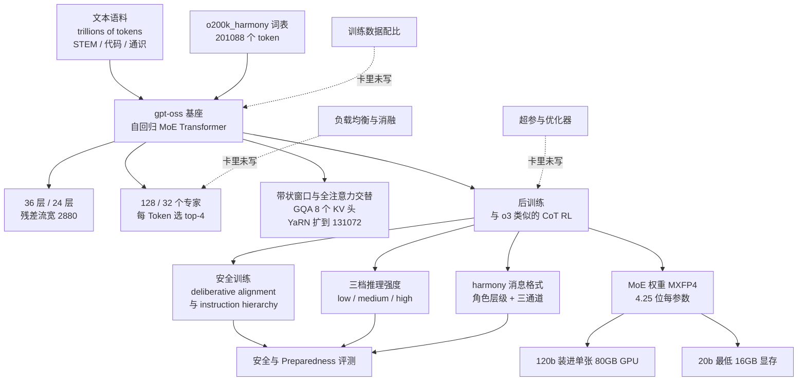
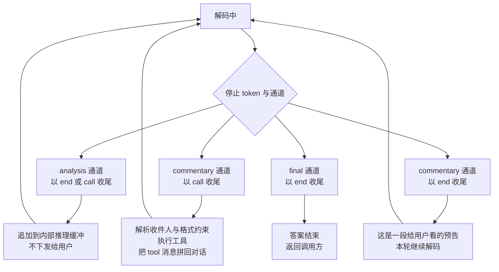

# gpt-oss 模型卡：一家闭源厂开源权重时，它讲清了格式与风险，把「怎么训出来的」整段留白

<!-- release-date: 2025-08-05 -->

> 本文依据 OpenAI 发布的 **gpt-oss-120b & gpt-oss-20b Model Card**，即 arXiv:2508.10925**v1**、2025-08-08 上传、共 35 页的 PDF；封面署名日期为 **August 5, 2025**（PDF p. 1）。动笔前核对过 arXiv 官方页面的投稿历史：**只有 v1**，本地原件页边水印为 `arXiv:2508.10925v1 [cs.CL] 8 Aug 2025`，与官方一致；共 35 页。
>
> **页码一律指这份 PDF 的物理页码**（封面算第 1 页，§1 引言从第 4 页开始）。这份 PDF 的印刷页码比物理页码小 1，直接引用时容易错位，所以本文统一用物理页。
>
> 全文把三件事分开标注：**卡里写了什么**（带页码）、**我们如何解释它**、**哪些是外部补充**。这份材料是一份 model card，不是技术报告，「它没写什么」和「它写了」同等重要，所以文末专门有一节列留白清单。

## 先说清楚这是一份什么文件

这份 35 页的 PDF 里，架构与训练只占 2 页（PDF p. 4–6），评测表 3 页（PDF p. 6–11），剩下大半是安全评测与 Preparedness 评测（PDF p. 11–29），最后是两张 harmony 格式示例图和一份外部专家评审回执（PDF p. 30–32）。

它自己解释了为什么长成这样。第 4 页有一段很关键的话：OpenAI 把这份文件叫 **model card 而不是 system card**，理由是「gpt-oss 模型会被用在大量系统里，这些系统由很多不同的利益相关方创建和维护」（PDF p. 4）。翻译过来就是：**权重交出去之后，护栏不再只由 OpenAI 一家实现**，所以这份文件的任务是告诉你「这个模型能做到什么、做不到什么、会在哪里出事」，而不是告诉你「我们怎么把它造出来的」。

这条体裁判断决定了后面所有的阅读姿势。拿它对照 DeepSeek-V3 或 Llama-3 那种技术报告，会误判成「写得太薄」；拿它对照本库已收的 Nemotron-3 白皮书（13 页，同样不给超参与算力账单）和 Mistral Large-3 的卡，就能看出这是**同一类文体的共同边界**。

## 阅读前的最小词汇表

后面会反复出现的几个词，先用人话过一遍：

- **Token（词元）**：模型读写文本时的基本小块。一个英文单词、一个汉字、一段标点，都可能被切成一个或多个 Token。
- **MoE（Mixture-of-Experts，混合专家）**：把一层前馈网络换成很多个并列的小网络（叫「专家」），每个 Token 只让其中几个干活。参数总量可以很大，单次前向的计算量却只跟「被激活的那几个」成正比。
- **激活参数（active parameters）**：处理一个 Token 真正参与计算的参数量。它是每 Token 计算量的近似标尺；总参数量则更接近「这个模型装了多少知识」。
- **路由（routing）**：按当前 Token 的隐状态给各专家打分，取分数最高的 $K$ 个，叫 **top-$K$**。
- **MXFP4（Microscaling FP4，块级缩放的 4 位浮点）**：一种低精度权重格式。每 32 个数值共用一个缩放因子，存 4 位数值加 1 字节 scale，摊下来约 4.25 位/参数。
- **chat template（对话模板）**：把「谁在说话、说给谁听」这类结构信息拼成模型真正吃进去的那串文本的规则。
- **CoT（Chain-of-Thought，思维链）**：模型在给出答案前先写出来的中间推理文本。
- **pass@1**：只让模型答一次，答对的比例。这份卡的能力评测一律报 pass@1（PDF p. 8）。

## 一句话先说清

这份卡最值得记住的，不是某个新模块，而是它把三件事按一个很清楚的优先级排了出来：

> **先把「这个模型必须被怎样使用」讲死，再把「它有多强、哪里不行」量出来，最后把「我们是怎么造它的」整段收进抽屉。**

具体落到技术上，是三根柱子：

1. **一个 116.8B 总参、每 Token 只激活 5.13B 的粗粒度 MoE**（PDF p. 4–5）。它的规格表能被反推到小数点后两位，但卡里对 MoE 最贵的那个问题——负载怎么均衡——一个字没写。
2. **harmony 消息格式被当成模型的一部分来发布**，不是 API 细节（PDF p. 6–7、30–31）。证据很硬：连词表都专门为它扩了位，名字就叫 `o200k_harmony`（PDF p. 6）。
3. **一份把「风险」写满、把「配方」留空的开源说明书**（PDF p. 11–32）。它甚至公开了外部评审提了 22 条建议、自己采纳 11 条、以及**明确列出 3 条没采纳的高优先级建议**（PDF p. 19、32）。

## 全景：这份卡覆盖到哪、断在哪



这张图按 PDF p. 4–8 的章节顺序重画，是**覆盖范围示意**，不含任何实测数据。三条虚线是本文后面要单独展开的空白。

## 规格表：卡里给的那张，和我们反推出的那张

### 卡里的原表

Table 1 是这份卡唯一的架构规格表（PDF p. 5）：

| 组件 | gpt-oss-120b | gpt-oss-20b |
|---|---:|---:|
| MLP（前馈部分） | 114.71B | 19.12B |
| Attention（注意力部分） | 0.96B | 0.64B |
| Embed + Unembed（输入嵌入 + 输出投影） | 1.16B | 1.16B |
| **激活参数** | 5.13B | 3.61B |
| **总参数** | 116.83B | 20.91B |
| Checkpoint Size（权重文件大小） | 60.8 GiB | 12.8 GiB |

表注里有两句容易被跳过的话（PDF p. 5）：模型叫「120b」和「20b」只是图省事，实际是 116.8B 与 20.9B；**输出投影算进激活参数，输入嵌入不算**。后面这条正是我们反推激活参数时必须加那 0.58B 的原因。

正文另外补了三个数：120b 是 **36 层**，20b 是 **24 层**（PDF p. 4）；两者的**残差流宽度都是 2880**（PDF p. 5）；词表 **201,088**（PDF p. 6）。

### 我们把它反推了一遍

卡里没给专家的中间维度，也没说有没有共享专家。但上面这些数已经足够把整张表重建出来，而且**吻合到小数点后两位**。下面是我们的算术，不是卡里的内容。

先假设每个专家是一个门控 SwiGLU（gated SwiGLU，卡里 §2.2 明说了用这个，PDF p. 5），三个投影矩阵各是 $2880\times H$，那么单个专家的参数量是：

$$
P_{\text{expert}} = 3 \times 2880 \times H
$$

拿 MLP 总量倒推 $H$。120b 是 36 层 × 128 个专家：

$$
H = \frac{114.71\times 10^{9}}{36 \times 128 \times 3 \times 2880} \approx 2881
$$

也就是说，**每个专家的中间维度约等于残差流宽度 2880**。代回去验一遍：

$$
3 \times 2880 \times 2880 = 24{,}883{,}200
$$

这是单个专家的参数量。乘满 128 个专家 × 36 层，得到 114.66B，卡里是 114.71B，差 0.04%。

20b 用同一个专家尺寸：$24{,}883{,}200 \times 32 \times 24 = 19.11\text{B}$，卡里 19.12B，差 0.05%。**两个规模的专家几乎一模一样大，120b 只是把层数乘 1.5、把每层专家数乘 4。**

再验其它几行：

| 反推项 | 算法 | 反推值 | 卡里的值 |
|---|---|---:|---:|
| Embed + Unembed | $201{,}088 \times 2880 \times 2$ | 1.158B | 1.16B |
| Attention（120b） | $(2880\cdot4096 + 2\cdot2880\cdot512 + 4096\cdot2880)\times 36$ | 0.956B | 0.96B |
| Attention（20b） | 同上 × 24 层 | 0.636B | 0.64B |
| 激活参数（120b） | $4\cdot P_{\text{expert}}\cdot 36 + 0.956 + 0.579$ | 5.13B | 5.13B |
| 激活参数（20b） | $4\cdot P_{\text{expert}}\cdot 24 + 0.636 + 0.579$ | 3.60B | 3.61B |

注意力那一行的 4096 和 512 分别来自「64 个查询头 × 头维 64」和「8 个 KV 头 × 64」（PDF p. 5）。嵌入那一行能对上两次，说明**输入嵌入和输出投影没有共享权重**。

这个反推还顺手回答了一个卡里没写的问题：**114.71B 几乎被 36 × 128 个专家填满（我们算出的 114.66B 只差 0.04%），没给「共享专家」或 dense 前馈层留出位置。** 所以 gpt-oss 的 MoE 里大概没有 DeepSeek 那条路线上的常驻共享专家。这是我们从参数账推出来的，卡里既没承认也没否认。

### 权重文件大小也对得上

卡里说 MoE 权重量化到 MXFP4、约 4.25 位/参数，其余部分按 §2.2 的写法保持 BF16（PDF p. 5）。用这个假设去验 checkpoint 大小：

$$
\text{平均位数} = \frac{\text{MLP 参数}\times 4.25 + \text{其余参数}\times 16}{\text{总参数}}
$$

120b 得到 4.46 位，20b 得到 5.26 位；而 60.8 GiB 与 12.8 GiB 换算回来分别是 4.47 位和 5.26 位。**两个都精确命中。**

这一条比规格表更有意思：20b 的「平均每参数位数」明显更高，不是因为它量化得差，而是因为**它的 MoE 只占总参数的 91%，120b 占 98%**。同样的量化策略，砸在小模型上省下的比例就小。任何「我们量化后模型缩了几倍」的汇报都藏着这个结构差异，值得记一笔。

## 核心设计一：116.8B 为什么只需要 5.13B 的计算

### 旧问题：参数和算力在 dense 上被绑死

稠密模型里，模型装了多少知识和每 Token 花多少计算，是同一个数字。想要更多知识，就得每次多算那么多。Llama-3 那条路线就撞在这上面——本库的 [Llama-3 篇](/reports/Meta/Llama-3) 写的正是它为了稳定性宁可用 405B 稠密模型，把复杂度挪到数据和运维上。

MoE 是解开这根绳的办法：把知识存到很多并列的小前馈网络里，每次只叫醒几个。

### 新设计：128 个「标准尺寸」专家，每 Token 选 4 个，没有常驻专家

卡里 §2.2 的 MoE 段落很短，五个要点（PDF p. 5）：

- 专家数固定：**120b 每层 128 个，20b 每层 32 个**；
- 路由器是**一个标准线性投影**，把残差向量映射成每个专家的分数；
- 每个 Token 取 **top-4**；
- 门控权重是**只在被选中的那 4 个专家上做 softmax**；
- 专家内部是门控 SwiGLU，脚注里补了一句「我们的 SwiGLU 实现不太常规，带了 clamp 和一条残差连接」（PDF p. 5）。

**「softmax 只在选中的专家上」这一句容易被滑过去，但它是个真实的选择。** 常见的两种写法不一样：先对全部 128 个 softmax 再取 top-4（权重之和会小于 1，被丢掉的那部分概率凭空消失），或者先取 top-4 再在它们中间 softmax（权重之和恒为 1）。后者让每个 Token 的专家输出总权重始终是 1，等价于「这 4 个专家合起来就是这一层的全部前馈」，数值上更接近一个稠密 FFN 的行为，也就更少依赖路由器的绝对校准。卡里没解释为什么选它，这是我们的解读。

### 收益：算力和知识脱钩到什么程度

把激活比算出来，这是本篇最该被记住的一个数：

| 指标 | gpt-oss-120b | gpt-oss-20b | DeepSeek-V3 |
|---|---:|---:|---:|
| 总参数 | 116.83B | 20.91B | 671B |
| 每 Token 激活参数 | 5.13B | 3.61B | 37B |
| 激活比 | 4.4% | 17.3% | 5.5% |
| 每层专家数 | 128 | 32 | 256 路由 + 1 共享 |
| 每 Token 激活专家数 | 4 | 4 | 8 路由 + 1 共享 |
| 被选专家占比 | 3.1% | 12.5% | 3.1% |
| 专家相对宽度 | 约 1.0 倍残差宽 | 约 1.0 倍残差宽 | 约 0.29 倍隐藏维 |

gpt-oss 一栏全部来自 PDF p. 4–5 的 Table 1 与正文；DeepSeek-V3 一栏来自本库已发布的 [DeepSeek-V3 篇](/reports/DeepSeek/DeepSeek-V3)（61 层、隐藏维 7168、每层 1 共享 + 256 路由、专家中间维 2048、每 Token 激活 8 路由）。

**最有信息量的是「被选专家占比」和「专家相对宽度」这两行合起来看**：120b 的被选占比是 4/128 = 3.1%，DeepSeek-V3 是 8/256 = 3.1%，**路由稀疏度几乎一样**。差的是专家粒度：DeepSeek 把 FFN 切成约 0.29 倍宽的小块、一次叫醒 9 个；gpt-oss 用一整块标准宽度的 FFN、一次叫醒 4 个。

### 代价与边界：卡里没写的那一半

粗粒度专家不是白拿的。DeepSeek 那条路线之所以走「切细 + 常驻共享专家」，本库的 [DeepSeekMoE 篇](/reports/DeepSeek/DeepSeekMoE) 写得很清楚：切细是为了解决「常规 top-$K$/$N$ 组合不够灵活、阻碍专家特化」，常驻共享专家是为了把公共知识从路由池里抽走，免得每个路由专家各存一份。gpt-oss 两个都没做，卡里也就没有讨论这两件事怎么绕开。

更要紧的是：**整份卡没有一句话讲负载均衡。** 没有辅助损失、没有路由偏置、没有容量因子、没有丢 Token 策略。而 DeepSeek 从 V2 到 V3 一路把这块写成主线（辅助损失 → 设备级损失 → 无辅助损失的路由偏置，还配了消融表）。这不是「OpenAI 忘了写」，更可能是「写了就等于泄露训练配方」。但对读者来说，结果是一样的：**你无法判断这个 MoE 在训练时是怎么撑住专家负载的**，也就无法判断它能不能迁移到你的场景。

还有一层是**路由稀疏度带来的训练信号问题**，卡里没提，是我们的观察：120b 每层 128 个专家、每次只用 4 个，单个专家被访问的期望频率是 4/128；20b 是 4/32，**前者只有后者的四分之一**。同样的 Token 预算下，每个专家分到的梯度更少、更容易训不充分。120b 需要 210 万 H100 小时、20b 少将近 10 倍（PDF p. 6），这个差距里有多少是层数和专家数带来的，卡里没有拆解。

### 这条路线和 Llama-4 差在哪

ai.meta.com 全域未能访问，所以这里只敢用官方仓库名本身携带的信息作外部补充：Meta 公开的权重仓库叫 `Llama-4-Scout-17B-16E` 与 `Llama-4-Maverick-17B-128E-Instruct`，名字里直接写了「17B 激活 + 16 个专家」和「17B 激活 + 128 个专家」。

按这个读法，Llama 4 和 gpt-oss 站在同一条取向上：**专家数量少而宽，每 Token 只走极少数专家。** 差别在规模定位——gpt-oss 的 128 个专家是**每层 128 个**、总参 116.8B，是把 MoE 用来把「单卡装得下」这件事做实；Maverick 的 128E 对应的是几百 B 级别的总容量。**Llama 4 每 Token 激活几个专家、有无共享专家、专家多宽，这三项本文都没能核实**（ai.meta.com 未能访问，官方仓库名里不带这些信息），所以只做到「取向相同、规模不同」这一步，不再往下比。

一句话对比三条路线：**DeepSeek 用细粒度换特化，Llama 4 用极稀疏换总容量，gpt-oss 用粗粒度加高稀疏度换「一张 80GB 卡跑完」。** 卡里 §2.1 的原话就是这条：MoE 权重占总参数 90% 以上，把它们量化到 MXFP4 就能让大模型装进单张 80GB GPU（PDF p. 5）。

### 可迁移启发

> **决定一个 MoE 部署门槛的，往往不是总参数，而是「非专家部分有多大」。**

120b 的注意力只占 0.96B、嵌入占 1.16B，两者合起来不到总参数的 2%（PDF p. 5）。这意味着：量化或卸载只要处理得动 MLP，模型就装得下；反过来，20b 的非专家占比接近 9%，同样的招数收益就小。做端侧或单卡部署评估时，先算这个比例，再谈量化。

另一个可直接借走的判断：**先定「专家多大、每 Token 走几个」，再定「总共多少个专家」。** 前者决定单 Token 计算量和数值行为，后者决定容量。gpt-oss 把 120b 和 20b 做成了「同一种专家、不同层数与数量」（我们的反推，见上文），家族内部的一致性非常好，值得在自家产品线上学。

## 核心设计二：注意力那一半，以及「谁也不听」的选项

卡里 §2.2 的注意力段落信息密度其实不低（PDF p. 5），六条：

- 沿用 GPT-3 的做法，**带状窗口（banded window）与全稠密交替**排布，带状层的带宽是 **128 个 Token**；
- 每层 **64 个查询头**，头维 **64**；
- 用 **GQA（Grouped Query Attention，分组查询注意力）**，**8 个 KV 头**——也就是每 8 个查询头共用一套 Key/Value，用来压 KV Cache；
- 用 **RoPE（Rotary Position Embedding，旋转位置编码）**；
- 用 **YaRN（Yet another RoPE extensioN，另一种 RoPE 外推法）** 把稠密层的上下文长度扩到 **131,072 个 Token**——它不重训模型，而是按频率分段缩放 RoPE 的旋转角度，让模型能读比训练窗口长得多的输入；
- **每个注意力头在 softmax 的分母上有一个可学习的偏置**，写法接近 off-by-one attention 与 attention sinks，效果是「允许这个头一个 Token 都不注意」。

最后一条值得多说两句，因为它是这份卡里少见的「把一个小技巧讲到位」的地方。普通 softmax 强制所有历史位置的权重加起来等于 1：即使当前 Token 跟前文毫无关系，它也必须把注意力分给某个位置，等于被迫从一堆不相关的东西里挑一个。分母上加一个可学习偏置，就相当于给这道选择题多一个「以上都不对」的出口。本库的 [DeepSeek-V4 篇](/reports/DeepSeek/DeepSeek-V4) 里，同一类机制（Attention Sink）被用在压缩注意力上，动机类似。

**卡里没写的**：哪些层是带状、哪些是稠密（只说「交替」，没给起始层和比例）；带状层的上下文上限是多少（YaRN 那句只说「稠密层扩到 131,072」）；有没有用 MLA 之类更狠的 KV 压缩（从我们反推出的 0.96B 注意力参数看，就是标准 GQA，没有低秩压缩）。这三条都是部署时会真撞上、但这份卡不回答的问题。

## 核心设计三：harmony 为什么长在模型身上，而不是 API 那一层

这是本篇对 infra 面试最有用的部分。卡里 §2.5.1 只有三段（PDF p. 7），但它配的词表证据、角色层级、通道设计和附录里的两张示例图，合起来指向同一个结论：**这套格式不是渲染层的事，是模型权重的一部分。**

下面五条证据按「越靠前越硬」排。

### 证据一：词表是为它扩的，名字里就带着它

§2.3 的原文（PDF p. 6）：所有训练阶段都用 `o200k_harmony` 这个词表，它在 GPT-4o 与 o4-mini 用过的 `o200k` 基础上**加入了 harmony 对话格式专用的 token**，总大小 **201,088**。

这一句的分量比它看起来重得多。给格式加专用 token，意味着这些 token **占着 embedding 矩阵的行、参与训练、有各自的梯度**。你在服务层随便换一个模板、把 `<|start|>` 换成普通字符串，模型不是在「格式不好看」，而是在**吃它从没训过的输入分布**。官方 README 把这件事说得更直白：两个模型「只能用 harmony 格式，否则不能正常工作」（外部补充，见文末链接）。

### 证据二：角色层级是一条被训练出来的策略，而且被量化出了弱点

卡里给的层级是一行等宽字（PDF p. 7）：

```text
System > Developer > User > Assistant > Tool
```

含义是：当不同角色的指令互相冲突时，模型按这个优先级裁决。这不是解析规则，是**行为倾向**，所以它必须被训练，也必须被评测。§4.3 就给了两组评测（PDF p. 14–16）。

第一组是「系统消息和用户消息打架」：

| 评测（越高越好） | gpt-oss-120b | gpt-oss-20b | OpenAI o4-mini |
|---|---:|---:|---:|
| 系统提示词提取 | 0.832 | 0.881 | 0.993 |
| 提示注入劫持 | 0.780 | 0.639 | 0.917 |

第二组是「短语与口令保护」（PDF p. 16）：

| 评测（越高越好） | gpt-oss-120b | gpt-oss-20b | OpenAI o4-mini |
|---|---:|---:|---:|
| 短语保护，系统消息对用户消息 | 0.912 | 0.793 | 0.937 |
| 口令保护，系统消息对用户消息 | 0.965 | 0.947 | 0.982 |
| 短语保护，开发者消息对用户消息 | 0.909 | 0.661 | 0.912 |
| 口令保护，开发者消息对用户消息 | 1.000 | 0.946 | 0.947 |

（以上两表为 PDF p. 15 的 Table 7 与 PDF p. 16 的 Table 8。）

**这是这份卡最坦白的地方之一**：gpt-oss 在指令层级上普遍不如 o4-mini，卡里直接写了「我们观察到两个模型在我们的指令层级评测上普遍弱于 o4-mini，还需要更多研究来理解原因」（PDF p. 16）。然后它给了两条缓解性说明：一是两个模型在 StrongReject 越狱评测上和 o4-mini 基本持平（PDF p. 14 的 Table 6 与 PDF p. 16），说明「挡住已知越狱」没问题，弱的是「挡住用户去改写系统级约束」；二是**开发者可以自己微调来加强这一项**——这是开源权重独有的退路，闭源模型没有。

对做 Agent 的人来说，这张表的实际含义是：**你不能把租户隔离、权限边界这类东西押在 developer message 上。** 卡里自己给出的数字是 20b 在「开发者消息对用户消息」的短语保护上只有 0.661。

### 证据三：通道是可见性控制，不是排版字段

harmony 在角色之外还引入了 **channel（通道）**，卡里 §2.5.1 定义了三个（PDF p. 7）：

- `analysis`：思维链 Token 的去处；
- `commentary`：函数工具调用，以及给用户看的过渡语（preamble）；
- `final`：给用户看的最终答案。

注意这三个通道的差别不是「样式」，是**谁能看见**。同一个 assistant 回合里，模型可以先写一段只给编排器看的推理，再写一段既给系统也给用户看的工具调用，最后写一段纯给用户的答案。这套语义在 JSON function calling 里是拼不出来的——那边只有一个 `content` 加一个 `tool_calls`，思考文本要么塞进 content 污染用户可见区，要么塞进自定义字段变成模型从没训过的分布。

卡里紧接着给了这条设计的两个直接后果（PDF p. 7）：模型可以**在思维链内部穿插工具调用**，也可以**在真正动手前先给用户一个预告**。这两件事都是 Agent 体验的关键，而它们能做的根因是：**输出被切成了带语义的多个流，模型在训练时就见过这种切法。**

### 证据四：推理强度是系统提示里的一个字符串

§2.5.2 只有一段（PDF p. 8）：三个档位 `low`、`medium`、`high` 是**通过在系统提示里插入形如 `Reasoning: low` 的关键字来配置的**；提高档位会让模型的平均思维链长度变长。

这句话在工程上很容易被误当成「不就是个开关」。它真正的意思是：**「多想一会儿」是训练出来的条件行为，不是推理时把 `max_tokens` 调大。** 本库的 [DeepSeek-V4 篇](/reports/DeepSeek/DeepSeek-V4) 里，同一件事被写成「Reasoning Effort 是训练出的条件行为，不只是线上把输出上限调大」，两家在不同技术路线上得到了同一条结论。

差别在实现位置：DeepSeek-V4 用专门的三档专家加 `<think>` 格式，gpt-oss 把档位写进系统提示的文本里。后者的代价是**这个字符串一旦拼错或者被中间层吃掉，档位就悄悄回落到默认值，而且不会报错**——这是接三方推理网关时非常常见的事故。

### 证据五：工具调用的结束符不是普通结束符

附录 1 的 Figure 17 和 Figure 18 给了完整的输入输出例子（PDF p. 30–31）。**这两张图在 PDF 里是位图截图，文本层抽不出来，下面的 token 串是逐字读图得到的。**

输入侧（Figure 17，PDF p. 30）：

```text
<|start|>system<|message|>You are ChatGPT, a large language model trained by OpenAI.
Knowledge cutoff: 2024-06
Current date: 2025-06-28

reasoning: low

# Valid channels: analysis, commentary, final. Channel must be included for every message.
Calls to these tools must go to the commentary channel: 'functions'.<|end|>
<|start|>developer<|message|># Instructions

Use a friendly tone.

# Tools

## functions
namespace functions {

// Gets the current weather in the provided location.
type get_current_weather = (_: {
// The city and state, e.g. San Francisco, CA
location: string,
format?: "celsius" | "fahrenheit", // default: celsius
}) => any;

} // namespace functions<|end|>
<|start|>user<|message|>What is the weather like in SF?<|end|>
<|start|>assistant
```

输出侧（Figure 18，PDF p. 31）：

```text
<|channel|>analysis<|message|>Need to use function get_weather.<|end|>
<|start|>assistant<|channel|>commentary to=function.get_weather <|constrain|>json<message>{"location":"San_Francisco"}<|call|>
```

把这套控制 token 拆开来读，一共六个：

| Token | 作用 | 为什么必须在模型这一侧 |
|---|---|---|
| `<|start|>` | 开一条消息，后面紧跟作者 | 决定「这句话是谁说的」，直接接指令层级 |
| `<|message|>` | 作者结束，正文开始 | 把元数据和内容分开，不用转义 |
| `<|channel|>` | 指定这条消息走哪个通道 | 决定谁能看见这段文字 |
| `<|constrain|>` | 声明输出格式约束（这里是 `json`） | 结构化输出的格式承诺在 token 层 |
| `<|end|>` | 这条消息结束，交回控制权 | 服务循环据此判断「本轮完了」 |
| `<|call|>` | 这条消息结束，但**在等外部结果** | 服务循环据此判断「停下、执行工具、把结果塞回去」 |

**`<|end|>` 与 `<|call|>` 的区分，是整套格式里最系统级的一处设计。** 一个自回归解码循环只有知道「模型说完了没有」才能决定何时返回给用户。如果工具调用也用普通结束符标记，引擎就必须再跑一个解析器去猜「这段 JSON 是不是要调工具」，猜错的代价是要么把工具请求当答案吐出去，要么把答案当工具请求卡住。harmony 把这件事压成了一个 token 判断：**解码到 `<|call|>` 就停、就派发；解码到 `<|end|>` 就停、这一条只是消息。**



这张图依据 PDF p. 7 的通道定义与 PDF p. 31 的 Figure 18 重画，是**服务循环的状态示意**，不含时序或延迟数据。四条分支的区别只在通道与停止符的组合上；节点文字里省去了 `<|...|>` 这层尖括号，以免与 Mermaid 的语法冲突。

对照本库已收的另一条路线：DeepSeek-V4 用 `<|DSML|tool_calls>` 加 XML 结构，理由是减少转义失败；gpt-oss 用「通道 + 收件人 + 专用结束符」，把工具调用变成消息图里的一条边。两家都在解决同一件事——**自然语言和结构化调用不能挤在同一个字符串里**——但切的位置不同。

### 还有一条容易被跳过的运维要求：多轮要删思考

§2.5.1 最后一句（PDF p. 7）：**在多轮对话里，过去 assistant 回合的思维链应当被移除。**

这条对我们写客户端和网关有直接影响，值得单独想清楚。它意味着：

- 历史里的 `analysis` 通道内容**不能原样回灌**。上一轮想了三千 Token，下一轮把它们全带上，模型看到的是它自己从没被训过的上下文形态；
- 但删掉思考**会打断前缀缓存**。KV Cache 复用的前提是历史逐字不变，一旦把中间某段思考剪掉，从那个位置往后的缓存全部作废，得重算。

所以这是一个真实的三角权衡：**上下文成本、分布一致性、前缀缓存命中率**，三者不能同时最优。卡里只给了「应当移除」这一句要求，没有给移除策略（全删、只删工具往返之间的、还是按长度截），也没有给对应的延迟或成本数字。这是留白，不是暗示。

### 可迁移启发

> **如果你的模型有工具调用和多种可见性，那么「消息格式」应当被当成模型规格的一部分来设计、来测试、来版本化。**

三条能直接落地的：

1. 把 chat template 的**正确性纳入模型验收**，而不是当成前端拼装。harmony 的做法是随模型一起发一个专门的解析/渲染库（外部补充：OpenAI 同时开源了 `harmony` 包），让「拼对」这件事有唯一实现。
2. **给「本轮结束」和「在等外部结果」用不同的停止符。** 只要你的解码循环靠停止字符串驱动，这一条就能省掉一整类线上事故。
3. **可见性做成结构字段，不要靠提示词约定。** 「这段不要给用户看」如果只写在 system prompt 里，它就是一条会被越狱、会被日志系统漏出去的自然语言要求；写成通道，它是 token 层的元数据，中间件可以按它做过滤。

## 三档推理强度买到了什么

§2.6.1 的 test-time scaling 一段（PDF p. 9）说：在三个档位上扫，把准确率对「思维链加答案的平均长度」作图，**大多数任务上呈对数线性收益**——更长的思维链换来更高准确率，但代价是最终回复延迟和成本「相当大地」上升。

Figure 3（PDF p. 8）给了 AIME 2025 与 GPQA Diamond 两张曲线，横轴是 CoT + Answer 长度，大致从 1K 到 32K Token，三个档位分别落在曲线的低、中、高端。**这是一张图，卡里没有给可引用的具体点值**，所以本文不编数字。

卡里给的两个具体点值得记：

- **gpt-oss-20b 做 AIME 时平均用掉超过 20K 个思维链 Token**（PDF p. 9）。这是「小模型靠长思考补规模」这句话少见的实数。
- 卡里的建议是**按用例同时选模型大小和推理档位**，而不是默认拉满（PDF p. 9）。

**卡里没写的**：每一档的 Token 预算上限、每档的延迟与成本表、以及档位和工具调用轮数怎么相互影响。这三样是上线时真正要拍的东西。

## 评测：数字、口径，和两处对不上

### 先钉住口径

三句必须先看的话：

1. 能力评测**全部报 pass@1**，全部在 **high 档位**，全部用**模型默认的系统提示**（PDF p. 8）。
2. 第 12 页有一个加框声明：**「除另有说明外，本模型卡中的性能结果描述的是 gpt-oss-120b 与 gpt-oss-20b 的默认表现。」**（PDF p. 12）
3. Preparedness 那一章的所有数字，主体是**内部对抗微调版本**（卡里写作 `launch candidate`、`helpful-only`、`cyber max`），**这些权重不发布**（PDF p. 18）。

第 3 条特别要紧：下面 Preparedness 那几张表里的 gpt-oss 数字，跟你下载到的权重不是同一个东西。

### 全量能力表（Table 3，PDF p. 11）

| 基准（准确率 %） | 120b low | 120b medium | 120b high | 20b low | 20b medium | 20b high |
|---|---:|---:|---:|---:|---:|---:|
| AIME 2024（无工具） | 56.3 | 80.4 | 95.8 | 42.1 | 80.0 | 92.1 |
| AIME 2024（有工具） | 75.4 | 87.9 | 96.6 | 61.2 | 86.0 | 96.0 |
| AIME 2025（无工具） | 50.4 | 80.0 | 92.5 | 37.1 | 72.1 | 91.7 |
| AIME 2025（有工具） | 72.9 | 91.6 | 97.9 | 57.5 | 90.4 | **98.7** |
| GPQA Diamond（无工具） | 67.1 | 73.5 | 80.1 | 56.8 | 66.0 | 71.5 |
| GPQA Diamond（有工具） | 68.1 | 73.5 | 80.9 | 58.0 | 67.1 | 74.2 |
| HLE（无工具） | 5.2 | 8.6 | 14.9 | 4.2 | 7.0 | 10.9 |
| HLE（有工具） | 9.1 | 11.3 | 19.0 | 6.3 | 8.8 | 17.3 |
| MMLU | 85.9 | 88.0 | 90.0 | 80.4 | 84.0 | 85.3 |
| SWE-Bench Verified | 47.9 | 52.6 | 62.4 | 37.4 | 53.2 | 60.7 |
| Tau-Bench Retail | 49.4 | 62.0 | 67.8 | 35.0 | 47.3 | 54.8 |
| Tau-Bench Airline | 42.6 | 48.6 | 49.2 | 32.0 | 42.6 | 38.0 |
| Aider Polyglot | 24.0 | 34.2 | 44.4 | 16.6 | 26.6 | 34.2 |
| MMMLU（平均） | 74.1 | 79.3 | 81.3 | 67.0 | 73.5 | 75.7 |

| 基准（得分 %） | 120b low | 120b medium | 120b high | 20b low | 20b medium | 20b high |
|---|---:|---:|---:|---:|---:|---:|
| HealthBench | 53.0 | 55.9 | 57.6 | 40.4 | 41.8 | 42.5 |
| HealthBench Hard | 22.8 | 26.9 | 30.0 | 9.0 | 12.9 | 10.8 |
| HealthBench Consensus | 90.6 | 90.8 | 89.9 | 84.9 | 83.0 | 82.6 |

| 基准（Elo） | 120b low | 120b medium | 120b high | 20b low | 20b medium | 20b high |
|---|---:|---:|---:|---:|---:|---:|
| Codeforces（无工具） | 1595 | 2205 | 2463 | 1366 | 1998 | 2230 |
| Codeforces（有工具） | 1653 | 2365 | 2622 | 1251 | 2064 | 2516 |

这张表里有三件事值得单独拎出来。

**第一，20b 在 AIME 2025（有工具）上是 98.7，比 120b 的 97.9 还高。** 这不是排版错误——Figure 1（PDF p. 6）里对应的柱子也是同一个数。竞赛数学是一个「一次做对」的任务，长思维链的收益远大于知识容量，而 20b 恰好被观察到平均用 20K 以上的思考 Token（PDF p. 9）。但同一张表的 GPQA Diamond 上，20b 是 71.5 对 120b 的 80.1，差 8.6 分——卡里的解释很干脆：**知识型任务上小模型就是吃亏**（PDF p. 9）。这两行放在一起，是「激活参数量级差 1.4 倍、总容量差 5.6 倍」这个结构在评测上的直接投影。

**第二，工具不是万能加分项。** Codeforces 上，120b 从 2463 涨到 2622，20b 从 2230 涨到 2516，涨幅 284 与 286 Elo，几乎一样；但 HLE（人类最后考试，专家级开放题）上 20b 从 10.9 涨到 17.3，相对提升 59%，远超 120b 的 14.9 到 19.0（相对 28%）。**工具对小模型的价值更大**，因为它补的正是知识容量这一短板。

**第三，HealthBench Consensus 上 120b 从 low 到 high 是 90.6 → 90.8 → 89.9，不升反降。** 卡里没解释这一列。我们的读法是：Consensus 是「被多位医生一致认可」的子集，样本量小、且这个子集本身偏易，档位提高带来的更长回答不一定命中医生共识的评分点。这属于「聚合分数会骗人」的常规案例，不该拿它论证「推理档位无用」。

### 对外部模型的对照（Figure 1、2、4，PDF p. 6、7、10）

这些数字只在图里，读自哪张图逐一标注：

| 基准 | GPT-4o | o1 | o3 | o3-mini | o4-mini | 120b high | 20b high |
|---|---:|---:|---:|---:|---:|---:|---:|
| AIME 2024（有工具），读自 Figure 1 | — | — | 95.2 | 87.3 | 98.7 | 96.6 | 96.0 |
| AIME 2025（有工具），读自 Figure 1 | — | — | 98.4 | 86.5 | 99.5 | 97.9 | 98.7 |
| GPQA Diamond（无工具），读自 Figure 1 | — | — | 83.3 | 77.0 | 81.4 | 80.1 | 71.5 |
| HLE（无工具），读自 Figure 1 | — | — | 24.9 | 13.4 | 17.7 | 14.9 | 10.9 |
| MMLU，读自 Figure 1 | — | — | 93.4 | 87.0 | 93.0 | 90.0 | 85.3 |
| Codeforces（无工具），读自 Figure 2 | — | — | 2706 | 2073 | 2719 | 2463 | 2230 |
| SWE-Bench Verified，读自 Figure 2 | — | — | 69.1 | 49.3 | 68.1 | 62.4 | 60.7 |
| Tau-Bench Retail，读自 Figure 2 | — | — | 70.4 | 57.6 | 65.6 | 67.8 | 54.8 |
| HealthBench，读自 Figure 4 | 32.0 | 41.8 | 59.8 | 37.8 | 50.1 | 57.6 | 42.5 |
| HealthBench Hard，读自 Figure 4 | 0.0 | 7.9 | 31.6 | 4.0 | 17.5 | 30.0 | 10.8 |
| HealthBench Consensus，读自 Figure 4 | 88.7 | 91.5 | 92.8 | 91.1 | 91.8 | 90.0 | 82.6 |

Figure 1 的图注里有一个星号注释：**o3-mini 在 AIME 上是不带工具评的**（PDF p. 6），所以那两行的对比不完全同条件。另外 Tau-Bench Retail 一列 o3 的 70.4 高于 120b 的 67.8，而正文却写「120b 在主能力评测上接近 o4-mini」——这个说法在 Tau-Bench 上成立（67.8 对 65.6），在 HLE 上就不成立。读图注比读正文靠谱。

HealthBench Consensus 这一行有个小对不上：**图里 120b 是 90.0，Table 3 里同一格是 89.9**（PDF p. 10 与 p. 11）。差异在作图精度内，但提醒一件事——同一份文档里图和表是两条独立生产线，取数要认表。

健康这条线卡里给的评价是「健康表现—成本前沿上的一次大的帕累托改进」（PDF p. 9），并且明确写了**这些模型不能替代医疗专业人员、不用于诊断或治疗疾病**（PDF p. 10）。

### 多语言：真正的信息在表尾两行（Table 2，PDF p. 10）

MMMLU 是 MMLU 的专业人工翻译版，14 种语言。完整表 14 行，这里给头尾和平均：

| 语言 | 120b low | 120b high | 20b high | o3-mini high | o4-mini high | o3 high |
|---|---:|---:|---:|---:|---:|---:|
| Arabic | 75.0 | 82.7 | 76.3 | 81.9 | 86.1 | 90.4 |
| Chinese | 77.9 | 83.6 | 79.4 | 83.6 | 86.9 | 89.3 |
| Spanish | 80.6 | 85.9 | 81.2 | 84.0 | 88.0 | 91.1 |
| Swahili | 59.9 | 72.3 | 60.7 | 73.8 | 81.3 | 86.0 |
| Yoruba | 49.7 | 62.4 | 50.1 | 63.7 | 70.8 | 78.0 |
| **Average** | 74.1 | 81.3 | 75.7 | 80.7 | 85.2 | 88.8 |

看平均行，120b high 的 81.3 对 o4-mini 的 85.2，差 3.9 分，跟卡里「接近 o4-mini」的说法对得上。但看尾两行：**约鲁巴语上 120b high 只有 62.4，连 o3-mini 的 63.7 都不如**；斯瓦希里语上 120b high 的 72.3 也低于 o3-mini 的 73.8。**低资源语言上，参数量的优势被语料优势完全抵消。** 这是「平均数会盖住长尾」的一个非常干净的样本，任何做多语言评测的人都该把这张表的最后两行贴在自己看板上。

另外注意 §2.6.3 交代的一个解析细节：答案是从模型回复里**剥掉多余 markdown 与 LaTeX、再搜索目标语言里「Answer」的各种译法**来定位的（PDF p. 10）。这是一句很诚实的话——它意味着分数里含着一层脆弱的正则，模型输出格式一变就可能掉分，而 harmony 通道恰好就是格式。

### 安全评测：三张表，两张对自己不利

**生产级基准（Table 5，PDF p. 14）** 是 gpt-oss 相对占优的那一组：

| 类别（not_unsafe 越高越好） | 120b | 20b | o4-mini | GPT-4o |
|---|---:|---:|---:|---:|
| 非暴力仇恨 | 0.895 | 0.901 | 0.832 | 0.852 |
| 个人数据 | 0.888 | 0.921 | 0.847 | 0.860 |
| 骚扰/威胁 | 0.832 | 0.819 | 0.695 | 0.745 |
| 色情/非法 | 0.919 | 0.852 | 0.857 | 0.927 |
| 极端主义 | 0.932 | 0.951 | 0.932 | 0.919 |
| 非法/非暴力 | 0.692 | 0.656 | 0.658 | 0.573 |
| 非法/暴力 | 0.817 | 0.744 | 0.845 | 0.633 |
| 自伤/意图 | 0.950 | 0.893 | 0.862 | 0.849 |
| 自伤/指导 | 0.910 | 0.899 | 0.901 | 0.735 |

卡里对这一组的定性是：两个模型在旧的「标准违禁内容」评测上和 o4-mini 差 1–2 个点以内，但那个集合已经**饱和、不再能提供增量安全进展的信号**，所以另建了这套更贴近真实多轮对话的生产级基准（PDF p. 12–13）。**「我们不再报这个数，因为它已经测不出差别」是一句值得学的自我约束**——同一页还写了「我们计划不久后停止发布旧的这套」。

**幻觉（Table 9，PDF p. 17）** 是明显吃亏的一组，且**评测时不给联网**：

| 评测 | 指标 | 120b | 20b | o4-mini |
|---|---|---:|---:|---:|
| SimpleQA | 准确率 | 0.168 | 0.067 | 0.234 |
| SimpleQA | 幻觉率（越低越好） | 0.782 | 0.914 | 0.750 |
| PersonQA | 准确率 | 0.298 | 0.155 | 0.356 |
| PersonQA | 幻觉率（越低越好） | 0.491 | 0.532 | 0.361 |

**120b 在 SimpleQA 上的幻觉率是 78.2%。** 卡里给的解释是两条：小模型世界知识本来就少、更容易编；以及**允许联网检索会显著降低幻觉**（PDF p. 17）。第二条其实是在提醒读者：这份卡的能力评测默认不带工具，而真实部署几乎一定带。

其它几组：越狱（StrongReject，Table 6，PDF p. 14）四个类别上 120b 在 0.979–0.993、20b 在 0.960–0.982、o4-mini 在 0.974–0.991，基本持平；BBQ 偏见（Table 10，PDF p. 17）歧义问题上 120b 0.87 / 20b 0.79 / o4-mini 0.82，消歧后 0.90 / 0.89 / 0.95，卡里的说法是「大致与 o4-mini 持平」。

### Preparedness：对抗微调后的上限，以及全部为 0 的那张图

第 5 章的方法值得单独看，因为它在同类文件里少见。OpenAI **自己扮演攻击者**，用内部 o 系列 RL 训练栈对 120b 做增量强化学习，模拟一个「懂技术、能拿到强后训练基础设施、能收集领域数据、算力预算充足」的对手（PDF p. 18）。两条路：一条是 **helpful-only 训练**（只奖励「答得符合请求」，不管安全），一条是**针对生物与网络安全基准直接最大化能力**（生物侧加网络浏览和专家 biorisk 数据，网安侧用 CTF 环境）。**这些对抗微调版本明确不发布**（PDF p. 18）。

结论是：即使经过这套强微调，120b 仍未在「生物与化学风险」「网络安全能力」两个追踪类别上达到 High 门槛；SAG（安全咨询小组）复核后认可这个判断（PDF p. 18）。

第二个问题更有意思：**发布 120b 会不会把开源模型的生物能力前沿推高一截？** 卡里说不会。而且它交代了一个很实在的过程：一开始主要对标 DeepSeek R1-0528，**过程中 Qwen 3 Thinking 和 Kimi K2 发布了，于是把它们也加进对比集**，结论是在多数评测上「已经存在别的开源权重模型打平或接近 gpt-oss-120b」（PDF p. 18）。这句话的信息量比结论本身大——它说明这个判断对时间窗口很敏感。

生物侧的几个上限数字（全部是**对抗微调版本在最大诱导条件下**的成绩）：

| 评测 | 人类基线 | 120b 最好档 | o3 | 出处 |
|---|---|---:|---:|---|
| 多模态病毒学排障（350 题） | 平均人 40% | 55%（browsing bio-max） | 63% | PDF p. 21，Figure 6 |
| ProtocolQA 开放版（108 题改造） | 共识专家 54%、中位专家 42% | 28% | 35% | PDF p. 21，Figure 7 |
| 隐性知识与排障 | 共识专家 80%、第 80 百分位博士 63% | 78% | 72% | PDF p. 22，Figure 8 |
| TroubleshootingBench（52 个实验方案 × 3 问） | 第 80 百分位博士 36.4% | 26% | 32% | PDF p. 22–23，Figure 9 |

四条曲线共同指向卡里 §5.2.1 的那句定性：文本型生物知识很强，但**在复杂实验方案排障上没到高门槛，而且纯文本架构天然限制了它在依赖视觉的实验场景里的适用性**（PDF p. 19）。

网安侧的 CTF 成绩（pass@12，读自 PDF p. 25 的 Figure 10 与 Figure 11）：

| 评测 | o3 | o4-mini | 20b 微调候选 | 120b 微调候选 | 120b helpful-only | 120b cyber-max |
|---|---:|---:|---:|---:|---:|---:|
| Collegiate CTF | 39% | 27% | 17% | 33% | 32% | 未画（训练集含此档） |
| Professional CTF | 28% | 16% | 2% | 14% | 21% | 25% |

cyber-max 是在高中与大学级 CTF 上加训过的版本，在专业级上只比 o3 低 3 个百分点（PDF p. 25）。卡里同时提醒：**大学级 CTF 本来就在 cyber-max 的训练数据里，所以那张图不画它**（PDF p. 25）——主动指出自己的对比哪里不干净，这种写法在厂商文件里不多。

真正让人对当前 Agent 安全水位放心（或担心）的是 Cyber Range：**5 个场景、30 次试验、三种配置（只给目标 / 给粗略计划 / 给部分解题代码），所有模型在 pass@12 上全部 0%，只有「给提示」这一档出现 1% 和 2% 的 pass@1**（PDF p. 26–27，Figure 12）。卡里的原话是「没有任何模型能在无帮助或有帮助下解决任何场景」（PDF p. 27）。

AI 自我改进这一章的三张图（PDF p. 28–29）：

| 评测 | o3 | o4-mini | 20b 微调候选 | 120b 微调候选 | 出处 |
|---|---:|---:|---:|---:|---|
| SWE-bench Verified（n=477，pass@1） | 68% | 69% | 65% | 66% | Figure 14，PDF p. 28 |
| OpenAI PRs（pass@1） | 44% | 39% | 37% | 37% | Figure 15，PDF p. 29 |
| PaperBench（10 篇子集，pass@1） | 21% | 25% | 7% | 11% | Figure 16，PDF p. 30 |

**注意 SWE-bench Verified 在这里是 66%，而 Table 3 里 120b high 是 62.4%。** 两边不是同一个设置：Preparedness 用的是固定 477 题子集、内部工具脚手架、不给模型看单元测试、对 o3/o4-mini 每题平均 4 次取 pass@1（PDF p. 27–28）；能力评测用的是默认系统提示与另一套 harness。**同一个基准名、同一份文档、两个数，差别全在 harness。** 这是本篇最想递到读者手里的一个阅读习惯。

PaperBench 那一行也值得停一下：8,316 个可独立评分的子任务、20 篇 ICML 2024 Spotlight 与 Oral 论文，120b 只有 11%、o4-mini 25%（PDF p. 28–29）。**「会做数学竞赛」和「能复现一篇论文」之间差的不是模型大小，是长程一致性。**

### 两处内部对不上

1. **病毒学排障题量**：§5.2.1.2 正文写「350 道完全留出的病毒学排障问题」（PDF p. 21），附录 2 里则写「在最终的 322 题数据集上做了 VCT 并报告了人类基线对比」（PDF p. 32）。两个数不一致，卡里没有调和。
2. **HealthBench Consensus 的 120b 值**：Figure 4 是 90.0，Table 3 是 89.9（PDF p. 10、11）。

这两处都不影响结论，但它们是「这份文档是人写的、有生产线缝隙」的直接证据。

## 安全部分真正有价值的，不是分数而是三条决定

**第一条：不对思维链施加优化压力。**

§4.4（PDF p. 15–16）解释了原因：他们发现监控推理模型的思维链有助于发现误行为，但也发现**如果直接压制思维链里的「坏想法」，模型可能学会藏起思考、行为照旧**。OpenAI 因此决定**两个开源权重模型都不对 CoT 施加任何直接优化压力**，希望给开发者留出实现 CoT 监控的空间，也让社区能继续研究可监控性。

这条决定的直接后果写在下一段：**这些思维链不受约束，里面可能有幻觉内容，也可能有不符合 OpenAI 安全政策的语言；开发者不应该在不加过滤、审核或摘要的情况下直接展示给终端用户**（PDF p. 16）。

**这是本库里少见的、把一条安全决定和它的用户侧代价写在同一页的材料。** 它同时给出了架构层面的含义：harmony 的 `analysis` 通道之所以要独立存在、之所以要求多轮时删掉历史思考，都跟这条决定咬合。格式、可见性和可监控性不是三件独立的事。

**第二条：主动模拟攻击者，并且把不发布的产物说清楚。**

见上一节。补一句：卡里把「我们造了这些对抗版本，但不发布」（PDF p. 18）写得很直白，同时也交代了外部专家评审看到的材料包含**非公开的微调数据集、方法与脚手架细节**（PDF p. 19）。也就是说，这套方法的完整可复核性是**只对外部评审开放、对公众不开放**的。这是这份卡在「透明度」上最实的一处边界。

**第三条：把外部评审的分歧公布出来。**

§5.1.1（PDF p. 18–19）：请了 METR、SecureBio 和 Daniel Kang 三位外部专家独立评审对抗训练方法，共享了论文草稿、非公开的数据集与脚手架细节，并开了一小时问答。**外部评审共提交 22 条建议，OpenAI 采纳了 11 条，其中包括 12 条高优先级里的 9 条。** 附录 2 逐条列出已实施的（分三类：澄清威胁模型、加强评测完整性与可靠性、改进评测设置），并**专门列了 3 条没采纳的高优先级建议**（PDF p. 32）：

| 未采纳的建议 | OpenAI 的理由 |
|---|---|
| 把 best-of-N 脚手架普遍应用到所有评测 | 相关实验已在别处部分做过，全量重跑预期增益有限 |
| 从 Preparedness 门槛里去掉 ProtocolQA | 尽管有局限，它提供了独一无二的安全信号；去掉会留下大缺口；改门槛超出本次发布的范围 |
| 计算「闭源模型替换掉拒答后」的联合表现 | 以往测试显示闭源模型在良性代理任务上本来就不拒答（Gryphon 除外），这样合并对「开源模型能补多少闭源缺口」给不出信号 |

**一张「我们没听哪些意见、为什么没听」的表，比十张「我们做了什么」的表更能说明这份文件的可信度。** 这也是这份卡最该被同行抄走的一个格式。

## 一个闭源厂开源权重时：公开了什么，留白了什么

这是本篇的第三根柱子，也是面试里最容易被追问的一问。下面这张表按「训练链条的环节」逐项列，**左列全部是卡里写了的，右列全部是卡里没写的**——右列的每一格都是我们核对全文后确认的空白，不是我们的猜测。

| 链条环节 | 卡里公开了 | 卡里留白 |
|---|---|---|
| 架构 | 层数、残差宽度、专家数、top-$K$、路由形式、SwiGLU 变体、注意力交替模式、GQA 头数、YaRN 长度、softmax 分母偏置（PDF p. 4–5） | 专家中间维度（我们反推的）、带状/稠密层的排布、窗口层的上下文上限、是否所有层都是 MoE 层、嵌入是否绑定（我们反推的） |
| 词表 | 名字 `o200k_harmony`、大小 201,088、来源（PDF p. 6） | 控制 token 的具体 ID、特殊 token 列表 |
| 数据 | 「纯文本、数万亿 Token、偏 STEM 与代码」、CBRN 过滤沿用 GPT-4o、知识截止 2024 年 6 月（PDF p. 6） | **确切 Token 数、来源配比、清洗与去重规则、质量模型、合成数据比例、污染检查** |
| 算力 | H100、PyTorch + Triton、120b 用 210 万 H100 小时、20b 少近 10 倍、Flash Attention（PDF p. 6） | **GPU 数量、墙钟时长、总 FLOPs、MFU、集群拓扑、故障率、训练成本** |
| 超参 | 无 | **学习率、batch、warmup、衰减、优化器、权重衰减、梯度裁剪，全部未提** |
| MoE 训练 | 路由与门控的推理期形式（PDF p. 5） | **负载均衡方法、辅助损失、路由偏置、容量因子、丢 Token 策略、专家特化证据** |
| 消融 | 无 | **全卡零消融。没有任何一处「去掉 X 会怎样」** |
| 后训练 | 「与 o3 类似的 CoT RL 技术」、三档推理、三类工具、deliberate alignment 与指令层级（PDF p. 7–8、11） | **RL 算法、奖励模型与奖励设计、阶段数、数据量、SFT 数据构成、思维链长度预算** |
| 量化 | MoE 权重 MXFP4、4.25 位、动机是显存、checkpoint 大小（PDF p. 5） | **是量化感知训练还是训练后量化、量化前后的精度差、非 MoE 部分的实际存储格式** |
| 推理与服务 | 「装进单张 80GB」「最低 16GB」（PDF p. 5） | **吞吐、延迟、并发、显存拆解、并行策略、算子与 Kernel 工作，全部未提** |
| 评测 | Table 3 的 19 行结果 × 3 档 × 2 模型、多语言 14 语（Table 2）、7 张安全表、Preparedness 全套 | 每格的置信区间与运行次数、多数 harness 的具体配置、与自家线上版本的一致性 |
| 安全 | 默认模型的全部安全成绩，包括比自己弱的项；对抗微调的方法与结论；外部评审 22 条建议与 3 条未采纳（PDF p. 11–32） | 线上分类器与审核建议的具体阈值、滥用监测、使用政策的条文（卡里只提名字） |
| 发布物 | 两个模型权重、`harmony` 库、`tiktoken` 词表、参考实现与工具 harness（PDF p. 6–8；仓库见外部补充） | 对抗微调版本、`cyber max`、各 `launch candidate` 检查点——**明说「不发布」**（PDF p. 18） |

### 怎么读这张表

**留白不是均匀分布的，它集中在「配方」，公开集中在「接口」和「后果」。**

架构规格、消息格式、评测口径、安全成绩——这四类写得相当细，其中安全部分占了全文三分之二以上的篇幅。数据、算力、超参、消融、后训练配方、服务成本——这六类基本为零。

这个分布不是随意的。它对应一个很清楚的判断：**OpenAI 愿意让你知道「怎么正确使用它」和「它会怎么出事」，不愿意让你知道「怎么再造一个它」。** 前者是生态与责任问题，写得越细越有利；后者是竞争问题，一个字都不写。

拿它跟本库已收的另外两类开源说明书对照，能看出三种不同的取舍：

- **DeepSeek 系列技术报告**：把配方当资产公开。数据规模、学习率、batch、并行策略、Kernel、故障处理全写，甚至给出消融表和自己的反例（比如 V3 里「无辅助损失本身更优」这个叙事被自己否掉）。它换回来的是社区帮它验证与改进整条路线。
- **NVIDIA Nemotron-3 白皮书**：13 页，公开「这一代押了哪七个技术注」和初步证据，不给超参与算力账单，并且自己在开头就声明这是白皮书不是施工手册。它换回来的是生态位与硬件需求。
- **gpt-oss 这份卡**：公开规格、格式与风险，配方全留。它换回来的是「OpenAI 有开源权重」这个事实本身，以及一份把安全评测做成主菜的责任叙事。

三种都是理性的，但**只有第一种能被复现**。这是面试里被问「开源和开源有什么不同」时最实在的回答：**开源权重的深浅，取决于它愿不愿意公开训练链条上的配方环节，而不是取决于它有没有把权重放出来。**

### 一个必须写下来的观察

这份卡是 OpenAI 在 gpt-oss 上唯一一份**技术意义上的公开文件**——它没有配一份技术报告。而它自己在第 4 页就把「为什么这不是系统卡」解释了。也就是说，**「留白」在这份文件里是被体裁选择正当化过的**：既然定位是 model card，那么不给超参就不是缺陷，而是符合定义。

但读者要防的是另一头：**别把一份 model card 读成一份技术报告。** 这份卡里没有任何一个数字能告诉你「为什么这样设计」，它只告诉你「设计是什么」和「结果是多少」。本篇里所有关于设计动机的解释——softmax 只在选中专家上做的意义、粗粒度专家的代价、多轮删思考与前缀缓存的冲突——都是我们的推断，卡里没有支撑。

## 报告没告诉我们的事（缺口清单）

逐条列，不含推测：

1. **专家中间维度、是否所有层都是 MoE 层、有无共享专家**：卡里都没写。本文的 2880、全层 MoE、无共享专家，全部来自 Table 1 的参数账反推，误差 0.04%–0.05%，但**这是我们的推断，不是卡里的陈述**。
2. **MoE 负载均衡**：整份卡零字。无法判断它靠什么撑住 128 个专家 × 36 层的训练。
3. **训练数据**：只有「纯文本、数万亿 Token、偏 STEM 与代码、过滤了 CBRN 内容、知识截止 2024 年 6 月」（PDF p. 6）。配比、清洗、去重、污染检查全部未提。
4. **超参与优化器**：全部未提，包括学习率、batch、warmup、衰减、权重衰减、梯度裁剪。
5. **算力与时长**：只给了 210 万 H100 小时（PDF p. 6）。GPU 数、墙钟、总 FLOPs、MFU 全部未提。
6. **消融**：全卡零消融。三档推理、MXFP4、YaRN、softmax 分母偏置这几项，**没有任何一项被单独量化过收益**。
7. **量化路径**：卡里的原话是我们译成的中文「我们对模型进行了后训练，其中 MoE 权重量化到 MXFP4 格式」（PDF p. 5），这句话读起来像量化感知训练，但**它没有明确区分 QAT 与训练后量化，也没给量化前后的精度差**。
8. **部署规格**：卡里唯一的上下文数字是「稠密层用 YaRN 扩到 131,072」（PDF p. 5）。**没有一行写「本模型支持的最大上下文是 N」**。官方 README 与 Hugging Face 模型卡通常会写 131,072，但那是次要来源，本文不把它当卡内事实。
9. **推理与服务**：吞吐、延迟、并发、显存拆解、并行策略、Kernel 工作，全部未提。三档推理的成本表也没有。
10. **后训练配方**：只说「与 o3 类似的 CoT RL 技术」（PDF p. 7）。算法、奖励、阶段数、数据量全留白。
11. **对抗微调产物**：方法与结论公开，**权重与完整数据集不公开**（PDF p. 18–19）。外部评审能看到非公开细节，公众不能。
12. **两处内部数字不一致**：病毒学题量 350 与 322（PDF p. 21、32）；HealthBench Consensus 90.0 与 89.9（PDF p. 10、11）。卡里未调和。
13. **gpt-oss 使用政策**：第 4 页提到「Apache 2.0 许可证与我们的 gpt-oss 使用政策」，但**这份卡里没有链接、没有条文、没有说明违反的后果**。

## 最值得带回自己项目的七条启发

### 1. 用参数账反推规格，是核对一份模型卡最快的办法

这份卡只给了一张 6 行的参数表，外加三个维度数字（层数、残差流宽度、词表大小），但把它们联立起来，能反推出专家宽度、层数分配、嵌入是否绑定，还能用 checkpoint 大小做第二次校验（两次都命中到小数点后两位）。**任何一份规格表，只要能写出参数计数公式，就应该验一遍。** 验不过的地方，就是它没说的地方。

### 2. 量化收益的大小，取决于「可量化参数占比」，不是量化率

120b 的 MoE 占 98% 参数，20b 只占 91%，于是同样的 MXFP4 策略下平均位数是 4.47 对 5.26（PDF p. 5 的表加我们的算术）。做「量化后能不能装下」的评估时，**先算这个占比**，比看厂商宣传的压缩比有用得多。

### 3. 消息格式要按「模型规格」管理，按「接口」管理会出事

`o200k_harmony` 这个词表名就是证据：格式进了权重。落地三条——模板要有唯一实现库并纳入版本；「本轮结束」和「等外部结果」用不同停止符；可见性做成结构字段而不是提示词约定。

### 4. 指令层级是一项可测量的能力，不要当假设

卡里给了两组表，量化出 20b 在「开发者消息对用户消息」上只有 0.661（PDF p. 16）。**如果你的 Agent 把租户隔离押在 system/developer 消息上，这个数字就是你的风险敞口。** 把它做成回归测试，每次换模型跑一遍。

### 5. 思维链的可监控性和它的可用性是一对取舍

OpenAI 选择不对 CoT 施压，代价是 CoT 里可能出现幻觉和违规内容，因此不能直接展示给用户（PDF p. 16）。**任何「把思考过程原样给用户看」的产品决策，都应当同时决定：过滤什么、留什么给监控、历史里删不删。** 这三件事必须一起定。

### 6. 同一个基准名，harness 不同就能差 4 个点

SWE-bench Verified 在 Table 3 是 62.4，在 Figure 14 是 66（PDF p. 11、28）。**任何跨报告、跨团队的分数对比，先对齐：题目子集、系统提示、工具集、是否给测试、采样次数。** 对不齐就只报自己的前后差。

### 7. 「公布分歧」比「公布成绩」更能建立可信度

22 条外部建议、采纳 11 条、明确列出 3 条没采纳的高优先级并逐条给理由（PDF p. 19、32）。这个格式可以直接搬到任何内部评审、事故复盘和架构决策记录里：**「我们不同意哪几条、为什么」那一节，价值高于「我们做了什么」那一节。**

## 关键词回看

- **激活参数**：一个 Token 真正参与计算的参数量，120b 是 5.13B，占总参数 116.83B 的 4.4%（PDF p. 5）。
- **粗粒度 MoE**：每专家约等于一个标准宽度前馈网络（我们反推的中间维 2880），每层 128 个、每 Token 走 4 个、无共享专家。
- **top-4 内 softmax**：门控权重只在被选中的 4 个专家上归一化，和恒为 1（PDF p. 5）。
- **MXFP4**：块级缩放 4 位浮点，每 32 个值一个 scale，摊到 4.25 位/参数（PDF p. 5）。
- **带状窗口与稠密交替**：GPT-3 式稀疏注意力，带宽 128 Token；稠密层用 YaRN 扩到 131,072（PDF p. 5）。
- **softmax 分母偏置**：每个头一个可学习偏置，让「不给任何 Token 分配注意力」成为合法选项（PDF p. 5）。
- **harmony**：`<|start|>` / `<|message|>` / `<|end|>` / `<|channel|>` / `<|constrain|>` / `<|call|>` 六个控制 token 加三通道（analysis、commentary、final）加五级角色层级（PDF p. 7、30–31）。
- **三档推理强度**：系统提示里插 `Reasoning: low` 这类关键字，是训练出的条件行为（PDF p. 8）。
- **not_unsafe**：安全评测的正向指标，「按相关政策没有产出不安全输出」的比例（PDF p. 13）。
- **helpful-only 训练**：只按「是否满足请求」给奖励的额外 RL 阶段，用来估计对抗微调的能力上限（PDF p. 18）。
- **pass@1 / pass@12**：单次答对率 / 12 次里至少一次答对，Preparedness 的网安评测用后者（PDF p. 8、24）。

## 最后的判断

**有证据支撑的结论：**

- 116.8B / 5.13B 激活的规格、128 与 32 个专家、top-4、带状与稠密交替、GQA 8 头、YaRN 131,072、softmax 分母偏置、201,088 词表、MXFP4 4.25 位、210 万 H100 小时——这些是卡里写明的（PDF p. 4–6）。
- 「120b 超过 o3-mini、接近 o4-mini；20b 出人意料地能打」——Table 3 与 Figure 1、2 的数字支撑得住，且卡里自己标了 o3-mini 在 AIME 上不带工具这个不对等（PDF p. 6）。
- 「gpt-oss 在指令层级上普遍弱于 o4-mini」「幻觉率高于 o4-mini」——卡里主动写出，Table 7、8、9 支撑得住（PDF p. 15–17）。
- 「默认模型与对抗微调版本都未达生物与网安的 High 门槛」「所有模型在 Cyber Range 上 pass@12 为 0%」——支撑得住，且卡里明确说这些是**能力下限**（PDF p. 25 写了「这些结果很可能是模型能力的下界」）。
- 「发布 120b 没有把开源模型的生物能力前沿推高」——支撑得住，但卡里自己交代了它对时间窗口敏感：Qwen 3 Thinking 与 Kimi K2 是在评测过程中发布的（PDF p. 18）。

**只是作者观察、没有独立证据的：**

- 「数学强是因为能用很长的思维链」——卡里用的是「我们相信是因为」（PDF p. 9），且没有对照实验。
- 「健康表现—成本前沿上的一次大的帕累托改进」——只有 HealthBench 三个子集支撑，没有成本侧的数字。
- 「三档之间是平滑的对数线性收益」——Figure 3 是趋势图，卡里没给点值、没给置信区间。
- 全卡零消融，意味着**上面每一条因果解释都只是作者的归因**。

**没有公开、本文也无法核实的：**

数据配方、全部超参、MoE 负载均衡、消融、GPU 数与墙钟、后训练算法与奖励设计、量化路径（QAT 还是 PTQ）、吞吐与延迟、三档成本表、对抗微调版本与 cyber-max 的权重、使用政策条文。上文「一个闭源厂开源权重时」那张公开／留白对照表的右列，是这份清单的完整版。

**这份材料在库里的位置：**

它是本库第一份「一家以闭源为主的厂把基模权重放出来时，它自己选择怎么写」的样本。它的价值不在于给了多少架构细节——它给得比 DeepSeek 的报告少一个数量级——而在于它把 **「哪些信息属于产品接口、哪些属于竞争资产」** 这条线画得非常清楚，而且是在一份 model card 的体裁下清楚。

如果只记一句话：

> **开源权重不是一个开关，是一条光谱；判断深浅看的不是「有没有放出权重」，而是「训练链条上的配方环节，它公开了几格」。**

## 资料与阅读边界

**主原件（本文事实锚）：**

- 本地 `papers/OpenAI/gpt-oss.pdf`，OpenAI **gpt-oss-120b & gpt-oss-20b Model Card**，arXiv:2508.10925v1，35 页，封面日期 August 5, 2025，页边水印 `arXiv:2508.10925v1 [cs.CL] 8 Aug 2025`。截至 2026-09-19 核对，[arXiv:2508.10925](https://arxiv.org/abs/2508.10925) 投稿历史只有 v1，本地件与官方一致；共 35 页。
- 卡内引用的 OpenAI 自身材料（本文未展开，只登记）：[Deliberative Alignment](https://openai.com/index/deliberative-alignment/)、[Instruction Hierarchy 论文 arXiv:2404.13208](https://arxiv.org/abs/2404.13208)、[Chain-of-Thought Monitoring](https://openai.com/index/chain-of-thought-monitoring/)、[Preparedness Framework v2（PDF）](https://cdn.openai.com/pdf/18a02b5d-6b67-4cec-ab64-68cdfbddebcd/preparedness-framework-v2.pdf)、[OpenAI 就开放权重模型提交给 NTIA 的意见](https://openai.com/global-affairs/openai-s-comment-to-the-ntia-on-open-model-weights/)。附录 2 里被引用的那篇「对抗微调方法论文」，卡内**没有给出链接或编号**，属未公开材料。

**外部补充（不是卡内证据）：**

- 官方仓库 [github.com/openai/gpt-oss](https://github.com/openai/gpt-oss) 的 README：确认「只能用 harmony 格式，否则不能正常工作」、MXFP4 的存储拆成 `tensor.blocks` 与 `tensor.scales` 两部分且按最后一维分块、其余张量保持 BF16、推荐采样参数 `temperature=1.0` 与 `top_p=1.0`、参考实现覆盖 vLLM / Ollama / LM Studio / PyTorch / Triton / Metal / Transformers。仓库 API 元数据显示 `created_at` 为 **2025-06-23**，比发布日早六周——按手册口径，这是预置时间，**不能当首发日**。
- 官方 harmony 库 [github.com/openai/harmony](https://github.com/openai/harmony)：确认控制 token 集合与 `Reasoning: high` 的写法、工具调用必须走 `commentary` 通道。
- 首发日佐证：OpenAI 官方博客 [Introducing gpt-oss](https://openai.com/index/introducing-gpt-oss/)，检索结果为 **2025-08-05** 发表；本文取 **2025-08-05** 作为权重开放日，与卡封面日期一致。arXiv 上传日 2025-08-08 晚三天，不取。
- Llama 4 的 MoE 配置只引用官方仓库名携带的信息：[meta-llama/Llama-4-Scout-17B-16E](https://huggingface.co/meta-llama/Llama-4-Scout-17B-16E) 与 `Llama-4-Maverick-17B-128E-Instruct`。**ai.meta.com 全域未能访问**，Llama 4 的架构细节本文一个都没能核实，所以只比到「取向相同、规模不同」为止，不再往下写。

**未能访问、因此本文未采用的来源：**

- `https://openai.com/index/introducing-gpt-oss/` 正文未能访问，只取到检索结果给出的发表日期。
- `https://huggingface.co/openai/gpt-oss-120b` 及其 API 均未能访问，**因此 Hugging Face 模型卡里的规格表（含「最大上下文 131,072」这一行）与权重文件提交时间均未取证**。本文对上下文长度只引用卡内 §2.2 的 YaRN 那句。
- `https://cookbook.openai.com/articles/openai-harmony` 未能访问，harmony 的完整规范（各控制 token 的 ID、`<|return|>` 等本文未出现的 token 是否存在）未能从官方教程核对；本文只写卡内 Figure 17/18 读到的部分。

**与本库另一篇的关系：** 本库另有 GPT-5 系统卡 一篇。两份文件是**不同体裁**：系统卡描述的是「在 OpenAI 自己控制的系统里跑的模型」，这份 model card 描述的是「交出去之后由别人跑的权重」。两篇各自独立成文，本文不依赖对方内容。
