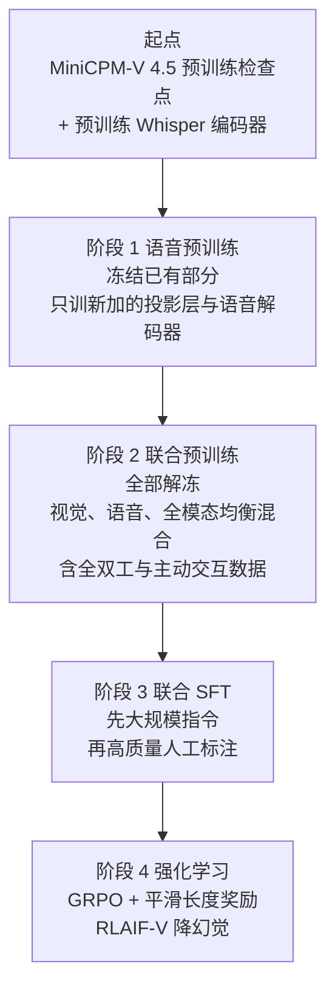
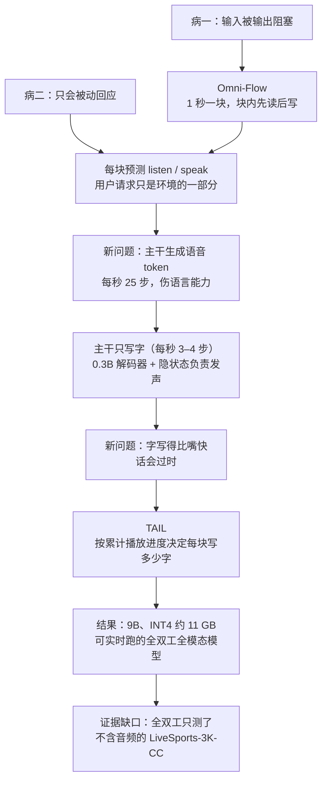

# MiniCPM-o 4.5：把轮次切成一秒一块，让模型边看边听边说

<!-- release-date: 2026-02-03 -->

> 本文依据 OpenBMB MiniCPM-o 团队的 **MiniCPM-o 4.5: Towards Real-Time Full-Duplex Omni-Modal Interaction**，即 arXiv:2604.27393v1（2026-04-30 提交，22 页），本地原件为 `papers/OpenBMB/MiniCPM-o-4.5.pdf`。页码均指这份 PDF 自身的页码。
>
> `release-date` 取 **2026-02-03**，即模型权重与代码首次对外开放的日期；技术报告晚了近三个月才发布，不回写首发日。证据见文末「资料与阅读边界」。
>
> 全文区分三层：报告明确写了什么、我们如何解释它、哪些是外部资料补充。外部补充都给出链接并标明；报告没写的地方直接写「报告没写」。

## 读之前先认识几个词

- **全模态模型**（Omni-modal LLM，常简称 omni 模型）：一个模型端到端地吃进文本、图像、视频和音频，吐出文本和语音。它说的是「覆盖哪些模态」。
- **全双工**（full-duplex）：电话里两边可以同时说话，就是全双工；对讲机按下才能说、说的时候听不见，是半双工。放到模型上，全双工指**说话的同时还在接收新输入**，可以被打断，也可以自己决定什么时候开口。它说的是「怎么交互」。全模态不等于全双工。
- **轮次制**（turn-based）：你说完一句，模型再答一句。今天大多数语音助手都是这样。
- **语音活动检测**（Voice Activity Detection，VAD）：一个外挂的小模块，靠声音能量或小模型判断「用户是不是说完了」。轮次制系统靠它来切轮次。
- **语音 token**：把一小段声音映射成词表里的一个整数编号，模型就能像写字一样「写」声音，再交给解码器还原成波形。
- **流匹配**（flow matching）：一类生成方法，学一条从噪声到目标数据的连续变换路径。这里用它把语音 token 变成真实波形。

报告自己的新名字只有两个：**Omni-Flow**（把交互切成时间块的统一框架）和 **TAIL**（Time-Aligned Interleaving，按播放时长对齐的文本—语音交错生成）。

## 轮次制卡在哪：堵住的输入，被动的输出

先看一个场景：模型在给一场球赛做解说。

轮次制下，它先「看」一段画面，再「说」一段话。说的时候画面还在继续，但模型看不见——输入被堵住了。等它说完「红衣球员正在带球」，球可能已经进了。这是报告说的第一个病：**Blocked I/O**（输入被输出阻塞）。

第二个病是 **Passive**（被动）：模型只在用户明确提问后才回应。它不会看到画面里有事就主动说一声，也不会到点提醒你。

报告用 Figure 3 画了这两个病和它的目标：解说时能一边看一边说，画面一变立刻改口喊出「射门了」（PDF p.3）。

报告的判断是：通往拟人交互的主要障碍，已经不是模态覆盖或延迟本身，而是**交互范式**——感知和回应仍被分成交替的两个阶段（PDF p.1–2）。

## 一句话先说清

MiniCPM-o 4.5 是一个 9B 参数的开源全模态模型。它的主张可以压成三句话：

1. **把连续交互切成 1 秒一块。** 每一块里，模型先读入这一秒新到的画面和声音，再决定这一秒要不要说、说什么。块足够小时，就近似全双工（PDF p.5–6）。
2. **大主干只写字，嘴交给小模型。** 8B 的语言主干每秒只需走 3–4 步生成文本；每秒 25 个语音 token 由一个约 0.3B 的小解码器负责（PDF p.4）。
3. **让嘴跟上当下。** 每一块生成多少字，按「念出来要多久」动态调整，保证此刻听到的话对应的是模型此刻的判断（PDF p.6–7）。

报告给出的整体结果：视觉语言能力接近 Gemini 2.5 Flash；全模态理解和语音生成质量超过 Qwen3-Omni-30B-A3B；INT4 量化后部署内存不到 12 GB（PDF p.2–3，p.14）。

如果只记一句话：

> **全双工不必重写模型结构：把时间切成块、在每块里先读后写，再让模型自己预测「这一秒开不开口」，一个普通的因果语言模型就能边听边说。**

## 报告地图

| 章节 | 讲什么 | 页码 |
|---|---|---|
| 1 引言 | 两个病（Blocked I/O、Passive）与三条贡献 | p.1–3 |
| 2 架构 | 编码器、主干、两级语音解码器，全部可微连接 | p.3–4 |
| 3 Omni-Flow | 三条时间对齐的流、统一序列化、三个设计取舍的消融、TAIL | p.5–7 |
| 4 数据 | 语音、视觉语言、全模态全双工三类数据 | p.7–8 |
| 5 训练 | 语音预训练 → 联合预训练 → 联合 SFT → RL | p.8–9 |
| 6 评测 | 视觉语言、语音、文本、全模态与流式；长度奖励与语音生成模式两个消融 | p.9–14 |
| 7 推理 | vLLM 下与 Qwen3-Omni 的效率对比；自研 llama.cpp-omni | p.14 |
| 8 结论 | 贡献与四条自述限制 | p.14–15 |
| 附录 A | 各组件超参数与参数量 | p.21–22 |

## 先看全景：一秒钟里发生了什么

图从下往上读。时间轴按秒切开，每一秒是一块：

- **最下面两行**是输入：视频流和音频流。用户的提问（图里是「描述你连续看到和听到的东西」）也只是音频流的一部分。
- **多模态编码器**把这一秒的画面变成视觉嵌入 V，把声音变成音频嵌入 A。图里每秒画成 3 个 V、2 个 A，是示意；实际每秒的 token 数见下面的表。
- **全双工全模态大模型**（即 Qwen3-8B 主干）读入这一秒的 V 和 A，然后输出：第一秒只有一个黄色的 `sl`（沉默），模型选择不开口；从第二秒起，每块先出一个红色的 `sp`（说话），再跟几个文本 token，比如「Look this」「is Mini」「CPM Omni」。
- **交错语音 token 解码器**拿到每个文本 token，外加主干在该位置的隐状态 h（图中的 ⊕ 就是二者合并），生成语音 token。
- **流式流匹配解码器**把语音 token 变成波形。它还接收系统提示里的参考音频，决定用谁的声音说话。

全部组件的规模来自附录 Table 13（PDF p.22）：

| 组件 | 做什么 | 参数量 |
|---|---|---:|
| SigLIP ViT | 看：每个图块编码成 1024 个 token | 417.8M |
| 视觉重采样器 | 把 1024 个 token 压成 64 个 | 88.9M |
| Whisper Medium 编码器 | 听：每秒 50 个特征 | 307.2M |
| 音频投影层（两层 MLP） | 时间上压 5 倍，每秒剩 10 个 token | 21.0M |
| Qwen3-8B 主干 | 想和写：只生成文本 | 8,189.2M |
| 主干到解码器的投影层 | 把 4096 维隐状态降到 768 维 | 10.5M |
| 语音 token 解码器 | 说：文本嵌入 116.8M + 20 层 Transformer 188.8M | 305.6M |

报告写整个模型有 9.34B 可学习参数，以 bfloat16 保存（PDF p.21）。流式流匹配解码器的规模表里没有列出，报告没写。

**这张图的关键不在组件多，而在于它们全部通过 token 级的隐状态相连，梯度可以从语音解码器一路传回编码器**（PDF p.3）。这意味着它不是「ASR + LLM + TTS」三个现成模块的串联，而是一个可以整体训练的模型。

## 核心设计一：Omni-Flow，用时分复用近似全双工

### 旧问题：因果语言模型天生是一条单行道

语言模型一次只能沿着一条序列往后写。要让它「同时」听和说，直观的办法是给输入和输出各开一条并行的流，但那需要改结构、改训练。轮次制的做法是轮流用这条单行道：先听完，再说完。代价就是上面的两个病。

### 新设计：把时间切成块，每块里先读后写

Omni-Flow 借用通信里**时分复用**（time-division multiplexing）的思路：一条信道轮流传多路信号，只要切换得够快，每一路看起来都像是在连续传输（PDF p.5）。

具体做法分两步。

**第一步：把交互看成三条对齐在同一时间轴上的流**（PDF p.5）：

- **env-visual**：环境里的实时画面；
- **env-audio**：环境里的声音，**用户说话也在这里面**；
- **out-stream**：模型自己输出的文本和语音。

这一步有个很重要的视角转换：**用户的请求不再是对话里的特殊角色，只是模型持续观察的世界状态的一部分**。模型也不再等到有人提问才回应，它要自己判断「说什么」「要不要说」「什么时候说」。

**第二步：把三条流拼成一条序列**（PDF p.5）。第 $k$ 个时间块里，画面编码成视觉 token 序列 $\mathbf{v}^k$，声音编码成音频 token 序列 $\mathbf{a}^k$，模型的输出记为 $\mathbf{o}^k$。三者拼成一组：

$$
\mathbf{g}^k = [\mathbf{v}^k;\ \mathbf{a}^k;\ \mathbf{o}^k]
$$

整场交互就是 $\mathbf{g}^1, \mathbf{g}^2, \mathbf{g}^3, \dots$ 首尾相接的一条长序列。不该说话时，$\mathbf{o}^k$ 里只有一个特殊的 `[listen]` token。

每一块内部的顺序是固定的：**先处理新到的感知 token，再生成输出 token**。所以每次输出都以最新的观察为条件。用户在第 5 秒插话，第 5 块的 $\mathbf{a}^5$ 里就有这句话，模型在第 5 块的输出里就能改口或闭嘴。

一个普通的因果语言模型就能处理这条序列，不需要新的注意力结构。

### 为什么它能主动开口，还能少用 VAD

「这一秒说不说」变成了每一块里的一次 token 预测（PDF p.5）。两件事因此自然出现：

- **主动行为**：没有人提问时，模型看到画面里发生了值得说的事，也可以预测「说」。提醒、实时解说都走同一个机制。
- **少依赖外部 VAD**：轮次制靠 VAD 判断「用户说完了」，再触发模型。这里模型每一秒都在自己判断，不需要外部模块来切轮次。报告的措辞是「减少对外部 VAD 的依赖」，不是完全不用。

### 三个设计取舍：块多大、边界要不要标、控制怎么表示

报告做了一组消融，比较三个维度（PDF p.5–6）：

- **时间粒度**：每块 1.0 秒、0.2 秒还是 0.1 秒；
- **边界是否显式**：相邻两块之间要不要插特殊 token 隔开；
- **控制方式**：**LS**（Listen-Speak）是先预测一个二元的 listen/speak 控制 token，再生成内容；**LT**（Listen-Text）是在同一个输出空间里直接预测 `[listen]` 或普通文本 token。

结果见 Table 1（PDF p.5），分数越高越好：

| 块大小 | 边界 | 控制 | AdvBench | AlpacaEval | IFEval | SDQA | MMLU |
|---|---|---|---:|---:|---:|---:|---:|
| **1.0 s** | **显式** | **LS** | **0.98** | 3.56 | **0.29** | **0.36** | **0.65** |
| 1.0 s | 显式 | LT | 0.92 | **3.60** | 0.24 | 0.35 | 0.56 |
| 1.0 s | 隐式 | LT | 0.96 | 3.31 | 0.22 | 0.28 | 0.45 |
| 0.2 s | 显式 | LS | 0.81 | 1.22 | 0.10 | 0.09 | 0.45 |
| 0.1 s | 显式 | LS | 0.67 | 2.40 | 0.10 | 0.13 | 0.32 |

报告从中得出三条结论（PDF p.6）：

1. **块太小会崩。** 块越小，模型刷新感知越快，但每块里留给「做决定」和「生成内容」的建模预算也越少。0.2 秒和 0.1 秒下各项指标大幅下滑，1.0 秒是报告设置下的最佳平衡。
2. **边界显式更好。** 同为 1.0 秒、LT 控制，隐式边界在五项里有四项更差。报告的解释是：区分「哪些是刚看到的输入」「哪些是刚生成的输出」本身不简单，显式标出来能减轻模型负担。
3. **把「要不要说」和「说什么」分开更稳。** LS 在五项里有四项胜过 LT（只有 AlpacaEval 低 0.04）。把两个决定挤进同一次预测，全双工更难学。

**读表要注意的地方。** 报告没写这组消融用的模型规模和训练量，也没交代五列分数的具体口径。AlpacaEval 在 1–5 分制上、其余是 0–1 的比例，形式上像 VoiceBench 这类语音问答基准的子集，但这是我们的推断，原文没写。另外，这张表比较的是各配置下回答内容的质量，**没有测响应时延、打断成功率这类交互指标**。

### 代价与边界：1 秒是一个很粗的粒度

以下是我们的解释，不是报告的结论。

- **1 秒块决定了反应节奏的上限。** 模型每块只做一次「说不说」的决定。用户在一块中间开口打断，最快要到这一块结束、下一块开始时模型才看得到。报告没有给出端到端的响应延迟或打断停顿的测量。
- **和 Moshi 的粒度差了一个数量级。** 本站 Moshi 一篇讲过，Moshi 每 80 毫秒走一步，用户和模型各一条音频流，没有显式的「开口」决策。Omni-Flow 选了粗得多的时间块和显式的控制 token，换来的是可以直接复用一个现成的文本主干。两种做法各有代价，这份报告没有和语音全双工模型做对照实验。
- **块内仍是串行的。** 每块里模型先读后写，读和写并不真的同时发生。「全双工」在这里是块级别的近似。报告自己的措辞也是「近似全双工行为」（PDF p.5）。

## 核心设计二：主干只写字，嘴交给小解码器

### 旧问题：让主干直接吐语音 token，又慢又伤脑子

另一种常见做法是让语言主干直接生成语音 token。报告指出两个问题（PDF p.4）：

- **慢**：语音 token 大约每秒 25 个，主干要跟着每秒走 25 步；
- **伤语言能力**：直接生成语音 token 的主干，核心语言能力往往会退化。报告引了两篇相关工作作为依据。

### 新设计：主干每秒只走 3–4 步

MiniCPM-o 4.5 让 Qwen3-8B 主干**只生成文本**。人说话大约每秒三四个词，所以实时全双工下主干每秒只需 3–4 个解码步（PDF p.4）。

说话这件事分两级完成（PDF p.4）：

1. **语音 token 解码器**：一个约 0.3B 的 Llama 结构小模型。每个文本 token 送进来时，都加上主干在该位置的隐状态（经一个 MLP 变换）。输出是 **S3 token**——CosyVoice 提出的一种「有监督语义语音 token」（Supervised Semantic Speech tokens），单码本、码本大小 6,562、每秒 25 个（PDF p.22）。
2. **流式流匹配解码器**：把 S3 token 变成波形，音色由系统提示里的参考音频决定。

为什么要加主干的隐状态，而不是只给小模型文本？报告的解释是：语音不只要念对字，还要有符合上下文和指令的韵律与风格。隐状态里已经编码了主干对上下文的理解，**韵律的决定在主干里就做好了**，小解码器可以把容量全部花在语音建模上（PDF p.4）。

### 收益：智力保住了，还能克隆音色

- **文本能力基本保住。** Table 6 里 MiniCPM-o 4.5 的文本平均分 82.1，略高于它的主干 Qwen3-8B-Instruct 的 81.6（PDF p.12）。拆开看，并非每项都保住，详见后面「实验怎么读」一节。
- **音色克隆。** 因为连接是端到端的，系统提示里可以同时放文本和参考音频，模型用参考音频的声音说话（PDF p.3）。
- **两种模式可以切换。** 同一个模型既能跑全双工流式模式，也能跑传统的轮次制模式，后者用法与 MiniCPM-o 2.6、MiniCPM-V 4.5 相同（PDF p.3）。

### 这个结构的来历（外部补充）

「主干想、小模型说」的分工，本站 Qwen2.5-Omni 一篇讲过，Qwen 把它叫 Thinker-Talker。MiniCPM-o 4.5 的报告没有用这个名字，也没有和它做结构对比。它和 Qwen 系做法的具体差异（比如隐状态怎么接、语音 token 用哪种），报告只写了自己的一侧。

## 核心设计三：TAIL，让嘴跟上当下

### 旧问题：字写得比嘴快，话就过时了

Omni-Flow 让输出和输入一起沿时间推进，但还有一个错位：**生成文本的时间和念出这段文本的时间不一样**（PDF p.6）。

假设模型在 1 秒内生成了要念 3 秒的文字。语音就会越积越慢，此刻用户听到的话，其实是模型两秒前的判断。在全双工里这很致命：画面已经变了，嘴里还在说旧画面。更麻烦的是，每个文本 token 念多久也不固定，取决于上下文（PDF p.6）。

现有流式语音生成有两种做法，图里的（a）和（b）（PDF p.6）：

- **（a）不交错**：先生成较长一段文本，再合成语音。文本会远远跑在播放前面。
- **（b）固定比例交错**：文本 token 和语音 token 按固定比例轮流生成。它默认每个字念的时长差不多，实际并非如此。

两种都能出高质量语音，但都没有显式地让语音对齐交互时间轴。

### 新设计：按累计播放进度决定这一块写多少字

TAIL 的规则是：在第 $k$ 块，模型调整这一块生成的文本量，使得把新内容念完后，语音流的播放进度接近当前时间边界 $kt$（PDF p.6）。

关键在于看的是**累计进度**，不是每块单独凑满一秒。前几块已经造成了一点播放延迟，这一块就少写几个字，让语音追上来。

这种行为是从数据里学来的，不是规则写死的。构造监督数据时，先拿到全双工训练数据里每个文本 token 的起止时间；起始时间落在 $[(k-1)t,\ kt)$ 里的文本 token，连同它们对应的语音 token，都分到第 $k$ 块（PDF p.6–7）。这样模型学到的是依赖历史的交错模式：每块写多少字，取决于之前累积的播放对齐情况。

### 前瞻：念一个词有时要看下一个词

语音生成有时需要一点未来的文本。报告的例子是英语的 the：在 apple 前和在 car 前读音不同（PDF p.7）。

TAIL 因此加了有界的前瞻（look-ahead）：第 $k$ 块最后几个文本 token 的语音推迟到第 $k+1$ 块再念。图中那些浅色的前瞻 token 就是这个意思。这样发音和韵律有了局部上下文，文本又不会大幅跑到播放前面（PDF p.7）。

### 代价：实时性换了一点清晰度

Table 10 比较了三种模式在 SeedTTS 测试集上的语音质量（PDF p.13）：

| 交错模式 | 中文 CER↓ | 中文 SIM-o↑ | 英文 WER↓ | 英文 SIM-o↑ |
|---|---:|---:|---:|---:|
| 不交错 | 1.44 | 74.1 | 2.70 | 64.9 |
| 固定文本比例 | **0.86** | **74.5** | **2.38** | 64.9 |
| 动态文本（TAIL） | 1.04 | 74.1 | 3.93 | **65.1** |

CER、WER 是字错误率、词错误率，越低越清楚；SIM-o 是和参考音色的相似度，越高越像。

报告的解读是：固定比例交错错误率最低，说明分块流式生成本身就能提升发音准确度；TAIL 牺牲了一些识别准确度（英文 WER 尤其明显），换来全双工需要的时间对齐，是一个实用的折中（PDF p.13–14）。

**这里有一个读表要带走的事实（我们的核对）。** Table 5 里 MiniCPM-o 4.5 的主结果——中文 CER 0.86、英文 WER 2.38——和 Table 10「固定文本比例」这一行完全一致（PDF p.12–13）。也就是说，**报告拿来和 CosyVoice2、Qwen3-Omni 比的语音生成分数，是固定比例模式的，不是全双工模式用的 TAIL**。全双工下的实际语音清晰度要按 TAIL 那一行看：英文 WER 3.93，比主表高出六成多。

## 视觉侧：沿用 MiniCPM-V 的高压缩

视觉编码沿用 LLaVA-UHD 的切图策略：任意长宽比的高分辨率图先切成若干图块，每块经 SigLIP ViT 编码成 1024 个 token，再由重采样器压成 64 个（PDF p.3）。

**16 倍的压缩比是这个模型能实时跑的前提之一。** 报告对照的常见做法是 4 倍压缩（PDF p.3）。视频每秒要送进好几帧，每帧省下的 token 直接变成每秒的算力余量。

两种模式的分辨率不同：全双工流式模式下单帧最大 448×448，其他模式最大 2240×2240（PDF p.3）。按我们的理解，448×448 正好是一个图块，所以全双工下每帧就是 64 个视觉 token；加上每秒 10 个音频 token，每秒送进主干的感知 token 大约是「帧数 × 64 + 10」。报告没写全双工推理时实际用几帧每秒。

训练时的数据增强覆盖了这个区间：SFT 阶段随机把最大帧分辨率设在 0.2–0.4 百万像素之间，帧率在 1–5 FPS 之间均匀采样，让推理时可以按需在质量和效率之间取舍（PDF p.8）。

## 数据：三类，重点是带时间戳

### 语音数据（PDF p.7）

- **大规模自然语音**：数百万小时无标注语音，经一条由多个开源组件拼成的流水线处理，产出零样本 TTS、ASR 和多轮多说话人对话的训练集。参考文献里列出的组件包括 Silero VAD、Whisper、Paraformer、说话人日志和音源分离（PDF p.7，p.16）。
- **口语对话数据**：先用文本大模型从多样的种子问题生成口语化、会遵循指令的对话；再请专业配音演员在录音棚里重录其中一部分。演员被要求按对话的方式说，不逐字念稿，在同一个声音身份下变化情绪、语速和重音。

### 视觉语言数据（PDF p.7）

在 MiniCPM-V 4.5 的数据体系上扩量提质：

- 升级 CapsFusion 流水线里的生成模型，合成信息更多的图片描述，并改进图文相关性过滤；
- 文档 OCR 学习改用**相关性感知的遮盖**：优先遮住与图表相关的文字区域，而不是随机遮，逼模型看图而不是靠上下文猜；
- 把「直接给答案」的短样本改写成带推理过程的长解答，再用奖励模型过滤；
- 构建稠密视频描述数据，连续细粒度地描述时间事件、人物动作和场景切换；
- 混入 MiniCPM 4.1 后训练数据里的纯文本指令数据，保住语言能力。

### 全模态全双工数据（PDF p.8）

这是 Omni-Flow 能学起来的前提。**每条样本都包含完整的视觉输入、音频输入、输出文本和输出语音，每一片信息都打了时间索引。**

- **大规模网络音视频**：过滤掉单说话人主导、音画关联弱的片段；再用 OCR 去掉烧录字幕、检测并去掉「对着镜头说话」的片段、过滤 ASR 转写，减少会让模型走捷径的样本和低信息、高噪声的片段。
- **全双工任务数据**：人工构造多种场景，标注对应的指令数据。连续场景描述、主动提醒这些能力靠的就是这部分。

报告没有给出三类数据各自的规模和配比，只有语音侧一个「数百万小时」的量级。

## 训练：四个阶段，逐步把语音接进来

难点是在加入语音的同时，不丢掉各单一模态原有的优势。报告的做法是从 MiniCPM-V 4.5 的预训练检查点出发，分四步把语音平稳接进来（PDF p.8–9）：

图根据原文第 5 节（PDF p.8–9）重画，是流程示意，不含时间或数据量。

**阶段 1：语音预训练。** 随机初始化的新模块有三个：音频投影层、主干到语音的投影层、语音解码器。为保住主干的视觉和语言能力，已有组件全部冻结，只训新模块。这一步让 Whisper 特征对齐到主干的隐空间，同时教会语音解码器把主干隐状态变成语义和韵律都对的语音 token（PDF p.8）。

**阶段 2：联合预训练。** 全部参数解冻，在视觉语言、语音和全模态的均衡混合数据上训练。一个值得注意的工程细节：**不同的模态组合被分配到不同的数据并行 rank 上，保证每一步训练的数据配比固定**，以稳定优化。混合数据里除了轮次制样本，还有文本与语音、画面在同一时间轴上对齐的全双工和主动交互数据。目标函数统一是下一个 token 预测（PDF p.8）。

**阶段 3：联合 SFT。** 分两段：先做大规模指令微调以广泛适配，再用高质量人工标注数据精修行为。分辨率和帧率的随机增强也在这一阶段（PDF p.8）。

**阶段 4：强化学习**（PDF p.9）：

- 用 GRPO 提升推理和指令遵循。正确性奖励把规则校验和一个高效的评判模型（CompassVerifier）结合起来，以提高对正确回答的召回；另有格式奖励等辅助奖励。
- 加一个平滑的长度奖励，控制回答长度（见下）。
- 加一个通用奖励模型，提升回答质量并压制非预期的中英混杂。
- 最后用 RLAIF-V 降低视觉场景下的幻觉。报告观察到：从图文数据学到的降幻觉效果，能迁移到全模态全双工的流式场景。

### 平滑长度奖励

这个奖励改自 Kimi k1.5。对同一道题的一组回答，记第 $i$ 条的长度为 $\ell_i$，组内最短和最长为 $\ell_{\min}$、$\ell_{\max}$，正确与否为 $r_i$（1 为正确）。先算一个中间量：

$$
s_i = \left(0.5 - \frac{\ell_i - \ell_{\min}}{\ell_{\max} - \ell_{\min}}\right) \times \min\left(1,\ \frac{\ell_{\max} - \ell_{\min}}{\tau}\right)
$$

括号里把这条回答在组内的长短排名映射到 $[-0.5, 0.5]$：最短的得 $+0.5$，最长的得 $-0.5$。乘上的第二项是新加的：组内长短差距 $\ell_{\max} - \ell_{\min}$ 小于阈值 $\tau$ 时，按比例缩小奖励，长度差不多时就别太较真。

然后按对错取值：

$$
r_{\text{len}}(i) = \begin{cases} s_i, & r_i = 1 \\ \min(0,\ s_i), & r_i = 0 \end{cases}
$$

答对时，短的加分、长的扣分；答错时只扣不加，避免「又短又错」反而拿到奖励（PDF p.9）。前 480 步不加长度奖励，以保证收敛效率（PDF p.9）。

**和原版的区别（外部补充）。** 本站 Kimi-k1.5 一篇讲过原式：它只有括号里那一项，没有 $\tau$ 缩放。MiniCPM-o 4.5 加的就是这一项平滑。

Table 9 的消融（PDF p.13）在 MMBench、MathVista、MMMU、AI2D、OCRBench、HallusionBench、MMStar 七个基准上取平均：

| 长度奖励 | 思考模式平均分 | 指令模式平均分 | 思考模式长度缩减 | 指令模式长度缩减 |
|---|---:|---:|---:|---:|
| 不加 | 73.5 | 70.9 | — | — |
| Kimi k1.5 原式 | 73.0 | 70.1 | 50.7% | 20.2% |
| 本文平滑版 | **74.3** | **70.9** | 35.3% | 20.5% |

原式把思考模式的回答砍掉一半，但分数也掉了；平滑版砍得少一些（35.3%），分数反而从 73.5 升到 74.3。报告用 Figure 6 的训练曲线解释：原式在训练后期准确率增长放缓甚至略降，说明过猛的长度奖励会和正确性奖励冲突（PDF p.13）。注意这是一次「轻量 RL 实验」的结果，不是完整训练（PDF p.13）。

## 推理：怎么塞进 12 GB

报告在单张 RTX 4090 上、用 vLLM 和 Qwen3-Omni-30B-A3B 比较效率（Table 11，PDF p.14）：

| 模型 | 精度 | 吞吐（token/s）↑ | 首 token 延迟（s）↓ | 显存（GB）↓ |
|---|---|---:|---:|---:|
| Qwen3-Omni-30B-A3B | BF16 | OOM | OOM | OOM |
| MiniCPM-o 4.5 | BF16 | 154.3 | 0.59 | 19 |
| Qwen3-Omni-30B-A3B | INT4 | 147.8 | 0.98 | 20 |
| MiniCPM-o 4.5 | INT4 | 212.3 | 0.58 | 11 |

读这张表要注意口径：**首 token 延迟是在 64 帧视觉输入下测的，吞吐和显存是在纯文本任务上测的**（PDF p.14）。它不是全双工模式下的交互延迟。

为了全双工流式模式，团队基于 llama.cpp 做了一个专用推理框架 **llama.cpp-omni**，在 macOS、Windows、Linux 上都验证过兼容性，并提供一个轻量演示系统（PDF p.14）。Table 12 用**实时率**（Real-Time Factor，RTF）衡量：处理 1 秒输入要花多少秒，小于 1 才跟得上实时（PDF p.14）。

| 框架 | 精度 | RTX 4090 RTF↓ | 显存（GB） | DGX Spark RTF↓ | 显存（GB） |
|---|---|---:|---:|---:|---:|
| PyTorch | BF16 | OOM | OOM | 2.43 | 26 |
| PyTorch | INT4 | 1.26 | 14 | 1.27 | 14 |
| llama.cpp-omni | FP16 | 0.27 | 19 | 0.46 | 19 |
| llama.cpp-omni | INT4 | **0.21** | **11** | **0.20** | **11** |

两点值得看：

- **PyTorch 实现跟不上实时。** 即使 INT4，RTF 也在 1.2 以上。**全双工能不能用，很大程度上取决于推理框架**，不只取决于模型。
- **「不到 12 GB」指的是 INT4 下的 11 GB**，这是摘要里「端侧可跑」说法的依据（PDF p.2，p.14）。

报告在限制一节还提到：官方网页演示在网络不稳时会有延迟上升和输出片段丢失，本地用 llama.cpp-omni 部署更流畅（PDF p.15）。

## 实验怎么读

### 视觉语言：接近 Gemini 2.5 Flash，但不是全面接近

Table 2（指令模式）和 Table 3（思考模式）是报告最长的两张表（PDF p.10–11）。几组有代表性的数字（指令模式）：

| 基准 | Gemini 2.5 Flash | Qwen3-Omni-30B-A3B | MiniCPM-o 4.5 |
|---|---:|---:|---:|
| OpenCompass（8 个基准平均） | 78.5 | 75.7 | 77.6 |
| MMMU | 76.3 | 69.1 | 67.6 |
| MathVista | 75.3 | 75.9 | 80.1 |
| OmniDocBench 英文↓ | 0.214 | 0.216 | 0.109 |
| OmniDocBench 中文↓ | 0.290 | 0.363 | 0.162 |
| HallusionBench | 59.1 | 59.7 | 63.2 |
| Video-MME（无字幕） | 75.6 | 70.5 | 70.4 |
| LVBench | 62.2 | 50.2 | 50.9 |

「接近 Gemini 2.5 Flash」主要指 OpenCompass 综合分（77.6 对 78.5）。拆开看：

- **文档解析和幻觉是强项**。OmniDocBench 的编辑距离只有 Gemini 的一半左右，这延续了 MiniCPM-V 系列在 OCR 上的积累（PDF p.11）。
- **知识密集的 MMMU 差距明显**，67.6 对 76.3，差 8.7 分；在思考模式下是 70.2 对 77.7（PDF p.11）。这符合 8B 主干的知识上限。
- **长视频是短板**。LVBench 与 Gemini 差 11 分，Video-MME 也差 5 分。

### 语音理解与生成

Table 4（PDF p.12）里，ASR 大体与 Kimi-Audio、Qwen3-Omni 持平，在 GigaSpeech（8.5）和 VoxPopuli（6.2）上最好。语义类任务更突出：CoVoST 2 英译中 49.9、Speech TriviaQA 75.5，都是表中最高。报告也承认 Speech Web Questions（70.2，低于 Qwen3-Omni 的 74.9）和中文语音知识问答 Speech CMMU（59.2，低于 Kimi-Audio 的 67.0）仍有差距（PDF p.11）。

Table 5（PDF p.12）的语音生成结果：SeedTTS 中文 CER 0.86、英文 WER 2.38，都是表中最低；长文本英文 LongTTS WER 3.37，远低于 CosyVoice2 的 14.80；情感与风格控制 Expresso 29.8、ESD 82.1，都明显领先。再提醒一次，这是固定比例模式的分数，全双工模式要看 TAIL 那一行。

### 文本：平均分略升，但知识和数学在掉

Table 6（PDF p.12）：

| | IFEval | BBH | CMMLU | MMLU | HumanEval | MBPP | MATH-500 | GSM8K | 平均 |
|---|---:|---:|---:|---:|---:|---:|---:|---:|---:|
| Qwen3-8B-Instruct | 83.0 | 69.4 | 78.7 | 81.7 | 86.6 | 75.9 | 84.0 | 93.4 | 81.6 |
| MiniCPM-o 4.5 | 84.7 | 81.1 | 79.6 | 77.0 | 86.6 | 76.7 | 77.0 | 94.5 | 82.1 |

报告的结论是全模态训练保住了文本能力，多数任务还超过了主干（PDF p.12–13）。平均分确实略高，但主要靠 BBH 涨了 11.7 分。**MMLU 掉了 4.7 分，MATH-500 掉了 7 分**。知识和数学竞赛题这两项的回落，报告正文没有讨论。

### 全模态：七个基准里五个最好

Table 7（PDF p.13）比较的是轮次制（simplex）下的音视频联合理解。MiniCPM-o 4.5 在 Daily-Omni、WorldSense、Video-Holmes、JointAVBench、AVUT-Human 五个上最好，Video-Holmes 64.3 比 Gemini 2.5 Flash 高 13 分；FutureOmni（56.1）和带音频的 Video-MME-Short（84.7）则落后。

### 全双工：只有一个不含音频的基准

这是整份报告**证据最薄**的地方。Table 8（PDF p.13）只有一行：

| 基准 | LiveCC（8B） | StreamingVLM（8B） | MiniCPM-o 4.5（9B） |
|---|---:|---:|---:|
| LiveSports-3K-CC | 41.5 | 45.6 | **54.4** |

报告自己说明了原因：实时全模态全双工交互的基准很少，所以只报了这个**不含音频**的全双工基准；同时看、听、说的能力只在演示网站上做定性展示（PDF p.10）。

LiveSports-3K-CC 测的是什么（外部补充）：它来自 LiveCC 论文（[arXiv:2504.16030](https://arxiv.org/abs/2504.16030)），任务是边看体育视频边生成实时解说。评法是两两对比：拿被测模型的解说和 GPT-4o 生成的解说放在一起，由 GPT-4o 参照真人解说转写判断哪个更贴近，胜率就是被测模型赢的比例。所以 54.4 的意思是：**在逐帧流式解说上，它有一半多的时候比 GPT-4o 的离线解说更像真人解说员**。

这个结果能证明的是「看着画面持续输出」这半边。它证明不了语音全双工的另一半：用户插话时能不能及时停、要不要接话的判断准不准、附和声会不会被误当成打断。这些交互质量，报告没有定量结果。

## 限制、没公开的，以及不要过度解读的地方

### 报告自己承认的（PDF p.15）

1. 在长时间、动态的真实流式交互里，基础能力和鲁棒性还需要提升和验证；
2. 全模态流式模式下的语音生成偶尔不稳定，包括读错字和非预期的中英混杂；
3. 网页演示在网络不稳时会延迟上升、丢输出片段；
4. 主动行为还比较简单，更丰富的上下文规划和自发协助留给以后。

### 报告没有公开的

- **全双工交互指标**：响应延迟、打断后停下的时间、话轮转换准确率，都没有测；
- **数据规模与配比**：除「数百万小时」语音外，三类数据的量和混合比例都没给；
- **训练算力、步数、学习率等超参**：只有 RL 长度奖励「前 480 步不加」这一个数字；
- **Table 1 消融的实验条件**：模型规模、训练量、五列分数的口径；
- **流匹配解码器的规模和结构**；
- **与语音全双工模型的对比**：报告称自己是「第一个全双工全模态大模型」（PDF p.3），这里的「第一」限定在「全模态」上；它没有和 Moshi 这类纯语音全双工模型做对比。

### 不要过度解读

- 「接近 Gemini 2.5 Flash」说的是视觉语言综合分，不是全双工对话质量；
- 「超过 Qwen3-Omni」说的是全模态理解和语音生成质量，而 Qwen3-Omni 本身是轮次制模型，两者在全双工上没有可比的实验；
- 语音生成主表是固定比例模式，全双工模式要看 TAIL 的数字。

## 能带回自己项目的六条

### 1. 把「要不要做」从「做什么」里拆出来

LS 胜过 LT 的消融说明：让模型先做一个二元控制决策、再生成内容，比把两者混在同一个输出空间里更好学（PDF p.6）。凡是模型要自己决定「此刻是否行动」的场景——agent 要不要调用工具、流式系统要不要输出——都可以先试这个拆法。

### 2. 用时分复用，把普通因果模型变成双工

Omni-Flow 没有改注意力结构，只改了序列的组织方式：按时间切块，块内先读后写。**块的大小是延迟和建模容量之间的权衡**，要按任务去扫。这个结论不依赖模型规模。

### 3. 边界要显式标出来

显式的块边界 token 在消融里稳定更好（PDF p.6）。当一条序列里交错着不同来源的内容（输入和输出、不同模态、不同说话人），给模型一个显式的分隔符，是几乎零成本的改进。

### 4. 大模型只做慢的那条流，快的交给小模型

主干每秒 3–4 步写字，小解码器每秒 25 个 token 负责发声（PDF p.4）。按信息速率给不同的流分配不同大小的模型，大模型的计算和能力都能省下来。前提是用隐状态把大模型的理解传给小模型，而不只传离散的文字。

### 5. 流式生成要对齐墙钟时间，不能只对齐 token 比例

TAIL 的核心是按累计播放进度决定每块生成量（PDF p.6）。任何「生成速度和消费速度不一致」的流式系统，比如边生成边播放的语音、边生成边执行的动作，都会遇到内容过时的问题。对齐的对象应该是真实时间，而且要看累计误差。

### 6. 多模态混训时，按数据并行 rank 固定配比

把不同的模态组合分到不同的数据并行 rank 上，保证每一步的数据配比都固定（PDF p.8）。这比在全局随机混合里靠期望值保持配比更稳，适合任何多数据源、多任务的联合训练。

## 和 Moshi 放在一起看

本站 Moshi 一篇讲的是另一条全双工路线。下表的 Moshi 一列取自该篇依据的 Moshi 论文，MiniCPM-o 4.5 一列取自本报告；两份报告之间没有直接的对比实验。

| | Moshi | MiniCPM-o 4.5 |
|---|---|---|
| 模态 | 纯语音 | 视频、音频、文本进，文本、语音出 |
| 双工怎么实现 | 用户与模型各一条音频流，并行建模 | 三条流按时间块拼成一条序列 |
| 时间粒度 | 每 80 毫秒一步 | 每 1 秒一块 |
| 何时开口 | 没有显式决策，不说话就是生成静音 | 每块显式预测 listen/speak |
| 主干生成什么 | 文本「腹稿」加音频 codec token | 只生成文本 |
| 语音由谁生成 | 主干（加一个小的 Depth Transformer） | 独立的 0.3B 语音解码器加流匹配解码器 |
| 主要取舍 | 重叠说话、附和更自然；知识和推理受限 | 保住主干智力、能看视频；交互粒度粗，全双工语音缺乏定量评测 |

## 用一张图把因果链收起来

图根据全文各节重画，是因果链示意，不是实测数据。

## 关键词回看

- **Omni-Flow**：把交互切成时间块、按时分复用组织的统一流式框架，是全文的核心。
- **env-visual / env-audio / out-stream**：Omni-Flow 里对齐在同一时间轴上的三条流；用户说话属于 env-audio。
- **`[listen]` token 与 LS 控制**：模型每块先预测听还是说；消融表明先做控制决策、再生成内容更稳。
- **TAIL**：按累计播放进度动态决定每块的文本量，让语音跟上当下；前瞻机制把最后几个字推迟到下一块发音。
- **S3 token**：CosyVoice 提出的有监督语义语音 token，单码本、每秒 25 个，是小解码器的输出。
- **流式流匹配解码器**：把 S3 token 变成波形，按参考音频决定音色。
- **16 倍视觉压缩**：每个图块 1024 个 token 压成 64 个，是实时处理视频的前提之一。
- **平滑长度奖励**：在 Kimi k1.5 的长度奖励上加了按组内长度差距缩放的一项，前 480 步不启用。
- **llama.cpp-omni**：为全双工流式模式做的推理框架，INT4 下实时率 0.2 左右、内存 11 GB。
- **LiveSports-3K-CC**：报告唯一的全双工基准，只测流式视频解说，不含音频。

## 最后的判断

这份报告最有价值的是 Omni-Flow 的提法本身：**全双工不必靠双流并行的专用结构，把时间切块、在每块里先读后写、让模型自己预测「这一秒开不开口」，一个现成的文本主干就能做到**。配合「主干只写字」和 TAIL，它把全双工、视频理解和一个完好的 8B 主干装进了 11 GB。

被实验支持的：块大小、边界、控制方式三个取舍（Table 1）；视觉语言、语音理解、全模态理解上 9B 规模的强结果；推理效率；平滑长度奖励优于原式。

只是作者主张或演示的：语音全双工的交互质量（打断、话轮转换、附和），以及主动提醒的效果。这部分没有定量评测，只有演示。

要带着走的条件：交互粒度是 1 秒；全双工模式下的语音清晰度比主表差；知识和数学能力相对主干有回落；实时性依赖专用推理框架。

## 资料与阅读边界

- **原件**：`papers/OpenBMB/MiniCPM-o-4.5.pdf`，arXiv:2604.27393v1，22 页，2026-04-30 提交。官方摘要页 <https://arxiv.org/abs/2604.27393>。截至 2026-09-24，arXiv 上只有 v1。
- **首发日**：`release-date` 取 **2026-02-03**。官方仓库 [OpenBMB/MiniCPM-V](https://github.com/OpenBMB/MiniCPM-V) README 的 News 写明「2026.02.03 We open-source MiniCPM-o 4.5」；Hugging Face 权重仓库 [openbmb/MiniCPM-o-4_5](https://huggingface.co/openbmb/MiniCPM-o-4_5) 的首个提交「Initial MiniCPM-o-4_5」时间为 2026-02-03 15:00 UTC；GitHub 仓库合入 MiniCPM-o 4.5 的提交为 2026-02-03 17:55 UTC。技术报告 2026-04-30 上 arXiv，晚于首发，不回写。
- **归属**：报告署名 MiniCPM-o Team, OpenBMB，通讯作者为孙茂松、刘知远、姚远（PDF p.1）。
- **外部补充一**：LiveSports-3K-CC 的任务与评法来自 LiveCC 论文 [arXiv:2504.16030](https://arxiv.org/abs/2504.16030)，胜率以 GPT-4o 生成的解说为对手、GPT-4o 为评判、真人解说转写为参照。
- **外部补充二**：Kimi k1.5 长度奖励的原式见本站 Kimi-k1.5 一篇，不是本报告的内容。
- **外部补充三**：Thinker-Talker 的命名与结构见本站 Qwen2.5-Omni 一篇；Moshi 的双流结构与 80 毫秒步长见本站 Moshi 一篇。两者都不是本报告的内容，本报告也没有与它们做实验对照。
- **我们的推断（已在正文标明）**：Table 1 的分数口径、全双工模式下每帧 64 个视觉 token、1 秒粒度对打断反应的影响、Table 5 主结果对应固定比例模式——最后一条是两张表数字逐项一致得出的结论。
