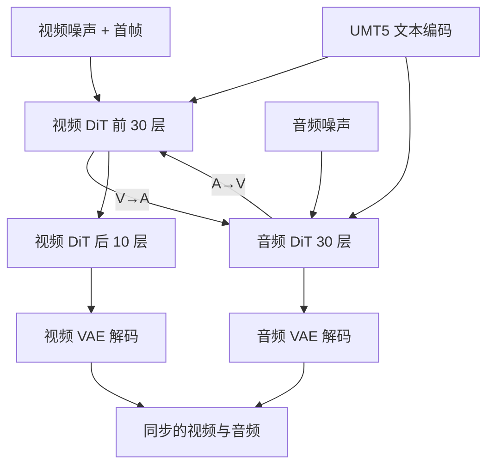

# MOVA：音视频同步生成，难的是两边处处不对称

<!-- release-date: 2026-01-29 -->

> 本文依据 SII-OpenMOSS 团队的 **MOVA: Towards Scalable and Synchronized Video–Audio Generation**，即 [arXiv:2602.08794v2](https://arxiv.org/abs/2602.08794)（2026-02-10 提交），共 38 页。动笔前核对过 arXiv 提交历史：只有 v1（2026-02-09）与 v2（2026-02-10）两版，v2 是最新版；本地件与官方 v2 的 PDF 逐字节一致（MD5 `d54ccfea559adc4031f397792c9a79db`，14,634,443 字节），未做替换。官方 GitHub 仓库与 Hugging Face 仓库都只链向同一篇 arXiv，没有另放技术报告 PDF。
>
> 全文页码指 PDF 自身页码，与印刷页码一致。文中始终区分三件事：**报告写了什么**、**我们如何解释**、**哪些是外部补充**。凡是本文自己算出来的数、自己从图里读出来的东西，都会明说。

## 读之前：本篇需要的最小背景

这是本模块第一篇音视频**联合生成**方向的解读。视频生成的通用机制在 HunyuanVideo-1.5 那篇里讲过，这里只补齐读懂 MOVA 所必需的部分，不重复。

**扩散模型与流匹配（flow matching）**：生成不是一次画完，而是从纯噪声出发反复去噪几十次。流匹配是写这个训练目标的一种方式：不预测"该减掉多少噪声"，而是学一个速度场，让样本沿着从噪声到真实数据的直线路径匀速走过去。本报告把这个目标写得很完整，后面会逐项拆开（PDF p. 3–4）。

**潜空间与 VAE**：像素和波形都太贵，先用自编码器（VAE）把它们压成小得多的张量再做扩散。视频压出来的叫**视频潜变量**，音频压出来的叫**音频潜变量**。压缩后每一个"时间片"称为一个**潜帧（latent frame）**。

**音频 VAE 不是音频 tokenizer**：这里有个很容易混的点。音频理解与对话类模型（例如同批解读的 Step-Audio 系列）通常把音频切成**离散的 token**，用一本码本编号，好接进语言模型。MOVA 走的是另一条路：它的音频侧是**连续潜变量**，没有码本、没有离散 token，因为下游是扩散而不是自回归。报告的原话是采用 HunyuanVideo-Foley 的一个 **DAC 风格的音频 VAE**（PDF p. 3）——DAC 原作用的是残差向量量化（离散），这里取的是它的架构而非量化瓶颈。**这一点决定了本文和音频理解方向的文章几乎没有共同零件。**

**DiT（Diffusion Transformer）**：把扩散的去噪网络做成 Transformer。潜变量摊平成一条序列，Transformer 在这条序列上做注意力。

**RoPE（Rotary Position Embedding，旋转位置编码）**：给 Transformer 的每个位置乘一个旋转矩阵来编码"它在第几号位置"。它的好处是注意力只依赖两个位置的**差**，所以整段序列平移不改变结果，这个性质叫**平移不变性**。记住这一点，后面 Aligned RoPE 那一节全靠它。

**CFG（Classifier-Free Guidance，无分类器引导）**：推理时同一步跑两次网络，一次带条件、一次不带，再把两者的差按系数放大，让输出更贴条件。代价是每步的前向次数变多。报告用 **NFE（number of function evaluations，函数求值次数）** 来数每步跑几次网络。

**MoE 与"高噪/低噪专家"**：本报告的视频塔来自 Wan2.2 的 A14B 版本，它的"专家"划分方式和语言模型的 MoE 不一样——不是按 token 路由，而是**按噪声档位切**：去噪早期（噪声大）走一套完整权重，后期（噪声小）走另一套。Figure 2 里那些 `high noise, t>δ` 与 `low noise, 0<t<δ` 的标注说的就是这件事（PDF p. 3）。所以"总参数 32B、激活 18B"里的那一半，是**同一时刻只有一个噪声档位的专家在跑**。

**唇音同步的三个指标**（PDF p. 13）：

- **LSE-C（Lip Sync Error - Confidence）**：越高越好，衡量嘴型和声音匹配的置信度；
- **LSE-D（Lip Sync Error - Distance）**：越低越好，衡量嘴型与声音在特征空间的距离；
- **DeSync**：越低越好，由 Synchformer 预测的音画时间偏移量。

另外两个常用的：**IB-Score** 是用 ImageBind 在音视频联合嵌入上算的语义对齐度（越高越好）；**cpCER** 是多说话人场景下的最小置换字符错误率（越低越好），它同时考察"说了什么"和"谁说的"。

## 一句话先说清

MOVA 的门面数字是 32B 总参数、18B 激活（PDF p. 1）。但这份报告真正的看点不是规模，而是它反复在回答同一个问题：

> **画面和声音是同一件事的两面，可它们在计算上几乎没有一处是对称的。要让一个模型同时生成两者，就得在每一处不对称上单独做一个决定。**

这份报告一共做了七个这样的决定，本文后面按这条线索展开：

| 不对称在哪 | 报告的处理 | 出处 |
|---|---|---|
| 参数规模：视频塔 A14B，音频塔 1.3B | 非对称双塔，一个 2.6B 的 Bridge 把两边焊起来 | p. 3、p. 21 |
| 网络深度：视频 40 层，音频 30 层 | Bridge 只接前 30 层，视频塔最后 10 层独自跑完 | p. 3 Figure 2 |
| 时间栅格：视频潜帧稀，音频潜帧密 | Aligned RoPE，把视频位置索引按帧率比缩放到音频时间轴 | p. 4 |
| 噪声进度：两种模态对噪声的敏感度不同 | Dual Sigma Shift，两条独立的时间步与噪声调度 | p. 10 |
| 学习速度：Bridge 要快学，两塔要稳住 | 异构学习率，Bridge 用两倍 | p. 10 |
| 引导强度：文本条件与跨模态条件不是一回事 | Dual CFG，两个可独立调的系数 | p. 11 |
| 损失权重：两个速度场回归项 | 音频损失权重 0.2 | p. 30 Table 7 |

如果只记一句话：

> **把两个已经很强的单模态模型接起来，难点从来不在"接上"，而在"接的地方两边的量纲不一样"。每一处量纲差都得有一个显式的旋钮，否则梯度会替你随便选一个。**

## 它要替代的是什么：级联的老账

先说旧问题，不然后面的设计都像凭空冒出来的。

想做一段有声音的视频，业界的默认答案是**级联（cascaded pipeline）**：先用视频模型生成画面，再用一个 video-to-audio 模型看着画面配音；或者反过来（PDF p. 1）。

报告对级联的批评有三条（PDF p. 1）：**成本更高**（要跑两个大模型）、**误差会累积**（第一段生成的瑕疵会被第二段当成事实去配音）、**整体质量被拉低**。最要命的是第三条的机制原因，报告在相关工作一节说得更直白：级联的顺序分解**忽略了双向影响**——采样过程中音频没法反过来影响画面的走向，反之亦然（PDF p. 21）。

举个具体的例子（这是本文的展开，不是报告原话）：一个人在说话，如果先定好画面里嘴张到什么程度、张多久，再去配音，那配音就只能去迁就一段已经定死的嘴型；而人说话时嘴型和声音本来就是同一套发声动作的两个观测面。真正的同步需要两边在生成过程中互相商量。

报告同时指出，能做端到端联合生成的系统——Veo 3、Sora 2，以及后续的 Wan2.6、Kling Video 3.0、Seedance 2.0——**全都是闭源的**（PDF p. 1），所以社区在这个方向上几乎无从下手。MOVA 的定位就落在这个空档里：**一个开源的、能同时出画面和声音的基座模型**。

报告把联合生成相对纯视频生成多出来的困难归成三条（PDF p. 2）：

1. **数据流水线**：加了音频，就需要一条细粒度的音视频联合打标流水线；
2. **模态融合**：两种模态的**原生信息密度差异极大**，融合机制和效率都成问题；
3. **可扩展性验证**：已有的开源工作大多只在小规模架构和有限数据上验证过，"联合模型能不能随着数据和规模持续变好"仍是开放问题。

这三条分别对应本文后面的数据、架构、训练三大块。

## 报告地图：38 页里各写了什么

| 章节 | PDF 页 | 讲了什么 | 密度 |
|---|---|---|---|
| 摘要 + §1 引言 + Figure 1 | p. 1–2 | 定位、三大挑战、三条贡献 | 高 |
| Figure 2 模型结构 | p. 3 | 全文唯一的架构图 | 高 |
| §2.1 预备 | p. 3–4 | 两个 VAE、流匹配目标、公式 (1)(2)(3) | 高 |
| §2.2 双塔 DiT | p. 4 | Bridge 模块、Aligned RoPE | 高 |
| §3 数据工程 + Figure 3 + Table 1 | p. 5–7 | 三阶段流水线、保留率、打标模型 | 高 |
| §4.1–4.2 训练总览与音频塔 + Figure 4 | p. 7–9 | 音频塔预训练、Table 2/3 文生音频评测 | 中 |
| §4.3 渐进联合训练 | p. 9–10 | 三个 Phase 的全部超参与数据量 | 高 |
| §4.4 优化细节 | p. 10–11 | 异构学习率、Dual Sigma Shift、MoE 奇偶步 | 高 |
| §4.5 训练效率 | p. 10 | FSDP、USP、MFU、Ascend 移植 | 中 |
| §5 推理 + Figure 5 | p. 11–12 | Dual CFG 推导、prompt 改写工作流 | 高 |
| §6 评测 + Figure 6–9 + Table 4–6 | p. 12–19 | 客观指标、消融、Arena 人评、唇音同步曲线 | 高 |
| §7 讨论 | p. 19–20 | sigma 作为隐式同步先验、CFG 分解顺序、限制 | 高 |
| §8 相关工作 + §9 结论 | p. 20–21 | 同期工作定位 | 中 |
| 贡献者 + 参考文献 | p. 22–28 | 83 条引用、九家单位 | — |
| 附录 A.1–A.6 | p. 29–38 | 训练超参表、Ascend 基准、两个切片算法、过滤阈值、全套打标提示词、benchmark 说明 | 高 |

三件事值得先知道：

- **附录不是装饰。** Table 7（p. 30）把三个 Phase 的学习率、噪声调度、dropout、损失权重、checkpoint 间隔全列了出来，Table 9（p. 33）给了每一条数据过滤阈值的具体数值，打标提示词是逐字给的（p. 33–36）。这份报告在"可复现"这件事上比多数同类报告给得多。
- **但架构侧留了口子。** Bridge 具体接在哪 30 层、交叉注意力的头数与内部维度、$\lambda_v$ 的取值、推理默认步数，报告一个都没写。
- **规模化的那条主张缺证据。** 结论说"通过受控的缩放实验，我们发现增大视频模型容量和训练数据能显著改善唇音同步，小模型有明显的性能饱和"（PDF p. 21），但**全文没有任何一张跨模型容量的对照表或曲线**。Figure 9（p. 19）画的是同一个模型三个阶段的训练进程，不是容量对比。这一点后面会再说。

## 全景与第一处不对称：参数规模和网络深度

这张图按报告 Figure 2（PDF p. 3）重画，只表示模块连接关系，不含任何时间或性能信息。图中那两条带 `V→A` 和 `A→V` 标签的边**就是 Bridge 模块本身**——它不是一个独立的塔，而是插在两座塔之间、每个交互层各两块的交叉注意力。图里没有画 MoE 的高噪/低噪两套权重，Figure 2 用叠放的方框表示它们，本文在后面的参数表里单独说明。

**三个部件的分工**（PDF p. 3–4、p. 21）：

- **视频塔**：Wan2.2 I2V A14B，预训练好的、条件是"图 + 文"的视频扩散模型；
- **音频塔**：一个 1.3B 的文生音频扩散模型，架构照抄 Wan2.1-1.3B，只把 $(f,h,w)$ 三维位置编码换成沿时间轴的一维位置编码，其余组件和深度都不动（PDF p. 7）；
- **Bridge**：2.6B，随机初始化，负责两塔之间的双向信息交换。

两个 VAE 都是拿来即用、**全程冻结**：视频侧用 Wan2.1 的视频 VAE，音频侧用 HunyuanVideo-Foley 的 DAC 风格音频 VAE（PDF p. 3、p. 7）。音频是 **48 kHz 单声道**（PDF p. 3）。

### 参数账：32B 是怎么凑出来的

报告在三个地方给了规模数字，而且它们**对不上**：

- 摘要与结论：**总 32B、激活 18B**（PDF p. 1、p. 21）；
- 结论同一段：A14B 视频塔 + 1.3B 音频塔 + **2.6B** Bridge（PDF p. 21）；
- 相关工作：自称"**29B** 双塔架构"（PDF p. 21）。

下面这张表是**本文的重建**，用来判断哪个数字是对的。视频塔的层数与宽度来自 [Wan2.2-I2V-A14B 的官方配置](https://huggingface.co/Wan-AI/Wan2.2-I2V-A14B)（`num_layers=40`、`dim=5120`、`ffn_dim=13824`），音频塔来自 [Wan2.1-T2V-1.3B 的官方配置](https://huggingface.co/Wan-AI/Wan2.1-T2V-1.3B)（`num_layers=30`、`dim=1536`）——**这两条是外部补充，报告没写层数和宽度**。

| 部件 | 结构 | 参数量 | 依据 |
|---|---|---:|---|
| 视频塔 · 高噪专家 | 40 层，宽 5120 | ≈14.3B | 外部配置 + 本文估算 |
| 视频塔 · 低噪专家 | 40 层，宽 5120 | ≈14.3B | 同上 |
| Bridge | 30 个交互层 × 两块交叉注意力 | ≈2.7B | 本文估算 |
| 音频塔 | 30 层，宽 1536 | ≈1.4B | 外部配置 + 本文估算 |
| **合计** | | **≈32.7B** | |
| **单步激活** | 一个噪声专家 + Bridge + 音频塔 | **≈18.4B** | |

所以 **32B / 18B 这一组是自洽的，p. 21 的"29B"是个孤例**，多半是早期草稿留下的数字。

这个重建还能被官方权重直接印证。[MOVA-360p 的 Hugging Face 仓库](https://huggingface.co/OpenMOSS-Team/MOVA-360p) 的文件按目录分成 `video_dit`（28.58 GB）、`video_dit_2`（28.58 GB）、`dual_tower_bridge`（5.32 GB）、`audio_dit`（2.84 GB）、`text_encoder`（11.36 GB）、`audio_vae`、`video_vae`。按 bf16 每参数 2 字节折算，四个去噪部件分别是 14.29B、14.29B、2.66B、1.42B，合计 32.66B，激活 18.37B。（这是**本文做的外部交叉核验**，报告没有给参数拆分；文件大小取自该仓库的公开文件列表。）

顺带三个由此得到的事实：

- **文本编码器 UMT5 的 11.36 GB（约 5.7B）不在 32B 之内**，两个 VAE 也不在。所以真实的显存占用比 32B 这个数字要大。
- **两个噪声专家是两份完整的独立权重**（`video_dit` 与 `video_dit_2` 同样大小），不是共享主干加小专家。
- **Bridge 只有一份**。§4.4 说"共享的 Bridge 和音频塔在每一步都被优化"（PDF p. 11），配合权重文件里只有一个 `dual_tower_bridge`，可以确认 Bridge 在两个噪声专家之间是共用的。

### Bridge 的 2.6B 花在了哪

报告只写了"在每个交互层加两块交叉注意力：一块把视频隐状态注入音频 DiT，一块把音频隐状态注入视频 DiT"（PDF p. 4），没有给任何维度。下面是**本文的估算**，用来说明 2.6B 这个数是合理的、而且能反推出交互层数。

假设每一侧都是最朴素的四投影交叉注意力（$Q,K,V,O$），且各自用本塔的宽度：

- **视频注入音频**（$Q$ 来自音频、$K,V$ 来自视频）：$1536^2 + 5120\times1536 + 5120\times1536 + 1536^2 \approx 2.0\times10^7$
- **音频注入视频**（$Q$ 来自视频、$K,V$ 来自音频）：$5120^2 + 1536\times5120 + 1536\times5120 + 5120^2 \approx 6.8\times10^7$

一个交互层合计约 $8.9\times10^7$。要凑到 2.6B，需要

$$
\frac{2.6\times10^{9}}{8.9\times10^{7}} \approx 29.2
$$

个交互层——正好对上 Figure 2 里音频塔的 **30 层**（PDF p. 3）。也就是说：**Bridge 在音频塔的每一层都接了一次，一层不落。**

这个估算依赖两个假设：没有维度压缩、没有额外的归一化与前馈层。报告都没有说明，所以结论只能用于"数量级与层数对得上"，不能当作实现说明。

### 深度不对称：多出来的那 10 层

Figure 2 里有一个很容易被略过的细节：视频塔被画成了两截，上面是标着 `30×` 的一段，下面单独还有一段标着 `10×` 的 `Video DiT Block`，而且**下面那段没有 Bridge CrossAttn**（PDF p. 3）。

配合外部配置（视频塔 40 层、音频塔 30 层），这件事就清楚了：

> **视频塔一共 40 层，音频塔只有 30 层。Bridge 只能接住前 30 层；视频塔剩下的 10 层是没有音频参与的。**

报告正文完全没有解释这个安排，下面是**本文的判断**。它有一个直接的好处：跨模态信息在前 30 层充分交换之后，视频还留了 10 层"自己的时间"去收尾——把已经和声音对齐好的内容渲染成清晰的画面。声音不需要参与这最后一段纯视觉的精修。

代价也很明确：**这 10 层的输出无法再反过来影响音频**。如果视频塔在最后 10 层里改变了嘴型的细节，音频塔是看不见的。这可能就是"结构上必须留一点残余不同步"的来源之一。报告没有讨论这个代价。

**可迁移的一条**：当你把两个深度不同的网络横向缝合时，多出来的层放在**后面**（各自收尾）通常比放在前面（各自预处理）更安全——因为交互越早发生，后面的层就有越多机会把交互结果消化掉。

## 时间栅格不对称：先把两条时间轴换算到同一个单位

这是全篇最"物理"的一节，也是最容易被低估的一节。

### 旧问题

视频和音频经过各自的 VAE 之后，落在**两个完全不同的时间栅格**上。报告的说法是：视频潜变量比较**粗**（因为视频 VAE 在时间轴上做了下采样），音频潜变量则**密得多**（PDF p. 4）。

如果直接把两串序列拿去做交叉注意力，用各自的自然位置索引 0, 1, 2, …，会出什么事？报告写得很具体（PDF p. 4）：

> 代表**同一个物理时刻**的两个 token 会被分到不同的位置槽位，反过来不同的物理时刻也可能拿到相邻的索引；于是 query 和 key 对应的物理时间是错位的，导致**音画漂移（audio–visual drift）**；这种位置错配还**破坏了交互过程的平移不变性**。

第二句比第一句更狠。RoPE 的全部价值就在于注意力只看位置**差**，所以整段内容平移不改变行为。两条序列各按自己的索引编码时，"差"这个量在两边的单位都不一样——视频的"差 1"是六分之一秒，音频的"差 1"是几十分之一秒。平移不变性一旦没了，模型就得为每一个绝对位置分别学一遍对齐关系，这是极其低效的。

### 新设计：把视频的位置刻度拉到音频的单位上

做法非常朴素。设 $f_v$ 和 $f_a$ 分别是两种模态经过各自 VAE 之后的**潜帧率**，取比值

$$
s = \frac{f_a}{f_v}
$$

然后把两边的位置索引定义成（PDF p. 4）：

$$
p_v(i) = s \cdot i, \qquad p_a(j) = j
$$

其中 $i$ 是视频潜帧的序号，$j$ 是音频潜帧的序号。RoPE 的旋转角按 $p/\theta_m$ 计算，$R(\phi)$ 是标准的二维旋转矩阵（PDF p. 4）。

一句话：**音频的刻度不动，把视频的第 $i$ 帧改称"第 $s\cdot i$ 个音频时间单位"。** 这样两串 token 就活在同一根时间轴上了，第 3 秒的画面和第 3 秒的声音拿到的位置数值是一样的。

报告说这个做法与 MMAudio 和 Ovi 类似（PDF p. 4），不是本篇的原创。

### 收益、代价与边界

**收益**：交叉注意力里 query 和 key 的位置差重新有了统一的物理含义（多少个音频时间单位），平移不变性恢复了。

**代价与边界**（这一段是本文的判断，报告没有讨论）：

- $s$ 一般不是整数，$p_v(i) = s\cdot i$ 落在音频栅格的格点之间。RoPE 本身能接受连续的位置值，所以这没有原理上的问题，但它意味着视频 token 的位置永远落在"两个音频 token 中间"，两边的相对位置不再是整数。
- $s$ 是一个**由 VAE 决定的常数**。一旦换视频 VAE 或改帧率，这个常数就变了，Bridge 学到的位置关系需要重训或至少重新适配。
- 报告**从头到尾没有给出 $f_v$、$f_a$ 或 $s$ 的任何数值**。两个 VAE 的压缩比也没写。所以这条公式在概念上完整，在数值上无法复现。

**可迁移的一条**：任何要把两种采样率不同的序列放进同一个注意力里的场景——多模态对齐、多传感器时序融合、日志与指标的联合建模——第一件事都不是设计融合结构，而是**先把位置编码换算到同一个物理单位上**。融合结构再精巧，坐标系错了都白搭。

## 噪声进度不对称：两种模态该在哪个档位上使劲

这是本报告在方法上最有辨识度的一处。

### 旧问题：共用一个时间步是个隐藏的假设

常规的联合扩散会让视频和音频**共用同一个时间步 $t$**：这一步两边都加同样多的噪声，两边都去掉同样多的噪声。报告说这"可能是次优的"，理由是两种模态的**有效复杂度不同**——音频每秒用的 token 少得多，可是**音色保真度对噪声调度极其敏感**（PDF p. 10）。同一个噪声档位对一边可能太猛，对另一边又太温和，结果是**梯度失衡**。

### 新设计：Dual Sigma Shift

训练时，两个时间步**各自独立**地从 $\mathcal{U}(0,1)$ 里抽（PDF p. 10）：

$$
z_v^{t_v} = (1-\sigma_v(t_v))\cdot z_0^v + \sigma_v(t_v)\cdot\epsilon_v
$$

$$
z_a^{t_a} = (1-\sigma_a(t_a))\cdot z_0^a + \sigma_a(t_a)\cdot\epsilon_a
$$

噪声调度由一个单参数函数控制，$m \in \{v, a\}$：

$$
\sigma_m(t) = \frac{\mathrm{shift}_m \cdot t}{\mathrm{shift}_m + t\,(1-\mathrm{shift}_m)}
$$

先说这个式子在算什么。$t$ 是均匀抽出来的"进度"，$\sigma_m(t)$ 是**实际的噪声比例**。$\mathrm{shift}_m = 1$ 时 $\sigma(t) = t$，也就是不做任何重分配；$\mathrm{shift}_m > 1$ 时 $\sigma(t) > t$，同一个进度对应更高的噪声比例，等价于**把更多训练样本推到高噪声那一端**。报告把 $\mathrm{shift}=5$ 称为 aggressive（激进）、$\mathrm{shift}=1$ 称为 gradual（平缓）（PDF p. 10）。

验算一下 $\mathrm{shift}=5$、$t=0.5$：

$$
\sigma(0.5)=\frac{5\times0.5}{5+0.5\times(1-5)}=\frac{2.5}{3}\approx 0.833
$$

进度过半时噪声已经到八成三。确实很激进。（这个代入是本文做的。）

### 报告实际怎么用

| Phase | $\mathrm{shift}_v$ | $\mathrm{shift}_a$ | 说明 |
|---|---:|---:|---|
| Phase 1 | 5.0 | 1.0 | 视频激进去噪，音频过渡平缓，先求稳 |
| Phase 2 | 5.0 | 5.0 | 音频对齐到视频的调度，强化音频去噪、改善音色保真 |
| Phase 3 | 5.0 | 5.0 | 沿用 |

（PDF p. 9、p. 30 Table 7。）

报告给的理由链条很清楚（PDF p. 9）：Phase 1 用平缓的音频调度是**为了稳定**；但他们发现**高保真音色对噪声调度和去噪步数很敏感**，所以 Phase 2 把 $\mathrm{shift}_a$ 抬到 5.0，让音频塔也享受到那套"能改善视频质量的激进调度"。报告特意点出这个改动**不需要改架构，只改一个参数**。

### Figure 4(c) 与正文之间有一处需要说明的张力

Figure 4(c)（PDF p. 8）把这件事画成一张图：横轴是视觉时间步，纵轴是音频时间步，两条曲线分别标着 `v=5, a=1`（蓝色，弯向右下）和 `v=a=5`（橙色，直线）。图上还有两句注释和一个标题式的提示：

- 直线那条（$v=a=5$）旁边写着 **"Normal, Unbalance Denoise"**；
- 弯曲那条（$v=5, a=1$）旁边写着 **"Disentangled, Balanced Denoise"**；
- 图顶写着 `Token: Video >> Audio`，下面一个向下的箭头。

（图里只有颜色图例，没有把这两句注释和曲线用引线连起来；上面的对应关系是本文按文字在图上的位置判断的。）

按图面读，作者的意思是：因为视频 token 远多于音频，共用一套 shift（落在对角线上）反而是**不平衡**的去噪，把两条 shift 拆开才**平衡**。

但正文的 Phase 2 决定恰好相反——**它把音频拉回到了对角线上**（$\mathrm{shift}_a = 5.0$），理由是音色保真。也就是说，图上被称为"Unbalance"的那个配置，正是最终两个 Phase 实际采用的配置。

**报告没有调和这两处。** 我们只标出来，不替它改写。一个不违背原文的读法是：Figure 4(c) 说明的是**机制上的自由度**（时间步可以解耦），而 Phase 2 的选择说明**实践中这个自由度的最佳取值最后落回了对称**。但这只是本文的猜测，报告并未这样表述。

### 一个报告自己给出的深层解释

§7.1 有一段很值得读的讨论（PDF p. 19），它把 sigma 调度重新解释成了**一个隐式的条件方向先验**。

先说矛盾。音视频同步在"谁条件谁"这件事上本身就是分裂的：

- 很多**事件驱动**的情况天然是 **视频 → 音频**：撞击、碰撞、切换镜头、打击动作，都是画面确定性地锚定了"什么时候、在哪里"发生了声音；
- 但另一些情况更现实的是 **音频 → 视频**：语音驱动就是典型——给定一条音轨，目标是生成时间上一致的面部动作和唇形。配音、虚拟人、说话头像这些下游场景里，音频是固定的，画面要去适配。

报告接着指出：在扩散的形式下，$\sigma_v(t_v)$ 和 $\sigma_a(t_a)$ 是**预定义、不可学习**的先验。音频流的相对损坏程度由设计固定死了，而视觉流的**有效不确定性会随画面中目标的尺度和视觉主导性大幅变化**（这里引用了 Stable Diffusion 3 的观察）。于是同一套全局调度会**隐式地偏置条件方向**：

- 唇部特写、目标占据画面很大一块时，视觉潜变量信息量足，过程更像 **视频 → 音频**；
- 说话人只占很小一块时，视觉证据相对不确定，过程会自然滑向 **音频 → 视频**，让语音去当那个更可靠的时间锚。

这一段是全篇最有启发的地方，因为它把一个看起来纯粹是超参的东西（噪声调度）解释成了**一个会随画面内容自动切换的架构级行为**。

**可迁移的一条**：在任何双向耦合的生成系统里，"谁给谁当条件"往往不是你在架构里显式写下的，而是**由两侧的相对信噪比隐式决定的**。想控制条件方向，与其加开关，不如去调两侧的噪声/不确定性水平。

**边界**：这一节是**纯分析，没有任何实验**。报告没有做"特写 vs 远景"的对照实验来验证这个偏置真的存在。这是作者的推理，不是被验证的结论。

## 学习速度不对称：Bridge 要快学，两塔要稳住

### 旧问题：先冻后解，会提前撞墙

把一个随机初始化的新模块接到两个预训练模型之间，最常规的做法是**两段式暖启动**：先冻住两塔只训 Bridge，等 Bridge 学出个样子了，再解冻整体微调。

报告说他们试过，结果是**早期就撞上了性能天花板**（reached an early performance plateau），这才促使他们改成从第一步就端到端联合优化（PDF p. 10）。

这条负面结果值得单独记一笔，因为它和直觉相反。（报告没有给这个对照实验的任何数据，只有这一句陈述。）

### 新设计：用学习率把两种速度分开

改成端到端之后，矛盾又回来了：Bridge 必须**快速**学会跨模态对应，而两座大塔应该**保持稳定**、别把预训练学到的单模态先验忘掉（PDF p. 10）。

解法简单到有点朴素——**给两组参数不同的学习率**：

| 参数组 | 学习率 | 出处 |
|---|---:|---|
| Bridge | $2\times10^{-5}$ | p. 10、p. 30 |
| 两座塔的骨干 | $1\times10^{-5}$ | p. 10、p. 30 |

就差一个 2 倍。报告的说法是：统一学习率要么太高把塔训崩，要么太低让 Bridge 训不动（PDF p. 10）。

**为什么 2 倍就够**（本文的解释）：Bridge 是随机初始化的，它的梯度信号本来就比已经收敛的塔大得多；学习率上再给一个温和的倍数，效果是把"新模块该走得更快"这件事**显式化**，而不是指望优化器自己碰运气。倍数如果开得很大，Bridge 会在两塔还没适应的时候先过拟合到一个错误的对齐上，反而更糟。

**边界**：报告**没有给这个 2 倍的消融**。"统一学习率不行"只是一句陈述，没有对应的实验数字。

**可迁移的一条**：往预训练模型上接新模块时，**参数组的学习率应该按"这组参数离收敛有多远"来分**，而不是全网一个数。这是一个几乎零成本的旋钮，比冻结/解冻的调度更平滑——冻结是把学习率设成 0，而 0 和 1 之间还有很大空间。

## 训练：三个 Phase，42 天，43,000 GPU-days

### 第一步：先把音频塔单独练出来

联合训练之前，音频塔要先从零练成一个能用的文生音频模型（PDF p. 7）。

- **架构**：Wan2.1-1.3B 的骨干，位置编码从三维换成沿时间轴的一维，其余不动；
- **数据**：三个域——通用音效来自 WavCaps 和 VGGSound，音乐来自 JamendoMaxCaps，语音来自自有的 TTS 数据；
- **训练形态**：定长片段，每段配一条文本提示，提示里带一个**显式的时长 token** 来控制目标长度。

"照抄一个视频模型的架构去做音频"这个选择，报告给的理由是**为了和视频塔对齐、最大化复用工程与训练实践**（PDF p. 7）。这是个很务实的取舍：不追求音频侧的最优架构，只求两边同构，让 Bridge 面对的是同一种东西。

音频塔在 AudioCaps 上的成绩（PDF p. 9，Table 2）：

| 模型 | 参数 | NFE | FD openl3 ↓ | KL passt ↓ | CLAP ↑ | IS ↑ |
|---|---:|---:|---:|---:|---:|---:|
| TangoFLUX | 516M | 50 | 80.47 | **1.02** | **0.546** | **13.28** |
| AudioLDM2 | 346M | 200 | **72.04** | 1.66 | 0.409 | 7.79 |
| 本报告的音频塔 | 1.3B | 100 | 72.25 | 1.47 | 0.463 | 10.54 |

（粗体为本文所加，标记每列最优；报告的 Table 2 本身没有加粗。）

AudioBox 感知评测（PDF p. 9，Table 3）：本报告在 **CU（内容有用性）5.56** 和 **PQ（感知质量）6.20** 上最好，CE 和 PC 不领先。

这张表要诚实地读：**音频塔用了 2.5 到 4 倍于对手的参数，只在两项上领先**。FD openl3 与 AudioLDM2 基本持平（72.25 对 72.04），CLAP 和 IS 都明显低于只有 516M 的 TangoFLUX。报告自己的措辞是"competitive（有竞争力）"而不是 SOTA（PDF p. 8），这个用词是准确的。（这段对比是本文从表里读的，报告没有做这个总结。）

这也预告了 §7.3 承认的限制：音频塔的容量是整个系统的短板。

### 第二步：三个 Phase 的联合训练

| | Phase 1 | Phase 2 | Phase 3 |
|---|---|---|---|
| 分辨率 | 360×640 | 360×640 | 720×1280 |
| 帧数 | 193 | 193 | 193 |
| 数据量 | ≈61,500 小时 | ≈37,600 小时 | ≈11,000 小时 |
| 批大小 | 128 | 128 | 64 |
| Context Parallel | 8 | 8 | 16 |
| 骨干学习率 | 1e-5 | 1e-5 | 1e-5 |
| Bridge 学习率 | 2e-5 | 2e-5 | 2e-5 |
| 权重衰减 | 0.001 | 0.001 | 0.001 |
| $\mathrm{shift}_v$ | 5.0 | 5.0 | 5.0 |
| $\mathrm{shift}_a$ | 1.0 | 5.0 | 5.0 |
| 文本 dropout | 0.5 | 0.2 | 0.2 |
| 音频损失权重 | 0.2 | 0.2 | 0.2 |
| LUFS 归一化 | 否 | 是 | 是 |
| 训练时长 | 15 天 | 7 天 | 20 天 |
| checkpoint 间隔 | 5000 步 | 5000 步 | 2000 步 |

（PDF p. 9–10 与 p. 30 Table 7。三个 Phase 都跑 1 个 epoch，都用 1024 张 GPU。）

这张表里有五个设计值得逐条拆。

**第一，文本 dropout 从 0.5 降到 0.2。** Phase 1 用**激进的文本 dropout**（$p^{\text{text}}_{\text{drop}} = 0.5$），报告给的目的是"**逼模型依靠 Bridge 去学对齐**"（PDF p. 9）。这一招很聪明：一半的样本看不到文字，模型要想知道声音该配什么画面，就只能去问对面那座塔。等跨模态通路建起来了，Phase 2 再把 dropout 降到 0.2，让文本重新参与精修，同时保住已经学到的跨模态先验。

**这是全篇最值得直接抄走的技巧**：**想让某条通路被真正用起来，最直接的办法是把它的竞争通路暂时关掉。** 如果文本一直在，模型完全可以靠文本同时解释画面和声音，Bridge 就成了摆设。

**第二，音频损失权重是 0.2。** 回看训练目标（PDF p. 4，公式 3）：

$$
\mathcal{L}_{\text{FM}} = \mathbb{E}\left[\lambda_v \left\|\hat v^v_\theta - v^v_t\right\|^2 + \lambda_a \left\|\hat v^a_\theta - v^a_t\right\|^2\right]
$$

两项分别是视频速度场和音频速度场的回归误差，$\lambda_v$ 与 $\lambda_a$ 是权重。Table 7 只给了 $\lambda_a = 0.2$（PDF p. 30），$\lambda_v$ 没写，按惯例应为 1.0，但**报告没有确认**。

值得注意的是被预测的速度场写成了 $\hat v^v_\theta(x^v_t, x^a_t, t, c)$ 和 $\hat v^a_\theta(x^v_t, x^a_t, t, c)$——**两个预测都同时吃两种模态的含噪潜变量**。这就是"跨模态速度场"的形式化写法，也是它和级联的根本区别：级联里音频的预测函数根本没有 $x^v_t$ 这个自变量。

**第三，一个隐藏的算术。** 公式 (1)(3) 用的是**同一个 $t$**（PDF p. 3–4），而 §4.4 的公式 (4) 用的是**独立的 $t_v$ 和 $t_a$**（PDF p. 10）。也就是说 §2.1 的形式化写法和 §4.4 实际用的采样方式不一致，报告没有回过头去修订 §2.1。读的时候以 §4.4 为准。

**第四，LUFS 归一化是为了灭火。** 报告说引入 LUFS（响度单位）归一化是为了**缓解 CFG 引发的响度爆炸**（PDF p. 9）。这是一个很具体的工程病：CFG 把条件与无条件的差外推放大，在音频上直接表现为音量失控。视频那边没有对应的病症，因为像素值天然被裁剪在有效范围内，而波形没有。这是"同一个技巧在两种模态上副作用不同"的一个干净例子。

**第五，Phase 3 只是升分辨率。** 分辨率从 360p 提到 720p，序列长度涨了约 4 倍（面积比 $720\times1280$ 比 $360\times640$ 正好是 4，本文计算），所以 Context Parallel 从 8 提到 16，批大小相应从 128 掉到 64。checkpoint 间隔从 5000 步收紧到 2000 步，报告给的理由是"**捕捉快速收敛**"（PDF p. 10）——换句话说这一阶段变化快，存疏了会错过好点。

### 每个 Phase 换的是什么数据

三个 Phase 不只是分辨率在爬，**数据也在一级级收紧**（PDF p. 9–10）。

**Phase 1** 用的是 SpeakerVid5M、中文剧集、动画、电影、YouTube、OpenHumanVid 这些来源里的**多样化**数据，约 61,500 小时。这一阶段要的是覆盖面。

**Phase 2** 在这批数据上再过三道独立的筛子：

| 筛子 | 条件 | 剩下 |
|---|---|---:|
| 无烧录字幕 | 用 OCR 判定画面里没有硬字幕 | ≈9.5M 条 |
| 唇音对应好 | LSE-D ≤ 9.5 且 LSE-C ≥ 4.5 | ≈2.5M 条 |
| 视觉保真高 | DOVER 技术分 > 0.15 | ≈2.4M 条 |
| **最终** | | **16.8M 条（≈37,600 小时）** |

第一道筛子里藏着一个**很值得抄的做法**：他们没有简单地把带字幕的视频丢掉，而是给筛出来的无字幕片段**在提示词后面追加一句 "This video has no subtitles."**，用来教模型区分这两种情况（PDF p. 9）。

这一招的价值在于（本文的解释）：训练数据里烧录字幕是躲不掉的，模型多少会学到"画面下方该有一条字幕"。与其指望过滤干净，不如**把这个属性显式地写进条件**——于是推理时用户可以通过提示词要求不要字幕，模型也知道这句话对应的是什么。**把无法根除的数据偏差变成一个可控的条件变量，比试图消灭它更现实。**

**Phase 3** 只保留 720p 的最高质量子集（DOVER 技术分 > 0.14），约 11,000 小时（PDF p. 9–10）。注意 Phase 3 的阈值 0.14 比 Phase 2 的 0.15 还**低**——因为 720p 素材本来就稀缺，这里是为了凑够数量而放宽的（这是本文的推断，报告没有解释这个方向相反的阈值）。

三道筛子的数量有个对不上的地方：$9.5 + 2.5 + 2.4 = 14.4$，而最终写的是 16.8M 条（本文验算）。报告没有说这几个子集之间是并集、有交叠，还是另有来源。

### 算力账

- **1024 张 GPU**，128 个节点 × 每节点 8 张（PDF p. 10）；
- Phase 1–2 用 CP=8，有效批大小 128；Phase 3 用 CP=16，批大小降到 64（PDF p. 10）；
- **总训练时长 42 天，约 43,000 GPU-days**（PDF p. 10）。

验算：$15 + 7 + 20 = 42$ 天，$1024 \times 42 = 43{,}008$ GPU-days。两个数完全对上（本文验算）。

Table 7 还说"所有 Phase 都用 1024 张 GPU，DP replicate size 64"（PDF p. 30）。配合 CP=8，$64 \times 2 \times 8 = 1024$——中间那个 2 就是 §4.5 提到的 FSDP 分片维度。也就是说并行方式是 **64 路数据并行复制 × 2 路参数分片 × 8 路上下文并行**，数据并行的总路数是 $64\times2 = 128$，正好等于批大小 128。（这层拆解是本文做的，报告没有明写三个维度怎么相乘。）

**报告没有说这 1024 张是什么卡。** 全文唯一出现的具体硬件是附录 A.2 的 Ascend 910A2，而那只是一个 8 卡的微基准。所以**总算力成本无法折算成美元或换算到 H100**。

### 训练效率的三件小事

**FSDP + USP，约 35% MFU**（PDF p. 10、p. 21）。参数用 FSDP 分片，序列并行用 USP。35% 的 MFU 对一个跨模态、带交叉注意力的扩散训练来说是个不错的数（这是本文的判断，报告没有给对照）。

**VAE 只算一次再广播**（PDF p. 10）。序列并行会让同一个 CP 组里的每张卡都各自跑一遍 VAE——纯粹的重复劳动。他们沿用 Wan 的做法：每个 CP 组每步只做一次输入预处理（主要是 VAE），然后从一个指定 rank 广播给组内其余 rank。**这类"预处理不该跟着并行度一起复制"的坑，在任何带重预处理的并行训练里都会遇到。**

**手动内存管理，绕开 GC**（PDF p. 10）。他们提到 OpenSora2 报告过的 Python 垃圾回收开销问题，用手动内存管理规避。结论一节把它称作"scheduled garbage collection"（PDF p. 21）。这是那种不写出来就没人知道、写出来大家都会心一笑的工程细节。

**Ascend 移植**（PDF p. 10、p. 30）。训练栈被移植到了昇腾 NPU，并对注意力核、张量布局变换、旋转位置编码做了算子融合。附录 Table 8 给的微基准是：8 卡 910A2，CP=4、DP-shard=2，**每步 34.1 秒**，FP16 算力 376 TFLOPs，单卡显存占用约 40 GB，主机内存 ≥128 GB。报告特意声明这个数依赖软件栈版本，**不应被当作规模化训练成本的完整陈述**（PDF p. 30）——这个自我限定很负责任。

### MoE 遇上 FSDP：奇偶步交替

这是一个很实在的工程细节，只有一段（PDF p. 11）。

问题：标准 FSDP 要求**计算图保持一致**。可是 A14B 视频塔有两套按噪声档位切换的专家，同一个 batch 里如果有的样本抽到高噪声、有的抽到低噪声，一步之内就要走两条不同的计算图。

解法：**按步交替**。

- 奇数步：**所有样本**都抽高噪声时间步，只优化高噪声 DiT；
- 偶数步：所有样本都抽低噪声时间步，只优化低噪声 DiT；
- 共享的 Bridge 和音频塔**每一步都优化**。

这解释了为什么 Bridge 只有一份、且要用更高的学习率：它每一步都在更新，而每个视频专家只有一半的步数在更新。（这个因果关联是本文的推断，报告没有把两处显式连起来。）

**可迁移的一条**：当分布式框架对计算图一致性有硬要求时，把"样本级的分支"改成"**步级的分支**"往往是最省事的解法——代价是每个分支的有效批大小减半，收益是整条流水线不用改。

## 数据：三阶段流水线，以及一个 8.05 秒的窗口

报告在数据上写得很细，这一节可能是全篇复现价值最高的部分。

| 阶段 | 做什么 | 关键工具 | 出处 |
|---|---|---|---|
| Stage 1 视频预处理 | 去损坏、补黑边到 9:16 或 16:9、缩到 720p、重采样到 24fps、按语音与场景切成 8.05 秒定长片段 | FFmpeg cropdetect、Silero VAD、PySceneDetect | p. 5–6 |
| Stage 2 音视质量评估 | 按音频质量、视频质量、音画对齐三个维度过滤 | Audiobox-aesthetics、DOVER、SynchFormer、ImageBind、EAT | p. 6、p. 33 |
| Stage 3 音视联合打标 | 视觉、语音、非语音各自打标，再用 LLM 合并成一段统一描述 | MiMo-VL-7B-RL、Qwen3-Omni-Instruct/Captioner、GPT-OSS-120B | p. 7 |

（这张表按报告 Figure 3（PDF p. 5）与 §3.3–3.5 整理。）

数据源是一批公开数据集的高质量子集，加上大量自有数据：VGGSound、AutoReCap、ChronoMagic-Pro、ACAV-100M、OpenHumanVid、SpeakerVid-5M、OpenVid-1M（PDF p. 6）。

### 漏斗收得有多紧

| 环节 | 相对原始视频的时长保留率 |
|---|---:|
| 原始 | 100% |
| Stage 1（语音 + 非语音） | 84.57% |
| Stage 1（只保留语音） | 58.75% |
| Stage 2 之后 | 26.39% |

（PDF p. 5，Table 1。）

这张表可以和正文互相验算。§3.3 说"最终只有语音片段被选入训练，占全部预处理片段的 **69.47%**"（PDF p. 6）。验算：

$$
\frac{58.75\%}{84.57\%} = 69.47\%
$$

完全吻合（本文验算）。这说明 69.47% 是**相对 Stage 1 输出**的比例，不是相对原始视频的比例——这两个口径很容易读混。

**一个大胆但有用的估算**（本文推算，假设较强）：如果 Stage 2 的输出就是 Phase 1 用的那 61,500 小时，那么原始采集量约为 $61{,}500 / 0.2639 \approx 233{,}000$ 小时。这个数只能建立数量级直觉，因为报告没有说 Phase 1 的数据是否全部来自这条流水线。

### 8.05 秒这个数字

所有片段都被切成**固定 8.05 秒**。报告给的换算是：24 fps 下这正好是 **193 帧**，算法是初始帧加 8 秒视频，即 $1 + 8\times24 = 193$（PDF p. 6）。

固定长度的好处很直接（这是本文的解释）：扩散训练里 batch 内序列必须等长，定长省掉了 padding 和变长注意力的全部麻烦；而 193 这个数还让因果视频 VAE 的时间下采样能整除——Wan2.1 视频 VAE 在时间轴上压 4 倍（**这个压缩比是外部信息，报告没写**），$192 = 4\times48$，所以末尾不会留下半个潜帧。

代价同样直接，而且报告在限制一节里自己承认了：**模型只会生成 8 秒**。更长的内容怎么办，报告没有讨论。

### 切片窗口的两个算法

附录 A.3 给了两段伪代码（PDF p. 31–32），这是全文唯一的算法块，值得看，因为它体现了一个具体的取舍。

**Algorithm 1（多镜头语音窗口）**：沿着 VAD 找到的语音段往前推进，窗口起点的上界设为当前语音段的开始；下界取三者的最大值——上一段语音的结束、当前语音段之前最近的一个场景切分点、当前语音段开始往前半个窗口长。然后在这个区间里**随机采样**一个起点。**只有跨越了至少一个场景切分点的窗口才被保留。**

**Algorithm 2（单镜头语音窗口）**：改成遍历相邻场景切分点定义的场景区间，在每个区间内找能完整放下一个定长窗口的语音段，同样随机采起点，但**窗口不允许越过场景边界**。

两个算法的三条共同约束值得记：

- **不切断正在说的话**：下界取"上一段语音的结束"，保证窗口不会从别人话说到一半的地方开始（正文对应的说法是"语音片段的起点会自适应调整以避免截断正在进行的语音"，PDF p. 6）；
- **贴着场景边界走**：下界取最近的场景切分点，报告的原话是"**鼓励自然的场景转换**"（PDF p. 30）；
- **随机起点**：同一段素材每次采到的窗口不同，等于免费的数据增强。

**为什么要专门造两套？**（本文的解释）因为"多镜头"和"单镜头"是两种不同的能力：多镜头样本教模型在切镜头时保持声音连续，单镜头样本教模型在一个连续镜头里把嘴型跟准。混在一起训，模型分不清什么时候该切。

### 过滤阈值：报告把数字都给了

| 维度 | 指标 | 阈值 |
|---|---|---|
| 音频质量 | 静音比例 | < 0.8 |
| | 带宽（Hz） | > 1,000 |
| | Audiobox-PQ（制作质量） | > 5.0 |
| | Audiobox-CU（内容有用性） | > 4.5 |
| | Audiobox-CE（内容愉悦度） | > 2.5 |
| 视频质量 | DOVER-Aesthetic | > 0.85 |
| | DOVER-Technical | > 0.05 |
| 音画对齐 | IB-Score | ≥ 0.2 |
| | 或 DeSync | ≤ 0.5 |

（PDF p. 33，Table 9。）

最后那个"或"是设计过的。报告解释：对齐过滤用的是一个**宽松的逻辑或**——只要满足 IB-Score ≥ 0.2 **或者** DeSync ≤ 0.5 就保留，目的是让**语义相关的环境音**和**时间同步的语音与动作**两类样本都能留下（PDF p. 33）。

这一条很值得记：**语义对齐和时间对齐是两种不同的"对齐"，用"与"连接会把两类都误杀。** 雨声和雨景语义高度相关但没有明确的时间锚点；脚步声和迈步动作时间上严丝合缝但语义上未必被 ImageBind 认成一回事。

另外，语音子集的构造用了 EAT 分类模型，要求 **EAT-contained-Speech 与 EAT-contained-Singing 两个标签都为真**（PDF p. 33）。这里有一处值得留意的字面：要求"包含唱歌"为真，和 §7.3 承认"唱歌表现较差"（PDF p. 20）读起来是矛盾的。报告没有解释这个条件的意图，我们只标出来。

### 打标：三个模型分工，一个模型合并

报告为三种信息各用一个模型（PDF p. 7）：

- **视觉**：MiMo-VL-7B-RL，提示词里**明确要求关注镜头转场**；
- **语音**：Qwen3-Omni-Instruct，做逐字转写；
- **非语音与音乐**：Qwen3-Omni-Captioner，做描述。

然后用 **GPT-OSS-120B** 把三份合并，并在合并时做**一致性检查**以化解跨模态冲突（PDF p. 7）。

附录 A.5 把四条提示词逐字给了出来（PDF p. 33–36），这是很难得的。里面有几条设计特别值得抄：

- 视觉打标提示写了三条"LAW"：**视觉真实律**（只描述可视觉验证的元素，不许根据音频或上下文推断）、**视觉静默律**（没有视觉变化就输出 `null`）、**视觉动态律**（检测所有出现/消失/移动的元素）。提示里还明确要求**忽略视频里的字幕、水印**（PDF p. 33–34）。
- 语音转写提示同样有三条"LAW"，核心是**保留原语言、不翻译**，听不清的用 `[inaudible]` 标注（PDF p. 34）。
- 两个模型的输出格式里都带一个 `final_verification_audit` 字段，要求模型自己声明"幻觉检查已通过"（PDF p. 34–35）。
- 合并提示要求**把台词写成锚定在画面上的引语**——"戴眼镜的女人抱着胳膊，缓缓回答：'……'"这种写法，并且严格规定：**台词内容只能来自语音转写，说话人动态来自音频描述，视觉锚点来自视觉描述**（PDF p. 35–36）。

**为什么要拆成三个模型再合并**（本文的解释）：因为三种信息的错误模式完全不同。让一个全模态模型一次看完，它最容易做的事就是**用一种模态去补另一种模态的空白**——看见嘴在动就编一句台词。拆开之后，每个模型只被允许看自己那一路，"视觉真实律"这种约束才可执行；合并阶段再由一个纯文本模型做冲突消解，它手上拿到的是三份互相独立的证据。

**可迁移的一条**：**多模态标注要防的不是"标得不够细"，而是"跨模态互相编"。** 分头取证、集中裁决，比让一个模型一次干完更可靠。

## 推理：Dual CFG，把两种条件分开调

### 旧问题：联合生成里其实有两种条件

报告的切入点很漂亮（PDF p. 11）。在文本条件的音视频生成里，你可以把一对音视频看成一个联合潜变量，那么唯一显式的条件就是文本。但**从单模态的视角看，另一种模态也在给条件**——预测视频时，音频是条件；反过来也一样。

这个视角带来一个额外的可控性：**文本条件的引导强度**和**跨模态条件的引导强度**可以分开调。

### 推导

报告参照 InstructPix2Pix 的 dual CFG，把联合后验按贝叶斯规则分解（PDF p. 11，公式 5）：

$$
P(z \mid c_T, c_B) = \frac{P(c_T \mid c_B, z)\,P(c_B \mid z)\,P(z)}{P(c_T, c_B)}
$$

其中 $c_T$ 是文本提示，$c_B$ 是 Bridge 交互带来的跨模态信息。取对数梯度（得分函数）再套上 CFG 的缩放，得到（PDF p. 11，公式 6）：

$$
\tilde v_\theta = v_\theta(z_t, \varnothing, \varnothing) + s_B\left[v_\theta(z_t, \varnothing, c_B) - v_\theta(z_t, \varnothing, \varnothing)\right] + s_T\left[v_\theta(z_t, c_T, c_B) - v_\theta(z_t, \varnothing, c_B)\right]
$$

三项逐个说清楚：

- 第一项 $v_\theta(z_t, \varnothing, \varnothing)$ 是**两个条件都关掉**的基线预测——"no-bridge 模式"意味着跨模态注入被禁用；
- 第二项是**只打开 Bridge**相对于基线的增量，乘上 $s_B$，它放大的是**跨模态对齐**；
- 第三项是**再打开文本**相对于"只有 Bridge"的增量，乘上 $s_T$，它放大的是**文本遵循**。

三种用法（PDF p. 11）：

| 配置 | 参数 | 每步跑几次网络 | 特点 |
|---|---|---:|---|
| Dual CFG（通式） | $s_B = s_b$，$s_T = s_t$ | NFE = 3 | 对齐与质量的取舍最灵活 |
| 纯文本 CFG | $s_B = 1$，$s_T = s$ | NFE = 2 | 语义保真好，时间同步弱（DeSync 更高） |
| 文本 + 模态 CFG | $s_B = s$，$s_T = s$ | NFE = 2 | 同步更强、唇音更准 |

$s_B = 1$ 为什么会退化成标准 CFG：把 $s_B = 1$ 代进公式 6，第二项和第一项合并成 $v_\theta(z_t, \varnothing, c_B)$，于是 Bridge 在"条件分支"和"无条件分支"里**都是开着的**，两个分支的差里就只剩下文本这一项——正好是标准的文本 CFG（本文的代入验算，报告只给了结论）。

### 为什么用这个分解顺序而不是另一个

§7.2 专门讨论了这件事（PDF p. 19–20），这一段很能说明作者的品味。

后验还可以反过来分解成 $P(c_B \mid c_T, z)\,P(c_T \mid z)\,P(z)$，得到一个角色对调的版本。报告选现在这个顺序的理由是**实用**：它能干净地退化成标准的纯文本 CFG。设 $s_B = 1$ 就回到熟悉的形式，于是调节 $(s_B, s_T)$ 就能在"纯文本 CFG"和"文本 + 模态 CFG"之间**连续插值**，采样流程一行不用改。

而在对调的分解下，$c_B$ 会耦合到"文本无条件"的基线上，**没有任何一组权重能让 Bridge 的行为在两个文本分支里保持一致、同时又产生标准的文本 CFG 差项**。也就是说，对调之后你就失去了"只放大文本、不动跨模态"这个直觉旋钮。

**可迁移的一条**：**推导有多种等价写法时，选那个能退化回你已经熟悉的特例的。** 能退化意味着新方法是旧方法的严格超集，上线时可以从 $s_B = 1$ 起步、逐步加大，而不是一次性切换到一个完全陌生的采样过程。

### 生成工作流：提示词改写才是那个隐藏的大头

这张图按报告 Figure 5（PDF p. 12）重画，只表示流程顺序。

报告说得很直白：这条流水线的**首要目标就是提示词增强**，因为用户给的原始输入往往缺乏描述性细节（PDF p. 11）。

- **第一步**用 Qwen3-VL 从首帧抽一份**结构化视觉描述**，被约束成四类：**视觉风格**（配色、光线）、**摄影**（景别、取景、构图）、**视觉元素**（主体及其空间关系）、**画面文字**（原样保留）（PDF p. 12）。
- **第二步**用 LLM（例如 Gemini 2.5 Pro）把用户文字和这份视觉描述合成一条生成提示，原则是**保留视觉描述里的静态属性、注入用户文字里的时间动态**，并用 in-context learning 让输出贴合训练数据的叙述风格（PDF p. 12）。
- **第三步**才轮到 MOVA，用改写后的提示加首帧做双条件生成。

**报告给出的理由非常明确**：用户输入的格式和详略程度千差万别，和模型训练数据之间存在**分布差**（PDF p. 17）。改写就是把用户的话翻译回模型熟悉的语言。

这条流水线还顺带解锁了纯文生的能力：把首帧换成一张**没有信息量的白图**当占位符，就变成了 T2VA（PDF p. 12）。

**后面 Arena 的结果会显示，这一步的收益比模型本身的很多改动都大。**

## 评测：赢在哪、输在哪

### 两个基准

- **Verse-Bench**：600 对图文提示，来自 UniVerse-1 的工作。因为它本来不是为音视频联合生成设计的，报告用 **GPT-5** 把视觉与音频描述统一成一条提示（PDF p. 12）。
- **自建 benchmark**：从真实视频里抽首帧和提示构成，覆盖六类场景——**多说话人交互、电影式叙事、体育竞技、游戏直播、镜头运动、动漫风格**（PDF p. 13、p. 37–38）。

Figure 6(a)（PDF p. 13）给了类别分布：镜头运动 22.7%、多说话人 20.5%、动漫 15.2%、体育 15.2%、游戏 15.2%、电影 9.1%、其他 2.3%。

**图注只说这是"数据集"的类别分布，没说是哪个数据集。** 本文用一个算术判断它指的是自建 benchmark 那 132 条：$132 \times 22.7\% \approx 30$、$\times 20.5\% \approx 27$、$\times 15.2\% \approx 20$（三类）、$\times 9.1\% \approx 12$、$\times 2.3\% \approx 3$，合计 $30+27+20\times3+12+3 = 132$，整数完全对上。Figure 6(b) 给的提示词长度分布是：英文平均 **103.3** 词，中文平均 **134.4** 字。

### 客观指标

| 模型 | $s_B$ | IS ↑ | DNSMOS ↑ | DeSync ↓ | IB-Score ↑ | LSE-D ↓ | LSE-C ↑ | cpCER ↓ |
|---|---:|---:|---:|---:|---:|---:|---:|---:|
| LTX-2 | – | 3.066 | 3.635 | 0.451 | 0.213 | 7.261 | 6.109 | 0.220 |
| Ovi | – | 3.680 | 3.516 | 0.515 | 0.190 | 7.468 | 6.378 | 0.436 |
| WAN2.1 + MMAudio | – | 4.036 | – | **0.260** | **0.317** | – | – | – |
| MOVA-360p | 1.0 | **4.269** | **3.797** | 0.475 | 0.286 | 8.098 | 6.278 | 0.177 |
| MOVA-360p w/ dual CFG | 3.5 | 4.169 | 3.674 | 0.351 | 0.315 | **7.004** | **7.800** | 0.247 |
| MOVA-720p | 1.0 | 3.936 | 3.671 | 0.485 | 0.277 | 8.048 | 6.593 | **0.149** |
| MOVA-720p w/ dual CFG | 3.5 | 3.814 | 3.751 | 0.370 | 0.297 | 7.094 | 7.452 | 0.218 |

（PDF p. 14，Table 4。粗体标记每列最优，与报告的口径一致；报告还用下划线标次优，本文未复现。评测口径按报告表注：IS 与 AV-Align 在全部 Verse-Bench 子集上评，DNSMOS 与唇音指标在 set3 上评，cpCER 在自建 benchmark 的多说话人子集上评。）

报告的结论（PDF p. 15）和我们从表里读到的东西：

**音频质量**：MOVA-360p 的 IS 4.269 和 DNSMOS 3.797 都是全表最高。报告特意点出，级联的 WAN2.1 + MMAudio 虽然 IS 有 4.036，但**根本不具备生成可懂语音内容的能力**——这也是那一行有四项空白（DNSMOS、LSE-D、LSE-C、cpCER）的原因。**这是级联路线最硬的短板：配音模型只学过"给画面配音效"，没学过"让人说话"。**

**音画对齐**：MOVA-360p 开 dual CFG 后 DeSync 0.351、IB-Score 0.315，都明显好过 LTX-2（0.451 / 0.213）和 Ovi（0.515 / 0.190）。但**级联基线在两项对齐指标上都仍然占先**：DeSync 0.260 是全表最好，IB-Score 0.317 也比 MOVA 最好的 0.315 高出一点点。报告承认了 DeSync 这一条，理由是它有一个任务专用的配音模型，并说 MOVA「在时间和语义两个指标上都几乎追平了差距」（PDF p. 15）——从数字看这个说法是站得住的。

这里有两处需要说清楚：

- 报告说 IB-Score 相对 Ovi 有"约 50% 的提升"（PDF p. 15），但它引用的是开了 dual CFG 的 0.315，而 $0.315/0.190 = 1.66$，是 66% 而不是 50%。**50% 对应的其实是没开 dual CFG 的 0.286**（$0.286/0.190 = 1.50$）。数字本身没错，是配对说错了。（本文验算。）
- **不开 dual CFG 时，MOVA 在 DeSync 上是输给 LTX-2 的**（0.475 对 0.451），在 LSE-D 上输给两个联合基线（8.098 对 7.261 和 7.468）。**同步这件事上，dual CFG 承担了非常大的份额。** 报告的行文（"MOVA 变体，尤其是配备 dual CFG 的那些，在这一类上表现占优"）在字面上没错，但很容易被读成整个模型都占优。

**唇音同步**：MOVA-360p 开 dual CFG 后 LSE-D 7.004、LSE-C 7.800，两项都是全表最好。

**多说话人归属**：MOVA-720p 的 cpCER 0.149 最低，远好于 LTX-2 的 0.220 和 Ovi 的 0.436。报告对 Ovi 那个 0.436 的解读是频繁出现"**声音—身份不匹配**"，即模型没能把正确的语音关联到对应的人物身上（PDF p. 15）。

**dual CFG 的代价在这里第一次露头**：开了 dual CFG 之后 cpCER 反而升高（360p 从 0.177 到 0.247，720p 从 0.149 到 0.218）。报告的解释很到位：dual CFG 把引导强度**重新分配**到多个条件分支上，**稀释了文本条件的相对权重**，于是模型对显式指令（例如 `[S01]` / `[S02]` 这样的说话人标签）的遵循能力下降（PDF p. 15）。

### $s_B$ 的消融：一条清晰的取舍曲线

| $s_B$ | IS ↑ | DNSMOS ↑ | DeSync ↓ | IB-Score ↑ | LSE-D ↓ | LSE-C ↑ | cpCER ↓ |
|---:|---:|---:|---:|---:|---:|---:|---:|
| 1.0 | 4.269 | **3.797** | 0.475 | 0.286 | 8.098 | 6.278 | **0.177** |
| 2.0 | 4.222 | 3.748 | 0.421 | 0.305 | 7.323 | 7.331 | 0.185 |
| 3.0 | **4.319** | 3.686 | 0.388 | 0.312 | 7.014 | 7.774 | 0.188 |
| 3.5 | 4.169 | 3.674 | **0.351** | 0.315 | 7.004 | 7.800 | 0.247 |
| 4.0 | 4.225 | 3.631 | 0.365 | **0.316** | **6.957** | **7.891** | 0.264 |

（PDF p. 16，Table 5，基座是 MOVA-360p。粗体标记每列最优，与报告的口径一致。）

这张表把取舍摊得非常干净（以下趋势由本文逐列核对）：

- **单调变好的**：LSE-D（8.098 一路降到 6.957）、LSE-C（6.278 一路升到 7.891）、IB-Score（0.286 升到 0.316）；
- **单调变差的**：DNSMOS（3.797 降到 3.631）、cpCER（0.177 升到 0.264）；
- **非单调的**：DeSync 在 $s_B = 3.5$ 处取到最小值 0.351，到 4.0 反而回升到 0.365；IS 在五个取值间来回跳，没有趋势。

**这里有一处报告自己写错的地方**：正文说"当 $s_B$ 增大到 4.0，LSE-C 达到峰值 7.891，DeSync 也被最小化到 0.365"（PDF p. 16）。LSE-C 那半句对，但 **DeSync 的最小值是 3.5 处的 0.351，不是 4.0 处的 0.365**——同一张表里就能看出来。正文前面还说 DeSync 有"一致的下降"，同样与表格不符。（本文核对。）

报告对这个取舍的解释叫 **条件干涉（conditional interference）**：过高的 $s_B$ 会让同步的几何约束压过语音信号本身的生成保真度，这种"过度正则化"降低了模型对文本指令的敏感度，导致模型更在意**语音怎么和画面对齐**，而牺牲了**说了什么、说得自然不自然**（PDF p. 16）。

**这是全篇最实用的一张表**，因为它给的不是一个推荐值，而是一条可以按场景挑点的曲线：做配音和虚拟人，同步优先，往 3.5–4.0 走；做多说话人对话，内容和身份优先，就得往 1.0–2.0 退。

### 涌现的 T2VA

| 模型 | IS ↑ | DNSMOS ↑ | DeSync ↓ | IB-Score ↑ | LSE-D ↓ | LSE-C ↑ | cpCER ↓ |
|---|---:|---:|---:|---:|---:|---:|---:|
| MOVA-360p | 4.269 | **3.797** | 0.475 | **0.286** | **8.098** | **6.278** | **0.177** |
| MOVA-360p-T2VA | **4.370** | 3.767 | **0.441** | 0.281 | 8.362 | 5.830 | 0.188 |

（PDF p. 17，Table 6。粗体标记每列最优，与报告的口径一致。）

模型只训过带首帧的任务（摘要写的是 IT2VA，PDF p. 1），把参考图换成一张空占位符之后，它仍然能生成同步内容，而且 **IS 更高（4.370）、DeSync 更低（0.441）**。

报告的解释是：**没有参考图带来的显式结构约束时，模型可以更自由地探索联合音视流形**，于是音频保真和时间同步反而更好；唇形相关的 LSE-C / LSE-D 则如预期地小幅下降，因为占位符不提供任何唇部几何（PDF p. 16–17）。

这个现象值得记：**条件既是信息也是约束。** 当条件和你要优化的目标不完全一致时，去掉条件反而可能在那个目标上更好。

### Arena 人评：MOVA 赢得干脆

评测设置（PDF p. 13–14、p. 17）：732 条样本（600 来自 Verse-Bench，132 来自自建 benchmark，其中一半原本只有英文的语音数据被人工翻译成中文以构成双语混合）；每次对比让人从五个维度里选出更好的一条——**提示遵循、音画同步、唇音准确、视频质量、音频与语音保真**；用标准 ELO 计分，初始 1000、K 因子 4、logistic scale 400、base 10、1000 次 bootstrap；共收集 **5,000 多张有效投票**。所有模型都用各自官方的提示词增强方法。

| 模型 | ELO | 出处 |
|---|---:|---|
| MOVA-720p | **1113.8** | p. 17 Figure 8(a) |
| LTX-2 | 1074.1 | 同上 |
| Ovi | 925.4 | 同上 |
| WAN2.1 + MMAudio | 886.9 | 同上 |

对战胜率（PDF p. 17，Figure 8(b)）：

| 对手 | 赢 | 平 | 输 |
|---|---:|---:|---:|
| WAN2.1 + MMAudio | 71.9% | 11.6% | 16.4% |
| Ovi | 70.3% | 13.9% | 15.8% |
| LTX-2 | 51.5% | 11.4% | 37.1% |

对两个较弱的对手是压倒性的，对 LTX-2 是 51.5% 对 37.1%——赢，但没有拉开。

### 内部消融的 Arena：这张图比正文说的更有信息

| 配置 | ELO |
|---|---:|
| MOVA-720p w/ rewriter | 1025.3 |
| MOVA-720p w/ dual CFG w/ rewriter | 1014.5 |
| MOVA-360p | 1004.0 |
| MOVA-720p | 982.9 |
| MOVA-720p w/ dual CFG | 974.0 |

（PDF p. 16，Figure 7。数值从图上的标注读取；误差棒标注为 95% 置信区间。）

报告只讨论了两件事（PDF p. 17）：**提示词改写至关重要**（1025.3 对 982.9，涨了 42 分），以及 **dual CFG 虽然改善客观对齐指标，却让人的偏好略降**（1025.3 掉到 1014.5），原因同样是文本引导的相对权重被稀释。

但这张图里还有两件报告**完全没有提**的事：

**第一，MOVA-360p（1004.0）在人评里排在 MOVA-720p（982.9）前面。** 也就是说不做提示词改写时，人更喜欢 360p 的输出。这和 §6.2.2 论证"720p 缩放很成功"的调子是有张力的。可能的解释不少（360p 训练步数更多、720p 数据只有 11,000 小时、人评看的是综合观感而非分辨率），但**报告没有讨论**，我们也不替它选一个。

**第二，五个配置的 95% 置信区间彼此大量重叠。** 从图上读，最高的 1025.3 大致覆盖到 995 左右，最低的 974.0 大致覆盖到 1005 左右——两端是重叠的。因此**这张图上的排序在统计上并不显著**，包括那条"提示词改写涨 42 分"的结论。（这是本文从误差棒读出来的判断；报告只画了误差棒，没有做任何显著性讨论。）

需要说清楚：这不代表提示词改写没用，只代表**这次内部 Arena 的样本量不足以把五个配置分开**。而 Figure 8 那组对外基线的对比，ELO 差距大得多（1113.8 对 886.9），结论要稳得多。

### 唇音同步的训练进程

Figure 9（PDF p. 19）是全文唯一一张训练曲线，画了 LSE-C 和 LSE-D 随训练步数的变化，三个阶段用不同颜色标出。

从图上读（**以下数值由本文从图中读取，报告没有给表**）：

- 阶段边界大约在 **210K 步**（Stage 1 → 2）和 **320K 步**（Stage 2 → 3），全程约 **400K 步**；
- LSE-C：起步约 2.7，在约 70K 步处下探到约 1.7，然后一路爬到 Stage 1 结束时的约 4.9；Stage 2 从约 5.3 升到约 6.3；Stage 3 稳定在约 6.5；
- LSE-D：起步约 10.9，同样在约 70K 步处走高到约 12.1，随后下降到 Stage 1 结束的约 9.0；Stage 2 降到约 8.2；Stage 3 降到约 7.9 并趋平。

那个**早期的反向波动**（LSE-C 掉、LSE-D 升）报告没有提。本文只指出现象存在，不猜原因——随机初始化的 Bridge 在最初几万步里可能先把两塔的表示搅乱了，但这只是猜测。

报告对三个阶段的因果解释是（PDF p. 18）：Stage 1 用激进视频去噪 + 平缓音频去噪 + 高文本 dropout，**逼模型靠跨模态桥接学对齐**，所以基本同步模式很快建立；Stage 2 对齐两条噪声调度让跨模态注意力更稳定、降低 dropout 精修语义、加响度归一化避免 CFG 引起的音量失真，于是 LSE-C 出现"明显的跃升"；Stage 3 在同步结构已经稳固的前提下，才把容量分给更高分辨率和更细的空间细节，**不破坏已学到的同步结构**。

§6.3 开头那段对问题的界定写得很好（PDF p. 18）：

> 和"切水果""敲鼓"这类离散的、由起始点驱动的事件不同——那些只需要对准少数几个显著的时间起点——**语音要求嘴型和音素在长时间跨度上连续、细粒度地对应**。

接着它下了一个很强的判断：**光有架构机制（比如做跨模态注意力的 Bridge）是不够的**，模型还必须从数据里学到音素到视素的映射，而这需要更大的容量和更多的训练样本（PDF p. 18）。

**但支撑这句话的实验并不存在。** Figure 9 只有一个模型的三阶段进程，没有任何容量对照。结论里那句"通过受控的缩放实验……小模型有明显的性能饱和"（PDF p. 21）在正文里**找不到对应的表或图**。这是全篇最大的一个证据缺口，而它偏偏对应着标题里的 "Scalable"。

## 报告自己承认的限制

§7.3（PDF p. 20）写得比多数报告坦诚，三条都值得记：

**一、音频建模容量与覆盖面不足。** 音频塔沿用 Wan2.1-1.3B 骨干，容量可能限制了对**声学丰富或高度结构化信号**的建模。他们观察到在**歌声、复杂音色纹理、音乐与器乐**上表现较差——这些内容依赖细粒度的音高与谐波结构以及长程时间依赖。更广地说，有些音视现象需要更强的**物理推理**，例如**闪电和雷声之间的传播延迟**，而当前的目标函数和数据都没有显式地强制这一点。

这条和前面音频塔的评测对得上：1.3B 的音频塔在 AudioCaps 上只是"有竞争力"，那么它在联合系统里也不会突然变强。**这是整个非对称设计付出的最直接的代价——为了让视频塔足够强，音频塔被压到了一个便宜的尺寸。**

**二、多说话人同步与标注可靠性。** 单说话人唇音同步大多可靠，多说话人场景仍然困难：**快速轮替、语音重叠、屏幕上归属不明**都会导致嘴型与音频错配和时间漂移。而且这个问题被数据流水线**放大**了——说话人分离的错误和不完美的活跃说话人标签会传播到训练里，让模型混淆说话人或学到不一致的监督。

这条自我批评很到位：它把一个模型问题追溯回了数据问题。cpCER 那个指标之所以被专门造出来，就是为了盯住这件事。

**三、序列长度与计算成本。** 报告给了一个具体的数：**720p、8 秒、24 fps 的片段大约是 $1.6\times10^5$ 量级的 token**（PDF p. 20），带来很高的显存和计算开销，训练吞吐受限、推理延迟增加，用最通用的 NFE = 3 时尤其明显。他们把未来方向指向更激进的时空压缩、分层或分块生成、以及针对长上下文视频 token 的系统级优化。

这个数字可以**用外部知识粗略重建**（以下是本文推算，依赖报告未写的 VAE 规格）：[Wan2.1 的视频 VAE](https://github.com/Wan-Video/Wan2.1) 在时间轴压 4 倍、空间每轴压 8 倍，DiT 再做 $2\times2$ 的 patch 化。于是 193 帧变成 $1 + 192/4 = 49$ 个潜帧，$720\times1280$ 变成 $90\times160$ 的潜变量、再 patch 化成 $45\times80 = 3600$ 个位置，合计

$$
49 \times 3600 = 176{,}400 \approx 1.8\times10^5
$$

和报告说的 $1.6\times10^5$ 量级一致（差额可能来自 patch 化的边界处理，也可能报告的数是约数）。**报告没有给出音频侧的 token 数，也没有给两个 VAE 的任何压缩比**，所以这个重建只能支持数量级，不能当作精确值。

结论一节还补了两条（PDF p. 21）：**训练成本高**，以及**运动生成上仍有失败案例**。

## 报告没有写的部分

把缺口按类别列清楚，避免把"没写"误当成"不重要"。

**架构层面**

- **Bridge 具体接在视频塔的哪 30 层**：是前 30 层、还是等间隔取 30 层，报告没写。本文只能从 Figure 2 的画法（30× 之后再接 10×）推断是连续的前 30 层。
- Bridge 交叉注意力的**头数、内部维度、是否带前馈或归一化**，全部缺失。
- 两个 VAE 的**压缩比与潜变量通道数**一个都没给，因此 $f_v$、$f_a$、$s$ 都无法取值。
- 视频塔与音频塔的**层数、宽度、注意力头数**都没写，只能靠外部配置反推。
- 高噪/低噪专家的**切换阈值 $\delta$** 没有给数值。
- $\lambda_v$ 没有给（只有 $\lambda_a = 0.2$）。
- 视频塔最后 10 层为什么不接 Bridge，**没有任何解释**。

**训练层面**

- **1024 张 GPU 是什么型号**没有说，所以总算力无法折算。
- **优化器**（AdamW 还是别的）、学习率调度、warmup、梯度裁剪，一律没有。
- **两段式暖启动「早期撞墙」** 这个促成关键决定的实验，只有一句话，没有任何数据。
- **异构学习率的 2 倍**没有消融。
- 音频塔预训练的**数据量、步数、时长**都没有给（联合训练三个 Phase 给得很细，音频塔那一段反而最粗）。
- Phase 2 的三个过滤子集是 ~9.5M、~2.5M、~2.4M 条，合计 14.4M，但最终数据集写的是 **16.8M 条**（PDF p. 9）。**三个数加不到总数**，报告没有说明这几个子集之间是并集、有交叠，还是另有别的来源。（16.8M 条 × 8.05 秒 = 37,567 小时，与"约 37,600 小时"对得上，本文验算，所以对不上的是子集拆分那一侧。）

**推理层面**

- **默认扩散步数没有给。** Table 2 的 NFE = 100 是音频塔单独评测时的数（PDF p. 9），联合模型的步数正文里一次都没出现。Figure 4(c) 的曲线上标了 0 到 19 共 20 个点（PDF p. 8），暗示可能是 20 步，但这只是图上的示意。
- **推理耗时、显存、单卡能不能跑**，全部没有。全文唯一的性能数字是训练侧的 Ascend 微基准。
- $s_T$ 的取值范围没有消融，只有 $s_B$ 那一张表。

**评测层面**

- **支撑"scalable"的容量缩放实验不存在**（见前文）。
- Arena 的**评测员人数、筛选标准、每条样本的投票数**没有给，只给了"5,000 多张有效投票"这个总数。
- Figure 7 的五个配置**置信区间大量重叠**，报告未做任何显著性讨论。
- 自建 benchmark 的 132 条**提示词与首帧没有公开**（附录只给了类别描述）。评测代码与 Arena 用的样本集在论文之后才陆续放出，属于论文外的事，本文不据此补写。
- Table 4 里 **WAN2.1 + MMAudio 有四项是空的**（DNSMOS、LSE-D、LSE-C、cpCER），报告说它"不具备生成可懂语音的能力"，但没有解释这四项是没测还是测不了。
- **没有和自家上一代或任何闭源系统（Veo 3、Sora 2）做对比**——引言用它们立靶，评测里一个都没有。这可以理解（闭源系统难以公平复现），但结论的适用范围因此只覆盖开源阵营。

**内部不一致**（都在前文标过，这里汇总）

| 位置 | 内容 | 与什么冲突 |
|---|---|---|
| p. 21 | 自称 "29B 双塔架构" | 同页结论段的 32B，以及权重实测的 32.7B |
| p. 16 | "DeSync 被最小化到 0.365" | 同页 Table 5 里 3.5 处的 0.351 更低 |
| p. 15 | IB-Score "约 50% 提升" | 与它引用的 0.315 不配对（应配 0.286） |
| p. 8 Figure 4(c) | 把 $v=a=5$ 标为 "Unbalance" | Phase 2/3 实际用的正是 $v=a=5$ |
| p. 3–4 公式 (1)(3) | 视频与音频共用同一个 $t$ | p. 10 公式 (4) 用独立的 $t_v$、$t_a$ |
| p. 33 | 语音子集要求"包含唱歌"为真 | p. 20 承认唱歌表现较差 |
| p. 1 / p. 3 / p. 16 | IT2VA / I2VA / TI2VA 三种写法 | 指的是同一个任务 |

这些多数是笔误级别的问题，不影响主要结论。列出来是为了让读者在自己核对时不至于以为看错了。

## 可以带回自己项目的几条

**先给每一处不对称配一个显式旋钮。** 这份报告真正的方法论是：凡是两侧量纲不同的地方——位置刻度、噪声进度、学习率、引导强度、损失权重——都不要指望优化器自己找平衡，而是拿出一个可以单独调的参数。这五个旋钮加起来才是 MOVA，少任何一个都会有一侧被另一侧带偏。

**要让一条通路被真正用起来，就把它的竞争通路关掉。** Phase 1 的 $p^{\text{text}}_{\text{drop}} = 0.5$ 是全篇最便宜也最有效的一招：文本一半时间不可见，模型只能去用 Bridge。这个模式可以直接搬到任何"新加的模块没被用起来"的场景——不是加正则，是**断掉捷径**。

**接新模块时按"离收敛有多远"分学习率，而不是靠冻结/解冻。** 冻结等于把学习率设成 0，而 0 和 1 之间还有很大空间。这份报告用 2 倍就解决了"新模块要快、老模块要稳"的矛盾，而两段式暖启动反而提前撞墙。

**融合两条不同采样率的序列，先统一坐标系再谈结构。** Aligned RoPE 只是一个乘法（$p_v(i) = s\cdot i$），但它保住的是注意力的平移不变性。任何多模态、多传感器、多时间粒度的融合，第一步都该是这件事。

**推导有多种等价写法时，选能退化回熟悉特例的那种。** Dual CFG 的分解顺序之所以那样选，就是为了 $s_B = 1$ 能退回标准 CFG。这让新方法成为旧方法的严格超集，上线可以连续过渡而不是一次性切换。

**多模态标注要防"跨模态互相编"。** 分头取证（视觉只看画面、语音只听语音）、集中裁决（一个纯文本模型做冲突消解），比让一个全模态模型一次干完更可靠。提示词里那几条 "LAW" 值得直接借鉴。

**"语义对齐"和"时间对齐"是两件事，过滤时用"或"不用"与"。** 雨声和雨景语义相关但没有时间锚点，脚步声和迈步时间严丝合缝但语义未必被判为一回事。用"与"会把两类都误杀。

**分布式框架卡住时，把样本级的分支改成步级的分支。** MoE 的两个噪声专家和 FSDP 的计算图一致性要求冲突，奇偶步交替是个很省事的解法——代价是每个分支的有效批减半，收益是整条流水线不用改。

**部署前先量一遍"提示词分布差"。** 这份报告在 Arena 上最大的一次提升来自提示词改写，而不是任何模型改动。如果你的模型在内部评测好、真实用户手上差，第一件该查的事就是**用户写的东西和训练数据长不长得像**。

**条件既是信息也是约束。** T2VA 的涌现说明，去掉一个条件反而可能在某些目标上更好。加条件之前先问：它对我真正在乎的指标是帮助还是束缚？

## 关键词回看

- **非对称双塔（asymmetric dual-tower）**：一个 A14B 的视频 DiT 和一个 1.3B 的音频 DiT 并列，深度也不同（40 层对 30 层）。"非对称"不只是参数量，而是贯穿位置编码、噪声调度、学习率、引导系数的一整套设计。
- **Bridge**：2.6B 的双向交叉注意力模块，在音频塔的每一层各插两块（一块 V→A、一块 A→V），随机初始化，在两个噪声专家之间共享。
- **Aligned RoPE**：把视频位置索引按潜帧率比 $s = f_a/f_v$ 缩放到音频时间单位上，恢复跨模态注意力的平移不变性。
- **Dual Sigma Shift**：视频与音频各用一套 $\mathrm{shift}$ 参数控制噪声调度，训练时两个时间步独立采样；推理时可以不重训就改调度。
- **隐式同步先验**：因为 $\sigma$ 是预定义、不可学习的，两侧的相对信噪比会隐式决定"谁给谁当条件"；特写倾向视频→音频，远景倾向音频→视频。这是分析，不是实验结论。
- **异构学习率**：Bridge $2\times10^{-5}$、骨干 $1\times10^{-5}$，用来平衡"新模块要快学"和"老塔要稳住"。
- **Dual CFG**：把文本条件 $c_T$ 和跨模态条件 $c_B$ 分开引导，$s_B$ 调同步、$s_T$ 调文本遵循；$s_B = 1$ 退化成标准 CFG。通式 NFE = 3，两个特例 NFE = 2。
- **文本 dropout**：Phase 1 用 0.5、Phase 2 起降到 0.2，目的是先逼模型依赖 Bridge 学对齐。
- **LUFS 归一化**：响度归一化，用来抑制 CFG 在音频上引起的响度爆炸。视频侧没有对应病症。
- **奇偶步交替**：MoE 的高噪/低噪专家分别在奇数步和偶数步训练，绕开 FSDP 对计算图一致性的要求。
- **LSE-C / LSE-D / DeSync / IB-Score / cpCER**：唇音置信度（越高越好）、唇音距离（越低越好）、音画时间偏移（越低越好）、跨模态语义对齐（越高越好）、多说话人最小置换字错率（越低越好）。
- **IT2VA / T2VA**：图 + 文到视频 + 音频，以及纯文到视频 + 音频。后者是把首帧换成白图占位符得到的涌现能力。

## 最后的判断

这份报告的贡献不在于发明了一个新范式。双塔加交叉注意力、RoPE 对齐、CFG 分解，前面都有人做过，报告自己在相关工作里也把 MMAudio、Ovi、LTX-2、UniVerse-1 一一点了名（PDF p. 21）。

它真正值得读的地方是：**它把"两种模态不对称"这件事拆成了五六个可以分别下手的具体问题，每一个都给了一个显式的旋钮，并且把大部分旋钮的取值都写了出来。** 附录里的三张表（训练超参、Ascend 基准、过滤阈值）和四条打标提示词，是这份报告比多数同类报告更有用的地方。

哪些结论被实验支持：

- **音频质量和唇音同步确实领先同类开源模型**：Table 4 有三个基线（两个联合、一个级联）的同条件对照，Table 5 给了 $s_B$ 的完整取舍曲线，Figure 8 有 5,000 多张人评票和 1113.8 对 886.9 的 ELO 差距。
- **dual CFG 在同步与文本遵循之间是一个真实的取舍**：Table 5 的五行数据里，两组指标一个单调向好、一个单调变差，趋势非常干净。
- **级联路线在语音上是硬伤**：Table 4 里 WAN2.1 + MMAudio 那四项空白，比任何论证都直接。
- **三阶段课程确实在推进唇音同步**：Figure 9 的两条曲线跨越 40 万步、三个阶段，方向一致。

哪些只是作者的观察或分析：

- 两段式暖启动"提前撞墙"（没有数据）；
- 统一学习率"要么崩要么训不动"（没有消融）；
- $\sigma$ 会隐式决定条件方向（纯分析，没有实验）；
- 内部 Arena 上提示词改写涨 42 分（置信区间重叠，不显著）。

哪些实现细节没有公开：Bridge 接在哪 30 层、两个 VAE 的压缩比、优化器与学习率调度、推理步数与耗时、1024 张 GPU 的型号。

而最不该被漏掉的一条，是标题里的 **Scalable** 没有被证明。结论声称做过受控的容量缩放实验、发现小模型饱和，但**全文没有任何一张跨容量的对照**。这份报告扎实地证明了"这套架构能做出好的同步效果"，但**没有证明"它随规模持续变好"**。如果只记一句话：

> **联合生成的难点从来不是把两个模型接起来，而是接口两侧的每一个量纲——时间刻度、噪声进度、学习速度、引导强度——都得有人来定，而且这些定值互相牵制。**

## 资料与阅读边界

**原件与版本**

- 原始依据：本地 `papers/OpenMOSS/MOVA.pdf`，即 [arXiv:2602.08794v2](https://arxiv.org/abs/2602.08794)，2026-02-10 提交，38 页。
- 版本核对：arXiv 提交历史只有 v1（2026-02-09 15:31 UTC）与 v2（2026-02-10 09:29 UTC）两版，v2 为当前最新。本地件与从 arXiv 官方规范 URL 重新下载的 v2 逐字节一致（同为 14,634,443 字节，MD5 均为 `d54ccfea559adc4031f397792c9a79db`），**未做替换，页码无位移**。
- 官方 [GitHub 仓库](https://github.com/OpenMOSS/MOVA)、[Hugging Face 合集](https://huggingface.co/collections/OpenMOSS-Team/mova) 和官方站点都只链向同一篇 arXiv，没有另行托管技术报告 PDF。

**首发日证据**

`release-date` 取 **2026-01-29**，依据是官方 GitHub 仓库 README 的 News 日志：

> `2026/01/29: 🎉We released MOVA, an open-source foundation model for high-fidelity synchronized video–audio generation!!!`

同一条日志把技术报告的发布单独记在 `2026/02/10`，把 API 开放记在 `2026/03/09`。所以**权重与代码是最早的公开渠道，论文和 API 都在其后**。这与仓库的公开提交记录相符：`OpenMOSS/MOVA` 的最早几次提交都发生在 2026-01-29（UTC）。

**证据强度：中高。** 需要如实说明一处一天的落差：两个权重仓库的**文件提交时间**比 News 日志早约一天——`OpenMOSS-Team/MOVA-360p` 的 `Upload MOVA` 提交在 2026-01-28T08:13Z，`MOVA-720p` 的在 2026-01-28T20:31Z；GitHub 仓库本身的 `created_at` 也是 2026-01-28T12:31Z。判断理由有三条：

1. 按本模块规则，仓库创建时间属于发布前预建，不作为首发日；
2. 这两个仓库在 2026-01-28 当天的全部活动都来自团队成员本人（模型卡的两次修订都由本组账号提交），**没有任何外部用户活动**，最早的外部讨论要到 2026-02-11；
3. 官方发布日志明确写的是 01/29，且当天代码仓库才公开可见。

因此把 01-28 的权重上传判为**发布前的上传预备**，取 01-29 为首次公开可用日。

**报告引用到的关键外部工作**（这些是报告的引用，不是本文的补充结论）

- [Wan2.1 / Wan2.2](https://github.com/Wan-Video/Wan2.1)：视频塔（Wan2.2 I2V A14B）、音频塔架构（Wan2.1-1.3B 风格）与视频 VAE 的来源。
- [HunyuanVideo-Foley](https://arxiv.org/abs/2508.16930)：音频 VAE 的来源。
- [MMAudio](https://arxiv.org/abs/2412.15322)：级联基线的配音模型，也是 Aligned RoPE 的参照之一。
- [Ovi](https://arxiv.org/abs/2510.01284)、[LTX-2](https://arxiv.org/abs/2601.03233)：两个联合生成基线，也是 RoPE 对齐做法的参照。
- [UniVerse-1](https://arxiv.org/abs/2509.06155)：Verse-Bench 的来源。
- [InstructPix2Pix](https://arxiv.org/abs/2211.09800)：dual CFG 的来源（报告引用的是 CVPR 版，没有给 arXiv 编号，这个链接是本文补的）。
- [Stable Diffusion 3](https://arxiv.org/abs/2403.03206)：§7.1 讨论视觉不确定性随目标尺度变化时引用的工作，也是 sigma shift 这一族参数的出处。
- [SpeakerVid-5M](https://arxiv.org/abs/2507.09862)、[VGGSound](https://arxiv.org/abs/2004.14368) 等七个公开数据集：训练数据来源（PDF p. 6）。
- 打标与评测用到的开源模型：MiMo-VL-7B-RL、Qwen3-Omni-Instruct / Captioner、GPT-OSS-120B、Qwen3-VL、Gemini 2.5 Pro、GPT-5、Silero VAD、PySceneDetect、DOVER、Audiobox-aesthetics、SynchFormer、ImageBind、EAT、PANNs、DNSMOS、SyncNet、MOSS Transcribe Diarize。
- 报告在相关工作里提到的音频**理解**类模型不在本文范围内；本模块另有 StepFun 音频理解与听觉推理方向的解读，两边不交叉。

**本文中属于外部背景补充的部分**（报告未写）

- 扩散、流匹配、潜空间、RoPE、CFG 的基础定义（"读之前"一节）。
- 音频 VAE（连续潜变量）与音频 tokenizer（离散码本）的区别。
- Wan2.2-I2V-A14B 的层数与宽度（`num_layers=40`、`dim=5120`、`ffn_dim=13824`）、Wan2.1-T2V-1.3B 的层数与宽度（`num_layers=30`、`dim=1536`），取自两个模型在 Hugging Face 上的官方 `config.json`。
- Wan2.1 视频 VAE 的 $4\times8\times8$ 压缩比与 DiT 的 $2\times2$ patch 化，用于重建 token 数量级。
- [MOVA-360p 官方权重仓库](https://huggingface.co/OpenMOSS-Team/MOVA-360p)的文件目录与大小，用于交叉核验参数拆分。本文只读取了公开的文件列表与大小，未核对权重内容或源码实现。

**本文中属于自行推算或从图中读取的部分**（报告未给出）

- 各部件参数量的重建（视频专家约 14.3B ×2、Bridge 约 2.7B、音频塔约 1.4B，合计约 32.7B，激活约 18.4B），以及由此判定 p. 21 的"29B"为孤例。
- Bridge 交叉注意力的逐层参数估算，以及由 2.6B 反推出约 30 个交互层。
- 视频塔 40 层、Bridge 只接前 30 层这一结构，由 Figure 2 的画法结合外部配置推得。
- $\sigma(0.5)\approx 0.833$ 的代入验算。
- 58.75%/84.57% = 69.47% 的口径验算；原始素材约 233,000 小时的估算（假设较强）。
- $1024\times42 = 43{,}008$ GPU-days 的验算；$64\times2\times8 = 1024$ 的并行维度拆解。
- 16.8M 条 × 8.05 秒 ≈ 37,567 小时的验算，以及 9.5M + 2.5M + 2.4M = 14.4M 与 16.8M 对不上的观察。
- 720p 8 秒约 $1.76\times10^5$ 个视频 token 的重建。
- Figure 6(a) 的百分比乘以 132 得到整数，据此判断该图描述的是自建 benchmark。
- Table 5 各列单调性的逐列核对，以及 DeSync 最小值在 3.5 而非 4.0 的核对。
- IB-Score "约 50%" 对应 0.286 而非 0.315 的核对。
- Figure 7 中五个配置的 ELO 数值、置信区间重叠的判断，以及 MOVA-360p 在人评上高于 MOVA-720p 这一未被报告讨论的现象。
- Figure 9 中三个阶段的步数边界（约 210K / 320K / 400K）与 LSE-C、LSE-D 的取值范围，均为从图中读取的近似值。
- Table 4 中不开 dual CFG 时 MOVA 在 DeSync 与 LSE-D 上落后于基线的观察。
