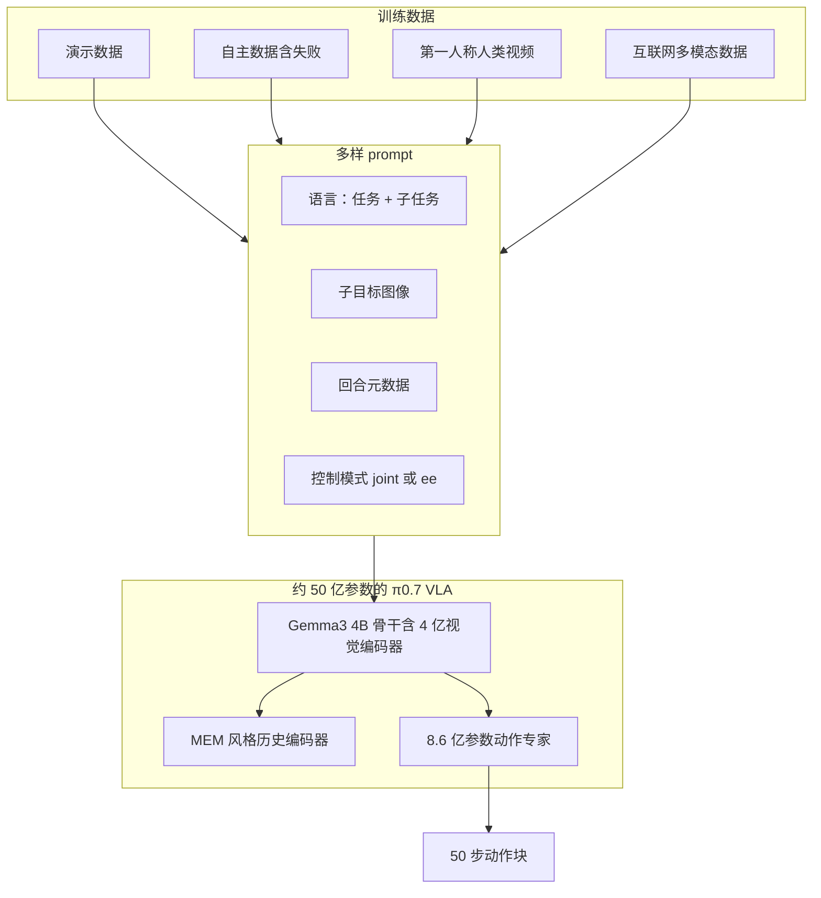
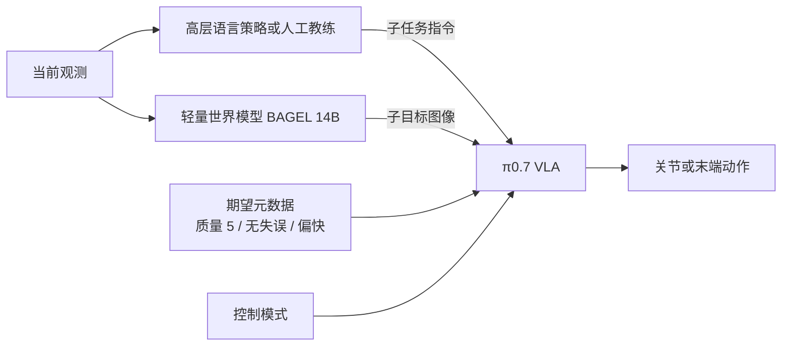
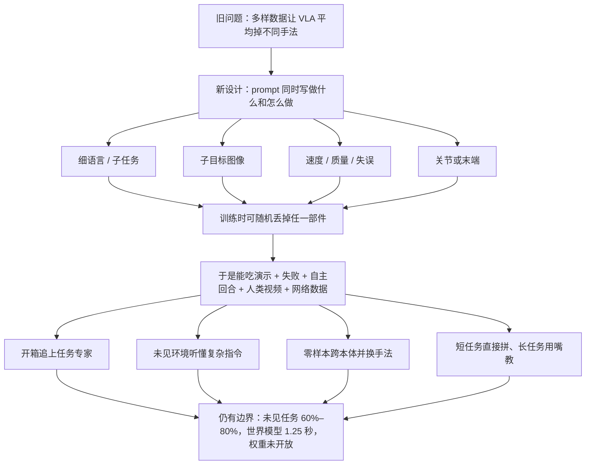

# π0.7：混杂数据会把机器人策略平均掉，所以他们把「怎么做」写进 prompt

<!-- release-date: 2026-04-16 -->

> 本文依据 Physical Intelligence 的 **π0.7: a Steerable Generalist Robotic Foundation Model with Emergent Capabilities**。本地原件 25 页，CreationDate 为 2026-04-17 01:45:44 CST，与官网下载件 `https://www.pi.website/download/pi07.pdf` 字节数相同（5,357,105）。arXiv:2604.15483 另有 v1（2026-04-16）与 v2（2026-04-24），都是 25 页；v1 与 v2 文件只差 15 字节，属于元数据修订，不是内容换版。按流程不擅自替换本地 PDF。页码一律指这份本地 PDF。
>
> 文中会明确区分三层：**报告写了什么**、**我们如何解释或推算**、**哪些是外部资料补充**。外部补充一律标出来源并给链接。
>
> 关于 `release-date`：π0.7 从未通过官方 Web、App、API 或权重向公众开放使用。按本模块约定，改用该技术首次官方公开日，即官网博客标注的 **Published April 16, 2026**。证据链见文末。

## 先讲矛盾：数据越杂，策略越容易被平均掉

语言模型这些年有一条已经被反复验证的路：数据足够杂、规模足够大，模型不但能记住训练里见过的事，还能把不同能力重新组合，去做训练时没按这个组合出现过的新题。报告把这种能力叫做**组合泛化**（compositional generalization）：会把英语译成法语，又会按 JSON 格式输出，于是就能「用 JSON 输出法语译文」（PDF p.2）。

机器人这边的视觉—语言—动作模型一直没走上同一条路。

报告把这类模型叫做**视觉—语言—动作模型**（Vision-Language-Action model，VLA）：它同时看画面、读语言指令，再直接输出机器人要执行的动作。近年 VLA 的参数量和数据量都在涨，但报告开篇就点出两个一直没解开的结（PDF p.2）：

- 它们往往**做不了新任务**，也很难把已有技能按新方式拼起来。
- 即便是训练时见过的指令，也经常**不经过任务专属微调就做不流畅**。

把更多数据扔进去，并不能自动修好这件事。原因比「数据不够」更具体。

机器人数据天然是混杂的：不同操作员手法不同，有的又快又干净，有的慢、有失误；还有大量来自旧模型自己跑出来的回合，包括失败。如果训练时只给一句「叠衣服」这样的任务名，模型看到的是同一句话对应许多种完全不同的动作。朴素模仿会把这些模式平均掉，得到一条「谁也不像」的中间策略（PDF p.2）。

所以真正的矛盾不是「要不要用多样数据」，而是：

> **要用多样数据，就必须在训练时把「做什么」和「怎么做」拆开。否则多样性会变成噪声，模型只能学到平均动作。**

π0.7 的答案是：把「怎么做」写成可操控的上下文，放进 prompt。语言可以更细，还可以加上回合质量、速度快慢、控制方式，以及一张「下一步世界看起来应该怎样」的子目标图像。训练时每种上下文都会随机丢掉一部分，测试时就可以按需要选用。报告把这套做法叫做**多样上下文条件化**（diverse context conditioning）（PDF p.1–2）。

## 读之前：这条线上的词先各用一句话说清

这篇和站内已有的 [Cosmos](/reports/NVIDIA/Cosmos)、[Genie](/reports/Google/Genie) 同属 Physical AI / 机器人方向，但解的不是同一个缺口。下面这些词多数不是 π0.7 发明的，先说人话，避免后文被缩写淹没。

- **Physical AI（物理 AI）**：站内 Cosmos 解读沿用的说法，指装有传感器与执行器、会真实改动世界的 AI 系统。π0.7 这篇自己的用词是 **physical intelligence（物理智能）**，指的是同一条赛道：能力要长在身体与环境的交互上，而不是只长在文本里（PDF p.2）。
- **世界模型（World Model）**：在 Cosmos / Genie 里，它通常指「给定过去画面和这一步的扰动，预测下一帧」。π0.7 也用这个词，但职责更窄：它是一个**轻量图像生成 / 编辑模型**，根据当前观测和子任务指令，画出「再过一小段时间场景应该长什么样」。它不负责输出关节动作，只负责给策略一张视觉提示（PDF p.4–5）。后文会把它和 Cosmos 那种可仿真世界模型分开。
- **VLA（视觉—语言—动作模型）**：从预训练的视觉—语言模型出发，改成直接输出机器人动作的策略。π0.7 是一个约 50 亿参数的 VLA（PDF p.4）。
- **动作专家（action expert）**：挂在视觉—语言模型骨干上的一个更小的 Transformer，专门生成连续动作，推理时比让整颗大模型逐步吐动作更快（PDF p.3、p.6–7）。
- **流匹配（flow matching）**：一类生成模型训练目标。它不直接一次给出动作，而是学习如何把噪声一步步「流」成真实动作分布。报告用它来覆盖机器人动作的多峰性：同一句话可以对应好几种合理手法（PDF p.3）。
- **子目标图像（subgoal image）**：对「成功往前走一步之后，摄像头应该看到什么」的图像描述。语言说「打开冰箱门」时，它不会告诉你手该抓把手的哪一段；一张子目标图可以（PDF p.4）。
- **回合元数据（episode metadata）**：给整段或一个片段打上的「怎么做」标签，例如快慢、质量分数、这段有没有失误（PDF p.5）。
- **组合泛化**：把训练里分别见过的技能，按新方式拼成训练时没作为整体出现过的任务。报告认为这才是通才能力的基石，而它在物理智能里一直很难出现（PDF p.2）。

再补几个本篇会反复出现、属于 Physical Intelligence 自家前作的名字。它们不是这篇文章的新发明，但 π0.7 直接建在它们上面：

- **π0 / π0.5 / π0.6**：同一条 VLA 产品线的前代。π0.5 已经把「下一步语义子任务」写进 prompt；π0.6 加上了记忆系统 MEM（PDF p.4）。
- **π\*0.6**：用强化学习在单个灵巧任务上后训练出来的**专家策略**，不是同一个通用模型（PDF p.8）。
- **MEM（Multi-scale Embodied Memory，多尺度具身记忆）**：给 VLA 加视频历史编码器，让它能显式记住更早的观测（PDF p.3–4、p.6）。
- **FAST**：把连续动作压成离散 token 的动作分词器，用来稳定地监督视觉—语言模型骨干（PDF p.3）。
- **知识绝缘（Knowledge Insulation，KI）**：训练时让动作专家能看见骨干的激活，但**不把动作损失的梯度传回骨干**，骨干只吃更稳的离散交叉熵（PDF p.3）。
- **实时动作分块（Real-Time Chunking，RTC）**：策略一次生成一小段未来动作；为了在推理延迟下仍能平滑衔接，训练时故意模拟延迟（PDF p.7）。

## 一句话说清 π0.7 做了什么

π0.7 不是一个全新的网络骨架。报告自己把贡献说得很克制：它不是要提出新架构，而是提出一套让 VLA **吃得下更杂的数据**、从而长出组合泛化的方法，再配上实证（PDF p.3）。

方法可以收成一句：

> **训练时给每条轨迹补上「怎么做」的多模态上下文；测试时用同一套上下文去操控模型，而不是为每个任务再微调一个专家。**

这套上下文至少有四类（PDF p.4–5）：

| 上下文 | 回答的问题 | 测试时从哪来 |
|---|---|---|
| 任务描述 + 子任务指令 | 现在要完成哪一件事 | 人，或一个同架构的高层语言策略 |
| 多视角子目标图像 | 成功往前走一步后，世界看起来怎样 | 一个基于 BAGEL 的轻量世界模型 |
| 回合元数据（速度 / 质量 / 失误） | 这段示范是快是慢、好不好、有没有做错 | 测试时固定成「快、最好、无失误」 |
| 控制模式 | 用关节空间还是末端执行器空间发命令 | 按任务选 `joint` 或 `ee` |

有了这些标签，失败轨迹不再是毒药：模型可以学会「质量 2 分、有失误」对应一种动作，「质量 5 分、无失误」对应另一种。于是演示、失败、旧策略的自主回合、人类第一人称视频和互联网多模态数据可以放进同一个训练锅，而不把策略平均成平庸动作（PDF p.2、p.5–6）。

## 先看全景：训练时喂什么，推理时谁在说话

根据报告图 1（PDF p.1）与图 2（PDF p.4）重画。这是机制示意，不表示真实的并行训练步或延迟。



推理时，主模型不再独自决定「下一步该干什么」。报告图 2 把测试期拆成三条并行通路（PDF p.4、p.7）：



三件事要先分开，后面才不会混：

1. **π0.7 本体**是那个约 50 亿参数、输出动作的 VLA。
2. **高层策略**和本体同架构，但只输出下一句子任务文本，不输出关节角。
3. **世界模型**是另一颗 140 亿参数的 BAGEL，只输出子目标图像，不输出动作。

报告没有把这三颗模型的训练算力、数据小时数或配比写成一张总账。那些数字本文不补。

## 和 Cosmos、Genie 怎么分工

站内两篇前作解的是「世界怎么被模拟、动作标签从哪来」：

| | [Genie](/reports/Google/Genie) | [Cosmos](/reports/NVIDIA/Cosmos) | 本篇 π0.7 |
|---|---|---|---|
| 卡住的缺口 | 互联网视频没有动作标签 | 手写仿真器写不出通用物理世界 | 多样机器人数据会把策略平均掉 |
| 「世界模型」在系统里干什么 | 从纯视频里学出可按的潜动作，再逐帧生成 | 用视频学一个可后训练的世界基础模型 | 生成近未来子目标图，给 VLA 当视觉 prompt |
| 最终交付 | 可交互的生成环境（未发权重） | 开源世界模型平台 | 可被语言 / 图像 / 元数据操控的通用机器人策略 |

所以 π0.7 并不试图替代 Cosmos 那种「先在数字世界里摔跤」的路线，也不做 Genie 那种「从无标签视频里发明按键」。它假设你已经有机器人轨迹（好坏都有），缺的是一种**不会把好坏轨迹搅成一锅粥的训练信号**。

## 核心设计：把 prompt 从一句话扩成「做什么 + 怎么做」

旧问题很具体。前代 π0、π0.5、π0.6 的上下文主要是一段短任务文本（PDF p.4）。短文本有两个缺陷：

- 它说不清手法。叠一件 T 恤「叠得整齐」和「叠得皱」在语言里常常是同一句。
- 它无法给失败数据一个合法位置。失败如果也配同一句「叠衣服」，梯度会把成功和失败一起学进去。

新设计是：上下文 $C_t$ 不再等于一句 $\ell_t$，而是多种模态的集合。训练目标仍是在观测历史和上下文条件下，生成一段未来动作（PDF p.3，式 1）：

$$
\max_{\theta}\ \mathbb{E}_{\mathcal{D}}\bigl[\log\pi_{\theta}(\mathbf{a}_{t:t+H}\mid \mathbf{o}_{t-T:t},\,C_t)\bigr]
$$

$\mathbf{o}_{t-T:t}$ 是最近一段时间的观测，$\mathbf{a}_{t:t+H}$ 是长度为 $H$ 的动作块。流匹配动作专家优化的是这个对数似然的近似下界，不是闭式似然（PDF p.3）。

下面按「旧问题 → 新设计 → 工作机制 → 收益 → 代价」把 prompt 的四块拆开。每一块都可以在测试时单独关掉，因为训练时对它们做了随机丢弃（PDF p.4）。

### 1. 子任务指令：先把长任务切成人能说出口的一步

π0.5 已经做过这件事：除了总任务 $\ell_t$（「打扫厨房」），再给一句当前语义子任务 $\hat{\ell}_t$（「打开冰箱门」）（PDF p.4）。π0.7 把它留下来，并明确了一个新用法：**现场口头教练**。

因为模型在训练时见过非常多样的语言，人可以像教另一个人一样，一步一步用话把它带过一个从未演示过的新任务。报告举的例子是把红薯装进空气炸锅（PDF p.4、p.13，图 14）。教练过若干次之后，可以把这些口头步骤拿去微调那个高层策略：输入是观测、任务说明和已经说过的子任务历史，输出是下一句子任务（PDF p.4）。

收益是：新长程任务不必先录遥操作。代价是：子任务语言仍然说不清抓哪里、手怎么转。这一步只解决「现在该干哪一件事」，不解决「身体该摆成什么样」。

### 2. 子目标图像：语言说不清的空间细节，用一张图说

「打开冰箱门」没有说手抓把手的哪个位置。子目标图像 $ \mathbf{g}_t = [G_t^1,\ldots,G_t^n] $ 给每个摄像头一张「近未来应看到的画面」。基座视角更容易说清物体和场景的结果，腕部视角更容易说清手臂和夹爪该在哪（PDF p.4）。

测试时这些图不是人画的，而是由轻量世界模型 $g_{\psi}$ 生成。它吃当前观测、子任务指令和回合元数据，用标准流匹配损失去拟合片段末帧（PDF p.5）：

$$
\max_{\psi}\ \mathbb{E}_{\mathcal{D}_g}\Bigl[\mathcal{L}_{\mathrm{CFM}}\bigl(\mathbf{g}_t^{\star},\,g_{\psi}(\mathbf{o}_t,\hat{\ell}_t,m)\bigr)\Bigr]
$$

$\mathbf{g}_t^{\star}$ 是真值子目标，报告把它取成该语义片段最后一帧 $\mathbf{o}_{t_{\mathrm{end}}}$；$m$ 是回合元数据；$\mathcal{D}_g$ 是子任务标注特别干净的那一部分片段（PDF p.5）。

世界模型的初始化不是从机器人数据冷启动。报告跟随 SuSIE 的路线，从现成的图像生成 / 编辑模型出发，具体用的是 **BAGEL**：一个 140 亿参数、能做图像理解、编辑和生成的 mixture-of-transformers 模型（PDF p.5）。再混入互联网数据、第一人称人类视频和其他视频，希望把「空气炸锅长什么样、把手在哪」这类语义从非机器人数据里搬进来，再经子目标图像传给 π0.7（PDF p.5）。

附录把实现写得更具体：每个训练样本是一句子任务、3 路当前摄像头、3 张片段末帧目标图；摄像头同时走 ViT（语义）和 VAE（细节）；ViT token 进 70 亿参数的语言骨干，VAE token 进 70 亿参数的生成骨干；ViT 分辨率 448×336，VAE 分辨率 512×384，差在 patch 大小分别是 14 和 16（PDF p.22）。测试时每隔 $\Delta=4$ 秒重画一次子目标，与 SuSIE 对齐（PDF p.22）。

收益：语言跟随和跨本体迁移都明显吃这张图的红利，后文实验会看到。代价有两笔。第一，训练如果每条样本都加子目标，动作预测会退化成「当前帧和未来帧之间的逆动力学」，学得快，但测试时没有真值未来帧。所以每个 batch 里**只有 25%** 的样本带视觉子目标（PDF p.5）。第二，推理要另开一颗 140 亿的生成模型。附录写：在 4 张 H100 上做 4 路张量并行、大矩阵 8-bit、改过的 SageAttention，25 步去噪（每步含文本和图像 CFG）需要 1.25 秒；序列长度接近 10,000 token（PDF p.23）。策略不能傻等它，必须异步。

这里必须把名字说清楚，避免和 Cosmos 的世界模型撞车。**π0.7 的世界模型是「把子任务翻译成近未来图像」的视觉 prompt 生成器**，不是「给定动作预测下一帧物理」的仿真器。报告没声称它能当物理引擎用。

### 3. 回合元数据：给混杂质量一个合法的条件

这是整篇文章最关键的一块，也是标题里那句「怎么做」的主体。

目标是把训练数据从「只保留高质量演示」扩成「演示 + 失败 + 旧模型自主回合」。测试时仍希望模型表现得尽可能好，所以必须告诉它：这段轨迹当时是怎么做的（PDF p.5）。元数据 $m$ 至少包含三项：

- **总体速度**：整段回合的时间步长度。按 500 步一个桶离散化，例如 1750 到 2250 步都标成「2000 步」。更快常常也意味着更少失误（PDF p.5）。
- **总体质量**：1 到 5 的分数，5 最好（PDF p.5）。
- **失误**：当前动作片段里机器人有没有抓空、做错子任务。由人粗标（PDF p.5）。

工作机制其实就是条件生成里的老办法：同一任务、不同标签，对应不同动作模式。测试时把旋钮拧到想要的模式——报告的默认是：速度取该任务回合长度的第 15 百分位（偏快）、质量固定为 5、失误固定为 false（PDF p.7）。

因为训练时对元数据做过丢弃，测试时还可以对它做**无分类器引导**（Classifier-Free Guidance，CFG）：同一步去噪算一遍「带元数据」和「不带元数据」，再沿两者差的方向多走一点（PDF p.7）：

$$
\nabla_{\mathbf{a}}\log\pi_{\theta}(\mathbf{a}_{t:t+H}\mid\mathbf{o}_t,C_t)
+\beta\bigl(
\nabla_{\mathbf{a}}\log\pi_{\theta}(\mathbf{a}_{t:t+H}\mid\mathbf{o}_t,C_t)
-\nabla_{\mathbf{a}}\log\pi_{\theta}(\mathbf{a}_{t:t+H}\mid\mathbf{o}_t,C_t^{\mathrm{uncond}})
\bigr)
$$

$C_t^{\mathrm{uncond}}$ 是被丢掉一部分上下文后的「无条件」分支，$\beta$ 是引导强度。报告在灵巧任务上对**回合元数据**做 CFG，用中等强度 $\beta\in\{1.3,1.7,2.2\}$（PDF p.7）。

收益后面的消融会证明：没有元数据，混进评估数据会伤吞吐；有元数据，同一份混杂数据反而能把通用模型推到接近强化学习专家的水平（PDF p.9，图 7）。代价是：元数据依赖人工粗标，报告没有公开标注规范、标注量和一致性；速度桶是回合长度，并不等于物理上的末端速度。

### 4. 控制模式：关节还是末端，写成一个词

训练同时包含关节空间动作和末端执行器动作，prompt 里用文本标识 $c\in\{\texttt{joint},\texttt{ee}\}$（PDF p.5）。测试时按任务选。和前三项不同：**控制模式不做 dropout**（PDF p.5）。

附录比较了前代模型在跨本体任务上用关节空间还是末端空间，没有看到末端控制的明显优势，因此正文的跨本体实验都用关节空间（PDF p.11、p.23，图 20）。末端命令在真机上仍要经过数值逆运动学变成关节目标，再交给 PD 控制器（PDF p.8）。

### 训练时怎么随机丢掉这些上下文

报告把 dropout 写得很具体，这是测试时能灵活组合 prompt 的前提（PDF p.5）：

| 部件 | 丢弃规则 |
|---|---|
| 子目标图像 | 每个 batch 只有 25% 样本带图；带图的样本里，再以 30% 丢掉子任务文本 |
| 回合元数据 | 整组丢掉 15%；速度、质量、失误各自再以 5% 单独丢掉 |
| 控制模式 | 不丢 |

拼起来之后，一条训练样本的 prompt 可以长这样（PDF p.5）：

```text
<Multi-view observation><Multi-view subgoals>
Task: peel vegetables. Subtask: pick up the peeler.
Speed: 8000. Quality: 5. Mistake: false. Control Mode: joint.
<Proprioception>
```

`Speed: 8000` 是离散化之后的回合长度，不是物理速度单位。图 3 用两条真实任务把组合方式画出来：把食物摆上桌时，prompt 是子任务序列加质量 / 失误；用 UR5e 叠衬衫时，prompt 是子目标图像加质量 / 速度 / 失误，不必五件套每次都齐（PDF p.6，图 3）。可迁移的启发已经很清楚：如果你想在测试时对某个条件做 CFG，训练时就必须对它做 dropout。π0.7 只对元数据做了这件事，并且明确没对控制模式做。

## 数据：故意把「不该用」的轨迹留在锅里

报告没有给出总小时数、各来源配比或过滤阈值。它只描述了来源构成（PDF p.5–6）：

- 多种本体上的演示：固定式和移动式，单臂和双臂；实验室、类家庭、真实家庭。
- 大量策略评估产生的自主数据，以及策略回合中的人工介入。
- 开源机器人数据集。
- 第一人称人类视频。
- 互联网辅助任务：物体定位与属性预测、视觉问答、纯文本预测，以及机器人数据和网络视频的视频—语言描述。

真正和经典 VLA 配方分道扬镳的，是第二项。报告写「显著偏离」：训练大量使用**次优机器人数据**，包括失败、成功但失误很多的演示，以及前代模型在评估实验里跑出来的数据。其中一个具体来源是 π\*0.6 在强化学习训练中收集的数据，相当于把专家的行为蒸馏进通用模型（PDF p.6）。

有一条必须一起记住的科学边界：泛化评测任务上收集的自主数据，包括第 IX 节那些，**被排除在训练集之外**（PDF p.6，脚注 1）。报告没有把评测任务的自己刷分数据再喂回去。

元数据的作用在这里才成立。评估数据质量差异很大；不标质量就训练，等于让模型去模仿自己的失败。标了之后，同一批数据变成「高质量模式」和「低质量模式」的对照，测试时只抽取高质量模式（PDF p.6、p.9）。

次优数据还有一个报告自己强调的副作用：它让同一任务里出现的状态更杂，有助于鲁棒性，有时甚至让通用模型在灵巧任务上超过单任务后训练的专家（PDF p.6）。这是作者的机制解释，后文实验支持「加上评估数据更好」，但没有单独把「状态覆盖」从「蒸馏专家行为」里拆开。

## 模型本身：前代骨架 + 历史 + 子目标，不是新发明的主干

### 规格

报告把 π0.7 写成（PDF p.4，图 2）：

| 部件 | 规模 | 初始化 / 作用 |
|---|---|---|
| VLM 骨干 | 40 亿（含 4 亿视觉编码器） | Gemma3；图 2 把视觉编码器标成 SigLIP（4 亿） |
| 动作专家 | 8.6 亿 | 流匹配，自适应 RMSNorm 注入时间步 |
| 合计 | 约 50 亿 | 输出连续动作 |
| 高层策略 | 与骨干同架构 | 输出子任务文本 |
| 世界模型 | BAGEL 140 亿 | 只生成子目标图像，不算进那 50 亿 |

视觉编码器按 MEM 的历史编码器设计：对历史观测做时间与空间压缩，**无论历史有多少帧，都输出固定数量的 token**（PDF p.4）。

### 输入怎么切块

相对 π0.5 / π0.6，主要改动是 MEM 历史编码器和上下文里的子目标图像（PDF p.6）：

- 最多 4 路摄像头：前视、两路腕部、可选后视。
- 每路最多 6 帧历史；历史整段以 0.3 的概率丢掉，后视同样以 0.3 丢掉。
- 最多 3 张子目标图（不加后视）。
- 观测和子目标都先缩到 448×448。
- 历史采样步长 1 秒。
- 本体感受状态 $\mathbf{q}_t$（含历史）用线性投影进骨干，不再像 π0.6 那样先离散成文本 token。历史帧被丢掉时，对应状态 token 一并 mask 掉。

注意力是**块因果**（block-causal）：观测 token 内部双向，子目标图像 token 内部双向，子目标可以看观测；随后的文本 token 用因果注意力。附录图 19 把五种 mask 画了出来：无子目标、有子目标、对元数据做 CFG 时把正负分支打进同一序列的「注意力树」、世界模型训练时的三份图像（ViT 当前帧、VAE 当前帧、带噪 VAE 目标）、以及世界模型推理 CFG 的三组（PDF p.22，图 19）。FAST token 只在训练时出现，且与流匹配动作互不注视。

动作专家是 8.6 亿参数的 Transformer，固定处理 50 个动作 token，也就是 50 步的动作块；这 50 个 token 彼此双向，并可以注视 VLM 骨干激活（PDF p.7）。训练还使用训练期版本的 RTC：模拟 0 到 12 个时间步的延迟，在 50 Hz 机器人上对应最多 240 ms 的推理延迟（PDF p.7）。

### 子目标图像的训练采样，是为了堵住「真图 vs 生成图」的缺口

如果训练只看未来真帧，测试却吃世界模型生成的图，分布会对不上。报告的采样是（PDF p.7）：

- 以 0.25 的概率用片段末帧（与世界模型的预测目标一致）；
- 以 0.75 的概率从当前时刻起 0 到 4 秒的未来真帧里均匀抽；
- 另外再抽大量世界模型生成的子目标，构造「上下文里放生成图而不是真未来帧」的训练样本。

这是一套工程补丁，不是新理论。报告没公开「大量」是多少、生成图和真图在 batch 里如何混。

## 推理：不微调，只换 prompt

第 VII 节写得很硬：测试时按想要的行为配置上下文，**不做任何任务专属后训练**（PDF p.7）。所有任务都带控制模式和回合元数据；子任务来自高层策略或人口头教练；子目标在子任务改变时刷新，否则最多隔 4 秒刷新一次。

完整流程是算法 1（PDF p.7）。写成步骤就是：

1. 用高层策略或教练得到当前子任务 $\hat{\ell}$。
2. 世界模型根据 $o_0,\hat{\ell},m$ 生成子目标 $g^{\star}$。
3. 拼出 $C=\{\ell,\hat{\ell},g^{\star},m,c\}$，VLA 生成 50 步动作块。
4. 之后每一时刻：子任务变了或满 4 秒，就异步重画子目标；距上次推理已执行 $\hat{H}$ 步，就带着 RTC 的已执行前缀再推理一次。
5. 真机执行当前步 $a_t$。

所有实验用 5 步去噪生成 50 步动作块，实际只执行其中 $\hat{H}\in\{15,25\}$ 步（PDF p.7）。视觉子目标和子任务生成在独立线程里跑，VLA 永远用最新到手的那一份（PDF p.7）。

延迟数字在附录。π0.7 和高层策略都基于 Gemma3 4B，推理用单张 H100。RTC 之后的优化把**最小变体**（3 路摄像头、5 步去噪、训练期 RTC）做到 38 ms；训练期 RTC 不像测试期 RTC 那样在推理时加额外开销。打开 MEM 视觉编码器再加子目标图像，最坏情况到 127 ms（PDF p.22–23）。世界模型那 1.25 秒用「朴素异步」消化：生成下一张子目标时，π0.7 继续执行手里的动作（PDF p.23）。

## 真机：四种本体，一种策略

图 4 实际画了四类平台，正文点名了三类做跨本体，第四类用于指令跟随（PDF p.7–8，图 4）：

| 平台 | 结构 | 控制频率 | 摄像头 |
|---|---|---|---|
| 双臂移动操作器 | 两只 6 自由度臂 + 全向底盘 | 50 Hz | 前视、两腕、后视 |
| 固定双臂「BiPi」 | 轻量 6 自由度臂 | 50 Hz | 前视、两腕 |
| 双臂 UR5e + Robotiq | 工业臂，更长、更重、惯量更大 | 20 Hz | 前视、两腕 |
| 单臂 6 自由度 | 与 BiPi 同款手臂 | 50 Hz | 前视、腕部 |

全部是平行夹爪。动作经 PD 控制器下发。报告强调：训练数据里很大一块来自类似 BiPi 的手臂，而跨本体测试用的 UR5e 更长、形态不同、更重，在桌边的安装位置也不同（在两侧而不是一端），所以必须换一套操作策略才做得出叠衣服这种精细活（PDF p.8）。

## 实验怎么证明「可操控」不是广告词

第 IX 节沿五条线展开。图 5 先用「换垃圾袋」和「烤贝果」说明两种评测姿势：见过的长程任务可以只给一句粗指令；训练里没有的任务则靠逐步语言教练拆开（PDF p.8，图 5）。数字能从正文直接读到的，正文给页码；只画在柱状图里、正文没有写出精确值的，本文**不估读柱高**，只转述图注和正文的比较关系。附录 G 为多数任务提供了按步骤给分的评分细则，本文不逐条抄（PDF p.24–25）。

### 1. 开箱即用：一个通用模型去打一群专家

旧问题：即使做过通才预训练，灵巧任务上最好的结果通常仍来自任务专属微调（PDF p.8）。π0.7 问的是：同一个通用模型，不做后训练，能不能追上这些专家。

对照分两排（PDF p.9，图 6）：

- 上排是 π\*0.6 强化学习专家用过的任务：叠 T 恤和短裤、叠最难的那件（纽扣衫）、做意式浓缩、折纸箱。指标是成功率和相对专家的归一化吞吐（吞吐的原始含义是每小时成功次数）。
- 下排是「机器人奥运会」和其他灵巧任务：花生酱三明治、把 T 恤翻到正面、开车穿过门、把西葫芦切片、削果蔬、换垃圾袋。指标是任务进度。

正文结论：π0.7 在 π\*0.6 发布过的任务上开箱即用就有竞争力，并且在多样叠衣服和折纸箱上吞吐甚至超过强化学习专家；对其余任务，它也接近基于 π0.6 做监督微调的专家（PDF p.8–9）。图 6 上排能看见：叠衣服（多样）和折纸箱的黄色吞吐柱高于专家的 1.0 基准线；做咖啡的吞吐略低于专家，成功率接近。下排各任务上黄柱与灰柱高度接近，切片西葫芦是少数专家明显更高的任务（读自 PDF p.9 图 6）。

记忆任务另比一次。Swap 3 Mugs、找被藏起来的物体、舀咖啡、擦窗，对照的是 MEM 论文里为这些任务微调过的 π0.6-MEM 专家。同一份 π0.7 开箱即用，达到相近或更好的任务进度（PDF p.10，图 8）。

消融把「评估数据」和「元数据」拆开，对照仍是那四项 π\*0.6 任务（PDF p.9，图 7）：

- π0.7（no eval data）：训练拿掉全部自主评估回合，因此蒸馏不到强化学习专家的行为。
- π0.7（no metadata）：上下文里不放回合元数据。

正文说 π0.7 全面超过这两个消融，差距在吞吐上最大（PDF p.9）。图 7 的黄柱在四项任务的吞吐上都明显高于另外两根浅色柱。这是整篇文章最直接的因果证据：**混杂评估数据单独加进去不够，必须同时给「这段好不好、快不快」的标签，模型才知道该模仿哪一种模式。**

### 2. 指令跟随：在没见过的厨房里听懂奇怪的话

评测故意放在乱的环境里，桌上有很多件都能做的事，模型必须真的读指令（PDF p.10）。

**未见过的厨房和卧室。** 4 间未见过的厨房、2 间未见过的卧室，共 14 个场景，每个场景是 3 到 6 步开放指令，指标是「全部指令里被正确执行的比例」（PDF p.10–11，图 9）。任务包括整理、与家具交互、擦溅出的东西。正文只给比较关系：π0.7 全面显著超过 π0.5 和 π0.6，绝对成功率也高。图 9 上厨房一组的蓝柱接近满格，卧室一组略低但仍高于前代（读自 PDF p.11 图 9）。

**复杂指代。** 标准指令类似训练里的说法（「拿起勺子」）；复杂指令用非常规指代（「拿起我会用来喝汤的那个物体」「拿起最大盘子上的水果」）（PDF p.10–11，图 10）。π0.7 在复杂指令上明显更好；再加上世界模型生成的子目标（报告把这一变体标成 π0.7 (GC)）还会再抬一截。标准指令上前代已经很高，分不出差距。

**对着数据集偏见反着做。** 这是指令跟随里最能说明「模型到底有没有在听」的测试（PDF p.10–11，图 11）：

- 训练里的 bussing 是垃圾进垃圾桶、餐具进餐盘箱。「反向 bussing」要求反过来。
- 训练里有「从冰箱拿食物放进微波炉」，没有反过来。「反向冰箱—微波炉」要求把食物从微波炉放回冰箱。

π0.7 显著超过前代。反向冰箱—微波炉这一项上，**没有子目标图像几乎做不成**，因为世界模型可以靠网络级图像生成预训练，按文本把「食物进冰箱」画出来（PDF p.11）。这是子目标图像最干净的一则因果证据：语言指令与数据偏见冲突时，视觉子目标把正确终态钉死。

### 3. 跨本体：没叠过衣服的工业臂，用另一套手法叠出来

零样本跨本体的意思是：目标机器人上**从未采集过该任务的数据**（PDF p.11）。报告按「本体差距从小到大」加难度。

物体摆放（PDF p.11–12，图 12 左）：

| 任务 | 数据采集本体 | 测试本体 | 正文怎么比较 |
|---|---|---|---|
| 摆餐 | 多种（移动、固定、单臂） | 固定双臂 | 所有模型都强，这是最有利的设定 |
| 包放进背包、整理保鲜盒 | 更大更重的双臂 UR5e | 更小的固定双臂 | π0.5 明显垮掉，π0.6 和 π0.7 仍强 |
| 把衬衫装进纸袋 | 小固定双臂 | **单臂** UR5e | 必须换策略，π0.7 显著超过前代 |

更有信息量的不是分数，是策略变了。源本体（更矮的固定双臂）装包时要用一只手撑开包、另一只手塞；更高的 UR5e 用单臂抓放就够。叠衣服时，源本体的人常常倾斜末端、把布压在桌上再提起；UR5e 上 π0.7 改成垂直抓取，更适合它的运动学（PDF p.12–13，图 13）。报告把这解释成：跨本体不是在复现源机器人的关节轨迹，而是在目标形态上找到更合适的手法。

灵巧折叠更难（PDF p.12–13，图 12 右）。叠衣服数据几乎都来自轻量固定双臂，测试却在双臂 UR5e 上折毛巾和 T 恤。π0.7 能做；加上世界模型子目标（GC）还会再好一截。图 12 右的衬衫折叠上，带斜线的 GC 柱贴近图中标注的人类水平虚线，π0.5 / π0.6 接近底部（读自 PDF p.12 图 12）。

人类对照写了精确数字。10 名遥操作员，平均约 375 小时经验，全员位于操作员队伍经验的前 2%（图 21 把 UR5e、源本体和全部机器人上的经验画成箱线图）；他们在源本体上叠过衣服，但从未在 UR5e 上叠过。每人 3 次，共 30 次；无热身，初始衬衫摊平、时限和评分与策略评测相同（PDF p.13、p.23，图 21）。结果（PDF p.13、p.24）：

| | 任务进度 | 成功率 |
|---:|---:|---:|
| 人类遥操作员 | 90.9% | 80.6% |
| π0.7 | 85.6% | 80% |

图 22 画的是 π0.7 (GC) 对人类，结论是竞争力相当（PDF p.23）。正文主文写 π0.7 达到 85.6% / 80%，没有把「是否带 GC」在这一句里再拆一次；附录图注写的是 GC 变体。以正文数字为准，把图 22 当作同一对照的可视化。

实践含义报告说得很直：精细技能可以先在便宜、好遥操作的轻量平台上采，再迁到难采数的高负载工业臂上（PDF p.13）。

### 4. 组合泛化：短任务直接 prompt，长任务用嘴教

报告把「做新任务」称作机器人基模的一类 grand challenge：以前多半只能泛化语义标签（去拿一个文本里没见过名字的物体），很难真的做新任务（PDF p.13）。

**短程，开箱即用。** 按法压壶柱塞、把米舀进电饭煲、用布擦办公用品、转齿轮或桌面风扇——这些任务都没有专门采集过机器人数据（PDF p.13–14，图 17）。π0.7 直接用语言或生成图像目标，两者大致同样强。图 17 上前代模型明显更矮，尤其是转关节物体和擦东西（读自 PDF p.13 图 17）。

**长程，靠口头教练。** 只说「用空气炸锅烤红薯」不够。这些任务要交互到 5 分钟、多阶段（PDF p.14）。设置是：装空气炸锅、卸空气炸锅、烤贝果。机器人动作级数据里没有这些任务的训练回合，不过人类数据和外部数据集里以不同上下文见过类似电器（PDF p.14）。人用「拿起红薯」「打开空气炸锅」这种一步一句把机器人带过去。图 15 显示 π0.7 可被教练的程度远好于 π0.5 / π0.6；再加生成子目标通常更好（PDF p.13，图 15）。图 14 把空气炸锅那五步指令和对应画面排成一列（PDF p.13）。

**教练数据可以变成全自动。** 把教练时的逐步指令拿去训高层语言策略，之后由它给 π0.7 喂子任务，不再需要人在场，也不再采集任何新的低层动作数据。五个任务上，全自动变体大致追上现场教练（PDF p.14，图 16）。

官网博客还写了他们后来在数据集里翻到的最接近空气炸锅的片段：家里两段「关上空气炸锅」的回合，外加开源 DROID 上 Franka 的数据。**这不是 PDF 正文里的实验**，只作为外部补充，用来理解作者自己如何看待「到底算不算见过」。链接见文末。

### 5. 消融：多样数据 × 详细上下文是真协同，不是两个独立彩蛋

这是标题那句矛盾的直接实验。

**混杂质量。** 任务是「叠 T 恤和短裤」。按折叠质量和速度把人类数据分成四桶：质量与速度最高的 30%、最高的 50%、最高的 80%、全部。每个桶各训一个带元数据的 π0.7 和一个不带的，共 8 个从零训练的模型（PDF p.14）。

图 18 左的横轴是训练用了百分之多少的数据（30 / 50 / 80 / 100），纵轴是每小时成功次数（PDF p.14，图 18）。正文结论，不估读具体柱高：

- 不带元数据：数据变多、平均质量下降之后，性能可以变差。
- 带元数据：即使平均质量在下降，性能仍能随数据量继续涨。

这就是「可扩展」在这篇里的精确定义：配方要能从**更大但更脏**的数据里继续获益，而不是只能从精心滤过的干净子集里获益（PDF p.15）。

**任务多样性。** 在图 17 的短程未见任务上再切一刀（PDF p.15）：

- 去掉任务多样性最高的 20% 数据；
- 随机去掉 20%，作为数据量对照。

两个模型看到的数据量相同。π0.7 和「随机去掉 20%」全面显著超过「去掉最多样的 20%」（PDF p.15，图 18 右）。所以泛化提升来自**任务多样性本身**，不是多 20% 小时。

把两张图合在一起，报告自己的因果链是：详细上下文让模型吃得下脏数据；吃得下之后，多样性才会变成组合泛化，而不是噪声（PDF p.2、p.15）。

## 限制：开箱能做，并不等于开箱就稳

报告的自我限制写得比很多基模博客清楚（PDF p.15）：

- 分布内任务成功率经常超过 90%；零样本新任务或新的任务—机器人组合，成功率落在 60%–80%。可操控把后训练从「必须」变成「可选」，但没有取消后训练的价值。
- 在这么大、这么杂的数据上，几乎无法严格证明某个测试任务是「真没见过」。相关技能可能换了标签，或作为别的任务的一部分偶然出现过。报告承认，模型也许主要是在 remix 见过的片段；他们把这视为组合泛化的本质，而不是缺陷。
- 未来方向是利用高可操控性，在测试任务上用更细的语言教练或自主强化学习高效补数据。

系统边界同样具体，只是写在附录里：世界模型 1.25 秒（PDF p.23）、VLA 最坏 127 ms（PDF p.22–23）、UR5e 只有 20 Hz（PDF p.8）、子目标依赖异步。报告没有讨论这些延迟在接触丰富、必须毫秒级反应的任务上够不够。

## 报告没有写、本文也不补的东西

按「没写就不编」列缺口：

- 训练总小时数、各数据源配比、过滤与去重、标注规范与一致性。
- 预训练 / 后训练的算力、GPU 数量、步数、学习率、batch 大小。
- 世界模型微调超参、生成图与真图在 batch 里的精确混合比。
- 高层策略如何微调的完整配方，以及每个任务用的 CFG 强度 $\beta$ 到底是 1.3、1.7 还是 2.2。
- 图 6 到图 18、图 20、图 22 柱状图的精确数值。正文几乎只给比较关系和少数人类对照数字。
- 权重、API、推理代码、训练代码。π0 的 openpi 仓库是前代，不能拿来填这篇。

这些不是小遗漏。没有数据配比，就无法判断「多样数据」里互联网和人类视频到底贡献了多少；没有柱状图数值，外部复现只能停留在「谁比谁高」。

## 最值得带回自己项目的启发

### 1. 多样数据的前提是可识别的模式标签

把失败、慢速、错误子任务和成功演示混在一起，若没有「这段属于哪种模式」的条件，模仿学习会平均。可迁移的不是「多标几个字段」，而是：**凡是你会在测试时想单独抽取的行为模式，训练时就必须能被上下文区分。**

### 2. 训练时的 dropout 就是测试时的旋钮

π0.7 能在测试时关掉子目标、关掉元数据、对元数据做 CFG，只因为训练时对这些部件做了随机丢弃。控制模式没做 dropout，测试时也就没有对应的 CFG。想给系统加一个推理旋钮，先问训练有没有见过「没有这个条件」的样本。

### 3. 语言负责「哪一步」，图像负责「长什么样」

子任务指令把长程任务切开；子目标图像补上抓取位姿和空间布局。两者在反向偏见任务上的分工特别清楚：语言负责对抗数据里的习惯，图像负责把正确终态钉死。做分层策略时，不要让同一条通道同时承担「语义选择」和「空间接地」。

### 4. 专家不必永远当专家，可以蒸馏回通才

π\*0.6 的强化学习回合没有被丢掉，而是带着质量 / 速度标签进了 π0.7。通用模型因此在多个灵巧任务上追上单任务专家。这是一种和「每个任务保留一个专家 checkpoint」相反的路线：专家用来产数据，通才用来部署。

### 5. 新任务可以先教语言层，再考虑采动作

长程新任务的路径是：口头教练 → 用教练文本训高层策略 → 全自动执行，全程不再采遥操作。前提是低层策略已经足够听得懂逐步指令。如果低层还听不懂「用左手抓空气炸锅把手」，这条路会在教练阶段就断。

### 6. 跨本体要允许策略变形，而不是对齐关节轨迹

UR5e 叠衣服用了和源本体不同的抓取几何。子目标图像在这里的作用，是给目标本体画一张「什么样的抓取在它身上看起来合理」的类比，而不是回放源本体的像素。做跨本体时，先问策略有没有被允许换手法。

### 7. 「脏数据可扩展」必须拿「平均质量下降时曲线还涨不涨」来验

只在干净子集上涨分，说明配方仍依赖人工过滤。π0.7 用四档质量桶证明：加上元数据之后，把更差的数据加进来仍然能涨。这比再报一个新的 SOTA 更有资格被当成数据策略的验收标准。

依赖他们特定规模的部分也不该假装可直接搬：140 亿世界模型、4 张 H100 画子目标、单张 H100 跑 40 亿 VLA、人工元数据标注、以及未公开体量的多本体数据。没有这些，dropout 表和「质量分数当 CFG 条件」仍然能用。

## 用一张图把因果链收束



## 关键词回看

- **多样上下文条件化**：训练时不只给任务名，还给手法、质量、视觉终态，让混杂数据可被条件化而不是被平均。
- **子任务指令**：当前这一步的语义描述；测试时可由人或高层策略提供，也是口头教练的接口。
- **子目标图像**：近未来应看到的多视角画面；由 BAGEL 世界模型生成，解决语言说不清的空间细节。
- **回合元数据**：速度桶、1–5 质量、是否失误。测试时拧到「快、最好、无失误」，并可对它做 CFG。
- **控制模式**：`joint` 或 `ee`，训练都见过，不做 dropout。
- **动作专家**：8.6 亿参数的流匹配头，一次吐 50 步动作。
- **知识绝缘 KI**：动作梯度不回传 VLM 骨干，骨干只吃 FAST 离散损失。
- **RTC**：训练时模拟最多 240 ms 延迟，让动作块在真机推理延迟下仍能衔接。
- **CFG**：用有条件与无条件去噪之差加强某个 prompt 部件；本篇用在元数据上。
- **组合泛化**：把见过的技能按新方式拼成新任务；报告承认这可能就是 remix。
- **跨本体零样本**：目标机器人上没有该任务数据，仍要做出来，并且允许换手法。

## 最后的判断

π0.7 最值得记住的不是「又一个更强的 VLA」，而是它把机器人学习里一个被默认接受的做法反过来了。

默认做法是：数据要干净、策略要专、新任务要重新采。π0.7 的做法是：数据可以脏，但必须能被上下文分开；部署的是同一个通才，专家只负责产带标签的经验；新任务先试着说，说得通再考虑采动作。

实验支持的部分很清楚：元数据 × 评估数据的协同、反向偏见任务上子目标图像的必要性、去掉最多样的 20% 数据会伤短程新任务、UR5e 叠衣服达到与资深遥操作员同一量级的成功率。这些不是宣传视频能替代的。

实验没有闭合的部分同样清楚：柱状图大多没有写出精确值；「未见」无法严格证明；60%–80% 的零样本成功率还不能当产品指标；权重从未开放，外部无法复核。

如果只记一句话：

> **通才模型要吃多样数据，先得把「怎么做」从「做什么」里拆出来，变成训练和测试都能拧的旋钮。否则多样性只会把策略平均掉。**

## 资料与阅读边界

**报告原件**

- 本地：`papers/PhysicalIntelligence/pi0.7.pdf`，25 页，Ghostscript 产出，CreationDate 2026-04-17 01:45:44 CST。
- 官网下载：<https://www.pi.website/download/pi07.pdf>，`Content-Length` 同为 5,357,105，与本地一致。
- 官方介绍页：<https://www.pi.website/pi07>（<https://pi.website/pi07> 会跳转到这里），标题 *π0.7: a Steerable Model with Emergent Capabilities*，标注 Published April 16, 2026。
- arXiv 官方页：<https://arxiv.org/abs/2604.15483>。v1 提交于 2026-04-16 19:18:07 UTC（15,587,221 字节），v2 修订于 2026-04-24 23:18:28 UTC（15,587,236 字节），都是 25 页。v2 相对 v1 只多 15 字节，抽页文本与本地讨论节一致，视为元数据修订。按流程不换本地件。

**release-date = 2026-04-16 的依据**

1. 模型从未通过官方 Web、App、API 或权重向公众开放。Hugging Face 该论文页显示 citing models 为 0；Physical Intelligence 的 [openpi](https://github.com/Physical-Intelligence/openpi) 公开的是前代 π0 / π0-FAST 等 checkpoint，没有 π0.7。官网介绍页只提供论文 PDF 和演示视频，没有权重或 API 入口。
2. 因此按本模块约定，改用该技术首次官方公开日。官网博客写明 **Published April 16, 2026**。
3. 同一天的旁证：arXiv v1 时间戳为 2026-04-16 19:18:07 UTC；共同创始人 [Karol Hausman](https://x.com/hausman_k/status/2044852992873292191) 与 [Chelsea Finn](https://x.com/chelseabfinn/status/2044855691966554135) 在 2026-04-16 发帖，指向同一介绍页。这些是传播事件，首发日仍取官网标注的 4 月 16 日。
4. Hugging Face Papers 卡片上的 「Published on Apr 24」 对应 arXiv v2，不是首次公开，也不采用。Hugging Face `createdAt` 按本模块规则不能当首发日；此处也没有可下载权重可核对文件提交时间。

**证据强度：中偏强。** 官方页面日期、arXiv v1、公司当日发帖三者对齐；「从未开放使用」是根据官网、openpi 与 Hugging Face 论文页交叉核对后的判断，报告正文没有单独写「不发布权重」。

**外部补充（与报告内容分开）**

- 官网博客对空气炸锅任务的数据溯源：作者后来在数据集里找到两段家里「关上空气炸锅」的回合，以及 DROID 上 Franka 的数据。PDF 只写「动作级数据没有该任务、人类数据和外部数据里见过类似电器」（PDF p.14），没有点名这两段。补充来源：<https://www.pi.website/pi07>。
- BAGEL 原论文（世界模型的初始化来源，不是 π0.7 的新结论）：[Emerging Properties in Unified Multimodal Pretraining](https://arxiv.org/abs/2505.14683)。
- Gemma 3 技术报告（VLM 骨干来源）：报告参考文献 [106]。
- 前代方法，便于对照、不属于本篇新结果：π0（arXiv:2410.24164）、π0.5（CoRL 2025）、π0.6 model card、π\*0.6 / Recap（arXiv:2511.14759）、MEM（arXiv:2603.03596）、FAST（RSS 2025）、KI（NeurIPS 2025）、RTC（arXiv:2506.07339 与 arXiv:2512.05964）、SuSIE（arXiv:2310.10639）。
- π0 的开源实现 [Physical-Intelligence/openpi](https://github.com/Physical-Intelligence/openpi) 只覆盖前代，不能用来推断 π0.7 的层数、并行或训练超参。
