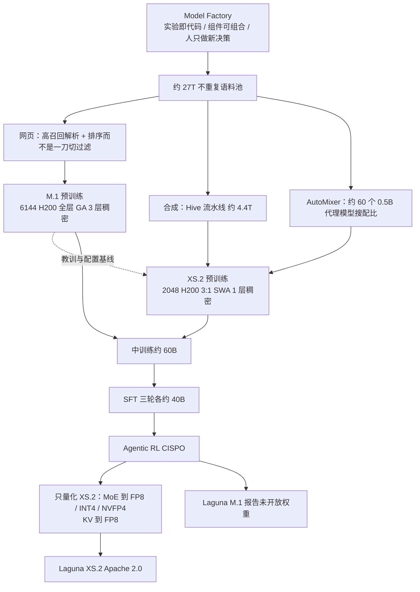

# Laguna：五周工厂如何同时交出 225.8B 的 M.1 和开放权重的 XS.2

<!-- release-date: 2026-04-28 -->

> 本文依据 Poolside 发布的 **Laguna M.1/XS.2 Technical Report**，即 arXiv:2605.27605v1（2026-05-26），共 37 页。截至核验日期，arXiv 只有 v1，本地原件无需更换。页码均指 PDF 本身的页码。全文把三件事分开标注：**报告明确写了什么**、**我们如何解释或验算它**、**哪些是外部资料补充**。

## 这篇报告真正要回答的问题

多数基模报告的主角是模型。这篇不是。

Poolside 把核心贡献放在一套内部系统上：把数据、训练、评测、推理做成可版本化的工业流程。他们叫它 **Model Factory（模型工厂）**。Laguna M.1 和 Laguna XS.2 是这条流水线连续产出来的两件产品，不是两张互相独立的模型卡。（PDF p.1–3）

矛盾很具体。M.1 是第一代：225.8B 总参数、每 Token 激活 23.4B，预训练用了 6,144 张 NVIDIA H200，并且踩过专家崩塌、logit 漂移、padding 把路由打饱和这些坑。XS.2 是第二代：33.4B 总参数、每 Token 激活 3B，预训练用 2,048 张 H200。报告写，XS.2 的预训练在 M.1 预训练刚结束时启动，从开工到发布只花了五周。（PDF p.1–2、5–6）

五周能从零训完并后训练一个开放权重模型，前提不是「小模型好训」，而是前一代踩过的坑、写过的数据管道、调度器和评测 harness 都能原样复用。报告反复强调同一句话：真正该省下来的，是研究者花在 plumbing 上的注意力。（PDF p.3）

XS.2 的权重以 Apache 2.0 发布。报告没有写 M.1 开放权重；当时它是能力更强、但不公开权重的那一件。（PDF p.1–2、27）

## 读之前先认识几个会反复出现的名字

- **Token（词元）**：模型读写文本的最小单位。
- **MoE（Mixture-of-Experts，混合专家）**：前馈网络拆成许多专家，每个 Token 只走其中几个。总参数很大，每个 Token 真正用到的很小。
- **KV Cache（Key-Value Cache，键值缓存）**：生成下一个 Token 时，前面每个 Token 留下的中间结果。上下文越长，这块显存越大。
- **SWA 与 GA**：**滑动窗口注意力（Sliding Window Attention，SWA）** 只让当前 Token 看最近一小段；**全局注意力（Global Attention，GA）** 让它看整段历史。前者便宜，后者能看远。
- **Muon**：一种把二维权重更新方向做正交化的优化器。Laguna 全阶段都用它，具体是 Moonlight 那一版。（PDF p.6）
- **WSD（Warmup-Stable-Decay，预热—稳定—衰减）**：学习率先升到峰值，稳住一段时间，再衰减。稳定阶段的 checkpoint 可以被不同数据配比拿去跑较短的 cooldown。
- **CISPO**：一种带重要性采样裁剪的 token 级 REINFORCE。报告用它做 Agent RL。（PDF p.21）
- **TITO（Token-In, Token-Out，词元进词元出）**：RL 演员不重新分词，整条轨迹一直拿同一套 Token ID，避免多轮工具调用时「看起来一样、ID 已经变了」。（PDF p.18）

报告自己造的几个组件名，读到相应节再展开：**Titan**（训练库）、**Atlas**（推理库）、**Hive**（合成数据运行时）、**AutoMixer**（自动配比）、**Blender**（数据混合服务）。

## 两个模型先放在一张表里

报告没有给一张「完整规格卡」。下面这张表只收 PDF 写明的数字。空着的格子不是疏忽，是报告没写。

| 项目 | Laguna M.1 | Laguna XS.2 | 页码 |
|---|---|---|---|
| 总参数 / 每 Token 激活 | 225.8B / 23.4B（含 embedding） | 33.4B / 3B（含 embedding） | PDF p.1、5 |
| 注意力 | 每一层都是全局注意力 | SWA 与 GA 交错，比例 3:1，窗口 512 | PDF p.5 |
| Query 头 | 未给出 | GA 层 48，SWA 层 64 | PDF p.5 |
| KV 头 / 头维度 | 未给出 | 8 / 128 | PDF p.5 |
| 路由 | 未给出专家数 | 256 个路由专家激活 8 个，外加 1 个共享专家；路由输出乘 2.5 再与共享专家相加 | PDF p.5 |
| 底部稠密层 | 3 层 | 1 层 | PDF p.5 |
| 词表 | 100,352，BPE，两模型共用 | 同左 | PDF p.5 |
| 预训练 GPU | 6,144 × H200 | 2,048 × H200 | PDF p.6 |
| 优化器 | Muon（Moonlight 变体），贯穿 SFT 与 RL | 同左 | PDF p.6 |
| 学习率日程 | cosine（XS.2 相对它改成了 WSD） | WSD；峰值 $5\times 10^{-4}$，最后 30% 按 $1-\sqrt{\cdot}$ 衰减到峰值的 5% | PDF p.5–6 |
| 预训练 Token | 从约 27T 不重复池里采样，两模型都训了超过 30T | 同左 | PDF p.9–10 |
| 评测上下文 | 256K | 256K | PDF p.26 |

量化章节把 XS.2 写成「40 层网络」，残差激活从大约第 30 层开始出现明显离群值。（PDF p.23，Figure 7）按 3:1 交错，**我们的推断** 是 30 层 SWA 加 10 层 GA。报告没有逐层画出排法。

M.1 的层数、隐藏维度、专家数、Query 头数，报告正文和附录都没给。后面「外部补充」里有后来公开的权重配置，那是论文之后的事，不能回填进这张表。

## 先看全景：工厂怎样把两代模型串起来

这张图是根据报告第 2–5 节的文字关系重画的机制示意，不是任何一张原图的复制。箭头「教训与配置基线」对应报告的原话：XS.2 的四个架构改动，都是在更小的 MoE 代理上做完消融，再作为相对 M.1 基线的配置变更提上去的。（PDF p.5）

## 核心设计一：把模型研发从手作改成工厂

### 旧问题：研究流越多，集成越像手工作坊

报告把工厂要解决的问题写成三句：怎样协调许多条独立研究流；怎样继续提高研究速度；怎样把研究结果迅速并进大生产 run。（PDF p.3）

这不是口号。M.1 训完之后，XS.2 能五周交货，靠的是前一代的数据管道、训练栈、消融代理和评测 harness 可以直接接到新 run 上。剩下的问题被收成「纯粹的模型设计问题」。（PDF p.5）

### 新设计：三条原则，而不是又一个训练框架

#### 原则 1：实验即代码（Experiments as Code）

所有 run 的输入和配置——数据管道、消融、正式训练——都写成代码，提交进同一个仓库。每个 run 有唯一 ID。实验、输入和产物登记成持久资产，互相记依赖。（PDF p.3）

控制平面用 Dagster 管这张有向无环图。研究者要回答的两个问题被收成：什么在跑，每个 run 依赖什么。启动一次实验，就是登记一个配置资产，再用 CLI 或 UI 踢出去。（PDF p.3–4）

血缘是双向的。一个打进预训练 shard 的 Token，可以回溯过去重、过滤、合成，回到源文档；每个 checkpoint、评测结果、推理部署，可以回溯到产出它的训练 run。（PDF p.4）

报告还写了一句很值得当真的话：这套控制平面也是内部 Agent 参与研究的入口。今天它们已经在设计并跑消融、监控 run、编译实验结果；作者预期它们以后会承担更大比例的日常研究。（PDF p.4） **这是作者观察，不是被单独评测证明的能力。**

#### 原则 2：可组合、解耦的组件（Composable, Decoupled Components）

目标是每个部件建一次，在很多地方复用。研究代码和生产代码共用一个仓库。成功的创新晋升进生产，理想情况下只是翻一个配置开关。（PDF p.4）

后文会反复碰到这些部件：

| 部件 | 做什么 | 页码 |
|---|---|---|
| Titan | 从 TorchTitan 改出来的 PyTorch 训练库，改了 2,200 处以上；预训练、后训练、RL 共用入口 | PDF p.6 |
| Blender | 按配比和课程混合多源数据，gRPC 出 batch | PDF p.9 |
| Hive | 把合成数据流水线编成「编排器 + 生成器 + 裁判」的循环 | PDF p.13 |
| Atlas | 基于 vLLM、直接吃 Titan 的模型定义，服务评测、内部推理、生产流量和 RL rollout | PDF p.22 |
| 代码执行平台 | 约一百万个仓库的容器环境，同时喂合成数据、评测和 RL 奖励 | PDF p.20 |

#### 原则 3：把人的注意力留给新决策（Reserve Human Attention for Novel Decisions）

重复的、机械的事尽量自动化。训练故障恢复和事件升级在 happy path 上不需要工程师；on-call 只在自动恢复走不动时被叫起来。（PDF p.4）

最能说明这条原则的，是他们换掉的调度器。第一版基于 Volcano，两个限制后来变成硬约束：驱逐按节点而不是按作业，高优先级 gang 一来，整机被抽干，无关的同居 pod 也得重新排队；拓扑存在 Kubernetes API 后面的 etcd 里，集群 churn 一大，放置时间被拖到几十分钟。（PDF p.4）

自研调度器改了三件事：按作业而不是按节点回收；拓扑镜像进 FoundationDB，调度器不再打 etcd；pod 挂了优先在原节点拉起，缓存和网络拓扑还在。（PDF p.4–5）效果写得很硬：放置时间稳定到一分钟以内。超参扫描、CI canary、被抢占之后的回填，都靠调度器「可预期地快」才站得住。（PDF p.5）

### 收益、代价、可迁移的部分

收益是报告用 XS.2 的五周交货来证明的。XS.2 的初始模仿学习阶段，甚至可以由后训练核心组以外的人、在不跟人同步的情况下自己跑起来——工具共享、血缘完整。（PDF p.17）

代价也很清楚。工厂本身是一家公司的内部系统：Dagster、FoundationDB、自研调度器、Titan 那 2,200 处改动，都没有开源实现。报告给的是原则和若干组件边界，不是可复现的仓库。

可迁移的不一定是这套软件名单。更便宜的迁移是：把「实验、数据、checkpoint、评测」收成带 ID 的资产图；研究和生产共用一份代码；调度器的快慢当成研究速度的一部分，而不是运维细节。

## 核心设计二：XS.2 相对 M.1 只改四件事，其中一件是逐层 Query 头预算

### 旧问题：M.1 的注意力在每一层都付全价

两模型都是 pre-norm Transformer，归一化用 RMSNorm。第一层稠密，是为了训练稳定。词表 100,352，两模型共用。（PDF p.5）

M.1 的注意力是每一层全局注意力。这对长程 Agent 轨迹友好，KV Cache 和注意力计算也按层数线性涨。XS.2 要跑在低显存设备上，这个账单付不起。量化章把目标写得很直白：让 XS.2 能部署到低 VRAM 设备。（PDF p.5、23）

### 新设计：四条相对 M.1 的 delta

报告把 XS.2 的架构和训练改动收成四条。（PDF p.5）

1. 用交错的 SWA + GA 替换 M.1 的全层全局注意力。
2. 学习率从 cosine 换成 WSD。
3. 给路由专家输出加调制系数，做法类似 DeepSeek-V3 和 Nemotron 3。
4. 底部稠密层从 3 层减到 1 层。

四条都先在更小的 MoE 代理上做完针对性消融，再作为配置变更提上 XS.2。附录 A.2 给的代理是 16.6B 总参数 / 2.3B 激活、22 层、128 个专家 top-8、1 个共享专家。（PDF p.5、34–35）

### 工作机制：3:1 的窗口层，窗口只有 512；Query 头按层种分开给

XS.2 的 MoE 是 token-choice 路由：256 个路由专家里激活 8 个，外加一个每个 Token 都走的共享专家。路由是线性层加 sigmoid，top-k 之后再归一化分数。路由专家的输出先乘 2.5，再和共享专家相加。负载均衡用 Qiu 等人的辅助损失，只算全局 batch 里的非 padding Token。（PDF p.5）

注意力是分组查询注意力（Grouped Query Attention，GQA），两类层都是 8 个 KV 头、头维度 128，并且带 softplus 的逐头门控。位置编码用 RoPE。差别在 Query 头、窗口和 RoPE 基频：（PDF p.5）

| 层类型 | 比例 | 窗口 | Query 头 | KV 头 | $\theta$ | RoPE 覆盖 |
|---|---|---|---:|---:|---|---|
| SWA | 3 | 512 | 64 | 8 | 10,000 | 报告未写 SWA 是否 partial |
| GA | 1 | 全序列 | 48 | 8 | 500,000 | 只作用在头维度的前 50% |

这就是索引里那句「逐层 query 头预算」的原文位置。KV 头数两层一样，变的是 Query 头。

**我们的解释**：KV Cache 的形状由 KV 头数和头维度决定，不随 Query 头涨。SWA 层的 KV 最多存 512 个 Token，多给 16 个 Query 头几乎不加缓存，却能让局部上下文被更多「视角」看一遍。GA 层的 KV 随上下文线性增长，每个 Query 头还要对全序列做注意力；把 Query 头从 64 收到 48，省的是全序列注意力计算和 $Q$ 投影，不是缓存。报告没有把这层账写成公式，但附录消融的最后一步就是「+ 48 GA / 64 SWA Q-heads」。（PDF p.35，Table 9）

**我们的 KV 验算**（按 8 个 KV 头、维度 128、BF16）：每层每个 Token 的 K+V 是 $8 \times 128 \times 2 \times 2 = 4096$ 字节。256K 上下文下，一层 GA 大约 1 GiB，一层 SWA 只有 $512 \times 4096 \approx 2$ MiB。若 40 层里 10 层 GA、30 层 SWA，缓存大约 10 GiB；40 层全是 GA 则大约 40 GiB。3:1 加 512 窗口，长上下文 KV 大约降到四分之一。这是按层数和窗口做的数量级，不是报告给出的官方加速比。

长上下文扩展只动 GA。预训练在 4K 上做完 WSD 衰减后，分两个各 100B Token 的子阶段：先到 32K，再到 128K。两个子阶段都只对 GA 层用 YaRN，batch 仍是 24M Token，cosine 从预训练峰值的 5%（$2.5\times 10^{-5}$）降到 1%（$5\times 10^{-6}$），不再重新 warmup。128K 阶段末尾对最近 10 个 checkpoint 做指数滑动平均，得到最终 base。再往后到 256K，报告写明是 **不再训练**，只把 GA 层的 RoPE scale 加倍。（PDF p.6）

### 消融怎么支持这些选择

附录 Table 9 的代理模型在 4K 上预训练 335B Token，再各用 50B 做到 32K 和 128K。4K 平均来自 10 个 base 基准，32K / 128K 平均各来自 4 个长上下文任务。基线重跑五次，4K 平均的标准差大约 0.0026，低于约 0.005 的差异被当成噪声。（PDF p.34–35）

| 架构 | 4K Avg ↑ | 32K Avg ↑ | 128K Avg ↑ |
|---|---:|---:|---:|
| 稠密 GA，full RoPE，full gating | 0.5389 | 0.308 | 0.290 |
| + SWA-1024（3:1 交错） | 0.5292 | 0.274 | 0.267 |
| + 逐头门控，$\theta_{\mathrm{swa}}=10{,}000$ | 0.5328 | 0.267 | 0.272 |
| + GA Partial RoPE（50%） | 0.5425 | 0.266 | 0.284 |
| + SWA-512 | 0.5449 | 0.285 | 0.304 |
| + 48 GA / 64 SWA Query 头，底部稠密层 $=1$（最终消融架构） | 0.5455 | 0.305 | 0.296 |

（PDF p.35，Table 9）

读这张表时有三条要分开。

第一，只把 1024 窗口的 SWA 插进去，短长上下文都掉，32K 和 128K 掉得尤其明显。窗口不是免费的正则。

第二，把窗口从 1024 收到 512 之后，128K 平均反而超过了全 GA（0.304 对 0.290）。这和 MiMo-V2-Flash 那篇「更小的窗口有时更好」的方向一致，但两边的窗口、比例、是否有 sink、评测长度都不一样，不能直接对拍。

第三，最后加上「GA 48 / SWA 64 头、底部只留 1 层稠密」之后，32K 从 0.285 回到 0.305，几乎贴上全 GA 的 0.308；128K 略降到 0.296，仍高于全 GA 的 0.290。 **逐层 Query 头预算的直接证据就是这一行。** 它主要挽回的是 32K，不是 128K。

### 代价与边界

- 消融是 16.6B / 2.3B 的代理，不是 33.4B 的 XS.2，更不是 225.8B 的 M.1。
- 报告没有公开 M.1 的层数和专家数，所以两模型没法在「同样的 GQA 配比」上做对照。
- XS.2 的 3:1 排法、第一层是不是 GA，正文都没画出来。
- 256K 是 RoPE 加倍、没有再训练。评测在 256K 上跑 Agent 任务，但没有单独的 256K 检索消融。

### 可迁移启发

1. **KV 头数决定缓存，Query 头数决定「这一层愿意花多少计算去看」**。两类层共享 KV 形状，只在 Query 头上分预算，比给整网换一套 GQA 更细。
2. **长上下文扩展只动看得远的那几层**。YaRN 和最后的 RoPE 加倍都只作用在 GA 上。SWA 的 $\theta=10{,}000$ 从头到尾不用改——窗口只有 512，这个基频够用。
3. **底部稠密层从 3 减到 1 是稳定性与容量的交换**。M.1 用 3 层垫底；XS.2 确认代理上可行之后就减了。报告没给单独的「为什么 3 变 1」消融表，只有最终架构那一行把它和 Query 头预算捆在一起。

## 核心设计三：WSD 的学习率不再拍脑袋，稳定性课记在 M.1 账上

### 配方

XS.2 预训练上下文 4K，WSD：线性 warmup 到峰值 $5\times 10^{-4}$，稳定阶段保持峰值，最后 30% 步数按 $1-\sqrt{\cdot}$ 衰减到峰值的 5%，也就是 $2.5\times 10^{-5}$。（PDF p.6）

全程 BF16 混合精度，master 权重 FP32。例外是 RMSNorm、RoPE 的部分 FP32，以及下面要讲的 LM head 输入梯度 all-reduce。（PDF p.6）

两模型预训练都用 Muon。分布式实现把每个参数的 Newton–Schulz 正交化指派给「分片它的那些 rank 里的一个」，算完再把正交化后的梯度分片发回去。M.1 预训练时，优化器开销低于一步训练时间的 1%。（PDF p.7）

### 峰值学习率从一条 WSD 专用 scaling law 来

WSD 的好处是：稳定阶段的一个 checkpoint，可以拿去配不同数据 mix，跑较短的 cooldown。坏处是：最终 loss 的校准没有一次性 cosine 那么直接；乱调的 WSD 在同等算力下有时会输给调好的 cosine。（PDF p.6）

他们在 2B–16B 总参数 / 0.3B–2.2B 激活的四档 MoE 上，扫六档学习率、五档 Token 预算（30B–480B），batch 固定为 $B_0=8$M（附录写成 8.4M，两处不一致）。每个 $(N,D)$ 在 $\log_{10}\mathrm{lr}$ 空间拟一条抛物线，顶点当 $\mathrm{lr}^\star$，再对全局幂律做普通最小二乘：（PDF p.6、32）

$$
\mathrm{lr}^{\star}(N,D)=10^{4.488}\cdot N^{-0.4639}\cdot D^{-0.2661}
$$

$N$ 是激活参数量，$D$ 是含 cooldown 的总 Token 预算。换 batch 时按 $\sqrt{B/B_0}$ 缩放。XS.2 的 $N=3.0$B、$B=24$M Token，定律给出约 $5.5\times 10^{-4}$，他们用 $5\times 10^{-4}$ 留一点安全边际。（PDF p.6）

附录拿 Kimi K2 做外推交叉检查：$N=32.6$B 激活、$D=15.5$T、$B=67$M 时，定律预测约 $3.5\times 10^{-4}$，K2 实际用 $2\times 10^{-4}$。作者自己说，两边优化器、稀疏比、cooldown、数据都不同，这只能当 suggestive，不是定律在他们设定之外的验证。（PDF p.34）

### M.1 踩过、XS.2 开工前就补上的三个稳定性坑

XS.2 预训练「没有再遇到稳定性问题」。课是 M.1 上的。（PDF p.9）

**专家崩塌。** 为了让 Muon 更新的矩阵参数和 AdamW 更新的非矩阵参数有效 weight decay 对齐，他们采用 Moonlight 式的学习率缩放，让 Muon 跑在 AdamW 量级的 LR 上。初步实验里，不做这个缩放、再用常规 weight decay 系数，大约 450B Token 处开始专家崩塌，并从最下面三层 MoE 一层层往上传，直到发散。（PDF p.9）

**LM head 输入梯度 all-reduce 的精度。** 默认混合精度下，LM head 输入梯度是 BF16，列切分的张量并行会把这份梯度也按 BF16 all-reduce。他们没有 z-loss，RMSNorm 也不减均值，pre-softmax logit 可以自由涨。M.1 上出现了明显的正 logit 漂移。激活一大，BF16 all-reduce 变成主要数值误差源，再传回模型。处理是：LM head 仍然张量并行，但这步 all-reduce 强制 FP32。（PDF p.9）

**Padding 被路由。** 即使做了 sequence packing，大约 5% 的训练 Token 仍是 padding。语言模型损失在 padding 上是 mask 掉的，padding embedding 不可学；padding 在注意力里又不和周围 Token 混合，于是一个 batch 里所有 padding 以同一表示到达路由器，被同时打进同一个专家。XS.2 加了跳过 padding 的路由和负载均衡的选项，后续消融认为这对路由稳定更有利。（PDF p.9）

这三条里，前两条是数值与优化器的相互作用，第三条是数据布局对 MoE 的副作用。没有一条是「再堆一个稳定化损失」能单独覆盖的。

### 分布式训练里真正和 MoE 账单有关的两处

设备 mesh 对非 MoE 层是 $(\mathrm{PP},\mathrm{DDP},\mathrm{FSDP},\mathrm{TP})$，对 MoE 层是 $(\mathrm{PP},\mathrm{DDP},\mathrm{FSDP},\mathrm{EGP},\mathrm{ETP})$。EGP 按专家切，ETP 把单个专家再按张量维切。两模型都设 $\mathrm{ETP}=1$，因为单专家中间维度不够大，再切不划算。（PDF p.7）

MoE 的 dispatch / combine 被融进 CUTLASS grouped GEMM。H200 每卡 132 个 SM，8 个 SM 专门从对等 GPU 拷专家 Token，拷完在 HBM 里立旗；其余 SM 跑 GEMM，tile scheduler 等到这个 tile 需要的专家旗都立了才算。combine 则改 epilogue，算完的 Token 直接从寄存器经共享内存打回属主，不再先写本地 HBM 再另发一次。Figure 2 画的就是这条时间线。（PDF p.7–8）

可靠性上，他们把跨 replica 的权重哈希检查写得很重。DDP replica 应当 bit 一致；哈希对不上，优先怀疑 GPU 算术逻辑和流水线寄存器里的静默数据损坏——DRAM / SRAM 有 ECC，这两处没有。一次 run 里他们抓到单机算术静默算坏，全局梯度范数冲到约 $10^6$。同一台机器早先的 run 只表现出更轻的异常，因为当时激活更小。（PDF p.8）哈希还抓到过 Muon Newton–Schulz 的非确定性和 checkpointer 在优化器 state-dict 路径上多插了一次 cast、让 DDP rank 0 的 $\beta$ 变成 FP64、其余 rank 仍是 FP32。（PDF p.9）

## 核心设计四：数据不再「尽量只留精品」，而是排序之后按配额采样

### 旧问题：高精管道在 30T 尺度上会自己把自己抽干

两模型都从约 27T 不重复 Token 的池子里采样，各训超过 30T。（PDF p.9–10）

M.1 用的是高精、人工配比的管道。暴露出两个瓶颈：高价值子集被过度重复；不同来源的预算分配并不优。短地平线上靠狠过滤换平均质量的策略，在这个 Token 预算下不再最优。挑战从「稀缺时最大化精度」变成「长地平线上控制重复和多样性」。（PDF p.10）

XS.2 的回答是三件事：更高召回的网页管道、规模化合成改写、用 AutoMixer 替换静态人工配比。（PDF p.10）

### 网页：先保守丢掉纯噪声，再按贡献分排序

管道从原始 HTML 吃 Common Crawl，自研解析器优先保召回，并专门处理技术内容和 boilerplate。语言识别用 GlotLID，pycld2 兜底，过滤英文。去重偏好 snapshot 级模糊去重，因为跨 snapshot 的相似页面「在统计上更可能含有相关事实」，对知识类基准更好。（PDF p.10）

质量被拆成两个轴：噪声轴 $N$ 和信息轴 $I$，都是 0 到 5 的整数。一张满是 boilerplate 的页面仍然可能有教育价值，两个轴不能合成一个分数再一刀切。标注还要映射到 Table 1 的贡献量表，并且在 $[0,2]$ 的含糊区把 $N\times I$ 网格标得很密，把「真没用」和「有噪声但还能用」分开。（PDF p.10–11）

XS.2 的主拒绝路径是模型打分、而且故意保守：只有有把握是纯噪声才丢掉。其余文档按连续贡献分排序，再按这个排序去填配额。单一质量维度太粗也太难预测，所以先用 Propella 打出多属性标签，用 PCA 提示过的子集去相关，再合成复合分。经验上有用的维度包括内容质量、教育价值、信息密度、内容完整性、内容比例、商业偏差。（PDF p.11）

复合分彻底滤掉 25.8% 的网页样本，同时找回大约 34% 此前被静态规则和词表分类器排除的高质量文档。活过过滤只意味着有资格被采样，不意味着一定进训练。（PDF p.11）

Figure 3 把这条流水线画成：Common Crawl → 解析 → 语言识别 → 去重 → Propella 打标 → 保守过滤 → 复合分排序 → 分桶 → 按配额采样 → 最终网页 mix 约 13T Token。（PDF p.12）Spark 上稳态每天处理约 $2\times 10^{13}$ Token。（PDF p.10）

Figure 4 是分桶前后的文档占比。原分布里 B0–B3 这些低质量桶合计超过 60%；加上采样权重之后，B0–B3 被压到大约 4.7%，B5–B7 占到大约 79.6%。权重从 B0 的 $0.006\times$ 升到 B7 的 $2.4\times$。（PDF p.12，读自 Figure 4）低质量桶没有被清零。这是设计，不是过滤没滤干净。

### 合成数据：占 mix 约 13%，来自约 4.4T 生成 Token

合成数据补的是呈现方式、低资源格式，以及计划、理由、问答这类结构，而不是替换自然数据。XS.2 全阶段大约 13% 的 mix 来自合成，生成池约 4.4T Token，一头是偏 seed 的形式改写，一头是更贵的多阶段组合蒸馏。（PDF p.11）

Hive 把流水线收成六个可组合零件：输入集 $\mathcal{S}$、元数据 $\mathcal{M}$、生成器 $G$、过滤 $f$、验证 $V$、预处理 / 后处理。一条管道就是

$$
P=\mathrm{post}\circ f_n\circ G_n\circ\cdots\circ f_1\circ G_1\circ\mathrm{pre}
$$

（PDF p.11–13）两条原则：教师一枪打不中的任务就拆，或者换更强的教师；已经知道的关于输出的事，全部当成元数据喂进去，不要让生成器自己猜。（PDF p.13）

Table 2 给了四种形状和量级：形式改写约 $10^{12}$，跨域转换约 $10^{10}$，多阶段级联约 $10^{11}$，多轮 rollout 约 $10^{10}$。（PDF p.14）这些是贡献到预训练语料的数量级，不是生成池的 4.4T。

### AutoMixer：用一群小模型学会「配比怎么影响能力」

人工调 50 多个数据组的配比，在这个规模上不可行。AutoMixer 每次消融大约训 60 个代理：每个约 0.5B 参数的 MoE，在约 60B Token、不同配比上训练。探索的语料超过 50 个异构数据组。Figure 6 把它们收成 15 个展示组：网页、学术、数学、生代码、带 grounding 的代码、合成代码、知识、教材、书、指令等。（PDF p.13–15）

核心是学一个代理映射 $\mathcal{M}:x\mapsto y$。$x$ 是 $d$ 个数据组上的配比，$y$ 是 $k$ 个能力组的下游指标。候选配比从人工先验 $x_0$ 出发，按 $\mathrm{Dirichlet}(\alpha x_0)$ 采样，并加 $\|x-x_0\|_1<\epsilon$，避免搜到退化角落。每个能力组训一个回归器 $f_j(x)\approx y_j$，能力分成代码、数学推理、STEM 知识、常识推理、一般知识。（PDF p.14–15）

优化写成

$$
\max_x\sum_{j=1}^{k} w_j f_j(x)
$$

约束是 $x$ 落在单纯形上，并且不远离先验。为了避免塌到少数高信号源，再加一项 KL：

$$
\mathcal{L}(x)=-\sum_j w_j f_j(x)+\lambda D_{\mathrm{KL}}(x\|x_0)
$$

（PDF p.15–16）

小规模验证是一个 3B 模型、1.5T Token。优化目标上 HumanEval+ +43%、Crux-I +54%、GSM8K +41%、MultiPL-E +27%；held-out 的 LiveCodeBench +39%、APTBench-4k +35%、MATH +25%；常识侧 ARC-C −6.8%，其余 WinoGrande / PIQA / HellaSwag 各掉约 1 个点。（PDF p.16，Table 3）

这是代理优化，不是 XS.2 本体的消融。作者认为增益泛化到了未直接优化的基准；常识回撤「并不令人惊讶」，因为优化目标就偏代码和数学。（PDF p.16）

XS.2 最终预训练配比是 Table 4：（PDF p.16）

| 数据组 | 权重 |
|---|---:|
| 生代码 | 30.6% |
| 网页 | 25.2% |
| 合成 / 代码—文本 | 25.4% |
| 数学 | 9.0% |
| 知识 | 6.6% |
| 指令风格 | 1.4% |
| 学术论文 | 1.1% |
| 书 | 0.7% |

相对 M.1，AutoMixer 给出的分配明显转向更宽的网页覆盖、合成 / 代码—文本、以及数学向语料，同时仍保持代码很重的底盘。（PDF p.17）注意：这里的「合成 / 代码—文本 25.4%」和上文「合成约占 mix 的 13%」不是同一个口径。13% 指合成数据在各阶段 mix 中的份额；25.4% 是把合成和代码—文本合成一个数据组之后的预训练权重。

### 可迁移启发

1. **Token 预算变长之后，过滤策略要反过来。** 短训可以狠丢噪声；长训要的是多样性，否则高价值子集被重复到过拟合。
2. **质量是排序信号，不是二进制门。** 复合分滤掉 25.8%，但低质量桶仍以极小权重进训练。
3. **配比优化可以变成「先训一群小模型，再优化代理回归器」。** 代价是约 60 个 0.5B × 60B 的 run；收益是把 50 多个数据组的组合从拍脑袋变成带 KL 约束的搜索。不要把 Table 3 的 +43% 直接读成 XS.2 本体涨了 43%。

## 核心设计五：后训练几乎原样从 M.1 搬到 XS.2，但特殊 Token 在大模型上会炸

后训练接在预训练（含上下文扩展）之后，三阶段：（PDF p.17）

| 阶段 | 规模 | 内容 |
|---|---|---|
| 中训练 | 约 60B 不重复 Token，1 个 epoch | 聊天、推理、Agent 编码的宽 mix |
| SFT | 三轮，每轮约 40B | 以 Agent 编码为主 |
| RL | 只使用可验证奖励，在线 CISPO | 同一套生产 harness |

配方在两模型之间几乎没改，改的是超参和少量数据修复。M.1 先就绪，他们在它上面迭代数据和部分架构选择；XS.2 因为预训练周转快，随后并行做后训练。（PDF p.17）

中训练有效 batch 128，最大序列 131,072，cosine，50 步 warmup，峰值 $1\times 10^{-5}$，终值 $2\times 10^{-7}$，Muon，短序列打包进同一个 microbatch。（PDF p.18）SFT 共用这套超参，按评测做 early stopping。（PDF p.19）

### 特殊 Token：小模型随手初始化，大模型要先「认字」

中训练引入 XML 风格特殊 Token：`<assistant>`、`</assistant>`、`<think>`、`</think>`、`<tool_call>`、`</tool_call>`。它们的 embedding 在预训练前随机初始化，一直不动，到中训练才开始学。（PDF p.17）

XS.2 上这样就能中训练。M.1 上，特殊 Token 和普通 Token 的 embedding 不匹配，导致梯度尖峰、死专家、更宽的不稳定。处理分两步：用子词平均初始化，例如 `<think>` 取 `<th`、`ink`、`>` 三个子词 embedding 的均值；然后做 100 步 warmup，冻结除输入 embedding 和 LM head 以外的网络，让新 Token 先在词表空间里站稳。（PDF p.17）作者说这是他们见过的最稳、从一开始工具调用格式错误率最低的策略。

聊天和结构化输出对齐开源惯例：推理块用 `<think>`，工具调用跟 GLM 系列兼容的 XML。`enable_thinking` 打开时，模板在生成前塞一个开标签，模型可以立刻合上，也可以继续想；SFT 阶段他们始终省略空推理块，模型于是在 flag 打开时就会吐推理 Token。关掉时只塞闭标签。训练时保留完整的历史思考块，每一步生成都能看见之前的 think。（PDF p.17）

### TITO：RL 轨迹和线上 chat template 必须逐字符对齐

RL 演员用 token-in、token-out API，多轮之间 Token ID 不变。这能消掉「重新分词导致 ID 漂移」，但会引出另一个问题：RL 渲染器和生产 chat template 只要差一个换行或尾空格，部署就会明显掉点。（PDF p.18）

他们加了 `render_assistant_messages_raw`：打开时，chat template 把 rollout 的原始 Token 原样填进 assistant 块。每一步生成后，用这个 flag 渲染对话历史，断言结果字符串和 rollout 时存下的解码前缀完全一致。（PDF p.18）这是部署约束，不是算法。

同一节他们还往 vLLM 回馈了推理解析器和工具解析器（PR #35208）：按「当前这一轮」而不是整段 prompt 判断 `</think>` 是否结束；并处理一条 stream delta 里跨块边界的多 Token——投机解码和 vLLM 的 single-slot collector 都会制造这种 delta，旧解析器会把边界 Token 后面的内容静默丢掉。（PDF p.18）

### 中训练和 SFT 的 mix 完全不是一回事

中训练大约 40% 逻辑与推理、30% 编码与 Agent、30% 通用聊天，合计约 60B。早期 mix 出现过「没给工具就省略推理或生成退化推理」这类和轨迹长度、工具是否在场绑定的故障；跨域把这些特征配平之后消失。（PDF p.18–19）

SFT 则大约 85% 是 Agent 轨迹，其余 15% 分给别的域。四块是：（PDF p.19）

1. 无推理的 Agent 编码，开源教师的单轮轨迹，约 30% Token。
2. 带推理的同一来源分布，因为推理变长，约占 45%。
3. 可验证的 Agent 数学，只要数值答案，去掉开源模型已经很容易解的题，约 3%。
4. 非 Agent 样本约 22%，用来减轻遗忘。

### 合成代码环境：从 git commit 变成可验证任务

内部管道把公开仓库的真实 commit 变成训练任务：问题陈述、仓库 checkout、隐藏测试补丁都来自 commit，diff 当黄金解。双边正确性检查要求黄金解能过测试、空解不能过，用来丢掉平凡测试和「测试根本没覆盖这次改动」的 commit。再按仓库热度和代码质量百分位过滤，可选地每仓库只留一个任务。原始池约 236k commit，留下约 3–6 万个任务。这些任务同时进 SFT（教师轨迹，可选地配上多条合成 system message）和 RL 任务池（仓库测试套件当二元 verifier）。（PDF p.19）

### 指令遵循：超过一半的 Agent 任务会在写代码之前就因为违反 system 而零分

没有显式的指令遵循监督时，RL 微调容易灾难性遗忘这些行为；超过一半的 Agent 任务拿不到奖励，因为模型在任何编码工作被评之前就已经违反了 system 约束。（PDF p.19–20）

他们给 Agent 任务加 EvolInstruct 风格生成的行为要求，再拼回原来的 system message，让轨迹同时演示「把代码写对」和「遵守约束」。专用 IF judge 把 system message 拆成独立行为要求，逐条对轨迹打分。内部评测集用同一管道作用在 SWE-bench Verified 上，于是可以同时看 pass rate 和 follow rate。消融扫过要求数量、是否丢掉原 system、教师选择、是否需要生成的 rubric（最后用的是简单要求模板）、过滤严格度。结果是 IF 版 SWE-bench Verified 和直接 pass rate 都涨了。（PDF p.20）

### Multi-harness：训练数据里故意留着别人的怪癖

SFT mix 另加 1.3B Token 的多 harness Agent 轨迹，来源包括 OpenHands、OpenCode、Mini-SWE-Agent。收集时故意保留这些框架的原生行为：自定义子 Agent、上下文压缩、规划脚手架、提醒系统。作者说这些在内部评测上改善了泛化。（PDF p.20）

## 核心设计六：Agentic RL 用生产 harness 跑，奖励几乎全靠最后那个 0/1

RL 阶段让策略自己驱动已经上线的 Agent harness，在真实代码仓库、终端沙箱和带工具的数学题上产多轮轨迹。harness 的工具 API、chat template、编排层和客户用的是同一份；改线上 harness，就是改策略正在对着训练的那份。（PDF p.20）代码执行平台是同一套容器原语，同时服务于合成数据、评测和 RL 奖励，当前大约覆盖一百万个仓库。（PDF p.20）

### 算法：CISPO + 按长度加权的 leave-one-out

每个 prompt 采一组 $G$ 条轨迹。$r_i$ 是 $\tau_i$ 的标量终局奖励，$w_i$ 是其中被计奖励的（助手生成的）Token 数。长度加权的 leave-one-out 基线和优势是：（PDF p.21，式 2）

$$
b_i=\frac{\sum_{j\neq i} w_j r_j}{\sum_{j\neq i} w_j},\qquad A_i=r_i-b_i
$$

当前策略 $\pi_\theta$、采样时策略 $\pi_{\theta_{\mathrm{old}}}$，对助手 Token 均匀施加的 token 级代理损失是：（PDF p.21，式 3）

$$
\mathcal{L}(\theta)=-\mathbb{E}\Big[\mathrm{clip}\big(\rho_t,\,1-c_{\mathrm{low}},\,1+c_{\mathrm{high}}\big)\,A_i\log\pi_\theta(y_t\mid x,y_{<t})\Big],
\qquad
\rho_t=\frac{\pi_\theta(y_t\mid x,y_{<t})}{\pi_{\theta_{\mathrm{old}}}(y_t\mid x,y_{<t})}
$$

非对称裁剪 $(c_{\mathrm{low}},c_{\mathrm{high}})=(1,4)$，有效重要性比率裁剪区间是 $[0,5]$，只在严重 off-policy 的 Token 上才咬住。（PDF p.21）

这套配方是对 GRPO、GSPO 做完消融之后选的，标准是最终评测质量和训练稳定性的组合。Moonlight 缩放在 M.1 的 RL 里关掉，在 XS.2 的 RL 里打开。（PDF p.21）

### 奖励：一长串小负分，真正的正分只有 verifier 的 1.0

终止后的 rollout 按固定顺序过检查器，**第一次失败的那项决定奖励**：（PDF p.21）

| 检查 | 分 | 作用 |
|---|---:|---|
| 解析错误（畸形工具调用或 chat template 违规） | −0.1 | 只打在最后一轮，压格式漂移但不盖过 verifier |
| 最少步数惩罚（工具调用少于 $n_{\min}$ 就退出） | −0.1 | 挡住「还没验证就放弃」的短轨迹 |
| 超时或打到最大步数 | 0.0 | 不加额外惩罚 |
| 任务 verifier | 1.0 / 0.0 | 唯一正分。SWE 是仓库单测；终端是 bash 断言；工具数学是数值精确匹配 |
| 工具执行失败的那一步 | −0.05，打在该步 Token 上 | 把信用赋给失败的那一步，而不是整条轨迹 |

长程信用分配完全靠终点的二元 verifier，再通过 $A_i$ 传到轨迹的每一个 Token。塑造项只是解析、退化和逐步工具错误上的小负分。（PDF p.21）

任务分三家，共用一套工具 API：内部加公开的 SWE 仓库任务、shell 任务、必须调用代码执行工具才能交数值答案的数学题。数学轨迹的作用是在同一套工具 API 下锚定中训练建立的推理行为，防止回归。（PDF p.21）

任务按初始 checkpoint 的历史 pass rate 分桶，永远全对和永远全错的丢掉，剩下的按 $(1-\mathrm{pass\_rate})$ 采样，让分布偏向「更难但仍可解」。（PDF p.22）

### 训练侧和推理侧怎么同步权重

训练 GPU 和推理 GPU 物理上分开，中间有高带宽互连。权重用 NCCL 点对点、GPUDirect RDMA 直送，不落 host、不走对象存储。推理 replica 数 $m$ 保持在训练侧 $n$ 的 2 到 3 倍，用来平衡速度和 off-policy 程度。传输异步，训练不等权重飞完。（PDF p.22）

每 2 个 optimizer step 广播一次。两条同步原语保证在线 RL 安全：广播触发推理侧 KV Cache 重置，缓存不会混进两个权重版本编出来的 Token；权重更新会挡住正在飞的 rollout 步，任何单步都不会跨一次刷新。从每条 rollout 看，策略在时间上是分段常数，这正是损失里 $\rho_t$ 的隐含假设。轨迹允许的陈旧上限是 10 个 optimizer step；按他们的训练 / 推理 GPU 配比，这个上限实际上从没碰到，轨迹也就没有因为过期被扔掉。（PDF p.22）

发布用的 RL 跑，推理侧权重保持 BF16，只把 KV Cache 存成 FP8，覆盖 Agent 的 131,072 Token 窗口。Agent 轨迹是许多短助手轮和长工具观察交错，这个长度上 KV 主导推理 replica 的显存；FP8 大约让单卡并发轨迹数翻倍。M.1 和 XS.2 的 release-candidate 都是这个配置。（PDF p.22）

预发布消融里他们也试过推理侧权重量化成 FP8：每次同步时在 replica 上按块现场重量化，不需要校准数据。梯度范数和奖励曲线贴着 BF16 权重基线，重要性比率也在 clip 内。唯一能看见的是训练—推理 mismatch 变大（逐 Token KL 和绝对对数概率差）。因为说不清这个 mismatch 在多日 RL 里会怎样走，发布跑仍用 BF16 权重。（PDF p.22） **这是作者基于「不明显」做出的保守选择，不是量化无害的证明。**

## 量化：XS.2 要上低显存设备，掉点主要出现在 Agent 编码上

量化这一章只针对 XS.2。预训练和微调都是 BF16。他们把 MoE 层量化到 FP8、INT4、NVFP4，KV Cache 量化到 FP8，主要用 LLM Compressor，因为它和 vLLM 接得紧。（PDF p.23）

**FP8 KV。** 用基于 $a_{\max}$ 的缩放，校准集约 128 条长上下文 Agent 轨迹。KV 用 per-tensor 缩放，为的是兼容各种 FP8 注意力实现。（PDF p.23）

**FP8 权重（W8A8）。** SpinQuant 的 R1 旋转能提升 FP8 质量且没有运行时开销，所以采用。动态激活缩放，不需要校准。权重按 $128\times 128$ tile 一个 scale，激活按 $1\times 128$ 一组，相对 BF16 **测不出质量下降**。（PDF p.23）

**INT4（W4A16）。** 同样先做 SpinQuant R1，再用 AWQ，校准集还是那 128 条 Agent 轨迹。一开始掉点不可忽略。残差流的激活分布显示，离群激活从大约第 30 层开始堆积——模型一共 40 层。Figure 7 里，绝对值的最大值在第 30 层附近从大约 40 跳到 80 以上，中位数几乎贴着 0，第 40 层又掉下来。（PDF p.23，Figure 7）最终策略是混合精度：前 30 层 INT4，后 10 层 INT8，INT8 用 $1\times 128$ 的分组权重缩放。（PDF p.23）

**NVFP4。** 直接做训练后量化，即便模仿 INT4 那套 FP8 / NVFP4 混合，掉点仍不可忽略。他们改用量化感知蒸馏（Quantization-Aware Distillation，QAD），并且没有用 SpinQuant。NVFP4 用标准 microscaling：局部 $1\times 16$ 组、FP8 scale，外加 FP32 的 per-tensor 全局 scale。从更高精度 checkpoint 出发，冻住其余参数，只优化 MLP 的 BF16 权重，前向走量化 / 反量化。学生在固定蒸馏集上匹配教师；全词表 KL 靠缓存教师最后隐状态、再用冻结的 output head 重建双方 logits，这一招来自 DeepSeek-V4。（PDF p.23–24）

作者说最终方案的质量下降是边际的。中间失败的尝试里，掉点 **主要出现在 Agent 编码基准上**，传统单轮基准受影响更小。他们把这当成教训：量化验证必须覆盖要求严格格式的 Agent 任务，不能只看单轮题。（PDF p.24）报告没有给出一张「BF16 vs FP8 vs INT4 vs NVFP4」的 SWE-bench 数字表。

## 评测：把报告数字和博客数字分开

### Base 模型只评了 XS.2

Table 5 是 XS.2 base 对同档开源 MoE base：Qwen3.5-35B-A3B、Nemotron-3-Nano-30B-A3B、Gemma-4-26B-A4B，外加更大的 MiMo-V2-Flash-Base 当参考。XS.2 的分数来自内部框架；一部分基线引自 MiMo 和 Nemotron 3 Nano 报告，其余用同一套内部配置复现。（PDF p.24–25）

| 基准 | XS.2 | Qwen3.5 | Nemotron-3 Nano | Gemma-4 | MiMo-V2-Flash |
|---|---:|---:|---:|---:|---:|
| 总参数 / 激活 | 33.4B / 3B | 35B / 2.6B | 31.6B / 3.6B | 25.2B / 3.8B | 309B / 15.1B |
| BBH | 80.9 | 86.3 | 79.1 | 76.4 | 88.5† |
| MMLU-STEM | 78.1 | 80.2 | 75.3 | 70.4 | 89.1 |
| MMLU-Pro | 53.0 | 62.5 | 65.1† | 47.5 | 73.2† |
| GSM8K | 84.2 | 91.5 | 92.3† | 75.4 | 92.3† |
| MATH | 58.8 | 60.0 | 82.9† | 38.9 | 71.0† |
| LiveCodeBench v6 | 29.3 | 24.4 | 22.5 | 18.1 | 30.8† |
| MultiPL-E | 58.4 | 57.9 | 56.1 | 45.1∗ | 61.1 |
| BigCodeBench | 53.8 | 52.0 | 50.2 | 44.6 | 70.1† |
| CRUXEval-I (CoT) | 61.9 | 66.0 | 63.2 | 54.7 | 67.5† |
| CRUXEval-O (CoT) | 71.7 | 71.9 | 63.4 | 60.0 | 79.1† |

† 引自对应模型技术报告。∗ Gemma-4 的 MultiPL-E 用了略改的 prompt（末尾加两个空格缩进），否则 cpp / sh / ts 会明显崩。（PDF p.25，Table 5）

报告自己的读法：同档激活参数里，XS.2 在多数编码任务上领先；LiveCodeBench v6 和 MultiPL-E 接近大得多的 MiMo-V2-Flash-Base。知识与数学不是强项。他们把预训练基准当成这个阶段能拿到的最有用信号，但明确说最终优化目标是后训练之后的 Agent 评测。（PDF p.25）

M.1 没有 base 表。

### Agent 评测：报告口径

四个基准：SWE-bench Verified、SWE-bench Multilingual、SWE-Bench Pro、Terminal-Bench 2.0。外部模型只引用官方发布博客或等价来源，例外是 Gemma 4 31B 的最高分来自 Qwen 团队、Haiku 4.5 的 Pro 和 Terminal-Bench 来自官方榜。（PDF p.25）

设置：pool harness，每任务最多 500 步；两模型都是 temperature 1.0、$\mathrm{top}_k=20$、打开 thinking、上下文 256K。沙箱每任务 2 CPU / 8 GB RAM，Terminal-Bench 2.0 升到 32 CPU / 48 GB。每个基准跑四次，报四次的平均 pass@1。（PDF p.26）部分镜像和 verifier 为了基础设施噪声打过补丁，changelog 在附录 A.3。（PDF p.26、35–37）

**XS.2（Table 6，PDF p.26）：**

| | XS.2 | Devstral Small 2 | Gemma 4 | Qwen3.5 | Qwen3.6 | Haiku 4.5 | GPT-5.4 Nano |
|---|---:|---:|---:|---:|---:|---:|---:|
| 总 / 激活 | 33.4B / 3B | 24B / 24B | 31B / 31B | 35B / 3B | 35B / 3B | – | – |
| SWE-bench Verified | 69.9 | 68.0 | 52.0 | 69.2 | 73.4 | 73.3 | – |
| SWE-bench Multilingual | 57.7 | 55.7 | 51.7 | 60.3 | 67.2 | – | – |
| SWE-Bench Pro | 46.3 | – | 35.7 | 44.6 | 49.5 | 39.5 | 52.4 |
| Terminal-Bench 2.0 | 35.7 | 22.5 | 42.9 | 40.5 | 51.5 | 29.8 | 46.3 |

**M.1（Table 7，PDF p.26）：**

| | M.1 | Devstral 2 | GLM-4.7 | DeepSeek-V4-Flash | Qwen3.5 | Sonnet 4.6 |
|---|---:|---:|---:|---:|---:|---:|
| 总 / 激活 | 225B / 23B | 123B / 123B | 355B / 32B | 284B / 13B | 397B / 17B | – |
| SWE-bench Verified | 74.6 | 72.2 | 73.8 | 79.0 | 76.2 | 79.6 |
| SWE-bench Multilingual | 63.1 | 61.3 | 66.7 | 73.3 | 69.3 | – |
| SWE-Bench Pro | 49.2 | – | – | 52.6 | 50.9 | – |
| Terminal-Bench 2.0 | 45.8 | 32.6 | 41.0 | 56.9 | 52.5 | 59.1 |

同档比较：XS.2 的 Verified 略高于 Devstral Small 2 和 Qwen3.5-35B-A3B，低于 Qwen3.6 和 Haiku；Pro 高于 Haiku 和 Gemma 4，低于 Qwen3.6 和 GPT-5.4 Nano；Terminal-Bench 明显弱于 Qwen3.6 / Gemma 4，但高于 Devstral Small 2 和 Haiku。M.1 的 Verified 高于 Devstral 2 和 GLM-4.7，低于 DeepSeek-V4-Flash、Qwen3.5-397B 和 Sonnet 4.6；Terminal-Bench 高于 Devstral 2 和 GLM-4.7，仍低于 V4-Flash 和 Sonnet。

这些是「在各自重量级里有竞争力」，不是新的 SOTA。报告自己也这么定位。（PDF p.1、27）

### 同一份官方材料里，至少有三套 Laguna 数字

必须分开，不能混进报告表。

| 来源 | 采样 | M.1 Verified / Multi / Pro / TB | XS.2 Verified / Multi / Pro / TB |
|---|---|---|---|
| **本报告 Table 6–7** | temp 1.0，thinking 开，256K，四次平均 | 74.6 / 63.1 / 49.2 / 45.8 | 69.9 / 57.7 / 46.3 / 35.7 |
| **外部补充：2026-04-28 官方博客 / A Deeper Dive** | temp 0.7，$\mathrm{top}_k=20$；Pro 3 次、Verified 4 次、Multi 7 次、TB 5 次 | 72.5 / 67.3 / 46.9 / 40.7 | 68.2 / 62.4 / 44.5 / 30.1 |
| **外部补充：官方模型发布日志 April 2026** | 未写清协议 | Verified 65.4，Multi 57.4，TB 32.7（相对 Malibu 2.2） | Verified 64，Multi 60，TB 29 |

博客数字标注为 2026-04-28。报告评测打开 thinking、温度更高、上下文 256K，Verified / Pro / Terminal-Bench 都高于博客，但 Multilingual 反而低于博客。两套都是官方，口径不同。本文主体只用报告表。

### Reward hacking：四个官方基准当时都能被黑

写报告时，四个 Agent 基准的官方版本都在某种程度上能被 hack：任务镜像里泄漏的 git 历史，或用网页搜索找参考解。公开榜上也有证据。（PDF p.26）

他们给受影响基准的基础镜像打了补丁，去掉 git 历史泄漏，并向官方仓库提了 issue 和 PR。本报告所有分数都跑在打过补丁的镜像上。另外做了一个专门抓这些作弊策略的 reward hack judge，事后跑过 M.1 和 XS.2 的全部评测；judge 加人工复核之后，没有发现显著 hacking。（PDF p.27）

附录 A.3 还列了一长串「不是作弊、是基础设施噪声」的修补：Terminal-Bench 的第三方限流和依赖漂移、SWE-bench Verified 的 setuptools / pytest 名字不匹配 / w3.org 403、Multilingual 的 epoll 行为、Pro 的 verifier 名字和聚合后缀。（PDF p.35–37）Agent 评测的分数里，有一部分是评测工具本身的工程，不只是模型。

## 哪些思想可以带走

### 1. 工厂的产出是「可复用的 run」，模型只是其中一个产物

XS.2 的四条架构 delta 能在五周内上车，是因为它们被表达成相对 M.1 基线的配置变更。实验即代码、血缘图、研究和生产同一份仓库，比再写一个训练框架更接近报告真正做的事。

### 2. 注意力预算按层种分配，不要按整网一刀切

KV 头数锁定缓存形状；Query 头数按「这一层看多远」来给。窗口层便宜，就多给 Query；全局层昂贵，就少给 Query。RoPE 和 YaRN 也只改全局层。

### 3. 长训的数据问题是重复和多样性，不是精度不够

25.8% 的硬过滤加排序采样，比把中低质量全部丢掉更能撑过 30T。AutoMixer 把 50 多个数据组的组合从讨论变成带先验 KL 的搜索；用小代理做，不要直接在生产规模上扫。

### 4. 大模型的新特殊 Token 不能随机初始化就开练

XS.2 能扛，M.1 会出死专家。子词平均加短 warmup，成本是 100 步，换来的是工具调用格式从一开始就不崩。

### 5. Agent RL 的正信号几乎只应该来自可执行的 verifier

解析惩罚、最少步数、逐步工具错误都是小负分；1.0 只从测试套件来。训练用的 harness 必须是线上那一份。TITO 加 chat template 逐字符断言，看起来像吹毛求疵，报告把它写成部署掉点的根因之一。

### 6. 量化有没有掉点，要在 Agent 轨迹上看，不要只看 MMLU

中间失败的量化方案，单轮基准几乎看不出来，Agent 编码已经明显坏了。INT4 的混合精度切在「离群激活开始堆积」的那一层附近，而不是按整数比例切。

## 关键词回看

- **Model Factory**：把数据、训练、评测、推理收成带血缘的版本化资产，让新模型的问题只剩下模型设计。
- **逐层 Query 头预算**：GA 48 头、SWA 64 头，KV 都是 8 头；变的是计算，不是缓存形状。
- **3:1 SWA / GA，窗口 512**：XS.2 相对 M.1 全层 GA 的主效率改动；256K 只靠 GA 层 RoPE 加倍，不再训练。
- **共享专家 + 2.5 调制**：XS.2 相对 M.1 新加的路由侧改动。
- **WSD scaling law**：$\mathrm{lr}^{\star}(N,D)=10^{4.488}N^{-0.4639}D^{-0.2661}$，给生产规模的峰值学习率，不是通用定律。
- **AutoMixer**：约 60 个 0.5B 代理拟合配比到能力的回归器，再带 KL 约束优化 mix。
- **Hive**：合成数据的编排运行时，流水线是配置而不是新代码。
- **TITO**：RL 多轮不重新分词；再和生产 chat template 做字符串级断言。
- **CISPO**：token 级重要性采样裁剪，有效 clip $[0,5]$，配长度加权 leave-one-out。
- **Atlas**：和 Titan 比特对齐的推理库，RL rollout 和生产流量走同一套。

## 最后的判断

被实验支持的：XS.2 的 SWA 组合在 16B 代理上不弱于全 GA（Table 9）；AutoMixer 优化的 mix 在 3B / 1.5T 上对代码和数学代理指标有大幅提升、并泛化到部分 held-out（Table 3）；两模型在报告口径的四个 Agent 基准上处于各自重量级的竞争区间（Table 6–7）；打过补丁的镜像上，reward hack judge 加人工没有发现显著作弊（第 6.2.3 节）。

作者观察或保守选择：工厂让研究者把注意力留给新问题；Agent 会越来越多地自动跑研究；FP8 推理权重的 mismatch「说不清多日会怎样」所以发布跑不用；小窗口 512 在代理 128K 上反超全 GA 的机制解释，报告没有单独做注意力模式分析。

明确没有公开、因而不能补写的：M.1 的层数、专家数、Query 头、隐藏维度；XS.2 每一层是 SWA 还是 GA 的排列表；量化前后的 SWE-bench 对照表；RL 的 $G$、$n_{\min}$、步数上限、训练步数和墙钟；预训练 30T 以上具体是多少、WSD 稳定阶段多长；Titan / Atlas / Hive / 调度器的实现。

如果只记一句话：

> **模型规格是流水线的产物。真正拉开差距的，是能不能把上一代踩过的坑写成下一代开工时已经打开的配置开关。**

报告第 8 节按姓氏字母序列出作者，分成 Research & Engineering 与 Partnerships & Delivery 两组，有人已离开 Poolside。名单此处不展开。（PDF p.27）

## 资料与阅读边界

- 原始依据：本地 `papers/Poolside/Laguna-M1-XS2.pdf`，即 [arXiv:2605.27605v1](https://arxiv.org/abs/2605.27605)，2026-05-26 提交，封面日期 MAY 28, 2026，37 页。arXiv 提交历史只有 v1，没有后续修订。
- XS.2 权重：[Hugging Face collection `poolside/laguna-xs2`](https://huggingface.co/collections/poolside/laguna-xs2)，报告写明 Apache 2.0。
- 首发日证据：`release-date` 取 **2026-04-28**。这是 Laguna M.1 与 XS.2 作为同一家族首次向公众开放使用的日期，不是技术报告上传日。依据都是官方渠道：①Poolside 官方博客 [Introducing Laguna XS.2 and Laguna M.1](https://poolside.ai/blog/introducing-laguna-xs2-m1) 正文写「Today we’re releasing」，页内评测标注 *Benchmarks as of 28 April 2026*；②联合创始人 Eiso Kant（[@eisokant](https://x.com/eisokant/status/2049142232259641749)）、Jason Warner（[@jasoncwarner](https://x.com/jasoncwarner/status/2049143222606389490)）与官方账号 [@poolsideai](https://x.com/poolsideai/status/2049144337317937429) 在 2026-04-28 同日宣布两模型首发，XS.2 权重 Apache 2.0、M.1 为当时最强模型；③[官方模型发布日志](https://docs.poolside.ai/release-notes/models) 把 Laguna M.1 与 Laguna XS.2 的 Initial release 都记在 April 2026。技术报告 arXiv 日期 2026-05-26、封面 MAY 28, 2026 是报告日，不得回写为首发日。
- **外部补充，论文之后发生的事**（不是本篇对象）：2026-05-26 官方博客更新称两模型以 256K 上下文提供服务，并写明 [Laguna M.1 开放权重](https://huggingface.co/poolside/Laguna-M.1) 现已可用；同日有 [long context update](https://poolside.ai/blog/long-context-update-laguna-xs-2-and-m-1)。2026 年 6 月发布 Laguna XS 2.1（官方日志：Multilingual 57.7%→63.1%，Terminal-Bench 2.0 35.7%→37.5%，并加原生 reasoning）。2026 年 7 月发布 Laguna S 2.1（118B / 8B 激活，OpenMDW-1.1）。后来公开的 M.1 `config.json` 给出 70 层、隐藏维度 4096、256 个专家每 Token 激活 16 个、64 个 Query 头 / 8 个 KV 头、底部 3 层稠密、`sliding_window=0`，与报告「全层 GA、底部 3 层稠密、无 2.5 路由调制」相符，但这些数字 **不是 PDF 原文**，不能当作报告规格。
- 报告引用并在本文核对过的方法出处：Muon / Moonlight [arXiv 相关引用 PDF p.6、9]；CISPO 出自 MiniMax-M1（报告 [14]）；YaRN（报告 [62]）；SpinQuant、AWQ、QAD、DeepSeek-V3 / V4、Nemotron 3、GLM 工具格式。这些只用于补背景。
- 官方技术博客 [A Deeper Dive](https://poolside.ai/blog/laguna-a-deeper-dive) 与 [Post-Training in the Model Factory](https://poolside.ai/blog/post-training-in-the-model-factory) 是报告之前的公开材料。文中凡用到博客数字或「M.1 后来开放权重」，都标成外部补充。
- 本仓库对照阅读：`reports/Xiaomi/MiMo-V2-Flash.md`（更激进的 5:1 加 128 窗口）、`reports/DeepSeek/DeepSeek-V4.md`（另一种长上下文分工）、`reports/Moonshot/Muon-is-Scalable-for-LLM-Training.md`（Muon 本身）。引用这些文章的判断已注明来源，未复制其段落。
