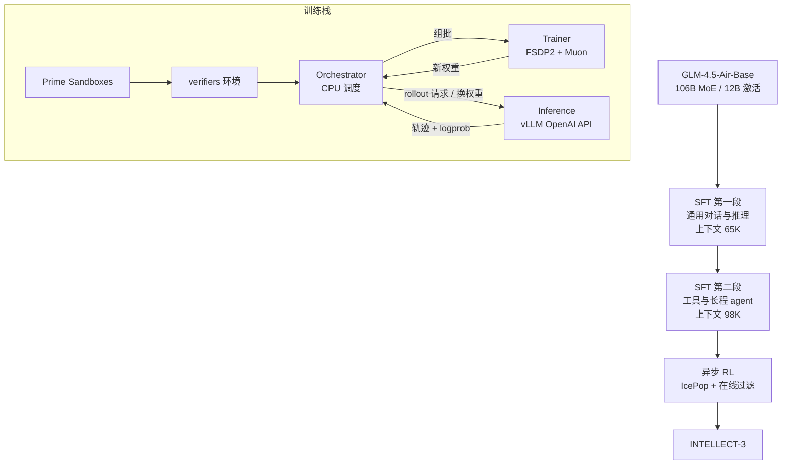
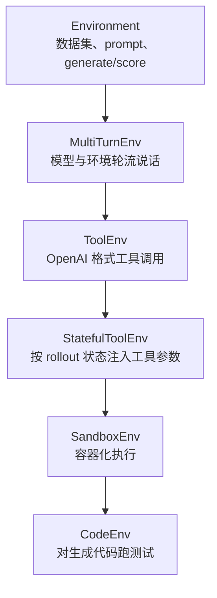

# INTELLECT-3：开源 RL 栈把 12B 激活训到能跟更大模型比

<!-- release-date: 2025-11-26 -->

> 本文依据 Prime Intellect 发布的 **INTELLECT-3: Technical Report**，即 arXiv:2512.16144v1（2025-12-18），共 27 页。截至核验 arXiv 只有 v1，本地原件无需更换。页码均指 PDF 本身。全文把三件事分开标注：**报告明确写了什么**、**我们如何解释或验算它**、**哪些是外部资料补充**。

## 读之前需要的最少背景

这篇报告同时讲两样东西：一个 106B 的混合专家模型，和把它训出来的那条开源强化学习栈。模型本身没有新架构。真正要读懂的，是训练时那几个会反复出现的词。

- **Token（词元）**：模型读写文本的最小单位。一个汉字、英文单词或标点，都可能被切成一个或多个 Token。
- **MoE（Mixture-of-Experts，混合专家）**：不是每次把全部参数都跑一遍，而是每个 Token 只激活一小部分专家。INTELLECT-3 总参数 106B，每次大约只激活 12B（PDF p. 1）。
- **基座 / 后训练**：基座只学会「预测下一个词」。后训练再把它变成会对话、会推理、会调工具的模型。INTELLECT-3 的起点是 GLM-4.5-Air 的**基座**，不是已经后训练好的官方 Air（PDF p. 4、p. 13）。
- **SFT（Supervised Fine-Tuning，监督微调）**：照着标准轨迹学。RL 之前先走两段 SFT（PDF p. 15）。
- **RLVR（Reinforcement Learning with Verifiable Rewards，可验证奖励的强化学习）**：让模型自己写答案，再用程序判对错，据此更新参数。数学对最终答案，代码跑测试，软件工程跑仓库测试套件。
- **Rollout（轨迹生成）**：模型按当前策略实际生成一整条回答。生成出来的「题目 + 回答」叫一条轨迹。
- **On-policy / off-policy（在策略 / 离策略）**：训练数据是不是**当前这份参数**自己生成的。异步系统里，生成侧还在用旧权重写，训练侧已经在更新新权重，数据必然是离策略的。
- **重要性比（importance ratio）**：同一个 Token，当前训练策略给出的概率，除以生成它时那个策略给出的概率。这个比值离 1 太远，样本就不该再被信任。
- **FSDP（Fully Sharded Data Parallel，全分片数据并行）**：把参数、梯度和优化器状态切到多张卡上，用来在有限显存里训大模型。
- **Muon**：一种矩阵级优化器。它不像 Adam 那样逐元素更新，而要对整张梯度矩阵做 Newton-Schulz 正交化。GLM-4.5 预训练用的就是它。本站 [Muon 解读](/reports/Moonshot/Muon-is-Scalable-for-LLM-Training) 讲它的出处。

报告自己反复出现的四个名字：

- **prime-rl**：异步强化学习训练框架。训练和推理分开放在不同 GPU 上。
- **verifiers**：把「环境」做成可安装 Python 模块的库。环境对 RL 的意义，相当于数据集对 SFT。
- **Environments Hub**：这些环境的公开注册表，可钉版本、可独立评测。
- **Prime Sandboxes**：给代码和软件工程任务用的高吞吐隔离执行层。

## 一句话先说清

开源社区并不缺「用强化学习训过的权重」。缺的是一条别人能拿去改、能在几百张卡上跑起来、还能把环境和评测一起复现的流水线。

INTELLECT-3 要证明的是后半句：

> **同一份 12B 激活的 MoE 基座，只要后训练栈够用，就能在数学和代码上超过官方后训练，并在部分推理基准上接近大几倍的模型。**

模型是这条栈的产物，不是另一张从零预训练的模型卡。架构来自 GLM-4.5-Air-Base；报告的贡献在 prime-rl、verifiers、沙箱和那份可公开的配方（PDF p. 4、p. 19）。

它给出的最硬数字是：AIME 2024 / 2025 为 90.8 / 88.0，LiveCodeBench v6 为 69.3，相对官方 GLM-4.5-Air 后训练分别高 6.2、6.0、7.8 个百分点（PDF p. 4、p. 19，Table 2）。引言把 LiveCodeBench 的领先写成 8%（PDF p. 4），与 7.8 的百分点差是同一件事的四舍五入。

不要把这句话读成「12B 激活全面超过所有更大模型」。Table 2 里它在 GPQA、HLE 上仍落后 DeepSeek V3.2，在 LiveCodeBench 上也没有超过 GLM-4.6。**同尺寸全面领先是被表格支持的；选择性追上更大模型，也是被表格支持的。两者不是同一句。**

## 全景：四个组件，两段后训练

这张图按 PDF p. 5 的 Figure 2 与第 3 节重画，是机制示意，不含时间比例。原图把训练侧和推理侧画成两组各 8 张 GPU 的方阵，中间一个 CPU 菱形做编排。

整条后训练，包括多次消融，跑在 512 张 H200、64 个节点上，历时两个月（PDF p. 13）。SFT 用满 512 张卡（PDF p. 16）。主 RL 跑用 60 个节点、约 1:3 的训练/推理划分，也就是 16 个训练节点对 44 个推理节点（PDF p. 17）。摘要写「RL 训练扩到 512 H200」（PDF p. 1），正文给出的主 RL 配置是 480 张卡。集群规模是 512，主 RL 作业没用满。

## 第一层矛盾：开源的是权重，不是流水线

报告开篇把 2025 年的局面写得很干脆。用可验证奖励做大规模强化学习，已经是后训练的主流，o3、Grok 4、DeepSeek R1 都走这条路（PDF p. 4）。开源权重也并不弱。

弱的是栈。

现有的开源 RL 框架常常复杂、单体、缺少模块化，改环境要进训练仓库，评测和训练对不上，研究项目被框架本身拖慢，生态制品也跟着碎片化（PDF p. 4）。报告点名的对照是 HybridFlow 那一类系统（参考文献 [43]）。本站 [HybridFlow 解读](/reports/ByteDance/HybridFlow) 讲的就是 verl：它解决的是「四个模型之间谁指挥谁」，默认执行模型仍是同步的 `for` 循环。

INTELLECT-3 给自己列了五条能力，作为对那条缺口的回答（PDF p. 4）：

1. 一等公民支持 OpenAI 兼容的异步推理、verifiers 环境，以及公开的 Environments Hub；
2. 同一套框架覆盖 SFT 和多轮 agentic RL；
3. 多节点部署：FSDP2 训练，vLLM 推理；
4. 天生异步，带连续组批和飞行中权重更新；
5. 模块化，方便改。

这五条里，模型架构一条都没有。读到这里就该换预期：后面的主体是系统，模型分数是系统跑出来的验收单。

## 核心设计一：prime-rl，异步不是选项

### 旧问题：最长的那条轨迹，会把整批 GPU 按在原地

推理模型和 agent 环境有一个很具体的形状：同一批题目里，有的几百 Token 就结束，有的要写几万 Token，还要中途调工具。传统系统先发出 $n$ 个 rollout 请求，然后**等最慢那条写完**才放行一个训练批次（PDF p. 6）。

短的那些先写完，占着的推理位置却空着。长度方差越大，空得越厉害。报告说，复杂 agent 环境里这种方差是常态（PDF p. 6）。

本站 [AReaL 解读](/reports/AntGroup/AReaL) 把同一件事写成同步 RL 的第一笔亏损。AReaL 还把 INTELLECT-2 归进「一步重叠、但仍按整批换权重」那一类。INTELLECT-3 这篇把连续组批和飞行中更新明确写成向 AReaL 与 PipelineRL 学来的做法（PDF p. 6，引 [11]、[37]）。**它不声称发明了异步，它声称把异步做成了这条开源栈的默认，并且推到了 100B+ MoE。**

外部补充：官方博客把 prime-rl 写成 **async-only**，并回溯到 INTELLECT-2 就已经认定「未来的 RL 一定是异步的，也就是总会偏几步 off-policy」。这句话在 PDF 正文里没有以 async-only 的口号出现，博客原文见 [INTELLECT-3: A 100B+ MoE trained with large-scale RL](https://www.primeintellect.ai/blog/intellect-3)。

### 三个角色：编排器必须轻

一次训练由三个抽象配合（PDF p. 5，Figure 2）：

| 角色 | 跑在哪 | 干什么 |
|---|---|---|
| Orchestrator（编排器） | CPU | 收轨迹、打包装批、把新权重从训练侧转到推理侧；用 verifiers 抽象多轮生成和打分 |
| Trainer（训练器） | GPU，FSDP2 | 吃批次和优势，更新策略；兼容任意 HuggingFace 模型 |
| Inference（推理池） | 另一组 GPU，vLLM | 对外是 OpenAI 兼容 API；另加 `/update_weights` 换策略、`/reload_weights` 打回基座 |

训练和推理**解耦**，放在不相交的 GPU 上，生成和更新才能重叠（PDF p. 5–6）。因为推理侧只是一组 OpenAI 兼容服务，报告说它可以接到多个引擎的共享请求池上，也就可以跨集群、换 SGLang 或 Tokasaurus（PDF p. 5）。正文没有展示这种多引擎部署的实测。

编排器做的是双向中转，不碰大块权重计算：一边把 rollout 收成 packed batch 送给训练器，一边把新权重转给推理池（PDF p. 5）。这个分工和 AReaL、HybridFlow 是同一类判断：**中枢必须轻，否则它自己会变成瓶颈。** 这是我们的对照，不是报告的原话。

### 一步 off-policy 只是起点

报告用一个理想化时间轴把同步和异步的差别画出来（PDF p. 6，Figure 3）。记号很干净，值得跟一遍。

每一步用步号 $n$ 标记。训练侧有梯度 $g_n$ 和权重 $\theta_n$，推理侧有轨迹 $(x_n, y_n)$。

第 0 步：推理侧用 $\theta_0$ 生成 $(x_0, y_0)$，训练侧用它算出 $g_0$，更新 $\theta_1 \leftarrow \theta_0 - g_0$。

如果必须在策略，推理侧生成完 $(x_0, y_0)$ 就得停，等 $\theta_1$ 到了才能继续。一步 off-policy 的做法是：训练侧在算 $\theta_1$ 的同时，推理侧继续用 $\theta_0$ 生成 $(x_1, y_1)$。

Figure 3 的假设是训练一步的时间和推理一步的时间相等。图注写：第 $n$ 步，推理引擎用的策略不旧于 $\theta_{\min(0,n-1)}$（PDF p. 6）。在这个理想化图里，离策略程度被钉在一步。

真实训练不是这个图。后面的连续组批会让**一条轨迹内部**都跨多个策略版本。一步 off-policy 只是用来建立直觉的最小例子。

### 连续组批：空出来的槽立刻补上

飞行中更新要解决的是第二件事：权重到了，正在写的那些轨迹怎么办。

编排器上跑着两个异步循环（PDF p. 6）：

**飞行中权重更新（in-flight weight updates）。** 编排器不停问训练器有没有新策略。有了就把推理池暂时打断、灌入新权重，然后让没写完的轨迹接着写。于是**一条轨迹可以由多个策略共同生成**。离策略程度用 `max_off_policy_steps` 卡住：被太多代策略写过的轨迹直接丢掉，防止策略漂太远（PDF p. 6）。

**连续组批（continuous batching）。** 编排器维持一个很大的并发 rollout 池。一个 rollout 组写完，它的槽立刻被新请求填上。池子保持饱和，推理侧不必等「整批对齐」这条同步边界（PDF p. 6）。

Figure 4 把这件事画成几条长短不一的水平线段，竖线是策略切换 $\pi_{t-2}$、$\pi_{t-1}$、$\pi_t$（PDF p. 7）。有的线段整段落在一次切换之间，有的被竖线切开。被切开的那些，就是「一条轨迹、多个策略」。

主 RL 配置里，这个上限被设成 8（PDF p. 17）。报告后来说，关掉飞行中更新之后，65,536 长度下的步时增加超过 2 倍，因为推理效率明显变差（PDF p. 17）。**这是全文最直接的系统消融：同一个 65K 设置，飞行中更新值一个大于 2 倍的步时。** 它没有把这个 2 倍拆成「KV 重算多少、空闲多少、组批效率多少」。

可迁移的一条：长尾生成场景里，「等齐再换权重」和「写到一半就换权重」是两个完全不同的系统。后者买到的是推理利用率，付出的是轨迹内部版本不统一。算法必须能消化这件事，否则系统不敢换。

### 多客户端编排：vLLM 自带的跨节点数据并行不够用

推理扩到几百张 GPU 时，报告发现 vLLM 标准的多节点数据并行没有给出预期的吞吐增益，节点一多就迅速平台化（PDF p. 7）。

他们的替换方案很粗暴：每个推理节点做成完全独立的服务，编排器给每个节点维持一个客户端，按 round-robin 分发 group rollout 请求，节点之间不同步（PDF p. 7）。报告说，这样推理吞吐随节点数线性增长。

正文没有给出平台化时的节点数、吞吐曲线，也没有给出线性段的斜率。能带走的是判断，不是数字：在他们的负载下，**「一个逻辑上的多节点推理引擎」不如「一群互不理睬的单节点服务」**。编排器自己做分发，换掉了引擎内部的跨节点同步。

### 在线过滤：课程必须跟着模型长

有效的 RL 需要难度合适、并且逐渐变难的课程。离线筛一遍不够，他们又做了在线过滤（PDF p. 7）。

题目按观测到的解出率分成 easy / normal / hard 三个池。每一步从各池抽多少可以调，避免整批都太简单或都太难。同时有一道在线难度过滤器，丢掉「模型永远失败或永远做对」的 rollout，只留下有学习信号的（PDF p. 7）。

主 RL 里这套被具体化成：在线难度过滤，加上一个 easy 池，**解出率为 1 的 prompt 不再被采样**，因为它们不再提供学习信号（PDF p. 17）。各池的采样比例、hard 池的入池阈值，正文没有给。

### 序列长度：上下文并行试过了，留下的是激活卸载

RL 过程中生成长度会自然变长，报告引的是 DeepSeek-R1（PDF p. 7，引 [8]）。他们的训练设置里，FSDP 度数 32、激进的激活重计算、Flash Attention 3，可以做到 48K（PDF p. 7）。更难的环境需要至少 64K。两条路都试了。

**上下文并行（Context Parallelism，CP）。** 序列一长，注意力分数矩阵变成显存大头。FlashAttention 不够时，就把注意力算力切到 $N_{\text{cp}}$ 张卡上，常用实现是 Ring Attention：每张卡拿一段 Q、K、V，再轮转 K/V（PDF p. 7–8）。他们用 $N_{\text{cp}}=2$ 把长度撑到 256K，但数据并行度数被减半，并且出现精度下降，**不适合生产训练**（PDF p. 8）。当时 PyTorch 里面向 FlexAttention 的实现还是实验性质。

**激活卸载。** 他们用的是全量激活重计算：只保留每层 decoder 的输出和顶层激活，中间激活反向时重算。忽略顶层激活，48K 序列、隐藏维度 4096、46 层 decoder 的激活显存是（PDF p. 8）

$$
\mathrm{Mem}_{\mathrm{act}} = 46 \times (48{,}000 \times 4{,}096) \times 2\ \text{bytes} \approx 18\ \text{GB}.
$$

我们验算：$46 \times 48{,}000 \times 4{,}096 \times 2 = 18{,}087{,}936{,}000$ 字节，约 16.8 GiB，和报告的「约 18 GB」按十进制一致。

他们基于 torchtune 把激活卸到 CPU，同一套硬件配置下把长度做到 72K，且 **MFU 没有下降**（PDF p. 8）。异步卸载在 CUDA stream 上有内存泄漏，于是改用同步实现，MFU 大约掉 0.1%，报告认为可以忽略。

主 RL 的最大上下文是 65,536（PDF p. 17），落在 72K 这条能用的路径上，而不是 256K 那条伤精度的 CP。SFT 第二段又把 CP 请回来，做到 98K（PDF p. 16）——那是监督微调，不是 RL 的生产路径。两处不要混。

隐藏维度 4096、约 46 层，和 GLM-4.5-Air 对得上。外部补充：本站 [GLM-4.5 解读](/reports/Z.ai/GLM-4.5) 的 Table 1 里，Air 是 Hidden Dim 4096、MoE Intermediate 1408、1 个稠密层 + 45 个 MoE 层 + 1 个 MTP 层。1+45=46，正好对应这里不计 MTP 的 decoder 层数。INTELLECT-3 报告没有重列架构表。

### 分布式 Muon：矩阵级更新和 FSDP 分片是冲突的

引用 [25] 的结论：如果预训练用的是 Muon，后训练接着用 Muon 效果最好（PDF p. 8）。Muon 在矩阵级做 Newton-Schulz，必须看到完整梯度张量。FSDP 把梯度切碎了，不能直接套。每张卡都 all-gather 全量梯度再重复算一遍 Muon，贵到不能接受（PDF p. 8）。

他们试过两种分发。

第一种是重叠的 round-robin：每个 rank 按自己的编号 gather 一部分 FSDP 分片，本地做 Newton-Schulz，再 scatter 回去。计算可以并行，通信也可以藏。但多节点规模一大，大量重叠的 gather 会把 InfiniBand 堵死（PDF p. 8）。

第二种改用 all-to-all，把梯度分片重新洗牌，不再发许多独立的 gather。灵活性差一些，张量可能要 padding，但能避开拥堵。主训练用的是这个，实现来自开源的 Dion（PDF p. 8，引 [2]）。

可迁移的一条：优化器的数学假设（「我能看到整张矩阵」）和并行策略的数学假设（「每张卡只拿一片」）会打架。能打补丁的时候先打补丁；补丁在规模上翻车，就要换集体通信原语，而不是把 gather 写得更勤。

### MoE：这个尺度上，专家并行是负优化

训练侧的 MoE 层来自 torchtitan，用 grouped matrix multiplication 内核，并且带着专家并行（EP）支持（PDF p. 8）。他们开过 EP，吞吐更差，所以主训练没开。归因是：每张卡上的序列长度和隐藏维度已经比较大（PDF p. 8）。

Figure 5 把这句话画成了两条曲线（PDF p. 9）。设定是 `torch._grouped_mm`、隐藏维度 4096、MoE 维度 1408、H200 SXM，并假设 Token 在专家之间完全均匀。专家数 $E$ 增加时，每个专家分到的 Token 按比例变少。工作量小到喂不饱内核，TFLOPS 就会掉。

图注写：序列长度 $N$ 为 32,768 和 65,536 时，TFLOPS 在专家数到 128 之前都还停在饱和区。所以按他们的训练参数，专家并行换不来明显吞吐（PDF p. 9）。EP 在这个区只会增加 scatter/gather，却减不掉 grouped gemm 的时间。报告也留了口子：序列更短、隐藏维度更小，或用了会摊薄单卡工作量的 CP/TP 时，EP 才可能划算（PDF p. 8）。

外部补充：GLM-4.5-Air 的路由专家数正好是 128，每 Token 激活 8 个，另加 1 个共享专家。Figure 5 的「128 个专家仍饱和」几乎是对着这块硬件说的。这是我们把两篇报告对上的，INTELLECT-3 正文没有写专家数。

为了跟 HuggingFace 以及 vLLM 兼容，训练侧 torchtitan MoE 的 state dict 在广播到推理侧时会当场转成 HF 的 MoE 布局（PDF p. 8）。这是一条很小但很关键的工程缝：训练内核和推理内核不必同源，只要权重在飞的路上能对上。

他们还记录专家负载的 MaxViolation（PDF p. 9）

$$
\mathrm{MaxViolation}=\max_i\frac{\mathrm{Load}_i-\overline{\mathrm{Load}}}{\overline{\mathrm{Load}}},
$$

引用的是 DeepSeek 无辅助损失负载均衡那篇。指标用来看 MoE 层相对理想均衡慢了多少。报告没有给出训练过程中这个量的曲线。

## 核心设计二：verifiers，环境不该写进训练仓库

报告把环境和训练基础设施拆开，类比的是：环境之于 RL，就像数据集之于 SFT 或预训练（PDF p. 9）。拆开才能独立开发、测试、版本化。

### 一个环境是什么

verifiers 里的环境是可安装的 Python 模块，四件套（PDF p. 9）：

1. **数据集**：每行一个任务，带 prompt 和打分所需的元数据（标准答案、测试用例）；
2. **rollout 方法**：吃一行数据和一个 OpenAI 兼容推理客户端，一直交互到终止条件，收集 token id、logprob 等训练需要的东西；
3. **Rubric**：一个或多个奖励函数，可以按单条轨迹打，也可以按组打；
4. **`load_environment`**：实例化入口，负责预处理和资源准备。

Rollout 用 asyncio 并发，推理请求、工具调用、奖励函数各自等待，互不等别的 in-flight 轨迹（PDF p. 9）。并行发生在好几层：推理 worker、API 客户端、环境进程，再加一个中心编排器。他们用细粒度信号量节流，既要让推理 worker 忙着，又要少触发 KV Cache 驱逐（PDF p. 9–10）。

Rubric 可以加权组合多个奖励，也可以嵌套（例如格式检查加 LLM judge），还可以覆盖成组间比较：投票、排序、相对打分（PDF p. 10）。评测和训练走同一套 rollout 与 Rubric 入口，在线或离线都可以（PDF p. 10）。

### 继承链：CodeEnv 不是从零写出来的

Figure 6 把 `primeintellect/i3-code` 的类层次画成一串向下的箭头（PDF p. 10）。原图把最具体的 `CodeEnv` 放在最上面。按「谁继承谁」重画，更顺的顺序是：

这是根据 PDF p. 10 Figure 6 重画的机制示意。每一层只加一件事：多轮、工具、有状态的工具参数、沙箱、测试用例。自定义环境从合适的那一层继承，覆盖终止条件和环境回复即可（PDF p. 10）。

### 和 prime-rl 怎么接

环境作为独立模块从 Environments Hub 安装。可以先对着本地或 API 模型单独开发、测试，再推上 Hub，训练代码不用改（PDF p. 10–11）。编排器按 Python 模块名加载，灌入 batch 和推理客户端，收回奖励、token id、vLLM 直接给出的 logprob，以及 attention mask（PDF p. 10–11）。

多环境训练靠 verifiers 的 `EnvGroup`：多个环境合成一个对象，数据集拼在一起，用注入的 task ID 把 rollout 和打分路由到对应子环境。INTELLECT-3 同时在许多环境上训练，编排器在 `EnvGroup` 实例化之后不必再写任何多环境代码（PDF p. 11）。

Hub 要解决的，是「环境躺在训练仓库子目录里」带来的版本、消融和外部贡献摩擦（PDF p. 11）。环境被打成带可钉依赖和统一入口的 Python 包，可以在训练代码之外版本化、分享、测试。

在线评测时，编排器把评测请求和训练请求异步交错，走同一组推理池，把评测开销藏进训练气泡里，同时拿到实时分数（PDF p. 11）。Figure 9 那些训练中的基准曲线，就是这条通路的产物。

## 核心设计三：Prime Sandboxes，控制面扛不住每秒几千次 exec

Agent 编码环境要在几千条并发轨迹里执行不可信代码，需要亚秒级开通、毫秒级执行（PDF p. 11）。Kubernetes 提供容器原语，但常规用法不够。

### 朴素路径为什么会到 2.5 秒

标准写法是：训练循环用客户端起临时 Pod，用 `kubectl exec` 跑命令。这条路径要把 HTTP 升级成 WebSocket，再经 Kubelet 转到容器运行时。执行本身该是毫秒级，编排开销却是秒级（PDF p. 11）。

每个命令都是一次要记日志、要写入 etcd 的认证 API 请求。etcd 是 Kubernetes 存集群状态的分布式键值库，写操作必须串行加锁。并发沙箱到几千时，他们测到**单次命令延迟冲到 2.5 秒**，瓶颈是 API Server 饱和与 etcd 写锁（PDF p. 11）。

注意比较口径：2.5 秒是朴素路径的**每条命令**延迟；后面 Prime Sandboxes 给出的小于 10 秒，是**冷启动到可用**的端到端时间。两件事不是同一个量。报告没有给出 Prime Sandboxes 单次 exec 的毫秒数。

### 关键路径绕开 Kubernetes API

Prime Sandboxes 把执行循环从 Kubernetes API 上拆下来（PDF p. 11–12）：

1. 一层高性能 Rust Gateway，用轻量 HTTP 接收执行请求；
2. 不走 kube-proxy，而是通过 Headless Service 用 DNS 解析到 Pod 的直连 IP；
3. 成千上万个短命 Pod 会把标准 CoreDNS 打满，于是他们部署了针对高 churn 优化的 CoreDNS；
4. Pod 内是 Sidecar：特权 sidecar 当执行代理，收到请求后用 `nsenter` 把命令注入目标命名空间。

报告的说法是：本地起进程的速度，加上完整容器隔离（PDF p. 12）。

### 就绪信号改成推，不要去问控制面

「沙箱好了没」如果去轮询 Kubernetes API，或者让 Kopf 这类控制器按顺序消化事件，高并发时就绪信号会晚到：Pod 其实已经起来了，系统却几秒后才说 Ready（PDF p. 12）。Kopf 被他们只用来做错误处理和资源回收这类异步维护。

就绪改成 sidecar 在可运行的瞬间直接 webhook 到训练后端。冷启动——从请求到任意用户镜像的沙箱可用——在任何集群负载下都小于 10 秒；预热好的标准运行时镜像则「几乎瞬时」（PDF p. 12）。

### 镜像和密度

上千个沙箱同时拉公共仓库，会撞速率限制，也会把节点网卡打满，启动被拖到分钟级（PDF p. 12）。他们用两层分发：

- 私有高吞吐仓库 + 镜像流式加载（lazy pulling）：只先拉入口进程需要的块，其余后台流，沙箱可以在镜像还没全部落地时就开始工作；
- 静态运行时（例如标准 Python）维持 warm pool，训练循环拿沙箱时不再付拉镜像和初始化的账（PDF p. 12）。

下面是自定义的 Cluster Autoscaler 和装箱调度，目标装箱密度 **每节点 256 个沙箱**，QoS 用 Burstable：要一份保底 CPU，空闲时可以超卖。RL 里沙箱本来就是「短暂执行、长时间等待」，超卖吃的是等待窗口（PDF p. 13）。

运行时是 gVisor（runsc），用户态内核隔离不可信代码，并配可配置的网络策略。架构还支持对外暴露任意 TCP/UDP 端口，以及给需要自定义 GPU 内核的环境挂 GPU（PDF p. 13）。正文没有给出挂 GPU 沙箱的训练实验。

代码环境训练时，异步隔离执行靠 **超过 4000 个并发沙箱**（PDF p. 14）。SWE 环境则在自定义仓库里托管 **超过 20,000 个预装好 GitHub 仓库的镜像**，用来把 rollout 做成「几乎瞬时」（PDF p. 15）。沙箱失败时，对应的模型 completion 被 mask 掉，生成取消（PDF p. 14–15）。

可迁移的一条：RL 沙箱的瓶颈往往不在「能不能跑 Python」，而在控制面的每秒 API 次数、DNS 更新速率和镜像分发。把执行路径从声明式控制面里抽出来，是规模从几十跳到几千时几乎必然要做的事。代价是：你不再完全活在 Kubernetes 的安全与可观测模型里，要自己补 Gateway、sidecar 和推送就绪。

## 核心设计四：512 张 H200 先得活过硬件故障

集群是 512 张 NVIDIA H200，64 个互联节点。报告把主要工程挑战写成：在容易出硬件故障的分布式系统上维持确定性和同步（PDF p. 13）。

**供给和网络。** 严格 Infrastructure as Code，幂等 Ansible，动态发现硬件并自动生成防火墙。分布式训练性能被 AllReduce 的尾延迟绑死，所以用 400Gbps NDR InfiniBand（NVIDIA ConnectX-7），每次开跑前先验证吞吐，目标 $\ge 160$ GB/s。性能掉了，就自动二分查找，隔离带故障收发器的掉队节点（PDF p. 13）。

160 GB/s 是报告写的验收线，不是单端口的理论带宽。400 Gbps 单口大约 50 GB/s。节点内部如何把多口叠到 160 GB/s，正文没画。

**编排。** Slurm 加 Cgroup v2：作业结束时内核冻结并清掉整棵 cgroup，避免僵尸进程占着 GPU 显存。报告说这是「容器级隔离，但不付文件系统那一层开销」（PDF p. 13）。

**存储。** 分层：Lustre 走高吞吐（训练轨迹、数 TB 的 checkpoint）；NVMe 上的 NFS 走元数据重的用户环境和无密钥 SSH（PDF p. 13）。

**观测。** DCGM 的 GPU 遥测进 Prometheus，对 Xid 错误和热降频做告警，在故障节点污染训练之前先 drain（PDF p. 13）。

这些都是能跑多周任务的运维清单，不是算法。报告没有给出这次两个月里实际 drain 了多少节点、checkpoint 写了多快、AllReduce 是否稳定在 160 GB/s 以上。

## 训练 INTELLECT-3：环境、SFT、然后才是 RL

基座是 GLM-4.5-Air base。后训练两段：SFT，再大规模 RL。环境和评测全部来自 Environments Hub 上的开源环境（PDF p. 13）。

### 六类环境

报告按领域写了六类。难度标注几乎是同一套办法：找一个小的 Qwen3 模型，每题生成 8 或 16 次，用平均解出率当难度，再在后训练各阶段滤掉太简单的。

**数学**（`primeintellect/i3-math`）。21.2K 道难题，来源是 Skywork-OR1、Acereason-Math、DAPO、ORZ-Hard。先用 math-verify 抽最终答案对标准答案。规则验证有不可忽略的假阴性，于是所有被规则判错的样本再过一遍 `opencompass/CompassVerifier-7B` 做 LLM judge。难度用 `Qwen/Qwen3-4B-Thinking-2507` 每题 8 次生成的平均解出率（PDF p. 14）。

**代码**（`primeintellect/i3-code`）。单轮 Python 编程题，灵感来自 DeepCoder，数据大量用他们的 SYNTHETIC-2。每题最多 15 个测试用例，在 Prime Sandboxes 里跑。8.6K 条样本，难度用 `Qwen/Qwen3-4B-Instruct-2507` 每题 8 次（PDF p. 14）。

**科学**（`primeintellect/i3-science`）。物理、化学、生物等，验证同样是 math-verify 加 LLM judge。29.3K 道题来自 MegaScience，难度用 Instruct-2507 每题 16 次（PDF p. 14）。

**逻辑**（`primeintellect/i3-logic`）。29 种逻辑任务、谜题和游戏，例如布尔表达式、填字、数独、扫雷。11.6K 题和验证器改编自 SynLogic，难度同样 16 次（PDF p. 14）。

**Deep Research**（`primeintellect/deepdive`）。给模型四个工具：search（Serper 返回带编号的搜索结果）、click（按编号取页面 markdown）、open（按 URL 取页面）、finish（交最终答案）。对了得 1，错了得 0。后续搜索的冗余惩罚可选，他们设成 0。数据来自 z-AI 的 DeepDive：知识图谱上抽的多步问题，1K 条用于 SFT 轨迹，2.2K 条用于 RL（PDF p. 14）。

为了验证环境本身能训，他们在 `Qwen/Qwen3-4B-Instruct-2507` 上做了一次小规模验收：DeepDive 公开轨迹 SFT 26 步、batch 34，共 884 条；再 RL 122 步，组大小 16，总 batch 512。Figure 7 的平均奖励从大约 0.1 爬到大约 0.7（PDF p. 15，读自 Figure 7）。这只证明环境能给 4B 模型提供可学信号，不是 INTELLECT-3 自己的 Deep Research 分数。INTELLECT-3 的主评测表里没有 Deep Research 基准。

**软件工程**（`primeintellect/deepswe` 与 `primeintellect/mini-swe-agent-plus`）。两套改过的 agent 脚手架：R2E-Gym 和 mini-swe-agent-plus；三套沙箱 harness，覆盖 R2E-Gym、SWE-smith、Multi-SWE-bench 常见的数据集、镜像和测试套件格式。R2E-Gym 里他们把 `finish()` 换成 `submit()`，因为 `result` 参数内部没用、模型却会啰嗦地调。mini-swe-agent-plus 改了 prompt，用工具调用替换代码块解析，以适配原生 reasoning 和 tool use。沙箱里 agent 浏览给定 GitHub 仓库、修 issue，工具是 Bash 和文件编辑，最多 200 轮。提交后跑仓库测试套件，看该由失败变通过的测试是否变了（PDF p. 15）。

主评测表同样没有 SWE-bench。SWE 环境写进了配方，没有写进 Table 2。这是报告自己留下的缺口，不是我们补的分数。

### 两段 SFT：先推理，再 agent

RL 之前两段互补的 SFT。第一段做大规模通用对话和推理；第二段做工具使用和长程 agent。两段合起来给 RL 一个稳的行为先验（PDF p. 15）。

**第一段：通用推理 SFT。** 两个主数据源是 NVIDIA Nemotron-Post-Training-Dataset-v1 的 math / code / science / tool 分片，以及 AM 的 AM-DeepSeek-R1-0528-Distilled 的 chat 与 instruction following 分片。两者都含 DeepSeek-R1-0528 合成的推理轨迹。训练时保持数据集的自然比例。一整轮，每步约 33M Token，上下文 65K。优化器是 Muon，weight decay 0.01，学习率 $5\times 10^{-5}$，从 $1\times 10^{-8}$ 线性 warmup 300 步。FSDP world size 64，DP replicate size 8，铺满 512 张 GPU（PDF p. 15–16）。

Table 1 把数据写成 OpenReasoning-* 和 AM 两套名字（PDF p. 16）：

| 数据集 | 样本数 | Token 数 | 第一段 | 第二段 |
|---|---:|---:|:---:|:---:|
| OpenReasoning-Math | 2M | 78.1B | ✓ | ✓ |
| OpenReasoning-Code | 1.9M | 94.3B | ✓ | ✓ |
| OpenReasoning-Science | 310K | 32B | ✓ | ✓ |
| OpenReasoning-Tool | 800K | 3.8B | ✓ | ✓ |
| AM General Chat | 952K | 8.4B | ✓ | ✓ |
| AM Instruction Following | 54K | 400M | ✓ | ✓ |
| SWE Swiss | 10.3K | 700M |  | ✓ |
| Toucan Tool | 116K | 700M |  | ✓ |
| Environments Mix | 38.4K | 1.9B |  | ✓ |

正文称第一段主源是 Nemotron-Post-Training-Dataset-v1，表头却写 OpenReasoning-*。报告没有解释这两个名字如何对应。我们不把表里的 OpenReasoning 自动改写成 Nemotron。

第一段表内 Token 合计约 217B（本文把 78.1+94.3+32+3.8+8.4+0.4 加总）。若按「每步 33M Token」和 Figure 8(a) 横轴大约 1400 步来换算，大约是 46B Token，对不上 217B。可能的原因包括：表是来源池而不是实训量、做了过滤、图没有画完。**报告没有对账，本文也不猜。** 能写进正文的只有：表给出了池子规模，正文给出了每步 Token 和优化器，损失曲线画到了约 1400 步。

**第二段：agentic SFT。** 更小，针对工具、长程状态和超长序列。数据包括 SWE-Swiss、Toucan Tool，以及用 DeepSeek-R1-0528 从 Environments Hub 上其他环境合成的轨迹。统一工具调用格式，过滤成英文，对齐训练器（PDF p. 16）。这一段还有一个附带目的：把有效上下文推过 65K。他们用上下文并行做到 98K。从第一段最终 checkpoint 接着训两个 epoch，Muon 学习率 $5\times 10^{-8}$，在全部 800 步上线性衰减（PDF p. 16）。

Figure 8 两条损失曲线都被报告写成「平滑、无 loss spike」（PDF p. 16）。读图的观察（本文，不是报告的读数表）：第一段从大约 0.39 降到大约 0.33；第二段从大约 0.6 降到大约 0.2，约 400 步处有一次更陡的下降。第二段起点比第一段终点高，符合换了 agent 数据和更长上下文之后的分布偏移。400 步处的陡降，报告没有解释。

**Chat template。** 写法受 Qwen3 和 GLM 家族启发，角色用 `<|system|>`、`<|user|>`、`<|assistant|>`，轮次用 `<|im_start|>`、`<|im_end|>`，工具调用是 XML 风格标签（PDF p. 16）。模型**永远思考**，没有对用户暴露的 reasoning-effort 开关。这是两件事叠出来的：SFT 轨迹以 reasoning-only 为主；chat template 会补上 `<|think|>`（PDF p. 17）。推理时要用 `qwen3_coder` 工具解析器和 `deepseek_r1` reasoning 解析器。多轮时模板会自动解析 `reasoning_content`，思考链不用手拼（PDF p. 17）。

### RL：256 题 × 16 条，算法改成 IcePop

主 RL 配置写得很具体（PDF p. 17）：

- 256 个 prompt，每个 16 条 rollout，最大上下文 65,536；
- 在线难度过滤；easy 池去掉解出率为 1 的题；
- `max_off_policy_steps = 8`；
- Muon 学习率 $1\times 10^{-6}$；
- 数据配比「仔细调过以平衡各域」，**具体比例没给**；
- 60 节点 × 8 张 H200；训练 16 节点、推理 44 节点，约 1:3；
- 65,536 长度、开飞行中更新时，步时约 1500 秒；关掉则步时增加超过 2 倍。

1500 秒一步，大约 25 分钟。Figure 9 的横轴大约走到 600 步（PDF p. 18）。若按 600 × 1500 秒换算，大约 250 小时、十天出头。这是本文用图上步数乘正文步时得到的，报告没有写总 RL 步数或总墙钟。

**算法。** 他们采用带掩码的 token 级重要性采样，引用 IcePop（PDF p. 17，引 [55]）。对一批 $N$ 条 rollout：

$$
\mathcal{J}_{\mathrm{IcePop}}(\theta)
=
\mathbb{E}_{x\sim\mathcal{D},\,\{y_i\}_{i=1}^{N}\sim\pi_{\mathrm{infer}}}
\left[
\frac{1}{\sum_{i=1}^{N}|y_i|}
\sum_{i=1}^{N}
\sum_{t=1}^{|y_i|}
\mathcal{M}\!\left(
\frac{\pi_{\mathrm{train}}(y_{i,t}\mid x,y_{i,<t};\theta)}
{\pi_{\mathrm{infer}}(y_{i,t}\mid x,y_{i,<t};\theta_{\mathrm{old}})};
\alpha,\beta
\right)
\hat A_{i,t}
\right]
$$

掩码是硬切，不是裁剪：

$$
\mathcal{M}(k)=\begin{cases}
k & \text{若 }k\in[\alpha,\beta]\\
0 & \text{否则}
\end{cases}
$$

$\pi_{\mathrm{infer}}$ 是生成这条轨迹的策略，$\pi_{\mathrm{train}}$ 是当前训练策略。默认 $\alpha=0.5$、$\beta=5$（PDF p. 17）。Token 级优势是组内减均值、不除标准差：

$$
\hat A_{i,t}=S_i-\mathrm{mean}(\{S_i\}^{G}_{i})
$$

$S_i$ 是第 $i$ 条的奖励，$G$ 是同一题的 rollout 数，这里就是 16。引用的是 R1-Zero 训练分析 [28]（PDF p. 17）。

另外还有一道更狠的门：只要一条轨迹里**任何一个** Token 的重要性比低于 $10^{-5}$，整条轨迹都被 mask 掉（PDF p. 17）。

公式里没有再套一层 PPO clip，也没有写出 stop-gradient。梯度是否穿过这个比值，正文没说。不要把它自动读成 CISPO 的 `sg(clip(ratio))*A*log π`。

**为什么要双侧掩码。** 报告认为这是在打「训练—推理不一致」：即使 $\pi_{\mathrm{infer}}$ 和 $\pi_{\mathrm{train}}$ 共享同一份 $\theta$，两边仍可能给出差很多的 Token 概率，分布会在实验进行多天之后突然把 run 打崩（PDF p. 17）。这件事和 CISPO 同类（引 MiniMax-M1 [32]，以及后来的 scaling RL compute [19]），但他们用掩码而不是裁剪，理由是避免过大重要性比带来的噪声更新。

用人话讲：裁剪是把离谱的比值**夹到边界上继续用**；掩码是把离谱的 Token **直接开除**。他们认为，这类 Token 的梯度方向本身不可信，夹紧只是让错误变小，置零才是让错误消失。这是我们顺着公式做的解释；报告只写了「avoid noisy updates」。

本站已有的对照：

- [CISPO（MiniMax-M1）](/reports/MiniMax/MiniMax-M1) 裁的是重要性权重，梯度仍走 $\log\pi$；
- [GSPO](/reports/Alibaba/GSPO) 把重要性判断从 Token 抬到整条序列；
- [GLM-5](/reports/Z.ai/GLM-5) 后来也用 IcePop 的 `pop` 掩码处理训推失配，默认 $\beta=2$。

INTELLECT-3 的 $[\alpha,\beta]=[0.5,5]$ 比 GLM-5 的对称 $[1/2,2]$ 更宽，尤其是上沿。报告没有消融过这两个端点。

**GSPO 在 async-8 上塌了。** Figure 10 是早期消融：当时他们的算法还是 CISPO，用 async-8 当压力测试，看谁能扛高离策略（PDF p. 18）。GSPO 的奖励在大约 280 到 300 步从约 0.8 掉到约 0.3，CISPO 继续走在 0.8 附近。图注说 GSPO 出现「奇怪的奖励（以及所有其他指标）崩溃」，并指向 [19]、[38]。这是算法选择的实验支持。它**不是** IcePop 对 CISPO 的对照——主训练已经换成 IcePop，但主 106B 跑没有再画 IcePop 对 CISPO 的曲线。

Figure 9 是在线评测，每 15 步一次，画了 AIME 25、AIME 24、HLE、LiveCodeBench、GPQA（PDF p. 17–18）。报告的判断是：分数总体向上，看起来还没到平台。读图的观察（本文）：AIME 25 从大约 0.85 走到大约 0.88；AIME 24 从大约 0.86 走到大约 0.90；HLE 从大约 0.12 走到大约 0.145；LCB 从大约 0.66 走到大约 0.72；GPQA 从大约 0.73 走到大约 0.77。这些是训练过程中的在线分，和 Table 2 的最终评测不是同一张表。LCB 在线终点约 0.72、Table 2 是 69.3，报告没有对账。

一个对读模型很重要的事实：**RL 并不是从弱模型起步。** Figure 9 的 AIME 起点已经在 85 分上下。两段 SFT 已经把基座推到很强，RL 是在高位继续涨，而且报告自己说还没涨完（PDF p. 18–19）。

## 评测：同尺寸全面领先，更大模型要逐项看

评测覆盖 AIME 2024、AIME 2025、LiveCodeBench v6、GPQA Diamond、HLE、MMLU-Pro。对照模型用同一套设置打 API，细节在附录 A。Table 2 如下（PDF p. 19）：

| Benchmark | AIME24 | AIME25 | LCB v6 | GPQA | HLE | MMLU-Pro |
|---|---:|---:|---:|---:|---:|---:|
| INTELLECT-3 | 90.8 | 88.0 | 69.3 | 74.4 | 14.6 | 81.9 |
| GLM-4.5-Air | 84.6 | 82.0 | 61.5 | 73.3 | 13.3 | 73.9 |
| GLM-4.5 | 85.8 | 83.3 | 64.5 | 77.0 | 14.8 | 83.5* |
| GLM-4.6 | 92.0 | 90.3 | 73.0 | 78.8 | 13.3* | 83.1 |
| DeepSeek R1 0528 | 83.2 | 73.4 | 62.5 | 77.5 | 15.9 | 75.3 |
| DeepSeek v3.2 | 88.1 | 84.7 | 71.6 | 81.4 | 17.9 | 84.6 |
| GPT-OSS 120B | 75.8 | 77.7 | 69.9 | 77.3 | 10.6 | 67.1 |

带 * 的格子来自 Artificial Analysis Index，不是他们自己的 harness（PDF p. 19 脚注）。

最干净的一句话是报告自己写的：INTELLECT-3 在所有测试基准上超过最匹配的对照，也就是 Z.ai 对同一份 Air 基座做的官方后训练（PDF p. 18–19）。6 项全胜，这项被表格支持。

「3 倍大的 GLM-4.5 在许多基准上被超过」也成立，但「许多」要点名：AIME 2024、AIME 2025、LiveCodeBench v6、以及 MMLU-Pro 上 81.9 对 83.5* 其实是略低（83.5 还是 AA Index）。GPQA 74.4 对 77.0、HLE 14.6 对 14.8，并没有赢。引言里「匹配 GLM-4.6」指的是 AIME 那两列靠近，不是六项都近：AIME24 90.8 对 92.0，AIME25 88.0 对 90.3，LCB 69.3 对 73.0，GPQA 明显落后（PDF p. 4、p. 19）。

对 DeepSeek R1 0528，AIME 和 MMLU-Pro、LiveCodeBench 是 INTELLECT-3 领先，GPQA 和 HLE 是 R1 领先。对 DeepSeek v3.2，只有 AIME 两列 INTELLECT-3 更高。引言「超过 6 倍大的前沿开源模型」应当读成：相对 DeepSeek R1 0528，它在 AIME 和 LiveCodeBench、MMLU-Pro 上领先，不是六项全胜（PDF p. 4、p. 19）。6 倍这个倍数，报告没有在表里给出对照模型的参数量。外部补充：R1 0528 的底是 DeepSeek-V3 的 671B MoE，见本站 [DeepSeek-V3 解读](/reports/DeepSeek/DeepSeek-V3)；106B 对 671B 大约是 6.3 倍，和引言的「over 6×」对得上。

RL 结束时奖励还在涨、基准没有平台，他们说会继续训，并把配比往 agent 环境上加（PDF p. 19）。这是作者观察，被 Figure 9 的向上趋势支持，但没有对照「再训同等步数会涨多少」。

## 附录 A：评测口径比分数本身更值得留下

附录把每项评测钉死了。不看这一页，Table 2 的 90.8 没法复现。

**MATH-500。** 500 道高中竞赛题。解析 reasoning、从最后一个 `\boxed{...}` 抽答案，math-verify 比对。每题 2 次，共 1000 次生成（PDF p. 27）。**这项只出现在附录，没有出现在 Table 2。** 报告没有给出 INTELLECT-3 的 MATH-500 分数。

外部补充：Hugging Face 模型卡另给了一列 MATH-500，INTELLECT-3 为 98.1、GLM-4.5-Air 为 97.8。这不是 PDF Table 2 的数字，不能当作报告结论。模型卡还把 GPT-OSS 120B 的 GPQA 写成 70.0，PDF Table 2 是 77.3，两边不一致。评测一律以 PDF 为准。

**AIME。** 2024 与 2025 各 30 题。同样抽 `\boxed{}`、math-verify。**不用 LLM judge**，所以报告认为自己的数字比 Artificial Analysis Index 更保守。指标是 Avg@32，也就是每题 32 次的 Pass@1 平均（PDF p. 27）。

**GPQA。** Diamond 子集 198 道博士级理工选择题。要求把选项字母放进 box，精确匹配。Avg@4（PDF p. 27）。

**LiveCodeBench。** 单轮编程，v6，454 道最新题，时间窗是 2024 年 8 月到 2025 年 5 月，跟当时官方榜一致。验证逻辑从官方仓库拷来，接到他们的沙箱上。Avg@2（PDF p. 27）。

**MMLU-Pro。** 12K 道 STEM 选择题，字母放进 box，精确匹配，Avg@1（PDF p. 27）。

**HLE。** Humanity’s Last Exam 的纯文本子集 2,158 题，不给额外工具，报全体平均解出率（PDF p. 27）。

**API 对照怎么打。** GLM-4.5-Air / GLM-4.5 / GLM-4.6 走 OpenRouter，强制路由到官方 z-AI API，采样参数按 z-AI 建议，例如温度 0.6。DeepSeek R1 0528 同样强制官方 API。DeepSeek v3.2 Thinking 在 OpenRouter 上大多落到 chat 版，包括官方 provider，于是改打官方 DeepSeek API 的 `deepseek-reasoner`。GPT-OSS 120B High 在 OpenRouter 上从平均回复长度看推理强度不够，改打 TogetherAI，并确认是 high reasoning effort。他们的分数和 OpenAI 模型卡略有差别，归因是同一套 harness 里格式和打分逻辑不同（PDF p. 27）。

这几条失败记录很有价值：评测「打 API」并不等于打到你以为的那个模型。v3.2 的 Thinking 和 GPT-OSS 的 High 都曾经静默降级。报告把排查过程写出来了。

## 结论里他们把未来写成三件事

报告把自己的交付物收成：INTELLECT-3 权重、环境、完整训练框架，希望缩小私有 RL 流水线和独立研究者能搭起来的东西之间的差距。同一份代码能跑单机、中等研究和生产级（PDF p. 19）。

未来三条（PDF p. 19–20）：

1. **继续做 agentic RL。** 当前 RL 的奖励和评测曲线还没平，训练仍然稳，他们认为还停在「再加 RL 算力仍有高回报」的区间。把 DeepDive 和 SWE 在配比里加重，预期复杂 agent 任务还会涨。
2. **更富的环境。** Hub 上已经有 500 多个环境，覆盖自主科研、计算机使用、定理证明、浏览器自动化，以及法律、金融、税务等。INTELLECT-3 只用了其中一小片。
3. **长程 agent。** 让模型自己管理上下文：切上下文、在隔离的子分支里自我提示、跨轮维护外部记忆。脚手架保持最小，让模型通过 RL 端到端学习怎么处理上下文。他们把上下文窗口当成稀缺资源，而不是一份只增不减的逐字稿，并引用了 long-context 模型「context rot」的证据：有效推理窗口远小于标称上下文，即使检索到了相关片段，长程推理仍会掉（PDF p. 20，引 [23]）。

第三条是路线，不是这次训练用过的机制。不要把「模型自己切上下文」写进 INTELLECT-3 已经做了的清单。

## 哪些被实验支持，哪些只是观察，哪些没公开

**被实验支持：**

- 对官方 GLM-4.5-Air 后训练，六项基准全胜（PDF p. 19，Table 2）；
- 飞行中更新在 65K RL 上把步时压到约 1500 秒，关掉则慢于 2 倍（PDF p. 17）；
- 在 async-8 压力测试里 GSPO 崩溃、当时的 CISPO 没有（PDF p. 18，Figure 10）；
- 朴素 Kubernetes exec 在数千并发下单命令 2.5 秒（PDF p. 11）；
- 4B 模型能在他们的 DeepDive 环境上用 RL 把平均奖励拉起来（PDF p. 15，Figure 7）；
- SFT 两段损失曲线没有 spike（PDF p. 16，Figure 8）；
- Figure 5 支持「在他们的 $N$ 和隐藏维度下，128 专家仍能喂饱 grouped gemm」（PDF p. 9）。

**作者观察，证据是曲线形态而不是对照实验：**

- RL 还没到平台，继续训还会涨（PDF p. 18–19，Figure 9）；
- 多客户端独立服务让推理吞吐线性随节点数增长（PDF p. 7，无图）；
- 重用 Muon 对「预训练用 Muon 的模型」最好——这句话引用的是 [25]，不是他们自己的消融（PDF p. 8）。

**正文没有公开、不要补的：**

- RL 各环境的采样比例、难度池阈值、总 RL 步数、总 token、总墙钟和美元成本；
- IcePop 对 CISPO 在 106B 主跑上的对照，以及 $\alpha$、$\beta$ 的消融；
- 重要性比的分布、实际离策略步数的直方图、MaxViolation 曲线；
- 权重广播的带宽、打断时是否重算 KV、packed batch 的具体策略；
- 专家并行开关的吞吐表，只有「更差」这一句；
- vLLM 多节点 DP 平台化的节点数和吞吐数字；
- SWE-bench、Terminal-bench、Deep Research 主模型分数；MATH-500 的 PDF 分数；
- 架构超参表（专家数、层数、词表、上下文窗口上限）——这些要到 GLM-4.5 报告或权重配置里找，不是本篇给出的；
- 沙箱单次 exec 延迟、4000 并发时的 CPU 超卖比、gVisor 的开销。

SFT 第一段「整轮 + 每步 33M Token」和 Table 1 的 217B、Figure 8(a) 的约 1400 步对不上，也属于报告没对账的缺口。

## 可以带走的设计原则

1. **先把生成和训练解耦，再谈算法。** prime-rl 的默认不是「同步 PPO 加一点重叠」，而是推理池持续饱和、权重来了就灌进去。系统敢这么做，是因为后面有 `max_off_policy_steps` 和 IcePop 掩码接住版本混乱。
2. **轨迹内部也可以换策略，但要设上限。** 连续组批消灭的是「等最慢那条」。飞行中更新消灭的是「等整批换完权重再开始下一条」。两者叠加之后，一条回答不再对应一个 $\theta$。8 步是他们的生产上限，不是理论最优。
3. **训推不一致要当成一等故障，而不是数值噪声。** MoE 上这件事会把跑了多天的实验打崩。INTELLECT-3 的选择是双侧掩码加整条轨迹的极小比阈值，而不是 Routing Replay，也不是 GSPO。Figure 10 说明：在高离策略压力下，序列级方法并不自动更稳。
4. **环境做成包，训练做成框架。** 能独立版本化，才能做消融和外部贡献。`EnvGroup` 让多环境训练变成数据拼接，而不是编排器里的 `if task_id`。
5. **控制面和数据面要分开。** Kubernetes 适合声明式生命周期，不适合 RL 里每秒几千次 exec。就绪用推送，执行走直连，镜像用流式加载和 warm pool。2.5 秒和「小于 10 秒冷启动」提醒你：写系统论文时，命令延迟和开通延迟必须分开报。
6. **并行策略跟着工作量走，不跟着名字走。** 专家并行、上下文并行在教科书里都是「更长更大就该开」。他们在 65K、4096 隐藏维度上量了 grouped gemm，发现 EP 是负的；CP 能到 256K 但伤精度。留下的是激活卸载。**先量饱和区，再决定切哪一维。**
7. **后训练配方可以公开到环境级，仍然不必公开配比。** Hub、沙箱镜像、IcePop 公式、SFT 表都在。RL 各域权重和过滤阈值不在。能复现的是栈，不一定是那一次恰好涨分的配比。
8. **评测 harness 比模型卡更重要。** 同一套环境既训练也评测；对照走官方 API，并且记录了 Thinking 被静默换成 chat、High 被静默降档这两次翻车。AIME 不用 LLM judge，分数更保守。要引用 90.8，先把 Avg@32 和无 judge 这两条带上。

## 关键词回看

- **解耦的异步 RL**：训练 GPU 和推理 GPU 各干各的，用编排器交换轨迹和权重。
- **一步 off-policy**：训练在算 $\theta_{n+1}$ 时，推理仍用 $\theta_n$ 生成下一批。这是最小异步。
- **连续组批**：rollout 写完立刻补新请求，推理池保持饱和。
- **飞行中权重更新**：新策略一到就打断生成、灌权重、让未完成轨迹接着写。
- **`max_off_policy_steps`**：一条轨迹最多被几代策略写过；超过就丢。主跑是 8。
- **IcePop 掩码**：重要性比落在 $[\alpha,\beta]$ 之外的 Token 置零，而不是裁到边界。
- **训练—推理不一致**：同一份权重，vLLM 和 FSDP 训练器仍可能给出不同 Token 概率。
- **verifiers / Environments Hub**：环境是可钉版本的 Python 包，不是训练仓库里的子目录。
- **Prime Sandboxes**：绕开 Kubernetes 控制面的高并发不可信代码执行。
- **分布式 Muon / Dion**：在 FSDP 分片上用 all-to-all 重排梯度，才能做矩阵级 Newton-Schulz。
- **激活卸载**：48K 的 18 GB 层输出卸到 CPU，换 72K 上下文。
- **GLM-4.5-Air-Base**：106B / 12B 激活的 MoE 基座，INTELLECT-3 只做后训练。

## 参考资料

- 原件：`papers/PrimeIntellect/INTELLECT-3.pdf`，arXiv:[2512.16144v1](https://arxiv.org/abs/2512.16144)
- 官方博客（首发日依据）：[INTELLECT-3: A 100B+ MoE trained with large-scale RL](https://www.primeintellect.ai/blog/intellect-3)，标注 NOV 26TH, 2025，文中写 Today we release
- 权重：[PrimeIntellect/INTELLECT-3](https://huggingface.co/PrimeIntellect/INTELLECT-3)
- 训练框架：[PrimeIntellect-ai/prime-rl](https://github.com/PrimeIntellect-ai/prime-rl)
- 环境库：[PrimeIntellect-ai/verifiers](https://github.com/PrimeIntellect-ai/verifiers)
- 环境注册表：[Environments Hub](https://hub.primeintellect.ai)
- 基座架构对照：本站 [GLM-4.5 解读](/reports/Z.ai/GLM-4.5)
- 异步 RL 系统对照：本站 [AReaL 解读](/reports/AntGroup/AReaL)、[HybridFlow 解读](/reports/ByteDance/HybridFlow)
- 算法对照：本站 [GSPO 解读](/reports/Alibaba/GSPO)、[MiniMax-M1 解读](/reports/MiniMax/MiniMax-M1)（CISPO）、[DAPO 解读](/reports/ByteDance/DAPO)、[GLM-5 解读](/reports/Z.ai/GLM-5)（IcePop 的后续用法）
