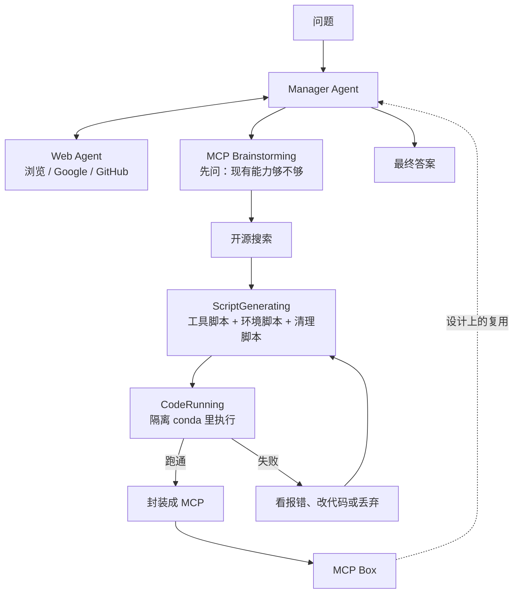

# Alita：最小预定义不是零工具，自进化也不是改权重——它改的是 MCP 工具库

<!-- release-date: 2025-05-26 -->

> 本文依据 Princeton AI Lab、清华 IIIS、上海交通大学、密歇根大学、陈天桥和陈萍萍基金会、香港中文大学联合发布的 **Alita: Generalist Agent Enabling Scalable Agentic Reasoning with Minimal Predefinition and Maximal Self-Evolution**，即 arXiv:2505.20286v1、2025-05-26 首次公开、共 12 页的版本。页码均指 PDF 本身的页码。截至 2026-09-10 核验，arXiv 仍只有 v1，与本地原件一致。本站按主导机构放在 Princeton 目录；合作关系见封面署名（PDF p. 1）。
>
> 文中严格区分三层：「论文写了什么」「本文如何解释它」「哪些是外部资料补充」。GitHub 后来更新的 GAIA test 数字、营销句，一律标成外部补充，不得当成 PDF 正文。

## 读之前需要的最少背景

这篇论文只讲一件事：通用 agent 要不要预先装好一大箱「解题工具」。

先把后面会反复出现的词说成人话。

- **通用 agent（generalist agent）**：不按任务各写一套流程，而是用同一套系统去应付旅行规划、电脑操作、多步调研这类开放任务。论文举的两个产品级例子是 OpenAI Deep Research 和 Manus（PDF p. 2）。
- **预定义工具库**：人先写好一批工具（网页抽取、图片配文、YouTube 字幕爬虫、路径分类器……），再让模型在这些接口里选。工具越多，看起来越全能；论文要反对的，正是这个方向。
- **MCP（Model Context Protocol，模型上下文协议）**：Anthropic 提出的开放协议，用来统一「外部系统怎么把上下文和工具交给大模型」（PDF p. 3）。在这篇里，MCP 不只是接入现成服务的插头，而是 **agent 自己造出来、再包一层标准外壳的可复用技能**。
- **自进化（self-evolution）**：本篇改的是 **工具 / 技能库（MCP Box）**，不是模型权重。跑 Alita 的 Claude 和 GPT-4o 都是现成模型，论文没有训练它们。
- **GAIA**：评测通用 AI 助手的基准，466 道贴近真实世界的题，覆盖日常任务、科学推理、网页浏览和工具使用；对人概念上简单，对当时的 AI 系统很难（PDF p. 6）。论文主数字报在 **validation** 上。
- **pass@k**：这篇的定义是把 Alita 跑 1、2、3 次，取最好的那次答案再算准确率（PDF p. 7，Table 1 表注）。它不是「k 次里至少对一次」的无偏估计公式，就是 best-of-k。

跨篇只留对照，避免把别的文章再讲一遍。本站「自进化系统」这一组按「哪个部件在进化」来分：

- [Darwin Gödel Machine](/reports/Sakana/Darwin-Godel-Machine) 改的是 **agent 自己的代码**；
- [GEPA](/reports/Berkeley/GEPA) 改的是 **prompt**；
- 已发布的 [AIDE2](/reports/Weco/AIDE2) 改的是包在模型外面的 **harness**；
- 已发布的 [Absolute-Zero](/reports/Tsinghua/Absolute-Zero) 改的是 **题库 / 课程**；
- 本篇 Alita 改的是 **工具 / 技能库（MCP）**。

四条线都叫自进化，动的部件完全不同。读数字之前先问一句：它到底在改哪一层。

## 一句话先说清

Alita 的主结果是：用 Claude-Sonnet-4 加 GPT-4o，在 GAIA **验证集** 上拿到 75.15% pass@1、87.27% pass@3；用 Claude 3.7 Sonnet 加 GPT-4o，同一套验证集 72.73% pass@1，Mathvista 100 题抽样 74.00%，PathVQA 100 题抽样 52.00%（PDF p. 1 摘要，p. 7 Table 1）。

这些分数不是靠预装更多工具堆出来的。论文的设计判断是反方向的：

> **解题工具不要预装。预装的只应是「造工具的工具」。按任务去开源世界里找、写、跑、包成 MCP，下次还可以复用。**

「最小预定义」因此不是零工具。Manager 仍有 MCP Brainstorming、ScriptGeneratingTool、CodeRunningTool；Web Agent 仍有浏览器、翻页、Google 搜索和 GitHub 搜索；环境管理还有 TextInspectorTool 和 conda。论文自己写的是「一个用于直接解题的核心能力（web agent）+ 一小套通用模块」（PDF p. 2）。真正被拿掉的，是 YouTube 字幕爬虫、图片配文、路径分类器这类 **面向具体任务的工具**。

这是本文对论文的归纳。论文用的口号是达芬奇那句 「Simplicity is the ultimate sophistication.」（PDF p. 2）它没有把「元工具」和「解题工具」写成这一对词，但 Figure 2 的上下对照、第 3 节的工具清单，就是这个意思。

## 旧方法卡在哪：预定义工具库的三道墙

先别上 Alita。先看当时通用 agent 默认在做什么。

论文的观察是：为了应付开放任务，系统越来越依赖大规模手工工程——繁琐工作流、大量预定义工具、硬编码组件（PDF p. 2）。Figure 2 上半部分把这幅图面画出来了：Manager 周围挂着 Url Text Extractor、Image Captioner、Relevant Patch Zoomer、Path Generalist Classifier、Youtube Caption Crawler，再加 Web Agent 和其他 agent（PDF p. 2，Figure 2）。工具箱看起来很全，论文指出三道墙（PDF p. 2）：

**一、覆盖面永远不够（incomplete coverage）。** 真实任务的工具需求是开放的。你不可能预先写完 agent 可能碰到的所有工具。缺了就做不了；多了也不等于下一次刚好用得上。

**二、创造力和组合被工作流锁死（limited creativity and flexibility）。** 复杂任务常常要 **新造** 一个工具，或把旧工具用出人没设计过的用法。预设计的工作流和硬编码组件会把这种组合空间压扁，自适应行为长不出来。

**三、接口和环境对不上（mismatch）。** 有用的工具不一定是 Python，也不一定能接到主流 Python agent 框架上。不是完全接不上，但预连接的成本很高，框架会倾向只收「已经包装好的那一类」。

这三道墙加在一起，伤的不是单次分数，是可扩展性、适应性和跨域泛化（PDF p. 2）。

用一个具体场景把墙说死。GAIA 里有一类题是看 YouTube。如果人预先写好一个「字幕爬虫」工具，碰到「旁白在恐龙画面出现后报了哪个数字」这种题，字幕可能刚好够用；碰到必须看画面、字幕里没有的题，同一个工具就会静悄悄地答错。人很难为每种难度各写一个视频工具。预定义工具库的病根，就是 **工具的形状在任务出现之前就被钉死了**。

论文认为，当时的主流是把箱子越做越大。Alita 的选择是把箱子里的解题工具倒空，留下造工具的能力。

## 两句原则：最小预定义，最大自进化

对着这三道墙，论文只提了两条设计原则（PDF p. 2）：

1. **Minimal Predefinition（最小预定义）**：只给最少的核心能力，不为特定任务或模态手工工程化组件。
2. **Maximal Self-Evolution（最大自进化）**：让 agent 按需要自己创建、打磨、复用外部能力。

落地形态是：直接解题几乎只靠 web agent；能力扩张靠按任务动态生成、适配、复用 MCP，而不是静态工具表（PDF p. 2）。论文把这个转变写成：从「人手设计能力」换成「当场构造 MCP」，从而走出一条「简单但足够强」的路（PDF p. 2）。

这里有一个必须提前钉死的边界，否则「自进化」三个字会和本站其他篇搅在一起：

**权重不动。** 论文没有 SFT，没有 RL，没有改 Claude 或 GPT 的参数。进化的对象是 MCP Box 里那些按任务长出来的外部能力。Manager 把跑通的脚本包成 MCP 存起来，下一次自己或其他 agent 可以再调（PDF p. 3–4）。所以它和 SEAL、Self-Rewarding-LM 那种「改权重」不是一类工作；也和 Absolute-Zero 那种「改题库」不是一类。它最像的类比是：人带着浏览器和一台能装软件的电脑出门，而不是带着一本写死的工具说明书出门。

代价也立刻清楚：造工具这件事，高度依赖底层模型会不会写代码、会不会根据报错改代码。论文把这条限制单独放在附录 B，只有两句话——模型编码能力很差时，这套方法会弱于传统通用 agent（PDF p. 12）。后文的小模型实验就是给这句话配的数。

## 系统怎么转：Manager、Web Agent、当场造 MCP

先看全景。Figure 3 把一次任务画成一个 CodeReAct 环（PDF p. 4）：



这是机制示意图，不是实测时间轴，根据 PDF p. 4 Figure 3 与第 3 节重画。图中「MCP Box 虚线回到 Manager」是论文写的系统设计（成功后写入内部工具注册表，PDF p. 4）；**主实验那一节没有写评测时有没有跨题复用这只盒子**。GitHub 后来的澄清见文末外部补充，这里不提前拿来解释 75.15%。

一次任务的流水线按论文 3.1 节是这样走的（PDF p. 4）：

1. 用原问题构造增强 prompt；
2. Manager 做多步推理；
3. 过程中可以问 Web Agent、规划并合成新工具、在隔离环境里执行；
4. 工具生成成功并且结果正确，对应脚本被转成 MCP，存进内部注册表；
5. 推理步骤、中间代码和最终输出全部记日志。

下面把每个部件走完一条因果链。

### Manager：不直接解题，只调度「要不要造工具」

Manager 是中枢（PDF p. 4）。它拿到任务后，先调用 MCP Brainstorming，判断要不要额外工具、要哪些；再把任务拆成子任务，分给 Web Agent，或自己生成所需外部工具。必要时，它用 Web Agent 找回的信息去写新工具，并附上环境配置指令。所有中间结果收齐后，再汇总成最终回答。

它自己只保留三件元工具（PDF p. 5）：

| 工具 | 干什么 |
|---|---|
| MCP Brainstorming | 发现能力缺口，指出缺什么工具，给出规格大纲 |
| ScriptGeneratingTool | 按大纲生成贴合任务的工具代码 |
| CodeRunningTool | 在隔离环境执行，缓存输出，供后续包成 MCP |

这三件都不是「帮你抽 YouTube 字幕」这种解题工具。它们是「决定要不要造、造出来、跑一下」的元能力。论文把它写成对最小哲学的落实：工具集短而强，按任务演化着调用（PDF p. 5）。

### Web Agent：唯一被允许直接碰外部世界的解题部件

内部知识不够时，Web Agent 去外部找（PDF p. 5）。它特别适合找回领域相关的代码或文档。接口是轻量、基于文本的浏览器，加上模块化翻页，能跨多个网站、抽出相关片段、返回 URL 或原文。

它的工具清单是（PDF p. 5）：

| 工具 | 干什么 |
|---|---|
| SimpleTextBrowser | 文本浏览器界面 |
| VisitTool / PageUpTool / PageDownTool | 打开页面、上翻、下翻 |
| GoogleSearchTool | 开放网络搜索 |
| GithubSearchTool | 找可复用的开源代码 |

论文强调这套设计支持实时代码检索和带上下文的工具规划（PDF p. 5）。换句话说：web agent 不是为了把网页摘要写漂亮，而是为了给下一步「写脚本」提供 README、代码片段和仓库地址。

这里有一个论文没展开、但和「最小」直接相关的事实：这只 web agent **不会看视频、不会点复杂 UI**。附录 A 的案例里，它并没有去「观看」那段 360 VR 视频，而是去 GitHub 找到 `youtube-transcript-api`，再让 Manager 写成字幕爬虫（PDF p. 12）。最小预定义能成立，部分是因为「看网页、搜代码」被当成了通用动作；一旦任务的关键信息只存在于画面或复杂交互里，它就必须当场造别的工具。GitHub 后来也承认 web agent 很简单、动作很少——那是外部补充，PDF 只给出了上面这张工具表。

### MCP Brainstorming：先对付模型的过度自信

造工具之前有一个前置动作。论文引用的观察是：LLM 经常高估自己的能力（PDF p. 5，参考文献 [22]）。如果跳过这一步，模型会倾向「我直接答」或「我已经有工具了」，该造的工具造不出来。

MCP Brainstorming 做的是初步能力评估：同时给它任务，和当前框架的能力描述，用专门 prompt 逼它做一次自我评估（PDF p. 5）。如果判断现有能力不够，它会给出工具生成的参考，给后续选工具、做规划当先验。

收益：少在「其实不会」的地方硬答。代价：这是一个 prompt 模块，论文没公开 prompt 原文，也没有消融「拿掉 Brainstorming 会掉几分」。它被写成必要步骤，证据是设计论述加一个案例，不是对照实验。

### ScriptGeneratingTool：一次写出三种脚本

真正把「缺这个工具」变成可执行物的，是 ScriptGeneratingTool（PDF p. 5）。它接收三类输入：

- Manager 给的子任务描述和代码构造建议；
- Web Agent 找回的 GitHub 链接，从中读 README 或代码片段；
- 由此生成 **工具脚本**、**环境脚本**、**清理脚本**。

环境脚本负责给代码准备运行环境；清理脚本负责跑完后删掉多余文件和环境。论文把目标写成：生成的脚本要有效、自包含、可执行，既适合当前任务，也可供将来复用（PDF p. 5）。

「三种脚本一起写」是一个很容易被抄走的细节。只写工具函数、不写环境，下一步执行就会在缺包、版本冲突上失败；只写环境、不写清理，本机 conda 环境会越积越多。Alita 把安装和回收也当成生成对象，而不是人写死的 Dockerfile。这和它后面「不用容器、不用管理员权限」的环境策略是配套的。

### CodeRunningTool：跑通才有资格进 MCP Box

CodeRunningTool 在隔离环境里执行刚生成的脚本（PDF p. 5）。跑出预期结果，这个工具才被注册成可复用 MCP。失败则进入迭代：看报错，再生成，再跑。

所以 MCP Box 不是「模型说它写好了就收」。至少在设计上，收纳标准是 **隔离执行通过**。论文没写「预期结果」由谁判定——是任务最终答案对了才收，还是脚本没抛异常就收。12 页里没有这层判据。这会影响你怎么理解「自进化」的质量门：门如果只是「代码能跑」，盒子里会进很多和任务无关的脚本；门如果是「这题答对了」，盒子又会过拟合当前基准。论文两扇门都没钉死。

### 环境管理：不用 Docker，用按任务新建的 conda

候选工具出现之后，环境规划模块会启动（PDF p. 5–6）。它用 TextInspectorTool 去解析仓库或脚本元数据：`README.md`、`requirements.txt`、shell 脚本，抽出依赖和安装步骤，做成一份隔离执行配置。然后按任务 ID 或仓库路径的哈希，建一个 **名字唯一的 conda 环境**，用 `conda install` 或 `pip install` 装依赖。

论文明确写了几条实现选择（PDF p. 5–6）：

- 运行环境在本地并行初始化；
- **不需要管理员权限，也不用容器**；
- 执行前显式 activate，保证隔离和可复现；
- 初始化失败（缺包、安装脚本语法错、依赖不可得）时走自动恢复：放宽版本约束，或找能跑起来的最小依赖集；
- 恢复仍失败：丢弃这个工具，把失败记下来供离线分析。

这套选择的收益是跨任务兼容性和可移植性（PDF p. 6）。代价论文几乎没写。不用容器，隔离粒度就是 conda 环境；生成脚本若乱写路径、乱访问网络，12 页里没有白名单、没有系统调用限制、没有费用上限。这些不是「论文暗示了但没展开」，是 **没写**。后文限制一节会再列一次，避免在这里脑补成沙箱已经完备。

把上面五块连起来，自强化循环是论文自己的话：新工具包成 MCP 之后，Alita 可以生成越来越强、越来越多样、越来越复杂的 MCP（PDF p. 4）。这句话是设计主张。主实验并没有画「MCP 数量随任务增加、分数随之上升」的曲线。能被实验托住的，是另一件事：把已经造好的 MCP 交给 **别的 agent** 或 **更小的模型**，分数会涨。那是第 5 节，下面单独讲。

## 为什么要包成 MCP，而不是「再写一个函数」

相关工作里，论文把 Alita 和两类前作错开（PDF p. 3）。

一类是通用 agent：OWL、Omne、OpenAI Deep Research、A-World、Magentic-One。Alita 的差异是尽量少用预定义工具和工作流去直接解题。

一类是自动造东西：AutoAgents 造多个角色 agent，AFlow 把工作流当成搜索问题，OpenHands / AutoAgent 让 agent 像开发者一样写脚本、管文件。更靠近「造工具」的是 CRAFT、TroVE、CREATOR：生成代码片段当工具、维护函数库、把工具抽象和执行拆开。Alita 的差异写成一句：**它造的是 MCP，而不是裸工具**；额外好处是更好复用、更好管理环境（PDF p. 3）。

MCP 在这篇里的位置可以压成三步：

1. Anthropic 的协议，统一 AI 系统和外部数据源、服务的连接（PDF p. 3）；
2. RAG-MCP 那类工作是在 **已有 MCP 库** 里检索最相关的工具，减轻 prompt 膨胀（PDF p. 3，参考文献 [21]）；
3. Alita 是先生成有效工具，再包装成 MCP，供自己和 **其他 agent** 后续使用（PDF p. 3）。

所以 MCP 在这里同时是接口标准和存档格式。接口标准让别的框架有可能直接接走；存档格式让「试错得到的技能」不会只活在一次 ReAct 轨迹里。第 5 节的复用实验，测的就是这层外壳有没有把能力送出去。

可迁移的部分：如果你的系统已经能让模型写临时脚本，下一步不是多写几个 `if task == ...`，而是问「这次写对的脚本，有没有一张标准身份证，能被另一个 agent 在下一次任务里找到」。MCP 是 2025 年他们选的那张身份证。换一种协议也可以，关键是 **生成物要可注册、可隔离、可转移**。

## 实验：验证集上的数字，以及 Figure 1 该怎么读

### 评什么、跟谁比

三个基准（PDF p. 6）：

| 基准 | 论文怎么用 | 论文自己写下的限制 |
|---|---|---|
| GAIA | 主战场，报 validation | 全文 466 题；主表是验证集分层结果 |
| Mathvista | 视觉上下文里的数学推理 | 资源有限，随机抽 100 题 |
| PathVQA | 医学视觉问答 | 同样随机抽 100 题 |

GAIA 的基线包括 Octotools、Hugging Face Smolagents 上的 Open Deep Research（文中缩写 ODR-smolagents）、AutoAgent、OWL、A-World、OpenAI Deep Research（PDF p. 6–7）。Figure 1 另外画了 manus.ai，主表 Table 1 里 **没有** Manus 这一行。

有一条实现事实必须记住：Alita **largely based on** Open Deep Research-smolagents 的框架；作者做的是去掉许多预定义工具，加上 MCP 创建组件（PDF p. 6）。所以它不是从零搭的新运行时，是在一个开源 deep research agent 上做减法再加「造 MCP」。主表里 ODR-smolagents 的 55.15%，是「同一条家族线上、还没做这两步」的对照，不是一个无关系统。

Octotools 被写成带 10 多张标准化 tool card、用来跑多工具工作流的框架（PDF p. 6）。它在 GAIA 上只有 18.40%（PDF p. 7 Table 1）。这个对照很刺眼，但论文没写 Octotools 这行用的是什么基座模型，也没写和 Alita 是否同一评测协议。只能读成「一种重预定义工具的开源框架，在作者报的数字里远低于 Alita」，不要读成「十张 tool card 必然只有 18 分」。

### Figure 1：先按图读数，再和表对齐

封面 Figure 1 是三组柱：Alita、manus.ai、OpenAI DeepResearch，按 GAIA Level 1 / 2 / 3 和 Average 画（PDF p. 1）。图注只写 「Performance of Alita, manus.ai, and OpenAI DeepResearch」，**没有写 pass@1 还是 pass@3**。下面这组数字是本文按图读出的，正文没有另给一份 Figure 1 数值表：

| | Alita | manus.ai | OpenAI DeepResearch |
|---|---:|---:|---:|
| Level 1 | 88.7% | 86.5% | 74.3% |
| Level 2 | 89.5% | 70.1% | 69.1% |
| Level 3 | 76.9% | 57.7% | 47.6% |
| Average | 87.3% | 73.3% | 67.4% |

把这些柱和 Table 1 对一下，会看到两件论文没在图注里说的事：

1. Alita 的四根柱，和 Table 1 里 **Claude-Sonnet-4 + GPT-4o 的 pass@3** 一致：88.68 / 89.53 / 76.92 / 87.27，图上四舍五入成一位小数。
2. OpenAI DeepResearch 的四根柱，和 Table 1 的 OpenAI-DR 一行一致：74.29 / 69.06 / 47.60 / 67.36。Table 1 没有给 OpenAI 的 pass@3，这行按位置是和各基线的主数字放在一起的。

于是 Figure 1 很可能是在用 Alita 的 **pass@3** 去对齐别人的 **主报数字**（对 OpenAI 而言就是 Table 1 的 67.36%）。封面视觉上的 87.3% vs 67.4%，不是同一口径的 20 分差距。同一口径下，Table 1 的 pass@1 是 75.15% vs OpenAI 67.36%，差 7.79 个点。Manus 只有图、没有表，论文也没写 Manus 那组柱是 pass@1 还是别的口径，来源只在图例里写了 manus.ai。

这不是外部爆料才能看出来的：只读 PDF，用 Figure 1 对 Table 1 也能对上。外部补充里，作者后来在 GitHub 承认封面图画的是 pass@3，并且说是为了在「别人不标明 pass@N」的环境里抢注意力。那句话属于 GitHub，不属于这篇 12 页论文。

### Table 1：主数字在这里，而且 Level 1 并不是全面领先

Table 1（PDF p. 7）才是正文主结果。pass@k 按表注是跑 1 / 2 / 3 次取最佳。

**Alita（Claude 3.7 Sonnet + GPT-4o）**

| | L1 | L2 | L3 | total | Mathvista | PathVQA |
|---|---:|---:|---:|---:|---:|---:|
| pass@1 | 81.13 | 75.58 | 46.15 | 72.73 | 74 | 52 |
| pass@2 | 88.68 | 80.23 | 53.85 | 78.79 | — | — |
| pass@3 | 96.23 | 86.04 | 65.38 | 86.06 | — | — |

**Alita（Claude-Sonnet-4 + GPT-4o）**

| | L1 | L2 | L3 | total |
|---|---:|---:|---:|---:|
| pass@1 | 77.36 | 76.74 | 65.38 | 75.15 |
| pass@3 | 88.68 | 89.53 | 76.92 | 87.27 |

**基线（论文未给 Mathvista / PathVQA 以外的分层 pass@k）**

| 系统 | L1 | L2 | L3 | total | Mathvista | PathVQA |
|---|---:|---:|---:|---:|---:|---:|
| Octotools | — | — | — | 18.40 | 68 | 47 |
| ODR-smolagents | 67.92 | 53.49 | 34.62 | 55.15 | 65 | 42 |
| AutoAgent | 71.70 | 53.49 | 26.92 | 55.15 | — | — |
| OWL | 84.91 | 67.44 | 42.31 | 69.09 | — | — |
| A-World | 86.79 | 69.77 | 34.62 | 69.70 | — | — |
| OpenAI-DR | 74.29 | 69.06 | 47.60 | 67.36 | — | — |

读这张表，有四件事论文表注没有提醒，但数字自己会说：

**第一，主宣传数字 75.15% / 87.27% 是 Claude-Sonnet-4 配 GPT-4o，而且只在 GAIA 验证集上。** Mathvista 74、PathVQA 52 属于另一行配置（Claude 3.7 + GPT-4o），样本是各 100 道随机题，论文没给随机种子，也没给 Sonnet-4 在这两个视觉基准上的数字。

**第二，表注写 「Alita outperforms all baseline agents across the GAIA levels」（PDF p. 7）。pass@1 的 Level 1 并不支持这句。** Claude-Sonnet-4 的 L1 pass@1 是 77.36，低于 OWL 的 84.91 和 A-World 的 86.79；Claude 3.7 的 L1 pass@1 是 81.13，同样低于这两行。Alita 真正拉开的是 Level 2、Level 3 和总分，尤其是 Sonnet-4 的 L3 pass@1 到了 65.38，而 OpenAI-DR 是 47.60、A-World 是 34.62。更硬的题上，当场造工具的收益更明显——这是表能支撑的判断。Level 1 上「全面超过」撑不住。

**第三，换到 Sonnet-4 之后，Level 1 的 pass@1 从 81.13 掉到 77.36，pass@3 从 96.23 掉到 88.68，但 Level 3 从 46.15 涨到 65.38，总分因此更高。** 论文正文没有讨论这个交换。数字在表里，解释不在 12 页里。

**第四，按百分数反推验证集规模。** 81.13%、75.58%、46.15%、72.73% 能整除的题量是 53 + 86 + 26 = 165。这是本文的推算，论文只说 GAIA 共 466 题，没有写出验证集 165 这个整数。pass@1 的 75.15% 在 165 题上大约对应 124 题；87.27% 大约对应 144 题。论文自己没做这种换算。

Mathvista / PathVQA 上，Claude 3.7 配置比 Octotools 高 6 和 5 个点，比 ODR-smolagents 高 9 和 10 个点（PDF p. 7）。方向和 GAIA 一致：更少预定义，分数更高。强度有限：各 100 题、单次随机抽样、没有误差条、没有 Sonnet-4。

论文还写「跑了三轮 GAIA，拿到 leaderboard 最佳」（PDF p. 7）。结合 pass@3 的定义，这句应读成验证集、best-of-3，而不是测试集、也不是单次 pass@1。PDF **没有** 任何 GAIA test 数字。test 上的 75.42%、64.12%、66.78%、68.11% 全部来自 GitHub 后来的文字，见文末。

## MCP 复用：能力可以送走，而且比微调便宜

第 5 节是这篇真正把「自进化」从口号变成实验的地方。作者把 Claude 3.7 Sonnet + GPT-4o 在 GAIA 上跑出来的 MCP 收集起来，做了两件事（PDF p. 7）：

1. 给 **别的 agent 框架** 用，看会不会变强；
2. 给 **更小的模型** 用，看会不会变强。

论文把第二件事写成一种新的蒸馏：传统蒸馏是用大模型的数据去微调小模型；这里是把大模型 agent 试错得到的 MCP 直接交给小模型 agent，更易、更便宜、更快（PDF p. 7）。注意：这是作者的类比，不是一次和 LoRA 微调对成本的实测。12 页里没有美元、没有 token 账单、没有墙钟。

### 给 ODR-smolagents + GPT-4o：各层都涨，但涨幅不大

Table 2（PDF p. 8）：

| 配置 | L1 | L2 | L3 | Total |
|---|---:|---:|---:|---:|
| ODR-smolagents + GPT-4o，无 Alita MCP | 33.96% | 29.07% | 11.54% | 27.88% |
| 同上，带 Alita MCP | 39.62% | 36.05% | 15.38% | 33.94% |

总分 27.88 → 33.94，大约 +6 个点，三层都涨。论文的解读是：MCP 有用，而且不是只修数据集里的边角案例（PDF p. 8）。

必须并排看 Table 1：那里的 ODR-smolagents 总分是 55.15%，这里无 MCP 的 GPT-4o 配置只有 27.88%。两行不是同一个基座设置。Table 2 只能支持「在 GPT-4o 的 ODR 上外挂这些 MCP 会涨」，不能支持「外挂之后就能追上 Table 1 里 55.15% 的那条 ODR」。论文没有解释 Table 1 的 ODR 用了什么模型。

### 给更小的模型：Level 3 从 3.85% 到 11.54%

Table 3 把 MCP 接到「没有 MCP 创建组件的 base 框架」（仍是 ODR-smolagents 一线）上，模型换成 GPT-4o-mini，并且保留了 ODR 里一些额外预定义工具（PDF p. 8）：

| 配置 | L1 | L2 | L3 | Average |
|---|---:|---:|---:|---:|
| Base + GPT-4o-mini，无 Alita MCP | 32.08% | 20.93% | 3.85% | 21.82% |
| 同上，带 Alita MCP | 39.62% | 27.91% | 11.54% | 29.09% |

平均 21.82 → 29.09。Level 3 从 3.85% 到 11.54%，论文说是三倍，并认为这些 MCP 封装了小模型自己走不完的复杂推理，尤其在最难的题上（PDF p. 8）。这个方向是表能支撑的：小模型 + 现成技能，比小模型从零造技能更划算。

绝对值仍低。带 MCP 的 4o-mini 平均 29.09%，远低于 Claude 3.7 Alita 的 72.73%。盒子能送走一部分能力，送不走「当场再造下一个工具」的能力。下一张表把这件事说得更死。

### 小模型自己当 Alita：会造，但造得差很多

Table 4 不再给蒸馏 MCP。GPT-4o-mini 必须自己走完整条 MCP 创建流程（PDF p. 8–9）：

| 配置 | L1 | L2 | L3 | Total |
|---|---:|---:|---:|---:|
| Alita（Claude 3.7 + GPT-4o） | 81.13% | 75.58% | 46.15% | 72.73% |
| Alita（GPT-4o-mini） | 54.72% | 44.19% | 19.23% | 43.64% |

掉到 43.64%。论文两边都写了（PDF p. 8）：一方面，换小模型之后显著变差，说明底层编码能力是瓶颈；另一方面，他们认为随着未来模型编码和推理变强，Alita 还会继续涨，未来通用 agent 的设计会更简单，人不预定义任何直接解题的工具和工作流，只设计「激发创造和进化」的模块。

后半句是展望，不是实验结果。前半句有 Table 4 托着。附录 B 用更硬的话收口：编码能力很差时，这套方法会弱于传统通用 agent（PDF p. 12）。传统 agent 的预定义工具至少还能在小模型上被「选中」；Alita 把选工具变成写工具，小模型写不出来就什么都没有。

可迁移的部分：技能库蒸馏和权重蒸馏不是替代关系。你可以把大 agent 试错得到的工具交给小 agent 当起跑线；但若小 agent 还要面对训练集之外的新任务，它仍然得会写代码。Alita 把「会写代码」从加分项变成了系统前提。

## Case study：Gollum 旁白，和一只当场长出来的字幕爬虫

附录 A 给了一道 GAIA Level 3 题，题号 `0512426f-4d28-49f0-be77-06d05daec096`（PDF p. 12）。题面大意是：2018 年 3 月、由《指环王》Gollum 配音演员旁白的那条 YouTube 360 VR 视频里，恐龙画面首次出现之后，旁白紧接着报的数字是多少。

Alita 的答案是 `100000000`，标准答案也是 `100000000`。它为此生成的 MCP 名叫 YouTube Video Subtitle Crawler。流程按附录逐步是（PDF p. 12）：

1. **MCP Brainstorming** 提出要做一个 YouTube 字幕爬虫 MCP，自动抽字幕，再在「恐龙出现之后」那段文本里定位数字。
2. **Web Agent** 去开源仓库找现成能力，找到 `youtube-transcript-api`，仓库地址写在附录里：`https://github.com/jdepoix/youtube-transcript-api`。
3. **Manager** 综合 README，写出 Python 函数和 conda 环境：

```text
conda create -n youtube_transcript
conda activate youtube_transcript
pip install youtube-transcript-api
```

以及用 `YouTubeTranscriptApi` 按 `video_id` 取 transcript 的代码（附录给出的是片段，不是完整可运行脚本）。

4. 把脚本和环境打成 YouTube Video Subtitle Crawler MCP，抽字幕，从文本里取出恐龙场景之后的数字。
5. 最终输出 `100000000`。

这个案例几乎是 Figure 2 的镜像。传统通用 agent 那张图里，Youtube Caption Crawler 是预先挂在 Manager 旁边的现成工具；Alita 把它变成了 **这道题出现之后才长出来的 MCP**。工具形态可以长得很像，来路完全不同。预定义版本在任务出现之前就定死了「只读字幕」；Alita 的版本至少有机会在 Brainstorming 阶段决定造别的东西——不过 **这篇案例里它造出的仍然是字幕爬虫**，并没有展示「任务更难时改去逐帧读视频」。那种更强的例子出现在 GitHub 评论里，不是 PDF。

论文对案例的官方结论只有一句：Alita 能根据任务做有结构的 MCP brainstorming，找到相关资源，实现一个能帮忙完成任务的 MCP（PDF p. 9）。它是一条成功轨迹，不是失败分析，也不是随机抽样。12 页里没有第二个案例，没有失败案例。

## 相关工作只需记住三条对照

第 2 节篇幅不长，读的时候抓住论文自己画的三条线即可（PDF p. 3）：

- 相对 OWL / Magentic-One / A-World 这类通用 agent：Alita 少预定义、少工作流，用造 MCP 换覆盖面。
- 相对 AutoAgents / AFlow / OpenHands / AutoAgent 这类「自动生成 agent 或工作流」：Alita 生成的对象是可复用 MCP，不是另一组角色或另一张工作流图。
- 相对 CRAFT / TroVE / CREATOR 这类「造工具」：MCP 多了复用和环境管理这两层。相对 RAG-MCP：Alita 不是只在现成库里检索，而是先造再入库。

这些对照是定位，不是实验。没有「Alita vs CREATOR」的表。

## 论文写了的限制，和 12 页根本没写的实现

### 写了的

- 高度依赖 LLM 编码能力；编码很差时，会弱于传统通用 agent（PDF p. 12 附录 B）。这是全文唯一一节 Limitations，一共两句。
- Mathvista、PathVQA 因资源只抽 100 题（PDF p. 6）。
- 小模型自己跑 Alita 会显著变差（PDF p. 8–9，Table 4）。
- 未来展望：人可能不再预定义任何直接解题工具，只设计激发创造的模块（PDF p. 8）。这是作者判断，不是结果。

### 没写的，必须明确说没写

下面这些不是「写了但不够细」，是 12 页里没有：

- **GAIA test 数字。** 主结果全部是 validation。test 上的任何百分比都不是 PDF 内容。
- **费用、token、墙钟、GPU。** 造环境、搜 GitHub、多轮改代码显然很贵，论文零数字。
- **工具白名单、网络安全、文件系统权限。** 环境隔离写到 conda 为止，没有容器，没有系统调用沙箱，没有「禁止访问哪些域名」。
- **失败模式。** 没有统计多少任务在 Brainstorming、搜仓库、装依赖、写脚本、最终作答的哪一步挂掉；附录只有一条成功案例。
- **MCP 包装的协议细节。** 「封装成 MCP server」在文中是一句话，没有 schema、没有工具描述怎么写、没有如何避免重名和重叠。
- **造出了多少个 MCP、平均每个任务造几个、复用命中率。** 第 5 节用了「收集到的 MCP」，没给集合大小。
- **Claude 和 GPT-4o 怎么分工。** 主配置一直是两个名字并列，谁做 Manager、谁写代码、谁浏览，没写。
- **主评测有没有跨题累积 MCP。** 3.1 节说成功就入库；4.2 节报 75.15% 时没说这 165 题是每题从空盒子开始，还是边跑边攒。两种协议的含义差很远。
- **消融。** 没有「去掉 Brainstorming / 去掉 GitHub 搜索 / 去掉 MCP 外壳只留裸脚本」的表。最小预定义好在哪里，主要靠和 Octotools、ODR、OWL 的系统级对比，不是组件级对比。
- **prompt 原文、超参、采样温度、超时。** 只说为 Brainstorming 设计了专门 prompt。

把没写的列清楚，不是为了否定 75.15%。是为了避免把一篇 12 页的方法论文读成一份可复现系统报告。论文自己指向 GitHub 说细节会更新（PDF p. 1）。更新了什么、哪些和 PDF 打架，下一节单独标成外部补充。

## 可迁移启发

1. **先区分元工具和解题工具。** 浏览器、搜索、隔离执行、写脚本，是元能力；YouTube 字幕、PPT 抽页、图片配文，是解题能力。把后者预装得越多，越像在赌未来任务的分布。Alita 的赌注是：元能力足够时，解题能力可以现场长出来。
2. **覆盖面问题用「生成」补，不只能用「检索」补。** RAG-MCP 是在现成库里找；Alita 是库里没有就去开源世界写一个再入库。两步可以叠，论文测的是后一步。
3. **收纳要有执行门。** 设计上，跑通才进 MCP Box。生成式工具库如果只靠模型自评「我写好了」，盒子会脏得很快。
4. **环境脚本和清理脚本是工具的一部分。** 缺了这两段，所谓自进化会变成本机环境垃圾场。
5. **技能可以当蒸馏物。** 大模型 agent 试错得到的 MCP，能让小模型 agent 少走一段推理。这比「先造工具库再蒸馏权重」更轻。但它不能替代小模型自己写新工具的能力。
6. **口径比柱状图重要。** 同一张封面可以把 pass@3 画在别人的主数字旁边。读 agent 论文，先问 pass@k 的 k、验证集还是测试集、有没有跨题记忆。

这些启发里，1–5 能从 PDF 的设计和表格直接推出来；6 是读 Figure 1 对 Table 1 之后的阅读纪律。

## 关键词回看

- **最小预定义（Minimal Predefinition）**：不为具体任务预装解题工具；留下的是 web agent 和造工具用的通用模块。
- **最大自进化（Maximal Self-Evolution）**：按任务生成、打磨、复用 MCP。改的是工具库，不是权重。
- **MCP Box**：跑通的脚本被包成 MCP 之后的技能仓库，设计上供自己和其它 agent 复用。
- **MCP Brainstorming**：用专门 prompt 做能力自评，压住「我直接就能答」的过度自信，并给出缺什么工具。
- **ScriptGeneratingTool / CodeRunningTool**：分别负责写出工具+环境+清理脚本，以及在隔离 conda 里执行。
- **Web Agent**：文本浏览器 + 翻页 + Google + GitHub，是唯一直接解题的核心能力。
- **pass@k（本文口径）**：跑 k 次取最佳再计分，不是无偏的「至少对一次」。
- **技能蒸馏**：把大模型 agent 造出的 MCP 交给小模型 agent，论文把它对比成一种比微调更轻的蒸馏。

## 最后的判断

Alita 值得记住的不是「又一个 GAIA 第一」，而是它把通用 agent 的复杂度从 **解题工具的数量** 挪到了 **造工具循环的质量**。

被实验托住的有三块：在 GAIA 验证集上，弱预定义加现场造 MCP 的系统，总分超过了 OWL、A-World 和 OpenAI Deep Research 的表内数字；造出来的 MCP 可以外挂到别的框架和小模型上并带来个位数到十个百分点的提升；把同一个框架换成 4o-mini 自己造 MCP，分数会掉一大截，编码能力是真瓶颈。

没被托住、或被图表口径夸大的也有三块：封面 Figure 1 用 pass@3 的 87.3% 去并排别人的主数字；表注「每一层都超过所有基线」与 Level 1 pass@1 的数字打架；自强化循环（MCP 越造越强）没有时间序列证据，主评测是否跨题累积 MCP 在 PDF 里是空的。

12 页论文把思想讲清楚了，把系统讲到「能画流程图」为止。白名单、费用、失败分布、MCP schema、测试集，它都没写。这些空白后来被 GitHub README 用更冲的句子和另一组数字填过——那是下一节的事，不能回写进上述判断。

如果只记一句话，可以记：

> **解题工具会过时，造工具的循环可以留下。但若把 pass@3 画在别人的 pass@1 旁边，循环有多强，柱子不会告诉你。**

## 资料与阅读边界

- 原始依据：本地 `papers/Princeton/Alita.pdf`，即 arXiv:2505.20286v1，2025-05-26 首次公开，12 页。封面作者单位以 Princeton AI Lab 为主，另有清华 IIIS、上海交通大学、密歇根大学、陈天桥和陈萍萍基金会、香港中文大学。
- arXiv 页面：<https://arxiv.org/abs/2505.20286>。提交历史只有 v1（2025-05-26 17:58:53 UTC）。截至 2026-09-10 核验没有更新版本，本地原件即最新。
- MCP 协议的论文脚注：<https://www.anthropic.com/news/model-context-protocol>（PDF p. 2）。
- 论文写明的代码指向：<https://github.com/CharlesQ9/Alita>（PDF p. 1）。
- 案例中检索到的开源库：<https://github.com/jdepoix/youtube-transcript-api>（PDF p. 12）。
- 基线 Open Deep Research-smolagents 的来源：Hugging Face 博客与 `smolagents` 仓库，论文脚注与参考文献 [25]（PDF p. 6、11）。
- GAIA leaderboard 链接在论文脚注：<https://huggingface.co/spaces/gaia-benchmark/leaderboard>（PDF p. 6）。本文没有把 leaderboard 页面的实时排名写进正文。

### 外部补充：GitHub README 后来写了、PDF 没有的话

以下内容来自 2026-09-10 访问的 [CharlesQ9/Alita](https://github.com/CharlesQ9/Alita) README，**不是 PDF 正文**。仓库当时仍以 README 和 `Figures/` 为主，没有放出可运行代码。

- 营销句：「The GAIA game is over, and Alita is the final answer。」PDF 从未出现这句。
- README 标题区写过：**GAIA validation 75.15% pass@1 / 87.27% pass@3，以及 GAIA test 75.42% pass@1。** 前两个和 PDF 一致；**75.42% 这个 test 数字不在 PDF 里。**
- 同一份 README 的 Comment 13 又写：test 上是 **64.12% pass@1**，比验证集低约 10 个点；5 月 28 日升级 web agent 后 **66.78%**；5 月 29 日再升到 **68.11%**，并说明这次没有接验证集上造出的 MCP。这些数字彼此也不一致，本文不去仲裁哪一个才是「最终 test 成绩」，只记录：GitHub 自己同时放着 75.42% 和 64.12% 两条线，且全部外于 PDF。
- Comment 8：作者认为 GAIA test 更偏网页浏览、更少工具使用；他们的 web agent 很简单、动作很少，所以 test 掉得厉害。MCP 创建组件在 test 上大约贡献 +15% pass@1，验证集上的增益更高。PDF 没有 test、也没有这组消融。
- Comment 11：有人问 Figure 1 是 pass@3 还是 pass@1。作者回复封面图画的是 pass@3，pass@1 是 75.15%；并写他们是在「有的公司不标明 pass@k」的环境里，被迫 aggressive and shameless 地这么画。他还澄清：主报的 pass@1 / pass@3 都是 **没有任何预置 MCP** 的设置，不是做完第一题就把 MCP 留给第二题；MCP Box 是全部实验结束、分数算完之后才接回去，用来让 pass@1 逼近 pass@N，或可称作 Alita Pro。PDF 3.1 节只写成功就入库，没有这段评测协议。
- Comment 5：Sonnet-4 替换 3.7 后，Level 1 pass@3 从 96.23% 降到 88.68%，总分却上升，作者说还没完全理解。数字在 PDF Table 1 里已经能看见，解释在 GitHub。
- Comment 7：作者称手工测过一些产品，认为存在虚报；并称 GAIA 验证集至少有 4–5 道答案本身是错的，不可能接近 100%。这是作者观察，PDF 未写。
- Comment 14 及之后：PPT 页数题、逐帧读视频的 MCP、MCP 抽象不足会过拟合、MCP Overload、计划一个月内开源等。这些都是论文之后的讨论，本文不把它们写进「Alita 论文证明了什么」。
- 仓库还外链了后续工作 AgentDistill（arXiv:2506.14728）和一篇自进化 agent 综述。它们不是本篇原件。

读这篇论文，以 PDF 的验证集表格为准；用 GitHub 理解作者事后想强调什么、以及 test 数字曾经出现过互相冲突的写法。两者不要合成一个「Alita 得了百分之多少」。
