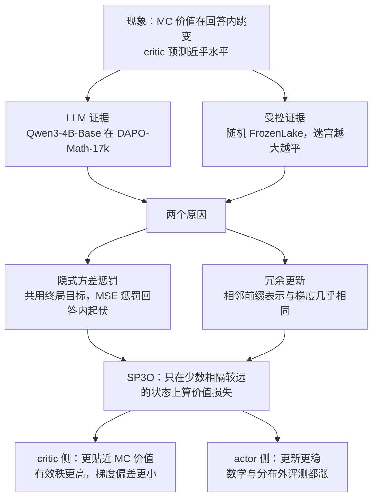
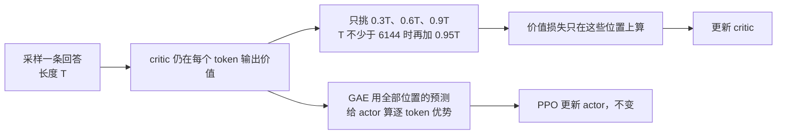

# PPO 的 critic 为什么把价值曲线压平：Value Flattening 与只监督三个点的 SP3O

<!-- release-date: 2026-09-16 -->

> 本文依据 Yizhuo Li、Jianhao Yan 等 12 位作者的 **Rethinking Critic Learning in PPO: Understanding and Mitigating Value Flattening**，即 arXiv:2609.18708v1（2026-09-16），共 17 页。页码均指这份 PDF。全文把三件事分开标注：报告明确写了什么、我们如何解释或验算它、哪些是外部资料补充。

## 读前先把几个词说成人话

这篇论文讨论的是强化学习里一个很小、但很容易被忽视的部件：critic。下面几个词会反复出现。

- **策略（policy，actor）**：就是正在被训练的大模型本身，它一个 token 一个 token 地写回答。
- **状态（state）**：写到第 $t$ 个 token 时，「题目加上已经写出的前缀」就是状态 $s_t$。相邻两个状态只差一个 token。
- **状态价值（state value）**：从某个前缀出发，让同一个策略接着写完，最后答对的概率。论文记为 $V^\pi(s_t)$，是「策略条件下」的价值（PDF p. 3–4）。
- **critic（价值模型）**：另一个网络，任务是在每个前缀上猜出这个状态价值，记为 $V_\phi(s_t)$。
- **优势（advantage）**：这一步比「预期」好多少。PPO 用 critic 的预测当预期，所以 critic 猜得准不准，直接决定每个 token 得到多少功劳或多少责备。
- **PPO（Proximal Policy Optimization，近端策略优化）**：带 critic 的经典策略梯度算法；GAE（Generalized Advantage Estimation，广义优势估计）是它构造逐 token 优势的方法。PPO 的来历见 PPO 一篇。
- **GRPO**：不训练 critic、用同一道题多条回答的组内平均当基线的方法，出处见 DeepSeekMath 一篇。它只能给整条回答一个优势，分不出回答内部哪一步关键（PDF p. 3）。
- **MC 价值（Monte Carlo value，蒙特卡洛价值）**：把某个前缀固定住，让策略从这里独立续写很多次，数答对的比例。它是真实状态价值的一个低方差估计，论文拿它当「标准答案」来检查 critic（PDF p. 4）。

## 一句话先说清

用 PPO 做推理题的强化学习时，奖励通常只在回答末尾给一次（对为 1，错为 0）。这时 critic 在一条回答的每个 token 上拿到的回归目标都是同一个数：这条回答最终的对错。论文发现，在这种训练下，真实状态价值会在回答中间剧烈跳变（Figure 1 标出的 16 处局部跳变，答对概率一段就变化 0.45–0.84），而 critic 的预测几乎是一条平线（PDF p. 2，读自 Figure 1）。作者给这个现象起名 **Value Flattening（价值压平）**（PDF p. 1–2）。

他们给了两个原因（PDF p. 2、p. 5–6）：

1. **隐式方差惩罚**：所有位置共用同一个目标时，均方误差可以拆成「平均值对不对」加「回答内部起伏有多大」，后一项直接惩罚预测的起伏。
2. **时间相关带来的冗余更新**：相邻前缀几乎一模一样，critic 的表示和梯度也几乎一样，逐 token 监督等于把同一个方向的更新重复叠加几千次。

对策 **SP3O（SParse Proximal Policy Optimization，稀疏近端策略优化）** 只改了一件事：critic 的价值损失不再算在每个 token 上，而是只算在每条回答相对位置 0.3、0.6、0.9 的 3 个状态上，回答不短于 6144 个 token 时再加一个 0.95（PDF p. 8）。actor 目标、采样和回报目标都不变（PDF p. 6）。在 Qwen3-4B-Base 上，数学 7 项平均从 PPO 的 37.60 提到 45.57，涨 7.97 个点（PDF p. 8）。

### 一条阅读路线

1. p. 2 的 Figure 1 与 p. 5 的 Figure 2：先亲眼看到「平」是什么样子。
2. p. 4 式 2–3 与 p. 5 式 5：终局奖励下 critic 的目标为什么处处相同，以及那一行拆分等式。
3. p. 6 的 Figure 3：相邻状态的表示与梯度有多像。
4. p. 6 式 6：SP3O 的全部改动就这一个求和范围。
5. p. 7 的 Figure 4、Figure 5：critic 真的变「不平」了吗。
6. p. 8 的 Table 1–2、p. 9 的 Figure 7 与 Table 3、p. 17 的 Table 5：效果、监督点数、位置和尾部锚点。
7. 附录 A.2（p. 15–17）：为什么基线不影响期望梯度，critic 不准却仍然会伤训练。

## 主要矛盾：给 critic 的监督，本身就不含「回答内部」的信息

先看 PPO 在这篇论文设置下的 critic 目标。GAE 的写法是（PDF p. 4，式 2）：

$$
\delta_t = r_t + \gamma V_{\phi_{\text{old}}}(s_{t+1}) - V_{\phi_{\text{old}}}(s_t),\qquad
\hat A_t = \sum_{\ell=0}^{T-t} (\gamma\lambda)^{\ell}\,\delta_{t+\ell},\qquad
\hat G_t = \hat A_t + V_{\phi_{\text{old}}}(s_t)
$$

$\hat A_t$ 是给 actor 的优势，$\hat G_t$ 是给 critic 的回归目标。critic 的标准损失是把每条回答的每个 token 都算进去的均方误差（PDF p. 4，式 3）：

$$
L_V(\phi) = \frac{1}{\sum_{\tau\in\mathcal B} T_\tau}\sum_{\tau\in\mathcal B}\sum_{t=1}^{T_\tau}\bigl(V_\phi(s_t) - \hat G_t\bigr)^2
$$

论文的实验里 KL 系数为 0，奖励只在末尾，且 $\gamma = \lambda = 1$。于是 $\delta$ 逐项相消，$\hat G_t = G_t = R(\tau)$ 对 $t = 1,\dots,T$ 都成立（PDF p. 4）。换句话说，一条 5000 token 的回答，critic 在 5000 个位置上收到的都是同一个 0 或 1。

作者特意强调：这个等式只说明「观察到的目标」处处相同，并不说明真实状态价值 $V^\pi(s_t)$ 在回答内部是常数（PDF p. 4）。真实价值当然会变。矛盾就在这里：

> critic 的职责是分辨回答内部哪一步让成功率变了，可它拿到的每一条监督都只告诉它「这整条回答最后对没对」。

**我们如何解释它。** 在 $\gamma=\lambda=1$ 下，actor 的优势 $\hat A_t = R - V_{\phi_{\text{old}}}(s_t)$。如果 critic 在一条回答里输出常数 $c$，那么所有 token 的优势都是 $R - c$，PPO 就退化成「整条回答同一个优势」，和 GRPO 这类无 critic 方法在回答内部没有区别。花钱养一个 critic，买的本来就是回答内部的分辨率；压平等于把这份钱白花了。

## 先看全景

这张图按 PDF p. 2–9 的叙事重画，是论证结构示意，不是论文原图。

## 现象一：在 LLM 推理里，critic 画不出价值的台阶

这张图来自 PDF p. 2 的 Figure 1。每个小格是一条回答，横轴是回答进度，黑点是 MC 价值，蓝色方块是 PPO critic 的预测。红色线段是论文专门标出来的大跳变，每格左下角写着这一段 MC 价值的变化 $\Delta V_{\text{MC}}$ 与 critic 预测的变化 $\Delta V_{\text{pred}}$。

读几个格子就够了：

- checkpoint 150 的一条正确回答，MC 价值一步跳了 +0.84，critic 同一段反而变了 −0.03（PDF p. 2）。
- checkpoint 250 的一条正确回答，MC 价值掉了 0.67，critic 只掉 0.13（PDF p. 2）。
- checkpoint 350 的一条错误回答，MC 价值掉了 0.54，critic 的变化是 −0.00（PDF p. 2）。

16 格里，$|\Delta V_{\text{pred}}|$ 最大也只有 0.13，而 $|\Delta V_{\text{MC}}|$ 都不低于 0.45（PDF p. 2，读自 Figure 1 各格标注）。有几格 critic 变化的方向甚至和 MC 相反。论文据此说，压平发生在 50 到 350 各个 checkpoint，也发生在答对和答错两类回答里，是学出来的 critic 的性质，不是某条轨迹的偶然（PDF p. 1）。

图注也写清楚了挑选方式：这些回答是「按局部 MC 价值变化大」挑出来的（PDF p. 2）。所以 Figure 1 是示例，不是统计。统计在下一张图的（a）幅。

MC 价值怎么算，附录写得很具体（PDF p. 14）：固定 64 条回答，每条在 20 个位置取点，即相对位置 0.05、0.10……0.95 共 19 个中间状态，再加上终点 1.0。每个中间状态先续写 128 次，之后每批加 64 次，最多 256 次；当成功率的 95% Wilson 置信区间半宽不超过 0.04 时提前停。续写温度 1.0、top-p 0.95、最长 8192 token。终点直接用这条回答的真实奖励。

**我们如何验算它。** 64 条回答乘 19 个中间点再乘至少 128 次续写，是至少 155,648 次续写。这笔诊断开销是用来当标尺的，不进入 SP3O 的训练。

## 现象二：在 FrozenLake 里，状态空间越大越平

这张图来自 PDF p. 5 的 Figure 2。

**（a）幅**把 LLM 里相邻两个评估点的变化画成散点：横轴是 $\Delta V_{\text{MC}}$，纵轴是 $\Delta V_{\text{pred}}$。如果 critic 跟得上，点应该落在对角虚线上。实际上横向从约 −0.75 铺到约 +1.0，纵向几乎全挤在 0 附近，绝对值基本不超过 0.25（PDF p. 5，读自 Figure 2a）。深色点是 $|\Delta V_{\text{MC}}| \ge 0.3$ 的大跳变，它们照样贴着 0。论文的判断是：critic 既抓不住局部变化的幅度，也常常抓不住方向（PDF p. 4）。

**（b）（c）幅**换到一个可以算出真值的环境。随机 FrozenLake 是 OpenAI Gym 里的格子迷宫：从起点走到终点，途中有冰洞，动作有随机性；到终点回报 1，掉进冰洞或超过 8192 步回报 0（PDF p. 5、p. 14）。于是每个格子的状态价值就是「从这里出发最终到达终点的概率」，可以直接画成热力图。作者固定训练配置，只把迷宫边长 $n$ 从 32 加到 128（PDF p. 5）。

- 上排真实价值图有清晰的红蓝分界，$n$ 越大条纹越细碎。
- 下排 critic 预测在 $n=32$ 时还能画出左下角的低价值区；到 $n=64$ 只剩一大片橙色，中间一条浅带；到 $n=128$ 几乎整张图是同一种颜色（PDF p. 5，读自 Figure 2b）。

（c）幅的三条线读数（PDF p. 5，读自 Figure 2c）：

| 迷宫边长 $n$ | 32 | 64 | 128 |
|---|---:|---:|---:|
| $\Delta V_{\text{pred}}/\Delta V_{\text{gt}}$（局部对比，越接近 1 越好） | 约 0.28 | 约 0.20 | 约 0.11 |
| MAE（平均绝对误差） | 约 0.08 | 约 0.12 | 约 0.16 |

预测的局部落差只剩真实落差的一成左右，误差翻了一倍。图里还有第三条线「Visits」，从约 4 降到约 0.3，正文没有定义它，推测是每个格子的平均访问次数，这是我们的猜测。$\Delta V_{\text{pred}}/\Delta V_{\text{gt}}$ 正文只称为 local-contrast 指标，也没有给精确公式。FrozenLake 用什么 critic 网络、什么 RL 算法、训练多少步，论文都没有写，只说「训练配置固定」。

论文由此得出两条结论：压平不是 LLM 特有的，受控 MDP 里也有；状态空间变大时它更严重（PDF p. 5）。LLM 的状态空间是所有可能的前缀，比任何格子迷宫都大得多，这条趋势对 LLM 是坏消息。

## 原因一：共用终局目标，MSE 自带一项「别起伏」

对一条长度为 $T$ 的回答，记 $v_t = V_\phi(s_t)$，回答内平均 $\bar v = \frac{1}{T}\sum_t v_t$。所有位置的目标都是同一个 $R$，于是逐 token 的均方误差可以一字不差地拆成两项（PDF p. 5，式 5）：

$$
\frac{1}{T}\sum_{t=1}^{T}(v_t - R)^2 = (\bar v - R)^2 + \frac{1}{T}\sum_{t=1}^{T}(v_t - \bar v)^2
$$

- 第一项让「这条回答的平均预测」去贴这条回答的结局。
- 第二项就是回答内预测值的经验方差，它只会把各位置往平均值拉。

作者的原话是：这项方差惩罚之所以出现，是因为每个位置都用同一个终局目标；在稠密监督下它覆盖全部 $T$ 个位置（PDF p. 5）。附录把它推广到整个 batch 与参数梯度（PDF p. 16，式 16–17）：

$$
\nabla_\phi L^{\text{sample}}_{V,\text{dense}} = \frac{2}{N}\sum_{i=1}^{N}(\bar v_i - R_i)\,\bar J_i + \frac{2}{N}\sum_{i=1}^{N}\frac{1}{m_i}\sum_{t=1}^{m_i}(v_{i,t} - \bar v_i)(J_{i,t} - \bar J_i)
$$

$J_{i,t} = \nabla_\phi V_\phi(s_{i,t})$ 是 critic 在该状态上的雅可比，$\bar J_i$ 是回答内的平均。第二项就是「回答内方差」这一项的梯度，它把每个偏离平均的预测往回推。论文强调：共享的回报对回答内各状态之间的价值差没有提供任何直接信息，却因为被重复用在每个状态上，引入了这项压平压力（PDF p. 16）。

作为对照，附录还写出了「如果能拿真值 $q_{i,t} = V^\pi(s_{i,t})$ 来回归」时，修正回答内误差需要的梯度（PDF p. 16，式 18）：

$$
\nabla_\phi E_{\text{within}} = \frac{2}{N}\sum_{i=1}^{N}\frac{1}{m_i}\sum_{t=1}^{m_i} e^{\circ}_{i,t}\,J_{i,t}
$$

$e^{\circ}_{i,t}$ 是去掉回答平均后的误差，回答内加起来为 0。所以所有状态共有的那部分雅可比会被精确抵消。论文的读法是：要纠正回答内的误差，状态之间的雅可比必须真的不同（PDF p. 16）。这句话接上了原因二。

**我们如何解释它。** 式 5 是对单条样本的恒等式。若把无穷多条经过同一前缀的回答平均起来，均方误差的最优解仍是条件期望，也就是真实的 $V^\pi(s_t)$；方差项本身不会改变这个理论最优点。所以「隐式方差惩罚」讲的是有限样本、有限容量、梯度下降时的优化压力：每条回答只给一个 0/1，critic 又能在相邻前缀之间高度泛化，最省力的下降方向就是把整条回答一起往 $R$ 推。论文没有给出「稀疏监督会改变最优解」这类证明，它的论证是分解加实验，没有收敛性定理。

## 原因二：相邻前缀太像，逐 token 监督是在重复同一次更新

经典强化学习里的状态往往是紧凑的马尔可夫状态。LLM 不一样：状态就是已经写出的全部 token，相邻两个状态只差 1 个 token，几乎整段输入都重叠（PDF p. 5–6）。

这张图来自 PDF p. 6 的 Figure 3。

- **（a）幅**：同一条回答的各个状态，actor 的隐表示在第一主成分上从约 −80 铺到约 +70；critic 的隐表示即使放大 2 倍画，也缩成中心一小团（PDF p. 6，读自 Figure 3a）。critic 的输入在回答内几乎分不开。
- **（b）幅左**：隐表示余弦、梯度余弦、更新能量三条线全部在 99.2% 以上，而且从训练早期到后期还在往上走（PDF p. 6，读自 Figure 3b）。
- **（b）幅右**：梯度余弦随两个位置的相对间隔增大而下降，但即便间隔接近整条回答，也仍在约 98% 附近（PDF p. 6，读自 Figure 3b）。

「更新能量」的定义在附录（PDF p. 14，式 7）：

$$
E_i = \frac{T_i\,\overline{\Delta v}_i^{\,2}}{\sum_t \Delta v_{i,t}^2},\qquad \overline{\Delta v}_i = \frac{1}{T_i}\sum_t \Delta v_{i,t}
$$

$\Delta v_{i,t}$ 是一次更新后第 $t$ 个状态预测值的变化。$E_i$ 衡量这次变化里有多大比例是「整条回答一起平移」。它接近 100%，意思是 critic 每更新一次，同一条回答里所有位置几乎被同样地抬高或压低。这正是「平」的动力学来源。

为什么表示像就等于更新像？论文用一个线性价值头说明（PDF p. 6）：若 $V_\phi(s_t) = w^\top h_t$，位置 $t$ 对 $w$ 的梯度是

$$
g^{(w)}_t = 2\bigl(V_\phi(s_t) - R\bigr)\,h_t
$$

回答内所有位置的 $R$ 相同，只要残差同号、表示 $h_t$ 相近，梯度就几乎同向。稠密监督于是把几千个几乎一样的梯度叠在一起（PDF p. 6）。论文引用 DQN（Mnih 等，2015）来说明相关样本提供的信号比数量看上去的少（PDF p. 6）。

**我们如何解释它。** 两个原因是同一件事的两面。原因一说「目标里没有回答内的差异」，原因二说「输入和梯度里也几乎没有回答内的差异」。目标不给差异、输入又难以区分，critic 自然学成一条平线。

## SP3O：只改求和范围

### 旧问题 → 新设计

两个原因给了两个操作方向（PDF p. 6）：

- **选得少**：只在少数位置算损失，方差惩罚就只作用在这几个预测值上，不再覆盖每个 token。
- **隔得远**：选中的位置彼此相隔较远，前缀重叠少，梯度就不那么同向，减少冗余累积。

SP3O 的全部改动是把式 3 的内层求和从「每个 token」换成一个小集合 $\mathcal I(\tau)$（PDF p. 6，式 6）：

$$
L^{\text{SP3O}}_V(\phi) = \frac{1}{\sum_{\tau\in\mathcal B}|\mathcal I(\tau)|}\sum_{\tau\in\mathcal B}\sum_{t\in\mathcal I(\tau)}\bigl(V_\phi(s_t) - \hat G_t\bigr)^2
$$

分母也同步换成被监督状态的总数，所以单个位置的损失尺度和原来一致。

### 工作机制

这张图按 PDF p. 6 与 p. 8 的文字重画，是机制示意。要点有三个（PDF p. 6、p. 8）：

1. critic 仍然在每个生成状态上给出价值，GAE 照常用它们算逐 token 优势。稀疏的只是「哪些位置回传价值损失」。
2. actor 的目标、采样流程、回报目标都不变。
3. 默认锚点是相对位置 0.3、0.6、0.9；回答长度不少于 6144 token 时加一个 0.95 的尾部锚点。论文把这种「稀疏监督加显式尾部覆盖」的组合称为 SP3O。

论文没有写相对位置如何取整到具体 token，也没有写监督点变少之后 critic 学习率是否重调；超参表里 critic 学习率是 $4\times 10^{-6}$（PDF p. 14）。

### 收益与代价

收益在后面几节用实验讲。代价方面，论文没有给训练时间或显存对比。**我们如何解释它。** critic 的前向仍要在每个位置算，反向的损失项从几千个变成 3–4 个，计算量几乎不变。真正的代价在信号量：每条回答只贡献 3 个监督点，critic 需要靠跨回答的泛化去填补其余位置。论文的消融显示 3 个点并不「太少」，这一点下面会看到。

## critic 侧：它确实变得不平了

这张图来自 PDF p. 7 的 Figure 4，曲线都是「回答内去均值」后的值，比的是形状而不是绝对高低。

- Prompt A：PPO critic 的形状误差 MSE 是 0.0467，SP3O 是 0.0064（PDF p. 7）。
- Prompt B：PPO 是 0.0902，SP3O 是 0.0336（PDF p. 7）。

蓝线在 Prompt B 前 20% 几乎是平的，完全没跟上 MC 价值从 −0.6 爬回 0 的那一段；橙线至少在后半段跟上了 MC 的起伏（PDF p. 7，读自 Figure 4a）。

（b）幅是全体评估回答上的汇总：SP3O 在 30%、60%、90% 位置分别把 MSE 降低 36%、11%、21%（PDF p. 6）。从图上读，PPO 约 0.11、0.12、0.18，SP3O 约 0.07、0.11、0.14（PDF p. 7，读自 Figure 4b）。附录 Figure 8 又补了 4 个 prompt（C–F），SP3O 的去均值 MSE 都更低（PDF p. 17）：

| 去均值 MSE | Prompt A | Prompt B | Prompt C | Prompt D | Prompt E | Prompt F |
|---|---:|---:|---:|---:|---:|---:|
| PPO critic | 0.0467 | 0.0902 | 0.5301 | 0.0566 | 0.1090 | 0.1704 |
| SP3O critic | 0.0064 | 0.0336 | 0.0254 | 0.0286 | 0.0870 | 0.1535 |

A、B 两列来自 Figure 4（PDF p. 7），C–F 来自 Figure 8（PDF p. 17）。6 个 prompt 全部是 SP3O 更低，但 E、F 两个的差距只有约 0.02，改善幅度因题而异。

**我们如何解释它。** 注意 30%、60%、90% 正好靠近 SP3O 的监督锚点，这是它自己被训练的位置。论文没有单独报告非锚点位置（比如 10%、45%）上的汇总误差；Figure 4a 与 Figure 8 的逐点曲线覆盖了其他位置，但只是 6 个 prompt 的示例。

这张图来自 PDF p. 7 的 Figure 5，看的是 critic 的优化行为。

**（a）分辨力与回答内变化。** 横轴是回答级 AUC：拿每条回答 critic 预测的平均值去区分这条回答对还是错。纵轴是回答内变化比例（PDF p. 14，式 8）：

$$
\frac{\sum_i\sum_t (v_{i,t} - \bar v_i)^2}{\sum_i\sum_t (v_{i,t} - \bar v)^2}
$$

它衡量 critic 预测的总方差里，有多少来自回答内部；越低越平。PPO 从早期到后期，AUC 从约 0.78 升到约 0.87，回答内变化比例却从约 0.22 降到约 0.16；SP3O 的 AUC 从约 0.76 升到约 0.89，变化比例从约 0.27 升到约 0.39（PDF p. 7，读自 Figure 5a）。论文的读法是：PPO 以回答内分辨率为代价换来回答间分辨力，SP3O 两者都提高（PDF p. 7）。这也对应了相关工作一节的一句话：PPO critic 保留了回答之间的差异，却跟不上回答内部的变化（PDF p. 3）。

**（b）有效秩。** 把每条回答里价值头的输入向量单位化、减去回答均值，堆成矩阵后算特征值熵的指数，得到有效秩（PDF p. 14）。它衡量价值头看到的输入在回答内有多少个「独立方向」。中位数从 PPO 的 4.33 升到 SP3O 的 5.63（PDF p. 7）。

**（c）梯度偏差。** 同一批状态，分别用终局奖励和 MC 价值当目标算价值头梯度，取差的 RMS（PDF p. 15，式 9）。SP3O 在整条回答上都更低，开头约 29 对 31，末尾约 11 对 13（PDF p. 7，读自 Figure 5c）。论文说这些观察「与稀疏监督保留更丰富的表示、减少冗余或扭曲的更新一致」（PDF p. 7）。

**我们如何解释它。** （b）很有意思：SP3O 并没有改 critic 的网络结构，却让 critic 内部表示在回答内部更分散。这说明稠密监督不只是在输出层抹平，而是把整个 critic 主干的表示也往「回答内都一样」的方向拉了。论文用的措辞是「consistent with」，是相关证据，不是因果证明。

## 为什么 critic 不准会伤 actor：附录 A.2 的有限 batch 论证

读到这里会有一个自然的反驳：策略梯度里的基线不改变期望梯度，critic 平一点有什么关系？论文正面回答了这个问题（PDF p. 15–17）。

先承认经典结论：对任何只依赖状态、不依赖动作的基线 $b(s_t)$（PDF p. 16，式 19）：

$$
\mathbb E_{a_t\sim\pi(\cdot\mid s_t)}\bigl[\nabla_\theta\log\pi_\theta(a_t\mid s_t)\,b(s_t)\mid s_t\bigr] = 0
$$

所以在期望意义下，critic 准不准都不影响梯度方向。但训练用的是有限 batch。论文把 critic 误差 $e_{i,t} = v_{i,t} - q_{i,t}$ 拆成回答均值误差 $\bar e_i$ 与回答内去均值误差 $e^{\circ}_{i,t}$，再把「用 critic 当基线」和「用真值当基线」两种 actor 梯度之差精确拆成两项（PDF p. 15，式 14）：

$$
\Delta g = -\frac{1}{N}\sum_{i=1}^{N}\bar z_i\,\bar e_i \;-\; \frac{1}{N}\sum_{i=1}^{N}\frac{1}{m_i}\sum_{t=1}^{m_i}(z_{i,t} - \bar z_i)\,e^{\circ}_{i,t}
$$

$z_{i,t}$ 是 log 概率的梯度，$\bar z_i$ 是它的回答内平均。第一项来自「回答平均值猜错」，第二项来自「回答内的形状猜错」，也就是压平造成的误差。两项各自可以被对应误差的均方根乘以对应梯度的均方根所界定（PDF p. 16，式 15）。论文特意说明这是范数上界，不代表误差大小由方向对齐决定（PDF p. 16）。

另外，PPO 一批数据要跑多个 epoch，价值误差会改变优势的符号、大小，以及裁剪目标里哪一支生效，所以「基线不变性」并不意味着裁剪后的实际更新相同（PDF p. 16）。

附录最后收成三条（PDF p. 16–17）：

1. 每个状态都复用同一个终局回报，会在回答内引入对 critic 预测的隐式方差惩罚。
2. 回答内的 critic 误差会通过与去中心化策略梯度的交互，改变有限 batch 的 actor 更新。
3. 期望梯度不变，不等于有限 batch 上的 PPO 实际更新相同。

**我们如何解释它。** 这一节的价值在于把「critic 平不平」和「actor 学得好不好」接上了。它没有证明压平一定让 actor 变差，只证明了回答内形状误差会以一个明确的项进入实际更新。真正的因果证据还是要看下面的训练实验。

## actor 侧与主实验

### 设置

两个基座：Qwen3-4B-Base 与 Qwen3-8B-Base，都在 DAPO-Math-17k 上训练（PDF p. 8）。数据集来历见 DAPO 一篇。对照是基座本身、标准 PPO、GRPO 与 SP3O。关键超参在附录 Table 4（PDF p. 14）：

| 设置 | 取值 |
|---|---|
| 训练数据 | DAPO-Math-17k |
| rollout batch | 64 × 8 = 512 |
| actor 更新 batch | 每步 256，每个 rollout 2 步 |
| 回答长度 / 温度 | 8,192 / 1.0 |
| actor 学习率 | $1\times 10^{-6}$ |
| critic 学习率 | $4\times 10^{-6}$ |
| 优化器 | Adam，$\beta = (0.9, 0.98)$，权重衰减 0.1 |
| PPO 裁剪 / KL 系数 | 0.2 / 0 |
| 只训 critic 的预热 | 20 个 batch |

评测用论文所说的「24K 评测设置」（PDF p. 8）。数学 7 项每题采样 32 次取平均（avg@32）；分布外 6 项采样 4 次取平均（avg@4），其中 AGIEval、BBH、ZebraLogic 三项由 gpt-oss-120b 通过 xVerify 判分（PDF p. 8）。

### 数学推理（PDF p. 8，Table 1，avg@32，%）

| 模型 | 方法 | AIME24 | AIME25 | AIME26 | AMC23 | MATH500 | Minerva | Olympiad | 平均 |
|---|---|---:|---:|---:|---:|---:|---:|---:|---:|
| Qwen3-4B-Base | Base | 4.58 | 3.75 | 4.38 | 25.08 | 42.78 | 22.71 | 22.35 | 17.95 |
| | PPO | 17.50 | 19.90 | 14.69 | 61.80 | 70.15 | 42.82 | 36.35 | 37.60 |
| | GRPO | 17.19 | 16.19 | 10.10 | 63.83 | 78.21 | 45.71 | 43.62 | 39.26 |
| | SP3O | **23.02** | **23.54** | **22.08** | **69.92** | **83.79** | **47.93** | **48.68** | **45.57** |
| Qwen3-8B-Base | Base | 7.40 | 7.92 | 5.94 | 37.66 | 54.08 | 24.69 | 27.36 | 23.58 |
| | PPO | 30.21 | 25.10 | 23.33 | 72.19 | 86.33 | 48.81 | 53.56 | 48.50 |
| | GRPO | 28.50 | 22.04 | 22.70 | 73.82 | 85.26 | **52.06** | 50.98 | 47.91 |
| | SP3O | **33.91** | **28.02** | **27.39** | **75.00** | **87.33** | 47.40 | **54.50** | **50.51** |

### 分布外推理（PDF p. 8，Table 2，avg@4，%）

| 模型 | 方法 | ARC-C | MMLU-Pro | GPQA | AGIEval | BBH | ZebraLogic | 平均 |
|---|---|---:|---:|---:|---:|---:|---:|---:|
| Qwen3-4B-Base | Base | 34.98 | 16.17 | 14.02 | 27.93 | 21.11 | 1.35 | 19.26 |
| | PPO | 89.19 | 54.39 | 34.85 | 65.87 | 57.50 | 9.90 | 51.95 |
| | GRPO | 90.96 | 56.87 | **38.89** | 68.18 | 71.17 | 12.58 | 56.44 |
| | SP3O | **91.02** | **61.75** | **38.89** | **71.44** | **73.35** | **19.20** | **59.28** |
| Qwen3-8B-Base | Base | 61.82 | 36.22 | 27.02 | 48.59 | 50.71 | 4.90 | 38.21 |
| | PPO | **93.84** | 64.19 | 47.22 | 74.52 | 79.27 | 27.25 | 64.38 |
| | GRPO | 93.04 | **66.27** | 49.49 | 75.15 | 78.10 | 27.40 | 64.91 |
| | SP3O | 93.13 | 65.83 | **49.94** | **76.95** | **80.89** | **31.45** | **66.37** |

粗体沿用原表，表示各模型块内最好。

### 读表要知道的四件事

1. **4B 上幅度很大。** 相对 PPO，数学平均涨 7.97 个点，分布外平均涨 7.33 个点（PDF p. 8）。AIME26 从 14.69 到 22.08，ZebraLogic 从 9.90 到 19.20，几乎翻倍（PDF p. 8）。
2. **8B 上幅度小很多。** 我们按表算：数学平均 50.51 − 48.50 = 2.01，分布外 66.37 − 64.38 = 1.99。论文只说 8B 上「也观察到正向提升」（PDF p. 8）。
3. **「全面领先」要打折读。** 正文说 SP3O 在两个尺寸、两类评测上都稳定超过 PPO 和 GRPO（PDF p. 8），这对平均分成立。逐项看，8B 的 Minerva 上 SP3O（47.40）低于 GRPO（52.06）也低于 PPO（48.81），ARC-C 低于 PPO，MMLU-Pro 低于 GRPO（PDF p. 8）。
4. **PPO 和 GRPO 在这里不分高下。** 4B 上 GRPO 数学平均高于 PPO（39.26 对 37.60），8B 上略低（47.91 对 48.50）（PDF p. 8）。**我们如何解释它。** 这和本文的论点吻合：如果 critic 被压平，PPO 的逐 token 优势就近似退化成回答级优势，本来就不该稳定强过 GRPO；把 critic 修好之后，PPO 才拉开差距。

论文没有报告多随机种子的主表方差，也没有报告训练耗时或 GPU 数。

### 在线训练动态

这张图来自 PDF p. 9 的 Figure 6，横跨约 500 个 rollout step。

- （a）SP3O 的迭代内 actor 更新幅度在大部分训练中更小、波动也更小，论文把它读成训练更稳（PDF p. 7、p. 9）。这个「更新幅度」指标在附录里没有给定义。
- （b）验证准确率从 100 步左右开始分开，到训练末尾 SP3O 约 46%，PPO 约 37%（PDF p. 9，读自 Figure 6b）。
- （c）rollout 奖励也是 SP3O 更高，但差距比验证集小，末尾约 0.50 对 0.45（PDF p. 9，读自 Figure 6c）。
- （d）SP3O 的回答长度在 100–200 步间从约 1.2k 迅速涨到约 4.7k token，400 步前后到约 5.8k 的峰值，末尾回落到约 5.3k；PPO 缓慢增长，末尾约 4.5k（PDF p. 9，读自 Figure 6d）。

**我们如何解释它。** 回答变长本身就可能提高推理题准确率。论文把变长列为观察，没有做长度对齐的对照，所以「critic 更准 → actor 更好」与「critic 更准 → 更愿意写长 → actor 更好」这两条路径在本文里没有被拆开。

## 消融：几个点、放哪里、要不要尾巴

### 监督点数 $K$

这张图来自 PDF p. 9 的 Figure 7。$K=3$ 时平均训练奖励最高，约 0.51；$K=4$、$K=8$ 约 0.48–0.49；$K=16$、$K=64$ 掉到约 0.43，与逐 token 的 PPO（约 0.44）相当（PDF p. 9，读自 Figure 7）。论文承认不同运行之间的方差不可忽略，但整体趋势是「监督点越多并不越好」（PDF p. 9）。$K=4$ 用的锚点是 0.3/0.5/0.7/0.9（PDF p. 14）。论文没有写每个配置跑了几次。

**我们如何解释它。** 这张图的横轴其实把两件事绑在了一起：点数变多，相邻点间隔也变小。$K=64$ 时两点之间只差 1.5% 的回答长度，前缀重叠又回来了。所以这张图同时支持「选得少」和「隔得远」，但无法单独分辨哪一个更关键。

### 锚点位置（PDF p. 9，Table 3，Qwen3-4B-Base，$K=3$）

| 主锚点 | 准确率（%） |
|---|---:|
| PPO 基线 | 37.60 |
| 随机 | 36.59 |
| 0.2/0.5/0.8 | 44.65 |
| 0.3/0.6/0.9 | **45.57** |

固定位置的两种方案都远好于随机位置；随机选 3 个点甚至略低于逐 token 的 PPO（PDF p. 9）。论文把这读成时间相关性在起作用：固定且相隔较远的锚点覆盖整条轨迹，又避免在前缀几乎相同的邻近状态上重复更新（PDF p. 9）。附录 Figure 9 给了各方案的验证曲线，并说明后段有覆盖的方案普遍更好，单纯多加锚点并不稳定地带来提升（PDF p. 17）。

这张图来自 PDF p. 17 的 Figure 9，比 Table 3 多出两个 $K=4$ 的方案（0.2/0.4/0.6/0.8 与 0.3/0.5/0.7/0.9）。从图上读：4 种固定位置方案在约 150 步后都升到 40% 以上，末尾集中在约 44%–48%；随机 3 点的曲线始终和 PPO 基线缠在一起，末尾约 35%–38%（PDF p. 17，读自 Figure 9）。也就是说，决定性的分界是「固定分散」还是「随机」，而 3 点与 4 点之间差得不多。

**我们如何解释它。** 「随机 3 点」和「固定 3 点」的点数相同、方差惩罚的覆盖范围也相同，差别只在间隔和覆盖是否均匀。这一行是全文里最能单独支撑「原因二」的对照。

还要注意：这张表 0.3/0.6/0.9 一行的 45.57 与主表 SP3O 完全相同，说明它就是带条件尾部锚点的完整 SP3O，这是我们对照两表得出的推断。

### 尾部锚点（PDF p. 17，Table 5）

| 变体 | 准确率（%） | 重复率（%） |
|---|---:|---:|
| SP3O 去掉尾部锚点 | 44.10 | 18.33 |
| SP3O | **45.57** | **1.12** |

保留其他锚点、只去掉最后的尾部锚点，准确率从 45.57 降到 44.10，重复率从 1.12% 升到 18.33%（PDF p. 9–10、p. 17）。论文据此强调显式覆盖回答尾部对策略表现和生成稳定性都重要（PDF p. 10）。

**我们如何解释它。** 长回答的尾部正是「绕圈重复、迟迟不收尾」最容易出现的地方。若 critic 在尾部没有监督，它对「开始重复」这类状态的估价可能偏高，actor 就得不到足够的负优势。这是一个合理的机制猜测，论文只给了数字，没有分析重复发生在哪里。论文也没有定义「重复率」怎么计算。

## 这篇论文站在哪里

相关工作一节把自己放在两条线之间（PDF p. 3）：

- **无 critic 的方法**（RLOO、GRPO、DAPO）不训价值模型，优势来自整条回答，回答内部几乎没有区分。
- **带 critic 的方法**（PPO 及其改进，如改 critic 初始化与优化、适配异步与结构化轨迹的工作）很少分析 critic 预测是否跟上回答内的价值变化。
- **细粒度信用分配**：分段、树结构、过程监督能给更细的反馈，但不直接估计策略条件下的状态价值；VinePPO 用额外续写估这个量，效果好但每个被评估状态都要额外采样，回答越长越贵（PDF p. 3）。VinePPO 的做法见 VinePPO 一篇。

SP3O 的定位因此很清楚：不加续写、不换算法，只在 critic 的监督结构上做文章，把 PPO critic 本该提供的回答内分辨率找回来。本文用 MC 价值做诊断，但 SP3O 训练时不需要任何 MC 续写（PDF p. 6）。

## 实验支持了什么，没支持什么

被实验支持的：

- critic 在回答内明显比真实价值平，这在 LLM（Figure 1–2a）与 FrozenLake（Figure 2b–c）都能看到（PDF p. 2、p. 5）。
- 稠密监督下 critic 的隐表示和梯度在回答内高度一致（Figure 3，PDF p. 6）。
- 只在少数分散位置监督，critic 更贴近 MC 价值，回答内变化比例与有效秩上升（Figure 4–5，PDF p. 7）。
- 在 4B 上 actor 大幅变好，在 8B 上平均分小幅变好（Table 1–2，PDF p. 8）。
- 随机选点不行，固定分散选点行；尾部锚点明显压低重复（Table 3、Table 5，PDF p. 9、p. 17）。

只是作者的解释或相关证据：

- 「隐式方差惩罚」与「冗余更新」是压平的原因：论文用分解式和相关性测量支撑，措辞是「relate」「contribute」，没有做把两个因素单独关掉的干预实验。
- critic 表示更丰富、梯度更少扭曲「导致」actor 更好：论文用的是「consistent with」。
- 实验只有 Qwen3 两个基座、一个训练集、终局 0/1 奖励与 $\gamma=\lambda=1$。有中间奖励、KL 惩罚或 $\lambda<1$ 时，目标不再处处相同，式 5 的前提不成立；论文没有测这些设置。

## 可迁移启发

1. **先用 MC 续写给 critic 做体检。** 固定几十条回答、每条取十几个位置、每个位置续写上百次，就能画出真实价值曲线，和 critic 叠在一起看。回答级 AUC 高不代表 critic 有用，要同时看回答内变化比例。这套诊断在论文附录里写得足够具体，可以照搬。
2. **监督目标里没有的信息，别指望模型自己学出来。** 所有位置共用一个标签时，逐位置回归的均方误差会自带一项「别起伏」。这不只适用于 critic，任何「把序列级标签广播到每个 token 上做回归」的场景（逐 token 奖励模型、序列级打分头）都值得先检查一下这个结构。
3. **高度相关的样本不是更多的数据。** 相邻前缀只差 1 个 token，逐 token 监督是在同一个方向上重复更新。稀疏、分散地取样本，是一个几乎零成本的改动。这和 DQN 用经验回放打散相关样本是同一个思路。
4. **改动面越小，越值得先试。** SP3O 只改了损失的求和范围，不加采样、不加网络、不改 actor。若你的 PPO 训练里 PPO 并不比 GRPO 强，可以先怀疑 critic 被压平了，再试着把 critic 损失换成 0.3/0.6/0.9 三点监督。
5. **别忘了尾巴。** 长回答要单独给尾部一个监督点；论文里去掉它，重复率从 1.12% 升到 18.33%。
6. **注意规模边界。** 4B 上涨近 8 个点，8B 上只涨约 2 个点。更大模型上收益会不会继续收窄，论文没有测。

## 关键词回看

- **Value Flattening（价值压平）**：真实状态价值在回答内剧烈变化，critic 预测却近乎水平。
- **MC 价值**：固定前缀后多次续写的成功率，本文的诊断标尺，不参与 SP3O 训练。
- **隐式方差惩罚**：共用终局目标时，逐 token MSE = 均值误差 + 回答内方差，后一项把预测往平均值压。
- **冗余更新**：相邻前缀的表示与梯度几乎相同，逐 token 监督把同向梯度叠加上千次。
- **更新能量**：一次更新里「整条回答一起平移」所占的比例，接近 100% 就是压平的动力学表现。
- **回答内变化比例 / 回答级 AUC**：前者量回答内分辨率，后者量回答间分辨力；PPO 前者降、后者升。
- **有效秩**：回答内价值头输入的独立方向数，SP3O 中位数 4.33 → 5.63。
- **SP3O**：价值损失只算在 0.3/0.6/0.9（长回答再加 0.95）几个状态上，其余不变。
- **尾部锚点**：长回答的 0.95 监督点，去掉后重复率升到 18.33%。
- **有限 batch 论证**：基线不改变期望梯度，但回答内的 critic 误差会以明确的一项进入实际 PPO 更新。

## 资料与阅读边界

### 本文依据的版本

- 原件：`papers/SJTU/Value-Flattening.pdf`，17 页，页边标注 arXiv:2609.18708v1 [cs.LG]，16 Sep 2026。
- 官方页：[arXiv:2609.18708](https://arxiv.org/abs/2609.18708)。截至 2026-09-23 核验只有 v1，提交于 2026-09-16 14:15:24 UTC。
- `release-date` 取 2026-09-16。这是一篇方法论文，没有独立发布的模型；arXiv v1 是能核实到的最早官方公开事件。
- 归属：第一作者 Yizhuo Li 同时署名上海交通大学与上海人工智能实验室；项目负责人与多位作者来自上海人工智能实验室，致谢写明由上海人工智能实验室支持；通讯作者之一 Peilin Zhao 也署名上海交通大学；其余作者来自西湖大学、南京大学、清华大学、香港中文大学、南洋理工大学（PDF p. 1、p. 10）。目录按第一作者的第一署名放在 SJTU。

### 报告明确写了、本文覆盖了的部分

摘要与第 1 节的现象、两个原因与三项贡献；第 2 节相关工作；第 3 节 PPO、GAE 与 MC 价值的定义（式 1–4）；第 4.1 节 LLM 与 FrozenLake 的压平现象（Figure 1–2）；第 4.2 节隐式方差惩罚（式 5）与时间相关冗余（Figure 3）；第 4.3 节 SP3O（式 6）及其对 critic 预测、critic 优化、actor 优化的影响（Figure 4–5）；第 5 节实验设置、Table 1–2、Figure 6、Figure 7、Table 3；第 6 节结论；附录 A.1 超参 Table 4、MC 估计与诊断指标（式 7–9）；附录 A.2 误差分解、有限 batch 论证与基线不变性（式 10–19）；附录 A.3 Figure 8；附录 A.4 Table 5 与 Figure 9。

### 外部资料补充（不是 PDF 原文）

- 论文首页给出代码仓库 <https://github.com/Dodojordi/SP3O>（PDF p. 1）；仓库内容未能核实，本文不引用其中任何实现细节。
- 本库相关篇目：PPO、VinePPO、DAPO、DeepSeekMath。VinePPO 是本文 MC 价值估计的直接来源（PDF p. 1、p. 3）。

### 原文没有公开、本文也不补的缺口

- FrozenLake 实验的 critic 网络、RL 算法、训练步数与超参；Figure 2c 中「Visits」曲线与局部对比指标的精确定义；
- Figure 6a「迭代内更新幅度」与 Table 5「重复率」的计算方式；
- 相对位置锚点如何对应到具体 token，稀疏监督下是否重调 critic 学习率；
- critic 模型的初始化方式与规模；训练框架、GPU 数量与耗时；
- 主表与 Figure 7 的随机种子数和方差；
- 在中间奖励、KL 惩罚、$\lambda<1$ 或更大模型上的结果；
- 单独关掉「方差惩罚」或「冗余更新」其中一个因素的干预实验；控制回答长度后的对照。
