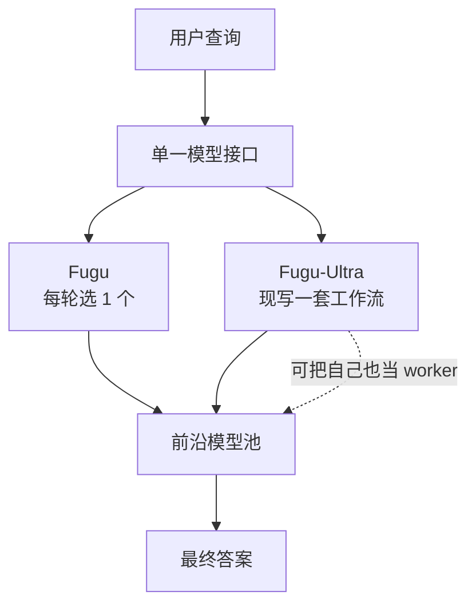
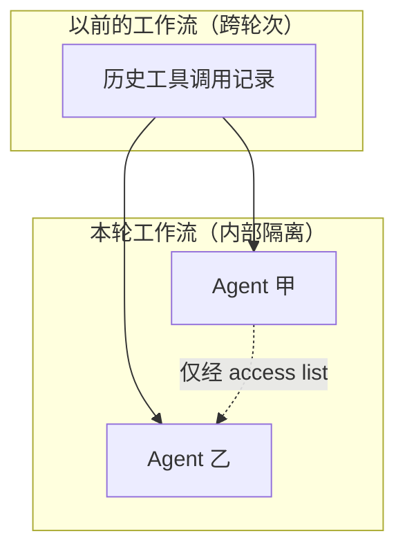

# Sakana Fugu：不再训一个更强的模型，而是训一个会调兵的模型

<!-- release-date: 2026-06-22 -->

> 本文依据 Sakana AI 的 **Sakana Fugu Technical Report**，即 arXiv:2606.21228v2、2026-06-23 提交、封面日期 2026-6-24 的版本，共 31 页。动笔前已核对 arXiv 官方提交历史：该论文只有 v1（2026-06-19）与 v2（2026-06-23）两版，v2 就是最新版；本地原件与官方 v2 逐字节一致。文中所有页码指 PDF 自身页码。文章会严格区分三件事：**报告写了什么**、**我们怎么解释它**、**哪些是外部补充**。

## 读之前：把八个词先说成人话

这是本站第一篇讲 agent 编排的解读，所以先把最基础的词摆平。默认你知道什么是神经网络，其余从零说起。

- **大语言模型（Large Language Model，LLM）**：读一段文字、逐个吐出下一个字的模型。它本身只会"生成文本"，不会自己去开终端、跑测试、改文件。
- **智能体（agent）**：让 LLM 不只输出文字，还能真的去做事——执行命令、读写文件、调用接口，然后把结果读回来再想下一步。
- **工具调用（function calling / tool use）**：LLM 输出一段结构化的"我要调用某个函数、参数是这些"，外部系统真的去执行，再把返回值塞回对话里。它是 agent 能动手的技术底座。
- **脚手架（agentic scaffold）**：包在模型外面的那一层程序。它决定模型看到什么上下文、能用哪些工具、出错了怎么重试、什么时候算做完。Claude Code、Codex 都是脚手架。同一个模型换个脚手架，成绩可以差很多——这正是本报告的出发点之一。
- **编排器（orchestrator）**：本文主角。它不直接解题，而是决定"这道题交给谁、怎么拆、谁看谁的中间结果、最后谁来汇总"。可以先粗暴理解成一个项目经理。
- **路由（routing）**：编排里最简单的一种——把一个请求丢给最合适的那一个模型，不拆任务、不组队。
- **多智能体（multi-agent）**：多个 agent 一起干一件事，需要约定谁跟谁说话、说什么。
- **推理时扩展（test-time scaling）**：不改模型权重，只在回答的时候多花算力——多想几轮、多采样几次、搜索几百个候选——来换更好的答案。

另外两个训练方法，后面会用到，这里只给一句直觉：

- **强化学习（Reinforcement Learning，RL）**：让模型自己生成答案，答对了就把它以后更容易这样生成，答错就压下去。适合"只知道最终对不对、不知道每一步该怎么写"的任务。
- **演化策略（Evolution Strategies，ES）**：完全不算梯度。在当前参数附近随机撒一批扰动，把每个扰动实际跑一遍打分，然后朝着"分高的那些扰动"的加权方向挪一步。适合参数少、打分很贵又很吵的场景。

## 一句话先说清

Fugu 不是一个更强的基座模型。它是一个**被训练出来的调度员**：自己是个语言模型，但它输出的不是答案，而是"谁去做、怎么做"。真正干活的是 Gemini、Claude、GPT 这些别人家的前沿模型。

报告发布了两个变体（PDF p.1、p.5）：

- **Fugu**：每一轮只挑**一个**工作模型（多轮任务里会逐轮重选），延迟接近直接调用一次前沿模型；
- **Fugu-Ultra**：为每个输入现场设计一套**多智能体工作流**，用更多延迟换质量。

它想证明的核心论点只有一句（PDF p.2–p.3）：

> **模型编排本身是一条独立的扩展轴。** 能力可以来自"把已有模型组合得更好"，而不只是来自"把下一个模型训得更大"。

如果只带走一句方法论，我会选：

> **当你的下游组件各有所长又互相不可替换时，最值钱的模块往往不是其中任何一个组件，而是那个知道什么时候该用谁的决策器。**

## 先讲矛盾：为什么"再训一个更大的模型"不再是唯一出路

报告的开场不是从架构讲起的，而是从一个观察讲起（PDF p.2）。

**第一，前沿模型正在分化，而且是在两个粒度上分化。**

领域粒度上：GPT 系列长期在数学推理上领先，Opus 系列长期在软件工程与网络安全上领先。报告举了三个具体例子：Gemini-3-Deep-Think 拿到 IMO 金牌水平、GPT-5.5 推翻了一个 80 年悬而未决的 Erdős 组合几何猜想、Claude-Mythos 在 OpenBSD 与 FreeBSD 里挖出大量零日漏洞（PDF p.2）。

领域**内部**的粒度上差别更细：同样是竞赛编程，Gemini-3.1-Pro 更擅长直接实现一个已知算法，而 GPT 系列更擅长规划、把多个算法思路组合起来啃最难的题（PDF p.2）。

**第二，能力不只属于模型，也属于脚手架。**

同一个模型，套上 Claude Code 这种成熟脚手架之后，成绩会显著变化，因为脚手架塑造了模型的交互轨迹、持续喂进环境反馈、把一次性生成变成迭代工作流（PDF p.2）。报告因此下了一个判断：**能力应当被理解为"模型 × 脚手架"的联合属性**，而不只是模型的属性（PDF p.2）。

**第三，于是矛盾出现了。**

用户面对的现实是：要用满这些互补的长处，你得自己管好几个 API key，自己判断这道题该给谁，自己设计多智能体怎么协作。而"哪个模型更强"往往不是按领域划分的，是**按具体问题**划分的——这种颗粒度的判断，人手工做不来。

已有的多智能体系统也没解决它。报告在相关工作里点了名（PDF p.3）：Du 等人与 Wang 等人的做法是**固定的**讨论轮次和交互结构；Chen 等人学了一个路由器，但只做**单步**的"选一个最匹配的模型"；Zhuge 等人把协作当成一张可学习的图。这些要么形态写死，要么只能一次性决定。

Fugu 的定位就落在这里，报告自己给出了两点差异（PDF p.3）：

1. 别人把多智能体工作流**暴露给用户**去设计、调参、运维；Fugu 把整个集体**藏在一个模型接口后面**，你就当在调一个模型。
2. 别人靠固定通信模式或单步路由；Fugu 是**被训练出来的编排器**，可以对每一个查询自适应地决定怎么用这个池子。

报告还给了一个我认为很好用的类比（PDF p.4）：Fugu 是**宏观版的模型融合（model merging）**。传统的模型融合在参数层面动手——权重平均、model soup、TIES、演化式融合配方；这类方法必须拿到权重，还要求架构或表示空间兼容，所以基本只能玩开源 checkpoint。而 Fugu 在**行为层面**做融合：把前沿模型当黑盒，学怎么路由、协调、验证、综合它们的输出。代价是拿不到内部激活，收益是**闭源模型、异构供应商、用户自定义约束都能纳入**。

这个类比值得记住，因为它同时解释了这条路线的能力上界和下界。

## 全景：两个变体，两套完全不同的机制

先把全局摆清楚。报告里 Fugu 和 Fugu-Ultra 不是"同一个方法的大小号"，而是**两个技术路线**，各自有各自的前作。

| | **Fugu** | **Fugu-Ultra** |
|---|---|---|
| 前作 | Trinity（Xu et al., 2025）（PDF p.5） | Conductor（Nielsen et al., 2025）（PDF p.7） |
| 每次决策产出 | 一个工作模型的编号 | 一整套自然语言工作流 |
| 一次决策涉及几个工作者 | 1 个，但每轮重选（PDF p.2、p.11） | 最多 5 步的工作流（PDF p.9） |
| 编排器要不要生成文字 | **不要**，只取隐状态过一个轻量头（PDF p.6） | 要，工作流本身就是它写的文本（PDF p.8） |
| 训练方法 | 监督微调 + 演化策略（PDF p.6–p.7） | GRPO 强化学习（PDF p.8） |
| 是否分配角色 | 不分配，选中即当 worker（PDF p.5） | 分配子任务、指定谁看谁（PDF p.8） |
| 定位 | 日常交互，延迟优先 | 最难的任务，质量优先 |

用一张精简流程图串起来。**这是机制示意，不是实测时序**；依据是 PDF p.5 的 Figure 2 与 p.8 的 §3.2.1 文字描述：

注意最后那条虚线：Conductor 框架允许把编排器**自己**也列进工作者池（PDF p.8）。这一句话在报告里只占一行，但它意味着 Fugu-Ultra 的协作拓扑可以递归展开。报告没有给这种递归用法的任何实验，所以本文也不替它展开。

站内已有的解读中，只有 [Kimi-K2.5](/reports/Moonshot/Kimi-K2.5) 提到过类似方向的 Agent Swarm 并行编排，思路可以对照着看，本文不展开那一篇的细节。

## 核心设计一：Fugu 把"编排"压缩成一次分类

### 旧问题：编排器自己就是延迟

如果编排器也是个语言模型，而它要用**生成文字**的方式说出"我决定叫 GPT-5.5"，那你在真正干活之前就先付了一次自回归解码的钱。对一个主打"延迟接近直接调用前沿模型"的产品（PDF p.2）来说，这笔钱是致命的。

### 新设计：不解码，只取一个隐状态

Fugu 的做法是（PDF p.5–p.6）：拿一个预训练语言模型当骨干，在最后一层隐藏层之后**并排**挂一个轻量预测头，与原本的 LM head 平行。给定隐状态 $h \in \mathbb{R}^d$，这个头直接输出 $L$ 个 logit，$L$ 是工作模型池的大小，每个 logit 给一个候选工作者打分。

关键在于：报告明确写了 Fugu 用的是**编排器的 logits，而不是它生成的文本**（PDF p.6）。因为提示词工程和真正的执行都外包给了被选中的前沿模型，编排器只需要吐出一个选择。于是系统可以在**很早的 token 位置**算出隐状态、过一下选择头、立刻把查询派发出去，完全跳过昂贵的自回归解码（PDF p.6）。

报告把这一点称作 Fugu 延迟画像的核心（PDF p.6）。

Figure 2 的图注（PDF p.5）还额外澄清了一件容易误读的事：图上那个标着 `<Head Input>` 的位置，旁边画了一串解码出来的文本只是**为了让人看懂位置**，轻量头实际吃的是那个位置的**内部隐状态**，不是解码后的文字。

### 与前作 Trinity 的差别：砍掉角色分配

Trinity 的协调器除了选模型，还要给它指派一个角色（Thinker / Worker / Verifier 之类）。Fugu 把这一层**去掉了**：选中的模型永远以 worker 身份被调用（PDF p.5）。

报告给的理由是因果链上很干净的一环：去掉角色分配把协调空间从"模型 × 角色"缩小成"只有模型"，决策更简单，编排器的延迟开销更小（PDF p.5–p.6）。

**这是一次明确的能力换延迟。** 报告没有做消融实验来说明这一刀砍掉了多少质量，所以我们只能记住它是一个**设计选择**，不是一个被证明无损的优化。

### 骨干怎么调：只训奇异值的尺度

轻量头训得动，但只训一个头，表示能力可能不够。全量微调骨干又太贵。Fugu 的折中是**奇异值微调**（PDF p.6），出处是 Sun 等人 2025 年的 Transformer²（Transformer-Squared）。

做法是：把骨干里选定的若干权重矩阵做奇异值分解，**只训练那些奇异值的缩放系数，正交分量整个冻住**。

用一句人话解释奇异值分解在这里的角色：任何一个矩阵都可以拆成"往哪些方向拉伸"（正交分量）和"每个方向拉伸多少"（奇异值）。只训奇异值，等于**保留模型原有的表示方向，只重新分配每个方向的重要性**。

- **收益**：可训练参数量极小，同时表示还是能朝路由问题适配（PDF p.6）。
- **代价**：适配能力天然受限——它没法造出骨干原本没有的方向。
- **可迁移启发**：当你要把一个通用骨干改造成一个**很窄的决策器**时，"冻方向、只调权重分配"是一个性价比很高的中间档，比只加一个线性头强，比 LoRA 更省，比全量微调稳。

顺带一提，Figure 2（PDF p.5）里那些红色斜线画的就是被做奇异值微调的矩阵；图右下角还标了轻量头可以是 `Linear | Low-rank | Sparse | Block-diagonal` 四种形态之一。**报告正文没有说最终用了哪一种**，也没给任何一种的对比。

### 第一阶段训练：把"谁更强"变成一个软标签

**旧问题**：路由是个分类任务，但"正确答案"是什么？如果只标"最强的那个模型是谁"，你会丢掉大量信息——第二名只差 1 分和差 40 分，训练信号完全一样。

**新设计**（PDF p.6）：先花大力气造标签。

报告收集了一大批**单步任务**，覆盖代码、数学、推理、语言理解和大量 agent 场景。集合记作 $\mathcal{D}$，每道题 $q_i$ 都**可验证**、都有标准答案 $s_i$。

然后对池子里每个工作模型 $\mathcal{M}_j$（$j = 1 \cdots K$），在同一道题上跑 $n$ 次，逐次和标准答案比对，得到 $n$ 个奖励。对模型 $j$ 取平均：

$$
\bar r_{i,j} = \frac{1}{n} \sum_{k=1}^{n} r_k^{\mathcal{M}_j}
$$

把 $K$ 个平均分拼成向量 $\mathbf{s}_i = (\bar r_{i,1}, \dots, \bar r_{i,K})$。到这一步为止，我们知道的是"在这道题上，每个模型平均能拿多少分"。

接着是关键一步——**不要把它压成一个硬排名**，而是用带温度的 softmax 变成一个软分布（PDF p.6，报告的公式 1）：

$$
p_i(j) = \frac{\exp(\bar r_{i,j} / \tau)}{\sum_{j'=1}^{K} \exp(\bar r_{i,j'} / \tau)}
$$

这里 $\tau$ 是温度：$\tau$ 越小，分布越尖，越接近"只认第一名"；$\tau$ 越大，分布越平，越像"这几个都行"。

最后拿这个分布当监督信号，同时训练轻量选择头和骨干的奇异值尺度，最小化 KL 散度（PDF p.6，报告的公式 2）：

$$
\mathcal{L}_{\text{SFT}}(\theta) = \frac{1}{|\mathcal{D}|} \sum_{i=1}^{|\mathcal{D}|} \mathbb{D}_{\text{KL}}\big( p_i(\cdot) \,\|\, \pi_\theta(\cdot \mid q_i) \big)
$$

$\pi_\theta(\cdot \mid q_i)$ 就是编排器在这道题上给出的选择分布。KL 散度衡量两个分布差多远，最小化它等于让编排器的分布去贴合"实测出来的能力分布"。

**收益**（PDF p.6）：比只分类单一最优标签，信号更丰富；当好几个工作者能力相近时，选择更稳健。而且因为监督完全来自**实测的工作者表现**，不需要编排器自己生成任何东西，这一阶段又快又稳，为后面的演化搜索提供了一个好起点。

**代价**：这套标签贵得很实在。$|\mathcal{D}|$ 道题 × $K$ 个模型 × $n$ 次重复，全是真金白银的前沿模型 API 调用。**报告没有给出 $|\mathcal{D}|$、$K$、$n$、$\tau$ 中的任何一个数字**，也没给这一阶段的成本。

**可迁移启发**：当你要训一个"选择器"而下游选项的质量可以被离线测出来时，**用测出来的分数做软标签，比用 argmax 做硬标签几乎总是更好**。这条和模型大小、和是不是 LLM 都无关。

### 第二阶段训练：为什么改用演化策略

**旧问题**：单步任务信号干净、覆盖广，但它**不像真实用法**（PDF p.7）。真实的编码助手是多轮的：有仓库上下文、反复编辑、工具调用、执行反馈，最后才谈完成与否。

更要命的是报告观察到的一个现象（PDF p.7）：**端到端轨迹会暴露出单步分数看不出来的差异**。有的模型高层推理很强、方案写得漂亮，但一到操作工具、编辑文件、对环境反馈做反应就不可靠；反过来，有的模型在独立推理基准上不起眼，塞进交互式编码脚手架里反而更稳。

一句话：**单步基准测的是"会不会做"，端到端轨迹测的是"在脚手架里做不做得成"。这两件事不是一回事。**

**新设计**（PDF p.7）：从 Claude Code、Codex、OpenCode 等真实编码助手环境里收集多轮轨迹，构造端到端任务集合 $\mathcal{E}$，然后用 **sep-CMA-ES** 直接优化端到端结果。

形式化是这样的：设 $s_t$ 是第 $t$ 轮的交互状态，也就是任务本身加上此前所有轮次的记录、工具调用和执行反馈。每一轮，Fugu 算出隐状态 $h(s_t)$，然后按

$$
\pi_\theta(a \mid s) \propto \exp f_\theta(h(s))_a
$$

采样一个工作者 $a_t$，滚出一条轨迹 $(s_0, a_0, s_1, a_1, \dots, s_T)$，长度 $T \le B$，$B$ 是固定的轮次预算。终局奖励 $R \in \{0, 1\}$，只记任务最后有没有完成（PDF p.7）。

**这里有一个极易读错的地方，值得停下来说清。** 报告在摘要与引言里说 Fugu"每个输入选一个工作者"（PDF p.2），很容易让人以为一个任务从头到尾只用一个模型。但上面这个式子说明：**"每个输入"指的是每一轮的输入**，而多轮任务里每一轮都会重新选。报告在 §4.1.2 里明确称之为"**逐步适应性**（per-step adaptivity）"，并举例说 Fugu 在 Terminal Bench 的解题过程中**在 GPT-5.5 与 Claude-Opus-4.8 之间来回切换，在关键的调试节点把 Opus 叫进来**（PDF p.11）。

所以 Fugu 与 Fugu-Ultra 的真正区别不是"一个模型 vs 多个模型"，而是：**Fugu 在时间上串行地换人，Fugu-Ultra 在一次决策里就把多个人组织成一张图。** 前者省的是"设计工作流"这一步的开销，不是"只用一个模型"。

目标函数直接就是期望终局奖励（报告的公式 3）：

$$
J(\theta) := \mathbb{E}_{\tau \sim \pi_\theta}\big[ R(\tau) \big]
$$

sep-CMA-ES 维护三样东西：父代参数 $\theta_t$、步长 $\sigma_t$、**对角**协方差 $D_t$。每一代采样 $\lambda$ 个候选（公式 4）：

$$
\theta^{(k)} = \theta_t + \sigma_t D_t z^{(k)}, \quad z^{(k)} \sim \mathcal{N}(0, I), \quad k = 1, \dots, \lambda
$$

每个候选的适应度 $J(\theta^{(k)})$ 靠**重复跑多次端到端任务、把终局奖励平均**来估计，然后取最好的 $\mu$ 个按适应度加权重组成下一代父代（公式 5）：

$$
\theta_{t+1} = \theta_t + \sigma_t D_t \sum_{j=1}^{\mu} w_j \, z_{j:\lambda}
$$

其中 $z_{j:\lambda}$ 是适应度排名第 $j$ 好的那个候选所用的扰动，$\{w_j\}$ 是重组权重。

"sep"指 separable，也就是协方差被限制成对角阵——只学每个参数各自的合适步长，不学参数之间的相关性。这让 CMA-ES 的存储和计算从参数量的平方降到线性。

**为什么是演化策略而不是梯度**？报告给了三条理由（PDF p.7）：

1. SFT 阶段已经把参数放在搜索空间里一块不错的区域，演化搜索只需要在更细的粒度上精修路由行为；
2. 它能**直接优化端到端任务结果**，哪怕成功信号稀疏又带噪声，也不需要为复杂多轮轨迹去构造可靠的排名标签；
3. 实证上，这一阶段**比在这些额外端到端任务上继续做监督微调稳定得多**。

第三条是报告的原话措辞（"substantially more stable"），但**报告没有给出对应的对比曲线或数字**。它属于作者观察，不是被展示的实验结果。

**这条因果链的关键其实是第一段做对了。** 演化策略最大的软肋是维度——参数一多，随机撒点就找不到方向。Fugu 之所以敢用它，是因为前面两个设计已经把可训练参数压到极小（一个轻量头 + 一堆奇异值尺度）。**是"决策式参数化"让演化优化变得可行**，报告在 p.6 结尾就明说了这一点。

**代价与边界**：每评一个候选，都要真的把端到端任务跑一遍——那意味着真实的多轮工具调用和真实的前沿模型账单。$\lambda$、$\mu$、重复次数、$B$、总代数，**报告一个都没给**。这一阶段到底有多贵，外部无法估计。

**可迁移启发**：如果你的目标函数只能通过"跑一遍真实系统"来测量，而且噪声很大、不可导，那么**先把可训练参数压到几千个量级，再上无梯度优化**，往往比强行搭一条可导的代理链路更实际。顺序不能反：先减参数，才谈得上演化。

## 核心设计二：Fugu-Ultra 把"编排"写成自然语言

Fugu 的路子是"少想一点，快点派活"。Fugu-Ultra 走的是相反的极端。

### Conductor 任务：一个工作流步骤长什么样

Fugu-Ultra 建立在 Conductor 框架上（PDF p.7–p.8）。Conductor 用强化学习训练一个语言模型去**给别的 LLM 写提示词并协调它们**，输出的是**用自然语言写的完整 agent 工作流**：怎么切分任务、把哪些子任务分给谁、用什么通信策略。

工作流的定义非常朴素（PDF p.8）。每一个**工作流步骤**是三样东西：

| 字段 | 类型 | 含义 |
|---|---|---|
| 子任务 | 一个字符串 | 用自然语言描述这一步要做什么 |
| worker id | 一个整数 | 指派给池子里的哪个 agent |
| access list | 一组索引 | 把**前面哪几步的结果**放进这个 worker 的上下文 |

最后一步的输出就是 Conductor 对外的回答 $o_i$。

**access list 是整个设计里最关键的一个字段**，值得停一下。它同时定义了两件事：谁能看到谁的中间结果，以及因此形成的通信拓扑长什么样。报告点明，靠这三元组序列就能表达从简单的 best-of-N、顺序链式，一直到任意可并行的树状结构（PDF p.8）。

也就是说，**拓扑不是被枚举出来的选项，而是 access list 的自然副产品**。这是一个很干净的表示设计：你不需要为"要不要辩论""要不要投票""几层树"各定义一个开关，只要能自由写 access list，这些形态就都在表达范围内了。

### 奖励：为什么中间那一档是 0.5

工作流写完之后真的会被执行：按指定 worker 发提示词，每一步的上下文包含 access list 里指明的那些子任务与回答（PDF p.8）。

奖励由两个递进条件决定（PDF p.8）：

1. **格式条件**：如果从回答里解析不出子任务列表、worker 列表和 access list，$r_i = 0$。
2. **正确性条件**：格式合法的工作流执行完之后，最终输出 $o_i$ 与标准答案 $s_i$ 匹配则 $r_i = 1$，否则 $r_i = 0.5$。

这个 0.5 值得单独说。它把"**格式对但答错**"和"**格式就不对**"明确分成了两档。含义很直白：**先学会写出一个能跑的工作流，再学会写出一个能答对的工作流。** 如果两者都给 0，模型在早期几乎收不到任何有用梯度，因为它连"合法输出"这个门槛都还没跨过。

**可迁移启发**：任何"模型要产出一段会被机器执行的结构化输出"的 RL 任务，都值得把奖励拆成"可解析"和"结果对"两级。这是一条几乎零成本的课程学习。

### 训练：GRPO，而且不带 KL 惩罚

Fugu-Ultra 用 GRPO 训练（PDF p.8，引自 Shao et al., 2024）。报告写出的目标函数是：

$$
J(\theta) = \mathbb{E}_{q \sim D,\, \{o\}_1^G \sim \pi_\theta(\cdot \mid q)} \left[ \frac{1}{G} \sum_{i=1}^{G} \Big( \min\big(r_i A_i,\ \mathrm{clip}(r_i, 1-\epsilon, 1+\epsilon) A_i\big) - \beta\, \mathbb{D}_{\text{KL}}(\pi_\theta \| \pi_{\text{ref}}) \Big) \right]
$$

拆开看它在干三件事：

1. **分组采样**：对同一个查询 $q$ 采样 $G$ 个不同的工作流，跑完拿到 $G$ 个奖励。
2. **组内标准化算优势**（报告的公式 7）：

$$
A_i = \frac{r_i - \mathrm{mean}(\{r_1, \dots, r_G\})}{\mathrm{std}(\{r_1, \dots, r_G\})}
$$

也就是"这条工作流比这一组的平均水平好多少"。GRPO 的省钱之处就在这里——**用同组样本的均值当基线，不用额外训一个价值网络**。

3. **裁剪 + KL 约束**：$\mathrm{clip}$ 防止单步更新迈太大，$\beta \mathbb{D}_{\text{KL}}$ 把新策略拴在参考策略附近。

但这里有一个必须读到的细节：训练设置一节明确写了 **"with GRPO and without any KL divergence penalty"**（PDF p.9）。也就是实际训练时 $\beta = 0$，公式里那一项被关掉了。

**这不是笔误，而是一个有含义的选择。** KL 惩罚的作用是别让模型偏离原始语言模型太远（防止胡言乱语、防止能力坍缩）。关掉它，等于允许编排器为了写出好工作流而大幅偏离原始语言分布——这在这里说得通，因为它的输出**不是给人读的散文，而是给机器执行的调度指令**，"像个正常语言模型"本身没有价值。

**代价**：放开 KL 的常见风险是训练不稳、以及输出多样性坍缩到少数几个模板。**报告没有讨论这些风险，也没给任何训练稳定性的曲线或指标。**

### 多智能体里的函数调用：orchestration collapse

这是全篇我认为最有价值的一节（PDF p.8–p.9），因为它描述的是一个**只有在多 agent 场景才会出现**的新问题。

**旧问题**：单 agent 系统里，函数调用循环**不需要额外的持久化记忆**。消息记录本身就承载了全部上下文，而且只有一个可能的接收者（PDF p.8–p.9）。

**新问题**：在 Fugu-Ultra 里，**任何一个 agent 都可能在任何时刻发起函数调用**。于是系统必须记住：这个调用是谁发的、那个 agent 在整套 Conductor 工作流里坐在什么位置。否则函数返回值就路由不回正确的 agent，agent 之间的通信拓扑也维持不住（PDF p.9）。

也就是说，编排器必须在整个"用户—agent 交互"过程中**追踪 Conductor 的工作流状态**：选了哪些模型、通信拓扑长什么样、分给谁什么子任务。

然后是两条方向相反的约束，报告把它们并列讲，很清楚。

**约束一：工作流内部要隔离（intra-workflow agent isolation）**

报告给出了一个新名词和一个具体的失败模式（PDF p.9）：

> **编排坍缩（orchestration collapse）**：第一个与环境交互的 agent 会把轨迹定死，后面所有 agent 都被带着沿它开的路走，于是后续 agent 的贡献变成冗余。

这个失败模式很好理解——如果第二个 agent 一上来就看到第一个 agent 的完整探索记录，它极大概率会顺着那条路继续，而不是独立想一遍。你请了三个专家，结果拿到的是一个专家和两个复读机。

Fugu-Ultra 的做法是：**一个 agent 只能通过 access list 看到另一个 agent 的动作和输出**，除此之外它看到的记录里只保留自己的动作（PDF p.9）。access list 之外的一切互不可见。

于是 access list 在这里的角色又深了一层：它不只是通信拓扑，**它是唯一的信息泄漏通道**，而且是编排器可以逐题设计的。

**约束二：跨工作流又必须共享（persistent shared memory）**

但完全隔离也不对（PDF p.9）。多轮对话里，agent 需要记得自己跟环境交互过什么，否则会反复调同一批工具、重新发现同一批东西，还攒不下解决问题所需的背景。

解法是把隔离和共享**按边界切开**：允许**跨工作流**的共享记忆——agent 可以看到**以前的**工作流里发生过的工具调用；但在**当前**工作流内部，agent 之间依然隔离，只有 access list 指定的部分例外（PDF p.9）。

我用一张图把这两条约束画在一起。**这是根据 PDF p.9 §3.2.2 的文字重画的机制示意，报告本身没有这张图**：

横向（本轮内部）默认封死，只留 access list 一条缝；纵向（跨轮次）全开。

**收益**：既避免了编排坍缩，又不让 agent 失忆。

**代价与边界**：跨工作流共享记忆会随对话变长而单调增长，这是典型的上下文膨胀问题。**报告没有说这块记忆怎么存、怎么裁剪、上限是多少，也没给任何相关的开销数字。**

**可迁移启发**：这一条我认为最普适——**当你让多个模型协作时，"谁能看到什么"必须是一个被显式设计的变量，而不是"把所有上下文都拼给所有人"的默认行为**。共享上下文看起来更聪明，实际上会让协作退化成串行复读。而且隔离的边界最好按"任务内 vs 任务间"来划，而不是按 agent 划。

### Fugu-Ultra 的训练设置

报告给出的全部信息是（PDF p.9）：

- 从一个**普通语言模型的预训练 checkpoint** 起步（没说是哪个）；
- 被要求设计**最多 5 步**的工作流；
- 工作者池是"一个多样的前沿 LLM 池，**包括** Gemini-3.1-Pro、Claude-Opus-4.8、GPT-5.5"——注意是"包括"，不是"由……组成"；
- 多轮任务里，任何 agent 都可以**无限次**与用户环境交互；
- 用 §3.2.1 的 Conductor 奖励 + GRPO，**不加 KL 惩罚**；
- 训练数据是**公开数据**与**专家设计的端到端环境**（模拟真实 agent-用户交互）的混合，后者与 §3.1.3 里用的是同一批。

报告说，大规模训练这些任务让 Fugu-Ultra"辨别工作者池中专长与技能、以及如何最优组合它们"的能力有了实质提升（PDF p.9）。这是一句**定性描述，没有对应的消融或曲线**。

### 训练之后自己长出来的行为

报告观察到（PDF p.8）：训练之后，模型会**自发涌现**出问题分解、针对不同 agent 长处做提示词工程的子任务，以及"按任务需要在独立工作和 agent 间协作之间切换"的通信拓扑。

这是作者的观察陈述。后面 §4.4 给出的是**若干条轨迹叙事**来支撑它（详见下文"只有演示支撑"一节），不是统计量。

## 证据分层之一：被基准数字支撑的部分

这是 agent 类报告最容易糊弄人的地方，所以我把证据分成三档来读：**有基准数字的**、**有小样本量化实验的**、**只有演示的**。先看第一档。

### 先看评测设置里一个关键选择：故意用最简脚手架

报告的评测覆盖 11 个基准（PDF p.10）：agent 化编码用 SWE Bench Pro 与 Terminal Bench 2.1；科学知识用 GPQA Diamond；跨学科推理用 Humanity's Last Exam（含多模态样本、不给工具）；竞赛编程用 LiveCodeBench v6（题目取自 2023 年 5 月至 2025 年 4 月）与 LiveCodeBench Pro（2025 年第二季度的可评分切片）；带科学背景的编码用 SciCode；多模态图表理解用 CharXiv Reasoning；对话用 $\tau^3$ Banking（以 GPT-5.2 当用户模拟器）；长上下文用 MRCRv2 与 Long Context Reasoning。报告强调这些基准在训练期间**未被模型见过**，用于检验泛化（PDF p.10）。

其中有一个方法论选择值得单独指出：agent 化编码这两项，报告刻意使用 **Mini-SWE-agent** 和 **Terminus 2** 这类**最简评测脚手架**，理由是"为了最大限度暴露 Fugu 的底层能力"（PDF p.10）。

这个选择在 agent 类评测里意义重大。前面讲过，能力是"模型 × 脚手架"的联合属性——那么用一个**厚**脚手架（比如完整的 Claude Code）测出来的分数，就分不清是模型强还是脚手架强。用最简脚手架，等于把脚手架这一项尽量归零，让分数更多反映编排本身。

**这是一个加分项。** 但它也带来一个必须说清的后果：**这些分数不能直接翻译成"用 Fugu 配上你自己那套厚脚手架能拿到的成绩"**，方向可能是任意一边。

### 主表怎么读

Table 1 是模型卡（PDF p.11），11 个基准，5 列。工作者池里的三个模型自己也在列——报告说得很明白：**要衡量 Fugu 有没有"放大"工作者的能力，就得跟这些工作者本人比，而且给它们配同样的最大推理强度**（PDF p.10）。这个对照设置是干净的。

| 基准 | Fugu-Ultra | Fugu | Claude Opus 4.8 | Gemini 3.1 | GPT-5.5 |
|---|---:|---:|---:|---:|---:|
| SWE Bench Pro | **73.7** | 59.0 | 69.2 | 54.2 | 58.6 |
| Terminal Bench 2.1 | **82.1** | 80.2 | 74.6 | 70.3 | 78.2 |
| LiveCodeBench | **93.2** | 92.9 | 87.8 | 88.5 | 85.3 |
| LiveCodeBench Pro | **90.8** | 87.8 | 84.8 | 82.9 | 88.4 |
| Humanity's Last Exam | **50.0** | 47.2 | 49.8 | 44.4 | 41.4 |
| CharXiv Reasoning | **86.6** | 85.1 | 84.2 | 83.3 | 84.1 |
| GPQA Diamond | **95.5** | **95.5** | 92.0 | 94.3 | 93.6 |
| SciCode | 58.7 | **60.1** | 53.5 | 58.9 | 56.1 |
| $\tau^3$ Banking | 20.6 | **21.7** | 20.6 | 8.4 | 20.6 |
| Long Context Reasoning | 73.3 | **74.7** | 67.7 | 72.7 | 74.3 |
| MRCRv2 | 93.6 | 86.6 | 87.9 | 84.9 | **94.8** |

（全部数字来自 PDF p.11 的 Table 1；粗体是该行最高分。）

**几个必须说清的读法：**

1. **11 行里有 10 行的第一名是 Fugu 系**。唯一的例外是 MRCRv2——GPT-5.5 的 94.8 高于 Fugu-Ultra 的 93.6。报告在正文里没有评论这一行。
2. **在 4 行上，快的 Fugu 反而赢了慢的 Fugu-Ultra**：SciCode（60.1 vs 58.7）、$\tau^3$ Banking（21.7 vs 20.6）、Long Context Reasoning（74.7 vs 73.3）、GPQA Diamond（并列 95.5）。**Ultra 不是 Fugu 的严格超集**。报告同样没有评论。
3. **Fugu（快档）在 SWE Bench Pro 上只有 59.0，比 Opus 4.8 的 69.2 低了 10 分以上**。"Fugu 全面超越前沿模型"这句话在这一行是不成立的。有意思的是，同样是 agent 化编码任务，Fugu 在 Terminal Bench 上却以 80.2 反超了 Opus（74.6）和 GPT-5.5（78.2）。**同一个策略在两个同类基准上表现相反，报告没有解释这个落差**，我也不打算替它编一个理由。
4. **$\tau^3$ Banking 那一行的绝对值全都很低**（最高 21.7）。这说明这个基准对所有参赛者都很难，1 分的差距能读出多少信息，值得保留问号。
5. **基线分数的来源不统一**。表注写"基线分数尽可能采用厂商自报"（PDF p.11），附录 A 进一步交代：LiveCodeBench 的基线来自 vals.ai，HLE 的基线来自厂商或 Artificial Analysis，SciCode 与 Long Context Reasoning 的基线来自 Artificial Analysis 榜单，Terminal Bench 用厂商自报或 tbench.ai 榜（PDF p.26）。**Fugu 自己的分是自测的，基线大多不是**。这不等于数字有问题，但它意味着这不是一次同一套流水线跑出来的严格同台对比。

### "5-6% 的领先"是相对不是绝对

报告说 SWE Bench Pro 和 Terminal Bench 上的领先"都在相对次优者 5-6% 的范围"，并称这个幅度**与这些前沿供应商的一整代升级相当**（PDF p.10）。

自己算一遍：SWE Bench Pro 是 73.7 对 69.2，绝对差 4.5 分，相对 6.5%；Terminal Bench 是 82.1 对 78.2，绝对差 3.9 分，相对 5.0%。**所以"5-6%"说的是相对提升，不是百分点**。第一次读很容易读成后者。

"相当于一整代升级"这个说法，报告用 Figure 3 来支撑（PDF p.12）：那是一张 SWE-bench Pro 解决率随时间的折线图，把 Opus 4.5（45.9）→ 4.6（53.4）→ 4.7（64.3）→ 4.8（69.2）、GPT-5.2（55.6）→ 5.3（56.8）→ 5.4（57.7）→ 5.5（58.6）、Gemini 3（43.3）→ 3.1（54.2）这些代际点连起来，把 Fugu-Ultra 的 73.7 画在 Opus 4.8 之后的位置上。

这张图**在视觉上是有说服力的，但它是一个类比而非因果论证**。它说明"4.5 分的跃升在历史上确实相当于一次版本升级的幅度"，它不能说明"Fugu-Ultra 等价于下一代 Opus"。

### 路由分布：适应性的第一手量化证据

Figure 5（PDF p.13）是我认为全篇最有信息量的一张图，因为它是**唯一直接量化"编排行为"本身**的证据，而不是量化最终成绩。它给出三个基准上，两个 Fugu 变体各自把任务分给三个 worker 的比例：

| 基准 | 编排器 | Gemini 3.1 Pro | Claude Opus 4.8 | GPT-5.5 |
|---|---|---:|---:|---:|
| HLE | Fugu-Ultra | 0.34 | 0.31 | 0.35 |
| HLE | Fugu | 0.10 | 0.38 | 0.52 |
| Terminal Bench | Fugu-Ultra | 0.02 | 0.34 | 0.64 |
| Terminal Bench | Fugu | 0.00 | 0.14 | 0.86 |
| GPQA-Diamond | Fugu-Ultra | 0.56 | 0.25 | 0.19 |
| GPQA-Diamond | Fugu | 0.46 | 0.06 | 0.48 |

（数值读自 PDF p.13 的 Figure 5。）

**这张表确实支撑了"分布随领域变化"这个主张**：Terminal Bench 上 GPT-5.5 拿到 0.64 / 0.86，而在 GPQA-Diamond 上掉到 0.19；Gemini 在 Terminal Bench 上几乎被弃用（0.02 / 0.00），在 GPQA 上却升到 0.56 / 0.46。这是很强的对比。

HLE 那一行也对得上正文说的"高度均衡"——Fugu-Ultra 是 0.34 / 0.31 / 0.35，几乎是三等分。报告解释说，HLE 本身就是多学科的，但**按类别拆开**看，数学题主要给 GPT-5.5，化学生物题主要给 Gemini（PDF p.12）。**这个按类别的细分只有文字描述，没有对应的数据图。**

**但这里有一处正文与图对不上。** 正文说"在 GPQA-Diamond 上，Gemini-3.1-Pro 是领先模型，**两个 Fugu 模型都把编排集中在 Gemini 周围**"（PDF p.12）。可 Figure 5 里，Fugu 给 Gemini 的是 0.46，给 GPT-5.5 的是 0.48——**GPT-5.5 反而略高**。Fugu-Ultra 那一行（0.56）成立，Fugu 那一行不成立。这是报告内部的一处小矛盾。

## 证据分层之二：小样本量化实验

§4.3 与附录 B 里的实验都有真数字，但样本量都很小，需要单独一档来看。这一节报告自己的定位是"补充聚合基准分数"（PDF p.13），并且明确说明：三个前沿基线（Gemini 3.1 Pro high、Opus 4.8 max、GPT 5.5 xhigh）被匿名成 Model A/B/C，而且**映射关系在不同例子之间被刻意打乱**，目的是让讨论聚焦在行为差异而非品牌（PDF p.13）。

**读者必须记住这一点：Table 2 里的 Model A 和 Table 3 里的 Model A 不一定是同一个模型，跨表比较是无效的。**

### AutoResearch：设置最严谨的一个

任务来自 Karpathy 的 AutoResearch（PDF p.13）：agent 反复编辑一条小型 GPT 训练流水线，每次改动都真跑一遍，只保留能降低验证 bits-per-byte（BPB，越低越好）的修改。

设置是这一批实验里最扎实的（PDF p.13）：所有系统共用同一套 AutoResearch 脚手架、数据集、评估协议和每次实验的算力预算，都在**单张 H100** 上；每个 agent 跑 **123 次自主实验**（每个种子约 14 小时挂钟时间）；每个系统跑 **3 个独立随机种子**。唯一的区别就是后端——基线是单个前沿模型，Fugu-Ultra 是多模型编排。

结果（PDF p.14 的 Table 2）：

| Agent | 平均最优验证 BPB | 最佳单种子 |
|---|---|---|
| Fugu-Ultra | 0.9774 ± 0.0019 | 0.9748 |
| Model C | 0.9781 ± 0.0011 | 0.9766 |
| Model B | 0.9793 ± 0.0025 | 0.9758 |
| Model A | 0.9822 ± 0.0017 | 0.9799 |

报告自己的评价相当克制，值得原样转述（PDF p.14）：这些提升**在绝对量级上是微小的**（最佳单种子对三个基线的绝对领先分别是 0.0018、0.0010、0.0051 BPB），"正如一条已被高度优化的训练流水线所应预期的"，但它们**在均值和最佳值两个口径上都一致**，而且**贯穿整个优化过程**，不是在某一个检查点上突然出现的。

报告还提炼了两个模式（PDF p.14）：第一，Fugu-Ultra 早期只是"有竞争力"，**在训练中段之后才拉开**，作者据此推测编排的价值在搜索空间从"粗配置调整"转向"精细的优化器与调度调参"之后才显现；第二，Model B 的最佳种子成绩不错，但**跨种子方差更大**（±0.0025），说明它的优化不够可靠，而 Fugu-Ultra 同时改善了峰值和一致性。

**我的判断**：这是全报告最接近"受控实验"的一个。同脚手架、同预算、同硬件、多种子、报方差，做法是对的。但 **0.9774 vs 0.9781 的差距（0.0007）小于 Fugu-Ultra 自己的标准差（0.0019）**，3 个种子也很少。报告说"初步展示（initial demonstration）"是准确的措辞；把它当成"编排显著优于单模型"的证据就过头了。

### 古典日文假名的阅读顺序：真正有意思的那个

这个实验（PDF p.15–p.16）我认为比 AutoResearch 更能说明问题，因为它的设置很特别。

任务是恢复**假名消息**（kana-shōsoku）的阅读顺序。这类信件用「散らし書き」（chirashigaki，散写）风格写成：字符被刻意以不同大小散布在纸面各处，连受过训练的古典日语读者都觉得吃力（PDF p.15）。

**为什么这个任务特别**：报告说得很直接——这里没有既有方法，也没有公开基准，据他们所知**不存在这个任务的数据集**；他们自己请领域专家手工标注了 **25 页**（PDF p.15）。所以这**正是数据驱动学习用不上的场景**，不是因为学出来的模型会弱，而是因为**训练数据不存在，也没法轻易造出来**。

于是解法变成：**不训模型，让 Fugu 写一个程序**。专家能口头说出规则（字符按相对大小分组、分成不同的竖直块），难点是把这套只可意会的定性规则变成能跑的算法。Fugu 写一个"阅读顺序预测器"——一个吃字符检测框、吐出阅读顺序的函数——然后用**推理时扩展**改进它（PDF p.15）。

具体用的是**束搜索（beam search）**：每一轮模型提出若干新的预测器变体，每个都被执行、被打分，最好的几个留下来继续变异，反复多轮（PDF p.16）。目标是与标注阅读顺序之间的**归一化编辑距离（NED）**。

结果（PDF p.16 的 Table 3，25 页的平均 NED，越高越好）：

| 模型 | 平均 NED |
|---|---|
| Fugu-Ultra | 0.776 |
| Model A | 0.642 |
| Fugu | 0.473 |
| Model B | 0.449 |
| Model C | 未完成任何一次运行 |
| 种子启发式 | 0.116 |

**这个实验的关键在于控制变量的方式**：同一套束搜索驱动所有模型，所以结果反映的是**驱动搜索的那个模型**，而不是搜索本身（PDF p.16）。报告的措辞是"在一个由模型而非搜索决定天花板的任务上，Fugu-Ultra 是最强的引擎"。

几点要注意：

- **25 页是很小的样本**，而且是团队自建自评的数据集，没有第三方可复核。
- Model C **在高推理强度下没能跑完搜索**（PDF p.16），所以它那一格是空的，不是 0 分。
- Figure 7（PDF p.15）展示了单页的可视化：Fugu-Ultra 在那一页 NED 0.80，一个前沿基线 0.24，图注还说"在这一页上两个前沿模型都是约 0.24"。**单页可视化是演示，Table 3 才是证据。**
- Table 3 的图注说"Models A and B are anonymized frontier baselines"，但表里出现了 A、B、C 三个。**这是一处小的表述疏漏。**

**可迁移启发**：这个例子给出了一条很实际的路线——**当任务缺数据但规则可被专家口述时，让模型去合成一个程序，再用搜索优化这个程序**，比"想办法凑数据训模型"更可行。而且这条路线里，模型的价值体现在**提出好的候选程序**上，搜索只负责筛。

### 附录 B 的三个：数字更少，边界要看清

**B.1 魔方求解器合成**（PDF p.27）：让模型一次性写出一个 `solve(facelet)` 函数，只能用 Python 标准库，然后在**冻结的 300 个打乱魔方**上执行、由独立引擎检验。

| 模型 | 求解率 | 平均 HTM | 平均每个魔方耗时 |
|---|---|---|---|
| Fugu-Ultra | 300/300 | 19.72 | 72.6 s |
| Model A | 300/300 | 19.76 | 67.2 s |
| Fugu | 300/300 | 21.15 | 1.9 s |
| Model B | 0/300 | — | — |
| Model C | 0/300 | — | — |

（数据来自 PDF p.27 的 Table 4。）

报告自己点出的重点不是解法长度，而是**可靠性**：三个前沿基线里有两个交出的求解器**在解出第一个魔方之前就崩了**（PDF p.27）。这是一个有意思的观察——"写出能跑的代码"和"写出漂亮的代码"是两个不同的能力。

解法长度上 Fugu-Ultra 平均 19.72 HTM，而"上帝之数"是 20，也就是任意状态都能在 20 步内解开的理论上界；报告还给了逐例对比：对 Model A 是 **7 胜 293 平 0 负**（PDF p.27）。这个逐例统计比平均值有力，因为它排除了"平均值靠少数极端样本拉开"的可能。

Fugu 那一档展示的是另一个权衡：多花约一步（21.15 HTM），换来 **1.9 秒**的求解速度，约为深搜求解器 70 秒的 **35 倍**快（PDF p.27）。

**边界**：300 个魔方是同一个冻结集合；每个模型只有**一次**尝试（"in a single attempt"）；没有多次重复，所以"Model B/C 崩溃"这个结论是**单次采样**的结果。

**B.2 盲棋**（PDF p.28–p.29）：模型只拿到开局着法列表，之后每轮只收到对手的一步坐标记号，全程不给棋盘、不给合法着法列表、不维护外部记录，得自己在脑子里记住每一次吃子、易位和升变。

结果是 Fugu 赢了 4 局全部——对三个前沿基线各一局，外加一局对被限制到约 2100 Elo 的 Stockfish 18。平均每步失分（ACPL）Fugu 约 **18–30**，对手约 **46–72**；四局中 Fugu 没有一次 blunder 或 mistake，对手至少各有一次（PDF p.29）。

**报告自己就把边界写死了，这一点值得表扬**：原文写着这些是"selected, illustrative games, not an aggregate or a win rate"（PDF p.28 图注），正文也重申"我们把这些作为示例，而不是胜率的估计"（PDF p.29）。可复现性也做得不错——两个提示词模板原样贴在 Listing 1 里（PDF p.29），四局棋的完整着法与终局 FEN 全部列在附录 C（PDF p.30–p.31），而且明说这个任务**不使用任何 agent 脚手架**，每个模型都通过裸 API 在同一套提示词下被询问，所以测的是模型本身而不是外围工具（PDF p.29）。

所以：**4 局棋不是统计证据**。它能支持的结论只有一条——Fugu 在这四局里确实把整盘棋记住了，而且下得准。它不能支持"Fugu 盲棋比 Opus 强"。

**B.3 在线股票交易**（PDF p.29–p.30）：从 1 万美元起，走 50 周，每周只看得到当周及以前的数据，选方向（买/持/卖）和仓位（25%/50%/100%），下一周价格才揭晓。五次运行下来，Fugu-Ultra 涨到 **11,943.22 ± 633.86 美元（平均 +19.43%）**，其余前沿模型都低于 +15%（PDF p.30）。

这个实验的边界，**报告自己在脚注里写得比正文还清楚**（PDF p.29 脚注 3）：只用了单只匿名股票、单一 50 周历史窗口，目的是比较"顺序的、无未来信息的决策"，**不是要证明可泛化的交易表现**；结果可能无法迁移到其他资产、其他时期或真实市场。

我完全同意这个自我限定，并且要再加一句：**单只股票单个窗口的 5 次运行，与"会不会交易"基本无关**。它测的是"能不能在一个带反馈的长序列决策里保持一致的策略"，把它读成投资能力是误读。

### CAD 生成：这一档里唯一纯定性的

§4.3.3（PDF p.16–p.17）让各模型从文字指令生成一个**机械光圈**（相机光圈那种机构）的 CAD 模型：要有多片叶片、外销、旋转环，以及一个开合过程中几何保持自洽的中心孔。各模型在 Codex 里用 CAD skill 生成，团队**定性评估**产出的 STEP 文件，并加了一个基于叶片销位置的规则动画来检查动态行为。

结论是 Fugu-Ultra 的叶片能绕外销旋转、中心孔平滑开合，其他模型"叶片没能完全盖住中心、外连杆机械强度不足、或者孔闭不拢"（PDF p.16）。

**这里没有任何指标、任何评分、任何评审人数。** 报告自己也补了一句"结果会随提示词和不同试次变化"，只是说 Fugu-Ultra"始终产出定性上很强的结果"（PDF p.16）。

**这一条应当被归类为演示，不是实验结果。**

## 证据分层之三：只有演示支撑的部分

§4.4"最优策略与拓扑"（PDF p.16–p.18）是全篇最好读、也最需要警惕的一节。它由**六段轨迹叙事**构成，全部是单个案例，全部没有频次统计。

我把它们整理成一张表，是为了让"这些故事到底说明了什么"更清楚：

| 策略 | 案例 | 出处 | 观察到的行为 |
|---|---|---|---|
| 辩论与聚合 | HLE 里一道《英雄无敌 3》游戏机制题 | PDF p.17 | 树状拓扑，Gemini 在树根做汇总，两个叶子（Gemini + GPT）各自独立作答，两者都只答对一部分，Gemini 综合出全对答案 |
| 辩论与聚合 | 计算某 Calabi-Yau link 的 Crowley–Nordström 不变量 | PDF p.17 | 树状拓扑，GPT 在根、Gemini 与 Opus 在叶；GPT 通过重新推导谱数解决了两个叶子在一个整数上的分歧 |
| 建造与调试 | Terminal Bench 里搭一个托管 vectorops 包的 PyPI 服务器 | PDF p.18 | GPT-5.5 先建；Opus 再来找问题，指出用了普通 `http.server` 而非 `pypiserver`、wheel 是 `zipfile` 手搓的很脆、Debian-slim 环境没管好；还发现 GPT 的可达性检查来自一个孤儿进程 |
| 建造与调试 | Terminal Bench 的 merge-diff-arc-agi 任务 | PDF p.18 | GPT 搭脚手架并合并，一收到冲突就换 Opus 接手，Opus 发现所需映射不来自任何一个分支，从第一性原理推出解 |
| 建造与调试 | SWE Bench Pro 里一个 OTP 设备的校验错误 | PDF p.18 | Opus 一路查到 TOTP 库里走进死胡同；换 GPT 从头看，发现是客户端并发 bug；再交回 Opus 修 |
| 请专家 | Terminal Bench 的 feal-differential-cryptanalysis | PDF p.18 | 先用 Opus 的安全与工程能力搭出选择明文攻击，再让 GPT 以数学专家身份从第一性原理重推整个攻击，逐比特推出必需的差分常数 |

这些故事**读起来很有说服力**，而且我认为它们确实有价值——它们展示了"编排"在具体上下文中长什么样，这是纯数字给不了的。前两个案例还引出一个真正有意思的论点（PDF p.17）：

> 现有多智能体系统（报告点名了 OpenRouter Fusion 和 Mixture-of-Agents）**必须固定一个模型永远当最终综合者**，不管它适不适合这个任务。这类系统因此被那个固定聚合者的能力卡住，在它专长之外的任务上很难超过它。Fugu-Ultra 能**逐题更换聚合者**——知识题用 Gemini 当根，数学题用 GPT 当根——从而绕开这个瓶颈。

**"聚合者本身应当是被选择的变量"** 是一条很好的设计洞见，我认为它是这一节最有迁移价值的东西。

但必须把话说清楚：

1. **这六段全是单例**。报告没有给出"树状拓扑出现的频率""换聚合者的比例""build-debug 交替的平均次数"这类统计量。
2. 它们**都是成功案例**。报告没有展示任何一次编排失败的轨迹，也没有讨论失败模式（除了 §3.2.2 里的编排坍缩，而那是设计动机不是实测）。
3. 报告在 §4.1.2 提到 Fugu 在 Terminal Bench 上"在关键调试点切到 Claude-Opus-4.8"（PDF p.11），依据同样是轨迹分析，也没有频次。

**这就是 agent 类报告最容易出现的问题**：轨迹叙事天然好看，但它证明的是"这种行为可能发生"，不是"这种行为通常发生"。**Table 1 的分数和 Figure 5 的分布是证据；这六段故事是插图。** 两者都有用，但不能互相替代。

## 报告没有写的：一份诚实的缺口清单

这一节我花了力气逐条核对，因为这份报告的**遗漏比它写的东西更能定位它的性质**。

**1. 完全没有基础设施章节。**

摘要里明确承诺要讲"**infrastructure and core design principles that turn these methods into a production system**"（PDF p.1）。但正文从头到尾**没有任何基础设施内容**。全文搜索 infrastructure 只出现三次：摘要那一次、§4.3 里一句"差异反映模型行为而不是工具或编排基础设施的差异"（PDF p.13）、以及作者名单里的"Core Contributors (infrastructure)"（PDF p.19）。

团队里明确有三位挂着 infra 头衔的核心贡献者（PDF p.19），说明这部分工作是存在的，只是没有被写进这份报告。**摘要与正文对不上，这是一个实打实的落差**，也是这份报告与站内其他基模报告最大的体质差别——那些报告里 infra 通常占很大篇幅。

**2. 编排器是什么模型、多大，一个字没有。**

Fugu 是"一个预训练语言模型当骨干"（PDF p.5），Fugu-Ultra 是"一个普通语言模型的预训练 checkpoint"（PDF p.9）。**没有参数量、没有骨干型号、没有上下文长度、没有词表**。

*外部补充*：多家科技媒体报道称编排器约 70 亿参数，但我在 Sakana 官方博客 [Sakana Fugu: One Model to Command Them All](https://sakana.ai/fugu-release/) 和 [产品页](https://sakana.ai/fugu) 上**都没有找到这个数字的官方出处**。因此本文不采用它，只标出存在这个说法。

**3. 一个延迟数字都没有。**

这一点相当反直觉。Fugu 的整个设计动机就是延迟：跳过自回归解码、砍掉角色分配、只出 logits，全都是为了快。报告说它的延迟"与直接调用一次前沿模型相当"（PDF p.2），但**从头到尾没有一个毫秒数、没有一条延迟对比曲线、也没有 Fugu 与 Fugu-Ultra 的延迟比值**。

那么"Fugu 用延迟换质量、Ultra 用质量换延迟"这条产品叙事，**在报告内部是无法量化验证的**。

**4. 成本核算完全缺失。**

编排的每一次工作者调用都是真金白银。Fugu-Ultra 一个查询最多 5 步（PDF p.9），意味着最多 5 次前沿模型调用，还不算函数调用循环里的往返。**报告没有报任何 token 消耗、任何单查询成本、任何与"直接调一次 Opus"的成本对比。**

这一条我认为是最关键的缺口。报告的核心论点是"编排是比训更大模型更**高效**的路径"（PDF p.3），但"效率"这个词在报告里**从未被成本量化过**，只被质量数字支撑。

**5. 工作者池到底有多大，没说。**

参数化一节说"给定一个 $L$ 个工作模型的池"（PDF p.5），SFT 一节说"每个工作模型 $\mathcal{M}_j$，$j = 1 \cdots K$"（PDF p.6），但 $L$ 和 $K$ 从来没有被赋值。训练设置只说池子"**包括**"三个具名模型（PDF p.9），评测一节也是"一个大而多样的池，**包括诸如**"这三个（PDF p.10）。Figure 5 的路由分布图上只有三条（PDF p.13）。

所以：**实际池子里有几个模型、有没有开源模型、有没有小模型，报告没说。**

**6. 所有训练超参都没有。**

$\tau$（softmax 温度）、$n$（每题重复次数）、$|\mathcal{D}|$、$|\mathcal{E}|$、$\lambda$、$\mu$、$\sigma_0$、$B$（轮次预算）、$G$（GRPO 组大小）、$\epsilon$、学习率、训练步数、算力——**一个都没有**。$\beta = 0$ 是唯一被明确交代的超参（PDF p.9）。

**7. 没有消融实验。**

砍掉角色分配值多少？软标签比硬标签好多少？演化策略比继续 SFT 好多少（报告只说"substantially more stable"）？工作流内隔离真的防住了编排坍缩吗？**这四个问题都是报告自己提出的设计动机，但都没有对应的对照实验。**

**8. 没有安全、对齐或滥用讨论。**

一个把用户查询转发给多个第三方供应商的系统，天然带有数据流向、隐私和合规问题。报告在 p.3 提了一句"agent 池可以配置成偏好特定供应商、排除特定模型、或遵守数据、隐私与合规约束"，但**没有任何具体机制描述**，全篇也没有安全章节。

**9. 没有失败模式分析。**

编排器选错了会怎样？工作流写崩了怎么兜底？某个供应商挂了怎么办？**报告没有讨论。**

## 报告内部的不一致与原件小错

逐页核对时发现以下几处，都不影响主要结论，但读的时候要留意。

**1. 同一根柱子，两张图给了两个名字。**

Terminal Bench 2.1 上有一根 **80.4** 的柱子。Figure 1（PDF p.1）把它标成 **Fable 5**，Figure 4（PDF p.12）把同一个数值标成 **Mythos Preview**。两处我都放大到 300 dpi 逐字核对过。Figure 1 的图注说"Fable 5 与 Mythos Preview 两者若在同一基准上都有分数，取其大者"（PDF p.1），所以标签本应指出胜出的是哪一个——**两张图必有一处标错**。

**2. 正文说"两个 Fugu 都围着 Gemini 编排"，图上不成立。**

前面已经讲过：GPQA-Diamond 上 Fugu 给 Gemini 0.46、给 GPT-5.5 0.48（PDF p.13 Figure 5），与 p.12 正文的表述相反。Fugu-Ultra 那半句（0.56）是对的。

**3. Figure 1 与 Table 1 的 HLE 不是同一个口径，但没有醒目说明。**

Figure 1 的面板标题写的是 "Humanity's Last Exam (**text**)"（PDF p.1），数值是 Fugu-Ultra 50.0 / Fugu 48.5 / Opus 4.8 45.7；Table 1 写的是 "Humanity's Last Exam"，数值是 50.0 / 47.2 / 49.8（PDF p.11）。附录 A 交代 Table 1 用的是**含多模态样本的全部 2500 题**（PDF p.26）。所以差异有解释，但两处的 Opus 分数（45.7 vs 49.8）差了 4 分多，读者很容易以为是打错了。

**4. Figure 1 里有一个基准，正文和附录都没提。**

Figure 1 的第八个面板是 **CTI-REALM**（PDF p.1），数值是 Fugu-Ultra 69.4 / Fugu 67.5 / Mythos Preview 68.5 / Gemini 3.1 Pro 67.3 / GPT-5.5 56.0 / **Opus 4.8 69.6**。这个基准**不在 Table 1 里，不在 §4.1 的评测设置里，也不在附录 A 的配置说明里**。它是全报告唯一一个没有交代评测配置的基准，而且恰好是 Opus 4.8（69.6）小幅领先 Fugu-Ultra（69.4）的那一个。

**5. Figure 1 也如实画出了 Fugu 不占优的地方，但正文措辞更乐观。**

Figure 1 里 Fable 5 在 **SWEBench Pro 拿到 80.0**，远高于 Fugu-Ultra 的 73.7；在 **HLE (text) 拿到 53.3**，高于 Fugu-Ultra 的 50.0（均见 PDF p.1）。而正文说 Fugu"与 Fable 5 和 Mythos Preview 并肩（shoulder-to-shoulder）"（PDF p.2），Figure 4 的图注更进一步说"Fugu 模型纯靠智能编排就超越了 Mythos Preview 与 Fable 5 这一模型级别的能力"（PDF p.12）。

**Figure 4 只画了 GPQA-Diamond、CharXiv、Terminal Bench 三个基准**——恰好是 Fugu 领先的三个。把 Figure 1 的八个面板一起看，"超越那一整个级别"就不成立了。图注的措辞超出了它自己那张图能支撑的范围。

需要说明的是：Fable 5 与 Mythos Preview **不在 Fugu 的工作者池里**，因为它们不对公众开放（PDF p.1 图注）。所以拿它们比较本身是合理的参照，只是结论应当是"在部分基准上仍有差距"，而不是"已经超越"。

**6. 符号复用与命名不一致。**

- **$\tau$ 被用了两次**：p.6 的公式 1 里它是 softmax 温度，p.7 里它是轨迹 $\tau = (s_0, a_0, \dots)$。
- **池子大小 $L$ 与 $K$ 混用**：p.5 用 $L$，p.6 用 $K$，指的是同一个池。
- Table 3 的图注写"Models A and B are anonymized frontier baselines"，但表里有 A、B、C 三个（PDF p.16）。

**7. 排版与拼写小错。**

- p.12 正文 "we observe ahighly balanced distribution" 少了一个空格。
- p.18 "At the point GPT recieved the merge conflict" 应为 received。
- p.27 "solving each cube in 1.9,s, roughly 35x faster than the deep solvers' 70,s" ——两处 `,s` 是 LaTeX 细空格 `\,` 没编译好留下的痕迹，应为 "1.9 s" 与 "70 s"。
- p.11 正文出现 "SakanaFugu" 连写。

## 可迁移启发

按"能直接用"到"需要条件"的顺序排。

**1. 先测，再用测出来的分数当软标签。**

Fugu 的 SFT 阶段没有靠人标注"这题该给谁"，而是让每个候选真跑 $n$ 遍，把平均分过一个带温度的 softmax 当监督（PDF p.6）。这条思路脱离 LLM 也成立：任何"从若干可离线评测的方案里选一个"的问题，**软标签几乎总是优于 argmax 硬标签**，因为它保留了"差多少"的信息。

**2. 想让某个模块变快，先看它需不需要说话。**

Fugu 最大的延迟优化不是换更小的骨干，而是**取消生成**：只取一个早期位置的隐状态，过一个轻量头，直接派发（PDF p.6）。当一个语言模型在你系统里只承担"做一个有限选择"的职责时，**让它输出 logits 而不是文字**是数量级的优化。

**3. 想上无梯度优化，先把参数压小。**

演化策略在高维参数上不好使。Fugu 能用 sep-CMA-ES，是因为可训练参数只剩一个轻量头加一批奇异值尺度。**顺序是"先减参数，再谈演化"**，反过来做基本不会成功。这条同样适用于贝叶斯优化、随机搜索这类只能黑盒打分的方法。

**4. 结构化输出的奖励，拆成"能解析"和"结果对"两级。**

Conductor 奖励里的 0 / 0.5 / 1 三档（PDF p.8）是一条零成本的课程学习。凡是模型要产出会被机器执行的东西（工作流、SQL、配置、代码），都值得这么拆，否则早期训练拿不到有效信号。

**5. 多智能体里，"谁能看到什么"必须显式设计。**

这是我认为最值钱的一条。默认把全部上下文共享给所有 agent，会导致**编排坍缩**——第一个 agent 定了调，后面全成复读机（PDF p.9）。Fugu-Ultra 的答案是把边界按"任务内 vs 任务间"切：**当前工作流内部默认隔离，只留 access list 一条缝；跨轮次的工具调用记忆则全开**。

这条不依赖任何特定规模或硬件，你在自己的多 agent 系统里今天就能用。

**6. 汇总者不应该被写死。**

固定一个模型永远做最终综合，会让整个系统被那个模型的能力上限卡住（PDF p.17）。**把"谁来汇总"变成一个逐任务的决策变量**，是从固定多智能体框架升级到自适应编排的最小改动，也可能是收益最高的一处。

**7. 分离"选择"与"执行"，能力才能热插拔。**

因为 Fugu 在行为层面组合模型而不是在参数层面，新模型出现时可以直接进池子，不需要重训（PDF p.3、p.19）。**代价是你永远拿不到工作者的内部状态**，能优化的只有"派给谁、给什么上下文"。这个取舍在你决定要不要走这条路时必须先想清楚。

**8. 缺数据但规则可口述时，让模型写程序而不是训模型。**

假名阅读顺序那个例子（PDF p.15–p.16）给了一条完整路线：专家说出定性规则 → 模型合成候选程序 → 束搜索按客观指标筛选与变异。**在数据无法获得的领域，"程序合成 + 搜索"可能比"想办法凑数据"更现实。**

## 关键词回看

- **编排器（orchestrator）**：决定"谁做、怎么拆、谁看谁"的模型，本身不解题。
- **agent 脚手架（agentic scaffold）**：包在模型外面、决定上下文与工具的那层程序；能力是"模型 × 脚手架"的联合属性。
- **Trinity**：Fugu 的前作，会给选中的模型分配角色；Fugu 砍掉了角色分配（PDF p.5）。
- **Conductor**：Fugu-Ultra 的前作，用 RL 训模型写自然语言 agent 工作流（PDF p.7–p.8）。
- **access list**：工作流步骤里指明"把前面哪几步的结果放进这个 worker 上下文"的索引表；它同时定义通信拓扑和信息隔离边界。
- **奇异值微调**：只训练权重矩阵的奇异值缩放、冻住正交分量的轻量适配法（PDF p.6）。
- **sep-CMA-ES**：协方差被限制成对角阵的演化策略，存储与计算随参数量线性增长（PDF p.7）。
- **编排坍缩（orchestration collapse）**：第一个与环境交互的 agent 把轨迹定死，后续 agent 沦为冗余（PDF p.9）。
- **工作流内隔离 / 跨工作流共享记忆**：本轮内部互不可见（access list 除外），历史轮次的工具调用则全体可见（PDF p.9）。
- **GRPO**：用同组样本均值当基线、省掉价值网络的策略优化；本报告里 $\beta = 0$，不加 KL 惩罚（PDF p.8–p.9）。
- **NED（归一化编辑距离）**：假名阅读顺序实验的评分指标，越高越好（PDF p.16）。
- **HTM（半转度量）**：魔方解法长度的计量方式；上帝之数为 20（PDF p.27）。

## 最后的判断

**这份报告最强的地方，是它把一个含糊的产品概念变成了两个可描述的技术对象。** "让 AI 自动调度多个模型"人人都能说，但 Fugu 给出了两条具体路径：一条把编排压缩成一次不解码的分类（快），一条把编排展开成一段可执行的自然语言工作流（准）。两条路径各有前作、各有训练方法、各有明确的取舍。这比大多数"多智能体框架"的论文扎实。

**§3.2.2 那一节是全篇最有原创性的贡献。** 编排坍缩这个失败模式，以及"工作流内隔离、跨工作流共享"这条解法，是只有在真的把多 agent 系统跑到生产里才会撞上的问题。它不依赖 Fugu 的任何具体实现，任何人搭多 agent 系统都会遇到。

**证据分成了很清楚的三层，读者必须自己分清：**

| 层次 | 内容 | 强度 |
|---|---|---|
| 基准数字 | Table 1 的 11 个基准、Figure 5 的路由分布 | 数字扎实，但基线多来自厂商自报与第三方榜，非同一流水线同台 |
| 小样本实验 | AutoResearch（3 种子）、假名（25 页）、魔方（300 例单次）、盲棋（4 局）、交易（5 次单股） | 设置大多干净，但样本量小；AutoResearch 的差距小于自身标准差 |
| 演示 | §4.4 的六段轨迹、CAD 光圈、Figure 7 单页可视化 | 只能说明"这种行为可能发生"，不能说明"通常发生" |

**它的缺口同样清楚，而且集中在一个方向上：所有关于"效率"的主张都没有被量化。** 没有延迟数字，没有成本核算，没有基础设施章节（尽管摘要承诺了），没有池子大小，没有超参，没有消融。报告论证了"编排能提高质量"，但**没有论证"编排更便宜"**——而后者才是"编排是一条独立扩展轴"这个核心主张真正需要的支撑。

所以我的结论是：

> **把 Fugu 当作一份"编排可以提高质量"的设计文档来读，它是合格甚至优秀的；把它当作"编排比训大模型更划算"的证明来读，它缺了最关键的那半边账。**

如果只带走一条设计原则：

> **当你的系统里有多个不可替换的黑盒组件时，先把"谁能看到什么"设计清楚，再谈"谁来做什么"。信息边界决定了协作是真的分工，还是昂贵的复读。**

## 资料与阅读边界

- **原始依据**：本地 `papers/Sakana/Fugu.pdf`，*Sakana Fugu Technical Report*，[arXiv:2606.21228v2](https://arxiv.org/abs/2606.21228)，2026-06-23 提交，封面日期 2026-6-24，31 页。核验过 arXiv 官方提交历史：仅 v1（2026-06-19，5,615 KB）与 v2（2026-06-23，5,628 KB）两版，v2 为最新。已从 arXiv 官方规范 URL 全量下载 v2（6,704,188 字节）与本地件逐字节比对，MD5 一致，无需换件。
- **release-date 取证**：取 **2026-06-22**，用的是"**首次对外开放使用日**"这一条常规规则，不是"技术首次公开日"——因为 Fugu 是一个真实开放使用的商业 API 产品，不属于"从未对外可用、只讲公开技术"的例外。依据是官方发布博客 [Sakana Fugu: One Model to Command Them All](https://sakana.ai/fugu-release/)（2026-06-22），其中写明 "Sakana Fugu is generally available today"。更早的 [官方 beta 公告](https://sakana.ai/fugu-beta/)（2026-04-24）被**考虑过但不采用**：那次是需要填表申请、由官方筛选的封闭 beta（发布博客自述 beta 期约 500 名早期用户），不构成"向公众开放使用"；且当时的两个变体命名为 Fugu Mini / Fugu Ultra，与本报告描述的 Fugu / Fugu-Ultra 组合并不相同。**证据强度：强**（官方博客直接写明 generally available，且两个候选日期均有官方页面可查）。论文 v1 上传（2026-06-19）早于开放日 3 天，v2（2026-06-23）晚于开放日 1 天，两者都不是首发事件。
- **官方产品页**：[sakana.ai/fugu](https://sakana.ai/fugu)。定价与可用性等产品信息只在本文明确标注为外部补充处使用，**正文技术内容一律只依据 PDF**。Sakana AI 习惯先发博客再放论文，博客与论文口径可能不同，本文不用博客改写论文结论。
- **未采用的外部说法**：多家科技媒体报道编排器约 70 亿参数。我在 Sakana 官方博客与产品页上**未找到该数字的官方出处**，故不采用，仅在缺口清单中标出存在此说法。
- **两篇前作**（报告引用，本文未展开）：Trinity，[arXiv:2512.04695](https://arxiv.org/abs/2512.04695)（Xu et al., 2025）；Conductor，[arXiv:2512.04388](https://arxiv.org/abs/2512.04388)（Nielsen et al., 2025）。报告称二者是 Fugu 与 Fugu-Ultra 的基础（PDF p.5、p.7），本文只依据本报告对它们的描述，没有去读那两篇原文来补写细节。
- **奇异值微调的出处**：报告引 Sun et al., 2025，即 Transformer²（Transformer-Squared），ICLR 2025（PDF p.6、p.23）。本文对奇异值分解的解释是为便于理解而写的通俗说明，不是报告原话。
- **图表核对方式**：全部 31 页做了文本提取，Figure 1、Table 1、Figure 3–5、Figure 8 另做了 100–300 dpi 页面渲染逐项目视核对，Figure 1 与 Figure 4 的柱标做了 300 dpi 局部放大。本文中的两张 Mermaid 图是**自己重画的机制示意**，依据分别是 PDF p.5 的 Figure 2 + p.8 的 §3.2.1、以及 p.9 的 §3.2.2 文字；**它们不代表任何实测时序或数据**。
- **本文没有做的事**：没有补写报告未公开的实现（骨干型号、参数量、池子构成、超参、基础设施），没有引用第三方对 Fugu 的独立复测（目前也没有找到），没有把演示叙事当成实验结论。报告说没写的地方，本文一律写明没写。
