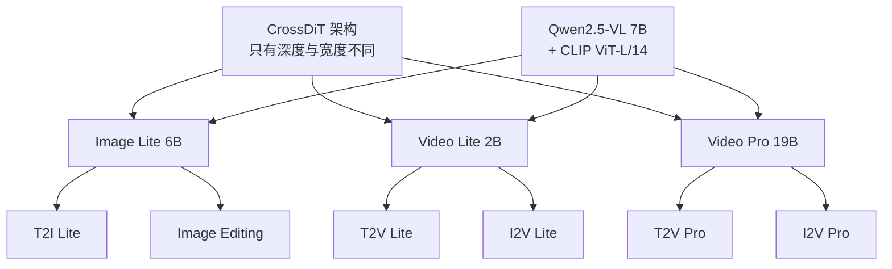
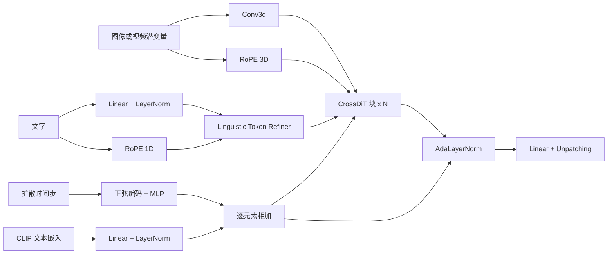
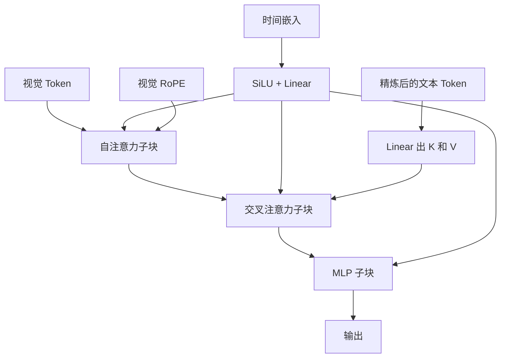
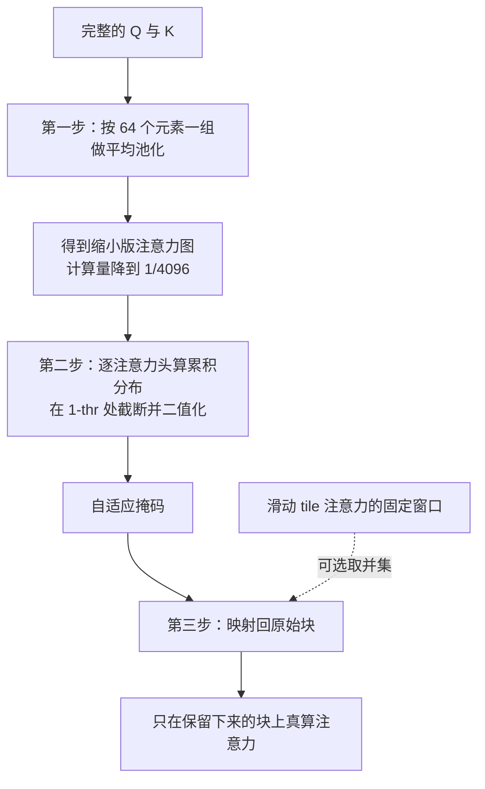
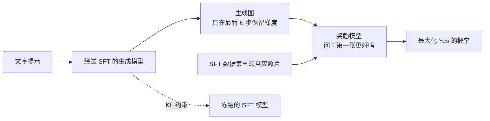

# Kandinsky 5.0：六个模型共用一副骨架，代价集中落在文本那一侧

<!-- release-date: 2025-09-29 -->

> 本文依据 Sber AI（Kandinsky Lab）的 **Kandinsky 5.0: A Family of Foundation Models for Image and Video Generation**，即 arXiv:2511.14993v3（2026-05-26 修订，80 页）。动笔前核对过 arXiv 提交历史：v1（2025-11-19）、v2（2025-11-20）、v3（2026-05-26），v3 是当前最新版本。本地件与官方 v3 **全量 32,610,918 字节逐字节一致**（MD5 `621c8c3224f071109953b272b6d1ff1f`），未做替换，页码无位移。
>
> 全文页码指 PDF 自身页码。本报告的 PDF 页码与印刷页码一致（封面即第 1 页），所以 `(PDF p. 34)` 就是页脚写着 34 的那一页。
>
> 文中始终区分三件事：**报告写了什么**、**我们如何解释**、**哪些是外部补充**。凡是本文自己算出来的数、自己从图里读出来的东西，都会明说。

## 读之前：把这条线的最小词汇表铺一遍

这篇报告同时讲图像和视频两条线，术语密度不低。下面只解释**读懂本篇所需的程度**，不写成教科书。如果你已经读过站内的 HunyuanVideo 1.5 解读，这一节可以快速扫过。

**扩散模型（diffusion model）**：一类生成模型。它不一次画完，而是从纯噪声出发反复"去噪"几十上百次，每次把样本往真实数据的方向推一点。每次去噪要跑一遍网络，所以**跑几次网络**直接决定生成要多久。

**NFE（Number of Function Evaluations，函数求值次数）**：就是"跑了几次网络"。报告用它当速度的主单位——基础模型 100 NFE，蒸馏后 16 NFE（PDF p. 5）。注意 NFE 不等于扩散步数：开了 CFG 的一步要跑两次网络，所以 100 NFE 在带 CFG 时只有 50 步。

**流匹配（flow matching）**：训练扩散模型的一种目标写法。它不预测"这一步该减掉多少噪声"，而是学一个速度场，让样本沿着从噪声到数据的一条路径匀速走过去。报告说 Kandinsky 5.0 是这个家族里**第一代基于流匹配**的模型（PDF p. 8）。报告全文没有写出流匹配的损失函数，本段属于外部背景。

**潜空间（latent space）与 VAE**：直接在像素上做扩散太贵。主流做法是先用一个自编码器（Variational Auto-Encoder，VAE）把图像或视频压成一个小得多的张量，扩散在这个压缩空间里进行，最后再解码回像素。压缩后的张量叫**潜变量（latent）**。

**DiT（Diffusion Transformer，扩散 Transformer）**：把扩散模型的去噪网络从 U-Net 换成 Transformer。潜变量被切成小块摊平成一条 Token 序列，注意力在这条序列上算。这一步的后果很直接：**注意力的平方复杂度直接压在"分辨率 × 时长"上**。

**自注意力与交叉注意力**：自注意力是序列里的元素互相看；交叉注意力是一条序列（这里是视觉 Token）去看另一条序列（这里是文字）。这两者怎么摆，是本篇架构一节的全部争论所在。

**CFG（Classifier-Free Guidance，无分类器引导）**：推理技巧，同一步跑两次网络——一次带提示词、一次不带——再按一个系数外推，让输出更贴合提示。代价是每步计算量翻倍。**CFG 蒸馏**就是训一个学生，一次前向就直接给出带引导的结果。

**T2I / T2V / I2V / I2I**：文生图、文生视频、图生视频、指令式图像编辑（给一张原图加一句"把黑高跟换成粉色的"）。**SBS（Side-by-Side）**：把两个模型对同一条提示的输出并排给标注员看，让他们选谁更好或打平；本报告的实验全部是这种形式。**模型汤（model souping）**：训好几个模型之后，把它们的权重直接按位平均；听上去粗暴，但这份报告的图像和视频 SFT 都靠它。

**SFT（Supervised Fine-Tuning，监督微调）**：预训练之后用一小批高质量数据继续训。**留个心眼**：这份报告的摘要和贡献列表里把 SFT 写成 "self-supervised fine-tuning"（PDF p. 1、p. 5），正文却一致写成 "supervised fine-tuning"（PDF p. 17、p. 33）。按正文和实际做法（人工挑数据），正文那个才是对的。

## 一句话先说清

Kandinsky 5.0 不是一个模型，是**三条产品线、六个模型**（PDF p. 5，Figure 1）：

| 线 | 参数量 | 出的两个模型 | 干什么 |
|---|---:|---|---|
| Image Lite | 6B | T2I Lite、Image Editing | 文生图、指令式图像编辑 |
| Video Lite | 2B | T2V Lite、I2V Lite | 轻量文生视频、图生视频 |
| Video Pro | 19B | T2V Pro、I2V Pro | 高质量文生视频、图生视频 |

（PDF p. 4、p. 5。都支持最长 10 秒。）

如果你只从这张表读，会以为这是三个各练各的项目。**但它们其实共用同一副骨架**：同一套 CrossDiT 架构、同一个 Qwen2.5-VL 文本编码器、同一条数据流水线、同一套训练模板，六个模型只在"多宽多深"和"跑到哪一站下车"上不同（PDF p. 6、p. 22）。更彻底的是：**两条视频线的第一站都是纯文生图**——Video Lite 和 Video Pro 的 Pretrain Stage 1 都在 256 像素上只练 T2I，一帧视频都不碰（PDF p. 30，Figure 18）。

这个"共用"是有代价的，而这份报告最值得读的地方，就是它把这条代价链完整地摆了出来：

1. 为了让一套权重能同时吃变长视频、还能上稀疏注意力，他们放弃了当时主流的 MMDiT，改成**文字只通过交叉注意力进来**（PDF p. 24）；
2. 交叉注意力这一侧接的是 Qwen2.5-VL，而这个文本编码器在他们的流水线里**最大上下文只有 256 token**（PDF p. 23）；
3. 于是在所有 SBS 评测里，画质和运动一路赢，**Prompt Following（提示词遵循）一路偏弱**（PDF p. 46–51）；
4. 报告自己在限制一节里把这笔账认了，归因就是那 256 token（PDF p. 64）。

一句话：

> **他们在每一层都选了"省"的那一边，省下来的算力全砸在画面质量和运动上；账单最后集中记在一个地方——模型听不懂长指令。**

这条链从架构选择一路走到评测结论再走到作者自己的归因，中间没有断点。对读者的价值不在于"Kandinsky 好不好"，而在于**看清一个团队在算力受限时如何分配取舍，以及这些取舍在数字上长什么样**。

## 报告地图：80 页里各写了什么

这是本模块目前最长的一份原件。先把篇幅摊开，后面就知道哪些地方能深挖、哪些地方只能到此为止。

| 报告章节 | PDF 页 | 讲了什么 | 密度 |
|---|---|---|---|
| 摘要 + Figure 1 + 七条贡献 | p. 1、p. 5 | 全文最浓缩的两页 | 高 |
| §1 引言 | p. 4 | 领域背景与三条产品线定位 | 中 |
| §2 报告导读 | p. 6 | 纯目录性质 | 低 |
| §3 Kandinsky 家族演进史 | p. 7–8 | 从 2021 年的 Malevich 到 4.1，十余个型号 | 中 |
| §4.1–4.2 数据基础设施 + T2I 数据 | p. 9–11 | 数据库即任务分发器；八道过滤 | 高 |
| §4.3 图像编辑指令数据 | p. 11–15 | 全报告最原创的一段流水线 | 高 |
| §4.4 T2V 数据 | p. 15–16 | 切片、去重、六类过滤、聚类 | 高 |
| §4.5 俄罗斯文化码数据 | p. 16–17 | 22.9 万视频 + 76.9 万图 | 中 |
| §4.6 SFT 数据与模型汤消融 | p. 17–22 | 两级人工评审 + 九域分解 | 高 |
| §5.1–5.3 CrossDiT 架构 | p. 22–24 | 四路输入、Table 3、块结构、放弃 MMDiT | 高 |
| §5.4 NABLA 稀疏注意力 | p. 25–26 | 三步机制 + fractal flattening | 高 |
| §6.1 训练 infra | p. 26–29 | S3、dataloader、HSDP、激活卸载 | 高 |
| §6.2 训练全景 + Figure 18 | p. 29–31 | 六个模型的完整阶段图 | 高 |
| §6.3 预训练 + Table 4 | p. 31–34 | 四种范式、提示词模板、全套超参 | 高 |
| §6.4 SFT | p. 33、p. 35 | 图像与视频两套模型汤 | 中 |
| §6.5 蒸馏 | p. 35–36 | CFG 蒸馏 + TSCD + 对抗后训练 | 高 |
| §6.6 图像 RL 后训练 | p. 36–39 | 奖励模型 + DRaFT-K + KL | 高 |
| §7 优化 + Table 5 | p. 39–41 | VAE 加速、MagCache、两条解析成本公式 | 高 |
| §8 结果 | p. 41–52 | §8.2.3–§8.2.9 七组对比，全部是图，没有一张数值表 | 中 |
| §9 用例 | p. 52–59 | 七页样例图，外加 p. 59 的 24 fps 与提示词写法模板 | 低 |
| §10 相关工作 | p. 60–63 | 图像、视频、RL、蒸馏、评测五个方向 | 中 |
| §11 限制 | p. 64 | 五条，写得相当诚实 | 高 |
| §12 伦理与偏见 | p. 64–66 | 明说不做内容过滤，并自曝刻板印象样例 | 中 |
| §13–14 结论与贡献者 | p. 67–68 | 无新信息 | 低 |
| 参考文献 | p. 69–80 | 150 条 | — |

有五件事值得先知道，它们决定了这篇解读能走多深：

- **全文只有四个公式**：图像编辑数据的自适应阈值（p. 12）、RL 的 KL 项与总损失（p. 38）、训练步时长的解析模型（p. 40，式 1）、显存的解析模型（p. 41，式 2）。流匹配、扩散目标、蒸馏目标、对抗损失一律只给名字。
- **实验部分一张数值表都没有**。§8 从 p. 41 到 p. 52，全部是堆叠条形图。本文表格里的每一个百分比都是**我们从渲染后的图上逐个读出来的**，后面会逐处标注。
- **没有一个公开基准分数**。VBench、FVD、CLIP-score 只在贡献列表里被提到一次，说它们支持了 NABLA 的结论（PDF p. 5），而具体数值在 NABLA 那篇独立论文里，不在这份报告里。
- **没有任何消融的量化对照**，除了 SFT 模型汤的定性描述与图像编辑数据的阈值表。
- **训练算力、GPU 数量、训练时长、总成本一个都没有**。只知道用的是标准的 NVIDIA 多节点集群、每节点 8 卡 NVLink、节点间 InfiniBand（PDF p. 26）。

所以这篇解读的重心不放在"复现"，而放在**这套六模型体系是怎么连起来的、每一层的取舍换来了什么、以及哪些结论撑得住**。

## 家族关系：六个模型到底共享什么、又在哪里分家

家族报告最容易漏掉的问题是"它们之间到底是什么关系"。这份报告在这一点上写得比大多数同类报告清楚，值得先讲。

### 共享的部分

这张图按报告 Figure 1（PDF p. 5）与 §5.1（PDF p. 22）重画，只表示归属关系，不含任何时间或性能信息。

报告说得很直接：Kandinsky 5.0 的架构"对这个家族里所有模型都是共同的"（PDF p. 6），核心是一个带交叉注意力的扩散 Transformer（CrossDiT），"CrossDiT 块的数量随模型规模变化"（PDF p. 22）。也就是说，**三条线之间的差异只是三个超参数**（PDF p. 24，Table 3）：

| 模型 | CrossDiT 块数 | LTF 块数 | 线性层维度 | 模型维度 | 时间嵌入维度 |
|---|---:|---:|---:|---:|---:|
| Image Lite | 50 | 2 | 10240 | 2560 | 512 |
| Video Lite | 32 | 2 | 7168 | 1792 | 512 |
| Video Pro | 60 | 4 | 16384 | 4096 | 1024 |

（PDF p. 24，Table 3。这是报告给出的全部架构超参。）

文本侧也完全共享：所有模型都用 **Qwen2.5-VL 7B** 作主文本编码器，嵌入维度 3584，最大上下文 256；另外用 **CLIP ViT-L/14** 出一个池化后的文本嵌入，维度 768，最大上下文 77（PDF p. 23）。数据侧同样共享：Figure 3（PDF p. 10）画的是一条同时处理图像和视频的流水线，两种模态走的是同一套基础设施、同一批过滤模型。

### 分家的部分

这才是更有信息量的一半。

**第一，视觉编码器不共享。** 图像用 **FLUX.1-dev 的 VAE**，视频用 **HunyuanVideo VAE 的编码器**（PDF p. 22）。两个都是外部现成件，报告没有训自己的 VAE，也没有给任何重建质量指标。这一点值得记：**这个家族"共享骨架"的说法只覆盖 Transformer，不覆盖 VAE**——图像模型和视频模型在潜空间这一层其实说的是两种语言。

**第二，后训练的最后一段完全不同。** 图像线走到 SFT 之后还有一段 **RL 后训练**；视频线走到 SFT 之后接的是 **蒸馏**，没有 RL（PDF p. 29–31，Figure 18）。报告没有解释这个不对称，我们的判断是：视频没有可靠的自动奖励，而报告设计的那套奖励模型（拿生成图和真实照片比，见后文）在视频上没有对应的"真实视频"参照物那么好用——但**这是我们的推测，报告没写**。

**第三，两条视频线的第一站是图像。** Video Lite 的预训练"从一个独立的、低分辨率的文生图阶段开始"，Video Pro 也是（PDF p. 31）。Table 4 给出的数字让这件事的分量变得很具体：

| 模型与阶段 | 训练步数 | 批大小 | 学习率 | 权重衰减 |
|---|---:|---:|---:|---:|
| Video Lite（T2I，低分辨率） | 220k | 8192 | 1e-4 | 0.0 |
| Video Lite（T2V+I2V，低分辨率） | 10k | 2662 | 6.0e-05 | 0.001 |
| Video Lite（中分辨率，5 秒） | 50k | 1331 | 3.0e-05 | 0.001 |
| Video Lite（中分辨率，10 秒） | 10k | 665 | 3.0e-05 | 0.001 |
| Video Pro（T2I，低分辨率） | 200k | 16384 | 1e-4 | 0.0 |
| Video Pro（低分辨率） | 200k | 2662 | 1e-4 | 0.0 |
| Video Pro（中分辨率） | 45k | 1331 | 3.0e-05 | 0.001 |
| Video Pro（高分辨率，5 秒） | 22.5k | 665 | 2.0e-05 | 0.001 |
| Video Pro（高分辨率，10 秒） | 10k | 333 | 2.0e-05 | 0.001 |

（PDF p. 34，Table 4，只取步数、批大小、学习率、权重衰减四列；原表还有每档分辨率的采样概率，见后文。）

把步数乘批大小，能看出一件报告没有明说的事（以下是**本文的计算**，前提是把 Table 4 的批大小当作全局批大小——报告没有明说这一点）：

- Video Lite 在纯图像阶段吃了约 **18.0 亿**个样本，在全部视频阶段只吃了约 **1.0 亿**个；
- Video Pro 在纯图像阶段吃了约 **32.8 亿**个，在全部视频阶段吃了约 **6.1 亿**个。

也就是说，**两个"视频模型"的绝大部分梯度步其实是在看静态图片**。而且 Kandinsky T2V 数据集有超过 2.5 亿条视频场景（PDF p. 15）——Video Lite 的视频阶段总样本量约 1.0 亿，**连这个数据集的半个 epoch 都没跑完**；Video Pro 约 6.1 亿，大约 2.4 个 epoch。

这解释了一个否则会很困惑的现象：一个 2B 的模型凭什么在画质上打得过大得多的对手？部分答案是**它的画面能力主要不是从视频里学的，是从图片里学的**。图片比视频便宜几个数量级，同样的算力能买到多得多的"看世界"的样本。视频阶段负责的是"怎么动"，不负责"长什么样"。

**第四，同一条线内部的两个模型是分支关系，不是并列关系。** Figure 18（PDF p. 30）把这一点画得很清楚，整理成表如下：

| 线 | 主干路径 | 从哪一站分叉 | 分支路径 |
|---|---|---|---|
| Image 6B | 256 T2I → 512 T2I → 1024 T2I → SFT → RL 后训练 | 512 那一站 | 512 编辑 → 1024 编辑 → 编辑 SFT |
| Video Lite 2B | 256 T2I → 256 三任务 5s → 512 三任务 5s → 512 三任务 10s（NABLA）→ SFT → 蒸馏 | 512-5s 与 512-10s 两站 | 5 秒 SFT；I2V 微调 → I2V SFT |
| Video Pro 19B | 256 T2I → 256 三任务 5s → 512 三任务 5s → 1024 三任务 5s（NABLA）→ 1024 三任务 10s（NABLA）→ SFT → 蒸馏 | 1024-10s 那一站 | I2V 微调 → I2V SFT |

（依据 PDF p. 30 的 Figure 18 与 p. 31 的正文重新整理。原图用方框和箭头表示，这里换成表格是为了让分叉点更清楚。）

三条线的形状是**同一个模板**：先纯图像打底 → 多任务混训并逐级升分辨率 → 升时长 → SFT → 特化或压缩。分叉点都选在"该特化的能力已经练到位、但还没被后训练锁死"的位置。

### 三任务混训的配比

在多任务阶段，模型同时解 T2I、T2V、I2V 三个任务，采样概率是（PDF p. 31）：

- **Video Lite**：1% / 79% / 20%
- **Video Pro**：2% / 77% / 21%

**Image Editing 的配比是 80% 编辑 + 20% 文生图**（PDF p. 31），而且这个配比在编辑的三个阶段全程保持。

这两组配比里都留了一条"回头看"的通道：视频模型留 1%–2% 给纯图像，编辑模型留 20% 给纯生成。报告没有解释理由，我们的判断是防遗忘——编辑模型如果只做编辑，很快就会失去"从零画一张图"的能力，而编辑任务本身也需要这个能力（要在空处补出新物体）。**这是我们的解释，报告没写。**

## 架构：CrossDiT，以及一次逆着潮流的选择

### 旧问题：MMDiT 在变长视频上有一笔隐藏账

2024 到 2025 年，图像与视频 DiT 的主流是 **MMDiT**（Stable Diffusion 3 提出的多模态 DiT）：把文字 Token 和视觉 Token **拼成一条序列**，在同一次自注意力里让它们互相看，两条模态各有自己的一套投影权重。Kandinsky 4.0 用的就是这个（PDF p. 24）。

MMDiT 的好处很直观：文字和图像在每一层都能双向交换信息，文字表示也会被视觉内容反过来调整。代价呢？报告写得很具体（PDF p. 24）：

> MMDiT 类架构需要一次**拼接操作**，这显著拖慢了训练。在 Kandinsky 5.0 里，我们成功消除了这个需求。

为什么拼接会贵？把报告这句话展开（**以下是我们的展开，报告只给了结论**）：

一个 batch 里的视频长度是不一样的——这份报告的 dataloader 明确是把长短不一的视频拼到一个批里凑够总长度的（PDF p. 27）。如果文字要和视觉拼成一条序列，那么每个样本的序列边界都不同，注意力掩码就变成一张不规则的拼图；再叠上稀疏注意力，块的划分要同时避开样本边界和模态边界，掩码构造与 kernel 都会复杂一个档次。报告在同一段里点了这一点：交叉注意力架构的优势在于"**与处理同一批次内不同长度视频所需的稀疏注意力机制兼容性更好**"（PDF p. 24）。

### 新设计：文字只从旁边进来

CrossDiT 的做法是回到更老、更简单的形式：**视觉 Token 自己走自注意力，文字通过交叉注意力从旁边注入**。

这张图按报告 Figure 10（PDF p. 23）重画，节点名称与图中方框一一对应，只表示模块连接关系，不含任何时间或性能信息。

四路输入各管一件事（PDF p. 23）：

| 输入 | 走的通路 | 作用 |
|---|---|---|
| 文字 | Qwen2.5-VL → Linear+LayerNorm，配 1D RoPE → LTF → 交叉注意力 | 语义条件的主通道 |
| 扩散时间步 | 正弦编码 + MLP | 告诉模型现在噪声有多重 |
| CLIP 文本嵌入 | Linear+LayerNorm，与时间嵌入逐元素相加 → AdaLayerNorm | 一个全局的、句子级的粗粒度条件 |
| 视觉潜变量 | Conv3d 切块 + 3D RoPE | 被去噪的主体 |

有两个细节值得单独讲。

**LTF（Linguistic Token Refiner，语言 Token 精炼器）是一个"去掉交叉注意力的 CrossDiT 块"**（PDF p. 23）。它的职责报告写得很明确：增强文本表示，并且**消除从预训练文本编码器继承来的位置偏置**。这句话背后的问题是：Qwen2.5-VL 是一个自回归解码器，它的文本表示天然带着"越靠后的 Token 见过越多上下文"的不对称性；而扩散模型需要的是一束**平权的**条件 Token。LTF 就是那个把不对称表示重新摊平的小模块。Image Lite 和 Video Lite 各 2 块，Video Pro 4 块（PDF p. 24）。

**CLIP 那一路是走 AdaLayerNorm 而不是走注意力的。** 一个 768 维的句向量被加到时间嵌入上，然后一起去调制归一化层的缩放和偏移。这条路带的是"整句话大概在说什么"这种粗粒度信息，而不是"第三个词是红色"这种细粒度信息。**这条路和交叉注意力那条路是分工，不是冗余**——前者管全局风格与氛围，后者管具体对象。（这层分工解释是本文的展开，报告只列了结构。）

### CrossDiT 块内部

这张图按报告 Figure 11（PDF p. 24）重画。原图把三个子块并排画开，这里改成串联，因为正文明确说这是"三个**顺序**子块"加经典残差连接（PDF p. 24）。图中不含任何时间或性能信息。

三个子块都是同一个模式：LayerNorm → Shift & Scale → 干活 → Gate → 残差相加。Shift、Scale、Gate 三组系数都由时间嵌入经过一个 `SiLU + Linear` 生成，这是 DiT 的标准调制写法。自注意力和交叉注意力的 Q、K 上都挂了 RMSNorm（Figure 11 里画出来了，正文没提），这是训练稳定性的常规做法。

交叉注意力那一块的 Q 来自视觉，K 和 V 来自文本经过一个 Linear 投影（PDF p. 24，Figure 11）。**这意味着文本表示在整个网络里是只读的——它被算一次，然后每一层反复被查询，但自己不会被视觉内容更新。** 这正是 CrossDiT 与 MMDiT 最本质的差别，也是后面那笔账的源头。

### 收益：三个数字自己对得上

报告没有给参数量的拆分，只在 Figure 1 里给了 6B / 2B / 19B 三个标称值。我们按 Table 3 的五个超参重算了一遍，用来验证这些标称值是否自洽（**以下全部是本文的计算**，依赖三个假设：自注意力有完整的 QKVO 四个 $d\times d$ 投影；交叉注意力也有四个 $d\times d$ 投影；每个子块有一个从时间维到 $3d$ 的调制线性层）：

$$
\text{每块参数} \approx \underbrace{4d^2}_{\text{自注意力}} + \underbrace{4d^2}_{\text{交叉注意力}} + \underbrace{2 d\, d_{f}}_{\text{MLP}} + \underbrace{3\times 3 d\, d_{t}}_{\text{三个子块的调制}}
$$

其中 $d$ 是模型维度、$d_f$ 是线性层维度、$d_t$ 是时间嵌入维度。代入 Table 3：

| 模型 | 主干块合计 | LTF 合计 | 总计 | 报告标称 |
|---|---:|---:|---:|---:|
| Image Lite | 5.83B | 0.17B | **6.01B** | 6B |
| Video Lite | 1.91B | 0.09B | **2.00B** | 2B |
| Video Pro | 18.37B | 0.91B | **19.28B** | 19B |

三个数都对得上，误差在 1.5% 以内（差额来自 patch embedding、输出投影和各种 LayerNorm，这些都没被算进去）。这说明两件事：**Table 3 的五个超参足以复原整个骨架**，以及 6B / 2B / 19B 这三个标称值**只算 CrossDiT 本身，不含 Qwen2.5-VL 7B、CLIP 和两个 VAE**。真正部署时要装进显存的东西，比标称参数量多得多——Table 5 的显存数字（后面会讲）也印证了这一点。

顺便注意到：三个模型的 $d_f / d$ 都正好是 4.0，是最常规的比例；而 Video Pro 又宽（4096）又深（60 层），Video Lite 又窄（1792）又浅（32 层），Image Lite 则是"中等宽度 + 很深"（2560 × 50）。图像模型偏深是合理的——单帧图像的 Token 数比视频少一到两个数量级，深度比宽度更划算。（这条解读是本文的判断，报告没有讨论过形状选择。）

### 代价：文本通道只有 256 个 Token 宽

这是全篇最重要的一处代价，报告自己在两个相隔 40 页的地方各说了一半。

第一半在架构一节（PDF p. 23）：Qwen2.5-VL 的**最大上下文长度是 256**。

第二半在限制一节（PDF p. 64）：

> 定量的 SBS 结果表明，与某些竞品方案相比，我们在文本提示理解上略有落后。我们**主要将其归因于流水线中 Qwen2.5-VL 7B 文本编码器有限的上下文长度（256 token）**。未来工作将集中于集成上下文窗口更长的更强文本编码器。

把这两半接起来，再对上 §9 用例里那些动辄一百多词的长提示词（PDF p. 53–58），矛盾就很清楚了：**报告自己展示的提示词长度，大概率超过了它自己的文本编码器能吃下的长度。** 256 个 Qwen token 对英文大约是 180 到 200 个词——p. 56 那条讲赛博朋克跑车的提示词就已经接近这个量级了。（这个换算是本文的粗估，报告没有给任何 Token 统计。）

而且这里有一个结构性的放大效应（**以下是我们的分析，报告没有讨论**）：在 MMDiT 里，文字 Token 参与联合自注意力，它们的表示会被视觉内容逐层更新，等于文字侧还有"再理解"的机会；在 CrossDiT 里，文字被 LTF 处理一次之后就冻在那儿了，每一层只是反复去查同一份表示。所以**文本通道的容量在 CrossDiT 里比在 MMDiT 里更关键**——它是一次性的，没有补救机会。

有意思的是，报告在用例一节给出的"最佳实践"正好是这条限制的产物（PDF p. 59）：它建议提示词按一个固定模板写——文生视频是 `[主体定义] + [动作／运动向量] + [环境上下文] + [电影与镜头参数]`，图生视频是 `[主要动作] + [时间特征] + [镜头运动]`。**把提示词压成几个固定槽位，正是在一个窄文本通道上榨出最多信息的办法**（这层因果关系是我们连起来的，报告没有把两节联系在一起）。

这一条的可迁移启发很实在：**当你把某个模态改成"只读旁路"时，那条旁路的容量就变成了硬上限，必须单独审计。** 不要因为主干够大就以为条件通道也够用。

### 与同期方案的一个简短对照

站内已发布的 [HunyuanVideo 1.5 解读](/reports/Tencent/HunyuanVideo-1.5)描述的是另一种选择：混元用的是**双流块**——文本流和视觉流各有自己的 MLP 和残差，但在每个块中间共享同一次完整的联合注意力，并且额外挂了两个文本编码器（Qwen2.5-VL 负责语义、Glyph-ByT5 负责字形）。Kandinsky 5.0 只有一个语义文本编码器加一个 CLIP 句向量，文字完全走旁路。

两种选择的差别正好落在这份报告的强弱项上：混元那套让文字参与得更深，代价是变长批次里的拼接开销；Kandinsky 这套换来了稀疏注意力的兼容性和训练速度，代价是文本通道更窄。**这不是谁对谁错，是同一笔预算的两种花法。**

把光谱再拉开一点看：站内的 [HunyuanImage-3.0](/reports/Tencent/HunyuanImage-3.0) 走的是更激进的一端——文字和图像共用一个原生多模态骨干；[Janus-Pro](/reports/DeepSeek/Janus-Pro) 则在另一个维度上分家——理解和生成用两个视觉编码器。放在一起，Kandinsky 5.0 的位置就清楚了：**它在"文字与视觉如何耦合"这条轴上，选了最松的那一档。** 需要提醒的是，这三句对照的信息各自来自那三份报告，不是本报告的内容；四边的评测口径完全不同，不能互相比分数。

## NABLA：先画一张缩小 4096 倍的地图，再决定在哪里真算

### 旧问题：到了最大那一档，九成时间都在算注意力

这份报告有一个别的报告很少给的东西：**一条训练步时长的解析公式**（PDF p. 40，式 1）。

$$
\text{Step} = \frac{d}{d_0}\cdot\frac{S}{S_0}\cdot\left(9 + 14\cdot\frac{S}{S_0} + 6\cdot\frac{d}{d_0}\right)\cdot L\cdot B
$$

其中 $d$ 是模型隐层维度、$S$ 是视频"分辨率"（报告的参考值是 $S_0 = 256\times384\times31$）、$L$ 是块数、$B$ 是批大小，参考常数 $d_0=1792$ 就是 Video Lite 的宽度（PDF p. 40）。报告说这个模型"与真实训练步时长和显存消耗拟合得很好"，他们用它来做实验规划和并行方案选择（PDF p. 41）。

这条公式里藏着本节的全部动机。把它展开成三项（**以下的展开与所有百分比都是本文的计算**）：

$$
\text{Step} \propto \underbrace{9\cdot\tfrac{d}{d_0}\tfrac{S}{S_0}}_{\text{随 Token 线性}} + \underbrace{14\cdot\tfrac{d}{d_0}\left(\tfrac{S}{S_0}\right)^2}_{\text{注意力：随 Token 平方}} + \underbrace{6\cdot\left(\tfrac{d}{d_0}\right)^2\tfrac{S}{S_0}}_{\text{随宽度平方}}
$$

中间那项是唯一随 $S$ 平方增长的，它就是注意力。代入不同配置：

| 配置 | $d/d_0$ | $S/S_0$ | 平方项占比 |
|---|---:|---:|---:|
| Video Lite 参考档 256×384，5 秒 | 1.00 | 1.00 | 48% |
| Video Lite 512×768，5 秒 | 1.00 | 4.00 | 79% |
| Video Lite 512×768，10 秒 | 1.00 | 7.87 | 88% |
| Video Pro 512×768，5 秒 | 2.29 | 4.00 | 71% |
| Video Pro 768×1280，10 秒 | 2.29 | 19.68 | **92%** |

（本文按报告式 1 计算。$S_0$ 里的 31 是 121 帧视频经过 4 倍时间压缩后的潜变量帧数——这个对应关系后面会验证。）

这张表把问题说得非常清楚：**在最小那一档，注意力大约占一半；到了 Video Pro 的最高档，它占了九成以上。** 想在高分辨率长视频上训练，除了动注意力没有别的选择。报告也正是这么说的：NABLA 用于"高分辨率（最高 1024px）或长时长（最长 10 秒）的视频生成"（PDF p. 25）；具体的开关规则在优化一节（PDF p. 40）：**SD 分辨率且不超过 5 秒时用 FlashAttention 或 SageAttention，超过 5 秒或 HD 分辨率时用 NABLA。**

### 新设计：三步造一张块稀疏掩码

NABLA 的全称是 **Neighborhood-Adaptive Block-Level Attention（邻域自适应块级注意力）**。报告只给了机制概述，完整算法在团队自己的独立论文里（PDF p. 26，引用 [36]）。

这张图按报告 Figure 12 与 §5.4 的三条编号说明（PDF p. 25）重画，节点顺序与原文三步逐条对应，不含任何时间或性能信息。

**第一步，把地图缩小。** Q 和 K 按 $N = 64$ 个元素一组做平均池化，于是注意力图的计算复杂度降到原来的 $1/N^2 = 1/4096$（PDF p. 25）。注意这句话说的是**算这张"探路地图"本身的代价**，不是最终注意力的代价——最终注意力还是要在选中的块上真算。这是稀疏注意力的通用结构：先花一点点钱看看哪里值得算，再把大钱花在那里。

**第二步，用累积分布截断，而不是取 Top-k。** 对每个注意力头，算出缩小版注意力图的累积分布函数，在 $1 - thr$ 处做阈值并二值化，$thr$ 控制稀疏度（PDF p. 25）。

这里的设计选择值得停一下（**以下是我们的分析，报告只写了"这确保每个头保留其针对输入内容的独特注意力模式"**）。Top-k 是"每个头都恰好看 k 个块"，CDF 阈值是"每个头都恰好看到概率质量的 $1-thr$ 为止"。两者的区别是：

- 如果某个头的注意力很集中（比如只关心时间上相邻的几帧），少数几个块就凑够了概率质量，它自动变得很稀疏；
- 如果某个头的注意力很分散（比如在做全局的风格一致性），它会自动多留一些块。

**换句话说，稀疏预算不是平均分配的，而是按"这个头到底有多需要"分配的。** 报告用 Figure 13 与 Figure 14 的对照来说明这一点：真实注意力图（Figure 13）的形状五花八门，而 STA 这类固定稀疏模式（Figure 14）只有一种形状，"可能捕捉不到连贯视频生成所需的复杂长程依赖"（PDF p. 26）。

代价也很明显，而**报告没有讨论**：每个头保留的块数不一样，工作量就是不规则的。GPU 最喜欢的是每个 warp 干一样多的活，逐头变长的块列表会带来负载不均。这大概是为什么 90% 的稀疏度只换来 2.7× 的加速而不是接近 10×——不过报告没有给这笔账的拆分，这只是我们的推测。

**第三步，可选地和滑动 tile 窗口取并集。** 自适应掩码"可选地通过并集操作与 Sliding-Tile Attention 模式结合，以维持局部连续性并抑制高分辨率生成中可能出现的边界伪影"（PDF p. 25）。注意这里用的词是**并集**——纯自适应选择可能在块的边界上漏掉近邻，补一圈固定的局部窗口就把这个洞堵上了。（对照：HunyuanVideo 1.5 的 SSTA 也是"固定窗口 + 动态选择"两者合用，但它的伪代码写的是逻辑与，与描述存在张力；NABLA 这里明确写的是并集。这个对照来自那份报告，不是本报告的内容。）

### 一个容易被跳过但很重要的配件：分形展平

NABLA 还做了一件纯粹为访存服务的事（PDF p. 25–26）：

> NABLA 采用**分形展平**（fractal flattening）做 Token 重排，空间 patch 大小 $P\times P$（$P = 8$），把每个 patch 内的所有 Token 组成长度为 $P^2 = N = 64$ 的连续序列，同时保持原有的时间顺序。

为什么必须这么做（**以下是我们的展开**）：如果按常规的行优先顺序展平，一个 $8\times8$ 的空间邻域在序列里是散落在 8 个相距很远的段落里的。而 NABLA 第一步的"按 64 个元素一组池化"要的正是空间上相邻的 64 个 Token——如果它们在内存里不连续，池化和后续的块稀疏 kernel 都要做跨步访存。分形展平就是把"空间上相邻"和"内存里相邻"这两件事对齐。重排在 DiT 输入处做一次，输出处做一次逆操作（PDF p. 26）。

$P^2 = N = 64$ 这个等式不是巧合：**块的空间尺寸、池化的组大小、稀疏决策的粒度，是同一个数。** 这是稀疏注意力能真的跑快的必要条件——决策粒度必须等于访存粒度。

### 收益与它的边界

报告给的数字是：NABLA 在训练和推理上**最高 2.7 倍加速**，同时保持与全注意力相当的生成质量，由 CLIP、VBench 的定量指标和人工评测共同验证（PDF p. 26）；贡献列表里把这个数字钉得更死：**90% 稀疏率下 2.7 倍**（PDF p. 5）。

这里有一笔账值得算清楚（**本文的分析**）。90% 稀疏意味着注意力那一项只剩十分之一。按前面那张占比表，在 Video Pro 最高档，注意力占 92%，那么理论上：

$$
\text{加速比上限} = \frac{1}{0.92\times 0.1 + 0.08} \approx 5.8
$$

实测只有 2.7 倍。差额去哪了？三个可能的去处：造掩码本身的开销（虽然是 1/4096，但不是零）、块稀疏 kernel 相对稠密 kernel 的效率损失、以及逐头变长带来的负载不均。**报告没有给这笔拆分**，所以上面只能说明"2.7× 与理论上限之间有一段可观的距离"，不能断言这段距离由什么构成。

另外两条边界值得写下来：

- **NABLA 不是全程开启的。** 它只在超过 5 秒或 HD 分辨率时启用（PDF p. 40）。所以 Video Lite 的 5 秒模型和 Image Lite 根本不走这条路。
- **关键超参没有给。** $thr$ 取多少、是否真的启用了与 STA 的并集、块大小之外的其它设置，报告一个都没写，只说"完整实现细节与算法规范见 [36]"（PDF p. 26）。

### 一个很实用的工程选择

报告特别强调了一句：NABLA "无缝集成到 PyTorch 的 FlexAttention 框架，**不需要自定义 CUDA kernel，也不需要额外的损失函数**，因此对大规模视频生成模型的训练和推理都很实用"（PDF p. 26）。

这一条的分量比听上去大。同期很多稀疏注意力方案都要配一套手写 kernel（比如混元的 SSTA 要基于 ThunderKittens 写 `flex_block_attention`），而手写 kernel 意味着：换一代 GPU 要重写、换一个 PyTorch 版本要重测、团队里必须有人能维护它。NABLA 选择把稀疏模式限制在 FlexAttention 能表达的范围内，用一点表达力换取了**零 kernel 维护成本**。

**可迁移启发**：做系统优化时，"能用框架已有的抽象表达出来"本身就是一个值得付溢价的属性。一个慢 20% 但不需要维护的方案，长期常常赢过一个快 20% 但绑死在某代硬件上的方案。

## 数据：四个数据集，一条流水线

数据是这份报告写得最厚的一部分（PDF p. 9–22，整整 14 页）。先把四个数据集的规模摆出来：

| 数据集 | 规模 | 用途 | 出处 |
|---|---|---|---|
| Kandinsky T2I | 超过 5 亿张图像 | 图像预训练与微调 | p. 9 |
| Kandinsky T2V | 超过 2.5 亿条视频场景 | 视频预训练 | p. 15 |
| Kandinsky I2I | 约 1.5 亿对图像 + 指令 | 图像编辑训练 | p. 13 |
| Kandinsky RCC | 229,504 条视频场景 + 768,555 张图像 | 俄罗斯文化特定内容 | p. 16 |
| Kandinsky SFT | v1：2,833 视频 + 45,000 图；v2：12,461 视频 + 153,000 图 | 各阶段 SFT | p. 20 |

### 基础设施：数据库同时是元数据仓库和任务分发器

这一段只有一小段，但信息量很大（PDF p. 9）：

数据处理流水线的核心是一个数据库，它**同时充当元数据存储和任务代理（task broker）**，供一个分布式的数据处理器网络使用。这个数据库有若干索引（**包括向量索引**），能为每个训练阶段快速取出需要的数据，并防止数据集里出现重复。表分区和负载均衡用来降低数据库压力，让**数千个数据处理器同时访问它**。处理器跑在不同硬件上，按任务类型分别用 CPU 或 GPU。

把这段翻成人话（**我们的解释**）：他们没有把数据清洗写成一堆离线脚本，而是把它做成了一个**以数据库为中心的作业系统**——每条素材是一行记录，每个过滤模型是一个 worker，worker 从数据库领任务、写回分数。这样做的好处是：新增一个过滤模型不用重跑全量流水线，只要给旧记录补一列；训练阶段要什么数据，就是一次带索引的查询。

**可迁移启发**：当清洗步骤超过五六个、而且还会不断增加时，把"流水线"改造成"带状态的任务队列"几乎总是值得的。判据是——你有没有因为"想加一个新过滤器"而不得不重跑整条流水线。

### 图像侧的八道闸

Kandinsky T2I 的过滤顺序（PDF p. 9–11）：

1. **初始分辨率过滤**：短边小于 256 像素的直接丢。
2. **去重**：算感知哈希，去掉完全相同和视觉上极为相似的图。
3. **水印检测**：两个模型联合——一个 `watermark_resnext101_32x8d-large` 分类器做感知判断，一个 YOLO 检测器找水印状物体；**任一模型给出的置信度超过阈值就丢**。
4. **质量评估**：TOPIQ 与 Q-Align 两个模型各自给出技术质量和审美质量分。
5. **文字过滤**：CRAFT 文字检测模型找出文字区域，文字框数量或总面积过多的图被排除，避免模型偏向字幕密集的内容。
6. **复杂度过滤**：SAM 2 出分割掩码，配合 Sobel 边缘分析，滤掉过于简单的图（比如纯背景）。
7. **对象与场景分类**：YOLOv8（OpenImagesV7 训练）检测物体，一个基于 CLIP 的分类器给出地点、风格、主体和更细的场所类型。
8. **合成描述**：InternVL2-26B 生成初始详细英文描述，再由 InternLM3-8B 精炼或缩短出变体；Qwen2.5VL-32B 为高分辨率图（$宽\times高 \ge 512^2$）生成**俄语**描述。

第 8 步之后还有一层后处理很有意思（PDF p. 11）：用正则清掉"The image shows"这种开场白，然后**过滤掉含有非英文字符（如西里尔字母、中文）的句子**。理由写得很具体：InternVL2 在西里尔字母这类文字上 OCR 表现很差，滤掉这些句子能保证英文描述的质量。

这是一个很小但很典型的工程判断：**打标模型的已知弱点，可以在下游用一条规则堵住，而不必换模型。** 他们知道 InternVL2 读不好俄文，于是干脆不让它产出的俄文进入英文描述。

处理完的数据按**短边**（256、512、1024）和源数据集名分目录存进 Parquet（PDF p. 11）。这个分目录方式直接服务于训练——Table 4 的三档分辨率阶段各自读自己那一档。

### 视频侧：六类过滤，外加一个 2 FPS 的动态性检测

Kandinsky T2V 的流程（PDF p. 15–16）：

- **场景切分**：PySceneDetect 检测镜头切换，每个场景时长限制在 **2 到 60 秒**。
- **初始过滤与去重**：短边小于 256 像素的丢；算视频感知哈希去重，报告诚实地补了一句"**主要去重用这个方法，但仍可能残留一些重复**"。
- **水印检测**：分类器加检测器，在**五个等距帧**上平均置信度后按阈值过滤。
- **结构动态性**：按 **2 FPS** 采样帧，算相邻帧对的 **MS-SSIM**（多尺度结构相似度）。分数低说明变化剧烈，分数高说明画面静止；**过静和过动的都被滤掉**。
- **技术与审美质量**：DOVER 给出技术质量（清晰度、噪点）和审美质量（构图、色彩）两个分，加权求和；再叠一个 Q-Align。
- **文字检测**：CRAFT 在**三个等距帧**上统计文字框数量与面积，字幕过多的丢。
- **对象与场景分类**：YOLOv8 在**五帧**上检测物体，CLIP 分类器判断地点、风格、主体。
- **相机与物体动态**：一个基于 VideoMAE 的专用模型，预测相机运动、物体运动、光影与色彩变化三个分数。
- **描述**：Tarsier2-7B 生成合成英文描述，同样做正则清洗和非英文字符过滤。
- **聚类**：InternVideo2-1B 出场景嵌入，K-Means 聚成 **10,000 个簇**，用于平衡采样和数据集分析。

"过静和过动都滤掉"这一条值得记：**过静的样本教不会模型运动，过动的样本（快速剪辑、闪烁）会教坏时间一致性。** 动态性不是越高越好，是要落在一个区间里。

### 图像编辑数据：从存量图片里"挖"出编辑对

这是整份报告里最原创、也最有迁移价值的一段（PDF p. 11–13）。

**旧问题**：训练指令式图像编辑模型需要"原图 + 指令 + 目标图"三元组。这种数据天然稀缺——你不可能去拍一亿组"同一个场景改一处"的照片。同期常见的做法是用生成模型合成编辑对，但合成数据带着生成器自己的分布偏差。

**他们的做法**：不合成，去**存量图片里找天然存在的编辑对**。流程是这样的：

1. **初始收集**：约 **2.4 亿**张来源多样的图片。
2. **相似度匹配**：三条并行的度量——CLIP 分数（语义相似）、DINO 分数（DINOv2 视觉特征相似）、人脸识别（只处理单人脸的图）。
3. **自适应阈值**：把图片聚成 **10,000 个簇**，每个簇按其内部的最高相似度分数确定自己的阈值，最终判据是

$$
\text{clip\_sim} > (1 - T)\cdot\text{clip\_thr} + T,\quad T = 0.15
$$

4. **几何验证**：用 **LoFTR** 做特征点匹配，**RANSAC** 估计基础矩阵和欧氏变换，迭代找出内点组（每组至少 20 个点），把所有有效组的匹配点数加起来当作总内点数。
5. **质量过滤**：DINO 路要求 `dino_sim > 0.8` 且内点数 > 300；CLIP 路要求 `clip_sim > 0.8` 且内点数 > 200 且满足自适应阈值；含人脸的要求 `face_sim > 0.7`。**排除条件**：`dino_sim > 0.97` 或 `dino_aligned_sim > 0.97` 或（`face_sim < 0.5` 且 `face_sim > 0`）。
6. **对齐后的 DINO 分数**：用 LoFTR 找匹配点、RANSAC 求欧氏变换，把两张图裁到重叠区域，再在对齐后的裁剪上算一次 DINO 相似度。
7. **重叠分析**：分析两图的重叠比例，**去掉重叠过多的对**——那些只是简单裁剪，不是真正的编辑。
8. **生成指令**：为每个合格的图像对生成明确描述视觉变化的描述文字。

（以上全部来自 PDF p. 12–13；Table 1 在 p. 15 把阈值汇总成一张表。）

这套流程的精妙之处在于**它同时定义了"太像"和"不够像"两条边界**：

- $\text{dino\_sim} > 0.97$ 被排除，因为那基本是同一张图；
- 重叠过多被排除，因为那只是裁剪；
- 相似度低于 0.8 被排除，因为那是两张无关的图。

**编辑对必须落在"明显是同一个场景、但确实改了什么"的那条窄带里。** 这条窄带的两端都要靠具体阈值卡死，而报告把每个阈值都写出来了——这在数据流水线的报告里非常少见。

第 8 步的模型选择也写得很实在（PDF p. 13）：他们先做了一轮 SBS，比较 GPT-4o、带推理的 GPT-4 Mini、Gemini 2.5 Pro 和 Qwen2.5-VL-32B 生成指令描述的能力，**Gemini 2.5 Pro 排第一，GLM 4.5 表现接近**；考虑到性价比，他们最终选了**不开推理的 GLM 4.5**，再用 LoRA 在一批精选数据上微调，专门优化指令式描述的生成。

这段有两个可迁移点：**第一，打标模型也要做选型评测，而不是默认用最贵的那个**；**第二，选型的判据是"性价比"而不是"绝对最优"**——排第一的没被选中，因为差距不值那个价钱。

最终得到约 **1.5 亿**对精选图像对（PDF p. 13）。从 2.4 亿张图里挖出 1.5 亿对——注意分母是"张"、分子是"对"，所以这个漏斗的实际收敛率无法从报告推算，因为一张图可以出现在多个对里。（这一点报告没有澄清，是我们的提醒。）

编辑的 SFT 数据另做一层筛（PDF p. 13）：**只对目标图施加质量过滤**，也就是每一对里的第二张，因为"我们的观察表明这足以识别高质量的变换样例，可以忽略源图"；要求 Q-Align 分数大于 4、Q-Align 审美分大于 2，得到约 **60 万**个候选对，再由人工从中挑出最终的 SFT 集。

"只看目标图"这条经验很省事：**在成对数据里，如果质量只由一端决定，就不要浪费算力去评估另一端。**

### SFT 数据：两级人工评审，还请了艺术教育背景的专家

SFT 数据集的构建过程（PDF p. 17–20）是这份报告里"人力密度"最高的一段：

**初始池**：93,296 条高分辨率视频场景和约 **1000 万**张图像，按技术质量（分辨率阈值、无伪影、无水印）和审美自动筛出来。

**两级评审**：

- **第一级——技术筛查**，普通标注员判断：主体是否存在且突出、裁切与取景是否恰当、空间纵深感、有无视觉伪影。
- **第二级——综合质量评估**，由**有电影摄影和视觉艺术背景的合格专家**按详细问卷评估。图像的问卷有 11 项（曝光与对比度、地平线位置、构图几何、物体轮廓质量、光线与配色、有无多余物体、整体艺术表现力、**自然而非 AI 感**、有机融合度、是否需要修改、有没有那种"哇"的品质）；视频的问卷有 13 项（完整性、内容与动作的清晰度、主体突出、动态强弱、调色、取景、地平线、构图质量含三分法／中心／对角线、纵深与体积感、曝光、**是否适合剪辑**、内容复杂度、审美表现力）。

含文字的图像还要过一套专门标准：文字清晰易读、文字叠加是否恰当、有无异常的字母变形、文字与背景是否和谐、海报／封面类的特别归类（PDF p. 19–20）。

**门槛与两个版本**（PDF p. 20）：v1 版要求评审员达成共识，最终选出**约 3% 的初始视频**和 **5% 的图像**；两个版本分别是 v1（严格）2,833 条视频 + 45,000 张图，v2（放松）12,461 条视频 + 153,000 张图。微调时**从两个数据集按校准过的概率采样**，在质量和多样性之间平衡。

这里有一处**报告内部的算术对不上**（本文核算）：2,833 / 93,296 ≈ 3.0%，视频那个数完全吻合；但 45,000 / 1000 万 = 0.45%，比报告说的 5% 低了一个数量级。要么"约 1000 万张图像"这个初始池数字偏大，要么"5%"应该是"0.45%"。报告没有澄清，我们只标出这个不一致，不替它选一个答案。

另外，p. 20 那句"最低 $\frac{3}{2}$ 的一致性"在 PDF 里就是这么排的——**分子 3、分母 2**。一致性比例不可能大于 1，这几乎肯定是 $\frac{2}{3}$ 的排版错误。

**九个域**：所有视频和图像都用 Qwen2.5-VL-Instruct-32B 分成 9 个域（动物、建筑、艺术、卡通、食物、室内、自然、人物、科技，外加 other），保证视频域和图像域在混合训练时一致（PDF p. 20）。报告甚至把分类用的提示词模板原样贴了出来。

**留意一处措辞不严**：报告写"9 个一致的域"，但贴出的 `CATEGORY_LIST` 里有 10 项（第 10 项是 "other"）。合理的读法是 other 不算一个正式域，但报告没说明。

### 俄罗斯文化码数据集

Kandinsky RCC 包含 229,504 条视频场景和 768,555 张图像，聚焦"俄罗斯文化码"——报告把它定义为与信仰、语言、历史记忆、自然、建筑、人物等相关的特定特征（PDF p. 16）。

它的处理方式和另外两个数据集完全不同（PDF p. 17）：**RCC 数据是人工挑的**，标注员按"与俄罗斯文化码的相关性、视觉质量、无水印无字幕"三条来选；描述由**人工用俄语写**，再机器翻译成英文，专有名词特殊处理。这批数据同时用于预训练和专门的微调。

这是一个规模很小（相对 2.5 亿条视频而言不到千分之一）但目标明确的数据集。它说明的一件事是：**当某种能力在通用网络数据里天然稀缺时，几十万条人工数据可能比几亿条自动数据更有效**——因为稀缺的不是数量，是那个特定分布。

## 训练基础设施：三处很实在的工程细节

报告用了四页写训练 infra（PDF p. 26–29），密度不低。

### 数据存储：为什么把 latent 而不是像素存进 S3

集群是标准的 NVIDIA 多节点配置，每节点 8 卡 NVLink，节点间 InfiniBand。数据用 **S3 而不是 NFS**，理由很直接：数据集重量级是 **$O(10)$ PB**，NFS 在这个量级太贵（PDF p. 26）。

S3 有两条硬约束（PDF p. 27）：流式读取走一条 **100 Gbit/s** 的链路，而且存储系统**只允许 $O(10^3)$ 量级的并发连接**。于是数据流水线的设计目标变成"打开的对象数要少、每条连接的吞吐要高"。

对应的三个做法：

**第一，所有图像和视频预先用 VAE 编码，存 latent 而不是原始像素**（PDF p. 27）。这一步同时省两样东西：I/O 带宽，以及训练时反复调用编码器的算力。

**第二，latent 打包进 .tar 归档，每个归档大小尽量相同。** 每档的样本数按分辨率和模态调整（PDF p. 27）：

| 模态 | 低分辨率 | 中分辨率 | 高分辨率 |
|---|---:|---:|---:|
| 图像 | 每个 tar 1024 个 latent | 256 个 | 64 个 |
| 视频（一个 latent 指整段视频的 VAE 潜变量序列） | 每个 tar 16 个 | 4 个 | 1 个 |

（PDF p. 27。）

这张表的规律很清楚：**每往上一档，条数就除以 4**——因为分辨率每往上一档，单个 latent 大约大 4 倍。目标是让归档大小在所有分辨率上大致一致，同时把要打开的 S3 对象总数压到最小。

**第三，文本嵌入不预存，在训练时现算**（PDF p. 27）。理由报告写得很具体：**一个文本嵌入大约比一个低分辨率（比如 256×256）图像 latent 大 50 倍**；如果把所有文本嵌入都预先算好存进 S3，会显著增加存储占用和单对象大小，给 S3 的带宽和连接数带来额外压力。在线计算让 S3 的负载由紧凑的图像／视频 latent 主导，同时简化了存储布局。

这是一个很干净的取舍推理：**同样是"用存储换计算"，方向要看谁更大。** 视觉 latent 值得预存（大而贵），文本嵌入不值得（本身就比 latent 大 50 倍，而 Qwen2.5-VL 前向又不算太贵）。很多团队会不假思索地把所有前处理都缓存下来，这份报告显示了为什么要逐项算账。

顺带说一句，那个"50 倍"很好验证（**本文的计算**）：文本嵌入是 $256 \times 3584$ 个数；一个 256×256 图像 latent 若按 8 倍空间压缩、16 通道算，是 $32\times32\times16 = 16384$ 个数。比值 $\frac{256\times3584}{16384} = 56$，和报告说的 50 倍量级一致。（VAE 的压缩比是外部常识，报告没有给。）

### DataLoader：按宽高比分队列，按总时长凑批

DataLoader 是两级流水线（PDF p. 27）：

- 一个专用的 worker 进程从 S3 流式拉 .tar 归档、在线解包，把单个 VAE latent 推进内存队列；
- **每个队列对应一种宽高比**（1:1、16:9、4:3……），这样主训练进程可以直接采到形状兼容的片段，**不需要额外的 padding 或 resize**。

主进程构批的方式是：从选中的宽高比队列里反复弹出视频 latent，直到时长之和达到预设上限：

$$
\sum_i t_i \approx t_{\max}
$$

**图像被当作长度为 1 的视频**处理，但**它们总是被采成纯图像的批**。报告给的理由很具体：这样可以显式控制训练中图像步的全局占比，因为"**混合批次里图像比例过高，经验上会拖累视频任务的收敛**"（PDF p. 27）。

这一段有三层信息，值得逐层拆（前两层是报告写的，第三层是我们的解释）：

1. **按宽高比分队列**解决的是形状对齐问题。视频数据的宽高比五花八门，如果混在一起，要么 padding 浪费算力，要么 resize 破坏构图。
2. **按总时长凑批**解决的是长度不齐的问题。报告说这样"显著减少了空闲时间、提升了 GPU 利用率"，并且对于大时间上下文还额外用了自适应注意力，让"处理一个长视频的代价与处理若干条总 Token 数相同的短片相当"（PDF p. 28）。Figure 16b 显示视频时长分布高度偏斜——大部分视频接近最大允许长度，但有一小部分不可忽略的短片，这让动态成批特别有价值。
3. **图像单独成批**这一条最有意思。注意它和"三任务混训 1%/79%/20%"并不矛盾：配比是在**步的粒度**上实现的，不是在样本粒度上——1% 的步是纯图像步，79% 的步是 T2V 步。这样既拿到了图像数据的好处，又避免了混合批的坏处。**报告没有把这两处联系起来，这是我们的读法。**

### 并行：为什么选 Sequence Parallel 而不是 Tensor Parallel

所有阶段都用 **HSDP**（Hybrid Sharded Data Parallel）做分布式训练；从中分辨率阶段开始额外启用 **Sequence Parallel**（序列并行）。DiT 的权重切在 **64 张 GPU** 上，文本编码器的权重切在 **32 张**上（PDF p. 28）。报告说这套切分方案在所有训练阶段都实现了计算与通信的完全重叠，并让每卡的参数与优化器状态显存占用很低。

**为什么不用 Tensor Parallel（张量并行）**，报告给了明确理由（PDF p. 28）：

> 我们选择序列并行而不是张量并行，因为它**每个 transformer 块只需要两次集合通信**（自注意力模块之前和之后）。在单个块内部切分权重是没必要的，因为块本身相对轻量。

这段推理值得记住，它是一条通用的判据（**我们的展开**）：张量并行把每个矩阵乘法都切开，所以每层要做多次 all-reduce；序列并行只在注意力这个"必须看到全序列"的地方做两次通信，其余部分每张卡各算各的一段序列。**当模型的单块不大、但序列极长时，序列并行的通信量小得多。** 视频 DiT 正是这种形状——块不大（Video Pro 的一块也就 2.7 亿参数），序列极长。

还有一条硬件对齐的细节：**HD 视频 10 秒序列的训练用了最大 8 卡的序列并行切分，确保所有集合通信都留在一个 NVLink 岛内**（PDF p. 28）。这是"分片边界要尊重硬件拓扑"的教科书式例子——超过 8 卡就要跨节点走 InfiniBand，通信代价会跳一个台阶。

Checkpoint 写入是非阻塞的：64 个进程各自把自己那份参数分片直接写存储，**不在任何节点上重建完整的 state_dict**（PDF p. 28）。

### 激活卸载：为 RL 阶段单独准备的一档

激活检查点（activation checkpointing）按 transformer 块的粒度做。预训练用经典方案——只存一部分激活，反向时重算其余（PDF p. 29）。

但 **RL 微调阶段要保留整条生成轨迹的激活**，显存压力完全不同。为此他们上了一个带卸载的扩展版本：**每个 transformer 块的输入在前向与反向之间被临时从显存搬到主机内存**。搬运是非阻塞的，device 与 host 之间的传输异步发起并与计算重叠，"因此额外的数据移动没有明显拖慢训练，同时大幅降低了峰值激活显存"（PDF p. 29）。Figure 17 用两条激活显存曲线做了对照（PDF p. 29）。

这一条的可迁移启发很直接：**同一个训练框架里，不同阶段的显存瓶颈可以完全不同，重算策略也就不该是全局统一的一个开关。** 预训练每步是独立的，重算最省；RL 要沿整条轨迹回传，重算救不了，只能卸载。

## SFT：模型汤，先各练各的再平均回来

这是训练部分最反直觉、也最值得学的一节。

### 旧问题：直接全量微调会毁掉几样东西

报告写得很坦率（PDF p. 33）：

> 我们发现，在整个 SFT 数据集上对预训练模型做直接全量微调**效果不理想**：它保持了一种非写实的风格、劣化了文本对齐、并降低了图像内文字渲染的质量。

三个症状值得分开看（**我们的分析**）：SFT 数据只有 15.3 万张，相对预训练的几十亿样本是一个极小的分布。在这么小的集合上全量微调，模型会迅速过拟合到这批图的风格与构图偏好上，而"文本对齐"和"文字渲染"这两种能力恰恰是在大规模预训练里学到的、且在小数据集上没有足够信号维持的——所以它们最先掉。

### 新设计：分域 → 分子域 → 加权平均

图像侧的完整流程（PDF p. 33）：

1. 用 VLM 把 SFT 数据聚成 **9 个主题域**（比如 people、nature）；
2. 每个域再切成 **2 到 9 个语义同质的子域**；
3. 在**每个子域**上独立做全量微调，批大小 64、峰值学习率 1e-5（对比预训练的批 4096、学习率 1e-4）；
4. 一旦验证集上出现生成伪影（几何畸变、色彩偏差），就**立即停止**该子域的训练；
5. 同一个主域内的各子域 checkpoint 按**子域数据量的平方根**加权求和；
6. 最后把 9 个域模型再做一次加权平均，得到最终模型。

第 4 步那个停止条件很关键：**过拟合不是靠固定步数或验证损失来判定的，是靠"眼睛看到伪影"来判定的。** 生成模型没有可靠的自动质量指标，报告选择了一个诚实但昂贵的判据。

### 为什么平均能救回来

报告在视频侧把这个现象说得更直白（PDF p. 35）：

> 尽管**单个域模型容易过拟合并产生伪影，它们的平均版本却展现出很高的视觉质量和生成稳定性**。

这句话是整节的核心。用我们的话解释：每个子域模型都朝着"这一类图片的风格"跑偏了，但**跑偏的方向各不相同**。参数空间里，它们都从同一个预训练点出发、走了不太远的距离，所以还在同一个损失盆地里；把这些方向平均，共同的部分（"更好看"）被保留，各自特有的偏差互相抵消。（这条解释是本文的补充，报告只给了现象与引用 [86]。）

报告还做了一次**分解策略的消融**（PDF p. 22），比较了三种分解方式：

| 分解方式 | 做法 | 报告的结论 |
|---|---|---|
| VLM 域分类 | 在 9 个 VLM 域上各做全量微调 | 基线 |
| CLIP 嵌入聚类 | 用 CLIP-ViT-H-14-quickgelu 嵌入 K-Means 聚成 9 类 | 单个成分内数据多样性更高，过拟合更少，能训更久，写实感更好 |
| 层次化 VLM 域 | 每个域再分 2–9 个子域 | **SBS 里效果最好**：高写实感、更好的文字渲染质量、构图正确 |

权重合并方式也比了三种（PDF p. 22）：等权（1/N）、按数据量成正比、按数据量的**平方根**成正比。结论是**等权或平方根加权最好**，按数据量线性加权不行。

平方根加权为什么更合理（**我们的解释**）：按数据量线性加权，会让最大的那个子域主导整个平均结果，小众域的贡献几乎消失；等权又可能让只有几百张图的子域获得和几万张图同等的话语权。平方根是这两个极端之间的一个折中——它承认"数据多的更可信"，但把这个优势压缩了。

**注意一处内部不一致**：p. 22 的消融说等权和平方根加权都最好；p. 33 的正文描述最终做法时，说子域合并用平方根加权，而九个域模型的最终平均说的是"加权平均"却没给权重；而 p. 20 说 T2V 的 SFT-soup 用的是"简化的等权方式"。所以图像侧最外层那次平均到底用了哪种权重，报告没有明确。

### 视频侧的两条路，和一个具体的过拟合步数

视频 SFT 用的数据只有约 **2,800 条视频 + 4.5 万张图像**（PDF p. 35，与 p. 20 的 v1 数字一致）。报告比较了两种做法：

- **标准微调**：Video Lite 在**约 1 万步之后出现过拟合**；5 秒模型的最佳结果来自 **1 万次迭代后的 EMA checkpoint**。
- **模型汤**：和图像一样分 9 个域各训一个模型，然后**均匀平均**。

结论是内部 SBS 里模型汤**在视觉质量、运动一致性和无伪影三项上胜出，文本对齐持平**（PDF p. 35）。

"文本对齐持平"这一句很重要：**模型汤改善的是画面，不改善指令遵循。** 这和本文开头那条主线完全一致——文本通道的容量是架构决定的，后训练救不回来。

## 蒸馏：100 → 50 → 16，最后再用对抗训练把画面补回来

视频模型的加速走的是三级路线（PDF p. 35–36）。

### 第一级：CFG 蒸馏，100 NFE → 50 NFE

从一个需要 **100 NFE** 的基础模型出发，用 **CFG 蒸馏**——以空提示词（null prompt）和 **CFG 系数 5.0** 为最优设置——蒸出一个只需 **50 NFE** 就能给出相当质量样本的模型，**2 倍加速**（PDF p. 35）。

这个 2 倍不是魔法：**开着 CFG 的一步本来就要跑两次网络**（一次带条件、一次不带），CFG 蒸馏就是把这两次合成一次。报告说内部 SBS 表明 CFG 蒸馏模型"在语义构图、纹理细节、运动连贯性和提示词对齐上都保持了原模型水平，没有可察觉的退化"（PDF p. 35）。

注意这意味着：**100 NFE 其实只有 50 个扩散步。** 报告全文没有明说这一点，是从"CFG 蒸馏 2 倍"推出来的（本文的推断）。

### 第二级：TSCD，50 NFE → 16 NFE

在 CFG checkpoint 之上用 **TSCD**（Trajectory Segmented Consistency Distillation，轨迹分段一致性蒸馏）蒸到只需 **16 NFE**（PDF p. 35）。这一步"优先追求推理成本的显著降低"。

### 第三级：对抗后训练，把丢掉的画质补回来

报告很坦率地承认第二级的代价（PDF p. 36）：

> 第一阶段得到的模型速度很高，但**在视觉保真度上存在亏空**。

于是加一段受 LADD 启发的对抗训练做二次精修，超参给得相当完整（PDF p. 36）：

- 目标函数：**Hinge loss**
- 优化器：生成器（学生模型）和判别器都用 **RMSprop**，学习率分别是 **1e-6** 和 **1e-4**
- 梯度裁剪：最大范数 **1.0**
- **稳定训练的关键组件**：在把图像喂给判别器之前施加随机扰动——真实图像和生成图像**都**加高斯噪声，噪声水平从 **Logit-Normal(-4, 1)** 的时间步分布采样

最后一条报告特别强调是"关键组件"，并说这个"**再加噪（re-noising）**"策略相比直接喂干净图像**显著提升了训练稳定性**，而且**消除了对 R1 梯度惩罚的需要**，简化了训练目标、降低了计算开销（PDF p. 36）。

为什么再加噪能稳住对抗训练（**以下是外部背景，报告只给了现象和引用 [100]**）：GAN 训练不稳定的一个经典原因是判别器太容易赢——真假样本的支撑集几乎不相交，判别器可以找到一个把它们完美分开的面，梯度就消失了。给两边都加噪声等于把两个分布都"抹开"，强行让它们重叠，判别器就必须给出平滑的、有信息量的梯度。R1 梯度惩罚解决的是同一个问题，只是手段不同（直接惩罚判别器梯度的大小）。所以"加噪之后不再需要 R1"这个观察在机理上是自洽的。

**可迁移启发**：对抗训练里"让判别器的任务变难一点"通常比"给判别器加正则"更省。前者是一行数据增强，后者要多算一次梯度的梯度。

### 蒸馏的效果与代价

蒸出来的就是 **Kandinsky 5.0 Video Lite Flash** 和 **Video Pro Flash**（PDF p. 35）。质量代价在 §8.2.9 有专门评测，后面会讲。

有一个缺口要说清楚：报告只说 Flash 模型的两级蒸馏用了 TSCD 加对抗后训练，**但对抗训练用的判别器是什么架构、从哪初始化、判别器看的是 latent 还是像素、训了多久，一个字都没写**。LADD 的引用给了方向，但复现所需的信息不在这份报告里。

## RL 后训练：让生成图去和真照片比

这一节只做图像，不做视频（PDF p. 29）。

### 奖励模型：一个绕开人工标注的启发式

**旧问题**：RLHF 需要成对的偏好标注，而人工标注贵。

**他们的做法**（PDF p. 37）：用一个启发式跳过标注，仍然拿到了很好的 RL 后训练效果。假设是——

> 按设计，**预训练 checkpoint 生成的图 < SFT checkpoint 生成的图 < SFT 集里真实的、非生成的图**。

这样就自动得到了 $(x_w, x_l, y)$ 三元组：胜者、败者、以及对应的文字描述。**排序不需要人来判断，因为它由数据的来源决定。**

这一招的迁移价值很高：**当你的流水线里天然存在一条"质量单调递增"的链条时，那条链条本身就是免费的偏好标签。** 训练阶段的先后、数据的人工筛选层级、模型的规模序列，都可能构成这种链条。

**边界也很清楚**（我们的判断）：这种标签只教会奖励模型"哪一档更好"，教不会"在同一档内部哪张更好"。报告没有讨论这个局限。

### 奖励模型是一个回答 Yes/No 的 VLM

做法基于 RewardDance（PDF p. 37）：从 **Qwen2.5-VL-7B** 初始化一个视觉语言模型，输入是**两张标注过的图像加一段文字描述**，输出是"第一张是不是更好"。训练时第一张更好就让它输出 "Yes"，更差就输出 "No"。真正当作反馈用的那个值，是回答 "Yes" 的 Token 概率：

$$
R(x_1, x_2, y) = P(\text{“Yes”} \mid x_1, x_2, y)
$$

（PDF p. 37。Figure 21 在 p. 36 把这个训练目标画成了伪代码：`if img1 > img2: loss = -logP("Yes") else: loss = -logP("No")`。）

**为什么用成对比较而不是单图打分**：报告在相关工作里给了理由（PDF p. 62）——已有工作发现"在 RLHF 阶段对图像**成对**操作的奖励模型倾向于给出更好的反馈"，并有完整的消融支持。单图打分的问题是分数的绝对尺度会漂移，成对比较只需要判断相对关系。

**过拟合的诊断方式很有意思**（PDF p. 38）：Figure 23 画的是奖励模型在验证集上的**分数分布**随训练步数的变化——步数越多，分布越像一个 delta 函数（所有样本都挤到同一个分数上）。训练时他们同时监控这张图和高斯核密度估计的标准差 $\sigma$ 来避免过拟合，**最终选了训练 1300 步的那个奖励模型**。

这是一条很实用的经验：**奖励模型过拟合的信号不是验证损失，而是它的输出分布塌缩。** 一个把所有东西都打成 0.99 的奖励模型，损失可能很低，但它已经不能提供任何区分度了——而区分度才是 RL 需要的。

### RL 阶段：拿生成图去和真实照片比

用的是 **DRaFT-K**（Direct Reward Fine-Tuning，原论文的 Algorithm 1）（PDF p. 38）。具体流程：

这张图按报告 §6.6 与 Figure 24（PDF p. 38）重画，只表示信号流向，不含任何时间或性能信息。

关键设计是：**参与比较的第二张图是 SFT 数据集里的真实照片，不是另一张生成图。** 优化目标就是"最大化生成图被判定为比这张真照片更好的概率"。报告把这个做法列为贡献之一，称其为"基于将生成图与 SFT 数据集图像做比较的 RLHF 后训练对抗方法"（PDF p. 5）。

梯度只从最后几步回传（DRaFT-K 的做法），这既省显存也省时间。

**KL 约束**用来防止模型跑得离 SFT 模型太远。在流匹配模型里，KL 散度取这个形式（PDF p. 38）：

$$
\mathrm{KL}(p_{RL}\,\|\,p_{SFT}) = \sum_t \left\| v_{RL}(x_t, t) - v_{SFT}(x_t, t) \right\|^2
$$

其中 $v_{RL}$ 和 $v_{SFT}$ 分别是可训练模型和冻结的 SFT 模型的输出（也就是速度场），$x_t$ 是 $p_{RL}$ 模型走完前 $T-t$ 步之后的去噪结果，求和只跑过那些回传了梯度的最后几步。

总损失是：

$$
\mathcal{L} = \mathcal{L}_{RL} + \beta_{KL}\cdot \mathrm{KL}(p_{RL}\,\|\,p_{SFT})
$$

其中 $\mathcal{L}_{RL} = 1 - R(x_\nabla, x_{\text{real}}, y)$，$x_\nabla$ 是最后 $K$ 步带梯度生成的图，$x_{\text{real}}$ 是 SFT 集里与提示词 $y$ 对应的真实图（PDF p. 38）。文生图模型的最优取值是 $\beta_{KL} = 2\times 10^{-2}$，$K = 10$（PDF p. 39）。

这个 KL 写法值得解释一下（**报告只给了公式，以下是我们的说明**）：在语言模型的 RLHF 里，KL 是在 Token 分布上算的；扩散／流匹配模型没有显式的输出分布，所以这里退而求其次，直接比较两个模型在同一批中间状态上**预测的速度场差多少**。它不是严格意义上的 KL 散度，是一个同名的正则项——但作用是一样的：把策略拴在参考模型附近。

### 他们试过但没选的路

报告列了几条否定结果（PDF p. 39），这类信息在技术报告里很珍贵：

- 用可微分的**绝对奖励**（单图打分）；
- 用**两张生成图**做相对奖励——一张带梯度、一张不带；
- 从 N 张生成图里**挑最好的一张**当参照。

结论是：**用 SFT 数据集里的真实图当参照样本的相对奖励，效果最好。**

**为什么"和真照片比"比"和另一张生成图比"更好**（我们的推测，报告没解释）：和另一张生成图比，参照物会随着策略一起进步，优化信号会逐渐变弱——这是自我对弈的经典问题；而真实照片是一个**固定不动的、且明显更高**的标准，梯度方向始终稳定。代价是这个目标永远达不到 100%，但对优化来说这恰恰是好事。

**可迁移启发**：做偏好优化时，参照物选"固定的高标准"还是"当前策略的另一个样本"，会改变整个优化的动力学。前者稳定但目标可能不可达，后者自适应但容易停滞。

## 优化与实测：Table 5 能读出多少东西

### 三处推理优化

**VAE 编码器加速**（PDF p. 39）：通过代码优化和把若干操作替换成更高效的等价实现，HunyuanVideo VAE 编码器平均**提速 2.5 倍**，**不需要任何额外训练**。同时重建质量也改善了：他们发现**时间维上的 tile 融合会降低质量，tile 越少质量损失越小**。两个具体手段是：因为 Kandinsky 5 只支持有限的几种输入分辨率，可以**为每种分辨率定死最优 tile 尺寸**；以及接入 `torch.compile` 并找到编译时间与推理速度的最佳配置。

"支持的分辨率是有限集合，所以可以预先调好每种情况"——这是一个被低估的工程杠杆。**限制输入空间本身就是一种优化手段。**（Table 2 在 PDF p. 17 列出了全部支持的分辨率：Lite 三种，Pro 七种。）

**CrossDiT 优化**（PDF p. 39–40）四条：

1. 详细的性能剖析与推理代码重构，消除 GPU 空闲时间，配合 `torch.compile` 拿到最大效率；
2. 用 **MagCache** 缓存扩散步，实验中**提速 46%，没有可见的质量下降**；
3. SD 分辨率且时长不超过 5 秒时，按 GPU 硬件选用 FlashAttention 或 SageAttention；
4. 时长超过 5 秒或 HD 分辨率时，用自研的 NABLA，相对全注意力**提速 2.7 倍**。

### Table 5：全部实测都在一张 H100 上

| 模型 | 帧数 | 分辨率 | NFE | 生成时间（秒） | 显存（GB，带 offloading） |
|---|---:|---|---:|---:|---:|
| Video Lite 5s | 121 | 512×768 | 100 | 139 | 21 |
| Video Lite 10s | 241 | 512×768 | 100 | 224 | 21 |
| Video Lite 5s Flash | 121 | 512×768 | 16 | 35 | 21 |
| Video Lite 10s Flash | 241 | 512×768 | 16 | 61 | 21 |
| Video Pro 5s | 121 | 512×768 | 100 | 560 | 47 |
| Video Pro 10s | 241 | 512×768 | 100 | 1158 | 51 |
| Video Pro 5s Flash | 121 | 512×768 | 16 | 123 | 47 |
| Video Pro 10s Flash | 241 | 512×768 | 16 | 242 | 51 |
| Video Pro 5s | 121 | 768×1280 | 100 | 1241 | 53 |
| Video Pro 10s | 241 | 768×1280 | 100 | 3218\* | 68 |
| Video Pro 5s Flash | 121 | 768×1280 | 16 | 235 | 53 |
| Video Pro 10s Flash | 241 | 768×1280 | 16 | 576\* | 68 |
| Image Lite | 1 | 1024×1024 | 100 | 13 | 17 |

（PDF p. 40，Table 5。所有测量都在**单张 80 GB H100** 上完成；带 \* 的两行报告注明启用了 offloading。）

这张表能读出五件报告没有明说的事。

**第一，视频 VAE 的时间压缩比是 4 倍，采用 $4k+1$ 的因果对齐约定。** 帧率报告自己写了，是 **24 fps**（PDF p. 59），Table 5 的帧数也对得上：$(121-1)/5 = 24$，$(241-1)/10 = 24$。往前推一步（**本文的推算**）：121 帧经过 4 倍时间压缩会变成 $(121-1)/4 + 1 = 31$ 个潜变量帧——**这正好是式 1 里 $S_0 = 256\times 384\times 31$ 的那个 31**（PDF p. 40）。压缩比本身报告一个字没提（两个 VAE 都是外部现成件），但它自己的两处数字把这件事钉死了。

**第二，Flash 的加速比是 3.7 到 5.6 倍，不是 NFE 比的 6.25 倍。** 差额是流水线里的固定开销（文本编码、VAE 解码等）。假设 Flash 模型和基础模型的每步成本一样（同一套架构，合理但未经验证），可以把每一行拆成"固定开销 + 每步成本 × NFE"（**以下全部是本文的计算**）：

| 配置 | 100 NFE | 16 NFE | 实际加速 | 推算的每步成本 | 推算的固定开销 |
|---|---:|---:|---:|---:|---:|
| Video Lite 5s SD | 139 | 35 | 3.97× | 1.24 s | 15.2 s |
| Video Lite 10s SD | 224 | 61 | 3.67× | 1.94 s | 30.0 s |
| Video Pro 5s SD | 560 | 123 | 4.55× | 5.20 s | 39.8 s |
| Video Pro 10s SD | 1158 | 242 | 4.79× | 10.91 s | 67.5 s |
| Video Pro 5s HD | 1241 | 235 | 5.28× | 11.98 s | 43.4 s |
| Video Pro 10s HD\* | 3218 | 576 | 5.59× | 31.45 s | 72.8 s |

固定开销在 15 到 73 秒之间，占 Flash 模型总耗时的 **30% 到 43%**。也就是说：**对已经蒸馏到 16 步的模型，接下来该优化的不是扩散主干，而是 VAE 解码和文本编码。** 报告没有做这个拆解，但它解释了为什么 §7.1 要专门花力气加速 VAE。

**第三，Video Lite 从 5 秒到 10 秒只慢了 1.61 倍，是明显的次线性。** 帧数几乎翻倍（121 → 241），时间却只涨 61%。原因很可能是 10 秒模型走的是 NABLA 路径而 5 秒模型走全注意力（PDF p. 30 的 Figure 18 显示 Video Lite 的 512-10s 阶段带 NABLA，512-5s 阶段不带）。**稀疏注意力把"时长 → 成本"的斜率掰了下来**，这是它最有价值的地方——不是某个点上的常数加速，而是曲线的形状。

**第四，19B 只比 2B 慢 5.2 倍，而不是 9.5 倍。** Video Pro 10s SD 是 1158 秒，Video Lite 10s SD 是 224 秒，比值 5.17；参数量比是 9.5。为什么参数涨了 9.5 倍、时间只涨 5.2 倍？因为注意力那一项的成本主要由 Token 数决定，只随宽度线性增长，不随总参数量增长——而两个模型处理的 Token 数是一样的（同样 512×768、同样 241 帧）。**在长序列任务里，参数量和延迟不是线性关系。**

**第五，显存数字暴露了标称参数量的口径。** Video Lite 标称 2B，但**开着 offloading** 仍要 21 GB。2B 参数按 bf16 只有 4 GB。多出来的十几个 GB 主要是 Qwen2.5-VL 7B（约 15 GB）、CLIP、两个 VAE 和激活。报告在表下补了一句"**显存需求可以通过使用量化的文本编码器降低**"（PDF p. 40）——这句话正好印证了文本编码器是显存大头。

顺带：**Image Lite 生成一张 1024×1024 只要 13 秒、17 GB**（PDF p. 40），是全表最轻的一档。

### 显存的解析模型

报告还给了第二条公式（PDF p. 41，式 2）：

$$
\text{Memory} = 12L\,\frac{9 d_t d + 8 d^2 + 2 d_f d}{N} + \max\left(4L\,\frac{9 d_t d + 8 d^2 + 2 d_f d}{N},\; 2S\left(L\,d\,o + 18 d + 2 d_f\right)\right)
$$

其中 $N$ 是 GPU 数、$S$ 是序列长度、$L$ 是块数、$d$ 是隐层维度、$d_t$ 是时间维度、$d_f$ 是前馈维度，$o = 0$ 表示激活被卸载、否则 $o = 1$。

这条公式的结构本身就说明了问题（**我们的读法**）：$9 d_t d + 8 d^2 + 2 d_f d$ 就是每块的参数量（对照前面我们自己算的每块参数式，只差调制项的写法）。第一项是参数与优化器状态（系数 12，对应 bf16 参数 + fp32 主权重 + Adam 两个矩之类的组合），第二项取两者的最大值：一个是**梯度／通信缓冲**（系数 4），另一个是**激活**（正比于序列长度 $S$）。

而 $o$ 那个开关的作用一目了然：**开启激活卸载后，激活项里与块数 $L$ 相乘的那一部分直接归零**，只剩下与 $L$ 无关的 $18d + 2d_f$。这就是为什么 RL 阶段必须用卸载——那个阶段 $S$ 是整条轨迹的长度，$L\,d\,S$ 这一项会爆。

## 评测：赢在画面，输在指令

§8 从 p. 41 到 p. 52，§8.2.3 到 §8.2.9 一共七组对比。先说清楚方法，再看数字。

### 评测方法

所有 SBS 都在 **Elementary 平台**上做，"典型情况下一个项目由**大约 20 名非新手标注员**完成"（PDF p. 41）。评测分两个阶段：

1. **视觉质量评估**：标注员看生成结果，**不给他们看提示词**，以防偏见；
2. **提示词遵循评估**：视觉评估完成之后，再评估生成结果对提示词的贴合程度。

不同模型的生成结果**混合后随机左右排列**，标注重叠度是 **5**（PDF p. 43）。视频生成的大部分 SBS 在 **MovieGen 基准的 1003 条提示词**上做（PDF p. 43）。

"视觉质量评估不给提示词"这条设计值得单独说：**它把"好看"和"符合要求"彻底拆开了。** 好处是两个维度不互相污染；代价是视觉质量分完全不惩罚"画得很美但答非所问"。这份报告的结果恰好落在这个缝隙里——后面会看到。

评测维度给得很细：**提示词遵循**有 6 条（物体出现数量、数量正确性、属性、位置关系、动作出现数量、动作属性），**视觉质量**有 11 条（构图、光线、色彩与对比、前后景区分度、帧间过渡平滑度、动感、运动真实性、人脸一致性、整体印象、伪影数量、语义断裂数量），聚合公式也全部列了出来（PDF p. 44–45）。最终收敛成两个总分：**总体视觉质量**取第 1–5、9–10 条，**总体动态与运动质量**取第 6–8、11 条。

注意这个划分：**"帧间过渡平滑度"被算进了视觉质量，而"动感""运动真实性""人脸一致性""语义断裂"被算进了运动质量。** 这是一个有倾向性的划分，报告没有解释理由。

### 对 Sora：一个 2B 模型的成绩单该怎么读

这是全篇最惹眼的一组（PDF p. 46，Figure 28）。评测规模报告写得很具体：**约 6.5 万条成对判断，44 名训练过的标注员，239 人时，1,002 条提示词-视频对，每条 5 路重叠，标注员间一致性约 71%。**

| 维度 | Kandinsky 5.0 Video Lite | Sora |
|---|---:|---:|
| 总体视觉质量 | **0.70** | 0.30 |
| 动态与运动质量 | **0.67** | 0.33 |
| 提示词遵循 | **0.53** | 0.47 |

（数值是**本文从 PDF p. 46 的 Figure 28d 逐个读出的**，报告没有给数值表。）

分项也是压倒性的（PDF p. 46，Figure 28a、28c；同样是本文从图上读的）：

| 分项 | K5 Lite 更多／更好 | 打平或两者都对 | Sora 更多／更好 |
|---|---:|---:|---:|
| 伪影数量（越少越好） | 0.61 | 0.32 | 0.06 |
| 物体真实感与部件 | 0.62 | 0.20 | 0.17 |
| 人脸生成稳定性 | 0.51 | 0.32 | 0.16 |
| 运动动态 | 0.42 | 0.16 | 0.42 |

这个结果该怎么读？我们的判断是：**它是真的，但它的适用范围比标题窄得多。** 四条限定必须同时说清楚：

1. **报告没有说是哪个 Sora。** 引言写的是 "Sora [23, 24]"（PDF p. 4），而这两条参考文献分别是 2024 年的 Sora 1 技术博客和 2025 年的 "Sora 2 is here"（PDF p. 70）。§8.2.3 只写 "Sora"，没有版本、没有 API 参数、没有生成时间（PDF p. 45）。**同一个词可能指两个差了一代的模型。**
2. **分辨率没有对齐。** Kandinsky 5.0 Video Lite 的实测配置是 512×768（PDF p. 40），Table 2 也确认 Lite 版只支持三种 512 档分辨率（PDF p. 17）。Sora 的输出分辨率是多少、有没有降采样到同一档再评，报告一个字都没提。
3. **"运动动态"其实是 0.42 对 0.42，完全打平**（PDF p. 46，Figure 28c）。而这一项被聚合进"动态与运动质量"总分之后，总分却是 0.67 对 0.33。这说明总分主要由另外三项（物体真实感、人脸稳定性、语义断裂）拉起来的。**分项比总分诚实。**
4. **提示词遵循 0.53 对 0.47 是这组里最接近的一项**，和后面所有对比里的模式完全一致。

最重要的一条限定：**视觉质量评估是不看提示词打的分。** 一个画面精美但内容跑偏的视频，在这一栏里不会被扣分。所以"视觉质量 0.70 对 0.30"的准确读法是：**在不问对不对的前提下，标注员更喜欢 Kandinsky 的画面。**

### 对 Wan 系列：模式非常一致

（PDF p. 47，Figure 29。以下数值全部是**本文从图上读出的**，报告没有给数值表。）

| 对手 | 维度 | K5 Lite | 打平 | 对手 |
|---|---|---:|---:|---:|
| Wan 2.2 5B | 提示词遵循 | 0.14 | 0.72 | 0.14 |
| Wan 2.2 5B | 视觉质量 | **0.60** | 0.34 | 0.06 |
| Wan 2.2 5B | 运动动态 | **0.61** | 0.34 | 0.05 |
| Wan 2.1 14B | 提示词遵循 | 0.15 | 0.58 | **0.27** |
| Wan 2.1 14B | 视觉质量 | **0.73** | 0.24 | 0.03 |
| Wan 2.1 14B | 运动动态 | **0.53** | 0.39 | 0.08 |
| Wan 2.2 A14B | 提示词遵循 | 0.13 | 0.58 | **0.29** |
| Wan 2.2 A14B | 视觉质量 | 0.24 | 0.56 | 0.20 |
| Wan 2.2 A14B | 运动动态 | 0.27 | 0.51 | 0.22 |

报告自己的总结是（PDF p. 45）：视觉质量和运动动态在所有对比里都倾向 Kandinsky 5.0 Video Lite；**提示词遵循则是 Wan 系列更强，尤其是 Wan 2.2 A14B 和 Wan 2.1 14B，它们能更好地捕捉细粒度语义细节和动作规格。** 报告接着说这"暗示了语义保真度与视觉流畅度之间存在明确的取舍"，并说"提示词遵循的差距是中等的"。

这段自评基本诚实，但有两处值得补充（**本文的观察**）：

- **对 Wan 2.2 A14B 那一组，画面优势已经很薄了**：视觉质量 0.24 对 0.20、运动 0.27 对 0.22，两项的"打平"都超过一半。Figure 29 的图注写的是"Kandinsky 5.0 Video Lite 在视觉质量和运动动态上优于 Wan 模型"，字面成立，但这一组的差距和另外两组完全不是一个量级。
- **提示词遵循的落后随对手变强而扩大**：对 5B 是 0.14 平 0.14，对 14B 是 0.15 对 0.27，对 A14B 是 0.13 对 0.29。这条趋势正好指向文本通道那个 256 token 的上限。

### 对上一代 Kandinsky 4.1

这一组是全篇最干净的对照，因为两边的评测条件完全可控（PDF p. 47–48，Figure 30、31）。

| 维度 | K5 Video Lite | 打平／都对 | K4.1 Video |
|---|---:|---:|---:|
| 总体视觉质量 | **0.59** | — | 0.41 |
| 提示词遵循 | 0.50 | — | 0.50 |
| 动态与运动质量（不含人脸与断裂） | **0.73** | — | 0.27 |
| 运动动态 | **0.59** | 0.13 | 0.28 |
| 物体真实感与部件 | **0.64** | 0.19 | 0.17 |
| 人脸生成稳定性 | **0.44** | 0.42 | 0.14 |
| 伪影更少 | **0.27** | 0.64 | 0.09 |

（数值是**本文从 PDF p. 48 的 Figure 31 读出的**；p. 48 的图注也把其中几个数写成了文字，两边一致。）

有一行必须单独指出：**提示词遵循是 0.50 对 0.50，完完全全打平**（PDF p. 48，Figure 31c）。

这一行是全篇最重要的一个数字。它说明：**从 4.1 到 5.0 这一代，画面、运动、伪影全面改善，唯独"听懂提示词"这项能力一步没走。** 报告在这一节的总结里写的是"在所有指标上都有显著改善……在提示词的保真度上更高"（PDF p. 48），这个说法与它自己的图不符——图上明明白白是 0.50 对 0.50。

更值得注意的是，Figure 30 显示在物体相关的细项上 **Kandinsky 4.1 反而略占优**：图注自己承认"Kandinsky 4.1 Video 在基本的物体出现、数量和属性保真度上略受偏好"（PDF p. 47）。所以准确的表述是：**5.0 赢在动作和位置，4.1 赢在物体属性，总体提示词遵循打平。**

### 对 Veo 3：报告自己承认输了，但有一列被图注盖住了

（PDF p. 49，Figure 32。以下数值是**本文从图上读出的**。）

| 对手 | 维度 | Video Pro | 打平 | 对手 |
|---|---|---:|---:|---:|
| Veo 3 | 提示词遵循 | 0.13 | 0.44 | **0.43** |
| Veo 3 | 视觉质量 | **0.24** | 0.55 | 0.21 |
| Veo 3 | 运动动态 | **0.33** | 0.48 | 0.19 |
| Veo 3 fast | 提示词遵循 | 0.16 | 0.39 | **0.45** |
| Veo 3 fast | 视觉质量 | 0.20 | 0.60 | 0.20 |
| Veo 3 fast | 运动动态 | 0.21 | 0.59 | 0.20 |

报告的自评相当坦率（PDF p. 49）：

> 结果显示 Veo 3 和 Veo 3 Fast 在**提示词遵循上显著优于** Kandinsky 5.0 Video Pro……我们认识到精确的提示词遵循的重要性，将优先改进这一领域以缩小差距。

但图注只说"Video Pro 在视觉质量和运动动态上表现出色，提示词遵循是相对弱项"（PDF p. 49），而**下面这一半图注没有覆盖到**（本文的观察）：**对 Veo 3 fast，视觉质量是 0.20 对 0.20、运动动态是 0.21 对 0.20——两项都是打平，不是"表现出色"。** 只有对完整版 Veo 3 才有 0.24 对 0.21 和 0.33 对 0.19 的优势。

这不是一个大问题，但它提醒读者：**图注是作者的总结，条形图才是数据。两者不一致时以图为准。**

### 对 Wan 2.2 A14B（Video Pro）

（PDF p. 50，Figure 33。数值为本文从图上读出。）

| 模式 | 维度 | Video Pro | 打平 | Wan 2.2 A14B |
|---|---|---:|---:|---:|
| 文生视频 | 提示词遵循 | 0.20 | 0.46 | **0.34** |
| 文生视频 | 视觉质量 | **0.52** | 0.32 | 0.16 |
| 文生视频 | 运动动态 | **0.46** | 0.38 | 0.16 |
| 图生视频 | 提示词遵循 | **0.19** | 0.65 | 0.16 |
| 图生视频 | 视觉质量 | **0.26** | 0.53 | 0.21 |
| 图生视频 | 运动动态 | **0.32** | 0.48 | 0.20 |

有意思的是：**图生视频模式下，提示词遵循反而不输了**（0.19 对 0.16），而文生视频模式下落后明显（0.20 对 0.34）。

这完全符合前面那条主线（**我们的解释**）：I2V 有一张参考图，画面里"有什么"已经由图片给定，文字只需要描述"接下来怎么动"——需要的提示词更短，256 token 的上限就不再是瓶颈。**文本编码器的容量限制只在文字要承担全部信息量的时候才咬人。**

### 图像侧

（PDF p. 51，Figure 34、35。数值为本文从图上读出。）

| 对比 | 维度 | Kandinsky | 打平 | 对手 |
|---|---|---:|---:|---:|
| Image Lite vs FLUX.1 [dev] | 提示词遵循 | **0.17** | 0.70 | 0.13 |
| Image Lite vs FLUX.1 [dev] | 视觉质量 | **0.61** | 0.27 | 0.12 |
| Image Lite vs Qwen-Image | 提示词遵循 | 0.11 | 0.73 | **0.16** |
| Image Lite vs Qwen-Image | 视觉质量 | **0.33** | 0.39 | 0.28 |
| Image Editing vs FLUX.1 Kontext [dev] | 指令遵循 | 0.28 | 0.43 | **0.29** |
| Image Editing vs FLUX.1 Kontext [dev] | 视觉质量 | **0.29** | 0.58 | 0.13 |
| Image Editing vs Qwen-Image-Edit-2509 | 指令遵循 | 0.18 | 0.50 | **0.32** |
| Image Editing vs Qwen-Image-Edit-2509 | 视觉质量 | 0.17 | 0.66 | 0.17 |

同一个模式再次出现：**画面赢，指令输**。对 FLUX.1 [dev] 是全胜（因为 FLUX 的画质本身不算强项），对 Qwen 系列则是指令明显落后、画面持平或小胜。

评测集的说明也要看清楚（PDF p. 50）：文生图用的是基于 **PartiPrompts（P2）** 定制、再用 **Giga Max 大语言模型**扩写的提示词集；图像编辑用的是 **Kontext Bench**。都是"简化版"SBS，只评两个维度。

### 蒸馏的代价：一张图被用了两次

§8.2.9 比较 Video Lite 与 Video Lite Flash（PDF p. 52，Figure 36），这是全篇唯一一次量化蒸馏的质量损失。

| 维度 | Video Lite | 打平 | Video Lite Flash |
|---|---:|---:|---:|
| 提示词遵循 | 0.13 | 0.78 | 0.09 |
| 视觉质量 | 0.18 | 0.73 | 0.09 |
| 运动动态 | 0.15 | 0.76 | 0.09 |

（本文从 PDF p. 52 的 Figure 36 读出。）

结论层面：蒸馏的代价确实存在但不大——三项里 Flash 都稍差，但**打平的比例高达 73% 到 78%**。用 6.25 分之一的 NFE 换这个差距，是很划算的交易。报告的描述也符合："可测量但总体温和的性能下降，尤其在精细细节渲染、时间连贯性和复杂提示词语义的处理上"，并且"降级并不严重，且随用例而变——较轻的提示词和较短的时长几乎看不出差别"（PDF p. 52）。

**但这张图有一个明确的问题**：Figure 36 的 (a) 5 秒模型和 (b) 10 秒模型，六根柱子的数值一模一样，而且它们在 PDF 里引用的是**同一个图像对象**（核查方式见后面的错误清单）。所以这不是"两个模型碰巧完全相同"，而是同一张图被插了两次——**5 秒与 10 秒之中有一组数据实际是缺失的**。而这恰恰是最值得看的对照：蒸馏对长视频的伤害是否比短视频更大，报告没有回答。

## 回头看：这个家族走了四年，而且不是一路变大

报告用两页写了 Kandinsky 的完整演进史（PDF p. 7–8），这一节值得读，因为它解释了 5.0 的很多选择是怎么来的。名字来自俄罗斯抽象派画家瓦西里·康定斯基（1866–1944）。

| 时间 | 型号 | 参数量 | 关键变化 |
|---|---|---:|---|
| 2021-11 | Malevich（ruDALL-E XL） | 1.3B | 自回归，256×256，受 DALL-E 启发 |
| 2022-06 | Kandinsky 1.0 | 12B | 仍是自回归，1.2 亿文图对 |
| 2022-11 | Kandinsky 2.0 | 2B | **家族第一个扩散模型**；双编码器 XLMR-clip + mT5-small，支持 101 种语言；10 亿文图对；512×512 |
| 2023-04 | Kandinsky 2.1 | 3.3B | 单编码器 + MoVQ 自编码器 + image prior 模型；768×768；FID 上超过 DALL-E 2、GigaGAN、SD 2.1 |
| 2023-07 | Kandinsky 2.2 | 4.8B | 1024 像素与多种宽高比；ControlNet；**可生成 4 秒动画** |
| 2023-11 | Kandinsky 3.0 | 11.9B | FLAN-UL2 语言编码器 |
| 2023-11 | Kandinsky Video 1.0 | 17.5B | 两段式：先生成关键帧再插帧；512×512、8 秒约需三分钟；**只用了 22 万条文本-视频对** |
| 2024-04 | Kandinsky Flash | 11.9B | 3.0 的蒸馏版，用 ADD 把 50 步压到 4 步 |
| 2024-04 | Kandinsky 3.1 | 15.5B | 3.0 + Flash 当精修器；强化俄罗斯文化域 |
| 2024-05 | Kandinsky Video 1.1 | — | 用 3.0 生成首帧；460 万文本-视频对；5.5 秒；LLaVA-1.5 打标 |
| 2024-12 | Kandinsky 4.0 | 17.5B | **家族第一个 DiT**，MMDiT 类架构；图像 + **12 秒视频**；还支持从视频生成音频 |
| 2025-06 | Kandinsky 4.1 | 14B | 图像生成改用 DiT；SFT 数据由专业艺术家团队手工挑选 |
| 2025 | Kandinsky 5.0 | 6B / 2B / 19B | **家族第一次基于流匹配**；六个模型 |

（PDF p. 7–8。表由本文按正文时间顺序整理，原文是连续叙述，没有表格。）

这张表里有三处值得停一下（**以下是本文的观察，报告没有做这些对比**）：

**第一，参数量不是单调增长的。** 12B → 2B → 3.3B → 4.8B → 11.9B → 17.5B → 14B，然后 5.0 的三条线是 6B / 2B / 19B。**Video Lite 的 2B 回到了 2022 年 Kandinsky 2.0 的量级**，但能力完全不是一个层次。这条曲线本身就说明了一件事：这个团队的规模选择一直在跟着"当下什么架构最划算"走，不是在追参数。

**第二，有两处能力实际上是收缩的。** Kandinsky 4.0 能生成 **12 秒**视频，5.0 的上限是 10 秒；4.0 还"支持从输入视频片段生成音频"（PDF p. 8），而 5.0 的六个模型里没有任何音频相关的东西。这两处收缩报告都没有解释。（4.0 那个 12 秒是什么分辨率、什么帧率也没写，所以严格说两个数字是否可比都无法判断。）

**第三，视频数据量涨了三个数量级。** Kandinsky Video 1.0 训练用了 22 万条文本-视频对（2023-11），Video 1.1 用了 460 万（2024-05），5.0 的 T2V 数据集超过 2.5 亿条场景。**两年、一千倍。** 这提醒我们：这一代模型能力的跃升，架构改进只是其中一部分，数据规模的量级变化可能是更大的那一部分。

还有一处路线上的自我否定值得注意：**4.0 用的是 MMDiT，5.0 明确放弃了它**（PDF p. 24）。同一个团队在两代之间推翻了自己上一代的核心架构选择，而且给出了具体理由（变长视频批次里的拼接开销）。这种"报告自己承认换了路线并说明为什么"的写法很少见，也很有价值。

## 报告自己承认的短板

§11 只有一页，但写得比大多数技术报告诚实（PDF p. 64）。五条：

**一、文本-视觉对齐。** SBS 的定量结果表明在文本提示理解上略落后于某些竞品，主要归因于 Qwen2.5-VL 7B 文本编码器 **256 token** 的上下文长度。未来工作是换上下文更长的更强编码器，并探索用 RL 微调改善提示词理解。

**二、复杂动态的时间一致性。** 虽然时空注意力保证了帧间稳定，但**长程复杂物理交互（流体动力学、布料模拟）仍然困难**；**超过 10 秒的序列偶尔会出现伪影**。

**三、泛化能力。** 在所有风格、物体、场景上表现不均匀，源于数据集本身的类别不平衡与风格／语义偏差。长期目标里提到了自动驾驶、VR、仿真和**世界模型**。

**四、构建一个统一的基础视觉模型。** 现在的 5.0 是"一族专用的高质量开源模型"，长期目标是把这些能力合并成**一个统一的多媒体生成基础模型**，不再依赖复杂的模型生态。**五、计算效率。** 在消费级硬件上做到高分辨率实时生成（24+ FPS）仍然是挑战。

第四条其实是对本文开头那条主线的一个反向印证：**"六个模型共用一副骨架"是当下的工程最优解，但团队自己认为终局是"一个模型"。** 共用骨架省的是研发和维护成本，不是推理成本——真要跑完整条产品线，你仍然要装六套权重。

## 伦理一节：他们明说不做内容过滤，还自己贴了失败样例

§12（PDF p. 64–66）在同类报告里算是相当特别的。

**第一，他们明确说不做内容过滤**（PDF p. 64）：

> 我们**刻意选择不实现内置的内容过滤系统**，认为这种做法能促进创新、推进生成媒体领域的发展，并鼓励用户批判性地使用这项技术。然而，这份自由伴随着重大责任。我们明确声明，**所有用户对其生成的内容负责**，必须合乎伦理与法律地使用本模型。

代码与训练 checkpoint 以 **MIT 许可**发布。

**第二，他们自己贴了刻板印象的失败样例。** Figure 43（PDF p. 65）展示了六组简单提示词往往产生雷同结果的例子——"一位教师""一个亚洲人""一个非裔美国人""一个聪明的人""一个英俊的男人"；正文说这些提示"再现了流行文化中的常见刻板印象，导致多样性不足"（PDF p. 66）。作为对照，Figure 44 展示 "A doctor" 这个提示确实呈现了性别和种族多样性。他们给用户的建议是用具体的、明确要求多样性的描述性提示词。**第三，他们承认模型"没有对语言的深层语义理解"**（PDF p. 66），不完整或歧义的提示可能生成无意义或不当的内容。

这一节的做法值得记：**自己把模型的偏见样例印在报告里，比写一段"我们重视公平性"的套话有用得多。** 它给下游使用者的是可操作的信息（哪类提示词会出问题、该怎么绕），而不是免责声明。不过要注意，报告只给了定性样例，**没有任何偏见的量化评测**——没有跨人群的生成分布统计，也没有和其它模型的对照。

## 原件里查出来的九处错误

阅读过程中核出的问题集中列在这里，每一条都注明了核查方式。**这些不影响报告的主要结论，但会影响照着它复现或引用的人。**

| # | 位置 | 问题 | 依据 |
|---|---|---|---|
| 1 | p. 52，Figure 36 | (a) 5 秒模型与 (b) 10 秒模型**是同一张图**，六根柱子数值完全相同。所以两组数据里实际只有一组 | `pdfimages -f 52 -l 52 -list` 显示两个子图引用同一个 PDF 对象（ID 1345，均 49.5K）；p. 46–51 每个子图都是独立对象 |
| 2 | p. 48 正文 vs Figure 31c | 正文说 5.0 相对 4.1"在所有指标上都有显著改善……提示词保真度更高"，图上提示词遵循是 0.50 对 0.50 | 渲染 p. 48 读图 |
| 3 | p. 49 图注 vs Figure 32b | 图注说 Video Pro"在视觉质量和运动动态上表现出色"，但对 Veo 3 fast 这两项是 0.20 对 0.20、0.21 对 0.20 | 渲染 p. 49 读图 |
| 4 | p. 20 | "最低 $\frac{3}{2}$ 的一致性"——一致性比例不可能大于 1，几乎肯定是 $\frac{2}{3}$ 排版成了 $\frac{3}{2}$ | 渲染 p. 20 逐字检查（`pdftotext` 会把它抽成 "23"） |
| 5 | p. 18 与 p. 20 | "约 5% 的图像"入选 SFT，但 45,000 / 1000 万 = 0.45%，差一个数量级；同页的视频数（2,833 / 93,296 = 3.0%）完全吻合 | 用报告自己给的两个数相除 |
| 6 | p. 1、p. 5 vs p. 17、p. 33 | 摘要与贡献列表把 SFT 写成 "self-supervised fine-tuning"，正文写的是 "supervised fine-tuning" | 摘要与正文对照 |
| 7 | p. 71 与 p. 73 | Movie Gen 这一篇论文以 **[31] 和 [45] 两个编号收录了两次** | 比对两条条目的作者与标题 |
| 8 | p. 78，参考文献 [118] | `arXiv:2402.XXXXX` 是**没填的占位符**；作者写成 "Li Wan et al."（Wan 是团队名不是人名）；而同一个 Wan 模型在 [29] 已经被正确引用为 arXiv:2503.20314 | 直接看 PDF；[29] 与 [118] 对照 |
| 9 | p. 74 的 [55]、p. 78 的 [119] | 两条 arXiv 编号指向的是**完全无关的论文**：[55] 标注 arXiv:2406.12345（实为一篇政府机构知识管理的论文，该 recaption 论文的真实编号是 2406.08478）；[119] 标注 arXiv:2212.04403（实为 DeeProb-kit，一个概率建模的 Python 库） | 用 arXiv 官方 API 按编号查回标题 |

另外值得一提但没法确证的一点：§10.2 里 [119] 到 [123] 这五条参考文献都是"某某 et al. + 一个很通用的标题 + 一个会议名"的形式，没有可核验的标识符，其中两条的 arXiv 编号已经证实指错了地方。**引用这份报告的相关工作一节时，建议逐条自己核。**

至于 v3 修掉的那处（p. 31 把"文生图模型 Kandinsky 5.0 I2V Lite"改成"图生视频模型"），说明作者确实在修这类问题，只是这一轮没修完。

## 报告没有写的部分

80 页依然不是复现说明。把缺口按类别列清楚，避免把"没写"误当成"不重要"或"我漏看了"。

**架构与模型**

- **VAE 的一切**。两个 VAE 都是外部现成件（FLUX.1-dev、HunyuanVideo），报告没有给压缩比、通道数、重建质量指标，也没有说为什么图像和视频要用不同的 VAE。本文用到的 4 倍时间压缩是从式 1 的 $S_0$ 反推出来的，8 倍空间压缩是外部常识。
- **Conv3d patchify 的 patch 尺寸没有给**，所以真实 Token 数无法确定。
- **注意力头数、每头维度没有给**。Table 3 只有块数、维度和 LTF 块数。
- 位置编码只出现在 Figure 10（1D RoPE 给文本、3D RoPE 给视觉），**正文没有描述 3D RoPE 的具体形式**（各轴频率怎么分配、如何处理变长）。
- **NABLA 的关键超参一个都没有**：$thr$ 取值、STA 并集是否实际启用、窗口大小。报告把这些指向独立论文 [36]。
- 全文**没有任何损失函数**：流匹配目标、CFG 蒸馏目标、TSCD 目标、对抗损失都只有名字。唯一写出来的只有 RL 那两个式子。

**数据**

- T2I 数据集各道过滤的**具体阈值**（水印置信度、TOPIQ／Q-Align 分数线、文字框数量上限、复杂度下限）一个都没给；只有图像编辑那一条流水线给了完整阈值（Table 1，PDF p. 15）。
- T2V 的 MS-SSIM 上下界、DOVER 加权求和的权重都没给。
- 各数据集之间的**去重与重叠关系**没写（RCC 的图是否也在 T2I 里、SFT 的视频是否来自 T2V）。
- **数据来源只写到类别**（"知名开放数据集如 LAION、COYO 和大型在线图库"、"各种开放数据集与大型视频平台"），没有授权说明。

**训练**

- **总算力、GPU 总数、训练时长、成本，一个数字都没有。** 只知道每节点 8 卡、DiT 切在 64 卡上、序列并行最多 8 卡。
- **学习率调度的形状没写**，只说"所有预训练阶段都用 warmup"（PDF p. 33）。
- SFT 的步数、训练数据混合概率、两个 SFT 版本的采样概率都没给（只说"按校准过的概率采样"）。
- **蒸馏的判别器**是什么、从哪初始化、训了多久，全部缺席。
- RL 只做了图像，**为什么不做视频没有解释**。
- Video Lite 的低分辨率视频阶段只有 **10k** 步，而 Video Pro 是 **200k** 步（PDF p. 34，Table 4）。20 倍的差距，报告没有解释，也没有说这是不是有意为之。

**评测**

- **§8 全部是图，没有一张数值表。** 本文表格里的所有百分比都是从渲染图上人工读出来的，精度受限于图上标注的两位小数。
- **没有一个公开基准分数**。VBench、FVD、CLIP-score 只在贡献 3 里被提到支持 NABLA 的结论，数值在 [36] 里。
- **和 Sora 比较时没有说是哪个 Sora**（引言里同时引了 Sora 1 和 Sora 2）。
- **所有对手的生成配置都没给**：分辨率、时长、步数、CFG 系数、API 版本、生成日期。
- 标注员人数只在对 Sora 那一组给了（44 人），其它组只有"大约 20 名非新手"这个总述。
- **图像模型没有和自家 4.1 做对比**，只有视频做了。
- **RL 后训练、模型汤 vs 标准 SFT、NABLA 开与关，三处都没有量化对照**，只有定性描述或几张样例图（Figure 26，PDF p. 42）。

## 可以带回自己项目的几条

**先给成本写一条解析式，再决定优化谁。** 这份报告最有工程气质的地方，是它为训练步时长和显存各写了一条公式（PDF p. 40–41），并且用它做实验规划和并行方案选择。这两条式子不需要多精确——把它展开成"线性项 + 平方项"，就能立刻看出在你的工作点上哪一项是主导。本文按式 1 算出的"注意力占比从 48% 涨到 92%"，就是从这条公式直接读出来的。

**当你把某个模态改成只读旁路，那条旁路的容量就成了硬上限。** CrossDiT 把文本改成只进不出，收益是变长批次友好、稀疏注意力友好；代价是文本表示只算一次、每层反复查询，容量不足没有补救机会。这份报告的整条评测结论就是这笔账的兑现。**审计条件通道的容量，和审计主干的容量一样重要。**

**稀疏决策的粒度必须等于访存粒度。** NABLA 的 $P^2 = N = 64$ 不是巧合——空间 patch 边长的平方、池化的组大小、块稀疏的块大小是同一个数，再配上分形展平让"空间相邻"等于"内存相邻"。任何"理论上省了 90% 却跑不快"的稀疏方案，问题通常出在这里。

**能用框架已有抽象表达的方案，值得付溢价。** NABLA 明确以"不需要自定义 CUDA kernel"为卖点。手写 kernel 的隐性成本（换硬件重写、换版本重测、必须有人能维护）常常大于它带来的那点性能。

**把能力放在学得起的模态上。** 两条视频线的第一站都是纯文生图，而且图像阶段吃掉的样本数是视频阶段的 5 到 18 倍（本文按 Table 4 计算）。"长什么样"用便宜的图片学，"怎么动"才用昂贵的视频学。任何多模态训练都值得问一句：这个能力能不能用更便宜的模态先学到？

**从存量数据里"挖"出监督信号，而不是合成它。** 图像编辑数据那条流水线（2.4 亿张图 → 1.5 亿对）没有用生成模型造数据，而是用相似度 + 几何验证 + 重叠分析，从天然存在的图片对里筛出"同一场景但改了什么"的窄带。**关键在于两端都要卡死**：太像的（重复、裁剪）和不够像的（无关）都要排除。

**流水线里天然的质量序列就是免费的偏好标签。** "预训练输出 < SFT 输出 < 真实数据"这个假设让他们跳过了 RLHF 的人工标注环节。任何有多阶段训练的项目都存在这种单调链条，值得先找一找。

**偏好优化的参照物选"固定的高标准"而不是"另一个样本"。** 他们试过用两张生成图做相对奖励、试过从 N 张里挑最好的，最后选定的是拿真实照片当参照。固定参照物不会随策略一起进步，梯度方向更稳。

**奖励模型的过拟合信号是输出分布塌缩，不是验证损失。** 他们监控的是验证集分数分布是否越来越像 delta 函数，以及核密度估计的 $\sigma$（PDF p. 38）。一个把什么都打成高分的奖励模型损失可能很低，但已经没有区分度了。

**微调数据很少时，分开练再平均往往比合起来练稳。** 图像和视频的 SFT 都走模型汤，而且报告直说单个域模型会过拟合、平均之后反而好。停止条件用的是"验证集上出现可见伪影"，不是固定步数。合并权重的选择本身也做了消融（结论：别按数据量线性加权）。

**同一个框架里，不同阶段的显存策略不该是同一个开关。** 预训练用经典激活重算，RL 阶段改成激活卸载到主机内存并与计算重叠。判据是：这个阶段的激活能不能便宜地重算？RL 沿整条轨迹回传，重算救不了。

**"用存储换计算"要逐项算账，不能一刀切。** 视觉 latent 值得预先编码存下来，文本嵌入不值得——因为文本嵌入比低分辨率图像 latent 大约 50 倍，而算它并不贵。同理，**限制输入空间本身就是优化手段**：因为只支持有限几种分辨率，VAE 的 tile 尺寸可以每种情况单独调到最优。产品上少给几个自由度，工程上就多出几个可以定死的常量。

**当自动指标全都不可靠时，把评测方法本身写清楚比堆分数更有说服力。** 这份报告把判定选项、评测维度和聚合公式全部列了出来（PDF p. 44–45），包括"视觉质量评估不给标注员看提示词"这种关键设计。这些信息比任何一个百分比都更能让读者判断结论的边界。

## 关键词回看

- **CrossDiT**：本报告的骨架。视觉 Token 走自注意力，文字通过交叉注意力从旁边注入。相对 MMDiT 的优势是变长视频批次友好、稀疏注意力兼容性好；代价是文本表示只算一次、不被视觉更新。
- **LTF（Linguistic Token Refiner）**：去掉交叉注意力的 CrossDiT 块，用来精炼文本表示并消除自回归编码器带来的位置偏置。
- **NABLA（Neighborhood-Adaptive Block-Level Attention）**：本报告的稀疏注意力。三步——64 元素分组池化造缩小 4096 倍的探路图、逐头用 CDF 阈值二值化、可选与滑动 tile 窗口取并集。跑在 PyTorch FlexAttention 上，不需要自定义 kernel。配套的**分形展平**把 $8\times8$ 空间邻域排成连续的 64 个 Token，让"空间相邻"等于"内存相邻"。
- **AdaLayerNorm 与调制**：时间嵌入（外加 CLIP 句向量）经 `SiLU + Linear` 生成 Shift、Scale、Gate 三组系数，去调制每个子块。
- **模型汤（model souping）**：在若干个子域上各微调一个模型，再把权重平均。单个模型会过拟合，平均之后反而稳。本报告图像侧按子域数据量的平方根加权，视频侧等权。
- **NFE（Number of Function Evaluations）**：跑了几次网络。本报告基础模型 100 NFE，**CFG 蒸馏**（空提示词、CFG 系数 5.0，把带条件与不带条件两次前向合成一次）后 50，**TSCD**（轨迹分段一致性蒸馏）后 16。
- **对抗后训练与再加噪**：蒸馏之后用 Hinge loss 的对抗训练补回画质；关键是给真假图都加噪（Logit-Normal(-4, 1)），这让 R1 梯度惩罚变得不必要。
- **DRaFT-K 与相对奖励**：DRaFT-K 直接对奖励做反传、只在最后 $K$ 步保留梯度（本报告 $K=10$、$\beta_{KL}=2\times10^{-2}$）；奖励模型吃两张图加一段文字，输出"第一张是不是更好"，反馈值取 "Yes" 这个 Token 的概率，参照图是 SFT 集里的真实照片。
- **HSDP 与序列并行**：本报告全程用 HSDP；中分辨率之后加序列并行，理由是每块只需两次集合通信，而块本身不大。HD 10 秒的序列并行最多切 8 卡，确保通信留在一个 NVLink 岛内。**激活卸载**只在 RL 阶段用，把每块的输入在前向与反向之间异步搬到主机内存。
- **RCC（Russian Cultural Code）**：22.9 万视频 + 76.9 万图的人工策划数据集，描述由人工用俄语写再机器翻译。

## 最后的判断

这份报告不提出新范式。流匹配、DiT、交叉注意力、模型汤、一致性蒸馏、DRaFT 都在已有框架内。NABLA 是唯一的原创算法，而它的完整细节在另一篇论文里。

它真正值得读的地方是别的：**它把一个团队在受限预算下的完整取舍链摊开了，从架构一直摊到评测结果，中间没有藏。**

哪些结论有实验支持：

- **Video Lite（2B）在画面质量和运动上确实强。** 对 Sora 的那组有 6.5 万条判断、44 名标注员、1002 条提示词、71% 的标注员一致性（PDF p. 46），规模在同类内部评测里算大的。
- **提示词遵循确实是短板，而且模式高度一致。** 对 Wan 2.1 14B、Wan 2.2 A14B（Lite 与 Pro 各一次）、Veo 3、Veo 3 fast、Qwen-Image、Qwen-Image-Edit 七组都落后；打平的有 Wan 2.2 5B 与自家 4.1，只有对 FLUX.1 [dev] 和 Video Pro 的 I2V 模式小胜。**七组数据指向同一个原因，这比任何单组结果都更可信。**
- **蒸馏的代价确实不大。** 16 NFE 相对 100 NFE，三个维度上打平比例都在 73% 以上（PDF p. 52）。
- **成本模型是可用的。** 两条解析公式（PDF p. 40–41）自洽，而且能反推出报告没写的信息（时间压缩比 4 倍、注意力占比）。

哪些只是作者的观察：

- 模型汤优于标准 SFT（只有定性描述，没有分数）；
- 层次化域分解优于 CLIP 聚类优于平铺域分解（"SBS 里最好"，没有给 SBS 数据）；
- 再加噪显著提升对抗训练稳定性（没有对照曲线）；
- MagCache 提速 46% 且"没有可见的质量下降"（没有画质评测）；
- VAE 的时间维 tile 融合会降低质量（没有指标）。

哪些说法与报告自己的数据不符：见前面的错误清单，其中第 2、3 条是正文或图注的结论与同一页的条形图对不上。**读这份报告时，图注是作者的总结，条形图才是数据。**

哪些实现细节没有公开：NABLA 的全部超参、VAE 的一切、判别器、训练算力与成本、所有过滤阈值（图像编辑那条除外）、竞品的生成配置。

如果只记一句话：

> **共用骨架省的是研发成本，不是能力上限。当你把一个模态改成只读旁路，那条旁路有多宽，模型在那个方向上就只能走多远——后训练、模型汤、RL 都补不回架构层面定死的容量。**

## 资料与阅读边界

**原件与版本**

- 原始依据：本地 `papers/Sber/Kandinsky-5.0.pdf`，即 [arXiv:2511.14993v3](https://arxiv.org/abs/2511.14993)，2026-05-26 修订，80 页，32,610,918 字节。
- **版本核对**：arXiv 官方提交历史共三版——v1（2025-11-19）、v2（2025-11-20）、v3（2026-05-26），v3 是当前最新。本地件与从 arXiv 官方规范 URL 重新完整下载的 v3 **逐字节一致**（全量 32,610,918 字节，MD5 `621c8c3224f071109953b272b6d1ff1f`），**未做替换，页码零位移**。
- **v1 与 v3 的实质差异**（本文另行下载 v1 全量 32,609,642 字节做逐页文本比对，81 个切页中 11 页有差异）：
  - **唯一的正文内容修订在 p. 31**：v1 写的是"文生图模型 Kandinsky 5.0 I2V Lite"，v3 改成"**图生视频**模型 Kandinsky 5.0 I2V Lite"——修掉了一处任务名张冠李戴。
  - 相关工作新增两处引用（PDF p. 60–61）：VAE 模糊问题补了引用，流匹配那句扩成"流匹配与桥匹配"，关键帧插值补了第二条引用。
  - 参考文献新增两条团队自己的工作——[113] ViVAT（VAE 训练的伪影抑制）与 [117] Time-correlated video bridge matching，导致编号 ≥113 的条目整体后移 2。
  - **[36] NABLA 从 2025 年的 arXiv 预印本升级为正式发表版**（IEEE Access, 14:64655–64665, 2026）。
  - 贡献者名单微调（Viacheslav Vasilev 增列为 Track Leader；一处名字拼写更正）。
  - **页数、章节、表格、图、所有实验数字均未变**，所以本文的页码引用对 v1 同样有效。
- 一处技术说明：arXiv 对该 PDF 返回的 `ETag` 形如 `sha256:7a3a63…`，与文件正文的 SHA-256 并不相等（arXiv 的 etag 显然不是按正文原样计算的）。因此本文没有用 etag 做判据，而是**用 HTTP `Content-Length` 加全量分段下载后的逐字节 `cmp` 与 MD5 双重确认**。

**首发日证据**

`release-date` 取 **2025-09-29**，即 **Kandinsky 5.0 这个家族首次有成员通过官方渠道向公众开放的日期**。依据两条互相印证的官方记录：

- 官方 GitHub 仓库 [kandinskylab/kandinsky-5](https://github.com/kandinskylab/kandinsky-5) 的 Updates 日志首条：``2025/09/29``：We have open-sourced `Kandinsky 5.0 T2V Lite` a lite (2B parameters) version.（同一条日志也出现在官方 Hugging Face 模型卡上。）
- 官方 Hugging Face 权重仓库 [kandinskylab/Kandinsky-5.0-T2V-Lite-sft-5s](https://huggingface.co/kandinskylab/Kandinsky-5.0-T2V-Lite-sft-5s) 的提交历史中，发布日那次批量推送（`Upload 30 files`，含模型卡与示例资产）时间戳为 `2025-09-29T17:41:35Z`。

**证据强度与取舍理由**，逐条说明：

- **强**：官方 GitHub 日志 + 官方 HF 提交时间同日互证，两个都是 Sber AI 自己的渠道。
- **被排除的候选**：该 HF 仓库的 `createdAt` 是 `2025-09-26T22:57:03Z`，权重文件本身的提交是 `2025-09-26T23:03:12Z`——都属于**发布前的仓库预建**，比公开早三天，按本模块规则不作为首发日。GitHub 仓库的 `created_at` 是 `2025-08-11T13:47:07Z`、首个 commit 是同日，比公开早七周，同样是预建。
- **官方博客晚一天**：Sber 在 Habr 的官方企业博客发布 Video Lite 介绍文章的时间是 **2025-09-30 09:58**（俄语，[habr.com/ru/companies/sberbank/articles/951800](https://habr.com/ru/companies/sberbank/articles/951800/)）。按本模块"官方发布日志与官方博客不一致时取最早的官方公开事件"的规则，取 09-29 的日志。俄语渠道只要是官方账号就算官方渠道，Habr 上的 `sberbank` 企业博客符合这一条。
- **这里有一个真实的判断分歧点，必须说清楚**：如果把"Kandinsky 5.0 家族"理解为"六个模型齐备"，那么日期应该是 **2025-11-20**（Video Pro 开源日，也是报告封面的日期 "Date: November 20, 2025"，以及 Sber 在 AI Journey 大会上的正式发布日）；官方日志显示 11-15 开放 Lite I2V 与 Lite T2I，11-20 开放 Video Pro。本文按模块规则"取该确切家族的首发日 / 取最早的官方公开事件"，选 **2025-09-29**——那天公开的模型名字就叫 `Kandinsky 5.0 T2V Lite`，属于本文覆盖的六个模型之一。**如果维护者认为家族首发日应以完整线上齐为准，改成 2025-11-20 也有充分依据；本文明确记录这个分歧，不假装它不存在。**
- 论文首次上传 arXiv 是 2025-11-19，晚于权重开放，因此不是首发事件。

**报告引用到的外部项目**（这些是报告的引用，不是本文的补充结论）

- [Qwen2.5-VL](https://arxiv.org/abs/2502.13923)：主文本编码器（7B），也是奖励模型和多处打标模型的底座。
- [FLUX.1-dev](https://huggingface.co/black-forest-labs/FLUX.1-dev)：图像 VAE 的来源，同时也是图像评测的对手之一。
- [HunyuanVideo](https://arxiv.org/abs/2412.03603)：视频 VAE 编码器的来源。
- [NABLA](https://arxiv.org/abs/2507.13546)：本报告稀疏注意力的独立论文（v3 引用的是 IEEE Access 正式版）。完整算法与消融在那里，本文没有核对该论文，不对其细节作断言。
- [Sliding Tile Attention](https://arxiv.org/abs/2502.04507)：NABLA 可选与之取并集的固定稀疏模式。
- [DRaFT](https://arxiv.org/abs/2309.17400)：RL 后训练用的直接奖励反传方法（DRaFT-K）。
- [RewardDance](https://arxiv.org/abs/2509.08826)：相对奖励模型的方法来源。
- [Hyper-SD](https://arxiv.org/abs/2404.13686)：TSCD 的出处。
- [LADD](https://arxiv.org/abs/2403.12015)：对抗后训练的灵感来源。
- [Model soups](https://arxiv.org/abs/2203.05482)：权重平均的方法来源。
- [MagCache](https://arxiv.org/abs/2506.09045)：扩散步缓存，报告实测提速 46%。
- [Movie Gen](https://arxiv.org/abs/2410.13720)：视频 SBS 使用的提示词集来源。**报告把这同一篇论文以 [31] 和 [45] 两个编号收录了两次**（PDF p. 71、p. 73），是一处参考文献重复。
- 数据流水线用到的模型：[TOPIQ](https://arxiv.org/abs/2308.03060)、[Q-Align](https://arxiv.org/abs/2312.17090)、[CRAFT](https://arxiv.org/abs/1904.01941)、[SAM 2](https://arxiv.org/abs/2408.00714)、[DOVER](https://arxiv.org/abs/2211.04894)、[LoFTR](https://arxiv.org/abs/2104.00680)、[DINOv2](https://arxiv.org/abs/2304.07193)、[InternVideo2](https://arxiv.org/abs/2403.15377)、[Tarsier2](https://arxiv.org/abs/2501.07888)、[SkyCaptioner-V1](https://arxiv.org/abs/2504.13074)（报告的 [87] 指向 SkyReels-V2 那篇）。上述编号均已用 arXiv 官方 API 按号回查标题确认。
- 官方资源：[项目页 kandinskylab.ai](https://kandinskylab.ai/)、[GitHub kandinskylab/kandinsky-5](https://github.com/kandinskylab/kandinsky-5)、[Hugging Face kandinskylab](https://huggingface.co/kandinskylab)。原报告 p. 8 的脚注 13 给的是 `github.com/ai-forever/Kandinsky-5`，该地址现在会重定向到 `kandinskylab/kandinsky-5`——同一个仓库换了组织，两个都是 Sber AI 的官方账号。

**本文中属于外部背景补充的部分**（报告未写）

- "读之前"一节里扩散模型、流匹配、潜空间、DiT、CFG、SBS 的基础定义。
- VAE 空间压缩 8 倍、潜变量 16 通道这一常识（仅用于验算文本嵌入"大 50 倍"那句话）。
- 对抗训练里"给真假样本都加噪能让判别器给出更有信息量的梯度、从而替代 R1 惩罚"的机理说明。
- MMDiT 把文本与视觉拼成一条序列做联合注意力这一背景。
- 与 [HunyuanVideo 1.5](/reports/Tencent/HunyuanVideo-1.5)、[HunyuanImage-3.0](/reports/Tencent/HunyuanImage-3.0)、[Janus-Pro](/reports/DeepSeek/Janus-Pro) 的架构对照，其中属于那三家的信息来自各自的报告，不是本报告的内容；四边评测口径不同，分数不可互比。

**本文中属于自行推算或自行读图的部分**（报告未给出）

- 三个模型参数量的重算（6.01B / 2.00B / 19.28B），依赖对投影层与调制层结构的三条假设。
- 按报告式 1 计算的注意力项占比（48% → 92%），以及 90% 稀疏度下的理论加速上限约 5.8 倍。
- Table 4 的样本数换算：Video Lite 图像阶段约 18.0 亿、视频阶段约 1.0 亿；Video Pro 约 32.8 亿与 6.1 亿；以及"Video Lite 的视频阶段跑不满 T2V 数据集半个 epoch"这个结论。前提是把 Table 4 的批大小当作全局批大小。
- Table 5 的固定开销分解（每步成本与固定开销两列），假设 Flash 模型与基础模型的每步成本相同。
- 视频 VAE 的时间压缩为 4 倍、$4k+1$ 因果对齐（由 Table 5 的 121/241 帧、p. 59 的 24 fps 与式 1 的 $S_0 = 256\times384\times31$ 三处交叉验证得出；报告本身没有给压缩比）。
- 各组 SBS 的百分比，全部从 PDF p. 46–52 的堆叠条形图上人工读出。
- 前面"原件里查出来的九处错误"一节中的第 1、5、9 条：Figure 36 的对象比对（`pdfimages -list`）、SFT 入选率的除法、两条 arXiv 编号的回查。
- 256 token 约合 180–200 个英文词的粗估。
