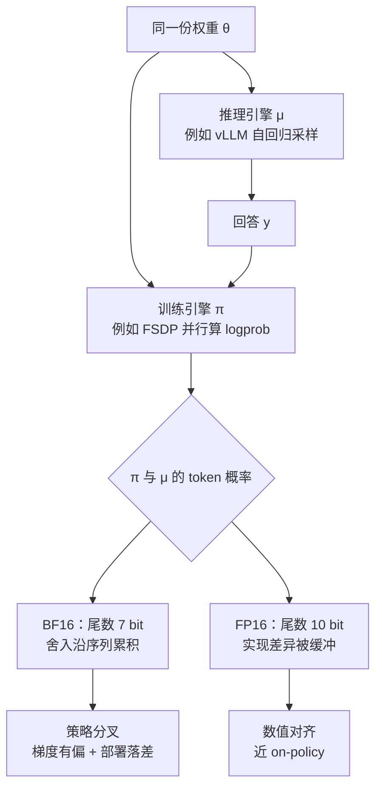

# FP16：训推不一致的根因是 BF16 舍入，换精度就够

<!-- release-date: 2025-10-30 -->

> 本文依据 **Defeating the Training-Inference Mismatch via FP16**，即 arXiv:2510.26788v1、封面页眉日期 2025-10-30、共 16 页的预印本。三位并列第一作者 Penghui Qi、Zichen Liu、Xiangxin Zhou 来自 Sea AI Lab 与新加坡国立大学（NUS），Qi 同时是 Project Lead；其余作者 Tianyu Pang、Chao Du、Min Lin 属 Sea AI Lab，Wee Sun Lee 属 NUS（PDF p.1）。按主要归属方，本站把它放在 SeaAILab 目录下。页码均指这份 16 页原件的文件页码。截至 2026-09-10 核验，arXiv 上只有 v1，与本地原件一致。
>
> 这是一篇技术论文而不是基模报告，所以没有模型架构和预训练 recipe 可讲。它要回答的问题很窄：**现代 LLM 强化学习框架里，训练引擎和推理引擎（例如 vLLM）对同一份权重算出的概率对不齐，根因是什么、最小的修法是什么。** 作者的主张是：根因是 BF16 尾数太短带来的舍入，把精度换成 FP16 就够。全文把三件事分开写：**论文明确写了什么**（带页码）、**本文如何解释它**（凡属推算、换算或图上读数都会写明）、**外部资料补充**（会给出链接并标注）。

## 读前需要的最少背景

这篇论文假设你已经知道，语言模型做强化学习时，不是在同一个程序里又采样又算梯度。为了快，框架会把活拆开：

- **推理引擎**：负责 rollout。拿到题目，自回归地一个 token 一个 token 往外吐，得到整条回答。工业界常用的是 vLLM。
- **训练引擎**：负责算梯度。把整条回答一次喂进去，并行算出每个位置的对数概率，再反传。常用的是 FSDP、DeepSpeed、Megatron。

两边用的是 **同一份权重**。数学上，它们给出的「下一个词的概率」应该完全一样。论文把推理引擎给出的分布叫做 $\mu$，把训练引擎给出的分布叫做 $\pi$，并写 $\mu=\pi$ 本应成立（PDF p.2）。

实际上对不齐。论文把这个现象叫做 **训练-推理不匹配（training-inference mismatch）**。

还要先认识两个词，后面会反复出现：

- **重要性采样（importance sampling）**：想知道「如果按训练引擎的分布来，这条回答该占多重」，手里却只有推理引擎采出来的样本，就给这条样本乘一个比值 $\pi/\mu$。人话就是：训练引擎有多愿意写它，除以推理引擎有多愿意写它。
- **部署落差（deployment gap）**：你真正拿去上线、拿去评测的，是推理引擎 $\mu$；你真正在优化的，却是训练引擎 $\pi$。两边对不齐，训完的权重对部署引擎就不是最优的。

GRPO 的组内优势、裁剪机制，见本站 [DeepSeekMath](/reports/DeepSeek/DeepSeekMath) 与 [DeepSeek-R1](/reports/DeepSeek/DeepSeek-R1)，这里不重复。序列级重要性比那条线，见本站 [GSPO](/reports/Alibaba/GSPO)；本篇会把它当作对照算法点名，**不搬它的公式和超参数数字**。实验里用到的框架 verl，其系统设计见本站 [HybridFlow](/reports/ByteDance/HybridFlow)。

最后预告一个贯穿全文的硬件事实：BF16 和 FP16 都是 16 位浮点，但比特分配相反。BF16 把 8 位给指数、只留 7 位给尾数，动态范围大、精度粗；FP16 把 5 位给指数、10 位给尾数，范围窄、格子更密（PDF p.5，Table 1）。**预训练喜欢范围，这篇论文说强化学习更需要格子密。**

## 一句话先说清

现代 LLM 强化学习不稳定，很大一部分不是算法写错了，也不是超参没调好。

是训练引擎和推理引擎对同一份权重算出了两套概率。先前的修法分两路：一路用重要性采样给梯度纠偏，一路手工对齐两边的 kernel。作者认为这两路都没有打到根上。

根因是 **BF16 的尾数只有 7 bit**。两边实现稍有不同（CUDA kernel、并行切法、MoE 的 top-k），舍入误差就会沿自回归序列累积，最后 $\pi$ 和 $\mu$ 分叉。

修法出奇地小：

> **强化学习阶段把 BF16 换成 FP16。模型结构不动，学习算法不动，现代框架改几行配置就行。**（PDF p.1–2）

作者反复强调一件容易读反的事：他们 **不是** 在说 FP16 预训练也更好。BF16 的宽动态范围「对稳定的预训练非常出色」；换成 FP16 是因为强化学习阶段权重和激活的数值范围已经在预训练里定下来了，这时被牺牲掉的精度才变成主导缺陷（PDF p.2、p.6）。

## 全景：同一份权重，两条计算路径

机制示意图，根据 PDF p.2–7 正文与 Figure 2 重画，不含实测时间或数据。图里唯一的分叉就是全文的主张位置：**权重没换，换的是这条路径上用多密的格子去算。**

论文把分叉之后的伤害写成两件（PDF p.2–3）。

第一件是 **有偏梯度**。策略梯度本应按训练引擎 $\pi$ 采样来估：

$$
\nabla_\theta J(x,\theta)
=
\mathbb{E}_{y\sim\pi(\cdot\mid x,\theta)}
\bigl[\nabla_\theta\log\pi(y\mid x,\theta)\cdot R(x,y)\bigr]
$$

实践里 $y$ 是推理引擎 $\mu$ 吐出来的。如果假装 $\mu=\pi$，估出来的就不是这条梯度（PDF p.3 式 3）。

第二件是 **部署落差**。参数 $\theta$ 是在 $\pi$ 下被优化的，上线用的是 $\mu$：

$$
\arg\max_\theta\,\mathbb{E}_{y\sim\mu}[R]
\;\neq\;
\arg\max_\theta\,\mathbb{E}_{y\sim\pi}[R]
$$

算法补丁可以修第一件，**天生修不了第二件**：它们只在训练时纠偏，最终权重仍然是按训练引擎的分布优化出来的（PDF p.3）。这是作者坚持「从源头消掉不匹配」而不是「训练时补偿」的原因。

## 旧方案卡在哪

### 算法补丁：用重要性采样把梯度掰回来

原则很清楚。样本来自 $\mu$，要估 $\pi$ 下的期望，就乘比值 $\pi(y\mid x,\theta)/\mu(y\mid x,\theta')$。$\theta'$ 是采样时的参数，离策略时可以和当前 $\theta$ 不同（PDF p.3 式 5）。

人话：这条回答是推理引擎采的；训练引擎如果比推理引擎更愿意写它，就给它更大的权重，反之压小。

理论上无偏，实践上很吵。回答一长，整条序列的概率比会极端化。于是有人用偏差换方差：

- **截断重要性采样（Truncated Importance Sampling，TIS）**：比值超过阈值 $C$ 就砍平（PDF p.3 式 6）；
- **掩码重要性采样（Masked Importance Sampling，MIS）**：比值超过 $C$ 的样本整条丢掉（PDF p.3 式 7）。

论文点名的两个近期实现，都不是从式 5 的「纯策略梯度」出发，而是贴在 GRPO 上面当补丁（PDF p.3–4）：

- Yao 等人（2025）给每个 token 乘一个 token 级 TIS 系数 $\rho_t=\pi(y_t\mid\theta')/\mu(y_t\mid\theta')$（PDF p.4 式 9）；
- Liu 等人（2025a）改成整条序列一个 MIS 系数 $\rho=\pi(y\mid\theta')/\mu(y\mid\theta')$，超了 $C$ 就整条不更新（PDF p.4 式 10）。

本篇实验里的 GRPO 用的是 Dr.GRPO 变体，去掉了原版按长度和难度归一的偏差（PDF p.4 脚注 1）。优势函数按同组其余回答的平均奖励当基线，写法接近 RLOO（PDF p.4 式 8）。

这两类补丁有两个共同问题，作者写得很硬（PDF p.2、p.4）：

1. **算力贵。** 为了算 $\pi(\cdot\mid\theta')$ 做 off-policy 修正，要多做一次前向。按「反向大约是前向两倍」来估，训练成本大约多 25%。
2. **部署落差还在。** 补丁修的是训练时的梯度，不改变「权重是按 $\pi$ 优化出来的」这件事。

verl 这类框架是 GRPO 中心的，并不原生提供式 5–7 那种标准重要性加权估计器（PDF p.3–4）。所以这些补丁在工程上是外挂，不是框架里的一等公民。

### 工程对齐：对 kernel，对实现，对确定性

另一路从系统下手，作者认为成果有限（PDF p.4）：

- MiniMax-M1 把语言模型头改成 FP32，后来被证明挡不住崩溃；
- Ling 团队（2025a）手工对齐训练和推理实现，效果看起来不错，但要很深的领域知识和大量工程，能不能跨框架、跨模型泛化并不清楚；
- Thinking Machines 的 Horace He（2025）演示了如何让推理确定性，但效率代价大，而且并不能直接消掉训推之间的不一致。

为什么难对齐？论文列了几条结构性差异（PDF p.4）：推理是自回归逐步生成，训练是整段并行；两边并行策略不同；MoE 的 top-k 选专家对精度敏感。这些不是改一个算子就能抹平的。

**下面这句是本文的解释，不是论文原话。** 算法补丁接受「两边就是两个分布」，用比值补偿；工程对齐试图让两边变成同一个分布，但实现路径不同，比特级对齐极贵。作者选了第三条路：不改算法、不对齐实现，换一套更密的格子，让实现差异落在舍入误差下面。

## 根因：BF16 的尾数太短

### 16 位只有一份比特预算

浮点数把比特分给两处：指数管范围（能表示多大、多小），尾数管精度（附近两个数隔多远）。FP16 和 BF16 都是 16 位，分配相反（PDF p.5，Table 1）：

| 性质 | FP16 | BF16 |
|---|---|---|
| 指数位数 | 5 | 8 |
| 尾数位数 | 10 | 7 |
| 最小正规格化数 | $\approx 6.1\times 10^{-5}$ | $\approx 1.2\times 10^{-38}$ |
| 最大有限值 | $\approx 6.6\times 10^{4}$ | $\approx 3.4\times 10^{38}$ |
| 大于 1 的下一个可表示数 | $1+2^{-10}\approx 1.000977$ | $1+2^{-7}\approx 1.007812$ |

FP16 是 IEEE 754 半精度；BF16 由 Google 提出，指数位数与 FP32 相同，所以动态范围几乎跟 FP32 一样，换来的是更粗的格子（PDF p.5）。

作者把精度差写成「8 倍」：$2^{10}$ 对 $2^{7}$（PDF p.6）。Table 1 最后一行可以从同一件事读出来：在 1 附近，BF16 能分辨的最小相对差别大约是 0.78%，FP16 大约是 0.098%。

**下面这句是本文的解释。** 重要性比值就活在 1 附近。格子粗，两边引擎一个轻微不同的累加顺序，比值就会跳到另一个可表示数上；回答一长，这些跳跃连乘，序列级比值会指数跑掉。这和 GSPO 篇讨论的「token 比连乘会爆」是同一类数值现象，但本篇把原因归到浮点格式，而不是归到目标函数的粒度。

### 范围不够时，用 loss scaling 把梯度抬起来

FP16 的老问题是梯度下溢：小数被圆成 0。混合精度训练很早就用 **损失缩放（loss scaling）** 处理（PDF p.5，引 Micikevicius et al., 2017）：

1. 反传前把损失乘一个大系数 $S$；
2. 梯度整体被抬高，离开下溢区，进入 FP16 能表示的范围；
3. 更新权前再除以 $S$。

现代框架用的是动态版本：$S$ 会自己调——连续若干步没有溢出（梯度里出现 Inf）就调大，一旦溢出立刻调小（PDF p.5）。PyTorch、Megatron、DeepSpeed 都把它做成了标准件，打开通常只改一行配置（PDF p.6）。

### BF16 为什么成了预训练默认

损失缩放在分布式里并不免费：优化器步进之前，要做一次全局同步，检查有没有溢出、并让所有 worker 用同一个 $S$（PDF p.6）。

BF16 出现在 Google TPU 和后来的 NVIDIA Ampere 上，动态范围与 FP32 相当，几乎可以当 FP32 的即插替换，省掉仔细的 loss scaling。对溢出和下溢不敏感，大模型预训练更稳、更省事，于是迅速变成混合精度训练的事实标准（PDF p.6）。

作者把这件事说得很清楚：**BF16 的稳定性是预训练的优势。** 他们的发现是，它的低精度，正是训推不匹配的源头（PDF p.6）。

### 为什么强化学习阶段更该用 FP16

现代 RL 框架即使训练和推理都标成 BF16，CUDA kernel、并行策略这些实现差异仍会在 BF16 上留下不同的舍入。这些差异沿自回归采样逐 token 累积，最后 $\pi$ 和 $\mu$ 的概率分布显著分叉。这就是前面那两条伤害——有偏梯度和部署落差——的来源（PDF p.6）。

换成 FP16，尾数多 3 bit，输出更可能在数值上一致。多出来的精度构成一块缓冲，把两边引擎的实现差异吞掉，不让舍入累积成策略分叉（PDF p.6）。

关键的适用边界也在这一节：

> 强化学习微调时，权重和激活的动态范围已经在预训练里建立好了。因此 BF16 那种极端范围变得不那么关键，它牺牲掉的精度反而成了主导缺陷。（PDF p.6）

所以这篇论文的配方是阶段相关的：预训练继续用 BF16 合理；**到了 RL，用范围换精度。** 不是「FP16 在所有阶段都更好」。

### 离线分析：单看推理精度，分数几乎不动

作者先不做 RL，只换推理精度，看分数会不会自己涨。用 DeepSeek-R1-Distill-Qwen-1.5B，AMC / AIME 每题采 32 条，解码按该模型推荐的 temperature 0.6、top-p 0.95，总 token 预算 8K 和 32K（PDF p.6，Table 2）：

| dtype | AMC23（8K） | AIME24（8K） | AMC23（32K） | AIME24（32K） |
|---|---:|---:|---:|---:|
| BF16 | 50.38 | 22.60 | 62.35 | 29.90 |
| FP16 | 50.60 | 20.10 | 63.10 | 30.94 |
| FP32 | 51.54 | 22.30 | 62.42 | 28.44 |

三档精度互有胜负。FP16 在 AIME24 的 8K 设置上甚至低于 BF16（20.10 对 22.60）。作者的结论是：它们的表现大体相当，**单把推理精度提高，并不必然带来提升**（PDF p.6）。

真正要看的是训推之间的概率差。作者改用 temperature 1.0、关掉 top-p，让 $\mu$ 能直接和 $\pi$ 比；同一份权重放到 DeepSpeed 训练引擎里重算 token 对数概率。Figure 2 四张子图（PDF p.7）：

- 左两张是 token 级概率散点。横轴推理引擎 $\mu$，纵轴训练引擎 $\pi$，黑虚线是 $\pi=\mu$。BF16 点云沿对角线散开；FP16 明显更贴对角线。
- 右两张是序列级对数概率比 $\log(\pi(y\mid x)/\mu(y\mid x))$ 对生成长度。BF16 的拟合斜率是 $-1.01$，序列级 KL 是 $\mathrm{KL}[\mu\parallel\pi]=7.64$，越长越往下掉，短序列就已经到 $-10$、长序列能掉到 $-40$ 以下；FP16 斜率是 $-0.07$，KL 是 $0.32$，点云贴在 0 附近。

作者把序列级不匹配写成「大约小 24 倍」（PDF p.7）。$7.64/0.32=23.875$，和「24 倍」对得上；这是正文给出的约数，不是从图上另量的。

BF16 的序列级误差随长度指数变差，因为自回归误差会累积；FP16 把这个累积压到温和得多的水平（PDF p.7）。这张图是全文最硬的机制证据：不匹配不是「偶尔差一点点」，而是长度一长就会被放大到重要性权重没法用的程度。

## 健全性测试：先问算法能不能把会做的题做满

标准基准里混着对初始模型太简单和根本做不出来的题。太简单的浪费算力；做不出来的会让人分不清「算法坏了」还是「模型不会」。作者造了一个 **可完善数据集（perfectible dataset）**：每道题对初始模型既不是送分题，也不是死题。在这种数据上，可靠的 RL 算法理论上应能把训练准确率做到 100%（PDF p.7）。

做法：在 MATH 上对每题展开 40 条回答，只保留初始准确率落在 20% 到 80% 的题，给 DeepSeek-R1-Distill-Qwen-1.5B 筛出 1460 道（PDF p.7）。数据集更小，做到接近 100% 在算力上可行。通过标准是训练准确率收敛到高阈值之上，例如 95%；过不了关，就被认为不可靠或设计上有根本缺陷。通过不是万能保证，失败却是很强的诊断信号（PDF p.7）。

### 实验设置

健全性测试的固定配置（PDF p.7–8）：

| 项目 | 设置 |
|---|---|
| 初始模型 | DeepSeek-R1-Distill-Qwen-1.5B |
| 上下文长度 | 8,000 |
| 硬件 | 8 张 NVIDIA A100 80G |
| 每次策略迭代 | 64 道题 × 每题 8 条 rollout，做 4 次梯度更新 |
| GRPO 族 `clip_higher` | 默认 0.28（引 DAPO） |
| TIS / MIS 的阈值 $C$ | 3 |

对照算法（PDF p.8）：

- 原版 GRPO（实为 Dr.GRPO，式 8）；
- GRPO + token 级 TIS（式 9，Yao et al., 2025）；
- GRPO + 序列级 MIS（式 10，Liu et al., 2025a）；
- 标准带重要性采样的策略梯度（式 5）；
- GSPO。论文写明 GSPO 主要是为 MoE 引入的不匹配设计的，这里只拿来当对照，不展开它的公式（PDF p.8）。完整机制见本站 [GSPO](/reports/Alibaba/GSPO)。

为排除实现伪影，同一套实验在两个框架上各跑一遍：VeRL（即 verl，见 [HybridFlow](/reports/ByteDance/HybridFlow)）和 Oat（Sea AI Lab 自己的研究型框架）（PDF p.8）。作者还写明他们修过 VeRL 里 Dr.GRPO 的一个实现错误，并基于 `sail-sg/odc` 优化了训练速度（PDF p.8 脚注 3）。

### 和算法纠偏对照：FP16 上最朴素的策略梯度，胜过 BF16 上所有补丁

Figure 3 分两行，上行 VeRL、下行 Oat，各四列：训练奖励、AIME 2024、不匹配度量、$\pi-\mu$ 的最大最小值（PDF p.8）。第三列的具体定义因代码库而异（VeRL 用平均绝对差，Oat 用 KL），作者说语义相近、不影响结论。

正文给出的峰值是（PDF p.8–9）：

| 方法（均为 BF16，除非标明） | VeRL 训练准确率峰值 | Oat 训练准确率峰值 | 随后 |
|---|---|---|---|
| GRPO | 73% | 84% | 崩溃 |
| GRPO-Token-TIS | 82% | 88% | 崩溃 |
| GSPO | 比 Token-TIS 更稳、奖励更高 | — | VeRL 上 1200 步后梯度范数变成 NaN，更新停住（脚注 4） |
| GRPO-Seq-MIS | 不崩溃，峰值 95% | 不崩溃 | 收敛慢；AIME 2024 峰值 34% |
| **FP16 的 PG-Seq-IS** | **99%** | 同样稳定走高 | AIME 2024 峰值 **39%** |

读 Figure 3 能确认的形状（读图，论文没有给曲线数值表）：崩溃的方法在不匹配度量上会先抬头，随后 $\pi-\mu$ 的极值被推到 $\pm 1$ 附近——同一份权重，一个引擎把某 token 的概率推向 1，另一个推向 0。FP16 的 PG-Seq-IS 那条线贴着「无匹配」的红虚线，奖励一直爬到接近 1.0。

几条判断值得单独拆开：

**Token 级 TIS 只能拖一点时间。** 这和 Liu 等人（2025a）先前的观察一致（PDF p.8）。补丁让训练多撑一会儿，挡不住最后的崩溃。

**GSPO 在 BF16 下比 Token-TIS 更稳，尽管它完全没用 $\mu$。** 作者写的是 surprisingly（PDF p.8）。本篇不据此评价 GSPO 的目标函数；它在这里只说明：即使是「不看推理引擎概率」的算法，也仍受 BF16 数值分叉拖累，并且在 VeRL 上会以 NaN 的形式停住。

**BF16 下唯一不崩溃的算法纠偏是序列级 MIS。** 稳定的代价是序列级重要性比方差高，收敛慢（回看 Figure 2）。即便到峰值，训练准确率 95% 对 FP16 的 99%，AIME 2024 是 34% 对 39%，部署落差仍在（PDF p.9）。

**最意外的发现：FP16 让序列级重要性比变得能用。** 这个量在 BF16 下以高方差出名；换了 FP16，它集中且稳定，于是可以回到式 5 那种无偏、不加补丁的策略梯度（PDF p.9）。Figure 3 里，这条最朴素的估计器在 FP16 下明显超过 BF16 下所有更复杂的纠偏。

训练动态上，作者观察到一个可作为预警的现象：最终会崩溃的算法，崩溃前训推不匹配会持续变大；稳定的算法把不匹配维持在有界范围。他们怀疑极值化（一个策略概率趋近 1、另一个趋近 0）由某种优化偏差驱动，并写明还需要进一步验证（PDF p.9）。FP16 的不匹配水平低于任何一种 BF16 方法。这是「精度层的稳定性」为什么能让朴素方法赢过复杂补丁的原因。

两个框架的结论方向一致，细节有差：Oat 一开始的不匹配略小于 VeRL，例如 $\pi(\cdot\mid\theta')-\mu(\cdot\mid\theta')$ 的最小值在 Oat 里接近 $-0.9$，在 VeRL 里接近 $-1.0$。即便都用 FP16，VeRL 也更容易冒出偶发的数值尖峰。作者把这归因于分布式后端不同：DeepSpeed ZeRO 对 PyTorch FSDP，并认为这解释了为什么 Oat 的训练奖励略高，尤其是那些最终会崩溃的算法（PDF p.9）。

### FP16 下再看各算法：差别几乎消失

把同一批算法全部改成 FP16 再跑，Figure 4 四列是训练奖励、回答长度、AIME 2024、AIME 2025（PDF p.9）。

作者的定性结论：算法之间的表现差异几乎无法区分。原因是 FP16 显著减小了训推不匹配，优化问题被变成近 on-policy；这时各算法那些复杂纠偏几乎不再提供额外好处（PDF p.9）。

读 Figure 4（读图，无数值表）：五条奖励曲线叠在一起，都从约 0.6 爬到接近 1.0；回答长度从约 6000 降到约 3500–4000。一个小例外：原版 GRPO 在 AIME 2024 上略低，在 AIME 2025 上略高，作者认为不足以下相对优劣的定论（PDF p.9）。

**这一节是对「换算法还是换精度」最清楚的回答。** BF16 下算法选择决定你会不会崩、崩得有多快；FP16 下算法选择几乎不再是稳定性的一等变量。

### 精度消融：不是「推理越精越好」那么简单

为了把训练精度和推理精度拆开，作者在 VeRL 上做了组合消融：推理用 vLLM，训练用 PyTorch FSDP（PDF p.10，Figure 5）。四条曲线是：

| 推理 dtype | 训练 dtype | 图例 |
|---|---|---|
| FP32 | BF16 | `fp32vllm-bf16fsdp` |
| FP16 | BF16 | `fp16vllm-bf16fsdp` |
| FP16 | FP16 | `fp16vllm-fp16fsdp` |
| BF16 | BF16 | `bf16vllm-bf16fsdp` |

训练用 BF16 时，提高推理精度确实能延长稳定时间、抬高表现；配上 FP32 推理，训练可以完全不崩。代价是 FP32 推理几乎比 FP16 / BF16 慢三倍，大规模实验不实用（PDF p.10）。

读 Figure 5 第三列（读图）：FP32 推理的 rollout 时间约在 250–350，其余三条约在 50–100，和「近三倍」一致。第四列里，双 BF16 的 $\pi-\mu$ 极值迅速冲到 $\pm 1$；FP16 推理 + BF16 训练好一些，仍会散开；双 FP16 贴着红虚线。双 BF16 的奖励大约在 500–800 步崩溃，FP16 推理 + BF16 训练大约拖到 1000 步附近再掉——这两个步数是读图估计，正文只写了定性的「延长」「最终仍不稳」。

两端都用 FP16 得到最低的不匹配、最稳的动态，并且在可完善数据集上做到接近 100% 训练准确率，速度不损失（PDF p.10）。

**所以「把推理改成 FP32」能治标，治本且能用的是两边一起改成 FP16。** 只提高推理精度，训练引擎仍在用粗格子算梯度，分叉还在。

## 推广：MoE、LoRA、更大的稠密模型、别的家族

健全性测试把算法对照做干净了。第 5 节把同一句话拿到更脏的设置上：MoE、LoRA、更大的 prompt 集、别的模型家族（PDF p.10）。封面 Figure 1 是训练奖励，附录 Figure 6 是用这些 checkpoint 做的评测（PDF p.16）。正文几乎不给这两张多面板图的绝对数值，下面凡是「绿线在蓝线上面」这类判断，都是读图；正文写明的步数和定性结论会单独标注。

### MoE：top-k 选专家让不匹配更大

MoE 的强化学习以不稳定出名，常常要上复杂的稳定策略（PDF p.10，引 GSPO 那篇）。训练和推理往往用不同的并行，再加上 top-k 选专家这种对精度敏感的操作，训推不匹配通常比稠密模型更大（PDF p.10）。

实验载体是 Qwen3-30B-A3B-Base，三种算法：GRPO-Seq-MIS、GRPO-Token-TIS、PG-Seq-TIS。数据是 DAPO-Math-17k，在线评测 AIME 2024 的 avg@32，跑在 VeRL 上（PDF p.10、p.15）。

Figure 1(i)(j)(k) 的训练奖励和 Figure 6(i)(j)(k) 的验证奖励上，FP16 都更稳、更高；三种算法方向一致（PDF p.10）。读图能看到的是：蓝线（BF16）在 (i)(j) 上更抖，绿线（FP16）爬完之后平台更高；正文没有给出「高多少」的表。

附录超参（PDF p.15，Table 3）里和本主张直接相关的几项：64 张 GPU（8 节点 × 8 卡），vLLM 0.10.0，训练 batch 512，每题 16 条 rollout，最大回答 20480，学习率 $1\times 10^{-6}$，不使用 KL，裁剪上 0.28、下 0.2，$C=3$，损失聚合模式是他们修正过的 `seq-mean-token-sum-norm`。作者特别写了一句：开源 VeRL 没有正确实现 Dr.GRPO 的常数归一化，他们改过的版本才叫这个名字（PDF p.15）。

### LoRA：小适配器也会崩

LoRA 最近在 LLM RL 里重新受欢迎。作者用 Qwen2.5-Math-1.5B，在标准 MATH 上跑 GRPO-Token-TIS，LoRA 加到所有层，rank 32，缩放 $\alpha=64$，学习率按 Schulman 与 Thinking Machines Lab（2025）的建议略大于全参微调，取 $4\times 10^{-5}$（PDF p.10–11）。

Figure 1(h)：BF16 的 LoRA 训练大约 600 步后崩溃，FP16 全程稳定（PDF p.11）。600 这个数是正文写的。读 Figure 6(h) 能看到评测曲线同样是蓝线中途塌下去、绿线维持在高位。

### 更大的稠密模型

作者用 DAPO 算法在「14B 稠密模型」上做 RL（PDF p.11）。这里有一处论文内部不一致，必须照原文摊开，不能替它圆：

- 正文 5.3 写的是 Qwen3-14B-Base，并说细节见 A.1（PDF p.11）；
- 附录 A.1 其实是 MoE 那一节；大稠密模型的细节在 A.2，A.2 写的是 Qwen2.5-14B-Base（PDF p.15）；
- Table 3 的 `model.path` 写的又是 Qwen3-14B-Base（PDF p.15）。

**无法从原件判定实际加载的是 Qwen3-14B-Base 还是 Qwen2.5-14B-Base。** 能确定的是：14B 量级稠密模型、DAPO 算法、数学域 54.4k 条训练样本（Cheng et al., 2025 从 OR1、DAPO、DeepScaler 去重过滤而来），在线评测 AIME 2024 的 avg@8，64 卡，vLLM 0.10.0（PDF p.15）。

正文对结果只写了定性：Figure 1(l) 里 FP16 的训练奖励涨得比 BF16 快；Figure 6(l) 里 FP16 在 AIME 2024 验证准确率上更高（PDF p.11）。读 Figure 1(l)：两条线都从约 0.60 爬到约 0.80，绿线全程在上、更早进入平台。读 Figure 6(l)：纵轴大约 0.30–0.50，绿线上升更快，末端略高于蓝线。这些是读图，论文没有终点分数表。

### 别的模型家族：从 Llama 中训出来的 OctoThinker

前面几乎都是 Qwen 系。作者换成 OctoThinker-3B：从 Llama3.2-3B 在推理密集数据上中训得到，用 GRPO 接着做 RL（PDF p.11）。

Figure 1(g)：BF16 大约 150 步后因数值不匹配失稳，FP16 继续平滑训练、不崩溃（PDF p.11）。150 是正文写的。读 Figure 6(g)：蓝线从约 0.5 掉到接近 0，绿线维持在约 0.5。

这一节的作用是排除「只对 Qwen 的数值范围成立」。基座模型会决定探索范围，也会决定参数和激活对舍入有多敏感；换家族之后结论方向不变（PDF p.11）。

封面 Figure 1 十二个面板可以收成一张对照（全部读图，正文只给了 (g)(h) 的崩溃步数和 §4 的峰值）：

| 面板 | 设置 | BF16 | FP16 |
|---|---|---|---|
| (a) | Sanity GRPO | 先升后崩 | 爬到接近 1.0 |
| (b) | Sanity GRPO-Token-TIS | 先升后崩 | 爬到接近 1.0 |
| (c) | Sanity GRPO-Seq-MIS | 不崩，平台更低 | 更高、更稳 |
| (d) | Sanity GSPO | 中途掉头 | 爬到接近 1.0 |
| (e) | Sanity PG-Seq-IS | 升得慢、平台更低 | 爬到接近 1.0 |
| (f) | Sanity PG-Seq-MIS | 相对稳，仍低于绿线 | 更高 |
| (g) | OctoThinker GRPO | ~150 步失稳 | 不崩 |
| (h) | LoRA GRPO-Token-TIS | ~600 步崩溃 | 不崩 |
| (i)(j)(k) | MoE 三种算法 | 更抖、平台更低 | 更稳、更高 |
| (l) | Dense-14B DAPO | 升得慢 | 升得快，末端略高 |

Figure 6 是同一批设置的评测版，作者用来说明 FP16 训出来的模型在未见过的基准上也能泛化（PDF p.16）。健全性那几格的纵轴大约在 0.20–0.40（AIME 量级），不是 Figure 1 那种 0.5–1.0 的训练奖励——两张图不要直接比高度。

## 讨论：精度取舍，以及 BF16 下的偏差-方差

第 6 节两段，一段谈默认精度该不该改，一段回看第 4.2 节的算法对照（PDF p.11）。

**精度取舍。** 数值精度是训练栈的基础选择，长期被 BF16 同时统治预训练和后训练，因为它范围大、好用。作者认为这个默认值在 RL 微调阶段值得重新想：这一阶段训推不匹配是不稳定的关键来源，BF16 的低精度会加剧它。用 BF16 的宽范围去换 FP16 的更高精度，可以得到明显更稳的 RL、更快的收敛和更好的最终表现（PDF p.11）。

他们立刻加了边界，避免被读成「FP16 万能」（PDF p.11）：

- 不声称 FP16 是普遍最优；
- 追求效率可能走向更低精度，例如 FP8；
- 极大的模型用 FP16 可能碰到范围不够、溢出这类工程问题；
- 这些问题他们认为可解，依据是近年来大规模 FP8 训练已经成功。

希望是：社区把 FP16 重新当成稳定 RL 微调的一个有力、而且常常更合适的选项（PDF p.11）。

**BF16 下的偏差-方差权衡。** 第 4.2 节暴露了一组对照（PDF p.11）：

- 方差低、偏差高的方法（GRPO、token 级 TIS、GSPO）一开始收敛快，但不稳，最终崩溃；
- 对策略不匹配纠得更准、偏差更小的方法（PG-Seq-IS、GRPO-Seq-MIS）能稳住，但方差高，收敛慢。

换成 FP16，这个权衡变得远没有那么关键。不匹配本身被压下去，既降低了不匹配带来的偏差，也降低了重要性采样纠偏的方差。于是最朴素的策略梯度也能高效收敛，所有被试算法都表现良好，稳定和速度之间的紧张被有效消掉（PDF p.11）。

**下面这句是本文的解释。** BF16 下你好像在选算法，其实是在偏差和方差之间做被迫的选择；FP16 把那个被迫选择的前提拆掉了。所以「GSPO 比 GRPO 稳」「序列级 MIS 比 token 级 TIS 稳」这些对照，在 BF16 世界里成立，到了 FP16 世界里差距会收成 Figure 4 那种几乎重叠。本篇和 GSPO 篇并不互相否定：GSPO 处理的是奖励粒度和 MoE 路由造成的算法层 off-policy；本篇处理的是同一份权重被两套引擎算出两套概率。两条线可以同时存在，本篇的主张是第二条线用换精度就能收掉。

## 结论

第 7 节把全文收成四句（PDF p.12）：训推不匹配是 RL 微调不稳定的主要来源，本质上是数值精度问题；现有算法补丁往往复杂且低效；把标准 BF16 换成更高精度的 FP16 几乎能消掉不匹配；这一处高效的改动带来更稳的训练、更快的收敛和更好的表现，说明在精度层处理问题是更有效的策略。结论是：FP16 应当被重新考虑为 LLM 稳健 RL 微调的基础选项。

## 它怎么支撑基模的训练

这篇论文没有交出一个新模型。它交出的是后训练流水线里一个很小、但卡在咽喉上的开关。

**1. 让 RL 阶段可以真的跑完。** 引言把崩溃写成当前 RL 微调的日常（PDF p.2）。一次不可逆崩溃意味着整段算力作废。换精度不提高单步吞吐，它提高的是「这条 run 能活到该结束的时候」。

**2. 把部署落差从源头关掉。** 算法补丁修训练时的梯度，修不了「上线用的是另一套概率」。两边引擎都用 FP16 之后，$\pi$ 和 $\mu$ 被拉回近乎同一分布，优化目标与部署目标重新重合（PDF p.2–3、p.9）。对要拿 checkpoint 直接上推理服务的团队，这一条比训练曲线更好看更重要。

**3. 少一次前向，少 25% 训练成本。** 为纠偏去算 $\pi(\cdot\mid\theta')$ 的那次额外前向可以拿掉，RL 回到「纯的重要性加权策略梯度」形式（PDF p.2、p.4）。前提是你接受「精度已经把不匹配压到可以忽略」；Figure 2 和 Figure 4 是这个前提的证据。

**4. MoE 上它和算法层修法正交。** GSPO 把重要性比从 token 抬到序列，是为了奖励粒度和专家路由；本篇把格子加密，是为了两套引擎的舍入。MoE 实验里三种算法换 FP16 都更好（PDF p.10），说明精度开关不依赖你选了哪一种纠偏。

### 可以带回自己项目的原则

**先分清「两个分布」是算法造成的，还是算术造成的。** 切 mini-batch、异步 rollout、旧策略采样，那是算法层的 off-policy，该用重要性采样。同一份权重、两个引擎、本应 $\mu=\pi$，那是算术层的假 off-policy。后者用算法补丁去修，会把舍入误差写进梯度。

**阶段变了，精度的最优解会跟着变。** 预训练需要 BF16 的范围；RL 需要 FP16 的尾数。默认值是为上一个阶段选的，不该被下一个阶段继承。

**补丁的成本要算进「它没有修掉的那一半」。** Token 级 TIS 多撑一会儿，序列级 MIS 能不崩但收敛慢，两者都关不掉部署落差，还要多 25% 前向。评估一个纠偏，要问它修的是训练曲线还是上线分布。

**长度是舍入的放大器。** Figure 2 里 BF16 的序列级误差斜率接近 $-1$，回答越长，重要性权重越不可用。长思维链 RL 把这个问题从「偶尔」变成「默认」。

**跨框架不要假设不匹配一样大。** 同一套算法，Oat 和 VeRL 的初始 $\pi-\mu$ 就不一样（PDF p.9）。换后端等于换舍入路径。

## 外部补充：论文之后，verl 把 FP16 收进了框架

**以下这一段全部是外部资料，不是论文内容。** 论文写作时 VeRL 还没有原生 FP16 路径，作者自己提供的是补丁。

官方代码在 [sail-sg/Precision-RL](https://github.com/sail-sg/Precision-RL)。仓库里有 `verl_fp16.patch`、子模块 `Precision-RL-verl`，以及 Oat 侧的复现目录。健全性测试数据另发在 Hugging Face 的 [`sail/Sanity-Test-R1D-1.5B`](https://huggingface.co/datasets/sail/Sanity-Test-R1D-1.5B)。README 的 Updates 写了两条时间线（核验日期 2026-09-10）：

- 2025-10-31：Oat 已支持 FP16 训练，见 [sail-sg/oat](https://github.com/sail-sg/oat)；
- 2025-11-14：VeRL 已为 FSDP 和 Megatron（仅稠密模型）提供 FP16 训练支持。

对应的合入记录：

- FSDP 路径：[verl-project/verl#4036](https://github.com/verl-project/verl/pull/4036)，2025-11-13 合入。PR 写明受 Precision-RL 补丁启发，引用了本篇 arXiv；实现上给 actor / ref / vLLM rollout 都加上 `float16`，并用 `ShardedGradScaler` 做损失缩放。配置入口是 `actor_rollout_ref.actor.dtype=float16` 等覆盖项，默认仍是 BF16。
- Megatron 稠密路径：[verl-project/verl#4086](https://github.com/verl-project/verl/pull/4086)，2025-11-13 合入。作者 Qi 在 2025-11-14 的公开帖里把它和 #4036 一起称为 VeRL v0.6.1 的原生 FP16。
- README 当时还指向 NVIDIA Megatron-LM 的 MoE FP16 议题 [#2102](https://github.com/NVIDIA/Megatron-LM/issues/2102)，称「on the way」。其后 verl 侧另有 [verl-project/verl#4158](https://github.com/verl-project/verl/pull/4158)（2025-11-21 合入）用 fork 版 Megatron 跑 Qwen3-MoE 30B 的 FP16。这些都是论文之后的工程演进，**不能用来补写论文没做的 MoE-Megatron 实验。**

论文里的框架名写成 VeRL，本站按 HybridFlow 篇的用法称 verl。两边不需要对齐用词。今天 verl 源码里 FP16 怎么配、默认值是什么，归本站「开源解读」模块，与本篇的时间轴不同。

## 边界与缺口

论文自己承认的：

- 不声称 FP16 普遍最优；极大模型可能碰到范围与溢出；FP8 仍可能是效率方向（PDF p.11）；
- $\pi-\mu$ 被推向 0/1 的机制只是怀疑，需要进一步验证（PDF p.9）；
- 封面标注 Preprint，Work in process（PDF p.1）。

论文没写、对照原文后整理出来的：

- **没有墙钟时间、没有端到端吞吐。** 「25%」是按「反向 = 2 × 前向」估的额外前向成本，不是测出来的。FP32 推理「近三倍慢」是 Figure 5 的 rollout time，不是整步迭代。
- **没有给出 Figure 1 / Figure 6 的终点分数表。** 十二个设置的「高多少」只能读图，不能写成「AIME 提高 x 分」——唯一有对照数字的评测峰值是健全性测试里 Seq-MIS 的 34% 对 FP16 的 39%（PDF p.9）。
- **14B 稠密实验的模型名在正文、附录、表之间不一致**（Qwen3-14B-Base / Qwen2.5-14B-Base），见上文 5.3 节。
- **健全性测试只有一个 1.5B 蒸馏模型和一个 1460 题的 MATH 子集**；推广实验覆盖了 MoE 30B-A3B、LoRA 1.5B、14B 稠密、OctoThinker-3B，但任务几乎都是数学，没有代码、工具或多轮 Agent。
- **没有把「换 FP16」和「手工对齐 kernel」做同一套实验的对照**，也没有量化「还剩多少无法被 FP16 吸收的实现差异」。
- **没有讨论 FP16 在极长上下文、极宽 MoE、FP8 权重或量化推理下的行为。** 部署若改成 FP8 / INT4 服务，训推精度再次分叉，这篇论文没有覆盖。
- **Oat 与 VeRL 的差异只归因到 ZeRO 对 FSDP，没有消融通信、算子融合或采样内核。**

## 关键词回看

- **训练-推理不匹配（training-inference mismatch）**：同一份权重，推理引擎 $\mu$ 和训练引擎 $\pi$ 算出的 token 概率不一致。数学上应有 $\mu=\pi$。
- **$\mu$ 与 $\pi$**：$\mu$ 是 rollout 用的推理分布，$\pi$ 是算梯度用的训练分布。论文的记号从第 2 节沿用到第 4 节。
- **部署落差（deployment gap）**：参数按 $\pi$ 优化，上线按 $\mu$ 评测，两边的最优 $\theta$ 不是同一个。
- **重要性采样比 $\pi/\mu$**：用推理引擎采的样本，估训练引擎下的期望时乘的权重。token 级是每个位置一个，序列级是整条回答一个。
- **TIS / MIS**：截断或掩码重要性采样。前者把过大的比砍平，后者把过大的比整条丢掉。用偏差换方差。
- **BF16 / FP16**：都是 16 位。BF16 指数 8、尾数 7，范围大、格子粗；FP16 指数 5、尾数 10，范围窄、格子密。大于 1 的下一个可表示数分别约为 1.007812 和 1.000977。
- **损失缩放（loss scaling）**：反传前把损失乘 $S$，把小梯度抬出 FP16 下溢区，更新前再除回去。动态版本按是否溢出自动调 $S$。
- **可完善数据集（perfectible dataset）**：筛掉对初始模型太简单和做不出来的题，用来诊断 RL 算法能不能把「会做的题」做满。本篇的通过线是训练准确率 95%。
- **Dr.GRPO**：去掉原版 GRPO 按长度和难度归一的变体。本篇的 GRPO 基线用它；作者还修过 VeRL 里对应的实现。

## 最后的判断

这篇论文的技术含量不在新公式。它做的是一次 **归因的下沉**：把社区当成算法问题、系统问题来打的训推不一致，指认成浮点格式选错了。

证据分层很清楚。

- **确定的**：BF16 与 FP16 的比特分配和可表示范围是浮点标准；同一权重下 BF16 的序列级 KL 是 7.64、FP16 是 0.32，大约差 24 倍（PDF p.5、p.7，Table 1 与 Figure 2）。离线评测里换推理精度几乎不涨分（Table 2），所以收益不是「FP16 推理本身更准」。
- **有实验支持、覆盖仍有限的**：健全性测试里，BF16 的 GRPO / Token-TIS 崩溃，Seq-MIS 不崩但封顶 95% / 34%，FP16 的朴素策略梯度到 99% / 39%；FP16 下各算法曲线几乎重叠；两端 FP16 优于「FP32 推理 + BF16 训练」这种又慢又治标的组合；MoE、LoRA、14B、Llama 中训家族上方向一致。
- **只是观察或边界声明的**：崩溃前不匹配抬头可作为预警；0/1 极化的优化偏差机制未验证；极大模型上 FP16 的溢出是「可解」而不是「已解」；FP8 仍可能是下一阶段的效率选择。

它和邻居两篇的关系也清楚。HybridFlow 解决的是「四个模型的控制权放哪一层」；GSPO 解决的是「奖励按整条给，修正却按 token 做」。本篇解决的是更底下的一层：两边引擎在用同一份权重做算术时，格子够不够密。三篇可以叠在同一条 RL 流水线上，不必互相替代。

如果只记一句话：

> **预训练选范围，强化学习选精度。训推不一致如果来自舍入而不是来自策略，换格子比换目标函数更便宜。**

## 资料与阅读边界

- **原始依据**：本地 `papers/SeaAILab/FP16-Training-Inference-Mismatch.pdf`，**Defeating the Training-Inference Mismatch via FP16**，arXiv:2510.26788v1，共 16 页（正文与结论 12 页、参考文献 3 页、附录 A–B 共 2 页）。PDF 内嵌标记为 `arXiv:2510.26788v1 [cs.LG] 30 Oct 2025`，封面写 Preprint. Work in process。本文所有页码指 PDF 页码。
- **版本核验**：[arXiv:2510.26788](https://arxiv.org/abs/2510.26788)。提交历史只有 v1，时间为 2025-10-30T17:58:11Z。**截至 2026-09-10 核验，最新版本仍是 v1，与本地原件一致，无需替换原件。**
- **`release-date` 取 2025-10-30**。理由：这是一项训练精度技术，论文里的对象不是对外提供的模型，因此按流程取「该技术首次官方公开日」。已核查的官方渠道里最早的公开事件是 arXiv v1。GitHub [sail-sg/Precision-RL](https://github.com/sail-sg/Precision-RL) 是论文首页给出的代码仓，其中 Oat 支持与 verl 合入都写在 2025-10-31 及之后，晚于 arXiv v1，不回写。
- **官方代码仓库**：[sail-sg/Precision-RL](https://github.com/sail-sg/Precision-RL)。**本文没有阅读补丁与子模块源码，也没有把仓库实现细节当作论文结论。**
- **外部补充清单**（均已在正文中标注，不与论文内容混用）：
  - Precision-RL README 的 Updates 时间线与 `verl_fp16.patch`；
  - 健全性数据 [`sail/Sanity-Test-R1D-1.5B`](https://huggingface.co/datasets/sail/Sanity-Test-R1D-1.5B)；
  - verl FSDP FP16：[verl-project/verl#4036](https://github.com/verl-project/verl/pull/4036)（2025-11-13 合入）；
  - verl Megatron 稠密 FP16：[verl-project/verl#4086](https://github.com/verl-project/verl/pull/4086)（2025-11-13 合入）；
  - 其后 MoE FP16 尝试：[verl-project/verl#4158](https://github.com/verl-project/verl/pull/4158)，以及 Megatron-LM 议题 [#2102](https://github.com/NVIDIA/Megatron-LM/issues/2102)。
- **未公开 / 无法核实的缺口**：Figure 1 / 6 无终点分数表；14B 实验的模型名正文与附录冲突；FP32 推理「近三倍」未给整步迭代时间；没有与手工 kernel 对齐的对照；没有极长上下文 / 量化部署下的测量；Oat 与 VeRL 差异没有算子级消融。
- **跨篇参考**：GRPO 出处见 [DeepSeekMath](/reports/DeepSeek/DeepSeekMath)；R1 类 RL 训练见 [DeepSeek-R1](/reports/DeepSeek/DeepSeek-R1)；序列级重要性比与 MoE 路由见 [GSPO](/reports/Alibaba/GSPO)；verl 的框架设计见 [HybridFlow](/reports/ByteDance/HybridFlow)；本篇引用的 clip_higher=0.28 来自 [DAPO](/reports/ByteDance/DAPO)。这些机制本篇都没有展开。
