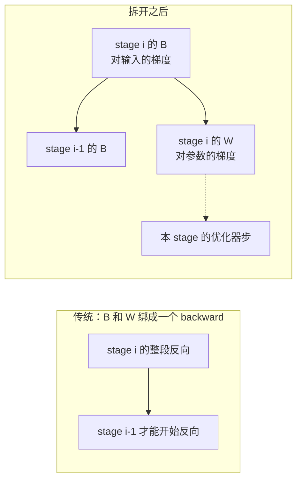
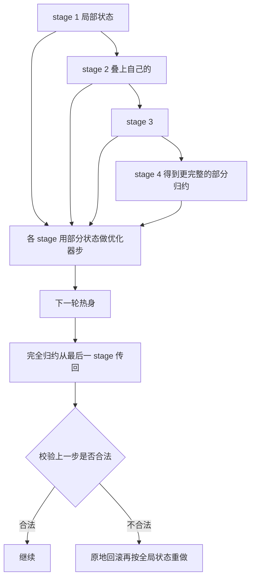
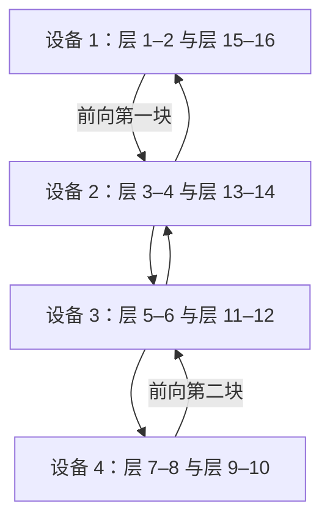

# Zero Bubble：气泡不是同步训练的宿命，把反向拆开就能填平

<!-- release-date: 2023-11-30 -->

> 本文依据 Sea AI Lab 的 **Zero Bubble Pipeline Parallelism**，即 arXiv:2401.10241 **v1**，封面水印 `arXiv:2401.10241v1 [cs.DC] 30 Nov 2023`，共 19 页。作者 Penghui Qi、Xinyi Wan（并列一作）、Guangxing Huang、Min Lin，单位 Sea AI Lab。页码均指这份 PDF。截至核验，arXiv 提交历史只有 **[v1] 2023-11-30 10:40:34 UTC**（636 KB），与本地 19 页原件一致，未做替换。全文把三件事分开标注：**论文明确写了什么**、**我们如何解释或验算它**、**哪些是外部资料补充**。
>
> 这是一篇系统论文，对象从未作为产品对外可用。`release-date` 取技术首次官方公开日 **2023-11-30**，即 [arXiv abs 页](https://arxiv.org/abs/2401.10241) 标注的 Published: 2023-11-30。论文自己把实现开源在 [sail-sg/zero-bubble-pipeline-parallelism](https://github.com/sail-sg/zero-bubble-pipeline-parallelism)（基于 Megatron-LM）。
>
> 后文「论文之后」会单独写 ICLR 2024 录用稿改了标题和摘要数字、以及同一组作者后续的可控显存流水线。那些材料 **不是** 这份 v1 的结论，数字不得横搬。

## 读前先认识几个词

这篇论文的门槛不在新模型，在于它同时用了分布式训练和自动微分两套词汇。先把后文会反复出现的说清楚。前几个是通用背景，不全是论文自己定义的。

- **流水线并行（pipeline parallelism，PP）**：把模型按层切成几段，每段放一张（或一组）GPU。数据从第一段流到最后一段，梯度再流回来。论文把一段叫做 **stage**，把切小的数据块叫做 **microbatch（微批）**。
- **气泡（pipeline bubble）**：因为层与层有依赖，有的 GPU 算完了必须等上游。这段空转就是气泡。气泡率是空转占一次迭代总时间的比例。
- **同步训练语义（synchronous training semantics）**：这一步用的权重，必须是上一步所有 stage 都更新完的同一版。异步流水线可以不要气泡，但各卡看到的权重版本会分叉。
- **1F1B（one-forward-one-backward）**：热身之后，每张卡交替做一次前向、一次反向。气泡大小和朴素流水线差不多，但激活可以更早释放，峰值显存更低。
- **F / B / W**：论文把一层拆成三个可调度块。**F** 是前向；**B** 是对输入的梯度，必须尽快传给上一 stage；**W** 是对参数的梯度，只服务本 stage 的优化器。传统框架把 B 和 W 绑成一个 backward 函数。
- **后验证（post-validation）** 与 **原地回滚（in-place rollback）**：优化器步通常要做一次跨 stage 的 all-reduce（梯度裁剪、INF/NAN 检查）。论文先用部分归约结果迈出这一步，下一轮再核对全局状态；若这一步不合法，就把优化器原地反演算回去再重做。

如果你只想记一句话：

> **反向里真正卡住流水线的，只有对输入的梯度。对参数的梯度可以拿去填空转。再把优化器步的全局同步改成事后核对，同步语义下的气泡才能被打到接近零。**

跨节点为什么优先用流水线、1F1B 到底省的是显存还是气泡，本站已有一份工程手册，见 [Ultra-Scale Playbook](/reports/HuggingFace/Ultra-Scale-Playbook)。那份材料把 1F1B、交错流水线和零气泡串成选型账本；**拆 B/W、后验证、ZB-V 的机制与数字，以本篇 PDF 为准。**

## 一句话先说清

同步流水线并行里，气泡长期被当成不可避免的税。异步方案可以不要气泡，但要放弃「所有卡看到同一版权重」这条语义。

这篇论文的主张是：税不是物理定律，是调度粒度太粗。它做了三件事（PDF p. 1）：

1. 把反向拆成 **B**（对输入）和 **W**（对参数），让 W 可以离开关键路径，去填气泡。
2. 按模型配置和激活显存上限，自动搜一份日程；手搓的 ZB-H1 / ZB-H2 只是理想假设下的示意。
3. 用后验证绕开优化器步的跨 stage 同步。没有这一步，平行四边形会被全局 all-reduce 重新撕开，零气泡只是纸面形状。

相对 1F1B，摘要给出两条吞吐数字（PDF p. 1）：相近显存上限最多约 **+23%**；放松显存最多约 **+31%**。这两条分别对应后文 Table 6 的 ZB-V 与 Table 4 的 ZB-2p，正文表格更细，以表为准。

它明确不解决的问题也要先说清（PDF p. 3）：作者不探索大规模训练里 DP、TP、ZeRO 怎么混用，只把流水线这一维换成可插拔的日程。它和数据并行、张量并行、ZeRO 正交。

## 报告地图：19 页里各写了什么

先摊开篇幅。这是一篇调度论文，没有模型配方，也没有训到收敛的质量表。密度最高的是第 2 节的拆分、第 4 节的优化器绕过和第 5–6 节的实验。

| 报告章节 | PDF 页 | 讲了什么 | 密度 |
|---|---|---|---|
| 标题、摘要 | p. 1 | 23% / 31%；同步语义下零气泡；开源地址 | 高 |
| §1 引言 + 图 1 | p. 1–2 | DP / TP / PP / ZeRO 的分工；GPipe、异步 PP、1F1B；MLP 上的 F/B/W | 高 |
| §2 手搓日程 + 图 2–3 | p. 3 | 1F1B；ZB-H1 与 ZB-H2 | 高 |
| §2.1–2.3 + 表 1–2 | p. 4–5 | 显存高效 vs 零气泡；FLOPs 与激活显存 | 高 |
| §3 自动调度 | p. 4–5 | 启发式 + ILP；1F-1B-1W | 高 |
| §4 优化器同步绕过 + 图 4 | p. 5–6 | 后验证；部分归约 → 先更新 → 下一轮核对 | 高 |
| §5.1 设置 + 表 3 | p. 6–7 | GPT-3 类似模型；A100；ZB-1p / ZB-2p / 1F1B / 1F1B-I | 高 |
| §5.2 主结果 + 图 5 + 表 4 | p. 7–8 | 吞吐与显存；ZB-2p 接近上界 | 高 |
| §5.3–5.4 + 表 5 + 图 6–7 | p. 8–9 | 理论气泡率；显存上限与气泡的交换 | 高 |
| §6 ZB-V + 图 8 | p. 9–10 | V 字形两块；与 1F1B 同峰值激活 | 高 |
| §6.1–6.2 + 表 6–8 + 图 9 | p. 10–12 | 同显存对照；加倍微批；ZB-V 气泡率 | 高 |
| §7 结论 | p. 12 | 3p 个微批通常够用；多出来的微批可以交给数据并行 | 中 |
| 参考文献 | p. 12–14 | 引用 | 低 |
| 附录 A–H | p. 15–19 | DP 重叠、显存公式、原地回滚、profile、后验证消融、同显存对照、ILP、小微批 | 高 |

## 先看矛盾：同步流水线为什么总在空转

大模型一张卡放不下。论文把并行手段分成几路（PDF p. 1）：数据并行（DP）最简单，模型再大就得上模型并行。模型并行又分两路——张量并行（TP）把一层里的矩阵乘切到多卡，流水线并行（PP）把整网切成多个 stage。ZeRO 走另一条路：参数分片，但编程模型仍像 DP。

节点内部有 NVLink 时，DP、TP 和 ZeRO 的混合就够用。跨服务器、尤其到几千张 GPU 时，论文转引 DAPPLE、Alpa、Megatron-LM 的经验：PP 更适合吃跨机连接（PDF p. 1）。所以这篇只打磨 PP 这一维。

PP 的效率几乎完全取决于气泡。层与层有依赖，气泡看起来不可避免。论文把已有修法分成三条（PDF p. 1–2），我们按它写到的程度复述，不另开专文：

- **GPipe**：靠增加同时在管里的微批来摊薄气泡。峰值显存跟着涨。它丢掉一部分中间激活、反向时重算，计算开销大约 **20%**（PDF p. 2，转引 Fan et al., 2021）。
- **异步 PP**（PipeDream、PipeMare）：理论上可以没有气泡，代价是放弃精确的优化语义——各卡更新用的不是同一版权重。
- **同步 1F1B**：先在 PipeDream 的异步设定里出现，后来被接到同步设定。热身之后一前一向，激活更早释放。**同样多的微批下，气泡比例和 GPipe 类似，优势在峰值显存。** 交错 1F1B 再给每张卡多个 stage，气泡更小，通信更多、峰值显存更高。

矛盾到这里还没有被解开。同步语义下，剩下的气泡仍是 PP 最大的问题（PDF p. 2）。异步方案用「版本不一致」换零空转；同步方案用「空转」换版本一致。作者要的是第三种：语义不动，空转接近零。

## 关键一招：反向其实是两件依赖不同的事

传统深度学习框架把网络看成一层层堆起来的对象。每一层只暴露两个函数：前向和反向（PDF p. 2）。

前向把输入 $x$ 变成输出 $y$，映射是带参数的 $f(x,W)$。反向其实有两笔账，论文写成（PDF p. 2）：

$$
\nabla_x f(x,W)^{\top}\frac{\mathrm{d}\ell}{\mathrm{d}y}
\qquad\text{和}\qquad
\nabla_W f(x,W)^{\top}\frac{\mathrm{d}\ell}{\mathrm{d}y}
$$

左边是对输入 $x$ 的梯度，右边是对参数 $W$ 的梯度。论文用单字母 **B** 和 **W** 称呼这两笔，用 **F** 称呼前向。图 1 画的是一层 MLP（PDF p. 2）：前向是 $Wx$ 再过非线性 $\sigma$；反向左侧用 $W^{\top}$ 把梯度传回输入，右侧用外积得到 $\nabla_W L$。

传统实现把 B 和 W 捆成一个 backward。对数据并行这刚好合适：第 $i$ 层权重梯度的通信，可以和第 $i-1$ 层的反向重叠（PDF p. 2）。对流水线并行，这把关键路径拉长了：**第 $i-1$ 层的 B，要等第 $i$ 层的 W 做完。** 下一 stage 根本不需要这份 W，却被绑着一起等。

这是根据 PDF p. 2–3 正文与图 1 重画的 **机制示意**，不是实测时间轴。虚线表示 W 不再挡住下游 stage，只挡住本卡什么时候能更新权重。

我们补一句解释，不是论文原话：矩阵乘的反向天然就是两次同等规模的矩阵乘，一次对输入、一次对权重。自动微分把它们收成一个 API，调度器就看不见那次「可以挪走的矩阵乘」。粒度选得对，搜索空间才用得上。

## 手搓两份日程：一份保显存，一份把梯形拉成平行四边形

拆开之后，约束只剩两条（PDF p. 3）：

- 同一个微批的 F 和 B，跨 stage 仍然必须按顺序。
- W 只要发生在 **同一 stage、同一微批的 B 之后**，就可以插到任意空档。

手搓日程先假设 $T_F=T_B=T_W$，这是 GPipe 和 Megatron-LM 论文里也用过的理想化（PDF p. 3）。第 3 节会丢掉这个假设。

先看旧的 1F1B（PDF p. 3，图 2）。它分三阶段：

1. **热身**：靠前的 stage 多做几次 F，后一个 stage 通常比前一个少做一次。
2. **稳态**：每张卡交替一次 F、一次反向。
3. **收尾**：把还在飞的微批的反向做完，然后所有人一起做优化器步。

图 2 是 4 设备、8 微批的示意。前几个时间格里，Device 4 要等 Device 1–3 把第一个微批传下来；收尾时 Device 1 还在做反向，后面的卡已经开始闲。两端的空白就是气泡。优化器步是所有设备对齐的一条浅色带——它把下一轮的平行四边形从中间切断。这一点第 4 节会回来。

### ZB-H1：峰值显存不超过 1F1B，气泡降到三分之一

第一份手搓日程叫 **ZB-H1**（PDF p. 4）。它大体跟着 1F1B 走，但按热身微批数调整 W 的起点，让所有 worker 在飞的微批数相同。

效果写在图 3 上半（PDF p. 3）和第 2.1 节（PDF p. 4）：B 在所有 worker 上比 1F1B 更早启动，尾巴上的空档交给晚到的 W。在 $T_F=T_B=T_W$ 时，气泡降到 1F1B 的 **三分之一**。W 占用的激活通常小于 B（表 1），所以峰值仍出现在第一个 worker，与 1F1B 一致。

### ZB-H2：允许多占显存，把梯形拉成平行四边形

第二份叫 **ZB-H2**（PDF p. 4）。热身期多塞 F，把第一个 B 前面的空洞填上；尾巴上重排 W，布局从梯形变成平行四边形，管里的气泡被消掉。

图 3 下半（PDF p. 3）能直接看出形状变化：Device 1 热身不再只做 4 个 F，而是一路做到 7，后面的 B/W 才能咬成一条斜边。论文在这里点了一句后面整节的伏笔：**优化器步之间的同步在这里被拿掉了**，否则平行四边形不成立（PDF p. 4）。

ZB-H2 不是免费的。它要求比 1F1B 更大的激活显存，以及足够多的微批。

### 定量：不必假设三段时间相等

论文用 $p$ 表示 stage 数，$b$ 表示微批大小；Transformer 里 $a$ 是头数、$s$ 是序列长度、$h$ 是隐藏维度。$M_B$ / $M_W$ 是一次 B / W 要存的激活，$T_F$ / $T_B$ / $T_W$ 是三段运行时间（PDF p. 4）。分析只覆盖 Transformer，设定接近 GPT-3：前馈中间维 $4h$，每个头的维度 $h/a$。

FLOPs 只算矩阵乘。前向里每一次矩阵乘，反向对应两次同等 FLOPs 的矩阵乘，一次归 B、一次归 W（PDF p. 4，图 1）。于是有两条非常好用的关系：

$$
T_W < T_F < T_B,\qquad T_B + T_W = 2T_F
$$

表 1 给出每层近似公式（PDF p. 4）：

| 段 | FLOPs | 需要的激活显存 |
|---|---|---|
| F | $sbh(24h+4s)$ | 0 |
| B | $sbh(24h+8s)$ | $sb(34h+5as)$ |
| W | $sbh(24h)$ | $32sbh$ |

B 做完会丢掉一部分不再用的激活，但给 W 留下额外的梯度（图 1 里的 $\nabla_z L$）。W 的显存仍小于 B。激活显存的估法转引自 Korthikanti et al., 2023，论文写到这一步为止。

丢掉 $T_F=T_B=T_W$ 之后，表 2 给出气泡和峰值激活（PDF p. 5）：

| 日程 | 气泡大小 | 峰值激活显存 |
|---|---|---|
| 1F1B | $(p-1)(T_F+T_B+T_W)$ | $pM_B$ |
| ZB-H1 | $(p-1)(T_F+T_B-T_W)$ | $pM_B$ |
| ZB-H2 | $(p-1)(T_F+T_B-2T_W)$ | $(2p-1)M_B$ |

worker $i$ 的激活是：ZB-H1 为 $(p-i+1)M_B+(i-1)M_W$，ZB-H2 为 $(2p-2i+1)M_B+(2i-2)M_W$。因为 $M_W<M_B$，峰值落在第一个 worker，分别是 $pM_B$ 和 $(2p-1)M_B$（PDF p. 4）。

我们验算一下理想情形：若 $T_F=T_B=T_W=T$，ZB-H1 的气泡是 $(p-1)T$，确实是 1F1B 的 $3(p-1)T$ 的三分之一；ZB-H2 的气泡是 0。若时间不相等，ZB-H2 仍留下 $(p-1)(T_F+T_B-2T_W)$。把 $T_B+T_W=2T_F$ 代进去，剩余气泡是 $3(p-1)(T_F-T_W)$。**W 比 F 越短，纸面「零气泡」越不是真的零。** 这就是为什么必须进入自动调度，不能停在手搓图。

## 自动调度：按真实耗时和显存上限搜日程

手搓有三处对不上现实（PDF p. 5）：

1. $T_F=T_B=T_W$ 不成立，尤其各段差得大时，会引入额外气泡。
2. 手搓忽略 stage 之间传激活 / 梯度的 $T_{\mathrm{comm}}$，流水线里会看到明显等待。
3. 显存不够支撑零气泡所需的在飞微批时，气泡和显存必须一起权衡。

输入因此变成：stage 数 $p$、微批数 $m$、激活显存上限 $M_{\mathrm{limit}}$，以及估出来的 $T_F$、$T_B$、$T_W$、$T_{\mathrm{comm}}$。论文给了两套求解器，可以串起来用（PDF p. 5）：

- **启发式**：$m$ 足够大时，总是最优或接近最优。
- **整数线性规划（ILP）**：规模可控时交给现成求解器（CBC，Forrest & Lougee-Heimer, 2005）。细节在附录 G。启发式解可以作为 ILP 的初值。

启发式按时间往前填，不是一次性排出整张表（PDF p. 5）：

1. **热身**：在显存上限内尽量多排 F，压缩第一个 B 之前的空洞。若还没顶到显存上限，第一个 B 前仍可能留下小于 $T_F$ 的缝；再塞一个 F 可能推迟后面的 B。用一个二元超参决定塞不塞。
2. **稳态**：之后按「一次 F、一次 B」迭代。空隙大于 $T_W$ 就插入 W；空隙小于 $T_W$，但当前空洞会让「所有 stage 里累计气泡的最大值」变大，也插入 W。顶到显存上限时插入 W 来回收激活。典型稳态是 **1F-1B-1W**。
3. **跨 stage 约束**：stage $i$ 在 F 用完之前，任何时刻都至少比 stage $i+1$ 多排一个 F。多出来超过一个时，另一个二元超参决定要不要在不增加气泡的前提下跳过一次 F。两个超参网格搜索。
4. **收尾**：F 和 B 用尽后，剩下的 W 一个接一个排完。

实验里的两个自动日程，就是这条启发式加上不同的 $M_{\mathrm{limit}}$（PDF p. 6）：

- **ZB-1p**：$M_{\mathrm{limit}}=pM_B$，理论上与 1F1B 同峰值激活。
- **ZB-2p**：$M_{\mathrm{limit}}=2pM_B$，经验上是接近零气泡所需的最少显存（见图 7）。

名字里的 1p / 2p 不是「一份或两份参数」，是激活显存按 $pM_B$ 的倍数来卡。

## 真正的零气泡，还要处理优化器步

把 F/B/W 排成平行四边形还不够。工程里优化器步通常要做跨 stage 同步，理由是数值稳健（PDF p. 5）：

- 梯度裁剪需要全局梯度范数；
- 混合精度需要全局检查 NAN 和 INF。

两件事都是一次跨所有 stage 的 all-reduce。同步一旦发生，图 3 的平行四边形就被齐切一刀，零气泡不可能成立（PDF p. 5）。

论文的观察是：这些全局状态大多数时候不起作用。稳健训练里，NAN/INF 很少触发；梯度被裁剪的比例也很低，不值得每一步都为范数做一次同步（PDF p. 6）。

于是把「先同步再更新」换成 **更新后验证**（PDF p. 6，图 4）：

1. 每个 stage 在优化器步之前，从上一 stage 收到一份 **部分归约** 的全局状态，叠上自己的局部状态，再传给下一 stage。
2. 本 stage 的优化器步由这份部分状态控制：看到 NAN，或部分归约的梯度范数已经超过裁剪阈值，就跳过更新。
3. 下一轮热身时，**完全归约** 的全局状态从最后一个 stage 传回每一个 stage。
4. 收到之后做一次校验：上一步是否合法。若梯度需要修正，就回滚，再按真正的全局状态重做优化器步。回滚细节在附录 C。

这是根据 PDF p. 6 图 4 重画的 **机制示意**。原图用绿块表示 1→4 的归约、浅色块表示优化器步、青块表示 5–8 把全局值传回、红块表示校验失败时的回滚。它不是 profile 出来的时间长度。

我们补一句解释：部分范数是累加过程中的中间量，它不会大于最终的全局范数。所以「部分范数已经超阈值就跳过」是保守的——真该裁剪时，你可能提前跳过；真正危险的是「部分看起来没事、全局其实该裁」，那种才要靠下一轮回滚纠正。NAN 则是任一 stage 看见就跳。论文依赖的经验是：这两种真正需要改写更新的迭代很少。

没有后验证，后面所有「零气泡」都只是计算块层面的零气泡。优化器那一刀仍在。

## 实验：Megatron-LM、A100、四种 GPT-3 类似模型

实现基于开源 Megatron-LM，模型设定类似 GPT-3，见表 3（PDF p. 6）：

| 模型 | 层数 | 注意力头 | 隐藏维 | 序列长度 | 流水线（GPU 数） | 微批大小 | 微批个数 |
|---|---:|---:|---:|---:|---:|---:|---|
| 1.5B | 22 | 24 | 2304 | 1024 | 8 | 6 | 24 / 32 / 64 |
| 6.2B | 30 | 32 | 4096 | 1024 | 8 | 3 | 24 / 32 / 64 |
| 14.6B | 46 | 40 | 5120 | 1024 | 16 | 1 | 48 / 64 / 128 |
| 28.3B | 62 | 48 | 6144 | 1024 | 32 | 1 | 96 / 128 / 256 |

实验流程：先跑若干 iteration 做 profiling，量出 $T_F$、$T_B$、$T_W$、$T_{\mathrm{comm}}$，再喂给自动调度（PDF p. 6）。首尾两个 stage 各少放一层 Transformer，用来补偿 embedding 查找和 loss，避免这两段成为瓶颈、把气泡传给中间 stage（PDF p. 6）。

对照方法（PDF p. 6–7）：

- ZB-1p、ZB-2p：上面两个显存上限。
- 1F1B 与 **1F1B-I**（交错 1F1B）：实现来自 Megatron-LM。交错实验里始终用 **最多的 chunk 数**，每一层 Transformer 就是一个 chunk，目的是让气泡尽可能小。

硬件：最多 **32 张 NVIDIA A100 SXM 80G**，分布在 **4 个节点**，节点间是 RoCE RDMA（PDF p. 7）。记录的是若干热身 iteration 之后的单步时间。

正确性不靠训到收敛。Megatron-LM 可复现，作者用固定随机种子初始化，逐步记录 ZB-1p、ZB-2p 和 1F1B 的 loss，确认 **bit-to-bit 相同**（PDF p. 7）。论文没有报告下游任务分数，也没有画 loss 曲线。

### 主结果：ZB-2p 几乎贴着上界，ZB-1p 在跨节点更有优势

图 5 是四组柱状图，表 4 给出精确数字（PDF p. 7）。吞吐单位是 **每 GPU 每秒样本数**，显存单位是 GB。

**1.5B，8 GPU**

| 微批数 | ZB-2p | ZB-1p | 1F1B | 1F1B-I |
|---|---:|---:|---:|---:|
| 24 | 14.5 | 12.9 | 11.8 | 13.1 |
| 32 | 14.8 | 13.4 | 12.5 | 13.4 |
| 64 | 14.9 | 14.2 | 13.6 | 13.9 |
| 显存 GB | 59 | 32 | 30 | 40 |

**6.2B，8 GPU**

| 微批数 | ZB-2p | ZB-1p | 1F1B | 1F1B-I |
|---|---:|---:|---:|---:|
| 24 | 4.32 | 3.88 | 3.50 | 4.01 |
| 32 | 4.35 | 4.00 | 3.70 | 4.08 |
| 64 | 4.39 | 4.20 | 4.03 | 4.19 |
| 显存 GB | 70 | 42 | 39 | 48 |

**14.6B，16 GPU**

| 微批数 | ZB-2p | ZB-1p | 1F1B | 1F1B-I |
|---|---:|---:|---:|---:|
| 48 | 1.81 | 1.61 | 1.40 | 1.54 |
| 64 | 1.83 | 1.67 | 1.49 | 1.59 |
| 128 | 1.85 | 1.76 | 1.64 | 1.66 |
| 显存 GB | 51 | 33 | 32 | 39 |

**28.3B，32 GPU**

| 微批数 | ZB-2p | ZB-1p | 1F1B | 1F1B-I |
|---|---:|---:|---:|---:|
| 96 | 0.99 | 0.87 | 0.76 | 0.82 |
| 128 | 1.00 | 0.90 | 0.80 | 0.85 |
| 256 | 1.00 | 0.96 | 0.88 | 0.90 |
| 显存 GB | 74 | 44 | 43 | 58 |

我们按表验算摘要那两条「最多」：

- 放松显存：ZB-2p 相对 1F1B，28.3B、96 微批是 $0.99/0.76\approx +30.3\%$，14.6B、48 微批是 $1.81/1.40\approx +29.3\%$。摘要的 **31%** 是这一档的上界取整，不是每一格都有 31%。
- 相近显存：表 4 里 ZB-1p 相对 1F1B 最高约 $+15\%$（14.6B、48 微批，$1.61/1.40$）。摘要的 **23%** 对得上第 6 节同显存设定里的 ZB-V（表 6：28.3B、96 微批，$1.01/0.82\approx +23.2\%$）。不要用 ZB-1p 的 15% 去「纠正」摘要。

ZB-2p 在所有设置里都最高，而且微批变少时仍然稳。1F1B、1F1B-I、ZB-1p 的吞吐则明显随微批数上升（PDF p. 7–8）。原因在表 5：ZB-2p 的气泡率已经接近 0，吞吐贴着上界。上界的估法是把 1F1B 的吞吐乘以 $1/(1-\text{1F1B 的气泡率})$（PDF p. 8）。这是用理论气泡率做的粗算，不是另一套实测。

ZB-2p 的代价是显存。1.5B 上 59 GB 对 1F1B 的 30 GB，大约翻倍；更大模型上 70 对 39、51 对 32、74 对 43，大约 1.6×–1.8×。附录 F 在 **同一显存** 下把 1F1B 的微批变大再比一次，ZB-2p 往往仍然更快。

ZB-1p 的峰值显存与 1F1B 几乎一样（32 vs 30、42 vs 39、33 vs 32、44 vs 43）。8 GPU 单机里它和 1F1B-I 差不多；多节点、带宽更紧时，ZB-1p 明显超过 1F1B-I，因为它减气泡却 **不增加通信**（PDF p. 8）。1F1B-I 为了少气泡付出了额外通信和更高显存（40 / 48 / 39 / 58 GB）。

主实验的微批数都大于 stage 数，因为这是更常见的用法。$m\le p$ 的少见情形放在附录 H，大约还有 20%–30% 的提升，显存仍与 1F1B 相近（PDF p. 8）。

### 自动调度比手搓更接近真实耗时

表 5 的气泡率 **不是** 墙上时钟测出来的，而是用 profile 得到的 $T_F$、$T_B$、$T_W$、$T_{\mathrm{comm}}$ 做理论计算（PDF p. 8）。气泡率定义为：

$$
\text{bubble rate}=\frac{\mathrm{cost}-m(T_F+T_B+T_W)}{\mathrm{cost}}
$$

$\mathrm{cost}$ 是所有 stage 里最长的那条执行时间。$m(T_F+T_B+T_W)$ 是通信全部被计算盖住、管里没有任何空洞时的最优时间。

完整 12 行数字在 PDF p. 8 表 5。这里只把每个模型「最少微批 / 最多微批」两档拉出来，看数量级：

| 模型 | $p$ | $m$ | 1F1B | 1F1B-I | ZB-H1 | ZB-H2 | ZB-1p | ZB-2p |
|---|---:|---:|---:|---:|---:|---:|---:|---:|
| 1.5B | 8 | 24 | 0.2431 | 0.1055 | 0.1585 | 0.1083 | 0.1585 | 0.0433 |
| 1.5B | 8 | 64 | 0.1240 | 0.0443 | 0.0674 | 0.0444 | 0.0674 | 0.0026 |
| 6.2B | 8 | 24 | 0.2347 | 0.0808 | 0.1323 | 0.0698 | 0.1323 | 0.0029 |
| 6.2B | 8 | 64 | 0.1091 | 0.0320 | 0.0554 | 0.0294 | 0.0554 | 0.0010 |
| 14.6B | 16 | 48 | 0.2552 | 0.1104 | 0.1397 | 0.0672 | 0.1397 | 0.0066 |
| 14.6B | 16 | 128 | 0.1251 | 0.0445 | 0.0576 | 0.0266 | 0.0576 | 0.0028 |
| 28.3B | 32 | 96 | 0.2646 | 0.1493 | 0.1421 | 0.0641 | 0.1421 | 0.0038 |
| 28.3B | 32 | 256 | 0.1352 | 0.0624 | 0.0594 | 0.0257 | 0.0594 | 0.0018 |

大多数设置里 ZB-2p 的气泡率 **低于 1%**，1.5B、24 微批是例外（4.33%）。ZB-H2 始终差于 ZB-2p：自动调度用了真实的四段时间，手搓还停在理想假设里（PDF p. 8）。ZB-1p 对 ZB-H1 却没有这层优势，论文的假设是：**显存上限成了主导因素**，搜的空间被卡住了。

图 6 把 ZB-2p 在 16 GPU 上的生成日程和实际 profile 叠在一起（PDF p. 9）。上半张几乎没有空洞，是一条被 F（蓝）、B（青）、W（绿）填满的平行四边形，尾部有优化器步（黄）。下半张实测多出一些碎缝，整体仍对齐。论文把它当作「这确实是零气泡日程」的视觉证据，同时承认 profile 比纸面日程多一点气泡。

### 显存上限和气泡率怎么换手

图 7 扫 $M_{\mathrm{limit}}$（PDF p. 9）。横轴从 $1.0pM_B$ 到 $3.0pM_B$，纵轴气泡率，四组模型各三条微批曲线。共同形状是：

- 一开始，气泡率随 $M_{\mathrm{limit}}$ 接近线性下降；
- 理论平台大约在 $\dfrac{(p-1)(T_B+2T_{\mathrm{comm}})+pT_F}{T_F}M_B$ 附近（PDF p. 9；推导在附录 B）；
- 经验上，当 $T_F\approx T_B$ 且 $T_{\mathrm{comm}}$ 相对较小，$2pM_B$ 就是接近零气泡的好阈值；
- 拐点之后再加显存，理论上还能把剩余缝填掉，但成本大于收益。

图 7 的格子本身没有印出逐点数字。正文给出的可引用结论就是：**线性下降 → 在约 $2pM_B$ 处平台 → 再加显存不划算。**

## ZB-V：同 1F1B 的激活显存，也要把空转压下去

ZB-2p 接近零气泡，激活大约要翻倍，实际不好用（PDF p. 10）。**ZB-V** 的目标是：在与 1F1B 相同的显存约束下，把空转压到最小。

做法受交错 1F1B 启发，但分配方式相反（PDF p. 10）。整网均匀切成正好 **2p 个 chunk**，每个 worker 拿两块。交错是循环取块；ZB-V 是从第一个 worker 走到最后一个，再倒着走回来，前向和反向都是 **V 字形**。论文举的例子：16 层 Transformer、4 stage，则 worker 1 拿第 1–2 层和第 15–16 层，worker 2 拿第 3–4 层和第 13–14 层，以此类推。

这是根据 PDF p. 10 文字例子与图 8 重画的 **放置示意**，不是实测时间。图 8 里白字是第一块、黑字是第二块；同一个微批的前向沿着 V 往下再往上，反向沿同一条 V 回来。

和 1F1B、交错 1F1B 的关键差别：那些日程里，前向从第一张卡出发，反向从最后一张卡出发。ZB-V 让 **同一个微批的前向和反向都从同一张卡起源**（PDF p. 10）。好处有两条：

1. 第一个 worker 不必等反向从最后一张卡传回来，可以立刻开始 B，激活清得更快。在 $T_F=T_B=T_W$ 时，ZB-V 用 $pM_B$ 的峰值激活就能零气泡，和 1F1B 的峰值对齐，几乎是 ZB-H2 的 $(2p-1)M_B$ 的一半。
2. 峰值显存在所有 worker 上天然均衡，因为每块的计算量和显存一样。

图 8 的三阶段（PDF p. 10）：

1. **热身**：worker $i$ 一共做 $2p-1$ 次 F，其中第一块 $2p-i$ 次、第二块 $i-1$ 次。
2. **稳态**：重复 1F-1B-1W。计算按 chunk 成组（一组就是一次 F-B-W）。worker $i$ 先为第二块做 $p-i$ 组，再在第二块和第一块之间交替，直到 F 用完。
3. **收尾**：剩下的 B 和 W，B 优先，W 填缝。

自动搜索仍用第 3.1 节那套启发式，输入同样是 $p$、$m$、$M_{\mathrm{limit}}$ 和四段 profile 时间。热身和稳态里显存分布已经均衡，可以把 W 在显存约束内尽量往右推，用多出来的 W 填尾巴——尾巴上的缝主要来自 $T_W$ 比 $T_F$、$T_B$ 短（PDF p. 10，细节见附录 D 的 profile 表）。

### 同显存对照：ZB-V 对 1F1B，ZB-2p* 用半个微批换零气泡

表 6 把 1F1B、ZB-1p、ZB-2p、ZB-V 放到同一显存量级（PDF p. 11）。为了公平，ZB-2p 把微批大小改成 $b/2$、微批数改成 $2m$，全局 batch 不变，记作 **ZB-2p***。

|  | 6.2B，16 GPU，$b=6$ |  |  | 14.6B，24 GPU，$b=2$ |  |  | 28.3B，32 GPU，$b=2$ |  |  |
|---|---:|---:|---:|---:|---:|---:|---:|---:|---:|
| $m$ | 48 | 64 | 128 | 72 | 96 | 192 | 96 | 128 | 256 |
| ZB-V 吞吐 | 4.15 | 4.21 | 4.35 | 1.85 | 1.88 | 1.93 | 1.01 | 1.02 | 1.06 |
| ZB-2p* | 4.36 | 4.37 | 4.45 | 1.84 | 1.84 | 1.85 | 1.00 | 1.00 | 1.01 |
| ZB-1p | 3.87 | 4.00 | 4.29 | 1.72 | 1.78 | 1.89 | 0.94 | 0.97 | 1.03 |
| 1F1B | 3.38 | 3.57 | 3.91 | 1.52 | 1.61 | 1.76 | 0.82 | 0.87 | 0.95 |
| ZB-V 显存 GB | 64 | 64 | 64 | 45 | 45 | 45 | 71 | 71 | 71 |
| ZB-2p* | 63 | 64 | 65 | 46 | 46 | 46 | 72 | 72 | 72 |
| ZB-1p | 62 | 62 | 62 | 46 | 46 | 46 | 73 | 73 | 73 |
| 1F1B | 61 | 61 | 61 | 44 | 44 | 44 | 69 | 69 | 69 |

ZB-V 稳定高于 1F1B 和 ZB-1p，和 ZB-2p* 同一档（PDF p. 10）。我们按表验算摘要 23%：28.3B、$m=96$ 上 $1.01/0.82\approx +23.2\%$；6.2B、$m=48$ 上 $4.15/3.38\approx +22.8\%$。显存四列彼此只差几 GB，满足「相近显存上限」。

ZB-2p* 在 6.2B 上略快于 ZB-V，在 14.6B / 28.3B 上略慢。表 7 解释这件事（PDF p. 11）：把微批大小从 1 加到 2，14.6B 和 28.3B 大约还能再挖出 **8%** 左右的吞吐（ZB-V 分别 +7.43%、+6.32%；1F1B 甚至 +9.52%、+8.75%）。6.2B 的微批已经是 3 和 6，再加倍只有不到 3%。ZB-2p* 在 6.2B 赢，是因为它把微批变小去换气泡率时，6.2B 几乎不吃「变小」的亏；大模型还在吃「微批太小、GPU 吃不饱」的亏。

论文把权衡写成一句（PDF p. 11）：更大微批 vs 更小气泡。当减气泡的收益大于加大微批，可以牺牲微批大小。

表 8 用 ZB-V 实验里的 profile 值算气泡率（PDF p. 11）。ZB-V 明显小于 1F1B、1F1B-I、ZB-H1，和 ZB-H2 同一量级，但只要一半显存。例如 28.3B、$p=32$、$m=96$：1F1B 0.2676，ZB-V 0.0593，ZB-H2 0.0629。注意这里的 ZB-H2 气泡不是 0——又一次说明 $T_F=T_B=T_W$ 不成立。

图 9 把 ZB-V 和「不用 V 字形的启发式」（图例写作 ZB）对着扫 $M_{\mathrm{limit}}$（PDF p. 12）。形状仍是先线性下降、再平台。$M_{\mathrm{limit}}$ 低于 $2pM_B$ 时，ZB-V 的曲线明显在下面：同样的显存预算，V 字形能换到更低的气泡。

## 附录里还有六件必须一起读的事

正文把若干关键机制塞进附录。漏掉它们，零气泡故事是残的。

### 附录 A：W 还可以按参数重排，去盖数据并行的 all-reduce

若同时开数据并行，优化器步之前还要 all-reduce 梯度。这种通信通常很难和计算重叠，带宽紧时就是一步延迟（PDF p. 15）。图 3 的尾巴上本来就堆着许多 W；每个 W 内部又是若干独立的、对不同参数的梯度计算。把这些计算按参数聚在一起，让同一参数的梯度一算完就发 all-reduce，重叠才最优（PDF p. 15，图 10）。

图 10 上半按 W 分组：四个颜色的 AR 挤在整段尾巴之后。下半按参数分组：每个颜色的 AR 可以提前钻进后续 W 下面。这是机制示意。论文没给这张重排单独的加速比。

### 附录 B：第一个微批决定了显存–气泡曲线的拐点

第一个微批必须从 stage 1 走到 stage $p$ 再走回来，最短时间是 $p(T_F+T_B)+2(p-1)T_{\mathrm{comm}}$，依赖链压不短（PDF p. 15）。记热身里第一个 B 之前排了 $k$ 个 F，留下的缝是 $\beta$，则：

$$
M_{\mathrm{limit}}\ge kM_B
$$

$$
\beta \ge (p-1)(T_B+2T_{\mathrm{comm}})+(p-k)T_F
$$

$k$ 每加 1，显存下限加一份 $M_B$，缝线性变短。当

$$
k=\left\lfloor\frac{(p-1)(T_B+2T_{\mathrm{comm}})+pT_F}{T_F}\right\rfloor
$$

时，$\beta$ 在不推迟 B 的前提下达到最小，且小于 $T_F$，峰值激活至少是这个 $k$ 乘 $M_B$（PDF p. 15）。再往下填，每个 stage 还留着一条小于 $T_F$ 的细缝（图 6 里能看到）。再塞一个 F 会推迟 B，并迫使更前面的 stage 准备更多 F。理论上要在最初的 stage 再加 $p-1$ 个 F，才能把所有 stage 在第一个 B 前的缝填平，激活至少

$$
\left\lfloor\frac{(p-1)(T_B+2T_{\mathrm{comm}})+(2p-1)T_F}{T_F}\right\rfloor M_B
$$

图 11 是 1.5B、32 微批的零气泡日程示意（PDF p. 15）：8 张设备、蓝 F 铺满热身，青 B 和绿 W 咬成平行四边形。它说明「真零」比「接近零」还要再付一份显存。这就是正文说拐点之后成本大于收益的原因。

### 附录 C：回滚不必存一份历史权重

典型回滚是存一份历史参数和优化器状态，需要时拷回去。既费显存，又有大量拷贝（PDF p. 16）。论文观察到多数优化器的 step **算术上可逆**，于是做原地回滚：不额外占显存，只在真的回滚时多算一次。算法 1 给出 AdamW 的一对互逆操作（PDF p. 16）。

正向 step 用当前梯度 $g$：

$$
\begin{aligned}
t &\leftarrow t+1,\\
m &\leftarrow \beta_1 m+(1-\beta_1)g,\\
v &\leftarrow \beta_2 v+(1-\beta_2)g^{2},\\
m' &= m/(1-\beta_1^{t}),\quad
v' = v/(1-\beta_2^{t}),\\
\theta &\leftarrow \theta-\gamma\lambda\theta-\gamma m'/(\sqrt{v'}+\epsilon)
\end{aligned}
$$

原地回滚把上面倒过来。注意此时 $t$ 还是 step 之后的值，先用它做偏差校正，再把 $t$ 减回去：

$$
\begin{aligned}
m' &= m/(1-\beta_1^{t}),\quad
v' = v/(1-\beta_2^{t}),\\
\theta &\leftarrow \bigl(\theta+\gamma m'/(\sqrt{v'}+\epsilon)\bigr)/(1-\gamma\lambda),\\
m &\leftarrow \bigl(m-(1-\beta_1)g\bigr)/\beta_1,\\
v &\leftarrow \bigl(v-(1-\beta_2)g^{2}\bigr)/\beta_2,\\
t &\leftarrow t-1
\end{aligned}
$$

权重衰减写成 $\theta\leftarrow\theta(1-\gamma\lambda)-\cdots$，所以逆变换是先加回自适应项，再除以 $1-\gamma\lambda$。论文只给了 AdamW。其他优化器「大多数可逆」是作者观察，文中没有列出清单。

### 附录 D：真实的 $T_W$ 远不是 $T_F$

表 9 记录 ZB-2p 实验里的四段 profile 时间，供第 5.3–5.4 节算气泡率（PDF p. 16）。PDF **没有写单位**。同一模型、不同微批数下数字几乎不动，量级在 10 左右。我们推断是毫秒，但不当论文结论。

代表性几行：

| 模型 | $p$ | $m$ | $T_F$ | $T_B$ | $T_W$ | $T_{\mathrm{comm}}$ |
|---|---:|---:|---:|---:|---:|---:|
| 1.5B | 8 | 24 | 18.522 | 18.086 | 9.337 | 0.601 |
| 6.2B | 8 | 24 | 29.718 | 29.444 | 19.927 | 0.527 |
| 14.6B | 16 | 48 | 11.347 | 11.248 | 8.132 | 0.377 |
| 28.3B | 32 | 96 | 10.419 | 10.207 | 7.715 | 0.408 |

1.5B 上 $T_W$ 大约只有 $T_F$ 的一半；28.3B 上大约是 74%。$T_B$ 与 $T_F$ 始终接近。$T_{\mathrm{comm}}$ 比计算小一个数量级。手搓的「三段相等」在小模型上最假，这也解释了表 5 里 1.5B 的 ZB-H2 为什么填不干净（24 微批时气泡率 0.1083），而 ZB-2p 靠真实时间能降到 0.0433。

### 附录 E：关掉后验证，大约吐掉 8%

表 10 把 ZB-2p 的后验证和「优化器步做 all-reduce 同步」对着测（PDF p. 17）。附录正文误写成「Table 7」，对照的表是 Table 10。

| 模型 | $p$ | $m$ | 后验证 | all-reduce 同步 |
|---|---:|---:|---:|---:|
| 1.5B | 8 | 24 | 14.5 | 13.11 |
| 6.2B | 8 | 24 | 4.32 | 4.00 |
| 14.6B | 16 | 48 | 1.81 | 1.68 |
| 28.3B | 32 | 96 | 0.99 | 0.91 |

相对后验证，同步版分别低约 9.6%、7.4%、7.2%、8.1%，论文概括为大约 **8%**（PDF p. 17）。这 8% 量的是「平行四边形被优化器那一刀切开」的代价，不是 B/W 拆分本身。零气泡若只改日程、不改优化器同步，会把这一刀留下。

论文没有报告回滚触发的频率，也没有报告回滚一次要额外多少时间。8% 是「每次都同步」对「几乎从不回滚的后验证」的差。

### 附录 F：同一显存下，把 1F1B 的微批加倍，仍往往打不过半微批的 ZB-2p

表 11 给 1F1B 和 ZB-1p 加倍微批大小，再和原来的 ZB-2p 比（PDF p. 18）。全局显存被拉到同一档。完整表有 12 组，这里只取每档最少微批那一行，看方向：

| 模型 | $p$ | $m$ | $b$ | 吞吐 | 显存 GB | 日程 |
|---|---:|---:|---:|---:|---:|---|
| 1.5B | 8 | 24 | 12 | 12.0 | 57 | 1F1B |
| 1.5B | 8 | 24 | 12 | 13.0 | 61 | ZB-1p |
| 1.5B | 8 | 24 | 6 | 14.5 | 59 | ZB-2p |
| 6.2B | 8 | 24 | 6 | 3.56 | 66 | 1F1B |
| 6.2B | 8 | 24 | 6 | 3.95 | 71 | ZB-1p |
| 6.2B | 8 | 24 | 3 | 4.32 | 70 | ZB-2p |
| 14.6B | 16 | 48 | 2 | 1.53 | 50 | 1F1B |
| 14.6B | 16 | 48 | 2 | 1.73 | 51 | ZB-1p |
| 14.6B | 16 | 48 | 1 | 1.81 | 51 | ZB-2p |
| 28.3B | 32 | 96 | 2 | 0.81 | 72 | 1F1B |
| 28.3B | 32 | 96 | 2 | 0.93 | 74 | ZB-1p |
| 28.3B | 32 | 96 | 1 | 0.99 | 74 | ZB-2p |

ZB-2p 即使用一半的微批大小，仍然快于加倍后的 1F1B（PDF p. 17）。作者的解释：更大 batch 能提高 GPU 利用率，但大模型隐藏维已经够把设备喂饱，这条收益变弱。因此他们更倾向用 ZB-2p，而不是把 1F1B 的 batch 加大。

例外也写了：设备还没饱和、且 $m/p$ 较大时，加倍微批的 ZB-1p 会略超过 ZB-2p。表 11 里 14.6B、$m=128$：ZB-1p 1.89 > ZB-2p 1.85；28.3B、$m=256$：ZB-1p 1.02 > ZB-2p 1.00。

表 11 有一处排版可疑：14.6B 和 28.3B 的中间一组 $m$ 都印成了 32，与表 3 的 64 / 128 对不上；这两组的 ZB-2p 吞吐（1.83 与 1.00）却分别贴近表 4 的 $m=64$ 与 $m=128$。本文按纸面转录，不擅自改 $m$。

### 附录 G：ILP 在优化什么

任意一段计算用三元组 $(i,j,c)$ 索引：$i$ 是 stage，$j$ 是微批，$c\in\{F,B,W\}$（PDF p. 17）。$T_{(i,j,c)}$ 是耗时，$E_{(i,j,c)}$ 是结束时刻。显存增量 $\Delta M$：F 使激活增加 $M_B$，B 把 $M_B$ 换成 $M_W$（净增 $M_W-M_B$），W 释放 $M_W$。决策变量 $O_{(i,j,c)\to(i,j',c')}\in\{0,1\}$ 表示同一 stage 上谁先谁后。

目标是让最慢的那个 stage 尽可能短：

$$
\min_{O,E}\ \max_i\ \bigl(E_{(i,m,W)}-E_{(i,1,F)}+T_{(i,1,F)}\bigr)
$$

约束四条：相邻 stage 上同一微批的 F 必须顺着走、B 必须逆着走；同一 stage 上的顺序由 $O$ 决定；任一时刻的激活不超过 $M_{\mathrm{limit}}$。论文没有报告 ILP 的求解时间，也没有说启发式和 ILP 在实验里各贡献多少。主实验描述是：profile 之后「喂给自动流水线调度算法」（PDF p. 6）。

### 附录 H：微批比 stage 还少时，拆开仍然值 20%–30%

$m\le p$ 时气泡天生很大，但拆 B/W 仍能抬吞吐大约 20% 到 30%，显存仍与 1F1B 相近；此时 ZB-1p 和 ZB-2p 本质上是同一份日程（PDF p. 18）。粗算忽略通信，并假设 $m\le p$、$T_W<T_B$：

- 1F1B 一次迭代：$(m+p-1)(T_F+T_B+T_W)$
- ZB 一次迭代：$(m+p-1)(T_F+T_B)+T_W$

表 12 是实测（PDF p. 19）。我们按表算相对 1F1B 的提升：

| 模型 | $p$ | $m$ | 1F1B 吞吐 | ZB-2p 吞吐 | 我们算的提升 | 显存 GB（1F1B / ZB-2p） |
|---|---:|---:|---:|---:|---:|---|
| 1.5B | 8 | 2 | 3.56 | 4.25 | +19% | 11 / 12 |
| 1.5B | 8 | 4 | 5.74 | 6.92 | +21% | 18 / 19 |
| 1.5B | 8 | 8 | 8.26 | 9.90 | +20% | 29 / 34 |
| 6.2B | 8 | 2 | 1.04 | 1.33 | +28% | 21 / 21 |
| 6.2B | 8 | 4 | 1.69 | 2.16 | +28% | 28 / 29 |
| 6.2B | 8 | 8 | 2.45 | 3.07 | +25% | 39 / 44 |
| 14.6B | 16 | 4 | 0.39 | 0.52 | +33% | 19 / 20 |
| 14.6B | 16 | 8 | 0.65 | 0.85 | +31% | 24 / 24 |
| 14.6B | 16 | 16 | 0.95 | 1.25 | +32% | 32 / 33 |

14.6B 三档略高于正文写的「20% 到 30%」。1.5B、$m=8$ 的显存从 29 涨到 34，也不再「几乎相同」。方向仍然成立：少微批不是拆分失效的边界。

## 结论里还藏着一条可扩展性主张

第 7 节把贡献收成三句（PDF p. 12）：拆开激活梯度和参数梯度；自动调度按显存预算压气泡；ZB-V 在 $T_F=T_B=T_W$ 时用与 1F1B 相同的显存达到零气泡。另外一句常被摘要漏掉：**达到接近最优通常只需大约 $3p$ 个微批**，多出来的微批可以划给数据并行，大模型更好扩。

这句话没有单独的实验表。主实验里最少微批已经是 $3p$（1.5B 与 6.2B 的 24 对 $p=8$，14.6B 的 48 对 $p=16$，28.3B 的 96 对 $p=32$），ZB-2p 在这些格子里已经贴着上界。它是作者从这些格子读出的观察，不是另一次 DP 扩展实测。

## 论文没写、因而不能补的部分

- **没有训到收敛的质量对比。** 正确性是同种子下与 1F1B 的 loss bit 级一致。没有下游分数，没有长时间稳定训练记录。
- **没有混合并行的网格搜索。** 作者明确只替换 PP 这一维（PDF p. 3）。DP all-reduce 重叠只作为附录 A 的机制，没有加速比。
- **后验证的触发率、回滚耗时、混合精度里 INF/NAN 的真实频率** 都没有给。8% 是「永远同步」对「后验证」的吞吐差。
- **表 9 没有单位**；ILP 的求解开销没有报；启发式与 ILP 在主实验中如何分工没有写。
- **ZB-V 的通信体积** 正文没有定量。V 字形让激活沿着 $p-1$ 再走一遍反向的 $p-1$，我们据此推断流水线通信量高于单向 1F1B，但这是读图推断，不是论文数字。
- **重计算、CPU offload、与张量并行的细交互** 不在这份 v1 里。那些是开源仓库后续加的，见下一节。

## 论文之后发生了什么

以下不是 2401.10241v1 的内容，用来把 2023 年 11 月这份材料放回时间线。数字不得写进上文的结论。

- **ICLR 2024 录用，但 arXiv 没有换版。** 会议标题改成 *Zero Bubble (Almost) Pipeline Parallelism*，摘要把相近显存的加速写成最多 15%、放松显存最多 30%。官方页面：[ICLR 2024](https://openreview.net/pdf?id=tuzTN0eIO5)。GitHub README 把 ICLR 版对应 ZB1P / ZB2P、把 arXiv 版对应带 ZBV 的版本。本篇一律用 v1 的 23% / 31% 与第 6 节的 ZB-V。
- **同一组作者的后续工作 *Pipeline Parallelism with Controllable Memory***（arXiv:2405.15362，NeurIPS 2024）把日程抽象成可重复的积木，用积木寿命解释峰值激活，并给出更省显存的 V-Half / V-Min 家族。实现仍挂在同一个仓库。那篇的 7%–55%、混合并行网格里的 16%，都不是本 PDF 的实验。
- **DeepSeek-V3 的 DualPipe 是后一年的另一条流水线。** V3 技术报告写明：把反向拆成「对输入的梯度」和「对权重的梯度」来自 ZeroBubble；DualPipe 再叠加从流水线两端同时喂微批、以及把 MoE 的 all-to-all 藏进配对的前向 / 反向。官方代码：[deepseek-ai/dualpipe](https://github.com/deepseek-ai/dualpipe)。调度细节与气泡公式见本站 [DeepSeek-V3](/reports/DeepSeek/DeepSeek-V3)。**不要把 DualPipe 的气泡率、2× 参数副本或加速比写进本文表 4–12。** DualPipe 不是这篇论文的发明。
- **开源仓库还在长。** 论文自己宣布的地址是 [sail-sg/zero-bubble-pipeline-parallelism](https://github.com/sail-sg/zero-bubble-pipeline-parallelism)。今日 README 里的通用 runtime、PipeOffload、`--zero-bubble-v-schedule` 开关、Hugging Face Space 上的调度器 playground，都是论文之后的工程演化；本模块只依据 PDF，不拿源码现状补写论文。

## 最值得带回自己项目的八条

### 1. 先按依赖切开，再谈日程

自动微分把「对输入」和「对参数」收成一个 backward，对 DP 友好，对 PP 有害。任何流水线优化，先问：哪一段是下游 stage 的阻塞项，哪一段只服务本卡。能挪走的那段，才是填气泡的材料。

### 2. 零气泡是显存换来的，2p 是经验甜点

表 2 和 图 7 说的是同一件事：热身多塞 F，第一个 B 才不用等，激活就必须多留。经验阈值 $2pM_B$ 把「接近零」和「真零」分开。真零还要再付 $p-1$ 个 F，附录 B 认为不划算。自己的训练如果显存只够 $pM_B$，先用 ZB-1p / ZB-V 这一档，不要一上来抄平行四边形。

### 3. 不要假设 $T_F=T_B=T_W$

表 9 里 1.5B 的 W 只有 F 的一半。手搓 ZB-H2 在小模型上填不干净，自动调度用四段真实时间才能把气泡率打到 1% 以下。迁移时先 profile 再搜日程；用理想图当生产配置，会把剩余气泡低估成 0。

### 4. 优化器步的全局同步，能单独吃掉一份加速

附录 E 的 8% 与表 4 的 23%–31% 不是同一笔账。前者是「平行四边形被 all-reduce 切开」，后者是「F/B/W 重排」。只改日程、保留每步梯度裁剪 all-reduce，零气泡会退回「几乎」。后验证的前提是：裁剪和 INF/NAN 很少触发。若你的训练经常爆范数，这条捷径不成立，回滚会变成热路径。

### 5. 可逆的优化器步，比存历史检查点更便宜

AdamW 的 step 可以代数倒回去。回滚变成一次额外计算，而不是一份额外参数副本。自己的优化器若有非可逆操作（随机噪声、不可逆裁剪、外部状态），不要假装能原地 rollback。

### 6. 同显存比较时，把微批大小和微批个数一起动

ZB-2p 的公平对照是减半 $b$、加倍 $m$（ZB-2p*），不是直接和 1F1B 比总显存。大模型上加大微批仍有 6%–9%（表 7），小气泡和大微批会打架。先看隐藏维是否已经喂饱 GPU，再决定牺牲哪一边。

### 7. 首尾 stage 少放一层，是在补偿 embedding 和 loss

22 层切 8 段不能均分。论文让中间 stage 多拿一层，避免 lookup 和 loss 成为整条管的节拍器。自己切层时，把「非 Transformer 计算」算进 stage 负载，而不是只数层数。

### 8. 接近最优只需约 3p 个微批，多出来的给 DP

ZB-2p 在 $m=3p$ 时已经贴上界。继续加微批对 1F1B 有用，对零气泡日程用处很小。全局 batch 固定时，这表示可以把更多维划给数据并行，跨节点扩展更干净。这是作者的观察，不是 DP 扩展实验；用它做容量规划时，仍要在自己的互连上复测。

## 关键词回看

- **气泡 / 同步语义 / 1F1B**：旧世界。同步要空转，异步要版本分叉。1F1B 主要省显存，不怎么省气泡。
- **F / B / W**：新世界的三块积木。B 在关键路径上，W 是可移动的填充物。
- **ZB-H1 / ZB-H2**：理想时间下的手搓。一份保 $pM_B$，一份用约 $2pM_B$ 换平行四边形。
- **ZB-1p / ZB-2p**：自动调度的两个显存档位。生产数字以它们为准。
- **ZB-V**：两块 V 字形。前向和反向从同一张卡起源，同 1F1B 显存、更低气泡。
- **后验证 / 原地回滚**：零气泡在优化器步上的那一半。没有它，平行四边形只存在于 F/B/W 层。
- **$M_{\mathrm{limit}}$ 与 $2pM_B$**：显存和气泡的交换曲线。拐点之后再加显存，收益变薄。

贯穿全文的判断就一句：

> **同步流水线的空转，来自把两件依赖不同的计算捆在一起，再加上优化器步那一次全局对齐。把捆打开，再把对齐改成事后核对，气泡就不再是必须缴纳的税。**

## 参考资料

- 本文原件：[arXiv:2401.10241v1](https://arxiv.org/abs/2401.10241)，本地 `papers/SeaAILab/Zero-Bubble-Pipeline-Parallelism.pdf`
- 论文宣布的实现：[sail-sg/zero-bubble-pipeline-parallelism](https://github.com/sail-sg/zero-bubble-pipeline-parallelism)
- 流水线并行的工程对照（外部手册，不是本 PDF）：[Ultra-Scale Playbook](/reports/HuggingFace/Ultra-Scale-Playbook)
- 以下仅属「论文之后」，不进入上文实验表：[ICLR 2024 录用稿](https://openreview.net/pdf?id=tuzTN0eIO5)；后续 [Pipeline Parallelism with Controllable Memory](https://arxiv.org/abs/2405.15362)；DeepSeek-V3 的 DualPipe 见 [DeepSeek-V3](/reports/DeepSeek/DeepSeek-V3) 与 [deepseek-ai/dualpipe](https://github.com/deepseek-ai/dualpipe)
