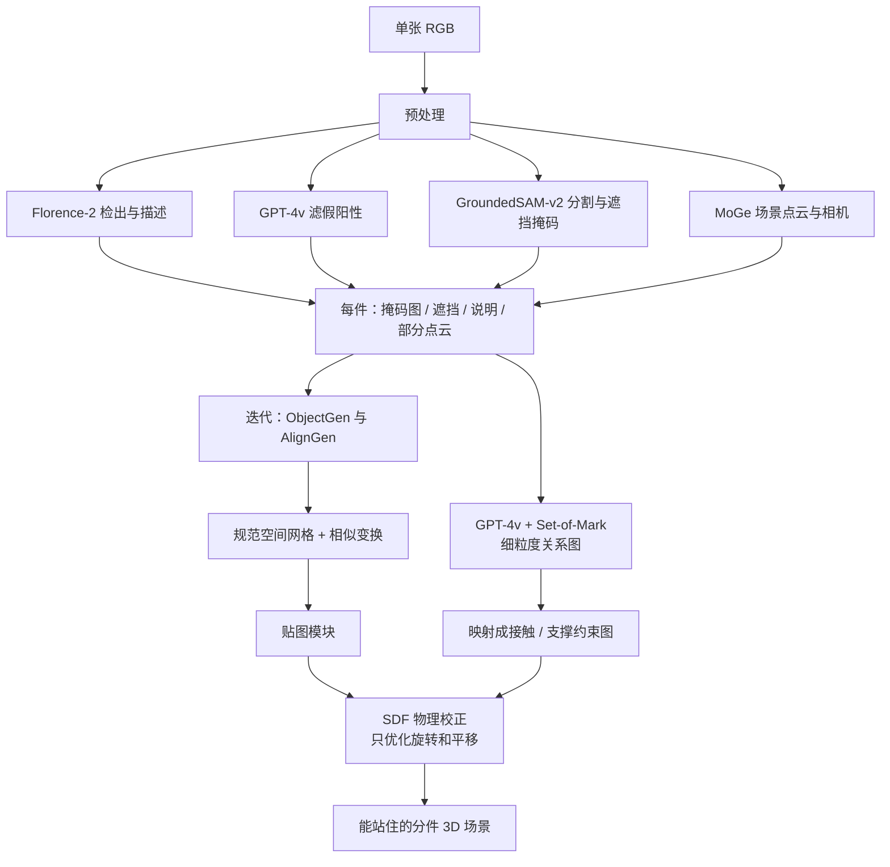

# CAST：单张 RGB 先拆成物件，再对齐成能站住的场景

<!-- release-date: 2025-02-18 -->

> 本文依据上海科技大学与影眸科技（Deemos Technology）主导的 **CAST: Component-Aligned 3D Scene Reconstruction from an RGB Image**，即 arXiv:2502.12894v2（2025-05-13 修订，19 页），SIGGRAPH 2025 / ACM TOG 期刊轨道。动笔前核过 arXiv 官方提交历史：v1（2025-02-18 14:29:52 UTC）、v2（2025-05-13 07:47:06 UTC）。本地件封面水印为 `arXiv:2502.12894v2 [cs.CV] 13 May 2025`，19 页，与官方最新版一致，**未做替换**。ACM SIGGRAPH 官方博客把 CAST 列在 2025 年 Technical Papers 的 **Best Papers** 栏，而不是 Honorable Mentions（[2025-06-10 奖项页](https://blog.siggraph.org/2025/06/siggraph-2025-technical-papers-awards-best-papers-honorable-mentions-and-test-of-time.html/)）。
>
> 全文页码指 PDF 自身页码。标题页是第 1 页；从第 2 页起页眉印着 `2 •` 或 `• 3` 这样的印刷页码，与 PDF 页码一致，引用时可以直接对照。本地件仍是 arXiv 预印版，页脚 DOI 还是占位符 `10.1145/nnnnnnn.nnnnnnn`；正式 TOG 条目是 DOI [10.1145/3730841](https://doi.org/10.1145/3730841)，本文数字一律回这份 19 页 PDF，不混用 ACM 排版页码。
>
> `release-date` 取 **2025-02-18**。CAST 是方法论文，没有向公众开放的模型、API 或官方权重。按「技术首次官方公开日」：arXiv v1 是目前能核到的最早官方公开事件。项目页 [https://sites.google.com/view/cast4](https://sites.google.com/view/cast4) 已写在 v1 的 Comments 里，但 Google Sites 不提供首次公开日，无法证明早于 arXiv。截至撰写，未找到官方代码仓；Deemos 在 2025-05-04 的公开帖仍写「Soon available」，晚于论文首发。Hugging Face Papers 页的 `Published on Feb 18, 2025` 只是 arXiv 日期，**不用仓库 `createdAt`**。
>
> 单位：第一作者到项目负责人挂 ShanghaiTech + Deemos，通讯作者挂 ShanghaiTech，另有华中科技大学合作者。目录按高校主导放在 `ShanghaiTech`，Deemos 的合作写在正文，不另建公司目录。
>
> 文中始终区分三件事：**报告写了什么**、**本文如何解释**、**哪些是外部补充**。凡是从图里读出来的、从官方奖项页补进来的、或者对照同方向已发布报告得出的，都会当场说明。
>
> 边界说明：同方向已发布的 TRELLIS、Seed3D 2.0 是**单物体生成**；HunyuanWorld 1.0 是**整世界用全景图当代理**。CAST 要解决的是「一张图里的多件东西如何各自长全、再摆齐、还能站住」。可以对照这条粒度差异，**不要把那三篇的人评或秒数读成本报告的实验**。网上有非官方简化复现，它不是本 PDF 的实现，正文不把它当原报告系统来写。

## 单图重建整场景，难的不是「把每个东西生出来」

先把矛盾摊开，再上名词。

一张客厅照片、一张海滩边停着面包车的快照，看起来信息很多。真要变成一个能绕着走、能单独挪椅子、能推进仿真器的 3D 场景，照片里缺的东西比有的还多。报告开篇把这件事说得很具体：物件不是孤立摆着的，它们靠物理约束、功能角色和人的意图绑在一起——椅子靠着桌子，杯子搁在托盘上（PDF p. 2）。单物件生成这几年进步很快，但把它们依次拼成场景，会撞上两道硬缺口（PDF p. 2）：

**姿态对不齐。** 现成的单物件生成器常常默认物体是「摆正的」：面朝相机、底坐在地面、尺度归一化到一个立方盒子里。真实照片里几乎不是这样。吉他斜靠着，冲浪板架在车顶，物件还可能被挡住一半。多数方法优先把几何做细，姿态怎么回到场景里，报告认为仍被低估（PDF p. 2）。

**物件之间没有关系。** 就算每个东西的朝向大致对了，场景仍可能物理上不成立：物件互相穿过去、悬在半空、该挨着的地方没有接触。这些错误不是渲染不好看，是空间和物理约束根本没被写进流程（PDF p. 2）。下游要编辑、做动画、做仿真，这种场景用不成。

旧方案大致三条路，报告在相关工作里各打了一枪（PDF p. 3–4）：

- **直接回归整场景几何**，依赖 Matterport3D、3D-FRONT 这类室内标注。数据小、领域窄，前馈网络出的几何又粗（PDF p. 3）。
- **检索替换**：从 CAD 库里找一个「长得像」的模型塞回去。库外的东西要么找错，要么找不到（PDF p. 3）。
- **整场景一次生成**，或用视频扩散、或用 3D 高斯。画面可以好看，但缺可编辑网格、缺 UV、缺能拆开的物件，接不进传统制作管线（PDF p. 4）。Gen3DSR 这类「先拆再生成」的工作更接近 CAST 的方向，但报告批评它过不了遮挡、姿态和单物件几何，新视角还会穿模、漂浮（PDF p. 4、p. 12）。

所以 CAST 要做的不是「再训一个更大的场景生成器」。它把问题改写成三步：**先按物件切开，再把每件被挡住的部分补全成完整网格，最后用相似变换把它们摆回照片里，并用物理约束把穿模和悬空按回去。**

同方向已经发布的三篇，正好把这条改写衬出来。TRELLIS 和 Seed3D 2.0 解决的是一件东西用什么表示、几何和材质怎么同时过关；HunyuanWorld 1.0 解决的是整片世界没有 3D 数据时，用全景图当代理再分层抬起来。CAST 站在两者中间：输出是一件件可编辑网格，但成败取决于它们在场景里能不能对齐、能不能站住。本文的对照只到问题粒度，数字一律以本 PDF 为准。

## 读之前只需要这几个词

下面这些词正文都会用到。这一节是读前背景，不全是报告自己定义的。

**网格（mesh）**：一堆顶点连成三角面。游戏引擎、建模软件、物理引擎原生吃的就是它。CAST 的最终产物是「每件东西一块网格 + 它的相似变换」，不是一整块死场景。

**点云（point cloud）**：只有坐标、没有面的一堆点。单目深度模型把每个像素「推」到 3D 里，得到的就是点云。照片里看得见的表面才有点，被挡住的背面、底面是空的，所以叫**部分点云（partial point cloud）**。

**单目深度 / 相对深度**：只看一张 RGB 就猜「这个像素有多远」。这类模型给出的常常是相对量：整体乘一个系数、加一个常数，看起来仍然合理。报告摘要写的是 relative depth（PDF p. 1）；实现里用 MoGe 直接出与像素对齐的点云和相机参数（PDF p. 5）。

**规范空间（canonical space）**：单物件生成器习惯工作的那个「摆正的盒子」，报告写到 $[-1,1]^3$（PDF p. 7）。物件在照片里的位置、朝向、大小叫**场景空间（scene space）**。CAST 的核心麻烦，就是这两套坐标系对不上。

**相似变换（similarity transformation）**：旋转、平移、均匀缩放。把规范空间里的网格搬回场景，报告用这三种操作，不包含非均匀拉伸（PDF p. 2）。

**有向距离场（Signed Distance Function，SDF）**：给空间一点，返回它到物体表面的距离；外面为正、里面为负、正好在表面上为 0。CAST 里 SDF 出现两次，不要混：ObjectGen 的 VAE 把形状解码成 SDF，再用移动立方体抽网格（PDF p. 6）；物理校正时，Open3D 在已经抽好的网格上查询 SDF，用来量「穿了多深、离开了多远」（PDF p. 11）。

**3DShape2VecSet**：一种把表面点云编成一组无序潜向量、再解回 SDF 的形状表示（PDF p. 6，引用 Zhang et al. 2023）。CAST 的物件生成器建立在它和 CLAY 这一路上（PDF p. 6、p. 11）。

**潜空间扩散（Latent Diffusion Model，LDM）**：不在网格上直接加噪，而在压缩后的潜向量上做扩散，再解码回去。ObjectGen 和 AlignGen 都是这一类（PDF p. 6–7）。

**DINOv2 与掩码自编码器（Masked Autoencoder，MAE）**：DINOv2 是大规模自监督视觉编码器。ViT 把图像切成图块，训练时可以丢掉一部分、让网络靠可见区域把丢掉的补回来，这就是 MAE 那一类做法。CAST 推理时把遮挡区域当成要补的掩码送给编码器，让被挡住的几何仍能挤出可用特征（PDF p. 6，式 3）。

**ICP 与 Umeyama**：ICP（Iterative Closest Point，迭代最近点）是点云配准的老方法，靠最近邻迭代估变换，遇到尺度未知、对称、离群点容易陷进局部最优。Umeyama 算法在两组点已经一一对应好的时候，用最小二乘一次求出相似变换，数值上更稳（PDF p. 7）。CAST 选择生成对应点云，再走 Umeyama，而不是直接回归 6 个姿态数字。

**视觉语言模型（Vision-Language Model，VLM）与 Set-of-Mark**：能看图并回答的模型。报告用的是 GPT-4v（PDF p. 2、p. 9）。Set-of-Mark 是在图上给每个物件标编号，再问模型它们是什么关系，否则「左边那把椅子」这种指代会乱（PDF p. 9，引用 Yang et al. 2023）。

**开放词汇（open-vocabulary）**：不限定「椅子、桌子、床」这张闭集类别表。CAST 靠 Florence-2、GroundedSAM 这类 2D 基础模型认照片里出现的任意物件（PDF p. 2、p. 5）。

## 一句话先说清

CAST 的主张只有一句：**单张 RGB 先被拆成一件件带掩码和部分点云的物件；每件在规范空间里生成完整网格，再用生成式对齐把它搬回场景；最后用一张物件关系图约束 SDF 优化，把穿模和悬空按成当前时刻站得住的接触。**

它不是「一个网络喷出整间房子」，而是一条分件流水线（PDF p. 4，Figure 2）：

- 2D 基础模型给出分割、遮挡掩码和场景点云；
- ObjectGen 用 MAE + 规范空间部分点云，补出被挡住的几何；
- AlignGen 生成「搬到规范空间之后的部分点云」，再用 Umeyama 求出相似变换；
- 两件事迭代：没有对齐，点云条件用不上；没有完整几何，对齐也没有目标；
- GPT-4v 读图得到细粒度关系，映射成接触 / 支撑，用 SDF 代价优化旋转和平移。

规模上，ObjectGen 的 VAE 与 LDM 合计约 15 亿参数，AlignGen 约 1.5 亿；物件生成在 A6000 上约 7 秒、贴图约 10 秒、对齐约 1 秒（PDF p. 11）。这些是单物件数字，**全文没有端到端场景耗时**。

## 报告地图：19 页里各写了什么

先摊开篇幅。这份报告方法密、公式集中在生成和对齐、评测表只有三张。

| 报告章节 | PDF 页 | 讲了什么 | 密度 |
|---|---|---|---|
| 标题、摘要、Figure 1 | p. 1 | 流水线一句话；多样场景拼图 | 高 |
| §1 引言 | p. 2 | 姿态缺口与关系缺口；两项核心组件 | 高 |
| 引言收束 + §2.1 | p. 3 | 3D-FRONT 预告；单图重建三条旧路 | 中 |
| Figure 2 + §2.2–2.3 起 | p. 4 | 总览图；生成式重建与物理建模综述 | 高 |
| §2.3 收 + §3 + §4 起 | p. 5 | 预处理：Florence-2 / GPT-4v / GroundedSAM-v2 / MoGe | 高 |
| Figure 3 + 式 1–3 + §4.1 | p. 6 | AlignGen / ObjectGen / 贴图三块网络图；MAE 条件 | 高 |
| 点云条件 + 式 4–6 + §4.2–4.3 起 | p. 7 | 真值/估计点云插值；AlignGen；迭代第一步 | 高 |
| 式 7 + 贴图 + §5–5.1 | p. 8 | 迭代对齐；为何不上现成刚体仿真 | 高 |
| Figure 4 + 式 8–11 + §5.2–5.3 起 | p. 9 | 关系图映射；接触 / 支撑 / 平面正则 | 高 |
| Figure 5 + 六类关系映射 | p. 10 | 开放词汇定性大图；细粒度关系到约束图 | 中 |
| Table 1–2 + §6.1–6.2 起 | p. 11 | CLIP / 人评 / 3D-FRONT；训练与推理数字 | 高 |
| Figure 6 | p. 12 | 与 ACDC、Gen3DSR 的定性对照 | 中 |
| Figure 7–9 + 评测协议 + §6.3 起 | p. 13 | MAE / 点云 / 姿态消融的定性图 | 高 |
| Figure 10 + Table 3 + 应用起 | p. 14 | 关系图消融；定量消融表 | 高 |
| Figure 11–12 + §7 | p. 15 | 动画 / Real2Sim / 游戏；限制与未来工作 | 高 |
| 致谢 + 参考文献起 | p. 16 | 基金与平台 | 低 |
| 参考文献续 | p. 17–18 | 引用条目 | — |
| 附录 A | p. 19 | GPT-4v 的系统提示全文 | 中 |

读正文前先知道这几件事，后面才不会把「报告写了」和「我们以为它写了」混在一起：

- **没有官方代码、没有权重、没有端到端场景耗时。** 有秒的数字全是单物件（PDF p. 11）。
- **人评没有写人数、题量和评分细则。** Table 1 只有百分比（PDF p. 11）。
- **物理校正没有定量消融。** Table 3 只加 MAE、点云条件和迭代，关系图只在 Figure 10 做定性对照（PDF p. 14）。
- **迭代次数、$\beta$ 日程、GPT 集成的采样次数、表面采样点数、$\sigma$ 阈值，一个都没给。**
- **贴图模块几乎是黑盒。** 只说沿 CLAY / 3DShape2VecSet 的 UV + 生成式上色，处理遮挡增强（PDF p. 8）。
- **p. 7 把 Metric3D 写成 Yang et al. 2024b，p. 11 又写成 Yin et al. 2023。** 参考文献里 Yang 2024b 是 Depth Anything，Metric3D 对应 Yin et al. 2023。**这是本文对引用的核对，不是报告自己更正。** 下文按实现节的 Yin et al. 2023 来写。

因此这篇解读的重心不放在复现配方，而放在**分件之后的三道锁：遮挡补全、生成式对齐、物理接触。**

阅读路线：先看矛盾和全景，再按流水线走四个核心设计（遮挡生成 → 生成式对齐 → 迭代 → 物理校正），然后是训练数字、评测拆解和缺口。**如果只有十五分钟，读「先讲矛盾」「核心一」「核心二」「核心四」和「实验」五节就够了。**

## 全景：拆物件 → 生成完整几何 → 对齐 → 按常识摆稳

按 Figure 2（PDF p. 4）和 §3、§4、§5 重画。这张图只表示模块怎么连，不含耗时或精度。

报告把这条流水线收成两个核心组件（PDF p. 2）：

1. **感知式 3D 实例生成**：遮挡感知的物件生成 + 姿态对齐生成。
2. **物理感知校正**：关系图约束下的位姿优化。

预处理是给这两件事供料的，本身几乎全是现成 2D 基础模型。值得单独说的只有一句：CAST 没有在 3D 场景数据上训练一个「认出整间房子」的网络。物件是什么、边界在哪、深度大概多少，全部发生在 2D（PDF p. 5）。3D 真正上场的，是单物件生成器和对齐器。

## 预处理：照片先变成「一件件残缺的证据」

### 旧问题：整图一口吃下去，遮挡和关系都会糊掉

报告把「整场景直接生成一张大网格」叫 brute-force（PDF p. 5）。一张图里物件互相挡住，看不见的部分没有像素；深度模型也只看得到迎着相机的那一层皮。把整张图送进一个场景生成器，等于要求它同时猜几何、猜背面、猜谁撑着谁。这三件事的监督信号完全不同，绑在一起就会哪件都做不细。

### 新设计：开放词汇地切开，并显式留下遮挡

预处理按报告原文是四步（PDF p. 5）：

1. **Florence-2** 认物件、写描述、出框。
2. **GPT-4v** 滤掉假检测，只留下真正构成场景的物件。这是开放词汇能成立的关键一步：检测器会把倒影、图案、碎片也框出来，不滤的话后面每件都要生成一次。
3. **GroundedSAM-v2** 给每件物件 $o_i$ 一块精细掩码 $M_i$，并得到对应的遮挡掩码。遮挡掩码会进 ObjectGen，不是可有可无的可视化。
4. **MoGe** 出场景坐标系下、与像素对齐的点云 $\{q_i\}$ 和全局相机。点云再按掩码切到每件物件上。

引言里还点名 GroundingDINO 和 SAM（PDF p. 2）。实现段落写的是 GroundedSAM-v2。**本文按 §3 的实现名单来写**，不把引言里的列举当成另一套流水线。

### 工作机制

切完之后，每件物件手上有四样东西：一块可能残缺的 RGB、一块遮挡掩码、一句描述、一撮只覆盖可见表面的点云。点云还在场景空间里——吉他在照片左边、离相机两米——而 ObjectGen 要的是规范空间里的部分点云。这个错位就是下一节迭代的全部理由。

### 收益、代价、边界

收益是开放词汇：室内外、真实照片、AI 生成图，报告都拿来演示（PDF p. 2、p. 10）。它不依赖 3D-FRONT 那种闭集家具表，也不去 CAD 库里检索替身。

代价全在 2D 基础模型的失误上。报告后来说，刚体仿真不能直接跑，第一条理由就是「2D 基础模型会漏物件，场景是残的」（PDF p. 8）。滤检测靠 GPT-4v，关系抽取也靠 GPT-4v，同一类模型既当守门员又当物理裁判。漏检、切错、把两个物件粘在一块，后面的 3D 生成没有回头路。

### 可迁移启发

要处理「一张图里有许多互相挡住的东西」，先问哪一步能在 2D 里做完。认、切、估相对深度，今天的 2D 基础模型已经比任何中等规模 3D 场景数据集都宽。3D 模型的预算省下来，只花在 2D 做不了的事上：补背面、估姿态、写接触。

## 核心一：遮挡感知的单物件生成——看见一半，也要长出一整件

### 旧问题：生成器看见的是残图，就会生成残几何

把切下来的物件图直接丢给现成的图生 3D 模型，报告认为会严重掉质量（PDF p. 6）。原因很具体：

- 照片里的物件经常被挡住。被挡住的像素不是「空白待补」，是另一件东西的表面。
- 图像条件走 DINOv2 这类高层特征，没有像素级监督，生成的几何可以对着看像，却对不齐照片里的轮廓和尺度（PDF p. 6）。
- 训练数据里的点云如果是完整、干净、摆正的，真实估计深度一来，模型就不会用。

Gen3DSR 的对策是先 2D 修补再生成。CAST 明确反对这一步：2D 修补本身会错，错会写进 3D（PDF p. 12）。

### 新设计：同一套扩散，吃两种条件——掩码图像，以及规范空间的部分点云

ObjectGen 建立在 3DShape2VecSet / CLAY 的几何 VAE + 潜空间扩散上（PDF p. 6、p. 11）。VAE 把表面点云编成无序潜向量 $Z$，解码器在查询点 $p$ 上吐 SDF，再 Marching Cubes 抽网格（PDF p. 6，式 1）：

$$
Z = \mathrm{E}(X),\qquad \mathrm{D}(Z,p)=\mathrm{SDF}(p)
$$

$X$ 是从物体表面采的点云。图像这边用 DINOv2 出条件 $c$，扩散在潜空间里做（PDF p. 6，式 2）：

$$
\epsilon_{\mathrm{obj}}(Z_t;t,c)\rightarrow Z
$$

$Z_t$ 是时刻 $t$ 的带噪潜向量。基座按前人流程在 Objaverse 上预训练，训完可以只靠图像特征出细致几何（PDF p. 6）。

然后加两刀，专门对付真实照片。

**第一刀：推理时把遮挡当成 MAE 的掩码。** 输入图像 $I$ 配上遮挡掩码 $M$，被挡住的 token 换成 `[mask]`，让编码器靠可见区域推断缺失特征（PDF p. 6，式 3）：

$$
c_m = E_{\mathrm{DINOv2}}(I \odot M)
$$

报告的解释是：DINOv2 预训练见过随机掩码，所以推理时物件被挡住，编码器仍能补出生成器要的特征。**本文补一句边界**：这是在用一个为 2D 补全训练的编码器，去猜 3D 里被挡住的部分；它给出的是特征，不是已经长好的背面网格。背面仍然要靠 3D 扩散先验来「编」。

**第二刀：再条件上规范空间的部分点云。** 高层图像特征对不齐像素，就把看得见的 3D 点当作几何锚。训练时他们渲染每个 3D 资产的多视图，用 MoGe 和 Metric3D 估深度，再反投成点云；估计深度用中位数和中位绝对偏差对齐到真值深度，最后归一化进 $[-1,1]^3$（PDF p. 7）。

为了让模型既见过干净深度、也见过估出来的脏深度，训练时在真值部分点云 $p_{\mathrm{gt}}$ 和估计部分点云 $p_{\mathrm{est}}$ 之间插值（PDF p. 7）：

$$
p_{\mathrm{disturb}} = \alpha\, p_{\mathrm{gt}} + (1-\alpha)\, p_{\mathrm{est}},\qquad \alpha \in [0,1]
$$

$\alpha$ 训练时均匀采样。带点云的 ObjectGen 写成（PDF p. 7，式 4）：

$$
\epsilon(Z_t;t,c,p_{\mathrm{disturb}})\rightarrow Z
$$

条件注入方式与 CLAY 类似：规范空间部分点云编成 512 维位置编码，用交叉注意力打进 LDM（PDF p. 11）。另外还在深度图上随机盖圆形、矩形，模拟遮挡和缺失（PDF p. 7）。

有一个看起来不起眼、其实很关键的选择：增强时不对点云做随机旋转、平移、缩放。点云始终和训练几何对齐（PDF p. 7）。报告的理由是：对齐着的部分点云迫使生成器贴住输入点云的固有结构，而不是学一个「随便摆都能对上」的模糊形状。

### 工作机制

可以把它想成两句话同时说给生成器听。图像说「这是一把被挡住一半的吉他，漆是原木色」；点云说「你看得见的那条轮廓，长度和弯曲必须在这里」。MAE 负责在特征空间里把挡住的那一半补上，点云负责把尺度和局部形状钉死。没有点云，模型容易把六本书生成成四本、把宽书生成成窄书——Figure 8 就是这个失败（PDF p. 13）。没有 MAE，被挡住的飞船和杯子会缺块、断裂——Figure 7（PDF p. 13）。

### 收益、代价、边界

定性上，MAE 让被挡住区域完整（PDF p. 13，Figure 7）；点云条件保住数量、尺度和局部细节（PDF p. 13，Figure 8）。定量上，Table 3 在 3D-FRONT 上把这两刀拆开（PDF p. 14）：

| 加了什么 | CD-S↓ | FS-S↑ | CD-O↓ | FS-O↑ | IoU-B↑ |
|---|---:|---:|---:|---:|---:|
| Vanilla | 0.079 | 53.38 | 0.069 | 52.83 | 0.515 |
| + MAE | 0.064 | 53.79 | 0.066 | 54.32 | 0.548 |
| + 点云条件 | 0.056 | 53.91 | 0.060 | 54.60 | 0.582 |
| + 迭代 | 0.052 | 56.18 | 0.057 | 56.50 | 0.603 |

Chamfer Distance 越小越好，F-Score 和 IoU 越大越好。`-S` 是场景级，`-O` 是物件级，`IoU-B` 是场景重叠。MAE 对场景级 CD 的帮助最大（0.079 → 0.064）；点云条件对 IoU 的帮助最大（0.548 → 0.582）；迭代再把 F-Score 从约 54 拉到 56（PDF p. 14）。

代价和边界：

- 点云必须已经在规范空间里，才是合法条件。第一步你没有这坨点云，所以必须迭代，见核心三。
- 点云对齐着训练，意味着 ObjectGen 不会自己处理任意姿态。姿态被彻底推给 AlignGen。这是分工，也是单点故障：AlignGen 错了，点云条件会把错误尺度写进几何。
- 被完全挡住的物件，2D 阶段根本切不出来，ObjectGen 没有机会上场。
- 贴图是几何定了之后另走一套生成网络，报告只说它对增强和遮挡鲁棒（PDF p. 8），没有贴图指标。

### 可迁移启发

缺测的输入不要先在 2D 里「编完」再交给 3D。2D 修补把错误变成了看起来合理的像素，3D 模型很难再反抗。CAST 的做法是：**把缺失标成掩码，让 3D 先验去补几何；把看得见的 3D 点留下来，当尺度的硬锚。** 更一般地说，残缺观测应该以「带掩码的条件」进入生成器，而不是先被另一个生成器填满。

## 核心二：生成式对齐——不要回归六个数字，去生成对应点云

### 旧问题：网格生在摆正的盒子里，照片里的物件是歪的

ObjectGen 的输出在归一化体积里，姿态是规范的（PDF p. 7）。图像条件又是 DINOv2 这种高层特征，本来就是为了泛化，不是为了像素对齐。于是每件东西都还差一次相似变换，才能嵌进场景点云。

直接回归姿态是旧路（报告点名 SSD-6D、CosyPose，PDF p. 2）。ICP 是另一条旧路：从生成网格上采点，和深度点云做最近邻迭代。报告说 ICP 不考虑语义，经常对不齐（PDF p. 7），Figure 9 把它和可微渲染放在一起对照（PDF p. 13）：ICP 会被离群点、未知尺度、对称和重复几何带进局部最优；可微渲染则会被 RGB 里的遮挡打断。

还有一个更根本的麻烦：对称物件存在多种合理姿态。直接回归只能吐一个点估计，无法表达这种多峰。

### 新设计：AlignGen 生成「搬到规范空间后的部分点云」，再用 Umeyama 读出变换

AlignGen 的条件是场景空间部分点云 $q \in \mathbb{R}^{N \times 3}$，以及 ObjectGen 已经生成的几何潜向量 $Z$（PDF p. 7，式 5）：

$$
\epsilon_{\mathrm{align}}(p_t;t,q,Z)\rightarrow p
$$

$p$ 是 $q$ 被变到规范空间、$[-1,1]^3$ 里、并且已经和生成网格对齐后的版本；$p_t$ 是它的带噪版本。因为 $q$ 和 $p$ 是逐点对应的，相似变换（缩放、旋转、平移）可以用 Umeyama 从这两坨点里恢复（PDF p. 7）。报告强调：这一步比直接预测变换参数数值更稳。

条件怎么喂进去，Figure 3 画得很清楚（PDF p. 6）。$q$ 和扩散样本 $p_t$ 在特征维拼接成 $N \times 6$，让 Transformer 学「场景里这个点和规范空间那个点是同一个点」。$Z$ 走交叉注意力，把完整几何的信息打进点云扩散。网络是 24 层、宽 512，约 1.5 亿参数（PDF p. 11）。

对称和重复几何会导致多个合法的 $p$。扩散模型的应对是：采多种噪声实现，聚合得到的变换，再挑最自信、最一致的那个（PDF p. 7）。**「最自信」怎么打分、采几次，报告没写。**

### 工作机制

AlignGen 不输出「绕 y 轴转 37 度」。它输出另一坨点。这坨点和场景点云点点对应，只是已经坐在规范盒子里、贴着生成网格。有了对应，Umeyama 是闭式的：旋转、平移、均匀缩放一次求出。

这是在把一个难的回归问题，换成一个生成问题。生成模型本来就会处理多峰——同一把椅子转 180 度可能同样合理，扩散可以从不同噪声走到不同模式。回归头做不到这一点。

训练数据怎么造：从预计算深度抬起来的点云里，随机采一撮规范空间部分点云，再施加一次随机变换；这份被变换过的点云，加上 ObjectGen 的 $Z$，就是条件。最远点采样（FPS）固定采 2048 点（PDF p. 11）。

### 收益、代价、边界

Figure 9 是定性对照：ICP 把小狗和纸箱对歪，可微渲染被遮挡带跑，AlignGen 对上输入（PDF p. 13）。报告没有给姿态误差的度数表，所以这条证据的强度是「看图」，不是「差多少度」。

代价：

- AlignGen 依赖 ObjectGen 已经给出的 $Z$。几何潜向量错了，对齐没有正确目标。
- 它假设 $q$ 和 $p$ 能建立点点对应。部分点云很残、深度噪声很大时，对应会被污染；Umeyama 再稳，也稳不过错误的对应。
- 只恢复均匀缩放。物件如果在照片里有透视造成的非均匀形变，或者生成网格本身比例不对，相似变换救不回来。
- 物理校正阶段不再动缩放（PDF p. 8–9 只优化旋转和平移），所以尺度必须在这一步就对。

### 可迁移启发

姿态如果是多峰的，不要让网络直接吐欧拉角。让它生成一个与观测逐点对应的几何量，再把变换交给一个数值稳定的闭式算法。CAST 选的是点云加 Umeyama；同类思路也可以是对应点、对应法线、对应包围盒角点。关键分工是：网络负责多峰和语义，闭式算法负责几何约束。

## 核心三：物件生成和对齐必须互相喂，所以要迭代

### 旧问题：点云条件要规范空间，你手上的点云在场景空间

§4.3 把鸡和蛋写得很直白（PDF p. 7）：物件点云一开始在场景空间，ObjectGen 的点云条件却要求规范空间。只用图像生成，又会因为高层语义条件和 3D 数据集的偏置，得不到像素对齐的几何。

两件事互相锁死：不对齐，点云条件非法；几何不完整，对齐没有目标。

### 新设计：$\beta$ 从 0 走到 1，生成和对齐轮流上场

迭代下标是 $k$。三步循环（PDF p. 7–8）：

**第一步，生成。** 带掩码的物件图进 ObjectGen，条件是 DINOv2 特征 $c$ 和规范空间点云 $p^{(k)}$。一开始令 $p^{(0)}=q$（场景点云），并把点云条件强度 $\beta^{(k)}$ 从 0 逐步加到 1（PDF p. 7，式 6）：

$$
z^{(k)}=\mathrm{ObjectGen}\bigl(c,\, p^{(k)}\otimes \beta^{(k)}\bigr)
$$

$\beta=0$ 时点云不起作用，所以**第一次生成只看掩码图像**。潜向量再经 VAE 解码成网格。

**第二步，对齐。** AlignGen 吃新的 $z^{(k)}$ 和场景点云 $q$，吐出下一轮的规范空间点云（PDF p. 8，式 7）：

$$
p^{(k+1)}=\mathrm{AlignGen}(q,z^{(k)})
$$

**第三步：细化。** 用更新后的 $p^{(k+1)}$ 估新的相似变换，再把这坨点云送回 ObjectGen。循环直到变换变化低于阈值，或达到最大迭代次数（PDF p. 8）。阈值和最大次数都没写。

几何定了之后，再走贴图：UV 展开 + 生成式上色，沿 CLAY / 3DShape2VecSet 的现成管线（PDF p. 8）。

### 工作机制

第一轮等于「先不管尺度，只凭图像长一个大概的吉他」。AlignGen 拿这个大概的形状，去猜场景点云在规范盒子里应该长什么样。第二轮开始，ObjectGen 终于有合法的点云条件了，$\beta$ 逐渐加大，几何被拉向真实尺度和局部轮廓。这是在用对齐器给生成器「翻译」坐标系，再用生成器给对齐器提供越来越完整的目标形状。

Table 3 最后一行 `+ iter.` 把场景级 F-Score 从 53.91 拉到 56.18，IoU 从 0.582 拉到 0.603（PDF p. 14）。迭代不是装饰，是把前两节焊在一起的那道工序。

### 收益、代价、边界

收益：像素对齐和完整几何可以同时要。报告把它写成「视觉一致并且在场景里位置、尺度正确」（PDF p. 7）。

代价是误差会在两模块之间来回传。第一轮图像生成如果把吉他生反了，AlignGen 可能对齐到一个镜像模式；第二轮点云条件会把这个错误尺度写进几何。多峰采样（核心二）就是在给这个风险买保险，但报告没有写失败时如何回退。

另一个边界：迭代优化的是单物件的几何和它相对场景点云的变换，还不管物件之间谁撑着谁。穿模和悬空留给下一节。

### 可迁移启发

两个模块互相需要对方的输出时，不要假装能一次前馈。用一个从 0 到 1 的条件强度，让系统先在弱条件下给出可用的中间量，再把强条件接上。CAST 的 $\beta$ 是一个很浅的课程学习：先图像、后点云。任何「条件 A 依赖坐标系 B，坐标系 B 又依赖条件 A 的结果」的系统，都可以先问：有没有一个可以从零开始的弱条件。

## 核心四：物理校正——不要上刚体仿真，用 SDF 把接触写进优化

### 旧问题：像素对齐了，场景仍可能是物理上的谎言

§4 做完，每件东西都有网格和相似变换。报告承认：精度已经高了，场景有时仍然不成立（PDF p. 8）。Figure 4 用同一张海滩图给了两个例子（PDF p. 9）：冲浪板悬在面包车上方；吉他和冷藏箱穿在一起。

一个很诱人的想法是：把这堆网格丢进现成刚体仿真器，按牛顿定律落到静止。报告列了三条为什么不行（PDF p. 8）：

1. **场景是残的。** 2D 基础模型会漏物件。缺了支撑物，仿真会按「完整物理世界」去推，结果离照片更远。Figure 10 里，只上物理、不上关系图，洋葱会从台面滚下去（PDF p. 14）。
2. **几何不完美。** 刚体引擎通常要凸分解。分解太细，表面不平整，物件会自己滑走；分解太粗，碰撞体和可见网格不一致，看起来像漂着。
3. **初始就在穿模。** 标准求解器碰到已经重叠的刚体，会不稳定，有时根本解不了。

所以他们要的不是一段时间之后的动力学平衡，而是**当前这一帧看起来站得住**（PDF p. 8–9）。报告自己划的边界：物件在优化后的姿态上，未必能在真仿真里一直稳住；它只是后续仿真的一个可靠初值。

### 新设计：把常识关系收成接触和支撑，用 SDF 当代价

优化目标是所有成对约束代价之和（PDF p. 9，式 8）：

$$
\min_{T=\{T_1,\ldots,T_N\}} \sum_{i,j} C(T_i,T_j;o_i,o_j)
$$

$T_i$ 是第 $i$ 件物件的刚体变换，**只有旋转和平移，没有缩放**。代价 $C$ 随关系类型而变。关系由 VLM 识别，见下一小节。

受刚体仿真启发，关系只分成两类（PDF p. 9）。

**接触（Contact）是双边约束。** 两件东西都该动，最终既不穿透、至少还有一个接触点。令 $D_i(p)$ 为物件 $o_i$ 在点 $p$ 的 SDF：$D_i(p)=0$ 在表面，$<0$ 在内部（穿透），$>0$ 在外部（分离）。从 $o_j$ 的表面点看 $o_i$ 的代价是（PDF p. 9，式 9 的一半）：

$$
C(T_i,T_j;o_i \rightarrow o_j)
= -\frac{\sum_{p \in \partial o_j} D_i\bigl(p(T_j)\bigr)\,\mathbf{1}\bigl(D_i<0\bigr)}{\sum_{p \in \partial o_j}\mathbf{1}\bigl(D_i<0\bigr)}
+ \max\Bigl(\min_{p \in \partial o_j} D_i\bigl(p(T_j)\bigr),\, 0\Bigr)
$$

第一项：有穿透时，平均穿透深度（SDF 为负，前面再加一个负号）变成正代价，把它们推开。第二项：完全分离时，最小间隙变成代价，把它们拉到至少碰上一处。反向 $o_j \rightarrow o_i$ 同样算一遍，相加后才是双边接触代价。$\partial o_i$ 表示表面，$\mathbf{1}$ 是指示函数。

**支撑（Support）是单边约束，接触的特例。** $o_i$ 支撑 $o_j$ 时，只动上面那件，$o_i$ 视为静止（PDF p. 9，式 10）：

$$
C(T_i,T_j)=\Bigl|\min_{p \in \partial o_j} D_i\bigl(p(T_j)\bigr)\Bigr|
\quad \text{若 } o_i \text{ 支撑 } o_j
$$

垂直码放时就是这种：书在桌子上，桌子不该为了「平均一下穿透」自己往下沉。

**平面支撑再加一条正则。** 地面、墙这种扁平面，以及面包车只重建出两个轮子这种情况，要用接触区域附近的 SDF 把物件贴上去（PDF p. 9，式 11）：

$$
C(T_i,T_j)=\frac{\sum_{p \in \partial o_j} D_i\bigl(p(T_j)\bigr)\,\mathbf{1}\bigl(0<D_i(p)<\sigma\bigr)}{\sum_{p \in \partial o_j}\mathbf{1}\bigl(0<D_i(p)<\sigma\bigr)}
$$

$\sigma$ 是「够不够近」的阈值，**没有给数值**。

实现上：在静止姿态下从每件表面均匀采固定数量的点，按当前位姿变换，再去查另一件的 SDF。SDF 用 Open3D，损失用 PyTorch 自动微分（PDF p. 11）。**采多少点没写。**

### 关系从哪来：先问细的，再映射成粗的

图像里看得到谁靠着谁。报告用 GPT-4v 加 Set-of-Mark 来抽成对关系（PDF p. 9）。VLM 会抽样不稳定，于是多次询问、随机上色和编号，一个关系要在超过一半的样本里出现才算数（PDF p. 9）。**问几次没写。**

关键设计是：不直接问「接触还是支撑」。先让 GPT-4v 在六种更细的物理关系里选（PDF p. 10、附录 p. 19）：

| 细粒度关系 | 报告给的人话 | 映射方向 |
|---|---|---|
| Stack | 物件 1 在物件 2 上面，2 从下托 1 | 通常是单向支撑 |
| Lean | 1 斜靠着 2，2 从侧面撑 1 | 视是否互指而定 |
| Hang | 1 挂在 2 上，2 从上吊 1 | 单向支撑 |
| Clamped | 2 从多侧夹住 1 | 接触 |
| Contained | 1 在 2 里面 | 接触 / 支撑视朝向 |
| Edge/Point | 只在边或点上碰到，没有明显支撑 | 接触 |

提示词还规定：只有真正碰到的物件才有关系；实在分不清种类，默认 Stack（PDF p. 19）。映射规则很短：两节点之间如果边互相指向，就是接触（双向边）；否则是支撑（有向边）（PDF p. 10–11）。Figure 4 左边是细粒度图，中间是映射后的约束图，右边是校正前后的渲染（PDF p. 9）。

为什么要多绕这一层？报告的理由是：直接做二元分类会含糊，细粒度关系更接近常识语言，GPT-4v 比较不容易乱（PDF p. 11）。这是在给 VLM 一套它已经在文本里见过的动词，而不是给它一个物理引擎里的术语表。

约束图的另一个用处：不用对所有物件对都算代价，只优化图上的边，比完整物理仿真的成对碰撞少得多（PDF p. 11）。

### 工作机制

可以按海滩那张图把整段走一遍（PDF p. 4、p. 9）。GPT-4v 看见冲浪板在车顶附近，标成 Stack：车支撑板。优化时车视为静止，只动冲浪板，把它的表面点贴到车的 SDF 零等值面附近。吉他和冷藏箱被标成互相接触，两边都动，穿透项把它们推开，间隙项让它们至少碰一点。地面是平面支撑，轮子附近的点被式 11 拉到地面。

Figure 10 把「不上物理 / 只上物理 / 加上关系图」并排：没有约束会悬空或穿透；只上物理，物件服从重力，但布局不再是照片里的布局；关系图让布局和物理同时还在（PDF p. 14）。

### 收益、代价、边界

收益写在人评的物理合理性（PP）上：CAST 71.42%，ACDC 22.86%，Gen3DSR 5.72%（PDF p. 11，Table 1）。视觉质量（VQ）的优势更陡：88.07% 对 6.35% 和 5.58%。PP 没有 VQ 那么一边倒，说明物理这一关仍是短板，也说明检索式的 ACDC 用真实 CAD，有时看起来更「摆得稳」，尽管物件根本不是照片里那一件。

代价和边界必须说清楚，因为这一节最容易被读成「已经有物理了」：

- **不是动力学。** 没有摩擦锥、没有速度、没有时间。报告自己写：物件未必能在当前姿态上长时间稳定（PDF p. 8–9）。
- **关系错了，优化会把错误执行得很坚决。** VLM 若把「靠着」看成「堆在上面」，支撑方向会反。集成投票是在降方差，不是在给真值。
- **漏检的物件不会出现在图里。** 式 11 的平面正则是专门给「车只有两个轮子」这种残几何准备的补丁，不是一般解。
- **Table 3 不含物理校正。** 定量消融只有 MAE、点云、迭代（PDF p. 14）。物理这一支的证据是 Figure 4、Figure 10 和人评 PP，没有 Chamfer / IoU 增量。
- 优化不动缩放，也不改网格形状。接触是「挪物件」，不是「把表面捏到贴合」。薄的、软的、布的，网格表示本身就不对，见限制节。

### 可迁移启发

两件事不要合成一件。第一件是「让物理引擎跑到静止」——它需要完整场景、干净碰撞体、没有初始穿透。第二件是「让当前这一帧看起来不违反常识接触」。CAST 证明：当你的观测是一张图、几何还不完美时，应该做第二件。做法也很可搬：**用语言模型读常识关系，用 SDF 把「穿透 / 分离」写成可微代价，只优化图上的边。** 不要把 VLM 的输出直接当成仿真器的力。

另一条更窄的启发：问 VLM 物理问题时，把引擎术语翻译成它在文本里见过的动词（堆、靠、挂、夹、装、点接触），再在你自己的代码里映射回约束类型。分类空间是你的，语言空间是模型的。

## 训练与推理：数字都在 §6.1

报告没有单独的「数据」章。能核到的配方如下，全部来自 PDF p. 11。

**ObjectGen**

- 骨架：VAE + LDM，都是 24 层 Transformer，合计约 15 亿参数。
- 预训练数据：Objaverse 过滤后约 50 万个 3D 资产。
- 点云条件：每个资产渲 32 个视图，预先用 MoGe 和 Metric3D 算深度；训练时抬成点云并随机遮挡；FPS 采 2048 点；512 维位置编码，交叉注意力注入。条件模块在 20 万精选数据上训。
- 优化：AdamW，学习率 $1\times 10^{-5}$；64 张 Nvidia A800，约 3000 epoch，大约一周。
- 推理（单物件、A6000）：生成约 7 秒，贴图约 10 秒。

**AlignGen**

- 24 层 Transformer，宽 512，约 1.5 亿参数。
- 同一份 20 万精选数据，1500 epoch，64 张 A800，大约两天。
- AdamW，学习率同样 $1\times 10^{-5}$。
- 推理：单物件姿态约 1 秒。

这些数字能说明两件事。第一，CAST 的 3D 学习几乎全在单物件资产上发生，场景级的东西（分割、关系、物理）是推理期拼的。这和 HunyuanWorld「主流程不在 3D 场景数据上训练」是同一类策略，只是 CAST 把 3D 预算花在物件生成器上，而不是花在全景图上。第二，墙钟时间按物件数线性涨。按报告的单物件秒数，十几件东西的生成加贴图就会到分钟量级，还没算迭代轮数和 GPT 调用——这是把 p. 11 的数字乘起来的估算，不是报告给的场景级耗时。不要把 7 秒、10 秒、1 秒直接加成端到端。

没写的同样重要：batch size、潜向量维数、扩散步数、CFG 系数、$\beta$ 日程、迭代停判、20 万精选是怎么从 50 万里挑出来的。贴图网络的参数量和训练，完全没有。

## 实验证明了什么，又没证明什么

评测分两摊。开放词汇场景几乎没有网格真值，所以走 CLIP、GPT-4 排序和人评（PDF p. 13）。有真值的室内场景走 3D-FRONT 的几何指标（PDF p. 13）。对照方法是检索式的 ACDC、生成式的 Gen3DSR，3D-FRONT 上再加 InstPIFu（PDF p. 11）。

### 开放词汇：像不像、排第几、人站哪边

Table 1（PDF p. 11）：

| 方法 | CLIP↑ | GPT-4↓ | 视觉质量 VQ↑ | 物理合理性 PP↑ |
|---|---:|---:|---:|---:|
| ACDC | 69.77 | 2.7 | 5.58% | 22.86% |
| Gen3DSR | 79.84 | 2.175 | 6.35% | 5.72% |
| CAST | 85.77 | 1.125 | 88.07% | 71.42% |

CLIP 是渲染结果和输入图的相似度，算之前两边都去了背景，减少环境干扰（PDF p. 13）。GPT-4 按物件排布、物理关系、场景真实感排序，数字越小越好，所以 1.125 表示几乎总被排第一。人评分两场：一场对着输入图选谁更像、更好看（VQ）；一场不给原图，只看渲染，选谁更符合常识物理（PP）（PDF p. 13）。

这张表能撑住的结论是：在报告所选的对照和协议下，CAST 的画面更贴输入，人也更常选它。撑不住的是：

- **人评人数、每场比了多少对、是否盲测到方法名，全部没写。** 88.07% 这个数没有分母。
- CLIP 去背景之后，测的是物件外观像不像，不太测布局。布局更多靠 GPT-4 排序和 PP。
- ACDC 被限定在室内、靠检索，拿它比开放词汇，是在用它的短板当对照。报告自己也说 ACDC 常找出「类似的物件」而不是「那一件」（PDF p. 12）。
- Figure 6 的定性图很能说明新视角：Gen3DSR 在输入视角还过得去，一转就穿、就飘；CAST 坚持分件网格加物理，换视角仍然是几块东西（PDF p. 12）。这是对「只在输入视角成立」的直接回应，但是看图，不是表。

### 3D-FRONT：几何真值只在室内家具上

开放词汇没有网格真值，所以另在 3D-FRONT 上算 Chamfer、F-Score 和 IoU（PDF p. 13）。为了公平，其他方法的分割被换成真值掩码，差异只来自重建本身，不来自切得准不准（PDF p. 13）。CAST 自己那一路是否也用真值掩码，句子写的是 other methods。本文按字面读：对照方法换了真值掩码；CAST 是否同样换，报告没写死。如果只有对照用真值、CAST 用自己的分割，表格对 CAST 更苛刻；反过来则更宽松。这一点需要主维护者对着实验脚本才能钉死，正文不当成已经澄清。

Table 2（PDF p. 11）：

| 方法 | CD-S↓ | FS-S↑ | CD-O↓ | FS-O↑ | IoU-B↑ |
|---|---:|---:|---:|---:|---:|
| ACDC | 0.104 | 39.46 | 0.072 | 41.99 | 0.541 |
| InstPIFu | 0.092 | 39.12 | 0.103 | 38.29 | 0.436 |
| Gen3DSR | 0.083 | 38.95 | 0.071 | 39.13 | 0.459 |
| CAST | 0.052 | 56.18 | 0.057 | 56.50 | 0.603 |

场景级 F-Score 从最好的对照 39.46 跳到 56.18，物件级从 41.99 跳到 56.50。这是全文最硬的几何证据。它证明的是：在室内、有真值网格、分割被对齐过的设定下，CAST 的物件形状和摆放同时好于所列基线。

它没有证明的：

- 开放词汇场景的几何精度——那一摊没有真值，Table 1 不能替代 Table 2。
- 物理校正的独立贡献——Table 3 没它。
- 复杂拥挤场景——限制节承认布局复杂、物件密集时会掉一点（PDF p. 15），但没有按物件数分组的表。

Table 3 的消融已经在核心一给出。值得再读一次的是 Vanilla 行：即使不加速挡 MAE、不加点数条件、不迭代，场景级 CD 0.079 已经略好于 Gen3DSR 的 0.083。CAST 的底盘来自物件级原生 3D 生成；后面三刀是把底盘推进场景级指标。

## 应用节是演示，不是新机制

Figure 11 把输出接进三件事（PDF p. 15）：保龄球的物理动画、桌面上的机器人 Real2Sim、Unreal Engine 里的游戏场景。Figure 5 则是开放词汇的静帧大图：客厅、棋子、积木、机械臂、街景、静物（PDF p. 10）。报告把用途写到虚拟内容制作和机器人仿真（PDF p. 2）。

这些图说明输出格式接得进引擎：分件网格、有姿态、有贴图。它们不说明仿真里接触力对不对、机器人抓取成功率多少、游戏场景要多少人工修。限制节自己也说，光照和背景不在 CAST 里，演示时用现成的全景 HDR 工具 [Hyper3D Omnicraft](https://hyper3d.ai/omnicraft/hdri) 加 Blender 预设灯，还是手工摆的（PDF p. 15）。那是外部工具，不是本方法估出来的光照。

## 限制、没写的，以及还不该当成已经解决的事

§7 的限制写得比很多报告诚实（PDF p. 15）。按报告原文，再标出它没写但读者会以为它写了的东西。

**报告写了的限制**

- 场景质量高度依赖底层物件生成器。细节和精度仍然不够，会导致对齐和空间关系出错（PDF p. 15）。
- 网格表示对付不了纺织、织物、透明玻璃，看起来不自然。Figure 12 左是餐桌上的透明杯和花，右是窗帘和沙发蒙皮（PDF p. 15）。
- 没有光照估计，没有背景建模。缺了真实光照，物件和环境之间没有自然的阴影和照明。
- 更复杂、更密的场景会有轻度下降。
- 物理校正不是完整动力学。

**报告没写、因此不能当成已经公开的**

- 官方代码、权重、推理配置、迭代超参、GPT 集成次数、$\sigma$、表面采样数、$\beta$ 日程。
- 端到端场景耗时、显存、一次重建切出多少物件。
- 人评的人数与协议细节。
- 物理校正的定量消融。
- 贴图网络的结构、损失、分辨率。
- 背景网格从哪来。演示图里有地面和墙，方法节只生成物件。
- 相机之外、照片没拍到的房间：CAST 不做这一层。

**还不该当成已经解决的事**

- 「能进仿真」目前是格式正确和当前帧接触合理，不是抓取成功或轨迹可复现。
- 「开放词汇」目前是 2D 基础模型认得出的那些东西。全挡、透明、强反光，仍然会在预处理就丢。
- 「物理一致」是 SDF 接触，不是材料、质量、摩擦。
- 不要把后续产品计划（外部报道里 Rodin 将接入之类）读回这篇论文。那是论文之后的事，本文不展开。

## 可迁移启发汇总

| 启发 | 出处 |
|---|---|
| 整场景不要一口生成；2D 能做的切开、过滤、估相对深度，3D 只补背面和姿态 | 预处理（PDF p. 5） |
| 残缺观测以掩码条件进生成器，不要先 2D 修补再 3D 生成 | MAE 条件（PDF p. 6、p. 12） |
| 高层图像特征钉不住尺度时，留下看得见的 3D 点当锚 | 点云条件（PDF p. 6–7、Figure 8） |
| 增强时保持点云与几何对齐，才能逼生成器贴真形状，而不是学「随便摆」 | 对齐增强（PDF p. 7） |
| 多峰姿态不要直接回归；生成对应点云，闭式算法读变换 | AlignGen + Umeyama（PDF p. 7） |
| 两个模块互相需要对方输出时，用从 0 到 1 的条件强度做迭代课程 | $\beta$ 迭代（PDF p. 7–8） |
| 观测残缺、几何不完美时，做「当前帧站得住」，不要上完整刚体仿真 | §5.1（PDF p. 8） |
| 问 VLM 物理问题，用它熟悉的动词，再在代码里映射回约束类型 | 六类关系（PDF p. 10、p. 19） |
| 接触写成 SDF 的穿透项 + 间隙项，支撑写成单边；只优化图上的边 | 式 8–11（PDF p. 9） |
| 物理优化不要动缩放，尺度必须在对齐阶段就锁死 | §5 相对 §4.2 |
| 开放词汇评测和有真值评测分开；后者才能谈 Chamfer | Table 1 vs Table 2（PDF p. 11） |
| 对照方法换 GT 掩码，是在测重建而不是测分割——读表时要把这个协议读进去 | PDF p. 13 |

如果只留一条：

> **单图场景重建的难点不是把每件东西生成得更像，而是三件频率不同的事——补上被挡住的几何、把规范姿态搬回照片、让物件在当前帧真正碰到该碰的面。前一件用带掩码的 3D 生成，中间一件用生成式对应而不是回归，后一件用常识关系图约束的 SDF，而不是完整物理引擎。**

## 关键词回看

按它们在流水线里出现的位置串一遍：

- **开放词汇场景重建**：不限室内家具表，2D 基础模型认出什么就生成什么。
- **部分点云 $q_i$**：MoGe 按掩码切出来的、只覆盖可见表面的场景空间点。
- **规范空间 $[-1,1]^3$**：ObjectGen 工作的摆正盒子；AlignGen 的输出也在这里。
- **ObjectGen**：约 15 亿参数的几何 VAE + LDM，条件是 MAE 图像特征和可选点云。
- **MAE 遮挡条件**：把挡住的 token 当 `[mask]`，让编码器补特征，而不是先 2D 修补。
- **$p_{\mathrm{disturb}}$**：真值点云和估计点云的插值，训练时模拟脏深度。
- **AlignGen**：约 1.5 亿参数的点云扩散，生成与 $q$ 对应的规范空间点云 $p$。
- **Umeyama**：从对应点云闭式恢复相似变换。
- **$\beta^{(k)}$**：点云条件强度，迭代中从 0 到 1。
- **细粒度关系图**：Stack / Lean / Hang / Clamped / Contained / Edge-Point。
- **约束图**：映射后的接触（双向）与支撑（有向）。
- **SDF 接触代价**：穿透项把物件推开，间隙项把它们拉到至少一点接触。
- **当前帧物理**：不是动力学平衡，是这一时刻看起来站得住。

## 最后的判断

CAST 被实验撑住的核心，不是「又一个 15 亿参数的 3D 生成器」。ObjectGen 明确建立在 3DShape2VecSet 和 CLAY 上（PDF p. 6、p. 11）。它真正做的是**把单物件生成器嵌进一条分件场景流水线，并补上生成器自己不会做的两件事：坐标系对齐，以及物件之间的接触。**

有数字支撑的结论：

- 3D-FRONT 上，场景级 CD 0.052（对照最好是 Gen3DSR 的 0.083）、F-Score 56.18（对照最好是 ACDC 的 39.46）（PDF p. 11）。这两列的「最好对照」不是同一条基线。
- MAE、点云条件、迭代三刀，每一刀都在同一张消融表上把指标往前推（PDF p. 14）。
- 开放词汇人评上，VQ 88.07%、PP 71.42%，对照都在个位数到二十多（PDF p. 11）。

只被演示、没有被单独量化的：

- 物理校正相对「不对齐、不接触」到底贡献了多少 Chamfer。
- 新视角一致性除了 Figure 6 的看图对比之外，没有多视图误差。
- Real2Sim 和游戏引擎接入除了 Figure 11，没有成功率。

实现上仍是黑盒的：官方代码与权重、迭代停判、GPT 集成、贴图网络、背景从哪来。

和同方向已发布报告放在一起，CAST 的位置其实很清楚。TRELLIS 问的是一件东西用什么潜空间才能解出多种格式；Seed3D 2.0 问的是一件东西怎样同时过锐边、PBR 和可交互结构；HunyuanWorld 问的是没有 3D 场景数据时怎样生成可走进去的世界。CAST 问的是：**照片里已经有这些东西了，怎样把它们一件件长全，并且摆成一个当前站得住的场景。** 它不生成没拍到的房间，也不估灯光。它把「看见的那些物件」变成可编辑网格。这是一条更窄、也更接近图形学传统管线的路。

如果只记一句话：

> **先让 2D 基础模型把照片拆成残缺的证据，再让 3D 生成器补全每一件，用生成式对应把姿态搬回来，最后用常识关系图约束的 SDF 把接触写对——整场景不是更大的物件，是对齐问题。**

## 资料与阅读边界

**原件与版本核验**

- 本地 PDF：`papers/ShanghaiTech/CAST.pdf`，即 [arXiv:2502.12894v2](https://arxiv.org/abs/2502.12894)，2025-05-13 修订，19 页。
- 版本核对：arXiv 官方提交历史只有两版——v1（2025-02-18 14:29:52 UTC，42422 KB）与 v2（2025-05-13 07:47:06 UTC，32850 KB）。本地件 19 页，左侧水印 `arXiv:2502.12894v2 [cs.CV] 13 May 2025`，pdfinfo 页数 19、页面 612×792 pts，与官方最新版一致，**未做替换**。
- 会议与期刊：SIGGRAPH 2025 Technical Papers 期刊轨道，ACM TOG。官方奖项页把 CAST 列在 Best Papers（2025-06-10）：[SIGGRAPH 2025 Technical Papers Awards](https://blog.siggraph.org/2025/06/siggraph-2025-technical-papers-awards-best-papers-honorable-mentions-and-test-of-time.html/)。会议日程：[Presentation papers_364](https://s2025.conference-schedule.org/presentation/?id=papers_364&sess=sess103)。ACM DOI：[10.1145/3730841](https://doi.org/10.1145/3730841)（本地预印页脚仍是占位符）。
- 项目页：[https://sites.google.com/view/cast4](https://sites.google.com/view/cast4)（arXiv Comments 自 v1 即指向此处）。

**首发日证据**

- 方法论文，无官方模型 / API / 权重向公众开放，故取技术首次官方公开日。
- arXiv v1：2025-02-18 14:29:52 UTC，提交者 Kaixin Yao。
- 项目页无法核到早于该日的时间戳。
- 未找到官方 GitHub 或 Hugging Face 权重仓。Deemos 公开帖（2025-05-04）仍写 Soon available，晚于 v1。
- Hugging Face Papers 页日期是 arXiv 日期，不用 `createdAt`。

**报告直接引用、正文用到的方法**

- 3DShape2VecSet，Zhang 等，TOG 2023（本 PDF 的几何表示）。
- CLAY，Zhang 等，TOG 2024（本 PDF 的可控 3D 资产生成与条件适配）。
- TRELLIS / Structured 3D Latents，Xiang 等，2024（本 PDF 引用为原生 3D 生成一路；本站另有解读，不借用其实验数字）。
- DINOv2，Oquab 等，2023。
- Florence-2，Xiao 等，2024；Grounded SAM，Ren 等，2024；MoGe，Wang 等，2024。
- GPT-4v，Achiam 等，2023；Set-of-Mark，Yang 等，2023。
- Umeyama 1991；Open3D，Zhou 等，2018。
- 3D-FRONT，Fu 等，ICCV 2021。
- 对照：ACDC，Dai 等，2024；Gen3DSR，Dogaru 等，2024；InstPIFu，Liu 等，ECCV 2022。

**外部补充，不是本 PDF 内容**

- ACM SIGGRAPH 奖项归属以上述官方博客为准。
- 光照演示用的 Hyper3D Omnicraft HDRI 是引用工具（PDF p. 15），不是 CAST 估光模块。
- 截至撰写未找到官方实现。若遇见非官方简化复现，它们通常把遮挡感知生成换成 2D 修补 + 现成 3D 生成器，并把物理校正留空——**那不是本报告的系统，不能用来复述论文主张。**

**同方向已发布解读（只对照问题粒度）**

- `reports/Microsoft/TRELLIS.md`：单物体、一套潜变量解多种格式。
- `reports/ByteDance/Seed3D-2.0.md`：单物体几何 / PBR / 仿真套件。
- `reports/Tencent/HunyuanWorld-1.0.md`：整世界、全景图代理、分层网格。
