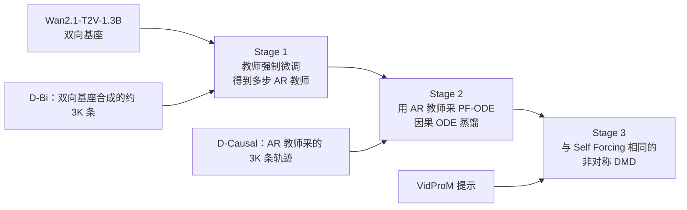

# Causal Forcing：双向教师不能拿来初始化自回归学生

<!-- release-date: 2026-02-02 -->

> 本文依据生数（ShengShu）与清华大学等合作的 **Causal Forcing: Autoregressive Diffusion Distillation Done Right for High-Quality Real-Time Interactive Video Generation**，即 [arXiv:2602.02214v5](https://arxiv.org/abs/2602.02214)（2026-06-01）、ICML 2026。本地件 20 页，首页水印 `arXiv:2602.02214v5 [cs.CV] 1 Jun 2026`。动笔前核过 arXiv 提交历史：v1 于 2026-02-02 上传，v5 为目前最新、也是会议相机就绪版。本地旧件曾是 v2（19 页），已换成 v5；**全文页码一律指本 v5 PDF 自身页码，不要沿用 v2**。
>
> 文中始终区分三件事：**报告写了什么**、**我们如何解释**、**哪些是外部补充**。公司目录按主要归属放在 ShengShu（生数）；并列一作署清华大学与生数，人民大学、UT Austin 为合作方。
>
> `release-date` 取 **2026-02-02**。官方代码仓 [thu-ml/Causal-Forcing](https://github.com/thu-ml/Causal-Forcing) 的 README News 写明「2026.2.2：论文、项目页与代码同日发布」。arXiv v1 时间戳为 2026-02-02 15:19:22 UTC。Hugging Face `zhuhz22/Causal-Forcing` 的 `createdAt`（2026-01-30）按本模块规则不是首发日；权重文件虽于同日提交，当日 README 只有许可证、没有模型说明，官方自己把对外发布日写成 2 月 2 日，故不按权重提交日提前。

## 读之前：先看清这条裂缝

这份论文研究的不是「视频扩散怎么再少几步」，也不是 Self Forcing 已经盯过的训推裂缝。它盯的是更前面、也更容易被忽略的一步：把一个双向预训练视频模型，蒸馏成自回归少步学生时，ODE 初始化用的教师，根本不能是那个双向基座。

下面这些词后文会反复出现。这里只解释报告真正用到的概念。

**双向视频扩散**：一次把整段视频的所有帧一起去噪。每一帧都可以看见未来。画质高，但必须等整段生成完才能开始看，也没法在「下一帧还没发生」的直播、游戏里用（PDF p. 1–2）。

**自回归（autoregressive，AR）**：按时间一帧（或一块）往前走。生成第 $i$ 帧时，只能看已经有的过去。这和真实世界的时间方向一致，首帧延迟可以压到一秒以内。报告脚注写：实践里通常按 chunk 而不是严格逐帧生成，正文为了简单先按帧写（PDF p. 2）。

**少步蒸馏**：预训练扩散往往要走几十步；实时交互要求每帧只走几步。当代做法通常分两段：先用 ODE 蒸馏把多步教师压成少步学生，再用分布匹配蒸馏（Distribution Matching Distillation，DMD）把学生的生成分布对齐到数据（PDF p. 1、p. 3）。

**概率流常微分方程（probability flow ODE，PF-ODE）**：把「加噪—去噪」写成一条从噪声走到干净数据的确定性轨迹。给定起点，轨迹是唯一的。这条轨迹对应的映射叫 **flow map（流映射）** $\phi$，它回答的是：这个带噪样本，沿着教师的 ODE 走到底，会变成哪一张干净图（PDF p. 2，式（1））。

**帧级单射（frame-level injectivity）**：对自回归学生来说，ODE 蒸馏要成立，必须保证「同一张带噪帧，只能对应唯一一张干净帧」。不满足的话，回归学到的不是教师的流映射，而是多张干净帧的平均，也就是条件期望。平均在图像里的样子就是糊（PDF p. 1、p. 4–5）。

**Teacher Forcing（教师强制，TF）与 Diffusion Forcing（扩散强制，DF）**：训自回归扩散时，过去从哪来。TF 给干净的真值前缀；DF 给各帧独立加噪后的前缀。报告的结论和常见看法相反：训 AR 教师时，TF 比 DF 更合适（PDF p. 2、p. 5）。

**Self Forcing**：直接前作。它已经指出：训练时必须按推理做自回归 rollout，再用视频级 DMD，否则匹配的不是推理分布。Causal Forcing 承认这一点，并且第三阶段原样沿用同一套 DMD。它要纠正的是**更前面那一步**：Self Forcing 的 ODE 初始化，用的仍是双向教师（PDF p. 3–4）。

## 一句话先说清

要把双向视频扩散变成可实时交互的少步自回归模型，现有流水线看起来是：ODE 初始化，再接 DMD。报告说，这条流水线少跨了一道架构缝。

双向教师可以看见未来。自回归学生不能。ODE 蒸馏要学的是一个函数：带噪输入对应唯一的干净输出。把双向教师的整段视频轨迹，按帧切给看不见未来的学生，同一张带噪帧会对上多张干净帧。平方损失的最优解于是变成条件期望，视频发糊（PDF p. 4–5，Figure 3）。

DMD 补不回这道缝。受控实验把采样步数缝先合上，只留下架构缝，自回归学生仍然明显落后于「双向教师蒸双向学生」的标准 DMD（PDF p. 3，Figure 2）。所以问题必须在 ODE 初始化阶段解决。

Causal Forcing 的做法很具体：

1. 先用教师强制，把双向基座微调成多步自回归教师；
2. 用这个 AR 教师采 PF-ODE 轨迹，做因果 ODE 蒸馏，得到满足帧级单射的少步初始化；
3. 再走和 Self Forcing 完全一样的非对称 DMD。

实验里，同样 17.0 FPS、0.69 秒延迟，相对 Self Forcing 的 Dynamic Degree / VisionReward / Instruction Following 分别高 **19.3% / 8.7% / 16.7%**（PDF p. 1–2、p. 8，Table 1）。

如果只记一句：

> **ODE 蒸馏要学的是函数，不是平均。教师看不见未来，学生才学得到那条流映射。**

## 报告地图：20 页各写了什么

| 报告章节 | PDF 页 | 讲了什么 | 密度 |
|---|---|---|---|
| 摘要 + §1 引言 + Figure 1 | p. 1–2 | 架构鸿沟、帧级单射、19.3% / 8.7% / 16.7% | 高 |
| §2 预备知识 | p. 2–3 | 流匹配、PF-ODE、TF/DF、ODE 蒸馏、DMD | 高 |
| Figure 2 + §3.1 | p. 3 | DMD 合不上架构缝；CausVid / Self Forcing 的非对称蒸馏 | 高 |
| Figure 3 + §3.2 | p. 4–5 | 视频级单射 vs 帧级单射、条件期望、Lemma 3.2 / Prop. 3.3 | 高 |
| Figure 4 + §3.3 Stage 1 | p. 5–6 | TF 优于 DF、Prop. 3.4 | 高 |
| §3.3 Stage 2–3 + 式（8）+ Figure 5 | p. 6 | 因果 ODE、同一套 DMD | 高 |
| §3.4 式（9） | p. 6 | 因果一致性蒸馏，正文里的延伸 | 中 |
| Figure 6 + §4.1 | p. 7 | Wan2.1-1.3B、3K 数据、2K+1K+750 步、评测口径 | 高 |
| Table 1 + §4.2 | p. 8 | 主结果、2079% 吞吐、同等训练预算 | 高 |
| Table 2 + §5 + 结论 | p. 9 | 消融、长视频正交、与 APT2 的分界 | 高 |
| 参考文献 | p. 10–13 | — | — |
| 附录 A | p. 14 | 扩展相关工作 | 低 |
| 附录 B + 式（10）–（29） | p. 14–16 | 非单射与 DF 失配的证明 | 高 |
| 附录 C.1 + Table 3 | p. 17 | PFVG / BAgger / Resampling Forcing 不优于 TF | 中 |
| 附录 C.2 + Table 4 + Figure 7–8 | p. 17–18 | 多步 AR 直接初始化 DMD 仍不够 | 高 |
| 附录 C.3 + Figure 9 | p. 19 | 瓶颈在教师配对数据，不在学生从哪初始化 | 高 |
| 附录 D + Figure 10 + 式（30）–（31） | p. 19–20 | 超参、4 步日程、评测细节 | 高 |

三件事先知道：

- **这是后训练论文，不是从零训视频基座。** 起点是 Wan2.1-T2V-1.3B，生成 81 帧、$832\times 480$ 的视频（PDF p. 7）。
- **第三阶段的 DMD，报告写明「和 Self Forcing 完全一样」。** 贡献不在发明新的分布匹配，而在给它一个满足帧级单射的初始化（PDF p. 6）。
- **正文没有公开 GPU 数、墙钟、VAE 压缩比。** 速度沿用 Self Forcing 的单卡 H100 口径；基线的吞吐和延迟「直接取自 Self Forcing 论文」（PDF p. 7、p. 20）。

## 两条缝，不是一条：少步之外还有架构鸿沟

### 旧问题

实时交互视频要的是少步自回归：当前帧生成完就能给用户，下一帧才开始，还要能根据已经生成的内容改后面的条件。报告举的应用包括世界模型、游戏模拟、具身智能和交互内容创作（PDF p. 1）。多步扩散的采样负担，直接卡死这些场景。

近年的主流补法是非对称蒸馏：拿一个很强的双向预训练视频扩散，蒸出一个少步自回归学生。CausVid 和 Self Forcing 都走「ODE 初始化 + DMD」这两段（PDF p. 1、p. 3）。相对普通的步数蒸馏，这里多出一道更硬的缝：

- **采样步数缝**：几十步压到几步。双向蒸双向的标准 DMD 也要跨这一道。
- **架构缝**：把「每一帧都能看见未来」的全注意力，换成「只看过去」的因果注意力（PDF p. 1、p. 3）。

报告的经验观察写在 Figure 1：从同一个双向基座出发，Self Forcing 这类 SOTA 自回归蒸馏，在动态程度和指令跟随上，仍然明显落后于「双向教师蒸双向学生」的标准 DMD（PDF p. 2）。柱状图没有印出精确读数，正文也没有把标准 DMD 的分数写成表，所以这里只取报告自己的判断：**架构缝是额外的、而且现有 AR 蒸馏没有从理论上跨过去。**

### 新设计之前，先做一个隔离实验

一个很自然的猜测是：DMD 已经在对齐生成分布了，架构缝会不会在第二阶段被抹平？

报告把这个猜测单独拿出来打。做法是：用标准 DMD 先蒸好一个少步双向模型，拿它去初始化自回归学生。这样采样步数缝已经合上，剩下的只有架构缝。Figure 2 显示，这个「只剩架构缝」的学生，仍然显著差于标准 DMD（PDF p. 3）。

因此报告把责任前移：**架构缝不能交给后续 DMD，必须在 ODE 初始化里处理**（PDF p. 3–4）。

### 我们如何解释

可以把双向模型想成一次看完整段样片的剪辑师，自回归模型想成按时间现场导播。把剪辑师「已经看过结局」的修图轨迹，当成导播每一帧的标准答案，导播在现场根本走不出同一条路。DMD 问的是「你滚出来的整段像不像真视频」，它能惩罚已经发生的错，但补不回「初始化时学的那个函数根本不是你推理时能用的函数」。

### 可迁移启发

凡是「强教师和弱学生结构不一致」的蒸馏，都要先问：你匹配的是终点分布，还是整条轨迹。匹配轨迹时，教师的信息集不能大于学生推理时实际拥有的信息集。多出来的那部分条件，会在回归里变成一对多，再被平方损失平均掉。

## 核心设计一：帧级单射——ODE 初始化要的是函数，不是平均

### 旧问题

Self Forcing 的第一段，是让双向教师沿自己的 PF-ODE 采样，再让自回归学生 $G_{\theta}$ 把带噪中间态回归到干净视频。目标写成（PDF p. 4，式（3））：

$$
\theta^{*}=\min_{\theta}\mathbb{E}_{t,x_{t}^{1:N},i}\bigl[\bigl\|G_{\theta}(x_{t}^{i},x_{t}^{<i},t)-x_{0}^{i}\bigr\|^{2}\bigr]
$$

其中 $i$ 从 $1$ 到 $N$ 均匀抽取，$(x_{t}^{1:N},x_{0}^{1:N})$ 落在双向教师同一条 PF-ODE 上，$t$ 来自预设的少步时间点集合 $\mathcal{S}$。

这个损失看起来很干净：学生看见过去和当前带噪帧，去预测干净帧。问题在「干净帧」是谁标的。

### 新设计：把单射从整段视频降到每一帧

ODE 蒸馏用的是平方损失。平方损失要学出一个**函数**，配对数据就必须是单射：任意时刻，一个带噪样本只对应一个干净样本（报告引 Liu 等人 2022 的整流流工作，PDF p. 4）。

双向蒸双向时，这个条件在视频级天然成立。PF-ODE 本身是单射，任意带噪视频 $x_{t}^{1:N}$ 只对应唯一的干净视频 $x_{0}^{1:N}=\phi_{\mathrm{Bi}}(x_{t}^{1:N},t)$。Figure 3（a）画的就是这件事（PDF p. 4）。

自回归把生成拆开以后，单射的对象变了。学生一次只吐一帧，它要学的映射是 $\phi_{\mathrm{AR}}:(x_{t}^{i},t)\mapsto x_{0}^{i}$。报告把它写成定义 3.1：**帧级单射**——任意两条带噪视频，只要第 $i$ 帧相同，流映射给出的第 $i$ 张干净帧也必须相同（PDF p. 4，式（4））。Figure 3（b）是满足这个条件的情况：教师也是自回归的。

### 工作机制：一对多时，最优解是条件期望

如果式（4）被打破，回归学生恢复不了教师的流映射，只会塌到条件均值（PDF p. 5，式（5））：

$$
G_{\theta}^{*}(x_{t}^{i},x_{t}^{<i},t)=\mathbb{E}\bigl[x_{0}^{i}\mid x_{t}^{i},x_{t}^{<i},t\bigr]
$$

人话：同一张带噪帧被标了好几张不同的干净图，平方损失的最优答案是把它们平均掉。平均在像素或潜变量里的样子，就是糊。报告把这个现象明确写成「对帧取平均，视觉上表现为模糊」（PDF p. 5）。

双向教师为什么会给出一对多？因为它去噪第 $i$ 帧时，未来帧 $x_{t}^{>i}$ 也在场。把 $x_{t}^{i}$ 固定，换一组未来，得到的干净帧 $x_{0}^{i}$ 可以不同。自回归学生监督时看不见这些未来，于是同一输入对上多个目标。Lemma 3.2 说：这种碰撞以非零测度发生，帧级单射以不可忽略的概率被违反（PDF p. 5，式（6））。命题 3.3 接着说：此时最优解 $G_{\theta}^{*}(x_{t}^{i},t)=\mathbb{E}[x_{0}^{i}\mid x_{t}^{i},t]$ **并不服从数据分布**（PDF p. 5，式（7））。

Figure 3（c）把这个失败画成：同一张带噪帧，双向流映射给出两张不同的干净图，打了红叉（PDF p. 4）。

附录把「帧」推广成「chunk」：只要切出来的那一块坐标数小于整段视频，同样的非单射就成立（PDF p. 14–15，Lemma B.1）。主实验恰好是 chunk-wise、每块 3 个潜变量帧（PDF p. 7），所以这个推广不是装饰。

### 收益

这一步本身还没有新算法。它做的是把 Self Forcing 第一阶段从「看起来合理的回归」，改写成一个可以证伪的条件。后面所有设计都绕着这句话转：教师必须自己就是自回归的，PF-ODE 才会在帧级单射。

### 代价与边界

帧级单射是对 **MSE 回归式 ODE 蒸馏** 的要求，不是对所有蒸馏的要求。DMD 匹配的是学生生成分布和数据分布，并不要求学生逐步复现教师的那条 ODE 轨迹，所以第三阶段仍然可以用更强的双向模型当 real score（PDF p. 3、p. 6）。报告没有把「DMD 不需要帧级单射」写成一条定理；这是我们根据 §2.4 与 §3.3 Stage 3 的分工读出来的，不是原文原句。

证明里还有一个技术假设：双向 DiT 的注意力对「其他帧」不是几乎处处常数。报告用前人的注意力图实验当作证据（PDF p. 15）。这是合理性论证，不是在本报告里新测的注意力图。

### 可迁移启发

**回归蒸馏的教师和学生，必须共享同一套可观测信息。** 教师多看见的那些变量，会把同一个学生输入变成多个合法标签。标签一多，平方损失就改学平均。语言蒸馏里如果教师看得到未来 token、学生是因果的，也会有同构问题；差别只是离散平均不叫「糊」，叫「把几种合法续写混成一个含糊的下一个词」。

第二条：单射是「函数是否良定义」，不必真的在训练集里撞上两份字节级相同的帧。附录 FAQ 式的直觉在论文里已经有了：连续空间里精确碰撞几乎不发生，但只要条件方差非零，最优解仍然是期望而不是真实样本（PDF p. 15，式（18）–（20））。

## 核心设计二：先微调出一个自回归教师，再用它走 ODE

### 旧问题

Self Forcing 的 ODE 初始化，教师是双向的、学生是自回归的。上面已经说明，这直接违反帧级单射。报告的原话是：这一设计「在理论上是错位的」（PDF p. 5）。

如果因此放弃 ODE、把多步 AR 模型直接交给 DMD，后面附录会显示：动态和画质会比 Self Forcing 的 ODE 好一截，但少步采样下块与块之间仍会跳变（PDF p. 17–18）。架构缝在少步regime 里还在。

### 新设计：三阶段，教师先改因果

Causal Forcing 把流水线拆成三段（PDF p. 5–6）：

这张图按 §3.3 与 §4.1（PDF p. 6–7）重画，只表示阶段顺序和数据从哪来，不含实测时间。

**Stage 1。** 用教师强制训一个自回归扩散，作为后面 ODE 的教师。下一节单独讲为什么是 TF 而不是 DF。

**Stage 2，因果 ODE。** 先从真实（这里是 $D_{\mathrm{Bi}}$ 里的干净前缀）取出历史 $x_{\mathrm{gt}}^{<i}$，让 AR 教师从高斯噪声出发，在这段干净历史上用 ODE 求解器生成当前帧，并存储所需时间点 $\mathcal{S}\cup\{0\}$ 上的轨迹 $\{x_{t}^{i}\}$。学生 $G_{\theta}$ 在同一段干净历史上，把中间带噪态回归到干净目标（PDF p. 6，式（8））：

$$
\theta^{*}=\min_{\theta}\mathbb{E}_{x_{\mathrm{gt}}^{<i},\,t\in\mathcal{S},\,i,\,x_{t}^{i}}\bigl[\bigl\|G_{\theta}(x_{t}^{i},x_{\mathrm{gt}}^{<i},t)-x_{0}^{i}\bigr\|^{2}\bigr]
$$

教师已经是自回归的，它的 PF-ODE 按构造满足式（4）。学生于是学的是一条真正的帧级流映射，而不是条件期望。

**Stage 3。** 把这段因果 ODE 初始化接到 Self Forcing 的非对称 DMD 上：学生用自己生成的前缀做 self-rollout，real score 仍是冻结的双向大模型，fake score 在线学（PDF p. 6）。报告写「Exactly as in Self Forcing's DMD」。

### 工作机制里两个容易混的点

第一，Stage 2 的历史是**数据集里的干净前缀**，不是学生自己滚出来的。这看起来像又在 teacher forcing。报告的意图是：这一阶段要学对的是「在给定过去时，当前帧的流映射」，单射条件靠 AR 教师保证；训推分布的合拢，留给 Stage 3 的 self-rollout。两段各管一道缝，不要指望 ODE 回归顺便把暴露偏差也治了。

第二，学生从哪初始化、配对数据从哪来，是两件不同的事。附录 C.3 专门拆开：用 $D_{\mathrm{Causal}}$（AR 教师采的配对）做因果 ODE，但把学生初始化改回双向基座。Figure 9 显示，画质仍接近「学生也从 AR 教师初始化」的版本，并且明显好于 Self Forcing 那种双向教师配对（PDF p. 19）。报告的结论：ODE 阶段的差距主要来自**教师和配对数据是不是因果的**，不是学生起点。

### 收益

Figure 5 把同一套 DMD 接到两种 ODE 初始化上：Self Forcing 的初始化动态弱、有伪影；因果 ODE 的初始化动态更强、更干净（PDF p. 6）。定量上，chunk-wise 的 Causal ODE + DMD 相对 Self Forcing 的 ODE + DMD：VisionReward +90.0%，Dynamic Degree +183.3%，Instruction Following +47.4%（PDF p. 8–9，Table 2）。frame-wise 上这个差距更大：Dynamic Degree +3100%，VisionReward +218.0%（PDF p. 8–9）。3100% 来自分母极小——Self Forcing 的 ODE 在逐帧设定下 Dynamic Degree 只剩 2，几乎不动了。

主表里，最终模型保持 17.0 FPS、0.69 秒延迟，VBench 总分 84.04，超过同表 Self Forcing 的 83.74 和 Wan2.1 的 83.37，用户排序 1.64（越低越好），也是全表第一（PDF p. 8，Table 1）。

### 代价与边界

因果 ODE 要先采并存储 AR 教师的轨迹。报告用 3K 条（PDF p. 7）。它没有写采集墙钟，也没有写 LMDB 体积；这些出现在后来的代码仓文档里，不是 PDF 内容。

多步 AR 教师本身已经能给 DMD 一个「好得多的」起点，但报告在 §3.3 用斜体强调：它「仍然会出现突变伪影」，细节见附录 C.2（PDF p. 6）。所以 Stage 1 不是可选项里的终点，Stage 2 仍然要做。

主结果是 chunk-wise、每块 3 个潜变量帧，和 Self Forcing 对齐（PDF p. 7）。frame-wise 只出现在消融，没有单独的速度表。

### 可迁移启发

**结构不对称时，先造一个「信息集和学生一致」的教师，再对轨迹；终点分布的对齐，可以仍用更强、甚至结构不同的老师。** Causal Forcing 并没有在 DMD 里改用 AR 教师。它把「必须同构」限制在 ODE / 一致性蒸馏这种逐步回归上，把「只需同分布」留给 DMD。这是一条用得上的分工，而不是「所有教师都必须改成学生的架构」。

## 核心设计三：训 AR 教师时用干净前缀，不要用带噪前缀

### 旧问题

自回归视频扩散有两种常见训练：教师强制和 Diffusion Forcing。CausVid 以及一些后续工作，把 DF 当作 AR 训练的默认选项（PDF p. 17）。直觉是：DF 覆盖了「过去可干净可很吵」的网格，推理时那种「过去相对干净、当前很吵」也被盖到了。

报告说，这个直觉在 **AR 扩散** 上不成立。

### 新设计

Stage 1 明确采用教师强制：训练第 $i$ 帧时，注意力看到的是干净前缀 $x_{0}^{<i}$（PDF p. 2–3、p. 5）。实现上沿用常见做法：把干净视频和带噪视频拼在一起，加因果掩码，让 $x_{t}^{i}$ 只能看 $x_{0}^{<i}$（PDF p. 3）。

### 工作机制

DF 训练时，第 $i$ 帧看的是独立加噪后的前缀 $x_{t}^{<i}$；推理时看的是已经去完噪的干净前缀 $x_{0}^{<i}$。命题 3.4 说：在附录 B.2 的正则条件下，把 DF 学到的条件分布拿到干净前缀上求 KL，期望严格大于 0。也就是说，**按 DF 训出来的模型，并不服从「以因果干净前缀为条件」的数据分布**（PDF p. 6）。

TF 的训练条件和推理条件都是干净前缀，这道缝不存在。Figure 4 用样例对照：DF 的视频塌掉，TF 更稳（PDF p. 5）。

Dynamic Degree 在这里是陷阱。Table 2 里 DF 的动态分是 60，高于 TF 的 50。报告明确写：这主要来自崩溃，病态地抬高了运动指标，不是真的更好动（PDF p. 8）。VisionReward 才露出差距：TF 3.343 对 DF 1.583，相对提高 111.2%（PDF p. 8–9）。

附录 C.1 还试了三种更新的 AR 训练：PFVG、BAgger、Resampling Forcing。在本报告的 5 秒设定下，它们相对 TF 没有明显优势（PDF p. 17，Table 3）：

| 方法 | Dynamic Degree | VisionReward | Instruction Following |
|---|---:|---:|---:|
| Teacher Forcing | 50 | **3.343** | **32** |
| PFVG | **61** | 2.857 | 32 |
| BAgger | 53 | 2.715 | 28 |
| Resampling Forcing | 51 | 3.336 | 22 |

报告自己的限定：这些方法多半是为长视频设计的，5 秒上看不到收益并不意外，更深的比较留给未来（PDF p. 17）。

它也没有把 DF 一棍子打死。DF 最初是给双向模型做视频续写的：推理时本来就是「干净尾巴 + 噪声」，和训练一致，不在这条失配命题的覆盖范围里（PDF p. 17）。报告反驳的，只是「AR 训练时用带噪前缀当条件」这件事。

### 收益

Stage 1 得到一个真正能当 ODE 教师的多步 AR 模型。没有它，Stage 2 没有合格的 $\phi_{\mathrm{AR}}$ 可采。

### 代价与边界

TF 把暴露偏差留到了后面：Stage 1 / Stage 2 仍然在干净历史上训练，推理时的自生成历史要等 Stage 3 的 self-rollout 才出现。Causal Forcing 不是「TF 已经够了」，而是「AR 教师这条腿必须先用 TF 站直，再把训推合拢交给 DMD」。

Table 3 没有 VBench 总分，不能据此说 TF 在所有指标上都赢过长视频方法。

### 可迁移启发

**覆盖推理会出现的噪声水平，不等于对齐推理会看到的条件。** DF 覆盖了噪声网格，但把条件从「干净过去」换成了「带噪过去」。网格更密，条件错了，仍会在推理的那一格上失配。做任何「训练时把条件弄得更丰富」的设计，都要单独检查：丰富之后的条件，推理时到底会不会出现。

## 核心设计四：同一套 DMD，接在正确的初始化后面

### 旧问题

Self Forcing 已经论证过：DMD 必须打在模型自己 rollout 出来的整段视频上，而不是 TF / DF 的逐帧 MSE。Causal Forcing 不再重做这个论证，而是把它当作第三阶段的现成工具。

若初始化已经糊了、或者少步下块间在跳，DMD 是在一个坏的生成器分布上做匹配。Figure 8 左图就是：Self Forcing 的 ODE 接上 DMD 之后，动态仍然弱，还有突变（PDF p. 18）。

### 新设计

Stage 3 严格跟 Self Forcing：学生条件在自己生成的前缀上 self-rollout；$s_{\mathrm{real}}$ 用 Wan2.1-14B，$s_{\mathrm{fake}}$ 用 Wan2.1-1.3B（PDF p. 6、p. 19）。提示词走 VidProM，训 750 步至收敛（PDF p. 7）。

DMD 的梯度形式在预备知识里已经写出（PDF p. 3，式（2））：两个 score 的差，沿着学生对生成样本的雅可比回传。报告没有改这个公式。

### 工作机制：为什么这里又允许双向教师

ODE / 一致性蒸馏要学生逐步复现教师轨迹，所以教师不能看见学生看不见的未来。DMD 要的是学生的最终样本分布靠近数据分布，并不要求逐步轨迹重合。双向 14B 当 real score，提供的是「这段视频像不像真的」的评分场，不是「第 $i$ 帧沿着哪条 ODE 走」。这是我们根据 §2.4 与 Stage 3 的设定做的解释；报告正文没有单独开一小节讲「为何 DMD 可以用双向教师」。

self-rollout 的作用和 Self Forcing 相同：把训练时的历史改成模型自己的输出，缩小训推缝。报告写，这「从而缩小训推差距」（PDF p. 6）。

### 收益

主结果 Table 1 用的就是这段 DMD 之后的模型。相对同设定、同速度的 Self Forcing：Dynamic Degree 57→68（+19.3%），VisionReward 5.820→6.326（+8.7%），Instruction Following 48→56（+16.7%）（PDF p. 8）。相对 Wan2.1，吞吐高 2079%，延迟从 103 秒降到 0.69 秒（PDF p. 8）。$17.0/0.78-1=20.79$，和「2079% higher」对得上。

附录 Table 4 把三种初始化接到同一套 DMD 上（PDF p. 18）：

| 初始化 | Total | Quality | Semantic | Dynamic | VisionReward | Instruction |
|---|---:|---:|---:|---:|---:|---:|
| Self Forcing 的 ODE + DMD | 82.00 | 82.18 | 81.29 | 24 | 3.330 | 38 |
| 多步 AR 扩散 + DMD | 84.02 | **84.72** | 81.23 | 66 | 5.863 | 48 |
| 因果 ODE + DMD | **84.04** | 84.59 | **81.84** | **68** | **6.326** | **56** |

多步 AR 已经把大部分分拉开了；因果 ODE 再把 VisionReward 和指令跟随往上抬一截，Quality 反而略低于多步 AR 的 84.72。报告仍把因果 ODE 写成「整体质量和 VisionReward 最好」（PDF p. 18）。「最好」指的是他们更看重的动态、奖励和跟随，不是 Quality 列第一。

Figure 7 解释了为什么不能停在多步 AR：还没进 DMD、只看 4 步生成时，多步 AR 块间突变，因果 ODE 更稳（PDF p. 18）。少步regime 下，多步教师并没有把架构缝走完。

### 代价与边界

DMD 750 步，报告说「直到收敛」，没有 loss 曲线，也没有「再训会不会掉动态」的讨论。那是代码仓后来的经验，不是 PDF。

real score 是 14B。训练时显存账上多了一位双向老师。报告没有给出这段的 GPU 数或小时数。

### 可迁移启发

**同一套匹配损失，初始化决定你匹配的是哪一座城。** Table 2 里，chunk-wise 的 Self Forcing ODE + DMD 总分 82.00，因果 ODE + DMD 是 84.04，DMD 名字没变。工具对了、起点错了，仍然会白做。这和 Self Forcing 批评 CausVid「DMD 匹配了错误分布」是同一条原则，只是裂缝的位置从「rollout 用的过去」前移到了「ODE 用的教师」。

## 延伸：因果一致性蒸馏，原则相同，实例还很粗糙

ODE 蒸馏被报告看成一致性蒸馏（consistency distillation，CD）的简化：直接把中间态回归到干净终点，而不是回归到教师走一小步之后的一致性目标（PDF p. 3、p. 6）。同一条帧级单射，因此也适用于 CD。

报告给出的因果 CD 目标是（PDF p. 6，式（9））：学生 $G_{\theta}$ 在干净前缀 $x_{\mathrm{gt}}^{<i}$ 上，让 $t$ 时刻的输出贴近停梯度教师走一小步之后、在 $t-\Delta t$ 的输出。教师仍是 Stage 1 那个原生 AR 扩散。非对称 CD（双向教师）按 Lemma 3.2 同样不单射，会塌。

Figure 10：非对称 CD 严重发糊、有突变；因果 CD 稳定得多（PDF p. 20）。Table 2 定量：VisionReward 从 $-7.983$ 到 $1.798$，提升 9.781；Instruction Following 从 $-42$ 到 $18$，提升 60（PDF p. 8–9）。注意这里是绝对差，不是百分比——分母为负时百分比没有意义，报告自己也写的是绝对量。

实现上这还是「直接套 vanilla LCM」：48 个离散时间点、UniPC 求解器、EMA 0.99、在 $D_{\mathrm{Bi}}$ 上训 3K 步，推理同样 4 步（PDF p. 19–20）。流匹配的 $v$-预测让 $x_{0}$ 预测形式自动满足边界条件 $G_{\theta}(x,0)\equiv x$，不必再包一层 $c_{\mathrm{skip}}$ / $c_{\mathrm{out}}$（PDF p. 19–20，式（30）–（31））：

$$
G_{\theta}(x^{i},x_{\mathrm{gt}}^{<i},t)=x^{i}-t\,v_{\theta}(x^{i},x_{\mathrm{gt}}^{<i},t)
$$

报告承认：这个简化「未必最优」，目前也弱于 score distillation，只是给后续的连续时间 CD 留了路（PDF p. 8、p. 20）。正文还写，因果 CD「也可以替代因果 ODE、给 DMD 当初始化，我们把这留给未来工作」（PDF p. 6）。那句话是原报告的边界，不是本解读要补的后续论文。

## 它接在哪条流水线上：Wan2.1-1.3B 的三段后训练

实现段落把预算写死了（PDF p. 7、p. 19–20）。

基座 **Wan2.1-T2V-1.3B**，81 帧，$832\times 480$。先用该双向模型按 VidProM 提示合成约 **3K** 条，得到 $D_{\mathrm{Bi}}$，并顺手存下带噪中间态，供「Self Forcing 式 ODE」消融使用。AR 教师在 $D_{\mathrm{Bi}}$ 上 TF 训 **2K** 步。然后用这个教师采 **3K** 条因果 ODE 轨迹 $D_{\mathrm{Causal}}$，再蒸馏 **1K** 步。DMD 在 VidProM 上 **750** 步。消融里，Self Forcing 式 ODE 从双向基座直接训 3K 步；因果路径是 2K+1K，总更新次数对齐（PDF p. 20）。

两条粒度：主结果、用户研究都是 **chunk-wise，每块 3 个潜变量帧**；ODE+DMD 另报 frame-wise（PDF p. 7–8）。

优化器全程 Adam，batch 64，学习率 $2\times 10^{-6}$，$\beta_{1}=0$，$\beta_{2}=0.999$，其余与 Self Forcing 相同（PDF p. 19）。推理 4 步时间点，因果 ODE 与 DMD 共用：

$$
t\in\{1,\,0.9375,\,0.8333,\,0.625\}
$$

（PDF p. 19。）这是流匹配 $[0,1]$ 日程，不要和 Self Forcing 原文里 $[1000,750,500,250]$ 那套 $t\in[0,1000]$ 直接换算后当成同一张表。

评测分两套提示，不能混（PDF p. 7、p. 20）：

- **VBench 的 Total / Quality / Semantic**：官方 VBench 提示。其中 Dynamic Degree 这一项在总分里仍按官方提示算，不改用下面那 100 条。
- **Dynamic Degree、VisionReward、Instruction Following**：另编的 100 条「动作丰富」提示，放在补充材料里。所有这类分数再乘 100，方便读。VisionReward 各子分在 $[-1,1]$，总分为官方加权；可以为负，越大越好。Instruction Following 取的是 VisionReward 的提示对齐子分，询问句是官方那句「视频是否满足文本里的部分要求」。

用户研究：10 人、10 条提示，对所有方法的整体质量排序，Rating 越低越好（PDF p. 7）。速度：单卡 H100，FPS 和秒；基线的吞吐与延迟直接抄 Self Forcing 论文（PDF p. 20）。

这份 recipe 能直接抄的是「AR 教师 → 因果 ODE → 同一套 DMD」这个形状，以及 2K / 1K / 750 与 3K 条轨迹这些整数。1.3B、4 步、H100 是绑在一起的。

## 实验：同速度下把动态和跟随拉开，而不是再刷一格 FPS

### 主表

| 模型 | 吞吐（FPS） | 延迟（s） | Total | Quality | Semantic | Dynamic | VisionReward | Instruct | Rating↓ |
|---|---:|---:|---:|---:|---:|---:|---:|---:|---:|
| LTX-1.9B | 8.98 | 13.5 | 79.83 | 81.88 | 71.62 | 46 | −6.218 | −38 | 6.40 |
| Wan2.1-1.3B | 0.78 | 103 | 83.37 | 84.30 | 79.65 | 61 | 5.275 | 42 | 2.29 |
| NOVA | 0.88 | 4.1 | 80.31 | 80.66 | 78.92 | 46 | −7.381 | −16 | 8.41 |
| Pyramid Flow | 6.70 | 2.5 | 80.75 | 83.41 | 70.11 | 16 | 4.055 | −2 | 6.11 |
| SkyReels-V2-1.3B | 0.49 | 112 | 81.97 | 83.96 | 74.01 | 37 | 3.584 | 32 | 6.57 |
| MAGI-1-4.5B | 0.19 | 282 | 78.88 | 81.67 | 67.72 | 42 | 0.773 | 8 | 6.44 |
| CausVid | **17.0** | **0.69** | 81.33 | 83.98 | 70.72 | 62 | 5.741 | 12 | 4.27 |
| Self Forcing | **17.0** | **0.69** | 83.74 | 84.48 | 80.77 | 57 | 5.820 | 48 | 2.87 |
| **Causal Forcing** | **17.0** | **0.69** | **84.04** | **84.59** | **81.84** | **68** | **6.326** | **56** | **1.64** |

（PDF p. 8，Table 1。粗体为本文所加。）

几件该分开说的事。

**速度不是新贡献。** CausVid、Self Forcing、Causal Forcing 三行都是 17.0 FPS、0.69 秒。报告自己的原话是「保持同样极高的吞吐」（PDF p. 8）。实时能力沿用前作，本篇要比的是同延迟下的动态、画质和跟随。

**本表里的 Self Forcing 不是前作原文那张表。** 前作 chunk-wise 的 VBench 总分是另一套评测设定下的 84.31。这里 Self Forcing 是 83.74。不要把两张表的绝对分加减。本解读只用 Table 1 这一列数字。

**相对双向基座。** 总分 84.04 对 Wan2.1 的 83.37，Quality 84.59 对 84.30。这是「同一档并略高」，和摘要「match or even surpass」一致。真正拉开的是动态 68 vs 61，以及延迟两个数量级。吞吐的 2079% 只对 Wan2.1 那一行有意义，不要拿去对已经 17 FPS 的蒸馏同行。

**相对未蒸馏自回归。** 正文写：相对其中最好的基线，动态 +47.8%、VisionReward +56.0%、指令跟随 +75.0%（PDF p. 8）。按表验算：动态相对 CausVid 的 62 是 $(68-62)/62\approx 9.7\%$，对不上 47.8%；相对 Pyramid Flow 的 16 则是 $(68-16)/16=3.25$。47.8% 对应的是「Autoregressive Video Diffusion Models」那一组里动态最高的 NOVA 46：$(68-46)/46\approx 47.8\%$。VisionReward 的 56.0% 对的是该组里最高的 Pyramid Flow 4.055：$(6.326-4.055)/4.055\approx 56.0\%$。指令跟随 75.0% 对的是 SkyReels-V2 的 32：$(56-32)/32=75\%$。所以这三项百分比的「best baseline」**不是同一行**。报告把它们写在同一句里，读的时候要拆开。

**相对蒸馏同行，才是摘要那三个头条百分比。** 动态 $(68-57)/57\approx 19.3\%$，VisionReward $(6.326-5.820)/5.820\approx 8.7\%$，指令 $(56-48)/48\approx 16.7\%$。分母都是 Table 1 的 Self Forcing。CausVid 的指令跟随只有 12，动态 62 甚至高于 Self Forcing 的 57；本篇没有把 CausVid 当 SOTA 去算那三个头条百分比。

**用户排序。** 1.64 低于 Wan2.1 的 2.29 和 Self Forcing 的 2.87。样本是 10 人 × 10 提示，没有评分者间一致性，也没有「两者都差」选项。这是排序，不是绝对分。

**训练预算对齐。** 两个蒸馏基线在 DMD 前都至少做了 3K 步 ODE 初始化，与本方法的 2K+1K 相同。报告据此说「完全相同的训练预算，却有实质提升」（PDF p. 8）。这里的「相同」指 ODE 段更新步数，不是墙钟，也不是 GPU 小时——那两项 PDF 没给。

Figure 6 的定性对照：同一提示下 CausVid / Self Forcing 更静或更假，Causal Forcing 的动作幅度更接近甚至超过 Wan2.1（PDF p. 7）。样例视频指向补充材料，项目页本身是外部材料。

### 消融：换回双向教师的 ODE，DMD 救不回来

Table 2 把三段分开关（PDF p. 9）。

**AR 训练。** TF 全面优于 DF，除了被崩溃抬高的动态分。见上一节。

**Score distillation，chunk-wise。** 因果 ODE + DMD 就是主结果那一行 84.04 / 68 / 6.326 / 56。Self Forcing 式 ODE + DMD 掉到 82.00 / 24 / 3.330 / 38。动态从 24 到 68，是这张消融表里最刺眼的一列：初始化一旦糊，DMD 会把「几乎不动」学成一种稳定模式。

**Score distillation，frame-wise。** Self Forcing 式 ODE 的动态只剩 2、指令跟随是 −4；因果 ODE 回到 64 和 42。逐帧展开步数更多，帧级非单射的伤害更大。这和「架构缝必须在 ODE 解决」的隔离实验一致。

**CD。** 因果 CD 赢非对称 CD，但总分 81.48 仍低于因果 ODE + DMD 的 84.04。报告把 CD 定位成原则验证，不是主方法。

### 长视频：这篇不负责外推

§5 写得很干脆：AR 并不自动等于能生成长视频。Causal Forcing 和 Self Forcing 一样，在 5 秒视频、最多 5 秒注意力上训练，直接外推会造成新的训推缝、质量下降。补法是正交的长视频适应：训练类的 LongLive、Rolling Forcing，免训练的 Infinity-RoPE、Deep Forcing（PDF p. 9）。本报告没有长视频定量分。

### 和 APT2 的分界

另一条少步 AR 路线是 GAN 蒸馏，例如 APT2。报告说 APT2 用 teacher-forcing CD 做初始化，目标上和因果 ODE 对齐，但贡献不同（PDF p. 9）：

1. Causal Forcing 是第一份从理论上证明：前向 KL 类蒸馏（ODE / CD）应当用 AR 教师训 AR 学生；APT2 没有这套分析。
2. 算法和架构不同：这边走非对称 DMD、双向教师当 real score、推理用时间 KV 缓存；APT2 是 GAN、没有双向教师、不用时间 KV，而是把噪声和条件拼接。
3. Causal Forcing 开源了第一份由因果 ODE 初始化的少步 AR 模型。APT2 未开源，本文不做对比。

「第一份」是作者定位。开源事实可以核对仓库；「第一份理论」是声明，不是表。

## 报告没有写的部分

**架构与系统**

- Wan2.1-1.3B 的层数、头数、VAE 压缩比、81 像素帧对应多少潜变量帧，全部指回基座，本报告不重复。
- chunk = 3 个潜变量帧，但一个潜变量帧对应多少像素帧，这里没有写。
- 没有 KV 缓存长度、rolling cache、外推算法。长视频明确推给正交工作。
- 没有训练用的 GPU 数、墙钟、iteration 级曲线。
- FlexAttention / FlashAttention 这类内核名字，本报告没有。

**方法**

- 没有「关掉帧级单射、只改 DMD」的反例之外的更多消融——隔离实验是 Figure 2，不是一张表。
- 没有「因果 ODE 不用 TF 历史、改用 self-rollout」的对照。Stage 2 固定用干净前缀。
- 因果 CD 只有 vanilla LCM 一个实例，没有 sCM / 均值流等后续变体的实验。正文把替代 ODE 这件事写成未来工作。
- APT2 只做文字分界，没有数字。

**评测**

- Dynamic Degree / VisionReward / Instruction Following 用的 100 条提示在补充材料，不在这 20 页里。
- VBench 总分里的 Dynamic Degree 和单独列出的 Dynamic Degree **不是同一套提示**（PDF p. 20）。比较「总分」和「动态」时不能当成同一个运动指标。
- VisionReward 加权细节指回官方，本报告只说用官方权重。
- 用户研究 10×10，没有置信区间。
- 速度只在 H100 上、且基线数字抄前作。单卡消费级 GPU 的 FPS 不是 PDF 数字。
- 没有 FVD、多样性、单独的运动幅度消融。DF 动态分虚高，是作者对崩溃的解释，没有另给「排除崩溃后的运动分」。

**不要把论文之后的仓库更新读回这篇。** 代码仓后来的少步变体、分钟级长视频扩展和更大基座，都不是 v5 正文的实验。项目页和 README 的更新，一律当外部补充。

## 可以带回自己项目的几条

**教师的信息集不能大于学生推理时实际拥有的信息集。** 双向教师给自回归学生标 ODE 轨迹，就是在用「看见未来」的答案监督「不能看未来」的模型。平方损失会把一对多收成平均。任何回归式轨迹蒸馏——ODE、CD、逐步蒸馏——都可以先画一张 Figure 3：同一个学生输入，教师会不会给出多个合法终点。

**匹配终点分布的工具，和匹配逐步轨迹的工具，对教师同构的要求不同。** DMD 可以用更强的双向 14B 当 score；ODE 不行。不要因为「蒸馏」两个字，就把两种损失的教师选成同一个。

**架构缝不会被后一段损失自动抹平。** Figure 2 把步数缝合上之后，架构缝还在；Table 2 把 DMD 接到错误 ODE 上，动态会塌到 24 甚至 2。后训练很短、看起来「还能再训一截」的时候，更要检查初始化学的是不是该学的函数。

**覆盖更密的噪声网格，不等于对齐推理条件。** AR 上的 DF 是反例。TF 更「朴素」，但训练条件和推理条件是同一类东西。先对齐条件，再谈覆盖。

**指标会站在崩溃一边。** DF 的 Dynamic Degree 更高，来自塌掉的运动。换一套与人相关的 VisionReward，排序就倒过来。运动类指标在生成已经失稳时，要有第二套读数。

**5 秒训出来的因果模型，不能直接当长视频基线。** 报告自己把外推写成训推缝，并点名正交工作。用本方法做长视频对比而不做适应，是报告明确反对的读法。

## 关键词回看

- **架构鸿沟（architectural gap）**：双向全注意力改成因果注意力时，学生看不见未来；这和「少走几步」不是同一道题。
- **采样步数鸿沟（sampling-step gap）**：多步变少步。标准 DMD 也要跨，但跨完之后架构缝还在。
- **帧级单射（frame-level injectivity）**：同一张带噪帧必须对应唯一干净帧，ODE 回归才能恢复流映射。
- **视频级单射**：双向 PF-ODE 对整段视频成立，切到帧或 chunk 上不必成立。
- **条件期望解**：一对多时平方损失的最优解，视觉上表现为糊。
- **PF-ODE / flow map**：从噪声到数据的确定性轨迹及其映射 $\phi$。
- **Causal Forcing**：TF 训 AR 教师 → 因果 ODE 初始化 → 与 Self Forcing 相同的 DMD。
- **Teacher Forcing / Diffusion Forcing**：干净前缀 vs 带噪前缀。本报告在 AR 教师上选 TF。
- **非对称 DMD**：学生自回归少步、real score 仍是双向大模型；Stage 3 原样沿用。
- **因果 CD**：同一条单射原则在一致性蒸馏上的实例；正文里弱于 score distillation。
- **chunk-wise / frame-wise**：每块 3 个潜变量帧 vs 一次 1 帧。主表是前者。

## 最后的判断

Causal Forcing 没有发明自回归，也没有发明 DMD。它盯住的是一句会被「我们用了因果注意力」盖过去的话：

> **因果注意力只保证学生看不见未来。如果教师还看得见未来，ODE 标签就不是一个函数。**

哪些结论有表、图或命题支撑：

- DMD 合不上架构缝（Figure 2）。
- 双向教师对 AR 学生违反帧级单射，最优解是条件期望，不服从数据分布（Lemma 3.2、命题 3.3，Figure 3）。
- AR 上的 DF 在干净前缀上与数据条件分布失配；TF 在 VisionReward 上相对 DF +111.2%（命题 3.4，Table 2）。
- 同样 17.0 FPS / 0.69 秒，相对 Self Forcing：动态 +19.3%，VisionReward +8.7%，指令 +16.7%（Table 1）。
- 因果 ODE + DMD 相对 Self Forcing 式 ODE + DMD，chunk-wise 动态 +183.3%，frame-wise 动态 +3100%（Table 2）。
- 瓶颈在配对数据的教师，不在学生从双向还是 AR 初始化（Figure 9）。
- 多步 AR 直接初始化 DMD 已大幅好于错误 ODE，但 4 步下仍跳变，因果 ODE 更稳（Table 4，Figure 7–8）。

哪些是作者观察或定位：

- 「第一份从理论上证明前向 KL 类蒸馏该用 AR 教师」是声明。
- DF 动态分虚高「主要来自崩溃」，没有排除崩溃后的第二套运动指标。
- 因果 CD「为未来工作铺路」，同时承认弱于 score distillation。
- 对社会影响「没有必须单独强调的后果」（PDF p. 9），这是作者选择，不是评测。

哪些没有公开：GPU 小时、VAE 规格、100 条运动提示的正文列表、H100 以外的官方速度、长视频定量分。

如果只带走一条设计原则：

> **逐步轨迹蒸馏要求教师和学生看见同一世界；终点分布蒸馏可以请更强、甚至结构不同的老师来打分。把这两件事缠在同一个「蒸馏」里，就会拿双向教师的 ODE 去初始化一个看不见未来的学生。**

## 资料与阅读边界

**原件与版本**

- 原始依据：本地 `papers/ShengShu/Causal-Forcing.pdf`，即 [arXiv:2602.02214v5](https://arxiv.org/abs/2602.02214)，2026-06-01，20 页，ICML 2026（首页写作 *Proceedings of the 43rd International Conference on Machine Learning, Seoul, South Korea. PMLR 306, 2026*）。
- 版本核对：arXiv 提交历史五版——v1（2026-02-02 15:19:22 UTC）、v2（2026-02-06）、v3（2026-05-21）、v4（2026-05-29）、v5（2026-06-01 14:32:37 UTC）。v5 为当前最新。本地旧件为 v2、19 页，已替换；页码不以 v2 为准。
- 署名：Hongzhou Zhu、Min Zhao、Hang Su、Jun Zhu 署清华大学与生数；Guande He 署 UT Austin；Chongxuan Li 署中国人民大学。并列一作 Zhu 与 Zhao。通讯作者 Jun Zhu。

**首发日证据**

`release-date` 取 **2026-02-02**。这篇文章讲的是一项方法和与之配套、可下载的少步自回归视频权重，按「任一官方渠道最早对外可用」取值。当天对齐的官方事件：

- 官方代码仓 [thu-ml/Causal-Forcing](https://github.com/thu-ml/Causal-Forcing) README News 第一条：**2026.2.2**，论文、[项目页](https://thu-ml.github.io/CausalForcing.github.io/)、代码同日发布。仓库 `created_at` 为 2026-02-01T09:30:13Z，早于对外宣布；按作者自己的 News 条目，公开日仍记 2 月 2 日。
- arXiv v1 于 2026-02-02 15:19:22 UTC 提交。
- Hugging Face `zhuhz22/Causal-Forcing` 的 `createdAt` 为 2026-01-30T07:40:33Z，**不作为首发日**。`chunkwise/causal_forcing.pt` 于 2026-01-30T08:12:00Z 提交，`framewise/causal_forcing.pt` 于 2026-01-30T09:32:53Z 提交；当日 README 仅有 Apache-2.0 许可证。无法从公开记录证明 1 月 30 日权重已对公众解禁，故不按权重提交日提前。

**直接前作**

本站已有 [Self Forcing](/reports/Adobe/Self-Forcing)（arXiv:2506.08009）。两篇不要混表：Self Forcing 原文的 84.31 / 81.28 是它自己的 VBench 设定；本报告 Table 1 重测的 Self Forcing 是 83.74 / 80.77。方法对照可以读，数字以各篇自己的 PDF 为准。

**外部补充，不是本报告内容**

- 项目页与 GitHub README 在论文之后继续更新，包括分钟级长视频扩展、I2V 说明、训练步数经验、精度（BF16 / FP32）提示。
- Hugging Face 权重与 `Causal-Forcing-data` 数据集页面。
- **Causal Forcing++**（[arXiv:2605.15141](https://arxiv.org/abs/2605.15141)）用因果一致性蒸馏替代 ODE 数据制备，并放出 1 步 / 2 步 frame-wise 模型。那是另一篇文章，不是 v5 的实验，也不应读回本报告的「未来工作」一句里当成已经做完。
