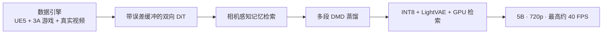
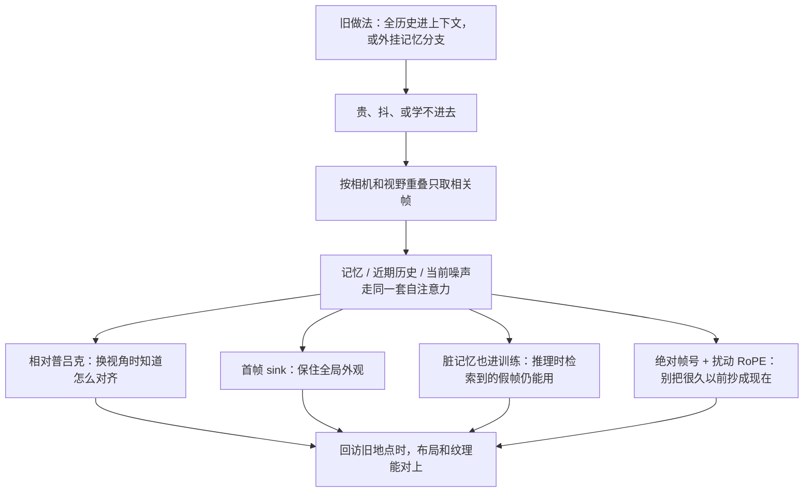
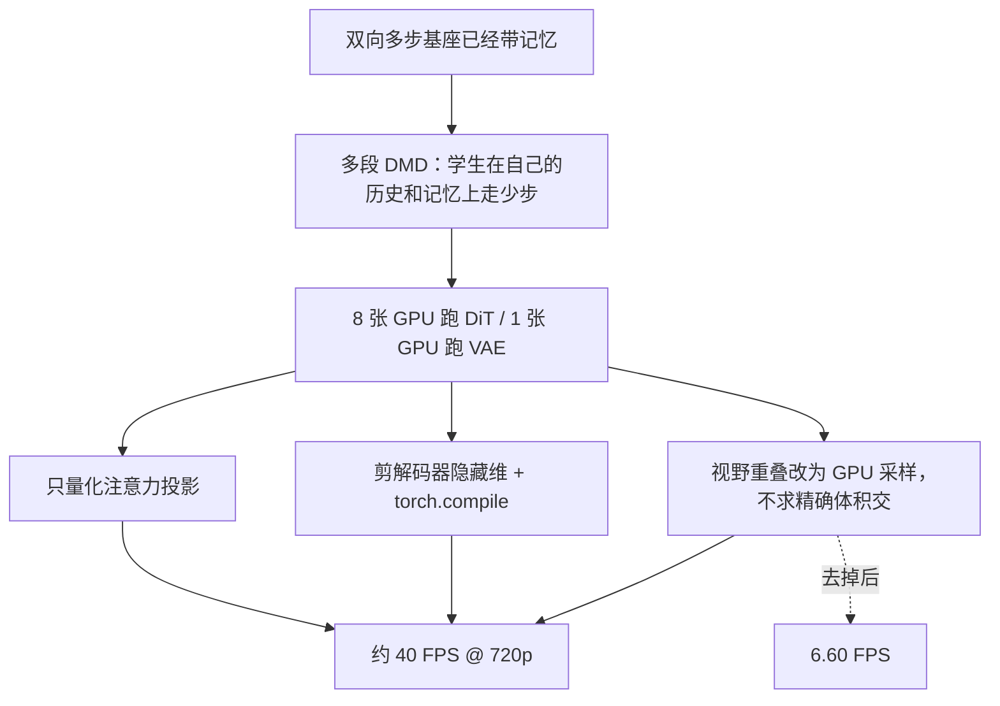
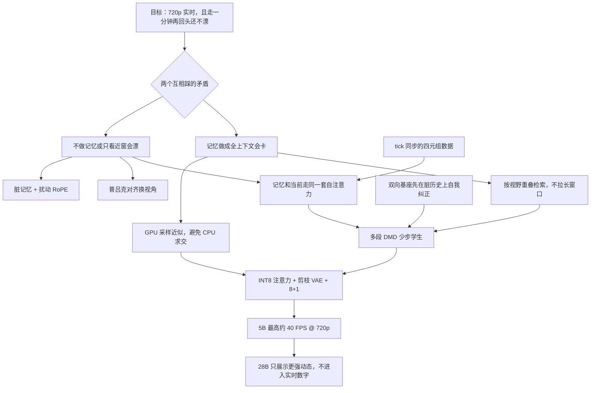

# 记得太全会卡，记不住会漂：Matrix-Game 3.0 只检索当前视角能看见的历史

<!-- release-date: 2026-03-27 -->

> 本文依据 Skywork AI 的 **Matrix-Game 3.0: Real-Time and Streaming Interactive World Model with Long-Horizon Memory**，即 arXiv:2604.08995v2（2026-04-13 修订），本地原件共 20 页、约 23MB。封面把项目页写成 Matrix-Game-3.0-Homepage。页码一律指这份本地 PDF 自身的页码。截至 2026-09-11 核验，arXiv 提交历史只有 v1（2026-04-10）和 v2，没有更新修订，因此未换件。
>
> 文中会明确区分三层：**报告写了什么**、**我们如何解释或推算**、**哪些是外部资料补充**。外部补充一律标出来源并给链接。
>
> 关于 `release-date`：取 2026-03-27。这一天官方 GitHub 放出 3.0 推理代码，Hugging Face 上 `Skywork/Matrix-Game-3.0` 的 5B 基座权重文件也已提交。arXiv v1 要到 2026-04-10 才上线，不回写。证据链见文末。
>
> 这篇只讲这份 20 页报告里的 Matrix-Game 3.0。2026-08 之后另有 Matrix-Game 3.5，那是论文之后的新工作，不混进下面的结论。

## 先把问题问对：记忆和实时为什么会互相踩

先不谈任何新名词。你手里有一个已经能被按键打断的世界模型。给它一张图、一句场景描述，再按 `W`，它会往前走一帧。短短几秒里，画面跟得上，风格也不跳。

现在做两件更狠的事。

第一件：走一分钟，再按原路走回来。门口那栋房子、墙上那块招牌，还在不在？

第二件：分辨率提到 720p，并且要求生成速度快到能当交互用，而不是离线渲染完再播。

现有开源系统很难两件同时成立。报告把卡点写得很干脆：已有方法仍然很难**同时**做到带记忆的长时一致，以及高分辨率实时生成（PDF p.1）。

站内已经有两篇把「可交互」拆开讲的解读。[Genie](/reports/Google/Genie) 问的是：没有动作标签，能不能从纯视频里学出一套按键。[LingBot-World](/reports/AntGroup/LingBot-World) 问的是：开源这边缺的不是再把画面画得更像，而是动作、分钟级记忆和实时要同时站住。Matrix-Game 3.0 问的是第三件事，而且把第三件事收得更窄：

> **记忆一旦做成「把历史全塞进上下文」，720p 实时就被拖垮；记忆一旦不做，走远再回头，世界就会漂。所以不能再靠加长窗口，得改成按当前相机去检索。**

报告自己点名了两条已经验证过、但仍差一口气的路（PDF p.2）：

- [Matrix-Game 2.0](https://arxiv.org/abs/2508.13009) 和 Hunyuan-GameCraft-2 用因果自回归少步扩散，做到了流式实时交互，但**没有**能撑住分钟级稳定的记忆机制；
- LingBot-World 靠拉长扩散模型的上下文，改善了长程几何一致，但把这种容量和真正的实时部署放在一起，仍然很难。

闭源对照是 Genie 3：大约 24 FPS、720p、能撑到分钟级，还有隐式记忆；但它不开源，训练配方和推理栈也不公开（PDF p.4）。本篇要做的，是把「长记忆 + 720p 实时」这组组合，写成一套能公开复现的共设计。

## 读之前：十个词先各用一句话说清

这一篇的行话大多不是 Matrix-Game 3.0 发明的，属于读材料的前置背景。

- **世界模型（World Model）**：给定已经看到的画面和这一步的动作，预测接下来世界长什么样。它和普通视频生成模型的差别只有一条：中途能不能接控制。
- **扩散 Transformer（Diffusion Transformer，DiT）**：先把画面加噪声，再让 Transformer 一步步去噪。本篇的主干就是这种去噪网络。
- **双向注意力与流式滚动**：双向是当前窗口里每个位置都能看见前后；流式滚动是一段生成完，把尾巴留下来当下一段的历史。本篇两边都要：主干保持双向，滚动靠多段自回归。
- **潜空间（latent）**：画面先被变分自编码器（VAE）压成更小的特征，模型在这组特征上工作，而不是直接画像素。
- **流匹配（flow matching）**：训练时让网络预测「从噪声走到干净画面」这条速度轨迹，而不是一次猜出最终画面。
- **曝光偏差（exposure bias）**：训练时看的是干净的真历史，推理时看的是自己刚生成的假历史。误差会一段一段叠上去。
- **分布匹配蒸馏（Distribution Matching Distillation，DMD）**：不让学生去模仿教师的每一步去噪，而是让学生的输出分布去贴数据分布，从而把很多步采样压成很少几步。
- **普吕克嵌入（Plücker embeddings）**：用一组坐标描写三维空间里一条射线的方向和位置。本篇拿它表示「当前视角相对某段记忆，几何上差在哪」。
- **视野锥重叠（field-of-view / frustum overlap）**：两台相机各自能看见的那一团空间，重叠越多，这段历史对当前画面越有用。
- **INT8 量化**：把一部分权重从高精度压成 8 位整数，算得更快、占显存更少，但要挑对层，不然画质会掉。

本篇自己反复使用、但没有当成新理论名词提出来的，是 **error buffer（误差缓冲）**、**camera-aware memory retrieval（相机感知记忆检索）** 和 **MG-LightVAE**。

## 一句话先说清

Matrix-Game 3.0 不是从零发明一种新的视频生成范式。它做的事情是：在 Matrix-Game 2.0 之上，把数据、模型和推理三面一起改，做成一个带记忆的交互世界模型，目标是 720p 实时长视频（PDF p.1）。

三面各自还一笔账：

- **数据**：工业级「无限」数据引擎，把虚幻引擎合成、3A 游戏自动采集和真实视频增强，收成带标注的 Video–Pose–Action–Prompt 四元组；
- **模型**：双向 DiT 先学会在不完美历史上自我纠正，再按相机检索历史帧，把记忆、近期历史和当前噪声帧放进**同一套自注意力**；
- **推理**：给双向学生做多段 DMD 蒸馏，再叠加 INT8、VAE 剪枝和 GPU 检索，5B 模型最高做到约 40 FPS。

所以最值得记住的不是某一个分数，而是这条工程判断：

> **长记忆不该等于「把过去全部留下来一起算」。先按视角挑出当前用得上的几帧，再让它们和眼前画面走同一条注意力，记忆才既撑得住、又跑得动。**

## 和站内已有的世界模型解读怎么分工

| | [Genie](/reports/Google/Genie)（初代） | [LingBot-World](/reports/AntGroup/LingBot-World) | 本篇 Matrix-Game 3.0 |
|---|---|---|---|
| 想解决的缺口 | 动作标注太贵 | 开源世界模型又慢、又短、动态又弱 | 长记忆和高分辨率实时互相踩 |
| 控制信号从哪来 | 从无标签视频里**学**出 8 个潜动作 | 游戏和虚幻引擎里**录**到的按键与相机 | 同样是录到的键盘、鼠标和相机位姿 |
| 长记忆怎么做 | 报告里没有外挂记忆 | 主要靠拉长上下文，记忆是窗口里长出来的 | **按相机检索历史帧**，再注入同一套自注意力 |
| 交付形态 | 一篇方法，未发权重 | 开源模拟器，Base 与 Fast 两档 | 5B 基座与蒸馏版开放；28B 只在报告里展示 |
| 这篇报告怎么提它们 | 相关工作里的 Genie / Genie 2 / Genie 3 | 点名：拉长上下文有效，但难和实时共存 | — |

对照要看清代际：本篇拿 **Genie 3** 当闭源上限（PDF p.4），站内那篇是初代 Genie。两者不是同一篇工作。

Matrix-Game 3.0 不需要解决 Genie 那个「没有动作标签」的问题。它的动作来自虚幻引擎的 tick 同步和 3A 游戏插件，是有标签的。**它要还的账是另一头：有了动作之后，能不能在 720p 上既记住一分钟前的场景，又快到可以实时按。**

报告没有像 LingBot-World 那样给一张「谁勾谁叉」的对照表。下面这张表是我们根据引言和相关工作的文字整理的，不是原文表格。

| 报告点名的系统 | 报告认为它站住了什么 | 报告认为它还缺什么 |
|---|---|---|
| Matrix-Game 2.0、Hunyuan-GameCraft-2 | 因果少步扩散，流式实时交互 | 没有分钟级记忆（PDF p.2） |
| LingBot-World | 拉长上下文，改善长程几何一致 | 这种容量很难和实时部署共存（PDF p.2） |
| RELIC 及更早的记忆库工作 | 相机感知 KV / 记忆检索，跨视角更稳 | 额外开销大，难接到高分辨率实时（PDF p.5） |
| Genie 3 | 约 24 FPS、720p、分钟级，还有隐式记忆 | 不开源，细节不清楚（PDF p.4） |

这是作者的定性归类。本篇后面的实验也**没有**给出和这些系统对打的画质分数，只有自己的定性回访图、加速消融和 VAE 重建表。

## 先看全景：数据、模型、部署必须一起改

报告把系统拆成四个互相咬合的部件（PDF p.5）：误差感知的交互基座、相机感知的长程记忆、训练—推理对齐的少步蒸馏、以及实时加速模块。Figure 2 把它们收成一条流水线：左边虚幻引擎产带动作和相机的长视频，中间带误差缓冲和记忆的 DiT 学习，右边少步采样、量化和剪枝把 5B 模型推到 720p@40FPS（PDF p.3）。

这张图根据 Figure 2（PDF p.3）重画，表达的是阶段依赖，不是实测耗时或 GPU 配比。

规模上，报告写了两档（PDF p.1、p.5、p.10）：

- **5B**：底座是 Wan2.2-TI2V-5B，动作模块加在前 15 个 DiT 块里，沿用 Matrix-Game 2.0 的接法；定量加速数字都在这一档。
- **2×14B / MoE-28B**：报告说更大模型能改善画质、动态和泛化；实验里只有第三人称定性图，没有开放权重，也没有加速表。

如果只看摘要，会以为 40 FPS 和分钟记忆是同一个 5B 蒸馏模型顺手得到的。往下读会发现：记忆先在多步基座上学会，再被蒸馏学生继承；40 FPS 则是蒸馏之后，再靠量化、剪枝和 GPU 检索叠出来的。两条因果链要分开讲。

## 第一笔账：按键、相机和画面必须在同一拍上

### 旧问题

Genie 3 证明：交互可控和记忆可以从大规模、标注精确的视频里学出来。但网上爬来的视频很少同时带「当时按了什么」和「相机在哪」；单一仿真器或单一游戏也覆盖不了需要的分布（PDF p.3）。没有这种四元组，后面的记忆检索根本没有几何真值可查。

### 新设计

数据引擎被写成三条互补的源，外加统一的标注和过滤（PDF p.3、p.11）。

**1. 虚幻引擎合成：Unreal-Gen。** 一千多个自制 UE5 场景，用 Nanite 几何和 Lumen 全局光照。核心原则是 **tick 级同步**：每一渲染帧 $t$ 在同一次引擎回调里同时记下（PDF p.11，式 12）

$$
\mathcal{D}_t = (I_t,\ p_t,\ r_t,\ c_t,\ \theta_t,\ a_t)
$$

- $I_t$：这一帧 RGB；
- $(p_t, r_t)$：角色的位置和朝向；
- $(c_t, \theta_t)$：相机的六自由度位姿；
- $a_t \in \{0,1\}^6$：离散动作向量。

报告强调：这样对齐误差是零，外部录屏做不到。旋转用双精度四元数，宣称亚度精度（PDF p.11）。

探索不是人开着玩。高层强化学习策略按覆盖率和场景丰富度选目标点，底层 NavMesh 规划无碰撞路径；再配方向覆盖、形状路线、多半径重试，以及位置增量、路径超时、包围盒三重卡住检测（PDF p.11）。相机在导航的同时做随机 yaw / pitch；角色被拆成上衣、裤子、鞋、头发、外套、帽子、配饰，按组合采样，报告写

$$
|C| = \prod_i |S_i| > 10^8
$$

也就是超过一亿种外观变体（PDF p.11）。流水线宣称零人工值守：每块 GPU 上并发多个 UE5 实例，云端同步，自动质检（重复帧、位置异常、不完整场景），一个人靠 webhook 看几十台采集机（PDF p.11–12）。

**2. 3A 游戏四层解耦录制。** 支持的游戏被点名为 GTA V、Red Dead Redemption 2、Palworld、Cyberpunk 2077、Hogwarts Legacy（PDF p.12）。四层是：

| 层 | 它干什么 |
|---|---|
| 游戏进程层 | 每个游戏独立进程，注入 agent 插件控角色、抽状态 |
| Agent 层 | NavMesh 探索 + 多状态机 + 八方向视角；每帧状态经 JSON 文件 IPC 导出，轮询 $<1$ ms |
| 录制协调层 | OBS 按 60 秒切片；用位移在相机局部坐标系上的投影，反推八方向 WSAD |
| 数据集输出层 | MP4 配每帧 CSV：六维动作、相机参数、完整位姿 |

WSAD 不是人标的。把位移投影到相机前向 $f$ 和右向 $r$ 上（PDF p.12，式 13）：

$$
f = (\cos\theta_{\mathrm{yaw}},\ \sin\theta_{\mathrm{yaw}}),\qquad
r = (\sin\theta_{\mathrm{yaw}},\ -\cos\theta_{\mathrm{yaw}})
$$

再按 $\langle \Delta p_t, f\rangle$ 和 $\langle \Delta p_t, r\rangle$ 分成八个方向。报告说这能消掉人工标注偏差；整体数据准确率超过 99%。加一款新游戏只需要实现 Agent 层（PDF p.12）。

**3. 真实视频。** 用来补光度变化和自然相机轨迹：DL3DV-10K（超过 10,000 条 4K、65 类兴趣点）、RealEstate10K（室内、静态、轨迹干净）、OmniWorld-CityWalk（YouTube 第一人称城市步行，相对位姿原先用 DPVO 估）、SpatialVid-HD（行人、开车、航拍，报告称是最大子集）。不管原数据集自带什么位姿，一律用 ViPE 重标，避免坐标系和表示不一致（PDF p.12）。

字幕跟 LingBot-World 的四层框架：叙事、静态场景、稠密时间、以及 0–10 分的感知质量（运动平滑、背景动态、场景复杂度、物理合理、总体）。标注模型是 InternVL3.5-8B。轨迹再过三道滤镜：深度重投影的局部几何、最大/中位位移比的全局异常、按中位速度去掉过慢和过快。阈值在虚幻真值上标定，再按数据集套用。和质量过滤合在一起，去掉 20% 原始数据（PDF p.12–13）。

Figure 7 是一条拼图：室内、街景、科幻、卡通、开车、骑马、第三人称角色，用来说明源很杂，不是一张数据配比图（PDF p.11）。**报告没有给出三类数据各占多少小时，也没有给出过滤后的总时长。** 后面训练只写记忆基座用了约 480 万条视频 clip（PDF p.13）。

### 收益和边界

收益是：记忆检索所依赖的相机几何、动作控制和外观多样性，被做成了可规模化的监督，而不是事后从网视频里猜。

代价也很清楚。这是一条工业采集流水线，不是一个开源数据集发布。插件注入商业游戏、自动探索、云同步，报告只描述架构，不给可复现的采集脚本或授权说明。3A 游戏名被点出来了，不代表这些录制数据会随模型一起公开。

### 对自己项目的启发

需要「动作和观测成对出现」时，优先保证**同一时钟采样**，而不是先把视频录下来再对齐。虚幻这条线把 RGB、角色、相机、动作锁在同一个 tick 里，后面所有几何检索才站得住。游戏录制把「人标 WASD」换成位移在相机坐标系上的投影，是另一条可复用的便宜监督。

## 第二笔账：基座必须先能在脏历史上自我纠正

### 旧问题

后面要做少步蒸馏。如果教师是双向多步模型、学生是因果少步模型，两边的输入输出对不齐，蒸馏会不稳。报告引用 Causal Forcing 的理论观点：异构师生会导致映射不匹配（PDF p.5）。更麻烦的是：推理时历史是自己生成的、带误差的；如果基座只在干净真历史上训过，教师给的蒸馏目标本身就不准。

### 新设计

两条原则（PDF p.5）：

1. **结构一致**：多步基座和少步蒸馏学生都用双向架构，避免师生结构异构，也降低基于常微分方程（ODE）的蒸馏成本。
2. **对不完美上下文鲁棒**：基座也必须在被污染的历史上训练，而不能只看干净真值。

Figure 3 把一段视频潜变量 $x^{1:N}$ 切成两截：前 $k$ 帧是过去，剩下 $N-k$ 帧是当前要预测的。当前这组加高斯噪声，两组拼起来送进双向 DiT，流匹配损失只加在当前帧上（PDF p.5–6）。

动作分成两种接法，沿用 Matrix-Game 2.0 和 GameFactory（PDF p.6）：

- **离散键盘**：单独的交叉注意力，管「往哪走、跳不跳、打不打」这类交互行为；
- **连续鼠标**：直接进自注意力，改当前视觉状态。

自我纠正跟 Stable Video Infinity（SVI）学。训练时维护一个误差缓冲 $\mathcal{E}$。先把网络输出还原成对应的干净估计 $\hat x^{i}$（由预测的流推出的 $x_0$），残差定义为（PDF p.6，式 1）

$$
\delta = \hat x^{i} - x^{i}
$$

所有残差推进 $\mathcal{E}$。下一步从缓冲里均匀抽样 $\delta$，去污染历史（PDF p.6，式 2）

$$
\tilde x^{i} = x^{i} + \gamma\delta
$$

$\gamma$ 控制污染强度。于是模型必须学会：历史已经脏了，仍然要给出对的当前帧。

训练时还有两种模式（PDF p.13）：以 0.8 的概率用 4 帧过去潜变量 + 10 帧当前噪声潜变量；否则把过去和记忆都掩掉，退化成带动作的图生视频，对应流式推理的第一段——参考潜变量加 14 帧当前噪声。学习率 $2\times 10^{-5}$，微调 5 万步。动作模块加在前 15 个 DiT 块。

### 收益和边界

这一步还不是记忆。它只是把「推理会看到自己的错」提前变成训练分布。没有它，后面无论检索来的记忆有多对，模型也只会在干净历史上工作。

报告没有给出 $\gamma$ 的具体取值，也没有单独消融「只训干净历史」和「加误差注入」的对比表。Figure 8 是 1 到 5 秒的定性控制：角色听键盘，背景不明显漂，镜头推进拉远和相机运动大致匹配（PDF p.14）。它证明的是短时可控，不是分钟记忆。

### 对自己项目的启发

如果下游一定要蒸馏到少步学生，教师不能活在一个学生永远进不去的干净世界里。把师生结构先对齐，再把学生推理时会遇到的脏上下文喂回教师，比事后用更大的蒸馏损失硬拉更对症。

## 第三笔账：记忆检索如何让长程不漂

这是全文最重要的一条因果链。

### 旧问题

流式生成时，当前预测不能只看最近几帧。走远再回头，空间布局、物体状态、外观身份都得对得上（PDF p.6）。报告先试了两条现成路，都不满意（PDF p.6–7）：

1. **隐式稀疏长上下文**（如 Mixture of Contexts）：按相似度检索 top-k 块。高噪声阶段相似度不可靠，记忆选择会抖，少步设定下更难收敛；训练时维持长上下文本身也贵。
2. **相机感知的外挂分支**：按相机检索历史，再用交叉注意力注入。检索是稳了，但多出来的记忆分支和主干特征对不齐，再层层重复注入，收敛慢；即便加上更早世界模型里的几何线索，收益仍然有限。

一句话：全看太贵且不稳，外挂一条记忆通路又学不进去。

### 新设计：检索、同空间注意力、几何、再加脏记忆训练

报告改成四件事绑在同一个 DiT 里（PDF p.7–8）。

**第一，联合自注意力，而不是外挂记忆。** 检索来的记忆潜变量、时间上对齐的近期历史（past frames）、以及当前带噪声的预测帧，被放进**同一套注意力空间**。模型只预测当前帧；记忆和历史作为条件一起参与去噪。Figure 4 画的就是三组帧一起进 DiT，右边仍接鼠标键盘（PDF p.7）。

这样分工是：

- 近期历史负责短时连续——脚下一步别跳；
- 检索记忆负责更远的锚——场景布局、物体状态、视觉身份；
- 因为走的是同一条主干，记忆特征和预测特征一起演化，比单独养一条记忆通路更适合流式滚动。

**第二，按相机和视野重叠检索，再加相对普吕克编码。** 长滚动里视角会频繁变，不是所有历史都有用。所以只把和当前相机位姿、视野重叠相关的历史送进来（PDF p.7–8）。推理时还可以选择把序列第一帧潜变量留下当 **sink latent**：它不负责某个具体视角，而是给整段滚动一个粗的场景风格和外观统计锚，补检索帧偏「当前看得见什么」的不足（PDF p.8）。

检索之后，当前目标和被选中记忆之间的相对相机几何，用普吕克风格的线索显式编码。目的是让模型知道「同一块场景，换一个角度看应该怎么对齐」，减少把历史信息用错视角的倾向。

**第三，误差注入覆盖记忆，而不只覆盖最近历史。** 训练时记忆和历史都来自真视频；推理时它们来自已经生成的帧，一定带累计误差。如果只在干净记忆上训，检索通路会在推理时失效。于是误差缓冲改成共享的：记忆、近期历史、当前预测的残差都往同一个 $\mathcal{E}$ 里扔（PDF p.8，式 4–5）：

$$
\tilde x^{1:k} = x^{1:k} + \gamma_h\delta,\qquad
\tilde m^{1:r} = m^{1:r} + \gamma_m\delta
$$

$\gamma_h$ 和 $\gamma_m$ 分别管历史和记忆的污染强度。对应的训练目标在条件里同时看到被污染的历史、被污染的记忆、动作 $c$ 和几何 $g$（PDF p.8，式 6）。模型要学的是：从已经脏了的记忆里把有用的布局和外观抠出来，而不是假设记忆永远是真的。

**第四，给 RoPE 加上「真正的时间」和「打破周期」的扰动。** 普通旋转位置编码（RoPE）在当前段内给相对位移。长滚动里，一段很久以前的记忆和当前帧，可能因为周期性对上号，模型会误以为它们在时间上很近，进而原样抄像素。报告做了两件事（PDF p.8）：

- 把每条记忆、历史、预测潜变量在**全序列里的原始帧号**写进时间 RoPE，让模型分得清「刚才」和「很久以前」；
- 训练时对每个注意力头扰动 RoPE 的基频（PDF p.8，式 7）

$$
\hat\theta_h = \theta_{\mathrm{base}}(1 + \sigma_{\theta}\epsilon_h)
$$

$\epsilon_h$ 随头变化，$\sigma_{\theta}$ 控制幅度。不同头用不同有效基频，周期同步被打破，远距记忆更不容易被当成当前位置的副本。

实现上，$\epsilon_h$ 在各头之间线性排开，$\sigma_{\theta}$ 固定为 0.8；这个扰动训练和推理都开。灵感来自 LoL 的 multi-head RoPE jitter（PDF p.13）。训练时拼接的是 **5 帧记忆 + 4 帧过去 + 10 帧当前噪声**（PDF p.13）。

Figure 5 是一张帧级自注意力热力图：把所有 DiT 块、所有去噪步、帧内所有 token 平均之后，聚合成帧与帧之间的权重。被选中的记忆在时间上离当前预测很远、RoPE 相位差很大，但注意力并没有被压没；有几处记忆得分甚至和预测帧之间的近旁非对角交互相当（PDF p.7–8）。报告用它说明：时间编码改完之后，远距记忆仍然进得去，而不是只剩一个摆设。

### 这条链为什么能让长程不漂

把机制收成因果，而不是名词清单：

关键不是「模型变记得更牢」这种空话。它是：**当前这一步只被允许看见几何上相关的过去；这些过去和眼前画面在同一套注意力里对齐；训练时这些过去还被故意弄脏。** 所以走一圈再回来，模型不是靠短时平滑「猜一个像的」，而是把当时看见的那几帧又找回来用。

Figure 9 专门测这件事。每一行是均匀抽样的滚动；第一帧是输入图，**后半段动作是前半段的逆**，强迫相机回到已经走过的区域。成功重建不能用短时连续解释。红框标出的局部几何、物体摆放、立面图案、纹理，在返回相位被找回来（PDF p.13–15）。蒸馏模型的 Figure 11 用同样思路：故意设计会回访若干视点的动作序列；被挡住后又出现的内容能复现，后段风格也没有明显漂（PDF p.14、p.16）。

### 代价和没写清的地方

检索是帧级的：一次取回的是整帧潜变量，不是当前可见的那几块补丁。选多少帧、推理时如何从不断变长的候选集里维护那 5 个训练槽位，报告只写了训练拼接 5 帧记忆，以及推理按视野重叠打分。式 9 写的是每个查询视角取重叠最高的一帧（PDF p.10），没有再给完整的批处理伪代码。

$\gamma_h$、$\gamma_m$ 的取值没有给。记忆机制也没有一张「去掉检索 / 去掉普吕克 / 去掉误差注入 / 去掉 RoPE 扰动」的定量消融，证据主要是回访定性图和一张注意力热力图。

### 对自己项目的启发

任何「既要长期记、又要当前快」的系统，都可以问三个问题：当前这一步真正需要哪些历史？这些历史和当前状态能不能走同一套计算，而不是另开一条对不齐的通路？训练时用的历史，是不是推理时那种已经脏了的历史？日志系统、长视频、带地图的机器人，问法是一样的。

## 第四笔账：如何还能 40 FPS

记忆检索如果算得很重，前面那条链会把实时直接踩死。报告把速度拆成「先蒸馏成少步，再把三处系统瓶颈削掉」。

### 旧问题

现成蒸馏多半把学生做成因果、按块推理，学生窗口天然能滚到教师窗口那么长。本篇师生都是双向的：学生一次看的是整窗，不再是一块。如果只用单窗、再用真帧当历史，训练和真实推理又错位，曝光偏差回来了（PDF p.9）。

即便蒸馏到少步，720p 流式还有三处硬开销：DiT 注意力、VAE 解码、以及每一步都要做的记忆检索。候选集随迭代变长，检索本身会变成新瓶颈。

### 新设计一：双向学生的多段自生成蒸馏

Figure 6 把学生推理画成多段滚动（PDF p.9）：

- 每一段从随机噪声起步；
- 当前段的过去帧，取上一段的尾巴；
- 记忆从在线更新的记忆池里，按当前相机取；
- 第一段还没有记忆，走图生视频；
- 训练时随机停在某一段，把这一段交给教师和判别器（critic）做 DMD。

DMD 最小化的是采样时刻 $t$ 上，数据分布和学生分布之间的反向 KL。梯度用两个分数函数的差来近似（PDF p.9，式 8）：一个是数据分数 $s_{\mathrm{data}}$，一个是学生侧分数 $s_{\mathrm{gen},\xi}$。条件里带着过去帧、动作 $c$ 和记忆 $M$。

这样学生在训练时就已经在「自己生成的历史 + 自己检索的记忆」上走少步，而不是在真帧上走捷径。

配方（PDF p.13）：教师、critic、学生都从记忆增强基座初始化。先做 600 步冷启动，单段、过去帧用真值，避免少步学生一开始就在多段上崩；学生学习率 $5\times 10^{-7}$，critic $1\times 10^{-7}$，每轮学生更新 5 次。随后切到多段，段数 $k$ 每轮从 1 到 6 均匀抽，两边学习率都是 $1\times 10^{-7}$，学生每轮更新 3 次，共 2400 步。和基座一样，过去帧和记忆以 0.2 的概率被掩掉。

### 新设计二：三处加速，缺一不可

蒸馏之后再叠三刀。异步部署是 **8 张 GPU 跑 DiT，1 张 GPU 专跑 VAE 解码**，整条流水线最高约 40 FPS（PDF p.9–10）。H 系列用 FlashAttention 3，A 系列用 FlashAttention 2。单机 7+1 会稍慢，结论不变（PDF p.16）。脚注感谢 Reactor 提供加速基础设施（PDF p.9）。

**DiT 的 INT8。** 只量化注意力投影层，FFN、VAE、文本编码器保持原精度。算子改编自 LightX2V。不是全模型量化（PDF p.10）。

**VAE 剪枝：MG-LightVAE。** 高分辨率流式里，DiT 变快之后，解码会变成主瓶颈。做法是跟 LightX2V 的同构解码器：结构不变，减小解码器隐藏维度。训练流程改编自 Turbo-VAED，数据是 70 万条 17 帧 clip，来自附录描述的游戏和真实场景混合。两个剪枝比：50% 和 75%，解码加速分别写成 $\times 2.6$ 和 $\times 5.2$。另外，第一次迭代之后对解码器做 `torch.compile`，降低后续延迟（PDF p.10）。

要注意：这份 20 页 PDF **没有附录**。VAE 那 70 万条的具体构成，原文写「described in the appendix」，本地原件里找不到。

**GPU 上的记忆检索。** CPU 版用视锥体积交的精确重叠（PDF p.10，式 10）

$$
s_{\mathrm{exact}}(i,j)=\frac{\mathrm{Vol}\bigl(\mathcal{F}(E_i)\cap\mathcal{F}(E_j)\bigr)}{\mathrm{Vol}\bigl(\mathcal{F}(E_i)\bigr)}
$$

准，但贵。GPU 版改成采样近似（PDF p.10，式 11）：在查询视锥里撒 $N$ 个点，看有多少落进候选帧的视锥，避免显式三维求交。候选集随迭代变长，精确求交的成本跟着涨；近似排序仍然按几何重叠，所以长滚动时 GPU 版划算得多。

### 数字：40 FPS 是三刀叠出来的，检索是最大那一刀

Table 1 的设定是：**75% VAE 剪枝的完整推理**，再分别拿掉一个组件（PDF p.16）：

| 配置 | FPS | 相对完整配置掉了多少 |
|---|---:|---:|
| Full | $\sim$40 | — |
| 去掉 INT8 | 27.38 | 12.62 |
| 去掉 MG-LightVAE | 25.79 | 14.21 |
| 去掉 GPU 检索 | 6.60 | 33.40 |

读这张表时有一个容易滑过去的细节：**记忆检索如果退回 CPU 精确求交，帧率会从约 40 掉到 6.60。** 比去掉量化或去掉轻量 VAE 惨得多。也就是说，前面那套「按相机检索历史」如果实现得笨，根本撑不起 720p 实时；40 FPS 不是蒸馏单独换来的。

报告还写 H 系列在同一并行设置下吞吐量高于 A 系列，但没有把两档的绝对 FPS 分成两行。

Table 2 在 17 帧、720×1280 的小测试集上比重建（PDF p.17）：

| 模型 | PSNR ↑ | SSIM ↑ | 编码+解码 (s) ↓ | 仅解码 (s) ↓ |
|---|---:|---:|---:|---:|
| Wan2.2 VAE | 33.79 | 0.99 | 0.99 | 0.76 |
| MG-LightVAE（50% 剪枝） | 31.84 | 0.99 | 0.52 | 0.30 |
| MG-LightVAE（75% 剪枝） | 31.14 | 0.99 | 0.35 | 0.13 |

SSIM 三行都是 0.99，区分度几乎只在 PSNR 和耗时。50% 剪枝把 PSNR 从 33.79 降到 31.84，解码从 0.76 秒降到 0.30 秒；75% 再降到 31.14，解码 0.13 秒。Figure 12 只展示 50% 剪枝：主结构还在，细纹理有损失（PDF p.17）。Table 1 的约 40 FPS 用的是 75% 这一档，画质代价更大。正文写的解码加速 $\times 2.6$ / $\times 5.2$，和表里 `0.76/0.30`、`0.76/0.13` 并不完全同一口径，以后者为表内实测，前者为 3.4 节的概括说法。

### 这条链为什么还能实时

因果上要记住两句。第一句：双向模型要流式，不能只蒸馏单窗，必须让学生滚多段，否则脏历史从未进过蒸馏。第二句：记忆模块的几何检索必须和生成一样走 GPU；否则记忆这一功能本身就会把实时打回个位数帧率。

### 对自己项目的启发

加速表比口号有用。如果一项新能力（检索、重排、工具调用）的代价会随时间线性涨，先做「近似排序是否保住相对名次」的消融，再谈端到端实时。本篇 GPU 检索保住的是几何重叠的排序，不是精确体积。

另外，40 FPS 写的是 8+1 异步，不是单卡。讨论「实时」时要把并行宽度一起报，否则无法迁移到自己的机器。

## 第五笔账：28B 只回答「更大是否更像世界」，不回答实时

报告说受到 LingBot-World 启发，在 MoE-28B 骨干上做放大，改善泛化、动态和长程一致（PDF p.10）。和 LingBot 不同的是，他们观察到：**只在高噪声模型上训动作模块就够做精确控制**；低噪声模型可以不接动作，专门修细节。于是高噪声用带准确动作的数据，低噪声用互联网视频。第一人称和第三人称动态很难一起建模，所以训两个高噪声模型、共享一个低噪声模型。分辨率和 clip 长度逐步加大（PDF p.10–11）。

Figure 10 是 28B 的第三人称定性：开车、骑马、夜间、开放世界走动，布局、身份、物体关系在 0 到 30 秒的抽样里看起来稳，动作也更活（PDF p.14–15）。分钟级生成被写成 MoE-28B 的目标，用来填短 clip 和叙事长视频之间的缝（PDF p.11）。

这里必须停住。报告没有给 28B 的 FPS、步数、显存或和 5B 的并排分数。Hugging Face 当前仓库里能下到的是 5B 基座和 5B 蒸馏，没有 28B。**不能把 40 FPS 安到 28B 头上，也不能把 Figure 10 的观感安到 5B 头上。**

## 实验实际证明了什么，什么只是作者观察

被实验直接撑住的，范围其实很窄。

- **短时可控**：Figure 8，5 秒内角色和镜头跟动作走，背景不明显漂（PDF p.14）。
- **回访记忆**：Figure 9 用「后半段动作取逆」强迫回到旧视点，红框细节能对上；蒸馏版 Figure 11 继承了这一行为（PDF p.15–16）。这是记忆机制最硬的定性证据。
- **加速来源**：Table 1 证明约 40 FPS 是 INT8、LightVAE、GPU 检索一起叠的，GPU 检索贡献最大（PDF p.16）。
- **VAE 代价**：Table 2 和 Figure 12 证明剪枝换速度、掉 PSNR（PDF p.17）。

没有被撑住、但作者写进了结论的：

- 「分钟级序列上保持稳定的记忆一致性」（PDF p.1、p.17）。Figure 1 的时间轴画到 60 秒，Figure 9/11 的抽样到 30 秒；没有一条随时间变化的定量曲线（例如回访 PSNR、相机轨迹误差、物体恒存率）。
- 「28B 进一步改善画质、动态和泛化」（PDF p.1）。只有 Figure 10 的观感。
- 对 Genie 3、LingBot-World、RELIC 的全面追平。相关工作是文字对比，实验部分没有它们。

训练数据规模只出现一次：记忆基座约 480 万条 clip（PDF p.13）。没有 GPU 小时、没有 token 数、没有三类数据配比。

## 限制、未公开信息和不要补进去的东西

报告没有独立的 Limitations 节。结论里的未来方向等于把缺口写在明处：继续放大模型和数据、为更高分辨率和更长序列做更高效结构、探索更强的记忆机制（PDF p.17）。

结合正文，下面这些是读完必须留下的边界，而不是吹毛求疵。

- **40 FPS 的硬件宽度是 8+1**，Table 1 还固定在 75% VAE 剪枝。单卡、50% 剪枝、7+1，报告只说「稍慢」，不给数。
- **少步的具体步数，PDF 没写。** 只说 few-step。外部 README 和项目页写成 3 步，那是外部补充，不能冒充报告原文。
- **28B 权重未随 5B 一起成为可下载对象。** 报告展示的是能力上限，不是可部署配置。
- **没有与开源/闭源世界模型的定量对表。** 画质主张主要靠定性图。
- **记忆是帧级检索，不是三维补丁检索。** 一次取回整帧。更细的几何记忆是后作的事，不写进这篇的能力。
- **数据引擎不可复现。** 游戏名、虚幻场景数、准确率 99%、过滤掉 20%，都没有伴随发布的数据集。
- **附录缺失。** VAE 训练数据「见附录」，20 页原件到参考文献为止。
- **不要把 Matrix-Game 2.0 网页上的帧率、分辨率或数据小时数补进本篇。** 这份 PDF 只说 2.0 做到了流式实时、缺记忆，没有复述 2.0 的数字。

## 最值得带回自己项目的七条启发

### 1. 记忆带宽要按当前查询切，不要按历史长度切

当前相机只需要和自己视野重叠的过去。日志检索、代码库问答、带地图的机器人，都可以先做「这一步看得见什么」，再决定取哪几条记忆。

### 2. 记忆特征和当前特征最好走同一套计算

外挂交叉注意力看起来解耦，报告里的教训是收敛慢、对不齐。能放进同一自注意力空间时，先试联合建模。

### 3. 检索到的记忆也要按「已经脏了」来训

训练用真帧记忆、推理用生成帧记忆，是一条新的训练—推理缝。误差缓冲往记忆通路上灌，比只污染最近窗口更对症。

### 4. 周期性位置编码会让远距记忆假对齐

绝对时间戳加上按头扰动基频，是便宜的防抄像素手段。任何把很老的状态和当前状态放进同一 RoPE 的模型都可以问：会不会因为周期对上号而误抄。

### 5. 师生结构先对齐，再谈少步

双向教师配因果学生，省了推理却把蒸馏搞难。本篇宁愿学生也保持双向、用多段滚动模拟流式，也不先改注意力方向。

### 6. 新功能的代价要单独消融到帧率

Table 1 把 GPU 检索证明成最大瓶颈。加记忆、加重排、加工具，都该有「去掉它掉多少吞吐」这一行，而不是只报完整系统的峰值。

### 7. 控制和观感可以拆到不同噪声段、不同数据

28B 那一节把动作交给高噪声、把互联网视频交给低噪声，第一/第三人称再拆高噪声专家。当带标签的动作数据远少于无标签视频时，这是一条比「全部数据混在一起全量微调」更省的分工。

## 用一张图重新串起全文

## 关键词回看

- **Video–Pose–Action–Prompt 四元组**：一帧画面配位姿、动作和文本，记忆检索和动作控制的共同监督。
- **tick 级同步**：虚幻引擎同一回调里记下全部字段，对齐误差为零。
- **误差缓冲**：把预测残差存下来，再随机加回历史和记忆，模拟推理时的脏上下文。
- **相机感知检索**：按位姿和视野重叠挑历史帧，而不是按像素相似度或把全部历史留下。
- **联合自注意力**：记忆、近期历史、当前噪声帧共享一套 DiT 注意力。
- **sink latent**：可选的第一帧锚，管全局外观，不管某个具体视角。
- **相对普吕克编码**：告诉模型当前相机相对某段记忆差在哪。
- **头间扰动 RoPE**：打破位置编码周期，降低远距误抄。
- **多段 DMD**：双向学生滚多段，在自生成历史和在线记忆上做分布匹配。
- **MG-LightVAE**：只瘦解码器隐藏维的轻量 VAE；Table 1 的 40 FPS 用 75% 剪枝。
- **GPU 视野采样**：用点是否落在视锥里近似体积交，否则检索会把帧率打到个位数。

## 最后的判断

Matrix-Game 3.0 最强的叙事不是「我们把世界模型又画快了一点」，而是：**它拒绝在「加长上下文」和「丢掉记忆」之间单选题，改成按当前视角检索，再让检索结果和眼前画面走同一条注意力，并且把检索本身做成 GPU 上的近似排序。**

被实验撑住的，是回访旧视点时细节能对上，以及 5B 在 8+1、75% VAE 剪枝下约 40 FPS 的来源分解。没有被撑住的，是对 Genie 3 或 LingBot-World 的全面定量追平，以及 28B、分钟级一致性的曲线化证明。

它也把工程边界写得很硬：记忆功能如果用 CPU 精确几何来实现，实时就不存在；VAE 要剪到 75% 才能进那张 40 FPS 的表；更大的 MoE 只作为画质上限出现。正因为这些限制被看见，这份报告才更适合当作「记忆和实时如何共设计」的材料，而不是当作已经结束的帧率竞赛。

如果只记一句话，可以记：

> **长记忆不是把过去全部留下；是当前这一眼只取出当时看见过的那些帧，并且训练时就假设这些帧已经脏了。**

## 资料与阅读边界

- 原始依据：本地 `papers/Skywork/Matrix-Game-3.0.pdf`，arXiv:2604.08995v2，2026-04-13 修订，20 页。官方页：[arXiv abs/2604.08995](https://arxiv.org/abs/2604.08995)。提交历史为 v1（2026-04-10 06:00:09 UTC，22462 KB）与 v2（2026-04-13 03:48:38 UTC，22462 KB）；截至 2026-09-11 没有 v3，本地原件页数、标题与 v2 一致，未换件。
- 项目页：[matrix-game-v3.github.io](https://matrix-game-v3.github.io/)。PDF 封面写的是 Matrix-Game-3.0-Homepage，实际解析到这个地址。项目页把蒸馏模型写成 3-step，PDF 正文只写 few-step，**3 步是外部补充**。
- 推理代码：[SkyworkAI/Matrix-Game](https://github.com/SkyworkAI/Matrix-Game) 的 `Matrix-Game-3/`。官方 README News 写 `March 27, 2026: We released Matrix-Game-3.0`。首次放入 3.0 推理代码的提交是 [`134804b`](https://github.com/SkyworkAI/Matrix-Game/commit/134804b50684d53153526ba78dcfabcc5d5f44a0)，时间为 2026-03-27T04:49:52Z。子目录 `LICENSE.txt` 为 Apache 2.0；仓库根 `LICENSE` 仍是系列共用的 MIT。这些许可证来自 GitHub，不是 PDF 原文。
- 首发权重：[Skywork/Matrix-Game-3.0](https://huggingface.co/Skywork/Matrix-Game-3.0)。按本模块约定，**不用** Hugging Face `createdAt`（2026-03-27T03:23:47Z）当首发日。权重文件提交时间：`MG-LightVAE.pth` 于 2026-03-27T05:43:50Z 上传，`base_model/` 于 2026-03-27T05:57:42Z 上传。蒸馏权重 `base_distilled_model/diffusion_pytorch_model.safetensors` 迟到 2026-04-28T10:58:03Z，不回写家族首发日。核验时可见文件为 5B 基座、5B 蒸馏、两份 LightVAE 和 Wan2.2 VAE / T5，**没有 28B**。卡片许可证 Apache-2.0。
- **`release-date` 取 2026-03-27。** 理由：3.0 是可下载的开源模型，按流程取官方 Web / 权重 / 代码中最早可公开使用的一天。GitHub 推理代码与 HF 基座权重都在这一天，早于官方账号 2026-04-01 的宣传帖和 2026-04-10 的 arXiv v1。后续论文上传、蒸馏权重补齐、本站写稿都不回写。
- 底座来源（报告点名、实现细节以对方仓库为准）：[Wan-Video/Wan2.2](https://github.com/Wan-Video/Wan2.2) 的 TI2V-5B。
- 报告点名的前作与对照，阅读时不要把对方数字写进本篇结论：[Matrix-Game 2.0](https://arxiv.org/abs/2508.13009)、[LingBot-World](https://arxiv.org/abs/2601.20540)、[Genie 3](https://deepmind.google/discover/blog/genie-3-a-new-frontier-for-world-models/)、[RELIC](https://arxiv.org/abs/2512.04040)、[LightX2V](https://github.com/ModelTC/lightx2v)、[SVI](https://arxiv.org/abs/2510.09212)、[Self-Forcing](https://arxiv.org/abs/2506.08009)。
- 论文之后、不计入本篇模型能力的官方事件：Matrix-Game 3.5（arXiv:2608.29910，2026-08-30）把帧级记忆改成补丁记忆，并在相关工作里把 3.0 概括为「按相机位姿和视野重叠检索整帧」。那是后作，不能用来改写这篇的机制或数字。
