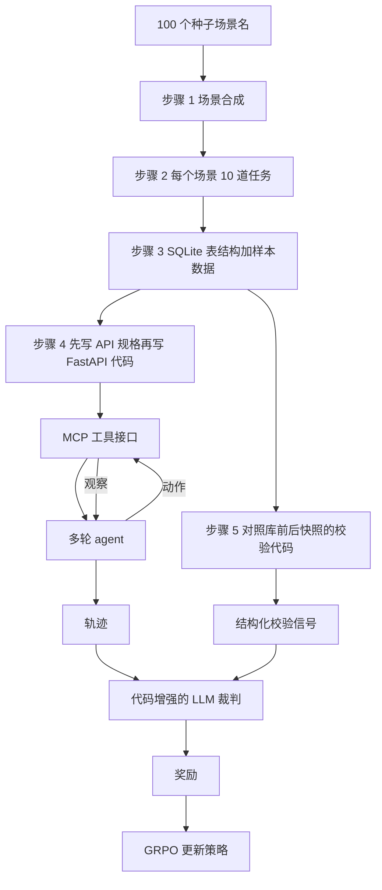

# Agent World Model：真实 API 撑不起 agentic RL，所以用代码和数据库造一千个可执行世界

<!-- release-date: 2026-02-10 -->

> 本文依据 **Agent World Model: Infinity Synthetic Environments for Agentic Reinforcement Learning**，即 arXiv:2602.10090v3、`arXiv:2602.10090v3 [cs.AI] 22 May 2026`、共 43 页的 ICML 2026 录用稿。本地原件在 `papers/Snowflake/Agent-World-Model.pdf`。八位作者中，Zhaoyang Wang、Siwei Han、Huaxiu Yao 来自 UNC Chapel Hill，Canwen Xu、Boyi Liu、Yite Wang、Zhewei Yao、Yuxiong He 来自 Snowflake；Huaxiu Yao 与 Yuxiong He 并列末位通讯，Zhaoyang Wang 的工作完成于 Snowflake 实习期间，通讯作者是 Canwen Xu（PDF p. 1）。页码均指 PDF 本身的页码。文中会明确区分「论文明确写了什么」「本文如何解释它」和「外部资料补充」。
>
> **不要和 ByteDance 的 Agent-World 搞混。** 本站索引里紧挨着还有一篇 ByteDance 的 Agent-World（原件 `papers/ByteDance/Agent-World.pdf`），那是字节 Seed 与人大合作的「规模化合成真实环境、再让 agent 自我演化」。本篇是 Snowflake 与 UNC 的 **Agent World Model（AWM）**：从场景名出发，用代码和 SQLite 合成一千个 MCP 工具环境，专门给多轮工具使用的强化学习当训练场。两篇题目只差一个词，做法、归属和评测都不一样。

## 读之前需要的最少背景

这篇论文假设你已经知道：语言模型可以调用工具，多轮交互可以做成强化学习。如果不熟，先记住下面这几件事就够了。

**工具使用（tool-use）**：模型不是只生成一段文字交差，而是按约定格式发出一次函数调用，环境执行后再把结果送回来。多轮任务里，模型要先查、再改、再确认，中间每一步都依赖上一步的观察。

**MCP（Model Context Protocol，模型上下文协议）**：Anthropic 在 2024 年提出的一套工具接口约定。AWM 把每个合成环境做成一个 MCP 服务器，agent 不直接碰数据库，只通过工具调用读写（PDF p. 2–4）。

**POMDP（Partially Observable Markov Decision Process，部分可观察马尔可夫决策过程）**：强化学习里对环境的标准写法。AWM 给每个环境 $E_i$ 配了五件套（PDF p. 3）：

- 状态空间 $S_{E_i}$：数据库里现在有什么；
- 动作空间 $A_{E_i}$：能调用哪些工具；
- 观察空间 $O_{E_i}$：工具返回什么；
- 转移函数 $T_{E_i}: S_{E_i}\times A_{E_i}\rightarrow S_{E_i}\times O_{E_i}$：一次调用怎样改库、怎样回观察；
- 任务奖励 $R_\tau$：这条用户任务算不算完成。

**CRUD**：Create / Read / Update / Delete，增删改查。AWM 故意只收「状态会变」的应用（电商、CRM、订票），不收新闻站、百科这类只能读内容的场景（PDF p. 3、15）。

**GRPO（Group Relative Policy Optimization，组相对策略优化）**：不另训一个价值模型，而是对同一道题采样一组轨迹，用组内相对分数当优势。出处见本站 [DeepSeekMath 解读](/reports/DeepSeek/DeepSeekMath)。AWM 的训练跑在 AgentFly 与 verl 上；verl 的框架论文见 [HybridFlow 解读](/reports/ByteDance/HybridFlow)（PDF p. 6、17）。

**LLM-as-a-Judge（用大模型当裁判）**：任务结束后，再让一个模型看完整轨迹并打分。AWM 不让它空手判断，而是先跑一段对照数据库前后快照的校验代码，把结构化信号塞给裁判（PDF p. 4）。

## 一句话先说清

这篇论文要解决的矛盾很具体：**想用强化学习把语言模型练成会多轮用工具的 agent，训练场本身比算法更稀缺。**

真实 API 不能让你稳定地刷几千次：很多场景根本不公开接口，一次训练还要并行上千个互不干扰的实例，还得能瞬间重置（PDF p. 1）。人写的环境又太少，$\tau^2$-bench 只有 3 个环境，TheMCPCompany 只有 5 个（PDF p. 1）。让另一个大模型扮演环境，每一步都要再调一次模型，既贵，又会在状态转移上幻觉（PDF p. 1–3）。

AWM 给的答案不是再去爬一批真实 API，而是把环境当成软件来合成：

> **先写用户会做什么，再为这些事设计数据库，再为数据库暴露工具，最后用库的前后差分给奖励。状态不在模型脑子里，在 SQLite 里。**

流水线扩到 1,000 个可执行环境、35,062 个工具、10,000 道带校验代码的任务（PDF p. 3）。训练只发生在这些合成环境上，评测却拿到三个分布外基准：BFCLv3、$\tau^2$-bench、MCP-Universe（PDF p. 6–7）。论文的主张是：代码驱动、数据库托底的状态转移，比大模型模拟的环境更稳、更快，而且能泛化到没见过的真实工具协议。

## 全景：一个环境是怎样被造出来、又怎样被拿去训练的

这是根据 PDF p. 3 的 Figure 2 重画的**机制示意图**，不是实测时间轴。箭头表示合成顺序和训练时的数据依赖。论文把这条链比作模型强化学习里的世界模型，但动力学不是神经网络，而是可执行代码（PDF p. 2）。

读完全文之后会发现，五个步骤不是平行的五个模块，而是一条因果链：**任务决定库里必须有哪些实体，库决定工具能改什么，工具执行才产生可对照的状态差，状态差才让奖励不靠模型瞎猜。** 缺任何一环，后面的 RL 都会拿到错信号。

## 第一层矛盾：三种现成训练场，没有一种撑得起大规模多轮 RL

论文第 1、2 节把现有做法拆成三条路，每一条都卡在 RL 真正需要的东西上。

### 路一：真实环境。稳，但刷不起

RL 需要 agent 在同一套规则里交互成千上万次，并且能并行、能重置（PDF p. 1）。真实世界做不到这件事：接口常常不公开，调用有配额，状态被别的用户改掉，失败还可能产生真实损失。人手工搭的评测环境更是数量级不对：$\tau^2$-bench 3 个环境，$\tau$-bench 2 个，MCP-Universe 11 个真实 MCP 服务器（PDF p. 1、5，Table 3）。它们适合当考场，不适合当训练场。

### 路二：只合成任务和轨迹，环境当成已经存在

Self-Instruct、ToolLLM、各种轨迹合成，能做出很多「看起来像在用工具」的示范（PDF p. 2）。问题是环境本身没有被合成：工具返回要么是写死的，要么是另一个模型编的。agent 不能探索「如果我换一个参数会怎样」，也收不到真正由状态变化给出的反馈。这类数据能做监督微调，很难做在线 RL。

### 路三：让大模型扮演环境。能扩，但不一致

每一步都提示一个推理模型，让它生成下一项观察和下一份状态（PDF p. 3）。论文指出两个硬伤：状态转移会幻觉；每一步都要再付一次推理成本（PDF p. 1、3）。对需要大量交互的 RL，这既贵又不稳。

同期还有一批用代码合成环境的工作。论文点名 DeepSeek-V3.2 和 Qwen Tongyi 也做了环境合成（后者用于 SFT 而非 RL），但都没有公开流水线或环境（PDF p. 2）。AutoEnv 做了 36 个偏游戏的环境；EnvScaler 在已有任务集上合成了 191 个交互环境；AutoForge 依赖工具文档，而且代码和环境都没公开（PDF p. 3、5）。AWM 给自己划了三条差别（PDF p. 3）：

1. 从场景名白手起家，不假设已有任务集或 API 文档；
2. 用数据库管状态，才能做代码增强的校验；
3. 规模到 1,000 个环境、三万多个工具，是当时公开可拿到的最大一套。

**这三句话就是全文的动机。** 后面所有设计，都是在回答：怎样让合成环境既可执行，又状态一致，还便宜到能并行起 1,024 个实例。

## 核心设计一：按软件工程的顺序拆环境，而不是让模型一次性写出三千行代码

论文说，AWM 镜像的是真实软件怎么被做出来的（PDF p. 2）。这句话值得当真，因为它决定了合成顺序，也解释了为什么不能「直接让模型写一个环境」。

预实验里，一个环境可能超过 3,000 行代码；对三十多个工具直接生成，接口很容易自相矛盾（PDF p. 4、15）。所以他们把 POMDP 的五个组件拆开，每一步只让模型写自己那一层，写完就跑，跑失败就把报错喂回去。

### 步骤 1：场景。只要名字，不要文档

从 100 个流行网站名出发，用 Self-Instruct 式扩展生成新场景（PDF p. 3、15）。种子来自 SimilarWeb 的热门站点列表（PDF p. 15 脚注 1）。过滤器有三条：

- 一个分类器只留下适合 CRUD 的有状态应用，新闻、百科这类以内容为主的场景被丢掉；
- 用嵌入余弦相似度 0.85 做去重；
- 给电商这类热门类目加上限，防止一千个环境塌成同一种店（PDF p. 3、15）。

结果是 1,000 个场景，覆盖金融、出行、零售、社交、工作流、用户管理等（PDF p. 3）。附录 Figure 6 给出类目标签分布：Analytics 与 Workflow 各 8.6%，E-commerce 8.2%，Booking 7.4%，Billing 6.9%，User 6.5%，其余摊开；1,000 个场景一共打了 6,715 个类目标签，Other 占 16.8%（PDF p. 20，读自 Figure 6）。这张图支持的是「没有塌成少数几个类」，不是「每个类都一样难」。

### 步骤 2：任务。任务是需求，不是考题

每个场景生成 $k=10$ 道用户任务，总共 10,000 道（PDF p. 4）。数量故意不大，是为了让后面的库和工具对大模型仍然可写（PDF p. 15）。两条硬约束把任务形状钉死：

1. **必须能用 API 做完**，不能靠点击、翻页；
2. **默认已经登录**，不把注册、登录、权限当成任务，因为真实系统里认证通常由人处理（PDF p. 4）。

每道任务还要自带具体参数，比如商品 ID、用户名，执行时不必再问一句（PDF p. 15）。附录 Table 17 给了三个环境的例子：给 Daft Punk 最热的十首歌建播放列表、把 Instant Pot 退货并原路退款、在罗马和佛罗伦萨连住两段酒店（PDF p. 36）。这些任务读起来像产品需求，正是后面库表和接口的输入。

**这里有一个容易漏掉的后果。** 任务写在库和工具之前，所以库不是「先有一个通用 Spotify 再找事做」，而是「这些用户意图必须能被满足」。论文后文把这叫需求驱动：避免库和工具写得过细或漏项（PDF p. 15）。

### 步骤 3：数据库。状态空间就是表结构加初始行

后端固定为 SQLite，不用同期工作里更简的 NoSQL 或键值存储（PDF p. 4）。模型根据场景和任务推断最少要哪些实体、属性和关系，输出 DDL：表、列、类型、主键、外键、索引（PDF p. 15）。认证相关字段被明确排除，和「已经登录」那条任务约束对齐。

空 schema 不够。很多任务是改已有记录，所以还要合成初始状态 $s_0$：分析每道任务的前置条件，生成 INSERT，并按外键顺序执行（PDF p. 4、15）。例子很直白：任务是「更新库存」，初始数据里就必须有至少一件库存不为零的商品。

Table 2 给出规模感（PDF p. 5）：平均 18.5 张表、129.3 条样本记录；中位数分别是 18.0 和 121.0。附录 Figure 8 用「Spotify」环境画了一部分表：专辑、艺人、播放列表、收听历史、播放会话，靠外键连在一起（PDF p. 20）。这张图是示例，不是 1,000 个环境的平均结构。

### 步骤 4：接口。先规格，后代码；agent 永远不直接碰库

这一步再拆两段（PDF p. 4）：

1. 根据任务和库，推断「让每道任务都能执行」所需的最少端点，写成带类型的规格：名字、方法、路径、摘要、参数、响应 schema。规格同时充当推理时的工具文档（PDF p. 15–16，Table 16）。
2. 再生成一份可执行 Python：SQLAlchemy ORM、Pydantic 模型、FastAPI 处理器，每个端点变成一个 MCP 工具。工具一执行，就在库上做读写，这就是转移函数 $T_{E_i}$（PDF p. 4、16）。

为什么必须先规格？因为三十多个工具的实现一旦直接生成，接口会不一致（PDF p. 15）。规格把「有哪些工具」从「工具怎么改库」里剥出来，生成代码时模型有一张地图可跟。

agent 侧还有一层更关键的抽象。环境里平均 35 个工具，训练时却不把它们直接塞进系统提示，只暴露两个元工具（PDF p. 6、16）：

- `list_tools`：向当前 MCP 服务器查询本环境有哪些工具、参数和描述；
- `call_tool`：按名字调用其中一个，参数是 JSON 字符串。

协议要求：`list_tools` 必须最先调用，而且整条轨迹只调用一次（PDF p. 16）。附录 Figure 9 是完整系统提示（PDF p. 22）。**这个设计让同一个策略可以走进 1,000 个工具集完全不同的环境，而不用为每个环境改提示。** 评测时再用格式转换器，把这套二元接口映射到 BFCLv3、$\tau^2$-bench、MCP-Universe 各自的原生调用格式（PDF p. 17）。

Table 2 里，环境代码平均 1,984.7 行、中位数 1,944.0 行；暴露工具平均 35.1 个（PDF p. 5）。用 Claude-4.5-Sonnet 当 agent、步数预算 20 时，每道任务平均 8.5 步、用到 7.1 个不同工具；完成率 62.6%，另有 13.7% 的任务把 20 步用完仍没做完（PDF p. 5）。这些数字说的是「合成任务不是玩具」，不是训练后的成绩。

### 步骤 5：校验。奖励从库的前后差分来，而不是从模型的自我感觉来

每个任务生成一个 Python 函数，输入初始库路径和最终库路径，只读查询，返回结构化字典：改了哪些记录、期望结果、诊断信号，外加一段给人看的成功/失败标准（PDF p. 16）。附录 Figure 26–27 用 Spotify 举例：任务是把 The Weeknd 的 *Blinding Lights* 加进名为 Driving Vibes 的播放列表；校验代码分别查出播放列表、歌曲、以及列表曲目在执行前后的差，最后给出 `blinding_lights_added_to_playlist` 这种布尔信号（PDF p. 40–41）。

最终判定却不只看这段代码。论文把校验输出和整条轨迹一起交给 LLM 裁判，四分类之一（PDF p. 4）：

- `Completed`
- `Partially Completed`
- `Agent Error`
- `Environment Error`

**为什么不把校验代码当成唯一真理？** 论文把这个问题写得很清楚（PDF p. 4）。纯代码校验假定「任务成功可以完全由状态观察出来」，这个假定在真实服务里已经碎过：WebArena、$\tau^2$-bench、SWE-Bench 都因为误判改过规则。合成环境同样会有不完整更新、超时、基础设施故障。代码太脆会制造假阳性或假阴性；纯看轨迹的 LLM 又会在状态没变时被工具返回骗过。AWM 的折中是：代码负责把库差变成证据，裁判负责用轨迹上下文解释证据。两种实现都随环境发布，实验里用的是代码增强版（PDF p. 4–5）。

附录 B.4 的三个案例把这层设计钉死（PDF p. 19、42–43）：

| 案例 | 发生了什么 | 纯代码 | 不看库的 LLM | 代码增强裁判 |
|---|---|---|---|---|
| Figure 28：查拍品出价历史 | 工具返回与库一致 | 完成 | 完成 | 完成 |
| Figure 29：创建已存在的自动化例程 | 创建接口 500，但例程本来就在；前后快照相同 | 会判失败 | — | 判完成（幂等成功） |
| Figure 30：在错误的活动 ID 上建场次 | 工具调用局部看起来成功，真活动未被改 | — | 会判完成 | 判 agent 失败 |

Figure 29 图内的裁判理由有一处明显串行，把 Case 1 的「出价历史与数据库完全一致」贴到了智能家居任务上（PDF p. 42）。这是排版问题，正文 B.4 对该案例的说明是清楚的：快照没变不等于任务失败，轨迹显示这是一次幂等成功（PDF p. 19）。

## 核心设计二：跑得动就留下，跑不动就改，允许 10% 的脏

每个组件生成后，都在隔离环境里真正执行一遍（PDF p. 5）。失败就把 traceback 交给另一次模型调用，压成 200–500 token 的错误摘要，贴回原提示再生成，最多五轮（PDF p. 16）。schema 和样本数据的接受阈值是 10% 的表或插入失败；环境启动必须成功，健康检查和 `list_tools` 都要过（PDF p. 15–16）。过不了就在多次尝试里挑错误率最低的那份继续往下走。

Table 1 是用 GPT-5 在 100 个样本上平均出来的流水线账本（PDF p. 5）：

| 阶段 | 成功率 | 平均尝试次数 | 费用（美元） |
|---|---:|---:|---:|
| 场景 | — | — | 0.43 |
| 任务 | — | — | 0.56 |
| 数据库 | 88.3% | 1.12 | 3.59 |
| 样本数据 | 88.2% | 1.12 | 13.75 |
| 工具规格 | — | — | 23.74 |
| 环境代码 | 86.8% | 1.13 | 12.81 |
| 校验 | — | — | 2.21 |
| 合计 | — | — | 57.09 |

论文写首次尝试成功率超过 85%，自纠正平均只要 1.13 次，说明多数失败是小改就能修好的运行时问题（PDF p. 5）。费用栏的单位论文没有写成「每个环境」，但从工具规格 23.74 美元、环境代码 12.81 美元这种量级看，更像单环境账单在 100 个样本上的均值，而不是 100 个环境的总价。这一点本文标成解释，不是论文原句。

他们还故意允许每个阶段最多 10% 的错误，以控制成本；并承认更严的阈值，或换成 Claude Code 这类编码 agent，还能再抬质量，只是纠正轮次会变多（PDF p. 5）。**脏不是被忽略，是被定价了。** 后面的 `Environment Error` 奖励，就是为这 10% 准备的。

Table 3 把 AWM 和现有集合放在一起（PDF p. 5）：

| 方法 | 是否合成 | 依赖 | SQL | 环境数 | 工具数 | 代码行数 |
|---|---|---|---|---:|---:|---:|
| $\tau$-bench | 否 | 人工 | 否 | 2 | 12.5 | — |
| $\tau^2$-bench | 否 | 人工 | 否 | 3 | 22.7 | — |
| MCP-Universe | 否 | 真实 API | — | 11 | 12.1 | — |
| AutoForge | 是 | 工具文档 | 否 | 10 | — | — |
| EnvScaler | 是 | 已有任务集 | 否 | 191 | 18.6 | 662.1 |
| AWM | 是 | 只要名字 | 是 | 1,000 | 35.1 | 1984.7 |

相对最近的 EnvScaler，环境数大约 5 倍，代码量大约 3 倍（PDF p. 5、7）。AutoForge 无法直接比，因为它没公开代码和环境（PDF p. 5）。

## 核心设计三：奖励必须同时管「格式别崩」和「库里的事做成了没」

纯结果奖励在数学推理里够用，在多轮工具环境里不够（PDF p. 5）。一条轨迹又长又夹着观察，格式一错，后面的探索全是噪声。AWM 因此用混合奖励。

任务级结果由代码增强裁判给出（PDF p. 5，公式 (1)）：

$$
R_\tau=
\begin{cases}
1.0, & \text{若任务 }\tau\text{ 为 Completed},\\
0.1, & \text{若任务 }\tau\text{ 为 Partially Completed},\\
0.0, & \text{其他。}
\end{cases}
$$

步级奖励 $r_t$ 的规则是（PDF p. 5–6）：

- 因格式错误在第 $t$ 步提前结束：$r_t=-1.0$；
- 正常结束：把 $R_\tau$ 广播到每一个动作步；
- 其他情况（含环境错误）：$r_t=0$。

附录 A.4 把「格式错误」写死成五条规则（PDF p. 16）：思考必须包在非空的 think 标签里；不能调用 `list_tools` 没返回过的工具名；参数必须是合法 JSON 且符合 schema；`list_tools` 必须是第一个也是唯一一次元工具调用；多轮交互里，除了这次列举，还必须至少成功调用一次真正的工具。第六条是服务器超时或内部失败，记成环境错误，奖励为 0，不当成 agent 的错。

提前终止的目的很实际：格式已经坏了，继续生成只会浪费算力，还可能给后续步骤灌进错误信用（PDF p. 16）。附录 Figure 5 显示，加上这条格式奖励后，格式错误率很快降下来，平均 rollout 时间大约少 27%；关掉它，50 步之后格式错误率仍高于 20%，任务完成率饱和在 40% 以下（PDF p. 17–18）。

裁判本身不便宜，但被做成了异步。论文写：GPT-5 当裁判，每一步训练大约多 1.80 美元（最多 1,024 条样本），与下一批评滚并行，几乎不增加墙钟（PDF p. 9）。

## 核心设计四：训练时看到的历史，必须和推理时一样短

部署时，框架往往会截断长交互，避免注意力沉到早期无关轮次（PDF p. 6）。很多 RL 实现却为了吞吐，把一整条 rollout 放进一次前向，用掩码只在动作 token 上算损失（PDF p. 6，公式 (2)）。训练条件是完整历史 $h_t=(o_1,a_1,\ldots,o_t)$，推理条件却是窗口 $w$ 之内的截断历史：

$$
h_t^{\mathrm{trunc}}=\bigl(o_{\max(1,t-w+1)},\,a_{\max(1,t-w+1)},\,\ldots,\,o_t\bigr)
$$

这是训练—推理分布偏移。AWM 的修法是：优化时用同一套截断。对每个任务采 $G$ 条轨迹，GRPO 目标变成每个动作都条件在自己的截断历史上（PDF p. 6，公式 (3)）：

$$
\mathcal{L}_{\mathrm{GRPO}}
=\mathbb{E}\Biggl[\frac{1}{G}\sum_{k=1}^{G}A^{(k)}\sum_{t=1}^{T_k}
\log\pi_\theta\bigl(a_t^{(k)}\bigm|h_t^{\mathrm{trunc},(k)}\bigr)\Biggr]
$$

其中 $A^{(k)}=(R^{(k)}-\bar R)/\sigma_R$ 是组相对优势。实现上把一条 $T$ 轮轨迹拆成 $T$ 个训练样本：每个样本都带着系统提示、用户原话、第一次 `list_tools` 交换，以及窗口 $w=3$ 里、当前轮之前的最近几轮；损失只落在当前轮的 token 上（PDF p. 17）。前向次数乘了 $T$，换来的是推理时截断不再是训练没见过的事情。

训练取 $w=3$、最多 20 轮；评测长上下文任务时把窗口放到 $w=10$（PDF p. 6、17）。Table 11 用 4B 把「对齐」和「故意对不齐」交叉了一遍（PDF p. 9）：

| 设置 | 方法 | BFCLv3 | $\tau^2$ Pass@1 | $\tau^2$ Pass@4 | MCP |
|---|---|---:|---:|---:|---:|
| 对齐 | 有历史限制 | 64.50 | 22.57 | 43.89 | 6.70 |
| 对齐 | 无历史限制 | 55.35 | 15.92 | 36.33 | 6.15 |
| 错位 | 有历史限制 | 61.85 | 9.35 | 15.11 | 5.03 |
| 错位 | 无历史限制 | 56.80 | 16.10 | 33.09 | 6.15 |

对齐时，带历史限制最好。完整历史那个变体对错位不敏感；推理一旦截断，它在 $\tau^2$ 上甚至略升，论文的解释是截断抑制了无关轮次的干扰（PDF p. 9）。**结论不是「窗口 3 是魔法数字」，而是：历史怎么管，应该进策略优化，而不是只当推理期的启发式。**

## 实验怎样证明「只在合成环境里训」也能泛化

### 训练配方

生成器用 GPT-5，裁判也是 GPT-5（PDF p. 6）。被训的 agent 是 Qwen3 thinking 的 4B、8B、14B，因为社区用得多（PDF p. 6）。算力不够，实际只在 526 个环境、3,315 道任务上做在线 RL，不是全部 1,000 个（PDF p. 6）。超参见 Table 12（PDF p. 18）：

| 项 | 值 |
|---|---|
| 学习率 | $7\times 10^{-7}$ |
| batch / mini-batch | 64 / 16 |
| 每题 rollout 数 $G$ | 16 |
| 每步并行环境实例 | 1,024 |
| 最多优化步 | 96 |
| KL 系数 | 0.001 |
| 熵系数 | 0.0 |
| 裁剪上界 | 0.28（跟 [DAPO](/reports/ByteDance/DAPO) 的建议） |
| 采样温度 | 1.0 |
| 单次回复 / 模型上下文 | 2,048 / 32,000 |
| 最大交互轮 / 历史窗 | 20 / 3 |

另外用了序列级重要性采样，缓解 rollout 引擎和训练引擎之间的分布偏移（PDF p. 17）。每个实例是独立的 MCP 服务器加自己的 SQLite 副本；结束后把库恢复成初始快照。启动（拉起服务器、拷库）是在线 RL 的瓶颈，所以用预取：当前 batch 在算梯度时，后台线程已经在准备下一批环境（PDF p. 17）。

评测解码跟 Qwen3 推荐：温度 0.6，top-$k$=20，top-$p$=0.95；上下文用 RoPE scaling 扩到 131,072，因为 BFCLv3 的多轮类别轨迹很长（PDF p. 17）。

### 三个考场都故意选得「不像训练集」

论文自己把错位写出来了（PDF p. 6）：

- $\tau^2$-bench 要多轮对话，AWM 并不针对对话；
- BFCLv3 强调抗幻觉、拒绝不该调用的工具，AWM 的格式奖励却一直在鼓励调用、惩罚拒绝；
- MCP-Universe 的核心是浏览器自动化和信息检索，AWM 把这类场景排除在合成之外。

MCP-Universe 还去掉了需要 GUI 的 3D 设计，以及要登录 GitHub / Notion 的仓库管理（PDF p. 6）。$\tau^2$-bench 用的是经过核实的版本（PDF p. 6）。

三个基线（PDF p. 6）：

1. **Base**：原版 Qwen3，只会推理和工具调用，不再训；
2. **Simulator**：同样的任务和工具集，但环境转移改由 GPT-5 模拟，用来对比「可执行环境 vs 模型扮演环境」；
3. **EnvScaler**：191 个程序合成环境，做 SFT 加 RL，用来对比合成质量。它没有放 14B（PDF p. 7）。

### 主表：Table 4 必须连着「谁在哪项掉点」一起读

下面三张表按 PDF p. 7 的 Table 4 逐格转录。BFCLv3 的 Hall. 是幻觉类别；$\tau^2$ 的 Pass@1 对 4 次运行取平均；MCP-Universe 报任务成功率。

**BFCLv3**

| 规模 | 方法 | Non-Live | Live | Multi-Turn | Hall. | Overall |
|---|---|---:|---:|---:|---:|---:|
| 4B | Base | 61.44 | 63.95 | 39.38 | 73.93 | 54.92 |
| 4B | Simulator | 66.10 | 62.69 | 37.75 | 75.48 | 55.52 |
| 4B | EnvScaler | 60.31 | 64.25 | 37.63 | 85.25 | 54.06 |
| 4B | AWM | 78.60 | 76.91 | 37.99 | 73.70 | 64.50 |
| 8B | Base | 59.58 | 58.03 | 43.88 | 76.42 | 53.83 |
| 8B | Simulator | 56.35 | 59.36 | 41.88 | 74.06 | 52.53 |
| 8B | EnvScaler | 33.67 | 31.83 | 45.00 | 90.30 | 36.83 |
| 8B | AWM | 80.44 | 72.39 | 45.00 | 70.80 | 65.94 |
| 14B | Base | 69.48 | 67.28 | 47.00 | 77.94 | 61.25 |
| 14B | Simulator | 77.23 | 73.43 | 52.38 | 76.91 | 67.68 |
| 14B | AWM | 81.46 | 77.20 | 51.88 | 78.37 | 70.18 |

**$\tau^2$-bench**

| 规模 | 方法 | Airline | Retail | Telecom | Pass@1 | Pass@4 |
|---|---|---:|---:|---:|---:|---:|
| 4B | Base | 21.00 | 19.96 | 9.43 | 15.83 | 34.89 |
| 4B | Simulator | 15.50 | 18.64 | 7.90 | 13.67 | 35.25 |
| 4B | EnvScaler | 31.50 | 44.30 | 12.50 | 28.96 | 51.80 |
| 4B | AWM | 19.00 | 30.26 | 16.45 | 22.57 | 43.89 |
| 8B | Base | 26.50 | 34.43 | 18.42 | 26.44 | 50.72 |
| 8B | Simulator | 34.00 | 32.24 | 29.17 | 31.30 | 54.32 |
| 8B | EnvScaler | 31.50 | 49.56 | 32.68 | 39.39 | 63.31 |
| 8B | AWM | 38.50 | 41.23 | 23.47 | 33.45 | 55.40 |
| 14B | Base | 27.00 | 65.35 | 12.28 | 36.69 | 55.40 |
| 14B | Simulator | 21.50 | 48.90 | 18.20 | 31.39 | 55.40 |
| 14B | AWM | 31.50 | 63.60 | 17.76 | 39.03 | 57.19 |

**MCP-Universe**

| 规模 | 方法 | Location | Financial | Browser | Web | Multi | Overall |
|---|---|---:|---:|---:|---:|---:|---:|
| 4B | Base | 2.86 | 25.00 | 0.00 | 0.00 | 0.00 | 6.15 |
| 4B | Simulator | 0.00 | 15.00 | 5.88 | 2.00 | 0.00 | 6.15 |
| 4B | EnvScaler | 0.00 | 17.50 | 2.94 | 0.00 | 0.00 | 4.47 |
| 4B | AWM | 0.00 | 22.50 | 2.94 | 2.00 | 5.00 | 6.70 |
| 8B | Base | 0.00 | 22.50 | 5.88 | 2.00 | 0.00 | 6.70 |
| 8B | Simulator | 5.71 | 10.00 | 8.82 | 4.00 | 0.00 | 6.15 |
| 8B | EnvScaler | 0.00 | 17.50 | 5.88 | 2.00 | 0.00 | 5.59 |
| 8B | AWM | 8.57 | 35.00 | 8.82 | 0.00 | 5.00 | 11.17 |
| 14B | Base | 0.00 | 27.50 | 5.88 | 2.00 | 5.00 | 8.38 |
| 14B | Simulator | 2.86 | 30.00 | 8.82 | 6.00 | 0.00 | 10.62 |
| 14B | AWM | 8.57 | 32.50 | 11.77 | 4.00 | 0.00 | 12.29 |

把三张表叠在一起，论文真正站得住的结论有三条，也有两条必须一起记住的边界。

**站得住的：**

1. **AWM 是唯一在三个基准上都超过 Base 的方法。** 4B：54.92→64.50、15.83→22.57、6.15→6.70；8B：53.83→65.94、26.44→33.45、6.70→11.17；14B：61.25→70.18、36.69→39.03、8.38→12.29（PDF p. 7）。Simulator 和 EnvScaler 都会在至少一项上掉到 Base 以下。
2. **EnvScaler 在 $\tau^2$ 上往往更高，但在 BFCLv3 和 MCP-Universe 上平均掉点。** 论文报 BFCLv3 −8.93、MCP-Universe −1.39（PDF p. 7）。8B 的 BFCLv3 从 53.83 掉到 36.83，是全表最刺眼的一格。论文给的解释是：EnvScaler 靠已有任务集合成，可能和 $\tau^2$ 重叠（PDF p. 7）。这是作者观察，不是重叠度的实测。
3. **同一套任务和工具，可执行环境优于 GPT-5 模拟器。** Simulator 在 8B 的 BFCLv3 和 MCP 上都低于 Base；论文把它归因于程序化状态一致性给出更稳的学习信号，并且模拟器每一步都要再调一次大模型（PDF p. 7）。论文没有给出两种环境的墙钟对比数字。

**必须一起读的边界：**

- 8B 的幻觉分从 76.42 降到 70.80。论文自己把原因指向格式奖励：它鼓励调用、惩罚拒绝（PDF p. 6）。Non-Live / Live 的大涨，部分是用抗幻觉换来的。
- MCP-Universe 的绝对水平仍然很低。8B 的 11.17、14B 的 12.29，说明「会用合成 CRUD 工具」离「会开真实浏览器、会检索」还差一截。论文选这个基准，正是因为它和训练集错位（PDF p. 6）。
- $\tau^2$ 上 AWM 对 EnvScaler 并没有赢。论文的用词是「有竞争力」（PDF p. 7）。把它说成全面碾压，和表不符。

Table 5 用 8B 按难度分层（PDF p. 7）。BFCLv3 按所需工具调用数，简单 / 中等 / 困难的绝对增益是 +26.7 / +15.3 / +1.1；$\tau^2$ 按标准动作数，是 +9.3 / +6.2 / +4.5。困难题的绝对收益变小，论文的读法是：难题更多吃模型本身的能力（PDF p. 7）。

## 合成质量：能跑、够难、不够干净

第 6.1 节从质量、难度、多样性三条轴检查环境，这三条才是 RL 能不能用的真正条件（PDF p. 7）。

### 质量：比 EnvScaler 更连贯，但大多数环境仍有缺陷

Table 6 抽 100 个环境，用 GPT-5.1 和 Claude-4.5-Sonnet 两个裁判打 1–5 分，并做代码缺陷分析（PDF p. 7）。注意：这些缺陷往往只影响少数工具和边角输入，不是整个环境报废。

| 指标 | GPT-5.1 AWM | GPT-5.1 EnvScaler | Claude AWM | Claude EnvScaler |
|---|---:|---:|---:|---:|
| 任务可执行性 | 3.68±1.02 | 2.94±1.25 | 3.99±0.81 | 3.14±1.29 |
| 数据对齐 | 4.04±0.91 | 3.73±0.89 | 4.84±0.50 | 4.11±1.02 |
| 工具集完整 | 3.65±0.87 | 2.89±0.79 | 4.98±0.14 | 4.06±0.87 |
| 含缺陷的环境 | 74% | 88% | 83% | 83% |
| 每环境缺陷数 | 4.13 | 1.82 | 2.70 | 2.21 |
| 被堵住的任务 | 14.0% | 57.1% | 11.5% | 46.8% |

AWM 代码大约是 EnvScaler 的 3 倍，缺陷数略升，但被堵住的任务少得多（PDF p. 7–8）。对 RL，后一项更致命：堵住的任务会截断探索，并系统性灌进错误的负信号。人工抽查把 AWM 的缺陷归因成：44% 是没处理的边角输入（缺空值或边界校验），14% 是和外键、唯一性约束冲突（PDF p. 8）。训练期间环境错误率大约 4%，多数是特定 agent 行为触发的内部错误（PDF p. 8）。Limitations 里写的「74% 的环境至少有一处缺陷、约 4% 的 RL rollout 碰到运行时错误」，对应的是 GPT-5.1 那一列和训练日志（PDF p. 10）。

换生成模型，流水线大体还能用。Table 7 仍是 100 个环境（PDF p. 8）：

| | GPT-5 | Claude-4.5 | Qwen3.5-122B-A10B |
|---|---:|---:|---:|
| 数据库成功率 | 88.3% | 100.0% | 79.0% |
| 样本数据成功率 | 88.2% | 100.0% | 97.0% |
| 环境代码成功率 | 86.8% | 99.0% | 77.0% |
| 任务可执行性 / 数据对齐 / 工具完整 | 3.99 / 4.84 / 4.98 | 3.84 / 4.92 / 4.97 | 3.15 / 4.32 / 4.30 |
| 含缺陷环境 / 每环境缺陷数 | 83% / 2.70 | 89% / 2.11 | 100% / 3.82 |
| 平均成对距离 | 0.34 | 0.31 | 0.35 |

Claude-4.5 环境代码成功率 99%，质量跟 GPT-5 相当；开源的 Qwen3.5 也能给出约 77% 可用、缺陷更多的环境。多样性几乎不随生成器变，论文据此说多样性来自流水线设计，而不是某个模型（PDF p. 8）。

### 难度：连 GPT-5.1 和 Sonnet 也做不完

Table 8 按所需工具调用数分成 1–3 / 4–6 / 7–10 / 11+ 四档（PDF p. 8）：

| | Simple | Medium | Hard | Very Hard |
|---|---:|---:|---:|---:|
| 任务占比 | 35.1% | 31.5% | 15.7% | 17.7% |
| 平均步数 | 3.3 | 5.8 | 9.1 | 17.9 |
| GPT-5.1 Pass@1 | 61.7 | 27.0 | 11.9 | 3.0 |
| Sonnet-4.5 Pass@1 | 68.4 | 71.8 | 63.3 | 31.0 |
| 两者都过 | 45.3 | 24.9 | 11.5 | 3.0 |
| 两者都不过 | 15.2 | 26.2 | 36.3 | 69.0 |

两个强模型的总体 Pass@1 分别只有 36.1% 和 62.6%；Very Hard 里 69% 谁都没做成。GPT-5.1 偏低，论文怀疑部分是因为它偶尔拒绝跟系统提示（PDF p. 8）。训练日志更硬：Qwen3-4B / 8B / 14B 在整个训练过程中分别有 27.1%、23.7%、28.2% 的任务一次都没做成——14B 只优化了 32 步（PDF p. 8）。**这些任务不是「生成器自己就会的简单题」。**

### 多样性：规模变大时没有塌成近重复

Figure 3(a) 把场景描述、库 schema、工具 schema 编码后看平均余弦距离，池子从 10 涨到 1,000，距离几乎持平；Figure 3(b) 的类目覆盖从大约 500 个环境的 2,123 涨到 1,000 个环境的 3,619（PDF p. 8，读自 Figure 3）。代码级再查一遍：1,000 个环境两两之间，AST 函数体在 TSED 阈值 0.5 下重复率 0.0%，端点名 Jaccard 0.004，类名 Jaccard 0.009，token Jaccard 均值 0.183、最高 0.324，残差可能来自共享的 Python / FastAPI 关键字（PDF p. 8、19，Table 14）。

## 校验策略和规模曲线：代码提供证据，环境数量提供泛化

Table 9 把三种裁判接到同一套训练上（PDF p. 9）：

| 规模 | 校验 | BFCLv3 | $\tau^2$ Pass@1 | $\tau^2$ Pass@4 | MCP |
|---|---|---:|---:|---:|---:|
| 4B | 只用 LLM | 51.92 | 15.65 | 35.97 | 6.70 |
| 4B | 只用代码 | 55.66 | 14.93 | 32.01 | 6.15 |
| 4B | 代码增强 | 64.50 | 22.57 | 43.89 | 6.70 |
| 8B | 只用 LLM | 55.46 | 26.44 | 52.52 | 10.62 |
| 8B | 只用代码 | 60.00 | 29.59 | 52.88 | 5.59 |
| 8B | 代码增强 | 65.94 | 33.45 | 55.40 | 11.17 |
| 14B | 只用 LLM | 65.44 | 31.03 | 55.76 | 10.62 |
| 14B | 只用代码 | 65.04 | 29.50 | 53.60 | 8.38 |
| 14B | 代码增强 | 70.18 | 39.03 | 57.19 | 12.29 |

只用 LLM 最弱，因为它不看状态变化。只用代码比它好，但在有缺陷的环境里会假阴性。代码增强在三个规模、四个指标上几乎全面最好；8B / 14B 的 MCP 上，纯代码甚至低于纯 LLM（5.59 对 10.62，8.38 对 10.62）。**这张表支持的是「证据加判断」，不是「代码可以取代判断」。**

裁判稳不稳定，另用 100 条 8B 训练轨迹、每个裁判打 5 次来查（PDF p. 9、18–19）。二分类（Completed vs 其他，也就是真正进 RL 的奖励）见表 10；四分类的完整数字在 Table 13。

| 指标（二分类） | GPT-5.1 | Sonnet-4.5 | Qwen3.5-122B-A10B |
|---|---:|---:|---:|
| 自洽 | 90.8% | 82.0% | 76.3% |
| 两两一致 | 95.5% | 91.8% | 88.1% |
| Fleiss' $\kappa$ | 0.891 | 0.826 | 0.728 |
| 奖励翻转率 | 9.2% | 18.0% | 23.7% |

四分类更严：GPT-5.1 两两一致仍有 91.2%，开源 Qwen3.5 为 82.7%（PDF p. 18–19）。论文据此说，校验量规抓到的是任务是否完成，而不是某个裁判模型的癖好。翻转率不是零——9.2% 的轨迹上 GPT-5.1 也会改口——所以奖励仍然带噪声，只是比纯 LLM 可训练得多。

Figure 4 是 4B 的环境数量曲线，带斜线的柱是 EnvScaler 的 191 个环境（PDF p. 9）。从图上读到的近似值：

| 环境数 | BFCLv3 | $\tau^2$ | MCP |
|---|---:|---:|---:|
| 10 | 48.0 | 14.2 | 3.9 |
| 100 | 57.0 | 16.6 | 6.1 |
| 191（EnvScaler） | 54.1 | 29.0 | 4.5 |
| 526 | 64.5 | 22.6 | 6.7 |

10 个环境会严重掉点，论文归因于对有限分布过拟合；100 个已有明显收益，并在匹配数量时于 BFCLv3 和 MCP 上超过 EnvScaler；再扩到 526 继续涨（PDF p. 9）。$\tau^2$ 上 EnvScaler 的 191 柱仍然更高，和主表一致。**单调性支持「环境多样性可扩展」，不支持「同一条曲线在对话基准上也能压过任务重叠的方法」。**

## 论文自己划的边界

Limitations 写了四块，都不含糊（PDF p. 10）。

**不会自我演化。** 流水线是一次性生成。训好的 agent 不能回头再造新环境。作者把它列为未来工作。

**自纠正只修运行时错误。** 过不了执行的代码会被改；逻辑不一致、语义漏洞，运行时检查抓不到。论文认为值得再加一层主动查逻辑的模型，也值得在有资源时做人工抽检。跨场景、跨环境的任务也还没有。

**训练没覆盖全部环境和全部模型族。** 1,000 个环境只拿了 526 个来训；模型主要是 Qwen3 的 4B / 8B / 14B。作者强调：核心贡献是流水线本身，环境和代码不绑死这些模型。

**稳健性和安全几乎没测。** agent 只见过合成缺陷带来的噪声，没见过故意污染的库行、恶意工具输出、观察里的提示注入。任务默认已登录，访问控制行为没有被训练，过激的 agent 原则上可以越权改状态。部分场景触及金融和医疗，虽然没有真实个人数据，代价不对称。论文把对抗评测、访问控制训练、领域内人工把关，写成上线前的前提，而不是本篇已经做完的事。

Impact Statement 补了一句：合成环境不能完整反映真实世界，把 AWM 训出来的 agent 直接部署要加防护（PDF p. 10）。

## 外部补充：论文之后公开了什么

**以下全部不是 PDF 正文，不能当成论文结论。**

- 官方代码仓：[Snowflake-Labs/agent-world-model](https://github.com/Snowflake-Labs/agent-world-model)。README 的 News 把 2026-02-10 写成「开源流水线、1,000 个环境和 RL 训好的 agent」，与 arXiv v1 同一天。
- 环境数据包：[Snowflake/AgentWorldModel-1K](https://huggingface.co/datasets/Snowflake/AgentWorldModel-1K)。
- 三个训好的权重：[Arctic-AWM-4B](https://huggingface.co/Snowflake/Arctic-AWM-4B)、[Arctic-AWM-8B](https://huggingface.co/Snowflake/Arctic-AWM-8B)、[Arctic-AWM-14B](https://huggingface.co/Snowflake/Arctic-AWM-14B)。
- 2026-03-16 仓库加了校验演示；2026-05-01 宣布 ICML 2026 录用，并且环境基础设施合进 [meta-pytorch/OpenEnv](https://github.com/meta-pytorch/OpenEnv/tree/main/envs/agent_world_model_env)。这些都晚于首发日，不回写 `release-date`。
- 本文没有阅读该仓库源码，也没有用今天的 CLI 或 OpenEnv 实现去补写论文。源码现状若要写，走本站「开源解读」模块，时间轴与本篇不同。

## 可迁移启发

### 1. 先问训练场能不能重置，再问算法聪不聪明

AWM 的第一刀不是新的 RL 损失，是承认真实 API 和人写环境都供不上「每步 1,024 个隔离实例」。自己做 agentic RL 时，若环境不能拷贝、不能回滚、不能并行，算法再漂亮也刷不起来。

### 2. 状态放进数据库，奖励才能从差分来

把世界写进 SQLite，转移就变成一次事务，校验就变成两次快照的差。这比「让另一个模型回忆世界现在怎样」更可审计。任何要给多轮工具调用打分的项目，都值得先问：有没有一份 agent 改不了、但裁判能读的权威状态？

### 3. 合成顺序要跟软件依赖走，不要让模型一次写完

任务 → 库 → 规格 → 代码 → 校验。每一步的输出是下一步的约束。直接生成三千行，接口会先崩。这个模式可以搬到任何「用模型写可执行系统」的流水线：先生成最小可运行的契约，再生成实现。

### 4. 纯代码裁判和纯 LLM 裁判都会以不同方式说谎

代码在幂等和超时上制造假阴性；LLM 在「工具返回看起来成功」时制造假阳性。AWM 的折中不是把两者平均，而是让代码只负责举证、模型只负责解释证据。自己做可验证奖励时，先收集假阳/假阴案例，再决定证据和判断怎么分工。

### 5. 格式奖励是在买探索预算

−1 并提前结束，看起来苛刻，换来的是 27% 的 rollout 时间。长视野工具 RL 里，非法动作的代价不只是这一分，而是后面所有步都在噪声里走。可迁移的是「把不可恢复的协议错误从任务失败里拆出来」，不是这个 −1 的具体数值。

### 6. 训练时的上下文必须长得像推理时

完整历史训练、截断历史部署，是一种悄悄的 off-policy。AWM 用拆样本换对齐，前向次数乘上轮数。若推理期本来就要做滑动窗口或工具结果压缩，RL 目标就应该在同样的窗口上算。

### 7. 环境数量的规模曲线，比单环境是否完美更重要

74% 的环境有缺陷，4% 的 rollout 碰到运行时错误，但 10→100→526 仍然单调变好。对 RL，多样性加可重置，往往比单个环境的绝对正确更值钱——前提是你要有 `Environment Error` 这种把环境过错从 agent 过错里摘出去的通道。

## 关键词回看

- **Agent World Model（AWM）**：用代码和数据库合成可执行工具环境的流水线，论文把它类比为模型强化学习里的世界模型，但动力学是程序而不是网络。
- **代码驱动环境**：状态转移由 Python 和 SQL 执行，不由另一个 LLM 逐步扮演。
- **SQL 托底的状态一致性**：SQLite 保存权威状态，工具只能通过接口改它。
- **MCP**：统一的工具协议；每个环境是一个可拉起、可重置的 MCP 服务器。
- **二元元工具**：`list_tools` 加 `call_tool`，让同一个策略走进工具集不同的环境。
- **需求驱动合成**：先写用户任务，再倒推库表和接口，而不是先做通用应用再找事做。
- **执行反馈自纠正**：生成后真跑，失败就把错误摘要贴回提示，最多五轮，允许 10% 脏数据。
- **代码增强的 LLM 裁判**：校验代码从库差里抽证据，裁判结合轨迹解释证据，输出四分类。
- **混合奖励**：步级格式正确（错了 −1 并停）加任务级结果（1.0 / 0.1 / 0.0）。
- **历史感知训练**：优化时用与推理相同的滑动窗口，把一条轨迹拆成多个截断样本。
- **组相对优势**：GRPO 里 $A^{(k)}=(R^{(k)}-\bar R)/\sigma_R$，同题多条轨迹互相当基线。

## 最后的判断

这篇论文的贡献不在某个新的 RL 公式。GRPO、裁剪上界 0.28、序列级重要性采样，都是现成零件。它做的是一件更容易被低估的事：**把 agentic RL 里「世界在哪」这个问题，从真实 API 和大模型扮演，改成一份可拷贝的 SQLite 加一份可启动的 FastAPI。**

三项设计咬合在同一条因果链上：

- **按软件依赖拆开合成**，让大模型能写出平均近两千行、三十多个工具的环境，而不是幻觉出一个对不齐的接口；
- **把状态放进数据库**，让转移可重复、校验可举证、实例可并行可重置；
- **用代码增强的裁判给奖励**，承认合成环境不完美，同时避免纯代码的假阴性和纯 LLM 的假阳性。

实验支持的是「只在合成 CRUD 环境里做多轮 RL，可以在三个分布外工具基准上全面超过未训练的底座」，尤其是 BFCLv3 的 8B 从 53.83 到 65.94。实验不支持的是「合成环境已经等于真实世界」：MCP-Universe 的绝对分仍然很低，$\tau^2$ 上对 EnvScaler 没有赢，幻觉项还被格式奖励伤过。74% 的环境带缺陷、只训了 526 / 1,000、14B 有一段只跑了 32 步——这些不是脚注，是把「流水线可扩展」和「已经训出通用 agent」分开的那条线。

如果只记一句话，可以记：

> **多轮工具 RL 缺的不是更会说话的模拟器，是一份 agent 改得了、裁判读得见、训练进程拷得走的状态。**

## 资料与阅读边界

- **原始依据**：本地 `papers/Snowflake/Agent-World-Model.pdf`，**Agent World Model: Infinity Synthetic Environments for Agentic Reinforcement Learning**，arXiv:2602.10090v3，共 43 页。PDF 水印为 `arXiv:2602.10090v3 [cs.AI] 22 May 2026`。版式为 ICML 2026 会议模板，页脚写 Proceedings of the 43rd International Conference on Machine Learning, Seoul, South Korea, PMLR 306, 2026（PDF p. 1）。本文所有页码指 PDF 页码。
- **版本核验**：[arXiv:2602.10090](https://arxiv.org/abs/2602.10090)。提交历史三版：v1 于 2026-02-10 18:55:41 UTC，v2 于 2026-02-11 18:20:25 UTC，v3 于 2026-05-22 21:39:46 UTC。本地 `pdfinfo` 为 43 页、约 9.6 MB，与 v3 声明一致。正文按 v3 写，不沿用旧版页码。
- **正式发表**：ICML 2026 录用（arXiv 页 Comments 与 PDF 会议页脚）。本文没有逐页比对 PMLR 正式版与 arXiv v3 的差异。
- **`release-date` 取 2026-02-10**。这篇覆盖的是 AWM 这套合成流水线与配套的一千个环境，对象在论文发布当日即通过 arXiv 与官方开源渠道向公众开放。官方仓库 README News 把「开源流水线、1,000 个环境和 RL 训好的 agent」写成 Feb 10, 2026，与 arXiv v1 同一天。**不因 v3（2026-05-22）或 ICML 录用回写。** Hugging Face 仓库的 `createdAt` 按本模块规则不是首发日，本文未用它提前。
- **归属**：目录按主要归属方放在 Snowflake。合作关系见文首：UNC 三位、Snowflake 五位，实习期间完成，通讯作者 Canwen Xu。
- **官方代码与资源**：[Snowflake-Labs/agent-world-model](https://github.com/Snowflake-Labs/agent-world-model)、[AgentWorldModel-1K](https://huggingface.co/datasets/Snowflake/AgentWorldModel-1K)。**本文没有阅读源码，也没有把仓库 CLI、OpenEnv 插件或 Arctic-AWM 权重卡当作论文结论。**
- **外部补充清单**（均已在正文标注）：GitHub README 的 News 时间线、Hugging Face 数据集与三个 Arctic-AWM 权重、OpenEnv 合入。这些只说明论文之后发生了什么。
- **未公开 / 无法核实的缺口**：Simulator 相对可执行环境的墙钟对比（论文只定性说模拟器每步都要调 LLM）；EnvScaler 与 $\tau^2$ 的任务重叠度（只有推测）；1,000 个环境全部拿去训练会怎样（只训了 526 个）；14B 跑满 96 步会怎样（难度分析里它只优化了 32 步）；格式奖励对 BFCLv3 幻觉项的定量消融（只有归因，没有单独把格式奖励关掉再评 BFCLv3）；Table 1 费用到底是「每环境」还是「每 100 个样本的某种合计」（论文措辞含糊）；Figure 29 图内裁判理由串到 Case 1 文本，只能以 B.4 正文为准。
- **跨篇参考**：GRPO 出处见 [DeepSeekMath](/reports/DeepSeek/DeepSeekMath)；verl 框架见 [HybridFlow](/reports/ByteDance/HybridFlow)；裁剪上界 0.28 见 [DAPO](/reports/ByteDance/DAPO)；被训底座见 [Qwen3](/reports/Alibaba/Qwen3)。ByteDance 那篇环境合成原件是 `papers/ByteDance/Agent-World.pdf`，与本篇不是同一件事。
