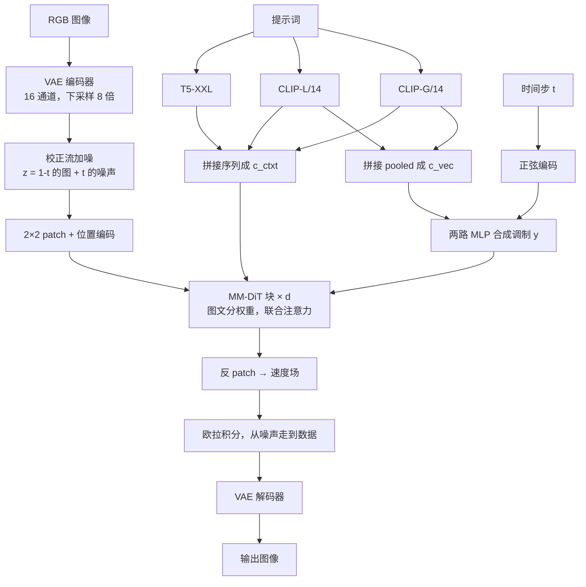

# 校正流、感知相关采样与 MMDiT：Stable Diffusion 3 怎样把去噪走直、把文字写进图里

<!-- release-date: 2024-04-17 -->

> 本文依据 Stability AI 的 **Scaling Rectified Flow Transformers for High-Resolution Image Synthesis**，即 ICML 2024 camera-ready、PMLR 235，28 页。本地件标题、页脚（`Proceedings of the 41st International Conference on Machine Learning`）、作者名单（止于 Robin Rombach *，没有 arXiv v1 里的 Kyle Lacey / Alex Goodwin / Yannik Marek）与 ICML 正式版一致，共 28 页。对应预印本是 arXiv:2403.03206；**arXiv v1 与 ICML 版分页不同，本文所有页码一律指本 ICML PDF 自身页码**，不要拿 arXiv v1 的页码来对。
>
> 文中始终区分三件事：**报告写了什么**、**我们如何解释**、**哪些是外部补充**。凡是从图里读出来的数、或由报告数字直接算出来的结果，都会明说。

`release-date` 取 **2024-04-17**。这篇覆盖的是 Stable Diffusion 3 模型家族，按本模块规则记该家族首次经官方渠道向公众开放使用的日期。核对过的官方时间线：

- 2024-02-22 官宣 early preview，并开放 waitlist，原文写明「While the model is not yet broadly available」：<https://stability.ai/news-updates/stable-diffusion-3>
- 2024-03-05 发布研究论文，仍在邀请 waitlist，不是可用产品：<https://stability.ai/news/stable-diffusion-3-research-paper>
- **2024-04-17** 官方宣布 Stable Diffusion 3 与 Stable Diffusion 3 Turbo 登上 Developer Platform API，这是家族首次可被公众调用：<https://stability.ai/news-updates/stable-diffusion-3-api>
- 2024-06-12 才开放 SD3 Medium 权重：<https://stability.ai/news/stable-diffusion-3-medium>、<https://huggingface.co/blog/sd3>

Hugging Face 仓库页显示的 Published 2024-03-05 是 `createdAt`，按本模块规则不是首发日。2 月 22 日是预告加排队，不是开放使用。

## 读之前：只熟悉 UNet 版 Stable Diffusion 的人，先对齐这几个词

UNet 版 SD（SD 1.x / 2.x / SDXL）可以压成三句话：一张图先被压进潜空间；网络在潜空间里反复「猜噪声、减噪声」；文字是冻住的 CLIP 向量，靠交叉注意力从旁边注入。这篇报告改的就是这三句话里的每一句。

**潜空间与 VAE**：直接在像素上做生成太贵。先用自编码器（Variational Auto-Encoder）把 RGB 图压成更小的张量，再在这个张量上训练生成模型。压完的张量叫 latent。压缩倍数叫下采样因子，通道数叫潜空间维度。SD 1/2/XL 用的是 4 通道、8 倍下采样；这篇把通道加到 16，下采样仍是 8 倍（PDF p. 7，Table 3）。

**扩散（diffusion）**：从数据走向噪声的一条弯路。训练时沿这条路给图加噪，推理时再把路倒着走回来。倒走的每一步都要跑一次网络。路越弯，步数越多，误差越容易攒起来。

**校正流（rectified flow，RF）**：把「数据」和「噪声」用直线连起来。网络不再预测「该减掉多少噪声」，而是预测这条直线上的**速度**（velocity）：现在该朝哪个方向、以多快的速率走。直线在理论上一步就能走完；实践里仍要多步，但少步时掉点更少。这篇的记号是 $t=0$ 为数据、$t=1$ 为噪声（PDF p. 2–3）。后面不少流匹配文章把两端对调，读公式时先对一下两端，不要混——这句是我们的提醒，不是报告原文。

**DiT（Diffusion Transformer）**：把 UNet 换成 Transformer。潜变量切成小方块（patch），摊平成一条序列，用自注意力做去噪。这篇的骨干从 DiT 改起（PDF p. 4）。

**交叉注意力 UNet**：图像走主网络，文字是一份冻住的说明书。图像用 query 去查文字的 key/value，文字自己不会因为「看见了当前这张半成品图」而改口。这是 SD 1/2/XL 的默认接法。

**MMDiT（Multimodal Diffusion Transformer，多模态扩散 Transformer）**：图和文变成两条并行的 token 流，各用一套权重，只在注意力里拼在一起互相看。文字不再是冻住的旁路（PDF p. 2、p. 5）。

**CLIP 与 T5**：CLIP 用「图—文是否配对」练出来，短、偏视觉语义，输出长度固定为 77。T5-XXL 是纯语言模型的编码器，长、偏字面精度。这篇用两个 CLIP 加一个 T5，拼成条件（PDF p. 18）。

**CFG（Classifier-Free Guidance，无分类器引导）**：推理时同一步跑两遍网络，一遍带提示词、一遍不带，再把两者的差放大，让图更贴字。训练时要随机把文字条件丢掉，推理才能做这件事。

同方向已经有一篇 [HunyuanImage 3.0](../Tencent/HunyuanImage-3.0.md)，那篇把流匹配和 DiT 当成既有零件，讲的是「怎样把一个会说话的模型教会画画」。**本篇是这条线上把零件从 UNet 扩散里推出来的源头之一**：问题、公式和消融都在这里。两篇不要互相替代。Hunyuan 那篇的叙事这里不再重复。

## 一句话先说清

UNet 版 Stable Diffusion 把两件事绑在了一起，而这两件事后来都被证明不是最优解。

第一件：噪声到图像走的是弯路。弯路训练好写，采样贵，少步就糊。

第二件：文字是冻住的旁路。图像可以去读它，它不能反过来看图。拼写、空间关系和多物体绑定，都卡在这道单向阀上。

这篇报告做的不是「再训一个更大的 UNet」，而是同时换掉这两件事（PDF p. 2）：

1. 把扩散目标换成**校正流**，再把训练时间步从均匀采样改成偏向人眼真正在乎的噪声档；
2. 把 UNet 交叉注意力换成 **MMDiT**：图文分权重、双向信息流；
3. 把这个组合从约 2B 扩到 8B，并证明验证损失能预测 GenEval、人类偏好和 T2I-CompBench（PDF p. 8–9）。

如果只记一句：

> **生成路径要直，训练力气要花在难的噪声档上；图和文要能互相改对方，而不是文当说明书、图单方面执行。**

## 报告地图：28 页里各写了什么

这份 PDF 28 页，正文到第 9 页，第 10–13 页是参考文献，第 14–16 页是样例墙，第 17 页起才是真正密的附录。前半讲主张，后半才把编码器尺寸、预计算、高分辨率稳定性和去重算法摊开。

| 报告章节 | PDF 页 | 讲了什么 | 密度 |
|---|---|---|---|
| 摘要 + Figure 1 | p. 1 | 校正流重加权、MMDiT、可预测的缩放；8B 样例墙 | 中 |
| §1 引言 | p. 2 | 弯路 vs 直路、交叉注意力不够、三条贡献 | 高 |
| §2 无模拟流训练 | p. 2–3 | ODE、条件流匹配、和噪声预测目标的换写 | 高 |
| §3 流轨迹 + §3.1 采样器 | p. 3–4 | RF / EDM / Cosine / LDM-Linear；logit-normal、mode、CosMap | 高 |
| §4 架构 + Figure 2 | p. 4–5 | 三编码器、2×2 patch、MM-DiT 块、深度 $d$ 的缩放规则 | 高 |
| §5.1 + Table 1/2 + Figure 3 | p. 5–7 | 61 种配方、24 组控制、少步采样更稳 | 高 |
| §5.2.1 Table 3 + Figure 7 | p. 7、p. 19 | 16 通道 VAE | 中 |
| §5.2.2 Table 4 | p. 7 | 50/50 合成字幕 | 中 |
| §5.2.3 Figure 4 | p. 7–8 | DiT / CrossDiT / UViT / MM-DiT | 高 |
| §5.3 + Figure 5 | p. 8 | 图像与视频缩放，验证损失当预测器 | 高 |
| Table 5/6 + Figure 6 + 结论 | p. 9 | GenEval、人类偏好、少步效率、8B 与 $5\times 10^{22}$ FLOPs | 高 |
| 附录 B.2–B.3 | p. 18–19 | 文本表示尺寸、ImageNet/CC12M 小实验设定 | 高 |
| 附录 C | p. 19–24 | 预计算、QK-Norm、分辨率 shift、DPO、拔掉 T5、指令编辑 | 高 |
| 附录 D | p. 25–28 | SSCD 去重与记忆化检测 | 中 |
| Figure 1 / 11 / 13–15 | p. 1、p. 14–16、p. 23–26 | 样例与定性对比 | 低 |

三件事先知道：

1. **摘要和引言对「开源」的口气不一致。** 摘要写 Stability AI *is considering* 公开数据、代码和权重（PDF p. 1）；引言末尾改成 *We make results, code, and model weights publicly available*（PDF p. 2）。camera-ready 落在 2024 年 6 月前后，和 Medium 权重开放大致同期。这是版本痕迹，不是算法内容。
2. **训练数据的体量和来源几乎没写。** 附录只给过滤类别和去重算法（PDF p. 19、p. 25），没有张数、没有来源名单。
3. **视频是预实验。** Figure 5 右两列是视频，但正文说 FLOPs 不含图像预训练、也没有把视频模型当作主产物来评（PDF p. 8）。

## 旧方案卡在哪：两条裂缝，不是一个更大的 UNet 能补上的

报告没有写「UNet 批判」专节，但引言把要拆的东西点得很清楚。把两处拼起来，就是全文的主线。

### 裂缝一：弯路逼你付很多步

指定一条从数据到噪声的前向路，训练会很高效；但这条路的形状会决定倒走有多贵（PDF p. 2）。弯路需要很多积分步才能模拟，每一步都是一次网络前向。直路理论上一步，也更不容易逐步把误差攒大。

报告还点了一个具体失败模式：如果前向过程没把噪声加干净，训练分布和测试分布对不上，会画出灰图（PDF p. 2，引 Lin et al., 2024）。

UNet 版 SD 用的 LDM-Linear，本质是 DDPM 那种方差保持日程的改写（PDF p. 4）。它能训、能出好图，但采样路径是弯的。少步时质量掉得快——后面 Figure 3 会把这件事画出来。

### 裂缝二：文字是冻住的说明书

文生图的主流接法，是把一份固定的文本表示直接喂进网络，常见就是交叉注意力（PDF p. 2）。报告的判断是：这不理想。文字不能根据当前这张半成品图改自己的理解，图像也只能去查一份不会动的说明书。

拼写差、多物体绑错、空间关系执行不稳，不一定是「CLIP 不够大」，而可能是**信息只准单向流**。

这两条裂缝互相独立。把 UNet 换成普通 DiT、但文字仍走交叉注意力，只修了骨干、没修第二条。把目标换成校正流、但仍用冻住的交叉注意力，只修了第一条。这篇要两条一起修。

## 全景：潜空间里的直线，加上一个双向的图文 Transformer

下图按 Figure 2（PDF p. 5）重画，属于**机制示意**，不含实测时间。调制向量 $y$、序列条件 $c$、图像 token $x$ 的接法以该图为准。

读这张图时抓住四件事：

- 生成发生在 VAE 潜空间，不在像素上（PDF p. 4、p. 18）。
- 网络的输出是速度 $v_\Theta$，不是噪声 $\epsilon$（PDF p. 3）。
- 两个 CLIP 的 pooled 向量和时间步一起变成 AdaLN 式的调制；真正带词序的是那条长序列 $c_{\text{ctxt}}$（PDF p. 4–5）。
- MM-DiT 块里图和文各有一套 Linear / MLP / 调制，只在 Attention 处把序列拼起来（PDF p. 5，Figure 2b）。

规模用深度 $d$ 参数化：隐藏维 $64\cdot d$，MLP 扩到 $4\cdot 64\cdot d$，注意力头数等于 $d$（PDF p. 5）。后文 2B 对应 $d=24$，8B 对应 $d=38$（PDF p. 23）。

## 设计一：把弯路拉直——为什么扩散要改成校正流

### 旧问题

扩散模型的训练好写：沿一条前向日程把图加噪，让网络预测噪声或 $v$。麻烦在倒走。前向路一弯，反向 ODE 也弯。弯的积分要用很多小步，每步一次网络。少步时误差会沿曲率放大。

报告把它说成一个选择问题：前向过程既可以弯也可以直，这个选择会直接打到采样效率上（PDF p. 2）。

### 新设计

校正流把数据和标准正态噪声用直线连起来（PDF p. 3，式 13）：

$$
z_t = (1-t)\,x_0 + t\,\epsilon,\qquad \epsilon\sim\mathcal{N}(0,I)
$$

$t=0$ 时 $z_0=x_0$，是干净数据；$t=1$ 时 $z_1=\epsilon$，是纯噪声。对 $t$ 求导，这条路的真速度是常数：

$$
\frac{dz_t}{dt} = \epsilon - x_0
$$

「直」不是修辞。速度不随 $t$ 变，路径就是线段。网络要学的，是从当前这个既不像图也不像噪声的 $z_t$ 里，把这个常向量估出来。

训练用条件流匹配（PDF p. 3，式 8）：让网络速度 $v_\Theta(z,t)$ 去回归条件速度 $u_t(z\mid\epsilon)$。它和直接回归边际速度在最优解上等价，但边际那个期望算不出，条件这个可以（PDF p. 3、p. 17–18）。

报告还把这套目标改写成噪声预测的加权形式，方便和 EDM、Cosine、LDM-Linear 放进同一张表里比（PDF p. 3）。对校正流本身，网络输出直接就是速度，对应权重 $w_t^{\mathrm{RF}}=t/(1-t)$（PDF p. 3）。

### 工作机制：训练往噪声走，推理沿同一条直线往回走

生成被写成一条 ODE（PDF p. 2，式 1）：

$$
\mathrm{d}y_t = v_\Theta(y_t, t)\,\mathrm{d}t
$$

它定义的是噪声 $x_1$ 到数据 $x_0$ 的映射。训练时看的是前向直线上的点；推理时从 $t=1$ 的高斯噪声出发，用欧拉法积到 $t=0$（PDF p. 19）。欧拉法就是「当前位置 + 步长 × 当前速度」，没有高阶求解器。

可以把它想成：训练教模型「这条直线的方向是什么」，推理沿着模型给出的方向往回走。路越直，每步的方向越稳定，少步时越不容易走歪。

### 收益

§5.1 在 ImageNet（改成「a photo of a 〈类别名〉」）和 CC12M 上训了 61 种配方，用 CLIP、FID、验证损失，在多种步数和 CFG 尺度下比（PDF p. 5–6）。架构、优化器、数据、采样器都控制住，只换前向过程、参数化和时间步分布。

Figure 3 把少步这件事画得很清楚（PDF p. 7）：校正流一类在步数减下来时掉点更少；到 25 步以上，只有 `rf/lognorm(0.00, 1.00)` 还能和旧的 `eps/linear`（也就是 LDM-Linear）打平。报告的原话是 *Rectified Flows perform better then other formulations when sampling fewer steps*（PDF p. 7，图注里的 `then` 是原文拼写）。

所以校正流的第一笔收益不是「同样 50 步更漂亮」，而是**少步仍然能用**。

### 代价与边界

- **直不等于最优传输。** 附录自己写：校正流不必给出最优传输，已有工作还在进一步压曲率（PDF p. 17）。这篇没有做 reflow 蒸馏。
- **均匀采样的校正流并不赢。** Table 1 里普通 `rf` 的总排名是 5.67，比 `eps/linear` 的 2.88 差（PDF p. 6）。只把弯路拉直、时间步仍均匀，不够。
- **61 种配方是在小数据、中等规模上比的**，骨干还不是后面的 MM-DiT 8B。它证明的是「哪种目标更值得拿去放大」，不是「8B 上再扫一遍所有配方」。

### 可迁移启发

如果生成过程是在积一条 ODE，先问路径弯不弯。弯，你付的是步数和误差积累；直，你把容量从「纠正曲率」里省下来，可以还给模型。换目标往往比加层更便宜。但换完之后，时间步怎么抽样会变成新的主超参——下一节就是这件事。

## 设计二：不要均匀地走完这条直线——logit-normal 和 mode 采样

### 旧问题

校正流的默认损失在 $t\in[0,1]$ 上均匀取样（PDF p. 4）。两端其实很容易：

- $t=0$ 附近，最优预测接近噪声分布的均值；
- $t=1$ 附近，最优预测接近数据分布的均值。

难的是中间。中间的回归目标是 $\epsilon-x_0$，图既不像图也不像噪声，结构正在从噪声里长出来。人眼也最在乎这一段：物体轮廓、空间关系、该不该出现的文字，都在这里决定。均匀采样把同样多的梯度分给「几乎不用动」和「必须做对」的时间档，这是在浪费容量。

报告的原话是：我们希望给中间时间步更高的权重，方法是更频繁地抽到它们（PDF p. 4）。

### 新设计

改 $t$ 的密度 $\pi(t)$，等价于给损失乘一组权重（PDF p. 4，式 18）：

$$
w_t^{\pi} = \frac{t}{1-t}\,\pi(t)
$$

他们试了三类偏中间的抽样（PDF p. 4）。

**Logit-normal。** 先抽 $u\sim\mathcal{N}(m,s)$，再经 logistic 函数映到 $(0,1)$。密度是（PDF p. 4，式 19）：

$$
\pi_{\ln}(t;m,s)=\frac{1}{s\sqrt{2\pi}\,t(1-t)}\exp\left(-\frac{(\mathrm{logit}(t)-m)^2}{2s^2}\right)
$$

其中 $\mathrm{logit}(t)=\log\frac{t}{1-t}$。$m$ 把峰推向数据端（负）或噪声端（正），$s$ 控制峰有多宽。Figure 8 右侧把几组 $(m,s)$ 画出来了（PDF p. 20）。

**Mode sampling with heavy tails。** logit-normal 在 0 和 1 两端密度是 0。为了看端点被「饿死」有没有副作用，他们又构造了一个在 $[0,1]$ 上严格正的密度，用尺度 $s$ 在「偏向中点」和「偏向两端」之间调（PDF p. 4，式 20）。$s=0$ 退回均匀，也就是经典 RF。

**CosMap。** 把 Cosine 日程的 log-SNR 搬到校正流的 $t$ 上（PDF p. 4，式 21–22）。

### 工作机制

抽样改变的是**每一档噪声被看见的次数**，不是路径形状。路径仍是直线，只是中间那段被更勤地拿来算梯度。这和旧扩散里「噪声预测损失自带中间权重大」是同一类直觉，报告也明说了 *similar to noise-predictive diffusion models*（PDF p. 2）。

### 收益

Table 1 用非支配排序，把 24 组控制（两种数据 × EMA 与否 × 多种采样设置）的 Pareto 名次平均起来（PDF p. 6）：

| 配方 | 总排名 | 5 步 | 50 步 |
|---|---:|---:|---:|
| `rf/lognorm(0.00, 1.00)` | 1.54 | 1.25 | 1.50 |
| `rf/lognorm(1.00, 0.60)` | 2.08 | 3.50 | 2.00 |
| `rf/mode(1.29)` | 2.75 | 3.25 | 3.00 |
| `eps/linear`（旧 LDM） | 2.88 | 4.25 | 2.75 |
| `rf/cosmap` | 4.13 | 3.75 | 4.00 |
| `rf`（均匀校正流） | 5.67 | 6.50 | 5.75 |
| `edm(-1.20, 1.20)`（EDM 原配） | 15.58 | 20.25 | 15.00 |

`rf/lognorm(0.00, 1.00)` 总排名第一，而且 5 步和 50 步都稳。均匀 `rf` 明显更差。所有胜过 `eps/linear` 的，都是「校正流 + 改过的时间步抽样」（PDF p. 6）。

Table 2 解释了他们为什么不选那些「某一格第一」的配方（PDF p. 6，25 步）：

| 配方 | ImageNet CLIP | ImageNet FID | CC12M CLIP | CC12M FID |
|---|---:|---:|---:|---:|
| `rf` 均匀 | 0.247 | 49.70 | 0.217 | 94.90 |
| `eps/linear` | 0.245 | 48.42 | 0.222 | 90.34 |
| `rf/lognorm(0.50, 0.60)` | **0.256** | 80.41 | 0.233 | 120.84 |
| `rf/mode(1.75)` | 0.253 | **44.39** | 0.218 | 94.06 |
| `rf/lognorm(0.00, 1.00)` | 0.250 | 45.78 | 0.224 | 89.91 |

`lognorm(0.50, 0.60)` 的 CLIP 最好，FID 却垮掉；`mode(1.75)` 的 ImageNet FID 最好，换数据集就不全面。`lognorm(0.00, 1.00)` 是那个「四格里经常进前三、没有明显短板」的点。报告最终带着它去放大。

### 代价与边界

- **$m=0,s=1$ 不是在所有指标上的单点最优**，是跨设置的稳健点。有人如果只优化 CLIP 或只优化 50 步 FID，表上有更尖的选择，但那些选择会在别的格子里翻车（PDF p. 6）。
- **logit-normal 在 0/1 两端密度为 0**，极端干净和极端噪声几乎训不到。mode 采样就是为这个担心准备的；实践里 logit-normal 仍然更稳，说明「饿死端点」在这组实验里不是主因。
- 这套结论绑在「校正流 + 欧拉采样 + CLIP/FID」上。换成别的求解器或别的度量，峰该在哪要重扫。

### 可迁移启发

目标函数写直了之后，**训练分布仍然可以是弯的**——不是路径弯，是你在路径上停留的时间弯。任何按时间或噪声档积分的损失，都该问：均匀档位是不是把梯度浪费在了人眼不在乎、模型也不难的区域？若是，先改抽样，再谈加数据、加参数。

## 设计三：MMDiT——图文分权重，注意力里双向流

### 旧问题

交叉注意力 UNet 里，文字是 K 和 V，图像是 Q。图像可以读文字，文字不能读图像。DiT 原版只做类条件，用调制注入类别标签，根本没有「一长串词」（PDF p. 4）。把文字 token 和图像 token 简单拼成一条序列、共用一套权重，等于逼两种完全不同的表示挤进同一个线性空间。

报告把这个判断写在引言：固定文本表示直接喂进去不理想，新架构要给图和文各一条可学习的流，并让信息双向走（PDF p. 2）。

### 新设计

MM-DiT 块可以看成两个并排的 Transformer，只在注意力处会合（PDF p. 5）：

1. 图像 latent 做 $2\times 2$ patch，加上二维位置编码，长度是 $\frac12 h\cdot\frac12 w$（PDF p. 4）；
2. 文本序列 $c_{\text{ctxt}}$ 和图像 patch 各自投影到同一维度，然后**拼接**；
3. 注意力在拼接后的序列上做，所以每个图像 token 能看见所有文字 token，每个文字 token 也能看见所有图像 token；
4. 投影、调制、MLP 仍分两套。Figure 2b 左侧是文，右侧是图，Q/K/V 在中间拼起来做 Attention（PDF p. 5）。

调制来自时间步和 CLIP pooled 向量合成的 $y$。pooled 只保留粗语义，细词序要靠 $c_{\text{ctxt}}$ 那条序列（PDF p. 4）。

可选的 QK-RMSNorm 加在注意力之前，用来稳住大分辨率混合精度，后面单独讲（PDF p. 5、p. 20）。

### 工作机制：为什么「分权重」和「拼接」缺一不可

下面这段是我们的解释，报告只给了做法和消融。

分权重：图像 token 是连续潜空间里的局部块，文本 token 是离散语言里的词。它们的均值、尺度、该被调制的方式都不一样。硬共用一套 Linear，等于让一种模态去迁就另一种的统计。

拼接进同一注意力：这是双向流的物理实现。去噪中途，图像流已经有了模糊的布局；文字流如果能看见这个布局，就可以把「left / red / the word COFFEE」从抽象词收成对当前画布的约束。交叉注意力做不到这一点——文字的表示在进去之前就冻死了。

Vanilla DiT 把两种 token 拼起来但共用权重，是 MM-DiT 的「一套权重」特例（PDF p. 8）。CrossDiT 则是「DiT + 对文字做交叉注意力」，信息流又变回单向（PDF p. 8）。

### 收益

Figure 4 在 CC12M 上比验证损失、CLIP、FID（PDF p. 7）。报告的观察：

- 普通 DiT 不如 UViT；
- UViT 起步快，但 CrossDiT 后来居上；
- MM-DiT 明显超过交叉注意力和 vanilla；
- 给 CLIP 和 T5 各开三套权重只比两套略好，却更吃参数和显存，所以后面只用两套（PDF p. 8）。

UViT 是 UNet 和 Transformer 的杂交（PDF p. 8）。也就是说，在这组对照里，双向加分权重同时大过了「更像 UNet 的混合骨干」和「单向的 DiT」。

人类偏好上，8B 模型在 PartiPrompts 的视觉质量、提示遵循、排版三项里，对当时的开源和闭源系统都比较有利（PDF p. 9，Figure 6）。排版这一项特别吃双向流：要在画面上写出指定单词，模型得一边看已经写出的笔画，一边回头改对文字 token 的理解。

### 代价与边界

- **联合注意力的序列更长。** 文本 154 个 token 加上图像 patch，每层自注意力都是二次的。Kandinsky 5.0 后来以拼接拖慢训练为由改回交叉注意力——那是另一篇报告的主张，不是本篇内容。本篇只证明：在静态文生图、这组规模和数据上，拼接换来的对齐值得钱。
- **三套权重量变不是质变。** CLIP 和 T5 在他们的实验里还不值得为各自再开一套完整块（PDF p. 8）。
- **QK-Norm 写在图上是「可选项」。** 低分辨率预训练可以先不加；高分辨率微定时再加也来得及（PDF p. 20–21）。

### 可迁移启发

两种模态要不要共用权重，先看它们的统计是不是一类东西。不是一类，就分开放投影，只在需要交换信息的算子上会合。交叉注意力是「查询者更新、被查询者不更新」；如果你怀疑被查询的那一侧也该根据当前生成状态改口，那就不要把它冻成 K/V。

## 设计四：三个文本编码器，以及「拔掉大的仍然能用」

### 旧问题

一份冻住的 CLIP 表示有两层损失。pooled 向量把一整句压成一个向量，只剩粗语义（PDF p. 4）。77 个 token 的序列对长提示、精确拼写和复杂从句也不够。Imagen、eDiff-I 这类工作已经在用编码器组合，这篇把它收成可拆卸的三件套（PDF p. 18）。

### 新设计

对每个提示词 $c$ 同时跑三个冻住的编码器（PDF p. 18）：

| 编码器 | 取出什么 | 尺寸 |
|---|---|---|
| CLIP L/14 | pooled + 倒数第二层隐状态 | pooled 768；序列 $77\times ?$ |
| OpenCLIP bigG/14 | 同上 | pooled 1280 |
| T5-v1.1-XXL | 编码器末层 | $77\times 4096$ |

两个 pooled 拼成 $c_{\mathrm{vec}}\in\mathbb{R}^{2048}$，给调制用。两个 CLIP 的序列按通道拼成 $c^{\mathrm{CLIP}}_{\mathrm{ctxt}}\in\mathbb{R}^{77\times 2048}$，再在通道上零填充到 4096，与 T5 在序列维拼接，得到 $c_{\mathrm{ctxt}}\in\mathbb{R}^{154\times 4096}$（PDF p. 18）。

训练时三个编码器的输出各自独立以 46.4% 的概率置零，使得大约 10% 的步是完全无条件的，供 CFG 使用（PDF p. 19）。附录后段又写成 46.3%（PDF p. 24），差 0.1 个百分点，应是同一设定的笔误。

### 工作机制：短语义走调制，长字面走序列，大编码器可在推理时卸掉

CLIP 擅长「这句和这张图配不配」，适合当全局风格旋钮，所以进 AdaLN。T5 擅长把句子读准，包括要写在画面上的单词，所以进那条 154 长的序列。零填充对齐通道、再沿序列拼接，让 MM-DiT 的文本流里前 77 个位置是 CLIP、后 77 个是 T5。

因为三个编码器是独立 dropout 的，推理时可以把任意子集换成零向量。最有用的子集是「丢掉 4.7B 的 T5」（PDF p. 24）。

### 收益

Figure 6 里有一组 `Ours w/o T5`（PDF p. 9）。附录把三个胜率写死了（PDF p. 24）：

| 去掉 T5 之后 | 对完整三编码器的胜率 |
|---|---:|
| 视觉美学 | 50%（无影响） |
| 提示遵循 | 46%（略降） |
| 排版 / 画面内文字 | 38%（明显降） |

Figure 13 的定性对照和这个数字一致（PDF p. 24）：汉堡上写 `COFFEE`、猴子举的标语，有 T5 明显更稳；普通场景描述差不大。

Table 7 解释了为什么有人愿意拔掉它（PDF p. 20）。预计算场景下，把该编码器塞回训练步会让 2B MMDiT（568 ms/it）变慢多少：

| 模块 | 显存 (GB) | 单样本前向 (ms) | 单条存储 (kB) | 塞回训练步的变慢 |
|---|---:|---:|---:|---:|
| VAE 编码器 | 0.14 | 2.45 | 65.5 | 13.8% |
| CLIP-L | 0.49 | 0.45 | 121.3 | 2.6% |
| CLIP-G | 2.78 | 2.77 | 202.2 | 15.6% |
| T5 | 19.05 | 17.46 | 630.7 | 98.3% |

T5 一项就让训练步几乎翻倍，显存 19 GB，单条文本特征 630.7 kB。它是三个编码器里唯一「不预计算就很难训、不卸载就很难部署」的部件。

### 代价与边界

- **「有竞争力」不是「没有损失」。** 美学持平、遵循略降、排版明显降。想写复杂字、执行很长很细的提示，T5 不是可选项（PDF p. 24）。
- **77+77 仍是短上下文。** 再长的提示会被截断。报告没有讨论把 T5 序列加到 77 以上。
- **编码器全部冻住。** 图文对齐的改进全部来自 MM-DiT 怎么用这些特征，不来自微调 CLIP 或 T5。

### 可迁移启发

条件不要做成一根管子。把「粗语义」和「必须对的字面」拆开，让贵的那一路可以在推理时卸掉，这是一条很实际的产品约束。训练时按编码器独立 dropout，等价于提前把所有子集都当成一等公民来训——这比训完再蒸馏一个无 T5 学生要干净。

## 放大之前，先把表示本身修好

校正流和 MM-DiT 再好，也受上下游表示的上限卡住。报告在放大前做了两件不那么起眼、但后面所有数字都建立在它们之上的事。

### 16 通道 VAE：重建上限先抬起来

潜扩散的重建质量是生成质量的天花板（PDF p. 7）。他们把通道从 4 加到 8 再加到 16，下采样保持 $f=8$（PDF p. 7，Table 3）：

| 指标 | 4 通道 | 8 通道 | 16 通道 |
|---|---:|---:|---:|
| FID ↓ | 2.41 | 1.56 | **1.06** |
| 感知相似度 ↓ | 0.85 | 0.68 | **0.45** |
| SSIM ↑ | 0.75 | 0.79 | **0.86** |
| PSNR ↑ | 25.12 | 26.40 | **28.62** |

通道越多，同一空间分辨率下能保住的信息越多，解码上限越高。代价是扩散模型要预测的 latent 更「宽」，更难。Figure 7 显示 16 通道在小模型上 FID 更差，到深度 $d=22$ 时与 8 通道的差距可以忽略；他们仍选 16 通道，因为目标是往更大的模型扩（PDF p. 19）。

可迁移的判断很硬：压缩瓶颈的通道数要和下游模型的容量一起选。小模型配宽 latent 是在给自己出难题；大模型配窄 latent 是在提前把细节扔掉。

### 50/50 合成字幕：人写的标题太偷懒

大规模图文数据的人工标题往往只写主体，背景、构图、画面里的字经常缺（PDF p. 7）。他们用现成的 CogVLM 生成合成标题，再和原标题按 50/50 混，以免模型忘掉 VLM 知识库里没有的概念（PDF p. 7）。

对照实验：两个 $d=15$ 的 MM-DiT 各训 250k 步，一个只用原标题，一个用 50/50。GenEval 总分从 43.27 升到 49.78（PDF p. 7，Table 4）：

| 分项 | 原标题 | 50/50 |
|---|---:|---:|
| 颜色归属 | 11.75 | 24.75 |
| 颜色 | 71.54 | 68.09 |
| 位置 | 6.50 | 18.00 |
| 计数 | 33.44 | 41.56 |
| 单物体 | 95.00 | 93.75 |
| 双物体 | 41.41 | 52.53 |
| 总分 | 43.27 | 49.78 |

涨得最狠的是颜色归属和位置——正是「原标题经常不写」的那些结构。颜色、单物体略降，报告没有讨论，但总分和结构类分项足够让他们后文全部改用 50/50（PDF p. 7）。

这不是「合成数据一定更好」，是「人工标题的系统性盲区，要用另一种分布来补」。混一半原标题，是为了不让模型把 CogVLM 的偏见写成世界模型。

## 设计五：验证损失当真的预测器——把 MM-DiT 校正流放大

### 旧问题

文生图长期以来缺少类似语言模型的缩放图：验证损失降了，是不是提示遵循、人类偏好也会一起好？没有这张图，就只能靠 GenEval 或人工评来决定「这个 run 要不要继续」，两者都贵、都滞后。

### 新设计

图像：不同深度的 MM-DiT，256²、batch 4096、2×2 patch、预计算特征，训 500k 步；每 50k 步在 COCO 上算验证损失。为了把损失噪声压下去，他们在 $t\in(0,1)$ 上均匀取档、逐档算，再对除 $t=1$ 以外的档平均（PDF p. 8）。$d=38$ 那条在 $3\times 10^5$ 步调过学习率，否则会发散（PDF p. 8，Figure 5 图注）。

视频是预实验：从图像权重出发，加 2 倍时间 patch，空间注意力之后再对所有时空 token 做一次全注意力；16 帧、256²、batch 512，训 140k 步，每 5k 步在 Kinetics 上记损失。图上的视频 FLOPs 不含图像预训练（PDF p. 8）。

### 工作机制

验证损失在这里不是「训练集上再跑一遍」。它按时间档分层，避开 $t=1$ 那种几乎只预测数据均值的点，所以对「模型有没有把中间那些难档学会」更敏感。若校正流真的在学一条越来越直、越来越准的速度场，这个标量就应该和下游观感一起动。

### 收益

Figure 5 上排：图像和视频的验证损失都随模型变大、步数变多而平滑下降，没有饱和（PDF p. 8–9）。下排是损失对下游指标的相关，相关系数读自该图：

| 下游 | 读自 Figure 5 的 $r$ |
|---|---|
| GenEval 总分 | $-0.920$ |
| 人类偏好 ELO（图） | $-0.982$ |
| T2I-CompBench | $-0.898$ |
| 人类偏好 ELO（视频） | $-0.908$ |

负相关是因为损失越低、分数越高。$r\approx -0.98$ 的人类偏好说明：在这组设定里，**盯验证损失做早期停和选型，几乎就是在盯人**。这是全文最有工程价值的一张图之一。

Table 5 把 GenEval 摊开（PDF p. 9）。摘关键行：

| 模型 | 总分 | 双物体 | 计数 | 位置 | 颜色归属 |
|---|---:|---:|---:|---:|---:|
| SD v1.5 | 0.43 | 0.38 | 0.35 | 0.04 | 0.06 |
| SDXL | 0.55 | 0.74 | 0.39 | 0.15 | 0.23 |
| DALL-E 3 | 0.67 | 0.87 | 0.47 | 0.43 | 0.45 |
| 本文 $d=18$，512² | 0.58 | 0.72 | 0.52 | 0.16 | 0.34 |
| 本文 $d=24$，512² | 0.62 | 0.74 | 0.63 | 0.34 | 0.36 |
| 本文 $d=30$，512² | 0.64 | 0.80 | 0.65 | 0.33 | 0.37 |
| 本文 $d=38$，512² | 0.68 | 0.84 | 0.66 | 0.40 | 0.43 |
| 本文 $d=38$，512² + DPO | 0.71 | 0.89 | 0.73 | 0.34 | 0.47 |
| 本文 $d=38$，1024² + DPO | **0.74** | **0.94** | 0.72 | 0.33 | **0.60** |

最大模型在总分上超过表中的 DALL-E 3（0.67）。位置从 $d=18$ 的 0.16 拉到 $d=38$ 的 0.40，是规模本身带来的；1024 + DPO 把颜色归属拉到 0.60，但位置反而掉到 0.33。DPO 不是免费午餐，后面单独说。

Table 6 是一个容易被忽略的结果（PDF p. 9）：更大的模型不但更好，而且**更少步就能接近自己的 50 步上限**。相对 50 步 CLIP 的掉点：

| 深度 | 5 / 50 步 | 10 / 50 步 | 20 / 50 步 | 路径长度 |
|---|---:|---:|---:|---:|
| $d=15$ | 4.30% | 0.86% | 0.21% | 191.13 |
| $d=30$ | 3.59% | 0.70% | 0.24% | 187.96 |
| $d=38$ | 2.71% | 0.14% | 0.08% | 185.96 |

路径长度是 50 步上 $\lVert v_\theta\cdot dt\rVert$ 的求和（PDF p. 9）。更大的模型把校正流的「直」拟合得更好，所以少步时掉点更少。$d=30$ 在 20 步那一格（0.24%）略差于 $d=15$ 的 0.21%，不是处处单调，但 5 步和 10 步、以及路径长度，都是大模型占优。

结论里把规模写成：最大 8B 参数、$5\times 10^{22}$ 训练 FLOPs（PDF p. 9）。

### 代价与边界

- **$d=38$ 调过学习率。** 「平滑缩放」不是零超参的。最大那条线曾经要发散（PDF p. 8）。
- **视频证据弱于图像。** 只有损失曲线和一项人类偏好相关，没有视频版 GenEval，也没有公开视频权重。
- **验证损失能当预测器，是在「同一配方、只变深度和步数」时成立。** 它不能代替跨架构的人工评；换 VAE、换字幕、换 CFG，相关会不会还在，报告没做。
- 位置分项在 1024 + DPO 后回退，说明「总分涨」可以掩盖个别能力的掉。读 GenEval 一定要看分项。

### 可迁移启发

先找一个便宜、分层、且和人一致的标量，再谈要不要上贵的人工评。这篇把时间档分层后的验证损失做成了这样的标量。若你的生成目标也是按时间或噪声积分的，值得抄的是「按档求损失再平均」，不是「再报一个 FID」。

## 高分辨率不是把 256 的权重拿来插值

放大之后还要处理真实部署：更高分辨率、可变长宽比、混合精度不炸。这些写在附录 C.2，但没有它们就没有 Table 5 最后两行。

### QK-Norm：最后几层的注意力熵在塌

256² 预训练之后，高分辨率 + 混合长宽比 + 混合精度会不稳，损失发散。切到全精度能救，但大约慢 2 倍（PDF p. 20）。他们改用 RMSNorm 去归一化 Q 和 K，两边流都加，AdamW 的 $\epsilon=10^{-15}$，在 bf16-mixed 下能继续训（PDF p. 20）。

Figure 9 画的是 2B（$d=24$）最后 5 层的平均（PDF p. 21）：不加 QK-Norm 时，最大注意力 logit 冲到 $10^3$ 量级并在约 6k 步标了 NaN，注意力熵同步塌掉；加上之后 logit 和熵都稳住。和 ViT 文献不同，他们观察到的失稳发生在**最后几层**，不是最前（PDF p. 21）。

预训练没加 QK-Norm 的模型，微调时再加，也能很快适应（PDF p. 20–21）。报告自己划了边界：这不是万能药，换设定可能要改（PDF p. 21）。

### 位置编码：不能直接做二维插值

可变长宽比下，把 256 上学到的二维频率位置编码直接按边插值，边长关系会错（PDF p. 21）。他们改成：先按训练中会遇到的最大高宽做一张扩展网格，再按目标分辨率做插值和中心裁剪，然后才做频率嵌入（PDF p. 21）。batch 内分辨率用分桶，使 $H\cdot W\approx S^2$（PDF p. 21）。

### 分辨率相关的时间步平移：高分辨率需要更「吵」的噪声

像素多了，同样的 $t$ 对信号的破坏变弱。报告用一个「常数图」思想实验把这件事写清楚（PDF p. 21）：每个像素都是对同一个值的一次观测，像素数翻四倍（边长翻倍），对原值的估计标准差减半。要让高分辨率下的不确定性与低分辨率对齐，就要把 $t$ 往噪声端推。

把分辨率 $n$ 上的时间步 $t_n$ 映到分辨率 $m$ 上的 $t_m$（PDF p. 21，式 34）：

$$
t_m=\frac{\sqrt{m/n}\,t_n}{1+\bigl(\sqrt{m/n}-1\bigr)t_n}
$$

令 $\alpha=\sqrt{m/n}$。他们在 1024×1024 上做人评，发现 $\alpha>1.5$ 明显更好，更高的几个值之间差别变小，于是训练和采样都用 $\alpha=3.0$（PDF p. 22）。Figure 10 右上角的 ELO 柱形，$3.0$ 和 $6.0$ 最高，$1.0$（不平移）最低（PDF p. 22）。下排定性对比：同一 512² 模型，$\alpha=1.0$ 偏灰、结构糊，$\alpha=3.0$ 对比和细节都上来（PDF p. 22）。

这个 $\alpha$ 后来在别的流匹配文生图里几乎成了默认旋钮。那是后续使用，不是本报告内容；本报告只负责把「为什么高分辨率要更吵」写成一条可计算的式子。

## DPO 与指令编辑：骨干还能被后训练推动

### DPO：变好看，但会改分项

他们把 Diffusion-DPO（Wallace et al., 2023）接到 2B 和 8B 上，不训全参，只给所有线性层加 rank 128 的 LoRA；2B 训 4k 步，8B 训 2k 步（PDF p. 22、p. 24）。评测用 PartiPrompts 的 128 条，大约每条提示、每次对比 3 个投票人（PDF p. 24）。

Figure 12 的柱形是：两个规模上，DPO 在提示遵循和整体质量上都赢过底模（PDF p. 23）。Figure 11 的样例是更干净的风景、更稳的 `DON'T PANIC`（PDF p. 23）。Table 5 里 8B 加 DPO 后 GenEval 从 0.68 到 0.71，再上 1024 到 0.74（PDF p. 9）。

但同一张表里，512² + DPO 的位置从 0.40 掉到 0.34。DPO 优化的是人类偏好对，偏好对往往奖励「好看、能读」，不一定奖励「A 在 B 左边」。后训练会重写能力剖面，不是在总分上加一个正数。

### 指令编辑：同一套骨干，通道里把条件图拼进去

UNet 编辑模型的常见做法，是把条件图的 latent 和当前加噪 latent 在通道维拼接，再送进网络（PDF p. 24）。他们在 patch 之前做同样的拼接，用 2B 底模微调，数据类似 InstructPix2Pix，再加上修复、分割、上色、去模糊、ControlNet 类任务（PDF p. 24–25）。

Figure 15 展示了一个报告自己也觉得意外的结果：训练数据里没有文字编辑任务，2B Edit 模型仍然能改牌子上的字（`go small go home`、`UNOT`、`MMDIT RULES`）（PDF p. 26）。同一批数据他们没能在 SDXL 编辑模型上复现类似效果（PDF p. 25）。

这是定性观察，不是对照表。它支持的判断是「MM-DiT 对画面内文字的内部表示，比对 UNet 更可操作」；它不支持「这个编辑模型已经是 SOTA」。

## 视频：同一骨干的预实验，不是第二个产品

正文用一段话加 Figure 5 的右两列交代视频（PDF p. 8）。做法是：图像权重当初始化；时间维 2 倍 patch；每层先做空间注意力，再把视觉流重排，对全部时空 token 做一次全注意力，然后进 FFN。16 帧、256²、140k 步。

能带走的只有两点：MM-DiT 的「分权重 + 联合注意力」并不绑死在 2D 上；验证损失对人类偏好的相关在视频里也还在。不能带走的是一个可部署的视频模型——没有架构表、没有采样配置、没有公开评测协议。

## 数据：报告写了过滤和 SSCD 去重，没写数据从哪来

### 写了的

放大前的过滤分三类（PDF p. 19）：

1. 色情：用 NSFW 检测模型去掉显式内容；
2. 美学：评分系统判低的去掉；
3. 反刍 / 记忆化：用基于聚类的去重去掉感知和语义重复，细节在附录 D。

去重骨干是 SSCD（PDF p. 25）。聚类数 $N=16{,}000$，用 autofaiss / FAISS 训练指定质心的索引。Algorithm 1：在每个簇里做范围检索，超过阈值的标成重复（PDF p. 27）。他们扫了多个阈值，最终跑了四个；Figure 16a 是全量数据上这四个阈值各去掉多少，Figure 16b 是 1000 个随机簇上更密的阈值扫描（PDF p. 25、p. 27）。正文没有写出精确百分比。从图 16a 柱高读，大约是：SSCD_85 约 25%，SSCD_75 约 32%，SSCD_65 约 38%，SSCD_50 约 48%（读自 PDF p. 27，不是表内数字）。

记忆化检测跟 Carlini 等人的两阶段攻击：用已知提示大量生成，再把彼此过于相似的生成图连成图，团大小达到阈值就标成「可能背出来」（PDF p. 25–26，Algorithm 2）。具体设定：按 SSCD 阈值 0.5 取出 35 万条最高频重复样本，每条提示生成 500 张候选；距离不是整图 $L_2$（灰背景会误伤），而是把图切成 16 块 $128\times 128$ 的非重叠块，取块对 $L_2$ 的最大值（PDF p. 26）。相似度阈值 $\epsilon=0.15$（PDF p. 28）。

Figure 17 在团大小 10 处标了两个数：Baseline 540，SSCD50 95（读自 PDF p. 28）。正文把这件事说成：团大小为 10 时，在 SSCD=0.5 上去重后训练的 SD 模型，潜在记忆样本降为约五分之一（PDF p. 26、p. 28）。对照的基线是「只做精确去重的 SD-2.1」对「同样架构、再加 SSCD 近重复去除」（PDF p. 25）。注意：这是在专门为此训练的小模型上测的，不是 8B MM-DiT 自己的记忆化数字。

### 没写的，不要补

没有训练集张数，没有来源名称，没有各过滤级去掉的绝对数量，没有美学模型的身份，没有 NSFW 模型的身份。50/50 字幕用的是 CogVLM，但原数据池有多大不知道。这些空缺按「没写就是没写」处理，不从第三方报道回填。

## 实验怎么读：哪些结论被撑住，哪些是展示

### 被多组控制撑住的

- **校正流 + 非均匀时间步，在少步下优于旧扩散配方。** 61 种配方、24 组控制、两种数据（PDF p. 5–7）。这是全文最干净的对照。
- **`rf/lognorm(0.00, 1.00)` 是稳健点不是单格冠军。** Table 1 和 Table 2 一起读才成立（PDF p. 6）。
- **MM-DiT 在 CC12M 上优于 DiT、CrossDiT、UViT。** Figure 4（PDF p. 7–8）。三套权重的增益小，所以丢掉。
- **16 通道重建更好；小模型一时吃不消，大模型吃得消。** Table 3 + Figure 7（PDF p. 7、p. 19）。
- **50/50 合成字幕提升 GenEval 结构类分项。** Table 4，只有 $d=15$、250k 步这一档（PDF p. 7）。
- **验证损失随深度和步数下降，并与 GenEval / 人评 / CompBench 强相关。** Figure 5（PDF p. 8）。相关是观察，不是「损失导致质量」。
- **去掉 T5：美学不变，遵循略降，排版明显降。** 人评胜率 50% / 46% / 38%（PDF p. 24）。

### 要打折的

- **「超过 DALL-E 3」只在 GenEval 总分、以及 Figure 6 的人评设置下成立。** 位置分项上，DALL-E 3 的 0.43 仍高于本文 512² 底模的 0.40，也高于 1024 + DPO 的 0.33（PDF p. 9）。人评是 PartiPrompts 成对比较，不是全市场盲测。
- **Figure 1、14、15 是展示。** 精选提示、精选种子，不构成统计。Figure 14 用来示意「更深、更久更清晰」，方向和缩放曲线一致，但不能当独立证据（PDF p. 24）。
- **DPO 的人评样本很小**：128 条提示、约 3 票（PDF p. 24）。足以说「这个方法接得上」，不足以报一个稳定的 ELO。
- **编辑模型的「零样本文字操作」没有对照表**，只有 Figure 15 和一句「SDXL 上没复现」（PDF p. 25–26）。
- **SSCD 的 5 倍下降测的是 SD-2.1 架构的小模型**，不能直接写成「SD3 8B 不会背图」（PDF p. 25–28）。

## 报告没有写的事

按「别人能不能照着复现」来列。

**数据。** 无总量、无来源、无各过滤级的绝对数量。美学模型和 NSFW 模型只有类别名。50/50 之外的字幕策略、语言分布、分辨率分布都没有。

**训练配方的关键旋钮。** 8B 的学习率只在 $d=38$ 发散时提了一句「调整过」（PDF p. 8），没有给出数值。优化器除小实验的 AdamW $10^{-4}$、1000 warmup、EMA 0.99（PDF p. 19）外，大规模 run 的超参表不存在。没有 GPU 数、没有并行策略、没有墙钟时间。$5\times 10^{22}$ FLOPs 是结论里的一个总量，没有拆成图像 / 视频 / 高分辨率微调。

**推理。** 小实验写了欧拉 + 六组 CFG 设置（PDF p. 19）。8B 主模型的默认步数、默认 CFG、默认 $\alpha$ 之外的采样器，正文没有一张推理配置表。官方博客里那句「未优化的 8B 在 RTX 4090 24 GB 上、50 步、1024² 约 34 秒」不在这份 ICML PDF 里，见文末外部补充。

**负结果。** 61 种配方只展示了表上的赢家和几个代表。mode 采样、CosMap、EDM 的完整网格没有作为失败分析展开。

**安全。** Impact Statement 明确说没有必须单独强调的社会影响，把扩散模型的一般讨论指向 Po et al., 2023（PDF p. 10）。过滤和去重是工程缓解，不是安全评测。

报告之后的产品名、权重档位和代际迭代不是本 PDF 的内容，不回写进上述任何一条。

## 可以带回自己项目的几条

### 1. 路径形状是采样预算，不是审美口味

前向过程选弯还是选直，决定推理能少到多少步。少步掉点被当成「采样器不够好」之前，先看训练时走的是不是弯路。

### 2. 直线仍要重新分配训练注意力

均匀 $t$ 会把梯度浪费在端点。改 $\pi(t)$ 往往比改网络更便宜。选超参时优先那个跨指标、跨步数都进前三的点，而不是某一格的第一。

### 3. 被查询的模态如果也该改口，就不要冻成交叉注意力

图文是否双向，是能力剖面问题：拼写、空间关系、把字写进画面，都依赖文字表示在生成过程中被更新。单向查询便宜，但把「说明书」写死了。

### 4. 两种模态的线性层分开，只在交换信息的算子上会合

统计不同就不要共用投影。MM-DiT 的最小实现是：两套 MLP 和调制，一套联合注意力。再拆第三套，先做一次「增益 / 显存」的账。

### 5. 贵的条件编码器要能卸

独立 dropout 把「无 T5」训成一等公民。部署时用 50% 美学、46% 遵循去换掉 19 GB，这是产品决策，不是事后蒸馏。

### 6. 压缩通道数和生成器容量必须一起选

宽 latent 抬重建上限，也抬预测难度。小模型配 16 通道会先变差，大模型才把这笔投资赚回来。

### 7. 人工标题的盲区用合成分布补，但要留一半真数据

涨的是原标题不写的结构（位置、颜色归属、双物体），不是所有分项。50/50 是防遗忘的配比，不是魔法系数。

### 8. 把验证损失做成和人一致的标量，再决定要不要烧人工评

按时间档分层、丢掉最无信息的那一档，是这套相关能成立的前提。

### 9. 分辨率一变，噪声档位的物理含义就变

像素越多，同样 $t$ 越「不够吵」。把这件事写成 $\alpha=\sqrt{m/n}$，比在每个分辨率上重扫日程便宜。1024 上 $\alpha=3$ 是这篇的选择，不是普适常数。

### 10. 近重复比精确哈希更接近「会不会背出来」

SSCD + 分块 $L_2$ + 团检测，测的是生成一致性，不是字符串相等。5 倍下降来自专门的小模型实验，迁移时要自己复测。

## 关键词回看

| 词 | 在这篇报告里指什么 |
|---|---|
| **校正流（rectified flow）** | $z_t=(1-t)x_0+t\epsilon$，数据与噪声之间的直线；网络预测速度 $v_\Theta$（PDF p. 3） |
| **条件流匹配** | 用可计算的条件速度当回归目标，最优解与边际流匹配相同（PDF p. 3、p. 17–18） |
| **logit-normal 采样** | $t=\mathrm{sigmoid}(u)$，$u\sim\mathcal{N}(m,s)$；默认 $m=0,s=1$，把训练质量堆在中间噪声档（PDF p. 4、p. 6） |
| **mode 采样** | 端点密度不为 0 的另一种偏中间抽样；$s=0$ 退回均匀（PDF p. 4） |
| **MMDiT / MM-DiT** | 图文两套权重，只在注意力里拼接；双向信息流（PDF p. 5） |
| **CrossDiT** | DiT + 对文字交叉注意力，单向，对照用（PDF p. 8） |
| **$c_{\mathrm{vec}}$ / $c_{\mathrm{ctxt}}$** | pooled CLIP（2048 维）走调制；154×4096 的序列走联合注意力（PDF p. 18） |
| **深度 $d$** | 块数；隐藏维 $64d$，头数 $=d$；$d=24$ 为 2B，$d=38$ 为 8B（PDF p. 5、p. 23） |
| **16 通道 VAE** | $f=8$ 不变，通道 4→16，重建 FID 2.41→1.06（PDF p. 7） |
| **QK-Norm** | 对 Q、K 做 RMSNorm，压住高分辨率下最后几层的 logit 爆炸（PDF p. 20–21） |
| **时间步平移 $\alpha$** | $\alpha=\sqrt{m/n}$；1024² 上训练和采样用 3.0（PDF p. 21–22） |
| **CFG dropout** | 三个编码器各自约 46.4% 置零，约 10% 步完全无条件（PDF p. 19） |
| **SSCD** | 近重复图像嵌入；1.6 万簇、多阈值去重，用来压记忆化（PDF p. 25–28） |
| **GenEval** | 文生图结构遵循基准；本报告 8B + 1024 + DPO 总分 0.74（PDF p. 9） |

## 最后的判断

**这份报告最有价值的部分是 §3.1、§4 和 Figure 5。** 时间步抽样的网格实验把「直路还要重新分配注意力」做成了可核对的表；MM-DiT 把双向流做成了可消融的块；验证损失对人类偏好 $r\approx -0.98$，让缩放第一次有了一个便宜的代理指标。

**这份报告写得最完整的对照，是 61 种配方那一组**，不是 8B 对 DALL-E 3 的那一行。前者控制了架构和数据，后者是系统对系统。读传播口径时，应当把「少步更稳的校正流」和「一个 8B 系统在 GenEval 上到了 0.74」分开：前一句有消融，后一句没有把 MM-DiT、16 通道 VAE、合成字幕、DPO、1024 和 $\alpha=3$ 拆开。

**被实验支持的结论：** 在 ImageNet 和 CC12M 的受控比较里，校正流加 logit-normal 在跨步数、跨指标上优于均匀校正流和当时的 LDM / EDM 代表；MM-DiT 在 CC12M 上优于单向和共享权重的 Transformer 骨干；验证损失随深度和步数下降且与多项质量指标强相关；去掉 T5 主要伤排版。

**属于作者观察、未被本报告单独拆开的：** 双向注意力是排版变好的因果机制；16 通道在 8B 上的边际贡献；DPO 对位置分项的伤害是否可避免；编辑模型的零样本文字操作。

**没有公开的：** 训练数据体量与来源、8B 的完整超参和 infra、主模型的标准推理配置、视频模型的产品级评测。

最后回到开头那两条裂缝。UNet 版 SD 把「弯的生成路径」和「单向的文字」当成了默认底座。这篇证明底座可以换：路径拉直，训练力气移到人眼在乎的噪声档；文字不再当说明书，而是和图像在同一注意力里互相改对方。后来的文生图系统几乎都站在这两步之上。那是报告之后的历史；就这份 PDF 本身而言，它已经把换底座的理由、公式和对照写完了。

## 资料与阅读边界

**本篇依据的唯一原件**：`papers/StabilityAI/Stable-Diffusion-3.pdf`，即 ICML 2024 camera-ready、PMLR 235，28 页，标题 *Scaling Rectified Flow Transformers for High-Resolution Image Synthesis*。所有 `(PDF p. N)` 均指该文件页码，与印刷页码一致。

**版本核验**：本地件页脚、作者名单（止于 Robin Rombach *）和 28 页篇幅与 ICML 正式版一致。对应预印本 [arXiv:2403.03206](https://arxiv.org/abs/2403.03206) 的 v1 分页不同，且作者名单多出 Kyle Lacey、Alex Goodwin、Yannik Marek；**不要用 v1 页码核对本文**。ICML 版附录开头仍指向该 arXiv 链接作为「未压缩版本」（PDF p. 17）。

**本文自己从图里读出或直接算出的**（均已在正文标注）：

- Figure 5 四张相关图上的 $r$ 值；
- Figure 16a 四个阈值去掉比例的约数；
- Figure 17 在团大小 10 处的 540 / 95；
- $0.464^3\approx 10\%$，用来核对「三个编码器独立 dropout 得到约 10% 无条件步」。

**外部补充**（均非 ICML PDF 正文，已在文首或此处标明）：

- 2024-02-22 官宣与 waitlist：<https://stability.ai/news-updates/stable-diffusion-3>
- 2024-03-05 论文页（含「15 个 block、450M 到 38 个 block、8B」以及 4090 / 34 秒那句未优化推理，这些数字**不在** ICML PDF 里）：<https://stability.ai/news/stable-diffusion-3-research-paper>
- 2024-04-17 API 上线：<https://stability.ai/news-updates/stable-diffusion-3-api>
- 2024-06-12 Medium 权重：<https://stability.ai/news/stable-diffusion-3-medium>、<https://huggingface.co/blog/sd3>
- 官方 2 月 22 日还写过家族「目前从 800M 到 8B」。ICML 正文点名的规模是 2B（$d=24$）和 8B（$d=38$），外加 Figure 5 的一组深度。800M / 450M 不当作本 PDF 的数。

**release-date 取证**：`2024-04-17`。判据是官方新闻「Stable Diffusion 3 and Stable Diffusion 3 Turbo are now available on the Stability AI Developer Platform API」。更早的 2 月 22 日原文否定了「已经广泛可用」；3 月 5 日只发论文；6 月 12 日是 Medium 权重，晚于 API。Hugging Face `createdAt` 不用。证据强度：**强**（stability.ai 官方新闻，日期与正文一致）。

**同方向已有解读、但不构成本篇依据**：[Janus-Pro](../DeepSeek/Janus-Pro.md) 走自回归离散 token，和这篇的连续校正流不是一条实现路径；[HunyuanImage 3.0](../Tencent/HunyuanImage-3.0.md) 把流匹配和 DiT 当零件，讲的是语言模型原生多模态。后续具名 checkpoint 与代际不在本报告范围内。
