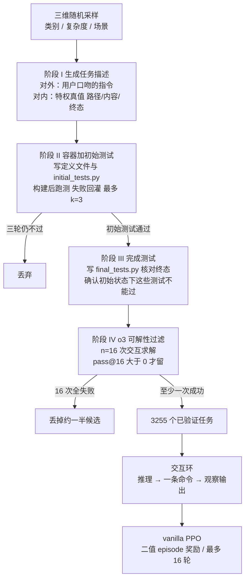

# Endless Terminals：终端 Agent 的瓶颈是环境，不是算法

<!-- release-date: 2026-01-23 -->

> 本文依据 **Endless Terminals: Scaling RL Environments for Terminal Agents**（Kanishk Gandhi、Shivam Garg、Noah D. Goodman、Dimitris Papailiopoulos），即 arXiv:2601.16443 的 **v3**、2026-02-14 修订、共 11 页的预印本。页码均指这份 PDF 本身的页码。v1 于 **2026-01-23** 首次公开（提交 2026-01-23 04:39:55 UTC）；v2 于 2026-01-27；v3 于 2026-02-14 09:14:28 UTC。**解读依据 v3，不换用 v1**：截至 2026-09-10，v3 仍是 arXiv 最新版，与本地 `papers/Stanford/Endless-Terminals.pdf` 一致；按流程应以最新官方版为准，退回 v1 会丢掉后续修订。`release-date` 记录的是首次公开日 2026-01-23，不随 PDF 换版回写。
>
> 作者单位：Gandhi 与 Goodman 署 Stanford；Garg 署 Microsoft Research；Papailiopoulos 署 Microsoft Research / UW-Madison。Gandhi 脚注写明部分工作在 MSR 暑期实习完成（PDF p. 1）。按第一作者 / 主导，本站放在 Stanford 目录。代码脚注给出 <https://github.com/kanishkg/endless-terminals>（PDF p. 1）；仓库只作外部补充，安装步骤和训练脚本不当作 PDF 内容。
>
> 这是一篇**环境生成 + 终端 Agent 训练**论文，没有模型架构和预训练 recipe 可讲。全文把三件事分开写：**论文明确写了什么**（带页码）、**本文如何解释它**（凡属推算、换算或从图上读数都会写明）、**外部资料补充**（给链接并标明是补充）。

## 读之前需要的最少背景

这篇论文只讲一件事：要让语言模型学会在终端里多轮干活，真正不够的是**可自动判分、还能不断长出来的环境**，不是又一个更花哨的强化学习算法。

不熟的话，先记住下面这些词。

**终端 Agent。** 模型待在一个 Linux 容器里，一轮看输出、一轮敲命令，直到文件系统、进程或配置变成题目要求的终态。它不是「写一段 bash 交差」，而是多轮交互：命令可能失败，必须根据 stdout / stderr 改主意。

**一轮 RL 后训练循环。** 拿一批任务，让当前模型自己去跑，这个动作叫 **rollout（轨迹生成）**。跑完的一局叫一条 **episode / trajectory（回合 / 轨迹）**。用一个 **reward（奖励）** 判断这局成没成，再用带奖励的轨迹更新参数。本篇用的算法是 **近端策略优化（Proximal Policy Optimization，PPO）**（Schulman et al., 2017）。

**pass@k。** 同一道题独立试 $k$ 次，至少成功一次就算过。论文的可解性过滤用 pass@16：o3 试 16 次，一次都过不了就丢掉（PDF p. 4）。评测里还会看到 pass@1 和 pass@5。

**脚手架（scaffold）。** 包在模型外面、规定它怎么行动的那层程序：系统提示、工具、上下文怎么拼、何时停。SWE-agent、OpenHands、Terminus 都是脚手架。本篇故意做成最瘦的一种。

**监督微调（Supervised Fine-Tuning，SFT）与蒸馏。** SFT 是拿现成的「好轨迹」做模仿学习。蒸馏是让更强的教师模型先跑，再让学生去学教师的轨迹。论文把这条路看成有天花板：学生超不过教师，而且要付 API 钱（PDF p. 2）。

**Docker / Apptainer / PTY。** Docker 是常见容器；Apptainer（原 Singularity）是 HPC 里常用的另一种容器。**伪终端（pseudo-terminal，PTY）** 是给程序一块「假装的终端屏幕」，好在里面开一个活的交互式 shell。本篇两条路都支持，实验只用 Apptainer + PTY（PDF p. 5）。

**TerminalBench 2.0。** 人工整理的终端评测集，用来测「模型从没见过的人类题目」，不是本篇的训练集（PDF p. 2、7）。

三个容易和邻居搞混的切面，先摆正，后文不再展开：

| 工作 | 它管的那一层 | 本站 |
|---|---|---|
| [SkyRL-Agent](/reports/Berkeley/SkyRL-Agent) | 多轮轨迹里 init / 生成 / 判分怎么叠流水；SWE 配方 | 调度，不生产终端任务 |
| [Polar](/reports/NVIDIA/Polar) | 把现成 harness 当黑盒，在模型 API 上监听 | 观测点，不生成任务 |
| [Agent Lightning](/reports/Microsoft/Agent-Lightning) | Agent 运行时和训练器解耦，按次调用记账 | 接口，不生成任务 |
| 本篇 Endless Terminals | **终端任务本身怎么程序化生成**，再用 vanilla PPO 去训 | 本文 |

PDF 实验实现写的是 SkyRL（Griggs et al., 2025）（PDF p. 6）。那是训练器后端，不是 SkyRL-Agent 那篇调度论文。仓库 README 里的「Install SkyRL」是外部补充，后文单独标明。

## 一句话先说清

这篇论文要解决的矛盾可以这样说：

> **数学和代码的 RL 能涨，是因为题目又多又能自动判对错。终端 Agent 没有这样的训练集：现成 benchmark 是为评测做的，只有几百道，拿去训练会过拟合；蒸馏更强模型有天花板；人标又贵又慢。**

论文原话更硬：Environments are the bottleneck for self-improving agents。当前终端 benchmark 是为评测建的，不是为训练建的；强化学习要的是可扩展流水线，不是又一个数据集（PDF p. 1）。引言补了规模：现有 benchmark 最多几百道，远不够支撑稳健的 RL（PDF p. 2）。

它的回答是一条**全自动**流水线，程序化生成「任务描述 + 容器环境 + 可执行测试」，不靠人工标注、也不靠从更强模型蒸馏出题（PDF p. 1–2）。流水线四段：生成任务描述、搭容器并用初始测试校验、写完成测试、用 o3 的 16 次求解做可解性过滤。过滤后得到 **3255** 个已验证任务（PDF p. 1、5）。

训练侧几乎故意写得朴素：vanilla PPO、二值 episode 级奖励、最多 16 轮、无检索、无多智能体、无专用工具（PDF p. 1、5–7）。主张就一句：**simple RL succeeds when environments scale**（PDF p. 1、7）。

两组必须连页码一起记的数字如下。模型名在 PDF 里有连字符和大小写变体，第一次按摘要写法，并标明这是同一检查点。

**自建 held-out dev**（摘要 PDF p. 1；引言 PDF p. 2；实验 PDF p. 6）：

| 模型（摘要写法） | 训练前 | 训练后 |
|---|---:|---:|
| Llama-3.2-3B | 4.0% | 18.2% |
| Qwen2.5-7B | 10.7% | 53.3% |
| Qwen3-8B-openthinker-sft | 42.6% | 59.0% |

**TerminalBench 2.0**（摘要 PDF p. 1；引言 PDF p. 2；实验 PDF p. 7；论文称「我们的方法」在此基准上对 5 次运行取平均，PDF p. 6 图注）：

| 模型 | 训练前 | 训练后 |
|---|---:|---:|
| Llama-3.2-3B | 0.0% | 2.2% |
| Qwen2.5-7B | 2.2% | 3.4% |
| Qwen3-8B-openthinker-sft | 1.1% | 6.7% |

引言里同一 7B 写成 Qwen-2.5-7B，同一 8B 先写成 Qwen-3-8B-openthinker-sft，隔几行又写成 Qwen-3-8B-Open-Thoughts；训练设定写成 Llama-3.2-3B-Instruct、Qwen2.5-7B-Instruct、Qwen3-8B-openthinker-sft；Figure 3 轴标签是 llama-3.2-3b-instruct / qwen2.5-7b-instruct / qwen3-8b-openthoughts-sft（PDF p. 2、6）。**这些都指同一组检查点**，不是三个 8B。Qwen3-8B-openthinker-sft 本身已在 15,000 条蒸馏轨迹上做过 SFT，后文会讲它从哪来。

请先记住一个读数顺序：**自建 dev 上的大涨，不能直接当成 TerminalBench 上的绝对能力。** 后者最高也只有 6.7%。论文自己把 Claude Sonnet 4.5 + Terminus-2 的 42.8% 放在旁边作对照（PDF p. 7）。Discussion 没有把这个低分圆成「其实已经够用」。

## 全景：任务是造出来的，策略是在容器里试错的

先按 Figure 1 和 Figure 2 把流水线落到一张图上（PDF p. 1、3）。这是机制示意，不是实测时间轴。

这是根据 PDF p. 1 的 Figure 1 与 p. 3 的 Figure 2 重画的**机制示意图**。Figure 1 把四段分别标成 I Task Description、II Container Setup、III Completion Tests、IV Solution Filtering，并在底下写了 Agent 循环、3255 tasks、16 PPO turns、以及 Qwen3-8B 在 TerminalBench 2.0 上 1.1% → 6.7%。Figure 2 把提示词模板、三类样例任务和四个阶段画在同一页。

整套系统可以看成两段，不要焊在一起：

| 段 | 它解决什么 | 对应章节 |
|---|---|---|
| **出题** | 没有人标、也不蒸馏教师，怎样源源不断造出「容器 + 说明书 + 能跑的测试」 | §3 程序化生成 |
| **做题** | 模型怎样跟终端说话、怎样拿一个 0/1 分数去更新 | §4 交互环，§5 的 PPO 设定 |

出题段是这篇真正卖掉的东西。做题段几乎是在说：脚手架和算法都可以先不创新。

## 旧方案为什么绕开了环境瓶颈

### 数学 RL 有环境，终端 RL 没有

引言第一段把对照写死了（PDF p. 2）。语言模型在数学解题、代码生成上靠 RL 变强，前提是有一大批多样、能自动验证的题目。终端不是这样：真实使用要跨多轮推理、从错误里恢复、按顺序执行会改变系统状态的命令。人工去策展这样的环境很贵；现有 benchmark 最多几百道。

**本文的理解：** 几百道够评测「这个模型行不行」，不够拿来做 RL。RL 要的是模型可以反复撞、撞完能自动打分、而且分布还不能太窄的环境。评测集一旦拿去训练，分布就会被记死。

### 三条绕路，论文各打一条

前人基本没去造这个环境，而是绕开它（PDF p. 2）：

1. **把评测集当训练集。** 任务分布窄，有过拟合风险。
2. **从更强的专有模型蒸馏，再做 SFT**（Guha et al., 2025，即 OpenThoughts）。学生继承教师天花板，还要付昂贵的 API。
3. **人标编码或 shell 任务**（Team, 2025a；NL2Bash，Lin et al., 2018）。标注成本限制规模和多样性。

缺的是一条能生成「初始环境 + 任务说明 + 验证测试」、几乎不用人盯的流水线（PDF p. 2）。

相关工作把对照又拆细了一层（PDF p. 2–4）：

**脚手架。** SWE-agent 给代码导航和编辑专用命令；OpenHands 把 bash、文件编辑和浏览器捆在一起；Terminus 更简单，只给一个用击键控制的交互式 tmux。本篇比 Terminus 还瘦：模型只推理、只吐命令，把先前的想法、动作和 shell 输出全部放进上下文（PDF p. 2）。

**SFT 与蒸馏。** OpenThoughts 表明数据质量会带动后续 RL；Gandhi et al. (2025) 把验证、回溯、子目标这些「认知行为」写成可被灌进模型、从而让 RL 能自我改进的东西；Olmo 3 用中期训练的数据配比引出数学和代码能力；OpenThinker-Agent 把这套配方用到终端任务，从强教师蒸馏轨迹。论文的态度是**互补**：SFT 可以给 RL 一个热启动，不是对立面（PDF p. 2–3）。后面 Qwen3-8B-openthinker-sft 就是这个热启动。

**Benchmark 与交互环境。** SWE-Bench 测 GitHub issue，TerminalBench 2.0 测终端，InterCode 测交互式编程，WebArena 测网页导航。共同点是多轮：发命令、看输出、再决定下一步。本篇生成的任务也走这个格式，Agent 对着一个**持久** shell 交互（PDF p. 3）。

**合成环境。** SWEGym 提供 2438 个带可执行测试的 Python 任务，但依赖已有 GitHub issue，不是程序化生成（PDF p. 3）。单轮领域里，Poesia et al. (2024) 让模型自己出题再自己解。论文点名**最接近的工作是 OpenThoughts Agent**：它也为终端使用提供了 SFT 和 RL 任务，可是 RL 数据里含有来自 NL2Bash 的人类查询和命令，并且**没有**在 TerminalBench 2.0 或本篇自建的 endless terminals dev 上带来提升（PDF p. 3–4）。Endless Terminals 的差别被写成两句：任务完全自动、规模任意；vanilla PPO 能涨，而且涨分能转到 held-out 基准上（PDF p. 4）。

**本文的理解：** 三条绕路其实是同一类退让——环境不够用，就去借评测集、借教师、借人。本篇把退让收回来，代价是必须先发明一套「题怎么自己长、长完怎么自己判」的工序。

## 四阶段流水线：先造出能判分的世界，再让模型进去

§3 把流水线写成四段，每一段都建立在前一段上，每一步都用自动校验挡无效题（PDF p. 4）。失败的任务直接丢，整条流水可并行（PDF p. 4）。

### 阶段 I：对外一份用户口吻，对内一份作弊条

提示一个语言模型，让它同时写出两样东西（PDF p. 4；模板见 Figure 2，PDF p. 3）：

- **任务指令**：写成「有人可能会这样问 AI 助手」的口吻。
- **特权真值（privileged ground truth）**：精确文件内容、路径、期望终态，只给自动测试用。**永远不给正在交互的 Agent 看**（PDF p. 4）。

为了多样，每条提示从三个维度随机抽样（PDF p. 4）：

| 维 | 论文举的例子 |
|---|---|
| 任务类别 | 文件管理、文本处理、日志分析、git 操作、数据库查询、安全扫描等 |
| 复杂度 | 从单条命令到多步序列；Figure 2 写成 simple 2–3 commands / multi-step sequential / Set of 5–10 commands |
| 场景 | 开发者整理文件、DevOps 查日志、数据分析师处理 CSV；Figure 2 还有数据库可靠性工程师管备份、MLOps 跟踪实验产物、存储管理员管磁盘 |

Figure 2 把输出格式规定成两段 XML（PDF p. 3，读自该图，不是正文逐字）：

- `<task>`：终态的详细规格（文件、端口、目录、格式）。**不给命令**——Agent 必须自己推断解法。
- `<truth>`：隐藏真值（文件内容、期望输出、环境搭建要求）。

提示词还强调：任务描述里要把自动测试会检查的输出格式写具体。

三个样例任务也在 Figure 2 上（PDF p. 3）：

1. **Shell 环境配置。** 临时把时区设成 UTC、locale 设成 C.UTF-8，不改系统级配置、不用 sudo，再写一份日志证明设置生效。
2. **日志分析。** 解析应用日志，抽出每个服务的错误次数和百分比，输出给监控流水线用的 CSV。
3. **校验和。** 给日志包做 SHA-256，写成「哈希 + 两个空格 + 文件名」的严格格式，写进校验文件。

**本文的理解：** 特权真值是这套流水能自动判分的关键。没有它，测试脚本不知道「正确答案长什么样」；有了它却漏给 Agent，模型就在抄答案，而不是在终端里探索。这也提前埋了 Discussion 里那条限制：为了可验证，规格必须写死，写死之后题目就会像竞赛题，不像真人含糊的请求。

阶段 I 没有写用的是哪个生成模型。正文只说 a language model（PDF p. 4）。**这是原文缺口，不拿仓库默认值来填。**

### 阶段 II：容器要能建起来，初始测试要先过

拿到任务描述和真值之后，模型要写两个文件（PDF p. 4）：

1. **初始状态测试**，Agent 动手前跑，检查前置条件：特定文件、目录、正在跑的进程、已经 clone 的仓库。
2. **Apptainer 定义文件或 Dockerfile**，把这些前置条件装进容器。

容器生成是一个最多 $k=3$ 轮的迭代：模型写定义 → 构建并在里面跑初始测试 → 失败就把失败输出喂回去改。三轮仍拿不出合法容器的任务丢掉（PDF p. 4）。Figure 1 把这一段画成 `docker build → run tests → if fail retry`（PDF p. 1）。

**本文的理解：** 初始测试不是在考 Agent，是在考出题模型有没有把世界搭对。如果日志文件根本不在镜像里，后面无论 Agent 多努力，完成测试都无意义。$k=3$ 是在「让生成模型修自己的错」和「别在一道坏题上烧构建」之间切一刀。论文没报三轮里第一轮就过的比例，也没报因构建失败被丢掉的数量。

### 阶段 III：完成测试必须在初始状态下是红的

第二份测试在任务完成后跑，检查期望终态：新建文件内容对不对、配置改没改、计算结果在不在（PDF p. 4）。测试用的路径、说明和显式数据来自特权真值。

还有一个关键校验：**这些测试在初始状态下不能通过**（PDF p. 4）。否则测试会「一开始就是绿的」，Agent 什么都不做也能拿奖励。

**本文的理解：** 这是在防一套很廉价的作弊——出题模型把终态直接写进镜像，完成测试变成摆设。论文没写这个「初始必须为红」的检查失败了多少题。

### 阶段 IV：o3 试 16 次，一次都过不了就丢

为了保证题是可解的，用 o3 在他们的 Agent 框架里采样 $n=16$ 次求解（PDF p. 4）。每次都是真正的交互：发命令、看输出，直到宣告完成或用尽动作预算。只保留至少成功一次的题，即 $\operatorname{pass@16}>0$，其余丢掉（PDF p. 4，并指向 Figure 6 右）。过滤掉的是规格不足或根本不可能的题；留下的，确认强模型做得到。

实验节把结果量化了（PDF p. 5）：流水线产出 **3255** 道 Apptainer 格式任务，其中大约 **2500** 道也转成了 Harbor 格式。**全部实验走 Apptainer 流水线。** 可解性过滤丢掉大约一半候选——也就是 o3 十六次全失败的那些。

**本文推算：** 若留下 3255 且丢掉约一半，过滤前大约六千多道候选。论文只说 roughly half，不要把 6510 写成原文数字。

Figure 6 右画的是保留下来的题在 16 次 o3 尝试上的通过率分布（PDF p. 7）。图标题写成 O3 Pass@1 Distribution，图注说的是 16 次尝试的成功率。横轴从 0 到 1.0，最高的柱在 1.0，高度大约一半。这和正文「大约一半的题 16 次全过，其余铺开在不同难度上」一致（PDF p. 5）。**本文读图：** 最左侧靠近 0 的矮柱应对应 1/16，而不是 0/16——0/16 已经被阶段 IV 扔掉了。图标题的 Pass@1 和「16 次里的通过比例」不是同一个统计量，本文按图注读。

Figure 6 左是解的长度：横轴对数刻度，大多数任务的交互文本在 1,000 到 4,000 字符，长尾超过 10,000（PDF p. 5、7）。

Figure 4 是类别饼图（PDF p. 5）。正文说文件操作最大，然后是日志管理、数据处理、文本处理、脚本、归档压缩、数据库。图上标了数字的扇区，**本文按渲染页读出**：File Operations 18.8%、Log Mgmt. 16.5%、Data Proc. 13.0%、Scripting 4.8%、Other 39.2%；Text Proc.、Archiving、Database、Network & API 有标签但未印百分比。图注写着 Left:，实际这一页只放了一张饼图。

**可迁移的部分：** 自动出题至少要过四道闸——规格、环境能建、测试非平凡、强模型做得到。少任何一道，RL 拿到的就会是「奖励函数在说谎」的题：要么永远 0，要么什么都不做也是 1。

## 交互环：故意做成最瘦的脚手架

### 每一步只许吐一条命令

每一轮，模型看到完整对话史：自己先前的推理、先前的命令、先前的 shell 输出，然后要么再吐一条命令，要么宣布做完（PDF p. 4–5）。输出用最小 XML：

- `<command>...</command>` 包住要执行的 shell 命令；
- `<command>done</command>` 表示本局结束。

命令前面可以写任意推理，这些推理会进入后续轮的上下文。因此模型可以回看自己刚才怎么想的、改错、或在半成品上继续（PDF p. 5）。

系统提示只有三条：每轮一条命令、用非交互标志、宣布完成前先自己验证。所以 vim、htop 这类交互式工具不能用（PDF p. 5）。

**本文的理解：** 这不是「不会做工具」，是把工具从学习问题里拿掉。论文要证明的是环境规模，不是脚手架。若同时换一套复杂工具，涨分就说不清是环境的功劳还是脚手架的功劳。代价立刻可见：真实运维里人会打开 vim 和 htop；这里的 Agent 被设计成不会。

### 容器里要有一个活着的 shell

Docker 路径走 Harbor 框架（Harbor Framework Team, 2026）；Apptainer 路径用 PTY 维持一个持久的交互式 shell（PDF p. 5）。Agent 连上的那个容器实例在整个 episode 期间一直活着：文件系统、环境变量、正在跑的进程，命令与命令之间都还在。每条命令在这个持久上下文里执行。捕获 stdout、stderr 和退出码，返回一条结构化观察：成功还是失败，然后是输出。这条观察作为下一条用户消息接进对话，循环继续（PDF p. 5）。

实验全部用 Apptainer 流水线（PDF p. 5）。Harbor 格式大约转了 2500 道，但正文没有用 Harbor 跑训练数字。

**外部补充，不是 PDF 内容：** Harbor 是 Laude Institute 的容器内 Agent 评测 / 优化框架，仓库在 <https://github.com/laude-institute/harbor>。本站 [Polar](/reports/NVIDIA/Polar) 把它当成「能跑原生 harness、但不提供训练所需 token 级接口」的评测框架来对照。本篇只把它当作 Docker 侧的执行后端来引用，没有讨论 token 保真或代理。

### 一局何时结束，分数何时才出现

训练时，下面三件事任一发生就停（PDF p. 5）：

1. 模型吐出 done；
2. 达到最多 16 轮；
3. 达到 16k token。

停了之后，在容器里跑**事先留出的完成测试**，通过给 1、否则给 0。没有中间奖励（PDF p. 5–6）。

推理时放宽到 64 轮；碰到上下文上限，就把先前命令的历史折叠进第一条用户消息（PDF p. 6）。失败分析里把这套推理时的上下文处理叫做 sliding window（PDF p. 8）。

**本文构造的走一遍**（任务口吻来自 Figure 2 的日志分析样例，不是论文逐字 trace）：

1. 用户消息给出任务：把应用日志做成监控用的 CSV，按服务统计错误次数和百分比。
2. 模型先写一段「我先看日志在哪」，再吐 `<command>ls /var/log</command>`。
3. 环境回：成功或失败，加上 ls 的输出。
4. 模型根据输出写 awk / python，再执行。
5. 它认为做完了，吐 `<command>done</command>`。
6. 训练器跑 `final_tests.py`。CSV 路径、分隔符、列名对，才是 1。

奖励在第 6 步才出现。第 2 到第 5 步无论看起来多「合理」，只要终态测试是红的，整局都是 0。

**可迁移的部分：** 若你的主张是「环境规模就够了」，脚手架必须先瘦到不能再瘦，否则读者会把涨分记在工具头上。本篇把这个方法论选择写进了系统提示和 XML 约束里。

## 训练设定：vanilla PPO 具体有多 vanilla

实现用 SkyRL（Griggs et al., 2025）（PDF p. 6）。每个训练 batch：每道题采 16 条 rollout，每条最多 16 轮，每轮最多生成 2048 个 token，整段对话上下文 16k。训练和评测温度都是 0.6（PDF p. 6）。

奖励是整局一个标量：完成测试全过为 1，否则为 0，没有过程塑造（PDF p. 6–7）。PPO 裁剪上下界不对称：$\varepsilon_{\text{low}}=0.2$，$\varepsilon_{\text{high}}=0.28$，引用 Yu et al., 2025，也就是本站的 [DAPO](/reports/ByteDance/DAPO)；loss 用 **sequence level averaging**（PDF p. 6）。不加 KL 惩罚，理由只写了一句：anecdotally we found that this hurt performance（PDF p. 6）。为了缩短收集 rollout 的时间，环境超时 5 分钟（PDF p. 6）。

三个被拿来训的起点（PDF p. 6）：

| 检查点 | 它已经带了什么 | 硬件与墙钟 |
|---|---|---|
| Llama-3.2-3B-Instruct | 通用指令模型 | 4 张 A100，大约 2 天 |
| Qwen2.5-7B-Instruct | 通用指令模型 | 4 张 A100，大约 2 天 |
| Qwen3-8B-openthinker-sft | 已在 15,000 条轨迹上 SFT | 8 张 B200，大约 8 小时 |

这 15,000 条轨迹的来源，论文写的是 two sources，后面却列了三项：NL2Bash（Lin et al., 2018）、为 shell 命令格式化而合成的任务、以及把 InferredBugs（Jin et al., 2023）里的 C# / Java bug 转成交互任务。轨迹从 GLM-4.6 蒸馏（PDF p. 6）。本文不替它把三项合并成两项。

论文把自己的设定概括成（PDF p. 7）：

> vanilla PPO，二值 episode 级奖励，没有中间塑造，没有 KL，最小 Agent 架构，无检索、无多智能体脚手架。涨分来自环境规模，不是算法精巧。

**本文的理解，不是论文原话：** 「vanilla」在这里是相对 Agent 脚手架和奖励塑造而言。裁剪已经用了 DAPO 的 clip-higher（上界 0.28 大于下界 0.2），并不是 2017 年那版 PPO 的默认同侧 $\varepsilon$。他们借了 DAPO 的裁剪，却用 sequence-level 平均——DAPO 正文主张的是 token-level，认为句级平均会让长回答里的每个 token 变轻。本篇没有解释为什么留下这一项。KL 去掉，则和 DAPO、不少近期 LLM-RL 配方一致，但本篇给的证据只是 anecdotally。

**未公开：** 学习率、batch size、PPO epoch 数、是否训练 value model、GAE 的 $\lambda$、参考策略多久同步，正文都没写。Figure 3 上排奖励曲线的横轴，**本文读图**大约是 Llama 300 step、两个 Qwen 400 step，正文没有写出这些步数。

## 实验：自建分布上大涨，人类基准上绝对值仍低

### 训练曲线：三个起点都在涨

Figure 3 上排是三条 PPO 奖励曲线（PDF p. 6）。正文的定性结论：无论模型大小还是起点能力，奖励都随训练上升（PDF p. 6）。**本文读图，不是正文数字：** Llama-3.2-3B-instruct 从大约 0.04 升到 0.25 附近；Qwen2.5-7B-instruct 从大约 0.1 升到 0.5 附近，末端有回落；Qwen3-8B-openthoughts-sft 从大约 0.3 升到 0.55 附近，振荡比前两条大。读图精度有限，以正文「consistent improvement」为准。

### 自建 held-out dev：环境对上了，分数就动

数字在摘要、引言、实验各写一次，一致（PDF p. 1、2、6）：

- Llama-3.2-3B：4.0% → 18.2%
- Qwen2.5-7B：10.7% → 53.3%
- Qwen3-8B-openthinker-sft：42.6% → 59.0%

7B 的绝对涨幅最大。8B 起点已经是 42.6%，再涨到 59.0%，说明热启动之后仍有 RL 可吃的信号。论文把这读成：程序化生成流水线提供了可靠的训练信号（PDF p. 6–7）。

Figure 3 下排左还多了一组 **Qwen3-8B + OT-SFT + Terminus-2** 柱。**本文按图读出，正文没有写出这两个数：** 基座加 Terminus-2 脚手架是 48.0%，再叠 OpenThinker 的 RL 掉到 41.3%。对照很刺眼：更复杂的脚手架在这套自建 dev 上，基座分已经高于「无 Terminus-2 的 42.6%」，但 OpenThinker 自己的 RL 没把 48.0% 推高，反而推低；本篇的 RL 在**更瘦的脚手架**上把同一 8B 推到 59.0%。

### OpenThinker dev：一换分布，涨幅就缩小

同一三个模型在 OpenThinker development set 上（PDF p. 7）：

- Llama-3.2-3B：0.0% → 1.0%
- Qwen2.5-7B：3.9% → 8.5%
- Qwen3-8B-openthinker-sft：9.7% → 10.2%

论文自己给的原因：这个基准包含 issue resolution 这类一般软件工程任务，不只是纯终端任务（PDF p. 7）。Figure 3 中间那组 Terminus-2 柱，**本文读图**为 16.2% 对 17.1%（基座 + Terminus-2 对 +RL OpenThinker），几乎不动。

**本文的理解：** 流水线造的是「在容器里用 shell 把终态改对」的题。换到要读仓库、改代码、过项目测试的分布，迁移幅度按作者自己的数就是小的。不要把 53.3% 那个 dev 成绩说成「已经会做软件工程」。

### TerminalBench 2.0：有迁移，但绝对分数很低

人类策展、训练时从未见过。任务生成在 TerminalBench 2.0 发布之前，论文用来排除数据泄漏（PDF p. 7）。数字同样写了三遍（PDF p. 1、2、7）：

- Llama-3.2-3B：0.0% → 2.2%
- Qwen2.5-7B：2.2% → 3.4%
- Qwen3-8B-openthinker-sft：1.1% → 6.7%

论文的比较句是：每一个 case 都超过同一基座架构的其他版本，包括用另一套 RL 配方、并带 Terminus-2 这种 Agent 脚手架的模型（PDF p. 7）。Figure 3 下排右，**本文读图：** Qwen3-8B + OT-SFT + Terminus-2 的基座和 +RL OpenThinker 都是 4.7%。本篇 6.7% 高于 4.7%，这就是「更瘦脚手架 + 本篇环境」对上「更复杂脚手架 + 别人的 RL」的那一柱。

请把 6.7% 和旁边那个对照一起记。论文写：他们最好的模型在 TerminalBench 2.0 上分析的是**一次都没做成的题**；作为参照，Claude Sonnet 4.5 配 Terminus-2、200 轮上限，是 42.8%；他们是 6.7%、64 轮、无 Agent 脚手架（PDF p. 7）。Discussion 没有回头把 6.7% 说成接近可用。摘要里「substantial gains」指的是相对提升和对照柱，不是绝对水平。

pass@5（五次里至少一次成功）随难度下降（PDF p. 8，Figure 7 右）：

| 难度 | pass@5 |
|---|---|
| easy | 25%（1/4） |
| medium | 14.5%（8/55） |
| hard | 10%（3/30） |

**本文按这三档相加：** $4+55+30=89$ 道。正文没有写出 TerminalBench 2.0 的总题数。pass@5 做成的是 $1+8+3=12$ 道，其余约 77 道一次都没做成，后面的失败分析就落在这个分母上。

按类别的 pass@5（PDF p. 8，Figure 7 左）：

| 类别 | pass@5 |
|---|---|
| software-engineering | 6/26 |
| data-science | 1/8 |
| scientific-computing | 1/8 |
| system-administration | 1/9 |
| data-processing | 1/4 |
| security | 1/8 |
| optimization | 1/2 |
| mathematics | 0/4 |
| machine-learning | 0/3 |
| model-training | 0/4 |

Discussion 把软件工程写成 23%（PDF p. 8–9），与 6/26 一致。数学、机器学习、模型训练是零。这些类别相加是 76，不是 89，论文没解释剩下的题归到哪一类。不要把 76 当成全集。

### 失败模式：死循环、轮次用尽、以及根本不会的领域

失败分析的对象是最好模型 qwen-3-8b-openthoguhts-sft（正文此处拼写如此，PDF p. 7）在 TerminalBench 2.0 上零成功的那些题。Figure 5 三根柱（PDF p. 7）：

| 模式 | 占失败的比例 | 题数 |
|---|---:|---:|
| 循环失败（loop failures） | 39% | 30 |
| 轮次耗尽（turn exhaustion） | 26% | 20 |
| 过早结束（early termination） | 49% | 正文未给题数 |

三类加起来超过 100%，因为循环和轮次耗尽重叠：11 道题两种行为都有（PDF p. 8）。**本文核对：** $30+20-11=39$，若失败全集约 77，则其余 $77-39=38$，38/77≈49%，与第三柱一致。训练 16 轮、评测 64 轮加滑动窗口（PDF p. 8）。剩下那 49% 过早交卷，而且经常落在密码分析、机器学习模型提取、生物信息这类模型缺领域知识的题上（PDF p. 8）。

为了解释循环，他们定义 **command diversity**：第一次出错之后，独特命令数 / 总命令数。成功任务平均 0.49，循环失败平均 0.18（PDF p. 8）。成功的会换一条路，失败的在重复同一串命令。循环失败引用了 Pipis et al., 2025（Wait, wait, wait... why do reasoning models loop?）。

**本文的理解：** 二值 episode 奖励在这里帮不上忙。循环的每一步看起来都像「还在干活」，终态测试红了才知道整局是 0。多样性 0.49 vs 0.18 是事后统计，不是训练时的奖励。论文在 Discussion 里把「探索替代路径」写成关键（PDF p. 8），但训练目标并没有为这件事加项。

### SFT 和 RL 被写成互补，不是替代

Qwen3-8B-openthinker-sft 先在 15,000 条蒸馏轨迹上 SFT，再做本篇的 RL，TerminalBench 2.0 最终 6.7%，是三个模型里最高的（PDF p. 8）。论文的读法：更强的起点会放大 RL 的收益；SFT 提供热启动，RL 在上面继续走（PDF p. 8，引用 Gandhi et al., 2025 与 Guha et al., 2025）。相关工作里那句「These approaches are complementary」在这里落地（PDF p. 3）。

注意边界：热启动用的轨迹来自 GLM-4.6，**出题流水线**被写成不从更强模型蒸馏（PDF p. 1、8）。两件事不要混——题是程序化生成的，8B 这个起点不是从零开始的。

## 作者自己承认的限制，按 Discussion 写，不帮它圆

§6 先用一段复述贡献：无人工标注、无教师蒸馏的四阶段流水线，3,255 道有效任务，PPO 在不同规模上稳定提升，并能转到 TerminalBench 2.0（PDF p. 8）。随后进入限制和后续方向。下面按论文自己的顺序写，不把相对涨幅拿来抵消这些句子。

**任务不像真人会问的那种。** 程序化生成的题更像竞赛编程，不像用户真正丢给 AI 助手的、messy、underspecified 的请求。真实终端使用经常目标含糊、上下文隐含，可能需要澄清问题。这些很难在自动生成的规格里抓住，同时又保住可验证性（PDF p. 9）。更好的用户建模或许能造出「模糊」环境；把生成提示词调成更自然的请求、同时仍够测试去判，仍是未解决问题（PDF p. 9）。

**可解性过滤自带能力天花板。** 用 o3 的 pass@16，只留至少成功一次的题，丢掉大约一半候选。这能确认留下的题可解，也能去掉规格不足或无效的题，**但也会丢掉超出 o3 能力的题**。流水线因此造不出超越前沿验证器的任务。更强模型出现后天花板会升高，可依赖固定前沿验证器，就训不出真正新颖的问题。论文指向 self-play：让模型生成刚好超出当前能力的题再去解，难度可以自适应涨，不必绑死一个验证器（PDF p. 9，引用 Poesia et al., 2024 与 Zhao et al., 2025，即 Absolute Zero）。

**人进回路会更好，也会更贵。** 让人来验证生成的题，或提供更自然的任务描述，质量和多样性可能超过纯合成，但生成成本上升，流水线更不容易规模化（PDF p. 9）。

**脚手架、奖励、世界模型都还没试。** 更丰富的 Agent 脚手架（检索、多智能体、工具）可能带来更多提升；按通过的测试用例数给部分奖励，而不是二值 episode 奖励，信号会更密（PDF p. 9）。学习终端动态的世界模型，或把环境动态蒸馏进基于推理的经验模型，或许能让 Agent 先在想象的 rollout 里规划再执行，从而提高样本效率（PDF p. 9）。

**领域覆盖不够。** 软件工程 23%，数学 / 机器学习 / 模型训练为零。论文说这个缺口**可能**反映程序化生成流水线对这些领域覆盖不足（PDF p. 8–9）。这是作者自己的猜测，不是消融证明。

把实验节那条对照一并读，不要只停在 Discussion。最好模型 6.7%、64 轮、无脚手架；Claude Sonnet 4.5 + Terminus-2、200 轮是 42.8%（PDF p. 7）。循环 39%、轮次耗尽 26%、过早结束 49%（有重叠）。绝对值低、失败以原地打转和不会的领域为主——这些是论文写出来的现象，不是「方法还没调好、调好就会接近 42.8%」。论文最后把自己定位成 greater effort 里的 one cog，并希望社区在算法、脚手架、训练目标之外，也投资自动任务生成（PDF p. 9）。

致谢有一条实质信息：工作在 KG 的微软研究院实习期间启动；感谢 Vaish Shrivastava、Sahaj Agarwal、Vasilis Kontonis、Ahmed Awadallah、Corby Rossett、Shital Shah；KG 在 Stanford 期间由 HAI-SAP Grant、Affective Science Fellowship 和 NSF Expeditions 资助（PDF p. 9）。

## 可迁移启发

### 1. 先问环境能不能规模化，再问算法要不要换

数学 RL 的可验证奖励能工作，是因为「题目 + 判分」已经是现成工厂。终端没有这个工厂。本篇把工厂本身当成研究对象。自己的项目若卡在 Agent 不涨分，先数训练集有多少道**能自动判、且不是评测集本身**的题。题不够时换 PPO 变体，多半是在空锅里搅拌。

### 2. 自动出题至少要过四道闸

规格、环境能建、测试非平凡、强模型做得到。少「初始必须为红」，奖励会变成免费午餐；少 o3 过滤，训练集会混进无解的题，梯度以 0 为主。闸的具体模型可以换，闸的种类很难省。

### 3. 特权真值不要泄漏给策略

测试需要精确终态，策略不能看见精确终态。这是竞赛题的隐藏测试用例，搬到 Agent 里同样成立。泄漏的那一刻，模型学的就变成「读答案」而不是「用终端」。

### 4. 若主张是环境，脚手架必须先瘦

本篇把 vim / htop 直接禁掉，不是因为它们无用，是因为对照要干净。想证明「数据 / 环境 / 奖励」里的某一项，就把另外两项先固定成最小可用。否则 53.3% 会被读成「我们的工具更强」。

### 5. 用评测集训练和在评测集上**迁移**，不是一回事

本篇反复强调没在 TerminalBench 上训练，生成还早于该基准发布。自建 dev 的 53.3% 和 TerminalBench 的 6.7% 必须分开记。自己做 Agent RL 时，至少留一个生成流程碰不到的人类基准；涨分只出现在合成分布上，优先怀疑过拟合，而不是先发「环境规模化成功」。

### 6. 过滤器会变成天花板

pass@16 from o3 让训练集干净，也让训练集不可能难于 o3。任何「用更强模型当过滤器」的流水线都买下同一笔账。要超越过滤器，得换成 self-play 或人，论文把两条都写成未做。

### 7. 二值终局奖励省事，也看不见循环

循环失败占 39%，命令多样性 0.49 vs 0.18。这些统计出现在事后分析，没有进入训练目标。终局 0/1 看不出「正在原地转」。若失败日志里大量重复命令，先加过程信号或多样性惩罚，再考虑换算法家族。

### 8. SFT 热启动和「出题不蒸馏」可以同时成立

8B 的最高分建立在 GLM-4.6 蒸馏的 15,000 条轨迹上；题本身不是从教师轨迹里抄来的。不要把「环境不蒸馏」听成「整条配方零蒸馏」。起点能力和题库来源是两笔账。

## 关键词回看

- **Endless Terminals：** 一条全自动、程序化生成终端任务的流水线，产出 3255 道已验证题，再用 vanilla PPO 训练终端 Agent（PDF p. 1）。
- **程序化生成（procedural generation）：** 按类别 / 复杂度 / 场景采样，模型写出任务，而不是人写、也不是从 GitHub issue 里收（PDF p. 4）。
- **特权真值（privileged ground truth）：** 只给测试看的精确路径、内容和终态，不给 Agent（PDF p. 4）。
- **初始测试 / 完成测试：** 前者在 Agent 动手前确认世界搭对；后者在结束后确认终态。完成测试必须在初始状态下失败（PDF p. 4）。
- **$k=3$ 容器迭代：** 构建失败就把日志回灌给生成模型，最多三轮，再不行丢题（PDF p. 4）。
- **pass@16 可解性过滤：** o3 交互求解 16 次，一次都不过就丢；大约一半候选被丢掉（PDF p. 4–5、9）。
- **最小交互环：** `<command>` 包一条命令，`<command>done</command>` 结束；推理可写在标签前，历史全部留在上下文（PDF p. 5）。
- **Apptainer + PTY：** 实验用的持久 shell；Docker + Harbor 是另一条支持路径，训练数字不是它跑出来的（PDF p. 5）。
- **二值 episode 奖励：** 整局完成测试通过为 1，否则 0，无中间奖励（PDF p. 6）。
- **clip-higher：** $\varepsilon_{\text{low}}=0.2$，$\varepsilon_{\text{high}}=0.28$，引自 DAPO；本篇仍称 vanilla PPO（PDF p. 6）。
- **Qwen3-8B-openthinker-sft：** 同一检查点还被写成 Qwen-3-8B-Open-Thoughts / qwen3-8b-openthoughts-sft；在 NL2Bash、合成 shell 任务和 InferredBugs 上、从 GLM-4.6 蒸馏的 15,000 条轨迹做了 SFT（PDF p. 2、6）。
- **TerminalBench 2.0：** 人类策展的 held-out 终端基准。本篇最好 6.7%；Claude Sonnet 4.5 + Terminus-2、200 轮为 42.8%（PDF p. 7）。
- **command diversity：** 第一次出错后独特命令占比。成功 0.49，循环失败 0.18（PDF p. 8）。
- **simple RL succeeds when environments scale：** 全文口号。实验支持的是「在这套合成终端任务上，瘦脚手架 + PPO 能涨，并能部分转到人类基准」；不支持「绝对值已经够用」（PDF p. 1、7、9）。

## 最后的判断

这篇 11 页预印本卖掉的不是新的策略梯度，而是一条能把终端任务做成 RL 粮食的流水线。四段闸（描述、容器、完成测试、o3 可解性）加上特权真值不泄漏，构成一套可并行、失败即丢的出题工厂。训练侧几乎拒绝加戏：16 轮、0/1 奖励、无检索、无多智能体、XML 里一次一条命令。

被实验撑住的部分很具体：

- 同一分布的 held-out dev 上，3B / 7B / 8B 都涨，7B 从 10.7% 到 53.3%（PDF p. 6）；
- 没在上面训练的 TerminalBench 2.0 也涨，且瘦脚手架下的 6.7% 高于图上 Terminus-2 那组 4.7%（PDF p. 7，4.7% 读自 Figure 3）；
- OpenThoughts Agent 那条「人类 NL2Bash + 蒸馏」路线，被作者写成没有在这两个基准上涨起来（PDF p. 3–4）。

撑不住、或作者已经自己写下来的部分同样具体：

- TerminalBench 绝对分数是 6.7%，对照是 42.8%（PDF p. 7）；
- 合成题像竞赛，不像真人含糊请求（PDF p. 9）；
- o3 过滤让题集超不过 o3（PDF p. 9）；
- 数学 / ML / 模型训练为零，循环占失败的 39%（PDF p. 8）。

如果只记一句话，可以记：

> **终端 Agent 缺的是能无限长出来、还能自动判分的环境。先把这套工厂搭起来，vanilla PPO 才有东西可吃；吃完之后，人类基准上的绝对分数仍然很低，论文没有假装它已经够用。**

## 资料与阅读边界

- **原始依据：** 本地 `papers/Stanford/Endless-Terminals.pdf`，**Endless Terminals: Scaling RL Environments for Terminal Agents**，arXiv:2601.16443v3，2026-02-14，共 11 页（正文 §1–§6 与致谢 p. 1–9，参考文献 p. 9–11）。`pdfinfo` 读出 Pages: 11。本文所有页码指这份 PDF 的文件页码。
- **版本核验：** [arXiv:2601.16443](https://arxiv.org/abs/2601.16443)。提交历史：v1 2026-01-23 04:39:55 UTC（783 KB）；v2 2026-01-27 03:34:47 UTC（980 KB）；v3 2026-02-14 09:14:28 UTC（981 KB）。**截至 2026-09-10 核验，v3 仍是最新，与本地原件一致，未替换。** 不换用 v1 的原因见文首：解读跟最新官方版；`release-date` 仍取首次公开日。
- **`release-date` 取 2026-01-23。** 对象是一套公开技术 / 预印本，不是对外可用的模型权重。按流程取该技术首次官方公开日，即 arXiv v1。未找到更早的官方博客或仓库 release 早于这一天。
- **作者与归属：** Kanishk Gandhi（Stanford；脚注：部分工作在 MSR 暑期实习完成）、Shivam Garg（Microsoft Research）、Noah D. Goodman（Stanford）、Dimitris Papailiopoulos（Microsoft Research / UW-Madison）（PDF p. 1）。按第一作者放 `reports/Stanford/`。
- **官方代码（外部补充，本文未把 README 当论文）：** [kanishkg/endless-terminals](https://github.com/kanishkg/endless-terminals)。PDF 脚注给出该地址（PDF p. 1）。仓库 README 另有本 PDF 没有写的内容，不得回写成论文方法，包括：用 `Qwen/Qwen3-32B` 跑 `generate_tasks.py` / `generate_solutions.py`；`./scripts/install_sky.sh` 与 `train/main_endless.py`；Harbor 评测脚本 `parallel_harbor.sh`；Hugging Face 集合 [obiwan96/endless-terminals](https://huggingface.co/collections/obiwan96/endless-terminals)。PDF 只说阶段 I 用 a language model，没有点名 Qwen3-32B。
- **外部补充清单**（均已在正文标明，不与论文内容混用）：
  - arXiv 提交历史与摘要页：[arXiv:2601.16443](https://arxiv.org/abs/2601.16443)；
  - Harbor 框架仓库（论文引用，PDF p. 5、10）：<https://github.com/laude-institute/harbor>；
  - OpenThoughts / OpenThoughts-Agent、Terminal-Bench、SWEGym、NL2Bash、InferFix / InferredBugs、o3 system card，只按 PDF 参考文献理解，本文没有另读这些原件来改写本篇数字；
  - clip-higher 的机制背景见本站 [DAPO](/reports/ByteDance/DAPO)，本篇只使用 PDF 写出的 $\varepsilon$ 值；
  - 邻居切面：[SkyRL-Agent](/reports/Berkeley/SkyRL-Agent)、[Polar](/reports/NVIDIA/Polar)、[Agent Lightning](/reports/Microsoft/Agent-Lightning)。SkyRL-Agent 不生产终端任务；Polar 把 harness 当黑盒；Agent Lightning 解耦运行时与训练器。PDF 里的 SkyRL 是 Griggs et al., 2025 的训练实现（PDF p. 6），不要和 SkyRL-Agent 那篇调度论文焊成一个东西。
- **本文标为「读图」或「本文推算」的地方：** Figure 4 扇区百分比；Figure 3 奖励曲线的近似终值与 step 数；Figure 3 柱上 Terminus-2 的 48.0 / 41.3 / 16.2 / 17.1 / 4.7；Figure 6 右「约一半在 1.0」的柱高；失败分析分母 $4+55+30=89$、零成功约 77；过滤前候选约六千（由 3255 与 roughly half 反推）。这些不是论文正文给出的精确数字。
- **未公开 / 无法核实的缺口：**
  - 阶段 I / II / III 用的生成模型名字、温度、提示词全文（Figure 2 只有节选）；
  - $k=3$ 迭代的成功率、因构建失败丢掉的题数、「初始必须为红」淘汰了多少题；
  - 3255 的精确过滤前总数（只有 roughly half）；
  - PPO 的学习率、batch size、epoch、value model / GAE 是否存在；
  - Harbor 那约 2500 道是否跑过任何训练或评测数字；
  - held-out dev 和 OpenThinker dev 的题数、抽样方式；
  - TerminalBench 2.0 的官方总题数（本文只按三档难度相加得到 89）；
  - Figure 7 类别之和 76 与 89 的差去了哪里；
  - 5 次 TerminalBench 运行的方差或置信区间（只说 averaged over 5 runs）；
  - 命令多样性 0.49 / 0.18 的样本量和显著性检验。
- **图表说明：** 文中唯一一张 Mermaid 是按 Figure 1 / Figure 2 重画的机制示意图，不表示实测时长。饼图、柱状图、曲线均未复制进站内图片，数字能写成表格的已改写成表格。
