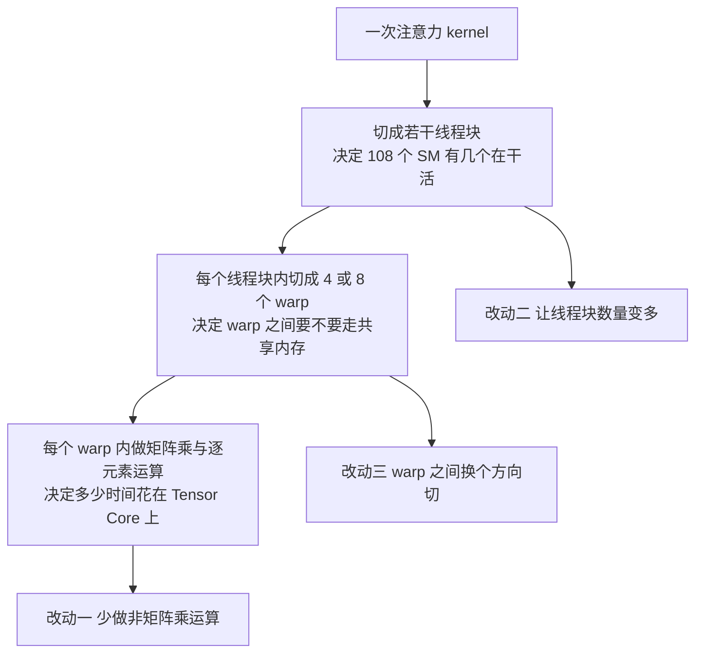
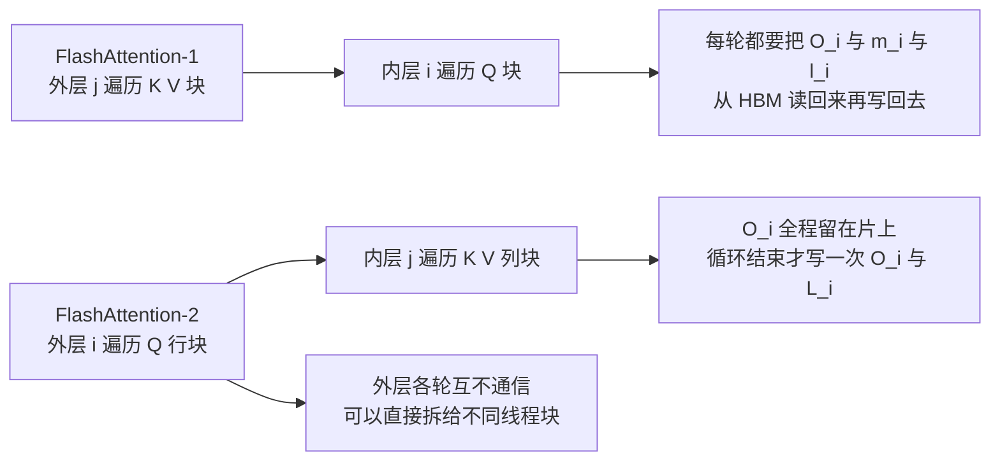
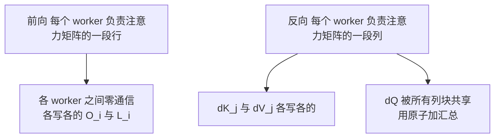
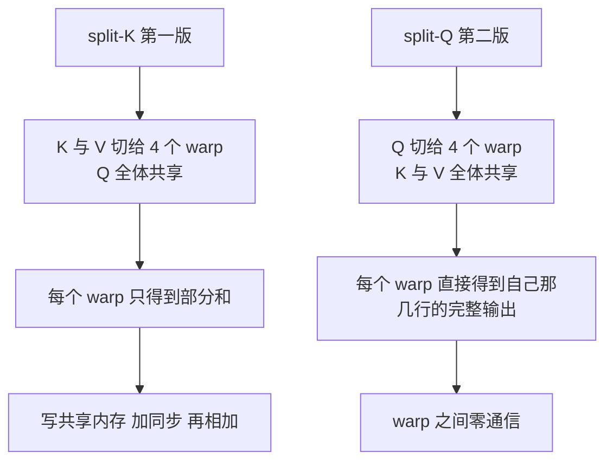

# FlashAttention-2：数据已经不用来回搬了，可 GPU 还有一多半时间没在算矩阵乘

<!-- release-date: 2023-07-17 -->

> 本文依据 **FlashAttention-2: Faster Attention with Better Parallelism and Work Partitioning**（Tri Dao，普林斯顿大学计算机系 / 斯坦福大学计算机系），即 arXiv:2307.08691v1，PDF 封面日期 2023 年 7 月 18 日，共 14 页（正文 12 页、致谢与参考文献 2 页，**没有附录**）。**页码均指 PDF 本身的页码**，不是论文小节号。
>
> **版本核验**：arXiv 官方页只有 v1 一个版本，本地 PDF 就是最新版，无需替换（证据见文末）。
>
> 全文严格区分三层：**论文明确写了什么**（带页码）、**我们如何理解它**（标注「本文的理解」「本文推算」「本文核对」）、**外部资料补充**（给链接并标明是补充）。
>
> **前置阅读**：这一篇不重讲 IO 感知、tiling、recomputation 和 IO 复杂度，那些在 [FlashAttention](/reports/Stanford/FlashAttention) 那篇里已经讲透。本文只讲 FA-2 自己改了什么。

## 先看一组和第一版完全不同的反常数字

第一版 FlashAttention 的那张关键表说的是「搬了多少字节」：标准注意力 40.3 GB，FlashAttention 4.4 GB。

FlashAttention-2 的开场数字换了一套完全不同的度量：

| 对象 | 达到理论峰值算力的百分比 | 出处 |
|---|---|---|
| FlashAttention 前向 | 30–50% | PDF p.2（引言，指向 Figure 5） |
| FlashAttention 反向 | 25–35% | PDF p.2（引言，指向 Figure 6） |
| 优化过的矩阵乘 GEMM | 80–90% | PDF p.2 |

这三行数字就是整篇论文的起点。

第一版把访存这本账算平了：它不再反复把 $N\times N$ 的中间矩阵写回显存。可是把账翻到另一页，会看到一个新问题——**这块卡的算力，注意力只用上了三分之一左右，而同一块卡跑普通矩阵乘能用到八成半。**

论文的判断很直接：这中间的差距不是访存造成的，是**工作没有分对**。原话是，FlashAttention 在不同的线程块和 warp 之间存在次优的工作划分，结果要么占用率低，要么产生了不必要的共享内存读写（PDF p.2）。

于是这篇论文要做的事情，一句话就能说完：

> **第一版解决的是「数据不要来回搬」；第二版解决的是「搬完之后，机器怎么才能一直有活干、并且干的都是它最擅长的那种活」。**

**本文核对（两处口径不一致，先说清楚，免得后面对不上）：**

- 摘要写的是 FlashAttention「只达到理论最大 FLOPs/s 的 25–40%」（PDF p.1），引言写的是前向 30–50%、反向 25–35%（PDF p.2）。两处区间不同，论文没有说明哪一个是合并口径。本文后面引用时一律用引言那组，因为它分了前向反向，可追到 Figure 5 与 Figure 6。
- 摘要说 FA-2 达到「理论最大 FLOPs/s 的 50–73%」（PDF p.1），引言说前向最高 73%、反向最高 63%（PDF p.2）。这两处是自洽的。

## 这篇报告怎么读

先说清这份材料的形态，可以省掉很多期待落空。

FlashAttention-2 是一份 **14 页的技术报告**，不是一篇有定理和附录的会议论文。它的结构非常紧凑：

| 页码 | 内容 |
|---|---|
| p.1–2 | 摘要与引言，把三条贡献直接列出来 |
| p.2–5 | 背景：GPU 硬件与执行模型、标准注意力、第一版 FlashAttention 的前向与反向 |
| p.5–9 | **正文**：§3.1 算法微调、§3.2 并行、§3.3 warp 分工，外加两段完整的算法伪代码 |
| p.9–12 | 实验：注意力层吞吐（Figure 4–6）、端到端训练（Table 1）、讨论与未来方向 |
| p.13–14 | 致谢与参考文献 |

**没有附录，没有证明，没有 IO 复杂度分析。** 理论部分整体让渡给了第一版（PDF p.7 明说「证明几乎一样，因此省略」）。

所以这篇文章的读法是：

1. 先接受一个前提——第一版已经把「注意力受访存限制」这件事解决了，本篇不再讨论它；
2. 把注意力放在**三处改动各自解决的是哪一层的浪费**上，这是全篇的骨架；
3. 实验部分主要看**分母**（对照的是谁、在什么形状下），因为同一个「2×」在不同对照物下含义差很多；
4. 最后必须把「论文没写什么」读完——这一版省略的东西比第一版多得多。

## 读之前补四个词

第一版那篇只需要三个词（kernel、HBM、SRAM）。这一篇要往硬件里再走一层，所以要补四个。论文自己在 §2.1 的「执行模型」里把它们排成了一条链（PDF p.2）：

- **线程块（thread block）**：一批被打包在一起、调度到同一个流多处理器上执行的线程。它是 GPU 调度的基本单位。你派发一个 kernel，实际上是派发了一大堆线程块。
- **流多处理器（Streaming Multiprocessor，SM）**：GPU 上真正干活的物理单元。一张 A100 有 108 个（PDF p.2、p.7）。**一个线程块只能跑在一个 SM 上**，所以线程块的数量如果比 SM 少，就有 SM 在空转。
- **warp（线程束）**：线程块内部再分的小组，**每组固定 32 个线程**（PDF p.2）。同一个 warp 内的线程可以用快速的 shuffle 指令直接交换数据；不同 warp 之间要交换数据，就必须绕道共享内存。
- **共享内存（shared memory）**：就是第一版里说的片上 SRAM，从编程视角看它叫共享内存，是同一个线程块内所有 warp 都能读写的一小块高速空间（PDF p.2）。

还有一个贯穿全文的指标：

- **占用率（occupancy）**：论文自己给的定义是「GPU 资源被使用的比例」（PDF p.2）。**本文的理解**：可以先粗暴地理解成「108 个 SM 里有几个在干活」。占用率低不代表算得慢，而是代表很多硬件根本没被叫醒。

有了这四个词，就可以把 FA-2 的三处改动放进一张层级图里：

这张图是**层级示意**，依据 PDF p.2 的执行模型段落与 §3.1、§3.2、§3.3 三节的分工重画，箭头表示包含关系与改动落点，不表示数据流，也不含实测数据。

记住这张图的顺序：**改动二在最外层（线程块），改动三在中间层（warp），改动一在最内层（指令）。** 后面会逐层展开。

## 论文复述的背景：为什么反向天生比前向难

开头那张表里，前向 30–50%、反向 25–35%，反向明显更低。这个差距不是实现没写好，是结构性的。论文在 §2.2 和 §2.3.2 里把原因交代清楚了，这里花一小节讲透，因为它决定了后面三处改动在反向上都只能「改善」不能「根治」。

### 前向只有两次矩阵乘

标准注意力的定义（PDF p.3）：给定 $\mathbf{Q},\mathbf{K},\mathbf{V}\in\mathbb{R}^{N\times d}$，

$$
\mathbf{S}=\mathbf{Q}\mathbf{K}^\top,\qquad \mathbf{P}=\operatorname{softmax}(\mathbf{S}),\qquad \mathbf{O}=\mathbf{P}\mathbf{V}
$$

其中 $N$ 是序列长度，$d$ 是头维，softmax 逐行做。论文给的典型量级是 $N$ 在 1k 到 8k 之间，$d$ 在 64 到 128 之间（PDF p.3）——记住这个比例，$N$ 比 $d$ 大一到两个数量级。

**前向只有两次矩阵乘**：$\mathbf{Q}\mathbf{K}^\top$ 和 $\mathbf{P}\mathbf{V}$。

### 反向有五次矩阵乘

设 $\mathbf{dO}$ 是损失对 $\mathbf{O}$ 的梯度，链式法则给出（PDF p.3）：

$$
\mathbf{dV}=\mathbf{P}^\top\mathbf{dO},\qquad \mathbf{dP}=\mathbf{dO}\,\mathbf{V}^\top,\qquad \mathbf{dS}=\text{dsoftmax}(\mathbf{dP}),\qquad \mathbf{dQ}=\mathbf{dS}\,\mathbf{K},\qquad \mathbf{dK}=\mathbf{dS}^\top\mathbf{Q}
$$

符号说明：$\text{dsoftmax}$ 是逐行 softmax 的反向。论文给了它的展开式——若 $p=\operatorname{softmax}(s)$，输出梯度为 $dp$，则输入梯度 $ds=(\operatorname{diag}(p)-pp^\top)dp$（PDF p.3）。

（**本文核对**：最后一式论文原文写作 $\mathbf{dK}=\mathbf{Q}\,\mathbf{dS}^\top$，那样写维度对不上，$\mathbf{Q}$ 是 $N\times d$ 而 $\mathbf{dS}^\top$ 是 $N\times N$。上面按正确顺序抄录。完整笔误清单见后文。）

数一数矩阵乘：$\mathbf{dV}$ 一次、$\mathbf{dP}$ 一次、$\mathbf{dQ}$ 一次、$\mathbf{dK}$ 一次，加上重算 $\mathbf{S}$ 需要的一次——**总共五次**。论文在 §2.3.2 和 §4.1 都点了这个数：反向有 5 次矩阵乘，前向只有 2 次（PDF p.5、p.10）。这也是论文把反向 FLOPs 取为前向 2.5 倍的依据（PDF p.10）。

### 于是反向面对三重不利

论文的原话是：反向在概念上比前向更简单（没有 softmax 的重缩放），但**实现上要复杂得多**，因为反向需要在 SRAM 里同时保留更多的值（PDF p.5）。把三条不利并排列出来：

1. **计算量本身是 2.5 倍**（PDF p.10）；
2. **片上要放的东西更多**：前向只要 $\mathbf{Q}_i,\mathbf{K}_j,\mathbf{V}_j,\mathbf{O}_i$，反向还要加上 $\mathbf{dO}_i,\mathbf{dQ}_i,\mathbf{dK}_j,\mathbf{dV}_j$（PDF p.7，Algorithm 2）。片上空间被挤占，块就只能开得更小；
3. **依赖关系更纠缠**：三个梯度的索引方向不一致，$\mathbf{dQ}$ 跟着行走，$\mathbf{dK},\mathbf{dV}$ 跟着列走，无论怎么切都有一个要跨块共享（PDF p.8、p.9）。

**本文的理解**：这三条合起来解释了本文后面反复出现的一个现象——FA-2 的三处改动在反向上都要打折。改动二在反向要引入原子加；改动三在反向仍然需要同步。最终结果就是开头那张表：前向能到 73%，反向只有 63%（PDF p.2）。

（背景部分还有一张 Figure 1，画的是第一版前向如何把 $\mathbf{K},\mathbf{V}$ 切成两块、分别算完再重缩放（PDF p.4）。那是第一版的机制，本文不重讲，需要的话看 [FlashAttention](/reports/Stanford/FlashAttention)。论文自己也注明该图为了简洁省略了 softmax 里减去行最大值那一步。）

**可迁移启发**：当一个流程的正向和反向不对称时，先去数**中间量的数量**和**索引方向的数量**，而不是数运算量。运算量差 2.5 倍是最容易解决的那一项；索引方向不一致才是真正限制并行方案的那一项。

## 换一把新尺子：从「搬了多少字节」到「多少时间花在 Tensor Core 上」

### 一个 16 倍的价差

论文在 §3.1 开头给了一组硬件参数，这组数字是整个第一处改动的全部理由（PDF p.5）：

| 运算类型 | A100 理论峰值吞吐 |
|---|---|
| FP16/BF16 矩阵乘（走 Tensor Core） | 312 TFLOPs/s |
| 非矩阵乘的 FP32 运算 | 19.5 TFLOPs/s |

$312 / 19.5 = 16$。论文把这件事翻译成了一句非常好记的话：**每一次非矩阵乘的浮点运算，比一次矩阵乘的浮点运算贵 16 倍**（PDF p.5）。

先解释「非矩阵乘运算」指什么。在注意力里，除了 $\mathbf{Q}\mathbf{K}^\top$ 和 $\mathbf{P}\mathbf{V}$ 这两次矩阵乘之外的所有算术都算：取每行最大值、做指数、求每行的和、做除法、加掩码。它们逐元素地作用在 $B_r\times B_c$ 的分块上，用的是普通的 CUDA 核心，碰不到 Tensor Core。

**这里最容易被误读，必须说准确。** 非矩阵乘运算的**次数**在总 FLOP 里只占很小一部分——论文自己就是这么说的（PDF p.2）。但它们的**耗时**占比高得多，因为单价贵 16 倍。论文的结论是：要想让整体吞吐超过理论峰值的 50%，就得把尽可能多的时间花在矩阵乘上（PDF p.5）。

**本文的理解**：这是一次典型的「指标换挡」。第一版的指标是 HBM 字节数，因为那时的瓶颈在搬运；这一版的指标是「有效 FLOPs/s」，因为搬运已经不是瓶颈了。同一个算法，在优化的不同阶段要用不同的尺子量——这是本文最值得带走的方法论之一，后面的「可迁移启发」会再回到它。

### 顺便说清 FLOPs/s 是怎么算的

因为全文的主指标从时间换成了吞吐，就必须知道分子是怎么定义的，否则百分比没法比。论文在 §4.1 给了注意力层的口径（PDF p.10）：

$$
\text{前向 FLOPs} = 4 \cdot \text{seqlen}^2 \cdot \text{head dim} \cdot \text{number of heads}
$$

符号解释：$\text{seqlen}$ 是序列长度，$\text{head dim}$ 是每个注意力头的维度 $d$，$\text{number of heads}$ 是头数。系数 4 来自两次矩阵乘各自的 $2\cdot N^2 d$（一次乘一次加算两个 FLOP）。

后面两条口径同样重要（PDF p.10）：

- 带因果掩码时，把这个数**除以 2**，因为大约只有一半的位置需要算；
- 反向的 FLOPs 取前向的 **2.5 倍**，因为前向有 2 次矩阵乘，反向有 5 次（其中包含重算）。

**本文的理解**：这三条合起来说明，论文报出来的「TFLOPs/s」是**按数学上应该做多少次运算**折算的，不是数着硬件实际发射了多少条指令。所以它天然把「非矩阵乘运算多花的时间」计入了分母，而不是分子——这正是 FA-2 想优化的东西能在这个指标上体现出来的原因。

## 全景：三处改动分别接在系统的哪一层

在拆细节之前，先把三处改动和它们各自解决的矛盾并排放一次（PDF p.2 的三条贡献 + §3.1、§3.2、§3.3）：

| 改动 | 落在哪一层 | 解决的旧问题 | 论文小节 |
|---|---|---|---|
| 减少非矩阵乘运算 | 指令级 | 每处理完一个块就整块做一次除法，这些除法单价贵 16 倍 | §3.1，PDF p.5–7 |
| 沿序列长度并行 | 线程块级 | 线程块数 = batch × 头数；长序列时 batch 小，108 个 SM 用不满 | §3.2，PDF p.7–8 |
| warp 之间换方向切 | warp 级 | split-K 方案让每个 warp 只拿到部分和，必须走共享内存汇总 | §3.3，PDF p.9 |

论文自己给这三条合起来估的收益是「2–3× 加速」（PDF p.5，§3 开篇），摘要里给的是「约 2×」（PDF p.1）。

一句话把这三条串起来：

> **让更多的 SM 有活干（改动二），让每个 warp 干完自己的活就不用找别人对账（改动三），让每个 warp 干的活里尽量都是矩阵乘（改动一）。**

下面按论文的顺序讲，但每一节都会说清它接在上面这张表的哪一行。

## 改动一：把归一化推迟到最后一刻

### 旧问题：每处理一个块就整块除一次

先回忆第一版的在线 softmax 是怎么更新输出的。第一版每吃进一个新的 $\mathbf{K},\mathbf{V}$ 块，就把累积输出 $\mathbf{O}$ 重新归一化一次——它的 Algorithm 1 第 12 行里，等号右边的两项都要乘上 $\operatorname{diag}(\ell_i^{\text{new}})^{-1}$，也就是**整块除以当前累积的指数和**（推导见 [FlashAttention](/reports/Stanford/FlashAttention)）。

符号先统一：上标 $(1)$、$(2)$ 表示「处理完第 1 块之后」「处理完第 2 块之后」；$\ell$ 是当前累积的指数和（softmax 的分母）；$m$ 是当前见过的行最大值；$\operatorname{diag}(\cdot)$ 把一个向量摊成对角矩阵，作用是让每一行用自己的标量做缩放。

FA-2 的 §3.1.1 第一句就是冲着这件事去的（PDF p.5，本文转述）：

> 我们不必对输出更新的**两项**都做 $\operatorname{diag}(\ell^{(2)})^{-1}$ 的缩放。

问题在于「多少次」：循环有多少轮，就除多少轮。而 $\mathbf{O}_i$ 是一整块 $B_r\times d$ 的矩阵，每轮都要逐元素除一遍。除法走不了 Tensor Core，属于那个贵 16 倍的品类。

### 新设计：全程不归一化，循环结束才除一次

论文的做法是：维护一个「未归一化」的输出 $\tilde{\mathbf{O}}$，同时把统计量 $\ell$ 带在身边，**只在整个循环的最后**把 $\tilde{\mathbf{O}}^{(\text{last})}$ 乘上 $\operatorname{diag}(\ell^{(\text{last})})^{-1}$（也就是除以最终的指数和），得到正确结果（PDF p.5）。

用两块的情形写出来是这样（PDF p.6，本文按论文的推导重排，并修正了下面「本文核对」一节说明的那处笔误）：

$$
\tilde{\mathbf{O}}^{(1)} = e^{\mathbf{S}^{(1)}-m^{(1)}}\mathbf{V}^{(1)}
$$

$$
\tilde{\mathbf{O}}^{(2)} = \operatorname{diag}\!\left(e^{m^{(1)}-m^{(2)}}\right)\tilde{\mathbf{O}}^{(1)} + e^{\mathbf{S}^{(2)}-m^{(2)}}\mathbf{V}^{(2)}
$$

$$
\mathbf{O}^{(2)} = \operatorname{diag}\!\left(\ell^{(2)}\right)^{-1}\tilde{\mathbf{O}}^{(2)}
$$

读法：第一行是第一块的**未归一化**贡献；第二行把旧账换算到新的最大值基准上（因为 $m^{(2)}\ge m^{(1)}$，这个因子小于等于 1，是在把旧账缩小），再加上新块的贡献；第三行才是最后那一次除法。

**中间那么多轮循环里，一次除法都没有。**

### 第二处小改：只存 logsumexp，不存两个统计量

论文的第二个小改动更短：反向传播不需要同时保存行最大值 $m^{(j)}$ 和指数和 $\ell^{(j)}$，只需要存一个 **logsumexp**（对数指数和）（PDF p.5）：

$$
L^{(j)} = m^{(j)} + \log\!\left(\ell^{(j)}\right)
$$

**本文的理解**：这一步为什么成立，值得单独想一下。softmax 的第 $i$ 行第 $j$ 列的权重是

$$
P_{ij} = \frac{e^{S_{ij}-m_i}}{\ell_i} = e^{S_{ij}-m_i-\log \ell_i} = e^{S_{ij}-L_i}
$$

也就是说，$m$ 和 $\ell$ 在反向里**从来没有各自单独出现过**，它们永远以 $m+\log\ell$ 这个组合出现。既然如此，就没有理由存两个数——存那个组合本身就够了。这正是 Algorithm 2 第 11 行做的事情：$\mathbf{P}_i^{(j)} = \exp(\mathbf{S}_{ij}-L_i)$（PDF p.7）。

收益有两块：前向少写一个长度 $N$ 的向量到显存，反向少读一个；而且反向重建 $\mathbf{P}$ 时，原本的「先减最大值再除以和」两步合成了一次减法。**代价**：论文没有量化这一项单独省了多少，见后面「这篇报告没写什么」。

### 顺手拿到的因果掩码优化

FA-2 在同一节还写了因果掩码（causal mask，自回归语言模型里「不许看未来」的那张下三角掩码）的两条处理（PDF p.6）：

1. **整块跳过。** 既然 FlashAttention 和 FA-2 本来就按块工作，那么凡是「所有列下标都大于行下标」的块（对长序列来说大约是一半的块），整块的计算可以直接跳过。论文给的收益是：**比不带因果掩码的注意力还快约 1.7–1.8 倍**（PDF p.6）。
2. **每行只给一个块打掩码。** 对角线以下的块整块都在「过去」，不需要掩码；对角线以上的块整块都在「未来」，已经被第 1 条整块跳过了。所以对每个行块，**只有对角线上那一个块真正需要施加因果掩码**（假设块是方的）（PDF p.6）。

（**本文核对**：论文这一条的条件写作「行下标保证严格小于列下标的块不需要施加掩码」，字面读下来和第 1 条说的是同一批块，等于自相重复。按上下文以及它自己给出的结论「每行只需对 1 个块施加掩码」，条件应为「行下标严格**大于**列下标」，也就是整块落在过去的那些块。结论不受影响。）

**本文的理解**：第 2 条是第一处改动的同类动作——施加掩码是逐元素运算，也属于那个贵 16 倍的品类。把「每块都判一次」压到「每行只判一个块」，省下的正是非矩阵乘的时间。

**这两条的适用边界要说清楚**：它们成立的前提是掩码的形状与分块对齐。因果掩码天然是块对齐的（下三角），所以整块跳过是无损的。这一点和第一版里 block-sparse 扩展要求掩码具有块形式是同一条道理，见 [FlashAttention](/reports/Stanford/FlashAttention) 那篇的 Proposition 4 一节。

### 正确性与内存：论文怎么交代的

论文在 p.7 用一小段话把这件事收了尾：Algorithm 1 返回正确的 $\mathbf{O}=\operatorname{softmax}(\mathbf{Q}\mathbf{K}^\top)\mathbf{V}$，**没有任何近似**，用 $O(N^2d)$ 次 FLOP，除输入输出外只需要 $O(N)$ 的额外内存（用来存 logsumexp $L$）。论文明确说：证明和 Dao 等人第一版的 Theorem 1 几乎一样，**因此省略**（PDF p.7）。

**这一句话值得注意两件事。**

第一，FA-2 是一篇**没有定理证明的技术报告**，它把理论部分整体让渡给了第一版。第一版有 Theorem 1、Theorem 2、Proposition 3、Proposition 4 和完整附录；这一篇一个证明都没有，也没有 IO 复杂度分析。

第二，那个 $O(N)$ 的额外内存，第一版是 $m$ 和 $\ell$ 两个长度 $N$ 的向量，这一版是 $L$ 一个。渐进阶没变，常数减半。**论文没有把这一点单独拿出来说，也没有给任何显存实测数字**，是本文从两篇的算法描述对比出来的（**本文推算**，依据 PDF p.7 与第一版 Algorithm 1）。

### 本文核对：这几处公式的指数写反了，实现时要绕过去

**这一段是给准备照着论文写 kernel 的读者的**，只讲一处，其余笔误集中放在后面的清单里。

论文 p.6 在讲两块情形时写的是：

$$
\tilde{\mathbf{O}}^{(2)} = \operatorname{diag}\!\left(e^{m^{(1)}-m^{(2)}}\right)^{-1}\tilde{\mathbf{O}}^{(1)} + e^{\mathbf{S}^{(2)}-m^{(2)}}\mathbf{V}^{(2)} = e^{s^{(1)}-m}\mathbf{V}^{(1)} + e^{s^{(2)}-m}\mathbf{V}^{(2)}
$$

Algorithm 1 第 10 行写的是同一个形式（PDF p.6）：

$$
\mathbf{O}_i^{(j)} = \operatorname{diag}\!\left(e^{m_i^{(j-1)}-m_i^{(j)}}\right)^{-1}\mathbf{O}_i^{(j-1)} + \tilde{\mathbf{P}}_i^{(j)}\mathbf{V}_j
$$

**那个 $-1$ 次方是笔误。** 两个理由，都能在同一页上验证：

1. **论文自己的等式右边不允许它成立。** 上面第一条式子的最右端是 $e^{s^{(1)}-m}\mathbf{V}^{(1)}$。已知 $\tilde{\mathbf{O}}^{(1)} = e^{\mathbf{S}^{(1)}-m^{(1)}}\mathbf{V}^{(1)}$，要把它换算到新基准 $m=m^{(2)}$，需要乘的因子是 $e^{m^{(1)}-m^{(2)}}$ 本身，不是它的倒数。
2. **方向不对。** 因为 $m^{(j)}=\max(m^{(j-1)},\cdot)\ge m^{(j-1)}$，所以 $e^{m^{(j-1)}-m^{(j)}}\le 1$。这个因子的作用是把旧账**缩小**到新基准上；取倒数会变成大于等于 1，等于把旧账放大，累积几轮就会溢出。

正确的写法就是去掉 $-1$：

$$
\mathbf{O}_i^{(j)} = \operatorname{diag}\!\left(e^{m_i^{(j-1)}-m_i^{(j)}}\right)\mathbf{O}_i^{(j-1)} + \tilde{\mathbf{P}}_i^{(j)}\mathbf{V}_j
$$

**边界说明**：这是论文排版层面的问题，不影响 p.7 那句「返回正确输出、没有近似」的结论——因为它要表达的递推就是标准的在线 softmax。论文没有给出代码清单，本文也没有阅读官方 CUDA 实现，因此**不对实现是否受影响下判断**。

### 这一处改动接在哪里、影响谁

回到全景表：这是**指令级**的改动，落在每个 warp 内部的那几行算术上。它不改变任何一层的数据布局，也不改变谁跟谁通信，所以它是三处改动里**最容易被别的框架抄走的**——任何一个自己写在线 softmax 的实现，都可以立刻把归一化推迟到循环末尾。

**可迁移启发**：在一个有归约的循环里，如果某个「整理动作」是可交换、可推迟的，就把它推到循环外面做一次。判据是：这个动作是否只依赖最终的统计量。softmax 的除法只依赖最终的 $\ell$，所以可以推迟；取最大值不行，因为后面每一步都要用它做数值稳定。

## 改动二：把序列长度也变成一个并行维度

### 旧问题：长序列时，一大半 SM 在空转

第一版的并行方案很朴素：**一个注意力头用一个线程块**，所以线程块的总数是 $\text{batch size}\times\text{number of heads}$（PDF p.7）。每个线程块被调度到一个 SM 上，A100 有 108 个 SM。

论文给的判据是：**这个调度只有在线程块数量足够大（比如 $\ge 80$）时才高效**（PDF p.7–8）。

问题出在长序列上。论文说得很直白：长序列通常意味着 batch 小、头数少（PDF p.8）。**本文的理解**：这不是巧合，是显存约束的必然结果——序列越长，一条样本占的显存越多，能同时塞进去的样本就越少。于是就出现了这样一个尴尬的局面：

> 你最需要注意力跑得快的时候（序列很长），恰好是并行度最低的时候（batch 很小）。

举个具体的数：论文的基准设置是「固定总 token 数为 16k」（PDF p.10）。序列长 512 时 batch 是 32；序列长 16k 时 batch 就只剩 1。头数 32 的话，前者有 1024 个线程块（远超 108 个 SM，绰绰有余），后者只有 32 个（**只能点亮 108 个 SM 中的 32 个**）。（**本文按 PDF p.10 的基准设置推算**，论文没有列出这两个数。）

### 新设计：把 Q 的循环搬到外层，让它变成并行维度

论文的做法是**在 batch 和头数之外，额外沿序列长度维度并行**（PDF p.8）。

这件事的前提是一次循环顺序的对调。第一版是外层遍历 $\mathbf{K},\mathbf{V}$ 块、内层遍历 $\mathbf{Q}$ 块；FA-2 反过来，**外层遍历 $\mathbf{Q}$ 的行块、内层遍历 $\mathbf{K},\mathbf{V}$ 的列块**（PDF p.6，Algorithm 1；p.8 明确说这是「与原始 FlashAttention 论文相反的方向」）。

这张图是**机制示意**，依据 PDF p.6 的 Algorithm 1、PDF p.8 的「Forward pass」段落，以及第一版论文的 Algorithm 1 重画。箭头表示控制流与依赖，不含实测时间。

为什么对调之后就能并行？论文的原话是：外层循环（沿序列长度）是「embarrassingly parallel」（尴尬并行，意思是各轮之间毫无依赖，拆开就能跑），可以调度到互不通信的不同线程块上（PDF p.8）。

**本文的理解**：这是被 softmax 的结构决定的。softmax 是**逐行**做的，第 $i$ 行的结果只依赖第 $i$ 行的分数。所以只要外层循环切的是**行**（也就是 $\mathbf{Q}$ 的块），每一轮就在算一批完全独立的行，天然没有跨轮依赖。反过来，第一版外层切的是**列**（$\mathbf{K},\mathbf{V}$ 的块），每一轮都在给同一批行追加贡献，各轮之间是串行的累加关系——那就没法拆。

顺带说清一个和第一版的对照：第一版把 $\mathbf{K},\mathbf{V}$ 放外层，是为了让 $\mathbf{K},\mathbf{V}$ 的每个元素只被载入一次，那是从 IO 复杂度出发的选择（见 [FlashAttention](/reports/Stanford/FlashAttention) 的 Theorem 2 一节）。FA-2 换成 $\mathbf{Q}$ 在外层，换来的是并行度和「$\mathbf{O}_i$ 全程留在片上、只在最后写一次」。**论文没有重新做 IO 复杂度分析，也没有给出新顺序下的 HBM 字节数**——这是本文按覆盖清单核对后确认的缺口，不是论文的结论。

### 反向为什么必须换个方向切

反向传播不能照抄前向的方案。论文的分析只有一句，但很关键：不同列块之间**唯一**共享的计算是 $\mathbf{dQ}$ 的更新——Algorithm 2 第 15 行要把 $\mathbf{dQ}_i$ 从 HBM 读进 SRAM，在片上做 $\mathbf{dQ}_i \leftarrow \mathbf{dQ}_i + \mathbf{dS}_i^{(j)}\mathbf{K}_j$，再写回 HBM（PDF p.8、p.7）。

所以反向的选择是：**沿序列长度并行，每个列块分配一个线程块，用原子加（atomic add）在不同线程块之间累加 $\mathbf{dQ}$**（PDF p.8）。

这张图是**机制示意**，依据 PDF p.8 的 Figure 2 与同页正文重画。原图用一张 5×5 的方格表示注意力矩阵，前向按行着色（Worker 1 到 5 各占一行块），反向按列着色（Worker 1 到 5 各占一列块）。图中不含实测数据。

**本文的理解**：为什么反向要按列切？因为反向要算 $\mathbf{dK}$ 和 $\mathbf{dV}$，它们的形状是 $N\times d$，索引跟着 $\mathbf{K},\mathbf{V}$ 走，也就是跟着**列**走。按列切，$\mathbf{dK}_j$ 和 $\mathbf{dV}_j$ 就各归各的线程块，不用通信；代价是 $\mathbf{dQ}$ 变成了公共变量，只能靠原子加。这是一个很干净的取舍：**你只能让一边独占，另一边就得共享。**

### 收益、代价与适用边界

- **收益**：论文说这在长序列这个区间带来了「显著加速」（PDF p.8）。占用率上去了，之前空转的 SM 被叫醒了。
- **只在特定区间成立**：如果 batch 和头数已经把线程块堆到 80 以上，这一改动带来的额外并行度没有意义。论文自己把 $\ge 80$ 写成了判据（PDF p.7–8）。**换句话说，短序列大 batch 的训练场景基本吃不到这一条。**
- **代价一，原子加的开销**：论文提了原子加，但**没有量化它的开销，也没有做有/无原子加的对比**（PDF p.8）。
- **代价二，确定性**：**本文的判断，论文没有讨论**——浮点原子加的累加顺序不固定，同一份输入两次运行得到的 $\mathbf{dQ}$ 可能有末位差异。论文全篇没有提到确定性或可复现性。这不是论文的错误，只是它没写；需要位级可复现的读者要自己验证。

### 一处必须写明的归属

论文在这一节留了一个很诚实的脚注（PDF p.8）：

> 交换循环顺序（外层行块、内层列块，与原始 FlashAttention 论文相反）以及沿序列长度并行这两个想法，**最早是由 Phil Tillet 在 Triton 实现中提出并实现的**。（PDF p.8，本文转述；脚注 3 给出的地址是 Triton 仓库里的 `06-fused-attention.py` 教程）

**这一点对读者有实际意义。** 它说明 FA-2 的第二处改动在被写进论文之前，已经以开源实现的形式存在了。本文后面的实验表里，「FlashAttention Triton」这一列并不是一个弱基线，而是同一个想法的另一个实现——这解释了为什么 FA-2 相对 Triton 版的前向加速比（约 1.3–1.5×）明显小于相对 CUDA 版第一版的加速比（约 2×）（PDF p.10）。

## 把前两处改动合起来：Algorithm 1 逐行读

论文的 Algorithm 1 只有 17 行（PDF p.6）。它同时承载了改动一和改动二，把它读一遍，前面两节就能合上。**注意它完全看不到改动三**——warp 分工在伪代码这一层是不可见的，那是「片上计算」这四个字里面的事。

**准备阶段（第 1–2 行）：**

- 第 1 行：把 $\mathbf{Q}$ 切成 $T_r=\lceil N/B_r\rceil$ 个 $B_r\times d$ 的行块，把 $\mathbf{K},\mathbf{V}$ 切成 $T_c=\lceil N/B_c\rceil$ 个 $B_c\times d$ 的块。
- 第 2 行：把输出 $\mathbf{O}$ 切成 $T_r$ 个块，把 **logsumexp 向量 $L$** 也切成 $T_r$ 段。

**注意第 2 行只出现了 $L$，没有 $m$ 和 $\ell$ 两个向量。** 这就是改动一的第二个小改在算法层面的体现。

**外层循环（第 3 行）：`for 1 ≤ i ≤ T_r`——遍历 $\mathbf{Q}$ 的行块。**

这一行就是改动二。第一版这里遍历的是 $\mathbf{K},\mathbf{V}$ 的列块。因为外层现在遍历的是相互独立的行块，这个 `for` 可以直接拆给 $T_r$ 个线程块并行执行。

**内层循环体（第 4–11 行）：**

- 第 4 行：把 $\mathbf{Q}_i$ 从 HBM 载入片上。**注意它只载入一次**，之后整个内层循环都在用它。
- 第 5 行：在片上初始化 $\mathbf{O}_i^{(0)}=0$、$\ell_i^{(0)}=0$、$m_i^{(0)}=-\infty$。**这三个量全程留在片上**，不像第一版那样每轮往返 HBM。
- 第 6–7 行：内层遍历 $j$，把 $\mathbf{K}_j,\mathbf{V}_j$ 载入片上。
- 第 8 行：片上算 $\mathbf{S}_i^{(j)}=\mathbf{Q}_i\mathbf{K}_j^\top\in\mathbb{R}^{B_r\times B_c}$。**第一次矩阵乘。**
- 第 9 行：片上更新行最大值 $m_i^{(j)}=\max(m_i^{(j-1)},\operatorname{rowmax}(\mathbf{S}_i^{(j)}))$，算出 $\tilde{\mathbf{P}}_i^{(j)}=\exp(\mathbf{S}_i^{(j)}-m_i^{(j)})$，并更新指数和 $\ell_i^{(j)}=e^{m_i^{(j-1)}-m_i^{(j)}}\ell_i^{(j-1)}+\operatorname{rowsum}(\tilde{\mathbf{P}}_i^{(j)})$。**这一行里的所有运算都是非矩阵乘的**，也就是那个单价贵 16 倍的品类。
- 第 10 行：片上更新未归一化的输出。**这一行没有除法**，只有一次缩放和一次矩阵乘 $\tilde{\mathbf{P}}_i^{(j)}\mathbf{V}_j$。**第二次矩阵乘。**

**收尾（第 12–17 行）：**

- 第 12 行：$\mathbf{O}_i=\operatorname{diag}(\ell_i^{(T_c)})^{-1}\mathbf{O}_i^{(T_c)}$。**整个算法里唯一的一次除法，在循环外面。**
- 第 13 行：$L_i=m_i^{(T_c)}+\log(\ell_i^{(T_c)})$，把两个统计量合成一个。
- 第 14–15 行：把 $\mathbf{O}_i$ 和 $L_i$ 写回 HBM。**每个 $i$ 只写一次。**
- 第 17 行：返回 $\mathbf{O}$ 和 $L$。

**本文的理解，读完这 17 行应该带走三件事：**

1. **除法只有一次，在第 12 行。** 这就是改动一的全部内容，位置比描述更能说明问题。
2. **第 3 行的 `for` 是可并行的，第 6 行的 `for` 不是。** 前者遍历独立的行，后者是累加。改动二的全部依据就在这个区别上。
3. **第 5 行到第 11 行之间，没有任何 HBM 写操作。** 第一版在内层循环里要把 $\mathbf{O}_i,\ell_i,m_i$ 写回 HBM，因为下一个外层轮次还要用；换成 $\mathbf{Q}$ 在外层之后，这三个量在一个线程块内部从头用到尾。**这是循环对调带来的第二个收益，论文没有单独强调，但它写在伪代码里。**（**本文观察**，对比 PDF p.6 的 Algorithm 1 与第一版的 Algorithm 1。）

### 反向的 Algorithm 2，只看三行

Algorithm 2 有 20 行（PDF p.7），结构和前向对称但循环方向相反：**外层遍历 $j$（$\mathbf{K},\mathbf{V}$ 的列块），内层遍历 $i$（$\mathbf{Q}$ 的行块）**。只挑三行看：

- **第 4 行**：先算 $D=\operatorname{rowsum}(\mathbf{dO}\circ\mathbf{O})$（$\circ$ 是逐元素乘），写回 HBM 并按行块切开。这就是第一版附录里那个「把长度 $N$ 的规约化成长度 $d$ 的点积」的恒等式，FA-2 直接把它提到了算法主体的第一步。
- **第 11 行**：$\mathbf{P}_i^{(j)}=\exp(\mathbf{S}_{ij}-L_i)$。**这里就是 logsumexp 唯一被用到的地方**——一次减法，代替了第一版的「减最大值再除以指数和」。
- **第 15 行**：把 $\mathbf{dQ}_i$ 从 HBM 读进 SRAM，在片上做 $\mathbf{dQ}_i\leftarrow\mathbf{dQ}_i+\mathbf{dS}_i^{(j)}\mathbf{K}_j$，再写回 HBM。**这一行是反向唯一的跨块共享点**，也是下一节要处理的全部麻烦。

**本文的理解**：Algorithm 2 里 $\mathbf{dK}_j,\mathbf{dV}_j$ 是在片上累加到循环结束才写一次（第 7 行初始化、第 18 行写回），而 $\mathbf{dQ}_i$ 每一轮都要读回来、加一次、写回去。这个不对称就是反向的核心难点，也是为什么反向必须选一个方向、然后为另一个方向付代价。

## 改动三：warp 之间换个方向切，把对账省掉

### 旧问题：split-K 让四个 warp 谁都算不完整

这是三处改动里最微观的一处，也是最漂亮的一处。

论文说，一个线程块通常用 4 个或 8 个 warp（PDF p.9）。问题是：一个 $B_r\times B_c$ 的分块，该怎么分给这 4 个 warp？

第一版的选择是**把 $\mathbf{K}$ 和 $\mathbf{V}$ 切成 4 份分给 4 个 warp，$\mathbf{Q}$ 让所有 warp 都能访问**。论文把这叫 **split-K 方案**（PDF p.9）。

后果是这样一条链（PDF p.9）：

1. 每个 warp 算出 $\mathbf{Q}\mathbf{K}^\top$ 的一个切片；
2. 每个 warp 再拿这个切片去乘 $\mathbf{V}$ 的对应切片；
3. 但每个 warp 拿到的只是**部分和**，谁都不是完整答案；
4. 所以它们必须把中间结果写进共享内存、做一次同步、再相加。

第 4 步就是论文说的「不必要的共享内存读写」，它拖慢了前向（PDF p.9）。

### 新设计：改切 Q

FA-2 的做法是**把 $\mathbf{Q}$ 切成 4 份分给 4 个 warp，$\mathbf{K}$ 和 $\mathbf{V}$ 让所有 warp 都能访问**（PDF p.9）。

论文的原话是：每个 warp 做完矩阵乘拿到 $\mathbf{Q}\mathbf{K}^\top$ 的一个切片之后，**只需要再乘上共享的 $\mathbf{V}$，就得到了自己那一部分输出**；warp 之间不需要任何通信（PDF p.9）。

这张图是**机制示意**，依据 PDF p.9 的 Figure 3 与同页正文重画。原图左半 (a) 画的是第一版，$\mathbf{K}^\top$ 被切成 Warp 1–4、$\mathbf{V}$ 被切成 Warp 1–4，而 $\mathbf{Q}$ 标注为「Warp 1-4」共享；右半 (b) 画的是 FA-2，$\mathbf{Q}$ 被切成 Warp 1–4，而 $\mathbf{K}^\top$ 与 $\mathbf{V}$ 标注为共享。图中不含实测数据。

**本文的理解**：为什么切 $\mathbf{Q}$ 就没有通信？还是那条老规律——**softmax 是逐行独立的**。$\mathbf{Q}$ 的每一行对应输出的一行。把 $\mathbf{Q}$ 按行切给不同 warp，等于把「完整的、互不相干的任务」发下去，每个 warp 从头做到尾。切 $\mathbf{K}$ 就不一样了，$\mathbf{K}$ 的方向是被 softmax 归约掉的方向，切开它就等于把一个求和拆成几段，最后必然要汇总。

**这条规律可以推广成一句话，值得记住**：并行的切分方向应该沿着**独立**的维度，不要沿着**归约**的维度。归约维度也不是不能切，但切了就要付汇总的代价。

### 反向为什么只能改善不能根治

论文对反向的说法很克制：反向同样选择避开 split-K 方案，**但仍然需要一些同步**，因为 $\mathbf{Q},\mathbf{K},\mathbf{V},\mathbf{O},\mathbf{dO},\mathbf{dQ},\mathbf{dK},\mathbf{dV}$ 之间的依赖更复杂；尽管如此，避开 split-K 仍然减少了共享内存读写，因此仍有加速（PDF p.9）。

**本文的理解**：反向的困难在前面「为什么反向天生比前向难」那一节已经铺垫过——反向有 5 次矩阵乘，前向只有 2 次（PDF p.5）。要同时产出 $\mathbf{dQ},\mathbf{dK},\mathbf{dV}$ 三个梯度，无论按行切还是按列切，总有一个梯度是跨块共享的。所以反向的吞吐一直落后于前向：FA-2 前向最高到理论峰值的 73%，反向只有 63%（PDF p.2）。

### 块大小：一个没被自动化的旋钮

同一节还讲了块大小怎么定，这段话对做工程的人特别实用（PDF p.9）：

- 块开得越大，共享内存的读写次数越少；
- 但块越大，需要的**寄存器**越多，占用的共享内存**总量**也越大；
- 超过某个尺寸，会发生**寄存器溢出（register spilling）**，带来显著变慢；
- 再大一点，需要的共享内存超过 GPU 拥有的量，**kernel 直接跑不起来**。

论文给的实际取值是：块尺寸通常取 $\{64,128\}\times\{64,128\}$，具体选哪个取决于头维 $d$ 和设备的共享内存大小（PDF p.9）。

论文最后很坦率地承认：这是**手工为每个头维调的**，因为总共只有 4 种组合；但这本可以用自动调优（auto-tuning）来省掉这份人力，**留作未来工作**（PDF p.9）。

**本文的理解**：这一段和第一版的限制那一节是同一条线索的延续。第一版说「必须手写 CUDA」，第二版说「块大小还得手调」。**这两句加起来就是后来 Triton、TileLang 这类 kernel 语言以及各种自动调优框架的价值主张。** FA-2 自己没有解决它。

## 顺带支持的 MQA 与 GQA

论文用一小段交代了对两种注意力变体的支持（PDF p.7）：

- **多查询注意力（Multi-Query Attention，MQA）**：多个 query 头共享同一个 key/value 头，目的是减小推理时的 KV cache 体积。
- **分组查询注意力（Grouped-Query Attention，GQA）**：介于多头和 MQA 之间，每一组 query 头共享一份 key/value 头。

FA-2 的处理方式是：**不真的把 key/value 头复制出来，而是隐式地操纵指向头的索引，做同样的计算**（PDF p.7）。反向时需要把那些「被隐式复制」的头上的 $\mathbf{dK}$ 与 $\mathbf{dV}$ 梯度**跨头求和**（PDF p.7）。

**本文的理解**：这是一个很典型的 kernel 层优化。在框架层实现 MQA，最省事的写法是 `expand` 或 `repeat` 出完整的 K/V，然后走标准注意力——那会真的多占显存、多搬字节。在 kernel 里改索引，等于把这份复制彻底消掉。

**边界**：论文**没有给 MQA/GQA 的任何性能数字**，全部基准都是标准多头注意力（PDF p.10 的基准设置只写了头数 32 或 16）。所以这一段是功能声明，不是实验结论。

## 实验：每个加速比都要看清分母

论文的实验只有两类：**注意力层的吞吐基准**（§4.1）和**端到端训练吞吐**（§4.2）。没有第三类。

### 基准设置先看清楚

§4.1 的设置是（PDF p.10）：

- 硬件：单张 A100 80GB SXM4（H100 的图另算）；
- 序列长度：512、1k、2k、4k、8k、16k；
- **batch size 随序列长度调整，使总 token 数固定为 16k**；
- hidden dimension 固定 2048，头维取 64 或 128（对应 32 头或 16 头）；
- 四种组合：有/无因果掩码 × 头维 64/128。

对照实现有四个：PyTorch 标准实现、FlashAttention（CUDA）、xformers 里的 FlashAttention（论文注明是「cutlass」实现）、Triton 版 FlashAttention（PDF p.10）。

**「总 token 数固定为 16k」这一条决定了整张图怎么读。** 它意味着横轴不只是在变序列长度，同时也在反向变 batch。序列越长，batch 越小，并行度越低——这恰恰是改动二要救的区间。

### 论文自己给的加速比区间

下面这张表是**本文按论文各处口径整理的**，每一行都注明了对照物和场景。

| 加速比 | 测的是什么 | 对照实现 | 场景 | 页码 |
|---|---|---|---|---|
| **1.7–3.0×** | 注意力层耗时 | FlashAttention（CUDA） | A100，扫全部四种组合 | p.9 |
| **1.3–2.5×** | 注意力层耗时 | FlashAttention（Triton） | 同上 | p.9 |
| **3–10×** | 注意力层耗时 | PyTorch 标准实现 | 同上 | p.9 |
| **约 2×** | 注意力层耗时 | FlashAttention 与 xformers 版 | A100 | p.10 |
| **1.3–1.5×** | 注意力层**前向** | FlashAttention（Triton） | A100 | p.10 |
| **约 2×** | 注意力层**反向** | FlashAttention（Triton） | A100 | p.10 |
| **最多 10×** | 注意力层耗时 | PyTorch 标准实现 | A100 | p.10 |
| **约 1.7–1.8×** | 带因果掩码时的注意力层耗时 | 同一实现、不带因果掩码时 | 长序列，整块跳过的收益 | p.6 |
| **最多 1.3×** | 端到端训练吞吐 | FlashAttention | 8×A100，1.3B/2.7B，2k/8k | p.10、p.12 |
| **2.8×** | 端到端训练吞吐 | 不带 FlashAttention 的基线 | 同上 | p.10、p.12 |

**必须点出来的第一件事：注意力层的加速比明显大于端到端。** 同样是拿第一版当对照，注意力层快约 2×，端到端只快 1.3×。原因和第一版完全一样——注意力只是模型的一部分，MLP、embedding、优化器步都没变快。这条 Amdahl 定律的账，两代论文都老老实实报了。

### 图里的具体读数

论文的 Figure 4（前向+反向，A100）、Figure 5（仅前向，A100）、Figure 6（仅反向，A100）各有四张子图。下面是**本文从图上直接读取的柱标数值**（这些数字论文正文没有列出，只印在柱子上方）：

| 图 | 场景 | 序列 16k 时的 FA-2 | 同点的 FlashAttention | 比值 |
|---|---|---:|---:|---:|
| Figure 4(a)，p.10 | 前向+反向，无因果掩码，头维 64 | 176 | 110 | 1.6× |
| Figure 4(b)，p.10 | 前向+反向，无因果掩码，头维 128 | 203 | 83 | 2.4× |
| Figure 4(c)，p.10 | 前向+反向，有因果掩码，头维 64 | 171 | 97 | 1.8× |
| Figure 4(d)，p.10 | 前向+反向，有因果掩码，头维 128 | 189 | 83 | 2.3× |
| Figure 6(b)，p.12 | 仅反向，无因果掩码，头维 128 | 196 | 88 | 2.2× |

（单位均为 TFLOPs/s；比值为**本文推算**。读图时要注意柱子的顺序就是图例顺序：PyTorch、FlashAttention、xformers、FlashAttention Triton、FlashAttention-2；序列 16k 时 PyTorch 那根柱子标的是 OOM。）

从这张表能读出三条论文正文没有明写的规律（**本文观察**）：

**第一，头维 128 上的加速比明显高于头维 64。** 16k 处，头维 64 是 1.6–1.8×，头维 128 是 2.3–2.4×。

**但要看清这个比值是怎么变大的：分母塌了。** 第一版在头维 64 上是 110，在头维 128 上只有 83（PDF p.10，Figure 4a 与 4b）。也就是说，**头维从 64 换到 128，第一版自己掉了约四分之一，而 FA-2 反而从 176 涨到 203。** 这正好印证第一版论文自己承认的一条限制——头维变大时块只能开得更小、趟数变多，收益下降，因为它的 IO 复杂度里 $d$ 是平方项（见 [FlashAttention](/reports/Stanford/FlashAttention)）。FA-2 把瓶颈从访存挪到了工作划分上，于是对头维的敏感方向反了过来。**引用「2.4×」时必须知道，其中有相当一部分来自基线在这个形状上本来就弱。**

**第二，Triton 版在前向遥遥领先，在反向大幅落后。** 头维 64、序列 16k 时（**本文从图上读取**）：

| | 仅前向（Figure 5a，p.11） | 仅反向（Figure 6a，p.12） |
|---|---:|---:|
| FlashAttention（CUDA） | 104 | 113 |
| FlashAttention Triton | 155 | 88 |
| FlashAttention-2 | 192 | 170 |

**本文的理解**：这张小表正好印证了论文那个诚实的脚注（PDF p.8）——Triton 实现早就有了循环对调和序列长度并行，所以它的**前向**已经比第一版的 CUDA 快了不少（155 对 104）；但它的反向没有跟上（88 对 113）。这也解释了论文为什么要把对 Triton 的加速比拆成前向 1.3–1.5×、反向约 2× 两个数（PDF p.10）——合成一个数会掩盖这个结构性差异。

**第三，因果掩码对加速比的影响没有单一方向。** 头维 64 上，无掩码 1.6×、有掩码 1.8×；头维 128 上却是无掩码 2.4×、有掩码 2.3×。**所以不能说「带因果掩码时 FA-2 优势更大」**，只能说两种形状下都保持在 1.6–2.4× 这个区间内。

Figure 5（仅前向）的峰值出现在无因果掩码、头维 128 那一张：FA-2 在 2k 长度上标到 **227** TFLOPs/s（PDF p.11，Figure 5b）。

**本文核对（一处小出入）**：论文正文说「FlashAttention-2 达到最高 230 TFLOPs/s，即 A100 理论峰值的 73%」（PDF p.10）。但本文逐个核对了 Figure 5 四张子图上的全部柱标，**最大值是 227，没有出现 230**（PDF p.11）。按 A100 的 312 TFLOPs/s 折算，$227/312 = 72.8\%$，四舍五入正好是论文说的 73%；而 $230/312 = 73.7\%$。所以更可能的情况是正文把 227 记成了 230。这不影响结论，但引用具体数值时应该用图上的 227。

### 端到端：Table 1

Table 1 是 8×A100 80GB SXM 上 GPT 风格模型的训练吞吐，单位 TFLOPs/s/GPU（PDF p.12）：

| 模型与上下文 | 不用 FlashAttention | FlashAttention | FlashAttention-2 |
|---|---:|---:|---:|
| GPT3-1.3B，2k | 142 | 189 | 196 |
| GPT3-1.3B，8k | 72 | 170 | 220 |
| GPT3-2.7B，2k | 149 | 189 | 205 |
| GPT3-2.7B，8k | 80 | 175 | **225** |

（PDF p.12，Table 1）

这张表比那些加速比更有信息量，因为它把「上下文越长、FlashAttention 越关键」直接摆出来了：

- **不带 FlashAttention 的基线，从 2k 换到 8k 时吞吐几乎腰斩**（142 → 72，149 → 80）。注意力的平方项开始吃掉一切。
- **带 FA-2 时，8k 反而比 2k 更快**（196 → 220，205 → 225）。**本文的理解**：这是因为长序列下注意力的矩阵乘更「胖」，而 FA-2 又刚好把长序列的并行度问题解决了；同时长序列摊薄了其他固定开销。
- 225 TFLOPs/s 对应 **72% 的模型 FLOPs 利用率（Model FLOPs Utilization，MFU）**（PDF p.10、p.12）。$225/312 = 72.1\%$，对得上。

**本文推算（一处论文自己没有用尽的数字）**：论文说端到端相对无 FlashAttention 基线是「2.8× 加速」（PDF p.10、p.11）。这个数来自 2.7B 那一行：$225/80 = 2.81$。但 Table 1 里 1.3B 8k 这一行是 $220/72 = 3.06$，**比论文写的 2.8× 更高**。论文用的是较保守的那一行，没有说明取舍理由。

**本文核对（正文一处笔误）**：p.11 §4.2 写的是「FlashAttention-2 相对不带 FlashAttention 的基线有 2.8× 加速，相对 **FlashAttention-2** 有 1.3× 加速」（PDF p.11）。第二个「FlashAttention-2」显然应为「FlashAttention」，因为一个东西不会相对自己快 1.3 倍。摘要与 §4 开头的表述是对的（PDF p.1、p.10）。

### MFU 的分母有个坑，论文自己写明了

这一段很值得单独读，因为它关系到你能不能拿论文的 72% 去和别家的 MFU 比。

论文说，端到端 FLOPs 的计算沿用 Megatron-LM 的公式（PDF p.11）：

$$
6 \cdot \text{seqlen} \cdot \text{number of params} + 12 \cdot \text{number of layers} \cdot \text{hidden dim} \cdot \text{seqlen}^2
$$

第一项是权重与输入相乘产生的 FLOPs，第二项是注意力产生的 FLOPs。

然后论文自己承认了一件事（PDF p.11，本文转述）：

> 有人可以主张第二项应当减半，因为带因果掩码时注意力只需要算大约一半的元素。但为了与文献保持一致，我们选择遵循已有公式，**不把注意力那部分 FLOPs 除以 2**。

**本文的理解**：这意味着分子里包含了一部分**根本没有执行**的运算。所以这个 72% 相比「按实际必要运算量算出来的利用率」是**偏乐观**的，而且序列越长偏得越多（因为第二项占比越大）。论文没有藏这一点，直接写出来了，这一点很值得学。

**可迁移启发**：报 MFU 时把公式一起报出来，否则两个 72% 可能差着一个因子 2。

### H100 上的数字：一个「没用新指令」的对照

论文在 §4.1 末尾加了一段（PDF p.11）：把**同一份实现**直接搬到 H100 上跑，**不使用 TMA、第四代 Tensor Core 这类新硬件特性**，得到最高 335 TFLOPs/s（Figure 7）。论文预计用上新指令还能再快 1.5–2×，并把这件事**留作未来工作**。

**本文核对**：Figure 7 的四张子图里，柱标最大值是 **338**（无因果掩码、头维 128、序列 16k，PDF p.13），比正文写的 335 大一点点；335 出现在同一张子图的 8k 那一根柱子上。引用时以图为准。

**这段话有两层意思，读者要都拿到**：

1. 它是一个诚实的说明——**这不是为 H100 优化过的数字**，只是把 A100 的 kernel 搬过去跑。
2. 它同时是一个预告。「用上 TMA 和第四代 Tensor Core 还能再快 1.5–2×」这句话，指向的正是后续代际要做的事情。**本文不描述 FlashAttention-3 的任何设计**——那需要读完它自己的原文。

### 短序列上收益最小，这一点图里看得很清楚

上面那张表只取了 16k 这一个点。把序列长度扫一遍，会看到另一件事（**本文从 Figure 4(a) 读取的柱标**，PDF p.10，单位 TFLOPs/s）：

| 序列长度 | 512 | 1k | 2k | 4k | 8k | 16k |
|---|---:|---:|---:|---:|---:|---:|
| PyTorch | 36 | 40 | 43 | 45 | 46 | OOM |
| FlashAttention-2 | 132 | 153 | 162 | 171 | 175 | 176 |

FA-2 自己的曲线**从 132 一路爬到 176 就基本走平了**。

**本文的理解**：这条曲线的形状本身就是三处改动的证词。序列短的时候（512，此时 batch 是 32），线程块本来就有一千多个，改动二无事可做；同时块内的矩阵乘偏「瘦」，非矩阵乘的开销摊不薄，改动一的收益也有限。序列拉长之后，两边同时改善，曲线才爬上去。

**所以引用 FA-2 的加速比时，必须带上序列长度。** 如果你的训练任务是 2k 上下文、大 batch，FA-2 相对第一版的收益会明显小于论文摘要给的「约 2×」。

另一个方向的观察：PyTorch 那一行在 16k 直接 OOM（显存不足），而 FA-2 还能跑（PDF p.10，Figure 4 的四张子图都标了 OOM）。**这是第一版就有的能力**（显存从平方降到线性），FA-2 继承下来，本篇没有再测。

## 论文自己的收尾：「2× 更快等于同样价钱把 8k 训成 16k」，这句话要拆开看

§5 讨论的第一句是这样的（PDF p.12，本文转述）：

> FlashAttention-2 比 FlashAttention 快 2 倍，这意味着我们可以用**过去训练 8k 上下文模型的同样价钱**，训练上下文长 16k 的模型。

这是论文自己给出的、最容易被引用的一句结论。它值得拆开看，因为**字面推理并不成立，但结论大致成立**，中间差了一层。

**为什么字面推理不成立（本文的分析）**：注意力的计算量随序列长度平方增长。上下文从 8k 翻到 16k，注意力那部分的 FLOPs 变成 4 倍。一个快 2 倍的 kernel 只能抵掉其中一半，剩下 2 倍的账没人付。

**为什么结论大致成立（本文的分析）**：因为注意力不是模型的全部。Table 1 里非注意力部分（那个 $6\cdot\text{seqlen}\cdot\text{params}$ 项）随序列**线性**增长，它在总量里占比不小。而且 Table 1 的实测直接显示：同一个模型从 2k 换到 8k，FA-2 的吞吐不降反升（196 → 220，205 → 225，PDF p.12）。**吞吐不掉，意味着每个 token 的成本没涨**，那么把上下文翻倍，总成本大致就是翻倍——这确实比不带 FlashAttention 的基线（142 → 72，几乎腰斩）好得多。

**结论**：这句话应该读成「**在 FA-2 的帮助下，把上下文翻倍的边际成本回到了接近线性**」，而不是「翻倍上下文不要钱」。论文没有给出 16k 的端到端实测（Table 1 只到 8k），所以这一句严格说是**外推，不是实测**（PDF p.12）。

## 这篇报告没写什么

这一节和上面的实验一样重要。FA-2 是一份 14 页的技术报告，它省略的东西比第一版多得多，读者必须知道边界在哪。

**论文自己明确说省略的：**

- **正确性证明**。论文直接说「证明和 Dao 等人第一版的 Theorem 1 几乎一样，因此这里省略」（PDF p.7）。
- **块大小的自动调优**。手工调，明说留作未来工作（PDF p.9）。
- **H100 新指令的利用**。明说留作未来工作（PDF p.11）。
- **FP8 与 AMD GPU 支持**。§5 只把它们列为近期计划（PDF p.12）。
- **与局部/膨胀/块稀疏注意力的结合**。§5 说这「可以让我们训练上下文更长的模型」，是设想，**没有任何实验**（PDF p.12）。

**论文没有说、但按覆盖清单核对后确实缺失的（以下为本文核对的结果）：**

- **三处改动没有分开做消融。** 全文只报了三项一起上的总收益（约 2×），**没有任何一张表或一张图说明「少做非矩阵乘」「序列并行」「split-Q」各自贡献了多少**。这是本文认为这篇报告最大的实验缺口——读者无法判断，如果自己只做得动其中一项，能拿到多少。
- **没有任何显存或 HBM 字节数的测量。** 第一版有完整的显存对比图和 IO 字节数表；这一版全篇只有 TFLOPs/s。「$O(N)$ 额外内存」只是一句渐进结论（PDF p.7），没有实测。
- **没有 IO 复杂度分析。** 循环顺序换了方向，第一版的 $\Theta(N^2d^2M^{-1})$ 是在旧顺序下推出来的，**这一版没有重做这项分析**。
- **没有模型质量实验。** 没有困惑度、没有下游精度、没有数值稳定性对比。第一版至少有 Table 4、Table 5、LRA 和 Path-X；这一版一个都没有。论文的逻辑是「精确算法，输出不变，所以质量不用测」，这在数学上成立，但**没有给出浮点层面的验证**。
- **没有推理或解码场景的实验。** 全部基准都是训练形态（前向、反向、前向+反向）。自回归解码时每步只有一个 query，形状完全不同，本文不能替论文外推。
- **没有 MQA/GQA 的性能数字。** 只有功能描述（PDF p.7）。
- **没有头维大于 128 的基准。** 全部实验只用 64 和 128（PDF p.10）。
- **没有原子加开销的量化**，也没有讨论它对可复现性的影响。
- **没有多卡的 IO 或并行分析。** 和第一版一样，这块是空白。
- **没有 xformers、Triton 各版本的版本号。** 对照实现的版本会显著影响结论，论文只写了名字（PDF p.10）。

### 读原文时要绕过的几处笔误

本文逐页核对时发现的排版或书写问题，集中列在这里，**都是本文的核对结果，不是论文的说法**：

| 位置 | 论文写的 | 应该是 |
|---|---|---|
| p.4、p.5、p.6（Algorithm 1 第 10 行） | 换算因子带 $-1$ 次方 | 去掉 $-1$，见上文「本文核对」一节 |
| p.3，反向公式 | $\mathbf{dK}=\mathbf{Q}\mathbf{dS}^\top$ | $\mathbf{dK}=\mathbf{dS}^\top\mathbf{Q}$；照原式维度对不上 |
| p.3，脚注 2 | 省略了 $\mathbf{Q}\mathbf{K}^\top$ 的缩放，「通常是 $1/d$」 | 通常是 $1/\sqrt{d}$ |
| p.7，Algorithm 2 第 4 行 | $D=\operatorname{rowsum}(\mathbf{dO}\circ\mathbf{O})\in\mathbb{R}^{d}$ | $\mathbb{R}^{N}$；同一行随后就把它切成 $T_r$ 个长度 $B_r$ 的块 |
| p.6，因果掩码第 2 条 | 「行下标严格**小于**列下标的块不需要施加掩码」 | 严格**大于**；照原文读会和第 1 条重复 |
| p.11，§4.2 | 「相对 FlashAttention-2 有 1.3× 加速」 | 相对 FlashAttention |
| p.10 正文 vs p.11 图 | 「最高 230 TFLOPs/s」 | 图上最大柱标是 227 |
| p.11 正文 vs p.13 图 | 「最高 335 TFLOPs/s」 | 图上最大柱标是 338 |

**这些都不影响论文的结论**，但会影响照着论文写实现的人。

## 和第一版接上：三处需要重读的地方

本站已发布 [FlashAttention](/reports/Stanford/FlashAttention) 的完整解读。两篇串起来读时，有三处必须重新对齐。

### 一、「多算 FLOP 换少搬字节」和「少算非矩阵乘 FLOP」不矛盾

第一版最反直觉的结论是：FlashAttention 的浮点运算量**比标准实现多约 13%**（66.6 → 75.2 GFLOPs），却快了 5.7 倍，因为它把 HBM 读写从 40.3 GB 压到 4.4 GB。

第二版看起来在往回走：它要**减少** FLOP。

两者不矛盾，因为**账本不同**：

- 第一版增加的是**矩阵乘**的 FLOP（重算注意力矩阵，靠的是两次额外的矩阵乘），换掉的是昂贵的 HBM 往返；
- 第二版减少的是**非矩阵乘**的 FLOP（除法、指数、掩码），因为它们的单价是矩阵乘的 16 倍（PDF p.5）。

**本文的理解**：把两句话合起来，就得到一条更完整的原则——**不要数 FLOP 的总数，要按单价给 FLOP 分类**。搬一个字节、做一次矩阵乘 FLOP、做一次非矩阵乘 FLOP，是三种价格完全不同的资源。第一版发现了前两者的价差，第二版发现了后两者的价差。

### 二、循环顺序反了，第一版的 IO 复杂度结论要小心引用

第一版的 Theorem 2 给出 FlashAttention 的 HBM 访问量是 $\Theta(N^2d^2M^{-1})$，推导过程明确依赖「$\mathbf{K},\mathbf{V}$ 在外层因此只被载入一次，$\mathbf{Q},\mathbf{O}$ 在内层被读 $T_c$ 趟」。

FA-2 把顺序反了过来（PDF p.6、p.8），而且**没有重新做这项分析**。

**本文的判断**：渐进阶大概率不变（对称地换成 $\mathbf{Q}$ 只读一次、$\mathbf{K},\mathbf{V}$ 读 $T_r$ 趟，量级同形），而且 FA-2 还额外省掉了第一版每轮都要往返的 $\mathbf{O}_i,m_i,\ell_i$。但**这是本文的推断，不是论文的结论**——论文没有给出任何 IO 字节数。引用「FlashAttention 的 IO 复杂度」时，应该说清是第一版的结论。

### 三、block-sparse 在这一版里消失了

第一版有 block-sparse FlashAttention，是全篇唯一的近似方法，还有 Proposition 4 给出稀疏比例 $s$ 的复杂度收益。

**FA-2 完全没有实现它。** §5 只在未来方向里提了一句：把 FlashAttention-2 的底层优化和高层算法改动（局部、膨胀、块稀疏注意力）结合起来，可以训练上下文更长的模型（PDF p.12）。

所以：**FA-2 是一个纯精确注意力的工作**，没有任何近似分支。

## 可迁移启发

### 1. 优化到第二阶段，必须换一把尺子

第一版量的是 HBM 字节数，因为瓶颈在搬运。第二版量的是「达到理论峰值算力的百分比」，因为搬运已经不是瓶颈了（PDF p.2）。

**判据**：当你把当前指标优化到接近极限、墙钟时间却还不理想时，说明瓶颈已经转移了。这时继续优化旧指标是白干，应该重新做一次剖析（profiling），找到新的限制项。第一版自己就预告过这件事——它的 Figure 2 中间那张图显示块大小超过 256 之后耗时不再下降，那正是瓶颈转移的信号。

**这条对非 GPU 场景一样成立。** 把数据库查询的 IO 优化完之后，瓶颈往往变成 CPU 上的解析和序列化；把网络延迟优化完之后，瓶颈往往变成序列化和 GC。

### 2. 给资源标价，而不是数数量

A100 上非矩阵乘 FLOP 的单价是矩阵乘的 16 倍（PDF p.5）。所以「非矩阵乘运算只占总 FLOP 的一小部分」这句话，完全不能推出「它们不重要」。

**做法**：列一张自己系统里的「单价表」——一次远程调用、一次磁盘随机读、一次内存分配、一次锁竞争，各自值多少。有了单价表，优化顺序会自己浮出来。

### 3. 并行要沿独立维度切，不要沿归约维度切

split-K 与 split-Q 的差别只有一个字，收益差在「要不要走共享内存对账」（PDF p.9）。$\mathbf{Q}$ 的行是 softmax 的独立单位，切它天然无通信；$\mathbf{K}$ 的方向是被归约掉的方向，切它必然要汇总。

**更一般的说法**：任何并行化决策，先问「我切开的这个维度上，各份之间需不需要交换数据」。需要的话，通信成本会随份数增长，很快吃掉并行收益。

### 4. 并行度不够时，去找一个还没被用上的维度

FA-2 之前，注意力的并行维度只有 batch 和头数（PDF p.7）。长序列时这两个都变小，于是 108 个 SM 用不满。解法不是把每个线程块优化得更快，而是**多找一个维度**——序列长度（PDF p.8）。

**判据**：当你发现「并发数 < 可用核心数」时，先别急着优化单个任务的执行效率，先找找有没有一个还没被拆开的维度。

### 5. 可推迟的整理动作，推到循环外做一次

softmax 的除法只依赖最终的指数和，所以中间那几轮完全可以不除（PDF p.5）。同理，取最大值不能推迟，因为它是数值稳定的前提。

**判据**：这个动作是否只依赖最终统计量？是就推迟，不是就留在原地。

### 6. 存导出量，不存原始量

$m$ 和 $\ell$ 在反向里永远以 $m+\log\ell$ 的组合出现，所以只存 logsumexp（PDF p.5）。

**做法**：在设计 checkpoint、缓存、日志 schema 时，先看看几个字段是不是永远一起被消费。是的话，存那个组合往往更省，而且少一次运算。

### 7. 跳过工作的粒度，要和调度的粒度对齐

因果掩码带来 1.7–1.8× 加速的前提是「整块跳过」（PDF p.6）。跳过半个块不省事，因为块是调度单位。

这和第一版 Proposition 4 里那个「非零**块**比例 $s$」是同一条规律，也是后来一整代稀疏注意力工作必须按块选择的原因。

### 8. 报性能时，把公式和硬件状态一起报

论文自己写明了 MFU 的分母没有为因果掩码减半（PDF p.11），也写明了 H100 的数字没有用新指令（PDF p.11）。这两条说明都不是必须写的，但写了之后，别人才能正确地引用。

**反过来看**：读别人的 MFU 时，先问分母是怎么算的。

## 关键词回看

- **非矩阵乘 FLOP（non-matmul FLOP）**：注意力里除两次矩阵乘之外的所有算术——取行最大值、指数、行求和、除法、掩码。在 A100 上单价是矩阵乘 FLOP 的 16 倍（PDF p.5）。
- **Tensor Core（张量核心）**：GPU 上专门加速低精度矩阵乘的单元。A100 上 FP16/BF16 矩阵乘 312 TFLOPs/s，普通 FP32 运算只有 19.5 TFLOPs/s（PDF p.5）。
- **线程块（thread block）**：GPU 调度的基本单位，一个线程块跑在一个 SM 上。第一版里线程块数 = batch × 头数（PDF p.7）。
- **SM（Streaming Multiprocessor，流多处理器）**：GPU 的物理计算单元，A100 有 108 个（PDF p.2、p.7）。
- **warp（线程束）**：线程块内部 32 个线程一组的小组。同 warp 内可用 shuffle 指令直接通信，跨 warp 必须走共享内存（PDF p.2）。
- **占用率（occupancy）**：GPU 资源被使用的比例（PDF p.2）。长序列、小 batch 时占用率低，是改动二要解决的问题。
- **split-K / split-Q**：把一个注意力分块分给 4 个 warp 的两种方向。前者切 $\mathbf{K},\mathbf{V}$，要跨 warp 汇总；后者切 $\mathbf{Q}$，无需通信（PDF p.9）。
- **logsumexp**：$L = m + \log\ell$，softmax 的行最大值与指数和的组合量。FA-2 只存它一个，代替第一版的两个（PDF p.5）。
- **寄存器溢出（register spilling）**：块开太大时寄存器不够用，编译器把变量放到更慢的存储上，造成显著变慢（PDF p.9）。
- **MFU（Model FLOPs Utilization，模型 FLOPs 利用率）**：实际训练吞吐除以硬件理论峰值。论文报 72%，分母按 Megatron-LM 公式算，且没有为因果掩码减半（PDF p.10、p.11）。
- **MQA / GQA**：多个 query 头共享一份或一组 key/value 头，用来压缩 KV cache。FA-2 用索引技巧支持，不真的复制（PDF p.7）。

## 最后的判断

**哪些结论有实验支持：**

- 注意力层相对第一版约 2× 加速，区间 1.7–3.0×（PDF p.9、p.10，Figure 4–6）；
- 前向最高到理论峰值的 73%、反向 63%（PDF p.2、p.11、p.12）；
- 端到端训练最高 225 TFLOPs/s、72% MFU，相对第一版 1.3×（PDF p.10、p.12，Table 1）；
- 上下文越长，FlashAttention 越关键——不带它的基线从 2k 到 8k 吞吐几乎腰斩（PDF p.12，Table 1）；
- 同一份实现搬到 H100 上、不用新指令能到 335–338 TFLOPs/s（PDF p.11、p.13）。

**哪些是有依据但要读准范围：**

- 「精确、$O(N^2d)$ FLOPs、$O(N)$ 额外内存」是**沿用第一版 Theorem 1 的结论**，本文没有独立证明（PDF p.7）；
- 「因果掩码带来 1.7–1.8× 加速」的对照物是**不带因果掩码的注意力**，不是别的实现（PDF p.6）；
- 「2.8× 相对无 FlashAttention 基线」取自 2.7B 那一行；Table 1 里 1.3B 8k 那一行其实是 3.1×（**本文推算**，PDF p.12）；
- 72% 的 MFU 分母没有为因果掩码减半，论文自己写明了（PDF p.11）。

**哪些只是作者的观察或方向性判断：**

- 「用上 TMA 和第四代 Tensor Core 还能再快 1.5–2×」是预期，没有实验（PDF p.11）；
- 「结合局部/膨胀/块稀疏注意力可以训更长上下文」是设想，没有实验（PDF p.12）；
- 「自动调优可以省掉手工调块大小」是判断，没有实现（PDF p.9）。

**哪些细节没有公开或本文无法核实：**

- 三处改动各自的贡献（无消融）；
- 任何显存与 HBM 字节数的实测；
- 新循环顺序下的 IO 复杂度；
- 原子加的开销与对可复现性的影响；
- MQA/GQA 的性能；
- 头维大于 128 时的表现；
- 推理/解码场景的表现；
- 对照实现（xformers、Triton）的具体版本。

**如果只带走一句话：**

> **第一版让数据不再来回搬；第二版让机器在数据到位之后，一直有活干、而且干的都是它最擅长的那种活。**

这两句合起来才是完整的方法：先把最贵的资源省下来，再去看剩下的时间花在了哪些便宜但低效的动作上。**同一个算法，在优化的不同阶段需要不同的指标——换尺子的时机，往往比换算法更重要。**

## 资料与阅读边界

- **原始依据**：本地 `papers/Stanford/FlashAttention-2.pdf`，即 arXiv:2307.08691v1，14 页，PDF 封面日期 2023-07-18。本文所有页码指 PDF 页码。
- **arXiv 官方页**：[arXiv:2307.08691](https://arxiv.org/abs/2307.08691)。**版本历史只有一版**：v1 于 2023-07-17 17:50:36 UTC 提交。本地 PDF 就是最新版，无需替换。
- **官方代码仓库**：[Dao-AILab/flash-attention](https://github.com/Dao-AILab/flash-attention)，论文脚注 1 给出的就是这个地址（PDF p.1）。
- **`release-date` 依据**：取 **2023-07-17**。FlashAttention-2 是一项公开技术而非对外提供的模型，按本站流程取该技术**首次官方公开日**。证据链：
  - 官方仓库 tag `v2.0.0` 指向 commit `4f285b3`，提交信息就是 "FlashAttention-2 release"，作者时间 **2023-07-17T12:26:11Z**。这是 FA-2 代码首次进入公开仓库。
  - 同一天 17:50:36 UTC，论文 v1 提交到 arXiv。
  - 同一天，[Stanford CRFM 官方博客](https://crfm.stanford.edu/2023/07/17/flash2.html) 发布 FlashAttention-2 的介绍文章（作者 Tri Dao，日期 2023-07-17）。
  - 三个官方渠道同为 2023-07-17，取代码提交这个最早事件。
- **为什么不是其它候选日期**：
  - **不是 2023-07-18**。PDF 封面印的 "July 18, 2023" 是文档自身的日期行，比 arXiv 记录的提交时刻（2023-07-17 17:50:36 UTC）还晚一天，它不对应任何公开事件。
  - **不是 2023-07-24**。PyPI 上 `flash-attn` 的 2.0.0 版本没有可下载文件，2.0.1 才在 2023-07-24 上传，晚于以上全部事件。
  - **不是 2022-05-19**。这是 `flash-attention` 仓库的 `created_at`，属于第一版时期，且按本站流程仓库创建时间本来就不作为首发日采信。
  - **不取 GitHub Release 页**：本文核对了该仓库的全部 Release 对象，`v2.0.0` 到 `v2.0.5` **只有 git tag、没有 Release 页面**，最早的 v2 系列 Release 对象是 `v2.0.6`（2023-08-13）。所以 Release 页不能作为首发证据。
- **署名与归属**：论文只有一位作者 Tri Dao，署名为普林斯顿大学计算机系与斯坦福大学计算机系（PDF p.1）。第一版是斯坦福 + 纽约州立大学布法罗分校的五人合作。**归属发生了变化，但按本站流程「同一系列优先放进同一个目录」，FlashAttention 1/2/3 仍放在 `Stanford/` 下便于对照阅读。**
- **实现基础**：致谢说明 FA-2 的实现受益于 NVIDIA CUTLASS 团队，特别是 **CUTLASS 3.x 版本**提供的抽象与构件（PDF p.13）。这是论文原文，不是外部补充。
- **想法归属**：交换循环顺序与沿序列长度并行，最早由 Phil Tillet 在 [Triton 的 fused-attention 教程](https://github.com/openai/triton/blob/main/python/tutorials/06-fused-attention.py) 中提出并实现，论文脚注 3 明确注明（PDF p.8）。
- **对照实现**：xformers 是 Meta 的 [facebookresearch/xformers](https://github.com/facebookresearch/xformers)，论文参考文献 [10]（PDF p.14）。论文没有给出所用版本号。
- **外部补充（与论文内容分开）**：上面那篇 Stanford CRFM 官方博客除了复述论文数字外，还提到 FA-2 支持**最高 256 的头维**以及多查询注意力变体。**头维 256 这一条论文正文没有写**（论文的基准只用了 64 和 128，PDF p.10），因此本文把它标为外部补充，不当作论文结论。
- **同系列其它篇**：第一版的完整解读见 [FlashAttention](/reports/Stanford/FlashAttention)。`papers/Stanford/` 下另有 FlashAttention-3 的原件，本文只在必要处指出「本篇论文把 H100 新指令留作了未来工作」，**不描述后续代际的任何具体设计**——那需要读完各自原文才能写。
