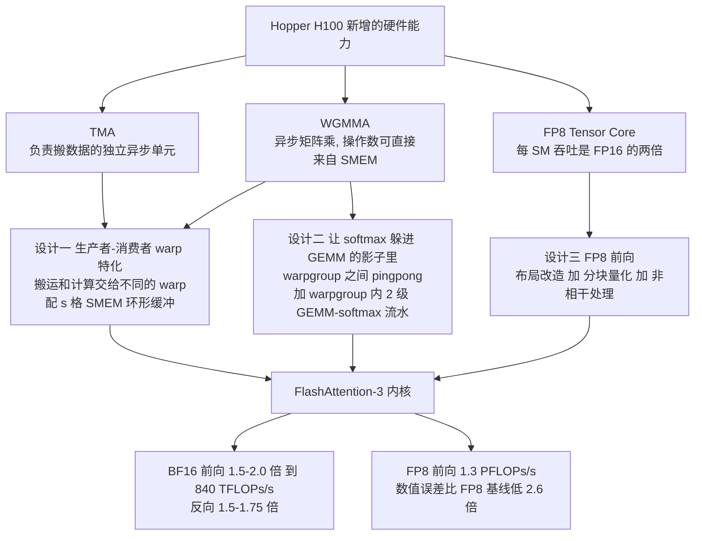
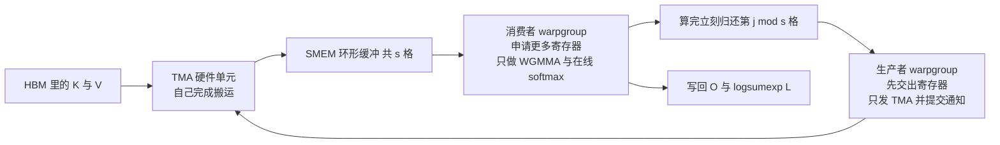
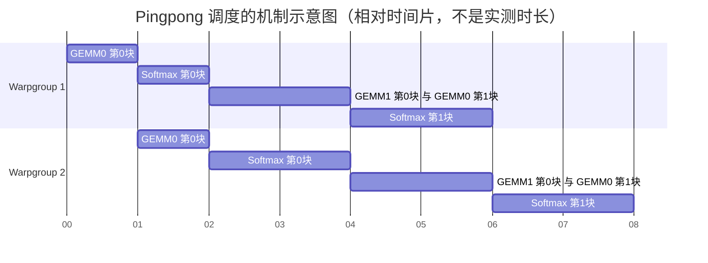
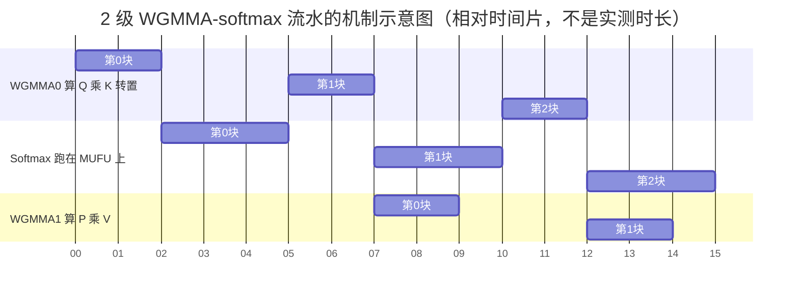
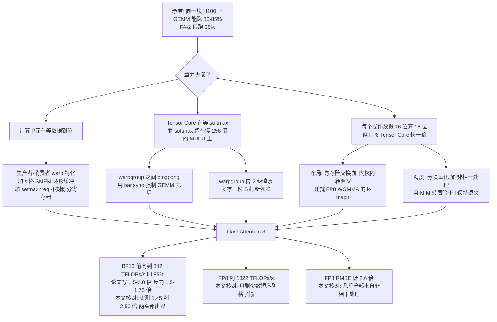

# FlashAttention-3：上一代内核在 H100 上只跑出 35%，剩下的算力卡在哪

<!-- release-date: 2024-07-11 -->

> 本文依据 **FlashAttention-3: Fast and Accurate Attention with Asynchrony and Low-precision**(Jay Shah、Ganesh Bikshandi、Ying Zhang、Vijay Thakkar、Pradeep Ramani、Tri Dao)的 **NeurIPS 2024 正式发表版**(camera-ready)。首页页脚印着 "38th Conference on Neural Information Processing Systems (NeurIPS 2024)",PDF 元数据生成时间 2024 年 10 月 31 日，共 28 页（正文 10 页、参考文献 4 页、附录 A–C 共 8 页、NeurIPS Paper Checklist 6 页）。**页码均指 PDF 本身的页码**，不是论文小节号。最后 6 页（p.23–28）是 NeurIPS 的投稿自查表，属于会议流程材料而不是论文内容，本文不引用它——它也是这个版本 28 页、预印本 22 页的主要差额来源。
>
> 全文严格区分三层：**论文明确写了什么**（带页码）、**我们如何理解它**（标注「本文的理解」「本文推算」「本文核对」）、**外部资料补充**（给链接并标明是补充）。
>
> **一处必须先交代的版本边界**：这篇论文有两个流通版本，差别比通常的「会议版排版不同」大得多。本文依据的是会议正式版。如果你手上拿的是 arXiv 预印本（arXiv:2407.08608 v1/v2,22 页，首页有页边水印），以下地方会对不上：
>
> | 项目 | arXiv 预印本 v2 | 本文依据的 NeurIPS 正式版 |
> |---|---|---|
> | 门面吞吐 | FP16 达 740 TFLOPs/s（75% 利用率） | **BF16 达 840 TFLOPs/s（85% 利用率）** |
> | FP8 峰值 | 接近 1.2 PFLOPs/s | **1.3 PFLOPs/s** |
> | 用来对照的 GEMM 利用率 | 80–90% | **80–85%** |
> | 全部性能柱状图 | 一套数 | **重测过**，见正文各表 |
> | Algorithm 1 第 21 行 | 多了一个方向错误的 $^{-1}$ | **已修正** |
> | 附录 B | 只有 B.1–B.3 | **新增 B.4–B.9**：变长序列、mask、persistent kernel、FP8 寄存器交换、V 转置、推理 |
> | 致谢，以及两条自曝短处的脚注 | 有 | **删掉了** |
>
> 完整差异清单在文末「资料与阅读边界」。**凡是带 `PDF p.N` 页码的数字，一律来自正式版**；正文里出现预印本数字的地方都明写着「预印本」，只用于版本对照，不参与任何结论。

## 先看一个刺眼的比例

论文第 1 页有一句话，是全文的起点：

> FlashAttention-2 在 H100 上只达到 35% 的利用率，而经过优化的矩阵乘（GEMM）内核能达到 80–85%。（PDF p.1，本文转述）

请把这两个数字放在一起看。同一块卡、同一个精度、同样是被 Tensor Core 干的活：通用矩阵乘能榨出八成半，而当时公认最快的注意力实现只榨出三成半。

注意力的数学没有变，输入输出没有变，连算法思路都还是 [FlashAttention](/reports/Stanford/FlashAttention) 那一套。变的只有一件事：**机器换了**。

FlashAttention-3 要回答的就是这个差额去哪了。它的答案不是「再少搬一点字节」，而是：

> **H100 上有好几个互相独立、可以同时干活的硬件单元。上一代内核的写法假设它们是串行的，于是每一刻总有一大半单元在等。**

这句话是全文最重要的 insight。下面把它拆开。

## 这篇不重讲什么

FlashAttention 系列已经有两代打底，本文不重复：

- **第一代**把注意力从「显存搬运受限」里救出来：分块（tiling）、在线 softmax、反向重算（recomputation）、IO 复杂度。这些在 [FlashAttention 解读](/reports/Stanford/FlashAttention) 里已经讲透，本文默认读者知道「$N\times N$ 的中间矩阵不写回显存」是怎么做到的。
- **第二代**改的是并行与工作划分。FA-3 论文自己的一句话概括是：FlashAttention-2「同时在序列长度维度上做并行，并把前向的内循环改成遍历 K、V 的块，从而改善 GPU 上的占用率与工作分布」（PDF p.1，本文转述）。细节见 [FlashAttention-2 解读](/reports/Stanford/FlashAttention-2)，本文不展开。

本文只讲第三代新增的东西：**异步**和**低精度**。

## 读前背景：H100 到底多了什么

这一节是这篇论文的门槛。术语很多，但每一个都能用一句人话说清。先建立直觉，后面再用正式名字。

### 一、存储层级：还是金字塔，但每层都更大更快

论文 Table 1 给了 H100 SXM5 的完整层级（PDF p.3）：

| 硬件层级 | 并行单位 | 存储 | 容量 @ 带宽 |
|---|---|---|---|
| 整卡 Chip | Grid | GMEM（即 HBM） | 80 GiB @ 3.35 TB/s |
| GPC | Threadblock Cluster | L2 | 50 MiB @ 12 TB/s |
| SM | Threadblock(CTA) | SMEM（共享内存） | 每 SM 228 KiB，全卡 31 TB/s |
| 线程 | Thread | RMEM（寄存器） | 每 SM 256 KiB |

三个名字先说人话：

- **GMEM（Global Memory，全局显存）**：就是 HBM，「显卡有多少 G」的那个 G。第一代论文里叫 HBM，这篇改叫 GMEM，是同一块东西（PDF p.3）。
- **SMEM（Shared Memory，共享内存）**：贴在每个 SM 旁边、由程序员自己管的高速缓存。第一代论文里叫 SRAM。
- **RMEM（Register Memory，寄存器文件）**：比 SMEM 还快一级，每个线程私有。论文明说每个线程**最多 256 个寄存器**（PDF p.3）。

**本文的对照**：和第一代论文里的 A100 放在一起看(A100:HBM 40 GB @ 1.5 TB/s、每 SM 192 KB SRAM，见 [FlashAttention 解读](/reports/Stanford/FlashAttention))，每一层都涨了，但**各层涨的倍数不一样**——算力涨得比带宽快。这正是第一代论文开头点出的趋势，到 H100 只会更明显。FA-3 论文本身没有做这个跨代对照。

论文的脚注 4 顺手交代了 31 TB/s 是怎么来的：共享内存带宽是每 SM 每时钟 128 字节，乘以 132 个 SM，再乘以 1830 MHz 的 boost 频率（PDF p.3）。**记住 132 这个数**，后面消融实验的序列长度和 persistent kernel 的 block 数都是按它定的。

### 二、线程层级：多了「warpgroup」这一档

从细到粗（PDF p.3）：

**线程（thread） → warp（32 个线程） → warpgroup（4 个连续的 warp，即 128 个线程） → threadblock / CTA → threadblock cluster（Hopper 新增） → grid**

其中 **warpgroup（线程束组）是 Hopper 才有的调度单位**，后面所有设计都以它为单位。同一个 CTA 里的线程被排在同一个 SM 上，同一个 cluster 里的 CTA 被排在同一个 GPC 上；SMEM 对 CTA 内所有线程直接可寻址（PDF p.3）。

### 三、异步：两个可以「自己干活」的硬件单元

这是最关键的一节。

**TMA（Tensor Memory Accelerator，张量内存加速器）**：一个专门负责 GMEM 与 SMEM 之间异步拷贝的**独立硬件单元**（PDF p.3）。人话是：你告诉它「把这块数据搬过来」，它就自己去搬，发起搬运的线程不用守着。

**WGMMA（warpgroup 级异步矩阵乘指令）**：Hopper 上 Tensor Core 的新接口。论文强调两点（PDF p.3）：它是**异步的**，而且**操作数可以直接从 SMEM 取**，不像 Ampere 那样必须先搬进寄存器。

> **本文补充的背景**（不是论文原文）：Ampere 上的 `mma` 指令是同步的，而且 A、B 两个操作数都必须先在寄存器里，所以发起矩阵乘的 warp 得先花指令和寄存器把数据从 SMEM 搬进 RMEM，然后在矩阵乘期间被占住。WGMMA 把这两件事都解开了。指令细节见 NVIDIA 官方 [PTX ISA 文档](https://docs.nvidia.com/cuda/parallel-thread-execution/) 与 [CUDA C++ Programming Guide](https://docs.nvidia.com/cuda/cuda-c-programming-guide/)，论文分别引用了它们的 §9.7.14 与 §7.29（PDF p.3）。

有了这两个异步单元，就能做 **warp specialization（warp 特化）**：把一个 CTA 里的 warp 分成 **producer（生产者）** 和 **consumer（消费者）** 两种角色，前者只发数据搬运，后者只做计算，谁也不干对方的活。论文给的理由很朴素：这样做**通常能让编译器排出更好的指令调度**（PDF p.3）。

Hopper 还提供 `setmaxnreg` 指令，可以在 warpgroup 之间**动态重分配寄存器**：做矩阵乘的 warp 可以拿到比只发 TMA 的 warp 多得多的寄存器份额——发 TMA 只需要一个线程（PDF p.3）。

### 四、低精度：FP8 快一倍，但挑食

**FP8** 是 8 位浮点。论文用的是 **e4m3** 格式：1 位符号、4 位指数、3 位尾数（PDF p.7）。Hopper 的 Tensor Core 支持它，**每 SM 吞吐是 FP16/BF16 的两倍**（PDF p.3）。

论文把这件事放进一条趋势线里：FP16(Pascal,2017)→ BF16(Ampere,2020)→ FP8(Hopper)→ FP4(Blackwell)，每一步都是「同样的功耗和芯片面积换双倍或四倍吞吐」的成熟手段（PDF p.2）。

但 FP8 的 WGMMA 有一条硬约束。先定义两个词（PDF p.4）：做 $A\times B^\top$ 时，如果操作数在**外层维度**($M$ 或 $N$)上连续，叫 **mn-major**；如果在**内层求和维度**($K$)上连续，叫 **k-major**。

> FP16 的 WGMMA 对放在 SMEM 里的操作数，mn-major 和 k-major 都收；**FP8 的 WGMMA 只收 k-major**。（PDF p.4，本文转述）

而且论文提前预警了另一个坑：在注意力这种「两个 GEMM 首尾相接、要融进同一个内核」的场景里，**第一个 GEMM 的 FP32 累加器布局和第二个 GEMM 要的 FP8 操作数布局对不上**，这会挡住依赖链上的 FP8 WGMMA（PDF p.4）。

这两条约束是第 3.3 节所有工程动作的来源。

## 全景：三个技术分别接在哪

论文自己把贡献列成三条（PDF p.2）。先给一张全局图，后面逐条展开。

这张图是**机制示意**，依据 PDF p.2 的三条贡献与 p.3–4 的硬件描述重画，箭头表示「哪个硬件能力支撑哪个设计」，不含实测时间。

三条设计针对的是**三种不同的浪费**：

| 设计 | 它消灭的浪费 | 作用范围 |
|---|---|---|
| warp 特化 + 环形缓冲 | 计算单元等数据到位 | CTA 内部，生产者与消费者之间 |
| pingpong + 2 级流水 | Tensor Core 等 softmax 算完 | warpgroup 之间 + warpgroup 内部 |
| FP8 | 每个操作数搬 16 位、算 16 位，但其实 8 位够用 | 两个 GEMM 的数值精度 |

## 设计一：让搬数据的和算数据的彻底分家

### 旧问题：一个 warp 既要搬又要算

论文对上一代的判词只有一句：FlashAttention-2 的算法「遵循一个简化的同步模型，设计里没有显式使用异步与低精度」（PDF p.2，本文转述）。

**本文的理解**（论文没有展开这一段）：在同步模型下，同一批 warp 既负责把 K、V 的块从显存搬进 SMEM，又负责算矩阵乘和 softmax。这带来两个麻烦：

1. **调度问题变难**：编译器必须在同一段指令流里同时排好访存和计算，还要保证访存足够超前。
2. **寄存器只能按一份预算分**：搬运几乎不需要寄存器，计算非常需要，但它们在同一个 warp 里。

### 新设计：producer / consumer 两种角色

FlashAttention-3 把一个 CTA 的 warp 拆成两类（PDF p.5,Algorithm 1）：

- **生产者 warpgroup**：开头先用 `setmaxnreg` **交出**一批寄存器，然后就只做一件事——发起 TMA 载入，并在完成时提交通知。
- **消费者 warpgroup**：开头**申请**更多寄存器，然后只做 WGMMA 和 softmax。

两者之间用一个 **s 级环形 SMEM 缓冲（circular SMEM buffer）** 加屏障对接：生产者等第 $j \bmod s$ 格被消费完再往里填第 $j$ 块的 K、V；消费者等这一格填好再算，算完立刻归还。

这张图是**机制示意**，依据 PDF p.5 的 Algorithm 1 重画，箭头表示数据与许可的流向，不表示实测时间。

论文特别提醒两个执行细节（PDF p.4，这段说明排在 Algorithm 1 之前）：

- 发起 TMA 载入**不会**因为别的载入没完成而阻塞，这正是异步的意义；
- 生产者主循环的**前 $s$ 次迭代不会发生任何等待**，因为缓冲还在被填满。

### 收益：延迟被藏在流水线里

生产者可以领先消费者最多 $s$ 块。第 $j+s$ 块的显存延迟就被第 $j$ 块的计算盖住了。同时寄存器被**不对称地**分配：几乎全给了真正需要它的消费者。

### 代价与边界

**本文的理解**（论文没有为这一节单列代价）：

- SMEM 要拿出 $s$ 份 K、V 块的空间。**$s$ 取多少、$B_r$/$B_c$ 开多大，正文自始至终没有给数值**——这是本文核对全文后确认的缺口。（附录里漏出三个沾边的数：反向的预处理内核按 `tile_size` = **128** 给 $dQ$、$dPSum$、$L$ 补齐（PDF p.19）；persistent kernel 启动的 block 数等于 SM 数、H100 SXM5 上是 **132**（PDF p.19）；WGMMA 第一个操作数 tile 的宽度是**每 warpgroup 64**（PDF p.21）。三个都不是主循环的块大小。）
- 需要正确的屏障协议。一个 CTA 里同时存在角色不同、指令流不同的 warp，调试成本比同构内核高。
- 生产者 warpgroup 本身也占 SM 上的 warp 槽位。它几乎不算数，但确实占资源。

### 可迁移启发

> **当一段流水里有两类工作，而它们对资源的需求完全不同（一个要寄存器，一个几乎不要；一个是延迟敏感，一个是吞吐敏感），把它们放进同一个执行体是在逼调度器做不可能的取舍。分开之后，每个角色的调度都变成简单问题。**

这条不限于 GPU。生产者-消费者加有界队列，是任何「取数据」和「处理数据」速度不匹配的系统的标准解；真正的新意在于**顺便把资源配额也拆开了**。

## 设计二：softmax 是隐形的一半时间

### 旧问题：一个吞吐差 256 倍的单元

论文第 4 页给了全文最有说服力的一组数字：

> H100 SXM5 有 989 TFLOPS 的 FP16 矩阵乘算力，但只有 **3.9 TFLOPS** 的特殊函数（比如 softmax 需要的指数）算力。（PDF p.4）

3.9 对 989。指数运算跑在一个叫 **MUFU（multi-function unit，多功能单元）** 的独立小单元上，它的吞吐是矩阵乘的**约 0.4%**（PDF p.4）。

脚注 5 交代了 3.9 的来历：CUDA 编程指南说每个 SM 每时钟能做 16 次特殊函数运算，乘 132 个 SM，再乘 1830 MHz（PDF p.4）。

那么问题来了：注意力里的指数运算只有 $N^2$ 次，而矩阵乘有 $4N^2d$ 次浮点运算，数量差得很远，为什么还会成为瓶颈？

论文直接给了答案（PDF p.4）：对 FP16、头维 128 的前向，矩阵乘的 FLOP 数是指数运算次数的 **512 倍**，但指数的吞吐低 **256 倍**，所以**指数可能占掉矩阵乘一半的时间**。

**本文按论文给出的数字复算**，把这三步写清楚。第一步是数量比，它算的是「一次注意力里，矩阵乘的浮点运算数是指数运算次数的多少倍」：

$$
\frac{4N^2 d}{N^2} = 4d = 4\times 128 = 512
$$

分子 $4N^2d$ 是两个矩阵乘($QK^\top$ 与 $PV$)的浮点运算总数，分母 $N^2$ 是注意力分数矩阵的元素个数，也就是要做多少次指数。$d$ 是头维。

第二步是时间比，它算的是「如果串行执行，指数的耗时是矩阵乘耗时的多少」：

$$
\frac{T_{\exp}}{T_{\text{matmul}}}
=\frac{1/3.9}{512/989}
=\frac{989}{3.9\times 512}\approx 0.50
$$

分子是做 1 单位指数运算的时间，分母是做 512 单位矩阵乘的时间；单位都是「运算量除以吞吐」。结果 0.50 就是论文说的「指数可能占掉矩阵乘一半的时间」。

顺带对一下账：$989 \div 3.9 \approx 254$，论文把它写成「低 256 倍」（PDF p.4），是取了整。本文行文一律沿用论文的 256，只有上面这个算式用原始的 989 与 3.9。

第三步是论文的一句提醒：**换成 FP8 会更糟**，因为矩阵乘吞吐翻倍而指数吞吐不变（PDF p.4）。**本文推算**：同一算式里把 989 换成 1978，比值升到约 0.99——指数几乎能和矩阵乘一样久。

这就是整节的矛盾：**softmax 的运算量微不足道，但它跑在一个慢 256 倍的单元上，如果串行等待，它就是一半的墙钟时间。**

### 新设计之一：两个 warpgroup 打乒乓

既然指数跑在独立单元上，理想情况就是「Tensor Core 在算矩阵乘的时候，MUFU 同时在算指数」。

FlashAttention-3 用 `bar.sync` 同步屏障，强制 **warpgroup 1 的两个 GEMM 排在 warpgroup 2 的 GEMM 之前**（PDF p.5）。这里的两个 GEMM 指的是：**GEMM1**——上一轮的 $PV$;**GEMM0**——下一轮的 $QK^\top$。

结果是：warpgroup 1 做 softmax 的时候，warpgroup 2 正在做 GEMM；然后角色互换。这就是 **pingpong scheduling（乒乓调度）** 这个名字的来历。

这张图是**机制示意**，依据 PDF p.5 的 Figure 1 重画，横轴只表示先后与重叠关系，不是 profile 得到的真实时长。读法是：任何一个时间片里，一个 warpgroup 在占 Tensor Core，另一个在占 MUFU。

**论文自己也没有把这张图当真**。它明写：「实践中 pingpong 调度并不像图里画得那么干净，但我们总体发现它能提升性能」（PDF p.5，本文转述）。

**收益是有数的**：FP16 前向、头维 128、序列长 8192 的配置下，从 570 TFLOPS 提到 **620–640 TFLOPS**（PDF p.5）。

**代价**：需要两个消费者 warpgroup 才玩得起乒乓，而且要手工插同步屏障——这是把编译器管不了的调度决策拿到手里做。

> **一处版本差异（外部补充）**：预印本的致谢里写明，这个手法是从 CUTLASS 的 warp 特化 pingpong GEMM 实现改来的，不是从零发明。**正式版把整个致谢删掉了**，所以这条出处在本文依据的 PDF 里已经找不到。本文照实保留这个信息，但它现在只能算预印本佐证，不能标页码。

### 新设计之二：一个 warpgroup 内部也能重叠

乒乓解决的是 warpgroup **之间**。论文接着问：一个 warpgroup **内部**能不能也重叠？

**旧问题是依赖链**（PDF p.6）：循环体内三步是首尾相接的——softmax 要等第一个 GEMM 算出 $S$，第二个 GEMM 要拿 softmax 的结果 $\widetilde P$ 当操作数。Algorithm 1 的第 17 行和第 21 行两个 wait 把它们完全串起来。

**新设计**：在寄存器里多开一份缓冲，**跨迭代**做软件流水，把依赖打断（PDF p.6）。

具体到 Algorithm 2（PDF p.6），主循环第 $j$ 轮做三件事：

1. 发起 WGMMA 算第 $j$ 块的 $S$（**提交但不等待**）；
2. 发起 WGMMA 把第 $j-1$ 块的贡献累加进 $O$（**提交但不等待**）；
3. 等第一个 WGMMA 回来，做第 $j$ 块的 softmax。

第 3 步的 softmax 跑在 MUFU 上，而第 2 步的矩阵乘还在 Tensor Core 上飞——**这就是重叠**。论文的原话是：迭代 $j$ 的第二个 WGMMA（第 11 行）与迭代 $j+1$ 的 softmax（第 13 行）重叠（PDF p.6）。

这张图是**机制示意**，依据 PDF p.6 的 Figure 2 与同页的 Algorithm 2 重画，不是实测时长。关键要看的是：**WGMMA1 第 0 块和 Softmax 第 1 块落在同一个时间窗口里**；第一个 WGMMA 则基本是单独跑的，它由上一节的 pingpong 去和另一个 warpgroup 的 softmax 配对。

### 这条设计付出了什么

论文很老实地列了三条（PDF p.7）：

**第一，编译器不一定听话。** 伪代码写的是理想执行顺序，而 NVCC 经常为了优化重排指令，可能打乱这套精心设计的流水。论文为此专门去看了 SASS（NVIDIA GPU 的汇编）。

**第二，寄存器压力。** 2 级流水必须多存一份 $S_{\text{next}}$，每个 threadblock 多占的寄存器是：

$$
B_r \times B_c \times \operatorname{sizeof}(\text{float})
$$

其中 $B_r$ 是 query 块的行数，$B_c$ 是 key 块的行数。论文点出这和「开更大的块」这个常规优化直接冲突，因为后者也很吃寄存器，只能按 profile 结果折中（PDF p.7）。

**第三，更深的流水反而更差。** 论文试了 3 级版本：让第 $j+2$ 轮的第一个 WGMMA、第 $j+1$ 轮的 softmax、第 $j$ 轮的第二个 WGMMA 三者并行（PDF p.17）。结果比 2 级差，原因有两条（PDF p.18）：

- **编译器不配合**：SASS 显示只有第一个 WGMMA 和 softmax 重叠了，第二个没有；论文原话是「不清楚编译器为什么要这样重排指令」；
- **寄存器又多要一份**：额外的 $\widetilde P_i$ 和 $scale\_o$，大小是 $B_r\times B_c\times\operatorname{sizeof}(\text{输入类型}) + B_r\times\operatorname{sizeof}(\text{float})$，只能把块开得更小。

### SASS 上的实证

附录 B.2 贴了消费者主循环的简化 SASS，并给出四条观察（PDF p.17）：

1. softmax 被重排到了**最前面**，甚至排在第一个 WGMMA 之前；
2. 第一个 WGMMA 和 softmax、以及 $S$ 的 FP32 转 FP16 交织在一起——**说明 WGMMA 和非 WGMMA 指令确实在并行执行**；
3. `exp2`、行求和、$O$ 的重缩放、FP32 转 FP16 四类操作互相交织；
4. 第二个 WGMMA 没有和别的指令重叠，**和预期一致**。

论文的结论是「SASS 显示 2 级流水的想法按预期工作了」（PDF p.17）。

**本文的理解**：观察 1 和 4 说明，编译器最终排出来的顺序和 Figure 2 画的并不是同一件事——图里重叠的是「第二个 WGMMA 与 softmax」，SASS 里重叠的是「第一个 WGMMA 与 softmax」。作者认可这个结果，因为**目标本来就是「让 Tensor Core 和 MUFU 同时忙」，至于具体是哪个 WGMMA 陪着 softmax，并不影响这个目标**。但这也意味着：**图是设计意图，SASS 才是事实**。这一点论文自己在「编译器重排」那一段已经预告过。

顺带一个很实在的细节：SASS 里第一个 WGMMA 被拆成 8 条 `HGMMA.64x192x16`，前 7 条打包在一起；第二个被拆成 12 条 `HGMMA.64x128x16`,12 条全部打包（PDF p.17）。**一条 WGMMA 在硬件上不是一条指令**，这是理解「为什么它能被交织」的前提。

### 可迁移启发

> **算得少不等于耗时短。判断瓶颈时，不能只数运算量，要把「这个运算跑在哪个硬件单元上、那个单元的吞吐是多少」一起算进去。**

989 比 3.9 是一个极端例子，但同类问题到处都是：一次远程调用的 CPU 开销可以忽略，但它占住的是连接池；一次日志写盘的字节数可以忽略，但它占住的是 fsync。**先列出你的内循环触碰了哪几种资源，再分别估算每种资源的占用率。**

第二条启发来自 3 级流水的失败：

> **流水线深度的代价是状态。每加一级，就要多存一份中间结果。当这份状态存在一个总量固定、且和「块开多大」争抢的地方（寄存器、缓存、连接数）时，更深的流水会先撞上容量墙。**

## 设计三：FP8 是两个独立的问题

论文把 FP8 拆成两半来讲，这个拆法本身就值得学：**能不能跑**（布局）和**准不准**（数值）。它们互不相干，解法也完全不同。

### 第一半：布局要迁就硬件

论文说得很直白：FP8 前向遇到 FP16 没有的**两个**布局难题（PDF p.7）。正文只用一页交代问题和解法方向，细节全部下放到附录 B.7 和 B.8（PDF p.19–21）。下面按论文的顺序讲。

#### 关卡一：累加器和操作数的寄存器布局对不上

第一个难题论文形容为「在 Algorithm 1 里被隐掉了」的一步：第一个 WGMMA 算完，累加器是 **FP32**，而第二个 WGMMA 要的操作数是低精度（FP16 或 FP8）。降位本身不难，难的是**降完之后，数据在寄存器里的归属方式不对**（PDF p.7）。

论文用 Figure 3 和 Figure 4 分别画出这两种排布（都在 PDF p.7）：

- **Figure 3** 是 FP32 累加器的 WGMMA 布局；
- **Figure 4** 是 FP8 A 操作数要求的 WGMMA 布局。

要做的事是把前者变成后者，而且这个变换**在消费者 warpgroup 里每四个线程重复一次**（PDF p.7）。FP16 没有这个毛病，所以这是 FP8 独有的税。

**具体怎么变，正文不写，全在附录 B.7**（PDF p.19–20）。那里给了 Figure 9 的四行示意图和真实 CUDA 代码，用到两个内建函数：

- `__byte_perm(x, y, s)`：给两个 32 位整数和一个选择子 $s$，从这 8 个字节里挑出 4 个字节返回——**在一个线程内部重排字节**；
- `__shfl_sync(...)`：**在线程之间**搬寄存器，把源 lane 的值取到自己的寄存器里。

流程是三步：先用 `__byte_perm` 在线程内换序（论文给的选择子是 `0x7654` 与 `0x3210`，只对线程 1、2 做），再用 `__shfl_sync` 按两张预置映射表 `{0,3,1,2}` 与 `{1,2,0,3}` 跨线程交换，最后再用一次 `__byte_perm` 收尾（线程 0、3 用 `0x5410`/`0x7632`，线程 1、2 用 `0x1054`/`0x3276`）（PDF p.19–20）。

**本文的理解**：这三步里唯一「贵」的是中间那次跨线程 shuffle——线程内的字节重排几乎免费，跨线程搬运才要走 warp 的数据通路。记住这一点，下一小节会回来收账。

#### 关卡二：V 的方向不对

第二个难题回到 k-major：FP8 WGMMA 只接受在**求和维度**上连续的操作数。

注意力的第二个 GEMM 是 $O = PV$，求和维度是**序列长度**（key 的数量）。论文把要求写得很清楚：**Q 和 K 应该在头维上连续，而 V 应该在序列长度维上连续**（PDF p.7）。但实践中 V 通常和 Q、K 一样是在头维上连续的——方向正好差 90 度。

而 TMA 载入**本身不能改变连续维度**（PDF p.7）。论文的选择只有一句话：**在调用第二个 FP8 WGMMA 之前，先在 SMEM 里把 $V_j$ 这一块转置掉**（PDF p.7）。

**怎么转，在附录 B.8**（PDF p.20–21）：

- 这是一次 **SMEM → RMEM → SMEM 的异地（out-of-place）搬运**，**放在生产者 warpgroup 里执行**。生产者发完 V 的 TMA 载入后等它完成，然后自己把这块转置好（PDF p.20）。
- 用的指令是 **LDSM(`ldmatrix`)** 和 **STSM(`stmatrix`)**：让一个 warp 的线程**集体**在 SMEM 和 RMEM 之间搬 128 字节粒度的数据，而且**搬的同时就能转置布局**（PDF p.20）。
- 选它们的理由是「寄存器高效」——生产者已经用 `setmaxnreg` 交出了寄存器，还能跑得动这种指令（PDF p.20）。
- 代价是多一个 **pipeline 对象**：V 那条 TMA 载入的下游现在变成了生产者 warpgroup 自己（它要先拿到 V 才能转置），所以同步关系比 K 那条多一层（PDF p.20）。
- 额外的 SMEM 从哪来？论文说 FP8 本身把 SMEM 占用降了下来，省出来的正好够放转置用的独立缓冲（PDF p.20）。

论文还老实交代了一个技术障碍：PTX 文档里 LDSM/STSM 被描述成搬运 16 位元素的 8×8 矩阵，FP8 场景下要把两个 8 位元素打包成一个 16 位来用；但**转置版本的 LDSM/STSM 不能拆开打包的 8 位元素**，所以在 LDSM 和 STSM 之间还要用 `__byte_perm` 做寄存器搬移。这次论文没有再说「细节从略」，而是直接贴了 `cute::copy` 加 `__byte_perm(upper, lower, 0x6420)` 的代码片段（PDF p.20）。

#### 两个关卡其实互相帮忙

这是本节最漂亮的一步，也是论文自己写出来的一条恒等式（PDF p.21）：

$$
P\cdot V=\operatorname{colperm}_{\sigma}(P)\cdot \operatorname{rowperm}_{\sigma}(V)
$$

其中 $\sigma$ 是 $P$ 与 $V$ 公共内维（也就是求和维）上的任意一个置换。**本文换成矩阵写法**更容易看懂：设 $\Pi$ 是对应 $\sigma$ 的置换矩阵，则

$$
(P\,\Pi^\top)(\Pi\,V) = P\,(\Pi^\top\Pi)\,V = P V
$$

因为置换矩阵满足 $\Pi^\top\Pi = I$。也就是说，**只要把 $P$ 的列和 $V$ 的行按同一个次序打乱，乘积一点都不变**。硬件想要什么顺序，就给它什么顺序，数学不受影响。

论文接着收账：正因为内核内转置可以**顺手写出 V 的对应行置换**，关卡一那套寄存器交换就可以放宽——**warp shuffle 可以省掉，只保留 byte permute**，因为每个线程手上已经握着自己做 WGMMA 需要的全部元素了（PDF p.21）。回到上一小节的伏笔：三步里最贵的那一步被免掉了。

**本文提醒一处容易读拧的地方**：正文说「附录 B.7 给出的解法用到 shuffle 指令」（PDF p.7），而附录 B.8 说 shuffle 可以消掉（PDF p.21）。这不矛盾——B.7 是**通用**解法，B.8 说的是**在 FP8 内核内转置提供了额外自由度之后**的特例。读的时候要按这个顺序理解，否则会以为两处打架。

#### 这半部分的代价与边界

- 全部收益都建立在**能改写内核**上（**本文的理解**）。任何不打算手写这一层的人拿不到。
- 转置不是白做的：它占住生产者 warpgroup 的指令发射，还要多一个 pipeline 对象来对齐同步（PDF p.20）。论文没有给这一步的耗时。
- **本文核对出来的一处版本变化**：预印本在这里还写过「从第二次迭代开始，下一块 V 的转置可以藏在前一块 V 和当前块 K 那两个 WGMMA 的影子里」，并把内核内转置的点子归功于 cuDNN 团队。**正式版把这两句话都删掉了**——前者随 §3.3 改写消失，后者随整个致谢消失。所以「转置能不能被完全遮住」在本文依据的版本里是**没有答案的**。

### 第二半：精度要靠两个技巧撑住

FP8 e4m3 只有 3 位尾数，数值误差天然比 FP16/BF16 高。更麻烦的是大模型里普遍存在**离群值（outlier）**——少数几个数值比其余大得多（PDF p.7）。

标准做法是 **per-tensor scaling（逐张量缩放）**：整个 Q 用一个标量、整个 K 用一个标量、整个 V 用一个标量（PDF p.7）。

**这为什么会坏事**（本文的理解）：缩放因子必须按张量里最大的那个值来定，否则离群值会溢出。可一旦按一个比常态大 100 倍的值定标，绝大多数正常数值在量化后就只占到可用码位的百分之一，全被挤进 FP8 那几个相邻档位里——精度全花在了「照顾一个异常值」上。

论文给了两个技巧。

#### 技巧一：block quantization（分块量化）

**做法**：不再一个张量一个标量，而是**一个块一个标量**。把 Q、K、V 各自切成 $B_r\times d$ 或 $B_c\times d$ 的块，分别量化（PDF p.7）。

**为什么几乎免费**，论文给了两条理由（PDF p.7）：

1. 量化本身可以**融进注意力之前的那个算子**，比如旋转位置编码——旋转位置编码是**访存带宽受限**的，算力有富余，顺手做个量化不会变慢；
2. FlashAttention-3 的算法**本来就是按块走的**，所以「给每一块 $S$ 补上对应的缩放」不需要额外计算。

**边界**：块内如果同时有离群值和正常值，问题依旧，只是范围小了。

#### 技巧二：incoherent processing（非相干处理）

**做法**：量化成 FP8 之前，先把 Q 和 K 都乘上一个**随机正交矩阵** $M$（PDF p.8）。

**为什么不改变结果**。正交矩阵满足 $MM^\top = I$，于是注意力分数完全不变：

$$
(QM)(KM)^\top = Q\,M M^\top\,K^\top = QK^\top
$$

符号：$Q,K$ 是 query 和 key 矩阵，$M$ 是随机正交矩阵，$M^\top$ 是它的转置，$I$ 是单位矩阵。这一步是**恒等变换**，模型语义分毫未动。

**为什么能提精度**：$QM$ 的每一个元素都是 $Q$ 各元素的一个**随机加权和**，所以原本集中在一两个坐标上的巨大离群值，被摊薄到了所有坐标上（PDF p.8）。峰值降下来，缩放因子就不用那么大，量化误差随之下降。

**为什么便宜**：论文跟随 QuIP 与 QuIP# 的做法，取 $M$ 为「若干随机 $\pm 1$ 对角矩阵」与「一个 Hadamard 矩阵」的乘积。这样乘法可以在 $O(d\log d)$ 而不是 $O(d^2)$ 内完成，而且**同样能融进旋转位置编码，零额外计算**（PDF p.8）。

**边界（本文的理解，论文没有明说）**：

- 这个恒等式只对 $QK^\top$ 成立，**所以论文只对 Q 和 K 做非相干处理，V 没有**。V 的离群值仍然只能靠分块量化去接。
- 它假设离群值是**稀疏且尖锐**的。如果一个张量的数值本来就均匀分布，把它旋转一遍不会带来任何好处。

### 这两个技巧各自贡献了多少

论文的 Table 3 给了消融（PDF p.10），用的是合成的离群输入（下一节说明）：

| 方法 | RMSE |
|---|---:|
| FP8 基线（逐张量缩放） | 2.4e-2 |
| **FlashAttention-3 FP8（两个技巧全开）** | **9.1e-3** |
| 去掉分块量化 | 9.3e-3 |
| 去掉非相干处理 | 2.4e-2 |

**本文的理解——这张表比它看上去更有信息量**：

- 去掉分块量化，误差从 9.1e-3 只升到 9.3e-3,**变化约 2%**;
- 去掉非相干处理，误差直接回到 2.4e-2,**和基线一模一样**。

也就是说，在**这个测试分布下**，2.6 倍的精度提升几乎全部来自非相干处理，分块量化几乎没贡献。

必须马上补上边界：这个测试分布是 0.1% 的元素被加上一个标准差为 10 的大扰动（PDF p.9），是一个**为离群值量身定做的极端场景**，恰好是 Hadamard 旋转最擅长的情形。分块量化在离群值不那么极端、但局部数值范围差异大的分布下是否更重要，**论文没有测**。另外分块量化本身几乎不要钱，即使贡献小也没有理由去掉。

### 可迁移启发

> **「换低精度」从来不是一件事，而是两件：硬件愿不愿意吃这个布局，以及数值扛不扛得住。它们的解法完全无关，应该分开设计、分开验证。**

第二条更普适：

> **恒等变换是最便宜的数值空间。$MM^\top=I$ 意味着你可以在不改变任何语义的前提下，把数据搬到一个更适合量化的坐标系里。遇到「精度不够」的问题时，先问有没有一个不改变答案的变换能让分布变好看，再考虑改算法。**

第三条藏在细节里：

> **量化和 Hadamard 旋转都被塞进了旋转位置编码，因为那一步是访存受限的、算力有富余。找一找你的流水线里有没有这种「有空闲算力的邻居」，把新增的计算搭便车过去。**

## 反向传播：多了一个只管写梯度的角色

前向讲完，附录 B.1 讲反向（PDF p.16，正文和 Algorithm 3 都在这一页）。

先回忆反向要算什么（PDF p.3），$\phi$ 是标量损失，$d(-)$ 表示对应的梯度：

$$
dV = P^\top dO,\quad
dP = dO\,V^\top,\quad
dS = \operatorname{dsoftmax}(dP),\quad
dQ = \alpha\, dS\, K,\quad
dK = \alpha\, dS^\top Q
$$

其中 $\alpha=1/\sqrt d$ 是注意力的缩放因子，$dO$ 是输出的梯度。

反向的 warp 特化比前向多一个角色。论文的理由讲得很具体（PDF p.16）：

**旧问题**：每个 threadblock 都会产出一份 $dQ$ 的局部贡献，必须累加到全局的 $dQ$ 上。很多 threadblock 往同一个位置写，造成**内存竞争**。如果让计算 warp 自己去做这次原子累加，它就被堵在那里，不能开始下一次矩阵乘。

**新设计**：专门开一个 **dQ writer warp**。消费者算完 $dQ^{(\text{local})}$ 就写进 SMEM 并通知它，由它用信号量把结果原子地加到全局显存上（PDF p.16,Algorithm 3 第 30–34 行）。

反向还沿用了一个第一代就有的化简：预处理内核先算出

$$
D = \operatorname{rowsum}(dO \circ O)
$$

其中 $\circ$ 是逐元素相乘。有了 $D$,softmax 的梯度就能写成 $dS = P\circ(dP - D)$（PDF p.16,Algorithm 3 第 25 行），不必再对长度为 $N$ 的向量做规约。这一步的来龙去脉在 [FlashAttention 解读](/reports/Stanford/FlashAttention) 里已经推过。

**边界**：论文**没有 FP8 反向**。§4.1 只说「我们也在类似设置下测了 FP8 的前向」，全文没有任何 FP8 反向的算法或数据（PDF p.8；外部仓库状态见文末）。

### 可迁移启发

> **当一条流水里有一个「必须序列化、会被别人抢」的步骤（原子累加、加锁写、单点提交），把它单独拆成一个角色，让其余部分继续前进。这不会让那一步变快，但能让它不再决定整体节奏。**

## 一处预印本的笔误，正式版已经修好

这一节留着不是为了挑刺，而是因为它同时是一个**读伪代码的方法示范**，和一个**版本差异的样本**。

Algorithm 1（PDF p.5）第 19 行和第 21 行，处理的是同一件事：换基准。第 19 行更新指数和 $\ell_i$:

$$
\ell_i \leftarrow e^{\,m_i^{\text{old}}-m_i}\,\ell_i + \operatorname{rowsum}(\widetilde P_i^{(j)})
$$

第 21 行更新输出 $O_i$:

$$
O_i \leftarrow \operatorname{diag}\!\left(e^{\,m_i^{\text{old}}-m_i}\right) O_i + \widetilde P_i^{(j)} V_j
$$

符号：$m_i^{\text{old}}$ 是上一步的行最大值，$m_i$ 是更新后的行最大值，第 18 行保证 $m_i \ge m_i^{\text{old}}$。

**为什么这两行必须用同一个因子**：$\ell_i$ 和 $O_i$ 都是「以 $m^{\text{old}}$ 为基准的未归一化累加量」，换到新基准 $m_i$ 时要做同一次折算。因为 $m_i \ge m_i^{\text{old}}$，这个因子 $e^{m_i^{\text{old}}-m_i}\le 1$，作用是把旧账**缩小**。上面两行一致，正确。最后第 24 行才用 $\operatorname{diag}(\ell_i)^{-1}$ 做归一化——那里的 $^{-1}$ 是应该有的。

**版本差异（本文核对）**：**arXiv 预印本 v2 的第 21 行多写了一个 $^{-1}$**，写成 $\operatorname{diag}(e^{m^{\text{old}}_i-m_i})^{-1}O_i$，方向和第 19 行正好相反，会把旧的 $O_i$ 放大而不是缩小。本文在依据预印本时把它标成了排版笔误；**NeurIPS 正式版已经删掉了这个 $^{-1}$**，两行现在完全对齐。如果你手上是预印本，这一处不用怀疑自己，是原稿错了。

留下来的方法教训不变：**Algorithm 1 是 CTA 视角的伪代码，不是可执行规范**。论文自己在 §3.2 就说过「伪代码代表的是理想执行顺序」；附录 B.3 的 Algorithm 4 干脆把这一步换成了显式的 `scale_o` 变量（PDF p.18）。**想复现这套东西，读代码比读伪代码可靠**——顺带一提，预印本的这处笔误挂了四个月才在会议版修掉，这本身也说明伪代码不是被逐行验证过的东西。

## 实验：这些数字到底证明了什么

### 测的是什么，不是什么

先把范围钉死（PDF p.8）：

- 硬件：**单张 H100 80GB SXM5(700W)**（PDF p.21），时钟固定在 1830 MHz，**重复 10 次取平均**（PDF p.22）；
- 软件：CUDA 12.3、cuDNN 9.5.0.50、CUTLASS 3.6、FlashAttention 2.6.3、Triton 3.1、PyTorch 2.5.0，截至 **2024 年 10 月**的最新版（PDF p.21）；
- 对照：PyTorch 标准实现、FlashAttention-2、Triton 版 FlashAttention-2（会用 H100 专属指令）、cuDNN（闭源厂商实现）；
- 形状：序列长 512 到 16k;**batch 随序列长变化，使总 token 数固定为 16k**；隐藏维 2048，头维 64 / 128 / 256（对应 32 / 16 / 8 个头）；
- 前向 FLOPs 的口径是 $4\cdot\text{seqlen}^2\cdot d\cdot h$，带因果 mask 时除以 2，反向按前向的 **2.5 倍**算（前向 2 个矩阵乘，反向因重算有 5 个）；
- **精度标签要留神**：Figure 5、Figure 6 的图注和 §4.1 都写的是 **BF16**（PDF p.8–10），但 §3.1 的 pingpong 收益、§4.2 的消融、§4.3 的数值误差表仍然标 **FP16**（PDF p.5、p.8、p.10）。H100 上这两种格式的矩阵乘峰值都是 989 TFLOPS，所以吞吐口径不受影响，但**照抄的时候不要把两组标签混起来**。

**测的全部是注意力这一层。** 全文没有任何端到端训练或推理的数字——这一点和第一代论文有 BERT / GPT-2 端到端表格形成鲜明对照。

**一个不起眼但值得记的细节**：附录 C.2 说 FP8 实验用的序列长是 512、1024、2048、4096、8192、16384（PDF p.22）——全是 2 的幂。但 §4.2 的消融配置写的是 $\{batch, seqlen, nheads, hdim\}=\{4, \mathbf{8448}, 16, 128\}$（PDF p.8）。8448 不是 2 的幂，它是 $64\times132$。

> **为什么会挑 132 的倍数**（本文的解释；正式版没有解释这个数）：H100 有 132 个 SM。如果切出来的 tile 数不是 132 的整数倍，最后一「波」就只有少数 SM 有活干，其余全部空转，测出来的吞吐会掉一截——这叫 **wave quantization（波次量化）**，和算法好坏毫无关系。**外部/版本佐证**：arXiv 预印本 v2 的附录 C.2 曾明写 FP8 实验取 4224、8448、16896「让它能被 132 整除，以避免 wave quantization」；**正式版换成了 2 的幂并删掉了这句解释**，只有消融里的 8448 留了下来。所以在本文依据的版本里，这条理由属于外部补充，不能算论文原话。

### BF16 前向：图重测过，1.5–2.0× 这个区间已经包不住了

论文的概括是「前向比 FlashAttention-2 快 1.5–2.0 倍，反向快 1.5–1.75 倍；比标准实现最多快 3–16 倍；中长序列（1k 及以上）甚至超过 cuDNN」（PDF p.8）。Figure 5 的图注写明是 **BF16**（PDF p.9）。

**本文逐格核对了 Figure 5 里三个非因果面板的柱高**，把它们抄成表（单位 TFLOPs/s，均在 PDF p.9）：

Figure 5(a)，头维 64，无因果 mask：

| 序列长 | 标准实现 | FA-2 | Triton | cuDNN | **FA-3** | FA-3/FA-2 |
|---:|---:|---:|---:|---:|---:|---:|
| 512 | 52 | 226 | 299 | 387 | **351** | 1.55× |
| 1k | 63 | 268 | 370 | 452 | **422** | 1.57× |
| 2k | 67 | 289 | 396 | 492 | **498** | 1.72× |
| 4k | 72 | 302 | 411 | 516 | **520** | 1.72× |
| 8k | 73 | 308 | 419 | 529 | **562** | 1.82× |
| 16k | OOM | 312 | 423 | 533 | **566** | 1.81× |

Figure 5(c)，头维 128，无因果 mask：

| 序列长 | 标准实现 | FA-2 | Triton | cuDNN | **FA-3** | FA-3/FA-2 |
|---:|---:|---:|---:|---:|---:|---:|
| 512 | 74 | 232 | 314 | 514 | **482** | 2.08× |
| 1k | 100 | 289 | 373 | 599 | **607** | 2.10× |
| 2k | 119 | 324 | 412 | 646 | **678** | 2.09× |
| 4k | 133 | 346 | 436 | 666 | **717** | 2.07× |
| 8k | 139 | 358 | 449 | 678 | **750** | 2.10× |
| 16k | OOM | 364 | 451 | 681 | **760** | 2.09× |

Figure 5(e)，头维 256，无因果 mask：

| 序列长 | FA-2 | Triton | cuDNN | **FA-3** | FA-3/FA-2 |
|---:|---:|---:|---:|---:|---:|
| 512 | 228 | 223 | 501 | **512** | 2.25× |
| 1k | 276 | 260 | 619 | **661** | 2.40× |
| 2k | 305 | 279 | 690 | **749** | 2.46× |
| 4k | 322 | 295 | 728 | **795** | 2.47× |
| 8k | 332 | 302 | 749 | **831** | 2.50× |
| 16k | 337 | 305 | 758 | **842** | 2.50× |

最后一格的 **842 就是摘要里「最高 840 TFLOPs/s、85% 利用率」的出处**（**本文核对**：$842/989 = 85.1\%$）。注意它出现在**头维 256、序列 16k、无因果 mask**这一格，而不是论文正文重点讨论的头维 64/128。

比值一列是**本文推算**，数据全部来自 PDF p.9。三件必须点出来的事：

**第一，「1.5–2.0×」现在偏保守了。** 在论文 §4.1 自己声明的范围内（头维 64 或 128,PDF p.8），比值是 **1.55× 到 2.10×**：头维 64 一路在区间内，**头维 128 却整条曲线都压在 2.07–2.10×，系统性地越过了 2.0 的上界**。头维 256 更是 2.25–2.50×，但那是 §4.1 声明之外的形状。**这是正式版重测数据之后留下的一处内部不一致**：图变了，摘要和 §4.1 里的「1.5-2.0×」「up to 2.0× faster」没跟着变。

**第二，「1k 及以上超过 cuDNN」仍然有反例，但换了位置。** 头维 128 在 1k 已经反超（607 对 599），头维 256 从 512 就一路领先；**真正的反例在头维 64**:1k 时 cuDNN 452、FA-3 只有 422，要到 2k 才勉强反超（498 对 492），而且 512 处差得更多（387 对 351）。

**第三，序列越短，FA-3 越吃亏。** 这不是巧合。基准把总 token 数固定在 16k，所以序列长 512 时 batch 是 32、16k 时 batch 是 1。**本文的理解**：短序列意味着 tile 更碎、启动与收尾开销占比更高，而 FA-3 那套「生产者跑在前面填缓冲」的流水需要足够多的迭代才回本。前 $s$ 次迭代是纯填充，序列越短，填充占比越大。

### BF16 反向：区间同样被自己的数据顶穿了

Figure 6 只有两个面板，都是**无因果 mask**，头维 64 和 128（PDF p.10）。**没有因果反向，也没有头维 256 的反向。** 图注同样写的是 BF16。

Figure 6(a)，头维 64，无因果 mask（PDF p.10）：

| 序列长 | 标准实现 | FA-2 | cuDNN | **FA-3** | FA-3/FA-2 |
|---:|---:|---:|---:|---:|---:|
| 512 | 68 | 198 | 275 | **288** | 1.45× |
| 1k | 76 | 238 | 366 | **397** | 1.67× |
| 2k | 88 | 264 | 425 | **479** | 1.81× |
| 4k | 92 | 279 | 463 | **531** | 1.90× |
| 8k | 95 | 287 | 478 | **562** | 1.96× |
| 16k | OOM | 291 | 475 | **552** | 1.90× |

Figure 6(b)，头维 128，无因果 mask（PDF p.10）：

| 序列长 | 标准实现 | FA-2 | cuDNN | **FA-3** | FA-3/FA-2 |
|---:|---:|---:|---:|---:|---:|
| 512 | 104 | 214 | 304 | **317** | 1.48× |
| 1k | 131 | 260 | 426 | **440** | 1.69× |
| 2k | 159 | 291 | 509 | **531** | 1.83× |
| 4k | 174 | 310 | 562 | **593** | 1.91× |
| 8k | 181 | 318 | 587 | **616** | 1.94× |
| 16k | OOM | 322 | 576 | **615** | 1.91× |

**本文推算**：实际比值是 **1.45× 到 1.96×**，而论文写的是 1.5–1.75×（PDF p.2、p.8）。两头都出了界：512 处略低于下沿，4k 以上一路高于上沿。**和前向一样，这是重测数据之后没有回头改文字留下的缝**。反向对 cuDNN 是全格领先，没有反例。

### FP8：这一代改动最大的一块

Figure 7(a),FP8 前向，头维 256，无因果 mask（PDF p.10）：

| 序列长 | Triton | cuDNN | **FA-3** |
|---:|---:|---:|---:|
| 512 | 529 | 686 | **761** |
| 1k | 664 | 878 | **1014** |
| 2k | 766 | 1001 | **1172** |
| 4k | 854 | 1087 | **1258** |
| 8k | 897 | 1122 | **1302** |
| 16k | 903 | 1139 | **1322** |

Figure 7(b)，同样头维 256，**带**因果 mask（PDF p.10）：

| 序列长 | Triton | cuDNN | **FA-3** |
|---:|---:|---:|---:|
| 512 | 299 | 304 | **438** |
| 1k | 425 | 449 | **649** |
| 2k | 520 | 768 | **834** |
| 4k | 591 | 1015 | **972** |
| 8k | 628 | 1056 | **1070** |
| 16k | 663 | 1099 | **1132** |

Figure 10(a),FP8 前向，头维 64，无因果 mask（PDF p.22，附录 C.2 的完整结果）：

| 序列长 | Triton | cuDNN | **FA-3** |
|---:|---:|---:|---:|
| 512 | 392 | 344 | **347** |
| 1k | 444 | 398 | **455** |
| 2k | 473 | 447 | **586** |
| 4k | 499 | 413 | **621** |
| 8k | 506 | 431 | **667** |
| 16k | 511 | 438 | **681** |

**1322 TFLOPs/s 就是摘要里「FP8 达到 1.3 PFLOPs/s」的出处**（PDF p.10）。**本文推算**：H100 的 FP8 峰值是 FP16 的两倍，即约 1978 TFLOPs/s，所以 1322 大约是峰值的 **67%**。

**FA-3 的 FP8 现在赢面很大，但仍然有输的格子，而且论文不再提醒你**：

- **无因果 mask、头维 256**：全部六个序列长都超过 cuDNN，连 512 都超（761 对 686）。
- **带因果 mask、头维 256**：只在 **4k** 输给 cuDNN（972 对 1015），其余全赢。
- **无因果 mask、头维 64**:512 处 347 略高于 cuDNN 的 344，但**低于 Triton 的 392**（约低 11%）；从 1k 起全面领先。
- **带因果 mask、头维 64**（Figure 10(b),PDF p.22）：512 处 FA-3 只有 185,Triton 是 234;1k 处 286 对 325。**这是全篇在最短序列上最难看的两格**，要到 2k 才反超（428 对 393）。

**必须写清楚的一处版本变化（本文核对）**：预印本在这里有两条自曝短处的脚注——引言的脚注 2 逐个头维列出 FP8 在哪些配置打平、哪些落后；§5 的脚注 10 承认「FP16 的 FlashAttention-3 有 persistent kernel 和负载均衡策略，而 FP8 的没有」，并把它当作 FP8 短序列吃亏的原因。**正式版把这两条脚注都删掉了**。同时正式版新增了附录 B.6 专门讲 persistent kernel（PDF p.19），但**只讲机制、不再区分 FP16 与 FP8**。

**本文的判断**：FP8 数字的整体跃升（头维 256、16k 从 1171 涨到 1322，头维 64、512 从 240 涨到 347）与「脚注 10 消失 + 新增 B.6」放在一起看，很像是 FP8 内核补上了 persistent kernel。但**论文没有这么说**，也没有解释这批数字为什么变了。本文不把这个推测当结论。

> **persistent kernel（常驻内核）是什么**：论文自己在附录 B.6 给了定义（PDF p.19）——注意力内核有一段序幕（载入 $Q$）和一段收尾（写输出），这两段里 Tensor Core 是闲着的；persistent kernel 让一次迭代的收尾和下一次的序幕重叠。做法是**只启动和 SM 数量相同的一批 block**（H100 SXM5 上是 132 个），再用一个调度器把 tile 分派给它们，一个 block 可能处理不止一个 tile。**本文的理解**：序列越短、tile 越碎，序幕与收尾的占比越高，这个设计的价值也越大。

### 消融：两个算法改动各自有用，但读法有讲究

Table 2（PDF p.9），配置是非因果 FP16、$\{batch, seqlen, nheads, hdim\}=\{4, 8448, 16, 128\}$:

| 配置 | 耗时 | TFLOPs/s |
|---|---:|---:|
| **FlashAttention-3（两项都开）** | **3.538 ms** | **661** |
| 关掉 GEMM-Softmax 流水，保留 warp 特化 | 4.021 ms | 582 |
| 保留 GEMM-Softmax 流水，关掉 warp 特化 | 4.105 ms | 570 |

论文的结论是「我们的算法改进带来了显著加速，从 570 到 661 TFLOPs」（PDF p.8）。**本文核对**：这三个数在两个版本之间**一个字都没改**——它是全文极少数没有被重测的实验之一。

**本文核对后要补三句**：

1. **这张表没有「两项都关」那一行。** 所以我们能读出的是「在已有另一项的前提下，加上这一项值多少」：在 warp 特化之上加流水是 582→661(+13.6%)，在流水之上加 warp 特化是 570→661(+16.0%)。**读不出**任何一项相对裸基线的独立贡献。
2. **两项的边际收益接近**，没有哪一个是主角。
3. **§3.1 里那个 570 与 Table 2 里的 570 是不是同一份基线，论文没有写明。** §3.1 说 pingpong 把 570 提到 620–640（头维 128、序列长 8192,PDF p.5），§4.2 说消融把 570 提到 661（序列长 8448,PDF p.8、p.9）。两处配置相近、数字相同，很容易被合并成一条链，但论文没有交代，本文不做合并解读。**而且**：Table 2 的 661 和 §3.1 的 620–640 都还是旧的一批数，与重测过的 Figure 5（头维 128、8k 是 750）已经对不上了——**同一篇论文里现在有两代测量结果并存**，比较时不要跨表对齐。

### 数值误差：这是全文唯一的「准确性」证据

论文拿 FP64 参考实现当真值，构造带离群值的输入（PDF p.8–9）。每个元素服从：

$$
\mathcal N(0,1) + \mathcal N(0,100)\cdot \operatorname{Bernoulli}(0.001)
$$

读法：绝大多数元素是标准正态；但有 **0.1%** 的元素会额外加上一个标准差为 10 的扰动(注意 $\mathcal N(0,100)$ 的 100 是方差)。这是在**人工模拟大模型里的离群特征**。

Table 3（PDF p.10;**本文核对**：四个 FP8 数字与两个 FP16 数字在两版之间完全一致，没有重测）：

| FP16 | 基线 | FlashAttention-2 | FlashAttention-3 |
|---|---:|---:|---:|
| RMSE | 3.2e-4 | **1.9e-4** | **1.9e-4** |

| FP8 | 基线 | FlashAttention-3 | 去掉分块量化 | 去掉非相干处理 |
|---|---:|---:|---:|---:|
| RMSE | 2.4e-2 | **9.1e-3** | 9.3e-3 | 2.4e-2 |

论文的解释（PDF p.9–10）：FP16 下 FA-2 和 FA-3 的 RMSE 都比标准实现低 **1.7 倍**，因为中间结果（softmax）保持在 FP32;FP8 基线用逐张量缩放、FP32 累加器、FP16 中间 softmax 结果，而 FA-3 靠两个技巧做到 **2.6 倍** 更准。

**必须说清楚这个实验的边界：**

- 它测的是**单层注意力对合成输入的 RMSE**，不是任何模型的困惑度或下游准确率；
- 输入是人工构造的高斯加离群，不是真实模型的激活分布；
- **它完全没有回答「用 FP8 注意力训练/推理出来的模型好不好」**。论文自己把「理解低精度注意力在大规模训练中的影响」列为未来工作（PDF p.10）。

**「2.6 倍更准」是一个数值实验的结论，不是一个建模结论。** 这个区分很重要。

## 论文自己承认的限制

§5 只有一段，列了**两**条待办（PDF p.10）：

1. **为 LLM 推理做优化**；
2. **理解低精度注意力在大规模训练中的影响**。

**这里有一个版本差异必须说破**：预印本列的是**三**条，中间那条是「把 persistent kernel 设计并进 FP8 内核」，并挂着脚注 10 解释 FP8 短序列为什么落后。**正式版把这一条连同脚注一起删了**，同时新增了附录 B.6 讲 persistent kernel。至于第 1 条「为推理优化」——正式版新增的附录 B.9（PDF p.21）其实已经描述了 Split-KV、GQA packing 和 PagedAttention 三项推理改动，但 §5 的限制清单没有跟着更新。**新增的附录和没更新的结论并排放着，这是会议改稿常见的痕迹。**

论文还说，虽然本文聚焦 Hopper，但预期这些技术能推广到别的加速器（PDF p.10）；引言的脚注 2 说得更准确：算法「对任何具备足够健壮的异步执行与低精度能力的 GPU 架构都适用」（PDF p.2）。**这是一个方向性判断，不是实验结论**——全文没有任何非 H100 的数据。

## 还有哪些没写

除论文自列的两条外，**本文按报告地图逐节核对后**，还应提醒读者注意这些缺口：

- **没有任何复杂度分析。** 第一代论文的 Theorem 1/2、Proposition 3/4 在这里没有对应物。FA-3 是一篇纯粹的实现与调度论文，它不声称改变了任何渐进复杂度。
- **没有端到端数字。** 没有模型训练时间、没有服务吞吐、没有 MFU。第一代论文有 BERT-large 与 GPT-2 的端到端表，这一代没有。
- **没有模型质量结果。** 没有困惑度、没有下游任务分数。
- **推理有设计，但没有基准。** 附录 B.9 描述了 Split-KV（即 Flash-Decoding）、GQA packing 与 PagedAttention 的实现（PDF p.21），却**一个实测数字都没有**；唯一沾边的是「GQA packing 相对不做 packing 最多快 $N$ 倍，$N$ 是 GQA 比例」这句没有实验支撑的估计。所有柱状图仍然全是训练形状下注意力层的前向与反向。
- **变长序列、局部注意力、mask 的性能代价也几乎没测。** 附录 B.4、B.5 只讲机制（PDF p.19），全篇唯一的数字是「变长时不用 threadblock cluster 会比定长慢约 2%」（PDF p.19）。
- **没有 FP8 反向。**
- **没有因果 mask 的反向数据，也没有头维 256 的反向数据。** Figure 6 只有两个非因果面板（PDF p.10）。
- **主循环的关键实现参数仍然没给**：块大小 $B_r$、$B_c$、SMEM 环形缓冲的级数 $s$、消费者 warpgroup 的个数全文只以符号出现，从未取值；寄存器的分配量一律写成「预先确定的数量」（PDF p.5）。附录只漏出三个边角数字：反向预处理的 `tile_size` = 128、persistent kernel 启动 132 个 block（PDF p.19）、WGMMA 第一个操作数 tile 每 warpgroup 宽 64（PDF p.21）。
- **消融表没有「两项都关」的对照行**（PDF p.9）。
- **没有功耗或能效数据**，尽管附录写明了卡是 700W 版本（PDF p.21）。
- **没有多卡结果。** 附录 A 说 Ring Attention 这类方法把 FlashAttention 当原语用，因此也会受益（PDF p.15），但论文没有做任何分布式实验。
- **分块量化与非相干处理只在一种合成分布上做了消融**，没有扫描离群比例或强度。
- **没有解释这一版的数字为什么比预印本高。** 前向、反向、FP8 三组图全部重测过（见文末差异清单），正文对此只字未提。

## 三代放在一起看

**本文的整理**（依据 PDF p.1 对前两代的描述，以及本站已发布的第一代解读）：

| | FlashAttention | FlashAttention-2 | FlashAttention-3 |
|---|---|---|---|
| 认定的瓶颈 | HBM 与 SRAM 之间搬了多少字节 | 工作在 threadblock 与 warp 之间怎么切 | 哪个硬件单元在空转，以及每个操作数用几位 |
| 主要手段 | tiling + 在线 softmax + 反向重算 | 沿序列长度并行，前向内循环改为遍历 K、V 块 | 异步（TMA、WGMMA、warp 特化）+ 低精度（FP8） |
| 计量单位 | HBM 读写字节数、墙钟时间 | 占用率与工作分布 | Tensor Core 利用率、TFLOPs/s |
| 有没有理论 | 有（IO 复杂度上下界） | 本文未读该篇原文，不作判断 | **没有** |
| 精确性 | 精确 | 精确 | FP16/BF16 精确；FP8 是有损量化 |

对 FlashAttention-2 的一句话概括直接取自 FA-3 论文自己的描述（PDF p.1），细节见 [FlashAttention-2 解读](/reports/Stanford/FlashAttention-2)。

**这张表最值得记的一件事**：每一代都换了一次「计量单位」。第一代把行业从数 FLOP 换成数字节；第二代换成看占用率与工作划分；第三代换成看每个硬件单元的忙闲和每个操作数的位宽。

**性能工作的进步，常常表现为换一把新尺子，而不是把旧尺子上的数字推得更远。**

顺带一个诚实的对照：第一代论文在 §5 里把「必须为每种新注意力手写 CUDA」列为首要限制，并希望有人做出一种高级语言能编译成 IO 感知的 CUDA(见 [FlashAttention 解读](/reports/Stanford/FlashAttention))。三代过去了，FlashAttention-3 仍然是手写的——只是从裸 CUDA 换成了基于 **CUTLASS**（NVIDIA 的 CUDA 模板库）的抽象（PDF p.8）。门槛降低了，但没有消失。

## 可迁移启发

### 1. 换硬件之后，先量利用率，而不是量提升

35% 对 80–85%（PDF p.1）。这个对比之所以有说服力，是因为它的分母不是「我们上一版」，而是**同一块卡上一个被打磨到极致的参考负载**。

**判据**：找一个和你的工作负载吃同类资源、但已被业界优化到头的参考任务，在**同一台机器上**跑，拿它当分母。「比我们自己快了 20%」不能告诉你还剩多少空间，「只跑到参考负载的三分之一」可以。

### 2. 把内循环触碰的每种硬件资源都列出来

指数运算的次数只有矩阵乘浮点运算数的 $1/(4d)$，却可能吃掉一半时间，因为它跑在一个吞吐低 256 倍的单元上（PDF p.4）。

**这条在任何系统里都成立**：你的热路径可能同时消耗 CPU、内存带宽、网络、磁盘 IOPS、连接数、锁。先把清单列全，再分别估算占用率。只盯最显眼的那一项，常常会漏掉真正的瓶颈。

### 3. 角色分离比负载均衡更根本

生产者只搬、消费者只算、dQ writer 只写。三次都是同一个动作：**把资源需求或阻塞行为差异很大的工作拆成不同角色**。

好处不止是并行：**每个角色的调度问题都变简单了**，而资源配额也可以按角色单独给(`setmaxnreg` 让消费者拿到更多寄存器)。

### 4. 流水线的深度由状态预算决定

3 级流水失败，一半原因是寄存器不够（PDF p.18）。这条太容易被忽略：重叠不是免费的，每多一级就多一份在飞的中间状态。

**动手前先算这笔账**：一级流水要多存多少？这份存储和哪个别的优化（更大的块、更大的批、更多的连接）抢同一个池子？

### 5. 理想图不是执行计划

Figure 2 画的重叠和 SASS 里实际发生的重叠不是同一个（PDF p.6、p.17），3 级流水更是被编译器直接否掉（PDF p.18）。

**在有优化器/编译器/查询规划器介入的系统里，你写的顺序不是执行的顺序。** 想验证一个调度想法，必须去看最终产物——SASS、执行计划、字节码，而不是看自己的伪代码。

### 6. 低精度先分成「能不能跑」和「准不准」

布局问题用 LDSM/STSM、字节置换和跨线程 shuffle 解决（PDF p.7、p.19–21），精度问题用分块量化和非相干处理解决（PDF p.7–8）。两组手段毫无关系，验证方式也不同：前者看能不能编译、跑对；后者看 RMSE。

**混在一起谈「上 FP8」，通常会在某一半上栽跟头。**

### 7. 先找恒等变换，再改算法

$(QM)(KM)^\top=QK^\top$ 是这篇论文里性价比最高的一步：零语义变化，却在那个测试分布下几乎独力换来 2.6 倍的精度改善（PDF p.8、p.10）。而论文自己写出的另一条恒等式 $P\cdot V=\operatorname{colperm}_\sigma(P)\cdot\operatorname{rowperm}_\sigma(V)$（PDF p.21）让 FP8 省掉了一整轮跨线程 shuffle，是同一招在布局层面的第二次使用。

**遇到数值问题时，先花时间找一个不改变答案的变换**——正交旋转、重参数化、代数化简。第一代论文里那个把长度 $N$ 的规约化成长度 $d$ 点积的恒等式，是同一类动作。

### 8. 让新增计算搭访存受限算子的便车

量化和 Hadamard 旋转都被融进旋转位置编码，因为它是带宽受限的，算力有富余（PDF p.7–8）。

**在自己的流水线里找一找**：哪一步是 IO 等待型的？能不能把新增的计算塞进它的等待时间里，做到「零额外耗时」？

### 9. 基准的每一个人为选择都要写下来

正式版写清了三件事：卡是 H100 80GB SXM5(700W)、时钟锁死在 1830 MHz、重复 10 次取平均（PDF p.21–22），加上「总 token 数固定为 16k,batch 随序列长反向变化」这条形状规则（PDF p.8）。

**不锁频、不说明重复次数，测出来的方差可能比你要证明的效果还大。** 任何性能报告都应该写清楚：批大小怎么定的？形状有没有对齐并行度？频率锁没锁？跑了几次？

这一条还有一个反面样本，来自这次改版本身：**预印本解释过 FP8 实验为什么取 4224/8448/16896（对齐 132 个 SM，避免 wave quantization），正式版换成了 2 的幂并删掉了解释，却把消融里的 8448 留在原地**。读者现在看到一个没有理由的 8448。**删设定容易，删掉设定背后的理由，会让后来的人无法判断这个数字能不能改。**

### 10. 把自己输的格子写进论文——以及别在改稿时删掉

预印本用两条脚注写明 FP8 在哪些配置下不如对手，并给出原因（persistent kernel 与负载均衡只有 FP16 版有）。**正式版把这两条脚注都删了**，可输的格子还在图里：头维 64、序列 512/1k 的 FP8 仍然打不过 Triton（PDF p.22），带因果 mask 的头维 256 在 4k 仍然输给 cuDNN（PDF p.10）。

**两层教训**：写性能报告时主动列出失败区间，读者迟早会测到那个区间；而**改稿时最容易被删掉的，恰恰是这种自曝短处的话**——它篇幅小、看着像杂音、删了没人会立刻发现。看到一份报告只剩胜绩，先怀疑是不是有过一版更诚实的。

## 用一张图串起全文

这张图是**论证结构示意**，依据 PDF p.1–10 的正文与 p.15–22 的附录重画，箭头表示「问题导向设计、设计导向结果」的推理关系，不是数据流，也不含实测时间。

## 关键词回看

- **GMEM / SMEM / RMEM**:H100 的三层存储。GMEM 就是 HBM(80 GiB @ 3.35 TB/s);SMEM 是每 SM 228 KiB 的程序员可管缓存；RMEM 是寄存器，每线程最多 256 个（PDF p.3）。
- **warpgroup（线程束组）**：4 个连续 warp、共 128 个线程，Hopper 上的新调度单位（PDF p.3）。
- **TMA（Tensor Memory Accelerator，张量内存加速器）**：专门做 GMEM 与 SMEM 之间异步拷贝的硬件单元。发起后不用守着（PDF p.3）。
- **WGMMA（warpgroup 级异步矩阵乘）**：Hopper 的 Tensor Core 指令，异步执行，操作数可直接来自 SMEM（PDF p.3）。
- **warp specialization（warp 特化）**：把一个 CTA 的 warp 分成只搬数据的生产者和只做计算的消费者（PDF p.3）。
- **setmaxnreg**：在 warpgroup 之间动态重分配寄存器的指令，让消费者拿到更大份额（PDF p.3）。
- **circular SMEM buffer（环形共享内存缓冲）**：$s$ 格轮转的缓冲区，让生产者最多领先消费者 $s$ 块（PDF p.4–5）。
- **MUFU（multi-function unit，多功能单元）**：算指数等特殊函数的独立单元。H100 上 3.9 TFLOPS，而矩阵乘是 989 TFLOPS（PDF p.4）。
- **pingpong scheduling（乒乓调度）**：用 `bar.sync` 让两个 warpgroup 交替占用 Tensor Core 与 MUFU（PDF p.5）。
- **2 级 GEMM-softmax 流水**：在一个 warpgroup 内多存一份 $S$，让第 $j-1$ 块的 $PV$ 与第 $j$ 块的 softmax 重叠（PDF p.6）。
- **mn-major / k-major**：操作数在外层维度还是内层求和维度上连续。FP8 WGMMA 只收 k-major（PDF p.4）。
- **`__byte_perm` / `__shfl_sync`**：前者在一个线程内部重排字节，后者在线程之间搬寄存器。FP8 把第一个 WGMMA 的 FP32 累加器改成第二个 WGMMA 要的操作数布局，就靠这两条（PDF p.19–20）。
- **LDSM / STSM(`ldmatrix` / `stmatrix`)**:warp 集体在 SMEM 与 RMEM 之间搬 128 字节粒度的数据，搬的同时可以转置。FP8 的 V 内核内转置用它们，放在生产者 warpgroup 里跑（PDF p.20）。
- **FP8 e4m3**:1 位符号、4 位指数、3 位尾数（PDF p.7）。
- **block quantization（分块量化）**：一个 $B_r\times d$ 或 $B_c\times d$ 的块一个缩放标量，而不是整张量一个（PDF p.7）。
- **incoherent processing（非相干处理）**：量化前把 Q、K 乘上随机正交矩阵(随机 $\pm1$ 对角矩阵乘 Hadamard 矩阵)，摊平离群值而不改变 $QK^\top$（PDF p.8）。
- **colperm / rowperm 恒等式**:$P\cdot V=\operatorname{colperm}_\sigma(P)\cdot\operatorname{rowperm}_\sigma(V)$。把 $P$ 的列与 $V$ 的行按同一置换打乱，乘积不变；FP8 靠它省掉一轮跨线程 shuffle（PDF p.21）。
- **persistent kernel（常驻内核）**：只启动与 SM 数匹配的一批 block（H100 SXM5 上 132 个）并让它们循环领任务，把一次迭代的收尾和下一次的序幕重叠（PDF p.19，附录 B.6）。
- **Split-KV / GQA packing**：附录 B.9 给推理准备的两项改动——沿 KV 序列长切分再规约，以及把同一 KV 头下的多个 query 头打包进一个 Q tile（PDF p.21）。只有描述，没有基准。
- **wave quantization（波次量化）**：tile 数不是 SM 数整数倍时，最后一波大量 SM 空转。正式版没有提这个词，但消融配置里的 8448 $=64\times132$ 是它的痕迹（PDF p.8；解释见本文实验一节）。
- **SASS**:NVIDIA GPU 的机器汇编。论文用它验证编译器是否真的排出了重叠（PDF p.17）。
- **CUTLASS**:NVIDIA 的 CUDA 模板库，提供 WGMMA、TMA 等抽象；FlashAttention-3 基于它实现（PDF p.8）。

## 最后的判断

**哪些结论有实验支持：**

- BF16 前向对 FlashAttention-2 有稳定加速，幅度随形状变化。本文核对过的三个非因果面板里，比值从 1.55× 到 2.50×，最高吞吐 842 TFLOPs/s（PDF p.9）。
- BF16 反向同样加速，两个非因果面板里从 1.45× 到 1.96×，对 cuDNN 全格领先（PDF p.10）。
- warp 特化与 GEMM-softmax 流水**都**有用，边际收益接近，合起来 570 → 661 TFLOPs/s（PDF p.8、p.9）。
- pingpong 在头维 128、序列 8192 时把 570 提到 620–640 TFLOPS（PDF p.5）。
- FP8 前向达到 1322 TFLOPs/s（PDF p.10）。
- FP8 的两个技巧把合成离群输入上的 RMSE 从 2.4e-2 降到 9.1e-3（PDF p.10）。
- SASS 证实 WGMMA 与非 WGMMA 指令确实并行执行（PDF p.17）。

**哪些是论文写了、但要读准范围的：**

- 「1.5–2.0×」和反向的「1.5–1.75×」**已经被论文自己重测过的图顶穿了**。在 §4.1 声明的头维 64/128 范围内，前向实测 1.55–2.10×、反向 1.45–1.96×（**本文推算**，数据来自 PDF p.9、p.10）。文字没有跟着图更新。
- 「1k 及以上超过 cuDNN」在**头维 64、序列 1k** 处有反例（cuDNN 452 对 FA-3 422,PDF p.9）。
- 「FP8 比基线准 2.6 倍」是**单层注意力对合成输入的 RMSE**，不是模型质量结论。
- 「2.6 倍」里几乎全部来自非相干处理（去掉它就回到基线 2.4e-2），分块量化在这个分布上只值约 2%（**本文推算**，数据来自 PDF p.10）。
- 消融表**没有「两项都关」的行**，所以读不出任何单项相对裸基线的贡献（PDF p.9）。
- 消融（Table 2）与数值误差（Table 3）这两组数**没有跟着重测**，和已经重测的 Figure 5/6/7 不属于同一批测量，不要跨表比较。

**哪些只是作者的观察或方向性判断：**

- 「这些技术能推广到其他加速器」——没有任何非 H100 数据（PDF p.2 脚注 2、p.10）。
- 「Ring Attention 这类分布式方法也会受益」——没有分布式实验（PDF p.15）。
- 「3 级流水失败是因为编译器」——论文原话是「不清楚编译器为什么要这样重排」（PDF p.18）。
- 「GQA packing 最多快 $N$ 倍」——附录 B.9 的估计，没有任何实测（PDF p.21）。

**哪些细节没有公开或本文无法核实：**

- 主循环的块大小 $B_r$、$B_c$,SMEM 缓冲级数 $s$，消费者 warpgroup 个数，寄存器分配数；
- FP8 反向的设计（全文没有）；
- 低精度注意力对训练收敛与模型质量的影响；
- **这一版的性能数字为什么比预印本高**——论文没有做任何说明（**本文核对**，见文末差异清单）。

如果只带走一句话：

> **上一代内核在新卡上跑不满，通常不是因为它算法差，而是因为它假设机器仍然是那台老机器。真正的工作是重新数一遍：这台机器上有几种能同时干活的单元，我的代码此刻让几种在忙。**

这句话不需要 H100 才能用。任何时候你把一段代码搬到新的运行环境上，都该先问同一个问题。

## 资料与阅读边界

- **原始依据**：本地 `papers/Stanford/FlashAttention-3.pdf`，即 **NeurIPS 2024 camera-ready**,28 页，md5 `b6b105d769ae291aed48e7acc240a1a3`,PDF 元数据生成时间 2024-10-31。本文所有页码指 PDF 页码。**本文核对**：首页无 arXiv 水印、无内页日期，页脚印着 "38th Conference on Neural Information Processing Systems (NeurIPS 2024)";p.23–28 是 NeurIPS Paper Checklist，属于投稿流程材料，本文不引用。
- **两个官方入口**：正式版见 [NeurIPS 2024 Proceedings](https://papers.nips.cc/paper_files/paper/2024/hash/7ede97c3e082c6df10a8d6103a2eebd2-Abstract-Conference.html)（论文以 Spotlight Poster 收录，会议页面是 [Poster 93328](https://neurips.cc/virtual/2024/poster/93328)）；预印本见 [arXiv:2407.08608](https://arxiv.org/abs/2407.08608)，只有两版，v1 于 2024-07-11 15:44 UTC 提交、v2 于 2024-07-12 22:15 UTC 提交，**本站核对时 arXiv 上仍只有这两版，没有同步会议版**。作者主页上 [tridao.me/publications/flash3/flash3.pdf](https://tridao.me/publications/flash3/flash3.pdf) 托管的文件属于预印本一系（本站早前核对为 22 页、无水印、内页日期 2024-07-12），不是本文依据的版本。
- **正式版与预印本的完整差异清单（本文逐页比对）**。凡有冲突，本文一律采用正式版：

  **数字类**

  | 位置 | 预印本 v2 | 正式版 |
  |---|---|---|
  | 摘要与引言的门面吞吐 | FP16 达 740 TFLOPs/s(75%) | BF16 达 840 TFLOPs/s(85%) |
  | 摘要与引言的 FP8 峰值 | 接近 1.2 PFLOPs/s | 1.3 PFLOPs/s |
  | 引言里 GEMM 的参照利用率 | 80–90% | 80–85% |
  | Figure 5 前向 | 一套数 | **重测**。本文逐格核对了 (a)(b)(c)(e) 四个面板：**标准实现的柱子分毫未动**,FA-2、Triton、cuDNN、FA-3 全变 |
  | Figure 6 反向 | 一套数 | **重测**。两个面板都逐格核对：**cuDNN 与 FA-3 全变，标准实现与 FA-2 分毫未动** |
  | Figure 7 与附录 FP8 全量图 | 一套数 | **只有 FA-3 变**。核对了 Figure 7 的两个面板与附录头维 64 非因果面板：**Triton 与 cuDNN 分毫未动** |
  | Table 2 消融 | 3.538 ms / 661、4.021 / 582、4.105 / 570 | **一字未改** |
  | Table 3 数值误差 | 3.2e-4 / 1.9e-4 / 2.4e-2 / 9.1e-3 / 9.3e-3 | **一字未改** |
  | §3.1 pingpong 收益 | 570 → 620–640 TFLOPS | **一字未改** |
  | 基准软件栈 | cuDNN 9.1.1.17、CUTLASS 3.5、FA 2.5.8、Triton nightly、PyTorch 2.3.0，截至 2024-05 | cuDNN 9.5.0.50、CUTLASS 3.6、FA 2.6.3、Triton 3.1、PyTorch 2.5.0，截至 2024-10 |
  | 基准重复次数 | 100 次 | **10 次** |
  | FP8 实验的序列长 | 512/1024/2048/4224/8448/16896，并说明取 132 的倍数以避免 wave quantization | 512/1024/2048/**4096/8192/16384**,**解释被删** |
  | 精度标签 | 正文一律写 FP16，图注写 "FP16/BF16" | §4.1 与 Figure 5/6 图注改写 BF16，但 §3.1、§4.2、§4.3 仍写 FP16 |

  **本文的判断**：门面数字变高、软件栈整体升级、重复次数从 100 降到 10，三件事同时发生，最可能的解释是**预印本发布之后内核和依赖库都继续演进，会议版重跑了一遍基准**。但**论文对此只字未提**，本文不把这个解释当结论。

  **结构与文字类**

  | 位置 | 预印本 v2 | 正式版 |
  |---|---|---|
  | Algorithm 1 第 21 行 | $\operatorname{diag}(e^{m^{\text{old}}-m})^{-1}O_i$，与第 19 行方向相反 | **删掉 $^{-1}$，两行一致** |
  | §3.3 布局部分 | 正文详述 1a/1b/2 三条路、LDSM/STSM、字节置换序列 $\{d_0 d_1 d_4 d_5 d_2 d_3 d_6 d_7\}$、列置换 | 正文压成两段，细节下放附录 **B.7、B.8**，并新增代码与 colperm/rowperm 恒等式 |
  | 「转置藏在两个 WGMMA 的影子里」 | 有 | 删除 |
  | 附录 B | 只有 B.1–B.3 | 新增 **B.4 变长序列、B.5 mask、B.6 persistent kernel、B.7 FP8 寄存器交换、B.8 V 内核内转置、B.9 推理** |
  | 图编号 | Figure 9 = FP8 全量结果 | Figure 9 = B.7 的寄存器搬运图，**FP8 全量结果变成 Figure 10** |
  | §5 限制清单 | 三条（含「把 persistent kernel 并进 FP8 内核」） | **两条**,persistent kernel 那条删除 |
  | 引言脚注 2 | 逐个头维列出 FP8 打平/落后的配置 | **删除**；正文改口为 "FP8 is on par" |
  | §5 脚注 10 | 承认 FP8 版没有 persistent kernel 与负载均衡 | **删除** |
  | 致谢 | 一整段，含 cuDNN 团队提供内核内转置思路、pingpong 改编自 CUTLASS | **整段删除** |
  | 参考文献 | 含 Colfax 的 FP8 FlashAttention-2 博文与转置教程 | 换成 Flash-Decoding 等新条目 |
  | 集成计划 | "PyTorch 和 Hugging Face" | 只提 "PyTorch" |

- **正式版自己带进来的两处新缝隙（本文核对）**：①「1.5–2.0×」「1.5–1.75×」这两个区间没有跟着重测后的图更新，在论文自己声明的头维范围内就被顶穿；②消融的 8448 与 Table 2/Table 3 是旧一批数据，和重测过的 Figure 5/6/7 并存于同一篇论文里。另外 §5 标题在两版里都拼成 "Dicussion"，这不是新引入的。
- **`release-date` 依据**：取 **2024-07-11**。FlashAttention-3 是一项对外公开的技术而非对外提供的模型，按流程取该技术**首次官方公开日**。当天有三个官方事件，全部落在同一个公历日：
  - 官方仓库 [Dao-AILab/flash-attention](https://github.com/Dao-AILab/flash-attention) 的 commit `7f67966`，提交信息 "FA3 initial code release"，作者与提交时间均为 2024-07-11 09:53:36 -0700（即 16:53 UTC），一次性加入 `hopper/` 下 26 个文件、6996 行，含完整的 Hopper 内核实现；
  - arXiv v1 于 2024-07-11 15:44:48 UTC 提交；
  - 官方博客同日发布，见 [Tri Dao 的 blog](https://tridao.me/blog/2024/flash3/)，同一篇文章交叉发布在 [PyTorch 官方博客](https://pytorch.org/blog/flashattention-3/)、[Together AI](https://www.together.ai/blog/flashattention-3) 与 [Colfax Research](https://research.colfax-intl.com/flashattention-3-fast-and-accurate-attention-with-asynchrony-and-low-precision/)。
  
  **为什么不取其它候选日**：2024-07-12 是 arXiv v2 的修订日，2024-07-16 是预印本的内页日期，2024-10-31 是本文依据的会议版 PDF 的生成时间，NeurIPS 2024 的会议本身在当年 12 月——**这些全都是修订、换版或正式发表，按流程一律不回写首发日**。本文这次把原件从预印本换成会议版，`release-date` 同样保持 2024-07-11 不变。仓库的 `created_at` 在这里本来就用不上——该仓库 2022 年就为第一代建好了，本文用的是 FA-3 代码**首次提交的文件时间**。
- **署名与归属**：六位作者分属 Colfax Research（Jay Shah、Ganesh Bikshandi，共同第一作者）、Meta(Ying Zhang)、NVIDIA 与 Georgia Institute of Technology(Vijay Thakkar)、NVIDIA(Pradeep Ramani)、Princeton University 与 Together AI(Tri Dao)（PDF p.1）。**这一代已经没有斯坦福的署名了**；按本站流程「同一系列优先放进同一个目录」，仍与第一、二代同放在 `Stanford/` 下，便于对照阅读。
- **官方实现现状（外部补充，不是论文内容）**：截至本文写作时，[Dao-AILab/flash-attention](https://github.com/Dao-AILab/flash-attention) 的 README 仍把 FlashAttention-3 标为 **beta release**，已发布的是 FP16/BF16 的前向与反向、以及 FP8 前向，要求 H100/H800 与 CUDA ≥ 12.3；同一个仓库现在还提供用 CuTeDSL 写的 **FlashAttention-4**，面向 Hopper 与 Blackwell。这些是仓库当前状态，**不是本篇论文写的内容**，本文没有依据它们改写任何论文结论。
- **前两代**：第一代见 [FlashAttention 解读](/reports/Stanford/FlashAttention)；第二代见 [FlashAttention-2 解读](/reports/Stanford/FlashAttention-2)。本文对第二代的唯一描述取自 FA-3 论文自己的一句话（PDF p.1），不替它展开。
- **实现基础**：论文用 NVIDIA [CUTLASS](https://github.com/NVIDIA/cutlass) 的 WGMMA 与 TMA 抽象实现（PDF p.8）；附录 B.8 的 V 转置代码直接调 `cute::copy`（PDF p.20）。**归属出处已随致谢一起从正式版消失**：预印本的致谢曾写明内核内转置的点子来自 cuDNN 团队、pingpong 调度改编自 CUTLASS 的 warp 特化 pingpong GEMM。本文照实保留这两条信息，但它们现在只有预印本佐证，不能标本文依据版本的页码。
- **本文用到的官方硬件文档**：[PTX ISA](https://docs.nvidia.com/cuda/parallel-thread-execution/) 与 [CUDA C++ Programming Guide](https://docs.nvidia.com/cuda/cuda-c-programming-guide/)。它们只用于解释 WGMMA 与 TMA 的背景，论文本身引用的也是这两份文档（PDF p.3）；本文没有把文档里的细节冒充论文结论。
