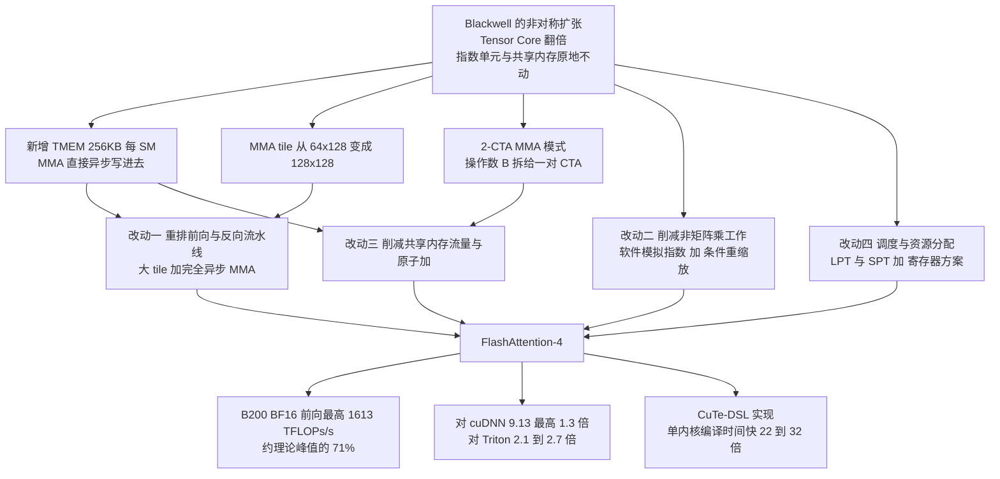
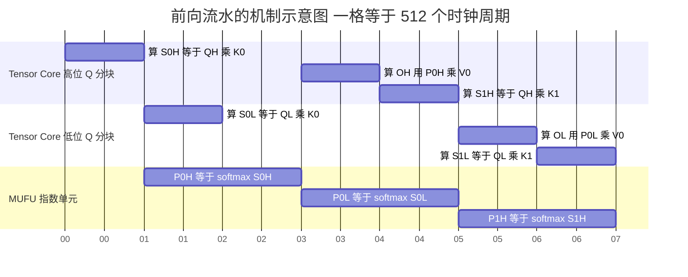
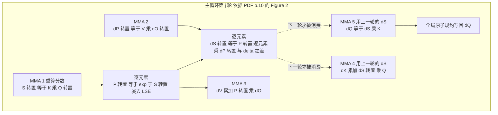
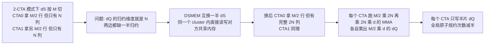

# FlashAttention-4：新卡只把一半的部件加速了，于是瓶颈换了人

<!-- release-date: 2025-06-29 -->

> 本文依据 **FlashAttention-4: Algorithm and Kernel Pipelining Co-Design for Asymmetric Hardware Scaling**（Ted Zadouri、Markus Hoehnerbach、Jay Shah、Timmy Liu、Vijay Thakkar、Tri Dao），即 **arXiv:2603.05451v1**，首页水印日期 2026 年 3 月 5 日，共 20 页（正文 §1–§6 在 p.1–16、致谢与参考文献 p.17–19、附录 A 在 p.20）。**页码均指 PDF 本身的页码**，不是论文小节号。
>
> 全文严格区分三层：**论文明确写了什么**（带页码）、**我们如何理解它**（标注「本文的理解」「本文推算」「本文核对」）、**外部资料补充**（给链接并标明是补充）。
>
> **版本核验结论**：arXiv 上这篇只有 v1 一版，2026-03-05 18:24:49 UTC 提交，**本地 PDF 就是最新版，无需替换**。这和上一代不同——[FlashAttention-3 解读](/reports/Stanford/FlashAttention-3) 依据的是 NeurIPS 正式版，与它的 arXiv 预印本门面数字不同；本篇目前没有会议版，也没有第二次修订。**但确实存在第二个流通文件**：官方仓库 `Dao-AILab/flash-attention` 里有一份 `assets/fa4_paper.pdf`，2026-03-05 加入后再未更新，字节数 8,896,004，与本地这份 arXiv 版的 7,634,447 不同。arXiv 会给 PDF 加侧边水印并重新编译，字节数不同属于常见现象；**本文没有下载那份文件逐页比对**，只在此声明它的存在。凡引用 FA-3 的数字，本文一律注明取自那篇依据的 NeurIPS 正式版。

## 先看两组不成比例的数字

论文第 4 页有一小节叫 "Shifting bottlenecks"，里面列了三个硬件吞吐。把它们和上一代摆在一起，就是这篇论文的全部动机（PDF p.4）：

| 部件 | Hopper H100 | Blackwell B200 | 这一代变快了多少 |
|---|---|---|---|
| BF16 Tensor Core | 4096 ops / 时钟 / SM | **8192 ops / 时钟 / SM** | **两倍** |
| 指数单元 MUFU | 16 ops / 时钟 / SM | 16 ops / 时钟 / SM | **没变** |
| 共享内存读吞吐 | 128 字节 / 时钟 / SM | 128 字节 / 时钟 / SM | **没变** |

（PDF p.4。论文给出了 Tensor Core 那一行的换算：$2.25\ \text{PFLOPS} \div 1850\ \text{MHz} \div 148\ \text{SM} = 8192$。整卡口径是 B200 的 FP16/BF16 峰值 2.25 PFLOPS，对 H100 的 1 PFLOPS，PDF p.2、p.4。）

再看这三个部件在一次注意力里各要花多少周期。论文用一个很朴素的 roofline 分别算了前向和反向（PDF p.6，Table 1；PDF p.11，Table 3）：

| 场景 | MMA 计算 | 共享内存 | 指数单元 | 谁最慢 |
|---|---:|---:|---:|---|
| 前向，$M=N=d=128$ | 1024 | 768 | 1024 | MMA 与指数**并列** |
| 前向，$M=256,N=d=128$ | 2048 | 1536 | 2048 | MMA 与指数**并列** |
| 反向，$M=N=d=128$，1-CTA | 2560 | **3328** | 1024 | **共享内存** |
| 反向，$M=N=d=128$，2-CTA | 2560 | 2688 | 1024 | 共享内存，但只超 5% |

单位是时钟周期。

这两张表合起来说的是同一件事：**在 Blackwell 上，注意力的矩阵乘已经不再是最慢的那一步。** 前向的指数单元和矩阵乘一样慢；反向的共享内存比矩阵乘还慢 30%。

论文给这个现象起了名字：**非对称硬件扩张（asymmetric hardware scaling）**——芯片厂商在功耗和面积不变的前提下，只把最重要的那个部件（矩阵乘单元）的吞吐往上推，其余部件维持原样（PDF p.5）。

这就是本篇的全部矛盾。上一代内核的写法建立在「矩阵乘是长杆、其余都能藏进它的影子里」这个假设上；当矩阵乘的时间被砍掉一半，影子也短了一半，原本藏得住的东西就露出来了。

## 这篇不重讲什么

FlashAttention 系列已经有三代打底，本文一律不重复：

- **第一代**把注意力从访存受限里救出来：分块（tiling）、在线 softmax、反向重算、IO 复杂度。见 [FlashAttention 解读](/reports/Stanford/FlashAttention)。
- **第二代**改并行与工作划分：沿序列长度并行、减少非矩阵乘 FLOP。见 [FlashAttention-2 解读](/reports/Stanford/FlashAttention-2)。
- **第三代**改异步与低精度：TMA、WGMMA、warp 特化、乒乓调度、FP8。见 [FlashAttention-3 解读](/reports/Stanford/FlashAttention-3)。

本文只讲第四代自己的改动。凡是需要用到前三代结论的地方，一句话带过并给内链。

有一处必须先说清楚，因为它决定了这一代根本不是「在 FA-3 上打补丁」：**FlashAttention-3 在 B200 上跑不起来**。论文的脚注 1 只有一句话——"FlashAttention-3 does not run on B200"（PDF p.14）。正文给的原因是 Hopper 的 MMA 指令没有向前兼容（PDF p.2）。所以本篇全部对照实验里都没有 FA-3 这一栏，作者也不可能只做增量修改。

## 读前背景：Blackwell 上多出来的三样东西

这一节是门槛。三个名字都先说人话，再给正式名称。

### 一、张量内存：给矩阵乘结果单独开的一层存储

先回忆一下已有的层级。论文沿用了 FA-3 的叫法（PDF p.3）：

- **GMEM（Global Memory，全局显存）**：就是 HBM，「显卡有多少 G」的那个 G，第一代论文里叫 HBM；
- **L2**：整卡共享的缓存，GMEM 的数据透明地过它；
- **SMEM（Shared Memory，共享内存）**：贴在每个 SM 旁边、程序员自己管的高速缓存，第一代论文里叫 SRAM；
- **RMEM（Register Memory，寄存器）**：每个线程私有，**每线程最多 256 个**（PDF p.4）。

Blackwell 在 SMEM 和寄存器之间插进了新的一层：**TMEM（tensor memory，张量内存）**，每个 SM **256 KB**，专门用来存 Tensor Core 的中间结果（PDF p.3）。

它和共享内存有三点不同（PDF p.3–4）：

1. 它是 **warp 同步的**，而且和 Tensor Core 紧耦合；
2. 矩阵乘单元可以**把输出直接写进 TMEM，不占寄存器**；
3. 它按 **32 列（16 KB）为一个粒度**分配，且必须由程序员显式管理分配、释放和搬运。

第 2 条是关键。论文的原话是，这缓解了「困扰 Hopper 内核的极端寄存器压力」，并因此让更大的 tile 变得可行（PDF p.3）。

**本文的换算**：TMEM 一共 256 KB。一个 $128\times128$ 的 FP32 累加器是 $128\times128\times4 = 65536$ 字节，正好 64 KB。所以 **TMEM 恰好放得下四片 $128\times128$ 的累加器**。这个「四」在后面反向那一节会变成硬约束，论文自己也点了这个数（PDF p.11）。

### 二、更大的 tile，而且矩阵乘变成完全异步

Blackwell 的第五代 Tensor Core，一条 MMA 指令处理 $128\times N$ 的 tile（$N$ 通常取 128 或 256），而 Hopper 是 $64\times N$（PDF p.4）。累加器的面积因此翻倍：Hopper 上一片是 $64\times128$，Blackwell 上是 $128\times128$（PDF p.6）。

更重要的是**写回方式变了**：Hopper 的 MMA 把结果写进寄存器，Blackwell 的 MMA **异步地直接写进 TMEM**（PDF p.4）。论文说这是「完全异步」，好处是矩阵乘单元不再因为要往寄存器回写而阻塞，重叠的空间更大（PDF p.4）。

**本文的对照**：[FlashAttention-3 解读](/reports/Stanford/FlashAttention-3) 里，WGMMA 已经是异步的，但累加器仍在寄存器里，于是寄存器成了流水线深度的天花板——那篇论文里 3 级流水失败就有一半是寄存器不够。TMEM 把这块天花板抬走了。

### 三、2-CTA 模式：两个 SM 合起来当一个用

先复习线程层级（PDF p.4）：**线程 → warp（32 线程）→ warpgroup（4 个连续 warp，即 128 线程）→ 线程块 CTA → 线程块簇 cluster → grid**。同一个 CTA 的线程排在同一个 SM 上，同一个 cluster 的 CTA 排在同一个 GPC 上。

**2-CTA tensor core（双 CTA 张量核心模式）** 允许**同一个 cluster 里的一对 CTA 合作执行一条 MMA 指令**，读写来自两个 CTA 的张量内存（PDF p.4）。

它具体怎么分工，论文写得很清楚（PDF p.4）：

- 单 CTA 的 MMA 把 $M$ 限制在 128，配对之后 $M$ 可以是 128 或 256；
- **操作数 A 和累加器沿 $M$ 维切给两个 CTA**；
- **操作数 B 沿 $N$ 维切给两个 CTA**，于是**每个 CTA 只在自己的共享内存里放半份 B**，硬件在乘的时候消费的是合起来的完整 B。

最后一条就是全部收益：**同样的一次乘法，操作数 B 的共享内存容量和带宽都减半。**

代价也写明了：这对 CTA 必须**固定成对启动**，其中一个发起 MMA、另一个必须保持存活直到指令飞完；而且因为这些操作跨 CTA 触碰张量内存，**整个内核里的张量内存与 Tensor Core 操作必须一致地使用同一种 CTA 模式**（PDF p.4）。这不是一个可以局部打开的开关。

### 把三样东西和四组改动接起来

论文自己把贡献列成四条（PDF p.2）。先给一张全局图：

这张图是**机制示意**，依据 PDF p.2 的四条贡献与 p.3–4 的硬件描述重画，箭头表示「哪个硬件变化支撑哪组改动」，不含实测时间。

## 换一把新尺子：数一数每个部件要转多少圈

前三代各自换过一次计量单位：第一代数 HBM 字节，第二代看占用率与有效 FLOPs/s，第三代看哪个硬件单元在空转。这一代换成了**逐部件的周期数**——论文称之为 "feeds and speeds"（PDF p.5）。

论文自己先声明了这把尺子的粗糙之处：这是一个简化分析，没有把 GPU 的全部资源算进去（比如浮点数学单元、寄存器带宽、L2）；但它足以定位瓶颈（PDF p.5）。

### 前向的三条式子

设 $Q$ 与 $K$ 沿序列长度方向的 tile 形状是 $M\times N$，头维是 $d$。

**第一条，矩阵乘要多少周期。** 前向每轮有两次 MMA：$QK^\top$（用 $M\times d$ 和 $d\times N$ 算出 $M\times N$）和 $PV$（用 $M\times N$ 和 $N\times d$ 算出 $M\times d$）。每次要 $2MNd$ 次浮点运算，Tensor Core 每周期 8192 次：

$$
T_{\mathrm{MMA}}=\frac{4MNd}{8192}\ \text{周期}
$$

（PDF p.5，式 1）

**第二条，共享内存要多少周期。** 这里有一个容易漏掉的机制。两次 MMA 的操作数来源不一样（PDF p.5）：

- $QK^\top$ 是 **shared-shared（SS）**：两个操作数都从共享内存读；
- $PV$ 是 **tensor-shared（TS）**：操作数 A 从张量内存读，操作数 B 从共享内存读。

而一条 MMA 指令一次只吃 $128\times128$ 的 tile。要算一个 $M\times N$ 的输出，就得发 $\lceil M/128\rceil\times\lceil N/128\rceil$ 条指令；**指令一多，同一份共享内存操作数就要被重复读好几遍**。论文把两次 MMA 的读取量分别数清楚，按 BF16 每元素 2 字节、每周期 128 字节换算，得到：

$$
T_{\mathrm{smem}}=\frac{3MNd}{8192}\ \text{周期}
$$

（PDF p.5，式 2，前提是 $M$、$N$、$d$ 都是 128 的倍数）

**第三条，指数单元要多少周期。** 前向要对 $M\times N$ 个注意力分数做指数，MUFU 每周期 16 次：

$$
T_{\exp}=\frac{MN}{16}\ \text{周期}
$$

（PDF p.5，式 3）

**本文核对**：把 $M=N=d=128$ 代进去，$MNd=128^3=2097152$。$4\times 2097152 \div 8192 = 1024$、$3\times 2097152 \div 8192 = 768$、$128\times128\div16 = 1024$。三个数与 Table 1 第一列完全一致（PDF p.6）。换成 $M=256$、$N=d=128$，三个数是 2048、1536、2048，与第二列一致。

### 这张表真正在说什么

Table 1 里最刺眼的不是任何一个数，而是**两个 1024 相等**（PDF p.6）。

拆开看：一个 $128\times128$ 的 tile，两次 GEMM 各 512 周期，合起来 1024；一次 softmax 的 16384 次指数，1024 周期。**Tensor Core 和 MUFU 需要的时间一模一样。**

**本文的理解**（论文没有把这句话写出来，但 p.6 末尾那三条设计动机正是从这里长出来的）：在这个配比下，即使调度做到完美——Tensor Core 和 MUFU 一刻不停地并行——总时间也只能压到 1024 周期，两个部件各自 100% 占用。**这条流水线没有余量。** 想再快，就只有两条路：把指数搬到别的部件上算，或者干脆少算一些非矩阵乘的东西。这正是论文接下来两节做的事（PDF p.6：「用其他硬件单元提高指数吞吐」「减少不必要的非矩阵乘操作的时间」）。

对照一下上一代：[FlashAttention-3 解读](/reports/Stanford/FlashAttention-3) 依据的 NeurIPS 正式版算过，在 H100 上指数大约占矩阵乘时间的一半。Blackwell 把矩阵乘的时间砍掉一半、指数不动，这个比值就从约 0.5 涨到 1.0。**同一个算法，什么都没改，比值自己翻倍了。**

**本文推算**：把式 1 和式 3 相除，这个比值有一个很干净的闭式——

$$
\frac{T_{\exp}}{T_{\mathrm{MMA}}}=\frac{MN/16}{4MNd/8192}=\frac{128}{d}
$$

在 Blackwell 上比值是 $128/d$，在 Hopper 上（矩阵乘每周期 4096 次）同样推法给出 $64/d$。头维 128 时正好是 1.0 与 0.5，与 Table 1 和 FA-3 那篇的数字都对得上。**这个式子还说明：头维越小，指数越吃紧**——$d=64$ 时 Blackwell 上的比值是 2.0，指数要花矩阵乘两倍的时间。论文的基准设置里声明了头维 64，但正文一张头维 64 的图也没有（PDF p.15）；**本文只指出这个巧合，不断言因果**。

## 前向：两个 Q 分块打乒乓，外加一个只管收尾的角色

### 沿用的部分

论文说得很直接：既然 Blackwell 又把 Tensor Core 翻了一倍，重叠 softmax 和 Tensor Core 就比在 Hopper 上更重要。所以**沿用 FA-3 的乒乓调度**——一个线程块算两片输出，一片在做 Tensor Core 操作时，另一片做 softmax（PDF p.6）。两组 softmax warpgroup 之间**显式同步、不让临界区重叠**，这一条也和 FA-3 一样（PDF p.7）。

论文把两片 tile 分别叫「高位 Q 分块」（上标 $H$）和「低位 Q 分块」（上标 $L$），每片对应 128 个 query token（PDF p.6，Figure 1 图注）。

### 变了的部分之一：一个线程一整行

Hopper 的 Tensor Core 把累加器放在寄存器里，一行由四个线程交错持有；Blackwell 把累加器放在张量内存里，一片是 $128\times128$（PDF p.6）。

于是有了一种更自然的分工：**两个 warpgroup，每个 128 线程，每个线程负责一整行**（PDF p.6–7）。

好处论文列了两条（PDF p.7）：

1. **不需要跨 warp 的 shuffle 去求行最大值**——一行完整地在一个线程手里；
2. **每个线程不必再存多份统计量**。

每个 softmax warpgroup 的动作变成一条直线：把整行读进寄存器 → 求最大值 → 做 softmax（减最大值、重缩放、取指数、转成输入精度）→ 求行和（PDF p.7）。

### 变了的部分之二：把重缩放摘出去单独做

这是相对 FA-3 最实质的一处结构变化。论文的原话是：因为 $P$ 现在**通过张量内存而不是寄存器文件**传递，所以可以把输出的重缩放解耦到一个单独的「**correction（修正）**」warpgroup 里，从关键路径上拿掉（PDF p.7）。

**本文的理解**：在 FA-3 里，$P$ 算完就在做 softmax 的那组 warp 的寄存器里，第二个 GEMM 直接从那里取；输出 $O$ 的重缩放也只能由同一组 warp 顺手做。现在 $P$ 落在一块所有人都能寻址的张量内存上，「谁算 softmax」和「谁修正历史输出」就可以是两拨人。关键路径上只剩下真正不能跳的那段——求最大值与取指数。

于是一个 CTA 里同时有**四个 warpgroup**：两个做 softmax、一个做修正、一个驱动 Tensor Core 与 TMA（PDF p.7）。

这张图是**机制示意**，依据 PDF p.6 的 Figure 1 重画。横轴一格代表 512 个时钟周期——**这个数字来自图上标注的吞吐换算**（每次 GEMM 8192 FLOP/周期折合 512 周期，每次 softmax 16 次/周期折合 1024 周期），**不是 profile 得到的实测时长**。读法是：任何时刻 Tensor Core 都在为一片 Q 分块干活，MUFU 都在为另一片做指数；两个部件的忙闲互补。修正 warpgroup 没有画进来，它挂在 softmax 之后、不占关键路径。

### 张量内存怎么分，以及为什么是这个分法

四个 warpgroup 只是排班表，真正卡人的是 256 KB 的张量内存怎么切。论文把选择过程完整写出来了（PDF p.7）：

- **两片输出必须占住**（乒乓的前提）。头维 128 时，这就吃掉了一半张量内存；
- 剩下一半可以放 **两份 $S$**，或者 **四份 $P$**（因为 FP16/BF16 的 Tensor Core 输入位宽只有累加器的一半）；
- 于是只剩两个可行方案：**一片 $S$ 加两片 $P$**，或者 **两片 $S$ 与 $P$ 重叠共用**。

论文选了后者，理由是：**这样开局就能一次算出两片 $S$，软件流水可以立刻启动**；顺带还留下一点张量内存，用来把重缩放统计量传给修正 warpgroup（PDF p.7）。

**代价论文也写了**：tile 变大之后，除非再从张量内存里读回来，否则一个线程必须把整行 128 个元素握在寄存器里。BF16 输入需要 128 个寄存器装输入、最多 64 个装输出，还要留给杂项和临时变量；而每线程上限是 256 个（PDF p.4、p.7）。为了压住寄存器压力，论文**把存 $P$ 的动作拆开做**：前四分之三一次存完并触发对应的 MMA，最后四分之一单独存（PDF p.7）。

**本文的评价**：这一段很值得读两遍。它不是在讲一个漂亮的算法，而是在讲一次**容量预算的分配**——256 KB 张量内存、256 个寄存器、四个 warpgroup 的排班，三者互相挤。论文没有给这几个方案的实测对照，所以我们只知道作者选了什么，不知道另一个方案差多少。

## 前向改动一：把一部分指数搬到乘加单元上算

### 旧问题

指数跑在 **MUFU（multi-function unit，多功能单元）** 上，每 SM 每周期 16 次；矩阵乘每 SM 每周期 8192 次（PDF p.7）。**512 倍的价差。** 而 softmax 要做的指数次数不少，所以它是注意力内核里的一个关键瓶颈（PDF p.7）。

论文顺带提了一句很有意思的话：**B300 和 GB300 已经把指数吞吐翻倍到每周期 32 次，但写作时这些卡还没有广泛可用**（PDF p.4）。也就是说，这个瓶颈硬件厂商已经在修了；本篇是在修好之前的软件解法。

### 新设计：用浮点乘加单元并行地算另一份指数

思路一句话讲完：**MUFU 忙不过来，就让 FMA（fused multiply-add，融合乘加）单元也算一份**。FMA 单元和 MUFU 是两套硬件，可以并行工作（PDF p.7）。

具体做法是经典的 **Cody-Waite 区间归约 + 多项式逼近**，目标函数是 $2^x$（PDF p.7）。为什么是 $2^x$ 而不是 $e^x$：GPU 的硬件指数指令就是 `MUFU.EX2`，即以 2 为底；$e^x$ 一律先换算成 $2^{x\log_2 e}$ 再算。（**本文的背景补充**，论文没有解释这一步。**读的时候要留意论文自己的记号是混着来的**：§3.1.3 全用 $2^x$，§3.1.4 的在线 softmax 公式却写成 $e^{\cdot}$，但那里的阈值又写作 $\log_2 256$——只有按 2 为底读，那个阈值才说得通。）

第一步是拆成整数部分和小数部分：

$$
2^x = 2^{\lfloor x\rfloor}\cdot 2^{\,x-\lfloor x\rfloor}
$$

（PDF p.7，式 4。$\lfloor x\rfloor$ 是向下取整，$x-\lfloor x\rfloor$ 落在 $[0,1)$。）

**整数部分几乎免费。** 因为 IEEE 754 浮点数的指数字段直接就表示 2 的幂，算 $2^{\lfloor x\rfloor}$ 只需要在指数位上做一次移位加法，用整数 ALU 指令就够了（PDF p.7）。

**小数部分用多项式逼近：**

$$
2^{\,x_{\mathrm{frac}}}\approx\sum_{i=0}^{n} p_i\,x_{\mathrm{frac}}^{\,i}
$$

（PDF p.7，式 5）

其中 $p_0=1.0$，其余系数用 Sollya 这个数值软件包在 $[0,1)$ 上按最小化相对误差算出来；求值用 Horner 方法，全部落成 FMA 指令（PDF p.7–8）。

完整流程五步（PDF p.8）：

1. 把 $x$ 夹到不小于 $-127$，避免下溢；
2. 用向下舍入模式求 $\lfloor x\rfloor$——先给 $x$ 加上 $2^{23}+2^{22}$，把小数位挤出尾数，再以向下舍入减回去；
3. 求小数部分 $x_{\mathrm{frac}} = x-\lfloor x\rfloor$；
4. 用多项式求 $2^{x_{\mathrm{frac}}}$；
5. 把 $\lfloor x\rfloor$ 移进指数字段，再加上 $2^{x_{\mathrm{frac}}}$ 的尾数位。

### 关键的一步：只模拟一部分

**这不是「用软件全面替换硬件指数」。** 论文明确写了模拟的代价：需要额外的寄存器装中间值和系数、消耗更多寄存器带宽、延迟比一条 MUFU 指令长；如果全部用模拟，寄存器压力会上升到发生溢出，把吞吐收益全吃掉（PDF p.8）。

所以做法是**部分模拟**：**每一行 softmax 里只有 10–25% 的元素走软件模拟，其余仍然用硬件 `MUFU.EX2`**；确切比例按给定 tile 配置下 MMA 与指数吞吐的比值**经验调出来**（PDF p.8）。

**本文的理解**：这个设计的目标不是「让指数变快」，而是「**让 MUFU 不再是节拍决定者**」。回到前面那两个 1024：只要把 MUFU 的活卸掉 10–25%，它的耗时就掉到 768–922 周期，低于 Tensor Core 的 1024，整条流水的节拍就重新由 Tensor Core 单独决定。多卸载没有意义，还要付寄存器的钱。**这是一个刚好够用的比例，不是一个越大越好的旋钮。**

### 精度：够用就行，而不是越准越好

论文给了一张很好的表（PDF p.8，Table 2），在 400 万个 $[0,1)$ 上的随机输入上、以 FP64 为真值测 $2^x$：

| 方法 | FP32 最大相对误差 | FP32 平均相对误差 | 转成 BF16 后最大相对误差 | 转成 BF16 后平均相对误差 |
|---|---:|---:|---:|---:|
| 理想值（FP64 直接转 BF16） | — | — | $3.89\times10^{-3}$ | $1.41\times10^{-3}$ |
| 硬件 `MUFU.EX2` | $1.41\times10^{-7}$ | $3.04\times10^{-8}$ | $3.89\times10^{-3}$ | $1.41\times10^{-3}$ |
| 3 次多项式 | $8.77\times10^{-5}$ | $5.43\times10^{-5}$ | $3.90\times10^{-3}$ | $1.41\times10^{-3}$ |
| 4 次多项式 | $3.05\times10^{-6}$ | $1.84\times10^{-6}$ | $3.89\times10^{-3}$ | $1.41\times10^{-3}$ |
| 5 次多项式 | $1.44\times10^{-7}$ | $5.48\times10^{-8}$ | $3.89\times10^{-3}$ | $1.41\times10^{-3}$ |

这张表的读法全在左右两半的对比上：

- **左半（FP32 口径）**：3 次多项式比硬件差了大约 600 倍（$8.77\times10^{-5}$ 对 $1.41\times10^{-7}$，论文自己写的就是「roughly 600×」，PDF p.8）。看上去很糟。
- **右半（BF16 口径）**：所有 3 次及以上的多项式与硬件、与理想值**几乎分不出来**，因为 **BF16 本身的量化误差（约 $3.9\times10^{-3}$）已经把多项式的逼近误差盖住了**（PDF p.8）。

论文的结论是：3 次多项式在 99% 的输入上与硬件相差不超过 **1 个 BF16 ULP**，对于「softmax 输出本来就以 BF16 精度被消费」的注意力计算已经足够；5 次多项式能把 FP32 口径的最大相对误差压到硬件的 2 倍以内，代价是每次求值多两条 FMA 指令（PDF p.8）。

（**ULP** 是 unit in the last place，即「最后一位的单位」，衡量两个浮点数在其精度格点上差了几格。这是本文补的解释，论文直接用了这个缩写。）

**这是一处必须说准确的边界。** 前三代 FlashAttention 的招牌是「精确注意力」——不改变模型定义。本篇**没有再声称精确**：它在 10–25% 的元素上，用一个多项式代替了硬件指数指令。注意力的**数学定义没有变**（这不是第一代论文里 block-sparse 那种丢掉一部分注意力的近似），但**逐位数值行为变了**。论文没有测过完整内核输出的 RMSE，只测了孤立的 $2^x$ 函数。**本文不能替它外推「对模型质量无影响」。**

### 可迁移启发

> **当一个部件成为节拍决定者时，第一反应不该是「怎么让它更快」，而是「这台机器上还有谁闲着，能不能替它分担一部分」。**

第二条更普适：

> **精度只需要压过下游的量化误差，多出来的精度是白花的钱。** 3 次多项式在 FP32 口径下差 600 倍，在 BF16 口径下差不多为零——因为结果最终要被舍入到 BF16。定精度指标之前，先看清楚这个数最后会被存成什么。

## 前向改动二：大多数时候不必换基准

### 先用一句话回忆在线 softmax

分块处理时，算法维护两个统计量并逐块更新（PDF p.9）：

$$
m_j=\max\!\left(m_{j-1},\ \operatorname{rowmax}(S_j)\right)
$$

$$
\ell_j = e^{\,m_{j-1}-m_j}\,\ell_{j-1}+\operatorname{rowsum}\!\left(e^{\,S_j-m_j}\right)
$$

$$
O_j = e^{\,m_{j-1}-m_j}\,O_{j-1}+e^{\,S_j-m_j}\,V_j
$$

$m_j$ 是至今见过的行最大值，$\ell_j$ 是至今累积的指数和。因子 $e^{\,m_{j-1}-m_j}$ 的作用是把旧账换算到新基准上。完整来龙去脉见 [FlashAttention 解读](/reports/Stanford/FlashAttention)，本文不重讲。

### 旧问题

论文只点了一句：$e^{\,m_{j-1}-m_j}O_{j-1}$ 这一步**要做一次向量乘法**（PDF p.9）。$O$ 是 $M\times d$ 的，每换一次基准就要把它整片乘一遍，而且这件事在内循环的每一轮都可能发生。

### 新设计：给基准留一段松弛

论文的两个观察都很朴素（PDF p.9）：

1. **只有 $m_j > m_{j-1}$ 时才需要重缩放**；
2. **可以容忍一点松弛**：只在 $m_j-m_{j-1}>\tau$ 时才重缩放，$\tau$ 一般取 $\log_2 256 = 8.0$，对应一个 256.0 的缩放因子。

（**读记号的提醒**：论文这一节的公式写的是 $e^{\cdot}$，但阈值写成 $\log_2 256$。只有按上一节那个以 2 为底的口径去读，「$\tau=8$ 对应 256 倍」才成立。本文按 2 为底解释。）

于是更新规则变成分段的：

$$
O_j=
\begin{cases}
e^{\,m_{j-1}-m_j}\,O_{j-1}+e^{\,S_j-m_j}\,V_j, & m_j-m_{j-1}>\tau\\[4pt]
O_{j-1}+e^{\,S_j-m_{j-1}}\,V_j, & \text{否则}
\end{cases}
$$

（PDF p.9，式 6）

当 $m_j-m_{j-1}\le\tau$ 时，**连 $m$ 都不更新**，继续沿用 $m_{j-1}$（PDF p.9）。

### 为什么还是对的

论文给的理由是：计算结束时，所有累积量都会被真正的最大值 $m_{\mathrm{final}}$ 和最终的归一化因子 $\ell_{\mathrm{final}}$ 统一重整（PDF p.9）：

$$
\text{Output}=\frac{1}{\ell_{\mathrm{final}}}\,O_{\mathrm{final}}
$$

**本文的理解**（论文没有展开这一步）：减最大值这件事，从来不是为了正确性，而是为了**不让 $e^{x}$ 溢出**——分子分母同乘一个常数，softmax 的值不变。所以「暂时不换基准」在精确算术下完全不改变结果，只是让未归一化的累加器比「时刻贴着最大值」的版本最多热 $2^8=256$ 倍。FP32 累加器的动态范围远远吃得下这 256 倍，所以这笔账是安全的。$\tau$ 越大跳过的重缩放越多，数值裕度越小；论文取 8.0，等于把安全边界定在 256 倍。

还有一条很实际的实现细节：**为了避免 warp 内分叉，只要 warp 里有任何一个线程需要重缩放，整个 warp 就一起做**（PDF p.9）。

### 代价与边界

- **论文没有给这一项的单独收益。** 全文没有条件重缩放的消融，也没有「跳过了百分之多少的重缩放」这样的统计。
- $\tau=8.0$ 论文写的是「typically」，没有给扫描曲线，也没有说不同头维或数据分布下要不要改。
- 和上一节的软件模拟指数一样，它改变了浮点求和的具体顺序与量级，但**论文没有测完整内核的数值误差**。

> **外部补充（不是论文内容）**：这个技巧最早出现在 2025 年 8 月 Hot Chips 2025 的一场报告里，[SemiAnalysis 当时的转述](https://x.com/SemiAnalysis_/status/1963255669613592921)称它把重缩放次数减少了约 10 倍。**论文正文里没有这个数字**，本文不把它当作论文结论。

## 反向：先把账算清楚，瓶颈换成了共享内存

### 五次矩阵乘

反向要算的东西论文列在 p.3：

$$
dV = P^\top dO,\quad dP = dO\,V^\top,\quad dS=\operatorname{dsoftmax}(dP),\quad dQ=\alpha\,dS\,K,\quad dK=\alpha\,dS^\top Q
$$

其中 $\alpha=1/\sqrt d$。加上重算 $S$，一共**五次矩阵乘**——这一点从第二代起就没变，见 [FlashAttention-2 解读](/reports/Stanford/FlashAttention-2)。

于是（PDF p.9，式 7）：

$$
T_{\mathrm{MMA}}=\frac{10MNd}{8192}\ \text{周期}
$$

### 共享内存那一笔账

论文把五次 MMA 按操作数来源分了类（PDF p.10）：

- **三次是 SS（两个操作数都从共享内存读）**：$S^\top=KQ^\top$、$dP^\top=VdO^\top$、$dQ=dSK$；
- **两次是 TS（A 从张量内存读、B 从共享内存读）**：$dV=P^\top dO$、$dK=dS^\top Q$。

SS 那三次一共从共享内存读 $2Md+3Nd+MN$ 个元素，TS 那两次读 $2Md$ 个。合起来按 BF16 每元素 2 字节、每周期 128 字节换算：

$$
T_{\mathrm{smem,MMA}}=\frac{4Md+3Nd+MN}{64}\ \text{周期}
$$

（PDF p.10，式 8）

还没完。反向还要**额外往共享内存写两样东西**（PDF p.10）：

- 中间梯度 $dS$，大小 $M\times N$，以 BF16 写出，$2MN$ 字节即 $MN/64$ 周期；
- 梯度 $dQ$，大小 $M\times d$，**以 FP32（每元素 4 字节）写进共享内存，再由 TMA 读回来做规约**，一共 $8Md$ 字节即 $Md/16$ 周期。

$$
T_{\mathrm{smem}}=\frac{4Md+3Nd+MN}{64}+\frac{MN}{64}+\frac{Md}{16}\ \text{周期}
$$

（PDF p.10，式 9；指数单元仍是 $T_{\exp}=MN/16$，式 10）

### 结果

Table 3（PDF p.11）把 $M=N=d=128$ 代进去：

| 资源 | 1-CTA（$M=128$） | 2-CTA（$M=256$） |
|---|---:|---:|
| MMA 计算 | 2560 | 2560 |
| 共享内存：MMA 操作数 | 2048 | **1536** |
| 共享内存：写 $dS$ | 256 | 256 |
| 共享内存：$dS$ 走 DSMEM | 0 | 384 |
| 共享内存：$dQ$ 写加读 | 1024 | **512** |
| **共享内存合计** | **3328** | **2688** |
| 指数单元 | 1024 | 1024 |

**本文核对**：$MNd=2097152$。$T_{\mathrm{MMA}}=10\times2097152\div8192=2560$ ✓；$(4Md+3Nd+MN)/64=(65536+49152+16384)/64=2048$ ✓；$MN/64=256$ ✓；$Md/16=1024$ ✓；合计 3328 ✓。$3328/2560=1.30$，与论文说的「超出约 30%」一致（PDF p.11）；$2688/2560=1.05$，与「约 5%」一致。

结论很清楚：**反向的瓶颈不是矩阵乘，也不是指数，是共享内存。** 论文还补了一句很有意思的话：这个瓶颈「比全局内存流量所暗示的要轻一些」（PDF p.10）——**用第一代那把尺子（数 HBM 字节）去量，会得出错误的结论**。

## 反向改动一：张量内存把 FA-3 的排序约束解开了

### 旧问题

论文对 FA-3 反向的判词很具体（PDF p.11）：FA-3 的累加器存在寄存器里，而寄存器是稀缺资源；这带来了严重的排序约束，**实际上把计算图串行化了**——必须按 $S$、$dP$、$dV$、$dQ$、$dK$ 的顺序算，只有 TMA 载入能明显地不按顺序跑。

而在 Blackwell 上，要想把 softmax 的延迟藏起来，**至少需要两条 MMA 同时在飞**（PDF p.11）。FA-3 的做法是让 softmax 和 $dP$ 的 MMA 重叠，只有一条。

### 新设计：借上一轮的 $dQ$ 与 $dK$ 来凑第二条

论文的办法是**把上一轮迭代的 $dQ$ 和 $dK$ 的 MMA 挪到这一轮来发**（PDF p.11）。这样本轮的 softmax 就有两条 MMA 陪着跑。

这张图是**机制示意**，依据 PDF p.10 的 Figure 2 重画。实线箭头表示数据依赖，虚线表示「本轮算出的 $dS$ 要等到下一轮才被消费」。图上不含任何实测时间。要看的重点只有一个：**MMA 4 与 MMA 5 用的是上一轮的 $dS$，所以它们可以和本轮的逐元素 softmax 计算并行。**

### 张量内存不够放五片累加器

这里有一处很硬的约束，论文写得毫不含糊（PDF p.11）：**最多只能放下四片 $128\times128$ 的累加器，而 $dV$ 和 $dK$ 都是累加量，不能共用空间。**

于是实现里的分配是：$S$ 与 $P$ 共用一块（偏移 0 处），$dP$、$dS$、$dQ$ 共用另一块（PDF p.11）。剩下两块分别归 $dV$ 和 $dK$ 独占。

**本文的换算**：这正好对上前面算的 TMEM 容量——$256\ \text{KB} \div (128\times128\times4\ \text{字节}) = 4$。四片，一片不多。Figure 2 图注里标的四段张量内存列区间 [0,128)、[128,256)、[256,384)、[384,512) 也印证了这一点（PDF p.10）。

**本文的理解**：这段值得单独记。新加一层存储不会自动带来自由——它带来的是**一个新的、有明确容量的预算**，而算法要重新设计成能装进这个预算。「哪些量可以共享同一块地址、哪些量因为要累加所以必须独占」，这是排流水线之前必须先答的题。

## 反向改动二：2-CTA 模式，以及一次为它做的通信

### 为什么还要动

即使流水线改好了、十个 GEMM 操作数里有两个已经常驻张量内存，**共享内存带宽仍然主导着反向**：剩下八个 BF16 操作数都要从共享内存喂给 Tensor Core，这部分流量比 Tensor Core 的计算多花大约 30% 的周期（PDF p.12）。

### 新设计

用 2-CTA MMA 模式，MMA tile 取 $M=256$、$N=K=128$。一对 CTA 当成一片更大的 tile 用：**每个 CTA 只装载并暂存半份操作数 B，只保留属于自己的那一片累加器**（PDF p.12）。操作数 B 的共享内存流量因此大致减半。

### 一个真实的冲突：$dQ$ 的归约轴被切错了

这是本篇最需要慢读的一段（PDF p.12）。

反向的并行方式是：**每个 CTA 拿住一片固定的 KV 分块**（外层循环按 $N$ 切给各个 CTA），**在内层循环里流过一片片 $M$ 分块**。

$dQ$ 的累加是**沿 KV 序列方向的规约**，也就是沿外层循环。而 2-CTA 模式**只切输出 tile，不切归约轴**；偏偏 $dQ = dS\,K$ 这次 MMA 的归约维度就是 $N$，而 $N$ 恰好是被切给这对 CTA 的那一维。

结果就是：**每个 CTA 手里只有半份归约，却需要为自己拥有的那些行做完整的归约。**

### 解法：用分布式共享内存把 $dS$ 换一个切法

论文的办法是用 **DSMEM（distributed shared memory，分布式共享内存）**——同一个 cluster 里的 CTA 可以互相访问对方的共享内存——**把 $dS$ 的一半交换给对方**（PDF p.12）。

交换之后，$dS$ 被**重新沿非归约轴切分**：每个 CTA 拥有自己的 $M/2$ 行，但握有完整的 $2N$ 归约。于是每个 CTA 的 $dQ$ MMA 形状变成 $(\tfrac{M}{2},\,2N)\times(2N,\,d)$，在张量内存里累出一片 $(\tfrac{M}{2},\,d)$ 的结果。

这张图是**机制示意**，依据 PDF p.11 的 Figure 3 与 p.12 的正文重画，箭头表示数据重排的顺序，不含实测时间。

所以在 2-CTA 模式下，$S$、$dP$、$dV$、$dK$ 这四次 MMA 用 $M=256$ 跑，而 **$dQ$ 用 $M=128$ 但归约维翻倍成 $2N=256$**（PDF p.12）。这一点在 Table 3 的图注里也单独标了出来（PDF p.11）。

### 顺带解决的第二个问题：原子加减半

$dQ$ 的跨 CTA 累加原本靠全局原子加完成。论文指出原子更新有两个毛病：**引入不确定性**，而且**很贵**——它发生在内层循环的每一轮（PDF p.12）。

拆分之后，每个 CTA 只写半片 $dQ$，**全局原子规约的次数只有 1-CTA 版本的一半**（PDF p.12）。

### 为它付出的代价

- **软件流水必须重排**，以便把 DSMEM 的延迟藏起来：先算当前 tile 的 $dP$，再算上一轮 tile 的 $dQ$（PDF p.12）；
- **张量内存的分配也跟着变**：$dQ$ 的 tile 小到可以和 $P$ 一起挤进 $S$ 的那块区域，于是 $dP$ 和 $dQ$ **不再像 1-CTA 那样共用同一块**（PDF p.12）；
- Table 3 里 2-CTA 多出来一行 **384 周期的 DSMEM 流量**（PDF p.11）——这次交换不是免费的，只是比它省下的 512 周期便宜；
- **CTA 必须成对启动、整个内核用同一种模式**（PDF p.4）。

### 一处必须写清楚的边界

**Table 3 是 roofline 估算，不是实测对照。** 论文**没有**给出「1-CTA 反向 vs 2-CTA 反向」的实测吞吐对比图。3328 → 2688 这个改善是按式 8、式 9 算出来的，不是量出来的。Figure 6 里的 FA4 反向曲线是最终版本，没有拆出 2-CTA 的独立贡献。

### 可迁移启发

> **并行拆分要拆在非归约轴上。** 如果框架只允许你按输出切，而你的归约恰好也在那一维上，那就必须补一次通信，把数据重新排成「每个人拥有完整归约」的形状。这次通信的成本，应该和它省下的带宽放在同一张表里比。

## 反向改动三：确定性模式，靠排序而不是靠加锁

### 问题

反向内核的不确定性来自**跨 CTA 的全局内存规约**：一般情况下影响 $dQ$，用 GQA 时还影响 $dK$ 和 $dV$（PDF p.12）。

论文给出确定性模式的理由很实在：**保证可复现，并且让训练期间的调试变得可靠**（PDF p.12）。

### 标准解法与它的两个代价

做法是用**信号量锁把全局规约串行化**：每个要往同一片 $dQ$ 上写的 CTA，按预先定好的顺序取锁、做规约、然后通过给信号量计数器加一来释放锁（PDF p.12）。

论文诚实地列了两条性能代价（PDF p.12）：

1. **必须发内存栅栏**，让信号量的写对整设备可见（正确的 acquire-release 语义要求这一点）；
2. **会产生停顿**：每个 CTA 都要等在同一片 $dQ$ 上规约的前序 CTA 完成。

而且论文指出：**在负载不均衡的情况下，一个糟糕的 CTA 顺序会严重拖垮性能**（PDF p.12）。

### 真正的解法是把顺序排对

于是重点不在锁，在**顺序**（PDF p.12–13）：

- 总体上在 **head 与 batch 维度做 CTA swizzle**，规模控制在 L2 容量以内；
- **对因果掩码**：KV 分块按**降序**启动，query 分块从对角线开始按**升序**遍历，$dQ$ 的规约按 query 分块**降序**排。

论文给这个方案起名 **SPT（shortest-processing-time-first，最短处理时间优先）**，并说明它的作用是：**保证没有任何一个 CTA 会卡在它的第一次 $dQ$ 写上**（PDF p.13）。

### 数据

Figure 7 是因果注意力、头维 128 下确定性反向的消融，单位 TFLOPS（PDF p.16。**图上的标注值都取到十位，本文照抄**）：

| 序列长 | SPT | 反向 mblock 的 LPT | 朴素 LPT | 朴素（不做 batch/head swizzle） |
|---:|---:|---:|---:|---:|
| 1024 | 470 | 450 | 440 | 250 |
| 2048 | 660 | 600 | 570 | 280 |
| 4096 | 830 | 710 | 670 | 310 |
| 8192 | 920 | 790 | 720 | 350 |
| 16384 | 940 | 810 | 740 | 410 |
| 32768 | 950 | 830 | 760 | 540 |

Figure 8 左半是非因果的对照，只有两条（PDF p.20）：

| 序列长 | 做 swizzle | 朴素 |
|---:|---:|---:|
| 1024 | 630 | 500 |
| 2048 | 760 | 570 |
| 4096 | 840 | 650 |
| 8192 | 850 | 730 |
| 16384 | 860 | 840 |
| 32768 | 880 | 880 |

**本文推算**：因果场景下 SPT 对朴素方案的比值，从 1024 处的 $470/250=1.88$ 升到 4096 处的 $830/310=2.68$，再随序列变长收窄到 32768 处的 $950/540=1.76$。非因果场景下 swizzle 的收益从 1024 处的 $630/500=1.26$ 一路收敛到 32768 处的 1.00——**序列越长、每个 worktile 越大，调度顺序就越不重要**。

论文对这一节的总结是：「我们细致的 swizzle 与调度做出了一个快得多的确定性反向，最高能达到 1-CTA 非确定性反向速度的 **75%**」（PDF p.16）。

> **外部补充（与论文数字不一致，值得留意）**：作者的[官方博客](https://tridao.me/blog/2026/flash4/)（2026-03-05）在同一件事上写的是「实践中确定性反向在我们的基准里最高达到非确定性吞吐的**约 85–90%**」。同一篇博客给的门面吞吐是 **1605 TFLOPs/s（71% 利用率）**，而论文摘要写的是 **1613**（PDF p.1）。两处都是小差异，但说明**论文与官方博客不是同一次测量或同一个口径**。本文一律以论文为准，把博客的数字标为外部补充。

### 边界

- **论文没有给出 1-CTA 非确定性反向的具体数字**，所以那个 75% 的分母读者拿不到。Figure 6 里的 FA4 曲线是 2-CTA 版本。
- 确定性模式对 $dK$/$dV$ 的处理只在 GQA 情形下被提了一句，没有单独的数据。

## 调度：把最长的活先派出去

### 问题

带因果掩码或变长序列时，注意力内核**天然负载不均**——不同 worktile 的主循环长度不同，有的需要更多次载入和 MMA（PDF p.13）。

而且默认顺序恰好是最坏的：标准的注意力网格按 (mblocks, heads, batches) 从左到右递增遍历，因为对角线以上被掩掉，**固定 head 和 batch 时，SM 是按从短到长的顺序去领活的**（PDF p.13）。

### 解法与它的两处折中

论文用的是经典的 **LPT 调度**，全称 longest-processing-time-first，即最长处理时间优先；出处是 Graham 1969 关于同构并行处理器 makespan 最小化的结果（PDF p.13）。

但**朴素的 LPT 顺序同样次优**，因为它破坏了缓存局部性：跨 batch 时主循环的 KV 载入命中不了 L2，而且**一次性把所有 KV head 都载入会把 L2 冲垮**（PDF p.13）。

所以最终的遍历顺序是一个折中（PDF p.13）：

1. **batch 永远放在最外层**；
2. 把 head 分成若干**不会撑爆 L2 的 section**；
3. tile 调度器的遍历顺序是：section 内逐 head → mblock **逆序** → 换 section → 换 batch；
4. 对 MQA 或 GQA，**同一个 KV head 下的所有 query head 要先走完，再变 mblock**。

### 收益，以及一个容易忽略的细节

论文给的实测是：BF16、头维 128 时，**MHA 有 4–8% 的 FLOPS 提升，MQA-8 有 7–14%**（PDF p.13）。

**这组数字是在 H200 上测的，不是 B200。** 论文自己也强调，这个想法「在所有 GPU 架构上都适用，并且也被验证为对 Hopper 上的 FlashAttention-3 是一项改进」（PDF p.13）。

**本文的提醒**：所以这是全篇唯一一处 Hopper 上的实测数据，而且它证明的是「LPT 对上一代也有用」，不是「LPT 在 B200 上值多少」。前向那句「因果场景收益更大，我们归因于 LPT 调度器」（PDF p.15）是一个**归因判断**，没有 B200 上的消融支撑。

### 变长序列

变长（varlen）场景的不均衡来自 batch 之间的差异：解码时不同 batch 关注的上下文长度不同；混合批或连续批处理时，有的 batch 在做 prefill、有的在做 decode（PDF p.13）。

标准做法是内核在运行时按递增顺序读设备上的长度元数据，而**给定的 batch 顺序对负载均衡可能任意地糟**——比如一串短的方形 prefill 后面跟着长上下文 decode（PDF p.13）。

论文的解法很工程：**先跑一个预处理内核，按每个 batch 的最大单 worktile 执行时间排序，写出一张「虚拟 batch 序号 → 实际 batch 序号」的映射表**，注意力内核读回这张表按排好的顺序遍历。论文强调这份元数据**可以缓存，因此排序不带来性能损失**（PDF p.13）。

## 语言：整个内核用 Python 写

这是论文的第四项贡献，也是最容易被当成工程细节略过、但影响最直接的一项。

**FlashAttention-4 完全用 CuTe-DSL 写成，嵌在 Python 里，没有任何 CUDA C++ 组件**（PDF p.13）。编译链是：Python 源码 → CuTe-DSL 编译器降级成 PTX → 再由 PTX 编译器 `ptxas` 产出汇编 SASS（PDF p.13）。

论文强调了两点（PDF p.13–14）：

- **表达力没有打折**：CuTe-DSL 的编程模型与 CUTLASS C++ **同构**，而且提供**直接写 PTX 的逃生口**——论文自己就为 CuTe-DSL API 尚未完全暴露的操作用了自定义 PTX 序列；
- **编译时间是过去几代的老大难**。

Table 4（PDF p.14）给的是**单个内核**的编译时间：

| 实现 | 前向 | 反向 |
|---|---:|---:|
| FlashAttention-3（C++ 模板） | 55 s | 45 s |
| FlashAttention-4（CuTe-DSL） | **2.5 s** | **1.4 s** |
| 加速比 | **22×** | **32×** |

图注还补了一句关键背景：**FA-2 和 FA-3 通常需要为不同的注意力变体预编译几百个内核**（PDF p.14）。所以真实的等待时间要把这个倍数再乘上去。

**本文核对**：摘要和引言写的是「20-30× faster compile times」（PDF p.1、p.2），而 Table 4 的反向是 32×，略微超出这个区间上界。这是一处小的内部不一致。

论文还给了一条来自实践的佐证：已经有开发者在 FlashAttention-4 之上**不修改核心框架**就实现了 FlexAttention 和块稀疏注意力变体（PDF p.14）。它的愿景是把块稀疏模式、掩码策略、变长处理、工作调度都做成**可以自由组合的正交原语**（PDF p.14）。

**本文的评价**：把这一节和第一代论文的限制清单放在一起读会很有意思。第一代把「每种新注意力都要手写一个 CUDA 内核」列为首要门槛，希望有人做出一种高级语言能编译成 IO 感知的实现（见 [FlashAttention 解读](/reports/Stanford/FlashAttention)）。四年过去，答案不是通用编译器，而是**一种和底层同构、但宿主语言换成 Python 的 DSL**——门槛降低的方式不是抽象层次抬高，而是**元编程与编译反馈变快**。

## 实验：把每个加速比的分母写清楚

### 先钉死范围

- **硬件**：正文一律写 **B200**（PDF p.14、p.15）。但**附录 A.1 写的是「B100 180GB SXM6（1000W）」**（PDF p.20）——这是一处明显的内部矛盾，本文无法判断哪个是笔误。
- **方法**：预热 5 次，重复 10 次取平均（PDF p.20）。
- **软件栈**：CUDA 13.1、FlashAttention 2.8.3、Triton 3.6、PyTorch 2.10.0、CuTe-DSL 4.4.1；cuDNN 用了 9.13 和最新的 9.19.1.2（PDF p.20）。**附录写「截至写作时（2025 年 3 月）的最新版本」，而这篇的 arXiv 提交日是 2026-03-05**——年份对不上，且 CUDA 13.1 与 PyTorch 2.10.0 在 2025 年 3 月并不存在。本文按后者理解为 2026 年 3 月，但这是**本文的推测**，论文写的是 2025。
- **对照**：PyTorch 标准实现、FlashAttention-2、Triton（会用 B200 专属指令）、Gluon（比 Triton 更底层的 GPU 编程语言）、cuDNN。**没有 FlashAttention-3，因为它在 B200 上跑不起来**（PDF p.14，脚注 1）。
- **形状**：序列长 1k、2k、…、32k；**batch 随序列长变化，使总 token 数固定为 32k**；隐藏维 2048；头维 64 或 128（对应 32 或 16 个头）；另有 DeepSeek-V3 用的 (192, 128) 配置——16 个头、query 维 192、key/value 维 128（PDF p.15）。
- **FLOPs 口径**：前向 $4\cdot\text{seqlen}^2\cdot\text{头维}\cdot\text{头数}$；带因果掩码除以 2；反向取前向的 **2.5 倍**（前向 2 次矩阵乘、反向因重算有 5 次）（PDF p.15）。这套口径和前两代完全一致。
- **测的全部是注意力这一层。** 没有任何端到端数字。

### 前向，头维 128（PDF p.15，Figure 4）

非因果，单位 TFLOPS：

| 序列长 | FA-2 | Triton 3.6.0 | Gluon 3.6.0 | cuDNN 9.13.0 | cuDNN 9.19.1.2 | **FA-4** |
|---:|---:|---:|---:|---:|---:|---:|
| 1K | 383 | 507 | 1060 | 1157 | 1346 | **1355** |
| 2K | 406 | 594 | 1147 | 1328 | **1474** | 1468 |
| 4K | 420 | 648 | 1198 | 1413 | **1552** | 1532 |
| 8K | 427 | 676 | 1226 | 1460 | **1585** | 1579 |
| 16K | 430 | 695 | 1242 | 1488 | **1609** | 1601 |
| 32K | 432 | 703 | 1250 | 1517 | **1613** | **1613** |

带因果掩码：

| 序列长 | FA-2 | Triton | Gluon | cuDNN 9.13.0 | cuDNN 9.19.1 | **FA-4** |
|---:|---:|---:|---:|---:|---:|---:|
| 1K | 292 | 351 | 638 | 717 | **822** | 744 |
| 2K | 343 | 455 | 824 | 929 | **1103** | 1053 |
| 4K | 375 | 546 | 938 | 1076 | **1295** | 1279 |
| 8K | 395 | 609 | 982 | 1168 | **1430** | 1426 |
| 16K | 404 | 647 | 1023 | 1285 | 1509 | **1526** |
| 32K | 408 | 670 | 1037 | 1266 | 1540 | **1576** |

### 前向，头维 (192, 128)，带因果掩码（PDF p.15，Figure 5）

| 序列长 | cuDNN 9.13.0 | cuDNN 9.19.1.2 | **FA-4** |
|---:|---:|---:|---:|
| 1K | 769 | **860** | 812 |
| 2K | 999 | **1133** | 1121 |
| 4K | 1167 | 1311 | **1357** |
| 8K | 1276 | 1415 | **1506** |
| 16K | 1375 | 1515 | **1600** |
| 32K | 1382 | 1563 | **1654** |

### 反向，头维 128（PDF p.16，Figure 6）

非因果：

| 序列长 | FA-2 | cuDNN 9.13.0 | cuDNN 9.19.1.2 | **FA-4** |
|---:|---:|---:|---:|---:|
| 1K | 295 | 857 | 928 | **936** |
| 2K | 333 | 1016 | 1108 | **1166** |
| 4K | 357 | 1116 | 1231 | **1331** |
| 8K | 374 | 1171 | 1300 | **1430** |
| 16K | 381 | 1212 | 1280 | **1457** |
| 32K | 386 | 1107 | 1274 | **1412** |

带因果掩码：

| 序列长 | FA-2 | cuDNN 9.13.0 | cuDNN 9.19.1 | **FA-4** |
|---:|---:|---:|---:|---:|
| 1K | 208 | 543 | **651** | 614 |
| 2K | 252 | 732 | **894** | 887 |
| 4K | 295 | 893 | 1090 | **1102** |
| 8K | 323 | 1008 | 1218 | **1284** |
| 16K | 341 | 1085 | 1293 | **1402** |
| 32K | 355 | 1142 | 1337 | **1446** |

### 四件必须点出来的事

**第一，「1.1–1.3×」这个区间在前向三张图里够不着上界。**

论文 §5.1 说 FlashAttention-4「比 cuDNN 9.13 快 1.1–1.3 倍、比 Triton 快 2.1–2.7 倍」（PDF p.15）。**本文按图上标注值逐格推算**：

- 对 Triton：非因果头维 128 是 $1355/507=2.67$ 到 $1613/703=2.29$，因果是 $744/351=2.12$ 到 $1526/647=2.36$。**区间 2.12–2.67，与论文的 2.1–2.7 完全对得上。**
- 对 cuDNN 9.13.0：非因果头维 128 是 $1355/1157=1.17$ 到 $1613/1517=1.06$；因果头维 128 最高是 $1576/1266=1.24$；头维 (192,128) 最高是 $1654/1382=1.20$。**三张前向图里最大只有 1.24×，下界还有 1.04×（因果 1K）低于 1.1。**
- **1.3× 出现在反向**：因果 16K 是 $1402/1085=1.29$，非因果 32K 是 $1412/1107=1.28$。

所以那个区间更像是把全部实验合起来概括的，不是前向的实际范围。论文没有给头维 64 的图，也许缺口在那里——但**基准设置里声明了头维 64，正文却没有对应图表**（PDF p.15）。

**第二，最新的 cuDNN 在前向已经追平甚至反超。**

非因果头维 128 上，cuDNN 9.19.1.2 在 2K、4K、8K、16K 四格都略高于 FA-4，32K 打平在 1613；因果头维 128 上前四格也都更高；(192,128) 的 1K 与 2K 同样更高。

**这一条顺带让 §5.1 的另一句话失效。** 论文写「对中长序列（4k 及以上），FlashAttention-4 在不同头维与因果设置下一致胜过所有基线」（PDF p.15）。**本文核对**：如果把 cuDNN 9.19.1.2 也算作基线，非因果头维 128 的 4K（1532 对 1552）、8K（1579 对 1585）、16K（1601 对 1609）三格都不成立。合理的读法是这句话只针对 cuDNN 9.13.0 那一代基线。

**论文自己主动解释了原因**，写在 Figure 4 的图注里：「自我们的实现初次发布以来，较新版本的 cuDNN 已经吸收了本文描述的许多技术，因此性能与 FA4 接近」（PDF p.15）。附录 A.1 说得更具体：**从 9.13 和 9.14 起，作者一直在和 cuDNN 团队合作，把 FlashAttention-4 的一些技术并进 cuDNN，好让工作惠及尽可能多的从业者**（PDF p.20）。

**本文的评价**：这是一个很少见、也很诚实的处理。把「对手已经把我的技术抄走了，所以我的领先缩小了」写进论文，比只报最好看的那个基线有价值得多。读者据此可以正确理解那个 1.3×——它的分母是**技术转移之前的 cuDNN 9.13**，不是今天你机器上的 cuDNN。

**第三，反向的领先比前向稳。** 反向对 cuDNN 9.13.0 的比值，非因果是 1.09–1.28、因果是 1.13–1.29，且**除因果 1K、2K 两格外，对最新的 cuDNN 9.19 也全面领先**。**本文的理解**：这和技术分布是一致的——2-CTA 反向、DSMEM 换 $dS$、$dQ$ 原子加减半、确定性调度，这一整套都只作用于反向。

**第四，短序列仍然是弱项，和上一代同一个毛病。** 1K 处 FA-4 在因果前向的两张图里都输给最新 cuDNN，反向因果 1K 也输。基准把总 token 固定在 32k，所以 1K 时 batch 是 32、32K 时 batch 是 1；**tile 越碎，序幕、收尾和调度开销的占比越高**（**本文的理解**，论文没有分析短序列为什么弱）。

**峰值口径**：1613 TFLOPs/s 对 B200 的 2.25 PFLOPS 峰值是 71.7%，与论文写的 71% 一致（PDF p.1、p.14）。**本文推算**：反向的峰值 1457 TFLOPs/s 只有 64.8%，论文没有报这个百分比。

## 论文没写什么

除了上面已经点出的几处，**本文按报告地图逐节核对后**，还应提醒读者注意这些缺口：

- **没有低精度结果。** 全文只有 BF16/FP16。Blackwell 的门面之一是 FP4，[FlashAttention-3 解读](/reports/Stanford/FlashAttention-3) 里 FP8 占了整整一节，本篇一个字都没有。引言里提了 SageAttention 系列的 INT8/INT4/FP8/FP4 工作，但只作为相关工作（PDF p.2）。
- **没有端到端数字。** 没有训练时间、没有服务吞吐、没有 MFU、没有模型质量。
- **没有全局内存流量的实测。** 全篇 roofline 只算 Tensor Core、共享内存、指数单元；GMEM 只在背景里出现过。第一代论文那种「搬了多少 GB」的表，这一代没有。
- **没有复杂度分析。** 和第二、三代一样，这是一篇实现与调度论文。
- **三项核心算法改动都没有消融**：软件模拟指数值多少 TFLOPS？条件重缩放跳过了多少次重缩放、值多少？2-CTA 反向对 1-CTA 反向快多少？**全部没有实测。** 唯二的消融是调度（LPT，在 H200 上）与确定性反向（Figure 7、Figure 8）。
- **没有完整内核的数值误差评测。** Table 2 只测了孤立的 $2^x$ 函数。软件模拟指数与条件重缩放都改变了数值行为，但没有 RMSE、没有和 FP64 参考实现的对照。
- **引言里「共享内存流量与指数运算超出 MMA 计算 25–60%」这个区间，本文无法从论文自己的表复算出来**（PDF p.2）。用 Table 1 与 Table 3 的口径：前向的共享内存（768）与指数（1024）都**不超过** MMA（1024）；反向 1-CTA 的共享内存超出 30%、2-CTA 只超出 5%。论文没有给这个区间的计算过程或对应的形状。
- **张量内存分区方案没有对照。** 「两片 $S$ 与 $P$ 重叠」对「一片 $S$ 加两片 $P$」，论文给了理由，没有给数据。
- **实现参数大多没给**：模拟指数的确切比例（只说 10–25%，「按经验调」）、各形状用的 tile 大小、四个 warpgroup 各分多少寄存器、共享内存缓冲的级数、L2 分 section 的具体阈值。
- **没有功耗或能效数据**，尽管附录写明了卡是 1000W 版本（PDF p.20）。
- **没有多卡结果。**
- **两处内部不一致**：附录 A.1 的「B100 180GB SXM6」对正文的 B200；附录的「2025 年 3 月」对 arXiv 的 2026 年 3 月提交日与列出的库版本。
- **一处小的表述不一致**：摘要的「20-30×」编译加速对 Table 4 的 22×/32×。

## 四代放在一起看

**本文的整理**，依据本篇 PDF p.1–2 对前三代的描述，以及本站已发布的三篇解读：

| | FlashAttention | FlashAttention-2 | FlashAttention-3 | FlashAttention-4 |
|---|---|---|---|---|
| 目标硬件 | A100 | A100 | H100 | B200 / GB200 |
| 认定的瓶颈 | HBM 与 SRAM 之间搬了多少字节 | 工作在 threadblock 与 warp 之间怎么切 | 哪个硬件单元在空转 | **哪个硬件单元这一代没有变快** |
| 主要手段 | 分块 + 在线 softmax + 反向重算 | 沿序列长度并行、减少非矩阵乘 FLOP | 异步（TMA / WGMMA / warp 特化）+ FP8 | 张量内存重排流水、软件模拟指数、条件重缩放、2-CTA MMA、LPT / SPT 调度 |
| 计量单位 | HBM 读写字节数 | 占用率与有效 FLOPs/s | Tensor Core 利用率与 TFLOPs/s | **每个部件各要转多少周期** |
| 累加器放在哪 | 寄存器 | 寄存器 | 寄存器 | **张量内存** |
| 实现方式 | 手写 CUDA | CUDA，受益于 CUTLASS 3.x | CUTLASS C++ 模板 | **CuTe-DSL，嵌在 Python 里** |
| 有没有复杂度理论 | 有（IO 复杂度上下界） | 没有 | 没有 | 没有 |
| 数值上是否精确 | 精确 | 精确 | FP16/BF16 精确，FP8 有损量化 | 数学定义不变，但**指数在 10–25% 的元素上用多项式代替硬件指令** |

最后一行值得单独说。前三代里，「精确」是 FlashAttention 的招牌——它从不改变注意力算什么。这一代仍然没有改变注意力算什么，但**第一次主动放弃了与硬件指令逐位一致**，理由是那点误差落在 BF16 的量化误差以下（PDF p.8）。这是一个合理的工程判断，但它确实是一条新的边界。

**这张表最值得记的一件事**：每一代都换过一次计量单位。而这一代换尺子的原因和前三代都不同——**不是因为上一把尺子被优化到头了，而是因为硬件的比例变了。** 同一段代码，什么都没改，它在新卡上的瓶颈就换了人。

## 可迁移启发

### 1. 升级不是等比例的，先量「哪个部件没变快」

新一代硬件的宣传口径永远是最亮眼的那个数（2.25 PFLOPS）。真正决定你的程序快多少的，是**你的热路径触碰的所有部件的加速比中最小的那个**。

**判据很具体**：把内循环触碰的部件列出来（矩阵乘单元、特殊函数单元、共享内存、寄存器带宽、L2、互连），逐个查两代之间的比值。**比值为 1 的那一行，就是你下一版要动手的地方。**

### 2. 部件忙不过来时，先找谁闲着

指数从 MUFU 挪一部分到 FMA 单元，不是让指数变快，而是**换了一个还有余量的执行单元**（PDF p.7）。

这条在任何系统里都成立：CPU 忙就看 GPU、主线程忙就看 IO 线程、数据库忙就看应用层。**先问「这台机器上还有谁闲着」，再问「怎么让忙的那个更快」。**

### 3. 精度只要压过下游的量化误差

3 次多项式在 FP32 口径下比硬件差 600 倍，在 BF16 口径下差不多为零（PDF p.8）。多出来的精度是白花的钱。

**动手前先问一句：这个中间量最后会被存成什么精度？** 答案决定了你能省到哪一步。

### 4. 「必要时才做」和「统一决定」要一起用

条件重缩放的两半缺一不可：一半是**只在超过阈值时才换基准**（PDF p.9），另一半是**只要 warp 里有一个线程要做，整个 warp 就一起做**（PDF p.9）。

前者省工作量，后者省分叉。**只做前者，会因为控制流分叉把省下来的又赔进去。** 任何 SIMD、批处理、向量化的场景都有同一个陷阱：**跳过工作的粒度必须和执行的粒度对齐。**

### 5. 新加一层存储，带来的是新的预算而不是新的自由

张量内存解开了 FA-3 的寄存器串行约束，但立刻带来一条更硬的规则：**最多四片 $128\times128$，而且累加量之间不能共享**（PDF p.11）。整个反向的流水线顺序都是围着这条规则排出来的。

**遇到「新资源」时，第一件事是把它的容量算成你自己对象的个数**（几片累加器、几个连接、几个 slot），而不是记住它有多少 KB。

### 6. 拆并行要拆在非归约轴上

2-CTA 把输出沿 $M$ 切了，但 $dQ$ 的归约轴恰好是被切开的 $N$，于是不得不用 DSMEM 交换一半 $dS$，把数据重新排成「每人握有完整归约」的形状（PDF p.12）。

**这次通信的成本要和它省下的带宽放进同一张表比**——论文就是这么做的：Table 3 里 DSMEM 那一行是新增的 384 周期，而 $dQ$ 那一行从 1024 降到 512、操作数那一行从 2048 降到 1536（PDF p.11）。**净收益是 640 个周期，不是「省了一半带宽」。**

### 7. 确定性不是靠加锁，是靠把上锁的顺序排对

论文承认加锁本身有两个代价——内存栅栏和等待前序 CTA（PDF p.12）。它没有去发明更聪明的锁，而是**换了一个让等待不发生的遍历顺序**（SPT），把确定性反向从朴素方案的 250 TFLOPS 拉到 470（PDF p.16）。

**能排序就不要加锁；必须加锁，就先把顺序排到没人需要等。**

### 8. 编译时间是研究速度的一部分

22× 到 32× 的单内核编译加速，再乘上「几百个变体内核」这个背景（PDF p.14），意味着一次完整重建从小时级掉到分钟级。

论文把它当成一项**贡献**而不是一个便利，理由也写清楚了：**降低门槛之后，只有几个月 GPU 编程经验的人也能贡献有意义的扩展**（PDF p.14）。**迭代速度会反过来决定你能探索多大的设计空间。**

### 9. 把「对手已经学走了你的技术」写进论文

Figure 4 的图注和附录 A.1 主动说明：新版 cuDNN 吸收了本文的技术，性能与 FA-4 接近，而且这是作者自己和 cuDNN 团队合作推动的（PDF p.15、p.20）。

**这让那个 1.3× 变得可读**——分母是技术转移之前的版本。**写性能报告时，把「我的领先为什么会缩小」也写出来，读者才知道这个数字的保质期。**

## 关键词回看

- **非对称硬件扩张（asymmetric hardware scaling）**：新一代芯片只把最重要的部件（矩阵乘单元）的吞吐往上推，其余部件维持原样，于是瓶颈从矩阵乘转移到非矩阵乘（PDF p.5）。
- **TMEM（tensor memory，张量内存）**：Blackwell 新增的一层片上存储，每 SM 256 KB，专存 Tensor Core 的中间结果，MMA 可以直接异步写进去而不占寄存器，按 32 列即 16 KB 为粒度分配（PDF p.3–4）。
- **GMEM / L2 / SMEM / RMEM**：全局显存、二级缓存、共享内存、寄存器。名称沿用 FA-3，每线程最多 256 个寄存器（PDF p.3–4）。
- **DSMEM（distributed shared memory，分布式共享内存）**：同一个 cluster 内的 CTA 互相访问对方共享内存的通路。2-CTA 反向靠它交换一半 $dS$（PDF p.12）。
- **2-CTA MMA 模式**：同一个 cluster 里的一对 CTA 合作执行一条 MMA。A 与累加器沿 $M$ 切、B 沿 $N$ 切，每个 CTA 只放半份 B。$M$ 可以取到 256。CTA 必须成对启动，且整个内核用同一模式（PDF p.4）。
- **SS / TS MMA**：shared-shared 指两个操作数都从共享内存读；tensor-shared 指操作数 A 从张量内存读、B 从共享内存读。前向的 $QK^\top$ 是 SS、$PV$ 是 TS；反向五次里三次 SS、两次 TS（PDF p.5、p.10）。
- **MUFU（multi-function unit，多功能单元）**：算指数等特殊函数的单元。B200 上每 SM 每周期 16 次，与 Hopper 相同；矩阵乘是 8192 次。B300 / GB300 已翻倍到 32 次（PDF p.4、p.7）。
- **软件模拟指数**：用 FMA 单元并行地算另一份 $2^x$——Cody-Waite 区间归约拆出整数与小数部分，整数部分靠 IEEE 754 指数位的移位加法，小数部分用 Sollya 算出系数的多项式加 Horner 求值。只对每行 10–25% 的元素启用（PDF p.7–8）。
- **ULP（unit in the last place）**：两个浮点数在其精度格点上相差几格。3 次多项式在 99% 的输入上与硬件相差不超过 1 个 BF16 ULP（PDF p.8）。
- **条件重缩放（conditional rescaling）**：在线 softmax 里只在 $m_j-m_{j-1}>\tau$ 时才换基准，$\tau=\log_2 256=8.0$；warp 内只要有一个线程要做就全体一起做（PDF p.9）。
- **correction warpgroup（修正 warpgroup）**：因为 $P$ 改走张量内存，输出重缩放被拆给一个独立的 warpgroup，从关键路径上移走（PDF p.7）。
- **LPT（longest-processing-time-first，最长处理时间优先）**：把最长的 worktile 先派出去的经典调度，出处是 Graham 1969。实际遍历顺序还要为 L2 局部性折中：batch 最外层、head 分 section、mblock 逆序（PDF p.13）。
- **SPT（shortest-processing-time-first，最短处理时间优先）**：确定性反向专用的 $dQ$ 规约顺序，保证没有 CTA 卡在它的第一次 $dQ$ 写上（PDF p.13）。
- **CuTe-DSL**：嵌在 Python 里、与 CUTLASS C++ 同构的 GPU 编程 DSL，编译链是 Python → PTX → `ptxas` → SASS，提供直写 PTX 的逃生口（PDF p.13–14）。
- **varlen（变长序列）**：一批里各序列长度不同的场景。FA-4 用一个预处理内核把 batch 按最大单 worktile 执行时间排序，并缓存虚拟到实际的序号映射（PDF p.13）。

## 最后的判断

**哪些结论有实验支持：**

- B200 上 BF16 前向最高 1613 TFLOPs/s，约理论峰值的 71%（PDF p.1、p.15）；
- 对 Triton 的加速是 2.12–2.67×，与论文的 2.1–2.7× 一致（**本文推算**，数据来自 PDF p.15）；
- 反向对 cuDNN 9.13.0 的领先比前向稳定，比值 1.09–1.29（**本文推算**，PDF p.16）；
- 确定性反向的调度消融有效：因果场景下 SPT 对朴素方案是 1.76–2.68×（**本文推算**，PDF p.16）；
- LPT 调度在 H200 上给 MHA 带来 4–8%、给 MQA-8 带来 7–14% 的 FLOPS 提升（PDF p.13）；
- 单内核编译时间从 55 s / 45 s 降到 2.5 s / 1.4 s（PDF p.14）；
- $2^x$ 的 3 次多项式在转成 BF16 后与硬件指令几乎无法区分（PDF p.8）。

**哪些是论文写了、但要读准范围的：**

- **「比 cuDNN 9.13 快 1.1–1.3×」**：三张前向图里对 cuDNN 9.13.0 的最大比值只有 1.24×，最小 1.04×；1.3× 出现在反向（**本文推算**，PDF p.15–16）。
- **这个 1.3× 的分母是技术转移之前的 cuDNN**。最新的 9.19.1.2 在前向多数格子上已经追平或反超，论文自己写明了原因（PDF p.15、p.20）。
- **Table 3 的 2-CTA 收益是 roofline 估算，不是实测**（PDF p.11）。
- **「确定性反向达到非确定性的 75%」的分母（1-CTA 非确定性反向）没有给数字**（PDF p.16）。
- **「25–60%」这个区间无法从 Table 1 与 Table 3 复算**（PDF p.2；**本文核对**）。
- **软件模拟指数不是精确计算**。它在 10–25% 的元素上用多项式代替硬件指令，论文论证误差落在 BF16 量化误差之下，但没有测过完整内核的输出误差（PDF p.8）。

**哪些只是作者的观察或方向性判断：**

- 「因果场景收益更大，归因于 LPT 调度器」——没有 B200 上的消融（PDF p.15）；
- 「这些算法中的一部分可以推广到其他加速器，只要计算继续跑赢非矩阵乘单元」——没有非 NVIDIA 硬件的数据（PDF p.16）；
- 「$\tau$ 一般取 8.0」——没有扫描，没有敏感性分析（PDF p.9）；
- 「模拟比例 10–25%，按经验调」——没有给调参过程或曲线（PDF p.8）。

**哪些细节没有公开或本文无法核实：**

- 各形状实际使用的 tile 大小、寄存器分配、共享内存缓冲级数、L2 分 section 的阈值；
- FP8 / FP4 在 B200 上的表现（全文没有）；
- 完整内核的数值误差；
- 附录 A.1 说的「B100 180GB SXM6」与正文的 B200 哪个是笔误；
- 附录 A.1 说的「2025 年 3 月」与 arXiv 提交日、与列出的库版本之间的矛盾；
- 官方博客的 1605 TFLOPs/s 与 85–90% 确定性比例，为何与论文的 1613 与 75% 不同。

**如果只带走一句话：**

> **换新硬件的时候，先别问「我能快多少」，先问「这一代有哪些部件根本没变快」。你的代码原来把它们藏在长杆的影子里；长杆短了，它们就自己站出来了。**

这句话不需要 GPU 才能用。任何一次基础设施升级——换更快的 CPU、换更快的磁盘、换更大的带宽——都会把系统里没被升级的那部分推到台前。

## 资料与阅读边界

- **原始依据**：本地 `papers/Stanford/FlashAttention-4.pdf`，即 **arXiv:2603.05451v1**，20 页，首页水印日期 2026-03-05，md5 `9582e48b3f484ab1ad3d58605bf3bcdb`。本文所有页码指 PDF 页码。
- **arXiv 官方页**：[arXiv:2603.05451](https://arxiv.org/abs/2603.05451)。**版本历史只有一版**：v1 于 2026-03-05 18:24:49 UTC 提交，分类 cs.CL，DOI `10.48550/arXiv.2603.05451`。**本地 PDF 就是最新版，无需替换。** 截至本文写作时**没有会议正式版**——这与 [FlashAttention-3 解读](/reports/Stanford/FlashAttention-3) 的情形不同，那篇的 arXiv 预印本与 NeurIPS 正式版门面数字不同，本文凡引用 FA-3 的数字一律注明取自那篇依据的正式版。
- **第二个流通文件（本文核对，未下载比对内容）**：官方仓库里有一份 [`assets/fa4_paper.pdf`](https://github.com/Dao-AILab/flash-attention/blob/main/assets/fa4_paper.pdf)，由 commit `120b3069`（"Add fa4_paper.pdf"）于 2026-03-05 12:55:05 UTC 加入，此后**再未被任何提交修改**。它的字节数是 8,896,004，本地这份 arXiv 版是 7,634,447。arXiv 会加侧边水印并重新编译，字节数不同属常见现象，**但本文没有下载那份文件逐页核对，无法断言两者内容一致**。
- **官方代码仓库**：[Dao-AILab/flash-attention](https://github.com/Dao-AILab/flash-attention)，论文给出的代码地址是 [`flash_attn/cute`](https://github.com/Dao-AILab/flash-attention/tree/main/flash_attn/cute)（PDF p.3）。
- **`release-date` 依据**：取 **2025-06-29**。FlashAttention-4 是一项对外公开的技术而非对外提供的模型，按流程取该技术**首次官方公开日**；同系列前三代取的都是**代码发布事件**（FA-1 取 2022-05-20 的仓库首个发布提交、FA-2 取 2023-07-17 的 `v2.0.0` 提交、FA-3 取 2024-07-11 的 `hopper/` 首次提交），本文按同一口径核。证据链：
  - 官方仓库 commit **`a5e1a3c5`**，提交信息 "[Cute] Add first version of flash_fwd_sm100"，作者与提交时间均为 **2025-06-29T18:47:21Z**。这一次提交新增 `flash_attn/cute/flash_fwd_sm100.py`（1747 行）、`flash_attn/cute/blackwell_helpers.py`（578 行）、`flash_attn/cute/mma_sm100_desc.py`（285 行），并改写 `interface.py`、`softmax.py`、`mask.py` 与测试，共 10 个文件、2759 行新增。**这是 FlashAttention-4 的 Blackwell 内核首次进入公开仓库。**
  - 作者自己的[官方博客](https://tridao.me/blog/2026/flash4/)（2026-03-05）写道："Since our initial code release 8 months ago, it's been fun collaborating with the cuDNN and CUTLASS teams at NVIDIA." 从 2025-06-29 到 2026-03-05 恰好是 8 个月零 5 天，与这句话吻合。同一段文字也发在 [Colfax Research](https://research.colfax-intl.com/flashattention-4-algorithm-and-kernel-pipelining-co-design-for-asymmetric-hardware-scaling/)。
- **为什么不取其它候选日**：
  - **不是 2026-03-05**。这一天发生了四件事——`fa4-v4.0.0.beta0` 发布（12:09:02 UTC）、PyPI 包改名提交、`assets/fa4_paper.pdf` 加入（12:55:05 UTC）、arXiv v1 提交（18:24:49 UTC）、官方博客上线。但它们都晚于代码首次公开约八个月，按「取最早的官方公开事件」不采信。
  - **不是 2025-08-24 至 26**。Tri Dao 在 Hot Chips 2025 上首次公开使用 "FlashAttention-4" 这个名字并展示了初步结果（**外部补充**，见下），这是名字的首次公开，但代码更早。
  - **不是 2025-06-01**。commit `931fb8cb`（"[Cute] Implement fwd and bwd for Sm80 in Cute-DSL"）创建了论文所链接的 `flash_attn/cute` 目录，但那一版内核面向 Ampere（sm80），是把既有算法移植到新语言，**不含本篇论文任何 Blackwell 相关内容**；而且它距官方博客说的「8 个月前」差了一个月。
  - **不是 2025-01-10**。commit `07bddf91`（"Blackwell support"）只改了 `setup.py` 的 18 行编译架构标志，没有任何 FA-4 内核。
  - **不采信仓库 `created_at`**（2022-05-19）：按本站流程仓库创建时间本来就不作为首发日，何况它属于第一代时期。
- **署名与归属**：六位作者分属 **Princeton University**（Ted Zadouri、Tri Dao）、**Meta**（Markus Hoehnerbach、Vijay Thakkar）、**Colfax Research**（Jay Shah）、**NVIDIA**（Timmy Liu）、**Georgia Tech**（Vijay Thakkar）、**Together AI**（Ted Zadouri、Tri Dao）；前三位标注为共同贡献（PDF p.1）。**这一代同样没有斯坦福的署名**——第二代起归属就在变（见 [FlashAttention-2 解读](/reports/Stanford/FlashAttention-2) 与 [FlashAttention-3 解读](/reports/Stanford/FlashAttention-3) 的同一节）。按本站流程「同一系列优先放进同一个目录」，四代仍同放在 `Stanford/` 下便于对照阅读。致谢感谢 Together AI、Meta、xAI 与 Princeton Language and Intelligence 提供算力，以及 NVIDIA 的 cuDNN、TensorRT-LLM 与 CUTLASS 团队（PDF p.17）。
- **外部补充清单**（全部与论文内容分开，不参与任何结论）：
  - **Hot Chips 2025 首次公开**：会议于 2025 年 8 月 24–26 日在斯坦福举行（[官方站点](https://hc2025.hotchips.org/)）。Tri Dao 在会上展示了 FlashAttention-4 的初步结果，[SemiAnalysis 的现场转述](https://x.com/SemiAnalysis_/status/1960070677379133949)发布于 2025-08-25 20:04 UTC，[另一条](https://x.com/SemiAnalysis_/status/1963255669613592921)专门讲条件重缩放并称重缩放次数减少约 10 倍。**这个 10 倍论文里没有。**
  - **官方博客与论文的两处数字差异**：[tridao.me 的 FlashAttention-4 博文](https://tridao.me/blog/2026/flash4/)（2026-03-05）写「最高 1605 TFLOPs/s（71% 利用率）」，论文摘要写 1613（PDF p.1）；博客写确定性反向「最高约为非确定性吞吐的 85–90%」，论文写 75%（PDF p.16）。本文一律以论文为准。
  - **第三方逆向分析**：[Modal 的 "We reverse-engineered Flash Attention 4"](https://modal.com/blog/reverse-engineer-flash-attention-4)（2025-09-26），写于论文发表前半年，当时「还没有官方技术报告」。本文没有依据它改写任何论文结论。
  - **硬件与工具文档**：论文引用的 [NVIDIA Blackwell 架构技术简报](https://nvdam.widen.net/s/xqt56dflgh/nvidia-blackwell-architecture-technical-brief)（参考文献 [19]）、[CUDA 编程指南](https://docs.nvidia.com/cuda/cuda-c-programming-guide/index.html)（[18]）、[CuTe-DSL 文档](https://docs.nvidia.com/cutlass/media/docs/pythonDSL/cute_dsl_general/dsl_introduction.html)（[21]）、[cuDNN 发布说明](https://docs.nvidia.com/deeplearning/cudnn/backend/latest/release-notes.html)（[20]）。它们只用于解释背景，本文没有把文档细节冒充论文结论。
  - **指数逼近与调度理论的出处**：$2^x$ 的多项式系数用 [Sollya](https://www.sollya.org/) 算出（参考文献 [4]），Cody-Waite 区间归约的出处是《Handbook of Floating-Point Arithmetic》第二版（[16]）；LPT 调度的出处是 Graham 1969 关于多处理器时序异常的论文（[9]）。这三条都是论文自己给的引用（PDF p.7、p.13、p.17–18）。
- **同系列其它篇**：第一代见 [FlashAttention 解读](/reports/Stanford/FlashAttention)，第二代见 [FlashAttention-2 解读](/reports/Stanford/FlashAttention-2)，第三代见 [FlashAttention-3 解读](/reports/Stanford/FlashAttention-3)。本文对前三代的描述只取本篇论文自己的转述（PDF p.1–2）与那三篇解读已核对过的结论，不替它们展开新的内容。
