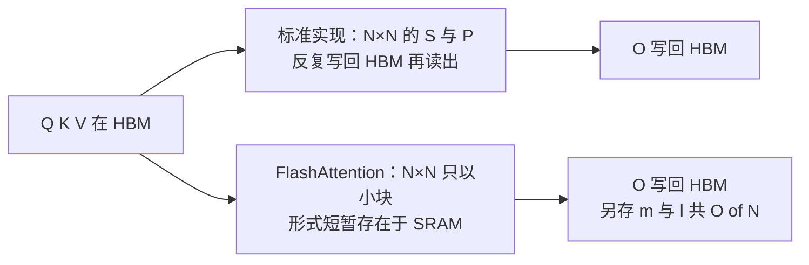
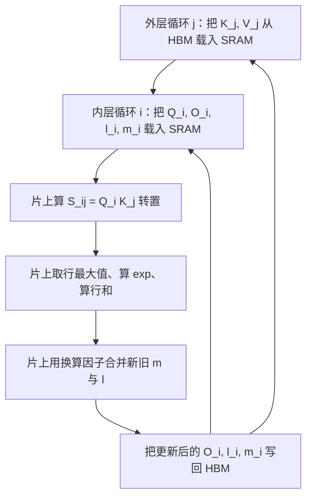
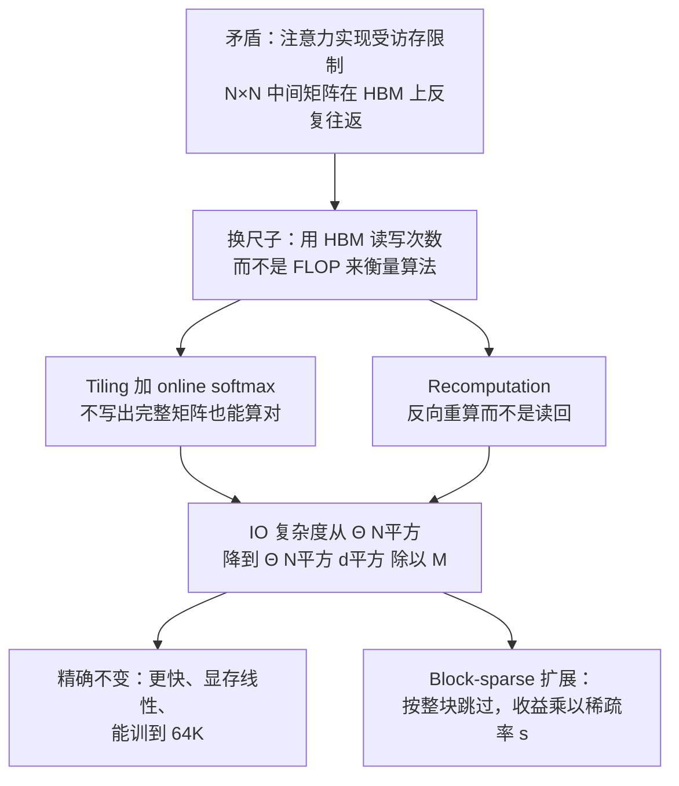

# FlashAttention：一行数学都没改，只改了数据在显存和缓存之间怎么走

<!-- release-date: 2022-05-20 -->

> 本文依据 **FlashAttention: Fast and Memory-Efficient Exact Attention with IO-Awareness**（Tri Dao、Daniel Y. Fu、Stefano Ermon、Atri Rudra、Christopher Ré），即 arXiv:2205.14135v2，PDF 封面日期 2022 年 6 月 24 日，共 34 页（正文 10 页、参考文献 6 页、附录 A–E 共 18 页）。**页码均指 PDF 本身的页码**，不是论文小节号。全文严格区分三层：**论文明确写了什么**（带页码）、**我们如何理解它**（标注「本文的理解」「本文推算」）、**外部资料补充**（给链接并标明是补充）。

## 先看一组反常的数字

论文第 6 页有一张很小的表，是全文最值得先看的东西。同一个任务（GPT-2 medium，序列长 1024，头维 64，16 个头，batch 64，A100），标准注意力实现和 FlashAttention 的对比是：

| 指标 | 标准注意力 | FlashAttention |
|---|---:|---:|
| 计算量 GFLOPs | 66.6 | **75.2** |
| HBM 读写量（GB） | 40.3 | **4.4** |
| 前向 + 反向耗时（ms） | 41.7 | **7.3** |

（PDF p.6，Figure 2 左）

请注意第一行：FlashAttention 的**浮点运算量更多**，多了大约 13%。它没有跳过任何一次乘加，反而额外多算了一遍东西。可是它快了 5.7 倍。

唯一变小的是中间那一行：搬运的数据从 40.3 GB 掉到 4.4 GB，少了大约 9 倍。

这张表就是整篇论文的论点：**在这个场景里，决定快慢的不是算了多少次，而是搬了多少字节。** 一旦承认这件事，你会得到一个不改任何数学定义、却快好几倍的注意力实现。

## 读之前只要三个词

这篇论文假定读者熟悉 GPU 编程。如果不熟，先记住三个词就够了，后面会逐个展开。

- **Kernel（核函数）**：一次派发到 GPU 上执行的程序。它从显存把数据读进来，算完，再把结果写回显存。论文原话是「Each kernel loads inputs from HBM to registers and SRAM, computes, then writes outputs to HBM」（PDF p.3）。
- **HBM（High Bandwidth Memory，高带宽显存）**：就是大家平时说的「显卡有多少 G 显存」的那个 G。容量大、相对慢。
- **SRAM（Static Random-Access Memory，片上静态缓存）**：贴在计算单元旁边的一小块超快缓存。容量小得可怜，快得离谱。

论文里的 **IO** 指的就是 HBM 和 SRAM 之间的读写，不是硬盘读写。

## 第一层矛盾：瓶颈不在算力，在搬运

### GPU 的存储层级差多少

论文第 3 页给了 A100 的具体参数，第 2 页的 Figure 1 左边画成了一个金字塔：

| 层级 | 带宽 | 容量 |
|---|---|---|
| GPU SRAM（片上） | 约 19 TB/s | 20 MB |
| GPU HBM（显存） | 1.5 TB/s | 40 GB |
| CPU DRAM（主存） | 12.8 GB/s | 大于 1 TB |

（PDF p.2，Figure 1 左）

正文的说法更细一点：A100 有 40–80 GB 的 HBM，带宽 1.5–2.0 TB/s；每个流多处理器（Streaming Multiprocessor，SM）有 192 KB 片上 SRAM，全卡共 108 个 SM，SRAM 带宽估计在 19 TB/s 左右（PDF p.3）。

这里有一个容易卡住的地方：正文说「192 KB 每 SM」，图里却写「20 MB」。**本文的换算**：$192\ \text{KB}\times 108 \approx 20.7\ \text{MB}$，图上写的是全卡加起来的总量，正文写的是单个 SM 能用的量。真正约束算法的是后者——一个 kernel 里的一个线程块只能用它自己那块 SRAM，不能把全卡的 20 MB 当成一整片。

论文自己把这个层级关系概括成一句话：「The on-chip SRAM is an order of magnitude faster than HBM but many orders of magnitude smaller in size」（PDF p.3）。快一个数量级，小好几个数量级。

### 算术强度：判断一个操作到底卡在哪

论文用 **arithmetic intensity**（算术强度）这个指标来分类，定义是「每访问一字节内存，做了多少次算术运算」（PDF p.3）。按它把操作分成两类：

1. **Compute-bound（受算力限制）**：耗时由运算次数决定，访存时间小得多。典型例子是内维很大的矩阵乘、通道数很多的卷积。
2. **Memory-bound（受访存限制）**：耗时由访存次数决定，计算时间小得多。典型例子是逐元素操作（激活、dropout）和规约操作（求和、softmax、各种 norm）。

（PDF p.3）

请注意第二类里出现了 **softmax**。注意力的核心恰恰是一个巨大的 softmax。

而且论文在开头就点明了一个趋势：「compute speed has out-paced memory speed」——算力增长比访存带宽增长快，所以 Transformer 里大多数操作**越来越**被访存卡住（PDF p.2、p.3）。这不是一个会自己变好的问题，硬件迭代反而在放大它。

### 标准注意力实现到底在搬什么

先把定义写清楚。给定 $\mathbf{Q},\mathbf{K},\mathbf{V}\in\mathbb{R}^{N\times d}$，其中 $N$ 是序列长度，$d$ 是头维，要算的输出是 $\mathbf{O}\in\mathbb{R}^{N\times d}$：

$$
\mathbf{S}=\mathbf{Q}\mathbf{K}^\top\in\mathbb{R}^{N\times N},\qquad \mathbf{P}=\operatorname{softmax}(\mathbf{S})\in\mathbb{R}^{N\times N},\qquad \mathbf{O}=\mathbf{P}\mathbf{V}\in\mathbb{R}^{N\times d}
$$

softmax 是逐行做的。符号说明：$\mathbf{S}$ 是原始注意力分数矩阵，$\mathbf{P}$ 是归一化后的注意力权重矩阵，两者都是 $N\times N$ 的方阵（PDF p.4）。

关键在于 $N$ 和 $d$ 的量级差距。论文举的例子是 GPT-2：$N=1024$，$d=64$（PDF p.4）。输入 $\mathbf{Q},\mathbf{K},\mathbf{V}$ 各自只有 $N\times d$ 那么大，而中间的 $\mathbf{S}$ 和 $\mathbf{P}$ 是 $N\times N$。在这个例子里，中间矩阵比输入大 16 倍；序列拉到 8192 时，就大 128 倍。

论文把标准实现写成了 Algorithm 0，只有四步（PDF p.4）：

1. 从 HBM 分块读入 $\mathbf{Q},\mathbf{K}$，算出 $\mathbf{S}=\mathbf{Q}\mathbf{K}^\top$，**把 $\mathbf{S}$ 写回 HBM**；
2. 从 HBM 读回 $\mathbf{S}$，算 $\mathbf{P}=\operatorname{softmax}(\mathbf{S})$，**把 $\mathbf{P}$ 写回 HBM**；
3. 从 HBM 分块读入 $\mathbf{P}$ 和 $\mathbf{V}$，算 $\mathbf{O}=\mathbf{P}\mathbf{V}$，把 $\mathbf{O}$ 写回 HBM；
4. 返回 $\mathbf{O}$。

数一数就明白了：那个 $N\times N$ 的大矩阵被完整地写回显存两次、读出来两次。而它本来只是一个中间产物，最终结果 $\mathbf{O}$ 只有 $N\times d$。

论文还提到，实际实现里通常还有别的逐元素操作作用在这个大矩阵上——比如作用在 $\mathbf{S}$ 上的 mask、作用在 $\mathbf{P}$ 上的 dropout——每一个都要再把大矩阵读一遍写一遍，把问题进一步放大（PDF p.4）。

把两种实现放在一起看，差别只有一件事：那个 $N\times N$ 的矩阵到底落在哪一层存储上。

这张图是**机制示意**，依据 PDF p.4 的 Algorithm 0 与 p.5 的 Algorithm 1 重画，不代表实测时间。两条路径算出的 $\mathbf{O}$ 在数学上完全相同——变的只是中间产物停留在哪里。

第 2 页 Figure 1 右边把这件事画成了一根柱子：PyTorch 实现的 GPT-2 注意力大约 15 ms，从下往上分成 Matmul、Mask、Softmax、Dropout、Matmul 五段；FlashAttention 那根柱子是一个矮得多的融合 kernel。论文说这里的加速比是 **7.6×**（PDF p.2，Figure 1 右）。

### 为什么「算子融合」不够

减少访存最常规的手段叫 **kernel fusion**（算子融合）：如果多个操作作用在同一份输入上，就只从 HBM 读一次，而不是每个操作各读一次。编译器已经能自动融合很多逐元素操作（PDF p.3）。

但论文紧接着写了一句限制，这句话是整个方案的起点：

> 在模型训练的语境下，中间值**仍然**需要写回 HBM，以便反向传播使用，这削弱了朴素算子融合的效果。（PDF p.3–4，本文转述）

也就是说：推理时你可以把整条链融成一个 kernel，中间量算完就扔。但训练时反向传播要用 $\mathbf{S}$ 和 $\mathbf{P}$ 求梯度，所以就算前向融合了，还是得把 $N\times N$ 的东西存下来。融合解决不了训练。

于是论文把要攻克的技术难点写成了两条（PDF p.2）：

1. **在看不到完整输入的情况下完成 softmax 规约**——因为一次装不进 SRAM；
2. **不为反向传播保存那个巨大的中间注意力矩阵**。

这两条分别对应下面两个技巧：tiling 和 recomputation。论文特别强调它们都是「well-established techniques」，不是新发明（PDF p.2）。这篇论文的新意不在于发明了新算子，而在于**换了一把尺子去衡量注意力算法好不好**。

## 换一把尺子：IO 感知

论文的核心主张只有一句：过去的高效注意力方法都在优化 FLOP，而 FLOP 和墙钟时间不一定相关。

原话是：「One main reason is that they focus on FLOP reduction (which may not correlate with wall-clock speed) and tend to ignore overheads from memory access (IO)」（PDF p.2）。

论文给的诊断很直接：很多近似注意力方法把复杂度降到了线性或接近线性，却**没有在真实机器上跑得更快**，因此也没有被广泛采用（PDF p.2）。这在第 8 页的 LRA 表里能看到实证：Linformer 的理论复杂度是线性的，实测加速比 2.5×，只比精确的 FlashAttention 的 2.4× 高一点点，而精度掉了 4.4 个点（59.3 → 54.9）。

**IO-aware**（IO 感知）就是把「读写了多少字节」当成和 FLOP 同等重要的一等指标去分析和优化。论文明确说这个思路在计算机科学里历史悠久：数据库 join、图像处理、数值线性代数都早就这么做了，它只是把这条经验搬进深度学习（PDF p.2；附录 A 进一步串起了 I/O 复杂度、working set 模型、data locality、Roofline 模型这条线索，PDF p.17）。

论文也顺带指出了一个现实障碍：PyTorch、TensorFlow 这类常见的 Python 接口，**不允许对访存做细粒度控制**（PDF p.2）。所以这套东西最后必须落到手写 CUDA——这一点在限制那一节会变成代价，后面会讲。

## 技巧一：tiling —— 不写出完整矩阵，也能算对 softmax

### 为什么 softmax 不能直接切块

矩阵乘法天然可以分块：算 $\mathbf{O}$ 的第 $i$ 行只需要 $\mathbf{P}$ 的第 $i$ 行和整个 $\mathbf{V}$，块与块之间可以独立算完再相加。

softmax 不行。论文的说法是「Softmax couples columns of $\mathbf{K}$」（PDF p.4）——softmax 把 $\mathbf{K}$ 的各列耦合在一起了。

具体卡在哪：softmax 的分母是**整行**的求和。

$$
\operatorname{softmax}(x)_i=\frac{e^{x_i}}{\sum_j e^{x_j}}
$$

你要算第一个块的最终权重，就得知道这一行**所有**块的指数和。可你还没算到后面的块。看起来必须先把整行凑齐。

### 先解决数值稳定：为什么要减最大值

在写递推之前，先看论文实际使用的、带数值稳定处理的 softmax 定义（PDF p.4）。对向量 $x\in\mathbb{R}^B$：

$$
m(x):=\max_i x_i,\qquad f(x):=\left[e^{x_1-m(x)}\ \ \cdots\ \ e^{x_B-m(x)}\right],\qquad \ell(x):=\sum_i f(x)_i,\qquad \operatorname{softmax}(x):=\frac{f(x)}{\ell(x)}
$$

符号解释：
- $m(x)$ 是这一段里的最大值；
- $f(x)$ 是每个元素减掉最大值之后再取指数，所以每一项都落在 $(0,1]$；
- $\ell(x)$ 是这些指数的和，也就是 softmax 的分母。

为什么要减 $m(x)$？因为 $e^{x}$ 在 $x$ 稍大时就会溢出。FP16 能表示的最大值大约是 65504，$e^{12}$ 就已经超过 16 万了。减掉最大值之后，最大的那一项恰好等于 $e^0=1$，其余都更小，永远不会溢出。分子分母同时乘以 $e^{-m(x)}$，softmax 的值不变。

这一步不是 FlashAttention 的发明，是 softmax 的标准写法。但它会让下面的递推多出一个修正因子，先讲清楚可以少绕一圈。

### 递推：把两段拼起来

现在把一行拆成前后两段 $x^{(1)},x^{(2)}\in\mathbb{R}^B$，拼起来是 $x=\left[x^{(1)}\ x^{(2)}\right]\in\mathbb{R}^{2B}$。论文给出的合并规则是（PDF p.5）：

$$
m(x)=\max\!\left(m(x^{(1)}),\,m(x^{(2)})\right)
$$

$$
\ell(x)=e^{m(x^{(1)})-m(x)}\,\ell(x^{(1)})+e^{m(x^{(2)})-m(x)}\,\ell(x^{(2)})
$$

第一行没什么可说的：两段的最大值取更大的那个，就是全段的最大值。

第二行是关键。$\ell(x^{(1)})$ 是**用旧的最大值 $m(x^{(1)})$ 为基准**算出来的指数和；现在基准换成了更大的 $m(x)$，所以要把它换算到新基准上，乘以 $e^{m(x^{(1)})-m(x)}$。因为新基准更大，这个指数是负的，因子小于等于 1，相当于把旧账按新汇率折算。

**本文的理解**：把它想成记账换单位。前半段你按「元」记了一笔总额，后半段发现数字太大得改按「万元」记。要把两笔加起来，得先把前半段的总额除以 10000。$e^{m_{\text{old}}-m_{\text{new}}}$ 就是那个换算率。论文脚注把这类做法叫 **algebraic aggregation**（代数聚合），出处是数据库领域的 data cube 论文（PDF p.5，脚注 2）。

论文把结论概括成一句：「if we keep track of some extra statistics $(m(x), \ell(x))$, we can compute softmax one block at a time」（PDF p.5）。只要额外记住两个标量——**当前见过的最大值**和**当前累积的指数和**——就可以一块一块地做 softmax，最后结果和一次性做完全一致。

这就是为什么 FlashAttention 是**精确**的，不是近似。它不是丢掉了远处的注意力，也不是低秩逼近，它只是换了一个求和顺序。

### 算法主体：两层循环

有了递推，就可以写出完整算法了。论文的 Algorithm 1（PDF p.5）是这样组织的：

**块大小**先按 SRAM 容量定死：

$$
B_c=\left\lceil\frac{M}{4d}\right\rceil,\qquad B_r=\min\!\left(\left\lceil\frac{M}{4d}\right\rceil,\ d\right)
$$

其中 $M$ 是 SRAM 大小，$B_c$ 是 $\mathbf{K},\mathbf{V}$ 的分块行数，$B_r$ 是 $\mathbf{Q},\mathbf{O}$ 的分块行数。**本文的说明**：分母里的 4 来自「SRAM 里要同时放下大约四块东西」（$\mathbf{Q}_i,\mathbf{K}_j,\mathbf{V}_j,\mathbf{O}_i$），论文没有单独论证这个常数；附录 C 的证明只需要 $B_c=\Theta(M/d)$ 这个量级，常数 $1/4$ 是实现上的取值（PDF p.23–24）。$B_r$ 还要额外对 $d$ 取 min，是为了让 $B_r\times B_c$ 的分数块也装得下。

**初始化**：在 HBM 里开好 $\mathbf{O}=(0)_{N\times d}$、$\ell=(0)_N$、$m=(-\infty)_N$。$m$ 初始化成负无穷，这样第一次比较时任何真实分数都会赢。

**外层循环遍历 $\mathbf{K},\mathbf{V}$ 的块，内层循环遍历 $\mathbf{Q}$ 的块**：

这张图是**机制示意**，依据 PDF p.5 的 Algorithm 1 与 p.2 的 Figure 1 左图重画，箭头表示控制流，不表示实测时间。原图用红色箭头表示外层循环、蓝色箭头表示内层循环。

从头到尾，那个 $N\times N$ 的 $\mathbf{S}$ 和 $\mathbf{P}$ **从来没有在 HBM 里完整出现过**。只有 $B_r\times B_c$ 的小块在 SRAM 里短暂存在，用完即弃。

### 输出是怎么增量更新的

Algorithm 1 第 12 行是全篇最密的一行（PDF p.5）：

$$
\mathbf{O}_i\leftarrow\operatorname{diag}\!\left(\ell_i^{\text{new}}\right)^{-1}\left(\operatorname{diag}(\ell_i)\,e^{m_i-m_i^{\text{new}}}\,\mathbf{O}_i+e^{\tilde m_{ij}-m_i^{\text{new}}}\,\tilde{\mathbf{P}}_{ij}\mathbf{V}_j\right)
$$

上下标太多，拆成两步就清楚了。

**第一步，把旧结果还原成没归一化的样子。** 存在 HBM 里的 $\mathbf{O}_i$ 是已经除过 $\ell_i$ 的，现在乘回 $\operatorname{diag}(\ell_i)$，得到未归一化的累加和；再乘 $e^{m_i-m_i^{\text{new}}}$，把它换算到新的最大值基准上。

**第二步，把新块的贡献加进来，再统一除以新分母。** $\tilde{\mathbf{P}}_{ij}\mathbf{V}_j$ 是当前块的未归一化贡献，$e^{\tilde m_{ij}-m_i^{\text{new}}}$ 同样是换算因子；两项相加之后，整体除以新的 $\ell_i^{\text{new}}$。

其中 $\tilde m_{ij}$ 是当前小块的行最大值，$m_i^{\text{new}}=\max(m_i,\tilde m_{ij})$ 是更新后的全局行最大值。$\operatorname{diag}(\cdot)$ 表示把向量摊成对角矩阵，作用是让每一行用自己的标量做缩放。

论文在附录 C 用对 $j$ 的数学归纳法证明了这个更新的正确性：每次外层循环结束后，HBM 里的 $m^{(j)},\ell^{(j)},\mathbf{O}^{(j)}$ 都恰好等于「只考虑前 $jB_c$ 列时的行最大值、行指数和、注意力输出」；当 $j=T_c$ 时就得到 $\operatorname{softmax}(\mathbf{QK}^\top)\mathbf{V}$（PDF p.22–23）。

**Theorem 1** 把这件事写成了正式结论：Algorithm 1 返回 $\mathbf{O}=\operatorname{softmax}(\mathbf{QK}^\top)\mathbf{V}$，用 $O(N^2d)$ 次 FLOP，并且**除输入输出外只需要 $O(N)$ 的额外内存**（PDF p.5）。那个 $O(N)$ 就是 $\ell$ 和 $m$ 两个长度为 $N$ 的向量。

这是本文的第二个收益，容易被加速比盖过去：显存占用从随序列长度平方增长，变成线性增长。

## 技巧二：recomputation —— 反向时重算，反而更快

### 反向传播的老问题

反向传播要算 $\mathbf{Q},\mathbf{K},\mathbf{V}$ 的梯度，通常需要用到前向的 $\mathbf{S}$ 和 $\mathbf{P}$（PDF p.5）。标准做法就是前向存下来、反向读回来——这正是前面说的、让算子融合失效的原因。

FlashAttention 的做法是：**前向只存 $\mathbf{O}$ 和两个 softmax 统计量 $(m,\ell)$，反向时从 SRAM 里的 $\mathbf{Q},\mathbf{K},\mathbf{V}$ 块重新算出 $\mathbf{S}$ 和 $\mathbf{P}$**（PDF p.5）。

### 为什么重算反而更快

这是全篇最反直觉的一点，也是最值得记住的一点。

论文自己把它和 **gradient checkpointing**（梯度检查点）作了对比，原话大意是：梯度检查点一直被用来降低峰值显存，但据作者所知，**所有实现都是拿速度换内存**；而 FlashAttention 的重算即便多花了 FLOP，反向传播反而**变快**了，因为 HBM 访问变少了（PDF p.5）。

因果链是这样的：

1. 旧问题：反向要读 $N\times N$ 的 $\mathbf{S},\mathbf{P}$，这是 $\Theta(N^2)$ 次 HBM 访问；
2. 新设计：不存它们，只存 $O(N)$ 的统计量，反向时在片上重算；
3. 工作机制：重算所需的 $\mathbf{Q}_i,\mathbf{K}_j,\mathbf{V}_j$ 块**本来就要为了算梯度而载入 SRAM**，重算是在已有数据上多做几次矩阵乘，不产生新的 HBM 流量；
4. 收益：多出来的 FLOP 是「便宜的」，省掉的 HBM 访问是「贵的」，净收益为正；
5. 代价：FLOP 总量上升约 13%（66.6 → 75.2 GFLOPs，PDF p.6）。在 memory-bound 场景这笔交易划算；如果哪天注意力变成 compute-bound，这笔账要重算。

Figure 2 左的三行数字就是这条因果链的完整证据（PDF p.6）。

### 反向传播里的两个具体技巧

附录 B.4 列了两条实现层面的观察，都很实用（PDF p.20）：

**第一，不存 dropout mask。** dropout mask 和注意力矩阵一样大，是 $O(N^2)$。FlashAttention 前向时把**伪随机数生成器的状态**存下来（Algorithm 2 第 1 行，PDF p.20），反向时用同一个状态重新生成一模一样的 mask。$O(N^2)$ 变成 $O(1)$。

**第二，把一个长度 $N$ 的规约换成长度 $d$ 的点积。** softmax 的梯度需要一个中间量 $D_i=\mathbf{P}_{i:}^\top d\mathbf{P}_{i:}$，直接算要对两个长度为 $N$ 的向量做规约，而它们不一定装得进 SRAM。论文的式 (4) 给了一个恒等式（PDF p.19）：

$$
D_i=\mathbf{P}_{i:}^\top d\mathbf{P}_{i:}=\sum_j\frac{e^{q_i^\top k_j}}{L_i}\,do_i^\top v_j=do_i^\top\sum_j\frac{e^{q_i^\top k_j}}{L_i}v_j=do_i^\top o_i
$$

符号：$q_i,k_j,v_j$ 分别是 $\mathbf{Q},\mathbf{K},\mathbf{V}$ 的列向量，$L_i=\sum_j e^{q_i^\top k_j}$ 是 softmax 分母，$o_i$ 是输出的第 $i$ 列，$do_i$ 是它的梯度。

推导只用了一步：把与 $j$ 无关的 $do_i^\top$ 提到求和号外面，剩下的求和恰好就是式 (2) 定义的 $o_i$。于是一个长度 $N$ 的规约变成了两个长度 $d$ 的向量点积。$N=8192$、$d=64$ 时，这是 128 倍的差距。

**本文的评价**：这是一次纯代数化简，不需要任何硬件知识，却直接决定了这个 kernel 能不能写出来。值得记住的模式是——当一个中间量装不进快速缓存时，先看它能不能被代数地重写成一个更小的量，再去考虑分块。

附录 B.4 的 Algorithm 4 是完整的反向算法（PDF p.21），结构和前向对称：外层循环 $\mathbf{K},\mathbf{V}$ 块，内层循环 $\mathbf{Q},\mathbf{O},d\mathbf{O},d\mathbf{Q}$ 块。**Theorem 5** 给出反向的 IO 复杂度，和前向完全一样（PDF p.21）。

### 和 Rabe & Staats 的区别

附录 B.5 专门比较了同期一篇相关工作（Rabe & Staats，*Self-attention Does Not Need $O(n^2)$ Memory*），三条差异说得很清楚（PDF p.21）：

1. **目标不同**：对方优化的是**总显存占用**（峰值需要多少 GB），FlashAttention 优化的是**访存次数**（读写了多少次）。因为访存次数才是运行时间的主要决定因素，结果是 FlashAttention 比标准注意力快 2–4 倍，而 Rabe & Staats 的速度与标准注意力持平或略慢。两者在省显存上都有效。
2. **块间信息传递方式不同**：对方给每个块保留一份临时输出，最后统一合并，$K$ 个块就要 $K$ 份输出；FlashAttention 每处理完一个块就增量更新输出，只需要一份。
3. **反向实现不同**：对方用梯度检查点重算注意力矩阵**和**每块的临时输出；FlashAttention 解析地推导了反向公式，只重算注意力矩阵，不重算临时输出。

**本文的理解**：第一条是这篇论文最有教学价值的区分——「省内存」和「省访存」是两个不同的目标，前者不自动带来后者。论文顺带指出反过来是成立的：如果一个操作产生 $A$ 次访存，它的总内存需求最多也就是 $A$（PDF p.21）。省访存必然省内存，反之不然。

## IO 复杂度：这篇论文的理论骨架

前面都是工程。这一节是论文之所以能进 NeurIPS 主会的原因：它把「少搬数据」变成了一个可以证明的复杂度结论。

### 两个式子在说什么

**Theorem 2**（PDF p.6）：设 $N$ 是序列长度，$d$ 是头维，$M$ 是 SRAM 大小，且 $d\le M\le Nd$。那么

- 标准注意力（Algorithm 0）需要 $\Theta(Nd+N^2)$ 次 HBM 访问；
- FlashAttention（Algorithm 1）需要 $\Theta(N^2d^2M^{-1})$ 次 HBM 访问。

先读左边这个。$\Theta(Nd+N^2)$：$Nd$ 是读入 $\mathbf{Q},\mathbf{K},\mathbf{V}$ 和写出 $\mathbf{O}$ 的必要开销；$N^2$ 来自那个中间矩阵的两写两读。因为 $N\gg d$，$N^2$ 项占绝对主导。**这一项完全是浪费**——它搬运的是一个用完就扔的中间产物。

再读右边。$N^2d^2M^{-1}$ 里的 $M$ 在**分母**上：SRAM 越大，访存越少。这是全篇最重要的一个结构性事实——它说明这个算法的性能直接由片上缓存容量决定，换硬件会换来不同的加速比。

### 这个式子是怎么来的

论文给了一段简洁的推导（PDF p.6，完整证明在 p.23–24）：

1. 给定 SRAM 大小 $M$，每次可以载入大小为 $\Theta(M)$ 的 $\mathbf{K},\mathbf{V}$ 块，所以 $\mathbf{K},\mathbf{V}$ 的每个元素**只被载入一次**；
2. 对每一个 $\mathbf{K},\mathbf{V}$ 块，都要把整个 $\mathbf{Q}$ 和 $\mathbf{O}$ 过一遍，也就是做 $T_c$ 趟；
3. 块大小约束是 $B_cd=O(M)$、$B_rd=O(M)$、$B_rB_c=O(M)$，于是 $B_c=\Theta(M/d)$；
4. 趟数 $T_c=N/B_c=\Theta(Nd/M)$；
5. 每趟载入 $\Theta(Nd)$ 个元素，总访存量是

$$
\Theta(NdT_c)=\Theta\!\left(Nd\cdot\frac{Nd}{M}\right)=\Theta\!\left(\frac{N^2d^2}{M}\right)
$$

**本文的理解**：这个结构值得单独记一下。$\mathbf{K},\mathbf{V}$ 只读一次，$\mathbf{Q},\mathbf{O}$ 读 $T_c$ 次——所以循环顺序不是随便定的。把 $\mathbf{K},\mathbf{V}$ 放外层，是因为它们在内层被复用；如果反过来，被重复读的就换成了 $\mathbf{K},\mathbf{V}$，复杂度形式一样但常数和实现难度不同。（顺带说一句：后续代际对这个循环顺序做了改动，但那属于 FlashAttention-2 的内容，本站尚未解读，本文不展开。）

### 代入真实数字

论文说：$d$ 的典型值是 64–128，$M$ 大约 100 KB，所以 $d^2$ 比 $M$ 小很多倍，FlashAttention 的 HBM 访问量因此比标准实现少很多倍（PDF p.6）。

两个复杂度的比值大致是 $N^2 \big/ (N^2d^2/M)=M/d^2$。摘要和引言给出的实测上界是「**最多少 9 倍**」，依据是 Figure 2（PDF p.2）；Figure 2 左的实测值 $40.3/4.4=9.2$，对得上（PDF p.6）。

**这里要说清分母**：9× 是在「GPT-2 medium，$N=1024$，$d=64$，16 头，batch 64，A100」这一个配置下测的 HBM 读写量之比，不是普适常数。$d$ 变大、$M$ 变小，比值都会掉。

### 下界：这个结果已经到头了吗

**Proposition 3**（PDF p.6）：在 $d\le M\le Nd$ 的范围内，**不存在**一个算法能对**所有** $M$ 都做到 $o(N^2d^2M^{-1})$ 次 HBM 访问来计算精确注意力。

证明只有几行，很漂亮（PDF p.24）：假设存在这样的算法。取 $M=\Theta(Nd)$ 这个特例，代进去得到访存量是 $o(N^2d^2/(Nd))=o(Nd)$。但输入 $\mathbf{Q},\mathbf{K},\mathbf{V}$ 和输出 $\mathbf{O}$ 本身就有 $Nd$ 那么大，而且一开始就在 HBM 里——任何算出精确注意力的算法至少得把它们读一遍写一遍，也就是至少 $\Omega(Nd)$ 次访问。矛盾。

**这个结论意味着什么，要说准确。** 它说的是：**没有办法在整个 $M$ 区间上一致地打败 $N^2d^2/M$**。它**没有**说 FlashAttention 在每一个具体的 $M$ 上都是最优的。论文自己也承认了这个局限：这类「在 $M$ 的某个子区间上成立的下界」在流式算法文献里很常见，而「以 $M$ 为参数的参数化复杂度下界」被留作未来工作（PDF p.6）。摘要里那句「optimal for a range of SRAM sizes」——**对一段 SRAM 尺寸范围最优**——用词是准确的，不能读成「全局最优」。

### 块越大越好，但有拐点

Figure 2 中间那张图测的是块大小 $B_c$ 从 64 变到 512 时，HBM 访问量和前向耗时怎么变（PDF p.6）。

结论有两半：块越大，趟数越少，HBM 访问越少，耗时下降；但**超过 256 之后耗时不再下降**，因为瓶颈转移到了别的地方（比如算术运算本身）。而且块再大就装不进 SRAM 了。

**本文的理解**：这张小图其实是整套理论的自我检验。如果耗时无限跟着 HBM 访问下降，说明模型太简单；它在某处触底，恰好说明「memory-bound」是一个**有边界的**判断，不是一句口号。优化到一定程度，操作会从 memory-bound 变成 compute-bound，这时该换别的手段了。

## Block-sparse FlashAttention：论文里唯一的近似

到这里为止，所有东西都是精确的。§3.3 是论文里唯一引入近似的部分，也是理解它和后来稀疏注意力工作关系的关键（PDF p.6–7）。

### 它要求什么

给定输入和一个 mask 矩阵 $\tilde{\mathbf{M}}\in\{0,1\}^{N\times N}$，要计算

$$
\mathbf{S}=\mathbf{Q}\mathbf{K}^\top,\qquad \mathbf{P}=\operatorname{softmax}\!\left(\mathbf{S}\odot\mathbb{1}_{\tilde{\mathbf{M}}}\right),\qquad \mathbf{O}=\mathbf{P}\mathbf{V}
$$

其中 $(\mathbf{S}\odot\mathbb{1}_{\tilde{\mathbf{M}}})_{kl}$ 在 $\tilde M_{kl}=1$ 时等于 $S_{kl}$，在 $\tilde M_{kl}=0$ 时等于 $-\infty$（取 $-\infty$ 是为了让 softmax 之后权重恰好为 0）。

接着是这一节最重要的一句话，论文用的是「**We require**」：

> 我们**要求** $\tilde{\mathbf{M}}$ 具有块形式：存在块大小 $B_r,B_c$，使得对所有 $k,l$，$\tilde M_{k,l}=M_{ij}$，其中 $i=\lfloor k/B_r\rfloor$，$j=\lfloor l/B_c\rfloor$，$\mathbf{M}\in\{0,1\}^{N/B_r\times N/B_c}$。（PDF p.6，本文转述）

翻译成人话：**稀疏模式必须以整块为单位。** 你可以决定「第 3 个 query 块不看第 7 个 key 块」，但不能决定「第 400 个 token 单独跳过第 913 个 token」。

有了这个要求，算法本身几乎不用改：Algorithm 5 和前向算法完全相同，只是在内层循环加一个 `if M_ij ≠ 0 then`，为 0 的块直接跳过（PDF p.7、p.25）。

### 收益有多大

**Proposition 4**（PDF p.7）：block-sparse FlashAttention 需要

$$
\Theta\!\left(Nd+\frac{N^2d^2}{M}s\right)
$$

次 HBM 访问，其中 $s$ 是块稀疏 mask 中**非零块**的比例。

也就是说，稀疏比例直接乘在那个大项上。论文举例：长序列时 $s$ 常取 $N^{-1/2}$ 或 $N^{-1}\log N$，对应的 IO 复杂度就是 $\Theta(N\sqrt{N})$ 或 $\Theta(N\log N)$（PDF p.7）。

下游实验用的是固定的 **butterfly**（蝶形）稀疏模式，理由是butterfly 矩阵及其乘积已被证明能表达任意结构化稀疏（PDF p.7；附录 A 补充了这条线索，PDF p.17）。附录 A 还给了一个有意思的说法：block-sparse FlashAttention 可以看成注意力语境下的一张「固定彩票」——稀疏模式在训练全程写死，结果在 LRA 上几乎和稠密版一样好（PDF p.17）。

Figure 2 右验证了这条比例关系：非零块比例从 20% 涨到 60%，耗时线性上升（序列长 4K，PDF p.6）。

### 边界在哪

必须说清楚：**block-sparse FlashAttention 是近似方法，FlashAttention 本体不是。** 前者会改变模型定义，后者不会。

论文自己的实验也显示了这个代价。LRA 上 block-sparse 版平均 59.6，稠密版 59.8，标准 Transformer 59.3——基本持平（PDF p.8，Table 3）。但在 Path-X 上，稠密 FlashAttention 拿到 61.4，block-sparse 只有 56.0（PDF p.9，Table 6）。它换来的是能跑到 64K，从而在 Path-256 上拿到 63.1，而稠密版根本跑不到那个长度。

**这是一个典型的取舍，不是免费加速。**

## 实验：加速比一定要写清分母

论文报了很多个加速比，数字从 1.3× 到 9× 都有。它们的对照物和场景完全不同，混着用会得出错误印象。下面这张表是**本文按论文各处口径整理的**，每一行都注明了分母。

| 加速比 | 测的是什么 | 对照实现 | 配置 | 页码 |
|---|---|---|---|---|
| **15%** | BERT-large 端到端训练时间 | Nvidia MLPerf 1.1 记录 | 序列 512，8×A100，10 次平均 | p.7，Table 1 |
| **3.0–3.5×** | GPT-2 端到端训练时间 | HuggingFace | 序列 1K，8×A100 | p.8，Table 2 |
| **1.7–1.8×** | GPT-2 端到端训练时间 | Megatron-LM | 序列 1K，8×A100 | p.8，Table 2 |
| **2.4×** | LRA 端到端训练时间 | 标准注意力 | 序列 1K–4K，5 个任务几何平均 | p.8，Table 3；p.27 |
| **2.8×** | LRA 端到端（block-sparse） | 标准注意力 | 同上 | p.8，Table 3 |
| **7.6×** | 注意力这一层的耗时 | PyTorch 注意力 | GPT-2，含 dropout 与 mask 的融合 kernel | p.2，Figure 1 右 |
| **5.7×** | 注意力层前向+反向耗时 | 标准注意力 | GPT-2 medium，$N$=1024，$d$=64，16 头，batch 64，A100 | p.6，Figure 2 左（41.7→7.3 ms） |
| **9.2×** | HBM 读写量之比 | 标准注意力 | 同上（40.3→4.4 GB） | p.6，Figure 2 左 |
| **最多 3×** | 注意力层前向+反向耗时 | PyTorch 注意力 | 序列 128–2K，batch 16，8 头，$d$=64，单张 A100 40GB，带 dropout 与 padding mask | p.10；p.30–31 |
| **2–4×** | 注意力层耗时 | PyTorch 注意力 | A100，batch 8，$d$=64，12 头 | p.28，Figure 5 |
| **最多 3×** | 注意力层耗时 | PyTorch 注意力 | A100，**$d$=128**，batch 16，12 头，**因果 mask** | p.29，Figure 6 |
| **2.5–4.5×** | 注意力层耗时 | PyTorch 注意力 | RTX 3090，batch 12，12 头 | p.29，Figure 7 |
| **最多 20×** | 显存占用之比 | 精确注意力基线 | 单张 A100 40GB | p.10，Figure 3 右 |
| **2×** | 显存占用之比 | Linformer | 序列 64K | p.10，Figure 3 右 |

几条必须点出来的事：

**第一，端到端和注意力层差好几倍。** 注意力层快 3–7 倍，端到端只快 1.7–3.5 倍。原因很朴素：注意力只是模型的一部分，MLP、embedding、优化器步都没变快。Amdahl 定律在这里完全生效。BERT-large 那个 15% 尤其要注意——序列只有 512，注意力占比小，所以整体收益有限。

**第二，同一张 A100 上，不同形状的加速比可以差一半。** §4.3 的基准测试（batch 16，8 头）给出「最多 3×」，附录 Figure 5（batch 8，12 头）给出 2–4×。同一个算法、同一块卡，只是 batch 和头数不同。（**本文观察**，两组数字分别来自 PDF p.10、p.30–31 与 p.28。）

**第三，头维 $d$ 变大，收益会掉。** 论文解释得很直接：$d$ 变大后每块占用更多 SRAM，只能用更小的块，趟数变多（PDF p.29）。这正是 $\Theta(N^2d^2M^{-1})$ 里 $d$ 是**平方**的实际后果。$d=128$ 时如果没有因果 mask，Figure 6 显示在 2048 长度上加速比甚至掉到接近 1×（**本文从图上读数**，论文正文没有给数值，PDF p.29）。

**第四，SRAM 更小的卡收益更少。** T4 的 SRAM 比 A100 小，块只能开得更小，加速比明显下降。论文明说这「与 §3.2 的 IO 复杂度分析一致」（PDF p.29）——这是理论被硬件差异反向验证的一个例子，比单纯堆数字有价值。

**第五，一处需要提醒读者的排版问题。** **本文比对了 Figure 7（RTX 3090）与 Figure 8 下半张（T4，仅前向）**，两图的柱高、图例、坐标完全一致（PDF p.29、p.30）。这看起来像是排版时复用了同一张图片，论文正文没有说明。另外 Figure 7 的图标题写的是「GTX 3090」，正文写的是「RTX 3090」（PDF p.29）。引用 T4 的 forward-only 数字时应该谨慎。

### 和 Apex FMHA 的对比：一个很诚实的表

附录 E.4 是全篇最诚实的一节（PDF p.27–28）。作者说明：项目起步时 Apex FMHA 是他们所知最快的注意力实现，MLPerf 1.1 上几乎所有 BERT 提交都在用它；FlashAttention 就是**以 FMHA 的代码为起点**做的（致谢里也写了，PDF p.10）。

Table 7 的对比（A100-SXM4-40GB，batch 64，16 头，$d$=64，带 mask 和 dropout，单位 ms）：

| 方法 | 128 | 256 | 512 |
|---|---:|---:|---:|
| Apex FMHA 前向 | 0.10 | 0.29 | 1.14 |
| FlashAttention 前向 | **0.08** | **0.22** | **0.81** |
| Apex FMHA 反向 | **0.17** | **0.52** | **1.81** |
| FlashAttention 反向 | 0.20 | 0.53 | 2.00 |
| Apex FMHA 前+反 | **0.27** | 0.81 | 2.95 |
| FlashAttention 前+反 | 0.28 | **0.75** | **2.81** |

（PDF p.28，Table 7）

结论：FlashAttention 前向略快，**反向略慢**——因为它前向不存注意力矩阵，反向要重算。总体上，序列 128 时慢约 4%，256 时快 8%，512 时快 5%（PDF p.28）。

**这几乎是打平。** 论文没有掩饰这一点，而是解释了真正的差异在别处：FMHA 只支持头维 64、只能在 A100 上跑、序列不能超过 512，而且前向要把注意力矩阵写回 HBM，所以基本不省显存；FlashAttention 支持头维 16/32/64/128、当时所有 Turing 和 Ampere 架构的卡、序列可以到 64K（PDF p.28）。

**本文的理解**：这一节告诉我们，「7.6×」那个数字的对照物是**没有融合的 PyTorch 实现**。跟一个已经手工融合过的高质量 kernel 比，FlashAttention 在短序列上的速度优势几乎不存在。它的真正贡献是把这种性能**扩展到了长序列和更多配置**，同时省下显存。评估任何 kernel 优化时，选谁当基线决定了你能得到什么结论。

## 长上下文换来的模型质量

论文的第二类主张不是「更快」，而是「因为更快更省，所以能训更长的上下文，因此模型更好」。

### 同样的时间，更长的上下文

Table 4 是这个论点最干净的证据（PDF p.8）：

| 实现 | 上下文长度 | OpenWebText 困惑度 | 训练时间 |
|---|---:|---:|---|
| GPT-2 small · Megatron-LM | 1k | 18.2 | 4.7 天（1.0×） |
| GPT-2 small · FlashAttention | 1k | 18.2 | 2.7 天（1.7×） |
| GPT-2 small · FlashAttention | 2k | 17.6 | 3.0 天（1.6×） |
| GPT-2 small · FlashAttention | 4k | **17.5** | 3.6 天（1.3×） |

读法：把上下文从 1k 拉到 4k，FlashAttention 仍然比 Megatron 的 1k 快 **30%**，同时困惑度好了 **0.7**（18.2 → 17.5）。（PDF p.8）

**这才是这篇论文对建模的真正贡献。** 不是「同样的模型跑得快」，而是「同样的预算能买到更长的上下文，长上下文本身值 0.7 困惑度」。

一个需要注意的细节：Table 2 里 GPT-2 medium 三种实现的困惑度是 HuggingFace 14.2、Megatron 14.3、FlashAttention 14.3（PDF p.8）。论文正文说「achieves the same perplexity as the other two implementations, as we do not change the model definition」（PDF p.8）。**本文的理解**：Theorem 1 保证的是**数学上**精确，不保证**浮点上**逐位一致——求和顺序变了，最后一位就可能不同。Figure 4 的验证困惑度曲线几乎完全重合（PDF p.27），可以支持「数值稳定性与基线相当」，但不能读成「逐位相同」。

### 长文档分类

在 MIMIC-III（ICU 出院小结）和 ECtHR（欧洲人权法院案件）两个数据集上，用预训练的 RoBERTa，把位置编码重复延展后训更长序列（PDF p.9）。数据本身很长：MIMIC 平均 2395 token、最长 14562；ECtHR 平均 2197、最长 49392（PDF p.9）。

| 序列长度 | 512 | 1024 | 2048 | 4096 | 8192 | 16384 |
|---|---:|---:|---:|---:|---:|---:|
| MIMIC-III | 52.8 | 50.7 | 51.7 | 54.6 | 56.4 | **57.1** |
| ECtHR | 72.2 | 74.3 | 77.1 | 78.6 | **80.7** | 79.2 |

（PDF p.9，Table 5，指标是 micro $F_1$）

摘要里那个「6.4 points of lift」是怎么来的？MIMIC 从 512 到 16384 提升 4.3 分，ECtHR 从 512 到 8192 提升 8.5 分，**两者的平均正好是 6.4**（**本文推算**，数据来自 PDF p.9）。

必须诚实地指出：**这两条曲线都不单调。** MIMIC 从 512 到 1024 反而**掉了** 2.1 分；ECtHR 在 8192 达到峰值，16384 时又掉回 79.2。论文自己也说，两个数据集的差异可能来自「细微的分布偏移」，MIMIC 是专业医学文本，可能对文档长度的分布变化更敏感（PDF p.9）。

正确的说法是「**更长的上下文在这两个任务上有明显收益，但不是越长越好**」，不是「长度和性能正相关」。

### Path-X 与 Path-256

这是论文最有戏剧性的结果。Path-X 和 Path-256 是 LRA 里专门测长程依赖的任务：判断一张 128×128（或 256×256）黑白图里两个点之间有没有通路，图像**逐像素**喂给 Transformer，所以序列长度分别是 16K 和 64K（PDF p.9）。

在此之前，所有 Transformer 要么显存爆掉，要么只能达到随机水平（PDF p.9）。

| 模型 | Path-X | Path-256 |
|---|---:|---:|
| Transformer / Linformer / Linear Attention / Performer / Local Attention / Reformer / SMYRF | ✗ | ✗ |
| FlashAttention | **61.4** | ✗ |
| Block-sparse FlashAttention | 56.0 | **63.1** |

（PDF p.9，Table 6）

这是第一个在 Path-X 上超过随机水平的 Transformer，而且**仅仅靠把序列长度提到 16K 就做到了**——没有改架构（PDF p.9）。block-sparse 版进一步做到 64K，成为作者所知第一个在 Path-256 上超过随机的序列模型。

三个必须补上的边界：

1. **随机水平是 50%**（二分类）。61.4% 是「超过随机」，不是「解决了这个任务」。论文用词一直是 "better-than-chance" / "non-random"，很克制。
2. **训练流程不简单**：先在 Path-64 上预训练 200 epoch，取 checkpoint，把位置编码在空间上按网格复制上采样，再在下游任务上微调 200 epoch。Path-X 还要**再多微调 200 epoch**，论文注明这额外的一轮「给 FlashAttention 的 Path-X 大约加了 4 个点，但之后模型开始过拟合」（PDF p.27）。也就是说 61.4 里有大约 4 个点来自这一轮额外微调。
3. **Path-256 比 Path-X 分数更高不代表更难**：论文脚注解释，Path-256 序列更长但路径相对更短，所以更容易拿高分（PDF p.9，脚注 4）。不要把 63.1 > 61.4 读成「更长的序列效果更好」。

### 注意力层的基准测试

§4.3 和附录 E.6 用单张 A100 40GB，8 个头、头维 64、batch 16，扫描序列长度做了完整对比（PDF p.9–10、p.30）。附录里有 14 张表（Table 8–21），覆盖 dropout / masking 的四种组合（PDF p.31–34）。

结论有三条（PDF p.10）：

1. FlashAttention 的耗时仍然**随序列长度平方增长**（它没有改复杂度），但比精确注意力基线快很多，最多比 PyTorch 快 3×；
2. 很多近似/稀疏方法的耗时随长度**线性**增长，所以必然会在某处反超。论文给出的交叉点是**序列长度 512 到 1024 之间**（PDF p.10，Figure 3 左也标出了 "Crossover Points"）；
3. block-sparse FlashAttention 比作者所知的所有精确、稀疏、近似实现都快，在所有测过的长度上。

显存方面（Figure 3 右，PDF p.10）：FlashAttention 和 block-sparse 版显存占用相同，**随序列长度线性增长**；比精确注意力基线最多省 20×；除 Linformer 外所有算法在 64K 之前就在 A100 上 OOM，而 FlashAttention 在 64K 时仍比 Linformer 省 2×。

Table 21 给了具体数字（MB）：序列 65536 时 FlashAttention 用 13376 MB，Linformer 用 26252 MB；PyTorch 在 4096 时已经要 17024 MB，8192 就跑不动了（PDF p.34）。

**那个「交叉点在 512–1024」值得单独记住。** 它意味着：在 2022 年常见的 1K 上下文场景里，精确注意力 + 好 kernel 打得过大部分近似方法；近似方法的理论优势要到更长的序列才兑现。这解释了为什么这篇论文之后，「先把精确注意力的 kernel 写好」成了业界默认动作，而不是继续堆近似方案。

## 论文自己承认的限制

§5 只有三段，但每一段都很重要（PDF p.10）。

**第一，必须写 CUDA。** 原话是：每一种新的注意力实现都要写一个新的 CUDA kernel；这要求用比 PyTorch 低级得多的语言写算法，需要大量工程投入；而且实现**未必能跨 GPU 架构迁移**。论文希望未来能有一种方法，让人用高级语言（比如 PyTorch）写注意力算法，再编译成 IO 感知的 CUDA 实现——类似图像处理领域的 Halide（PDF p.10）。

**本文的评价**：这一段是全文对后来影响最大的一句「未解决问题」。它直接预告了 Triton、TileLang 这类 kernel DSL 的价值主张。而在论文自己的时间点上，这是一个实打实的门槛：论文提出的算法很优雅，但复现它需要 CUDA 能力。

**第二，IO 感知应该扩展到注意力之外。** 注意力是 Transformer 里最吃访存的计算，但**每一层**都要碰 HBM（PDF p.10）。附录 D.2 举了两个方向：稀疏 MLP 层（很多稀疏 MLP 反而是 memory-bound 的，加速比常常和稀疏度不成正比），以及核方法（$N\times N$ 的核矩阵同样是两个 $d\ll N$ 向量的函数，KeOps 库已经证明了减少读写能加速核运算）（PDF p.25–26）。

**第三，多卡 IO 分析是空白。** 论文说得很明确：他们的实现「在单张 GPU 上、在常数因子意义下是最优的」，但注意力计算可以跨多卡并行；用多张卡会给 IO 分析**加一层**——除了 SRAM 和 HBM，还有其他 GPU 的 HBM（PDF p.10、p.25–26）。论文只把这条列为未来工作，**没有给任何多卡结果**。

**读者需要留下的判断**：这篇论文的所有实验都是单卡注意力层或单节点 8 卡训练。它没有回答长序列跨卡切分时怎么做 IO 优化。这个空白在后来的上下文并行工作里才被填上。

### 还有哪些没写

除了论文自己列的三条，**本文按报告地图核对后**，还应该提醒读者注意这些缺口：

- **没有推理/解码场景的实验。** 全文所有实验都是训练（前向+反向）或注意力层的前向+反向基准。唯一一处 forward-only 的数据是 T4 那张图（PDF p.30），而且如前所述那张图存在复用嫌疑。自回归解码时每步只有一个 query，算术强度和这里完全不同，本文不能替论文外推。
- **没有 KV Cache 相关内容。** 这篇论文的时间点早于 KV Cache 成为主要瓶颈的时期，全文没有讨论。
- **没有多头之外的注意力变体。** MQA、GQA 都还没出现在这篇论文里。
- **没有精度消融。** 实验用 FP16（BERT 用 Apex AMP O2，GPT-2 用 PyTorch AMP），但没有对比不同精度下的数值行为，只有 Figure 4 的困惑度曲线作为间接证据（PDF p.26–27）。
- **没有 tensor core 利用率、MFU 之类的硬件效率指标。** 论文只报墙钟时间和 HBM GB 数。
- **块大小常数 4 没有论证。** 如前所述，$B_c=\lceil M/(4d)\rceil$ 里的 4 只是取值，论文没解释。

## 和已发布的 [NSA](/reports/DeepSeek/NSA) 篇接上：三处交叉核实

本站刚发布的 NSA 解读把 FlashAttention 当作效率对照基线，也在批评已有稀疏方法时反复用到 FlashAttention 的访存前提。读完原文后，逐条核实如下。

### 一、「精确注意力，靠访存优化而非近似」——准确

NSA 篇的记述完全对得上原文，而且**说得还偏保守**。

证据链：论文标题里就有 "Exact Attention"（PDF p.1）；Theorem 1 明确写出算法返回 $\mathbf{O}=\operatorname{softmax}(\mathbf{Q}\mathbf{K}^\top)\mathbf{V}$（PDF p.5）；正文说「we do not change the model definition」（PDF p.8）；机制上确实是把 $\mathbf{K},\mathbf{V}$ 分块搬进 SRAM、在片上完成计算、只把 $N\times d$ 的输出写回 HBM（PDF p.5，Algorithm 1）。

「偏保守」在于：FlashAttention 不只是「不做近似」，它实际上**多做了计算**去换少搬数据——75.2 vs 66.6 GFLOPs（PDF p.6）。这比「不近似」更强，方向也相反于大多数效率工作。

需要补一句边界：**同一篇论文里的 block-sparse FlashAttention 是近似方法**（PDF p.6–7），它会改变模型定义。NSA 篇讨论的对象是 FlashAttention 本体，表述没有问题，但读者应该知道这个区分。

**结论：准确，无需修正。**

### 二、「硬性前提：内存访问必须是连续的、按块的」——方向对，但原文不是这样表述的

这一条需要展开说，因为它是三条里唯一存在措辞落差的。

**FlashAttention 原文里没有任何一句话说「内存访问必须是连续的」。** 逐页核对后，与这个说法相关的只有三处，分量各不相同：

**第一处，块大小约束，来自 SRAM 容量而非连续性。** 附录 C 的推导是 $B_cd=O(M)$、$B_rd=O(M)$、$B_rB_c=O(M)$（PDF p.23）。这三个条件说的是「块要装得进 SRAM」，是**容量**约束。它决定了块能开多大，没有对访存的连续性提任何要求。

**第二处，也是最接近 NSA 说法的一处：block-sparse 扩展对 mask 的形式要求。** 论文用「We require」明确写道，mask 必须具有块形式（PDF p.6，原文见上文 §Block-sparse 一节）。这是**硬性要求**，但它约束的是**稀疏模式**，不是内存访问；而且它只出现在 block-sparse 扩展里，不是 FlashAttention 本体的前提。

**第三处，Proposition 4 的复杂度形式。** $\Theta(Nd+N^2d^2M^{-1}s)$ 里的 $s$ 是**非零块**的比例（PDF p.7）。这一条是真正有力的证据——它在数学上解释了为什么按 token 选择拿不到收益。

**本文的推算**（论文没有写这一步）：如果你按单个 token 而不是按块做稀疏选择，被选中的 token 会散落在各个块里。只要一个 $B_r\times B_c$ 块里存在**任意一个**被选中的位置，这个块就不是零块，就必须整块载入。选得越散，非零块比例 $s$ 越接近 1，Proposition 4 里的加速因子就越接近消失——**计算上你确实跳过了很多位置，访存上你一个块都没省下**。

所以：

- NSA 篇的**实质论断是对的**，而且能从 Proposition 4 直接推出来；
- 但把它记成「FlashAttention 有一个**硬性前提**：内存访问必须是连续的、按块的」，**是把原文的两条较弱陈述（block-sparse 的 mask 块形式要求 + SRAM 容量约束）加上硬件常识合成出来的更强表述**；
- 论文自己写在 Limitations 里的硬性门槛是**完全另一件事**：必须为每种新注意力手写 CUDA kernel，且未必跨架构可迁移（PDF p.10）。

更准确的说法应该是：**FlashAttention 的收益建立在「以整块为单位跳过计算」之上——这是 Proposition 4 的直接推论；论文对 block-sparse 扩展明确要求 mask 具有块形式，但从未把「内存访问必须连续」写成 FlashAttention 本身的前提条件。**

**结论：NSA 篇的技术判断成立，但「硬性前提」这个措辞比原文强。** 本文不建议改动 NSA 篇——它是在自己的论证语境里做工程概括，且结论正确；本文在这里把原文的确切位置与分量交代清楚，供两篇对照阅读。是否调整措辞由主维护者决定。

### 三、「Triton 版 NSA 内核对 Triton 版 FlashAttention-2」——本篇原文用的是手写 CUDA

**FlashAttention（第一代）的官方实现是手写 CUDA，全文没有出现过 Triton。**

论文的原话：「We implement FlashAttention in CUDA to achieve fine-grained control over memory access and fuse all the attention operations into one GPU kernel」（PDF p.2）；「Tiling enables us to implement our algorithm in one CUDA kernel」（PDF p.4）；限制一节把「必须写 CUDA」列为首要门槛（PDF p.10）；致谢说明实现以 NVIDIA Apex 的 FMHA 代码为起点（PDF p.10）。

所以 NSA 篇说的「Triton 版 FlashAttention-2」指的是**后续代际的一个 Triton 重实现**，既不是本篇，也不是本篇的官方实现。两者之间没有矛盾——NSA 篇的记述是关于它自己的实验设置，是准确的。

而且 NSA 选择「同后端对比」的理由，恰恰能被本篇佐证：本篇论文正是因为用了手写 CUDA 才拿到那些数字，如果拿 Triton 内核去和手写 CUDA 比，编译器差异会和算法差异混在一起。NSA 篇「跨后端比速度容易把编译器差异当成算法收益」的说法，与本篇 §5 承认的「实现未必跨架构可迁移」是同一类担忧。

至于**本篇自己的性能口径**：全部是墙钟时间和 HBM 读写字节数，没有 FLOPs/s、没有 MFU、没有跨后端对比。端到端加速比对照 HuggingFace / Megatron-LM / Nvidia MLPerf 1.1 提交；注意力层加速比对照 PyTorch 注意力实现和 Apex FMHA。完整分母见上文那张表。

**结论：准确，无需修正。** 补充一条给读者：把两篇串起来读时要记住，FA-1 是 CUDA，NSA 的对照基线是 FA-2 的 Triton 版，中间隔了一个代际和一次重实现。本站尚未解读 FlashAttention-2 与 FlashAttention-3，本文不描述它们的具体设计。

## 这篇论文把自己放在什么位置

附录 A 的 Related Work 值得单独读一段，因为它交代了作者的自我定位（PDF p.17）。

**它不认为 IO 感知是新概念。** 论文明说「优化快慢存储读写的广义概念在计算机科学里历史悠久，而且有很多名字」，并把自己最直接地挂在 Aggarwal 与 Vitter 的 I/O 复杂度分析传统上；同时点名了 working set 模型、data locality、Roofline 的算术强度模型、可扩展性分析和标准的计算机体系结构教材。它的原话是希望这项工作能鼓励社区把这些想法用到深度学习栈的更多地方（PDF p.17）。

**它把 block-sparse 挂在结构化矩阵这条线上。** butterfly 稀疏模式之所以被选中，是因为 butterfly 矩阵及其乘积已被证明能以接近最优的运行时和参数量表达任意结构化矩阵。论文同时指出结构化矩阵长期存在的困境：理论上高效，却难以转化成墙钟加速，因为稠密无约束矩阵乘的实现被优化得太好了——这个现象叫 **hardware lottery**（硬件彩票）（PDF p.17）。

**本文的理解**：这段自述其实是整篇论文的价值观声明。作者认为「理论上更省」和「实际上更快」之间的鸿沟才是真问题，而这个鸿沟的成因是硬件与实现，不是数学。FlashAttention 是这个价值观的正面例子——它一点数学都没省，全部收益来自把实现对准硬件；block-sparse FlashAttention 则是它的推论——把稀疏做成硬件喜欢的形状，稀疏才真的能兑现。

关于高效 Transformer 的既有工作，论文的分类是：哈希类稀疏近似（Reformer、Smyrf）、低秩近似（Performer）、两者结合（Longformer、BigBird、Scatterbrain、Long-short transformer、Combiner）、沿序列维压缩、以及跨段复用状态（Transformer-XL、Compressive Transformer）；另有一条完全替换注意力的路线（HiPPO/S4、LambdaNetworks、AFT、FLASH）（PDF p.17）。**FlashAttention 不在这些框里的任何一格**——它不改变注意力算什么，只改变怎么算。这是它能被几乎所有模型无痛采用的根本原因。

## 可迁移启发

### 1. 先量一量，再决定优化什么

这篇论文最值钱的动作不是 tiling，是**先去数有多少字节在动**。Figure 2 左那三行数字（FLOPs、HBM GB、ms）应该成为任何性能工作的标准第一步。

判据很简单：算一下算术强度——运算次数除以访存字节数——再和硬件的临界比值对比。高于临界值是 compute-bound，该优化计算；低于是 memory-bound，优化计算等于白干（PDF p.3）。

**这条对非 GPU 场景同样成立。** 数据管线、后端服务、数据库查询，都有各自版本的「算得快但搬得慢」。

### 2. 「省内存」和「省访存」是两个目标

论文在附录 B.5 把这个区分讲得最清楚：Rabe & Staats 优化峰值显存，速度和标准注意力持平；FlashAttention 优化访存次数，快 2–4 倍（PDF p.21）。

而且方向是单向的：**省访存必然省内存，省内存不必然省访存。** 挑优化目标时，先问清楚你到底想要哪一个。

### 3. 重算不总是拿速度换内存

梯度检查点的默认心智模型是「省显存，牺牲速度」。FlashAttention 展示了一个反例：当重算的输入**已经在快速缓存里**、而被替代的读取来自慢速存储时，重算是**双赢**的（PDF p.5）。

判断标准是：重算引入的额外访存是多少？如果是零（数据本来就在手边），那这笔交易只有好处。这条可以直接迁移到任何「缓存 vs 重算」的决策上。

### 4. 装不下的时候，先看能不能代数地缩小它

$D_i=\mathbf{P}_{i:}^\top d\mathbf{P}_{i:}=do_i^\top o_i$（PDF p.19，式 4）这一步没有用到任何硬件知识，只是把一个求和号挪了个位置，却把长度 $N$ 的规约变成了长度 $d$ 的点积。

遇到「这个中间量太大装不下」时，**先花十分钟找恒等式，再花三天写分块**。

### 5. 稀疏的单位必须和硬件的搬运单位对齐

Proposition 4 里那个 $s$ 是**非零块**的比例，不是非零元素的比例（PDF p.7）。这一条决定了后来一整代稀疏注意力工作的形态：想要真实加速，选择粒度就得是块。

**更一般的原则**：任何「跳过一部分工作」的优化，收益上限由**跳过的单位**和**硬件的最小搬运单位**是否对齐决定。数据库跳过整个 page 才省 IO，跳过 page 里的几行不省。

### 6. 优化会把瓶颈推走，而不是消灭它

Figure 2 中间那张图显示块大小超过 256 后耗时不再下降（PDF p.6）；§4.3 显示近似方法在 512–1024 处反超（PDF p.10）；Figure 6 显示 $d=128$ 时收益大幅缩水（PDF p.29）。

三处都在说同一件事：**每个优化都有它的适用区间。** 报告性能结论时把区间写出来，比报一个最大值有用得多。

### 7. 基线选择决定结论

7.6× 的对照是未融合的 PyTorch；对照已经手工融合的 Apex FMHA 时，短序列上基本打平甚至略慢（PDF p.28）。论文没有藏这个表，反而用它把真正的贡献说清楚了——不是「更快」，是「把这种性能扩展到了更长序列和更多配置，还省显存」。

**写自己的性能报告时，把最强的那个基线也放进表里。**

## 用一张图串起全文

这张图是**论证结构示意**，依据 PDF p.2–7 的 §1 至 §3 重画，箭头表示推理依赖而非数据流，图中不含实测数据。要注意最下面两个出口的性质不同：左边那条仍是精确注意力，右边那条（block-sparse）是近似方法。

## 关键词回看

- **IO-aware（IO 感知）**：把 HBM 与 SRAM 之间的读写次数当成一等指标去分析和优化算法，而不是只看 FLOP。
- **HBM**：显卡上容量大、相对慢的显存。A100 上 40–80 GB、1.5–2.0 TB/s。
- **SRAM**：贴在计算单元旁的片上缓存。A100 上每个 SM 192 KB、全卡约 20 MB、约 19 TB/s。
- **Arithmetic intensity（算术强度）**：每访问一字节内存做多少次运算。用来判断一个操作是 compute-bound 还是 memory-bound。
- **Memory-bound（受访存限制）**：耗时由访存次数决定。softmax、dropout、各种 norm 都属于这一类。
- **Kernel fusion（算子融合）**：把多个作用于同一输入的操作合成一个 kernel，只读一次。训练时因为要保存反向所需的中间量而效果受限。
- **Tiling（分块）**：把 $\mathbf{Q},\mathbf{K},\mathbf{V}$ 切成能装进 SRAM 的小块，配合 online softmax 的递推，在不写出完整 $N\times N$ 矩阵的前提下算出精确结果。
- **Online softmax**：只额外记住「当前最大值 $m$」和「当前指数和 $\ell$」两个统计量，就能一块一块地完成 softmax 规约。
- **Recomputation（重算）**：反向传播时不读存好的注意力矩阵，而是从 SRAM 里的输入块重新算一遍。多花 FLOP，少搬数据，净收益为正。
- **IO 复杂度**：标准注意力 $\Theta(Nd+N^2)$，FlashAttention $\Theta(N^2d^2M^{-1})$，block-sparse 版 $\Theta(Nd+N^2d^2M^{-1}s)$。
- **Block-sparse mask（块稀疏掩码）**：稀疏模式必须以 $B_r\times B_c$ 的整块为单位。这是 block-sparse 扩展的明确要求。
- **Path-X / Path-256**：LRA 里逐像素喂图、序列长 16K / 64K 的长程依赖任务，此前所有 Transformer 都只能达到随机水平。

## 最后的判断

哪些结论有实验支持：

- 注意力实现是 memory-bound 的（Figure 2 左：FLOP 更多但快 5.7 倍，PDF p.6）；
- tiling + recomputation 能在不改数学定义的前提下大幅减少 HBM 访问（40.3 → 4.4 GB，PDF p.6）；
- 显存占用从平方降到线性（Figure 3 右、Table 21，PDF p.10、p.34）；
- 端到端训练确实变快，且加速比明显小于注意力层（PDF p.7–8）；
- 更长上下文带来的质量提升是真的，且非单调（Table 4、Table 5，PDF p.8–9）；
- Path-X / Path-256 的突破是真的，但含约 4 点来自额外微调（PDF p.9、p.27）。

哪些是有证明但要读准范围：

- Theorem 2 的两个复杂度是渐进结论，常数被隐去；实测比值 9.2× 只对应一个具体配置（PDF p.6）；
- Proposition 3 的下界说的是「不存在算法在整个 $M$ 区间上一致更优」，不是「FlashAttention 处处最优」；论文自己把参数化下界列为未来工作（PDF p.6）。

哪些只是作者的观察或方向性判断：

- 「IO 感知可以推广到注意力之外的每一层」是希望，附录 D.2 只给了设想，没有实验（PDF p.10、p.25–26）；
- 「多卡 IO 分析」完全没有结果（PDF p.10）；
- 「需要一个 Halide 式的高级语言」是提出的需求，不是本文的贡献（PDF p.10）。

哪些细节没有公开或本文无法核实：

- 块大小公式里常数 4 的来源；
- 推理/解码场景下的表现；
- 精度（FP16 vs FP32）的独立消融；
- Figure 7 与 Figure 8 下半张为何完全一致（**本文观察**，PDF p.29–30）。

如果只带走一句话：

> **当一个操作卡在搬运而不是计算上时，正确的优化方向不是让它少算，而是让它少搬——哪怕为此要多算一点。**

这句话不需要 GPU 才能用。它只需要你先去量一量，数据到底在哪里、动了多少次。

## 资料与阅读边界

- **原始依据**：本地 `papers/Stanford/FlashAttention.pdf`，即 arXiv:2205.14135v2，34 页，PDF 封面日期 2022-06-24。本文所有页码指 PDF 页码。
- **arXiv 官方页**：[arXiv:2205.14135](https://arxiv.org/abs/2205.14135)。版本历史只有两版：v1 于 2022-05-27 提交，v2 于 2022-06-23 提交。**本地 PDF 就是最新的 v2，无需替换。**
- **NeurIPS 2022 官方页**：[Advances in Neural Information Processing Systems 35, pp. 16344–16359](https://proceedings.neurips.cc/paper_files/paper/2022/hash/67d57c32e20fd0a7a302cb81d36e40d5-Abstract-Conference.html)。这是正式发表版本的出处，本文未逐页比对会议版与 arXiv v2 的差异。
- **官方代码仓库**：[Dao-AILab/flash-attention](https://github.com/Dao-AILab/flash-attention)。论文脚注给出的地址是 `HazyResearch/flash-attention`（PDF p.3，脚注 1），该地址现已重定向到 Dao-AILab 组织下，提交历史相同。
- **`release-date` 依据**：取 **2022-05-20**，即官方仓库根提交（commit `1fcbe6f`，提交信息 "First release"，作者 Tri Dao）的文件提交时间。该提交无父提交，一次性加入 33 个文件、10800 行，包含 `csrc/stream_attn/` 下完整的 CUDA 内核实现。这早于 arXiv v1（2022-05-27）七天，是能查到的最早官方公开事件。仓库 `created_at` 为 2022-05-19，按流程规定不作为首发日采信。
- **署名与归属**：论文由斯坦福大学计算机系（Tri Dao、Daniel Y. Fu、Stefano Ermon、Christopher Ré）与纽约州立大学布法罗分校计算机系（Atri Rudra）联合完成（PDF p.1），工作出自 Christopher Ré 的 Hazy Research 组。按本站流程，同一系列放在同一目录，故置于 `Stanford/`。
- **实现起点**：论文致谢说明实现以 [NVIDIA Apex 的 FMHA 代码](https://github.com/NVIDIA/apex/tree/master/apex/contrib/csrc/fmha)为起点（PDF p.10）。
- **后续代际**：`papers/Stanford/` 下另有 FlashAttention-2 与 FlashAttention-3 的原件，**本站尚未解读**。本文只在必要处指出「后续代际存在」，不描述它们的任何具体设计——那需要读完各自原文才能写。
- **跨篇对照**：本文第「和已发布的 NSA 篇接上」一节涉及 [NSA](/reports/DeepSeek/NSA) 的三处记述。本文只核实并说明 FlashAttention 原文的确切表述，不修改 NSA 篇。
