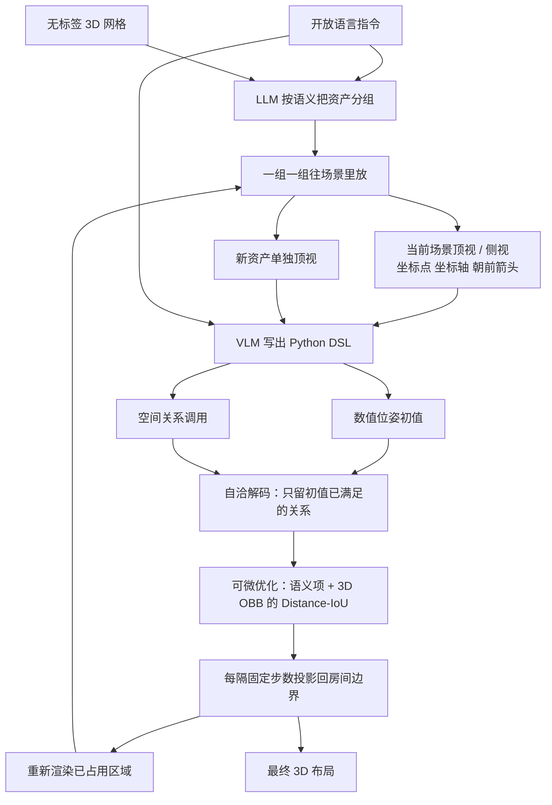

# LayoutVLM：无标签资产加一句话，怎么摆成既不穿模又像那么回事

<!-- release-date: 2024-12-03 -->

> 本文依据斯坦福大学主导、Google Research 合作的 **LayoutVLM: Differentiable Optimization of 3D Layout via Vision-Language Models**，即 arXiv:2412.02193v3（2025-03-11 修订，19 页），CVPR 2025 正式录用（会议录 29469–29478）。动笔前核过 arXiv 官方提交历史：v1（2024-12-03 06:15:04 UTC）、v2（2025-03-09 07:05:27 UTC）、v3（2025-03-11 05:58:39 UTC）。本地件封面水印为 `arXiv:2412.02193v3 [cs.CV] 11 Mar 2025`，19 页，与官方最新版一致，**未做替换**。CVPR 2025 Open Access 相机就绪只有 10 页；本文数字一律回这份 19 页 PDF 页码，不混用会议录页码。CVPR 虚拟会议页把它标成 Poster（[cvpr.thecvf.com/virtual/2025/poster/33962](https://cvpr.thecvf.com/virtual/2025/poster/33962)），未见 highlight / oral。
>
> 全文页码指 PDF 自身页码。标题页是第 1 页。项目页 [https://ai.stanford.edu/~sunfanyun/layoutvlm/](https://ai.stanford.edu/~sunfanyun/layoutvlm/) 印在封面。
>
> `release-date` 取 **2024-12-03**。LayoutVLM 是方法论文，没有向公众开放的模型、API 或官方权重。按「技术首次官方公开日」：arXiv v1 是目前能核到的最早官方公开事件。项目页已写在封面和 arXiv Comments 里，页面本身不提供首次公开日，无法证明早于 arXiv。官方代码仓 [sunfanyunn/LayoutVLM](https://github.com/sunfanyunn/LayoutVLM)：2024-11-12 的 Initial commit 只有一行标题 `# LayoutVLM`；2024-11-20 的 README 写「Code Usage / To be released」；真正公开代码的提交是 2025-06-17 的 `code release v0`（`a18c78d`），晚于论文首发。Hugging Face Papers 页的 Published on Dec 3, 2024 只是 arXiv 日期，**不用仓库 `createdAt`**。
>
> 单位：共同一作 Fan-Yun Sun、Weiyu Liu，以及 Siyi Gu、Dylan Lim、Manling Li、Nick Haber、Jiajun Wu 挂 Stanford University；Goutam Bhat、Federico Tombari 挂 Google Research。目录按高校主导放在 `Stanford`，Google Research 的合作写在正文，不另建公司目录。
>
> 文中始终区分三件事：**报告写了什么**、**本文如何解释**、**哪些是外部补充**。凡是从图里读出来的、从 GitHub 提交史或 CVPR 虚拟会议页补进来的，都会当场说明。
>
> 边界说明：同方向已发布的 CAST 是「一张 RGB 里的多件东西如何各自长全、再摆齐、还能站住」，资产是生成出来的。LayoutVLM 的输入已经是一堆 **3D 网格**，要做的是按开放语言把它们摆进房间。FirePlace、Holodeck、Global-Local-Tree-Search 同属「按语言摆 3D 物件」这条线，对照只到方法粒度：**不要把那几篇自己的主表数字读成本报告的实验**。LayoutVLM 文中自己报的对照数字可以引，必须带页码。

## 先把矛盾摊开，再上名词

给一堆 **没有类别标签** 的 3D 资产，再给一句开放语言指令，例如「通透、好客的空间；用书柜围出一个中央阅读区」。任务是把这些东西摆进房间，既要物理上站得住，又要语义上像那么回事（PDF p. 1，Figure 1）。

这不是「再训一个室内家具分类器」。资产来自开放宇宙：书店、花店、自助餐厅、机房都可能出现，类别表事先写不全。报告把这件事叫做 **开放宇宙布局生成（open-universe layout generation）**：多样布局来自无标签 3D 资产和自由形式语言，而不是来自 3D-FRONT 那种闭集家具表上学到的摆放模式（PDF p. 2）。

旧方案卡在同一道裂缝的两边（PDF p. 1–2）：

**只吐数字位姿。** LayoutGPT 这类方法让大语言模型直接写出每个物体的坐标和朝向。语义常常对——椅子确实该围着桌子——但物理经常垮：书柜叠在一起、家具伸出墙外。Figure 1 左侧标的就是 overlapping bookshelves 和 out of boundary（PDF p. 1）。

**只吐空间关系，再丢给约束求解。** Holodeck 先预测资产之间的关系，再做约束优化 / 搜索。物理硬约束有了，语义却容易丢：中央阅读区没有围出来，约束本身也满足不了。Figure 1 中间标的是 no「central reading area」和 assets that fail to satisfy constraints（PDF p. 1）。报告后来说，物体一多、约束一硬，搜索就找不到可行解，也跟不上语言里那些细的语义（PDF p. 2）。

所以 LayoutVLM 要解决的不是「VLM 会不会看图」，而是：

> **语义常识在大模型里，物理可行性在优化器里。只走一边，另一边就会塌。**

它的主张是：让视觉语言模型从 **打了视觉标记的图** 里同时吐出两套会互相检查的表示——数值位姿初值，以及带可微目标的空间关系——再用可微优化把物理补上，同时用自洽解码决定哪些关系值得在优化时保住（PDF p. 1–2）。

## 读之前只需要这几个词

下面这些词正文都会用到。这一节是读前背景，不全是报告自己定义的。

**视觉语言模型（Vision-Language Model，VLM）。** 能看图并写代码或文字的模型。本篇推理主路径用现成的 GPT-4o；微调实验另用开源的 LLaVA-NeXT-Interleave（PDF p. 3、p. 6、p. 9）。它和只吃文字的大语言模型（LLM）的差别，就是这里真正用上了渲染图。

**开放宇宙布局（open-universe layout）。** 资产没有闭集类别标签，指令是开放语言，不限于「卧室里的床和床头柜」。输出不是一张渲染图，而是每个资产的位姿（PDF p. 3）。

**位姿 $p_i=(x_i,y_i,z_i,\theta_i)$。** 三维位置，加上绕竖直轴的一个转角。物体被假定已经直立，没有滚转和俯仰（PDF p. 3）。这不是完整的 6 自由度。

**轴对齐包围盒（axis-aligned bounding box）与有向包围盒（oriented bounding box，OBB）。** 预处理时，物体先转到正对 $+x$，再量它的轴对齐盒子尺寸 $b_i\in\mathbb{R}^3$（PDF p. 3）。优化防碰撞时用的是物体当前朝向下的 3D 有向包围盒（PDF p. 5）。盒子不是三角网格：两个凹形家具的盒子相交，网格未必真撞上；盒子没相交，网格的凸包外凸起仍可能擦到。报告没有写网格级碰撞。

**视觉标记。** 在渲染图上把坐标、坐标轴、朝向箭头、资产名字画出来，再送给 VLM。相关工作引用了 Set-of-Mark、任意视觉提示和 scaffolding coordinates（PDF p. 3，[26–28]）。本篇自己落地的是：场景里每隔 2 米一个坐标点、坐标轴可视化、每个物体的朝前箭头（PDF p. 5）；附录提示词还要求顶视图给全局坐标架、1 米网格、已标注资产和朝前箭头（PDF p. 14）。**2 米点距和 1 米网格这两处原文不一致**，后文按正文和 Figure 3 来写，并标明附录的差异。

**可微约束 / 可微目标。** 每条空间关系对应一个可以对位姿求导的标量。优化器沿着梯度推物体，而不是像 SAT / 搜索那样做「满足或不满足」的硬判定（PDF p. 2–4）。

**Distance-IoU。** 检测文献里把交并比和中心距离合在一起的盒子损失。本篇把它用在成对的 3D 有向包围盒上，作为防碰撞项，引用 Zheng et al. 2020 与 Zhou et al. 2019（PDF p. 5）。闭式公式正文没展开。

**Self-consistent decoding（自洽解码）。** 不是 Self-Consistency 那种「同格式多条推理路径投票」（Wang et al., ICLR 2023，PDF p. 5）。这里要求 **同一次预测里的两套表示互相一致**：只保留那些在数值初值上已经成立的空间关系（PDF p. 5）。引言里有时写成 self-consistency decoding，指的是同一件事。

**3D-FRONT 与 Objaverse。** 前者是带布局的合成室内场景，本篇用来抽出约 9000 间房的微调监督（PDF p. 5）。后者是开放 3D 资产库，测试用例的网格从这里取、经人工核过（PDF p. 7）。

## 一句话先说清

LayoutVLM 的主张只有一句：**VLM 看打了标记的图，同时写出数值位姿初值和一套可微空间关系；自洽解码只留下「初值已经满足」的关系；再把语义损失和 3D 有向包围盒上的 Distance-IoU 加在一起做可微优化。**

它不是「一个网络喷出整间房子」，也不是「LLM 写完坐标就结束」。按 Figure 3（PDF p. 4）和 §4：

- 先用 LLM 按语义把资产分组，一组一组往已有场景里放，每放完一组就重新渲染；
- VLM 为当前组写出 Python DSL：每个实例的 `position` / `rotation`，外加 `distance_constraint`、`point_towards` 这类求解器调用；
- 自洽解码丢掉和初值打架的关系；
- 投影梯度下降（正文）/ Adam（附录）联合优化所有物体；
- 这套表示还可以从现成场景数据自动抽出来，微调 GPT-4o 和 LLaVA。

规模上，附录写：40 个资产的场景在单卡上优化 1–5 分钟，约 5–10 次 GPT-4o 调用（一组一次），随 VLM 定义的优化问题而变（PDF p. 14）。**全文没有端到端墙钟、没有 API 单价。**

## 报告地图：19 页里各写了什么

先摊开篇幅。这份报告方法集中在第 4 节，主表在第 6 页，附录几乎全是提示词和约束公式。

| 报告章节 | PDF 页 | 讲了什么 | 密度 |
|---|---|---|---|
| 标题、摘要、Figure 1 | p. 1 | 物理 vs 语义的封面对照；两套表示一句话 | 高 |
| Table 1 + §1 | p. 2 | 五种空间关系；LayoutGPT / Holodeck 的裂缝 | 高 |
| Figure 2 + §2.2 + §3 + §4 起 | p. 3 | 卧室表示示例；问题形式化；VLM 出代码 | 高 |
| Figure 3 + §4.1 | p. 4 | 流水线图；数值初值与可微关系为何要绑 | 高 |
| §4.2–4.4 + 式 1–2 | p. 5 | 视觉提示、自洽解码、DIoU、3D-FRONT 微调 | 高 |
| Figure 4 + Table 2 | p. 6 | 五类房间定性；11 类房间主表 | 高 |
| Figure 5 + §5.1 | p. 7 | 同一套资产跟四句不同指令；评测协议 | 高 |
| Table 3–5 + Figure 6 + §5.2–5.4 起 | p. 8 | 人评秩、Kendall $\tau$、消融、自洽定性 | 高 |
| Table 6 + §5.5 + §6 | p. 9 | 微调对照；限制是 VLM 初值差 | 高 |
| 参考文献 | p. 10–11 | 引用条目 | — |
| 附录 A.1 | p. 12–13 | 分组提示全文 | 中 |
| 附录 A.2 公式 + 优化数字 + DSL 提示 | p. 13–15 | 五种损失；Adam / 400 步；VLM 写约束的提示 | 高 |
| 附录 A.3–A.4 + B.1 | p. 15–17 | 自洽实现简化；资产标注；测例生成提示 | 高 |
| 附录 B.2 + C + Figure 7 | p. 17–19 | GPT-4o 评分提示；更多定性图 | 中 |

读正文前先知道这几件事，后面才不会把「报告写了」和「我们以为它写了」混在一起：

- **没有官方权重，没有微调代码。** 2025-06-17 才公开推理侧代码，这是外部补充，不是 PDF 内容。
- **$\epsilon$、启发式阈值、LoRA 秩、学习率、训练步数，一个都没给。**
- **Distance-IoU 的闭式、PSA 的具体加权式，正文只给了叙述。**
- **正文写 projected gradient descent，附录写 Adam + 指数衰减 0.96、400 步、每 100 步投影回边界。** Figure 3 画的是 $t_1\rightarrow t_{200}$，那是机制示意，不是附录的 400。
- **正文坐标点距 2 米，附录提示词写 1-meter grid。** Figure 2、Figure 3 读到的刻度是 2 米一格。
- **主结果 11 类房间并不均匀。** 客厅上 LayoutVLM 的碰撞分数是四家里最差的一档，PSA 和 LayoutGPT 打平（PDF p. 6）。

阅读路线：先看矛盾和全景，再按「两套表示 → 视觉标记与分组 → 自洽解码 → 可微优化 → 微调」走完因果链，然后是主表、消融和缺口。**如果只有十五分钟，读「先把矛盾摊开」「两套表示」「自洽解码」「可微优化」和「实验」五节就够了。**

## 全景：分组看图 → 两套代码 → 过滤关系 → 一起推

按 Figure 3（PDF p. 4）和 §4、附录 A.1 重画。这张图只表示模块怎么连，时间轴是示意，不是实测。

报告把这条流水线收成四件事（PDF p. 2）：

1. **场景布局表示**：数值位姿估计 + 带匹配可微目标的空间关系。
2. **VLM + 自洽解码**：从打了视觉标记的场景图和资产图生成这套表示。
3. **可微优化**：相对 Holodeck 那种带搜索的约束满足。
4. **从现成场景抽出同一套表示做微调**。

VLM 吐出的不是自然语言，是代码。Figure 3 右侧能读到：`table_A[0].position = [4.0, 2.5, table_A.size[2] / 2]`，以及 `solver.distance_constraint(chair, table_A[0])`、`solver.point_towards(chair, table_A[0])`（PDF p. 4）。Figure 2 的卧室例子更完整：床放在 `(1.5, 3.1, 0.0)`，床头柜靠墙、离床 1–3 米、与床对齐，台灯 `on_top_of` 床头柜并 `point_towards` 床（PDF p. 3）。

优化问题写成（PDF p. 4）：

$$
\arg\min_{\{p_i\}_{i=1}^{N}}\bigl(\mathcal{L}_{\mathrm{semantic}}+\mathcal{L}_{\mathrm{physics}}\bigr),\quad\text{初值 }\{\hat p_i\}_{i=1}^{N}
$$

$\mathcal{L}_{\mathrm{semantic}}$ 来自解码后的空间关系，$\mathcal{L}_{\mathrm{physics}}$ 负责物理上说得通。初值差会把优化送进错误的谷——报告举的例子是：指令要求椅子在桌子同一侧，初值却把桌子摆成房间中线、椅子分列两侧（PDF p. 4）。关系项的任务，就是在往后修物理的时候，别把这类语义修丢。

## 问题定义：输入已经是网格，输出只是四个数

形式化在 §3（PDF p. 3）。给定：

- 一句自然语言的布局准则 $\ell_{\mathrm{layout}}$；
- 沿四个方位的四面墙 $\{w_1,\dots,w_4\}$；
- $N$ 个 3D 网格 $\{m_1,\dots,m_N\}$。

目标是一个忠实于那段文字的 3D 场景。沿用 Holodeck 和 Open-Universe Indoor Scene Generation 的设定：物体已经直立；现成 VLM（文中写 GPT-4o）负责认朝前的那一面，并给每个物体一句短描述 $s_i$。转到正对 $+x$ 之后，轴对齐盒子尺寸是 $b_i\in\mathbb{R}^3$。每个物体要交的答案是 $p_i=(x_i,y_i,z_i,\theta_i)$（PDF p. 3）。

附录 A.4 把「认朝前」写细了：GPT-4o 看物体在 $0^\circ$、$90^\circ$、$180^\circ$、$270^\circ$ 四个正交视角上的图，输出类别、Python 变量名、哪一张是正面、描述、材质，以及 `ON_CEILING` / `ON_WALL` / `ON_FLOOR` / `ON_OBJECT` 这类放置属性（PDF p. 15）。做法「类似 Holodeck」。**本文把它读成预处理，不是 LayoutVLM 的新贡献。** 开放宇宙成立的前提是：类别和朝向都是现成 VLM 标出来的，后面的布局器不再依赖闭集标签。

房间被简化成四面朝向方位的墙。不规则平面、多层、室外、需要滚转的物体，形式化里没有。限制节只点了「VLM 初值差会导致偶发失败」（PDF p. 9），没有把这些几何简化写成失败模式。

## 两套表示为什么要绑在一起

### 旧问题：数字准了会穿模，关系对了会丢语义

报告认为，理想表示必须同时「语义上够表达开放指令」和「物理上够精确」（PDF p. 4）。只预测数字，优化没有护栏，穿模和出界修不回来。只预测关系再交给硬约束求解，物体一多就无解，语言里那些「中央阅读区」「椅子在同一侧」也会被搜掉（PDF p. 2）。

### 新设计：初值负责起点，关系负责「修物理时不许跑偏」

表示包含两块（PDF p. 4）：

1. 数值位姿估计 $\{\hat p_i\}_{i=1}^{N}$，作为优化起点；
2. 带可微目标的空间关系，在优化过程中继续说话。

空间关系的目标有两句（PDF p. 4）：（a）接住输入语言的语义；（b）在为了物理可行性而改位姿时，把这些语义保住。例子是「摆一张餐桌」：VLM 初值里椅子可能已经和桌子重叠。可微关系要在推开重叠的同时，仍然维持「椅子应该靠近餐桌」这种吃饭场景的常识。

五种关系列在 Table 1（PDF p. 2），附录 A.2 给出公式（PDF p. 13–14）：

| 类型 | 记号 | 人话 |
|---|---|---|
| 位置 | $\mathcal{L}_{\mathrm{distance}}(p_i,p_j,d_{\min},d_{\max})$ | 两件东西的距离落在 $[d_{\min},d_{\max}]$ |
| 位置 | $\mathcal{L}_{\mathrm{on\_top\_of}}(p_i,p_j,b_i,b_j)$ | 一件叠在另一件上 |
| 旋转 | $\mathcal{L}_{\mathrm{align\_with}}(p_i,p_j,\phi)$ | 两件按指定夹角对齐 |
| 旋转 | $\mathcal{L}_{\mathrm{point\_towards}}(p_i,p_j,\phi)$ | 一件朝向另一件，可带偏角 |
| 混合 | $\mathcal{L}_{\mathrm{against\_wall}}(p_i,w_j,b_i)$ | 一件靠墙 $w_j$（位置 + 朝向） |

它们 **不依赖固定参考系**，不用经典的 in_front_of / left_of（PDF p. 2、p. 4）。朝向用相对位姿。VLM 可以为距离选定上下界这类可选参数（PDF p. 5）。

附录把朝向写成平面向量 $v_i=(\cos\theta_i,\sin\theta_i)$（PDF p. 13）。对齐是余弦距离：

$$
\mathcal{L}_{\mathrm{align\_with}}(p_i,p_j,\phi)=1-\frac{v_i\cdot v_j}{\|v_i\|\,\|v_j\|}
$$

朝向另一件：若 $v_i\cdot d_{ij}>0$ 则损失为 0，否则为 $1-\frac{v_i\cdot d_{ij}}{\|v_i\|\,\|d_{ij}\|}$；$d_{ij}$ 是从 $i$ 指向 $j$、再绕 $z$ 转 $\phi$ 度的方向（PDF p. 13，式 5）。靠墙是四角到墙段距离的 clamp 之和，再加上「背对墙法向」的余弦项（PDF p. 14，式 7）。叠放不是在 $z$ 上做软损失：水平用 $-\mathcal{L}_{\mathrm{DIoU}}$ 拉重叠，竖直直接把 $z_i$ 设到 $j$ 顶上（PDF p. 13，式 4）。

距离项正文说：越出指定区间，损失更高，上下界由 VLM 决定（PDF p. 5）。附录式 3 印刷成 $\mathrm{clamp}(\min(\|p_i-p_j\|-d_{\min},\,d_{\max}-\|pos_i-pos_j\|),0,1)$，按字面会在区间外被夹成 0、区间内为正，和「越出则更高」的叙述对不上。**本文按正文意图讲它要干什么，不把附录式 3 改写成没出现过的 hinge，也不假装公式已经自洽。** $pos$ 是 $xy$ 平面上的欧氏距离（PDF p. 13）。

### 工作机制

可以把它想成两张纸条同时交给优化器。第一张写「桌子大概在房间正中、椅子大概在 4 米、2.5 米附近」——这是起点。第二张写「椅子离桌子别太远、椅子要朝桌子、地毯要居中」。优化器推开穿模、拉回出界的时候，必须还听第二张的话。少了第一张，优化从随机或零位姿起步，容易走进「桌子把房间劈成两半」那种谷；少了第二张，修物理就会把语义修丢。

Figure 2 把两张纸条写在同一段 Python 里（PDF p. 3）。这不是装饰：VLM 被要求用同一套 DSL 同时交作业，后面的自洽解码才有东西可对。

### 收益、代价、边界

消融把两块拆开（PDF p. 8，Table 5）。去掉数值初值，PSA 从 $58.8\pm 3.4$ 掉到 $41.0\pm 1.7$，位置 / 旋转连贯性也明显下降。去掉空间约束，室内边界分数从 $94.9\pm 2.2$ 掉到 $14.1\pm 3.0$，PSA 掉到 $6.7\pm 1.6$。报告自己的读法：空间约束对物理有效性、尤其是防重叠更关键；好的数值初值对语义分数贡献更大（PDF p. 8–9）。

代价是关系集合被收成五种。开放指令里「沿对角线摆」「围成椭圆」「避开走廊」没有一等公民。附录还要求每个新资产至少写一条平面约束和一条朝向约束，并且不要给已有资产或墙再写约束（PDF p. 15）。这是提示词层面的硬规矩，不是从数据里学出来的。

五种关系也不覆盖完整网格接触。靠墙看的是盒子四角到墙段的平面距离；叠放直接改 $z$。真要「杯垫在桌面凹槽里」，这套目标写不细。

### 可迁移启发

当生成器既要常识、又要满足硬物理时，不要逼它一次吐出最终数字。让它吐一个可优化的初值，再吐一组在优化过程中仍然有意义的可微关系。关系要比「左 / 右 / 前」更相对，才不跟坐标系绑定。集合要小，小到 VLM 写得出、优化器推得动。

## 视觉标记：让 2D 模型能估米和朝向

### 旧问题：VLM 看的是普通渲染，米和朝前面对不准

布局要估尺度、估空位、估哪面朝前。普通俯视图对 VLM 来说只是一张室内照片。「两米」「正对 $+x$」没有锚。相关工作把多视角图和视觉标记从视觉推理挪到空间规划（PDF p. 3）。本篇点名：视觉线索能改善 VLM 的物体识别和空间推理（PDF p. 5，引 Set-of-Mark）。

另一道硬限制是上下文长度。资产一多，把所有网格描述和所有图塞进一次调用，放不下（PDF p. 5）。

### 新设计：坐标点 + 坐标轴 + 朝前箭头；资产先分组、再逐组放置

正文写两类视觉标注（PDF p. 5）：

- 三维空间里每隔 **2 米** 一个坐标点，帮 VLM 估尺寸和尺度；
- 坐标轴可视化，让空间参照一致。

另外给每个物体标朝前箭头，这是写 `align_with` / `point_towards` 的前提。VLM 的输入包括当前 3D 场景的渲染，以及每个资产自己的视图（PDF p. 5）。Figure 3 能读到：俯视图带 `(0.0)`、`(2.0)`、`(4.0)` 这类刻度，还有红色坐标轴；右侧是同一场景的另一视角（PDF p. 4）。Figure 2 卧室俯视图的刻度同样是 2 米一格（PDF p. 3）。

附录给 VLM 的任务提示把输入列成六项（PDF p. 14–15）：高层设计目标；已有资产；新资产的尺寸和朝向；带全局坐标架、网格、已标注资产和朝前箭头的顶视图，墙也带朝向箭头；带全局坐标架和网格的侧视图；每个新资产在空场景里、正对 $+x$ 的顶视图。这里写的是 **1-meter grid**，和正文 2 米点距冲突。**本文按 §4.2 和 Figure 3 的 2 米来写实现叙述，把附录 1 米记成提示词文本，不合并成一种没写过的网格。**

分组是为了上下文，不是为了美观。先用 LLM 根据所有 $s_i$ 把资产聚成语义组，再一组一组放；每放一组，重新渲染，让 VLM 看见哪些地方已经被占（PDF p. 5）。附录 A.1 的分组提示把「语义资产组」定义成功能、语义、几何上相关的集合：床 + 床头柜 + 灯是一组；沙发和几米外的电视柜也可以是一组，因为语义上电视在沙发对面（PDF p. 12）。提示要求先描述场景、再列关系、再分组、再按「该先放谁」排序，最后输出 JSON；例子里睡觉区先放，化妆区后放（PDF p. 12–13）。

坐标系在提示词里写死（PDF p. 14）：右手系，XY 是地板，Z 向上，原点在墙角；资产正面沿 $+x$，局部原点在 XY 中心、Z 在底部；`[90]` 表示转到正对 $+y$。盒子跟局部坐标系对齐。

### 工作机制

VLM 仍然是 2D 模型。标记把「这里是 4 米、2 米」和「这把椅子的前面是这支箭头」画进像素，模型才能把语言里的「居中」「朝向桌子」翻译成 DSL 里的数字和 `point_towards`。分组把一次调用从「八十件东西一起想」变成「先放睡觉区，再看空位放储物区」。重新渲染是在给后续组看一张更新过的占用图，而不是把全部资产的关系一次写完。

### 收益、代价、边界

Table 5 把视觉拆开（PDF p. 8）：

| 去掉什么 | CF | IB | Pos. | Rot. | PSA |
|---|---:|---:|---:|---:|---:|
| 完整 LayoutVLM | $81.8\pm 2.5$ | $94.9\pm 2.2$ | $77.5\pm 0.9$ | $73.1\pm 1.1$ | $58.8\pm 3.4$ |
| w/o Visual Image（换成 LLM） | $67.2\pm 1.1$ | $94.9\pm 0.8$ | $79.1\pm 1.3$ | $74.0\pm 1.2$ | $48.2\pm 1.5$ |
| w/o Visual Asset Mark | $79.8\pm 0.6$ | $87.9\pm 3.9$ | $77.7\pm 0.6$ | $72.2\pm 0.8$ | $52.2\pm 5.0$ |
| w/o Visual Coordinate | $77.2\pm 2.0$ | $88.9\pm 1.7$ | $74.3\pm 1.0$ | $68.9\pm 1.3$ | $46.0\pm 2.7$ |
| w/o Any Visual Mark | $74.2\pm 6.4$ | $84.9\pm 3.1$ | $74.5\pm 0.8$ | $69.2\pm 0.3$ | $43.0\pm 2.2$ |

报告的读法：换成纯 LLM 之后，同一套优化仍能把物体留在边界内（IB 仍是 94.9），但空间规划变差，例如不能把成组物体安排到不同区域（PDF p. 8）。坐标标记对 PSA 的打击比资产标记更大（46.0 vs 52.2）。全部标记都去掉，PSA 掉到 43.0。

值得停一下：去掉视觉、改用 LLM 之后，Pos. 和 Rot. 反而略高（79.1 / 74.0 vs 77.5 / 73.1），CF 和 PSA 明显更差。**语义分数的 GPT-4o 评分，并不能单独证明「看图一定让布局更像指令」；看图的好处主要写在物理规划上。** 这是从表里读出的观察，不是报告自己强调的句子。

代价在调用次数和错误传播。一组一次 GPT-4o，40 个资产大约 5–10 次（PDF p. 14）。分组错了——把该对坐的两把椅子拆进两组——后面的 VLM 看不到「它们该成对」。重新渲染依赖上一组已经摆得像样；上一组出界，下一组看见的空位就是错的。

### 可迁移启发

把 2D 基础模型用在 3D 规划上，优先把「米」和「朝前」画进图，而不是先训一个 3D 编码器。上下文不够时，按语义切块、每块看更新后的占用图，比把整屋一次性塞进提示更现实。切块顺序本身是一种规划：先放焦点，再填配角。

## 自洽解码：只保住「数字初值已经满足」的关系

### 旧问题：成对关系写得出来，整屋一致性写不出来

报告认为 VLM 的空间规划弱点很具体：一对物体的关系常常写对，整局布局的连贯性对不上（PDF p. 5）。椅子朝桌子、桌子靠墙、地毯居中，三条分开看都像那么回事，合在一起可能互相打架，或者和自己刚写的数字初值打架。

标准 Self-Consistency 是：同一问题、同一格式，采样多条推理路径，选最一致的答案（PDF p. 5，引 Wang et al. 2023）。这里没有多条同格式路径。

### 新设计：两套表示必须自洽；不一致的关系丢掉

假设是：**在数值初值上已经成立的那些空间关系，才是优化修物理时最该保住的语义**（PDF p. 5）。于是只保留「也被预测位姿满足」的关系。形式化是式 1（PDF p. 5）：

$$
\mathcal{L}_{\mathrm{semantic}}=\sum_{\mathcal{L}\in\mathcal{R}}\mathbb{1}\bigl[\mathcal{L}_i(\hat p_i,\hat p_j,\lambda)\le\epsilon\bigr]\cdot\mathcal{L}_i(p_i,p_j,\lambda)
$$

$\hat p$ 是初值，$\lambda$ 是 Table 1 里那些可选参数，$\epsilon$ 是「这条关系在初值上算不算成立」的阈值。指示函数把未满足的关系乘成 0，它们不再进入优化。**$\epsilon$ 的数值全文没给。**

附录 A.3 还有两条实现简化，正文没写（PDF p. 15）：

- 每个资产最多保留一条朝向约束，`point_towards` 和 `align_with` 二选一；
- `on_top_of` 不参加自洽过滤，因为他们经验上观察到这条几乎总是预测得又准又合理。

「经验上观察到」是作者观察，没有单独消融。

### 工作机制

VLM 一次写出两套东西。数字说「椅子在桌子北侧、朝东」，关系说「椅子 point_towards 桌子」。如果初值里椅子其实背对桌子，这条关系会被丢掉，优化就不会为了满足一句空话把椅子拧回去、同时把别的东西挤爆。留下来的关系，是模型和自己的数字已经对齐的那部分常识，优化只在这个子集上继续工作。

Figure 6 是有 / 无自洽的定性对照（PDF p. 8）。图注只写 comparison，没有逐物体失败分析。能读到的是：去掉自洽之后，桌椅关系更散。定量靠 Table 5 的 w/o Self-Consistency：CF $71.2\pm 2.5$，IB $92.9\pm 2.2$，PSA $46.4\pm 2.4$，相对完整模型 PSA 掉约 12 分（PDF p. 8）。

### 收益、代价、边界

收益是：关系集合被收成「初值已经认账」的子集，优化不会被自相矛盾的约束拉成无解。这和 Holodeck 那种「关系一旦写出就是硬约束」正好相反——LayoutVLM 允许 VLM 多写，再按自洽滤掉。

代价是：初值错了，对的关系也可能被滤掉。指令要「椅子在桌子同一侧」，初值已经把椅子分到两侧，自洽可能把「同侧」这条丢掉，优化就在错误的分侧布局里修物理。报告在限制里把偶发失败归因于 suboptimal VLM initializations（PDF p. 9），和这里是同一条因果链。

它也不是投票。采样一次、对一次、滤一次。没有写温度、没有写 $n$ 条候选再选。

### 可迁移启发

当模型同时输出「答案」和「约束」时，用答案去滤约束，往往比把约束全部当成硬条件更稳。过滤规则要写明：按初值是否已满足，而不是按模型说话的自信程度。代价是初值错会连累约束，所以初值仍然值得单独投资——这正是视觉标记那一节的理由。

## 可微优化：语义项加上 3D 盒子的 Distance-IoU

### 旧问题：硬约束搜索在物体多、指令杂时会塌

Holodeck 把场景图交给约束优化 / 搜索。报告的批评是：物体一多就找不到可行解；刚性约束也吃不下多样语言（PDF p. 2、p. 8）。LayoutVLM 明确说自己用可微优化，而不是带搜索的约束满足（PDF p. 3）。

只信 VLM 吐出的数字也不行。w/o Const. 的设定是：物体只按预测位姿放置，不做优化（PDF p. 8）。IB 掉到 $14.1\pm 3.0$，PSA 掉到 $6.7\pm 1.6$。报告的句子是：VLM 单独不够，数值位姿加空间关系这套表示，对能用的布局是必要的（PDF p. 8）。

### 新设计：联合优化所有物体；物理项是成对 3D OBB 的 Distance-IoU；隔一段投影回房间

除了 VLM 写出的关系，再对物体的 3D 有向包围盒加 Distance-IoU，用来避撞（PDF p. 5，式 2）：

$$
\mathcal{L}_{\mathrm{physics}}=\sum_{i=1}^{N}\sum_{j\neq i}\mathcal{L}_{\mathrm{DIoU}}(p_i,p_j,b_i,b_j)
$$

式 1 和式 2 合成最终目标。正文写 **projected gradient descent（PGD）**，每隔固定步数把资产投影进物理边界（PDF p. 5）。附录写 **Adam + Exponential LR，衰减因子 0.96；每场 400 步，每 100 步投影回边界**（PDF p. 14）。40 个资产单卡 1–5 分钟，5–10 次 GPT-4o（PDF p. 14）。Figure 3 画 $t_1\rightarrow t_{200}$，是机制示意，不是附录步数（PDF p. 4）。

**本文不把 PGD 和 Adam 合成一种没写过的优化器。** 正文给的是「带投影的一阶优化」这个形态，附录给的是一组实现数字。学习率绝对值、批大小、是否对所有位姿一起反传，没写。

Distance-IoU 的公式没展开。引用是 Zheng et al. 2020（检测里的 Distance-IoU 回归损失）和 Zhou et al. 2019（2D/3D 检测的 IoU 损失）。按正文意图，它是成对盒子的碰撞项：重叠该受罚。检测文献里常见的 $1-\mathrm{IoU}+$ 中心距，并不能直接当「避撞」用——那会把两个盒子往一起吸。**报告没有写清它用的是重叠罚、还是检测式 DIoU 原式。** 本文只转述「3D 有向包围盒上的 Distance-IoU 用于 collision avoidance」，不补闭式。

投影解决的是出界，DIoU 解决的是物体之间。墙是边界投影，不是 DIoU 的一部分；靠墙语义走 $\mathcal{L}_{\mathrm{against\_wall}}$。

### 工作机制

优化器同时听三件事：还活着的语义关系、成对盒子的碰撞、每隔一段就把人拉回房间。因为目标可微，椅子和桌子重叠时可以连续地被推开，而不必像搜索那样在离散摆放里找可行点。因为语义项还在，推开之后椅子仍被要求离桌不远、面朝桌子。因为有投影，连续更新不会顺着梯度滑到墙外就停在墙外。

这和「先求一个满足所有硬约束的点」不同。约束是软的，可以部分满足；Holodeck 那类方法在约束不可行时会失败或放弃部分资产。本篇评测协议写：所有资产都必须被放置，方法失败则剩余资产随机放（PDF p. 7）。随机放置会直接打穿 CF / IB / PSA——这是读主表时要记住的口径。

### 收益、代价、边界

完整模型平均 IB $94.9$，Holodeck 平均 IB $8.1$，LayoutGPT 平均 IB $24.2$（PDF p. 6，Table 2）。报告把「显著减少出界、同时保持位置和旋转连贯」当作相对基线的要点（PDF p. 8）。去掉优化（w/o Const.）之后 IB 和 PSA 崩溃，是这条收益最硬的证据。

代价至少三条。

第一，碰撞是盒子级，不是网格级。两个 L 形柜台的 OBB 可能早相交，网格还没碰到；细脚桌子的桌面盒子也可能和椅背假撞。

第二，计算和时间随资产数和 GPT 调用走。附录只给了 40 个资产、1–5 分钟这一个点，没有复杂度式，也没有「80 个资产」的实测——而测试协议写每间最多 80 个资产（PDF p. 7）。

第三，优化改变不了坏初值的拓扑。椅子已经分列两侧，梯度很难把整组翻到同一侧。这又回到自洽解码和视觉标记。

### 可迁移启发

物理用连续可微项修，语义用一组仍然可导的关系钉住，比「LLM 直接回归坐标」或「全部变成硬 SAT」都更不容易在物体变多时突然无解。投影回可行集（这里是房间边界）往往比把边界写进损失更干净。把碰撞定义在什么几何上（盒子还是网格）要单独说清，否则「不穿模」只对你选的近似成立。

## 同一套表示还能当微调监督

### 旧问题：开放源 VLM 几乎不会做 3D 布局；只教它回归数字会更糟

§5.5 问：数据有限时，能不能靠这套表示改善预训练 VLM 的布局能力（PDF p. 6–7、p. 9）。对照基线是：微调成直接预测数值位姿。3D-FRONT 都是典型住宅房间，所以微调后的评测只做卧室、客厅、餐厅三类；测试资产仍是没见过的 Objaverse 物体，甚至有新类别（PDF p. 9）。

零样本的开源模型几乎不可用。Table 6 里 LLaVA (random) 的 IB 是 $3.7\pm 3.0$，PSA 是 $0.7\pm 0.6$（PDF p. 9）。

### 新设计：从已有布局自动抽出「位姿 + 已满足的关系」，不必人标

给定场景里已经摆好的物体，走 §3 的预处理得到文本描述和有向包围盒；物体规范化之后，按真值位姿计算五种关系的代价，再用启发式阈值判断每条是否成立（PDF p. 5）。得到的监督同时包含原始位姿和已满足的关系。实现上从 3D-FRONT 抽出约 **9000** 间房（PDF p. 5）。报告说这能抓住「桌子周围椅子数量可变」「床头柜在床边」「电视 + 茶几 + 沙发」这类模式（PDF p. 5–6）。

语言指令按数据集标注的房间类型生成（PDF p. 9）。开源 LLaVA-NeXT-Interleave 走 LoRA，GPT-4o 走公开微调 API（PDF p. 9）。**LoRA 秩、学习率、epoch、每间房抽出多少条关系、阈值是多少，全部没写。**

### 工作机制

9000 间房里没有人去标「这把椅子 point_towards 这张桌子」。关系是用同一套可微代价在真值上算出来的。模型学的是：看见这些物体和这张渲染，写出和真值布局自洽的 DSL。这和推理时「先写初值再过滤」是同一套语言，所以微调直接作用在表示上，而不是另学一套坐标回归头。

### 收益、代价、边界

Table 6 只覆盖住宅三类房间（PDF p. 9）。数字是：

| 设定 | CF | IB | Pos. | Rot. | PSA |
|---|---:|---:|---:|---:|---:|
| GPT-4o | $66.7\pm 5.2$ | $92.6\pm 3.0$ | $71.4\pm 3.1$ | $62.1\pm 2.4$ | $43.2\pm 7.0$ |
| GPT-4o（FT on numerical） | $77.8\pm 5.2$ | $29.6\pm 3.0$ | $73.8\pm 4.2$ | $68.5\pm 1.9$ | $11.9\pm 0.9$ |
| GPT-4o（FT on ours） | $77.8\pm 3.0$ | $96.3\pm 1.7$ | $68.2\pm 0.9$ | $62.5\pm 0.8$ | $48.1\pm 1.8$ |
| LLaVA (random) | $66.7\pm 0.0$ | $3.7\pm 3.0$ | $55.6\pm 1.7$ | $47.5\pm 3.0$ | $0.7\pm 0.6$ |
| LLaVA（FT on numerical） | $77.8\pm 5.2$ | $18.5\pm 3.0$ | $68.4\pm 0.8$ | $66.0\pm 1.3$ | $6.8\pm 2.2$ |
| LLaVA（FT on ours） | $85.2\pm 6.0$ | $70.4\pm 8.0$ | $73.8\pm 1.0$ | $66.4\pm 0.5$ | $39.5\pm 5.7$ |

报告自己的两条结论（PDF p. 9）：（1）用这套表示微调，比直接微调数值位姿更有效；（2）开源模型提升很大。闭源提升有限，他们归因于 GPT-4o 已经能通过提示使用这套表示。开源模型零样本几乎不会做布局，微调后才能在没见过的住宅物体上给出更好的布局。

从表里还能读出报告没写成标题的一点：**只教数字会把物理打穿。** GPT-4o 微调数值之后 IB 从 92.6 掉到 29.6，PSA 从 43.2 掉到 11.9；LLaVA 微调数值之后 IB 18.5、PSA 6.8。数字回归没有关系项当护栏，优化阶段也救不回已经写坏的初值分布。

边界：评测子集不是 11 类房间，所以 Table 6 的 GPT-4o PSA 43.2 不能和 Table 2 平均 PSA 58.8 直接比。3D-FRONT 是住宅先验，花店、机房、教室没有出现在这条微调监督里。启发式阈值没公开，别人无法按同一口径重抽数据。

### 可迁移启发

若推理时已经设计了一种「模型写得出来、优化器吃得下去」的中间表示，训练监督就从现成布局里程序化抽取，不必再雇人标约束。不要把监督退化成纯数字回归——Table 6 说明那条路会学坏物理。闭源模型若已经会按提示写这种 DSL，微调预算应优先给不会写的开源模型。

## 实验怎么证明

三个问题写在 §5 开头（PDF p. 6）：Q1 是否强过现有开放宇宙方法；Q2 这套表示和 VLM 框架是否必要；Q3 有限数据能否改善预训练 VLM。Q2、Q3 已经在消融和微调里答过。这里集中看协议、主表、人评和定性。

### 测什么、怎么打分

11 类房间，每类三间，每间最多 80 个资产（PDF p. 7）。资产来自 Objaverse，人工核过、预处理过；语言指令由 GPT-4 生成；平面图给出空间尺寸。所有方法用同一套预处理资产。测例生成管道在附录 B.1：GPT-4o 先写布局准则，再按房间尺寸生成物体字典，CLIP 去 Objaverse 检索，再用 GPT-4o 看图判定「这件东西该不该出现在这间房」，最后人工丢掉明显离谱的资产，例如室内场景里出现一座城（PDF p. 15–17）。

物理用 **Collision-Free Score（CF）** 和 **In-Boundary Score（IB）**。方法失败则剩余资产随机放（PDF p. 7）。语义用 **Positional Coherency（Pos.）** 和 **Rotational Coherency（Rot.）**，由 GPT-4o 根据顶视、侧视和语言指令打 1–100 分；附录 B.2 给出分档提示（PDF p. 17–18）。没有真值布局。

**Physically-Grounded Semantic Alignment Score（PSA）** 同时看物理和语义：资产无法可行放置则记 0；其余是 GPT-4o 评分按物理可行性加权（PDF p. 7）。加权的具体式子没写。分数都是越高越好，范围 0–100。

基线是 LayoutGPT、Holodeck、I-Design（PDF p. 7）。对照只引用本 PDF 里的数字。

### 主表：平均 PSA 比最强基线高 40.8，但不是每间房都赢

Table 2 的平均一行（PDF p. 6）：

| 方法 | CF | IB | Pos. | Rot. | PSA |
|---|---:|---:|---:|---:|---:|
| LayoutGPT | 83.8 | 24.2 | 80.8 | 78.0 | 16.6 |
| Holodeck | 77.8 | 8.1 | 62.8 | 55.6 | 5.6 |
| I-Design | 76.8 | 34.3 | 68.3 | 62.8 | 18.0 |
| LayoutVLM | 81.8 | 94.9 | 77.5 | 73.2 | 58.8 |

报告写：11 类平均，PSA 比当时最强基线 I-Design 高 **40.8**（PDF p. 8）。$58.8-18.0=40.8$，对得上。LayoutGPT 的 Pos. / Rot. 最高（80.8 / 78.0），但 IB 只有 24.2、PSA 只有 16.6——这就是封面左侧「语义行、物理不行」。Holodeck 的 IB 平均 8.1、PSA 5.6，封面中间「物理约束经常满足不了、语义也弱」在表上同样刺眼。LayoutVLM 的 CF 平均 81.8，略低于 LayoutGPT 的 83.8；真正拉开的是 IB 和 PSA。

分房间不是处处领先。客厅：LayoutVLM 的 CF 22.2 是四家里最低，PSA 9.6 与 LayoutGPT 打平，IB 77.8 仍明显高于另外三家（PDF p. 6）。儿童房：LayoutVLM 的 PSA 88.5，LayoutGPT 因为 IB=0 得到 PSA 0.0。教室、花店、机房、熟食店上 LayoutVLM 的 PSA 都大幅领先。**平均 40.8 是被若干高 IB 房间抬起来的；客厅说明视觉 + 优化并不能保证碰撞分数。** 这是读表观察，报告正文没有点名客厅失败。

定性上，Figure 4 展示花店、自助餐、机房、餐厅、教室（PDF p. 6）。报告举例：花店能按指令把十多盆植物放到中央桌上；自助餐只有他们把桌子分开、椅子围桌、盘子在桌上。LayoutGPT 会钢琴撞椅子、教室书柜出界；Holodeck 在资产多时找不到合理摆法（PDF p. 8）。Figure 5 用同一套自助餐资产跟四句不同指令，后两句是非常规布局：桌子叠起来、椅子放到桌上（PDF p. 7）。Figure 7 补了卧室、客厅、游戏室、儿童房、熟食店（PDF p. 19）。这些图是定性证据，不是测时。

### 人评：秩与 GPT-4o 同向，不是另一套分数

五名研究生按位置、朝向、整体表现给方法排序，指令与 GPT-4o 评分提示相同。原文写每种方法、每个指标收集 495 条评分（PDF p. 8）。按 5 人 × 33 个测例，每个「方法–指标」只有 165 条，对不上 495；按 5 人 × 33 个测例 × 3 个指标，$5\times 33\times 3=495$，则是每种方法三个指标合计。**本文按能对上的算术来读，并标明原文 「each method and metric pair」 的口径含糊。**

Table 3 是平均秩，**越小越好**（PDF p. 8）：

| 方法 | 人：位置 | 人：旋转 | 人：PSA | GPT-4o：位置 | GPT-4o：旋转 | GPT-4o：PSA |
|---|---:|---:|---:|---:|---:|---:|
| LayoutGPT | 1.91 | 1.86 | 2.77 | 2.00 | 1.82 | 2.83 |
| Holodeck | 3.44 | 3.50 | 3.10 | 3.20 | 3.43 | 3.10 |
| I-Design | 2.86 | 2.91 | 2.64 | 2.89 | 2.86 | 2.62 |
| LayoutVLM | 1.79 | 1.73 | 1.50 | 1.91 | 1.89 | 1.45 |

人评三项 LayoutVLM 都是第一。GPT-4o 的旋转秩上 LayoutGPT 以 1.82 略优于 LayoutVLM 的 1.89，和 Table 2 里 LayoutGPT Rot. 更高一致。Table 4 的 Kendall $\tau$：评分者之间 0.51 / 0.57 / 0.50，评分者与 GPT-4o 之间 0.49 / 0.61 / 0.46（PDF p. 8）。报告称之为 strong agreement。**0.46–0.61 是中等程度的秩相关，不是接近 1。** 本文按原表抄数，不把「strong」升级成「人机评分可以互换」。

### 消融和微调分别支撑 Q2、Q3

Q2 的关键对照已经在前面两节：去掉视觉、去掉自洽、去掉约束 / 优化、去掉数值初值，PSA 分别掉到 48.2、46.4、6.7、41.0（PDF p. 8）。Q3 见 Table 6。报告没有做「换一种碰撞损失」「换一种投影频率」「换 $\epsilon$」这类更细的优化消融。

## 哪些被实验撑住，哪些只是观察，哪些没公开

**被主表和消融撑住的：**

- 在这份 11 类、每类 3 间、最多 80 资产、失败则随机补放的协议上，LayoutVLM 的平均 PSA 和 IB 明显高于三个基线；相对 I-Design 的 PSA 差是 40.8（PDF p. 6、p. 8）。
- 空间约束 / 优化对 IB 和 PSA 几乎是必要的；去掉之后 IB 14.1、PSA 6.7（PDF p. 8）。
- 自洽解码、视觉输入、数值初值各自对 PSA 有贡献，去掉都会掉十到二十分这一档（PDF p. 8）。
- 用这套表示微调开源 LLaVA，住宅三类上 PSA 从 0.7 到 39.5；微调成纯数字则 IB 和 PSA 一起坏（PDF p. 9）。

**作者观察、证据较弱或未单独成表的：**

- 「自洽关系 = 最关键语义」是假设（PDF p. 5），支撑是去掉自洽后 PSA 下降，以及 Figure 6 的一张定性图。
- `on_top_of` 几乎总是对、所以不参加自洽，是经验观察（PDF p. 15）。
- GPT-4o 微调提升有限，是因为提示阶段已经会用这套表示（PDF p. 9）——没有「同一提示、同一测例、微调前后逐条 DSL 对照」。
- 人机 Kendall $\tau$ 被写成 strong；数值本身是 0.46–0.61（PDF p. 8）。
- 客厅 CF 22.2、PSA 9.6 说明平均优势不能推广到每一类房间；报告正文没讨论。

**没公开、因此不能当成可复现配方的：**

- $\epsilon$、从 3D-FRONT 抽关系的启发式阈值；
- Adam / PGD 的学习率绝对值、是否对全部位姿联合反传、碰撞项的闭式；
- LoRA 秩、微调 epoch、batch、GPT-4o 微调超参；
- PSA 如何用 CF / IB 去加权 GPT-4o 分；
- 坐标网格 1 米还是 2 米；
- 分组失败、朝向标错时有没有回退；
- 微调代码和评测脚本——PDF 没给。GitHub 在论文首发半年后才放推理侧代码，issue 里有人问微调和评测，这是外部补充，不把它写进「报告实现了什么」。

限制节只写了一句：偶发失败来自 suboptimal VLM initializations；希望未来做更复杂的场景（PDF p. 9）。形式化里的四面墙、直立物体、只绕 $z$ 转、盒子级碰撞，都没有写成限制。

## 可迁移启发

把全文收成几条能带走的原则，不依赖这一个室内布局任务。

1. **常识和物理不要塞进同一个解码器。** 大模型负责语义初值和关系，连续优化负责穿模和出界。只走一边，另一边会塌——封面和 Table 2 是同一句话。
2. **让模型同时输出「起点」和「优化时仍要听的话」，再用起点去过滤那些话。** 两套表示互相加固，靠的不是多采样投票，是自洽。
3. **2D 模型做 3D 规划，先把米和朝前画进图。** 坐标点、坐标轴、朝前箭头比再训一个点云编码器便宜；分组 + 重渲染是上下文不够时的规划手段。
4. **中间表示一旦稳定，监督可以从现成布局里程序化抽取。** 不要把监督退化成纯数字回归。Table 6 说明那条路会学坏物理。
5. **碰撞定义在什么几何上，要单独当设计问题。** 本篇选 3D OBB 的 Distance-IoU 加边界投影。换网格接触、换支撑关系，表示不用推翻，损失要重写。
6. **评测把失败变成随机补放时，IB / PSA 会被「放得出去」主导。** 读这类表，先看协议，再看平均分。

依赖本设定、不能直接搬的：四面朝向方位的墙、物体直立、GPT-4o 当布局器和当裁判、最多 80 个室内资产、3D-FRONT 住宅先验。

## 关键词回看

- **开放宇宙布局**：无标签 3D 资产 + 开放语言 → 每个物体的 $(x,y,z,\theta)$。
- **两套互相加固的表示**：数值位姿初值提供优化起点；五种可微空间关系在修物理时保住语义。
- **视觉标记**：2 米坐标点（正文 / 图）、坐标轴、朝前箭头；附录提示词另写 1 米网格。
- **语义资产组**：LLM 按功能 / 语义切块，一组一组放，每组后重渲染。
- **Self-consistent decoding**：只保留初值已满足的关系，不是多路径投票；`on_top_of` 在附录里被豁免。
- **$\mathcal{L}_{\mathrm{semantic}}+\mathcal{L}_{\mathrm{physics}}$**：指示函数过滤后的关系损失，加上成对 3D OBB 的 Distance-IoU。
- **投影**：每隔固定步数把物体拉回房间；正文称 PGD，附录写 Adam、400 步、每 100 步投影。
- **PSA**：GPT-4o 语义分按物理可行性加权，不可行则 0；加权式未给出。
- **从 3D-FRONT 抽出的同一套 DSL**：约 9000 间房，用来 LoRA / API 微调，而不是人标约束。

## 资料边界

本文依据本地 19 页 PDF（arXiv:2412.02193v3）。页码、表、公式、提示词都以它为准。

外部补充，仅用于身份、版本和首发日，不进入方法叙述：

- arXiv 摘要页提交史与 Comments 中的项目页链接：<https://arxiv.org/abs/2412.02193>
- CVPR 2025 Open Access 条目（会议录 29469–29478，10 页相机就绪，本文不用它的页码）：<https://openaccess.thecvf.com/content/CVPR2025/html/Sun_LayoutVLM_Differentiable_Optimization_of_3D_Layout_via_Vision-Language_Models_CVPR_2025_paper.html>
- CVPR 虚拟会议 Poster 页（据此不写 highlight / oral）：<https://cvpr.thecvf.com/virtual/2025/poster/33962>
- 项目页：<https://ai.stanford.edu/~sunfanyun/layoutvlm/>
- 官方代码仓与提交史（2024-11-12 空标题，2024-11-20「To be released」，2025-06-17 `code release v0`）：<https://github.com/sunfanyunn/LayoutVLM>

同方向已发布报告只对照问题粒度，数字不混用：CAST（单图分件重建）、FirePlace、Holodeck、Global-Local-Tree-Search。Holodeck 在本 PDF 里是基线，只用 LayoutVLM 自己报的那一行。
