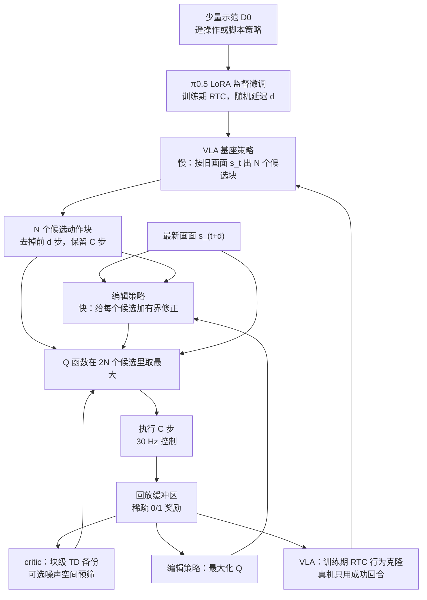

# Real-Time EXPO-FT：大 VLA 慢慢出候选，小编辑器按最新画面改动作

<!-- release-date: 2026-09-16 -->

> 本文依据 Stanford 的 Perry Dong、Kuo-Han Hung、Dorsa Sadigh、Chelsea Finn 所著 **Reinforcement Learning for Real-Time Vision-Language-Action Policies**，即 arXiv:2609.18207v1（2026-09-16），共 17 页。页码均指这份 PDF。全文把三层分开标注：**论文明确写了什么**、**我们如何解释或验算它**、**哪些是外部资料补充**。

## 读前先把几个词说成人话

这篇论文讲的是机器人。它难读的地方不在公式，而在「时间」：同一个动作，是在哪一刻的画面上算出来的，又是在哪一刻执行的。先把会反复出现的词说清楚。

- **VLA（Vision-Language-Action，视觉—语言—动作模型）**：看摄像头画面、读语言指令，直接输出机器人动作的大模型。本文用的是 Physical Intelligence 的 π0.5。
- **动作块（action chunk）**：VLA 一次不只出 1 个动作，而是出未来一小段动作序列，长度记作 $H$；实际执行其中前 $C$ 步再重新规划（PDF p. 3）。
- **推理延迟 $d$**：从 VLA 开始算到算完，机器人已经往前走了 $d$ 个控制步。算出来的动作是按 $d$ 步之前的画面做的决定（PDF p. 3–5）。
- **RTC（Real-Time Chunking，实时分块）**：一套让动作块在延迟下平滑衔接的做法。VLA 在算下一块时，当前块的剩余动作照常执行；新块把这些「已经承诺要执行的动作」当作前缀条件，接着往后生成（PDF p. 3）。
- **训练期 RTC（Training-Time RTC）**：把上面这件事搬进训练，训练时就随机模拟延迟，让模型学会接前缀（PDF p. 3）。
- **强化学习微调（RL fine-tuning）**：模仿学习只能学到示范数据的水平；RL 让机器人自己试、按成败打分，把成功率推到示范之上。
- **Q 函数 / critic（评论家）**：给「在状态 $s$ 下执行动作 $a$」打一个预期回报分。本文用它在多个候选动作里挑最好的。
- **编辑策略（edit policy）**：一个很小的网络，不自己从零出动作，只给 VLA 出的动作加一个有界的小修正量。
- **EXPO / EXPO-FT**：同一作者组的前作。EXPO 是「大基座策略 + 小编辑策略 + Q 函数挑候选」的 RL 算法；EXPO-FT 是把 EXPO 用到 VLA 真机微调上的系统（PDF p. 3–4）。

这篇论文的名字 Real-Time EXPO-FT，字面意思就是：给 EXPO-FT 加上实时性。

## 一句话先说清

大 VLA 算一次动作要几十到上百毫秒。对叠衣服这种慢任务无所谓；对接住别人递来的东西、托住滚动的乒乓球，这点延迟就让动作「过时」。

已有的 RTC 一系解决了「延迟下动作能不能连贯」，但它们建立在模仿学习上，没有办法超越示范数据（PDF p. 1–2）。而如果直接在延迟策略上跑 RL，又撞上另一个问题：RL 假设动作由当前状态决定，延迟让这个假设不成立（PDF p. 4）。

Real-Time EXPO-FT 的做法是把动作生成拆成 2 条时间尺度（PDF p. 5）：

1. **慢的一条**：大 VLA 在后台异步地按旧画面 $s_t$ 生成 $N$ 个候选动作块；
2. **快的一条**：等到真正要执行的那一刻，小编辑策略按最新画面 $s_{t+d}$ 给每个候选加修正，再由 Q 函数在「原候选 + 修正后候选」里挑分最高的那个执行。

结果写在摘要里（PDF p. 1–2）：

- 仿真 Kinetix 的 10 个环境中，带 4 步延迟的 Real-Time EXPO-FT 在 10 个上都达到「延迟与不延迟方法里的最好」；
- 4 个真机动态任务上，在线机器人数据封顶 10 分钟，平均成功率从 42%（12.5/30）提升到 97%（29/30），训练中没有人工干预（PDF p. 2）。

「10 个里 10 个最好」这句要带着判据读：它依赖附录 Table II 的「0.95 倍最好成绩以内都算最好」这条加粗规则，后文细讲。

### 一条阅读路线

如果只有半小时读原文：

1. **p. 1 的 Figure 1 与 p. 4 的 Figure 2**：先看清慢生成、快编辑在时间轴上各占哪一段。
2. **p. 4 的问题陈述**：延迟为什么会让 RL 的信用分配出偏差。
3. **p. 5 式 (4)–(9)**：3 个网络（VLA、编辑策略、critic）各自学什么。
4. **p. 5–6 式 (10)–(11)**：噪声空间预筛，训练算力省在哪。
5. **p. 8 的 Table I 与 Figure 6**：真机结果，以及延迟、物体速度扫描。
6. **p. 13 的 Table II、p. 14–17 的附录 E、F**：仿真全表与真机超参，这里藏着几处和正文对不上的细节。

## 主要矛盾：动作算出来时，世界已经往前走了

### 旧问题一：大 VLA 慢，慢就会让观测过时

论文开篇说得很直接：预训练 VLA 之所以是好的行为先验，靠的是规模；可规模同时抬高了推理延迟，而物理世界不会在机器人计算时暂停（PDF p. 2）。于是用来推理动作的观测，往往不是执行那一刻的观测，这造成分布偏移，伤可靠性（PDF p. 2）。

延迟换算成控制步数，论文给了一个近似式（PDF p. 5）：

$$
d = \lfloor t \times f \rfloor + 1
$$

$t$ 是一次 VLA 推理的秒数，$f$ 是控制频率（Hz），$d$ 是延迟的控制步数。要在 $t+d$ 时刻执行新动作，推理就得在大约 $d$ 步之前的 $t$ 时刻开始。论文假设 $1 \le d \le C$，也就是延迟不超过一个动作块的执行长度（PDF p. 5）。

举个真机的数：π0.5 在他们的服务器上推理约 67 ms，控制频率 30 Hz（PDF p. 7）。按上式，$\lfloor 0.067 \times 30 \rfloor + 1 = 3$，正好是 Dynamic Picking 任务用的 $d = 3$（PDF p. 7）。这一步是我们按原文公式验算的。

### 旧问题二：RTC 能让动作连贯，但走不出示范分布

RTC 一系（推理期 RTC、训练期 RTC、VLASH、πR2 等）通过动作补全、前缀条件或未来状态预测，让 VLA 在延迟下也能平滑执行（PDF p. 2–3）。论文对它们的评价是：推理顺了，但没有天然的机制去超越训练数据分布（PDF p. 2）。

也可以把 RTC 策略当 RL 的基座策略来用。论文认为这样仍然「把性能留在了桌上」：动作是按之前的观测预测的，RL 能带来的可靠性收益吃不满（PDF p. 2）。

### 旧问题三：延迟破坏了 RL 的马尔可夫假设

这一条是全文最硬的论证（PDF p. 4）。标准 RL 假设执行的动作只是当前状态的函数，$a_t \sim \pi(\cdot \mid s_t)$。有延迟时，$t$ 时刻执行的动作其实是 $s_{t-d}$ 的函数；在 $s_t$ 上看，这个过程已经不是马尔可夫的。如果照常做 RL 更新，就可能让信用分配出偏差。论文特别强调，追求高可靠性的 RL 恰恰要把动作调得很精细，这时偏差的代价最大（PDF p. 4）。

于是矛盾变成：

> 想要大 VLA 的行为先验，就得付推理延迟；付了延迟，动作就按旧画面做决定，RL 的前提也跟着松动。能不能让大模型慢慢想，同时让执行那一刻的决定仍然基于最新画面？

## 先看全景：同一个动作块，被 2 个时刻分别碰过

Figure 1 的上半就是全文机制（PDF p. 1）。VLA 在 $s_t$ 开始推理（橙色慢条「VLA Generates Action Candidates」），这段时间里状态一直在随机变化（图中「Randomness in States While Action Generates」那片扇形）。到 $s_{t+3}$，拿当前观测做第 2 步：对 4 个候选分别打 $Q(s_{t+3}, a_i)$，挑最高的执行。图里写的「e.g. 150 ms」只是示意，真机实验里的延迟是 67 ms 或约 167 ms（PDF p. 7）。

右下角的曲线是 4 个真机任务平均后的训练成功率，横轴按 10 分钟归一化（PDF p. 1）。它和 Table I 的最终评估不是一回事：曲线是训练过程中的滚动成功率，Table I 是训练结束后的 30 次评估。

把系统画成一张流程图：

这张图按 PDF p. 4–6 与 p. 14–15 的叙述重画，是流程示意，不是论文原图。核心只有一句：**慢的大模型负责给出候选的形状，快的小模型负责在最后一刻按新画面修正和挑选**。

## 背景：两块现成的积木

Real-Time EXPO-FT 本身没有发明新的 RL 算法。它把两块已有积木拼在一起，拼法才是贡献。

### 积木一：训练期 RTC

有 $d$ 步延迟时，新块的前 $d$ 个动作根本来不及执行：等它们算出来，环境已经到了 $t+d$（PDF p. 3）。训练期 RTC 的办法是：推理新块期间，继续执行旧块里的动作；新块把这段「已承诺前缀」$a^{\text{prev}}_{t:t+d}$ 当条件，只生成后面的部分，即 $a_{t+d:t+d+H} \sim \pi(\cdot \mid s_t, a^{\text{prev}}_{t:t+d})$（PDF p. 3）。训练时 $d$ 在一个范围内随机采样，让策略对不同延迟都稳（PDF p. 3）。

它在本文里负责「慢的一条」连贯：VLA 出的候选能接上正在执行的动作。

### 积木二：EXPO 的「基座 + 编辑 + 挑选」

经典的高样本效率 RL 算法围绕高斯策略设计，不能直接用在 flow 或 diffusion 形式的 VLA 上（PDF p. 3）。EXPO 的做法是并排放 2 个策略：一个是 flow 基座策略（本文里就是 VLA），一个是小编辑策略 $\pi^{\text{edit}}$。编辑策略的目标是最大化学到的 Q 值（PDF p. 3，式 1）：

$$
\mathcal{L}(\pi^{\text{edit}})
=
-\mathbb{E}_{(s_t,a_t)\sim\mathcal{D},\ \hat a_t\sim\pi^{\text{edit}}}
\Big[
Q_\phi(s_t,\ a_t+\hat a_t)
-
\alpha \log \pi^{\text{edit}}(\hat a_t \mid s_t, a_t)
\Big]
$$

$a_t$ 是基座动作，$\hat a_t$ 是编辑量，$\alpha$ 是熵系数。编辑量被限制在 $[-\beta, \beta]$ 之内，加到基座动作上得到 $\tilde a = a + \hat a$（PDF p. 3）。

这样设计有两个好处，论文都写了（PDF p. 3）：

- Q 函数的梯度只流进编辑量，**不反传进 VLA 主干**；
- 编辑有界，修正始终锚在已经接近最优的动作附近。

执行或构造备份目标时，EXPO 用一个「即时（on-the-fly，OTF）策略」：从 $N$ 个基座动作和 $N$ 个编辑后动作里挑 Q 值最高的那个（PDF p. 3，式 2）：

$$
\tilde a^{*}
=
\arg\max_{a \in \bigcup_{i=1}^{N}\{a_i,\ \tilde a_i\}}
Q_\phi(s, a)
$$

critic 用普通时序差分拟合（PDF p. 4，式 3）。EXPO-FT 在 EXPO 之上加了人在回路与动作分块，用于 VLA 真机微调；本文直接建在 EXPO-FT 之上，但**实验里不使用人工干预**（PDF p. 4）。

**外部补充（不是本 PDF 内容）。** EXPO-FT 是 arXiv:2605.25477，v1 提交于 2026-05-25、2026-08-17 有修订，见 [arXiv 页](https://arxiv.org/abs/2605.25477)。其摘要称在挂灯串、击打台球、把花插进瓶子等任务上，平均 19.1 分钟在线机器人数据内达到 30/30。EXPO 本体发表于 ICLR 2026（PDF p. 11，参考文献 38）。

**我们如何解释它。** EXPO 这套结构天然适合处理延迟：大模型出候选、小模型修、Q 函数挑，这 3 步本来就可以发生在不同时刻。本文的关键一步，就是把「修」和「挑」挪到执行那一刻，把「出候选」提前到后台。

## 核心设计一：慢生成、快编辑，把一次决策拆到 2 个时刻

### 旧问题

EXPO-FT 原本是同步的：观测进来，VLA 出候选，编辑、挑选，然后执行。论文指出，直接把 EXPO-FT 用在 30 Hz 高频控制上，会在动作块之间出现停顿（PDF p. 7）。加上 RTC 能消除停顿，但候选和修正都是按旧画面做的。

### 新设计

Figure 2 左半是推理流程（PDF p. 4）。时间轴上方标着「delay $d$（async inference）」，从 $s_t$ 跨到 $s_{t+4}$；下方橙框是动作前缀 $a_t$ 到 $a_{t+3}$，它们在 VLA 推理期间照常执行。编辑策略在 $s_{t+4}$ 那一刻才介入。最右边一栏柱状图把 $N$ 个原候选与 $N$ 个编辑后候选的 Q 值画在一起，橙色最高那根被送进动作队列。

具体分 3 步（PDF p. 5）。

**第 1 步：异步 VLA 生成。** 当前动作队列还剩 $d$ 步时，在 $t$ 时刻开始推理。按训练期 RTC，把推理窗口里要执行的旧动作 $a^{\text{prev}}_{t:t+d}$ 作为补全条件，对每个候选 $i$ 采样（PDF p. 5，式 4）：

$$
a^{i}_{t:t+H}
=
\pi_{\text{VLA}}\big(s_t,\ a^{\text{prev}}_{t:t+d},\ \epsilon^{i}\big),
\qquad
\epsilon^{i} \sim p(\epsilon)
$$

$\epsilon^{i}$ 是 flow 采样用的噪声，不同噪声给出不同候选。前 $d$ 个动作落在延迟窗口里，丢掉，只保留后面 $C$ 步 $a^{i}_{t+d:t+d+C}$（PDF p. 5）。

**第 2 步：快速同步编辑。** 环境走到 $s_{t+d}$ 时，小编辑策略按最新观测修正每个候选（PDF p. 5，式 5）：

$$
\hat a^{i}_{t+d:t+d+C}
\sim
\pi^{\text{edit}}_{\theta}\big(\cdot \mid s_{t+d},\ a^{i}_{t+d:t+d+C}\big)
$$

修正后的候选是 $\tilde a^{i} = a^{i} + \hat a^{i}$（PDF p. 5）。

**第 3 步：按当前状态挑选。** critic 在当前状态 $s_{t+d}$ 下同时评估原候选与编辑后候选，挑最高的执行（PDF p. 5，式 6）：

$$
\tilde a^{*}_{t+d:t+d+C}
=
\arg\max_{a \in \bigcup_{i=1}^{N}\{a^{i}_{t+d:t+d+C},\ \tilde a^{i}_{t+d:t+d+C}\}}
Q_\phi(s_{t+d}, a)
$$

注意第 1 步用的是 $s_t$，第 2、3 步用的是 $s_{t+d}$。一个动作块被 2 个时刻的观测分别碰过：旧观测决定大致形状，新观测决定最终修正和取舍。

### 工作机制：谁慢、谁快

真机上的数字说明了为什么这样拆得通（PDF p. 14–15）：

- VLA 每个重新规划点采 $N = 32$ 个候选块，每个用 10 步 Euler 去噪；因为 VLM 前缀在不同噪声间共享，只算 1 次；
- 每个基座块只采 1 个编辑，总共 64 个候选：32 个原候选 + 32 个编辑后候选；
- 最终用「从 10 个 Q 网络里随机抽 2 个取最小」的 Q 值做 argmax，确定性选择，不做 softmax。

编辑策略是一个 tanh 压缩的高斯分布，输出维度 $D = C \times 7$，$C = 8$ 时 $D = 56$；3 层 256 宽的隐藏层，复用 critic 的图像编码器（PDF p. 14）。输出在 $[-1, 1]^D$，乘以任务专属的编辑尺度（0.05 或 0.1）再加到基座动作上（PDF p. 14、p. 16）。Dynamic Picking 把编辑的旋转分量置零，只改平移和夹爪（PDF p. 14）。

在仿真里，论文明确写了编辑策略因为轻量，按零延迟评估（PDF p. 7）。真机上编辑与 Q 值打分的实际耗时，论文没有给出。

### 为什么说这样「又回到了马尔可夫」

论文的说法是：因为编辑以最新观测为条件，基座加编辑的组合策略在延迟下仍保持马尔可夫（PDF p. 5）。

**我们如何解释它。** 严格说，执行动作同时依赖 $s_t$（候选的来源）和 $s_{t+d}$（编辑与挑选的条件）。论文在背景一节本来就把策略写成 $\pi(\cdot \mid s_{t-d}, s_t)$（PDF p. 3）。更准确的读法是：最后那一步决策看到了当前状态，旧观测只通过「候选集合」这一层影响动作。论文没有给出这件事的形式证明，也没有做「编辑策略看旧观测 vs 看新观测」的直接消融；最接近的证据是和 EXPO-FT w/ RTC 的对比（后文实验）。

### 收益与代价

收益：VLA 的延迟被藏在执行上一块的时间里，不再造成停顿；RL 真正在学的那部分（编辑与挑选）用的是最新画面。

代价：

- 每次重新规划要采 32 个候选，VLA 的计算量并没减少，只是被挪到后台；
- 编辑有界，意味着如果 $d$ 步里局面变化太大，候选全都偏了，小修正救不回来。论文假设 $d \le C$（PDF p. 5），更大延迟没有测；
- 系统里多了编辑策略、critic、以及可选的噪声 critic，3 个额外网络都要在线训练。

### 可迁移启发

凡是「大模型慢、环境快」的闭环系统（机器人、游戏智能体、实时语音），都可以问一句：能不能让大模型只负责给候选，把最后一刻的决定交给一个看得到最新输入的小模型？关键前提是候选集合要足够多样，否则小模型没得挑。

## 核心设计二：3 个网络，各学各的

训练时要更新 3 样东西：critic $Q_\phi$、编辑策略 $\pi^{\text{edit}}$、VLA $\pi_{\text{VLA}}$。$Q_{\phi'}$ 是目标 critic（PDF p. 5）。

### VLA：继续做训练期 RTC 行为克隆，不接 Q 梯度

VLA 用训练期 RTC 的目标微调，数据是离线示范加在线回合（PDF p. 5）。做法是把每个真实动作块拆成 $d$ 步前缀和剩余后缀：前缀作为干净动作输入、flow 时间步设为 1；只给后缀加噪，flow matching 损失也只算后缀（PDF p. 5，式 7）：

$$
A^{\tau}_t = \tau A_t + (1-\tau)\epsilon,
\qquad
\epsilon \sim \mathcal{N}(0, I)
$$

$$
\mathcal{L}_{\text{BC}}(\pi_{\text{VLA}})
=
\mathbb{E}_{(s_t, A_t)\sim\mathcal{D}}
\Big[
\big\lVert
\mathbf{m}_d \odot
\big(
v_{\text{VLA}}(A^{\tau}_t, s_t, \boldsymbol{\tau}_d)
-
(\epsilon - A_t)
\big)
\big\rVert_2^2
\Big]
$$

$A_t$ 是真实动作块，$A^{\tau}_t$ 是加噪到时间 $\tau$ 的版本，$v_{\text{VLA}}$ 是 VLA 预测的速度场。$\mathbf{m}_d$ 把前 $d$ 个动作从损失里遮掉；$\boldsymbol{\tau}_d$ 给前缀分配时间步 1、给后缀分配 $\tau$（PDF p. 5）。每个回合第 1 个动作块用 $d = 0$，之后用实际执行延迟 $d$（PDF p. 5）。

附录补了几个关键细节（PDF p. 15–16）：

- 真机上 VLA 只在**成功回合**上做行为克隆，包括示范和成功的在线回合；
- 在线阶段前缀长度是确定的：第 1 块 $d = 0$，之后等于部署延迟，不再随机采样；
- 可训练参数是语言模型里的 LoRA 适配器，加上冻结语言模型权重之外的全部参数（包括 SigLIP 视觉塔和投影层）；冻结部分用 bfloat16 保存；
- AdamW，$\beta_1 = 0.9$，$\beta_2 = 0.95$，$\epsilon = 10^{-8}$，权重衰减 $10^{-10}$，梯度裁剪 1.0，恒定学习率 $2.5 \times 10^{-5}$，不用 EMA（PDF p. 16）。

**我们如何解释它。** VLA 这条线本质上是「过滤后的行为克隆」：只模仿成功的轨迹。它不直接吃 Q 值，所以大模型不会被一个还在学习的 critic 带偏。真正的 RL 信号只经过编辑策略和挑选这两道。

### 编辑策略：把基座动作推向高价值区域

和 EXPO、EXPO-FT 一样，只是换成动作块（PDF p. 5，式 8）：

$$
\mathcal{L}(\pi^{\text{edit}})
=
-\mathbb{E}_{(s_t, a_{t:t+C})\sim\mathcal{D},\ \hat a_{t:t+C}\sim\pi^{\text{edit}}}
\Big[
Q_\phi\big(s_t,\ a_{t:t+C} + \hat a_{t:t+C}\big)
-
\alpha \log \pi^{\text{edit}}\big(\hat a_{t:t+C} \mid s_t, a_{t:t+C}\big)
\Big]
$$

温度 $\alpha$ 初值 0.01，用 Adam 以 $3 \times 10^{-4}$ 学习，目标熵 $-D/2$；熵只进编辑策略目标，不进 Bellman 备份（PDF p. 16）。

### critic：块级时序差分

一个转移跨整个执行长度 $C$，自举项在下一个块 $\tilde a^{*}_{t+C:t+2C}$ 上评估（PDF p. 5，式 9）：

$$
\mathcal{L}(Q_\phi)
=
\mathbb{E}_{(s_t, a_{t:t+C}, s_{t+C})\sim\mathcal{D}}
\Big[
\big(
r_t + \gamma Q_{\phi'}\big(s_{t+C},\ \tilde a^{*}_{t+C:t+2C}\big)
-
Q_\phi\big(s_t,\ a_{t:t+C}\big)
\big)^2
\Big]
$$

式中写的是 $\gamma$。附录讲 RLPD 基线时说它「每个环境步用 $\gamma$，而不是 $\gamma^C$」（PDF p. 16），暗示块级方法实际用 $\gamma^C$；正文公式没有写出来。

critic 是 REDQ 风格的 10 个 Q 网络集成，带 LayerNorm、3 层 256 宽；每次 Q 评估（包括 Bellman 目标和执行时的挑选）都从目标集成里均匀抽 2 个取最小；目标集成用 Polyak 平均跟随，$\tau_Q = 5 \times 10^{-3}$（PDF p. 14）。

### 更新节奏：critic 与 VLA 步数 20 比 1

每次更新调用采 batch size × UTD 个转移，critic 在互不重叠的小批上做若干步梯度，然后 VLA、编辑策略、温度各走恰好 1 步。于是 VLA 与 critic 的梯度步比是 1 : 20（PDF p. 16）。每收集 $K$ 个转移积一次更新调用，在回合边界统一执行；前 10 个回合结束后才开始训练（PDF p. 16）。

### 可迁移启发

把一个系统里的 3 类学习信号分开：大模型只做过滤后模仿（稳），小模型吃 Q 梯度（快、便宜），critic 负责排序（它错了只影响挑选，不会写进大模型权重）。想在大模型上跑 RL 又怕训崩时，这是一种隔离风险的结构。

## 核心设计三：在噪声空间先筛一轮，省掉 31 次 VLA 解码

### 旧问题

式 9 的备份目标需要构造下一个块 $\tilde a^{*}_{t+C:t+2C}$。朴素做法是从 VLA 采 $N$ 个候选，要跑 $N$ 次完整 VLA 解码（PDF p. 5）。动态任务随机性大，论文发现往往要 $N = 32$ 这样的大 $N$；每次 Bellman 更新都去噪 32 个候选，训练算力负担很重（PDF p. 12、p. 14）。

### 新设计

借用同组的 FASTER（arXiv:2604.19730，PDF p. 11 参考文献 40）的思路：训练一个轻量的噪声 critic $Q^{\text{dn}}_\psi$，直接给「噪声」打分，不用先把噪声解码成动作（PDF p. 5）。备份时（PDF p. 6，式 10）：

$$
\epsilon^{*} = \arg\max_{i \in [N]} Q^{\text{dn}}_\psi\big(s_{t+C-d},\ \epsilon_i\big)
$$

$$
a = \Big[\pi_{\text{VLA}}\big(s_{t+C-d},\ a^{\text{prev}}_{t+C-d:t+C},\ \epsilon^{*}\big)\Big]_{d:d+C}
$$

$$
\tilde a^{*}_{t+C:t+2C}
=
\arg\max_{a' \in \{a,\ a+\hat a\}}
Q_{\phi'}\big(s_{t+C},\ a'\big)
$$

读法：先在 $N$ 个噪声里挑分最高的 $\epsilon^{*}$；只把这 1 个噪声交给 VLA 解码，取出延迟窗口之后的 $C$ 步；再给它采编辑，用目标 critic 在「原动作、编辑后动作」里二选一。候选集合先在噪声空间筛一次，编辑后再筛一次，**每次备份只需 1 次 VLA 解码，与 $N$ 无关**（PDF p. 6）。

噪声 critic 自己怎么学？回归到目标 critic 给解码结果的打分，对目标加停止梯度（PDF p. 6，式 11）：

$$
\mathcal{L}(Q^{\text{dn}}_\psi)
=
\mathbb{E}
\Big[
\big(
Q^{\text{dn}}_\psi(s_{t+C}, \epsilon^{*})
-
\mathrm{sg}\big[Q_{\phi'}(s_{t+C},\ \tilde a^{*}_{t+C:t+2C})\big]
\big)^2
\Big]
$$

这样动作空间 critic 越学越准，噪声空间的排序也跟着继承（PDF p. 6）。附录补充：噪声 critic 是 2 个网络的集成，每个 critic 步都训练；目标是监督式回归，所以不需要目标网络；它另外以 VLA 用的那份延迟观测为条件；**执行时的动作选择不用它**（PDF p. 14）。

注意式 10 里噪声 critic 的状态参数写作 $s_{t+C-d}$，式 11 里写作 $s_{t+C}$。附录说它「另外以延迟观测为条件」（PDF p. 14），合起来看应是两者都用，但正文两式记号不统一。

### 实证：同样算力下学得更快

Figure 7 把横轴换成训练算力，比较「带噪声预筛」与「不带、只在完整去噪后的动作上用 Q 筛」（PDF p. 12–13）。4 个任务上橙线都更早爬到接近 1.0；灰线在 Car Launch 上约 160 PFLOPs 才首次接近 0.95，随后又回落到 0.7–0.9 之间，Catcher V3 上要到约 320 PFLOPs 才碰到 1.0（读自 PDF p. 13 Figure 7）。论文结论：噪声预筛让大 $N$ 变得用得起，同算力下学得明显更高效（PDF p. 12）。

这组对照只做在仿真的 4 个任务上。方法层面噪声预筛是「可选」组件（Figure 2 右半标注 optional），真机配置里实际开着（Table III 的备份设置是 32 个噪声种子、留 1 个、配 1 个编辑，PDF p. 15），但论文没有给真机上的开关对比。

### 可迁移启发

如果生成模型的采样很贵，而你只需要从很多样本里挑一个最好的，可以先训练一个直接看「随机种子」打分的小模型，只解码胜出的那个。它的训练目标就是「大 critic 对解码结果的打分」，不需要额外标签。

## 实现细节：真机栈长什么样

### 基座与传感

基座是 π0.5，LoRA 配置：语言主干 `gemma_2b_lora`，动作专家 `gemma_300m_lora`；补齐后的动作维度 32，动作块长度 $H = 16$，输出动作维度 7（PDF p. 14）。本体状态以笛卡尔形式输入，图像缩放到 224 × 224（PDF p. 14）。

4 个真机任务都在同一套单臂 DROID 平台上，30 Hz 控制，末端执行器空间下发笛卡尔与夹爪速度指令；两路相机：1 个外部视角、1 个腕部视角（PDF p. 7、p. 12）。

监督初始化是按任务做的：用对应示范，前缀长度每个样本从 $\{0, \dots, d_{\max}\}$ 均匀采样，图像编码器在这一阶段可训练（PDF p. 14）。正文写，模仿学习阶段要把 VLA 训到成功率约 30% 或以上，才开始在线 RL（PDF p. 6）。

### critic 的视觉编码器

critic 不用 VLA 的视觉编码器，而是单独一个轻量编码器（PDF p. 6）。附录写的结构是：pre-activation ResNetV2，基本残差块（非 bottleneck），各阶段深度 $(3, 4, 6, 3)$，4 组 GroupNorm，64 个基础滤波器逐阶段翻倍到 512；各视角按通道堆叠输入，投影到 512 维图像嵌入；本体状态嵌入 64 维；再与展平的动作块拼接预测 Q（PDF p. 14）。

正文把它叫做 ResNet-50（PDF p. 6）。**我们的判断**：「基本块 + $(3, 4, 6, 3)$」是通常所说的 ResNet-34 的排布，ResNet-50 用的是 bottleneck 块。两处描述不一致，以附录为准更可信，但论文没有澄清。

### 共享超参（Table III，PDF p. 15）

| 超参 | 取值 |
|---|---|
| 优化器（critic、噪声 critic、编辑策略、温度） | Adam，$3 \times 10^{-4}$ |
| 优化器（基座 VLA） | AdamW，$2.5 \times 10^{-5}$，裁剪 1.0 |
| critic 目标更新 $\tau_Q$ | $5 \times 10^{-3}$ |
| 基座策略 Polyak 副本 $\tau_\pi$ | $10^{-3}$ |
| 初始温度 $\alpha_0$ | 0.01 |
| 目标熵 | $-D/2$，$D = C \times 7$ |
| critic 小批大小 | 64 |
| 更新数据比（UTD） | 20 |
| Q 集成大小 / 抽样数 | 10 / 2 |
| 噪声 critic 集成大小 | 2 |
| 动作块长度 $H$ | 16 |
| 基座候选 $N$ / 编辑候选 | 32 / 32 |
| 备份时噪声种子 / 幸存者 / 编辑 | 32 / 1 / 1 |
| 去噪步数 | 10 |
| 图像 / 状态嵌入维度 | 512 / 64 |
| 隐藏层 | (256, 256, 256) |

基座策略的 Polyak 副本维护着，但当前 Bellman 备份不用它，下一步动作直接从实时基座策略采（PDF p. 16）。

### 任务专属超参（Table IV，PDF p. 16）

| 任务 | 编辑尺度 | 重新规划 $C$ | 延迟 $d$ | $K$ | 示范数据用法 | 环境步数 |
|---|---:|---:|---:|---:|---|---:|
| Dynamic Picking | 0.1 | 8 | 3 | 25 | 预置进缓冲区 | 约 18k |
| Soccer Kicking | 0.05 | 8 | 5 | 20 | 每个 batch 占 50% | 约 18k |
| Ball Balancing | 0.1 | 8 | 5 | 30 | 预置进缓冲区 | 约 18k |
| Object Passing | 0.1 | 8 | 5 | 30 | 预置进缓冲区 | 约 5k |

$K$ 是每次更新调用前收集的转移数（PDF p. 16）。约 18k 步在 30 Hz 下是 600 秒，正好 10 分钟，这是我们验算的。

### 延迟怎么造出来

论文区分了 2 种实现延迟的方式（PDF p. 16）：

- **挂钟延迟**：$d = 0$，在每次采样动作调用里真实 sleep 100 ms（Soccer Kicking、Ball Balancing、Object Passing），近似「在典型边缘 GPU 上跑 π0.5」的耗时；Dynamic Picking 不加，因为再加一点延迟基线就几乎全败，比较失去信息量；
- **块延迟**：策略看到 $d$ 步前的观测，正在执行的 $d$ 个动作作为干净前缀补进块位置 $[0, d)$，执行窗口是 $[d, d+C)$。Dynamic Picking 用 $d = 3$，其余用 $d = 5$。

正文的口径是：服务器上 VLA 推理约 67 ms，另 3 个任务额外加 100 ms，总约 167 ms，对应 $d = 5$（PDF p. 7）。

**我们的验算。** 按 PDF p. 5 的式子，$\lfloor 0.167 \times 30 \rfloor + 1 = 6$，而论文取 $d = 5$；5 步在 30 Hz 下正好约 167 ms。附录又把 $d = 3$ 说成「约 100 ms」（PDF p. 16），而正文说 Dynamic Picking 的延迟是 67 ms（PDF p. 7）。两处都说得通（3 步 = 100 ms 的时间窗，覆盖 67 ms 的推理），但原文没有把「推理耗时」与「延迟窗口」两种口径统一起来。

### 奖励与成功检测

所有任务都用稀疏 0/1 奖励，规则分类器只在成功那一步给 1 并结束回合，超时给 0（PDF p. 6、p. 12）。检测器只用机器人自己的观测流，不需要外部仪器（PDF p. 12）：

- Dynamic Picking：末端高度超过 0.30 且夹爪闭合过半开阈值，连续 5 步；
- Ball Balancing：腕部视角检测，另外要求球连续 10 帧留在中心容差内；
- Soccer Kicking：腕部视角检测；
- Object Passing：夹爪闭合且物体被检测到，连续 5 个控制步（PDF p. 12–13）。

最终评估的成功由人类观察者独立核验（PDF p. 7）。

### 给 critic 的特权信息

这一条容易被忽略（PDF p. 13–14）。有 2 个任务把成功检测器已经测到的量写进本体状态向量的空槽，供 critic、噪声 critic 和编辑策略使用，VLA 自己的状态输入不变：

- Ball Balancing 暴露盘子中心、球的位置和速度；
- Soccer Kicking 暴露守门员的位置和速度。

Ball Balancing 还从 critic 输入里去掉了竖直 z 分量，因为它随回合时间单调漂移，可能让价值函数「偷看」时间（PDF p. 14）。论文写明 DSRL 和 RLPD 的 critic 也拿到同样的特权维度（PDF p. 14）；EXPO-FT 基线与本方法用同一套 learner 配置（PDF p. 17）。

**我们如何解释它。** 编辑策略也看得到球的速度，这意味着 Ball Balancing 上「快速反应」的一部分能力来自状态估计，而不纯粹来自图像。比较对基线是公平的，但读 28/30 这个数时，要知道它不是纯视觉策略的成绩。

Ball Balancing 的观测排布也不同：用外部视角在 $t$、$t-k$、$t-2k$ 的 3 帧堆叠，去掉腕部视角；critic 编码器因此吃 9 通道，其余任务是 2 个视角的 6 通道（PDF p. 14）。$k$ 的取值没有写。

## 仿真：Kinetix 上 10 个动态任务

### 设置

仿真用的是 Kinetix 基准的向量状态版本，**不涉及 VLA**，基座策略是公开的、按关卡行为克隆的状态 flow 策略，来自 RTC 论文的 Kinetix 设置（PDF p. 12）。它的配置：通道维 256、通道隐藏维 512、token 隐藏维 64、4 层，动作块长度 $H = 8$，训练时 5 步 flow matching，执行和备份时 10 步 Euler 去噪（PDF p. 12）。环境加标准差 0.1 的高斯动作噪声（PDF p. 12）。

流程是：在 1M 转移上离线预训练 RTC flow 策略，然后在线微调 100k 环境步（PDF p. 7）。所有用 flow 基座的 RL 方法，每次调用基座都有 4 步推理延迟；RLPD 的策略和本方法的编辑策略按零延迟评估（PDF p. 7）。4 个随机种子，每个环境每种方法 100 次评估（PDF p. 12）。视觉编码器换成输出 256 维的 MLP 状态编码器，其余 learner 结构与真机相同（PDF p. 12）。

基线：

- **RLPD**：基于 SAC 的高样本效率离线加在线 RL，用轻量高斯策略，天然适合实时，原样运行（PDF p. 6）；仿真里从头学，每个 batch 50% 示范数据，零延迟（PDF p. 12）；
- **DSRL / DSRL w/ RTC**：不改预训练策略权重，学习往策略里输入的噪声（PDF p. 6）；直接用在 30 Hz 控制上会在块间停顿，所以加 RTC 版（PDF p. 7）；
- **EXPO-FT / EXPO-FT w/ RTC**：本方法的前身，同样的停顿问题（PDF p. 7）；
- **BC、RTC**：预训练策略不微调直接部署，作参照。

论文特意交代了一处不对称：RLPD 和 DSRL 是异步训练的，learner 以高 UTD 持续更新，梯度步数远多于每个回合才更新的 EXPO-FT 与本方法；这个优势对基线有利，但去掉它基线会明显变差，所以保留（PDF p. 7）。

### 结果（Table II，PDF p. 13）

成功率（%）。RL 方法是 4 个种子 × 100 次评估的平均；BC 与 RTC 是预训练策略不微调，各 512 回合。延迟 4 的方法在 4 步延迟下每 4 步重新规划；RLPD 只支持零延迟（PDF p. 13）。

| 任务 | BC（d=0） | RLPD（d=0） | BC（d=4） | RTC | DSRL | DSRL w/ RTC | EXPO-FT | EXPO-FT w/ RTC | Real-Time EXPO-FT |
|---|---:|---:|---:|---:|---:|---:|---:|---:|---:|
| Car Launch | 94 | 97 | 51 | 70 | 76 | 79 | 44 | 64 | 98 |
| Cartpole Thrust | 100 | 57 | 37 | 92 | 49 | 85 | 99 | 96 | 98 |
| Catapult | 62 | 83 | 31 | 42 | 36 | 49 | 18 | 47 | 93 |
| Catcher | 97 | 90 | 23 | 90 | 40 | 71 | 90 | 85 | 97 |
| Unicycle | 97 | 90 | 58 | 74 | 48 | 86 | 48 | 87 | 99 |
| Hard Lunar Lander | 95 | 70 | 57 | 87 | 75 | 79 | 95 | 90 | 94 |
| Half-Cheetah | 88 | 93 | 72 | 75 | 86 | 85 | 75 | 79 | 98 |
| Trampoline | 84 | 47 | 68 | 85 | 43 | 42 | 93 | 83 | 94 |
| Chain Lander | 95 | 90 | 94 | 94 | 92 | 96 | 90 | 94 | 92 |
| Grasp | 95 | 97 | 61 | 91 | 72 | 89 | 97 | 92 | 99 |
| **平均** | 90.7 | 81.4 | 55.2 | 80.0 | 61.7 | 76.1 | 74.9 | 81.7 | **96.2** |

正文的读法（PDF p. 7）：

- 4 步延迟下平均 96.2%，比 DSRL、DSRL w/ RTC、EXPO-FT、EXPO-FT w/ RTC 分别高 34.5、20.1、21.3、14.5 个百分点。我们用表中平均值逐一相减，结果一致；
- 超过零延迟的 RLPD（81.4%）。论文强调这一点尤其值得注意：RLPD 每个动作都看当前观测，而本方法的候选是按延迟观测生成的。

### 「10 个里 10 个最好」要怎么读

摘要说在 10 个环境里全部取得「延迟与不延迟方法中最好」的成绩（PDF p. 1）。逐行看表，本方法不是每一行的最大值：

- Cartpole Thrust：98，EXPO-FT 是 99，零延迟 BC 是 100；
- Hard Lunar Lander：94，EXPO-FT 与零延迟 BC 都是 95；
- Chain Lander：92，DSRL w/ RTC 是 96，EXPO-FT w/ RTC 与 RTC 都是 94，零延迟 BC 是 95。

Table II 的表注说明了判据：加粗标出「在该任务最好 RL 结果的 0.95 倍以内」的每一个 RL 方法，BC 与 RTC 不参加比较（PDF p. 13）。本方法在 10 行里都被加粗，「10/10」指的是这个意思。

**我们的判断。** 这不算夸大到失实，但原文摘要没有把这个容差写出来。更直观的结论是：本方法在 6 个任务上是严格最高，Catcher 与零延迟 BC 并列 97，另外 3 个任务差最好者 1–4 个百分点；它的真正优势是**没有短板**，平均分因此拉开。最典型的是 Catapult（93 对 RLPD 的 83、其余延迟方法都不到 50）和 Car Launch（98 对 EXPO-FT 的 44）。

这张表也把「延迟的代价」量出来了：同一个 BC 策略，零延迟平均 90.7%，加 4 步延迟掉到 55.2%；加上 RTC 回到 80.0%（PDF p. 13）。RTC 挽回了大部分，RL 微调加实时编辑把剩下的补上，还超过了零延迟 BC。

Figure 3（PDF p. 6）画的是这 10 个任务的训练曲线，4 个种子。表只给终点，曲线补上了过程：橙线在 Catapult、H17 Unicycle 上领先得最明显；Trampoline 上橙线与 EXPO-FT w/o RTC 的点线缠在一起，和表里 94 对 93 一致；Chain Lander 上各条线缠在一起（读自 PDF p. 6 Figure 3）。

## 真机：4 个动态任务、10 分钟在线数据

4 个任务都要求快速反应（PDF p. 7）：

- **Dynamic Picking**：从旋转盘上抓一个方块。方块初始位置任意，所以运动速度和轨迹各不相同；策略要推断它怎么动，并在它转走之前抓住。
- **Ball Balancing**：控制一块托着乒乓球的黑盘，持续转动让球在中心附近停留若干连续帧。高度动态、随机，对球位置的小变化要平滑地反应。
- **Object Passing**：从另一只随机运动的机械臂手里接过物体。要持续跟随对方的运动，把末端快速移到物体的预测位置。
- **Soccer Kicking**：避开移动的守门员，把球踢进小球门。既要空间精度也要时机：往哪踢、什么时候踢。

每个任务的初始状态随机范围在附录 Figure 10 用橙框画出（PDF p. 15）。所有方法的在线机器人交互都封顶 10 分钟，每个任务评估 30 次（PDF p. 7）。

### 结果（Table I，PDF p. 8）

每项是 30 次评估中的成功次数。训练直到某个策略达到 30/30 或采满 10 分钟在线数据为止（PDF p. 8）。

| 任务 | SFT | SFT w/ RTC | RLPD | DSRL | DSRL w/ RTC | EXPO-FT | EXPO-FT w/ RTC | Real-Time EXPO-FT |
|---|---:|---:|---:|---:|---:|---:|---:|---:|
| Dynamic Picking | 19 | 22 | 0 | 23 | 25 | 21 | 24 | 30 |
| Ball Balancing | 8 | 12 | 12 | 11 | 15 | 18 | 23 | 28（满 10 分钟） |
| Object Passing | 10 | 22 | 0 | 23 | 23 | 19 | 27 | 30 |
| Soccer Kicking | 13 | 16 | 6 | 16 | 17 | 17 | 26 | 28（满 10 分钟） |
| **平均** | 12.5 | 18 | 4.5 | 18.3 | 20 | 18.8 | 25 | **29** |

我们逐列核对过平均值，都与原表一致。几条读法：

- 本方法在 Dynamic Picking 和 Object Passing 上 30/30；表里只有 Ball Balancing 与 Soccer Kicking 两格标注「10 min reached」（PDF p. 8）。从 Figure 5 看，只有 Object Passing 的曲线在约 4.8 分钟就停了，Dynamic Picking 的曲线仍画到 10 分钟，论文没有说明它是否提前停训。
- Ball Balancing 是随机性最强的任务，球的微小扰动会导致很不一样的未来状态。本方法 28/30，其余方法最高 23/30（PDF p. 8）。
- 最强的基线是 EXPO-FT w/ RTC，平均 25/30。本方法相对它多 4 次成功，这 4 次就是「编辑与挑选看最新画面」这件事在真机上的净收益。
- RLPD 在 Dynamic Picking 和 Object Passing 上 0/30。轻量高斯策略没有预训练先验，10 分钟学不会（这是我们的解释，原文没有分析 RLPD 失败的原因）。

### 42% → 97% 的起点是哪一列

摘要里的 42% 是 SFT 列的 12.5/30，97% 是本方法的 29/30（PDF p. 2）。但表里还有 SFT w/ RTC 一列，平均 18/30，即 60%。附录写明，本方法的初始化是「按任务、带前缀条件的实时分块 LoRA 监督微调」（PDF p. 14）。

**我们的判断。** 从机制上看，本方法的起点更接近 SFT w/ RTC 那一列；论文没有明说表中 SFT 与 SFT w/ RTC 各对应哪个 checkpoint、怎样部署。若按 60% 算起点，真机提升是 60% → 97%，仍然很大，但比摘要的数字小。

### 训练曲线

Figure 5 的曲线很抖（PDF p. 8）。Dynamic Picking 上橙线在约 4 分钟冲到 1.0 又掉回 0.5 左右，最后才稳定在高位；Object Passing 上橙线在 2–4 分钟一度低于多个基线，到 4 分钟后才冲到 1.0（读自 PDF p. 8 Figure 5）。Ball Balancing 是橙线领先最稳定的一个，约 6 分钟后大多在其他线之上。

**我们如何解释它。** 真机训练成功率是滚动统计，样本少、噪声大，所以最终 30 次评估（Table I）比曲线更能说明问题。曲线说明的是：10 分钟这个预算并不宽裕，有的任务要到最后几分钟才分出胜负。

Object Passing 的横轴只到约 4.8 分钟，因为有策略先达到 30/30 就停了（PDF p. 8 图注）。Table IV 给它的环境步数约 5k（PDF p. 16），按 30 Hz 约 2.8 分钟，和图上的 4.8 分钟对不上。这是我们的换算，原文没有解释差别来源（可能包括重置或评估时间，但原文没写）。

## 延迟和速度加大时，差距更明显

两组扫描（PDF p. 8–9）：

**延迟扫描（仿真 H17 Unicycle）。** 用不同延迟分别训练本方法，模拟不同硬件和基座推理速度。本方法随延迟增加几乎不掉，$d = 4$ 时仍约 98%；RTC 从 $d = 0$ 的约 97% 一路降到 $d = 4$ 的约 74%（读自 PDF p. 8 Figure 6 左）。论文结论：必须把推理延迟显式纳入实时控制，本方法更能扛延迟（PDF p. 9）。

**速度扫描（真机 Object Passing）。** 改变递物机械臂的运动速度，从 0.5 倍到 1.25 倍。本方法在所有速度下都接近 100%；两个 EXPO-FT 变体随速度增加而下降，1.25 倍时 EXPO-FT w/ RTC 约 57%、EXPO-FT w/o RTC 约 47%（读自 PDF p. 8 Figure 6 右）。论文结论：动态环境里，快速、反应式的动作编辑很重要（PDF p. 9）。

**我们如何解释它。** 右图是全文最干净的一组对照。附录 F 写明，EXPO-FT 与本方法用同一套 learner、网络、候选数和优化设置，「唯一区别」是 EXPO-FT 不感知延迟：按 $d = 0$ 训练和评估，同时承受 100 ms 真实推理延迟；EXPO-FT w/ RTC 则与本方法用同样的延迟和优化参数（PDF p. 17）。论文没有逐项写出 EXPO-FT w/ RTC 与本方法还剩什么差别；按方法定义推断，差别在编辑与挑选是否在执行时刻看最新画面 $s_{t+d}$。环境越快，旧画面过时得越厉害，这个差别就越大。左图的对手是不做 RL 的 RTC，它同时混入了「有没有 RL」这个变量，归因没有右图干净。

## 细节里几处对不上的地方

逐页读正文和附录，有几处描述不一致。都不动摇主结论，但复现时要留意：

| 位置 | 一处写法 | 另一处写法 |
|---|---|---|
| critic 视觉编码器 | ResNet-50（PDF p. 6） | ResNetV2 基本块、$(3, 4, 6, 3)$（PDF p. 14） |
| 备份时的编辑数 | 「生成 $K$ 个编辑」（PDF p. 5） | 噪声种子 / 幸存者 / 编辑为 32 / 1 / 1（PDF p. 14–15）；$K$ 在附录里另指每次更新前收集的转移数（PDF p. 16） |
| 本体状态 | 状态含机器人关节位置（PDF p. 6） | 本体观测是末端位置与姿态（PDF p. 7），以笛卡尔形式输入 VLA（PDF p. 14） |
| 环境重置 | 按任务自动或由人完成（PDF p. 7） | 限制一节说实验里由人重置（PDF p. 9） |
| 噪声 critic 的状态 | 式 10 用 $s_{t+C-d}$，式 11 用 $s_{t+C}$（PDF p. 6，正文内部不统一） | 以延迟观测为附加条件（PDF p. 14） |
| 折扣 | 式 9 写 $\gamma$（PDF p. 5） | RLPD 部分暗示块级方法用 $\gamma^C$（PDF p. 16） |

另外，仿真基座策略在附录里写着「不带延迟条件」（PDF p. 12），而在线微调用的是带前缀条件的 flow matching，前缀长度从 $\{0, \dots, 4\}$ 均匀采样（PDF p. 12）。合起来的意思是：预训练的公开策略本身不带延迟条件，延迟条件是在线微调时才加上的。

## 限制、边界，以及原文没写的

论文自己写的限制只有 2 条（PDF p. 9）：

1. 实验里环境重置由人完成，有操作负担；自动重置是未来方向（但 p. 7 又说重置按任务自动或由人完成）；
2. 用的是每个任务一个的成功检测器，需要按任务设计；哪种奖励形式最好，本文没有探索。

我们读完补充的边界：

- **任务很短、很窄**。4 个真机任务都是单一技能的动态动作，每个任务单独微调（PDF p. 14）。VLA 的语言泛化、多任务能力在这里没有被测，也没有测微调后在其他任务上是否退化。
- **VLA 的延迟有一部分是人为加的**。3 个任务在 67 ms 真实推理上额外 sleep 100 ms（PDF p. 7、p. 16）。这是合理的模拟，但真实的大模型延迟可能还带有抖动，论文只测了固定延迟。
- **$d \le C$ 是前提**。延迟超过一个执行块长度的情况没有测（PDF p. 5）。
- **2 个任务的 critic 和编辑策略拿到特权状态**（PDF p. 13–14）。基线同样拿到，比较公平，但 Ball Balancing、Soccer Kicking 的成绩不是纯视觉策略的成绩。
- **编辑与打分的真机耗时没有报告**。32 个候选的编辑、64 次 Q 评估要在执行那一刻完成，这一步多快，论文只在仿真里按零延迟处理（PDF p. 7）。
- **没有逐组件消融**。编辑、挑选、噪声预筛、特权状态各自贡献多少，只有噪声预筛有仿真对照（PDF p. 12–13）；「只挑不编」或「只编不挑」没有单独测。
- **评估次数有限**。每个真机任务 30 次评估，论文没有写真机训练跑了几个种子。28/30 和 30/30 之间的差距落在这种样本量的噪声范围内（我们的判断）。
- **代码是否开源**。PDF 里给了项目页 `https://pd-perry.github.io/real-time-expo-ft/`（PDF p. 1），正文没有写代码仓库地址。

## 可迁移启发

1. **把一次决策拆到 2 个时刻**。慢模型在旧信息上做「候选」，快模型在新信息上做「修正加挑选」。延迟没有消失，只是被藏到上一段执行里，而最后的决定仍然基于当下。
2. **有界编辑是给大模型加 RL 的安全阀**。Q 梯度只进小编辑器，不反传进大模型；编辑幅度被夹住，修正始终锚在大模型的行为附近。想在不稳的奖励信号上微调大模型时，先考虑这种隔离。
3. **大模型只做过滤后模仿**。VLA 只在成功回合上做行为克隆（PDF p. 15），和 critic 的梯度步比是 1 : 20（PDF p. 16）。大模型慢慢吸收「什么是成功」，小模型和 critic 负责快速变化的那部分。
4. **在种子空间挑样本**。生成很贵、只需要最好的一个时，训练一个看噪声打分的小模型，只解码胜出者。它的监督信号就是大 critic 对解码结果的评分，不用额外标注。
5. **延迟要进训练，不只进推理**。同一个 BC 策略从零延迟的 90.7% 掉到 4 步延迟的 55.2%（PDF p. 13）。在部署条件下训练，比在理想条件下训练、上线再补救有效得多。
6. **读「全胜」前先看判据**。「10/10 最好」依赖 0.95 倍容差，「42% → 97%」的起点列可以有不同选法。报告数字时把判据一起写上。

## 关键词回看

- **推理延迟 $d$**：VLA 从开始算到算完，机器人已经走过的控制步数，$d = \lfloor t \times f \rfloor + 1$。
- **动作块 $H$ / 执行长度 $C$**：VLA 一次出 $H$ 步，执行 $C$ 步后重新规划。真机 $H = 16$、$C = 8$。
- **训练期 RTC**：训练时模拟延迟，让新块以已承诺的动作前缀为条件生成后续；损失只算后缀。
- **EXPO**：flow 基座策略 + 有界小编辑策略 + 在「原候选与编辑后候选」里取 Q 最大。
- **慢生成、快编辑**：VLA 按旧观测 $s_t$ 异步出 $N$ 个候选；执行那一刻按 $s_{t+d}$ 编辑并挑选。
- **块级 TD 备份**：一个转移跨 $C$ 步，自举项在下一个块上。
- **噪声空间预筛**：噪声 critic $Q^{\text{dn}}$ 在 32 个噪声里挑 1 个，只解码它；回归到目标 critic 的打分。
- **REDQ 集成**：10 个 Q 网络，每次抽 2 个取最小。
- **特权状态**：Ball Balancing 与 Soccer Kicking 把检测器测到的球、守门员状态写进 critic 与编辑策略的输入。
- **96.2% / 29/30**：仿真 4 步延迟平均成功率；真机 4 任务平均成功次数。

## 资料与阅读边界

### 本文依据的版本

- 本地原件：`papers/Stanford/Real-Time-EXPO-FT.pdf`，17 页，页边标注 `arXiv:2609.18207v1 [cs.RO] 16 Sep 2026`。
- 官方页：[arXiv:2609.18207](https://arxiv.org/abs/2609.18207)。截至核验只有 v1，提交于 2026-09-16。
- `release-date` 取 **2026-09-16**。这是一篇方法论文，没有独立发布的模型；按「技术首次官方公开日」取 arXiv v1 日期。
- 项目页：[pd-perry.github.io/real-time-expo-ft](https://pd-perry.github.io/real-time-expo-ft/)（PDF p. 1 给出）。

### 报告明确写了、本文覆盖了的部分

摘要与 Figure 1；第 I 节动机与贡献；第 II 节相关工作；第 III 节 MDP、训练期 RTC、EXPO 与 EXPO-FT（式 1–3）；第 IV 节问题陈述、延迟换算、异步生成与同步编辑（式 4–6）、训练目标（式 7–9）、噪声预筛（式 10–11）、实现细节；第 V 节基线、仿真 Figure 3、真机 Figure 4–5 与 Table I、延迟与速度扫描 Figure 6；第 VI 节限制；附录 A 噪声预筛与 Figure 7；附录 B Table II；附录 C 仿真设置；附录 D 真机任务、成功检测、特权状态、观测排布、Figure 9–10；附录 E 基座初始化、网络结构、动作选择、噪声 critic、Table III–IV、延迟模型、评估协议；附录 F 基线实现。

### 外部资料补充（不是 PDF 原文）

- EXPO-FT：[arXiv:2605.25477](https://arxiv.org/abs/2605.25477)，v1 于 2026-05-25 提交、2026-08-17 修订。其摘要报告平均 19.1 分钟在线数据达到 30/30。本 PDF 只说 EXPO-FT 在 EXPO 上加了人在回路与动作分块（PDF p. 4），没有复述它的实验。
- 本库对照：pi0.7 一篇讲 π0.7 的训练期 RTC（在 50 Hz 机器人上模拟最多 240 ms 延迟）。本文的基座是更早的 π0.5，两篇的 RTC 用法相同，都是把已执行前缀当条件。
- 训练期 RTC 的原论文为 arXiv:2512.05964，推理期 RTC 发表于 NeurIPS 2025（PDF p. 9 参考文献 15–16）；噪声空间打分借自同组 FASTER，arXiv:2604.19730（PDF p. 11 参考文献 40）。本文只按本 PDF 的转述介绍它们。

### 原文没有公开、本文也不补的缺口

- 真机上编辑策略、64 次 Q 评估的实际耗时，以及整套系统的硬件配置（只说 VLA 推理约 67 ms「在我们的服务器上」，PDF p. 7）；
- 示范数据的数量与采集时长；
- 编辑、挑选各自的消融，以及真机上噪声预筛开或关的对比；
- Table I 中 SFT 与 SFT w/ RTC 各自对应的 checkpoint；
- Ball Balancing 帧堆叠的间隔 $k$；
- 代码仓库地址。
