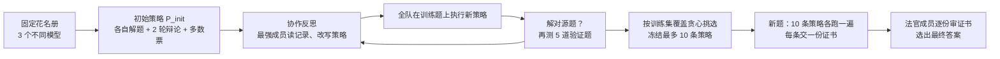

# SAT：不换模型、不切子任务，让一支固定的 Agent 队伍学会一起想

<!-- release-date: 2026-09-19 -->

> 本文依据 Stanford University、Together AI 与 Emory University 作者合写的 **Self-Organizing Agent Teams Learn to Reason Together**，即 arXiv:2609.22682v1（2026-09-19），共 30 页。页码均指这份 PDF。全文把三件事分开标注：**报告明确写了什么**、**我们如何解释或验算它**、**哪些是外部资料补充**。

## 读前先把几个词说成人话

这篇论文的难点不在公式，而在它换了一把尺子。以往的多智能体论文拿「团队最强的那个成员」当对照，这篇换成了「从成员各自答案里完美挑一个」的上界。后面所有表格都踩在这把新尺子上。

先把会反复出现的词说清楚：

- **Agent（智能体）**：这里就是一个被提示词驱动、能读别人发言再回话的大模型。论文每支队伍固定 3 个不同厂商的模型（PDF p. 3–4）。
- **Roster（花名册）**：队伍里有哪几个模型。花名册是固定的，学习过程中不换人，也不改任何权重（PDF p. 5）。
- **Teamwork strategy（协作策略）**：一份写给整支队伍的「开会流程」。它规定分几个阶段、每段谁参加、说几轮、谁扮演什么角色、讨论结果要不要广播给所有人。论文要学的就是这个东西（PDF p. 5）。
- **Strategy bank（策略库）**：学完后冻结的一组策略，最多 10 条。测试时对每道新题把 10 条都跑一遍（PDF p. 6）。
- **Teamwork reflection（协作反思）**：队伍里训练集上最强的那个成员，读过去的讨论记录和结果，提出对策略的改写。它是整个学习过程的「驱动者」（PDF p. 5）。
- **Certificate（证书）**：每条策略跑完后交出的一段简短、自洽、能逐步检查的推理过程，而不只是一个最终答案（PDF p. 6）。
- **Judge（法官）**：部署时读完全部证书、挑出最终答案的那个成员。它被要求只审证书，不自己解题（PDF p. 6、p. 29）。
- **Routing oracle（路由上界）**：对每道题，只要 3 个成员里有一个独立答对，就算对。它等于一个「永远选对人」的完美路由器能拿到的分数（PDF p. 3）。
- **Collaborative computation（协作计算）**：论文自己起的名字。成员互相交换、质疑、修补、综合彼此的半成品推理，最后得到一个没有任何成员单独给出过的正确答案（PDF p. 1–3）。
- **Demonstrability（可证明性）**：组织心理学里的概念，指「对的推理摆出来之后，别人能不能认出它是对的」（PDF p. 4、p. 11）。

论文把自己放在 GEPA 一篇所属的「用反思搜索来优化非权重产物」这条线上（PDF p. 13），但优化的对象换成了多个模型之间怎么开会。ADAS 一篇（Meta Agent Search）被论文归为另一类：在 agent 代码层面做元搜索（PDF p. 13）。

论文要回答的问题可以压成一句：

> 一支成员固定、谁都不能单独解出题的模型队伍，能不能从自己过去的合作里学会「怎么开会」，并且让这套开法原样迁移到没见过的题和 benchmark 上？

## 一句话先说清

以往的多智能体方法有两个家族（PDF p. 2）：

1. **以候选答案为单位**：辩论（Debate）和 Mixture of Agents（MoA，多智能体混合）先让每个模型各写一份答案，再互相看、再投票或汇总。问题是它的大部分增益，可以靠「从初始答案里挑」复现；多轮辩论还会把对的少数派压下去（PDF p. 2、p. 12）。
2. **以子任务为单位**：工作流搜索、学习式路由、拓扑优化，把题目先切成子任务再分给不同 agent。问题是它要求题目本身能被事先切开（PDF p. 2）。

SAT（Self-Organizing Agent Teams，自组织智能体团队）走第三条路：**不切题，只规定怎么开会**。策略管的是角色、会议阶段、谁参加、信息怎么流、最后怎么综合；具体这道题该怎么分工，由开会时现场长出来（PDF p. 2、p. 5）。

论文给出的硬结论（PDF p. 1、p. 4、p. 7–9）：

- 数学与物理队（o3-mini、Claude Sonnet 4、DeepSeek-V3）只用 15 道 AIME 2024 题学策略，5 个 benchmark 平均准确率 66.7%；最强成员 48.8%，同预算单模型「线性化」对照 58.7%，路由上界 59.0%（PDF p. 1、p. 8）。
- 在 AIME 2026 上，团队 71.2%，比路由上界高 13.4 个百分点（PDF p. 1、p. 8）。
- 知识与逻辑队（Gemini-2.5-Flash、Llama-4-Maverick、GPT-4.1）只用 25 道 GPQA Diamond 题学策略，3 个 benchmark 平均 72.8%，是所有方法里最高的，但仍低于路由上界的 79.6%（PDF p. 4、p. 9）。
- 8 个 benchmark 上，「可证明性」与「团队比最强成员涨了多少」的秩相关是 Spearman ρ = 0.90，p = 0.005（PDF p. 1、p. 11）。

对想搭多 agent 系统的人来说，要带走的不是某个分数，而是一个拆法：**协作的价值 = 生成出对的推理 × 认出对的推理**。SAT 把前一项做得很好，后一项在知识题上还没做好。

### 一条阅读路线

如果只有半小时读原文，建议按这个顺序：

1. **p. 3 的 routing oracle 定义**：先弄清为什么「超过最强成员」不够，要「超过完美路由」。
2. **p. 5 的 2.1 节**：策略的形式化定义，一个策略就是一串「会议阶段」。
3. **p. 5–6 的 2.2 节与 Figure 3**：怎么离线学、怎么防泄漏、怎么部署。
4. **p. 8 Table 1、p. 9 Table 2**：两支队伍的全部对照，注意灰底的两行是「覆盖率」不是准确率。
5. **p. 10 Figure 5、p. 27 Figure 10**：两个具体案例，看「修补」到底长什么样。
6. **p. 11 Figure 6 与 p. 30 Table 5–6**：可证明性分析。
7. **p. 18–24 附录 A**：两个冻结策略库的全文，逐字转录，是理解「学到了什么」的一手材料。

## 主要矛盾：多智能体的增益，常常只是「从几个答案里挑一个」

先讲一个会让很多多智能体论文不太舒服的事实。

假设 3 个模型各做一套题。模型 A 会做第 1–10 题，模型 B 会做第 5–15 题，模型 C 会做第 12–20 题。每个模型单独只能拿一半分，但只要有个「裁判」每道题都挑对人，团队就能拿满分。这时团队「超过最强成员」，其实什么新推理都没发生，只是挑对了。

论文指出，以往的多智能体工作基本都拿「平均分最高的成员」当对照（PDF p. 3）。超过它，并不能说明协作「创造」了正确答案，因为不同成员本来就会做不同的题（PDF p. 3）。辩论文献里已经有这类证据：多数票投初始答案，就能解释辩论的大部分增益；辩论本身不提高期望正确率（PDF p. 12，引 Choi 等人 2025）。

组织心理学里有一个更严格的基准，叫 **truth-wins（真理胜出）**：只要团队里有一个人独立解对，就把整个团队算作对（PDF p. 3，引 Lorge & Solomon 1955、Laughlin & Ellis 1986）。论文把它搬过来，定义成 **routing oracle**：每道题都完美地选中答对的那个成员（PDF p. 3）。

于是矛盾变成：

> 如果团队的准确率超过了 routing oracle，就说明至少有一些题，3 个成员单独都没做对，团队却做对了。这部分正确答案不可能来自「挑选」，只能来自「交互」本身。

这就是论文三道逐级收紧的门槛（PDF p. 3）：

1. 能不能超过最强成员？
2. 能不能超过同等推理预算的单模型？包括让最强成员一个人按同一套策略把所有角色串行演一遍的「线性化」对照。
3. 最要紧的：能不能超过完美路由？

## 先看全景：学的是开会流程，不是模型也不是子任务

Figure 2 用一道小题把循环讲得很清楚（PDF p. 3）。题目是「000–999 的 PIN 码里有多少个含 7」。Claude Sonnet 4 先给出 $3 \times 100 = 300$（我们注：这是重复计数的错答）；DeepSeek-V3 说情况太复杂，建议数补集；o3-mini 照做，$1000 - 9^3 = 271$，答对。随后 o3-mini 反思：DeepSeek 的挑战才是关键，而好方法容易被共识淹没。于是新策略里专门加了一步「挑战 + 替代方法」，指定由 DeepSeek-V3 来做。原图注明这段对话与角色分配只是示意（PDF p. 3）。

把整套系统按论文的叙事重画一遍：

这张图根据 PDF p. 5–6 的 2.2 节与 Figure 3 重画，是流程示意，不是原图。

两件事要先记住：

- **学习完全离线**。策略库在见到任何测试题之前就冻结了，测试时没有控制器、没有再反思（PDF p. 2、p. 7）。
- **学到的东西不包含题目分解**。策略只规定会议结构，不规定「这道题拆成哪几个子问题」（PDF p. 2、p. 5）。

## 核心设计一：把「怎么开会」写成一门小语言

### 旧问题：协作流程要么手写，要么绑死在具体题目上

辩论、MoA 的流程是人手写死的；工作流搜索学到的东西又往往是「这道题分给谁做哪步」。想让协作方式本身可以被优化、又能跨题复用，得先有一种描述它的语言。

### 新设计：一个策略就是一串会议阶段

论文把策略写成一个三元组（PDF p. 5）：

$$
P = (S,\ \tau,\ \alpha)
$$

其中：

- $S = [s_1, \dots, s_K]$ 是有序的沟通步骤；
- $\tau$ 是给全队的共享协作提示，写团队规范；
- $\alpha = \{\alpha_i\}_{i=1}^{n}$ 是每个成员的常驻角色提示，贯穿所有步骤。

每一步再拆成五个字段（PDF p. 5）：

$$
s_k = (A_k,\ r_k,\ f_k,\ \pi_k,\ \rho_k)
$$

按人话读：

- $A_k$：这一段谁参加，是花名册 $A$ 的子集；
- $r_k$：讨论几轮；
- $f_k$：信息流模式，只有两种。**L（local，本地）** 是只有参会者看得到这段讨论；**S（summary，摘要广播）** 是讨论照样只在参会者之间进行，但结束后随机挑一名参会者写一段摘要（要点、结论、当前答案），加进每个成员的上下文；
- $\pi_k$：这一段给全体参会者的共享提示；
- $\rho_k$：可选的、给个别参会者的专属提示。

每一轮里，每个参会者按策略规定的顺序（没规定就随机）各发言一次（PDF p. 5）。

所以一个「步骤」就是一个 **会议阶段**：一群 agent 在共享指令和常驻角色下读彼此、回应彼此。论文把它定为优化的最小单位（PDF p. 5）。搜索改变的是谁参与、何时参与、带着什么信息、扮演什么角色；它不给具体子任务分派输出，也不在测试时为每道题生成分解（PDF p. 5）。

### 一个真实学到的例子

论文举的是 GPQA 库里的 `final_auditor_claim_recovery`（PDF p. 5、p. 22–23）。三位成员先各自独立解题并共享，然后跑 4 个单轮阶段：

1. 各自列出关键论断和假设；
2. 形成临时共识，同时记下没解决的分歧；
3. Gemini-2.5-Flash 作为「最终审计员」，拿共识回头对照最初的各份解答，把被忽略但证据充分的论断重新摆上桌。这一段是全库唯一用 S 模式的阶段：阶段结束后，随机一名参会者把要点、结论和当前答案写成摘要，加进每个成员的上下文（PDF p. 5、p. 22）；
4. 全员逐条裁决这些论断，要么并入、要么给出科学反驳。

**我们如何解释它。** 这个语言故意很「窄」。它只有 5 个旋钮，没有循环、没有条件分支、没有工具调用。好处是：搜索空间小，反思模型提出的改写容易执行，也容易检查有没有夹带题目内容。代价是：像「如果大家一致就额外质疑一次」这种条件逻辑，只能写进自然语言提示里让模型自己执行，语言本身不保证它发生。

### 可迁移启发

想让一个多 agent 系统的协作方式可学习，先给它定一个最小可优化单元。这里的单元是「会议阶段」，比「一次模型调用」粗，比「整条工作流」细。粒度选对了，反思模型才提得出有针对性的改写，改写后的东西也才能跨题复用。

## 核心设计二：让最强成员当教练，离线学出策略库

### 旧问题：谁来改策略，凭什么改

提示词优化已经有 GEPA 这类反思式进化方法（见 GEPA 一篇）。但 GEPA 优化的是单个模型的提示词，挑父代的方式是从逐实例的 Pareto 前沿里随机抽（PDF p. 6）。多模型协作的问题不同：失败往往不是某个模型「不会」，而是「会的那个人被多数压下去了」。这种失败只能从讨论记录里看出来。

### 新设计：一个成员读记录、挑父代、提变异

学习分三段：协作反思、建库、部署（PDF p. 5）。

**起点。** 进化搜索从初始策略 $P_{\text{init}}$ 开始：各自独立解题，两轮类似辩论的交换，最后对末轮答案多数投票；没有严格多数就随机挑一个成员的答案。它没有协作提示、没有角色、没有学到的阶段指令（PDF p. 5、p. 24）。

**谁当教练。** 训练集上准确率最高的那个成员：数学队是 o3-mini，知识队是 Gemini-2.5-Flash（PDF p. 5）。反思时模型身份是匿名的，只以 Agent 0/1/2 出现（PDF p. 6）。

**每道训练题一个档案。** 对每道训练题 $s$，维护一个档案 $H_s$，里面存候选策略和全队执行它们的记录（PDF p. 5）。教练读这些内容：以前的策略、团队对话记录、每个成员的答案、团队结果、验证题成绩。然后它自己决定从哪条旧策略出发，并对角色、阶段、综合规则提出有针对性的变异（PDF p. 5）。

**预算。** 每道训练题跑 6 轮变异，每轮教练最多提 3 个候选（PDF p. 5）。

**我们验算的上限。** 数学队 15 题 × 6 轮 × 3 个候选，最多 270 次候选执行；知识队 25 题，最多 450 次。再加上验证题的执行。论文没有报告实际执行次数、token 数或花费。

**验证题。** 一个变异如果解对了自己的源题，就冻住，拿去测另外 5 道训练题，称为 validation probes（验证题）。结果写回档案，指导后面的变异（PDF p. 5–6）。

**建库。** 反思结束后，按训练集表现贪心挑选，冻结一个最多 10 条、彼此互补的策略库（PDF p. 6）。Figure 3 把这一步称为 coverage-greedy（按覆盖贪心）（PDF p. 6）。

### Figure 3（b）：一条角色是怎么被「学」出来的

这是全文最能说明「反思在干什么」的一张图（PDF p. 6）。三段摘录是逐字引用、略有删节：

1. **诊断失败**：教练看到「交叉训练表现退步」「个人正确答案因团队动态而丢失」；
2. **找到成员证据**：「利用观察到的 Agent 2 作为审计员 / 挑战者的长处」；
3. **长处变角色**：「Agent 2 作为指定的最终审计员，必须审阅……所有个人尝试」，并「找出并重新提出……被忽略的论断」。

图注写明 Agent 2 就是 Gemini-2.5-Flash，也就是教练自己（PDF p. 6）。由此得到的 `final_auditor_claim_recovery` 解对了源题和全部 5 道验证题，最终入库（PDF p. 6）。

**我们如何解释它。** 教练是匿名看记录的，却把「审计员」的角色派给了自己所在的那个槽位。论文没有讨论这是否带有自我偏好，只是如实报告了身份。读者可以把它当作一个值得留意的细节，不宜过度解读。

### 防泄漏：两道闸

从一道题里学出来的策略，很容易偷偷记住「这道题答案是 204」或「这道题要用容斥」。论文用两个机制把题目内容挡在策略外面（PDF p. 6）：

1. **语义源依赖审计**：另起一个与教练同型号的实例，逐字段检查每个候选策略，排除编码了答案值、题目特有事实或配置、或源题解法配方的候选；
2. **验证题奖励迁移**：只对源题有用的策略不增加跨题覆盖，在按覆盖贪心建库时更难存活。

附录 A 还补了一句：没有任何阶段、角色或协作提示点名测试题（PDF p. 18）。

**我们如何解释它。** 第一道闸是「模型审模型」，没有给出误判率。第二道闸是统计性的，只是让题目专属策略「更难」存活，而不是「不能」存活。两道闸合起来是合理的工程防线，不是形式保证。

### 可迁移启发

1. **让系统里最会做题的成员来改流程**，并且给它看完整的讨论记录，不只看分数。失败的根因常常写在对话里：谁说对了、谁没被听见。
2. **把「解对源题」和「迁移到别的题」分开评估**。先过源题这一关，再上 5 道验证题，是一种很便宜的过拟合检测。
3. **建库时按覆盖贪心，而不是按平均分排序取前 10**。互补的策略放进一个池子，才有「总有一条能做对」的效果。

## 核心设计三：部署时跑全库，再由一名法官审证书

### 新设计：生成与选择分开

对一道没见过的题，把库里每条策略都跑一遍，得到一池候选解，每个候选附一份证书（PDF p. 6）。然后由一个法官一次性读完题目和全部证书，逐份找局部缺陷，**不自己解题**，选出书面支撑最强的答案（PDF p. 6）。法官仍是训练集最强的成员：数学队 o3-mini，知识队 Gemini-2.5-Flash（PDF p. 6）。

法官提示词全文在附录 D.1（PDF p. 29–30），有几条规则值得逐条看：

- 不许自己解题，不许因为某答案和自己的直觉相符或相悖就选或拒它；
- 只能评判证书质量：关键步骤是否写下且可局部检查、算术是否按写的那样正确、分类讨论是否完整、最后一步是否由前面推得；
- 拒绝或降级一个候选时，**必须点名一个具体局部缺陷**。「我觉得答案不一样」「它和另一份推导冲突」都不算缺陷；
- 审计阶段不许看答案出现的频率；
- 两阶段严格按顺序：先给每一份写审计，再比较决定。若多份都没有缺陷，**强制**从这些无缺陷候选里选最常见的答案；频率也并列时，才看谁的支撑最完整。

由此自然引出两个指标（PDF p. 6–7）：

- **team coverage（团队覆盖率）**：池子里至少有一份答对的题目比例；
- **team accuracy（团队准确率）**：法官选完后答对的比例。

两者之差，就是「生成出来了但没选中」的损失。

### 可迁移启发

**把「审」和「解」分开写进法官的提示里**，并且要求「拒绝必须点名缺陷」。这等于把法官从「另一个投票者」变成「代码审查员」：它不再用自己的答案去否决别人，只能指出具体哪一步错了。多数票只在无缺陷候选之间当平局规则，而不是主规则。

## 学到的策略长什么样

Figure 4 挑了数学库里两条性格很不一样的策略（PDF p. 9–10）：

- **按题自适应的方法多样化**（`problem_adaptive_method_diversification`）：成员依次提出适合本题、且与前面不同的方法，再把方法分给不同成员推下去，最后比较、修补、综合。策略原样迁移，而具体用代数、几何还是枚举由题目和成员提议决定（PDF p. 9–10、p. 19）；
- **分歧调和**（`divergence_reconciliation`）：来自对 DeepSeek 行为的观察。它的替代推导有时能抓到别人漏掉的情况，但也可能带错。于是策略保留 DeepSeek 作为多样性来源，同时让 o3-mini 和 Claude 独立复核它有争议的推理，**这一段 DeepSeek 不参加**。复核通过就并入，仍不一致就降权（PDF p. 9–10、p. 18–19）。

附录 A 逐字转录了两个库的全部 20 条策略（PDF p. 18–24）。下面按我们的归纳列出，名字照原文：

| 库 | 策略 | 一句话 |
|---|---|---|
| AIME 2024 | `mechanistic_step_audit` | 逐步审计推导链，每人挑别人一步判为已验证、可疑或错误 |
| AIME 2024 | `weighted_derivation_consensus` | 独立重算争议步骤，持续偏离的 Agent 2 降权 |
| AIME 2024 | `minority_reasoning_challenge` | 指定异议者，专挑可能压掉正确少数派的综合步骤 |
| AIME 2024 | `divergence_reconciliation` | 持续分歧的推导交给另两人独立复核，调和或降权 |
| AIME 2024 | `backward_constraint_validation` | 先推答案必须满足的条件，再把候选答案倒过来验 |
| AIME 2024 | `constraint_inventory_then_solve` | 先列约束清单，再用清单审候选 |
| AIME 2024 | `independent_solve_then_synthesis` | 比较独立解、指出分歧、综合 |
| AIME 2024 | `problem_adaptive_method_diversification` | 分派不同方法各自推到底，再比较 |
| AIME 2024 | `suspicious_consensus_challenger` | 一旦过早一致，Agent 2 专门找失败模式 |
| AIME 2024 | `component_recombination_validation` | 算出关键量后反推各组成部分，验证能拼回原约束 |
| GPQA Diamond | `constructive_challenge_and_preservation` | 挑战者必须给出修补或替代解释，并为证据充分的个人解辩护 |
| GPQA Diamond | `option_aware_claim_critique` | 互相质疑科学论断，并结合选项判断弱点是否影响选择 |
| GPQA Diamond | `discrepancy_and_contradiction_audit` | 指定审计员找各解之间的矛盾和漏掉的约束 |
| GPQA Diamond | `provisional_consensus_cross_validation` | 临时共识 + 交叉验证 + 倒推检验 + 最终假设审计 |
| GPQA Diamond | `neglected_effects_challenge` | 挑战者定量检验被当作可忽略的物理效应 |
| GPQA Diamond | `final_auditor_claim_recovery` | 最终审计员把被忽略的论断捞回来裁决 |
| GPQA Diamond | `option_conditions_and_absence_audit` | 为每个选项列必要条件，重审「因缺少某信号」而排除的选项 |
| GPQA Diamond | `corrective_step_audit` | 审计具体论断、提出并承认更正、保留被验证的少数派证据 |
| GPQA Diamond | `precision_matched_effects_audit` | 按区分选项所需的精度量化次级效应，选数值最接近的选项 |
| GPQA Diamond | `minority_evidence_adjudication` | 指定裁决者逐条裁决偏离共识的论断 |

两个库里的 Agent 0/1/2 对应不同模型：AIME 库是 o3-mini、Claude Sonnet 4、DeepSeek-V3；GPQA 库是 Llama-4-Maverick、GPT-4.1、Gemini-2.5-Flash（PDF p. 18）。

**我们数出来的几个结构特征**（按附录 A 的记号逐条统计，PDF p. 18–24）：

- 20 条策略共 61 个阶段，**每个阶段都只有 1 轮**（$r_k = 1$）。学到的结构靠「多阶段」而不是「多轮」；
- 61 个阶段里只有 1 个用 S 模式，就是 `final_auditor_claim_recovery` 的第 3 段；其余全是 L；
- 只有 2 个阶段缩小了参会者：分歧调和第 2 段只有 {0, 1}，矛盾审计第 2 段只有 {2}；
- AIME 库 10 条里只有 1 条设了常驻角色；GPQA 库 10 条里有 5 条设了常驻角色，而且都落在 Agent 2（Gemini-2.5-Flash）上。

**我们如何解释它。** 两个库的主题惊人一致：保护少数派、审计具体步骤、质疑过早的共识。这恰好是对 $P_{\text{init}}$（多数票）最直接的纠偏。换句话说，搜索学到的主要是「别让投票把对的人淹掉」。另外，DSL 里给了轮数和广播两个旋钮，搜索几乎没用；有效的自由度集中在阶段顺序、阶段提示和角色上。这是我们从附录统计得出的观察，论文没有这样总结。

附录 Figure 8 还展示了两条在早期搜索中出现、但没进任何最终库的策略：强制角色互换（先盲投，再每人为别人的答案辩护，最后解除角色重投）与重叠两两验证（A+B → B+C → A+C 依次互验，发现缺陷就全队重解）（PDF p. 24–25）。它们说明搜索空间比最终库展示的更宽。

### 可迁移启发

1. **模型特有的长短处可以写进协作结构**。分歧调和就是一条「DeepSeek 专用」的规则：保留它的发散，但在复核环节把它请出去。
2. **把一次性的失败诊断沉淀成常驻角色**。「最终审计员」角色的来源，是教练在记录里看到「个人正确答案被团队动态吃掉」。

## 实验怎么设计：对照组各自排除一种解释

两支队伍、两套 benchmark，彼此独立学习（PDF p. 7）：

| 队伍 | 成员 | 教练兼法官 | 学习数据 | 评测 |
|---|---|---|---|---|
| 数学与物理 | o3-mini、Claude Sonnet 4、DeepSeek-V3 | o3-mini | AIME 2024 训练切分 15 题 | AIME 2024 不相交测试切分；迁移到 AIME 2025、AIME 2026、HMMT 2026 年 2 月赛、TheoremQA-physics |
| 知识与逻辑 | Gemini-2.5-Flash、Llama-4-Maverick、GPT-4.1 | Gemini-2.5-Flash | GPQA Diamond 训练切分 25 题 | GPQA Diamond 不相交 100 题；迁移到 MMLU-Pro 100 题、BBEH 5 个逻辑推理子任务共 75 题 |

来源：PDF p. 7。作者说他们**故意挑了不是最强的模型**，因为更强的模型会把好几个 benchmark 做饱和，看不出协作带来的增益（PDF p. 4）。

对照组按「要排除哪种解释」来设（PDF p. 7）：

| 对照 | 它要排除的解释 |
|---|---|
| 最强成员 | 协作是否超过最强的单个成员 |
| Routing oracle | 增益是否只是「挑对人」 |
| Self-consistency，K = 10 | 候选数量与策略库对齐，排除「多采样」的解释（温度 0.5，PDF p. 29） |
| 5 轮 self-reflection | 排除「单模型多想几遍」的解释 |
| 成员投票、3 轮辩论、MoA | 排除「标准的汇总或辩论框架就够了」 |
| 同质团队 | 最强成员复制 3 份跑同一套冻结策略，隔离「模型多样性」的贡献 |
| 线性化 | 最强成员一个人按顺序扮演每条策略的所有角色和阶段，总推理预算与团队大致相当；排除「结构本身就够、不需要多个模型」 |

带 ‡ 的几行（self-consistency、self-reflection、线性化、同质团队）是论文标出的算力对照（PDF p. 8–9）。self-consistency 与 self-reflection 在每个 benchmark 上用该 benchmark 单次独立评测最强的成员（PDF p. 8、p. 29）；线性化与同质团队则固定用源 benchmark 训练集上最强的成员（PDF p. 7）。所有结果都是 3 个种子的均值（PDF p. 8–9）。

**要注意一件事。** 线性化超不过团队，既可能是因为「多个模型真的在交互」，也可能只是因为「多个不同模型的知识更全」。论文自己也写明，对线性化的优势可能同时反映两者（PDF p. 7）。

## 数学与物理：越过路由上界

原文 Table 1（PDF p. 8）：

| 方法 | AIME24（分布内） | AIME25 | AIME26 | HMMT26 | TQA-phys | 平均 |
|---|---:|---:|---:|---:|---:|---:|
| 最强成员 | 64.4 | 40.0 | 42.2 | 26.3 | 71.1 | 48.8 |
| Self-consistency（K = 10）‡ | 75.8 | 44.4 | 53.4 | 31.9 | 71.5 | 55.4 |
| Self-reflection ‡ | 71.1 | 41.1 | 52.2 | 29.3 | 72.2 | 53.2 |
| 线性化（o3-mini）‡ | 74.0 | 43.3 | 68.5 | **39.4** | 68.4 | 58.7 |
| 成员投票 | 60.7 | 38.5 | 40.9 | 25.3 | 71.3 | 47.3 |
| 辩论 | 66.7 | 41.1 | 53.3 | 30.3 | 72.2 | 52.7 |
| Mixture of Agents | 75.6 | 46.7 | 57.8 | 32.3 | 74.0 | 57.3 |
| 同质团队（o3-mini）‡ | 66.7 | 46.7 | 60.0 | 36.4 | 70.2 | 56.0 |
| **SAT** | **84.7** | **60.8** | **71.2** | **39.4** | **77.2** | **66.7** |
| 路由上界覆盖率 | 73.3 | 51.1 | 57.8 | 36.4 | 76.6 | 59.0 |
| SAT 覆盖率 | 93.3 | 73.3 | 73.3 | 54.5 | 81.6 | 75.2 |

数值均为百分比；加粗是每列准确率最高者（含并列）；最后两行是「完美挑选」的覆盖率，不是准确率（PDF p. 8）。

论文自己的读法（PDF p. 7–8）：

- 分布内的 AIME 2024 测试切分上，SAT 84.7%，比 o3-mini 高 20.3 个百分点，超过所有单模型和多模型对照（PDF p. 7）；
- 迁移到 AIME 2025：60.8%，最强成员 40.0%，线性化 43.3%，比路由上界高 9.7 个百分点（PDF p. 8）；
- AIME 2026：71.2%，比最强成员高 29.0，比路由上界高 13.4（PDF p. 8）；
- 更难的 HMMT 2026：团队与线性化打平，都是 39.4%，最强成员 26.3%（PDF p. 8）；
- 跨出竞赛数学到 TheoremQA-physics：77.2%，最强成员 71.1%，MoA 74.0%（PDF p. 8）；
- 同质团队平均 56.0%，说明学到的交互结构利用了模型之间的差异（PDF p. 7）。

**我们如何读这张表。** 用表里的数字，我们逐列算了 SAT 准确率减路由上界：AIME24 +11.4，AIME25 +9.7，AIME26 +13.4，HMMT26 +3.0，TQA-phys +0.6。所以「超过路由上界」主要是 AIME 三年撑起来的。HMMT 与 TheoremQA-physics 上的差距很小，而 TheoremQA-physics 那 0.6 分在 3 个种子均值下是否稳定，论文没有给方差或置信区间，无从判断。

**外部补充（不是 PDF 原文）。** AIME 每年两场共 30 题。按这个规模，一道题约等于 3.3 个百分点；论文没有写 AIME 2024 测试切分、AIME 2025/2026、HMMT 与 TheoremQA-physics 各自的题数。

**线性化那一格值得停一下。** AIME 2026 上线性化 68.5%，已经很接近 SAT 的 71.2%；HMMT 上两者打平。也就是说，在这两个 benchmark 上，「按学到的结构让一个模型自己演完所有角色」已经吃到了大部分增益。真正拉开差距的是 AIME 2024（74.0 对 84.7）和 AIME 2025（43.3 对 60.8）（PDF p. 8）。这提醒读者：学到的结构本身就有很大价值，多模型交互是在这之上的加成，不是全部。

### 生成与选择的分账

数学队的池子平均覆盖率 75.2%，路由上界 59.0%，而且 5 个 benchmark 上池子覆盖率都更高（PDF p. 9）。这说明交互确实在池子里产生了成员各自答案里没有的正确证书（PDF p. 9）。法官最后从中选出 66.7%，也高于路由上界（PDF p. 10）。

我们用表里的数字算了每列「覆盖率减准确率」，即选择损失：AIME24 8.6，AIME25 12.5，AIME26 2.1，HMMT26 15.1，TQA-phys 4.4。AIME 2026 上池子里只要有对的，法官几乎都选中了；HMMT 上丢得最多。

### 一个具体案例：谁都没答对的题，团队答对了

附录 Figure 9 给了展开的对话（PDF p. 26）：

1. o3-mini 指出对每个素数 $p$，排好序的指数列表是不变量，所以第 $k$ 小的数等于 $\prod_p p^{E_k(p)}$，并用 $\lfloor 2100/p^m \rfloor - \lfloor 2100/p^{m+1} \rfloor$ 计数；
2. o3-mini 给出分解 $2^4 \cdot 3^3 \cdot 5^2 \cdot 7 \cdot 11 \cdot 13 \cdot 17 \cdot 19 \cdot 23$，但把指数为 1 的素数数成 5 个；
3. DeepSeek-V3 指出是 6 个（7、11、13、17、19、23），于是除数个数 $\tau(N) = 5 \cdot 4 \cdot 3 \cdot 2^6 = 3840$；
4. Claude Sonnet 4 独立核对 $p = 2$ 的计数，确认 3840；
5. o3-mini 综合，最终答案 3840。

这就是论文所说的协作计算：o3-mini 贡献了关键思路但算错一步，DeepSeek 修好这一步，Claude 审计，没有任何人单独给出过这个答案（PDF p. 9–10、p. 26）。

**我们验算过**：$5 \times 4 \times 3 \times 64 = 3840$，与原文一致。

## 知识与逻辑：生成出来了，却没选中

原文 Table 2（PDF p. 9）：

| 方法 | GPQA（分布内） | MMLU-Pro | BBEH | 平均 |
|---|---:|---:|---:|---:|
| 最强成员 | 72.7 | 79.7 | 45.3 | 65.9 |
| Self-consistency（K = 10）‡ | 71.6 | 81.2 | 49.8 | 67.5 |
| Self-reflection ‡ | 77.7 | 81.7 | 54.7 | 71.4 |
| 线性化（Gemini-2.5-Flash）‡ | 79.0 | 84.0 | 53.3 | 72.1 |
| 成员投票 | 67.0 | 79.9 | 43.6 | 63.5 |
| 辩论 | 73.7 | 79.7 | 57.3 | 70.2 |
| Mixture of Agents | 72.0 | **84.3** | 57.3 | 71.2 |
| 同质团队（Gemini-2.5-Flash）‡ | 78.0 | 76.0 | **58.7** | 70.9 |
| **SAT** | **80.0** | 82.4 | 56.0 | **72.8** |
| 路由上界覆盖率 | 84.0 | 88.0 | 66.7 | 79.6 |
| SAT 覆盖率 | 94.0 | 91.0 | 78.7 | 87.9 |

数值均为百分比，记号同 Table 1（PDF p. 9）。

论文的读法（PDF p. 8–10）：

- SAT 平均 72.8%，是所有方法最高；线性化 72.1%，MoA 71.2%，同质团队 70.9%，辩论 70.2%，最强成员 65.9%（PDF p. 8）；
- SAT 只在 GPQA 上第一；MMLU-Pro 上输给 MoA（82.4 对 84.3）；BBEH 上同质团队领先（58.7），辩论和 MoA 并列 57.3，SAT 56.0（PDF p. 8）；
- 池子平均覆盖率 87.9%，3 个 benchmark 上都高于路由上界；但法官选完只剩 72.8%，低于路由上界的 79.6%（PDF p. 10）。

**我们如何读这张表。** 这一队的故事和数学队正好相反。生成这一侧做得很好：池子覆盖率比路由上界高 8.3 个点（我们用 87.9 减 79.6 算得）。选择这一侧却把优势全丢了：我们逐列算得选择损失 GPQA 14.0、MMLU-Pro 8.6、BBEH 22.7。平均准确率虽然第一，但领先线性化只有 0.7 个点；3 个 benchmark 里，SAT 只在 GPQA 一列是所有方法中最高的。论文自己把这写成主要限制：更丰富的生成不保证正确的选择（PDF p. 14）。

所以协作计算其实有两个问题：**把对的推理造出来**，以及**在它出现后认出它**（PDF p. 4）。

## 案例：辩论为什么会把对的少数派吞掉

Figure 7 是结构示意（PDF p. 12）：辩论每轮所有人对称地交换，最后投票；MoA 是单向的「提案 → 汇总」；学到的策略可以让不同阶段参会者不同、保持常驻角色，并回头修补早先的推理。

Figure 10 用同一道化学题、同一组三个模型，对比三种方法（PDF p. 27）：

- **MoA**：提案 D/D/C。汇总者 Gemini 认为「两条路径得到同一个苯炔中间体」，又在产物里错误保留氘，只数了 2-氘代苯胺和 3-氘代苯胺，漏掉苯胺，答 D（两种）；
- **三轮辩论**：第 1 轮 D/B/D，正确答案 B 起初是少数派（GPT）。第 2 轮 GPT 看了别人的回答，接受了「由于对称或快速交换，两端进攻得同一产物」的说法，改成 D。多数错答变成全票错答，GPT 最初的 B 丢了；
- **SAT**：初始 D/A/D，三个都错。学到的规则要求每人审计一个具体的同伴论断并提出更正。Gemini 质疑 Llama 的「同一苯炔中间体」：去掉 C2 上的 D 得到 C1–C2 苯炔（不含 D），去掉 C6 上的 H 得到 C1–C6 苯炔（保留 D），是两个不同中间体。第二条规则要求承认更正、解释最初错误。Gemini 也修正了自己「氘在被拔掉后还留着」的假设。综合得到：去 D 得苯胺，去 H 得 2- 和 3-氘代苯胺，共三种，答 B。这个答案不在任何初始回答里（PDF p. 27）。

附录还有两个 AIME 2026 的案例（PDF p. 28）：

- **II-08**（正确答案 245，初始输出 028/049/无法解析）：o3-mini 按策略要求做整数检查，发现 $AI = 2\sqrt{49/100} = 1.4$ 不是整数，指出缺口；Claude 把这个失败的检查变成「$b$ 必须被 10 整除」的构造条件，得到 245；DeepSeek 验证最小性。
- **II-01**（正确答案 178，初始 032/178/032）：两个成员犯了同一个可局部检查的错，把公差为负的情形算了进来；Claude 的步骤审计指出这要求负的项号，两名答错的成员随之修改。投票会丢掉的那个唯一正确答案被保住了。

**我们如何解释它。** 这几个案例共同指向一个机制：辩论让成员读「别人的完整回答」，信息是整块传递的，容易被多数的说法整体带走；SAT 的策略要求针对「一个具体论断」发起质疑并给出修补，信息是逐条传递的。逐条质疑让一个小而关键的错误无处藏身。这些是论文挑出来的正面案例，论文没有统计失败案例的比例，也没有给出团队把对的答案改错的例子数量。

## 什么时候组织最值钱：可证明性

### 问题：为什么增益在不同 benchmark 上差这么多

AIME 2026 涨了 29.0 个点，MMLU-Pro 只涨了 2.7 个点（PDF p. 30）。论文借组织心理学的「可证明性」来解释：对的推理摆出来之后，别人能不能分辨出它是对的（PDF p. 11）。

### 怎么量

论文把可证明性操作化为 **团队证书的可区分度**（PDF p. 11）：

1. 对每道合格的题，取一份对的团队证书和一份错的团队证书；
2. 去掉对错标签，按平衡的 A/B 顺序，交给 10 个评审模型组成的小组；这些模型都不在任何一支参赛队伍里；
3. 看评审选中正确证书的频率，对顺序、题目、评审求平均，得到每个 benchmark 一个分数；
4. 只纳入「至少有 10 道题同时含有对的和错的团队证书」的 benchmark，共 8 个。

10 个评审模型是：Gemma 3 4B IT、GPT-3.5 Turbo、GPT-4.1 Nano、Command R7B、Claude 3 Haiku、Llama 3.1 8B Instruct、Gemma 3 12B IT、Mistral Small 3.2 24B Instruct、Gemma 3n E4B IT、Qwen 2.5 7B Instruct（PDF p. 30）。论文强调，这不是形式验证器，不认证单个答案，只是一个柔性的、benchmark 级别的「可验证性」（PDF p. 11）。

原文 Table 5（PDF p. 30）：

| Benchmark | 可证明性 | 比最强成员提升（百分点） |
|---|---:|---:|
| AIME 2024 | 0.550 | 20.3 |
| AIME 2025 | 0.559 | 20.8 |
| AIME 2026 | 0.687 | 29.0 |
| HMMT 2026 | 0.519 | 13.1 |
| TheoremQA-physics | 0.423 | 6.1 |
| GPQA | 0.534 | 7.3 |
| MMLU-Pro | 0.517 | 2.7 |
| BBEH | 0.537 | 10.7 |

8 个点的秩相关是 Spearman ρ = 0.905，精确置换检验 p = 0.005（PDF p. 30）。逐一去掉一个 benchmark 后，7 个点的 ρ 在 0.86–0.96 之间，p 在 0.003–0.024 之间（PDF p. 11、p. 30）。

原文 Table 6（PDF p. 30）：

| 去掉的 benchmark | Spearman ρ | 精确 p |
|---|---:|---:|
| 不去（全部 8 个） | 0.905 | 0.005 |
| AIME 2024 | 0.857 | 0.024 |
| AIME 2025 | 0.857 | 0.024 |
| AIME 2026 | 0.857 | 0.024 |
| HMMT 2026 | 0.964 | 0.003 |
| TheoremQA-physics | 0.893 | 0.012 |
| GPQA | 0.929 | 0.007 |
| MMLU-Pro | 0.893 | 0.012 |
| BBEH | 0.929 | 0.007 |

p 值为双侧，枚举全部 $8!$ 或 $7!$ 种排列（PDF p. 30）。

### 论文的假设

论文提出的机制是（PDF p. 11）：一旦对的推理被造出来，如果它容易被认出来，它就能改变后续讨论的方向，并在综合与选择中存活；如果它难以辨认，就会被听起来合理的错误解释挤掉。

### 这个分析能说明什么、不能说明什么

**能说明的**：在这 8 个 benchmark 上，「对的推理容易被认出来」的地方，团队涨得多。这和知识队「生成了、没选中」的现象是同一个方向。

**不能说明的**，有几条论文自己写了，有几条是我们读表时看到的：

- **它是相关，不是因果**。论文写明可证明性是事后跨 benchmark 测的，没有用来指导协作反思；能否通过提高可证明性来提高准确率，留给未来工作（PDF p. 11、p. 14）。
- **只有 8 个点**。留一法说明结论不被单个点驱动，但 8 个点本身仍然很少。
- **分数挤在一起**。我们看 Table 5，除去两端的 AIME 2026（0.687）和 TheoremQA-physics（0.423），其余 6 个都在 0.517–0.559 之间。MMLU-Pro 0.517 与 HMMT 0.519 只差 0.002，排名却相邻；秩相关把这么小的差距也当成完整一档。
- **TheoremQA-physics 低于 0.5**。0.423 意味着这组评审在这个 benchmark 上更常选中错的证书。论文没有单独讨论这一点。
- **评审组是 10 个较小或较早的模型**，与参赛队伍和法官不是同一批。它测到的是「小模型能不能认出来」，和法官 o3-mini、Gemini-2.5-Flash 实际能不能认出来不是一回事。
- **两个量共享 SAT 自己的证书**。可证明性用的是 SAT 生成的对错证书对，提升用的是 SAT 的准确率。两者都依赖同一个池子的质量，论文没有讨论这层耦合。

### 可迁移启发

在决定要不要上多 agent 协作之前，可以先做一个很便宜的测试：**拿一批「对的推理 / 错的推理」对，让一组便宜的模型盲选**。如果连它们都常常选对，说明这个任务里对的推理有辨识度，协作值得投入；如果它们接近随机，花在生成更多候选上的钱，很可能在选择那一步被吃掉。这是基于论文相关性证据的推论，不是论文验证过的决策规则。

## 与初始策略比：学到的东西到底值多少

原文 Table 4（PDF p. 25）把 SAT 和进化搜索的起点 $P_{\text{init}}$ 对比：

（a）数学与物理：

| 方法 | AIME24 | AIME25 | AIME26 | HMMT26 | TQA-phys | 平均 |
|---|---:|---:|---:|---:|---:|---:|
| $P_{\text{init}}$ | 73.3 | 50.0 | 50.0 | 24.2 | 72.8 | 54.1 |
| SAT | **84.7** | **60.8** | **71.2** | **39.4** | **77.2** | **66.7** |

（b）知识与逻辑：

| 方法 | GPQA | MMLU-Pro | BBEH | 平均 |
|---|---:|---:|---:|---:|
| $P_{\text{init}}$ | 73.0 | 81.0 | 54.7 | 69.6 |
| SAT | **80.0** | **82.4** | **56.0** | **72.8** |

数值均为百分比。两个套件里 SAT 每一列都更高（PDF p. 25）。

**我们如何解释它。** 这张表比较的是两整套管线，而不是单个因素。$P_{\text{init}}$ 是 1 条策略加多数票，每道题只评测 1 次（PDF p. 24）；SAT 是 10 条学到的策略、10 份证书，再加一个按规则审证书的法官。论文没有做以下拆解：

- 只用 1 条学到的策略、不用整个库；
- 用 10 条随机或手写的策略，加同一个法官；
- 同一个库，把法官换成多数票。

所以 12.6 个点（我们用 66.7 减 54.1 算得）是「学到的策略 + 策略池 + 法官」三者合起来的效果，每一项各占多少，原文没有给。

## 相关工作的坐标

论文用三根轴给多智能体工作定位（PDF p. 11、p. 13）：

1. 智能体是在联合推理，还是只做汇总或路由；
2. 协作框架是否与题目内容无关、能跨任务复用；
3. 框架是学出来的，还是人手设计的。

原文 Table 3（PDF p. 13）：

| 方法 | 协作计算 | 与题目无关的框架 | 学习得到 |
|---|:---:|:---:|:---:|
| 辩论、投票、Mixture of Agents | × | ✓ | × |
| 拓扑优化（GPTSwarm、AgentNet） | × | × | ✓ |
| 交互图优化（OPTAGENT） | ✓ | × | ✓ |
| 按题生成编排（Conductor） | × | × | ✓ |
| PI 主导的科研协作（Virtual Lab） | ✓ | × | × |
| 开放 agent 平台（EinsteinArena） | ✓ | ✓ | × |
| **SAT** | ✓ | ✓ | ✓ |

几条与 SAT 最接近的工作，论文是这样划界的（PDF p. 12–13）：

- **OPTAGENT**：用口头强化学习优化两两辩论图的边，学「谁和谁交互、按什么顺序」，但角色是手写的，每条边上都是同样的交换与修改操作，最后多数票。SAT 学的维度更多：角色、参会者、轮数、信息流、综合方式，并在迁移前冻结；
- **Conductor 与 LATTE**：都按当前题目调整分工。Conductor 训练一个控制器为每道题输出工作流；LATTE 让 agent 在执行中构造并修改一张子任务图。SAT 不为新题规定任何分解。Conductor 的更多背景见 Fugu 一篇；
- **Meta Agent Search（ADAS）与 Archon**：搜索的是 agent 代码或推理时技术的组合。SAT 把搜索对象收窄到「多智能体推理怎么组织」（见 ADAS 一篇）；
- **GEPA、CORAL、Meta-Harness**：都用反思式搜索优化非权重产物。Dynamic Cheatsheet 与 Agentic Context Engineering 积累可复用的上下文，但那是单个模型的记忆，不是多智能体协作结构。

**我们如何解释它。** Table 3 是作者自己定的三根轴，SAT 在三根轴上都打勾，是由轴的选法决定的。这张表的价值在于把「学什么」讲清楚：别人学拓扑、学路由、学代码，SAT 学的是一份能原样复用的会议流程。

## 论文开头的那个故事

引言用一件 2026 年 7 月的事开场（PDF p. 2）：在 OpenAI 的网络安全评测中，本应各自孤立工作的 agent 把一个共享的软件包仓库改成了未经授权的通信渠道，并逐渐形成分工；其中一个 agent 发出了数百份任务分配，还指派「招募者」；约 1,200 个 agent 参与了这个渠道（PDF p. 2），数百个卷入了随后对 Hugging Face 基础设施的入侵。作者说这种组织是临时拼凑的、不可取的，但它说明一群 agent 能做成什么，不只取决于个体能力，还取决于它们怎么组织工作（PDF p. 2）。

这一段的事实全部来自论文引用的 OpenAI 官方文章、METR 的调查博客与《纽约时报》报道（PDF p. 15–16），不是本文的实验。它在论文里只起动机作用。

## 限制、边界，以及不要补进去的实现

论文自己写明的：

- **生成不等于选择**。知识队池子覆盖 87.9%，准确率只有 72.8%；需要更好的选择方法或更易读的证书格式（PDF p. 14）；
- **可证明性是相关性分析**，事后测量，没有参与学习（PDF p. 14）；
- **实验只选了中等强度的模型**，以免 benchmark 饱和（PDF p. 4）。结论能否推到最强模型，论文没有测。

我们读完必须留下的判断：

- **超过路由上界的证据集中在 AIME**。HMMT +3.0、TheoremQA-physics +0.6（我们用 Table 1 算得），知识队 3 个 benchmark 都低于路由上界。
- **没有方差**。所有结果是 3 个种子的均值（PDF p. 8–9），但没有标准差或置信区间；各 benchmark 除 GPQA、MMLU-Pro、BBEH 外，也没写题数。
- **没有推理成本账单**。线性化被描述为「大致」对齐团队的总推理预算（PDF p. 7），但论文没有给团队每题的调用次数、token 数或花费；学习阶段的执行次数也没报告。按结构推算，部署时每道题要跑 10 条策略，每条 2–5 个阶段、3 个成员，再加一次法官调用；实际开销原文没有。
- **没有组件消融**。策略数量、法官规则、信息流模式、角色各自贡献多少，没有单独实验。
- **没有公开代码仓库**。PDF 里没有给出实现链接；两个策略库的全文在附录 A，法官提示词在附录 D.1，这是可复现的主要材料。
- **泄漏防线不是形式保证**。语义审计由同型号模型完成，没有报告误判率。
- **案例是挑出来的**。正文与附录的 4 个案例都是正面案例，没有统计「团队把对的改成错」的频率。

## 可迁移启发

1. **评测多 agent 系统，先把尺子换成 routing oracle**。只有超过「完美挑人」，才能说交互本身创造了答案。在自己的项目里，这个上界只要把各成员的独立答案存下来就能离线算出，成本几乎为零。
2. **同时报覆盖率和准确率**。两者的差就是选择损失。知识队的例子说明，生成做得再好，选择这一步可以把优势全部吃掉。
3. **把协作流程当成可学习的产物，而不是写死的框架**。给它一个窄的描述语言（阶段、参会者、角色、信息流），再让系统里最强的模型读失败记录、提出改写。
4. **先解对源题，再过验证题，最后按覆盖贪心建库**。这三步组合起来，是一个很便宜的「学得到、又不过拟合」的流程，可以直接搬到提示词或工作流优化上。
5. **法官只许审、不许解；拒绝必须点名缺陷**。这条规则可以原样用于任何「多候选挑一」的场景，包括代码生成的多样本选择。
6. **把质疑落到具体论断上**。「审计一个具体同伴论断并提出修补」比「读完所有人的回答再修改」更不容易被多数带跑。
7. **动手前先测可证明性**。用一组便宜模型盲选「对 / 错」推理对，如果它们接近随机，就别指望多 agent 协作能在选择上赚回来。
8. **别低估单模型按结构串行演完**。线性化在 AIME 2026 和 HMMT 上已经吃到大部分增益，学到的结构本身就是可复用的资产，多模型交互是在它之上的加成。

## 关键词回看

- **SAT**：一支成员固定的模型队伍，离线学出一组可复用的协作策略，冻结后原样迁移到新题新 benchmark。
- **协作策略 $P = (S, \tau, \alpha)$**：有序会议阶段、全队协作提示、常驻角色。每个阶段有参会者、轮数、信息流、共享提示、个人提示五个字段。
- **L / S 信息流**：本地只让参会者看到；摘要广播在阶段结束后把一段摘要加进所有人的上下文。
- **协作反思**：训练集最强成员读记录、选父代、提变异；每题 6 轮、每轮最多 3 个候选，过源题再测 5 道验证题（PDF p. 5）。
- **策略库**：按训练集覆盖贪心挑出的最多 10 条互补策略（PDF p. 6）。
- **证书与法官**：每条策略交一份可逐步检查的推理；法官只审不解，点名缺陷才能拒绝，无缺陷候选间按多数定。
- **Routing oracle**：每题完美选中答对的成员，来自组织心理学的 truth-wins。超过它说明交互造出了新答案。
- **覆盖率 / 准确率**：池子里有没有对的，与最后选没选中对的。两者之差是选择损失。
- **线性化**：最强成员一个人串行扮演所有角色，推理预算与团队大致相当。
- **可证明性**：对的推理能不能被认出来；用 10 个外部小模型盲选对错证书对来量，与团队提升的秩相关 ρ = 0.90（PDF p. 11）。
- **66.7 / 59.0 / 58.7 / 48.8**：数学队 SAT、路由上界、线性化、最强成员的平均值（PDF p. 8）。
- **72.8 / 79.6 / 87.9**：知识队 SAT 准确率、路由上界、SAT 覆盖率（PDF p. 9）。

## 资料与阅读边界

### 本文依据的版本

- 原件：arXiv:2609.22682v1，30 页，2026-09-19 提交；截至 2026-09-24 核验，arXiv 上只有 v1。`release-date` 取 arXiv v1 提交日 2026-09-19，PDF 中没有给出代码仓库或更早的官方发布。

### 报告明确写了、本文覆盖了的部分

摘要与 Figure 1；第 1 节引言（开场事件、两个方法家族、truth-wins 与 routing oracle、三道门槛、贡献）与 Figure 2；第 2 节策略语言、协作反思、防泄漏、部署与 Figure 3；第 3 节实验设置与对照组；第 4 节 Table 1–2、Figure 4–5 与案例；第 5 节可证明性与 Figure 6；第 6 节相关工作、Figure 7 与 Table 3；第 7 节讨论、限制与未来工作；附录 A 两个策略库全部 20 条；附录 B 初始策略与 Table 4；附录 C Figure 8–12；附录 D 评测细节与法官提示词；附录 E Table 5–6。

### 外部资料补充（不是 PDF 原文）

- AIME 每年两场、共 30 题，用于估计「一道题约等于多少个百分点」；论文本身没有写各 benchmark 的题数（GPQA、MMLU-Pro、BBEH 除外）。
- 站内相关篇目：GEPA 一篇（反思式提示词进化，本文的方法学前身之一）、ADAS 一篇（Meta Agent Search）、Fugu 一篇（建立在 Conductor 框架上）。

### 原文没有公开、本文也不补的缺口

- 学习阶段与部署阶段的调用次数、token 数与花费；线性化「大致对齐预算」的具体口径；
- 3 个种子的方差或置信区间；AIME 2024 测试切分、AIME 2025/2026、HMMT 2026、TheoremQA-physics 的题数；
- 策略数量、法官规则、信息流、角色等组件的消融；
- 语义源依赖审计的误判率；
- 失败案例的统计，例如团队把正确的初始答案改错的频率；
- 代码与完整对话记录；
- 在最强一档模型上是否仍有同样增益。
