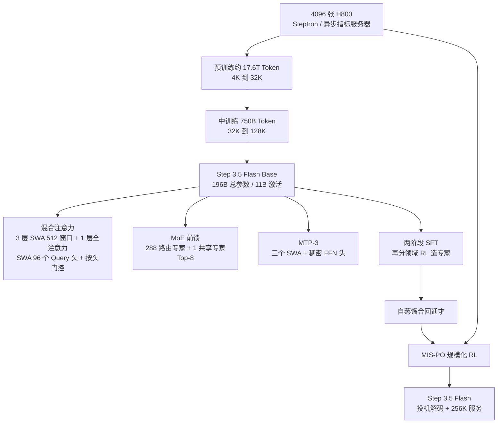
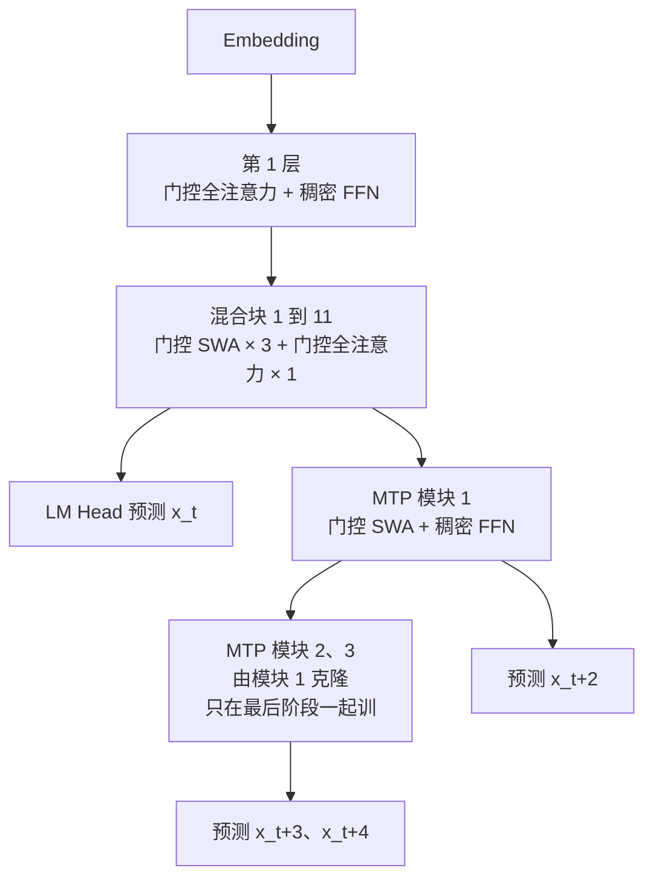
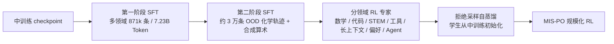
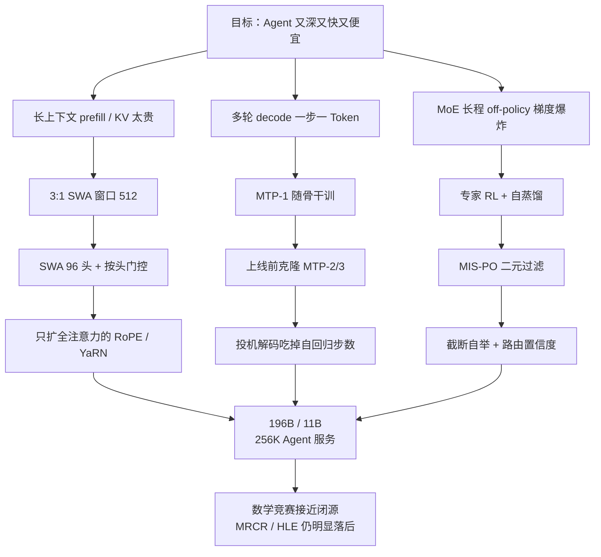

# Step 3.5 Flash：Agent 既要深想，也要多轮工具调用够快够便宜

<!-- release-date: 2026-02-01 -->

> 本文依据 StepFun 发布的 **Step 3.5 Flash: Open Frontier-Level Intelligence with 11B Active Parameters**，即 arXiv:2602.10604v2（2026-02-23 修订版），共 67 页。截至核验日期，arXiv 最新就是 v2，本地原件无需更换。页码均指 PDF 本身的页码。全文把三件事分开标注：**报告明确写了什么**、**我们如何解释或验算它**、**哪些是外部资料补充**。凡标着「我们的验算」「我们的推断」「读图估计」的内容，都不是报告的结论。

## 阅读前先搭一张最小地图

这篇报告把一个 196B 的稀疏模型从架构、训练稳定性、后训练强化学习一路写到 Agent 评测。先把后文会反复出现的名字讲成人话：

- **Token（词元）**：模型读写文本的最小单位。一个汉字、一个英文词、一个标点都可能是一个或几个 Token。
- **KV Cache（Key-Value Cache，键值缓存）**：生成下一个 Token 时，前面每个 Token 留下的中间结果。上下文越长，这块显存越大。
- **MoE（Mixture-of-Experts，混合专家）**：把前馈网络拆成很多「专家」，每个 Token 只走其中几个。总参数很大，每个 Token 真正用到的很小。
- **SWA 与全注意力**：**滑动窗口注意力（Sliding Window Attention，SWA）** 只让当前 Token 看最近的一小段；**全注意力（Full Attention）** 让它看整段历史。前者便宜，后者能看远。
- **MTP（Multi-Token Prediction，多 Token 预测）**：训练时在主模型之外再挂小模块，让它预测「再下一个」Token；推理时这些小模块可以先替主模型打草稿。
- **投机解码（speculative decoding）**：草稿模型连猜几个 Token，主模型一次前向全部验证。猜对就少跑几次昂贵的主模型。
- **Off-policy RL**：用「不是当前策略刚采出来」的轨迹来更新模型。速度快，但训练和推理两边的概率一旦对不上，梯度会炸。

报告另外三个自造或重用的名字，读到相应章节再展开：**按头门控注意力（Head-wise Gated Attention）**、**MIS-PO（Metropolis Independence Sampling-Filtered Policy Optimization）**、**元 Token（Meta Token）**。

## 一句话先说清

Step 3.5 Flash 要解决的矛盾很具体：**Agent 既要有前沿模型那样的推理深度，又要在很长的上下文里多轮调用工具，还得足够快、足够便宜。**（PDF p.4–5）

聊天机器人可以慢慢想。Agent 不行。它先要把整段历史读进去（prefill），再在工具调用之间反复生成（decode）。每一轮都在付长上下文的账。报告把延迟抬成和智能、成本并列的第三条硬约束，因为交互式 Agent 里，延迟直接变成任务完成的墙钟时间；反过来，同样的时间预算里，更快的模型可以多想几步。（PDF p.5）

它的回答分成三层，每一层都在省同一种东西——「每个 Token 真正要跑的计算」：

1. **容量与计算脱钩**：196B 总参数、每个 Token 只激活 11B，知识容量按大模型来，单次前向按小模型来。（PDF p.4、6）
2. **注意力按层分工**：三层滑动窗口配一层全注意力，窗口 512。滑动窗口层还把 Query 头从 64 加到 96，再用按头门控当「数据相关的注意力垃圾桶」。报告明确不选线性注意力，因为线性注意力的状态更新不好做投机解码的并行验证。（PDF p.5–8）
3. **解码一次猜多个 Token**：挂三个轻量 MTP 头（MTP-3），训练时多半只训第一个，上线前再克隆出后两个。推理时它们给投机解码提供草稿。（PDF p.6–7）

后训练侧的赌注是另一件事：MoE 做长程 off-policy RL 时，训练引擎和推理引擎之间哪怕差一个 Token 的概率，乘上很长的轨迹也会变成极端的重要性权重。报告不用 PPO 那种连续加权，改成 **MIS-PO**：概率比只用来决定「这条样本留不留」，留下的按 on-policy 更新。（PDF p.16–17）

报告最值得记住的不是某个榜上的第一，而是这句话背后的工程取舍：

> **给 Agent 的不是「每一层都看完全部历史、每一次更新都用连续重要性权重」的最大配置。把看远交给四分之一的层，把打草稿交给三个小模块，把 off-policy 的风险交给二元过滤，主模型只负责在这些约束里把智能密度做高。**

## 先看全景：这个模型是怎么连起来的

这张图是根据报告 Figure 2（PDF p.6）、第 4.2 节课表（PDF p.13–14）和第 5 节后训练（PDF p.15–16）合并重画的机制示意，不是任何一张原图的复制。

先把配置放在一起，后面每一节都会回来引用。数字来自 Table 6（PDF p.27），除非另注：

| 配置 | 数值 | 页码 |
|---|---:|---|
| 总参数 / 每 Token 激活参数（骨干） | 196B / 11B | PDF p.4、6、27 |
| 含 MTP-3 的总参数 / 激活参数 | 198B / 13B | PDF p.27 |
| Transformer 层 | 45（3 层稠密 + 42 层 MoE） | PDF p.6、27 |
| 混合块 | 先导 1 层全注意力 + 11 个混合块（每块 3 层 SWA 接 1 层全注意力） | PDF p.6 |
| 滑动窗口大小 | 512 | PDF p.7、27 |
| Query 头（全注意力 / SWA） | 64 / 96 | PDF p.27 |
| KV 头 | 8（GQA-8） | PDF p.5、27 |
| 每头维度 | 128 | PDF p.27 |
| RoPE 作用维度（全注意力 / SWA） | 64 / 128 | PDF p.27 |
| 隐藏维度 | 4096 | PDF p.27 |
| 词表 | 128,896 | PDF p.27 |
| MoE 专家 | 288 路由 + 1 共享，Top-8 | PDF p.6、27 |
| 稠密 FFN / 专家中间维度 | 11,264 / 1,280 | PDF p.27 |
| MTP | 3 个稠密 SWA 模块，合计约 0.81B | PDF p.7 |
| 预训练 Token | 约 17.6T（引言写 17.2T，见下文） | PDF p.4、13 |
| 中训练 Token | 750B | PDF p.13 |
| 原生上下文 / 服务上下文 | 中训练到 128K；评测用 YaRN 扩到 256K | PDF p.14、23 |

有三个数字值得一开始就看清楚。

第一，45 层里全注意力并不多。按 Figure 2 的排法：第 1 层单独用全注意力，后面 11 个混合块各带 1 层全注意力，全注意力一共 12 层，SWA 一共 33 层，比例正好 1:3。（PDF p.6）**我们的验算**：12 / 45 = 26.7%，不是「四分之一的层看完全部历史」的口头约数，而是略多一点。长序列上 KV Cache 和注意力计算主要被这 12 层决定，因为 SWA 层的缓存被窗口卡死在 512。

第二，激活参数 11B 里到底是什么。Table 6 写明「Activated params」按 Token 计、不含 embedding 和输出矩阵。（PDF p.27）**我们的验算**：每个专家三套 4096×1280 的矩阵约 15.7M；42 层 ×（8 个路由 + 1 个共享）约 5.9B。注意力按 12 层全注意力（64 个 Query 头）加 33 层 SWA（96 个 Query 头）、GQA-8、头维度 128 估算，大约 4.5B。再加上 3 层稠密 FFN 约 0.4B，合计约 10.8B，与报告的 11B 对得上。这意味着这个模型的「体重」几乎全在专家上，每个 Token 真正跑过的计算量和一个约 11B 的稠密模型相当。

第三，MTP 的参数账对不齐。正文说三个 MTP 头一共只加 0.81B、约占 0.41%（PDF p.7）；Table 6 又写含 MTP-3 的总参数是 198B、激活 13B（PDF p.27）。196 + 0.81 = 196.81，和官方仓库写的「196B 骨干 + 0.81B 头」一致，但 198B 和激活 13B 对不上 0.81B 这条线。**这是报告内部的数字缝，我们无法在原文里核对清楚。** 后文讲 MTP 时以 0.81B 和「三个头」为准，198B / 13B 只作为 Table 6 的原文照录。

## 第一层问题：Agent 的账和聊天机器人不一样

报告开篇把差距定在两个地方。开源模型在可验证任务上已经逼近闭源前沿，但复杂推理仍落后；更麻烦的是，长上下文 Agent 任务上的效率瓶颈让这些模型很难真正用起来，更不要说放到边缘或不宽裕的机器上。（PDF p.4）

拆开看，Agent 工作负载有一个和普通聊天很不一样的形状：**先做很长的 prefill，再做很长、多轮、带工具调用的 decode。**（PDF p.5）三笔账叠在一起。

### 花销一：注意力随长度平方增长

全注意力里每个 Token 都要和前面所有 Token 比一次。序列长 $L$，比较次数大约是 $L^2$ 量级。滑动窗口把每个 Token 能看的范围固定在 $W$ 个，比较次数变成 $L \times W$。$W=512$、序列 128K 时，单层大约是全注意力的 256 分之一。

Agent 还要把工具返回的网页、终端输出、代码 diff 不断追加进上下文。这不是「偶尔超长」，而是默认超长。

### 花销二：KV Cache 随长度线性增长，而且每个请求都要单独存

生成时，历史 Token 的 Key 和 Value 留在显存里。全注意力层的缓存随 $L$ 线性长；滑动窗口层只需要留最近 $W$ 个 Token，上下文再长也不涨。多轮 Agent 往往并发很多会话，显存会被历史记录迅速吃光。

### 花销三：解码是访存瓶颈，投机解码才是解码侧的杠杆

自回归解码每生成一个 Token 只做一次前向，算术强度很低，GPU 大部分时间在等显存。报告把解码侧的优先事项说得很硬：在带宽受限的硬件上，**验证效率**才是主导杠杆，所以架构必须和投机解码合得来。（PDF p.5）

这三笔账决定了后面三个设计：混合注意力解决前两笔，MTP 解决第三笔。稀疏 MoE 则是为了让分布式推理时不要被少数专家拖成短板。（PDF p.5–6）

## 核心设计一：为什么是滑动窗口，不是线性注意力

### 旧问题：长上下文要线性代价，但草稿树还要能一起验证

线性注意力和滑动窗口都能把复杂度从平方降到线性。线性注意力把历史压进一个固定大小的状态，每来一个新 Token 就更新这个状态。问题是：投机解码要同时验证一整棵草稿树，很多候选 Token 需要并行看同一段历史。线性注意力的状态更新是串在时间上的，草稿树的并行验证会变得别扭。（PDF p.5）

报告写得很直接：在缺少「线性注意力对 Agent 长上下文明显更好」的证据时，他们选了 SWA。SWA 保留标准注意力的语义，验证时只要对 KV 做 masking 就能并行，窗口 $W=512$ 被认为在 kernel 效率和捕捉局部依赖之间比较均衡。（PDF p.5）

**这是一条工程判断，不是消融结论。** 报告没有拿线性注意力做过对照表。它排除线性注意力的理由是「和投机解码的亲和力」以及「没有足够证据证明它在 Agent 任务上更强」。

### 新设计：三层窗口配一层全局，窗口留 512

正式布局记作 $S_3F_1$：三个 SWA 层后面跟一个全注意力层，循环下去。全注意力层用 GQA-8，也就是 8 个 KV 头，为的是对齐 8 卡服务器上的张量并行切分。（PDF p.5、7）

GQA-8 还有一个报告自己点出的副作用：注意力变得更吃显存带宽，于是腾出计算上的空档，可以把投机解码的草稿和验证开销塞进去，而不按比例增加延迟。（PDF p.5）**我们的解释**：这是在故意把注意力推向带宽瓶颈，好让「一次验证多个 Token」变得相对划算。是不是真的「没有按比例惩罚」，报告没有单独给出带/不带投机解码的延迟对照。

窗口为什么是 512 而不是更小？正文只说 512 是效率和局部依赖的折中（PDF p.5）。消融里窗口被固定在 512，没有扫 128 或 1024（PDF p.8）。所以「512 比更小的窗口好」并没有被这张表证明，它是先验选择。

### 工作机制：层是怎么排的

根据 Figure 2 与 2.2 节重画（PDF p.6），是机制示意。图中省略了第 1 层；正文说先导一层全注意力，后面 $L=11$ 个混合块。（PDF p.6）零中心 RMSNorm 全程使用。前三层用稠密 FFN，后面 42 层才是 MoE。（PDF p.6、27）

MTP 模块一律用 SWA 加稠密 FFN，不走专家。主训练只训 MTP 模块 1；模块 2、3 从它克隆，在最后一段轻量后训练里联合微调。（PDF p.6–7）

### 代价与边界

- **看远的层只有 12 层。** 超过 512 个 Token 的依赖，必须借道全注意力层传递。长程检索会不会因此变弱，后面评测里的 MRCR 会给出一个很难看的数字。
- **窗口大小没有对照。** 消融只改了 SWA 与全注意力的比例和 SWA 的头数。
- **GQA-8 对所有层一刀切。** 不像有的混合架构给全注意力更少的 KV 头。报告的理由是 8 卡切分，不是「谁的缓存会长大」。

### 可迁移启发

1. **选稀疏注意力时，先问它能不能和投机解码一起工作。** 线性复杂度不是唯一目标。草稿树要并行验证，状态更新式的线性注意力会把这条路堵住。
2. **KV 头数可以按硬件拓扑来，而不只按算法。** 8 个 KV 头对齐 8 卡，是把并行切分写进架构。

## 核心设计二：朴素 3:1 会掉点，加头和按头门控把它补回来

### 旧问题：窗口一层层叠上去，质量就掉

报告在 30B 总参数、3B 激活的 MoE 上把整条流水线跑完：1.4T Token 预训练，再做 32K 长上下文和 64K SFT。窗口固定 512，关掉 MTP，只改注意力布局。（PDF p.8）

Table 1 的数字如下（PDF p.8）：

| 布局 | SWA 头数 | 相对 FLOPs（decode / prefill） | 预训练均分 | 下游均分 | LongCtx |
|---|---:|---:|---:|---:|---:|
| 全注意力 $FFFF$ | 32 | ~2.68 / 2.90 | 54.1 | 33.2 | 28.8 |
| $S_1F_1$ | 32 | ~1.58 / 1.65 | 54.6 | 34.1 | 29.6 |
| $S_3F_1$ | 32 | 1.00 / 1.00 | 53.6 | 32.5 | 27.5 |
| $S_3F_1$+加头 | 48 | ~1.01 / 1.02 | 55.7 | 32.9 | 28.2 |

相对 FLOPs 以 $S_3F_1$ 为 1，对 64K 和 256K 取平均（Table 8，PDF p.28）。

读这张表要按报告的逻辑，不要只看「谁最高」。

朴素 $S_3F_1$ 最便宜，质量也最差：LongCtx 从全注意力的 28.8 掉到 27.5，下游均分从 33.2 掉到 32.5。（PDF p.8）附录 Table 10 把预训练拆开看，BBH 从 66.0 掉到 61.7，MMLU-Pro 从 35.7 掉到 33.7。（PDF p.31）

$S_1F_1$ 即一层窗口配一层全局，下游均分 34.1、LongCtx 29.6，是这张表最好的质量，但 decode / prefill 相对 $S_3F_1$ 大约贵 58% / 65%。（PDF p.8）

报告最后选的是 $S_3F_1$+加头：预训练均分 55.7，已经超过全注意力的 54.1；下游 LongCtx 回到 28.2，科学类从 42.4 升到 44.0。多出来的注意力开销几乎可以忽略（1.01 / 1.02）。剩下的缺口集中在代码，18.3 对全注意力的 19.6。（PDF p.8）

**他们愿意用代码上的一点损失，换长上下文 Agent 工作负载上大约 60% 的注意力开销。** 这是明确写出来的取舍，不是「全面更好」。

Table 8 还给出了正式模型规模下的相对 FLOPs（PDF p.28）。以 $S_3F_1$、64 个 SWA 头为 1：

| 布局 | SWA 头 | decode 64K / 256K | prefill 64K / 256K |
|---|---:|---|---|
| $S_3F_1$ | 64 | 1.00 / 1.00 | 1.00 / 1.00 |
| $S_3F_1$+加头 | 96 | 1.02 / 1.01 | 1.08 / 1.04 |
| $S_1F_1$ | 64 | 1.18 / 1.47 | 1.38 / 1.71 |
| 全注意力 | 64 | 1.51 / 2.33 | 2.07 / 3.00 |

序列越长，3:1 相对全注意力越划算。256K prefill 上全注意力是 3 倍；加到 96 个头只让 $S_3F_1$ 的 prefill 变成 1.04 倍。这就是报告说「几乎免费的午餐」的定量含义。（PDF p.7、28）

### 为什么加 Query 头几乎不贵

SWA 层的注意力窗口是固定的。Query 头从 64 加到 96，KV 头仍是 8 个，Query 对 KV 的比例变成 12。附录 A.2 说，即便算上 MTP-3，这个比例仍让 SWA 停在 IO 瓶颈区，所以 FLOPs 涨了，延迟几乎不涨。（PDF p.28）

Table 7 是带 MTP-3 的相对延迟（PDF p.28）。正式模型、256K decode：96 头无门控是 1.00，96 头加门控仍是 1.00。prefill 256K 从 1.00 涨到 1.03（只加头）或 1.05（加头加门控）。

**我们的解释**：窗口被卡死后，多出来的 Query 头只增加固定大小的局部计算，不随上下文膨胀。全注意力层不敢这么加头，因为它的 KV 会随 $L$ 长。报告把「表征力」加在便宜的那一侧。

### 按头门控：给窗口一个「这一头我谁也不看」的出口

滑动窗口有一个 softmax 的老问题。窗口里 512 个 Token 对当前 Query 都没用时，权重还是得加起来等于 1，于是噪声被强行灌进输出。全注意力层常常把无处可放的注意力堆到序列第一个 Token 上，这就是文献里的 attention sink。窗口层看不到序列开头，连这个垃圾桶都没有。（PDF p.7）

前人的做法是在窗口里塞一个可学习、与输入无关的 sink token。（PDF p.7）Step 3.5 Flash 换成 **按头门控注意力（Head-wise Gated Attention）**：每个头一个随输入变化的标量门，作用在该头的输出上。报告把它看成「数据相关的 sink token」。（PDF p.7、27）

先按普通注意力算出头输出 $y_i$，再乘上门：

$$
g_i = \sigma(w_{\text{gate}}^{\top} x_i),\qquad o_i^{\text{gate}} = g_i\, y_i
$$

$x_i$ 是位置 $i$ 的输入表示，$\sigma$ 是 sigmoid，$w_{\text{gate}}$ 是这个头的门控向量。（PDF p.27，式 4–5）

把它代回 softmax，分母会多出一项。令 $Z_i$ 为普通注意力的配分函数，门控后的输出等价于：

$$
o_i^{\text{gate}} = \sum_j \frac{\exp(s_{ij})}{Z_i + e^{-g_i} Z_i}\, v_j
$$

$e^{-g_i} Z_i$ 就是输入相关的 sink 质量：它吸走一部分注意力，但不对应任何 Value。（PDF p.27–28，式 6）门接近 0 时，$e^{-g_i}$ 很大，这个头几乎不发言；门接近 1 时，它退回普通注意力。

和「窗口里放一个固定 sink token」的差别是：固定 sink 对所有输入一视同仁；这里每个头、每个位置根据当前 $x_i$ 自己决定要不要把注意力丢掉。

对照在 100B 总参数、10B 激活的 MoE 上做，布局固定为 $S_3F_1$、$W=512$，只换 sink token 还是按头门控，预训练约 250B Token。（PDF p.8–9、29）Table 2（PDF p.9）：

| 方法 | BBH | MMLU | GPQA | MBPP | C-EVAL | CMMLU | 均分 |
|---|---:|---:|---:|---:|---:|---:|---:|
| Sink Token | 70.6 | 65.1 | 27.2 | 61.2 | 76.2 | 74.6 | 62.5 |
| 按头门控 | 73.7 | 67.0 | 28.1 | 62.6 | 77.9 | 77.1 | 64.4 |

正文把均分写作从 62.46 到 64.43，+1.97；表里四舍五入后是 62.5 和 64.4。（PDF p.9）六项全部上升。FLOPs 和延迟几乎不变（Table 7）。

**这是预训练-only 的对照，没有走完 SFT。** 报告据此把按头门控定为后续默认，但没有证明它在下游 Agent 任务上同样值回票价。

### 代价与边界

- **30B-A3B 不是 196B。** 1.4T Token 对 17.6T 差一个数量级。布局结论依赖这个代理模型。
- **$S_1F_1$ 质量更好，他们仍选了更便宜的 3:1。** 如果任务更吃 LongCtx 而不是吞吐，这张表其实支持更密的全注意力。
- **代码是 3:1 加头之后唯一明显落后的下游项。** 正式模型后来靠后训练把代码 Agent 拉上去，但那已经不是架构消融能解释的。
- **门控的理论仍是「可以看成 sink」。** 公式等价是报告写的；「因此它解决了 sink 问题」是解释，不是单独验证过的注意力图分析。

### 可迁移启发

1. **混合注意力的质量缺口，可以用「只加在窗口层上的容量」补，而不必回到全注意力。** Query 头加在 SWA 上，成本几乎不随长度涨。
2. **截断注意力的候选集合时，给模型一个输入相关的「不选」。** 固定 sink token 能用，按头门控在他们的 100B 实验里更好，而且更便宜。
3. **比例是产品决策，不是精度决策。** 同一张表里 $S_1F_1$ 更准、$S_3F_1$+加头更便宜。报告为 Agent 的 prefill/decode 账单选了后者。

## 核心设计三：MTP-3，让一次前向吐出四个位置的候选

### 旧问题：自回归一步只走一个 Token

Agent 的多轮工具调用把解码步数乘了起来。投机解码需要一个分布接近主模型、又足够便宜的草稿器。外挂小模型要单独训、单独对齐。

### 新设计：三个轻量头，主训练只负担一个

每个 MTP 头是一层门控 SWA 加一个稠密 FFN，三个头合计约 0.81B。（PDF p.7）记号按预测偏移来：主 LM 头预测 $x_{t+1}$；对 $h \in \{1,2,3\}$，MTP-$h$ 用骨干在位置 $t$ 的隐状态预测 $x_{t+1+h}$。一次前向因此覆盖接下来四个位置。（PDF p.7）

训练开销靠两件事压住。第一，绝大多数阶段只激活并优化 MTP-1。骨干训稳之后，再把 MTP-2、MTP-3 从 MTP-1 初始化，在一段轻量后训练里联合训。（PDF p.6–7）第二，借鉴 Fast-MTP，按预测远近做位置相关的损失重加权，避免模型把力气花在「再往后两个 Token」这种更难、也更不值得的目标上。（PDF p.7）

MTP 损失权重：预训练第一阶段 0.3，第二阶段和中训练、SFT 都是 0.1。（PDF p.15–16）

### 收益：报告给出的是服务吞吐，不是接受长度

引言说这套架构在 OpenRouter 上线第一周，Hopper GPU 上维持约 170 tokens/s。（PDF p.4）正文没有给出投机解码的平均接受长度、也没有给出「关掉 MTP」的对照。附录的速度表是理论 FLOPs 和模拟延迟，假设 MTP-3 已经开着。（PDF p.28）

**外部补充，不是报告原文：** 官方博客写典型用量 100–300 tok/s，单流代码任务峰值 350 tok/s；评测表里 128K、Hopper、MTP-3、EP8 的估算解码成本被标成 1.0× 基准。这些数字出现在 [官方博客](https://static.stepfun.com/blog/step-3.5-flash/) 和 GitHub README，没有写进 PDF 的实验节。

### 代价与边界

- **草稿头的质量没有单独消融。** 没有「MTP-1 vs MTP-3」「有无位置重加权」的表。
- **vLLM 对 MTP-3 的完整支持在论文写作时还没有。** 这是部署现状，不是报告内容；报告只保证自己的推理栈能用。
- **三个头都用 SWA，看不到超过 512 的草稿上下文。** 对长依赖的「下一步」猜测，草稿器本身是近视的。验证仍由带全注意力的骨干做。

### 可迁移启发

1. **草稿器可以和训练目标是同一个模块。** 先用 MTP-1 付训练成本，上线前再克隆出更深的草稿链。
2. **越远的 Token 越不要同等加权。** 位置相关重加权是在承认：MTP 的价值主要在近处的几个位置。

## 稀疏 MoE：容量留下，计算和通信不要被短板拖死

每层 288 个路由专家加 1 个始终激活的共享专家，每个 Token 走 Top-8。（PDF p.6）总参数 196B，激活 11B。报告还把整模规模压在 200B 以下，为的是能塞进高端工作站 128GB 内存。（PDF p.6）

专家并行（Expert Parallelism，EP）把专家拆到不同 GPU 上。路由一旦偏斜，少数专家所在的卡变成短板，同步点上所有人等它。（PDF p.6）他们用两层均衡：

- **无辅助损失的负载均衡（loss-free load-balancing）**：用偏置调节全局 Token 分配，不往损失里加一项抢梯度。（PDF p.7）
- **EP 组均衡损失**：只保证「每个 EP 卡上的专家总体负载」接近，不管单个专家在微批次里是不是完全均匀。（PDF p.7，式 1）

记 $p_e$ 为专家 $e$ 的平均路由概率，$f_e$ 为它实际被 Top-k 选中的频率，再按 EP 组求和得到组级的 $p_g$、$f_g$。损失是：

$$
\mathcal{L}_{\text{EP}} = G \sum_{g=1}^{G} f_g p_g
$$

$G$ 是 EP 组数。它鼓励「被选得多的组，路由概率不要再高」，从而减少卡级短板。（PDF p.7）

预训练里 loss-free 的偏置更新率前 14.6T 是 0.001，退火阶段降到 0；EP 组损失系数全程 0.001。（PDF p.15）中训练开始冻结路由器、关掉 EP 组损失。（PDF p.15）**我们的解释**：专家分工一旦定型，再强行拉平会破坏已经学到的路由；后训练更怕路由被来回改。

共享专家还引出稳定性一节会讲的标定问题：有共享专家时，必须显式缩放共享与路由专家的相对贡献，大模型不会自己校准。（PDF p.12）

## 把这些模块塞进 4096 张 H800

集群是 4096 张 NVIDIA H800。节点内 8 卡 NVLink / NVSwitch，节点间 8×200 Gbps RoCE。（PDF p.9）训练框架叫 Steptron，基于 PyTorch 和 Megatron-LM，预训练、后训练和 RL 走同一套栈。（PDF p.9）

并行切分：8 路流水线并行（带虚拟流水线阶段）、8 路专家并行、ZeRO-1 数据并行。（PDF p.9）注意力和 MoE 用不同的并行组，梯度在各自的数据并行组里归约。（PDF p.9）

几项工程数字是报告自己给的，不是我们估的：

- 把注意力和 MoE 的 DP 通信按 NVLink / RoCE 分阶段，再按通信画像摆 rank，迭代时间最多降约 5%。（PDF p.9）
- Muon 需要完整的未切分梯度做 Newton–Schulz 正交化，和 ZeRO-1 的 reduce-scatter 冲突。他们只对专家参数做「整参数归 rank」的重打包，非专家仍用 all-reduce；相对朴素 FP32 all-reduce，迭代时间大约再降 5%，多占不到 4GB。（PDF p.10）
- 注意力里 QK 归一化和 RoPE 融合；MoE 里小算子融合，gather/scatter 与 grouped GEMM 打在一起，做法类似 SonicMoE。（PDF p.10）
- 激活重计算可以按层、按子模块开关。（PDF p.10）

监控是稳定性一节的前提。4096 卡每个 iteration 产生近 600 万条消息，若在主循环里做同步规约，会多出数秒，相当于把 iteration 时间翻倍。他们用自研 StepRPC 把指标异步丢到轻量 Metrics Server，开销降到大约 100ms / iteration。（PDF p.10）服务器收到所有 rank 的 iteration 结束信号后才做规约和落库。

**没有公开 Steptron 的代码、StepRPC 的协议，也没有给出端到端的 MFU。** 能迁移的是「微批次级专家指标必须离开训练主路径」，不是这套实现本身。

## 预训练稳定性：损失曲线看起来平滑，不等于专家内部没在炸

Figure 3 把逐步训练损失原样画出来，没有平滑、没有抽稀。整段预训练在学习率冷却之前只有一次孤立的 loss spike。图上标了四件事：①②③ 是全局 batch 加到 8,192、12,288、16,384；④ 是开始对元 Token 做 loss mask。（PDF p.11）曲线横轴画到约 14T，对应冷却前的主训练，不是全部 17.6T。

引言把这次稳定训练写成 17.2T、只有一次瞬时 spike（PDF p.4）；第 4.2 节课表写成预训练约 17.6T、中训练 750B（PDF p.13）。**两处原文不一致。** 按阶段相加：14.6T（4K）+ 3T（退火，其中 2T 仍是 4K、1T 是 32K）= 17.6T。17.2T 可能是冷却前或某次口径，报告没有解释。后文用 17.6T 指课表，提到引言时标明 17.2T。

他们认定三种主导失稳，都靠微批次日志才能早发现。（PDF p.11）

### 1. Muon 的数值过敏

Muon 用 Newton–Schulz 迭代给二维权重的更新方向做近似正交化。他们改用收敛更快的 Polar Express，固定 $T=6$ 步。（PDF p.11）

即便加上文献建议的安全缩放，仍会偶发不可恢复的 loss spike。这些 spike 不确定：从邻近 checkpoint 重跑常常就避开了，说明是数值病理而不是数据或学习率。（PDF p.11）模拟显示 bfloat16 的 Polar Express 在某些更新统计下会因累加误差冒出极端中间值。处理办法： **只把 Polar Express 的状态和中间量改成 float16** ，训练其余部分保持混合精度。改完之后 spike 不再出现。（PDF p.11–12）

**我们的解释**：Muon 的正交化是一小段对精度极敏感的迭代，不必把整个优化器升精度，把这一段隔离出来即可。报告没有给出 float16 相对 float32 的质量对照，只说失稳消失。

### 2. 专家死亡，不一定是路由死亡

他们前作 Step-3 把 dead expert 主要理解成「长期分不到 Token、因而几乎没有梯度」。这次发现另一种形态：路由器的分发统计看起来健康，但专家激活在消失，参数范数停滞或衰减。（PDF p.12）

两个因素特别重要。（PDF p.12）

第一，有共享专家时，路由专家的聚合必须显式缩放。小模型也许能自己学会共享与路由的相对贡献，大模型不可靠。比例不对时，即使路由频率正常，路由专家的有效贡献也会被压掉。

第二，细粒度稀疏下，微批次级负载均衡（Switch 那一类）过严，会在专家之间制造过度竞争，妨碍分化。他们更倾向全局 batch 统计，或按观测负载做无损失的偏置调节。

实践建议是：不要只看路由器。要看专家侧信号，例如 MoE FFN 中间激活的 RMS / 均值范数，以及投影矩阵的 Frobenius 范数。一部分专家的激活或更新掉向零、中位数仍稳定（min-to-median 下降），就是死亡预警。（PDF p.12）

**这是作者观察和工程建议，没有一张「死专家数量随时间变化」的表。**

### 3. 局部激活爆炸：损失看不出来，深层个别专家在发散

专家开始真正分化之后，深层 MoE 会出现另一种病：一层里往往只有一两个专家的激活范数迅速变大，同层大多数专家仍正常。中位数稳定，最大值爆炸，数值溢出风险上升。（PDF p.12）

Figure 4 把这件事画清楚了（PDF p.13）。三组曲线：不裁剪、权重裁剪、激活裁剪。

- 图 (a) 训练损失几乎重叠，三种策略从损失上看不出差别。
- 图 (b) 第 38 层，最大值和中位数都还老实。
- 图 (c) 第 45 层，不裁剪的最大输出范数冲到 $10^5$ 量级；权重裁剪只是推迟爆炸；激活裁剪把最大值钉在大约 $10^2$。

报告因此把「每专家激活范数的 max-to-median」当成必要监控指标。（PDF p.13）

两种干预（PDF p.12）：

- **权重裁剪**：对专家投影 $W$，若 $\max_x \|Wx\|$ 超过阈值 $\tau$，则 $W \leftarrow W \cdot \tau / \max_x \|Wx\|$。类似注意力里的 MuonClip，但他们是对 checkpoint 离线做，不是每步在线做。
- **激活裁剪**：在输出投影之前，对 MoE FFN 中间激活做逐元素裁剪。

他们选激活裁剪，因为权重裁剪拦不住复发。

附录 B 把机制拆成一条因果链，这是作者分析，不是单独的因果实验。（PDF p.30–32）

1. 高频 bigram 让某个细粒度专家专职预测「第二个字」，负载均衡管不到这么窄的分工。
2. Pre-norm 下最终表示是各层输出之和再走 RMSNorm。一个专家可以把输出无界放大，吃掉归一化，让预测几乎只取决于它。
3. SwiGLU 在 gate 和 up 两支高度对齐、能量集中在少数维度时，逐元素乘会造出极端幅度；权重衰减压不住，因为幅度来自对齐而不是权重变大。
4. Muon 丢掉梯度幅度、持续正交化，把这个低秩、方向稳定的更新放大得更狠。Adam 的 $\epsilon$ 反而会挡住过小的梯度，Muon 没有这道闸。

他们用一个检查支持「专家已经在走捷径」：把路由器 embedding 直接喂给异常专家，其输出分布和真实数据、整网行为对齐。（PDF p.32）

**可迁移的不是「必须用激活裁剪」这条结论，而是「损失平滑时仍要看深层专家的 max-to-median」。** 爆炸被损失完全掩盖，这是 Figure 4(a) 支持的。

### 元 Token：先让模型读标签，再停止预测标签

附录 A.3 给每个训练样本前面拼一段人读得懂的元数据：内容类型（Code / Book / Paper / Web）、语言、领域、来源。（PDF p.29）大约前 3.8T Token 对整段序列算损失；之后元数据仍留在上下文里，但这些位置不再进损失，优化压力全部转到正文。（PDF p.11、29）Figure 3 的标记 ④ 就是这次切换，损失有一个台阶，随后继续下降。

报告的假设：这一阶段模型已经会把元数据当条件，再让它预测元数据本身是浪费。（PDF p.29）没有「有无元 Token」的对照表。

## 训练课表：从开放域走到软件工程，再把窗口拉到 128K

整体顺序是：4K 开放域 → 退火并加代码 / PR → 32K 初始化 → 中训练在 32K 专业化 → 再扩到 128K。（PDF p.13–14）

### 阶段数字

**预训练第一阶段**：14.6T Token，4K 上下文，开放域覆盖。（PDF p.14）

**预训练第二阶段**：3T Token。先 2T 仍是 4K，再 1T 扩到 32K。数据配比转向代码和 PR / Issue / Commit，同时提高高质量知识和推理密度。（PDF p.14）

**中训练第一阶段**：386B Token，32K。回放 81B（21%）预训练数据，减轻分布偏移；其余偏向软件工程和工具使用。（PDF p.14）

**中训练第二阶段**：364B Token，128K。回放 10.5B。其余是合成长程推理、预训练里长度超过 32K 的自然长文档，以及代码 Agent、搜索 Agent、工具使用。（PDF p.14）

两段中训练合计 750B，与 4.2 节开头一致。

### 关键超参

优化器全程 Muon。权重衰减 0.1，梯度裁剪 1.0。（PDF p.15）

学习率：前 2000 步从 0 线性升到 $2.5\times 10^{-4}$，预训练第一阶段余弦降到 $5\times 10^{-5}$；第二阶段 4K 的 2T 再余弦降到 $2\times 10^{-5}$，32K 的 1T 保持 $2\times 10^{-5}$。（PDF p.15）中训练从 0 升到 $2\times 10^{-5}$（前 3% 步），第一阶段保持，第二阶段降到 $7.3\times 10^{-6}$。（PDF p.15）

全局 batch：前 400B Token 从 4096 加到 16384，其后保持 16384；32K 退火那段改成 2K。（PDF p.15）正文写「2k」，按同节其它 batch 写法应是 2048 量级，报告没有写死 2048 还是 2000。

RoPE：4K 阶段全注意力和 SWA 都是 $\theta=10{,}000$；32K 退火只把全注意力改成 $\theta_{\text{Full}}=1{,}000{,}000$，SWA 仍是 10,000；中训练 32K 保持 $1{,}000{,}000$，128K 再把全注意力加到 $5{,}000{,}000$，SWA 始终不动。（PDF p.15）评测 256K 时用 YaRN，缩放因子 2.0，**只加在全注意力层**。（PDF p.23）

**我们的解释**：窗口只有 512，SWA 不需要为 128K 改基频。长上下文扩展是「只动看得远的那几层」。这和混合注意力的分工是同一件事。

### 数据里真正为 Agent 准备的部分

通用知识走自研 StepCrawl，不只是 Common Crawl。站点选择用 WebOrganizer 风格的模型做循环：过滤 SEO 低质页，并按站点类别分配爬取预算。规模是每天约 10 亿页。遵守 robots.txt，再做质量、去重、清洗。（PDF p.32）质量分层用六个轻量打分器的集成，保留 High / Medium-High / Medium，丢掉更低档；书和论文在退火阶段只留最高两档。中文 / 英文网页做 embedding 后 k-means（10 万+ 簇）降采样过大簇。（PDF p.33）这些都是内部消融支持的，报告没给出具体分差。

代码用改过的 OpenCoder 规则。文档按触发的启发式「命中数」分层：只留命中 0 会过剪，完全不过滤又太噪。内部消融认为命中 0–6 最好。（PDF p.33）

PR / Issue / Commit 来自 10 星以上的 GitHub 仓库，严格对 SWE-Bench Verified 和 Multilingual 去污。（PDF p.33–34）四块衍生数据：

1. 基础变更数据，部分用 git diff 校验，覆盖 20 多种主流语言。
2. **90B Token 的拼接 PR 对话**：Agentless 风格的两个模板——根据问题定位文件、用 SEARCH/REPLACE 改代码。退火阶段只 mask 模板骨架；中训练改成对话并 mask 用户提示。
3. **约 12B Token 的改写数据**：推理过程重建，以及「主动阅读笔记」。中训练使用，报告称 SWE-Bench 继续涨。
4. 可执行环境种子：从原始 PR 构建环境，含测试补丁，服务后续 Agent 训练。

数学和 STEM 在 Common Crawl 之外再用 StepCrawl 收了「数千亿」数学相关 Token，另有 1 亿条习题 / 测验 / 教辅，覆盖 K-12 到 CPA、法考。（PDF p.34）「数千亿」是原文 hundreds of billions，没有更精确的数。

数据消融的代理模型仍是 30B-A3B。报告认为更小的代理会偏向重复、记不住长尾，这个规模更接近全量趋势。（PDF p.35）

**没有公开预训练语料、没有给出各来源的精确配比。** 能迁移的是课表形状：先开放域，再在退火和中训练把软件工程与工具使用的比重抬上去，同时把窗口拉长。

## 后训练：先养一群专家，再蒸馏回一个通才

后训练的矛盾是：一个通才直接覆盖所有领域会牺牲专长；每个领域长期养一个专家又付不起持续迭代的成本。同时，MoE 做长程 RL 时，off-policy 的概率偏差会被路由放大。（PDF p.4、15）

流程分成两段，类似于他们引用的 GLM-4.5 一类工作。（PDF p.15）

根据第 5.1–5.2 节重画（PDF p.15–16），是机制示意。

第一阶段 SFT 覆盖数学、代码、STEM、逻辑、通用问答、代码 Agent、工具使用、搜索 Agent、长上下文。按难度过滤并做配比。（PDF p.15）Table 3 给出 870,687 条、7.23B Token 的构成（PDF p.19）：

| 领域 | 条数 | Token | 占比 |
|---|---:|---:|---:|
| Math | 68,055 | 0.98B | 11.19% |
| Code | 86,421 | 1.23B | 21.10% |
| STEM | 120,399 | 0.55B | 6.31% |
| Logic | 93,323 | 0.81B | 13.87% |
| General | 314,495 | 0.80B | 9.16% |
| Code Agent | 37,240 | 0.90B | 17.70% |
| Tool-use | 114,507 | 0.76B | 8.72% |
| Search Agent | 20,256 | 0.50B | 8.75% |
| Long Context | 15,565 | 0.70B | 4.00% |

代码加代码 Agent 已经接近 39% 的 Token。这是一个明显偏向软件工程的 SFT 配比。

第二阶段只做一件事：提高推理密度。注入约 3 万条专家级化学轨迹和合成算术，三个 epoch，目的是用 OOD 结构把后续 RL 的初始化做难。（PDF p.15）

专家 RL 覆盖数学、代码、STEM、工具、长上下文理解、人类偏好、Agent 推理。然后专家在与第一阶段 SFT 共享的 prompt 分布上生成轨迹，拒绝采样去掉中英混杂、过度思考等模式，蒸馏进从中训练初始化的学生。报告认为这比直接把专家 RL 拼进通才更稳，也能减轻后续 RL 的优化负担。（PDF p.15–16）

SFT 超参：Muon，3% warmup，余弦从 $1.0\times 10^{-5}$ 降到 $5.0\times 10^{-6}$；冻结路由器、关掉 EP 组损失；MTP 权重 0.1；全局 batch 32，全局序列长度 128K；RoPE 与中训练第二阶段相同。（PDF p.16）

统一清洗分三步：规则过滤（重复、有害、PII），模型过滤语言混杂，再对评测集做精确匹配（数字 mask）和 N-gram 去污。（PDF p.35）

## 核心设计四：MIS-PO，用「留不留」代替「乘多大」

### 旧问题：长轨迹上的重要性权重会爆炸

RL 要优化策略 $\pi_\theta$，让整条轨迹 $\tau=(s_0,a_0,\ldots,s_T)$ 的终端奖励变大。$a_t$ 是状态 $s_t$ 上生成的 Token。（PDF p.16）

不稳定来自两件事叠在一起。训练框架和高速推理引擎的数值、实现不一致；迭代更新本身又让用来采样的策略落后于正在更新的策略。Token 级的一点概率差，在很长的推理链上连乘，会变成噪声极大的重要性权重。（PDF p.16）MoE 的路由让两边的分布差得更大。（PDF p.4）

PPO 一类方法用截断后的连续比值去缩放梯度。比值一旦偶尔极端，梯度范数就尖刺。

### 新设计：推理策略是提案，训练策略是目标，只留下够近的样本

MIS-PO 的名字来自 **Metropolis 独立采样（Metropolis Independence Sampling）**。把推理引擎上的策略 $\pi_{\theta_{\text{vllm}}}$ 当成提案分布，把训练策略当成目标。比值不再乘进梯度，只用来做二元门。（PDF p.16–17）

定义指示函数 $\mathrm{I}(x)=1[\rho_{\min}\le x\le\rho_{\max}]$，用在两个粒度上。

**Token 级**：看

$$
x_t = \frac{\pi_{\theta_{\text{old}}}(a_t\mid s_t)}{\pi_{\theta_{\text{vllm}}}(a_t\mid s_t)}
$$

分子是训练侧更新前的策略，分母是推理侧采样策略。局部对不上的 Token 被丢掉。（PDF p.17）

**轨迹级**：看几何平均

$$
\bar\rho(\tau)=\Bigl(\prod_t x_t\Bigr)^{1/T}
$$

整条轨迹漂太远，整条丢掉。（PDF p.17）

Actor 损失变成：

$$
\mathcal{L}_{\text{actor}} = -\mathbb{E}_{\tau\sim\pi_{\theta_{\text{vllm}}}}\Bigl[\mathrm{I}(x_t)\cdot\mathrm{I}(\bar\rho(\tau))\cdot\log\pi_\theta(a_t\mid s_t)\cdot\hat A_t\Bigr]
$$

留下的样本按 on-policy 的对数概率乘优势来更新，没有连续 IS 权重。（PDF p.17，式 2）超参：Token 级界 $[0.5, 2]$，轨迹级界 $[0.996, 1.001]$。（PDF p.19）轨迹级窄得惊人——几何平均几乎必须贴着 1。**我们的解释**：这等于只信任「整条序列的平均概率比几乎没偏」的样本；单个 Token 允许偏离到 0.5–2，但不能让偏离在整段上累积。

### 工作机制：和 PPO、GSPO 差在哪

PPO：比值连续存在，靠 clip 挡极端值。极端值被挡住之后，梯度变小，但方差来源还在。

GSPO：把 Token 级比值换成轨迹级几何平均，再 clip。附录把 GSPO 接到 actor-critic 上，并且 **同样加了 MIS-PO 那两层 mask**，clip $\epsilon=10^{-4}$，clip 比例约 15%。（PDF p.37–38）即使如此，GSPO 在 MoE 上大约 200 步就平台，训练-推理密度比 $\pi_{\theta_{\text{old}}}/\pi_{\theta_{\text{vllm}}}$ 还在往下走；MIS-PO 把这个比维持在窄带里，奖励继续涨。（PDF p.37，Figure 7）

稠密模型上 GSPO 也能压梯度方差，但同样迭代预算下奖励和「全部接受比例」不如 MIS-PO。（PDF p.37）

Figure 5 是内部模型上 MIS-PO 对 PPO、约 5000 步的对照（PDF p.16）。三件事同时出现：奖励平台更高；actor 梯度范数几乎没有 PPO 那种尖刺；熵掉得更慢。报告把第三条读成探索保持得更好。

Figure 8 把 MIS-PO 在 MoE 上再拉长：奖励仍在升，梯度范数原样画出（未平滑），熵可控。（PDF p.38）

**这些图来自内部模型和内部数据集，不是 Step 3.5 Flash 正式训练的逐步曲线。** Figure 6 才是正式模型的 RLVR 动态：奖励从约 0.60 升到约 0.70，横轴大约 250 步量级（读自 PDF p.18 图）。下游相对 RL 前的提升：IMO-AnswerBench +3.2%（82.3 → 85.5），CF-Div2-Stepfun-cpp +6.1%（80.3 → 86.4），ARC-AGI-1 +10.6%（46.2 → 56.8），HLE text +3.4%（19.9 → 23.3）。（PDF p.17–18）注意 Figure 6 的 IMO 85.5 与 Table 5 的 85.4 差 0.1，属于四舍五入或不同平均次数。

### 截断不当失败，路由置信度当晴雨表

长推理经常撞上上下文上限。如果把截断轨迹的奖励打成 0，模型分不清「没做完」和「做错了」，会惩罚长链条。（PDF p.17）截断感知的价值自举把截断当成视界中断：

$$
\hat R_i =
\begin{cases}
V_\phi(s_T) & \text{若回复被截断}\\
R_i & \text{否则}
\end{cases}
$$

$V_\phi$ 是 critic 对最后状态的价值。（PDF p.17，式 3）报告称截断率高到 20% 时训练仍稳，对竞赛级基准特别有用。没有单独把「有/无自举」的表放进正文。

**路由置信度 $\Sigma_k$** 定义为被激活专家的平均概率质量。低意味着路由犹豫，会放大训练-推理不一致。他们观察到一个相变：低置信度的模型又脆，需要 Router Replay 或严格 on-policy；高置信度的模型可以 off-policy，不必上那些重型稳定器。（PDF p.17）**这是初步实验观察，没有给出 $\Sigma_k$ 的阈值或正式模型的曲线。**

### RL 超参（正式训练）

采样温度和 top-$p$ 都是 1.0，最大长度 128K。（PDF p.19）

| 任务 | 每步唯一 prompt | 每 prompt 条数 |
|---|---:|---:|
| 推理 | 256 | 16 |
| 人类偏好 | 512 | 8 |
| 工具使用 | 128 | 8 |

完成后的样本划成 mini-batch，单 epoch：actor 4 个 mini-batch，critic 12 个。Muon，权重衰减 0.1。Actor 学习率 $2\times 10^{-6}$、warmup 20 步；critic $5\times 10^{-6}$、warmup 50 步。$\gamma=\lambda=1$。最后阶段加无偏 KL，系数 0.001。（PDF p.19）

搜索 Agent 的基础设施值得单独记一笔。早期 client–server 一步 off-policy 被长尾拖死：约 5% 的样本吃掉约 80% 的生成成本。策略对陈旧度很鲁棒，大约 20 步延迟仍稳，于是改成完全异步的 FullyAsync，同一会话粘在同一节点上以复用 KV。整体约 10 倍效率，TIS 截断率仍可控。（PDF p.38）他们还观察到：中训练里注入任务知识和工具先验之后，RL 的涨幅和稳定性明显好过「从零 RL」。（PDF p.38）

### 代价与边界

- **过滤等于丢数据。** 轨迹级界窄到 $[0.996, 1.001]$，正式训练丢掉多少样本，报告没说。
- **对 PPO / GSPO 的优势来自内部模型。** 正式模型只给了 MIS-PO 自己的奖励曲线。
- **Router Replay 被当成低置信度才需要的药。** 正式模型是否「高置信度」、有没有用 Replay，没有写。
- **实现未开源。** 指示函数怎么在混合精度下算几何平均、和 critic 怎么配合，只有公式。

### 可迁移启发

1. **长程 off-policy 的第一风险是权重爆炸，不是偏差本身。** 把连续比值改成准入门槛，方差会掉一截。
2. **Token 级可以松、轨迹级必须紧。** 局部允许 0.5–2，整段几何平均几乎贴 1，是在限制误差累积而不是限制每一步。
3. **截断不是失败。** 用 critic 把未完成的长推理从「零分」里捞出来，否则模型会学着变短。
4. **先把路由做自信，再做 off-policy。** 报告的观察是：路由犹豫时不要硬上大规模异步。

## 奖励怎么设计，数据怎么合成

可验证任务走 RLVR，不可验证任务走偏好，Agent 另有一套。（PDF p.18）

**可验证奖励。** 逻辑、指令遵循、代码用规则检查器；STEM 用模型检查器。内部模型上 450 步，STEM 用模型检查器比直接 math-verify 平均高 2.0%。（PDF p.18）检查器是 gpt-oss-120b，提示词要求先看完整性、再对最终答案、再查过程，输出严格的 True / False 标签。（PDF p.36）代码用沙箱对测试用例打软奖励。

**不可验证奖励。** 成对生成式奖励模型 GenRM：相对固定参考给出置信度，再转成 Bradley–Terry 胜率。长度控制做成置信度惩罚，抑制 RL 中越写越长。伪造引用、过度自信、语言不一致直接零分。（PDF p.18）GenRM 从 SFT 模型用 RM 提示微调，RL 阶段用 logsigmoid。另接一个 MetaRM，专门惩罚「结论对、理由是编的」；200 步内部消融里，带 MetaRM 的 GenRM 比原版每项高 0.5%–3%。（PDF p.18–19）

**Agent 奖励。** 搜索用基于实体匹配的 LLM 分；报告生成用细则式 LLM 评委打三档（满足 / 部分满足 / 不满足），再映射成不对称的二元奖励，因为中间档和专家偏好对不齐。（PDF p.18）

RL 数据来自开源题和竞赛档案，**排除 2024–2026 年的竞赛题** 以防污染。再加 11–13 位整数的合成算术、为代码生成额外测试用例的 generator–validator、以及谜题 / 指令遵循的合成环境。两段过滤：去掉带图、外链、没有唯一答案的开放题；再按准确率去掉太简单或退化的题。（PDF p.36）

### 工具学习：有限状态机，而不是让模型自己瞎逛

报告批评随机探索和模型模拟：数据不一致、不可验证、会幻觉。他们把工具使用拆成原子意图，用有限状态机把「调用逻辑」和「参数约束」分开，再走采样–执行–验证，全部在真环境里跑，用确定性反馈拒绝不合格轨迹。原子意图可组合。这样造了超过 10 万条高质量轨迹、数十亿 Token。（PDF p.20）没有公开状态机定义。

### 代码 Agent：环境构建本身就是一种能力

他们把「把仓库装到能跑测试」当成和修 bug、加功能并列的一等能力，在可验证奖励下合成。流水线从 SWE-factory 演化，加了跨任务记忆池（检索历史上构建成功的例子）和环路检测。环境构建成功率 40%。构建轨迹（shell、报错恢复）提供稠密监督；瞬时失败和冗余执行会被抽象掉，避免模型学到噪音。（PDF p.20）

观察是双向迁移：会构建环境会加快编码，在这些环境里编码又会提高构建准确率，细节指向他们自己的 DockSmith 工作。（PDF p.20）最终 5 万个经验证环境，覆盖 1.5 万 GitHub 仓库、20 多种语言，并混入 SWE-smith、SWE-Gym、R2E-Gym、SWE-rebench、SETA。（PDF p.20）

### 搜索与研究 Agent：先保证「必须检索」

在 Wikidata5m 一类知识图上做拓扑扩展，再模拟跨站浏览。生成的问题会拿去问 DeepSeek-R1，**R1 不用工具就能答的全部丢掉**，以保证外部检索是必要的。（PDF p.20–21）轨迹还要遵守预设研究计划，偏离结构的丢掉；再用模型评委和启发式清掉口语、时间幻觉、中英混杂。（PDF p.21）

Table 11 把「会不会用工具」从「是不是已经把答案背下来」里拆出来。（PDF p.39）

$$
\Delta_{\text{tool}} = \text{Score}_{\text{with tools}} - \text{Score}_{\text{no tools}}
$$

Step 3.5 Flash 的平均增益 52.0，是表里最高的。无工具时 BrowseComp 只有 1.5，加搜索后 +50.1；GAIA 无工具 17.0，+67.5。Gemini 3.0 Pro 无工具 BrowseComp 已经 25.2，工具增益只有 +12.6——报告的读法是：绝对分高可能来自参数记忆，不一定来自检索过程。他们主张优化应最大化长上下文、证据关键场景下的 $\Delta_{\text{tool}}$，而不是只追绝对分。（PDF p.39）

**这个论点依赖他们自己的无工具基线。** 无工具 BrowseComp 1.5 极低，增益大一部分来自「本来就不会」。把它当成「工具掌握度」时，要记住分母很小。

## Agent 运行时：思维痕迹留多少、工具格式用哪种

思维模板试过三种。（PDF p.21）

- 每轮丢掉历史思维：独立生成，但超过 100 轮的编码会话会失败。
- 全留：上下文很快饱和，堵住后续工具调用。
- **折中：只保留「最近一次用户指令」触发的那条工具轨迹上的思维。** 报告认为这是连贯性和上下文效率的折中，并称与近期前沿模型一致。

工具格式对比了 JSON 和 XML。JSON 的转义和分隔符在小模型、训练不足时容易解析失败；XML 可以平铺字符串，语法开销低。他们选 XML，服务复杂的真实编码场景。（PDF p.21）

代码 Agent 基础设施的核心是自研 Session-Router：Kubernetes 管容器生命周期，Tmux 保持交互一致性，支持数千并发环境、状态可持久化，不必为每种脚手架单独写 Docker。训练时故意暴露多种交互范式：OpenHands、SWE-agent、Terminus-2，以及 Kilocode、Roocode、Claude Code，避免过拟合某一种流水线。（PDF p.21）

## 评测：哪些数字被实验支持，哪些口径必须一起读

### 预训练基座

Table 4（PDF p.22）。激活 11B 的 Base 对 15B–37B 激活、309B–1043B 总参数的开源基座。

值得记住的不是「全面第一」，而是密度：

- BBH 88.2，与 DeepSeek-V3.1 Base 并列，距最好 0.5。
- MMLU 85.8，低于 Kimi-K2-Base 的 87.8。
- **SimpleQA 31.6**，超过 DeepSeek-V3.2-Exp Base 的 27.0，总参数大约只有对方的 3.4 分之一。这是引言反复强调的知识密度。
- HumanEval 81.1；MultiPL-E HumanEval 67.7、MBPP 58.0，多语言代码生成是亮点。
- C-EVAL 89.6、CMMLU 88.9，中文知识落后 Kimi-K2-Base（92.5 / 90.9）和 DeepSeek-V3.2-Exp（91.0 / 88.9）。
- MATH 66.8，低于 MiMo-V2-Flash Base 的 71.0 和 Kimi-K2-Base 的 70.2。

标了 * 的是原分拿不到、用与 Step 3.5 Flash 相同条件复现的；标了 † 的 DeepSeek 分数引自 MiMo-V2-Flash 报告。（PDF p.22）

### 后训练主表

Table 5（PDF p.24）是全文最重要的一张表。Vanilla 是标准推理；PaCoRe 是并行协同推理，配置 $\vec K=[4,4,4,4]$，四轮、每轮 4 条并行轨迹再汇总。（PDF p.23）最大序列 256K，温度和 top-$p$ 为 1.0，YaRN 2.0 只加在全注意力层。pass@1 按多次独立生成平均：AIME / HMMT 64 次；IMO-AnswerBench、LiveCodeBench、GPQA-Diamond、MultiChallenge 8 次；HLE 1 次；其余 4 次。（PDF p.23）

**口径冲突：** 附录 E.2.1 写 IMO-AnswerBench 用 repeat@64（PDF p.47），与正文的 8 次矛盾。我们按正文第 6.2 节的 8 次来读 Table 5，并在这里标明附录不一致。

下面只摘需要一起记住的格子。* 表示原分不可得或低于他们复现，改报同条件复现；† 表示引自非官方来源。

**推理（Vanilla / PaCoRe）**

| 基准 | Step 3.5 Flash | 对标里值得看的点 |
|---|---|---|
| AIME 2025 | 97.3 / 99.9 | GPT-5.2 xHigh 100.0 |
| HMMT 2025 Feb. | 98.4 / 100.0 | GPT-5.2 99.4 |
| HMMT 2025 Nov. | 94.0 / 97.8 | GPT-5.2 97.1* |
| IMO-AnswerBench | 85.4 / 88.8 | GPT-5.2 86.3†，Gemini 83.3† |
| LiveCodeBench-v6 | 86.4 / 88.9 | Gemini 90.7† 更高 |
| CF-Div2-Stepfun-cpp | 86.1 / 93.3 | 自建 53 题 Div.2 集，C++ 评分 2489 |
| GPQA-Diamond | 83.5 / 85.0 | Gemini 91.9、GPT-5.2 92.4 明显更高 |
| HLE text | 23.1 / 27.9 | Gemini 37.7†、GPT-5.2 35.5† |
| MMLU-Pro | 84.4 / 84.8 | 开源里不突出，Gemini 90.1† |

数学竞赛是这张表最强的一块。知识 / 科学问答（GPQA、HLE、MMLU-Pro）不是。

**代码 Agent（无 PaCoRe）**

| 基准 | Step 3.5 Flash | 说明 |
|---|---:|---|
| SWE-Bench Verified | 74.4 | OpenHands，最多 350 轮，4 次平均；SWE-Agent 74.2，Claude Code 72.0 |
| SWE-Bench Multilingual | 67.4 | 12GB 内存；Verified 是 4GB |
| Terminal-Bench 2.0 | 51.0 | avg@8 = 50.98%；pass@8 = 67/89 |

SWE Verified 与开源近邻挤在 73–77，闭源 Claude Opus 4.5 80.9、GPT-5.2 80.0。Terminal-Bench 51.0 超过多数开源，仍低于 Claude 59.3†、Gemini 56.9†。

Terminal-Bench 的上下文管理是：单轮输出上限 64K，上下文 256K，思维痕迹保留；超过 256K 时保留题目和最近 50% 历史再试。最多 200 轮、总时限 6 小时。88.6% 的成功轨迹在 30 轮内结束；成功轨迹里 9.41% 触发过剪枝。他们对 checker 相对题面做了核对，整体准确率大约因此 +1.5%。（PDF p.48–49）消融 Table 16：单轮 16K 掉到 48.03%，再关掉剪枝掉到 45.22%；轮数减到 100 几乎无影响（50.42%）。（PDF p.49）

**通用 Agent**

| 基准 | Step 3.5 Flash | 必须一起读的口径 |
|---|---:|---|
| BrowseComp | 51.6 | avg@3；GPT-5.2 xHigh 是 avg@1 |
| BrowseComp（w. Ctx Manage） | 69.0 | 见下节冲突 |
| BrowseComp-ZH | 66.9 | 带管理时 73.7，只在博客 / README 出现，PDF Table 5 无此行 |
| GAIA | 84.5 | no file |
| xbench-DeepSearch 2025.05 / 10 | 83.7 / 56.3 | 两期差别很大 |
| RESEARCHRUBRICS | 65.3 | ReAct，最多 30 轮 |
| $\tau^2$-Bench | 88.2 | 官方设置，用户模型 GPT-4.1 温度 0；airline 用 Claude Opus 4.5 的修正答案；8 次平均 |

搜索工具集：并行 search、visit、google_scholar、python_interpreter、file。256K，无单轮生成上限，presence penalty 1.1，最多 400 步。（PDF p.49）

**BrowseComp 69.0 的口径，PDF 内部和官方博客说法不一致。**

- Table 5 注记只写「启用了 Context Management」。（PDF p.24）
- 附录 E.2.3 写：69.0 对应 **discard-all**，与 DeepSeek V3.2 相同；上下文超过阈值就丢掉全部上下文、重启 agent 循环。BrowseComp 阈值 72K，BrowseComp-ZH 41K，最多 1000 步。（PDF p.50）
- 200 条子集上 Table 17：无管理 49.5（86 步），Summary 57.0，Keep-first&last $K$ 58.0，Discard-all 66.0（302 步），Multi-Agent 68.5（721 步）。（PDF p.50）报告把 Discard-all 解释成测试时的 pass@$k$：逼模型从头再想，直到自己验证出一条路。步数和准确率一起涨，是在用计算换分。
- **外部补充：** [官方博客](https://static.stepfun.com/blog/step-3.5-flash/) 和 GitHub README 写，他们的 Context Manager 是超阈值后重置并重启循环，并说 Kimi K2.5 与 DeepSeek-V3.2 用的才是 discard-all。这与附录「69.0 就是 discard-all、和 DeepSeek 相同」直接冲突。

我们按 PDF 附录读 69.0：它是 discard-all、全量 BrowseComp、阈值 72K。博客的对比句不采信为报告原文。无管理的 51.6 才是「单次循环、不重启」的分数。把 69.0 和未开管理的闭源分并排时，要知道左边多了一层测试时计算。

RESEARCHRUBRICS 上，商业 Deep Research 系统（2025-12-02 至 15 在官方网页抓取）里 Gemini DeepResearch 63.69、OpenAI 60.67；他们的 ReAct 65.3。把 Gemini 3.0 Pro 放进同一套 ReAct 只有 50.1，报告归因于检索深度不够、靠参数知识。（PDF p.50–51）

$\tau^2$-Bench 的 airline 域原标注有错，他们改用 Claude Opus 4.5 的修正版；retail / telecom 也跟了 Opus 的用户提示补丁，避免用户错误结束对话。（PDF p.51）这是为了评测可靠性，也会让跨模型对比更依赖「是不是用了同一套补丁」。

**通用与长上下文**

Arena-Hard v2.0：74.0，PaCoRe 拉到 93.1（PDF p.24）。IFBench：67.4，**PaCoRe 反而掉到 56.8**。MRCR-8needle：28.8，PaCoRe 26.3，继续掉。LongBench v2：57.5 / 62.0。FRAMES-Oracle 76.5，RepoQA 88.5，和开源近邻接近，远低于 Claude / GPT 的长上下文检索。

MRCR 报的是 AUC@128K，按 8K–128K 各桶的检索准确率做梯形积分。（PDF p.52）28.8 对 GPT-5.2 的 88.2*、Gemini 的 73.0†，是全文最大的能力缺口之一。混合 SWA 在「多根针、按顺序找回」这种任务上付了代价。报告没有在 Limitations 里点名 MRCR，但数字在表里。

### 测试时扩展：Python 工具和 PaCoRe

Table 12（PDF p.40），100 轮上限、Python 解释器：

| 基准 | 无工具 | 有 Python |
|---|---:|---:|
| AIME 2025 | 97.3 | 99.8 |
| HMMT 2025 Nov. | 94.0 | 98.0 |
| IMO-AnswerBench | 85.4 | 86.7 |
| HLE text | 23.1 | 26.5 |
| ARC-AGI-1 | 54.8 | 56.5 |

Table 13：在已有 Python 的基础上再加 PaCoRe，GPQA-Diamond 84.4 → 85.7，HLE text 26.5 → 28.2。（PDF p.40）

PaCoRe 不是这篇报告发明的。**外部补充：** 方法来自 [PaCoRe: Learning to Scale Test-Time Compute with Parallel Coordinated Reasoning](https://arxiv.org/abs/2601.05593)。报告只给出配置 $\vec K=[4,4,4,4]$ 和分数，不展开算法。

IFBench 和 MRCR 在 PaCoRe 下下降，说明「并行再汇总」不是免费的全能开关，指令遵循和精确长上下文检索会被打乱。

### 内部基准，不要和公开榜混读

数据分析：50 道真实业务题，平均 26.9 条细则，在 Claude Code 环境里跑，Avg@3。Claude Opus 4.5 45.0，Step 3.5 Flash 39.6，GPT-5.2 39.3。（PDF p.53）报告自己说成绩可能部分来自对 Claude Code 的适配。

咨询建议：500 条来自 Reddit / Stack Exchange 等的真实问题，四维各 25%（有用、逻辑、指令、语气）。锚点回答由 GPT-5.2、Claude Opus 4.5、DeepSeek V3.2 生成再经人工改成 88/100 的参考。逻辑 / 指令 / 有用由 GPT-5.2 评，语气由 Claude Opus 4.5 评。Step 3.5 Flash 均分 70.5%，与 Gemini 3.0 Pro 的 70.6% 持平，低于 GPT-5.2 的 77.8%。（PDF p.53–54）

端云协同：AndroidDaily Hard 上，端侧 Step-GUI 单独 40.0%，Step 3.5 Flash 云端编排 + Step-GUI 57.0%。（PDF p.55）这已经超出「一个语言模型」的边界，是系统数字。

## 报告自己写的限制，不要帮它圆

第 7 节四条，原样理解如下。（PDF p.23–24）

**Token 效率。** 要达到和 Gemini 3.0 Pro 相当的质量，当前需要更长的生成轨迹。下一步打算剪枝、压缩思维过程。报告没有给出「平均输出长度」或「每分所耗 Token」的对照表，所以这条是作者观察。

**高效的通才掌握。** 他们想把通才广度和领域深度统一起来，正在推进 on-policy 蒸馏的变体，提高专家行为的样本效率。这是路线，不是已经做完的模块。

**面向开放世界 Agent 任务的 RL。** 学术 Agent 榜上有竞争力，但专业工作、工程、科研里的专家级任务还需要把 RL 用上去。这是能力边界声明。

**运行范围。** 模型面向编码和工作向任务；分布偏移时稳定性下降。典型场景是高度专业领域、长程多轮对话，可能出现重复推理、中英混杂、时间和身份不一致。

再加上表里但 Limitations 没写的缺口：MRCR 远落后闭源；HLE / GPQA 落后 Gemini 和 GPT；SWE-Bench 仍低于 Claude / GPT 约 6 分；IFBench 在 PaCoRe 下回退。

## 哪些思想可以带走

1. **架构约束要写进「下一步怎么解码」，而不只写进「这一层怎么算」。** 他们拒绝线性注意力，是因为草稿树验证。混合比例选 3:1 而不是 1:1，是因为 Agent 的 prefill/decode 账单。GQA-8 是因为 8 卡。
2. **质量缺口可以加在便宜层上。** SWA 的 Query 头从 64 到 96，256K 上几乎不加延迟。全注意力层不敢这么加。
3. **截断候选时必须给「不选」。** 按头门控是输入相关的 sink，100B 预训练上比固定 sink token 高约 2 分，成本可忽略。
4. **监控指标要能看见损失看不见的事。** 专家死亡看 min-to-median；激活爆炸看 max-to-median，而且要看最深层。Muon 的正交化迭代单独用更高 / 不同的精度。
5. **Off-policy RL 可以不加权。** 比值当过滤器，留下的当 on-policy。轨迹级界极窄，等于限制累积误差。
6. **截断、陈旧、路由犹豫是三种不同的病。** 分别用价值自举、异步粘性调度、路由置信度处理，不要混成一个「RL 不稳定」。
7. **工具数据要可执行。** 状态机 + 真环境拒绝采样；代码环境构建本身当任务训；搜索题先用强模型滤掉「不用搜就能答」的。
8. **评测数字必须带着脚手架走。** 69.0 的 BrowseComp 带着 discard-all 和最多 1000 步；74.4 的 SWE 带着 OpenHands 和 350 轮；51.0 的 Terminal-Bench 带着 6 小时和自改 checker。

依赖 4096 卡、自研 Steptron、自研 Session-Router 的部分，不能直接复用。能复用的是指标设计和训练课表的形状。

## 用一张图把全文串回去

这是本文的总结示意，不对应报告里的任何一张图。

## 关键词回看

- **$S_3F_1$**：三层滑动窗口注意力接一层全注意力；正式模型 33 层 SWA、12 层全注意力。
- **窗口 512**：SWA 能看的最大相对距离；KV 在这些层上不再随上下文增长。
- **GQA-8**：8 个 KV 头，对齐 8 卡切分，并给投机解码留出带宽侧的「空档」。
- **按头门控**：每个头一个 sigmoid 标量，乘在头输出上，等价于 softmax 分母里的输入相关 sink。
- **MTP-3**：三个草稿头，一次覆盖接下来四个位置；主训练只训第一个。
- **Loss-free 均衡 + EP 组损失**：全局用偏置调负载，卡级再用一项轻损失减少短板。
- **Polar Express / float16**：Muon 正交化迭代的实现；把这一段精度改掉以消除随机 spike。
- **max-to-median**：深层专家激活范数的分散度；损失平滑时仍可能在爆炸。
- **元 Token**：样本前的类型 / 语言 / 来源标签；约 3.8T 后不再预测它，只当条件。
- **MIS-PO**：用 Token 级和轨迹级概率比做二元过滤，留下的按 on-policy 更新。
- **截断感知价值自举**：撞上长度上限时用 critic 估值代替零奖励。
- **$\Delta_{\text{tool}}$**：有工具分数减无工具分数，用来把检索能力和参数记忆分开。
- **Discard-all**：上下文超阈值就清空重来；附录把 BrowseComp 69.0 归到这一类。
- **PaCoRe**：多轮并行轨迹再汇总的测试时扩展；配置 $[4,4,4,4]$。

## 最后的判断

Step 3.5 Flash 最有价值的地方，不是「11B 激活打平前沿」这句宣传，而是它把 Agent 的墙钟延迟当成架构约束，然后在三个地方都选了「够用、可验证、可服务」而不是「每一项都最大」。

被实验支持的：30B 代理上朴素 3:1 会掉点、加 SWA 头能补回大部分（Table 1、10）；100B 上按头门控优于固定 sink token（Table 2）；加头和门控的延迟开销在模拟里接近零（Table 7、8）；Muon 把 Polar Express 改 float16 后随机 spike 消失（作者陈述 + 单次 loss 曲线）；激活裁剪能钉住深层最大范数而权重裁剪不能（Figure 4）；内部模型上 MIS-PO 比 PPO 稳、比带同样 mask 的 GSPO 更能量化到 MoE（Figure 5、7、8）；正式模型 RLVR 在 IMO / 代码竞赛 / ARC-AGI / HLE 上有稳定增益（Figure 6）；公开榜上数学竞赛和 $\tau^2$-Bench、GAIA、Terminal-Bench 对开源近邻有竞争力（Table 5）。

只是作者观察或假设的：线性注意力不适合 Agent；512 窗口是最佳折中；GQA-8 的带宽瓶颈会「吸收」投机开销；路由置信度存在可部署的相变；$\Delta_{\text{tool}}$ 应该替代绝对分成为优化目标；元 Token 在 3.8T 后已经够用。

明确没做到或没公开的：MRCR 和 HLE 仍大幅落后闭源；SWE-Bench 未到 Claude / GPT；BrowseComp 69.0 依赖 discard-all 和最多 1000 步；预训练配比、Steptron、MIS-PO 实现、状态机工具生成器都未开源；MTP 的接受长度和关闭 MTP 的对照没有；引言 17.2T 与课表 17.6T、MTP 0.81B 与 Table 6 的 198B / 13B、IMO 评测 8 次与附录 64 次，是报告内部对不上的缝。

如果只记一句话：

> **给 Agent 省计算，不要平均地省：看远只留四分之一的层，打草稿用三个从同一个头克隆出来的小模块，off-policy 的风险用「这条样本留不留」而不是「乘一个多大的权重」来管。**

## 资料与阅读边界

- 原始依据：本地 `papers/StepFun/Step-3.5-Flash.pdf`，即 [arXiv:2602.10604v2](https://arxiv.org/abs/2602.10604)，2026-02-23 修订，67 页。arXiv 提交历史为 v1 2026-02-11 07:53 UTC、v2 2026-02-23 16:07 UTC，截至核验没有更新版本。
- 正式标题：Step 3.5 Flash: Open Frontier-Level Intelligence with 11B Active Parameters。
- 官方博客（论文之后仍在更新的产品页）：[static.stepfun.com/blog/step-3.5-flash/](https://static.stepfun.com/blog/step-3.5-flash/)，页面标注 `2026-02-12 updated`。其中 100–300 / 350 tok/s、端侧 INT4、OpenClaw 配置等是博客内容，不是 PDF 实验。
- 官方仓库：[github.com/stepfun-ai/Step-3.5-Flash](https://github.com/stepfun-ai/Step-3.5-Flash)。
- 官方权重：[huggingface.co/stepfun-ai/Step-3.5-Flash](https://huggingface.co/stepfun-ai/Step-3.5-Flash)，Apache-2.0。
- **首发日证据：** `release-date` 取 2026-02-01。依据两条官方渠道：①阶跃星辰官方微信 [阶跃星辰 Step 3.5 Flash 上线！](https://mp.weixin.qq.com/s/XYH-5lZ3z3bw8VOEemyeSQ) 发布于 **2026 年 2 月 1 日 21:08**，正文写「现已全量上线」，并给出 OpenRouter、GitHub、Hugging Face / ModelScope、阶跃 AI App 与网页端；②Hugging Face 权重仓库在 2026-02-01 出现 `upload step3p5_flash_release_mtp3_bf16` 的**文件提交**（不是仓库 `createdAt`）。英文博客页的 `2026-02-12 updated` 是改稿日；arXiv v1 的 2026-02-11 是论文上传日。第三方媒体多写 2 月 2 日，没有比微信 / 权重提交更早的官方证据，不采用。
- **论文之后的外部补充，不得读成报告原文：** Step 3.7 Flash、step-3.5-flash-2603 等后续产品线若在官方渠道出现，属于本报告截止之后的模型，本文不讨论其数字与架构。
- 报告引用并在本文核实过的方法来源：PaCoRe [arXiv:2601.05593](https://arxiv.org/abs/2601.05593)；Gated Attention [arXiv:2505.06708](https://arxiv.org/abs/2505.06708)（博客给出的编号；报告参考文献 [31] 为 Qiu 等人 2025）；Muon 原说明 [kellerjordan.github.io/posts/muon](https://kellerjordan.github.io/posts/muon/)；gpt-oss 模型卡（sink 与 SWA 的对照背景）；Gemma 3 技术报告（混合注意力比例的对照背景）。这些只补背景，不是 Step 3.5 Flash 的结论。
- 本仓库可对照阅读：`reports/Xiaomi/MiMo-V2-Flash.md`（更激进的 5:1、窗口 128、固定 sink 标量、MTP 当草稿）、`reports/DeepSeek/DeepSeek-V4.md`（SWA 作为三档记忆之一）。文中没有复制它们的标题、类比或章节顺序；凡引用其判断都已标明来源。
- 未公开因而无法核实的实现：Steptron 与 StepRPC、MIS-PO 的工程细节、工具 FSM 的状态定义、Session-Router、预训练精确配比、正式 RL 的样本丢弃率与路由置信度曲线。
