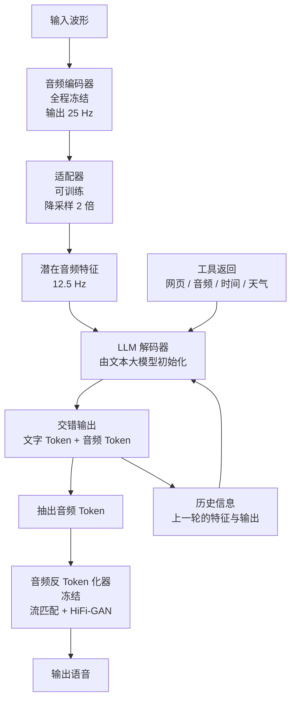
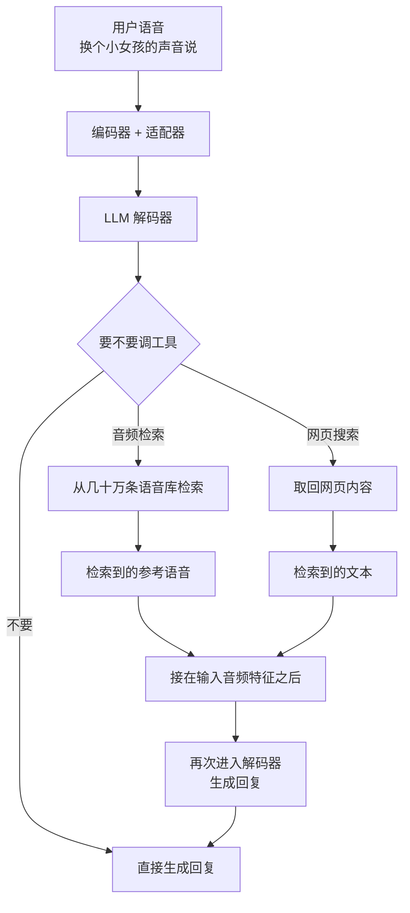
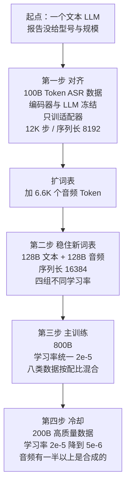
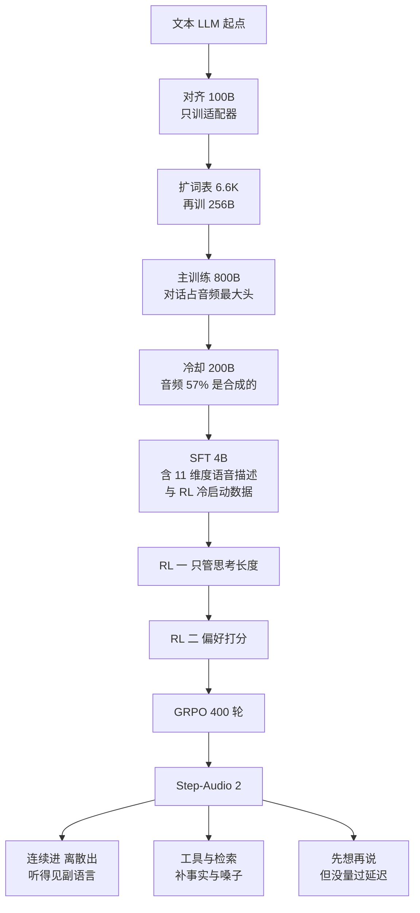

# Step-Audio 2：进来的声音不转成字，出去的嗓子可以检索

<!-- release-date: 2025-08-29 -->

> 本文依据 StepFun Audio Team 的 **Step-Audio 2 Technical Report**，即 arXiv:2507.16632，**版本为 v3（2025-08-27 提交）**。全文页码均指该 v3 PDF 自身的页码，与 v1、v2 不通用（差异见文末「你读到的可能不是这一版」一节）。
>
> 全文严格区分三件事：报告明确写了什么、我们如何解释它、哪些是外部资料补充。凡是外部补充都会给出链接并标明；报告没写的地方会直接写「报告没写」，不拿别处的做法去填。

## 一段话被弄丢了三次

假设你对着一个语音助手说这么一句：

> 「（叹气）……算了。你帮我查一下今天大盘怎么样吧。」

传统做法是三个现成系统串起来：语音识别把声音变成文字，语言模型读文字生成回复，语音合成把回复读出来。业内把这叫**级联流水线**。这句话走完这条流水线，会被弄丢三次。

**第一次丢在入口。** 识别模块的任务是「把声音变成正确的字」，所以它输出的是 `算了。你帮我查一下今天大盘怎么样吧。`。那一声叹气不是字，被丢了；「算了」两个字里的疲惫也不是字，被丢了。后面的语言模型看到的是一行干干净净的文本，它没有任何办法知道用户此刻的状态。报告在引言里把这类信息统称为**副语言信息**（para-linguistic information），并且明确说，以前那批模型「主要把语音输入里的语义信息对齐到文本模态，忽略了对理解意图同样关键的副语言信息」（PDF p.1）。

**第二次丢在中间。** 「今天大盘怎么样」这个问题，模型的参数里没有答案，因为参数是几个月前冻结的。一个没有外部信息来源的模型，面对这类问题只有两个选择：说不知道，或者编一个。报告把这件事写成第二个动机——现有模型「经常出现幻觉，可选的音色和说话风格也很有限，缺少通往真实世界文本与声学知识的通路」（PDF p.2）。

**第三次丢在出口。** 就算前两步都做对了，合成模块能用的嗓子还是出厂时那几副。你想让它「用一个四川老大爷的语气念」，得先有人预先为你录过、标过、训过这个音色。没有，就没有。

这三次丢失不是三个独立的 bug，它们指向同一件事：**这条流水线上，声音只在两端存在，中间那段是文字世界**。而文字世界里既没有语气，也没有今天，更没有嗓子。

Step-Audio 2 这份报告要做的，就是把这三处都堵上：入口不转文字、中间接检索、出口的嗓子可以现查。后面每一节都是在给这三件事补机制和证据。

## 读之前：把语音这条线补到刚好够用

这一节是**通用背景**，不是这份报告的内容，目的是让没有语音背景的读者能独立读完后面的正文。报告自己讲到的地方，正文会另外标页码。

### 声音要压缩成什么，模型才吃得下

原始声音是一串采样点。常见配置是一秒采一万六千到两万四千次，一小时录音就是几千万个数。这个密度直接喂给语言模型不现实，中间必须有一层压缩。

压缩后有两种形态，差别很大：

- **连续特征**（也叫潜在特征、latent feature）：一小段声音被压成一个浮点向量。它保留的信息多，能带上音高、语速、音质这些细节，但它不是词表里的编号，模型没法「生成」它，只能「读」它。
- **离散音频 Token**：一小段声音被映射成词表里的一个整数编号，和文字 Token 平级。它信息量更少，但因为是编号，模型可以像写字一样一个个吐出来，再交给一个解码器还原成波形。

一句话记住：**连续特征适合进模型，离散 Token 适合出模型**。这句话是理解这份报告架构的钥匙。

### 帧率：一秒钟占几个位置

压缩之后，一秒声音变成多少个向量或多少个编号，叫**帧率**（frame rate），单位是赫兹（Hz）。25 Hz 就是一秒 25 个。

帧率直接决定成本，因为语言模型的上下文窗口是按位置数算的。一秒声音占 25 个位置，一分钟就是 1500 个，一小时是 9 万个。所以做语音大模型的人一定会想办法把帧率压下去。

### 端到端到底端掉了什么

「端到端」在这条线上有个具体含义：**声音直接进模型，声音直接出模型，中间不经过文字这个瓶颈**。它的好处是信息不在中途被文字过滤掉，坏处是你得在同一组参数里同时学会听、想、说三件互相拉扯的事。

注意一个容易混淆的点：端到端**不等于**模型内部不产生文字。Step-Audio 2 的输出恰恰是文字 Token 和音频 Token 交错的序列（PDF p.6）。「端到端」说的是没有一个把声音降级成纯文本的中间瓶颈，不是说模型不写字。

### RAG 与工具调用

**RAG**（Retrieval-Augmented Generation，检索增强生成）说的是：模型回答之前，先去外部资料库查一段材料，把材料放进上下文，再基于材料作答。它解决的是「参数里没有的知识」和「参数里记错了的知识」。

**工具调用**（tool calling）是实现 RAG 的常见形式：模型不直接作答，而是先输出一段结构化的调用语句（调用哪个工具、传什么参数），由外部系统执行后把结果回填进上下文。判断一个工具调用做得好不好通常看三件事：该不该调（触发）、调哪个（选型）、参数对不对。

### 会反复出现的词，先认一遍

- **LALM**（Large Audio Language Model，大型音频语言模型）：能处理音频输入输出的大模型，报告全篇用这个缩写。
- **ASR / TTS**：语音识别 / 语音合成。
- **CER / WER**（字错误率 / 词错误率）：识别结果和标准答案比，错了多少。中文常用 CER，英文常用 WER，**越低越好**。
- **S2TT / S2ST**：语音到文本翻译 / 语音到语音翻译。
- **BLEU**：机器翻译的常用打分，**越高越好**。
- **SFT**（Supervised Fine-Tuning，监督微调）：拿「输入—标准答案」成对数据继续训练。
- **PPO / GRPO**：两种强化学习算法。PPO 需要额外训一个价值网络（critic）来估计「当前局面值多少分」；GRPO 省掉 critic，改用同一个问题的一组采样结果互相比较来算优势。
- **CoT**（Chain-of-Thought，思维链）：让模型先写一段推理过程，再给结论。
- **声码器**（vocoder）：把频谱还原成可播放波形的模块。
- **流匹配**（Flow Matching）：一类生成方法，这里用来从离散音频 Token 生成梅尔频谱。
- **VAD**（Voice Activity Detection，语音活动检测）：判断某一小段音频里有没有人在说话，用来切分和判断「用户说完了没有」。

## 一句话先说清

Step-Audio 2 是一个**端到端的音频语言模型**：波形直接进，文字和音频 Token 交错着出。

它把四件事绑在了一起：

1. **一进一出用两种不同的表示**。输入侧走连续的潜在特征，保住副语言细节；输出侧走离散的音频 Token，保住可生成性（PDF p.6）。
2. **给模型接上外部工具，其中一个是「音频检索」**。web search 检索事实，audio search 检索**声音本身**，从一个几十万条语音的库里取回一段参考音，让模型照着换音色和说话风格（PDF p.6）。这是报告自称「LALM 独有」的一项设计。
3. **1.356T Token 的四阶段续训**，从一个文本大模型出发，21 天把音频接进同一个序列空间；每一阶段的数据配比在报告里逐项列出（PDF p.7）。
4. **CoT 加多阶段强化学习**，而且第一段 RL 的奖励**只管思考长度、不管答案对错**——因为在语音对话里，多想一句话就是多等一段时间（PDF p.8–9）。

如果只记一个判断，可以记这个：

> **这份报告真正的主张，是「不要让模态在中途降级」。** 输入端不降级成文字，所以听得见叹气；知识端不降级成参数记忆，所以答得出今天；音色端不降级成一张枚举表，所以换得了嗓子。

后面按这条线展开。

## 全景：一次对话在模型里走的路

报告的 Figure 3（PDF p.6）画了整体架构。下面这张按它和 §3.1 正文重画，只表示数据通路与冻结关系，**不表示时序，也不含任何延迟数据**：

图中「冻结」两处对应 Figure 3 上的雪花图标与正文「音频编码器在整个训练过程中冻结」（PDF p.6）。适配器与 LLM 解码器在 Figure 3 上是火焰图标，表示参与训练。

这张图里有四个值得单独讲的位置：**入口的两种表示、出口的反 Token 化器、旁路的工具、以及回流的历史信息**。下面逐个走。

### 报告把自己放在哪条线上

§2 的相关工作占了整整两页（PDF p.4–5），是一份综述而不是自家主张，所以本文不逐篇复述，只交代它把自己放在了哪个坐标里。报告把前人分成四条线：

| 线 | 代表工作 | 报告的定位 |
|---|---|---|
| 语音与音频理解 | SALMONN、Seed-ASR、AudioPaLM、Qwen-Audio 系列 | 「语音编码器 + 轻量适配器 + LLM」是主流范式，Step-Audio 2 沿用这条入口结构 |
| 语音合成 | VALL-E、SPEAR-TTS、CosyVoice 2、SparkTTS、Kimi-Audio | 编解码语言模型 + 声码器；Step-Audio 2 的输出侧与反 Token 化器就在这一脉 |
| 语音到语音翻译 | Translatotron 系列、TransVIP | 直接生成目标语音、绕开文字中介；对应报告的 S2ST 能力 |
| 端到端语音对话 | GPT-4o、Moshi、Mini-Omni 系列、LLaMA-Omni、Freeze-Omni、Qwen2.5-Omni | 报告自己所在的赛道 |

这张表按 PDF p.4–5 的 §2.1–2.4 归纳。值得注意的是它把 **CosyVoice 2** 放在了 TTS 那一线（PDF p.4），而它同时也是 Step-Audio 2 音频 Token 化器的来源（PDF p.6）——引用关系和依赖关系是同一处。

作者名单也在附录里（PDF p.18）：分「模型」「基础设施」「数据与评测」三组核心贡献者，加上一长串贡献者与七位 sponsor；外部贡献者来自新加坡南洋理工大学（NTU）。人数量级在一百以上，**这不是一个小团队的实验，是一次产品级投入**。

## 设计一：连续进、离散出

### 旧问题：入口一离散化，就先聋了一半

最省事的做法是输入输出都用离散音频 Token：反正都要接进语言模型，统一成编号最干净。

问题在于离散化这一步是有损的，而且**损失的方向不由你决定**。音频 Token 是由一个编解码器（codec）或语义 Token 化器训练出来的，它的训练目标决定了它保留什么。以重建波形为目标的，会保留还原声音所需要的信息；以配合 ASR 为目标的，会保留区分字词所需要的信息。这两种目标都不等于「保留让人听出情绪的信息」。

所以，如果你在入口就把声音压成几千个编号里的一个，那么这段声音里的犹豫、气声、语速变化，能不能活下来完全看运气。等它进了语言模型，再想让模型「理解副语言信息」已经晚了——信息在词表边界上就没了。

### 新设计：两端故意用不同的表示

Step-Audio 2 的选择是**不对称**的（PDF p.6）：

- **输入侧**：音频编码器输出的是**连续的潜在音频特征**，经适配器投影后直接送进 LLM 解码器。它没有被塞进任何词表。
- **输出侧**：LLM 解码器输出的是**离散的音频 Token**，和文字 Token 共用一个词表、共用一次 softmax。

这个不对称是有道理的，理由正好是前面那句钥匙：连续特征信息多但不可生成，离散 Token 信息少但可生成。**既然进和出的需求不同，就没有理由逼它们用同一种表示。**

报告在引言里也把这个组合写成了 Step-Audio 2 相对上一代 Step-Audio 的主要变化：Step-Audio 2 「进一步把音频 Token 的**生成**也整合进了语言建模」（PDF p.6），意思是上一代在生成侧还不是这样。

### 走一遍数据通路，顺便把帧率算清楚

报告给的数字很具体（PDF p.6）：

- 音频编码器在多种语音与音频理解任务上预训练过，任务包括 ASR、**说话人年龄与性别预测**、音频事件检测等；
- 编码器输出帧率 **25 Hz**，且**在整个训练过程中冻结**；
- 适配器的降采样率是 **2**，于是进入 LLM 的帧率降到 **12.5 Hz**。

编码器的预训练任务清单值得多看一眼：里面有「年龄与性别预测」和「事件检测」，这说明它从一开始就不是一个纯 ASR 编码器。**它被要求听出的东西，比字多。** 后面副语言评测能拿到 83.09 分（PDF p.10），源头在这里。

12.5 Hz 意味着什么，可以自己算（**以下三个算式是我们做的**，报告只给了帧率）：

- 一段 30 秒的音频进模型，占 $30 \times 12.5 = 375$ 个序列位置；
- 第一阶段的序列长度 8192，最多能装 $8192 / 12.5 \approx 655$ 秒，约 11 分钟纯音频；
- 后面阶段的序列长度 16384，最多能装 $16384 / 12.5 \approx 1311$ 秒，约 22 分钟纯音频。

「最多」两个字要当真：真实对话里还有历史信息、系统提示、工具返回和输出 Token，实际能吃下的音频远短于这个上限。但这个数至少给了一个量级——**这个模型的上下文是按分钟算的，不是按小时算的。**

### 输出端：词表里多了 6.6K 个编号

扩词表这一步在预训练里（PDF p.7）：模型在文本 LLM 的 Token 化器基础上，**扩了 6.6K 个音频 Token**。Token 化器本身直接取自 CosyVoice 2（PDF p.6，报告引用 [19]）。

这里可以做一次交叉印证。**以下是外部补充**：CosyVoice 2 的语音 Token 化器用有限标量量化（Finite Scalar Quantization，FSQ），码本大小是 **6561**，实测利用率 100%，帧率 **25 Hz**（见 [CosyVoice 2 论文 arXiv:2412.10117](https://arxiv.org/abs/2412.10117) 的 Table 4 与 §2.2）。6561 恰好等于 $3^8$。

所以报告里的「6.6K」几乎肯定就是 6561 这个码本，而**输出侧的音频 Token 帧率应当是 25 Hz**。这两点报告自己都没写，是我们从它引用的 Token 化器推出来的，读者需要知道这是外部推断而非报告原文。

推出来之后有一个有意思的不对称：**输入侧 12.5 Hz，输出侧 25 Hz**。也就是说，同样一秒钟的声音，模型「听」它花 12.5 个位置，「说」它花 25 个位置。说比听贵一倍。这解释了为什么输出侧要和文字交错——如果全是音频 Token，一句十秒的回答就要吐 250 个 Token。

### 交错：图上是 1:3，正文没给数

输出序列里文字 Token 和音频 Token 是**按固定比例交错**的，末尾补齐以满足这个比例（PDF p.6）。

比例是多少，**正文没有给**。Figure 3 的示意图上画的是「一个灰色文字 Token 后面跟三个黄色音频 Token」，重复两轮（PDF p.6，**这是我们读图数出来的**）。但示意图就是示意图，不能当参数用。这里只作为一条观察记录。

为什么要交错而不是先写完文字再念？因为**交错等于让文字和声音在同一条时间轴上互相约束**。文字 Token 承担语义规划，音频 Token 承担声学实现，两者贴着走，可以避免「想好的和念出来的对不上」，也让流式输出成为可能——你不用等整段文字写完才开始发声。报告引用了三篇做交错的前作（[31, 32, 77]，PDF p.6），但没有解释自己为什么选这个比例，也没有做比例的消融。

### 出口：反 Token 化器是一个独立模块

音频 Token 被从交错序列里**抽出来**，交给音频反 Token 化器还原成波形（PDF p.6）。这个模块和 Step-Audio、Step-Audio-AQAA 同源，由两级组成（PDF p.7）：

1. **流匹配模块**：从音频 Token 生成梅尔频谱；
2. **HiFi-GAN 声码器**：把梅尔频谱变成波形。

报告在流匹配这一级做了一处改动并说明了收益：在 Transformer 块内**每个自注意力模块之后加一层 CNN 编码器**，并在 20 万小时高质量语音上训练；报告说这「显著提升了梅尔频谱重建能力，带来发音准确度和音色相似度上的实质增益」（PDF p.7）。

这是全篇少见的一次「加一个卷积」级别的具体架构改动。它的动机不难理解：自注意力擅长长程关系，但频谱的局部纹理（共振峰、过渡段）是强局部性的，补一层卷积正好补上这块。**报告没有给出这项改动的消融数据**，「显著提升」是作者陈述，不是实验结论。

另外，Figure 3 上反 Token 化器画的是雪花图标（PDF p.6），表示它在主训练里是冻结的。

### 代价与边界

这个设计的代价要说清楚三条：

**第一，编码器冻结意味着模型永远不会改善自己的听力。** 训练全程冻结（PDF p.6）的好处是稳定、便宜、不会被后续训练污染；坏处是编码器丢掉的信息，后面无论怎么训都补不回来。你只能选一个足够好的编码器，然后接受它的上限。

**第二，进和出不在同一个空间，模型没法「复述自己」。** 它听到的是连续特征，说出的是离散 Token。它无法把自己刚说的那句话的声学表示，和它听到用户那句话的声学表示放在一起比较。报告没有讨论这个问题。

**第三，报告没有公开任何参数量。** 编码器多大、适配器多大、解码器多大、初始的那个「文本 LLM」是哪一个，全文一个数都没有。唯一的线索是一句相对表述：Step-Audio 2「参数比 Step-Audio 少」（PDF p.2），而 Step-Audio 是 1300 亿参数（PDF p.1）。所以我们只知道 **Step-Audio 2 小于 130B**，仅此而已。

### 可迁移启发

**输入表示和输出表示没有理由必须相同。** 判断标准是两个不同的问题：输入侧问「哪种表示丢的信息最少」，输出侧问「哪种表示模型能生成」。多模态系统里这两个答案经常不一样，硬要统一就是在给其中一端做无谓的让步。

同一条思路在别处也成立：检索系统的索引表示和召回表示可以不同；日志系统的采集格式和查询格式可以不同；训练时的数据表示和推理时的缓存表示可以不同。**「统一表示」是一种审美，不是一条工程约束。**

## 设计二：把「换个嗓子」变成一次检索

这是这份报告里最有辨识度的一块，也是它自己点名的新东西：**音频检索作为一种工具，是 LALM 独有的**（PDF p.2）。

### 旧问题：音色是枚举出来的

一个语音模型能说几种嗓子，取决于训练时给了它几种。要加一种，就要收数据、标注、训练、上线。所以产品上永远是一张有限的音色列表，用户只能从中挑。

想要「像刚才那个人那样说话」「像四川老大爷那样说话」，列表里没有就是没有。报告把这写成现有 LALM 的一个缺陷：「可选的音色和说话风格很有限」（PDF p.2）。

同一段话还提了另一个缺陷：**幻觉**。这两件事表面上没关系，但在报告的解法里它们是同一个问题的两面——**模型缺的是「通往真实世界文本与声学知识的通路」**（PDF p.2）。事实缺口和音色缺口，都是缺口。

### 新设计：两类工具，一类检索文字，一类检索声音

报告设计了一组工具，用显式或隐式的语音指令触发（PDF p.6）：

| 工具 | 取回什么 | 补的是哪种缺口 |
|---|---|---|
| 网页搜索 | 网页内容 | 参数里没有的事实 |
| 天气预报 | 天气数据 | 实时状态 |
| 当前日期与时间 | 时间 | 模型天生不知道「今天」 |
| **音频检索** | 一段参考语音 | 音色与说话风格 |

这张表按 PDF p.6 的 §3.1 正文整理。

音频检索的库，报告给的规模是**几十万条语音，每条都带对应的转写文本和描述**（PDF p.6）。

「带转写和描述」这半句是整个设计的关键。因为检索的查询来自用户的语音指令（比如「你能像个小女孩那样说话吗」），而被检索的对象是波形。**声音和文字之间没法直接比相似度**，所以库里的每条语音必须挂一段可以被文本匹配的描述。检索实际发生在描述这一层，取回来的才是波形。

### 工作机制：检索结果接在音频特征后面

报告写得很短但很关键：**推理时，检索到的信息被追加在输入音频特征之后，然后才开始生成语音输出**（PDF p.7）。

这张图按 PDF p.6–7 的 §3.1 正文重画，报告没有为这条流程配图；分支条件是我们按正文归纳的，**不代表报告给出的具体判定逻辑**。

值得停一下的是：**检索回来的参考语音是以什么形式进入模型的**。报告说它「追加在输入音频特征之后」，也就是说它走的是和用户语音同一条入口——编码器、适配器、连续潜在特征。这一点很自然，但它带来一个漂亮的性质：**参考音成了上下文的一部分，而不是一个需要额外接口的条件输入**。模型不需要一个专门的「音色编码器」，也不需要一个音色 ID 表。它只是听到了一段声音，然后照着说。

用一句话概括这个机制：**它把零样本音色克隆改造成了一次检索调用**。零样本克隆本身不是新东西，新的是把「找哪段参考音」这一步交给模型自己用语音指令去检索。

### 收益：Table 5 给的证据

报告为工具调用专门造了一个测试集 **StepEval-Audio-Toolcall**（PDF p.12）：每类工具用文本 LLM 生成 200 段多轮对话脚本，每段 3–6 轮，最后一轮必须带对某个特定工具的调用意图；再配等量的负样本，负样本的最后一句要么没有调用意图，要么意图指向别的工具；然后用自家的对话合成流水线把脚本合成为语音，最后用 Qwen3-32B 自动判分。数据集连同脚本、合成语音和评测脚本一起放出（PDF p.12）。

对照组只有一个，而且不是同类：**Qwen3-32B，一个纯文本模型，用文本输入评测**（PDF p.13，表注 †）。报告说明了原因——没有别的 LALM 提供自定义工具调用（PDF p.12）。

Table 5 的数字（PDF p.13）：

| 指标 | 音频检索 | 日期与时间 | 天气 | 网页搜索 |
|---|---|---|---|---|
| Qwen3-32B 触发 精确率/召回率 | 67.5 / 98.5 | 98.4 / 100.0 | 90.1 / 100.0 | 86.8 / 98.5 |
| Step-Audio 2 触发 精确率/召回率 | **86.8 / 99.5** | 96.9 / 98.4 | 92.2 / 100.0 | 88.4 / 95.5 |
| Qwen3-32B 类型准确率 | 100.0 | 100.0 | 98.5 | 98.5 |
| Step-Audio 2 类型准确率 | 100.0 | 100.0 | 90.5 | 98.4 |

（日期与时间工具没有参数，参数准确率一栏为 N/A；两个模型在其余三类工具上的参数准确率都是 100.0。）

**这张表的读法是我们整理的**，报告本身把它排成了另一种版式。三点结论：

1. **音频检索这一格差距最大**：触发精确率 67.5 → 86.8，差 19.3 个点。精确率低意味着**误触发**——Qwen3-32B 在不该调音频检索的时候调了。报告的解读是这体现了多模态模型相对文本模型的专长（PDF p.12）。往下推一句：「换个声音说」这类意图，很大程度上藏在用户**怎么说**而不是说了什么里，一个只读转写文本的模型自然分不清。
2. **它不是全面领先**。天气工具的类型准确率 Step-Audio 2 是 90.5，比 Qwen3-32B 的 98.5 低 8 个点；日期时间的触发精确率和召回率也都略低；网页搜索的召回率 95.5 低于 Qwen 的 98.5。报告正文只写了「与文本 LLM 相当，且在音频检索上显著更好」（PDF p.12），没有提这几格。
3. **这个对照没法回答「音频检索这个功能做得好不好」**。它测的是「该不该调、调哪个、参数对不对」，全都是调用层面的。**检索本身的质量——取回来的那段语音像不像用户要的、换音色之后听感如何——报告没有任何评测。**

### 代价与边界

音频检索这一节是报告里想法最好、细节最少的一节。没写的东西包括：

- **检索算法**。是稠密向量检索、文本匹配、还是别的，报告只字未提。
- **索引与描述的来源**。几十万条语音的转写和描述是人标的还是模型生成的，没写。
- **库的来源与授权**。几十万条真人语音从哪来，报告没有讨论。
- **检索质量的评测**。前面说过了，一个数字都没有。
- **延迟代价**。一次检索意味着一次外部调用，在实时语音对话里这是要计入等待时间的。报告没有给任何延迟数字。

### 可迁移启发

**当你的输出空间里有一个「无法枚举」的维度时，把它变成可检索的，而不是可选择的。**

判断标准很简单：如果你正在维护一张「支持的风格/音色/模板/人设」列表，并且这张列表的增长速度赶不上用户的需求，那么这个维度就该做成检索。做成检索之后，扩展这个维度不再需要训练，只需要往库里加条目。

第二条，稍微技术一点：**要让 A 模态可检索，通常得给它挂一层 B 模态的描述**。这里是给语音挂转写和描述。同一招在图片库、音效库、代码片段库上都成立——真正被检索的往往是描述，被返回的才是原件。

第三条：**参考样本作为上下文，比参考样本作为条件输入更通用**。前者不需要为每种条件设计一个接口，模型只要能读这个模态就行。代价是它吃上下文长度。

## 设计三：1.356T Token 的四步续训

底座不是从零开始的。模型**由一个文本 LLM 初始化**，然后在 1.356T Token 的文本与音频数据上**续训 21 天**（PDF p.7）。那个文本 LLM 是哪一个，报告没说。

这张图按 PDF p.7 的 §3.2 正文重画。方框大小不代表算力占比，图上也没有时间比例。

### 第一步：先只训适配器

第一阶段用 **100B Token 的 ASR 数据**，目的是「让语音和文本的特征空间在适配器里有效对齐」。这一阶段**音频编码器和 LLM 全部冻结，只训练适配器**；训 12K 步，序列长度 8192，学习率从 $10^{-4}$ 衰减到 $2 \times 10^{-5}$（PDF p.7）。

为什么要这样？因为此刻适配器是随机初始化的。一上来就全参数训练，随机的适配器会往解码器里灌噪声，解码器为了适应噪声会开始破坏自己原有的文本能力，而这种破坏事后很难恢复。

先冻两端只训中间，等于说：**先把接口谈拢，再谈业务**。

顺带注意这个阶段的学习率上限是 $10^{-4}$，比后面任何一个阶段都高一个量级。**新参数放开、旧参数不动**，这是同一条原则的两半。

### 扩词表：6.6K 个音频 Token

对齐完成后扩词表（PDF p.7）。这一步之后，模型的输出空间里第一次有了「声音」这个选项。

### 第二步：128B + 128B，四组不同的学习率

这一阶段的目的报告写得很明确：**为了妥善嵌入新的音频 Token，同时保住模型原有的文本能力**（PDF p.7）。数据是 128B 文本 Token 加 128B 音频 Token，序列长度提到 16384。

音频那 128B 的内部构成（PDF p.7）：

| 类型 | Token 数 | 占比 |
|---|---:|---:|
| TTS | 80B | 62.5% |
| 语音到语音对话 | 32B | 25.0% |
| 句级文本—语音交错续写 | 16B | 12.5% |
| 合计 | 128B | 100% |

（占比一列是我们算的，报告只给了绝对值。 $80+32+16=128$ 能对上。）

这个配比在说什么？**TTS 占了六成以上。** 想想也对：新加进词表的是**音频 Token**，而 ASR 数据里音频只在输入侧，不产生任何音频 Token 的监督信号。要让新词表里的 6.6K 个编号学到东西，必须让它们大量出现在**输出侧**，而 TTS 正是「输入文字、输出音频 Token」的纯粹形式。所以第一步用 ASR 训输入侧的接口，第二步用 TTS 训输出侧的词表——分工非常清楚。

学习率这一段最值得抄（PDF p.7）：

| 部件 | 学习率 |
|---|---:|
| LLM | $2 \times 10^{-5}$ |
| 适配器 | $5 \times 10^{-5}$ |
| 嵌入层 | $5 \times 10^{-5}$ |
| 输出层 | $4 \times 10^{-5}$ |

判据还是那条：**新初始化的放开，已经训好的收紧**。适配器刚训了一轮但还年轻，嵌入层里刚塞进 6.6K 个随机向量，输出层刚多了 6.6K 行，这三个都需要快速学；LLM 主干是要保护的资产，给它最小的学习率。

这一组数字比「统一调一个全局学习率」细一档，实现代价却几乎为零。**报告没有给这组学习率的消融**，所以「这样更好」是设计判断，不是实验结论。

### 第三步：800B 主训练，配比里藏着优先级

主训练再加 800B Token，**学习率统一到 $2 \times 10^{-5}$** ——保护期结束，各部件同步（PDF p.7）。

数据构成（PDF p.7）：

| 类别 | Token 数 |
|---|---:|
| 文本 | 400B |
| 语音到语音对话 | 150B |
| TTS | 120B |
| 句级文本—语音交错续写 | 45B |
| ASR | 42B |
| 文本到语音翻译 | 30B |
| 语音到文本翻译 | 8B |
| 语音到文本续写 | 5B |

**这张表是我们按数值大小重排的**，报告是按另一种顺序平铺在正文里的。加法能对上： $400 + 150 + 120 + 45 + 42 + 30 + 8 + 5 = 800$。

排完序，优先级就露出来了：

- **文本占一半（400B / 800B）**。这是防遗忘的配重。一个音频模型如果把文本能力训掉了，它连话都说不明白。
- **语音到语音对话是音频里的第一名（150B）**，压过 TTS。这说明这一阶段的目标已经不是「学会发声」，而是「学会对话」。
- **ASR 只有 42B**，在八类里排第五。因为第一步已经用 100B 的 ASR 做过对齐了，此处不需要重复投入。
- **翻译类加起来 38B**，是最小的一块。它们更像是「顺手带上的能力」而不是主线。

报告没有解释这套配比是怎么定的，也没有做配比消融。但配比本身就是一份优先级声明，**读配比比读文字更能看出一个团队想要什么**。

### 第四步：200B 冷却，一半以上是合成的

最后 200B 高质量数据做冷却，学习率从 $2 \times 10^{-5}$ 衰减到 $5 \times 10^{-6}$（PDF p.7）。这一阶段引入更多任务类型。

音频部分分成两半（PDF p.7）：

| 来源 | 类型 | Token 数 |
|---|---|---:|
| 真实数据 | 多语种与方言 ASR | 24.6B |
| 真实数据 | TTS | 12.4B |
| 真实数据 | 语音到文本翻译 | 3.6B |
| 真实数据 | 副语言信息理解 | 2.4B |
| 合成数据 | 语音到语音对话 | 36B |
| 合成数据 | 句级文本—语音交错对话 | 15B |
| 合成数据 | 语音到语音翻译 | 6B |

真实 43B，合成 57B，合计 100B 音频；另配 100B 高质量文本，凑成 200B。**这张表的分组与三个求和是我们做的**，报告是按两句话平铺的。

有两件事必须说破：

**第一，冷却阶段的音频有 57% 是合成的。** 冷却阶段是整个预训练里离最终模型最近、单位数据影响最大的一段，而它超过一半的音频来自自家的对话合成流水线。这不是问题，但它是一个必须知道的事实——**模型的说话方式在很大程度上是被自己的合成器塑造的**。报告没有讨论这带来的分布收窄风险。

为了缓解多样性问题，报告说合成时**参考了一个约 5 万个不同说话人的库**（PDF p.7）。5 万个说话人是个不小的数，但说话人多样性不等于内容多样性，也不等于交互模式多样性。

**第二，「副语言信息理解」只有 2.4B**，是所有类别里最小的一块之一。而这恰恰是报告最看重、评测里得分最亮眼的能力（83.09，PDF p.10）。这两个数放在一起挺有意思：**这条能力主要不是靠冷却阶段这 2.4B 建立的，而是靠编码器预训练时就带上的年龄、性别、事件等任务，再加上 SFT 阶段那个 11 维度的语音描述任务。** 这是我们的解读，报告没有明说因果。

### 两个能自己验的加法

**第一个能对上。** 报告说总量 1.356T（PDF p.7），各阶段相加：

$$
100\text{B} + (128\text{B} + 128\text{B}) + 800\text{B} + 200\text{B} = 1356\text{B} = 1.356\text{T}
$$

**这个加法是我们做的。** 它严丝合缝，说明四个阶段就是全部，没有隐藏的第五段。这类验算值得每篇报告都做一次——对不上的时候，通常说明你漏读了一个阶段。

**第二个对不上。** 引言说模型在「**680B Token 的文本数据**和 800 万小时的真实与合成音频数据」上训练（PDF p.3）。但把 §3.2 里明确标为「文本数据」的部分加起来：

$$
128\text{B} + 400\text{B} + 100\text{B} = 628\text{B}
$$

差 52B。SFT 阶段还有 4B「文本与音频数据」（PDF p.8），加进去也只有 632B。**这个减法是我们做的，报告没有解释这个差额。** 可能的原因有几种——交错数据里的文本部分被单独计入、第一阶段 ASR 数据里的转写文本被计入、或者引言里就是个约数——但报告没给依据，我们不猜。读者引用「680B 文本」这个数时应当知道它和分项对不上。

顺带，「800 万小时」这个数在正文里也找不到分项支撑，报告只在引言和结论里各写了一次（PDF p.3、p.14）。

### 21 天能算出什么

报告给了训练时长 21 天（PDF p.7），但**没有给卡数、卡型和算力**。能算的只有一个吞吐（**这个除法是我们做的**）：

$$
\frac{1.356 \times 10^{12}}{21 \times 86400} \approx 7.5 \times 10^{5}\ \text{Token/秒}
$$

约每秒 75 万 Token。这个量级需要相当规模的集群，但没有参数量就没法反推卡数——同样的吞吐，7B 模型和 70B 模型需要的卡数差一个量级。所以这个数只能用来判断「这不是小作坊训练」，不能用来估成本。

### 可迁移启发

**给不同部件设不同学习率，判据是「新初始化的 vs 全局枢纽」。** 这份报告在两个阶段用了两次（第一步只训适配器、第二步四组学习率），成本极低，值得成为默认动作。

**数据配比就是优先级声明。** 做多任务训练时，把配比按数值排序看一遍，你会发现它经常和你嘴上说的重点不一致。不一致的时候，通常是配比是对的、话术是错的。

**用自家模型合成训练数据时，要清楚你在继承什么。** 这份报告的冷却阶段有 57% 的音频是合成的。这种做法在成本上非常划算，但它意味着最终模型的说话方式、情绪表达范围、对话节奏，都被合成器的分布圈住了。至少要做的一件事是：留一批纯真实数据的验证集，专门看多样性有没有塌缩。

## 设计四：先教它「想得短」，再教它「想得好」

### 旧问题：想一句话，就是让用户多等一会儿

CoT 在文本模型上是纯赚的：多写几百个 Token，换更高的正确率，用户多等两秒。

语音对话里这笔账不一样。用户说完话，如果超过一定时间没有声音，体验就断了。此时模型每多想一个 Token，就是往这个静默里多加一段时间。**所以在语音场景里，「想得对」和「想得快」是直接冲突的，而且冲突体现在同一个变量上：思考序列的长度。**

Step-Audio 2 是会先想再说的。Figure 2 的最后一格画了一个完整例子（PDF p.3）：用户说「晚上好……我有点心神不宁，不知道能不能跟你聊聊」，模型先输出一段对说话人的观察（「年轻男性，20–25 岁，语气温和略带沉思，语速平稳自然，有轻微背景噪音，使用标准普通话」），再输出一段关于该怎么回应的推理，然后才给出回复。**这段观察和推理都要占解码步数。**

### 新设计：三段 RL，第一段只管长度

报告的做法是分三段（PDF p.8–9）：

| 阶段 | 算法 | 奖励 | 迭代数 | 超参 |
|---|---|---|---:|---|
| 第一段 | PPO | 二值：思考长度合适给 1，否则 0 | 60 | 全局 batch 64，actor 学习率 $1 \times 10^{-6}$，critic 学习率 $2.5 \times 10^{-6}$ |
| 第二段 | PPO | 学到的偏好打分（奖励模型） | 120 | 与第一段相同 |
| 第三段 | GRPO | 报告未说明 | 400 | 报告未说明 |

这张表按 PDF p.8–9 的 §3.4 正文整理。

第一段的奖励函数值得完整念一遍。报告的定义是：**推理「既不为空，也不过长」时奖励为 1，否则为 0**（PDF p.9）；这一段的目的写得很直白——「为实时音频交互优化推理效率」。

这句话的分量在于它**没有说的部分**：这个奖励**完全不关心推理是否正确**。它只有一个诉求——把思考长度约束在一个预设的上限之内。

### 为什么顺序是「先短后好」

反过来会怎样？如果先用偏好模型训质量，模型会发现一件事：**多想通常更容易得高分**。于是思考长度会一路涨。等你后面再想把它压回去，你压的就是一个已经把「长」和「好」绑在一起的策略，代价会大得多。

先用一个纯长度奖励把「简短」这个约束刻进去，再在这个约束内部去追质量，等于**先划定预算，再在预算内优化**。这是一条很朴素但很有用的顺序原则。

第三段用 GRPO 再跑 400 次迭代，报告说目的是「进一步提升模型的音频感知能力」（PDF p.9），但没有说这一段用什么奖励、用什么数据。这是这一节最大的空白——**400 次迭代是三段里最长的一段，却是描述最少的一段**。

### RL 的原料来自 SFT

RL 不是凭空开始的。SFT 阶段专门构建了两套「以推理为中心」的数据集给 RL 做冷启动（PDF p.8）：

1. **复杂声学场景理解**：把 AudioSet 和 AudioCaps 的多段音频**混合叠加**，人为造出复杂的声学环境，训练模型在里面稳定地听出东西。
2. **副语言对话**：用文本 LLM 生成带合适情绪描述的对话脚本，再用自家的对话合成流水线合成为语音对话。

然后，用一个**带推理能力的文本 LLM**，根据「音频的混合配方」或「生成的对话脚本」，产出带显式分步推理轨迹的问答对（PDF p.8）。

这一步的设计很聪明，值得单独说：**推理轨迹的正确性来自构造过程，而不是来自模型的猜测。** 因为这段音频是他们自己混出来的，配方里写着「第 3 秒混入狗叫，第 7 秒混入门铃」，所以「这段音频里有什么」这个问题有一个确定的答案；对话脚本也是他们自己生成的，所以「说话人是什么情绪」也有确定的答案。文本 LLM 要做的只是把这份已知的答案**展开成一条像样的推理链**，而不是去推断它。

**可迁移启发**：想要高质量的推理轨迹数据，最省力的办法不是让模型去推理真实样本，而是**先构造一个你已经知道答案的样本，再让模型把已知答案写成推理过程**。这条路在合成数据、单元测试生成、故障注入训练里都成立。它的边界也很清楚——这样造出来的推理链是「事后合理化」，和模型真正遇到未知样本时该怎么想，未必是一回事。

### 一处引用错误

报告在 §3.4 里两次引用同一个编号：「proximal policy optimization (PPO) [54]」（PDF p.8）和「group relative policy optimization (GRPO) [54]」（PDF p.9）。

但参考文献 [54] 是 Rafailov 等人的 **Direct preference optimization: Your language model is secretly a reward model**（PDF p.16）。DPO 既不是 PPO 也不是 GRPO，而且 DPO 的整个卖点恰恰是**不做在线强化学习**。

**这是报告的一处笔误，与它描述的方法本身无关**——正文写的流程（actor/critic 两个学习率、逐迭代的在线优化）明确是 PPO 家族的做法，不是 DPO。**以下是外部补充**：PPO 的原始论文是 Schulman 等人的 [arXiv:1707.06347](https://arxiv.org/abs/1707.06347)，GRPO 出自 DeepSeekMath 的 [arXiv:2402.03300](https://arxiv.org/abs/2402.03300)。

指出这个不是为了挑刺，而是因为**读报告时凡是「一个编号被用在两个不同方法上」都该警惕**：要么是排版失误，要么是作者真的把两件事搞混了。这里从上下文能判断是前者。

### 这一节的空白

- 奖励模型（第二段用的那个）的规模、训练数据、评估，全都没写。
- 第三段 GRPO 的奖励设计、数据、超参，全都没写。
- 第一段那个「过长」的阈值是多少，没写。
- 用什么 RL 框架、跑在什么硬件上、花了多久，没写。
- **最要命的一处**：整套 RL 的动机是「为实时音频交互优化推理效率」（PDF p.9），但**报告从头到尾没有给出一个以毫秒计的延迟数字**。压缩思考长度到底省下了多少时间，没有测量。

## 实验：六块地方，分开算账

报告的评测覆盖六项：ASR、副语言理解、音频理解、语音翻译、工具调用、语音到语音对话（PDF p.9–13）。它们的证据强度差别很大，需要分开看。

### 先说怎么读 Figure 1

封面的雷达图（PDF p.2）是全篇最容易误读的一张图，因为它把两种方向相反的指标画在了同一张图上。

ASR 那几个轴（AISHELL-2、LibriSpeech test-clean）画的**不是错误率，是准确率**，即 $100 -$ 错误率。可以验算（**以下两个减法是我们做的**）：

- AISHELL-2：Step-Audio 2 在 Table 1 里是 2.10（PDF p.10），$100 - 2.10 = 97.90$，图上标 97.9 ✓
- LibriSpeech test-clean：Table 1 是 1.17，$100 - 1.17 = 98.83$，图上标 98.8 ✓

其余各轴（MMAU、URO-Bench、CoVoST 2、CVSS、StepEval-Audio-Paralinguistic）直接就是越高越好的分数。所以整张图是统一的「越外圈越好」，**但 ASR 那几个轴上的绝对差距会被压缩**——2.10 和 2.67 的错误率差 27%，画成 97.9 和 97.3 只差 0.6，几乎看不出来。看雷达图判断 ASR 优劣是不可靠的，要回 Table 1。

### ASR：平均值第一，但赢在难的那一半

评测覆盖 6 个中文测试集、4 个英文、3 个多语种（日语、粤语、阿拉伯语）、6 个内部的中文方言与带口音普通话测试集；对照是 Doubao LLM ASR、GPT-4o Transcribe、Kimi-Audio、Qwen-Omni，其中前两个是专用 ASR 系统。评测时**不指定语种**，以保证公平（PDF p.9）。

四档平均值（PDF p.10）：

| 类别 | Doubao LLM ASR | GPT-4o Transcribe | Kimi-Audio | Qwen-Omni | Step-Audio 2 |
|---|---:|---:|---:|---:|---:|
| 英文平均 | 6.17 | 4.50 | 4.18 | 5.35 | **3.14** |
| 中文平均 | 3.81 | 14.05 | 3.75 | 4.81 | **3.08** |
| 内部方言与口音平均 | 14.66 | 40.49 | 25.52 | 19.40 | **8.85** |

四档里三档第一，没有争议。但**逐项看，图景要有意思得多**。把 Table 1 的 19 个测试集一个个过一遍，Step-Audio 2 拿到最好成绩的是 10 个，另外 9 个属于别人（**这个统计是我们做的**，报告没有列这个视角）：

| 输掉的测试集 | 赢家 | 赢家的值 | Step-Audio 2 |
|---|---|---:|---:|
| FLEURS English | GPT-4o Transcribe | 2.71 | 3.03 |
| FLEURS Chinese | GPT-4o Transcribe | 2.62 | 2.68 |
| FLEURS Arabian | GPT-4o Transcribe | 11.72 | 14.22 |
| WenetSpeech net | Doubao LLM ASR | 4.46 | 4.67 |
| Common Voice yue | Qwen-Omni | 7.89 | 7.90 |
| 安徽口音 | Doubao LLM ASR | 8.83 | 10.61 |
| 广东口音 | Kimi-Audio | 3.76 | 3.81 |
| 广西口音 | Qwen-Omni | 3.35 | 4.11 |
| 四川方言 | Doubao LLM ASR | 3.01 | 4.35 |

把赢和输放一起看，会看出一条规律：**它输的地方大多是干净的朗读语音，赢的地方大多是脏的、难的语音**。

- FLEURS 三个语种全输——FLEURS 是标准朗读语料，录音质量高、语速稳定。
- 上海方言：Step-Audio 2 是 17.77，第二名 Doubao 是 47.49，差 $47.49 / 17.77 \approx 2.7$ 倍。
- 山西口音：12.44 对 20.26，差 1.6 倍。
- KeSpeech（重口音普通话）：3.63 对 Kimi 的 5.11。
- WenetSpeech meeting（会议录音）：4.75，是五个系统里最低的。

（以上两个倍数是我们算的。）

同一张表还给了一个反向的例子：**GPT-4o Transcribe 在 FLEURS 上是所有系统里最好的，但在中文方言上全面崩溃**——上海方言 89.58、山西口音 55.03、安徽口音 50.55、WenetSpeech meeting 31.40。它 14.05 的中文平均值几乎完全由这几格拉高。

这两件事合起来给了一个很实用的选型经验：**平均值只告诉你一个系统的重心在哪，不告诉你它在你的场景里行不行。** 如果你的音频是干净的朗读稿，这张表上有比 Step-Audio 2 更好的选择；如果你的音频是带口音的真实对话，差距会比平均值显示的大得多。

### 副语言：83.09，以及那个反复出现的「11」

**StepEval-Audio-Paralinguistic** 是报告自建的基准（PDF p.9–10），构造过程写得很细：

- 550 条语音，均匀分布在 11 个任务上（$550 / 11 = 50$，每任务 50 条，**这个除法是我们做的**）；
- 其中 8 个任务的 400 条中文语音来自公开播客录音，覆盖性别、年龄、音色、情绪、音高、节奏、语速、说话风格、发声活动（$400 / 8 = 50$，对得上）；
- 另外 3 个任务（声音事件、场景、人声）各取 50 条，分别来自 AudioSet、CochlScene、VocalSound；
- 原始录音都短于 30 秒，统一重采样到 24000 Hz，标注由专业团队用开放集自然语言给出；
- 后 3 个任务的样本还会**混入合成语音**再拼接问题，以提高难度；
- 评测协议是先用 ASR 把模型输出转成文字，再用文本 LLM 自动判分；
- 测试集与评测代码**公开发布**在官方仓库（PDF p.10）。

结果（PDF p.11，Table 2）：

| 模型 | 平均 | 性别 | 年龄 | 音色 | 场景 | 事件 | 情绪 | 音高 | 节奏 | 语速 | 风格 | 人声 |
|---|---:|---:|---:|---:|---:|---:|---:|---:|---:|---:|---:|---:|
| GPT-4o Audio | 43.45 | 18 | 42 | 34 | 22 | 14 | 82 | 40 | 60 | 58 | 64 | 44 |
| Kimi-Audio | 49.64 | 94 | 50 | 10 | 30 | 48 | 66 | 56 | 40 | 44 | 54 | 54 |
| Qwen-Omni | 44.18 | 40 | 50 | 16 | 28 | 42 | 76 | 32 | 54 | 50 | 50 | 48 |
| Step-Audio-AQAA | 36.91 | 70 | 66 | 18 | 14 | 14 | 40 | 38 | 48 | 54 | 44 | 0 |
| Step-Audio 2 | **83.09** | 100 | 96 | 82 | 78 | 60 | 86 | 82 | 86 | 88 | 88 | 68 |

83.09 对 49.64，这是全篇差距最大的一项，而且是 11 个维度里 11 个都第一。这个结果很难用「调参」解释——它更像是**能力有无的差别**。基线模型在性别（18、40）、音色（34、10、16）、场景（22、30、28）这几列上的分数，接近于随机作答的水平。

不过有一件事需要读者知道，**报告没有把它连起来说**：SFT 阶段构建了一个内部的语音描述数据集，「要求模型生成涵盖 **11 个副语言与环境维度**的完整文字描述」（PDF p.8）；而这个基准评测的正好是「**11 个维度**」（PDF p.9）。报告没有明说这两个 11 是不是同一组维度，但两处用词高度接近。

这不构成作弊——基准是公开发布的，构造过程写清楚了，别人可以复现；而且「我们专门训了这个能力，然后测这个能力」本来就是正当做法。但它确实意味着：**这 83.09 度量的是「按自家定义的 11 个维度作答」的能力，而不是一个中立第三方定义的副语言理解能力**。别的模型没有针对这套维度训练过，分低是可以预期的。读这个数时应当带着这个背景。

### 音频理解与翻译：领先幅度要看清

**MMAU**（PDF p.11，用的是 v05.15.25 test-mini 版本）：

| 模型 | 平均 | 声音 | 语音 | 音乐 |
|---|---:|---:|---:|---:|
| Omni-R1 | 77.0 | 81.7 | 76.0 | 73.4 |
| Audio Flamingo 3 | 73.1 | 76.9 | 66.1 | **73.9** |
| Gemini 2.5 Pro | 71.6 | 75.1 | 71.5 | 68.3 |
| Qwen2.5-Omni | 71.5 | 78.1 | 70.6 | 65.9 |
| Kimi-Audio | 69.6 | 79.0 | 65.5 | 64.4 |
| GPT-4o Audio | 58.1 | 58.0 | 64.6 | 51.8 |
| Step-Audio-AQAA | 49.7 | 50.5 | 51.4 | 47.3 |
| Step-Audio 2 | **78.0** | **83.5** | **76.9** | 73.7 |

平均分第一，但领先 Omni-R1 只有 1.0 分；音乐一栏 73.7 略低于 Audio Flamingo 3 的 73.9。报告自己的表述是准确的：「在声音和语音两个赛道取得最好成绩，在音乐赛道与最好成绩持平」（PDF p.11）。**这句话值得表扬**——很多报告在这种情况下会写成「全面领先」。

**翻译**（PDF p.12，Table 4，指标是 BLEU，越高越好）：

| 基准 | GPT-4o Audio | Qwen2.5-Omni / Qwen-Omni | Step-Audio-AQAA | Step-Audio 2 |
|---|---:|---:|---:|---:|
| CoVoST 2 语音到文本翻译（平均） | 29.61 | 35.40 | 28.57 | **39.26** |
| CVSS 语音到语音翻译（平均） | 23.68 | 15.35 | 27.36 | **30.87** |

两项都是第一，幅度也不小（S2TT 比 Qwen2.5-Omni 高 3.86，S2ST 比 Step-Audio-AQAA 高 3.51）。需要注意的是对照面很窄：Kimi-Audio 因为「持续无视提示、改做 ASR」被排除（PDF p.12），CoVoST 2 上 Qwen2.5-Omni 用的是它论文里报告的数（PDF p.11–12），不是重测的。

### 语音对话：总分第一，但有一个子项掉到第四

**URO-Bench**（PDF p.13）把能力拆成三块：理解（U.）、推理（R.）、口语对话（O.），并分基础与进阶两个难度。评测走 ASR 中介流程，用 Whisper 转写、GPT-4o-mini 判分（PDF p.13）。

| 语言 | 档位 | GPT-4o Audio | Kimi-Audio | Qwen-Omni | Step-Audio-AQAA | Step-Audio 2 |
|---|---|---:|---:|---:|---:|---:|
| 中文 | 基础 平均 | 78.59 | 73.59 | 68.98 | 74.71 | **83.32** |
| 中文 | 进阶 平均 | 67.10 | 66.07 | 59.11 | 65.61 | **68.25** |
| 英文 | 基础 平均 | **84.54** | 60.04 | 70.58 | 71.11 | 83.90 |
| 英文 | 进阶 平均 | **67.51** | 49.79 | 50.99 | 52.01 | 66.07 |

报告的表述是准确的：中文两档都显著领先，英文「略逊于 GPT-4o Audio，但很有竞争力」（PDF p.13）。差距分别是 0.64 和 1.44，「略」字用得没错。

但拆到子项，有一格报告没提（**以下是我们从 Table 6 逐行读出的**）。中文进阶档的**口语对话（O.）** 子项：

| 模型 | 中文进阶 O. |
|---|---:|
| Kimi-Audio | 76.21 |
| GPT-4o Audio | 70.20 |
| Step-Audio-AQAA | 68.97 |
| Step-Audio 2 | 65.10 |
| Qwen-Omni | 58.74 |

Step-Audio 2 在这一格是**五个系统里的第四**，比 Kimi-Audio 低 11.11 分，甚至低于自家上一代 Step-Audio-AQAA 的 68.97。它的中文进阶总分之所以还是第一，是靠理解（74.78）和推理（63.18）两项拉起来的。

这一格值得单独说，因为 **「口语对话」正是这类模型的产品面**。理解和推理更接近考试能力，口语对话更接近「聊起来舒不舒服」。报告选择只汇报平均分，是可以理解的，但读者应当知道：在最贴近真实体验的那个子项上，这个模型在进阶难度的中文场景里并不占优。

### 这一节的判断

把六项评测按「别人能不能复核」排一下：

| 评测 | 测试集来源 | 别人能否复核 | 结论强度 |
|---|---|---|---|
| ASR | 13 个公开 + 6 个内部 | 公开部分可以 | 强 |
| MMAU | 公开 | 可以 | 强 |
| 语音翻译 | 公开（CoVoST 2、CVSS） | 可以 | 强 |
| 副语言 | 自建，**已公开发布** | 可以 | 中（维度定义来自自家） |
| 工具调用 | 自建，**已公开发布** | 可以 | 中（对照只有一个文本模型） |
| 语音对话 | 公开（URO-Bench） | 可以 | 强 |

这张表是我们按 PDF p.9–13 各节整理的。

一个值得肯定的做法：**两个自建基准都连数据带评测脚本一起放出来了**（PDF p.10、p.12）。自建基准的最大问题是无法验证，而公开发布正好解掉了这个问题。这比「我们内部测了，很好」高一个层次。

一个必须指出的缺失：**报告没有做任何架构层面的消融。** 去掉音频检索会差多少？换成离散输入会差多少？不做 RL 会差多少？交错比例改一改会怎样？一个都没有。所有实验都是「Step-Audio 2 对别人」，没有一个是「Step-Audio 2 对 Step-Audio 2 的变体」。所以这份报告能证明「这个模型好」，**不能证明「它好是因为这几个设计」**。

## 附录里的 Step-Audio 2 mini：一次意外有信息量的对照

v3 的附录 B 加了一个开源版本 **Step-Audio 2 mini**（PDF p.19）：

- 音频编码器换成 **Qwen2-Audio 的编码器**；
- 由 **Qwen2.5-7B** 初始化；
- **训练数据集和 Step-Audio 2 完全相同**，但只能使用网页搜索这一种工具；
- 定位是「更适合开发者的变体，参数量便于和 Qwen-Omni、Kimi-Audio 这类开源模型公平比较」。

这里有一条隐含信息：mini 的音频编码器来自 Qwen2-Audio，**说明满血版用的是自研的、未公开的编码器**。

mini 的评测结果（Table 7–11，PDF p.19–21）报告只用一句「与 Step-Audio 2 相当」带过。但把两列放在一起逐项比，会发现差距**极不均匀**（**以下这张对照表和所有差值都是我们做的**）：

| 项目 | Step-Audio 2 | Step-Audio 2 mini | 差值 |
|---|---:|---:|---:|
| CoVoST 2 S2TT 平均 | 39.26 | 39.29 | mini **高** 0.03 |
| URO-Bench 中文进阶 平均 | 68.25 | 69.57 | mini **高** 1.32 |
| 副语言 人声一项 | 68 | 76 | mini **高** 8 |
| ASR 中文平均 | 3.08 | 3.19 | mini 差 0.11 |
| ASR 英文平均 | 3.14 | 3.50 | mini 差 0.36 |
| CVSS S2ST 平均 | 30.87 | 29.08 | mini 差 1.79 |
| ASR 内部方言平均 | 8.85 | 9.85 | mini 差 1.00 |
| 副语言 平均 | 83.09 | 80.00 | mini 差 3.09 |
| MMAU 平均 | 78.0 | 73.2 | mini 差 4.8 |
| URO-Bench 中文基础 平均 | 83.32 | 77.81 | mini 差 5.51 |
| URO-Bench 英文进阶 平均 | 66.07 | 61.25 | mini 差 4.82 |
| URO-Bench 英文基础 平均 | 83.90 | 74.36 | mini 差 **9.54** |

（数值来自 PDF p.19–21 的 Table 7–11。）

这张表其实是全篇最有信息量的一次「消融」，虽然它不是作为消融设计的。规律很清楚：

- **答案被音频锁死的任务，几乎不掉分。** 转写（差 0.11 / 0.36）、翻译（一项还反超）——这些任务里，输出内容基本由输入声音决定，主干模型只是在做映射，7B 够用。
- **答案要靠模型自己想的任务，掉得最狠。** URO-Bench 英文基础掉 9.54，中文基础掉 5.51，MMAU 掉 4.8——这些任务考的是常识、推理、表达组织，直接吃主干的通用能力。

**这条规律是我们从 mini 与满血版的逐项差值读出来的，报告没有做这个分析。** 但它可以直接用：

> **给一个多模态系统选主干规模时，先问一句「这个任务的答案有多少是由输入信号决定的」。** 被信号锁死得越死，主干可以越小；越依赖模型自己补全，主干越不能省。

同一个道理反过来也成立：如果你的产品只做转写和翻译，为一个更大的主干付钱可能收益极小；如果你要做开放对话，主干就是天花板。

顺便，mini 在少数几格反超满血版（CoVoST 2、中文进阶、人声识别），说明这几项的差异已经落在噪声范围内。报告用「相当」概括并不夸张。

## 你读到的可能不是这一版

arXiv:2507.16632 一共有三个版本，**版本之间的差别不只是排版**。这一点值得单列，因为引用错版本的数字是很常见的事故。

| 版本 | 提交时间 | 页数 |
|---|---|---:|
| v1 | 2025-07-22 | 18 |
| v2 | 2025-07-24 | 19 |
| v3 | 2025-08-27 | 21 |

版本历史来自 [arXiv:2507.16632 摘要页](https://arxiv.org/abs/2507.16632) 的提交记录。本地件与官方 v3 的 MD5 完全一致（`0250e4bf9a21943bc31cad0ddf35f3fa`），页数 21，与 `pdfinfo` 一致。

把 v1 与 v3 的抽取文本逐段比对，实质变动有这些（**这份比对是我们做的**）：

| 变动 | v1 | v3 |
|---|---|---|
| 图编号 | 架构图是 Figure 2 | v2 插入了一页应用场景插图，架构图变成 **Figure 3** |
| 副语言基准名 | Step-Audio Paralinguistic | **StepEval-Audio-Paralinguistic** |
| 副语言平均分 | **76.55** | **83.09** |
| 副语言 人声一项 | 82 | 68 |
| 副语言 节奏一项 | 70 | 86 |
| MMAU 平均 | 77.4% | **78.0** |
| MMAU 结论 | 声音与音乐最好，语音持平 | **声音与语音最好，音乐持平** |
| ASR 英文平均 | 3.18 | **3.14** |
| ASR 中文平均 | 3.11 | **3.08** |
| ASR 内部方言平均 | 9.19 | **8.85** |
| ASR 阿拉伯语 | 15.66 | **14.22** |
| ASR 上海方言 | 18.14 | **17.77** |
| URO-Bench 中文基础 | 78.86 | **83.32** |
| URO-Bench 中文进阶 | 70.83 | **68.25** |
| Qwen 基线列名 | Qwen2.5-Omni | Qwen-Omni（并补了脚注说明用哪个 API） |
| 附录 | URO-Bench 各子数据集的详细分数表 | **换成 Step-Audio 2 mini 的五张对照表** |
| 表注 | 无 | 加了「N/A 表示不支持该语种」「不指定语种评测」两条 |

几点提醒：

1. **副语言分数从 76.55 涨到 83.09 是一次实质变化**，不是笔误。同期基准名也改了。
2. **v3 删掉了 v1 附录里的 URO-Bench 详细分数表**。如果你需要按子数据集看 URO-Bench 的表现，只有 v1 有。
3. StepFun 的官方发布页（详见文末）引用的是 76.55、77.4、78.86 这一组，也就是 **v1 的数字**。所以官方页面和当前 PDF 对不上是正常的，不是哪一方错了。
4. 本文所有页码都基于 v3。用 v1 或 v2 会全部对不上。

## 报告没有公开的

集中列一次，读的时候心里有数：

- **所有参数量**。编码器、适配器、解码器、反 Token 化器各多大，全文没有一个数。只知道整体「比 Step-Audio 少」，而 Step-Audio 是 130B（PDF p.1–2）。
- **初始文本 LLM 的身份**。满血版由「一个文本 LLM」初始化（PDF p.7），是哪一个没说。只有 mini 说了是 Qwen2.5-7B（PDF p.19）。
- **音频编码器的身份与结构**。只知道输出 25 Hz、预训练任务清单、全程冻结（PDF p.6）。mini 用的是 Qwen2-Audio 的编码器，满血版用的是什么没说。
- **文本与音频 Token 的交错比例**。正文只说「固定比例」（PDF p.6）。
- **输出音频 Token 的帧率**。报告没写；本文用 CosyVoice 2 的 25 Hz 做外部推断，并已标注。
- **任何以毫秒计的延迟**。报告在架构、RL 两处都以「实时」「低延迟」为动机（PDF p.6–7、p.9），也提到部署里有 VAD 模块来实现实时语音对话（PDF p.7），但评测里**没有任何一个时间数字**。
- **流式与全双工机制**。怎么判断用户说完了、能不能被打断、内部推理与出声如何交错，全部没写。
- **音频检索的算法、索引、库来源与检索质量评测**。
- **RL 的奖励模型规格、GRPO 阶段的奖励与数据、思考长度阈值**。
- **训练算力、卡数、卡型**。只有「21 天」。
- **所有架构消融**。没有任何一项设计做过「去掉它会差多少」的对照。
- **满血版的权重或 API 开放计划**。开源的是 mini 系列（PDF p.19）。

## 证据强度分级

**有公开基准支撑、别人能复核的：**

- ASR 在英文、中文、内部方言三档平均错误率上均为对照系统中最低（PDF p.10）。公开测试集部分可复现，内部方言部分不可。
- MMAU 平均 78.0，声音与语音赛道最好，音乐赛道持平（PDF p.11）。
- CoVoST 2 与 CVSS 两项翻译均第一（PDF p.12）。
- URO-Bench 中文两档第一，英文两档次于 GPT-4o Audio（PDF p.13）。

**自建但公开发布、可复核的：**

- StepEval-Audio-Paralinguistic 上 83.09，11 个维度全部第一（PDF p.11）。维度定义来自自家，且与 SFT 里的 11 维度语音描述任务高度对应。
- StepEval-Audio-Toolcall 上音频检索触发精确率显著高于 Qwen3-32B（PDF p.13）。对照只有一个纯文本模型。

**只是作者陈述、没有实验支撑的：**

- 流匹配里加 CNN 编码器层「显著提升重建能力」（PDF p.7）——无消融。
- 各阶段的学习率安排、数据配比、交错比例——无消融。
- 「端到端降低延迟」——无测量。
- 音频检索能提升表现力与可靠性——无针对性评测。

**完全没有公开的：** 见上一节。

## 能带回自己项目的六条

### 1. 输入表示和输出表示不必相同

连续特征进、离散 Token 出（PDF p.6）。两端的评价标准本来就不同：输入侧要「丢得最少」，输出侧要「生成得了」。硬统一是在给其中一端做无谓让步。

### 2. 无法枚举的维度，做成可检索的

音色不是从一张列表里选，而是从一个几十万条的库里检索（PDF p.6）。判据是：**如果你正在维护一张「支持的 XX 列表」，而它的增长永远追不上需求，这个维度就该改成检索。**

### 3. 让 A 模态可检索，通常要给它挂 B 模态的描述

库里每条语音都带转写和描述（PDF p.6）。真正被匹配的是描述，被返回的才是原件。图片库、音效库、代码片段库同理。

### 4. 接新模态，先只训接口层

100B Token、两端冻结、只训适配器、学习率给到 $10^{-4}$（PDF p.7）。随机初始化的接口如果一开始就全参数训练，会把已有能力冲掉。第二阶段的四组学习率是同一条原则的延续：**新初始化的放开，全局枢纽收紧。**

### 5. 有预算约束时，先训预算，再训质量

RL 第一段的奖励只判断思考长度合不合适，完全不管答案对错（PDF p.9）；第二段才换成质量偏好。顺序反过来的话，质量优化会把长度一路推高，事后再压代价更大。**这条适用于任何「效果和成本冲突在同一个变量上」的场景**：输出长度、检索条数、重试次数、缓存大小。

### 6. 要推理轨迹数据，先造一个你已知答案的样本

把多段音频按已知配方混合，再让文本 LLM 根据配方写推理链（PDF p.8）。这样得到的推理轨迹的正确性由构造保证，不依赖模型的推断能力。边界也要认：这是「事后合理化」的轨迹，和真实未知样本上该怎么想不完全是一回事。

## 关键词回看

- **LALM（大型音频语言模型）**：能直接处理音频输入输出的大模型。
- **级联流水线**：ASR + LLM + TTS 三段串联；瓶颈在于中间那段是纯文字，副语言信息在这里丢失。
- **副语言信息**：话里除字面意思之外的部分——语气、情绪、犹豫、笑声、语速、音高。
- **连续进、离散出**：输入用连续潜在特征保信息，输出用离散音频 Token 保可生成性；本报告架构的核心不对称。
- **帧率**：一秒声音占几个序列位置。本报告输入侧 12.5 Hz；输出侧报告未写，外部推断为 25 Hz。
- **交错输出**：文字 Token 与音频 Token 按固定比例交替出现；比例报告未给。
- **音频反 Token 化器**：流匹配生成梅尔频谱 + HiFi-GAN 还原波形，20 万小时语音上训练。
- **音频检索**：从几十万条带转写与描述的语音库里检索参考音，把「换嗓子」变成一次工具调用；报告自称 LALM 独有。
- **多模态 RAG**：网页搜索补事实，音频检索补声学；两者都是「参数里没有就去外面取」。
- **四阶段续训**：对齐（100B）→ 稳新词表（256B）→ 主训练（800B）→ 冷却（200B），合计 1.356T。
- **分部件学习率**：新初始化的部件给大学习率，已训好的枢纽给小学习率。
- **思考长度奖励**：二值奖励，推理既不为空也不过长给 1；用来在质量优化之前先把延迟预算刻进策略。
- **StepEval-Audio-Paralinguistic**：自建的 11 维度副语言基准，550 条，已公开。
- **StepEval-Audio-Toolcall**：自建的语音工具调用基准，含负样本，已公开。
- **Step-Audio 2 mini**：Qwen2.5-7B 初始化、Qwen2-Audio 编码器、同一批数据的开源版本；它与满血版的差值分布，是全篇最有信息量的一次意外消融。

## 用一张图收束

这张图按 PDF p.6–9 的 §3 全节归纳重画，是机制与顺序的概括，**不含任何实测时长、算力或延迟数据**。

## 最后的判断

这份报告的价值不在某一个新模块。它没有发明新的注意力、新的优化器、新的 RL 算法。CosyVoice 2 的 Token 化器、流匹配、HiFi-GAN、PPO、GRPO，全是现成的。

它的贡献是**一套关于「不要让模态在中途降级」的连贯选择**，而且每一处降级都被具体的机制堵上了：

- 输入端不降级成文字 → 连续潜在特征直接进解码器，于是副语言评测上 83.09 对 49.64；
- 知识端不降级成参数记忆 → 网页搜索与时间天气工具；
- 音色端不降级成枚举列表 → 音频检索，把参考音当上下文而不是当条件输入；
- 思考端不降级成「随便想多久」→ 一段专门管长度的 RL。

这四条串起来看，是一个相当完整的产品化判断。

它的边界同样清楚，而且需要读者自己去看：

- **没有一项架构消融。** 所有实验都是「对别人」，没有一个是「对自己的变体」。所以这份报告能证明模型好，不能证明它好在哪个设计上。
- **一份把「实时」「低延迟」写进架构动机和 RL 目标的报告，从头到尾没有一个毫秒数。** 音频检索要不要走网络、思考轨迹占多少解码步、首包多久出来，全都没有测量。
- **两个数字不自洽**：引言的 680B 文本 Token 与分项加起来的 628B 差 52B；参考文献 [54] 同时被当作 PPO 和 GRPO 引用，而它实际是 DPO。
- **平均值掩盖了子项。** ASR 在干净朗读语音上不是第一，中文进阶档的口语对话子项只排第四。

如果只带走一句话，可以带这句：

> **端到端不是「把三个模块合成一个」，而是「找出流水线上每一次信息降级，并逐个决定要不要付代价把它堵上」。** 堵不起的那些，要在报告里明说，而不是用「实时」两个字盖过去。

## 与 StepAudio 2.5 的代际关系（简短）

本站另有一篇 [StepAudio 2.5 解读](/reports/StepFun/StepAudio-2.5)，讲的是后续代际。两篇的分工是清楚的：

- **本篇只依据 Step-Audio 2 这份 PDF**，讲的是这一代当年写了什么。凡是这份报告没写的（参数量、延迟、流式机制），本文一律标注「没写」，**不拿 2.5 的现状去补**。
- 2.5 那份报告在预训练第一阶段「沿用 Step-Audio 2」，并说 Step-SPQA 基准「在 Step-Audio 2 中提出」——从本篇看，对应的应当就是 StepEval-Audio-Paralinguistic（PDF p.9–10）。**这个对应关系是我们的推断**：StepFun 官方发布页在介绍这份报告时，把这个 11 维度基准称作 Step-SPQA（见文末链接），而两份 PDF 里用的是另外两个名字。检索资料时这三个名字都要试。
- 命名也要注意：本代写作「Step-Audio 2」（带连字符），下一代写作「StepAudio 2.5」（不带）。

跨代际的具体差异属于 2.5 那份材料的结论，本文不做展开。

## 资料与阅读边界

- **原始依据**：本地 `papers/StepFun/Step-Audio-2.pdf`，Step-Audio 2 Technical Report，StepFun Audio Team，arXiv:2507.16632 **v3**，21 页。所有页码指该 PDF 自身页码。
- **版本核验**：[arXiv:2507.16632 摘要页](https://arxiv.org/abs/2507.16632) 的提交历史为 v1（2025-07-22）、v2（2025-07-24）、v3（2025-08-27），**v3 是最新版**。从 arXiv 官方规范地址 `https://arxiv.org/pdf/2507.16632v3` 重新下载后与本地件比对，MD5 完全一致（`0250e4bf9a21943bc31cad0ddf35f3fa`，872404 字节，21 页），**因此没有换件，页码即 v3 页码**。官方仓库 [stepfun-ai/Step-Audio2](https://github.com/stepfun-ai/Step-Audio2) 指向的技术报告也是这个 arXiv 条目，没有另一份 PDF。
- **`release-date` 依据与取舍理由**（外部补充）：取 **2025-08-29**，即 Step-Audio 2 mini 与 Step-Audio 2 mini Base 以 Apache 2.0 开源、权重首次对公众可用的日期。理由与证据链如下：
  - 技术报告与官方发布页都是 **2025-07-23**（官方页面顶部标注 "July 23th, 2025"，见 [Wayback 于 2025-07-31 存档的 stepfun.ai/research/en/step-audio2](https://web.archive.org/web/20250731155643/https://stepfun.ai/research/en/step-audio2)），同日 [StepEval-Audio-Paralinguistic](https://huggingface.co/datasets/stepfun-ai/StepEval-Audio-Paralinguistic) 与 [StepEval-Audio-Toolcall](https://huggingface.co/datasets/stepfun-ai/StepEval-Audio-Toolcall) 两个数据集仓库的文件提交时间也落在 2025-07-23。**但那一天模型本身还不能用**：同一张官方页面在「III. Experience Step-Audio 2」一节写的是 "You can live interact with Step-Audio 2 in the latest StepFun App, which will be released soon!"。按本站规则，`release-date` 记的是「首次向公众开放使用」，不是「首次公开技术」，所以 07-23 不取。
  - 官方仓库 README 的 News 里，第一条带日期的**可用性**事件是 "Aug 29, 2025: We are pleased to open-source Step-Audio 2 mini, Step-Audio 2 mini Base"；仓库 commit 历史里对应一次 `released Step-Audio 2 mini`（2025-08-29T06:08:36Z）。Hugging Face 上 [stepfun-ai/Step-Audio-2-mini](https://huggingface.co/stepfun-ai/Step-Audio-2-mini) 的仓库创建时间是 2025-08-28、模型文件上传于 2025-08-28T07:20Z，面向公众的 README 修改集中在 2025-08-29 —— 这正是「仓库提前建好、发布当天解禁」的常见形态，按本站规则**不取 `createdAt`，取文件与发布事件对应的 08-29**。
  - 中文媒体普遍把这次开源报道为 **2025-09-01**（如 [第一财经](https://www.yicai.com/news/102802966.html)、[界面新闻](https://www.jiemian.com/article/13286002.html)）。按本站「官方日志与官方博客/媒体不一致时取最早的官方公开事件」的规则，取官方仓库日志的 08-29，不取传播更广的 09-01。
  - **满血版 Step-Audio 2 的可用日期无法定到天。** 它确实对外可用过：官方 Realtime 控制台在 [Wayback 于 2025-08-30 的存档](https://web.archive.org/web/20250830030239/https://realtime-console.stepfun.com/) 中已把 `step-audio-2` 与 `step-audio-2-mini` 列为可选模型，接入 `wss://api.stepfun.com/v1/realtime`；另有多家中文媒体转述 StepFun 在 mini 发布时的说法，称满血版「已上线阶跃 AI App」（转述来源，**未找到官方原文**）。但**阶跃星辰的官网、开放平台文档与官方仓库都没有为这件事发过带日期的公告**，所以它只能被限定在 2025-07-31（官方页面仍写 "will be released soon"）之后、2025-08-30（控制台存档已可选）之前。
  - **证据强度：中。** 它比本站上一篇 StepAudio 2.5 的取证要硬——那一篇只能靠两家媒体的同日报道，这一篇有官方仓库的带日期变更日志加 Hugging Face 的提交时间戳互相印证。但它仍有两处弱点：一是这个日期属于 mini，不是满血版；二是满血版可能在 8 月的某一天更早上线 App 而没有留下任何官方记时。如果日后出现官方带日期的记录并且更早，应当以官方记录为准替换。
- **官方发布页（外部补充）**：[stepfun.ai/research/en/step-audio2](https://stepfun.ai/research/en/step-audio2)（现重定向至 chat.stepfun.com 同路径），中文版路径为 `/research/zh/step-audio2`。该页引用的是 **v1** 的数字（副语言 76.55、MMAU 77.4、URO-Bench 中文 78.86），并把 11 维度副语言基准称作 **Step-SPQA**。本文只用它来核对首发时间与命名，不引用其技术细节。
- **官方仓库（外部补充）**：[github.com/stepfun-ai/Step-Audio2](https://github.com/stepfun-ai/Step-Audio2)。用于核对发布日志与开源范围，不作为技术细节来源；报告自己也在摘要里给了这个地址（PDF p.1）。
- **外部技术补充只有一处**：CosyVoice 2 的语音 Token 化器规格（FSQ、码本 6561、25 Hz），来自 [arXiv:2412.10117](https://arxiv.org/abs/2412.10117)。用它解释报告里的「6.6K 音频 Token」并推断输出帧率，文中已标为推断。另有两条纯溯源补充：PPO 原论文 [arXiv:1707.06347](https://arxiv.org/abs/1707.06347)、GRPO 出处 [arXiv:2402.03300](https://arxiv.org/abs/2402.03300)，用于指出报告 [54] 号引用的笔误。
- **本文中标注「读图所得」的只有两处**：Figure 3 上交错 Token 的 1:3 示意（PDF p.6），以及 Figure 2 里那段完整的「先观察、再推理、后回复」示例（PDF p.3）。两处都已说明是示意，不能当参数用。
- **本文中标注「我们做的」的计算与整理包括**：帧率到时长的三个换算、预训练 Token 总量的加法、680B 与 628B 的差额、训练吞吐的除法、各阶段数据配比的排序与占比、Table 1 逐项胜负统计与两个倍数、Figure 1 雷达图与 Table 1 的换算核对、副语言基准 550/400 的除法、URO-Bench 中文进阶 O. 子项的排名、Step-Audio 2 与 mini 的逐项差值表、v1 与 v3 的逐页文本比对。这些都基于报告给出的数字，但报告本身没有写出这些结论。
- **代际边界**：`papers/StepFun/` 下的 `StepAudio-2.5.pdf` 与 `Step-Audio-R1.5.pdf` 是另外两份独立报告，本文不引用它们的任何技术内容。本报告在 §3.4 提到 CoT 与 RL（PDF p.8–9），本文只写这份报告自己写了的部分，不展开后续的听觉推理工作。
