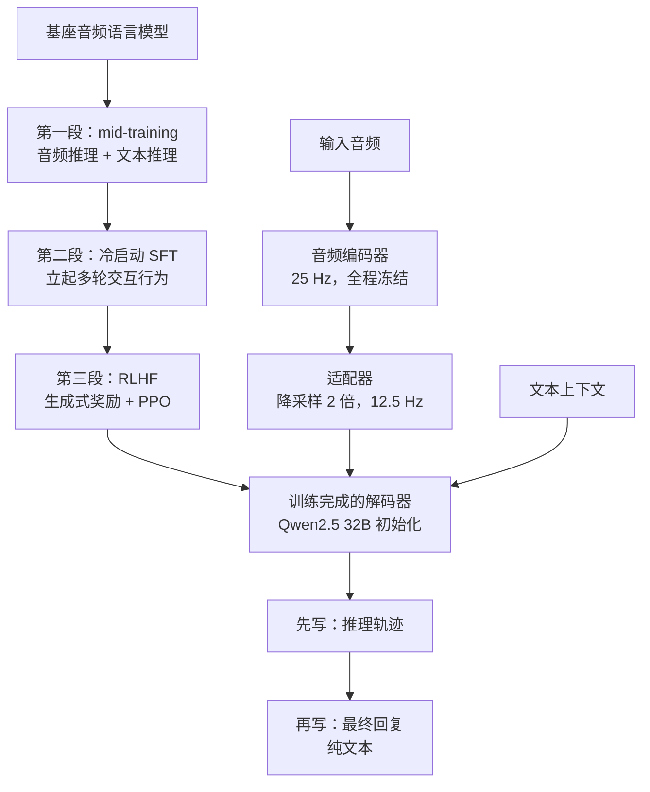
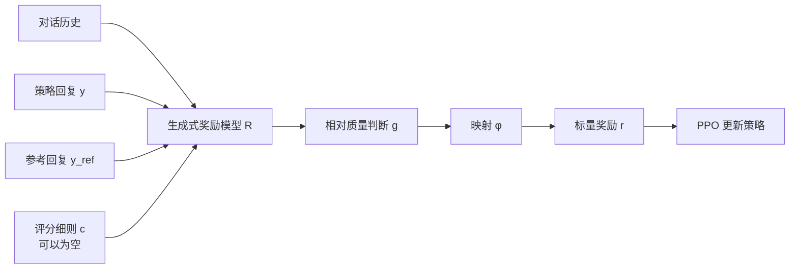

# Step-Audio-R1.5：把听觉推理的奖励，从「对不对」改成「好不好」

<!-- release-date: 2026-04-29 -->

> 本文依据 StepFun-Audio Team 发布的 **Step-Audio-R1.5 Technical Report**，即 arXiv:2604.25719v2，PDF 侧边水印标注 `arXiv:2604.25719v2 [eess.AS] 31 May 2026`。原件共 9 页，页码均指 PDF 自身页码。全文严格区分三件事：报告明确写了什么、我们如何解释它、哪些是外部资料补充。凡是外部补充都会给出链接并标明。
>
> 这是本模块目前最短的一份原件。短不等于信息少，但它确实意味着：**这篇文章里「报告没写」出现的次数，会比通常多得多**。我们不会拿同系列的其他报告去填这些空。

## 先讲一个矛盾：榜单每月在涨，用户却越来越不想和它说话

假设你在做一个语音助手，并且你按当下最主流的做法训练它。

你收集了一批带标准答案的音频题：这段录音里说话人多大年纪、这段音乐是什么调式、这道口述数学题答案是几。你让模型先写一段推理过程，再给出答案，然后拿答案和标准答案做字符串比对——对了给 1 分，错了给 0 分。这个分数就是奖励，模型朝着拿分更多的方向更新。

这套办法很有效。半年下来，你的模型在所有客观榜单上都在涨。

然后你打开产品自己聊了十分钟，发现事情不对劲。

它每句话都对，但每句话都像在交作业。你说「我今天有点累」，它回你一段结构工整的建议清单。你打断它，它从头开始重讲。你让它换个语气，它答应了，下一轮又变回原样。它没有说错任何一件事，你就是不想再跟它讲话了。

这份报告把这个现象命名为**可验证奖励陷阱**（verifiable reward trap）（PDF p.1、p.2）。它的诊断很直接：

> 优化目标严格地筛选孤立的答案正确性，而忽略了那些在真实部署中决定用户体验的细微品质（PDF p.2，我们的翻译）。

用报告自己更狠的一句话说：我们究竟是在培育真正的音频智能，还是只是把一个连续的感官媒介降格成了一道离散的谜题（PDF p.1，我们的翻译）。

Step-Audio-R1.5 想回答的就是这一个问题。它的答案不复杂：**再给模型加一路奖励，这一路不问对不对，只问好不好。**

难的是怎么把「好不好」变成一个能反向传播的数。这篇报告的全部技术内容，都在这一件事上。

## 读之前：先把这条线上的词说成人话

这一节是**通用背景**，不是这份报告的内容。报告自己讲到哪里，正文会另外标页码。听觉推理这个方向读者基础薄，所以这里讲得细一点，但只讲到能读懂本篇的程度。

### 思维链与「可验证奖励」

**思维链**（Chain-of-Thought，CoT）指的是：让模型在给出最终答案之前，先把中间推理过程一步步写出来。写出来的这段文字叫**推理轨迹**（reasoning trace）。它有两个好处，一是模型可以用更多计算量换更准的答案，二是人能看到它是怎么想的。

怎么把 CoT 训出来？现在主流的办法叫 **RLVR**（Reinforcement Learning with Verified Rewards，可验证奖励强化学习）。名字里的关键词是 **verified**：奖励不是人打的分，而是机器自动核对出来的。

它的流程是这样的：

1. 给模型一道有标准答案的题；
2. 让它自己生成推理过程和答案；
3. 用一个程序去核对答案对不对，对了记 1，错了记 0；
4. 用这个 0/1 信号做强化学习，把「导向正确答案」的那些生成路径加强。

报告指出这条路线的核心优势是**绕开了学出来的奖励模型**（PDF p.1）。因为不需要额外训一个打分器，就没有打分器被钻空子的问题，训练也更省事。OpenAI o1 和 DeepSeek-R1 都是靠这一路走通的（PDF p.1）。

但请注意这套流程的一个隐含前提：**必须存在一个能被程序核对的标准答案。** 这个前提，就是后面所有麻烦的来源。

### 奖励模型、RLHF、PPO

当答案没法被程序核对时（比如「这段回复读起来自然吗」），只能换一条路：**RLHF**（Reinforcement Learning from Human Feedback，基于人类反馈的强化学习）。

它多了一个部件，叫**奖励模型**（Reward Model，RM）。做法是先请人对模型的输出做偏好标注——给两个回答，问人更喜欢哪个——再用这些标注训出一个会打分的模型。之后强化学习就拿这个模型的打分当奖励。

奖励模型有两种形态，这份报告用的是第二种：

- **标量奖励模型**：输入一个回答，直接吐出一个数。快，但它不说理由，也不好处理「这条要求满足了、那条没满足」这种复合判断。
- **生成式奖励模型**（Generative Reward Model，GRM）：它本身是个语言模型，会先写一段分析，再给出判断。慢，但能处理复杂标准，也能被人检查。

拿到奖励之后，用什么算法更新模型？这份报告用的是 **PPO**（Proximal Policy Optimization，近端策略优化）风格的目标。PPO 要解决的问题是：强化学习一步走太大容易训崩，所以它给每步更新加一个「别离原来太远」的限制。具体有两道保险：

- **裁剪**（clip）：新旧策略在某个位置上的概率比值，被强行限制在 $1-\epsilon$ 到 $1+\epsilon$ 之间，比值超出这个区间的部分不再提供梯度；
- **KL 惩罚**：在目标里减去一项「当前策略和参考策略的 KL 散度」。KL 散度衡量两个概率分布差多远，减掉它就是在说「你可以变好，但不许变成另一个模型」。

还有一个词是**优势**（advantage，记作 $\hat A_t$）：它表示某一步的实际回报比平均水平好多少。优势为正就加强这条路径，为负就压制。

### 声音怎么进模型

原始声音是一串采样点，密度极高，不能直接喂给语言模型。中间必须有一层压缩，通常由**音频编码器**（audio encoder）完成：它把波形转成一串向量，每个向量描述一小段时间的声学内容。

这里有个关键指标叫**帧率**（frame rate）：编码器每秒吐出多少个向量。帧率越高，时间分辨率越细，但序列越长。序列长度直接决定注意力的开销，所以多轮长对话里帧率是个硬约束。

编码器之后通常还有一个**适配器**（adaptor）：一个轻量模块，把声学向量映射到语言模型认识的隐空间，顺便做时间维度上的降采样。

再记两个词：

- **副语言信息**（paralinguistic）：话里除了字面意思之外的东西——年龄、性别、语速、节奏、音色、口音、情绪、犹豫、叹气。
- **韵律**（prosody）：说话的抑扬顿挫、轻重缓急。它是**发出来的声音**的属性，不是文字的属性。这个区分在本文后面非常重要。

### 评测里的几个缩写

- **S2T**（Speech-to-Text，语音到文本）：输入是音频，输出是文字。
- **AQAA**（Audio Query–Audio Answer）：音频提问、音频作答。
- **AQTA**（Audio Query–Text Answer）：音频提问、文字作答。同一批题目可以在这两种形态之间转换，转成 AQTA 之后，所有只会输出文字的模型都能参加同一场考试。

## 一句话先说清

Step-Audio-R1.5 不是一个新架构。

它是**Step-Audio-R1 的骨架，加上一条重写过的三段式后训练流水线**（PDF p.3–p.5）：

- **架构**：Qwen2 音频编码器（全程冻结）→ 适配器（时间维降采样 2 倍）→ 从 Qwen2.5 32B 初始化的语言模型解码器，输出**纯文本**（PDF p.3）；
- **第一段 · 音频为中心的 mid-training**：音频推理数据 + 纯文本推理数据，同一个监督目标一起训，把推理能力接到声学上下文上（PDF p.3）；
- **第二段 · 冷启动 SFT**：不再扩知识，只把多轮对话行为先立起来，为后面的偏好优化做初始化（PDF p.4）；
- **第三段 · RLHF**：一个生成式奖励模型，同时支持「按评分细则核对」和「和参考回答两两比较」两种判断，输出一个相对偏好信号，再喂给 PPO（PDF p.4–p.5）。

所以这份报告最值得记住的不是某个模块，而是一个关于**奖励信号形状**的判断：

> 当任务的价值有一部分**写不成可核对的标准答案**时，继续加大 RLVR 的力度，不是在补这一部分，而是在**系统性地删掉**这一部分。

这句话是整篇报告的骨架。它成不成立，取决于报告能拿出什么证据。我们在最后会专门算这笔账——**先说结论：这份报告的主张，比它的证据跑得远。**

## 全景：一条三段式的流水线

这张图按 PDF p.3 的 §2 与 p.3–p.5 的 §3 正文重画，只表示结构与阶段顺序，不表示时长、算力或数据量比例——这三样报告一个都没给。

先记住图里最关键的一处：**解码器的输出被结构性地切成了两段**，先写推理轨迹 $r$，再写最终回复 $y$（PDF p.3）。报告说这道切口「是无缝集成 RLHF 的架构基础」（PDF p.3）。为什么，我们在架构那一节展开。

## 先把这份报告没写的东西摆出来

9 页的篇幅意味着大量细节缺席。提前摆出来，后面读起来才不会误会哪些是「我没找到」、哪些是「它真没写」。

**训练数据**，一个数都没有：

- mid-training 用了多少 Token、多少小时音频，没写；
- 音频数据和纯文本数据的**配比或损失权重**，没写（式 (1) 里两项是直接相加的，没有系数，PDF p.3）；
- 冷启动 SFT 的数据量、来源、构造方式，没写；
- 各阶段数据的语种、领域、去重和质量筛选，没写。

**奖励模型本身**，几乎全部缺席：

- 奖励模型多大、从什么初始化、怎么训，没写；
- 用了多少条人类偏好标注、标注者是谁、标注一致性如何，没写。全文没有出现任何一个和人类标注规模有关的数字；
- **评分细则**（rubric）从哪来、总共有多少条、集合 $\mathcal{C}$ 有多大，没写；
- 一个样本按什么规则被判定为「有明确评价标准、走细则」还是「没有、走两两比较」，没写；
- 参考回答 $y^{\text{ref}}$ 从哪来——是人写的、是更强模型生成的、还是策略自己的历史输出，没写；
- 从判断 $g$ 到标量奖励的映射 $\phi(\cdot)$ 是什么形式，没写；报告说奖励有「多个序数等级」（PDF p.5），但**到底几级也没写**。

**训练配置**：

- PPO 的 $\epsilon$、$\beta$、学习率、batch、每题采样条数、优势怎么估（是不是 GAE），全部没写；
- 训练算力、卡数、时长，没写。

**模型与推理**：

- 总参数量没写。正文只说解码器从 Qwen2.5 32B 初始化（PDF p.3），实验一节说「只有 32B 参数」（PDF p.7）——这个数是解码器的，编码器和适配器的参数没有计入，报告也没给它们的规模；
- 适配器的结构没写，只说降采样率是 2（PDF p.3）；
- 音频输入长度上限、推理时的 CoT 长度、温度、上下文窗口，都没写；
- 权重或推理代码的开放计划，报告没提。

**实验**：

- **没有任何消融**。没有「只做 RLVR」对「RLVR 加 RLHF」的对照，也没有量化「联合优化 vs 分阶段优化」的差距——后者只有一句定性描述（PDF p.5）；
- **没有任何人类评测的分数**。一份主张要修复「用户体验」的报告，全文没有一处主观评测结果；
- 没有任何延迟数字；
- Audio MC 的四个维度只给了一个合并总分，**分维度成绩一个都没给**（PDF p.6）。

这份清单本身就是读这篇报告最该带走的信息之一。后面遇到这些位置，我们一律写「报告没写」。

## 核心论点：可验证奖励陷阱

这是全篇唯一的原创概念，值得走完整条因果链。

### 旧问题：能被核对的东西，只有一小块

报告的推理链条是这样的（PDF p.1–p.2）：

1. 音频输入是**时间上展开的连续信号**。一段两分钟的对话里有语速变化、停顿、情绪起伏、打断、自我修正。
2. 但 RLVR 要求有个能被程序核对的答案。于是这段音频最终被压缩成**一个离散标签**——报告的原话是「一个类别、一个数字，或者一小段事实性字符串」（PDF p.2）。
3. 奖励函数只认这个标签。**凡是不进入标签的东西，梯度就够不着。**
4. 报告用了一个很准的词：模型对韵律自然度、情感连续性和对话连贯性，是**结构性失明**（structurally blind）的（PDF p.2）。

这个「结构性」用得好。它说的不是模型学得不够好，而是**优化目标里根本没有这一项**。你不可能靠多训几步、多加点数据来修复一个从未被定义的目标。

### 后果：越训越准，也越训越难聊

报告接着描述它观察到的经验现象（PDF p.2）：

- 在持续的 RLVR 训练下，模型在留出测试集上**越来越准**；
- 同时**越来越不像人**——回复变短、变机械、情绪扁平；
- 在多轮口语对话里，退化成一台字面意义上的「应答机」，技术上正确，体验上空洞。

报告把这归结为一句挺漂亮的对仗：**RLVR 优化的是「说什么」（what to say），用户在意的是「怎么说」（how to say it）**（PDF p.2）。事实正确是必要条件，不是充分条件。

### 这里必须停下来说一句：这段诊断没有证据

报告说这个现象「一致且可复现」（consistent and reproducible，PDF p.2）。

但它**没有给出任何一条训练曲线、任何一组对照、任何一个数字**来支持这句话。全文没有一张图显示「随着 RLVR 训练步数增加，某个体验指标如何下降」。

这不是说这个观察不对——做过 RLVR 的人多半会点头。但按证据分层，**这一段属于作者观察，不属于被本报告实验支持的结论**。整篇报告的动机建立在这段观察上，所以这一点必须先说清楚。

### 新设计的方向

既然问题出在「奖励函数的定义域太窄」，解法就只能是**换一种奖励**。报告的选择是不替换、而是**补充**：保留 RLVR 培养出的分析推理能力，再叠一路 RLHF 来管「怎么说」（PDF p.2）。

用一句话概括这个转向：**从「核对一个标签」变成「比较两个完整回答」。** 后者不需要标准答案存在，只需要有人（或者一个学会了人类偏好的模型）能说出哪个更好。

### 可迁移启发

这一条的适用面远远超出音频：

> **当你的自动指标持续变好、而用户反馈持续变差时，第一反应不该是「指标还不够高」，而该是「指标的定义域是不是漏掉了一整块价值」。**

判断方法很简单：把你的奖励函数写下来，然后问一句「用户真正在意的东西里，有多少能被这个函数看见」。看不见的那部分，加多少训练量都不会变好——它甚至会因为**被优化目标挤占资源而变得更差**。推荐系统里点击率涨、留存跌，代码模型里测试通过率涨、可读性跌，都是同一个结构。

## 架构：三个部件，和一道为 RLHF 留的接缝

报告说 R1.5 建立在 Step-Audio-R1 已有的结构基础上，采用了一个「为长音频推理专门裁剪的精简架构」（PDF p.3）。三个部件：

| 部件 | 用什么 | 关键参数 | 训练状态 |
|---|---|---|---|
| 音频编码器 | Qwen2 audio encoder | 帧率 25 Hz | **全程严格冻结** |
| 适配器 | 报告未描述结构 | 时间降采样率 2 | 报告未说明 |
| LLM 解码器 | 由 Qwen2.5 32B 初始化 | 输出纯文本 | 报告未说明 |

（本表按 PDF p.3 §2 正文整理。「报告未说明」是指报告确实没写，不是我们没找到。）

### 为什么编码器要冻结

报告给的理由只有半句：为了**保住它稳健的听觉感知能力**（PDF p.3）。

我们可以把这半句展开。编码器是在大量语音和音频理解任务上预训练过的，它对声学模式的表征已经成型。而后面三个阶段——尤其是 RLHF——的梯度信号是很嘈杂的：奖励模型本身有偏、PPO 的优势估计有方差。如果让这股信号一路传回编码器，最可能的结果不是编码器学到新东西，而是它已有的通用听觉表征被特定任务的偏好带偏。

冻结就是把这条路堵死。代价也很明确：**编码器无法为下游任务做任何适配**。如果目标任务的声学分布和它的预训练分布差得远，这个上限就锁死了，只能靠适配器和解码器去补。

站内另一代的 StepAudio 2.5 解读里也有一个冻结编码器的设计（见 [StepAudio 2.5](/reports/StepFun/StepAudio-2.5)），但那是另一份独立报告，本文不引用它的任何技术细节，也不据此推断本报告没写的部分。

### 帧率那个数字，值得自己算一遍

编码器 25 Hz，适配器降采样 2 倍，进入解码器时是 **12.5 Hz**（PDF p.3）。报告说这样做是为了缓解复杂多轮交互中的**序列长度爆炸**（PDF p.3）。

把它换算成更直观的量（**以下是我们的计算，报告没有写**）：

- 1 秒音频 → 12.5 个序列位置；
- 1 分钟 → 750 个位置；
- 1 小时 → 45,000 个位置。

于是可以看出这个降采样的实际份量：如果不降这一半，同样一段十轮对话的音频会多占一倍序列长度。多轮场景下音频是**累积**的——第十轮时前九轮的音频还在上下文里——所以这一半省的不是一次，是每一轮都省。

代价同样清楚：**时间分辨率减半**。12.5 Hz 意味着每 80 毫秒才有一个位置。汉语和英语里不少音素比 80 毫秒还短。报告没有做这个降采样率的消融，所以「2 倍是不是最优」这个问题，本报告答不了。

### 那道为 RLHF 留的接缝

这是架构一节里最值得讲的一处。

报告说，为了支持 CoT，生成过程被**结构性地切分**（structurally partitioned）：解码器被提示先合成显式的中间推理轨迹，再自回归地生成最终回复。然后它加了一句判断（PDF p.3）：

> 这种把内部分析与外部回复解耦的做法是关键的，因为它构成了无缝集成 RLHF 的架构基础（我们的翻译）。

报告只写到这里就停了，没有解释为什么。我们把这层因果补上——**以下是我们的解释，不是报告原文**：

RLHF 的奖励是对「回复质量」的判断。如果推理轨迹和最终回复混在一起、没有明确边界，你会立刻撞上两个麻烦：

1. **奖励模型该看什么？** 如果把长长的思考过程一起送去评判，奖励模型会对「思考写得漂不漂亮」有意见，而这不是用户看得到的东西。评判对象含糊，奖励就含糊。
2. **优化压力会打到哪里？** 提升偏好分数最省力的路径之一，是让思考过程也变得讨喜——比如变得更抒情、更长。这是一种奖励攻击，而且很难发现。

有了明确的切分，这两件事都被限制住了：**奖励只针对 $y$，推理轨迹 $r$ 只作为达成 $y$ 的中间过程存在。** 这就是「架构基础」这句话的实际含义。

不过必须说清边界：报告**没有明说**奖励是否只作用于 $y$。式 (2) 里奖励模型的输入写的是策略回复 $y$（PDF p.4），从记号看确实只有回复；但报告没有一句正文确认「推理轨迹不参与打分」，也没有说 KL 惩罚和裁剪是作用在 $r$ 还是 $y$ 还是两者上。这是本篇一处不小的模糊。

### 一处引用对不上

正文说解码器由 **Qwen2.5 32B [15]** 初始化（PDF p.3），但参考文献 [15] 是「Qwen2 technical report, arXiv:2407.10671」（PDF p.8）。

**外部核验**：[arXiv:2407.10671](https://arxiv.org/abs/2407.10671) 确实是 Qwen2 的技术报告，覆盖 0.5B 到 72B，**其中没有 32B 这一档**；Qwen2.5 才有 32B，其技术报告是另一个编号。所以正文的模型名大概率是对的，是**引文指错了报告**。这不影响技术内容，但如果你要复现，别照着 [15] 去找基座。

另外顺带一提：报告为「序列长度爆炸」这句话挂了 [11–14] 四条引用（PDF p.3），其中 [11] 是 FlashAttention-2、[12][13] 是语音中的 Mamba、[14] 是一个声学 landmark 数据集与工具包（PDF p.8）。前三条讲的是「长序列的注意力开销怎么降」，勉强能对上；把一个数据集与工具包引来支撑「序列长度爆炸」，关联就偏弱了。这只是阅读时的一个观察，不影响结论。

## 训练第一段：音频为中心的 mid-training

### 它要解决什么

给定基座音频语言模型 $\pi_{\theta_0}$，这一段的目标是在进入后训练对齐之前，先强化三件事：音频理解、**基于音频的推理**，以及一般的深思能力（PDF p.3）。

关键是第二项。「听得懂」和「能基于听到的东西推理」不是一回事。前者是感知，后者要求把感知结果接进一条多步的逻辑链。

### 怎么做

统一的监督目标（PDF p.3，式 (1)）：

$$
\mathcal{L}_{\text{mid}}
= \mathbb{E}_{(x,q,r,y)\sim\mathcal{D}_{\text{audio}}}\big[\log \pi_\theta(r,y \mid x,q)\big]
+ \mathbb{E}_{(q,r,y)\sim\mathcal{D}_{\text{text}}}\big[\log \pi_\theta(r,y \mid q)\big]
$$

符号逐个说清（PDF p.3）：

- $x$：输入音频；
- $q$：伴随的文本上下文；
- $r$：推理轨迹；
- $y$：回复；
- $\mathcal{D}_{\text{audio}}$：有音频的样本，形如 $(x,q,r,y)$；
- $\mathcal{D}_{\text{text}}$：纯文本样本，形如 $(q,r,y)$，没有 $x$。

这个式子在做的事其实很朴素：**在两批数据上同时做标准的监督式下一个 Token 预测，同时把推理轨迹 $r$ 和回复 $y$ 都当成要学的目标。** 注意 $r$ 出现在被预测的对象里——模型学的不只是答案，还有推理过程本身怎么写。

有两处记号上的小瑕疵值得指出：式子被记作 $\mathcal{L}$（通常表示要最小化的损失），但右边是对数似然之和、没有负号，按字面是要**最大化**；正文也确实称它为「统一的监督目标」。以及，**两项之间没有权重系数**，所以两批数据的相对分量报告没有交代。

### 为什么要掺纯文本推理数据

这是这一段里唯一一处报告讲了原因的设计（PDF p.3）：纯文本监督提供**高质量的推理轨迹和长篇幅的深思结构**，便于把这些推理模式**迁移**到基于音频的理解与推断上。

这句话背后有个很实际的约束——**以下是我们的解释**：带高质量长推理轨迹的音频数据非常稀缺。文本世界里有海量的数学题解、代码推导、科学论证，每一条都自带一段成熟的推理链；音频世界里没有这种存量，得现造，而且造起来贵。

于是这里做的事情，本质是**用文本数据补推理能力的「形状」，用音频数据补感知能力的「接地」**。两者在同一组参数里，靠共享的解码器把推理模式渡过去。

### 收益、代价与边界

- **收益**：报告的描述是模型得到「广泛的感知覆盖」和「在声学接地上下文上稳健的推理能力」（PDF p.3）。
- **代价**：报告没提。但混合训练的经典风险是**跷跷板**——纯文本占比太高会让模型倾向于忽略音频、直接靠文本上下文猜答案。报告没有讨论这个风险，也没有给配比。
- **完全没有的**：数据量、配比、来源、训练步数、学习率，一个都没有。这一节全文不到 300 词，是三段训练里写得最薄的一段。

### 可迁移启发

> **当某个能力在新模态上缺少高质量数据时，先看看这个能力在旧模态上是不是已经很成熟——如果是，用旧模态的数据训「怎么想」，用新模态的数据训「想的东西挂在哪」。**

这条对任何「给成熟模型接新模态、新工具、新数据源」的项目都成立。前提是两边共享足够多的参数，迁移才有通路。

## 训练第二段：冷启动 SFT

### 旧问题：懂了，不等于会聊

报告把这一段的动机写得很清楚（PDF p.4）：mid-training 提升了音频领域知识、感知能力和一般推理能力，但它**没有直接优化多轮交互的质量**。

原话是：**光有强的音频理解，不足以保证自然、连贯、对指令敏感的对话行为**（PDF p.4，我们的翻译）。

### 新设计：不扩知识，只立行为

这一段刻意不再扩展领域知识，只做一件事：**在偏好优化之前，给「面向交互的行为」一个监督式的初始化**（PDF p.4）。

它强调四个方面（PDF p.4）：

| 方面 | 报告的定义 |
|---|---|
| 多轮对话连续性 | 跨轮次维持上下文和用户设定的约束 |
| 指令遵循 | 在用户对内容、格式、风格提出要求时保持一致 |
| 回复自然度 | 产出连贯、符合对话场合的回复 |
| 交互意识 | 稳健应对追问、澄清请求、打断和用户侧的自我修正 |

数据侧只有一句描述：由**指令丰富的多轮对话数据**构成，鼓励模型以**面向用户**的方式组织回复，而不是当成孤立的任务输出（PDF p.4）。数据量、来源、构造方式全部没写。

### 为什么这一段必须在 RLHF 之前

报告给了一句很实在的理由（PDF p.4）：这样可以让偏好优化**专注于打磨整体交互质量，而不是去纠正基本的对话行为**。

这句话值得展开——**以下是我们的解释**。RLHF 的样本效率很低：它要采样、要打分、要做带裁剪的更新，一条监督样本能一步教会的事情，RLHF 可能要绕很多圈。所以让 RLHF 去修「模型压根不知道该跨轮记住用户约束」这种基础缺陷，是极其浪费的。

更麻烦的是第二层：**如果基础行为没立好，偏好比较的区分度会很低。** 奖励模型面对两个都不及格的回答，给出的偏好信号大部分是噪声。先用 SFT 把两个候选都抬到「基本能看」的水平，偏好比较才开始比的是真正细微的差别——而那才是 RLHF 唯一能提供、SFT 提供不了的东西。

### 可迁移启发

> **强化学习负责的是「在一堆合格答案里挑更好的」，不是「把不合格变成合格」。后者用监督数据做，快得多也便宜得多。**

一个可操作的判据：如果你的偏好标注者经常需要在两个都很糟的候选之间选，说明冷启动没做够，该回去补 SFT，而不是加大 RL 的力度。

## 训练第三段：带评分细则的生成式奖励模型 + RLHF

这是全篇技术密度最高的一节。

### 旧问题：多轮口语交互的优化目标是异质的

报告的出发点是一个观察（PDF p.4）：多轮口语交互里，不同的目标**在形式上就不一样**。

它把这些目标分成两类：

| 类别 | 例子 | 特点 |
|---|---|---|
| 明确且局部的约束 | 内容要求、格式规范、人设设定、跨轮的指令保持 | 有相对清晰的判据，能逐条核对 |
| 偏好驱动、弱可指定 | 对话自然度、追问下的连贯性、语气是否得体、整体对话流畅度 | 说不清判据，只能整体比较 |

报告的关键判断是：这两类目标**不只是形式不同，连「该怎么评」都不同**——前者适合按标准核对，后者更适合对完整回复做比较式的偏好判断（PDF p.4）。

这个二分很有价值。它把「奖励设计」从「选一种奖励」变成了「先给目标分类，再给每类配合适的评判方式」。

### 新设计：一个奖励模型，两种判断模式

报告的做法不是训两个奖励模型，而是用**一个生成式奖励模型**同时支持两种模式（PDF p.4）。

形式化如下（PDF p.4，式 (2)）。设 $\mathcal{H}_{1:T}=\{h_t\}_{t=1}^{T}$ 表示到第 $T$ 轮为止的多轮对话历史，其中每个 $h_t$ 是第 $t$ 轮的完整交互上下文。给定 $\mathcal{H}_{1:T}$、策略回复 $y$、参考回复 $y^{\text{ref}}$，以及一个可选的评分细则 $c$：

$$
g = R\big(\mathcal{H}_{1:T},\, y,\, y^{\text{ref}};\, c\big), \qquad c \in \mathcal{C}\cup\{\varnothing\}
$$

这里 $g$ 是一个**相对质量判断**。$c$ 的取值决定走哪条路：

- $c=\varnothing$：退化成普通的两两偏好比较，把 $y$ 和 $y^{\text{ref}}$ 放在一起比；
- $c\neq\varnothing$：奖励模型以任务专属的评分细则为条件，评估回复是否满足预期要求。

然后把判断映射成标量（PDF p.4，式 (3)）：

$$
r = \phi(g)
$$

$\phi(\cdot)$ 的具体形式报告没有给。

这张图按 PDF p.4 的式 (2)(3) 与 §3.3 正文重画，是机制示意，不含任何实测数据。

### 策略怎么更新

报告用的是 PPO 风格的目标，而且明说是**最大化**（PDF p.5，式 (4)）：

$$
\mathcal{L}_{\text{RLHF}}(\theta)
= \mathbb{E}_t\Big[\min\big(\rho_t(\theta)\hat A_t,\; \operatorname{clip}(\rho_t(\theta),\,1-\epsilon,\,1+\epsilon)\,\hat A_t\big)\Big]
- \beta\, D_{\text{KL}}\big(\pi_\theta(\cdot\mid\mathcal{H}_{1:T},c)\,\big\|\,\pi_{\text{ref}}(\cdot\mid\mathcal{H}_{1:T},c)\big)
$$

其中（PDF p.5，式 (5)）：

$$
\rho_t(\theta) = \frac{\pi_\theta\big(y_t \mid \mathcal{H}_{1:T},\,c\big)}{\pi_{\theta_{\text{old}}}\big(y_t \mid \mathcal{H}_{1:T},\,c\big)}
$$

这是教科书式的 PPO，逐项读一遍：

- $\rho_t(\theta)$ 是**重要性比值**：同一个位置上，新策略给出的概率除以采样时那版策略给出的概率。比值大于 1 说明新策略更倾向于这个选择。
- $\hat A_t$ 是**优势**，由生成式奖励模型给出的奖励估计而来（PDF p.5）。怎么估的（是否用 GAE、用不用价值网络）报告没写。
- $\min(\cdot,\operatorname{clip}(\cdot))$ 是 PPO 的核心：当优势为正而比值已经涨过 $1+\epsilon$ 时，裁剪那一项更小，于是梯度被截断——**已经足够倾向的选择，不再继续加码**。
- 减去的 KL 项是第二道保险，把策略拉住在参考策略附近。

有一处值得注意的记号复用：$\mathcal{H}_{1:T}$ 里的下标 $t$ 是**轮次**索引（$h_t$ 是第 $t$ 轮的上下文，PDF p.4），而 $\mathbb{E}_t$ 和 $y_t$ 里的 $t$ 在标准 PPO 里通常是 **Token** 索引。报告没有澄清这里的 $t$ 到底是哪一个。这个区别不是学究气——它决定了重要性比值是**逐 Token** 算还是**逐轮/逐序列**算，而这两者的方差和稳定性差别很大。报告没写，我们也不替它选。

### 报告里最有价值的一句经验：两种监督必须一起训

这是全篇唯一一处带「我们试过，另一种做法不行」性质的陈述（PDF p.5）：

> 这两种形式的监督是**联合优化**的，而不是分成独立阶段，因为它们的优化方向可能差别很大；经验上，解耦训练往往会引起**不小的遗忘**，即后续在一种交互模式上的优化，会退化掉在另一种模式上已经获得的行为（我们的翻译）。

把这条因果链走完：

- **旧做法**：先按评分细则训一轮（把格式、人设、指令保持这些硬要求训好），再按偏好比较训一轮（把自然度、流畅度训好）。听起来很合理，分阶段还好调试。
- **失败机制**：这两类目标的梯度方向确实会打架。举个直观的例子——按细则优化会推着模型严格贴合格式要求，而按偏好优化可能推着模型说得更松弛自然。第二阶段跑久了，第一阶段学到的严谨就被冲掉了。
- **新做法**：把两种监督放进同一批更新里，让梯度在每一步就完成折中，而不是让后一阶段去覆盖前一阶段。
- **收益**：报告称联合优化是「更稳定的路径」，能在单一策略里同时对齐指令敏感和偏好敏感两方面（PDF p.5）。
- **代价与边界**：报告**没有给任何数字**。「不小的遗忘」有多大？联合训练稳定多少？完全没有量化。这条经验目前只能当作作者观察。

这一条虽然没数据，但它是可以直接拿走的工程判断：

> **当两类监督的优化方向可能相互冲突时，不要用「先训 A 再训 B」的课程式安排。分阶段的本质是让后一阶段拥有覆盖前一阶段的权力。要么联合优化，要么就得为前一阶段准备明确的保护机制。**

这条在多任务微调、多目标对齐、持续学习里是同一个问题。

## 为什么是「相对比较」，不是打绝对分

报告专门用了一段解释奖励为什么要设计成相对形式（PDF p.5），这是它第二处讲了原因的设计。

### 旧做法的问题

传统奖励模型给每个回复打一个绝对分。报告的反对理由是：**在口语对话对齐里，很多重要的交互质量维度，很难用单一的绝对分数来校准**（PDF p.5）。

展开说——**以下是我们的解释**：绝对分需要一把稳定的尺子。但「这段回复的自然度值 7.3 分」这种判断，在不同话题、不同轮次、不同对话风格下根本对不齐。标注者自己都对不齐，模型学出来的尺子会随分布漂移。而漂移的尺子在 PPO 里是灾难，因为优势是拿奖励减去基线算的，尺子一漂，优势的符号都可能翻。

相对比较绕开了这件事：只问「A 和 B 哪个更好」，不需要绝对刻度。参考回复 $y^{\text{ref}}$ 在这里同时充当了**锚点**——它把评判固定在同一个对话上下文里的同一道题上。

### 但不是二元的

报告在这里加了一层（PDF p.5）：把奖励表示成一个**细粒度的相对偏好信号，带多个序数等级**（multiple ordinal levels），这样模型能捕捉到超越二元区分的不同程度的质量差异，得到**更有区分度的监督信号**。

为什么这一层重要——**以下是我们的解释**：纯二元偏好（A 赢 / B 赢）丢掉了「赢多少」的信息。「勉强好一点」和「好得多」在二元编码下拿到一样的梯度，于是模型分不清哪些改进值得继续推进。序数等级把强度还回来了，代价是标注（或者说奖励模型的判断）要更细，一致性更难保证。

**报告没写的**：到底几级，级与级之间怎么映射成标量，$\phi(\cdot)$ 长什么样，以及序数等级是人标出来的还是奖励模型自己生成的。

### 可迁移启发

> **奖励设计的第一个问题不是「用什么模型打分」，而是「这个量有没有稳定的绝对刻度」。没有的话，就别硬造一把尺子，改成在同一个上下文里做带强度的相对比较。**

配套的一条：**只要引入了参考回复，参考回复的质量就成了系统的隐藏超参数。** 参考太弱，策略很容易赢，奖励饱和、梯度消失；参考太强，策略一直输，信号同样退化。报告完全没有讨论 $y^{\text{ref}}$ 从哪来、怎么控制难度——这是我们认为本篇最大的一处方法论空白。

## 评测：八个基准，三个是自己造的

### 为什么全部用 S2T

报告的解释是：S2T 评测**隔离出模型理解和推理声学信号的能力**，因为它要求文本回答，从而可以和最先进的语言模型直接比较（PDF p.5）。

这个理由成立，但它同时带来一个后果，我们放到后面专门算账。

### 三个自建基准

| 基准 | 规模 | 考什么 | 出处 |
|---|---|---|---|
| Step-Caption | 905 条音频 | 生成一整段自然语言，描述说话人的嗓音特征 | 新提出（PDF p.5） |
| Step-DU | 87 条录音 | 回答关于说话人自身嗓音特征的具体问题 | 新提出（PDF p.6） |
| Step-SPQA | 报告未给规模 | 副语言问答 | 源自 Step-Audio 2，转成 AQTA（PDF p.6） |

细节值得记：

- **Step-Caption**（PDF p.5）：905 条音频来自 YouTube 和 Bilibili，覆盖单说话人和多说话人场景，以中英文为主。每条由人类专家在 **16 个维度**上标注，包括性别、年龄、语速、节奏、音高、音色、情绪、口音等副语言特征。模型要生成一整段文字，提示词里明确要求分析全部 16 个维度。

  注意：v1 版这个数字是 907，v2 改成了 905——这是 v1 到 v2 之间**唯一的实质修订**（详见文末版本核验）。

- **Step-DU**（PDF p.6）：只有 **87 条**，由不同说话人录制，每条直接询问自己的嗓音特征，比如年龄、性别、语速、节奏。模型必须**只从声学信号**推断答案。

  87 条是个很小的样本量。**以下是我们的估算，需要一个前提**：报告没有说 Step-DU 怎么打分，如果它是按 87 道题的正确率算（正文说「模型必须推断出正确答案」，倾向于此），那么单条题目的权重约合 $100/87 \approx 1.15$ 分，后面那个「Step-DU 提升 18.39 分」就对应大约 16 道题的对错变化。这不是说结论错了，而是说这个数字的置信区间不会窄——而报告没有给任何误差范围，也没有多次运行的方差。

- **Step-SPQA**（PDF p.6）：原本是 Step-Audio 2 里的 AQAA（音频问、音频答）基准，为了让所有模型都能在同一套文本评测下比较，被转成了 AQTA（音频问、文字答），同时保留原有的音频理解任务。

  **这个转换本身很关键**：一个原本要考「答得好不好听」的基准，被改成了只考「答得对不对」。这恰恰把报告自己批评的那一维给去掉了。报告没有讨论这个张力。

### 五个公开基准

- **Audio MultiChallenge（Audio MC）**[9]：多轮基准，考察口语对话系统在自然人类交互模式下的表现，包括**打断、犹豫、话说到一半的自我修正**。四个维度：Inference Memory（推理记忆）、Instruction Retention（指令保持）、Self Coherence（自我一致性）、Voice Editing（PDF p.5）。
- **MMSU**[16]、**MMAU**[17]：专家级音频理解与推理（PDF p.6）。
- **Big Bench Audio**：从音频出发的复杂多步逻辑推理，报告在脚注里给了[数据集地址](https://huggingface.co/datasets/ArtificialAnalysis/big_bench_audio)（PDF p.6）。
- **Spoken MQA**[18]：口头表述的数学问题推理（PDF p.6）。

关于 **Voice Editing** 这个名字要澄清一下，因为它很容易被误解成「让模型改变自己的嗓音」。**外部补充**：按 Audio MultiChallenge 原论文（[arXiv:2512.14865](https://arxiv.org/abs/2512.14865)），这一维测的是模型对**用户说到一半自我纠正、往回改口**的鲁棒性——是用户在编辑自己的话，不是模型在编辑自己的声音。该论文还给出基准规模为 452 段对话、47 位说话人、1712 条实例级评分细则。这些数字来自基准原论文，**不是本报告的内容**。

### 评测方式

报告说所有基线模型都是用它们的**官方 API**，在 StepFun 自己的统一评测框架里跑的，而不是引用此前公开的数字，以保证所有结果在相同条件下可比（PDF p.6）。

基线包括 Gemini 家族（Gemini 3 Flash、Gemini 3 Pro）和 Qwen 家族（qwen3.5-omni-flash、qwen3.5-omni-plus）（PDF p.6）。

这个做法有好有坏。好处是控制了变量。坏处是**这套评测框架本身没有公开**——提示词、解析规则、评判模型、重试策略都不知道。于是这张表里的数字**没法和任何外部榜单对照**，只能在表内部横向比。这一点后面还会用到。

## 把 Table 1 读薄

完整的 Table 1（PDF p.6）。**粗体**是该列最好，`†` 是报告标注的第二名：

| 模型 | Avg. | Audio MC | Big Bench | MMSU | MMAU | Spoken MQA | Step-Caption | Step-DU | Step-SPQA |
|---|---|---|---|---|---|---|---|---|---|
| Gemini 3 Flash | 77.56 | 56.42 † | 96.80 | 76.64 | 75.90 | 95.37 | 65.12 | 80.46 | 73.80 |
| Gemini 3 Pro | **79.67** | **66.37** | **99.40** | **83.70** | **79.80** | **96.56** | **75.55** | 72.41 | 63.60 |
| qwen3.5-omni-flash | 70.55 | 25.44 | 59.59 | 72.50 | 77.20 | 93.39 | 73.57 | 83.91 † | 78.80 |
| qwen3.5-omni-plus | 75.77 | 39.38 | 73.03 | 82.74 † | 79.60 † | 96.03 † | 74.93 † | **85.63** | 74.80 † |
| Step-Audio-R1 | 72.50 | 24.61 | 98.29 | 75.68 | 77.00 | 95.06 | 70.60 | 64.37 | 74.36 |
| **Step-Audio-R1.5** | 77.97 † | 41.15 | 98.30 † | 79.03 | 77.90 | 93.74 | 71.48 | 82.76 | **79.40** |

Figure 1（PDF p.2）是这张表 Avg. 列的柱状图，数值一致：Gemini 3 Pro 79.67、Step-Audio-R1.5 77.97、Gemini 3 Flash 77.56、qwen3.5-omni-plus 75.77、Step-Audio-R1 72.50、qwen3.5-omni-flash 70.55。

### 报告自己给的结论

（PDF p.6–p.7）

- 平均分 77.97，在所有被评测模型里**排第二**；
- 尽管只有 32B 参数，Audio MC 拿到 41.15，只落后于 Gemini 家族；
- 相对前代 Step-Audio-R1（72.50），平均分提升 **5.47**；
- 提升主要来自需要多轮和长上下文理解的复杂任务，同时感知类基准也有普遍改善：**Step-DU +18.39**、**Step-SPQA +5.04**、Step-Caption **+0.88**。

### 我们自己核对了一遍

**以下全部是我们基于表内数字做的计算，报告没有写出这些结论。**

先验算平均分。八列取算术平均，六行全部对得上（R1.5 八项之和 623.76，$623.76/8=77.97$；R1 八项之和 579.97，$579.97/8=72.4963$，报告四舍五入记作 72.50）。报告的 Avg. 列没有加权，也没有漏项。

再把 R1.5 相对 R1 的逐项差值补全——报告只列了其中四项：

| 基准 | R1 | R1.5 | 差值 | 报告有没有提 |
|---|---|---|---|---|
| Audio MC | 24.61 | 41.15 | **+16.54** | 提了方向，没给数字 |
| Big Bench | 98.29 | 98.30 | **+0.01** | 没提 |
| MMSU | 75.68 | 79.03 | +3.35 | 没提 |
| MMAU | 77.00 | 77.90 | +0.90 | 没提 |
| Spoken MQA | 95.06 | 93.74 | **−1.32** | **没提** |
| Step-Caption | 70.60 | 71.48 | +0.88 | 提了 |
| Step-DU | 64.37 | 82.76 | +18.39 | 提了 |
| Step-SPQA | 74.36 | 79.40 | +5.04 | 提了 |

三件事跳出来：

**第一，有一项是退步的。** Spoken MQA 从 95.06 掉到 93.74，退了 1.32 分。报告在这一段写的是「跨越所有基准，Step-Audio-R1.5 保持了均衡的表现」（PDF p.7），然后只列了三个上升项。这一项退步没有被提及，也没有被解释。

这一项恰恰是**最纯粹的数学推理**——口头表述的数学题（PDF p.6）。而 R1.5 相对 R1 的主要改动，正是加了一路管「怎么说」的 RLHF。所以一个自然的疑问是：这 1.32 分是不是就是从 RLVR 那边让出来的？报告没有做这个消融，我们也无法回答。但**这是全表最值得追问的一个数字**，而它被跳过了。

**第二，Big Bench 那个「第二名」只赢了 0.01 分。** 98.30 对 98.29。在 Big Bench Audio 这样的基准上，这是纯粹的噪声量级——很可能只对了一道题，甚至只是解析差异。但按「best 加粗、second 下划线」的规则，它拿到了一个下划线。读表时别把这个标记当成能力差别。

**第三，报告有一处标注错了。** Step-SPQA 列：R1.5 的 79.40 是第一（加粗正确），但第二应该是 qwen3.5-omni-flash 的 78.80，报告却给 qwen3.5-omni-plus 的 74.80 加了下划线（PDF p.6，我们对渲染页面逐格核对过）。这不影响任何结论，纯属排版疏漏，但它提示这张表的标注没有被完整校对。

### 再退一步看这张表说明了什么

按「第一名」计数（**我们的统计**）：

- Gemini 3 Pro 拿了 9 列里的 7 个第一；
- qwen3.5-omni-plus 拿了 1 个（Step-DU）；
- Step-Audio-R1.5 拿了 1 个（Step-SPQA，而 Step-SPQA 是 StepFun 自己提出的基准）。

也就是说：**R1.5 唯一的单项第一，出现在自家基准上。** 三个自建基准（Step-Caption、Step-DU、Step-SPQA）占了八项里的三项，也就是平均分的 37.5%。这不是说自建基准不该用——副语言这个方向确实缺公开基准，Step-Caption 的 16 维专家标注也是实打实的工作量——但读平均分时要知道它的构成。

在五个公开基准（Audio MC、Big Bench、MMSU、MMAU、Spoken MQA）上，R1.5 一个第一都没有拿到；除 Big Bench 那个差 0.01 分的第二名外，**其余四项都排在第三或更后**（Audio MC、MMSU、MMAU 第三，Spoken MQA 第五）。

### 表和正文之间有两处对不上

**第一处：引言提到的对照模型，表里没有。**

引言说 R1.5 在关键交互维度上「匹敌甚至超越 Gemini-2.5-Flash 这样的领先商业系统」（PDF p.3）。但 Table 1 的基线是 Gemini **3** Flash 和 Gemini **3** Pro（PDF p.6），**Gemini-2.5-Flash 在全文只出现这一次，没有任何数字**（我们对全文做过检索确认）。

这句话因此无法从本报告里核实。而且方向上还有点微妙：拿一个更早代际的模型做对比，通常意味着和同代比会更吃力——Table 1 里 R1.5 的 Audio MC 41.15 确实落后 Gemini 3 Flash 的 56.42 达 15.27 分。

**第二处：四个维度只给了一个总分。**

报告两次强调 Audio MC 的四个维度（PDF p.3、p.5），引言的原话是在「关键交互维度」上有竞争力（PDF p.3）。但 Table 1 里 Audio MC 只有一个合并数字 41.15，**四个维度的分项成绩一个都没给**。

于是这份报告最核心的主张——多轮交互质量变好了——在数据上只对应**一个数字**：从 24.61 涨到 41.15。这个提升是真的，幅度也不小。但它无法回答「好在哪一维」，而报告偏偏花了两段来介绍这四维。

## 这份报告的证据强度

按三层分开算账。

### 有表格数据支撑的

- 平均分 77.97，在六个受评模型里排第二（PDF p.6）。数字自洽，我们复算无误。
- 相对前代 R1 平均提升 5.47 分（PDF p.7）。
- Audio MC 从 24.61 提升到 41.15（PDF p.6）。这是全表最大的相对改善，也是「多轮交互变好」这个主张唯一的量化支撑。
- Step-DU +18.39、Step-SPQA +5.04（PDF p.7）。但 Step-DU 只有 87 条样本（PDF p.6），Step-SPQA 是自家基准。
- 在 Step-SPQA 上取得全表第一（PDF p.6）。

需要一起记住的限定条件：所有基线都是在 StepFun 未公开的评测框架里重跑的（PDF p.6），所以这些数字**只在表内部可比**，不能和任何外部榜单对照。

### 只是作者观察、报告没有给证据的

- 「持续 RLVR 训练导致模型越来越不自然」这个现象是「一致且可复现」的（PDF p.2）。**零数据**。
- 「解耦训练往往引起不小的遗忘」（PDF p.5）。**零数据**，没有对照实验。
- 「R1.5 在关键交互维度上匹敌或超越 Gemini-2.5-Flash」（PDF p.3）。表里没有这个模型。
- 「Step-Audio-R1.5 是**第一个**系统性整合 RLHF 的音频推理模型」（PDF p.3）。这是一个关于领域现状的断言，报告没有做相关工作的系统梳理来支持它。
- 「这些结果共同验证了我们的架构与训练流水线的有效性」（PDF p.7）。**这句话超出了证据**：因为没有任何消融，表里的提升无法被归因到具体某个设计——是 mid-training 的功劳、冷启动 SFT 的功劳，还是 RLHF 的功劳，报告分不开。

### 完全没有公开的

全部见前面「先把这份报告没写的东西摆出来」一节。这里只重复最要命的三条：

1. **没有任何消融。** 报告的核心主张是「加一路 RLHF 能修好 RLVR 造成的问题」，但它没有跑「同样的 mid-training 和 SFT、只是不做 RLHF」这个对照。少了这一组，整篇报告的因果链在实验上是断的。
2. **没有任何人类评测。** 一份从头到尾在谈「用户体验」「沉浸感」「情感共鸣」的报告，最终的全部证据是八个自动化基准的分数。用 RLHF 训、却不用人来验，这是本篇结构上最奇怪的一处。
3. **奖励模型是个黑盒。** 它多大、怎么训、用了多少人类偏好、评分细则从哪来、参考回复从哪来、映射函数长什么样，全部没有。这意味着**这套方法无法被复现**。

### 最后一条，也是最重要的一条：模型不会说话

这一条值得单独立一节，因为它贯穿全篇。

报告白纸黑字写着两件事：

- 解码器「直接摄入降采样后的音频特征，生成**纯粹的文本输出**」（PDF p.3）；
- 全部评测采用 S2T，「要求基于文本的回答」（PDF p.5）；连原本是音频作答的 Step-SPQA 也被转成了文字作答（PDF p.6）。

我们对全文做过检索：**报告里没有出现任何和语音合成有关的内容**——没有声码器、没有音频 Token、没有波形、没有任何输出侧的音频路径。唯一一处 "synthesize" 说的是「合成推理轨迹」（PDF p.3），指的是写字。

现在把这个事实和摘要放在一起看。摘要说 RLVR「严重损害了**韵律自然度**、**情感连续性**和**用户沉浸感**」，说 R1.5「深刻地改变了交互体验」（PDF p.1）。

**韵律是发出来的声音的属性。** 一个只输出文字的模型，本身不产生韵律；韵律来自下游某个报告从未提及的语音合成环节。同样，「情感连续性」和「沉浸感」如果指的是听感，这份报告里没有任何一项评测能测量它们。

那 R1.5 实际改善了什么？按证据能支持的说法，是**多轮口语对话中文本内容的质量**——记住用户说过什么、跨轮保持指令、面对打断和改口不崩、回复读起来不像交作业。这些确实重要，Audio MC 那 16.54 分的提升也确实是真的。

但这和摘要承诺的东西**不是一回事**。这份报告在「说什么」这一层做了扎实的工作，然后用「怎么说」的语言把它包装了起来。而「怎么说」在它的系统里没有出口，在它的评测里没有指标。

这是我们读完这份报告后最重要的一条判断。它不否定这项工作的价值，但它决定了你该怎么引用它。

## 最值得带回自己项目的六条

### 1. 定期检查你的奖励函数漏掉了什么

自动指标涨、用户反馈跌，通常不是指标不够高，而是指标的定义域太窄（PDF p.1–p.2）。把奖励函数写下来，逐条问「用户在意的东西里，有多少能被它看见」。看不见的部分不会自己变好，还会因为被优化目标挤占而变差。

### 2. 别用「先训 A 再训 B」处理会打架的目标

分阶段的本质，是给后一阶段覆盖前一阶段的权力。报告的经验是解耦训练会引起「不小的遗忘」（PDF p.5）。要么联合优化，让梯度在每一步就完成折中；要么为前一阶段准备明确的保护机制。

### 3. 强化学习不负责把不合格变成合格

冷启动 SFT 的定位是让偏好优化「专注于打磨整体交互质量，而不是纠正基本的对话行为」（PDF p.4）。可操作的判据：如果标注者经常要在两个都很糟的候选里选，说明该回去补 SFT，而不是加大 RL。

### 4. 没有稳定绝对刻度的量，就别硬造一把尺子

改成在同一上下文里做相对比较，再用序数等级把「好多少」的强度还回来（PDF p.5）。配套要记住：**参考回复是系统的隐藏超参数**，太弱会让奖励饱和，太强会让信号消失。

### 5. 想让某个东西可评判，先给它一道结构上的边界

把推理轨迹和最终回复结构性地切开，是「无缝集成 RLHF 的架构基础」（PDF p.3）。这条更一般的形式是：**你打算给什么打分，就要先让那个东西在输出里有明确的起止。** 边界含糊，奖励就含糊，奖励攻击也更难被发现。

### 6. 接新模态时，用旧模态补「怎么想」，用新模态补「挂在哪」

mid-training 掺纯文本推理数据，是为了把成熟的推理模式迁移到音频接地的推断上（PDF p.3）。任何一个「新模态缺高质量推理数据」的场景都适用，前提是两边共享足够多的参数。

### 附带一条读法上的提醒

读任何技术报告时，把**摘要的用词**和**评测的量纲**摆在一起对一遍。这份报告的摘要谈韵律和沉浸感，评测全是文本正确率——这个落差不需要任何领域知识就能发现，但很容易在顺着读的时候滑过去。

## 关键词回看

- **可验证奖励陷阱**（verifiable reward trap）：本报告提出的概念。因为奖励只认能被程序核对的离散标签，优化目标对韵律、情感连续性、对话连贯性是结构性失明的（PDF p.2）。
- **RLVR**（可验证奖励强化学习）：用自动核对的 0/1 正确性信号做 RL，绕开学出来的奖励模型（PDF p.1）。
- **RLHF**（基于人类反馈的强化学习）：先用人类偏好训一个奖励模型，再拿它的判断做 RL。本报告的核心转向（PDF p.2）。
- **生成式奖励模型**（GRM）：本身是语言模型的奖励模型，先分析再给判断；本报告用它同时支持评分细则核对与两两偏好比较（PDF p.4）。
- **评分细则**（rubric）：任务专属的明确评价标准。式 (2) 里的 $c$；$c=\varnothing$ 时退化成普通偏好比较（PDF p.4）。
- **相对偏好信号**：不打绝对分，只在同一对话上下文里比较策略回复和参考回复，并用多个序数等级表达差距强度（PDF p.5）。
- **结构性切分**：解码器先写推理轨迹、再写最终回复，两段有明确边界；报告称这是集成 RLHF 的架构基础（PDF p.3）。
- **PPO 裁剪与 KL 惩罚**：两道限制策略单步变化幅度的保险，式 (4)(5)（PDF p.5）。
- **帧率与降采样**：编码器 25 Hz，适配器降采样 2 倍到 12.5 Hz，为的是缓解多轮交互里的序列长度爆炸（PDF p.3）。
- **副语言信息**：话里除字面意思之外的部分——年龄、性别、语速、节奏、音色、情绪、口音。Step-Caption 的 16 个标注维度、Step-DU 和 Step-SPQA 考的都是这一类（PDF p.5–p.6）。
- **AQAA 与 AQTA**：音频问音频答 / 音频问文字答。Step-SPQA 从前者被转成了后者，以便所有模型在同一套文本评测下比较（PDF p.6）。
- **S2T 评测**：输入音频、输出文字。报告选它是为了隔离理解与推理能力、便于和语言模型直接比较（PDF p.5）——同时也意味着输出侧的声音品质完全不在评测范围内。

## 最后的判断

这份报告提出了一个好问题，给了一条合理的技术路线，但**没有为它最响亮的那部分主张准备证据**。

好的部分是真的好。「可验证奖励陷阱」是一个准确的诊断，「结构性失明」这个说法把问题的性质说清楚了——不是学得不够，是目标里根本没有。三段式流水线的分工也讲得通：mid-training 补推理能力的接地，冷启动 SFT 把交互行为立起来让偏好比较有区分度，RLHF 再去打磨那些写不成规则的部分。其中两条经验判断——**联合优化而非分阶段**、**相对比较而非绝对打分**——是可以直接拿走用的工程结论，哪怕报告没有给它们配数据。

不够的部分同样清楚，而且不是细节问题：

- **实验上的因果链是断的。** 没有任何消融，所以表里的提升无法归因到 RLHF 还是别的什么。而这份报告的全部立论就是「RLHF 有用」。
- **验证方式和主张不匹配。** 用人类偏好训，却完全不用人来验；谈了一整篇用户体验，最终只拿八个自动化基准的分数交卷。
- **有一项退步被略过了。** Spoken MQA 从 95.06 掉到 93.74（我们的计算），而这恰恰是最能反映「RLVR 那一路有没有被牺牲」的一项。
- **最大的一处是量纲错位。** 模型只输出文字（PDF p.3），全部评测只测文本（PDF p.5），但摘要谈的是韵律、情感连续性和沉浸感（PDF p.1）。**这个系统里没有声音的出口，也没有声音的指标。**
- **方法无法复现。** 奖励模型、评分细则、参考回复、超参数，全是空白。

所以该怎么用它？我们的建议是：**把它当成一份问题陈述来读，而不是当成一份解决方案的说明书。** 它提出的那个矛盾值得每个做 RL 对齐的人认真对待；它给出的那条路线也是对的方向；但它给出的证据，只支持「多轮对话的文本内容质量变好了」这一句，支持不了摘要里那些更大的话。

如果只记一句：

> **优化目标看不见的东西，训练不会让它变好，只会让它变差。但反过来，你也不能靠一个看不见它的评测，来证明你已经把它修好了。**

后半句是这份报告自己没有做到的事。

## 资料与阅读边界

- **原始依据**：本地 `papers/StepFun/Step-Audio-R1.5.pdf`，Step-Audio-R1.5 Technical Report，arXiv:2604.25719v2，共 9 页。文中所有页码均指该 PDF 自身页码。

- **版本核验**：[arXiv:2604.25719 摘要页](https://arxiv.org/abs/2604.25719) 的提交历史共两版——v1 为 2026-04-28 14:44:30 UTC，v2 为 2026-05-31 23:35:54 UTC，**v2 即当前最新版**。本地件就是 v2，**未换件**。

  我们另外下载了官方 v1 做逐页比对：两版都是 9 页，`pdftotext -layout` 提取后**每一页的字符数完全相同**（4634 / 2715 / 3498 / 3765 / 3772 / 3786 / 3246 / 3121 / 955），共比对 29,501 字节 × 2 = 59,002 字节文本，全文只有两处差异：

  1. 侧边水印从 `arXiv:2604.25719v1 [eess.AS] 28 Apr 2026` 改为 `v2 [eess.AS] 31 May 2026`（排版/元数据变动）；
  2. **Step-Caption 测试集样本数从 907 改为 905**（PDF p.5）——这是唯一的**实质修订**。

  因此**页码零位移**，本文引用的所有页码在两版之间通用。两版 PDF 文件大小 389,234 与 389,237 字节，md5 分别为 `539cfb30…` 与 `74a1edf2…`。我们也在 StepFun 官方仓库确认没有另一份不同版本的 R1.5 PDF。

- **`release-date` 依据（外部补充）**：取 **2026-04-29**，即 StepFun 官方仓库 [stepfun-ai/Step-Audio-R1](https://github.com/stepfun-ai/Step-Audio-R1) 的 README News 中自己记的日期：「Apr 29, 2026: We release the technical report of Step-Audio-R1.5」，以及同日开源三个自建基准（`step_caption`、`step_spqa`、`step_dialogue_understanding`）。该日期由仓库自身的提交时间独立佐证——`update Step-Audio-R1.5` 提交于 2026-04-29T03:43:38Z，`update R1.5 results` 于同日 04:11:58Z（经 GitHub API 核对）。arXiv v1 的提交时间是 2026-04-28 14:44:30 UTC，按 arXiv 的公告机制其公开可见时间落在同一个 UTC 日，与官方日志不冲突。

  **这条证据链的强度，以及一处必须说明的不确定。** 相比本站上一篇 StepFun 解读只能靠媒体同日报道定日，这一次有**带日期的官方日志加提交时间戳双重佐证**，强度明显更高。但有两点要如实交代：

  1. **Step-Audio-R1.5 的权重从未公开发布。** 我们检索了 Hugging Face `stepfun-ai` 组织下的全部模型，只有 Step-Audio-R1（2025-11）和 [Step-Audio-R1.1](https://huggingface.co/stepfun-ai/Step-Audio-R1.1)（2026-01），**没有任何 R1.5 条目**；官方仓库 README 的待办里，R1.5 的推理代码仍未发布。所以这里适用的是流程中「对象未以权重形式公开、取该技术首次官方公开日」的口径。
  2. **开放平台 API 侧可能更早，但查不到日期。** 检索显示 StepFun 开放平台的定价文档提到「Step Audio R1.1 已升级为 Step Audio R1.5」，即 API 侧确有 R1.5。但该页面**没有给出任何日期**，且 `platform.stepfun.com` 在本次环境中无法直连（curl 超时、抓取报错），我们只能通过检索摘要间接得知这一条，**未能亲自验证页面原文**。如果这次 API 切换发生在 4 月 29 日之前，真实首发日会更早。目前没有任何证据能给这次切换定日，所以我们取现有证据能支持的最早**可考**日期 2026-04-29；若日后出现官方带日期的 API 变更记录且早于此，应以官方记录为准。

- **代际与边界**：报告只说 R1.5「建立在 Step-Audio-R1 所确立的结构基础之上」（PDF p.3），除此之外**没有给出任何与前代的架构对比或消融**。所以「相比 Step-Audio-R1 具体改了架构的哪里」这个问题，本报告答不了，本文也不去别的材料里找答案。

  `papers/StepFun/` 下的 `Step-Audio-2.pdf` 和 `StepAudio-2.5.pdf` 是两份独立报告：**Step-Audio-2** 是本报告参考文献 [5]，Step-SPQA 基准出自那里（PDF p.6），其架构与检索增强机制不在本文范围；**StepAudio 2.5** 是另一代音频方向的解读，见站内 [StepAudio 2.5](/reports/StepFun/StepAudio-2.5)。本文不引用这两份材料的任何技术细节。

- **外部补充清单**（全部标明用途，均不作为本报告技术细节的来源）：
  - [arXiv:2407.10671](https://arxiv.org/abs/2407.10671) —— 用于核实参考文献 [15] 是 Qwen2 而非 Qwen2.5 的技术报告，且 Qwen2 系列没有 32B 这一档。
  - [arXiv:2512.14865](https://arxiv.org/abs/2512.14865)（Audio MultiChallenge 原论文）—— 用于说明 Voice Editing 这一维测的是用户中途改口时的鲁棒性，以及该基准的规模（452 段对话、47 位说话人、1712 条评分细则）。这些数字属于基准论文，不是本报告的内容。
  - [stepfun-ai/Step-Audio-R1 仓库](https://github.com/stepfun-ai/Step-Audio-R1) 与 GitHub API 提交记录 —— 用于 `release-date` 取证和确认 R1.5 权重未发布。
  - [Hugging Face stepfun-ai 组织](https://huggingface.co/stepfun-ai) —— 用于确认没有 R1.5 权重条目。

- **本文中「我们的计算」清单**（基于报告给出的数字，但报告没有写出这些结论）：Table 1 六行平均分的复算；R1.5 相对 R1 的全部八项差值（含报告未提及的 Spoken MQA −1.32、Big Bench +0.01、MMSU +3.35、MMAU +0.90、Audio MC +16.54）；各列第一名的归属统计；Step-SPQA 列第二名下划线标错的核对；12.5 Hz 到每分钟 750 个序列位置的换算；Step-DU 单条样本约合 1.15 分的估算。

- **本文中「读渲染页所得」的内容**：Table 1 的粗体与下划线标注（PDF p.6），报告正文没有把这些标记写成文字；Figure 1 柱状图的六个数值（PDF p.2），与 Table 1 的 Avg. 列一致。

- **报告自己给出的两个外部链接**：Big Bench Audio 数据集 [ArtificialAnalysis/big_bench_audio](https://huggingface.co/datasets/ArtificialAnalysis/big_bench_audio)（PDF p.6 脚注 1），以及 Gemini 3 Pro 的官方博客（PDF p.6 脚注 2）。

- **署名与合作关系**：通讯作者 Fei Tian（tianfei@stepfun.com），项目负责人同为 Fei Tian。作者来自四家机构：StepFun（阶跃星辰）、Nanyang Technological University（南洋理工大学）、University of New South Wales（新南威尔士大学）、Shanghai Jiao Tong University（上海交通大学）（PDF p.7）。按本模块的归属规则，模型主要归属方是 StepFun，故放在 `StepFun/` 目录下。
