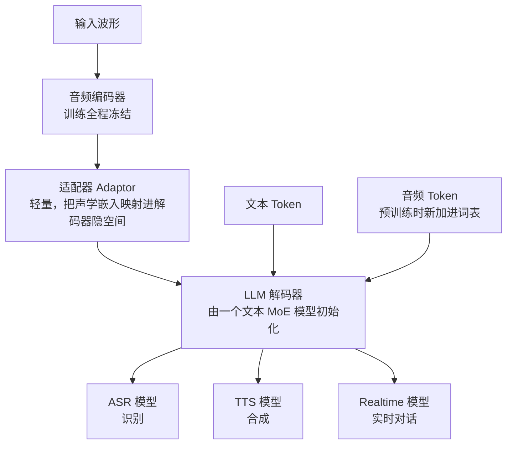
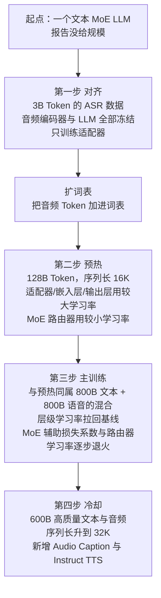
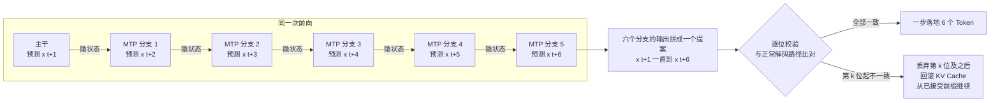
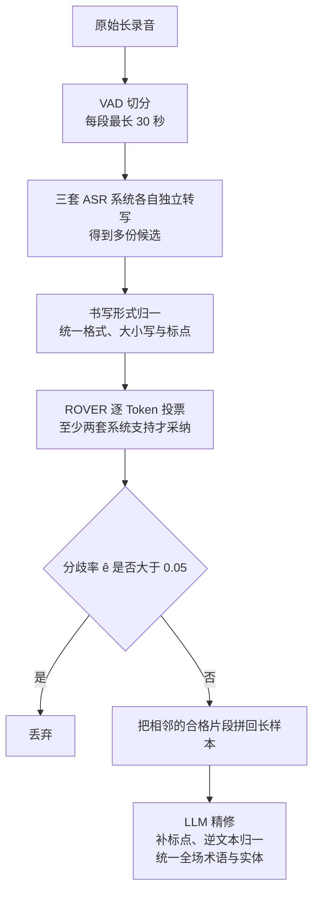
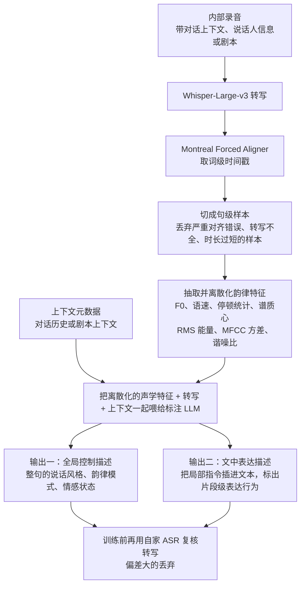
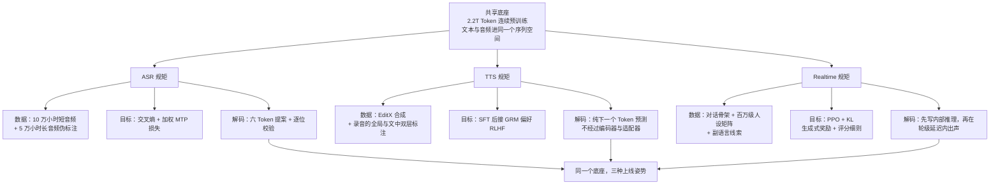

# StepAudio 2.5：把「专用系统」的差别，从架构挪进上线规矩

<!-- release-date: 2026-04-16 -->

> 本文依据 StepFun-Audio Team 发布的 **StepAudio 2.5 Technical Report**，即 arXiv:2605.23463v1，PDF 封面标注 2026-05-22。页码均指 PDF 自身页码。全文严格区分三件事：报告明确写了什么、我们如何解释它、哪些是外部资料补充。凡是外部补充都会给出链接并标明。

## 先讲一个会被三种人骂的产品

你在做一个语音产品。三类用户同时提需求。

第一类是做会议纪要的。他扔进来一段两小时的录音，只关心两件事：字要对，速度要快。他不需要模型有情绪，也不需要它幽默。

第二类是做有声内容的。他给一段文案，要求「这句读得像在憋笑，下一句突然沉下来」。他不关心识别，只关心那半秒钟的气口对不对。

第三类是做语音助手的。他要模型听见用户的犹豫和叹气，用固定的人设回话，而且用户话音一落就得出声。慢半秒，体验就断了。

这三个需求彼此拉扯：

- 会议纪要要的是**吐字快、别多想**；
- 有声内容要的是**慢慢琢磨怎么读**；
- 语音助手要的是**边听边想边说，还不能超时**。

传统做法是给三类需求各做一套系统。StepAudio 2.5 的报告要回答的问题正好相反：**能不能只做一个底座，然后用三套「上线规矩」把它变成三种产品**。报告在引言里把这句话直接写成了全文主张（PDF p.2）：

> 一旦文本和音频共享一个成形的表示空间，下游任务之间的差别就会从架构迁移到运行方式上，也就是数据、目标和解码约束。

这句话是整份报告的骨架。后面每一节都在给它补证据。

## 读之前，先把语音这条线补上三分钟

这篇假定读者没有语音背景，所以下面这几段是**通用背景**，不是这份报告的内容。报告自己讲到哪里，正文会另外标注页码。

### 声音要变成什么，模型才吃得下

原始声音是一串采样点。一秒钟采一万六千次是常见配置，一小时录音就是五千多万个数。这个密度直接喂给语言模型是不可能的，所以中间必须有一层压缩。

压缩之后有两种形态，差别很大：

- **连续特征**：一段声音被压成一串浮点向量，每个向量描述一小段时间的声学内容。它保留的信息多，但它不是词表里的编号，模型没法「生成」它，只能「读」它。
- **离散音频 Token**：一段声音被映射成词表里的整数编号，和文字 Token 平级。它信息量更少，但因为是编号，模型可以像写字一样把它一个个吐出来，再交给一个解码器还原成波形。

一句话记住：**连续特征适合进模型，离散 Token 适合出模型**。所以「听」和「说」在同一个模型里共存时，通常是左边接一个编码器产出连续特征，右边扩词表加一批音频 Token。这份报告采用的正是这种形态（PDF p.3）。

### 三段串联为什么会丢东西

最省事的语音产品是把三个现成系统串起来：语音识别（Automatic Speech Recognition，ASR）把声音转成文字，语言模型读文字生成回复，语音合成（Text-to-Speech，TTS）把回复读出来。

问题出在中间那步。声音被压成文字的一瞬间，说话人的犹豫、叹气、语速变化、情绪全部丢了。后面的语言模型只看见一行干巴巴的字，它没有办法知道用户是在开玩笑还是在生气。报告把这件事写成了做端到端模型的第一动机：级联流水线「在把语音降为文本中间表示时不可避免地丢弃信息」（PDF p.2）。

反过来，端到端更难做，因为你要在同一组参数里同时满足三种互相冲突的目标。这就是开头那三类用户的矛盾。

### 流式和延迟为什么是这条线的命门

文本模型慢一点，用户会等。语音对话慢一点，用户会以为你没听见。

所以这条线上有两个专门的指标：

- **实时率（Real-Time Factor，RTF）**：处理一秒钟音频要花多少秒。0.01 表示处理一小时录音只要 36 秒。越小越快。
- **首包延迟**：从用户说完到第一段能播的声音出来，中间隔多久。

这份报告只给了 RTF（PDF p.9），**从头到尾没有给出任何一个以毫秒计的延迟数字**，尽管「低延迟」是它 Realtime 分支的核心卖点。这是本文后面必须反复提醒的一个空缺。

### 报告里会反复出现的词，先认一遍

- **ASR / TTS**：语音识别与语音合成，上面已经说过。
- **SFT（Supervised Fine-Tuning，监督微调）**：拿「输入—标准答案」成对数据继续训练模型，让它学会按某种方式作答。
- **RLHF（Reinforcement Learning from Human Feedback，基于人类反馈的强化学习）**：先训一个能判断「哪个回答更好」的模型，再用它给正在训练的模型打分，让模型往人更喜欢的方向调。
- **MoE（Mixture-of-Experts，混合专家）**：模型里有很多组参数叫专家，每个 Token 只激活其中少数几个，所以总参数可以很大而单次计算不必很大。决定激活谁的部件叫路由器（router）。
- **MTP（Multi-Token Prediction，多 Token 预测）**：本来一次前向只产出一个 Token，MTP 让同一次前向额外猜出后面几个。
- **副语言信息（paralinguistic）**：话里除了字面意思之外的部分，比如犹豫、笑声、叹气、语速变化。
- **人设一致性（persona consistency）**：模型在整段对话里保持同一个性格和说话风格，哪怕用户故意试探。
- **CER / WER（字错误率 / 词错误率）**：识别结果和真值比，错了多少。中文常用 CER，英文常用 WER。越低越好。
- **GRM（Generative Reward Model，生成式奖励模型）**：打分的不是一个只吐标量的小模型，而是一个会先推理、再给判断的生成模型。

## 一句话先说清

StepAudio 2.5 不是三个模型共用一个名字。

它是**一个连续预训练出来的音频语言底座，加上三套完全不同的后训练与解码规矩**：

- 底座：从一个文本 MoE 模型出发，用 2.2T Token 的文本与音频数据连续预训练，把音频接进同一个序列空间（PDF p.4）；
- ASR 规矩：在解码器后面挂五个 MTP 分支，一次前向提出六个 Token 的方案，再逐位校验，把大解码器的速度劣势抵消掉（PDF p.5）；
- TTS 规矩：**把编码器和适配器整条拿掉**，只留语言模型主干，让语音合成退化成纯粹的下一个 Token 预测（PDF p.9）；
- Realtime 规矩：一个字都不改架构，全部改动落在数据组成和分阶段优化上（PDF p.13）。

所以这份报告最值得记住的不是某个缩写，而是一个组织判断：

> 当底层表示已经共享时，**「做几个模型」这个问题会退化成「配几套数据、目标和解码约束」**。架构不再是产品差异的载体。

这个判断能不能立住，取决于三个分支各自的证据强度。后面会分开算账。

## 全景：一个底座，三条出口

报告的 Figure 1（PDF p.4）画的是一张很朴素的图：共享的音频语言栈在上，三个模型级特化在下。

这张图按 PDF p.3 的 §2.1 正文与 p.4 的 Figure 1 重画，只表示结构关系，不表示时序或延迟。

### 这个结构里最重要的一句话是「不对称」

报告自己点了名：这个设计是**故意不对称的**（PDF p.3）。

- 编码器只负责一件事：把波形稳定地抽象成声学表示。它在整个流程里是冻结的。
- 解码器负责剩下的全部：语义、上下文管理、指令遵循、生成。

为什么这个不对称重要？报告给的理由是：**一旦语义主要住在解码器里，下游任务哪怕输出形态完全不同，也能共享模型的绝大部分**（PDF p.3）。

反过来想就更清楚了。如果你把大量语义能力放进音频编码器，那么 ASR 的编码器和 TTS 的编码器会各自朝不同方向长，最后你还是有两个系统。把编码器压成一个「只做声学抽象、不做语义」的薄层，才是让三条分支共享同一批权重的前提。

**可迁移启发**：多任务共享的关键不在于「有没有共享层」，而在于**你把智能放在了共享侧还是私有侧**。共享侧越薄、越通用，私有侧越容易分叉；共享侧越厚、越语义化，分叉的代价越小。这个取舍在推荐系统的共享 embedding、多语言模型的共享词表里是同一个问题。

### 三个方向其实是同一次查询的三种问法

报告用「方向性推理」概括三条分支（PDF p.3）：

| 分支 | 输入条件 | 输出空间 | 核心难点 |
|---|---|---|---|
| ASR | 音频嵌入 | 窄、离散，被语音信号牢牢锚住 | 准确、长音频一致、够快 |
| TTS | 文本与控制指令 | 丰富得多 | 不是词对不对，而是读得是否自然、忠实、有表现力 |
| Realtime | 音频 + 对话状态 | 文本与语音 | 轮级延迟约束下，还要维持人设与上下文 |

报告由此给出一句挺漂亮的观察：**底座本身不需要区分「理解」和「生成」**。它只需要一个高质量的多模态先验，加上一个把监督信号路由到不同输出空间的机制（PDF p.3–4）。识别、合成、实时对话，只是查询同一份多模态记忆的三种问法。

### 图和正文有一处没对齐

Figure 1 把三个模型都画成从「编码器 → 适配器 → 解码器」这条完整栈上垂下来的分支（PDF p.4）。但 §5 开头明说，TTS 分支**完全去掉了编码器与适配器模块，只靠语言模型主干建模**（PDF p.9）。

也就是说，图上的第二个分支实际上并不使用图上左半边的两个方框。这不是大问题，但读图时要知道：Figure 1 表达的是「同一个模型家族」，不是「三条分支的实际数据通路」。

## 先把报告没写的东西摆出来

这份报告的重心在后训练，不在架构。所以有一批读者会本能去找的数字，它一个都没有给。提前说清楚，后面读起来才不会误会。

报告**没有公开**：

- 任何一处参数量。编码器多大、适配器多大、解码器多大、MoE 有几个专家、每 Token 激活几个、隐藏维度多少，全文一个数都没有。它只说底座「由一个文本 MoE 大模型初始化」（PDF p.4）。
- 音频 Token 的任何规格。采样率、帧率、每秒产生几个 Token、码本大小、用的是哪种量化方案，全都没写。
- 音频 Token 怎么变回波形。声码器、流匹配、扩散解码器之类的下游模块，报告完全没提。
- 任何以毫秒计的延迟。Realtime 分支的四个挑战里排第一位的就是延迟（PDF p.12–13），但评测部分只有五个分数，没有一个时间数字（PDF p.15）。
- 流式与全双工的具体机制。怎么判断用户说完了、怎么处理插话、内部推理轨迹要不要等写完才出声，都没有描述。参考文献里确实列了几篇全双工相关工作（PDF p.18），但报告没有说 StepAudio 2.5 用了它们。
- 训练算力、卡数、时长。
- 权重或代码的开放计划。全文唯一的开源动作是放出了一个长音频测试集的构造脚本（PDF p.8 脚注）。

有一个连锁后果值得单独指出：因为没有音频 Token 率，**我们无法从 32K 的序列长度反推出模型一次能吃下多长的录音**。报告说长音频识别受益于「原生 32K 上下文窗口」（PDF p.8），但这句话对应几分钟还是几小时，读者算不出来。

后面正文遇到这些位置时，会一律写「报告没写」，不会拿 Step-Audio 2 或别家模型的做法去补。

## 共享数据引擎：先给声音分级，再决定谁在哪一阶段进场

三条分支共享的不只是权重，还有一条数据生产流水线（PDF p.4）。这条流水线的产物不是「一堆清洗过的音频」，而是**带分级标签的音频**。这个区别很重要，后面会解释为什么。

流程是这样的：

1. **粗筛**：先用声音事件检测（Sound Event Detection，SED）和语音活动检测（Voice Activity Detection，VAD）把低质量的非语音片段滤掉。
2. **重新切分**：把相邻的 VAD 片段合并，再切成「语义相对完整、时长合适」的基础样本。注意这一步是先合再切，不是直接按静音切——按静音切很容易把一句话拦腰砍断。
3. **音频级标注**：给每个片段打音质分、检测是否为合成语音、标注说话人数量。
4. **文本级标注**：用**两套** ASR 模型分别转写并做语种识别，再用 WER、编辑距离、语速这些指标交叉验证。
5. **语义级标注**：基于转写结果做语义完整性评估和内容分类。
6. **分级**：最后按语种、时长、语义质量分、音质分把数据归类分级。

第 6 步才是重点。报告给出的目的是：**让预训练阶段可以为不同训练阶段抽取不同质量档位的数据**（PDF p.4）。

这句话把「数据清洗」和「数据分级」区分开了。清洗是把坏数据扔掉，分级是把数据排队。前者只有一个门槛，后者能支撑课程式训练：早期用量大、质量一般的数据铺覆盖，后期用量小、质量高的数据修细节。后面预训练的 600B 冷却阶段（PDF p.5）正是靠这套分级喂进去的。

**可迁移启发**：任何要做多阶段训练的项目，都应该在数据流水线里**保留质量分，而不是在入库时就用阈值把数据二分掉**。阈值一旦落地，你就永远失去了「这一阶段我想要什么档位」的调节能力。合成语音检测这一项也值得单拎出来：当训练数据里混进别的模型合成的声音时，你其实是在悄悄做模型蒸馏，而且不受控。

报告没有公开的部分：各类数据的实际配比、语种覆盖清单、去重方案、两套 ASR 模型是哪两套、各级阈值具体取多少。

## 底座预训练：四步把音频接进一个文本模型

底座从一个文本 MoE 大模型出发，在 2.2T Token 的文本与音频数据上做连续预训练（PDF p.4）。报告强调这是一条「具体的分阶段配方，不是一个含糊的扩规模过程」。

这张图按 PDF p.4–5 的 §3.2 正文重画。图上没有画时间比例，方框大小不代表算力占比。

### 第一步为什么只训适配器

第一阶段沿用 Step-Audio 2 的做法，用 3B Token 的 ASR 数据只训练适配器。这一步的关键是：**音频编码器和 LLM 全部冻结**（PDF p.5）。

为什么要这样？因为此刻的适配器是随机初始化的。如果一上来就全参数训练，随机的适配器会往解码器里灌噪声，解码器为了适应噪声会开始破坏自己原有的文本能力，而这些破坏很难事后恢复。

先冻住两端只训中间，等于在说：**先把接口谈拢，再谈业务**。报告的原话是这一阶段「建立起声学特征能被文本原生解码器消费的初始接口」（PDF p.5）。

**可迁移启发**：接新模态、接新工具、接新检索源，都适用同一条顺序。先用一个小规模、单任务、只训接口层的阶段把两边对齐，再解冻。这比一次性全量微调稳，也便宜得多。

### 第二步和第三步：最值得抄的是那组不对称学习率

扩完词表进入统一多模态训练，序列长度 16K，混合里是 800B 文本 Token 加 800B 语音 Token（PDF p.5）。语音那一半不只是转写数据，它包含 ASR、TTS、语音到文本翻译、句级的文本—语音交错续写、语音到语音对话。

报告特意说明了这样做的用意：模型接触音频**不是只作为转写输入，而是作为一种会出现在多种输入输出配置里的通用序列模态**（PDF p.5）。这一句是后面三条分支能共享底座的直接前提——如果预训练时音频只出现在「输入侧」，那 TTS 分支就得从零学会把音频放到输出侧。

多模态阶段自己又切成两段。前 128B Token 是预热，目的是稳住新加进来的语音词表，并让 MoE 专家快速适应音频模态。这一段的学习率安排是不对称的（PDF p.5）：

- **适配器、嵌入层、输出层**：学习率比基座更大；
- **MoE 路由器**：学习率更小。

这组安排背后是一个很具体的判断。新词表的嵌入是随机的，必须快速学；而路由器是已经在文本上训好的、决定「哪个专家处理哪个 Token」的部件，它一旦被音频数据大幅改写，文本侧的专家分工会被打乱。报告给出的理由正是「减少对文本模态的扰动」（PDF p.5）。

进入主训练后，这些层级学习率被拉回基线，同时 MoE 的辅助损失系数和路由器学习率一起逐步退火，以便在专家利用率和 top-k 路由概率之间维持更好的平衡（PDF p.5）。

这里要说清楚一个门道。MoE 的辅助损失是用来逼专家负载均衡的，它和主任务目标其实有冲突：为了均衡，路由器有时会把 Token 送给并不是最合适的专家。训练早期需要它，因为不加会塌方到少数几个专家；训练后期它的边际收益下降，继续压着反而牺牲质量。所以**把它退火掉**，是让模型在稳定之后逐渐拿回选择权。

**可迁移启发**：给不同部件设不同学习率，是比「全局调一个学习率」细一档、但代价极低的手段。判断标准很简单——**这个部件是新初始化的还是已经训好的**，以及**它被改动之后会波及多大范围**。新参数放开，全局枢纽收紧。路由器、门控、归一化系数都属于枢纽。

### 第四步：冷却阶段真正加的是两类新数据

最后是 600B Token 的冷却阶段，数据换成高质量文本与音频，序列长度从 16K 升到 32K（PDF p.5）。除了主训练阶段已有的数据类型，这一阶段新引入两类：

- **Audio Caption**：给一段音频写描述。它训练的是「听懂并说出听到了什么」，包括非语音的声音事件。
- **Instruct TTS**：按自然语言指令合成语音。它是后面 TTS 分支「用一句话描述你想要的读法」这一能力的源头。

序列长度翻倍也在这一步。把长上下文放到最后、用高质量数据来做，是长上下文训练的常规安排：长序列每步更贵，放在数据最干净的阶段性价比最高。

### 一个可以自己验算的小检查

报告说总量是 2.2T Token（PDF p.4）。把各阶段加起来：

$$
3\text{B} + (800\text{B} + 800\text{B}) + 600\text{B} = 2203\text{B} \approx 2.2\text{T}
$$

**这个加法是我们做的**，报告只分别给出了各段数字。它能对上，说明 128B 的预热确实包含在 1600B 的多模态混合里，而不是额外的一段。这类验算值得每篇报告都做一次——对不上的时候，往往说明你漏读了一个阶段。

### 这一节的结论

报告自己把预训练的意义总结得很好：模型学到的不只是音频与文本之间的原始关联，而是**一个可操作的接口**（PDF p.5）。这个接口后来被三个方向复用：ASR 把音频证据映射成文字 Token，TTS 把文本侧语义映射成音频 Token，Realtime 在轮级延迟约束下把「听、想、答」耦合起来。

## ASR 分支：把声学确定性换成解码速度

### 旧问题：解码器越大，每个字越贵

自回归解码有一个硬性节奏：一次前向出一个 Token。识别一段长录音要出成千上万个字，就得跑成千上万次前向。

这在语音场景里格外难受。语音识别用户对延迟的容忍度极低，但共享底座的解码器又比传统 ASR 的解码器大得多。报告选的对照模型叫 Qwen3-ASR-1.7B，规模写在名字里；而 StepAudio 2.5 的解码器有多大，报告没写，只说自己用的是「更大的解码器」（PDF p.8）。

所以矛盾很直接：**你想要大解码器带来的语言先验，又不想付大解码器的逐 Token 代价**。

### 新设计：MTP-5，一次前向提六个字

StepAudio 2.5 ASR 在已经收敛的 ASR 解码器后面挂了五个 MTP 分支（PDF p.5）。

在解码位置 $t$：

- 主分支预测下一个转写 Token $x_{t+1}$；
- 第 $h$ 个 MTP 分支预测 $x_{t+1+h}$，其中 $h \in \{1,\dots,5\}$。

所以**一次前向产出一个六 Token 的提案**。

关键在于它怎么被采纳。报告写得很死：提案只会以已验证前缀的形式被接受——**一旦某个未来 Token 与正常解码路径不一致，它以及它之后的全部被拒绝**，解码从已接受的前缀继续自回归（PDF p.5）。

这张图按 PDF p.5 的 §4 正文与 p.6 的 Figure 2 重画。图里的「隐状态」链路对应报告写的「每个 MTP 块接收上一分支的隐状态」（PDF p.5）；Figure 2 上只画了前两个 MTP 模块，正文说明共有五个。要注意：图中从 M5 引出的那根箭头表示的是「串行链路走完之后拼成提案」，不是「只校验第五个分支」——校验针对的是整个六 Token 提案。

这句「MTP 严格只作为加速原语」（PDF p.5）值得读两遍。它的含义是：**最终转写永远由已验证路径决定**，MTP 猜错不会改变结果，只会浪费一次前向。这就把「加速」和「质量」彻底解耦了——你可以放心地把 MTP 调激进，最坏情况是不加速，不会变差。

### 每个 MTP 块内部长什么样

报告给的结构很简洁（PDF p.5–6）：每个 MTP 块接收两样东西——上一个分支的隐状态，以及一份右移过的 Token 嵌入。两路各自归一化后拼接，投影回解码器隐藏维度，再过一个解码器风格的 Transformer 块。

有两处共享值得注意：**所有分支共用同一个嵌入层和同一个词表输出头**（PDF p.6）。这意味着五个分支的增量参数只有各自的归一化、投影和一层 Transformer。报告没有给出这部分参数量占比，但从结构看，这是一个刻意压得很薄的设计——词表输出头通常是模型里最胖的矩阵之一，复制五份会很贵。

Figure 2 上还有一个细节：音频编码器画着雪花图标，表示冻结（PDF p.6）。这和 §4.1 里「本阶段音频编码器保持冻结」（PDF p.6）是一致的。

### 训练分两段，顺序不能反

MTP **要等基础识别器充分收敛之后才引入**，并且分两段（PDF p.6）：

**第一段：冻结分支对齐。** 五个 MTP 块被挂到已收敛的 ASR 解码器上。每个块里的 Transformer 层**从解码器最后一层初始化**，以便继承一个强的语言先验；分支专有的投影层则随机初始化。这一阶段只优化 MTP 块，峰值学习率 $2 \times 10^{-4}$；其余全部模块，包括共享的 Token 嵌入和 LM 头，全部冻结（PDF p.6）。

**第二段：联合校准。** 等分支已经对齐到 ASR 分布之后，解冻适配器和 LLM 解码器做联合优化，学习率降到 $2 \times 10^{-5}$。报告给的目的是「减少主干状态与前瞻分支之间的残余错配」（PDF p.6）。

为什么顺序不能反？因为如果一开始就联合训练，主干为了让分支好猜，可能会把自己的表示改得更容易预测——而「更容易预测」和「更准确」不是一回事。先冻住主干让分支去适应，再小幅解冻做双向校准，等于把主要的适应压力放在了新加的部件上。

用第一段的高学习率配新参数、第二段的低学习率配老参数，也是前面预训练那套「新参数放开、旧参数收紧」的同一条原则。

两段都沿用相同的训练预算：32K 序列长度、全局 batch 32、10K 步（PDF p.7）。基础的 ASR SFT 阶段同样是 10K 步、峰值学习率 $2\times10^{-5}$、全局 batch 32、100 步 warmup、余弦衰减到 $1\times10^{-6}$，并对声学特征施加 SpecAugment 式的时间与频率掩蔽（PDF p.6）。

### 损失函数：越远的分支，权重越低

分支权重按指数衰减（PDF p.7）：

$$
w_h = \frac{\alpha^{h-1}}{\sum_{j=1}^{H} \alpha^{j-1}}, \qquad H = 5, \quad \alpha = 0.9
$$

分子是第 $h$ 个分支的原始权重，分母把所有分支的权重归一化到和为 1。$\alpha = 0.9$ 表示每往后一个分支，权重乘 0.9。

每个位置 $t$ 的总损失是主任务加上加权的 MTP 损失：

$$
\mathcal{L}_t = \mathrm{CE}(p_t, x_{t+1}) + \sum_{h=1}^{H} w_h \, \mathrm{CE}(p_{t,h}, x_{t+1+h})
$$

其中 $\mathrm{CE}$ 是交叉熵，$p_t$ 是主分支给出的分布，$p_{t,h}$ 是第 $h$ 个辅助分支给出的分布。

报告给衰减的理由是「反映 MTP 的串行依赖」（PDF p.7）。翻译成人话：第 5 个分支的预测建立在前面四个分支的隐状态之上，它天生更不确定；如果给它和第 1 个分支一样的权重，训练信号会被最不可靠的那一端带偏。**越靠后的猜测越不可信，就少给它一点话语权。**

### 数据：短音频保精度，长音频保一致性

**短音频**：约 10 万小时，整合了主要公开语料和内部数据集，覆盖普通话、英语和高频中英夹杂，还刻意覆盖了专业术语密集的垂直领域，以及远场录音、高噪声这类困难声学环境。每条样本最长 30 秒（PDF p.7）。

**长音频**：5 万小时的伪标注数据。报告说明了动机：短音频保证句级精度，但长录音才教得会模型跨段落维持上下文一致性（PDF p.7）。

难点在于没有人力去标 5 万小时。报告的解法是一条多系统交叉验证流水线：

这张图按 PDF p.7 的 §4.2 正文与 Figure 3 重画。Figure 3 的方框顺序是「原始长录音 → VAD 切分 → 多系统转写 → ROVER 投票 → 质量过滤 → 会话重组 → LLM 精修」，图中的「书写形式归一」来自正文，Figure 3 上没有单独画出来。

几个细节很讲究：

**归一化必须放在投票之前。** 三套系统对同一句话可能给出「2026年」和「二〇二六年」，或者标点用得不一样。如果不先统一书写形式，投票会把格式差异当成识别错误。报告的原话是这么做为了「让后续融合聚焦于真正的识别错误」（PDF p.7）。

**ROVER 是一个 1997 年的老方法**（Recognizer Output Voting Error Reduction，识别器输出投票纠错，报告引用 [30]，PDF p.7）。它把多个识别系统的输出对齐后逐位投票。用一个二十多年前的方法给 2026 年的大模型造数据，说明**在「多个弱信号合成一个强标签」这件事上，简单的投票法依然够用**。

**分歧率同时是标签，也是筛子。** 报告定义：

$$
\hat{e} = \frac{\#\text{分歧位置}}{\#\text{文本单元}}
$$

分歧率超过 0.05 的片段直接丢弃（PDF p.7）。这一步很关键：三套系统都拿不准的地方，多半是真的难或者真的糊，硬留下来只会往训练里灌噪声。

**最后一步的 LLM 精修才是长音频的重点。** 它做三件事：恢复标点、做逆文本归一（把「二零二六年」写回「2026年」这类），以及**跨片段一致性**——把整场会话里反复出现的术语和专名统一（PDF p.8）。这一条正是分段识别方案做不到的：分段系统看不见整场，第一次把人名听成「李明」、第二次听成「李鸣」，它自己不会发现。

**可迁移启发**：想要伪标签，不要只用一个更强的模型去标，而要用**几个独立的系统投票 + 一个可量化的一致性指标做筛子**。一致性指标同时给了你两样东西：一个丢弃阈值，和一个可以事后回看的数据质量分布。这个模式在文档抽取、代码补全数据、多模态标注里都成立。

### 评测：SOTA 是平均值上的 SOTA

对照系统是 VibeVoice-ASR、FunASR-Nano、Doubao-ASR-2603、Qwen3-ASR-1.7B。除 Doubao-ASR-2603 只能走官方 API 之外，其余全部在本地单张 NVIDIA H800 上以单并发部署；不原生支持长音频的基线（如 FunASR-Nano）用 VAD 切成最长 30 秒的片段（PDF p.8）。

Table 1 的三档平均值是（PDF p.9）：

| 类别 | VibeVoice-ASR | FunASR-Nano | Doubao-ASR-2603 | Qwen3-ASR-1.7B | StepAudio 2.5 ASR | 去掉 MTP 训练 |
|---|---:|---:|---:|---:|---:|---:|
| 中文平均 | 10.19 | 3.66 | 3.34 | 3.17 | 2.97 | 3.00 |
| 英文平均 | 7.14 | 5.24 | 6.67 | 3.85 | 3.68 | 3.83 |
| 长音频平均 | 4.87 | 5.59 | 6.11 | 4.20 | 3.70 | 3.63 |

单项里最亮的几个：AISHELL-1 降到 0.71%，FLEURS zh 2.63%，LibriSpeech clean 1.38%，LibriSpeech clean long 1.27%（PDF p.9）。

但**逐项看，情况没有平均值那么整齐**。把 Table 1 的 14 个测试集一个个过一遍，StepAudio 2.5 ASR 拿到最好成绩的有 7 个；另外 7 个的最好成绩属于别人（PDF p.9）：

| 测试集 | 最优系统 | 最优值 | StepAudio 2.5 ASR |
|---|---|---:|---:|
| WenetSpeech testnet | Doubao-ASR-2603 | 4.03 | 4.54 |
| WenetSpeech testmeeting | Qwen3-ASR-1.7B | 4.66 | 4.70 |
| Common Voice v11 en | Qwen3-ASR-1.7B | 7.50 | 7.57 |
| FLEURS en | Qwen3-ASR-1.7B | 3.23 | 3.55 |
| VoxPopuli cleaned AA | VibeVoice-ASR | 2.38 | 2.76 |
| WenetSpeech testnet long | Doubao-ASR-2603 | 3.72 | 4.09 |
| Earnings22 cleaned AA | VibeVoice-ASR | 5.62 | 6.52 |

**这张对照表是我们从 Table 1 逐行整理的**，报告本身没有列这个视角。它不推翻报告的结论——三档平均值确实都是第一——但它把「新的性能前沿」这句话的边界画清楚了：**平均值领先，不等于每个场景都领先**。真实选型时，你关心的往往就是那一两个和你业务最像的测试集。

顺带说，Table 1 的加粗与下划线标注在少数几行是不自洽的（比如 LibriSpeech other 的 3.16、LibriSpeech other long 的 2.90 在五个对照系统里最低却没有加粗）。上面这张表是我们按数值大小自己重排的，不依赖原表的字体标注。

### MTP 到底有没有伤到精度

报告说，加上 MTP-5 之后识别精度「基本不变，平均波动在 0.06 个绝对点以内」（PDF p.8）。

用 Table 1 的数字核对（PDF p.9）。错误率越低越好，所以「加了 MTP 之后数字更小」等于变好：

- 中文平均：加 MTP 是 2.97，不加是 3.00，加了之后好 0.03；
- 英文平均：加 MTP 是 3.68，不加是 3.83，加了之后好 0.15；
- 长音频平均：加 MTP 是 3.70，不加是 3.63，加了之后差 0.07。

**这三个减法是我们做的。** 结论要说得准确一点：三档里两档变好、一档略变差，所以方向上没有问题，MTP 确实没有损害精度；但「平均波动在 0.06 个绝对点以内」这个具体表述和它自己的表格对不上，英文那档差了 0.15。单项里差得最大的是 VoxPopuli cleaned AA：加 MTP 2.76，不加 3.23，差 0.47。

这个差异本身也提示了一件事：MTP 训练的第二段解冻了适配器和解码器做联合优化（PDF p.6），所以「加 MTP」并不是一次纯粹的推理侧改动，它顺带多训了一轮。报告没有把这两个因素分开。

### 速度：RTF 0.0053 意味着什么

Table 2 的实时率对比（PDF p.9，在 100 条 30 秒片段上测得）：

| 模型 | RTF |
|---|---:|
| VibeVoice-ASR | 0.1039 |
| FunASR-Nano | 0.0591 |
| Doubao-ASR-2603 | 0.0640 |
| Qwen3-ASR-1.7B | 0.0094 |
| StepAudio 2.5 ASR | 0.0053 |

换算一下（**以下三个算式是我们做的**，报告只给了 RTF 本身）：

- 30 秒音频约需 $30 \times 0.0053 \approx 0.16$ 秒；
- 一小时录音约需 $3600 \times 0.0053 \approx 19$ 秒；
- 相对 Qwen3-ASR-1.7B 的比值是 $0.0094 / 0.0053 \approx 1.77$ 倍。

报告对这个结果的解读很到位：**解码器规模不再线性地转化为逐 Token 延迟，因为大多数步骤一次吐出好几个已验证的转写 Token**（PDF p.8）。

### 前瞻深度选 5，不选 7

Table 3 给的是严格逐位接受率，在 WenetSpeech meeting 集上测得（PDF p.9）：

| 配置 | 第 1 位 | 第 2 位 | 第 3 位 | 第 4 位 | 第 5 位 | 第 6 位 | 第 7 位 | 平均接受长度 |
|---|---:|---:|---:|---:|---:|---:|---:|---:|
| MTP-3 | 0.96 | 0.88 | 0.80 | — | — | — | — | 3.6 / 4 |
| MTP-5 | 0.95 | 0.88 | 0.80 | 0.71 | 0.64 | — | — | 5.0 / 6 |
| MTP-7 | 0.96 | 0.88 | 0.80 | 0.72 | 0.65 | 0.59 | 0.53 | 6.1 / 8 |

报告读出两个趋势（PDF p.9）：第一，**靠前位置的接受率几乎不随总分支数变化**，说明每个 MTP 头学到的是一个稳定、独立的预测任务；第二，从第二位开始，接受率按约 0.9 的固定因子逐位衰减。

这张表还有一个隐含关系，弄清楚之后整张表就活了。「平均接受长度」和逐位接受率的关系是：

$$
\text{平均接受长度} = 1 + \sum_{h} p_h
$$

其中 1 是主分支必然被采纳的那个 Token，$p_h$ 是第 $h$ 位的严格接受率。代进去验算：

- MTP-3：$1 + 0.96 + 0.88 + 0.80 = 3.64 \approx 3.6$；
- MTP-5：$1 + 0.95 + 0.88 + 0.80 + 0.71 + 0.64 = 4.98 \approx 5.0$；
- MTP-7：$1 + 0.96 + 0.88 + 0.80 + 0.72 + 0.65 + 0.59 + 0.53 = 6.13 \approx 6.1$。

**这三次验算是我们做的**，报告没有写出这个公式。它能对上，说明表里的「严格逐位接受率」指的是**整个前缀截止到该位都被接受的概率**，而不是该位单独猜对的概率。这个区别很重要——如果理解成单位独立概率，你会把加速比算错。

报告给的选型理由是：从 3 个分支加到 5 个，平均接受长度提升 39%；再加到 7 个只多 22%，而第 6、第 7 位失败率高，**频繁触发 KV Cache 回滚并打断解码流**，把更长前瞻的边际收益抵消掉了（PDF p.9）。所以 MTP-5 是效率与复杂度的取舍点。

$5.0 / 3.6 \approx 1.39$、$6.1 / 5.0 = 1.22$，两个百分比都对得上。

还有一个数值上的巧合值得提一句：损失里的分支权重衰减系数 $\alpha = 0.9$（PDF p.7），和实测的逐位接受率衰减因子约 0.9（PDF p.9），数值相同。**报告没有说这两者之间有因果关系**，这里只作为一个观察记录。

### 报告自己提炼的启发

§4 结尾的 Insight 段写得相当好（PDF p.9）：

> 有外部模态锚定的生成任务，有时可以比自由文本生成加速得更激进，**因为外部模态减少了语义分叉**。

再往下推一句：转写一段清晰的语音，下一个字往往只有一种合理选择；而自由写作时下一个词有几十种合理选择。前者的「未来」本来就更容易猜，所以投机式解码在这里的接受率天然更高。

报告把这句话总结成：**锚定不只是信息来源，也是算法结构的来源**（PDF p.9）。

**可迁移启发**：判断一个任务适不适合投机解码，不要看模型大小，要看**输出的条件熵**。语音转写、OCR 识别、结构化数据填充、按模板生成代码，都属于「答案被外部证据锁死」的一类，前瞻深度可以调得比通用聊天更激进。反过来，创意写作和开放式推理上，同样的前瞻深度会大量浪费在回滚上。

## TTS 分支：把编码器整条拿掉

### 旧问题：怎么让人用一句话控制读法

传统 TTS 的可控性靠的是标签和预设：你选一个音色 ID，挑一个「高兴」的情绪标签，再调一个语速参数。想要「这句读得像在憋笑」，你得先找到有没有对应的标签组合。（这一段是通用背景，报告没有描述别家 TTS 的控制方式。）

而这份报告要的是自然语言控制——用一句描述就能指定读法。这意味着模型必须把**文本侧的语义**和**音频侧的实现**对齐，而不只是把文字转成音。

### 新设计：不是加东西，是减东西

这一节最反直觉的一句话是：和 ASR、Realtime 相比，TTS 分支的独特之处是它**完全去掉了编码器—适配器模块，只靠 LLM 主干建模**（PDF p.9）。

理由其实很自然。编码器和适配器的职责是「把声音读进来」，而 TTS 根本不需要读声音——它的输入是文本和控制指令，输出才是声音。既然预训练已经把音频 Token 加进了词表，TTS 就可以彻底退化成一个纯粹的下一个 Token 预测（Next-Token Prediction，NTP）任务（PDF p.9）。

报告的措辞是：**音频 Token 被当成语言建模框架里的一门新「语言」**（PDF p.9）。于是关键挑战就变成了一件事：学好文本表示空间和音频表示空间之间的对齐。

这是「统一底座」这个主张最有说服力的一处证据。因为它不是「我们又加了一个模块来支持 TTS」，而是「我们发现 TTS 这条路上有一整块可以删掉」。**能删掉的共享，才是真的共享。**

需要同时说清的边界：报告**没有交代音频 Token 是怎么得到的，也没有交代它怎么变回波形**。词表里那批 speech token 的定义、码本设计、以及后端的声码器或解码器，全文都没有。所以「纯 NTP」这个说法只覆盖了从文本到音频 Token 这一段，最后一公里报告没写。

### SFT 分两级：先管整段，再管局部

监督微调把零样本音色克隆（zero-shot voice cloning）作为主要目标，分两阶段（PDF p.10）：

1. **第一阶段**：做大规模零样本 TTS 训练，配的是全局指令监督，让模型学会对说话人特征、说话风格和整体韵律做粗粒度控制。
2. **第二阶段**：换成同时带全局指令和文中指令标注的高质量内部录音数据，把控制粒度细化到句级和片段级。

两级的关系是包含式的：先学会「整段用什么调子」，再学会「其中某一小段临时变调」。如果反过来先教局部，模型没有一个稳定的全局基准，局部指令就没有参照系。

报告给出的结果是，这条两阶段流水线让模型在文本控制指令和对应音频实现之间建立了初步对齐，同时支持全局指令遵循和文中表达控制（PDF p.10）。注意它用的词是「初步」——后面的 RL 才是把这条能力推上去的部分。

### 数据：一半是自己造的，一半是标出来的

SFT 数据分两类（PDF p.10）：

**模型合成数据。** 所有用于全局指令控制的数据都由 Step-Audio-EditX 合成（PDF p.10，报告引用 [39]，即 arXiv:2511.03601）。报告给的理由是这个模型在多种说话风格和情感属性上有很强的组合式编辑能力，因此能大批量造出风格和情感高度多样的语音。

这里有一个必须说破的边界：**用自家模型合成训练数据，等于把那个模型的风格分布连同它的偏差一起继承下来。** 报告没有讨论这一点，也没有给出合成数据与真实录音的配比。

**录音标注数据。** 这部分用于全局和文中的联合控制，走的是 Emotional-Context-Speech 的标注流水线（PDF p.11，报告在脚注给出该数据集地址），但**改了标注目标**：不再产出结构化的上下文感知标签，而是产出两种自然语言监督——整句的全局控制描述，以及针对局部文本片段的文中表达描述（PDF p.11）。

这张图按 PDF p.11 的 §5.2 正文重画，报告没有为这条流水线配图。

这条流水线里最巧的一步是**把连续的声学量离散化之后当文字喂给 LLM**。F0（基频，对应音高）、语速、停顿统计、谱质心、RMS 能量、MFCC 方差、谐噪比（Harmonic-to-Noise Ratio，HNR，衡量声音里谐波成分和噪声成分的比例，可以粗略理解为嗓音清亮还是沙哑）——这些数本身 LLM 读不懂，但一旦量化成有限档位并拼进提示词，LLM 就能结合转写和上下文写出「语速偏快、音高上扬、句末有明显停顿，像是在压着笑」这种描述。

**可迁移启发**：想让 LLM 参与标注一种它感知不到的信号时，与其换一个多模态模型，不如**先把信号量化成有限档位的符号，再让 LLM 做语义合成**。信号处理负责测量，LLM 负责组织成人类语言。这个分工在传感器数据、性能剖析、日志异常描述上同样成立。

### RLHF：拿参考答案当尺子

SFT 之后进入强化学习。报告的定位很清楚：**RL 是用来处理指令变复杂、变抽象、变得高度依赖上下文之后的对齐问题**（PDF p.10）。SFT 能教会「读得像在生气」，教不会「读得像一个刚被领导批评完还得强撑着开会的人」。

具体做法是先训一个生成式奖励模型 $r_\phi$（PDF p.10）：

- 对每个提示 $x$，训练数据提供一条高质量的**参考回答** $y^*$；
- 训练时策略模型 $\pi_\theta$ 生成一个候选回答 $y$；
- GRM 在同一个提示 $x$ 下评估 $y$ 相对 $y^*$ 的质量，输出一个成对的标量偏好分。

最终用于策略优化的奖励，是对这个分数再做一次奖励整形（reward shaping）变换（PDF p.10，式 1）：

$$
r_{hf}(x, y, y^*) = s\left(r_\phi(x, y, y^*)\right)
$$

其中 $r_\phi(x,y,y^*)$ 是相对参考回答的 GRM 分数，$s(\cdot)$ 是奖励变换。

这个式子里真正的设计点在于五个字：**相对参考回答**。绝对打分很难：「这段语音的表现力有几分」这个问题，连人类标注员之间都对不齐。但「这段比那段读得更贴合指令吗」是一个稳定得多的问题。把绝对量表换成相对比较，是这类主观任务里最实用的一招。

必须承认的空缺：报告**没有给出 $s(\cdot)$ 的形式**，没有给 GRM 的规模、训练数据和评估，也没有给 RL 阶段的算法与超参数。式 1 在数学上等于什么都没约束——它只是说「分数还要再变换一下」。

### 评测：为什么放弃了这行的所有标准指标

§5.3 花了整整一段解释为什么不用常规指标（PDF p.11），这段比结果本身更有价值：

- **CER 和说话人相似度对 LLM 类语音生成模型有系统性偏差。** 基于 ASR 的指标在副语言现象丰富时会失准——你让模型读得像在憋笑，ASR 就更容易听错，于是 CER 变差，但语音其实更好了。
- **基于嵌入的说话人验证模型会丢掉高频声学细节**，无法准确刻画韵律、说话风格和表现力上的相似性。
- **LLM-as-a-judge 仍然难以可靠评估韵律质量和复杂情感表达。**
- **主观 MOS 需要高度训练的标注员**，而且不同评委的评分标准常常不一致。

所以他们改用竞技场式的成对评测，用聚合胜率衡量整体表现，并花了很大力气标准化评测协议、提升评委间一致性（PDF p.11）。具体三条（PDF p.12）：

1. 先用一小组音频做**听感敏感度筛选**，选出合格评委；任务开始后评委集合固定，所有评测必须在同一评测周期内连续完成。
2. 评测过程中保证**模型音频对的选取和评测位次都是随机的**，并额外要求评委给出偏好判断的理由。
3. 过程中做**周期性抽检**，发现明显偏差立即介入；全部评测结束后再复核评委间差异大的案例。

三条对应三种典型的人评失效：评委不合格、位次偏见、评测中途标准漂移。要求写理由这一条尤其实用——它逼评委把感觉落成语言，顺手降低了随手乱点的比例。

### 结果：胜率很高，但有三处要说清

对照的是三个具备可控生成能力的模型：MiniMax-2.8-HD、Elevenlabs-v3、Gemini-3.1-Flash-TTS，每个都用其官方推荐的最优音色预设（PDF p.12）。

Figure 4 给出的数据是（PDF p.12，**以下数值为读图所得**，报告正文没有把它们写成文字）：

| 对手 | 胜 | 平 | 负 | 合计 | 胜率 |
|---|---:|---:|---:|---:|---:|
| MiniMax-2.8-HD | 488 | 88 | 198 | 774 | 63.0% |
| ElevenLabs-v3 | 619 | 65 | 90 | 774 | 80.0% |
| Gemini-3.1-flash-tts | 230 | 62 | 95 | 387 | 59.4% |
| 汇总 | 1337 | 215 | 383 | 1935 | 69.1% |

三处需要说清楚：

**第一，正文和图不一致。** 正文写「达到 67.6% 的总体胜率」（PDF p.12），Figure 4 右下角写的是 69.1%。用图里的计数验算：$1337 / 1935 = 69.1\%$，和图一致。而三个单项胜率的简单平均是 $(63.0 + 80.0 + 59.4)/3 = 67.5\%$，接近正文那个数。**这两个数的差别在于是否按样本量加权。** 报告没有说明 67.6% 的算法。

**第二，Gemini 那一组的样本量只有一半。** 正文说「对每个模型使用 774 条提示做竞技场评测」（PDF p.12），但 Gemini-3.1-flash-tts 那一组的合计是 387。这一组的权重因此只有另外两组的一半，而它恰好也是胜率最低的一组。

**第三，对照面很窄。** 三个对手都是商业 TTS，没有任何开源系统，也没有和自家上一代做对比。竞技场胜率只能说明「在这三条赛道上更受偏好」，不能外推成「表现力上的全面第一」。

报告在这一节没有给出任何客观指标数值——没有 CER，没有说话人相似度，也没有 MOS。这是它主动选择的取舍：它认为那些指标在这个任务上会误导。这个理由是站得住的，但代价是**这一分支的结论完全无法独立复核**，因为评委、提示集和音频样本都没有公开。

## Realtime 分支：一个字都不改架构

### 报告在这里最硬气的一句话

Realtime 分支**不加修改地继承了核心底座架构**——音频编码器、把声学表示投进解码器隐空间的音频适配器，以及一个「在生成回复之前先产出显式内部推理轨迹」的大解码器（PDF p.12）。

后面还补了一句：为应对实时对话的挑战，我们引入的是一条依赖数据组成和分阶段优化配方的专门训练流水线，**不对架构做结构性改动**（PDF p.13）。

如果开头那个主张成立，这里就必须是这样。这一节是整份报告给自己出的最难的考题：**你说差别在数据、目标和解码上，那就一行架构都别改，看能不能做出实时对话。**

### 四个挑战，前三个关于能力，第四个关于优化

报告列的四条（PDF p.13）：

1. **对话连贯性**：跨长对话维持话题上下文、风格一致和对话状态。
2. **人设一致性**：在多样甚至对抗性的用户输入下，坚持既定的性格特征和表达风格。
3. **副语言敏感度**：理解并恰当回应犹豫、笑声、叹气、语速变化这类非语言线索。
4. **奖励稀疏**：和有唯一答案的问答不同，自然度、情绪贴切度这类对话属性**没有单一真值**，很难只靠可验证奖励来优化。

第四条和前三条不是一个层面的。前三条是「模型要会什么」，第四条是「你根本没法用常规办法教它」。数学题可以自动判对错，代码可以跑测试，但「这句回得自然吗」没有验证器。这就是为什么这条分支的核心手段必须是 RLHF，而不是可验证奖励的强化学习。

### 训练流水线：三段

报告把流水线分成三段（PDF p.13）：以音频为中心的中期训练、多阶段 SFT、RLHF。

**第一段直接继承自底座**（PDF p.13）。它提供稳健的音频锚定感知和长程推理能力，是引入对话行为之前的基线。这一段报告没有额外描述，因为它就是前面 §3 的产物。

**第二段是渐进式 SFT，也是把基座变成一个会聊天的模型的主要工具**（PDF p.13）。报告特意说明它不是一步到位的单体训练，而是分三个维度渐进注入：

- **对话对齐**：先用指令丰富的对话数据校准多轮交互，训练模型维持轮级连续性、处理口语特有的现象（如不流利、话说到一半被打断），并且**偏好口语化、适合朗读的回复，而不是书面文本**（PDF p.13）。这最后半句是语音产品的老问题：文本模型写出来的回答用眼睛看很好，读出来又长又绕。
- **人设与风格控制**：引入可规模化的人设条件数据，把一批精选种子扩展成一个庞大的「性格特征 × 语言习惯」特征矩阵，训练策略同时以人设规格和对话历史为条件。报告称这带来了**组合式泛化**，让模型能对没见过的人设组合调整表达描述和非语言发声，比如笑声和叹气（PDF p.13）。
- **副语言敏感度**：用真实口语交互训练模型识别细微的副语言线索。这里有一个具体机制：模型学会**把这些线索登记进它的内部推理轨迹**，再据此动态调整回复的语气和节奏（PDF p.13）。

第三点的表述值得停一下。报告用了一句很好的对仗（PDF p.13–14）——模型要把两样东西合成起来：**静态的外部人设**（谁在说话），以及**实时的副语言读取**（用户在怎么说）。

前者是配置，后者是观察。一个只按人设回话的模型是死板的；一个只跟着用户情绪走的模型会失去人设。要同时成立，就必须有一个地方让两者交汇——报告给的答案是那条内部推理轨迹。

**为了防止能力叠加过程中出现灾难性遗忘和风格漂移，训练用了动态排练调度**（PDF p.14）：整个 SFT 阶段，交互专用数据持续与通用指令数据和推理任务交错，交错比例**依据验证指标动态调整**。

「依据验证指标动态调整」这半句比「混合训练」有信息量得多。固定配比是拍脑袋，动态调整是闭环：哪项能力开始掉，就往回加哪类数据。报告没有公开具体的验证指标和调整规则。

**第三段是带生成式奖励的 RLHF**（PDF p.14）。用带 KL 正则的 PPO 式目标（引用 [40]，即 PPO 原论文）。奖励侧是两路合成：

- **偏好比较是主奖励信号**，负责整体回复质量；
- **评分细则（rubric）分数作为补充**，专门管指令敏感的方面，尤其是那些一致性最重要的地方——跨轮次保持连贯、忠实于用户先前说过的内容。

报告给的理由是：和常规的标量奖励模型不同，生成式奖励模型能捕捉更细粒度的人类偏好，为策略对齐提供更丰富的训练信号（PDF p.14）。

这个两路设计其实解决的是一个很实际的冲突。纯偏好比较擅长判断「哪个更好听」，但它对「这条回复违反了用户三轮前给的约束」这种问题不敏感——因为违反约束的回复常常读起来也很顺。评分细则把这类可以被明文写出来的要求单独拎出来打分，正好补上偏好模型的盲区。

**可迁移启发**：奖励设计不必二选一。**能写成规则的用规则打分，写不成规则的用偏好比较**，两路加权合并。区分标准很简单——你能不能对一条样本写出「它错在哪」。能写，就该进 rubric；只能说「感觉不如另一条」，那就交给偏好模型。

### 数据：三股流，一股是造出来的

Realtime 的 SFT 数据分三股，对应上面三个 SFT 维度（PDF p.14）：

**第一股是对话骨架。** 来自自然口语交互的多轮对话，筛选时偏好轮间连续、有省略或不流利表述、有话说一半改口的样本，同时**下调书面风格回复的权重**，把策略锚定在口语语域上。

**第二股是人设，也是最有工程味的一股。** 起点是超过 10000 个「原生人设」，由人端到端撰写并经人工审核。然后用一套算法「裂变」流程，把性格、语言习惯、情绪边界、交互原型这些**正交属性**重新组合，生成一个百万级的人设矩阵；每个合成人设再配上取自百万级真实场景语料的对话，让人设属性落在真实交互语境里（PDF p.14）。

这套做法的核心是「正交」两个字。如果直接让 LLM 生成一百万个人设，你会得到一百万个高度相似的角色。而先由人写一万个高质量种子、拆出彼此独立的属性维度、再做笛卡尔式重组，覆盖度就来自组合爆炸而不是采样多样性。这也解释了为什么报告说模型能泛化到没见过的人设组合：**训练时它见过每个属性，只是没见过这个特定的搭配**。

代价也很明显：裂变会产生大量近似重复。报告说全量语料要过一条统一流水线，检查角色内一致性、交叉验证标注，并**移除裂变引入的近重复样本**（PDF p.14）。

**第三股是副语言线索。** 这些对话带一个**氛围描述符**，管控语速、重音和潜台词；还带线索标签，覆盖犹豫、轻笑、叹气、呼吸、节奏变化、语调下降（PDF p.14）。

再加上一份从中期训练继承下来的通用能力混合数据，交错在整个训练里保住推理能力。

**可迁移启发**：需要海量多样性但人力有限时，**把人力花在定义正交维度和写高质量种子上，把规模交给组合**。然后一定要配一个去重与一致性检查环节——组合式生成的失败模式不是「不够多」，而是「看着多，其实同质」。

### 评测：五个套件，以及那个没有出现的数字

因为实时交互的质量取决于转写级指标测不到的属性，报告在完整的交互环境里评测，结合手机应用会话里的主观人评和基于 API 的客观评测（PDF p.15）。五个套件是：

- **Step-Dialogue-Human-Eval**：通用对话场景的主观手机应用评测。
- **step_Dialogue_general**：通用对话的客观 API 评测。
- **step-Dialogue-car**：车载对话场景的客观 API 评测。
- **Step-Dialogue-Understanding**：87 条多样音频，测模型能不能直接从音频信号推断说话人的声学特征，比如年龄、性别、语速。
- **Step-SPQA**：一个 11 类的「音频提问 / 音频作答」基准，在 Step-Audio 2 里提出。

Figure 5 的分数（PDF p.15，**以下数值为读图所得**，报告正文只提到了其中两个差值）：

| 套件 | StepAudio-Realtime | GPT-realtime-1.5 | Gemini live-202604 | DouBao Realtime-202604 |
|---|---:|---:|---:|---:|
| Human Eval（主观） | 80.41 | 68.01 | 67.16 | 70.70 |
| General（客观） | 86.36 | 81.60 | 76.51 | 62.61 |
| Car（客观） | 84.80 | 80.80 | 79.40 | 75.69 |
| AU（客观） | 82.18 | 80.46 | 58.05 | 16.09 |
| Step-SPQA（客观） | 79.80 | 53.20 | 63.20 | 33.80 |

图上第四组的横轴标签是「AU」。按套件列表推断，它对应 Step-Dialogue-Understanding，也就是音频理解（audio understanding）。**这个对应关系是我们的推断**，报告没有写明标签映射。

报告的两个具体主张与核对（**以下减法是我们做的**）：

- 「在主观人评上相对次优系统有 **+10.0** 的优势」（PDF p.15）。次优是 DouBao 的 70.70，$80.41 - 70.70 = 9.71$。四舍五入是 9.7，不是 10.0。
- 「Step-SPQA 上有 **+16.6** 的优势」（PDF p.15）。$79.80 - 63.20 = 16.60$，**完全对得上**。

五个套件全部第一是成立的。但优势幅度差别很大：AU 上只领先 GPT-realtime-1.5 1.72 分，Car 上领先 4.00 分，而 Step-SPQA 上领先 16.60 分。报告把强项和弱项混在一句「全面超越」里，逐组看更有信息量。

DouBao 在 AU 上只有 16.09，比其余三家低了四十多分。这种量级的差距通常意味着该系统在这项任务上的输出格式或能力边界与评测方式不匹配，而不是纯粹的能力差。报告没有解释。

### 这一节最大的空缺

回到开头。Realtime 分支的四个挑战里，第一位是延迟；报告摘要说它实现了「低延迟、人设一致的对话」（PDF p.1）；§2.2 说它工作在「严格的轮级延迟约束」下（PDF p.3）。

但**评测里没有任何一个延迟数字**。五个套件全部测的是对话质量，没有首包延迟，没有端到端时延，也没有并发下的表现（PDF p.15）。

更麻烦的是，这条分支的解码器**在生成回复之前要先产出一段显式的内部推理轨迹**（PDF p.12）。这段轨迹要占解码步数，而解码步数直接换算成时间。报告既没有说这段轨迹有多长，也没有说它是否与出声并行，更没有给它的延迟代价。

同时，怎么判断用户说完了、能不能被插话打断、内部推理和语音输出如何交错——这些流式与全双工的机制，报告全部没写。

所以关于这条分支，最稳妥的说法是：**它在五个对话质量套件上给出了领先的分数；它的延迟表现在这份报告里无法评估。**

## 三条分支放在一起看

把三条分支按报告自己的框架（数据、目标、解码约束）排成一张表，主张能不能立住就清楚了：

| | ASR | TTS | Realtime |
|---|---|---|---|
| 结构改动 | 加五个 MTP 分支 | **去掉编码器与适配器** | 无 |
| 用不用音频编码器 | 用，且冻结 | 不用 | 用 |
| 数据 | 10 万小时短音频 + 5 万小时长音频伪标注 | Step-Audio-EditX 合成 + 录音的双层指令标注 | 对话骨架 + 百万级人设矩阵 + 副语言线索 |
| 主要优化目标 | 交叉熵 + 加权 MTP 损失 | SFT 后接基于 GRM 的偏好 RLHF | PPO + KL，生成式奖励 + 评分细则 |
| 解码约束 | 六 Token 提案 + 逐位校验 | 纯下一个 Token 预测 | 先写内部推理，再在轮级延迟内出声 |
| 报告给的证据 | 14 个测试集 + RTF + 接受率消融 | 1935 场竞技场对局，无客观指标 | 5 个套件的分数，无延迟数字 |

这张表是我们按 PDF p.5–15 各节整理的。

有意思的是三条分支的**结构改动方向完全不同**：ASR 是加、TTS 是减、Realtime 是不动。如果三条都得靠加模块才能成立，那「差别在运行方式」这句话就空了。TTS 那个减法和 Realtime 那个不动，是这个主张最实的两块支撑。

不过证据强度是递减的：

- **ASR 最扎实**。有 14 个公开测试集、有 RTF、有前瞻深度的三档消融、有去掉 MTP 的对照。别人拿得到这些基准，能自己复核。
- **TTS 次之**。方法讲得很清楚，但结果只有一组内部竞技场胜率，评委、提示集、音频样本都没公开，而且正文和图上的总体胜率不一致。
- **Realtime 最弱**。五个套件里有四个是自建的，评分标准没有公开，最核心的延迟指标缺席。

这不是说后两条分支的做法不好，而是说：**读这份报告时，三条分支的可信度不该用同一把尺子。**

## 这份报告的证据强度

### 有公开基准支撑的

- ASR 在中文、英文、长音频三档平均错误率上均为对照系统中最低（PDF p.9）。
- ASR 的 RTF 0.0053，在同一部署设定下快于四个对照系统（PDF p.9）。
- MTP-5 在效率与复杂度之间是三个候选里的取舍点，逐位接受率和平均接受长度都给了（PDF p.9）。
- 加入 MTP 训练后识别精度没有下降（PDF p.8–9）。方向成立，但「0.06 以内」这个具体表述与表格不符。

### 只是作者观察或内部评测的

- TTS 的竞技场胜率（PDF p.12）。评测协议描述得很细致，但样本与评委不公开，且总体胜率有两个不同的数。
- Realtime 五个套件的分数（PDF p.15）。四个套件自建，评分口径未公开。
- 「统一底座能内化三种部署目标」这个总结（PDF p.1、p.16）。它由三组各自独立的评测支撑，但报告没有做「不共享底座会差多少」的对照实验——也就是说，**共享底座本身的收益没有被单独测量**。

### 完全没有公开的

- 全部参数量、层数、MoE 配置。
- 音频 Token 的规格与还原路径。
- 任何毫秒级延迟数字。
- 流式与全双工机制。
- TTS 的奖励整形函数 $s(\cdot)$、GRM 规模与训练数据、RL 算法与超参数。
- Realtime 的 PPO 超参数、动态排练调度的具体规则与验证指标。
- 内部推理轨迹的格式、长度与训练方式。
- 预训练数据的来源配比、语种清单、去重方案。
- 训练算力、卡数与时长。
- 权重或代码的开放计划。

### 和上一代到底改了什么

这一条要特别克制。报告对代际关系只写了三句：它建立在 Step-Audio 系列工作之上（引用 Step-Audio 2、Step-Audio-R1、Step-Audio-R1.5，PDF p.2）；预训练第一阶段「沿用 Step-Audio 2」（PDF p.5）；Step-SPQA 基准「在 Step-Audio 2 中提出」（PDF p.15）。

除此之外，**报告没有给出任何与上一代的架构对比、指标对比或消融**。所以「相比上一代具体改了什么」这个问题，这份报告答不了。本文不会拿 Step-Audio 2 的技术报告去填这个空——那是另一份材料的结论。

顺带一提命名：本文这个模型写作「StepAudio 2.5」（不带连字符），而上一代在同一份参考文献里写作「Step-Audio 2」（带连字符）。检索资料时这个差别会造成麻烦。

## 最值得带回自己项目的七条

### 1. 共享侧要薄，智能要放在私有侧的上游

编码器冻结、只做声学抽象，语义全部压进解码器（PDF p.3）。这个不对称是三条分支能共享绝大部分权重的前提。做多任务系统时先问一句：**你的共享层里有没有混进只对某一个任务有用的智能？**

### 2. 接新模态先只训接口层

3B Token、两端冻结、只训适配器（PDF p.5）。这一步很便宜，但它避免了随机初始化的接口把已有能力冲掉。接新模态、新工具、新检索源，都适用。

### 3. 新参数放开，全局枢纽收紧

预训练预热阶段给适配器、嵌入层、输出层大学习率，给 MoE 路由器小学习率（PDF p.5）；MTP 训练第一段给新分支 $2\times10^{-4}$、第二段给老模块 $2\times10^{-5}$（PDF p.6）。同一条原则出现了两次。判据是**这个部件是新初始化的，还是一个改动会波及全局的枢纽**。

### 4. 加速手段要设计成「猜错不改变结果」

MTP 只以已验证前缀的形式被接受（PDF p.5）。这个约束把加速和质量彻底解耦，于是你可以放心把参数调激进。缓存、预取、投机执行、并行猜测，都应该先满足这一条再谈收益。

### 5. 判断能不能投机，看输出的条件熵

有外部模态锚定的生成，语义分叉少，可以比自由文本加速得更激进（PDF p.9）。转写、OCR、结构化填充适合；创意写作不适合。**锚定既是信息来源，也是算法结构的来源。**

### 6. 伪标签靠多系统投票加一个可量化的一致性筛子

三套 ASR 独立转写、ROVER 逐 Token 投票、分歧率超过 0.05 丢弃（PDF p.7）。一致性指标同时给了你丢弃阈值和数据质量分布。比「用一个更强的模型标一遍」稳得多。

### 7. 奖励设计不必二选一

能写成规则的进评分细则，写不成规则的交给偏好比较，两路合并（PDF p.14）。判据是：**你能不能对一条样本写出「它错在哪」。**

## 关键词回看

- **统一音频语言底座**：文本与音频进入同一个序列空间，识别、合成、对话共用同一批权重。
- **运行方式（operational regimes）**：报告的核心用词，指数据构成、优化目标和解码约束这三样东西。它主张任务差别应该体现在这里，而不是架构。
- **不对称设计**：编码器只做声学抽象且冻结，解码器承担语义、上下文、指令遵循与生成。
- **MTP-5**：五个前瞻分支，一次前向出六 Token 提案，只以已验证前缀被接受。
- **严格逐位接受率**：整个前缀截止到该位都被接受的概率；平均接受长度等于 1 加上各位接受率之和。
- **RTF（实时率）**：处理一秒音频要花多少秒。StepAudio 2.5 ASR 为 0.0053。
- **ROVER**：把多套识别系统的输出对齐后逐 Token 投票，取多数。
- **分歧率 $\hat e$**：分歧位置数除以文本单元数，既是标签可靠性代理，也是丢弃阈值。
- **零样本音色克隆**：不为某个说话人单独训练，直接按参考音频合成该音色。
- **全局指令与文中指令**：前者管整句的风格与情感，后者插在文本里管局部片段。
- **GRM（生成式奖励模型）**：会先推理再判断的奖励模型；本报告里它评的是候选相对参考回答的成对偏好。
- **奖励整形**：把奖励模型的原始分数再做一次变换后用于策略优化；本报告只给了记号，没给形式。
- **竞技场式成对评测**：放弃绝对量表，改用两两比较加聚合胜率。
- **人设裂变**：把人工写的种子人设拆成正交属性再重组，用组合爆炸换覆盖度。
- **动态排练调度**：按验证指标动态调整专用数据与通用数据的交错比例，防止灾难性遗忘。
- **评分细则（rubric）**：把能写成规则的要求单独打分，补偏好模型的盲区。

## 用一张图收束

这张图按 PDF p.5–15 三节的正文重画，是机制与流程的归纳，不含任何实测时长或性能数据。

## 最后的判断

这份报告的价值不在某个新模块。它其实**没有提出任何新的架构组件**——MTP、生成式奖励模型、PPO 都是已有的东西，ROVER 更是 1997 年的老方法（PDF p.7）。

它的贡献是一个组织判断加三组落地证据：当文本和音频真的共享了表示空间之后，**「做几个模型」这个问题会退化成「配几套数据、目标和解码约束」**。TTS 分支能把编码器整条删掉、Realtime 分支能一行架构都不改，是这个判断最实在的两块支撑。

它的边界同样清楚。ASR 那一段有公开基准，别人能复核，结论最硬；TTS 和 Realtime 的结论建立在内部评测上，评委、提示集和评分口径都没公开。最核心的一处缺口是：一份把「低延迟」写进摘要的报告，**从头到尾没有给出一个以毫秒计的延迟数字**，也没有描述流式与全双工的机制。同时，它没有做「不共享底座会差多少」的对照实验，所以「统一」这件事本身带来了多少收益，报告没有量化。

如果只记一句话，可以记：

> **当底层表示统一之后，不要再用「加一个模块」来支持新任务。先问这条路上有没有一整块可以删掉，再问该给它配什么数据、什么目标、什么解码约束。**

## 资料与阅读边界

- 原始依据：本地 `papers/StepFun/StepAudio-2.5.pdf`，StepAudio 2.5 Technical Report，arXiv:2605.23463v1，PDF 封面标注 2026-05-22。
- 版本核验：[arXiv:2605.23463 摘要页](https://arxiv.org/abs/2605.23463) 的提交历史只有 v1（Fri, 22 May 2026），没有修订版；在 StepFun 官方仓库与官方发布页也没有检索到另一份 StepAudio 2.5 技术报告 PDF。所以本地件就是当前官方最新版，没有换件，页码即该版页码。
- 三个变体的官方演示与说明页（外部补充）：[StepAudio 2.5 TTS](https://stepaudiollm.github.io/step-audio-2.5-tts/)、[StepAudio 2.5 ASR](https://stepaudiollm.github.io/step-audio-2.5-asr/)、[StepAudio 2.5 Realtime](https://stepaudiollm.github.io/step-audio-2.5-realtime/)。这些页面用于确认三个变体确实以产品形态公开，不作为技术细节来源。
- `release-date` 依据（外部补充）：本文覆盖 StepAudio 2.5 这个模型家族，取该家族最早一次官方公开可用的日期，即 StepAudio 2.5 TTS 于 2026-04-16 全量上线阶跃星辰开放平台与 Step Plan。见 [第一财经 2026-04-16 14:57 报道](https://www.yicai.com/news/103136194.html) 与 [IT之家 2026-04-16 15:33 报道](https://www.ithome.com/0/939/919.htm)。同家族的另两个变体更晚：ASR 于 2026-04-24 上线（[IT之家](https://www.ithome.com/0/943/340.htm)），Realtime 在 2026 年 5 月。技术报告本身上传于 2026-05-22，晚于首发，按流程不参与首发日判定。

  **这条证据链的强度需要说清楚。** 我们在阶跃星辰的官网、开放平台文档和官方仓库里**没有检索到任何带日期的发布公告**，所以这个日期不是官方记时，而是两家媒体在当天下午的同步报道；也有聚合站点写 4 月 17 日。另一条旁证是官方演示页所在的 GitHub Pages 仓库，`step-audio-2.5-tts` 这一路径的提交集中在 2026-04-08 至 04-15，说明页面在 04-15 前已备好——但**发布前预置的时间不能当首发日**（同 Hugging Face 仓库创建时间的道理），它只能把首发日的下界钉在 04-15。综合起来，2026-04-16 是现有证据能支持的最早日期；若日后出现官方带日期的记录且与此不符，应以官方记录为准。
- 官方模型文档（外部补充，用于确认模型确实以 API 形式公开可用）：[StepAudio 2.5 TTS 文档](https://platform.stepfun.ai/docs/en/guides/models/stepaudio-2.5-tts)、[StepAudio 2.5 ASR 文档](https://platform.stepfun.com/docs/zh/guides/models/stepaudio-2.5-asr)。这些页面只说明接口与能力，不含本文引用的任何技术细节。
- 报告自己给出的两个外部链接：长音频测试集构造脚本 [wenetspeech-testnet-long](https://github.com/lawlict/wenetspeech-testnet-long)（PDF p.8 脚注），以及 TTS 录音标注所参考的 [Emotional-Context-Speech](https://huggingface.co/Insects/Emotional-Context-Speech)（PDF p.11 脚注）。
- 本文中标注为「读图所得」的数值只有两处：Figure 4 的竞技场计数与胜率（PDF p.12），Figure 5 的五个套件分数（PDF p.15）。报告正文没有把这些数字写成文字。
- 本文中标注为「我们做的」的计算包括：预训练 Token 总量的加法、Table 1 逐项最优系统的整理、加不加 MTP 的差值、RTF 的时间换算与倍数、平均接受长度与逐位接受率的关系验算、Figure 4 与 Figure 5 的差值核对。这些都基于报告给出的数字，但报告本身没有写出这些结论。
- 代际关系：报告只说它建立在 Step-Audio 系列之上，并在预训练第一阶段沿用 Step-Audio 2 的做法（PDF p.2、p.5）。`papers/StepFun/` 下的 `Step-Audio-2.pdf` 与 `Step-Audio-R1.5.pdf` 是另外两份独立报告，本文不引用它们的任何技术内容。
