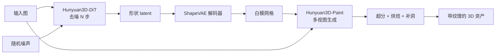
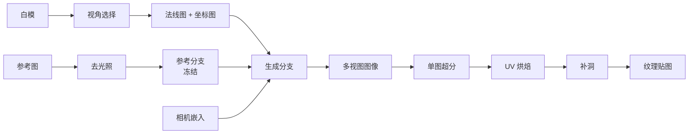

# Hunyuan3D 2.0：3D 的数据不够，就把 3D 问题翻译成 1D 和 2D

<!-- release-date: 2025-01-21 -->

> 本文依据腾讯混元 3D 团队的 **Hunyuan3D 2.0: Scaling Diffusion Models for High Resolution Textured 3D Assets Generation**，即 arXiv:2501.12202v5（2026-05-14 修订，28 页）。动笔前核对过 arXiv 官方提交历史：该论文共有 v1（2025-01-21）、v2（2025-01-22）、v3（2025-02-26）、v4（2026-05-10）、v5（2026-05-14）五个版本，v5 是最新版；本地件封面戳记正是 `arXiv:2501.12202v5 [cs.CV] 14 May 2026`，与官方件的前 12 MiB 逐字节一致，**未做替换**。官方仓库没有另放一份技术报告 PDF。
>
> 全文页码指 PDF 自身页码。本篇 PDF 页码与印刷页码一致（第 2 页起页脚就印着 `2`），引用时可以直接对照。
>
> 文中始终区分三件事：**报告写了什么**、**本文如何解释**、**哪些是外部补充**。凡是本文自己推出来的、从图里读出来的、或者从官方仓库补进来的，都会当场说明。
>
> 边界说明：本篇只覆盖**物体级**的 3D 资产生成，也就是单个物体的几何与纹理。场景级、可漫游可交互的 3D 世界生成是另一条线（HunyuanWorld-1.0），该方向见 HunyuanWorld-1.0 的解读，本文不展开。2D 图像生成基座（HunyuanImage 系列）与视频生成（HunyuanVideo-1.5）同样不在本文范围。

## 读之前：这一篇需要的十来个词

这是本模块第一篇 3D 生成方向的解读。3D 这一行有一整套自己的词汇，和语言模型、图像模型都不重叠。下面这些概念全部是本篇正文真正会用到的，先花几分钟建立直觉，后面每一节都会顺得多。这一节的内容属于**外部背景**，报告本身默认读者已经懂。

**网格（mesh）**：3D 物体最主流的存储格式。它由一堆顶点和把顶点连起来的三角面组成，本质上是一层没有厚度的壳。游戏引擎、建模软件、3D 打印吃的都是它。

**点云（point cloud）**：把物体表面采样成一大堆离散的点，每个点有 $xyz$ 坐标，通常还带一个**法向量**（normal，表示这一点的表面朝向哪边）。点云比网格简单——没有连接关系，只是一袋子点。

**有向距离场（Signed Distance Function，SDF）**：一种把形状写成函数的办法。给空间里任意一点 $x$，函数返回它到物体表面的距离；在物体外面是正数，里面是负数，正好落在表面上是 0。于是"形状"就等价于"这个函数的零等值面"。它的好处是连续、可微、适合神经网络拟合。

**Marching Cubes（移动立方体）**：把 SDF 变回三角网格的经典算法。做法是在空间里铺一个规则的立方体网格，逐个格子查 SDF 的正负号，再据此在格子内部拼出三角面片。这一步不需要学习，是纯几何算法。

**UV 与纹理贴图（texture map）**：网格是三维的，图片是二维的。把网格表面"剪开摊平"到一张二维图上，这个展开叫 **UV 展开**，摊平后的坐标叫 UV 坐标。那张二维图就是纹理贴图，图上的每个像素叫一个 **texel（纹素）**。渲染时按 UV 坐标去贴图上取颜色。

**纹理烘焙（texture baking）**：把从若干个视角渲染或生成的图像，按几何对应关系反投影回 UV 空间，写成一张纹理贴图。"烘焙"这个词在本文里就是这个意思。

**扩散模型（diffusion model）**：一类生成模型。它不是一次画完，而是从纯噪声出发反复"去噪"很多次，每一次都把样本往真实数据的方向推一点。每一次去噪叫一个 **step（步）**。

**流匹配（flow matching）**：训练扩散模型的一种目标函数写法。它不预测"这一步该减掉多少噪声"，而是学习一个**速度场**，让样本沿着从噪声到真实数据的一条路径匀速走过去。报告用的正是这个（PDF p. 6，式 2），后面会展开。

**潜空间（latent space）与 VAE**：直接在原始数据上做扩散太贵。主流做法是先用一个**变分自编码器**（Variational Auto-Encoder，VAE）把数据压成一个小得多的表示，扩散在这个压缩空间里进行，最后再用解码器还原。压缩后的东西叫**潜变量（latent）**。这套组合叫**潜扩散模型（latent diffusion model）**。

**DiT（Diffusion Transformer，扩散 Transformer）**：把扩散模型的去噪网络从 U-Net 换成 Transformer。数据被切成 Token 序列后，Transformer 在这条序列上做注意力。

**多视图扩散（multi-view diffusion）**：让一个图像扩散模型一次生成同一物体的好几个视角，并且要求这几张图互相一致（同一处细节在不同视角下要对得上）。

**Janus 问题（Janus problem）**：多视图生成里的经典毛病，得名于罗马双面神。因为二维图像模型见过的正面照远多于背面照，生成 3D 物体时容易在背面也长出一张脸。报告在相关工作里点了这个名字（PDF p. 19）。

**PBR（Physically Based Rendering，基于物理的渲染）**：现代渲染流程要求材质拆成多张贴图（基础色、粗糙度、金属度等），而不是一张把光照烤死的彩色图。**注意：Hunyuan3D 2.0 不做 PBR**，它只出一张颜色贴图；PBR 是后续版本才有的，见文末"报告之后发生了什么"。

## 一句话先说清

Hunyuan3D 2.0 是一套"先出白模、再上色"的两段式系统（PDF p. 3）。第一段叫 **Hunyuan3D-DiT**，从一张图生成没有颜色的三角网格；第二段叫 **Hunyuan3D-Paint**，给这个网格画纹理贴图。

但如果只记住"两段式"，就会错过这份报告真正在解决的事。

3D 生成不是图像生成的三维版本。它有一个图像和视频都没有的硬约束：

> **3D 的自由度比二维高一个维度，可用数据却比二维少得多。**

报告自己在相关工作里把这句话讲了出来：3D 数据的规模远小于语言模型和图像生成领域，从 3Dscanrep 到 ShapeNet，3D 数据集的增长一直是缓慢的（PDF p. 18）。报告用的词是"远小于"，**没有给出具体倍数**；本文也不替它补一个数字，只需记住这个差距大到无法靠常规扩张弥补。

数据不够，就不能指望"堆数据 + 堆参数"这条路。于是这套系统的每一个关键设计，本质上都是同一个动作的不同版本：

> **把 3D 问题翻译成一个"已经有大量数据和成熟模型"的低维问题，然后花力气去补翻译过程中的失真。**

具体是两次翻译：

- **几何这一段翻译成 1D**：把一个网格压成一串**没有空间坐标**的 token 序列（PDF p. 4），于是可以直接照搬为一维序列准备的那一整套 Transformer + flow matching 工具。
- **纹理这一段翻译成 2D**：不在曲面上做扩散，而是让一个**现成的二维图像扩散模型**从八到十二个视角把这个物体"画"出来，再把画好的图烤回 UV 贴图（PDF p. 7—9）。

每一次翻译都会丢东西。报告里绝大多数听起来零碎的技巧——重要性采样、去掉位置编码、图像去光照、冻结的参考网、多任务注意力、视角丢弃——都不是各自独立的小聪明，而是在补这两次翻译各自的失真。本文后面就按这条线展开。

## 这份报告的主要矛盾

先把矛盾摆清楚，再上名词。

假设你要造一个 3D 生成模型，第一件事是决定"3D 用什么表示"。图像天然就是一个 $H\times W\times 3$ 的规则数组，视频加一维时间，都还是规则数组。3D 没有这样一个公认答案。报告在相关工作里列了主要的几种：体素、点云、多边形网格、隐式函数（PDF p. 18）。

它们各有各的问题：

| 表示 | 好处 | 代价 |
|---|---|---|
| 体素（voxel） | 规则数组，可以直接套 3D 卷积 | 分辨率每翻一倍，存储与算力涨 8 倍，而且绝大多数格子是空的 |
| 点云 | 轻，采样简单 | 没有连接关系，恢复不出封闭表面 |
| 网格 | 下游直接可用 | 顶点数和拓扑都不固定，长度可变，难以直接喂给固定形状的网络 |
| 隐式函数 / SDF | 连续、分辨率无关 | 要用一个神经网络去拟合每个物体，本身就是一次昂贵的优化 |
| 三平面（triplane）/ 稀疏体 | 保留空间先验 | 报告的原话是"不如向量集高效"（PDF p. 18） |

报告选的是**向量集（vector set）**，出处是 3DShape2VecSet（PDF p. 4、p. 18）。它的想法非常激进：

> 把一个 3D 形状压成一条**一维的连续 token 序列**（本报告最长 3072），序列里的第 $k$ 个 token **不对应空间中任何固定位置**。

这一步是整篇报告的地基。它带来的直接好处是：3D 生成从此变成"生成一条几千长的序列"，而生成序列这件事，业界已经有大量成熟工具。代价是失去了空间归纳偏置——后面会看到这个代价怎么反噬，以及报告怎么应对。

纹理那一半的矛盾更直白：**大规模的二维图像扩散模型是现成的，大规模的"曲面上色"模型不存在。** 所以报告选择不训练一个真正在 3D 表面工作的生成模型，而是把上色转成"多视图图像生成 + 烘焙"，这样就能站在 Stable Diffusion 上（PDF p. 9）。代价是二维模型完全不知道"这几张图画的是同一个物体"，也不知道几何长什么样。

整份报告可以读成对这两个代价的系统性补救。

## 报告地图：28 页里各写了什么

先摊开篇幅分布，后面就知道哪里能深挖、哪里只能到此为止。

| 报告章节 | PDF 页 | 讲了什么 | 密度 |
|---|---|---|---|
| 标题 + 摘要 | p. 1 | 系统定位、两个基础模型、开源承诺 | 中 |
| Figure 1 系统总览 | p. 2 | 整页配图，无文字信息 | 低 |
| §1 引言 + §2 架构总览 | p. 3 | 领域现状、两段式流水线的动机 | 中 |
| Figure 2 + §3 + §3.1 | p. 4 | 形状生成总体结构、向量集、重要性采样的动机 | 高 |
| §3.1 续 + Figure 3 + §3.2 起 | p. 5 | 编解码器细节、式 1、多分辨率训练、最长 3072 | 高 |
| Figure 4 + §3.2 续 + §4 起 | p. 6 | DiT 双流/单流、无位置编码、DINOv2 条件、式 2 | 高 |
| Figure 5 + §4.1 | p. 7 | Paint 全流程图、图像去光照、视角选择、式 3 | 高 |
| Algorithm 1 + §4.2 | p. 8 | 视角选择伪代码、双流参考网、式 4 | 高 |
| §4.2 续 + §4.3 + §4.4 | p. 9 | 几何条件、相机嵌入、烘焙三步、训练超参 | 高 |
| Table 1 + §5 + §5.1 | p. 10 | VAE 重建对照、评测设置与指标 | 高 |
| Figure 6 | p. 11 | 整页重建视觉对照 | 低 |
| Table 2 + Figure 7 | p. 12 | 形状生成四项指标、视觉对照 | 中 |
| Table 3 + §5.2 + §5.3 | p. 13 | 纹理四项指标、端到端评测设置 | 中 |
| Figure 8 | p. 14 | 整页纹理视觉对照 | 低 |
| Figure 9 + Table 4 + Figure 10 | p. 15 | 换皮示例、端到端四项指标、用户研究柱状图 | 中 |
| Figure 11 | p. 16 | 整页端到端视觉对照 | 低 |
| §6 Hunyuan3D-Studio | p. 17 | 草图转 3D、低面数化、角色动画 | 中 |
| §7 相关工作 | p. 18—19 | 形状表示、形状生成、纹理合成、多视图生成 | 中 |
| §8 结论 | p. 20 | 无新信息 | 低 |
| §9 贡献者 | p. 21 | 按职能分组的七十余人名单 | — |
| 参考文献 | p. 22—28 | 123 条 | — |

有五件事必须在读正文前先知道，因为它们决定了这篇解读能走多深：

- **全文没有一个参数量。** 本文在提取出的全文里检索 `parameter` 一词，只在 Figure 4 的图注里出现过一次，讲的是"橙色块没有可学习参数"（PDF p. 6）。DiT 多大、Paint 多大、VAE 多大，报告一个数都没给。官方仓库给了，见文末的外部补充。
- **全文没有一个数据量。** 训练数据只有"自采的大规模 3D 数据集"（a self-collected large-scale 3D dataset，PDF p. 9）这一种说法，没有物体数量、没有类别分布、没有清洗流程。Objaverse 与 Objaverse-XL 只在相关工作里被称赞为推动领域的力量（PDF p. 18），报告**没有说**它们是训练数据。
- **全文没有一次消融实验。** 四张表全是与外部基线的对照，没有一次"开/关某个模块"的自我对照。所有内部设计的收益都只有定性描述。
- **全文没有算力、没有耗时、没有硬件。** 训练用了多少卡、跑了多久、单次生成要几秒，一个数都没有。
- **全文没有限制章节、没有安全章节、没有许可讨论。** 本文检索了 `limitation`、`license`、`safety`、`ethic`、`future work`、`failure`，全文零命中。

因此这篇解读的重心不放在"复现"，而放在**每个设计在补哪一处失真，以及哪些结论真的被实验撑住了**。

## 全景：一条两段式流水线

先给整体，再拆细节。这张图按报告 Figure 2（PDF p. 4）与 §2（PDF p. 3）重画，只表示模块连接关系，不含任何时间或性能信息。

三个要点：

**第一，输入只有一张图。** 报告全篇描述的形状生成都是 image-to-shape，Figure 4 的输入端画的是 `Timestep`、`Input Image`、`Noisy Shape Latent Tokens` 三路（PDF p. 6），没有文本编码器。想做文生 3D，报告的做法是外挂一个 T2I 模型先把文字变成图（PDF p. 9—10），而不是给 DiT 加文本条件。

**第二，同一张输入图被用了两次**——一次作为几何的条件，一次作为纹理的条件。这不是冗余：几何那次用的是 DINOv2 特征（PDF p. 6），纹理那次用的是经过去光照处理后的 VAE 特征（PDF p. 8）。两次用的是同一张图的不同抽象层次。

**第三，两段是解耦的。** 报告明确说这样拆的好处是"解耦形状与纹理生成的难度"，并且带来灵活性——Paint 既能给生成的白模上色，也能给美术手工建的模上色（PDF p. 3）。这是一个产品判断，不只是技术判断：在真实的 3D 生产管线里，几何和贴图本来就是两个工种。

下面分别拆开。

## 第一次翻译：把一个网格压成一串 token

### 旧问题：压缩比一高，边角就糊了

Hunyuan3D-ShapeVAE 的任务是：输入一个网格，输出一条短的连续 token 序列；再从这条序列还原出 SDF，进而还原出网格（PDF p. 4）。

它沿用 Michelangelo 的做法，用一个变分编码器—解码器 Transformer；输入取的是从表面采样的点云的 3D 坐标和法向量，解码器被要求预测 SDF（PDF p. 4）。

报告把它的第一版设计和失败原因写得很直白（PDF p. 4）：

> 最初的设计是用一个基于注意力的编码器去编码**均匀采样**自表面的点云。但这个设计通常无法重建复杂物体的细节。

为什么？报告给的归因是：**表面各区域的复杂度不一样**（we attribute this difficulty to the variations in the complexity of regions on the shape surface，PDF p. 4）。

把这句话说得更具体一点（以下是本文的展开）：均匀采样的含义是"单位面积上采一样多的点"。一个茶壶的壶身是大片光滑曲面，壶嘴和壶盖边缘是很小一圈高曲率区域。按面积算，壶身拿走了绝大多数采样点，而真正决定"这看起来像不像一个茶壶"的边和角，只分到寥寥几个点。信息在**采样那一刻**就丢了，后面的网络再大也补不回来。

这是所有"先降采样、再建模"的系统共有的病：**采样密度按错误的量分配。**

### 新设计：两种采样，两套点查询

报告的修法是加一路**重要性采样**（importance sampling），在网格的**边和角**上多采点（PDF p. 4）。注意它是"额外加一路"，不是"替换原来那一路"——均匀采样负责整体形状，重要性采样负责高频细节，两者互补。

报告在这里加了一个诚实的脚注：并行工作 Dora 基于类似的观察也提出了类似的重要性采样（PDF p. 4 脚注）。这种"同期撞车"的标注在报告里不常见，值得记一笔。

具体流程（PDF p. 5）：

1. 从表面采两组点云：均匀的 $P_u \in \mathbb{R}^{M\times 3}$，重要性的 $P_i \in \mathbb{R}^{N\times 3}$。
2. 对两组点云**分别**做**最远点采样**（Farthest Point Sampling，FPS），各自得到一组更稀疏的"点查询"$Q_u \in \mathbb{R}^{M'\times 3}$ 与 $Q_i \in \mathbb{R}^{N'\times 3}$。FPS 是一种贪心的稀疏化：每次都挑离已选点最远的那个点，好处是选出来的点在空间上尽量铺得开。
3. 把两组点云拼成 $P$、两组查询拼成 $Q$，各自过傅里叶位置编码加一层线性投影，得到 $X_p$ 与 $X_q$。
4. 用**一层交叉注意力**把点云压进点查询：查询来自 $X_q$，键值来自 $X_p$。序列长度从 $M+N$ 降到 $M'+N'$。
5. 再过若干层自注意力精修，得到隐藏表示 $H_s$。
6. 因为是变分自编码器，最后再加一层线性投影，预测潜变量的均值 $\mathrm{E}(Z_s)$ 和方差 $\mathrm{Var}(Z_s)$。

**图 3 里有一个容易被跳过、但报告特意强调的细节**：FPS 是对均匀点云和重要性点云**分别**做的，不是拼起来一起做（PDF p. 5，Figure 3 图注专门写了这一句）。这一步很关键。如果先拼再 FPS，最远点采样会自动把点铺得均匀，重要性采样辛苦堆在边角上的密度立刻被抹平——那一路就白加了。分开做，等于给"细节配额"上了一道锁。

这是本文认为整个 VAE 设计里最值得带走的一个动作：**当你刻意制造了某种不均衡，就必须检查后续的每一步会不会把它自动抹平。**

### 解码器：从 token 回到三角网格

解码器 $\mathcal{D}_s$ 的路径是（PDF p. 5）：

1. 一层投影，把潜变量从维度 $d_0$ 拉回 Transformer 的宽度 $d$。
2. 若干层自注意力。
3. 一个"点感知器"（point perceiver），以 3D 规则网格 $Q_g \in \mathbb{R}^{(H\times W\times D)\times 3}$ 为查询，做交叉注意力，得到 3D 神经场。
4. 再一层线性投影得到每个格点的 SDF 值。
5. Marching Cubes 变成三角网格。

层数从 Figure 2（PDF p. 4）和 Figure 3（PDF p. 5）里可以读出来：**编码器是 1 层交叉注意力 + 8 层自注意力，解码器是 16 层自注意力 + 1 层交叉注意力**。这两个数只出现在图里，正文只说"若干层"（a number of self-attention layers）。

解码器比编码器深一倍，这个不对称是合理的：编码器只需要把信息压进去，解码器却要从一条无坐标的序列里把整个连续场重建出来，后者的工作量大得多。**报告没有解释这个 8 / 16 的选择，也没有做过层数消融**，所以这里只能当作一个观察，不能当作被验证的设计原则。

顺带记一个原件里的笔误：报告把神经场写成 $F_g \in \mathbb{R}^{(F_n\times W\times D)\times d}$、把 SDF 写成 $F_{sdf}\in\mathbb{R}^{(F_o\times W\times D)\times 1}$，但同一段里的网格查询是 $Q_g\in\mathbb{R}^{(H\times W\times D)\times 3}$（PDF p. 5）。按维度对应，$F_n$ 与 $F_o$ 显然都应该是 $H$。这个笔误在 v5 里仍然存在，本文逐页渲染确认过不是文本提取的问题。

### 训练目标：一个 MSE 加一个 KL

报告给出的重建损失是（PDF p. 5，式 1）：

$$
\mathcal{L}_r = \mathbb{E}_{x\in\mathbb{R}^3}\big[\mathrm{MSE}(\mathcal{D}_s(x\,|\,Z_s),\ \mathrm{SDF}(x))\big] + \gamma\,\mathcal{L}_{KL}
$$

这个式子要算的是"重建得准不准，以及潜空间规不规整"。逐项看：

- $\mathcal{D}_s(x\,|\,Z_s)$ 是解码器在潜变量 $Z_s$ 的条件下，对空间点 $x$ 预测的 SDF 值；$\mathrm{SDF}(x)$ 是真值。两者取 MSE，就是重建误差。
- 外面的期望 $\mathbb{E}_{x\in\mathbb{R}^3}$ 是关键：完整算一遍整个空间的 SDF 太贵，所以报告的做法是**随机采样一批空间点和一批表面点**，只在这些点上算损失（PDF p. 5）。这是把一个连续场的监督变成蒙特卡洛估计。
- $\mathcal{L}_{KL}$ 是 KL 散度项，作用是"让潜空间紧凑且连续"（PDF p. 5）。$\gamma$ 是它的权重，**报告没有给 $\gamma$ 的数值**。

为什么必须加 KL 项？因为这个 VAE 不是终点，它的潜空间要给下一阶段的扩散模型当训练场。如果潜空间被训得支离破碎、到处是空洞，扩散模型采样时落到空洞里就会解码出垃圾。KL 项相当于给潜空间做一次"整地"。这个因果关系报告写出来了（facilitates the training of diffusion models，PDF p. 5），值得记住——**上游表示的规整程度，是下游生成模型能否工作的前提。**

### 多分辨率课程：让序列长度自己变

报告还写了一个训练技巧（PDF p. 5）：训练时潜变量序列的长度**从一个预定义集合里随机采样**。短序列省算力，长序列保质量；发布版本里最长是 **3072**。

这一招的价值不在省钱，而在于**同一套权重可以在推理时按需选长度**。想快就用短序列，想要细节就上 3072。报告没有明说这一点，但从"随机采样长度"的训练方式可以直接推出来——这是本文的推断。

代价是：报告**没有给出这个"预定义集合"具体是哪些长度**，也没有给不同长度下的质量曲线。所以你知道有这个旋钮，但不知道旋钮的刻度。

### 收益：Table 1

报告把 ShapeVAE 和三个基线比重建质量，指标是体积交并比（V-IoU）和近表面交并比（S-IoU），越高越好（PDF p. 10，Table 1）：

| 方法 | V-IoU | S-IoU |
|---|---:|---:|
| 3DShape2VecSet | 87.88% | 80.66% |
| Michelangelo | 84.93% | 76.27% |
| Direct3D | 88.43% | 81.55% |
| **Hunyuan3D-ShapeVAE** | **93.6%** | **89.16%** |

有两个必须读出来的前提，报告写在正文里（PDF p. 10）：

- **除 Direct3D 外，所有 VAE 都在 1024 的 token 长度下对比**。Direct3D 需要 3072，报告的说法是它在缩短 token 长度时性能显著退化。这意味着 Hunyuan3D-ShapeVAE 是在**三分之一的预算**下赢了 Direct3D，这个对比比表格数字本身更有说服力。
- 报告自己指出，与 3DShape2VecSet 和 Michelangelo 的对比"证明了重要性采样策略的有效性"。这是全报告里最接近"消融"的一句话，但它仍然不是消融——三个方法的编码器结构、训练数据、训练量都不同，把差距全部归因于重要性采样是过度归因。**准确的说法是：在这个对照里，采用重要性采样的方法赢了没采用的方法，但报告没有隔离出其他变量。**

另外，S-IoU（近表面区域）的领先幅度（+7.61 个百分点，对 Direct3D）明显大于 V-IoU（+5.17）。这和"重要性采样专门补边角"的动机方向一致——差距最大的地方正好在表面附近。这是本文从表里读出来的观察，报告没有点出这一点。

### 代价与边界

**第一，SDF 监督要求训练数据是"水密"的。** 要给空间任意一点定义"里"和"外"，物体必须是一个封闭的壳。现实中的 3D 模型大量是敞开的、有洞的、单面的。报告完全没有提数据预处理，所以"怎么把野生网格变成可用的 SDF 真值"这一整块工程是空白。这不是小事——对做过 3D 数据管线的人来说，这往往是最脏的一段活。

**第二，marching cubes 的网格分辨率没有给。** 式子里的 $H\times W\times D$ 从头到尾是符号。这个数直接决定最终网格的面数和细节上限，也直接决定解码耗时。报告不给，就无法估算推理成本。

**第三，VAE 的失真是全流水线的天花板。** 后面的 DiT 再准，也只能生成 VAE 能表达的形状。Table 1 里 93.6% 的 V-IoU 意味着还有 6.4% 的体积对不上，这部分误差是无论如何都补不回来的。报告没有讨论这个上界。

### 可迁移启发

- **采样密度要按"信息密度"分配，不能按"体积"或"面积"分配。** 这一条远超 3D：日志抽样、训练数据去重、评测集构造、性能采样，都有同一个陷阱——按均匀分布采，就等于让占地面积最大的部分吃掉全部预算。
- **刻意制造的不均衡，要检查下游会不会把它抹平。** 分开做 FPS 这一步就是这个道理。在数据管线里，一次"顺手做的归一化/去重/排序"经常会把上游辛苦制造的分布悄悄拉平。
- **随机化训练时的"预算维度"，可以换来推理时的一个旋钮。** 随机序列长度、随机分辨率、随机深度，本质上都是让一套权重覆盖一段质量—成本曲线。

## 第二次借用：把 FLUX 的骨架搬到形状上

ShapeVAE 把形状变成了序列。到这一步，"生成一个 3D 形状"就变成了"生成一条序列"，而这件事有现成的强方案。报告直接说明灵感来自 FLUX，采用**双流 + 单流**的网络结构（PDF p. 6）。

### 双流与单流

**双流块（double-stream block）**：形状 token 和图像条件 token 各有各的 QKV 投影、各有各的 MLP，但在**注意力这一步汇合**（PDF p. 6）。也就是说，两种模态各自保留自己的参数，只在需要交换信息的地方共享一次运算。

**单流块（single-stream block）**：形状 token 和条件 token 直接拼接成一条序列，一起处理（PDF p. 6）。

从 Figure 4（PDF p. 6）可以读出层数：**双流 ×16，单流 ×32**。这两个数只在图里出现，正文没有写。

为什么要先双流再单流？报告没有解释，只说这个设计"有利于形状与图像两种模态之间的交互"（PDF p. 6）。本文的理解是：早期两种模态的统计特性差别最大，各走各的参数更稳；到了深层，表示已经对齐，合并成一条序列既省参数又让交互更充分。**这是本文的解释，不是报告的论证，报告也没有做双流/单流配比的消融。**

这里要指出一处正文与图不一致：正文写的是单流块里"latent token 与条件 token 拼接后由 **spatial attention 和 channel attention 并行处理**"（PDF p. 6），但 Figure 4 画出来的单流块是**注意力分支**（Linear → QK-Norm → Attention）与**前馈分支**（Linear → GELU）并行，两路的输出再合并过一层线性和门控。报告全文没有定义什么是 "channel attention"。按图理解，它指的应该是那条 GELU 前馈支路；但既然文字和图对不上，这里只标出不一致，不替它补一个说法。

### 全文最值得记住的一句话：这里没有位置编码

报告写了一句在图像/视频 DiT 里绝对不敢写的话（PDF p. 6）：

> 我们**省略了 latent 序列的位置编码**，因为 ShapeVAE 的某个特定 latent token 在序列中并不对应 3D 网格里的一个固定位置。相反，3D latent token 的**内容本身**负责确定生成形状在 3D 网格中的位置/占据情况——这和图像/视频生成不同，那里的 token 负责预测 2D/时空网格中某个特定位置的内容。

这段值得反复读，因为它把"向量集"这个选择的全部后果说清楚了。

在图像 DiT 里，第 $k$ 个 token 就是画面左上角往右数第几块。位置编码是必需的，否则模型不知道该把内容放哪。在这里，第 $k$ 个 token 不是"物体的第 $k$ 个部位"——它只是编码器 FPS 挑出来的第 $k$ 个点查询压出来的东西，换一次采样，顺序就变了。

于是：

- **加位置编码反而有害**，因为它会让模型去学一个根本不存在的"序号—空间"对应关系。
- **序列的顺序在语义上是可交换的**，模型被迫从 token 的内容而不是位置去恢复几何。
- **这也解释了为什么形状 latent 可以随长度变化。** 既然没有位置编码绑死索引，同一套权重吃 1024 和吃 3072 就不是结构性冲突。

这条对做别的系统也有用：

> **只有当序号真的携带含义时，位置编码才是必需的。把一个集合当序列处理时，硬加位置编码是在教模型学噪声。**

集合式的输入在工程里很常见——一批候选文档、一组用户特征、一堆检索结果。它们的顺序往往是排序算法或随机数决定的，不是数据本身的性质。

另外报告说，**调制模块只用 timestep 的嵌入**（PDF p. 6）。也就是说图像条件不参与 AdaLN 式的调制，只通过注意力进来。这与 FLUX 把文本条件也送进调制的做法不同。报告没有说为什么，本文也不替它补理由。

### 条件注入：一个大编码器加一套强预处理

图像条件的处理有两部分（PDF p. 6）。

**第一部分是编码器选型**：用预训练的 **DINOv2 Giant**，输入分辨率 **518 × 518**，取最后一层的 patch token 序列**外加 head token**。报告给的理由是"为了捕捉图像中的细粒度细节"，所以选大编码器和大输入尺寸。

这里的取舍很清楚：3D 几何生成需要的是"这个物体的表面在哪凸起、哪凹陷"，这是**几何细节**而不是语义标签。DINOv2 是自监督视觉特征，比 CLIP 这类图文对齐特征更擅长保留稠密的空间结构。报告没有解释为什么不用 CLIP，这一段归因是本文的补充。

**第二部分是预处理**，报告列了四步：去背景、把物体缩放到统一大小、居中、背景填白。给的理由是"消除背景的负面影响，并提高输入图像的有效分辨率"。

这一步看起来平淡，但值得停一下。它做的事情是**把条件图像的分布收窄**：所有输入都变成"白底、居中、统一尺寸的单物体"。对一个数据量本来就不够的任务，**主动削掉输入的变化维度，等价于变相扩大了有效数据量**。代价是推理时必须跑同一套预处理，而且对多物体、有场景上下文的输入天然不友好。

### 训练与推理：flow matching 加一阶欧拉

报告用流匹配（PDF p. 6）。它先在高斯分布与数据分布之间定义一条概率密度路径，然后让模型去预测把样本 $x_t$ 推向数据 $x_1$ 的速度场 $u_t$。

报告采用的是仿射路径加条件最优传输调度：

$$
x_t = (1-t)\,x_0 + t\,x_1, \qquad u_t = x_1 - x_0
$$

这两个式子说的是：把噪声 $x_0$ 和数据 $x_1$ **直线连起来**，$t$ 从 0 走到 1 就是从噪声走到数据；既然是直线匀速，那么任意时刻的"该走的方向和速度"就是终点减起点，即 $x_1-x_0$，与 $t$ 无关。这是流匹配最简单的一种设定，也是它比传统扩散好理解的地方。

训练损失就是让网络预测的速度去逼近这个真值（PDF p. 6，式 2）：

$$
\mathcal{L} = \mathbb{E}_{t,x_0,x_1}\big[\;\|\,u_\theta(x_t, c, t) - u_t\,\|_2^2\;\big]
$$

其中 $t \sim \mathcal{U}(0,1)$ 是均匀采样的时间，$c$ 是条件（这里就是图像特征），$u_\theta$ 是网络。整个式子是一个再普通不过的回归损失——这正是流匹配吸引人的地方：**训练目标退化成了"预测一个向量"。**

推理时，先采一个起点 $x_0 \sim \mathcal{N}(0,1)$，再用**一阶欧拉 ODE 求解器**积分到 $x_1$（PDF p. 6）。一阶欧拉就是最朴素的"当前位置 + 步长 × 当前速度"。

**报告没有给推理步数。** Figure 2 里写的是 `Steps x N`（PDF p. 4），N 是什么没说。也没有提到 classifier-free guidance——全文没有出现过 CFG 或 guidance scale。这是一个明显的空白：一个图像条件的扩散模型如果不用引导，条件遵循程度通常会明显偏弱；如果用了，推理成本要翻倍。报告两边都没交代。

### 收益：Table 2，以及一处必须指出的标注错误

形状生成的评测用了四个指标（PDF p. 10）：ULIP 和 Uni3D 是两个 3D—文本/图像对齐模型，分别用来算生成网格与输入图的相似度（ULIP-I、Uni3D-I）、以及生成网格与视觉语言模型合成的文字提示的相似度（ULIP-T、Uni3D-T）。四个都是越高越好。

（PDF p. 12，Table 2）：

| 方法 | ULIP-T | ULIP-I | Uni3D-T | Uni3D-I |
|---|---:|---:|---:|---:|
| Michelangelo | 0.0752 | 0.1152 | 0.2133 | 0.2611 |
| Craftsman 1.5 | 0.0745 | 0.1296 | 0.2375 | 0.2987 |
| Trellis | 0.0769 | 0.1267 | 0.2496 | 0.3116 |
| Shape Model 1 | **0.0799** | 0.1181 | 0.2469 | 0.3064 |
| Shape Model 2 | 0.0741 | **0.1308** | 0.2464 | 0.3106 |
| Shape Model 3 | 0.0746 | 0.1284 | 0.2516 | 0.3131 |
| Hunyuan3D-DiT | 0.0771 | 0.1303 | **0.2519** | **0.3151** |

本文把这一列的加粗按**实际数值大小**重排过。原件的加粗是另一个样子：**报告把 Hunyuan3D-DiT 的 ULIP-T = 0.0771 加粗成了最优，而把实际更高的 Shape Model 1 的 0.0799 标成了下划线（次优）**。PDF 第 12 页已逐字渲染核对过，确认不是文本提取的问题。

把四列如实读一遍：

- **Uni3D-T、Uni3D-I：Hunyuan3D-DiT 第一**，领先幅度分别是 0.0003 和 0.0020。
- **ULIP-I：Shape Model 2 第一（0.1308），Hunyuan3D-DiT 第二（0.1303）**，差 0.0005。
- **ULIP-T：Shape Model 1 第一（0.0799），Hunyuan3D-DiT 第二（0.0771）**，差 0.0028——这是四项里差距最大的一项，而它恰好就是被错标成最优的那一项。

而表注写的是"demostrating Hunyuan3D-DiT could produce the most condition followed results"（原文拼写如此，PDF p. 12）。

这个结论比数据强。诚实的说法应该是：**Hunyuan3D-DiT 在 Uni3D 的两项上最好，在 ULIP 的两项上没有拿到第一；四项之间的差距都在千分位，几乎全部落在噪声量级里。**

顺带说，这四个指标本身的分辨力也值得怀疑。ULIP-T 的全表极差是 0.0799 − 0.0741 = 0.0058，而各方法之间肉眼可见的质量差距（看 Figure 7，PDF p. 12）远不止这个比例。**报告没有给这些指标的方差或置信区间，也没有说测试集有多大**，所以千分位的差异不能当成结论。这也是本文认为后面的用户研究（哪怕它只有一张柱状图）比这四张表更有信息量的原因。

### 代价与边界

- **只有图像条件，没有文本条件。** 文生 3D 只能靠外接 T2I，等于把"文字理解"这件事完全外包，中间多了一次有损转换。
- **推理步数、CFG、采样调度全部未公开**，无法估算生成一个形状的实际成本。
- **匿名基线**。"Shape Model 1/2/3" 是三个闭源商业产品，报告不说是谁（PDF p. 10）。这在与商业产品对比时是常见做法，但结果因此完全不可复现、不可核查。
- **形状生成没有几何指标**。四个指标全是"生成结果与条件的对齐度"，没有一项衡量网格本身的质量（水密性、法向一致性、面片质量、自交）。报告在正文里说生成的白模"无洞"（holeless，PDF p. 10），但没有任何数字支撑这句话。

### 可迁移启发

- **把问题翻译到一个工具成熟的空间，往往比在原空间硬造工具更快。** 把 3D 变成序列，就能一次性继承 Transformer、flow matching、DiT 的全部积累。代价是要认真处理翻译损失。
- **翻译之后，要重新审视继承来的每一个组件是否还成立。** 位置编码这件事就是典型：照抄图像 DiT 会顺手加上，但在向量集上它是错的。**继承一套架构，不等于继承它的每一条归纳偏置。**
- **数据稀缺时，收窄输入分布是最便宜的杠杆。** 去背景、居中、统一尺寸这类预处理不涨参数、不涨算力，却直接提高了每条数据的有效性。

## 第三次借用：把"给曲面上色"改写成"画几张图再烤回去"

### 旧问题：三条路都不好走

给一个白模上色，直觉上有三条路：

**路线一：直接在 UV 贴图上做扩散。** 问题是 UV 展开会把曲面剪成很多不连续的碎片，碎片之间在贴图上是散落的。二维卷积或注意力在 UV 图上的"邻居"关系与物体表面的真实邻接关系对不上，跨接缝就会出现明显的色差。而且不存在大规模的 UV 贴图预训练数据。

**路线二：分数蒸馏（score distillation）。** 让一个二维扩散模型对渲染结果打分，反过来优化纹理。报告在相关工作里点了这条路的问题：**颜色过饱和、与几何对不齐**（over-saturated colors and misalignment with geometry，PDF p. 19）。而且每个物体都要跑一次优化，慢。

**路线三：把它当成"几何条件下的多视图图像生成"。** 报告选的是这条（PDF p. 19），因为它能最大程度吃到预训练图像扩散模型的红利。

但路线三有它自己的三个硬伤，报告的设计几乎是一对一地在补：

| 二维模型不知道的事 | 后果 | 报告的补法 |
|---|---|---|
| 这几张图画的是同一个物体 | 多视图不一致，同一处细节对不上 | 多视图注意力（PDF p. 8） |
| 物体的几何长什么样 | 画出来的图贴不到网格上 | 法线图 + 坐标图通道拼接（PDF p. 9） |
| 参考图上的光影不是物体本色 | 光照被烤死进贴图 | 图像去光照模块（PDF p. 7） |
| 训练数据全是渲染图 | 生成结果漂向"渲染味" | 冻结的参考网做软正则（PDF p. 8） |
| 有些表面从任何选定视角都看不见 | 贴图上留洞 | 视角选择 + 稠密视角推理 + 补洞（PDF p. 7、p. 9） |

下面按流水线顺序走一遍。这张图按报告 Figure 5（PDF p. 7）与 §4.1—§4.3（PDF p. 7—9）重画，只表示模块连接关系。

### 第一步：先把光照从参考图里拆掉

报告的问题陈述（PDF p. 7）：参考图通常带着明显且多变的光照和阴影，不管是用户拍的还是 T2I 生成的。直接送进多视图生成框架，会导致**光照和阴影被烤进纹理贴图**。

这是纹理生成特有的一个坑，值得说透。假设参考图里物体左侧被打了一盏强光。如果不处理，模型会把"左侧亮"当成物体的固有颜色画进贴图。烘焙之后，这张贴图无论在什么灯光下渲染，左边永远比右边亮——而且当渲染引擎再打一次光，两层光照会叠加，结果彻底失真。

修法是训一个**图像去光照模型**（image delighting model），走图生图的路子，参考的是 InstructPix2Pix（PDF p. 7）。训练数据的造法很聪明：拿一个大规模 3D 数据集，**同一个物体渲染两次**——一次用随机的 HDRI 环境光照，一次用均匀白光——这两张图天然构成一对（PDF p. 7）。

这一招值得单独记：

> **当你需要"去掉某个因素"的数据对，而现实中拿不到，就去找一个能同时生成"有"和"没有"两种版本的渲染器。**

真实世界里你不可能把同一个物体拍两次、其中一次没有光照。但在渲染管线里，光照只是一个参数，改一下就有了完美配对的监督信号。合成数据在这里不是"次一等的真实数据"，而是**唯一能提供该监督的来源**。

去光照带来的连锁收益，报告也写出来了（PDF p. 7）：因为参考图已经被拉到无光状态，多视图生成模型就可以**完全在均匀白光渲染的图像上训练**，从而实现光照无关的纹理合成。也就是说，去光照模块把整个下游的训练分布收窄了一个维度。这又是一次"主动削掉变化维度"的操作，和形状那一段的图像预处理是同一个思路。

**代价**：多了一个独立模型（官方仓库列出的 Hunyuan3D-Delight-v2-0 是 1.3B，这是外部补充，报告没写参数量）。而且去光照本身是有损的——强阴影区域的信息可能已经不可恢复，去光照模型只能"编"一个合理的结果。报告没有给去光照的任何量化评测。

### 第二步：视角选择——用覆盖率做贪心

选几个视角、选哪几个，直接决定成本和补洞的工作量。报告的目标写得很直白：**用最少的视角覆盖最大的纹理面积**（PDF p. 7）。

做法是几何感知的贪心搜索：先固定 4 个正交视角作为基底（因为它们已经覆盖了几何的大部分），然后迭代地往里加新视角，每次加**能带来最多新增覆盖**的那一个（PDF p. 7）。

覆盖函数的原式是（PDF p. 7，式 3）：

$$
\mathcal{F}(v_i, \mathbb{V}_s, \mathbf{M}) = \mathcal{A}_{area}\Big\{\mathcal{UV}_{cover}(v_i,\mathbf{M}) \setminus \Big[\mathcal{UV}_{cover}(v_i,\mathbf{M}) \cap \big(\bigcup_{s\in \mathbb{V}_s}\mathcal{UV}_{cover}(v_s,\mathbf{M})\big)\Big]\Big\}
$$

先说它要算什么：**如果把视角 $v_i$ 加进来，能新盖住多少之前没盖到的纹理面积。**

符号只有三个：$\mathcal{UV}_{cover}(v,\mathbf{M})$ 返回从视角 $v$ 看网格 $\mathbf{M}$ 时能覆盖到的 UV texel 集合；$\mathcal{A}_{area}$ 把一个 texel 集合换算成面积；$\mathbb{V}_s$ 是已经选中的视角集合。

这个式子写得比需要的复杂。记 $U_i$ 为新视角覆盖的 texel 集合、$S$ 为已选视角覆盖的并集，原式是 $\mathcal{A}(U_i \setminus (U_i \cap S))$，而集合运算上 $U_i \setminus (U_i\cap S) = U_i\setminus S$。所以它等价于：

$$
\mathcal{F} = \mathcal{A}\big(U_i \setminus S\big)
$$

也就是**新增覆盖面积**，一句话就说完了。这是本文的化简，报告写的是展开形式。

Algorithm 1 是这个贪心的伪代码（PDF p. 8）：设 $N_{max}=12$ 为最大迭代次数、$N_{fixed}=4$ 为初始固定视角数，循环 $i$ 从 4 走到 11，每轮遍历候选视角集合 $\mathbb{V}_r$，取覆盖增益最大的 $v_{max}$，从候选里移走、加进已选集合。

这里有一处**必须指出的不自洽**：正文说"启发式地选 **8 到 12 个**视角用于推理"（PDF p. 7），但 Algorithm 1 里**没有任何提前退出条件**——循环固定跑 8 轮，每轮必加一个视角。也就是说，按伪代码执行，结果永远是固定数量（4 个固定视角加 8 轮，共 12 个），不可能是"8 到 12"这个范围。要么正文的范围来自伪代码之外的某个阈值（比如增益低于某值就停），要么伪代码省略了这个条件。**报告两边对不上，也没有给出这个阈值**，所以真实行为无法从报告确定。

### 第三步：双流参考网——为什么要把 SD2.1 冻住

这一段是纹理侧设计最密的地方，报告一口气讲了三个非常规选择（PDF p. 8）。

**选择一：给参考分支喂的是无噪声的原始 VAE 特征，不是与生成分支同步加噪的特征。** 参考网（reference-net）的常规做法是复制一份 U-Net，让它和主干在同一个噪声水平上跑，逐层把特征喂过去。报告反其道行之——**直接把参考图的原始 VAE 特征送进参考分支**，理由是"尽最大可能保住图像细节"。

**选择二：既然特征无噪声，就把参考分支的 timestep 设为 0。** 这是选择一的必然结果：扩散模型的每一层行为都由 timestep 调制，喂的是干净特征，就该告诉它"现在是 $t=0$，也就是完全去噪的状态"。这个细节在 Figure 5 右下角画了出来（`Timestep=0`，PDF p. 7）。

**选择三：不共享权重，而是把参考分支冻结在原始 SD2.1 权重上。** 这一条最反直觉，理由也最有意思。报告的原话是（PDF p. 8）：

> 为了**规避 3D 渲染数据集带来的潜在风格偏置**，我们放弃了共享权重的参考网，转而冻结原始 SD2.1 的权重……我们发现固定权重的参考网起到了一种**软正则**的作用，把生成图像的分布**锚住**，防止它漂向渲染图像的分布，从而显著提升了在真实世界图像条件下的表现。

把这段话展开（以下是本文的解释）：训练数据全是 3D 模型的渲染图——干净背景、理想光照、CG 质感。如果参考分支也跟着一起训，它会很快学会"用渲染图的方式去看图"。于是推理时喂一张真实照片，参考分支提取的特征就已经带上了渲染味，整条链一起漂走。

冻住它，等于在系统里**钉了一根不随训练移动的桩**：无论主干在渲染数据上被拉得多远，参考分支始终用"见过五十亿张真实互联网图像的那双眼睛"来读参考图。

这条经验的可迁移性很强：

> **当你在一个分布偏窄的数据集上微调时，保留一条冻结的、来自宽分布预训练的通路，可以充当防止过拟合到窄分布的锚。**

微调一个通用模型去做垂直任务时，最常见的失败不是"学不会"，而是"学会了之后只认训练集那种输入"。冻结一条通路比调 dropout、调学习率更直接。

**代价**：参考分支不参与训练，就无法为这个任务学到任何专用特征；它的表达能力被永久锁在 SD2.1 的水平上。报告没有给这个取舍的量化对照（冻结 vs 共享权重的数字），只说"显著提升"。**所以这是一个作者观察，不是被实验隔离验证的结论。**

具体接法是：在参考分支每个自注意力模块之前抓一份特征缓存，再通过一个参考注意力模块喂进多视图扩散模型（PDF p. 8）。

### 第四步：多任务注意力——为什么是并行不是串行

现在生成分支需要同时干三件事：保持自己内部的图像结构、参考那张图、和其他视角对齐。报告的做法是在原有自注意力**旁边**再加两个注意力模块（PDF p. 8）：

- **参考注意力（reference attention）**：把参考图的信息注入多视图扩散过程。
- **多视图注意力（multi-view attention）**：保证各个生成视角之间的一致性。

关键在于连接方式。报告说得很明确：为了缓解这几种功能之间的潜在冲突，把这两个额外模块设计成**并行结构**（PDF p. 8）：

$$
Z_{MVA} = Z_{SA} + \lambda_{ref}\cdot \mathrm{Softmax}\Big(\frac{Q_{ref}K_{ref}^{\top}}{\sqrt{d}}\Big)V_{ref} + \lambda_{mv}\cdot \mathrm{Softmax}\Big(\frac{Q_{mv}K_{mv}^{\top}}{\sqrt{d}}\Big)V_{mv}
$$

这个式子要算的是：这一层的输出等于原来自注意力的输出，**加上**两项修正。

符号：$Z_{SA}$ 是原始的、**冻结权重**的自注意力输出（报告在 p. 9 明确说了这一点）；$Q_{ref},K_{ref},V_{ref}$ 是参考注意力的查询/键/值，$Q_{mv},K_{mv},V_{mv}$ 是多视图注意力的；$d$ 是维度，$\sqrt{d}$ 是常规缩放；$\lambda_{ref}$ 与 $\lambda_{mv}$ 是两项的权重。

**报告没有给 $\lambda_{ref}$ 和 $\lambda_{mv}$ 的数值，也没有说它们是可学习的还是固定的。** 这是一个不小的空白，因为这两个系数直接控制"听参考图"和"听其他视角"之间的平衡。

为什么并行比串行好？报告只给了结论（缓解冲突），没给论证。本文的理解是：串行意味着后一个模块只能看到被前一个模块改过的特征，两种目标会形成先后次序——先对齐参考图、再对齐多视图，后者就会去破坏前者的结果，反之亦然。并行则让三条支路都从**同一份输入**出发，各自算出自己的修正量，最后按权重相加。这在形式上就是一个加性的残差组合：每条支路只负责说"我认为该往哪个方向改"，不覆盖别人的判断。**这是本文的解释，报告没有做串行/并行的对照实验。**

Figure 5 右侧把这个结构画了出来（PDF p. 7）：生成块里 ResBlock 之后，多视图注意力、自注意力、参考注意力三路并排，输出汇到一个加号，再进下一个 ResBlock。图里还标出了哪些模块是冻结的（带雪花标记），与正文"原始自注意力权重冻结"的说法一致。

### 第五步：几何条件与相机嵌入

模型还得知道自己在画什么形状、从哪个角度画。报告用了两种彼此独立的条件（PDF p. 9）。

**几何条件**用的是两张**视角无关**的几何图：**规范法线图**（canonical normal map）和**规范坐标图**（canonical coordinate map，CCM）。法线图把每个像素处表面的朝向编码成颜色，坐标图把每个像素对应的 3D 位置编码成颜色。"规范"（canonical）的意思是它们都在物体自身的坐标系里定义，不随相机转动而改变含义。

注入方式报告称之为"一个容易实现的做法"（an easy implementation）：先把这两张图过一个预训练 VAE 得到几何特征，再和 latent 噪声**按通道拼接**，送进一个**通道扩展后的输入卷积层**（PDF p. 9）。

这是最省事的条件注入方式——不改网络主体，只把第一层卷积的输入通道数加宽，新增的通道用零初始化或随机初始化。ControlNet 那种旁路分支要复杂得多。报告选简单方案，说明几何条件的信号足够强，不需要精细的注入机制。

**视角条件**则用了另一种：给每个预定义视角分配一个唯一的无符号整数，用一个**可学习的视角嵌入层**把整数映射成特征向量，注入模型（PDF p. 9）。

报告在这里给了一句实验结论：**几何条件与可学习相机嵌入结合起来效果最好**（PDF p. 9）。注意这句话只有结论，没有对照数字。

为什么两种条件都要？本文的理解是：法线图和坐标图告诉模型"这个像素处的表面长什么样"，但不告诉模型"我现在站在物体的哪一侧"。而后者关系到一些视角相关的先验——比如人脸通常出现在正面、logo 通常印在正面。相机嵌入是一个非常廉价的补充（一个 embedding table），却补上了几何图缺的那一维。

**注意这里有一个隐含约束**：既然视角是"预定义整数 + 嵌入表"，那么**推理时能用的视角就被限制在训练时定义过的那一组里**，无法插值到任意新视角。下一小节的 44 这个数就是这个集合的大小。

### 第六步：烘焙——视角丢弃、超分与补洞

**自遮挡**是多视图上色的老大难：不管选多少视角，总有些表面（腋下、耳后、握把内侧）从任何一个选定视角都看不到。传统做法是分两阶段——先生成多视图，再用一个非平凡的补洞模型去填这些洞（PDF p. 9）。补洞模型很难做好，因为它得凭空编出合理且一致的内容。

报告的思路是**把负担从第二阶段挪回第一阶段**：既然补洞难，就干脆让第一阶段多生成一些视角，把洞压到最小。这就是**稠密视角推理**（dense-view inference）。

要让模型支持这件事，训练时用了一个叫 **视角丢弃（view dropout）** 的机制（PDF p. 9）：

> 具体来说，我们从总共 **44 个预设视角**中**随机选 6 个**作为一个 batch 送进多视图扩散主干。推理阶段，我们的框架能够输出任意指定视角的图像，支持稠密视角推理。

这一步很值得拆开看。约束是显存和算力——多视图注意力的代价随一次处理的视角数增长，一次塞 44 个视角训练不现实。但如果固定只训某 6 个视角，模型就只认那 6 个。随机抽 6 个的效果是：**每个视角都在训练中被见过，任意两个视角的配对也都可能被采样到**，于是多视图注意力学到的是"任意两个视角之间该如何对齐"这条通用规则，而不是"这 6 个固定视角之间的对齐"。

报告给的收益是"让模型见到所有预设视角，从而增强其 3D 感知能力与泛化性"（PDF p. 9）。本文补一句更工程化的说法：

> **当训练时的批内元素数受限于资源，而推理时希望不受限，就随机化训练时的成员选择，让模型学"关系"而不是"具体成员"。**

这个模式在别处也见得到——随机丢弃部分负样本、随机采样部分专家、随机选取部分上下文片段，都是同一个动作。

烘焙的其余两步比较常规：

- **单图超分**：对每个视角生成的图像各跑一次预训练的单图超分模型，报告引用的是 **ESRGAN**（PDF p. 9，参考文献 [96]）。报告特意说明实验表明这一步**不破坏多视图一致性**，因为它不会对图像引入显著变化。这是必要的说明——如果超分模型对每张图各做各的"创造性"补细节，好不容易对齐的多视图就会重新错位。
- **UV 补洞**：把多视图反投影展开成贴图后，仍有小片 texel 没被覆盖。做法很朴素：先把已有的 UV 纹理投影到顶点色，再对每个空 texel，取与它相连的、已有纹理的顶点，按**几何距离的倒数**加权求和（PDF p. 9）。这是一个纯几何插值，没有神经网络参与。

用一个纯插值方案收尾，恰恰说明前面的稠密视角推理确实把洞压得够小了——如果剩下的洞还很大，距离倒数加权只会糊成一团。

### 训练配置

多视图生成模型的训练细节是全报告数字最密的一段（PDF p. 9）：

| 项目 | 值 |
|---|---|
| 初始权重 | Stable Diffusion 2 的 ZSNR v-model checkpoint |
| 训练分辨率 | $512 \times 512$ |
| 训练步数 | 80,000 |
| batch size | 48 |
| 学习率 | $5\times 10^{-5}$ |
| warm-up 步数 | 1,000 |
| 噪声调度 | ZSNR 提出的 "trailing" scheduler |
| 渲染光照 | 均匀白光 |
| 参考图仰角范围 | $-20^{\circ}$ 到 $20^{\circ}$，方位角随机 |

几点说明：

- **ZSNR**（zero terminal SNR，零终端信噪比）出自参考文献 [52]（PDF p. 9）。它指出常见的扩散噪声调度在最后一步并没有真正把信号加到纯噪声，导致模型在训练和推理之间存在分布不匹配，尤其影响极亮和极暗的画面。用它的 checkpoint 和 trailing 调度是为了避开这个坑。这一段是外部背景，报告只给了引用没有解释。
- **参考图的视角是随机的**，而且报告说明了理由：随机方位角**打破了参考图与生成图之间的一致性**，从而提高纹理生成框架的鲁棒性（PDF p. 9）。这是一个刻意制造的困难——如果训练时参考图永远正对着某个生成视角，模型会学会"抄"而不是"理解"。
- 注意这里的 **512 × 512 是训练分辨率**。最终纹理贴图的分辨率报告**没有给**，只在流程上说明经过了单图超分。

值得注意的是，报告只给了 Paint 的训练超参，**Hunyuan3D-DiT 和 ShapeVAE 的训练超参一个都没有**。这个不对称很明显：形状那一半是自研架构、从头训练，纹理这一半是在 SD2 上微调。微调的配方好写，从头训的配方涉及更多不愿公开的东西。

### 收益：Table 3

纹理评测用了四个图像级指标（PDF p. 13）：$\mathrm{FID}_{CLIP}$（用 CLIP 特征算的 FID，衡量渲染结果与真实分布的语义距离，越低越好）、**CMMD**（CLIP 最大均值差异，报告称它对富细节图像的度量更准，越低越好）、**CLIP-score**（语义对齐，越高越好）、**LPIPS**（感知相似度，越低越好）。

（PDF p. 13，Table 3）：

| 方法 | CMMD ↓ | FID_CLIP ↓ | CLIP-score ↑ | LPIPS ↓ |
|---|---:|---:|---:|---:|
| TEXTure | 3.047 | 35.75 | 0.8499 | 0.0076 |
| Text2Tex | 2.811 | 31.72 | 0.8680 | 0.0071 |
| SyncMVD | 2.584 | 29.93 | 0.8751 | 0.0063 |
| Paint3D | 2.810 | 30.29 | 0.8724 | 0.0063 |
| TexPainter | 2.483 | 28.83 | 0.8789 | 0.0062 |
| **Hunyuan3D-Paint** | **2.318** | **26.44** | **0.8893** | **0.0059** |

这张表比 Table 2 干净得多：四项全部第一，而且领先幅度不在噪声量级（CMMD 比次优低 6.6%，FID_CLIP 低 8.3%）。基线全部是可查的公开方法，没有匿名项。**这是全报告里最扎实的一组数字。**

但仍有两个前提要注意：报告说这是"文本条件的纹理生成实验"（text-conditioned texture map synthesis，PDF p. 13），而 Hunyuan3D-Paint 的主打是图像条件。也就是说，这张表测的是它的兼容路径而不是主路径。另外，测试集的规模和来源报告没有给。

### 代价与边界

- **不是 PBR。** 报告全篇没有出现基础色/粗糙度/金属度的拆分，产出的是一张烤好的颜色贴图。对真实的游戏和影视管线来说，这是一个实质限制。（PBR 是后续版本才加的，见文末。）
- **视角集合是封闭的。** 44 个预设视角加可学习的整数嵌入，意味着不能生成任意连续视角。
- **512 × 512 的生成分辨率靠超分补。** ESRGAN 是 2018 年的模型，且是逐图独立跑的。报告说它不破坏一致性，但没有给一致性的量化指标。
- **两个 $\lambda$ 未公开**，多任务注意力的实际平衡点不明。
- **依赖白模的质量。** 如果第一段生成的网格有伪影，法线图和坐标图就把伪影原样传给纹理模型。报告没有讨论误差在两段之间的传播。

### 可迁移启发

- **拿不到"有/无某因素"的配对数据，就去找一个能控制该因素的模拟器。** 渲染器造去光照配对是最好的例子。
- **微调窄分布数据时，留一条冻结的宽分布通路当锚。** 这条比大多数正则化手段更直接、更可控。
- **把难做的后处理挪回可学习的前处理。** 补洞难做，就让生成阶段少留洞；这比把资源投在补洞模型上更划算。
- **多目标叠加时，优先考虑并行残差而不是串行改写。** 让每条支路各自输出一个修正量再相加，避免后来者覆盖前者。
- **训练时随机化批内成员，换来推理时的成员自由。** 学关系，不学具体成员。

## 实验怎么读：四张表、一次用户研究、零次消融

报告把评测拆成了三个层次（PDF p. 10）：形状生成（又分重建和生成两小层）、纹理贴图合成、带纹理的 3D 资产端到端。

这个拆法本身值得学：**流水线系统的评测应该逐段可测，而不是只给端到端的一个数。** 只看端到端，一旦分数不好，你不知道该改哪一段。四张表分别对应 VAE、DiT、Paint、整条链，任何一段退化都能被单独看见。

端到端的结果是（PDF p. 15，Table 4）：

| 方法 | CMMD ↓ | FID_CLIP ↓ | FID_Incept ↓ | CLIP-score ↑ |
|---|---:|---:|---:|---:|
| Trellis | 3.591 | 54.639 | 289.287 | 0.787 |
| Model 1 | 3.600 | 55.866 | 305.922 | 0.779 |
| Model 2 | 3.368 | 49.744 | 294.628 | 0.806 |
| Model 3 | 3.218 | 51.574 | 295.691 | 0.799 |
| **Hunyuan3D 2.0** | **3.193** | **49.165** | **282.429** | **0.809** |

四项全部第一，但幅度都不大（CMMD 比 Model 3 低 0.8%，FID_CLIP 比 Model 2 低 1.2%，CLIP-score 高 0.003）。基线里除 Trellis 外全部匿名。

顺带记一处编辑疏漏：Table 4 的图注写的是"Hunyuan3D-**Paint** produces the most condition-following texture maps"（PDF p. 15），但这张表比的是**整个系统**（Hunyuan3D 2.0），不是 Paint 单独。这句图注和 Table 3 的图注是同一个意思，显然是复制过来忘了改。

### 用户研究：报告里最有信息量的一张图，却没有数字

报告另外做了一次用户研究：随机邀请 **50 名志愿者**，对 Hunyuan3D 2.0 生成的 **300 个未经挑选的结果**做主观评价（PDF p. 15）。评价维度有三个：整体视觉质量、对图像条件的遵循程度、整体满意度（前两项任一不满意即计为整体不满意）。

结果只有一张柱状图（Figure 10，PDF p. 15），**正文和图上都没有任何数字**。本文把这一页渲染出来按坐标轴读了一遍，各方法的百分比大致是（**以下为本文读图估计，不是报告给出的数字，误差约 ±2 个百分点**）：

| 维度 | Trellis | Model 1 | Model 2 | Model 3 | Hunyuan3D 2.0 |
|---|---:|---:|---:|---:|---:|
| 整体满意 | ~58 | ~30 | ~69 | ~60 | ~79 |
| 3D 资产质量 | ~60 | ~37 | ~76 | ~71 | ~81 |
| 图像遵循 | ~70 | ~33 | ~75 | ~70 | ~83 |

如果这个读数大致成立，那么用户研究反而是全报告**区分度最大**的一组结果：Hunyuan3D 2.0 与次优之间差 5 到 10 个百分点，比四张自动指标表里千分位的差距有意义得多。报告在正文里也说"尤其体现在遵循图像条件的能力上"（PDF p. 15），这与读图结果一致。

但它同时是**最不可核查**的一组：没有数字、没有置信区间、没有标注者一致性、没有说 300 个案例的来源和分布、没有说志愿者是否为专业美术、也没有说四个对照方法的结果是怎么获取的。

**本文的判断**：这份报告里，自动指标的可核查性高但分辨力低，用户研究的分辨力高但可核查性低。两者结合能支持"Hunyuan3D 2.0 在当时确实处于第一梯队"，但不足以支持任何精确的排名或幅度声明。

### 零次消融，意味着什么

这是评价这份报告时绕不过去的一点。报告提出的内部设计至少有九项：重要性采样、分离式 FPS、去掉位置编码、多分辨率序列长度、图像去光照、贪心视角选择、冻结的双流参考网、并行多任务注意力、视角丢弃。

**其中没有一项做过开关对照实验。**

支撑它们的证据形态是三种：

1. **与外部基线的对比**（Table 1—4）：能说明整体好，不能拆出哪一部分的贡献。
2. **作者观察**：报告多次用"我们发现"（we have found）的句式，例如冻结参考网"显著提升真实世界图像条件下的表现"（PDF p. 8）、几何条件加相机嵌入"效果最好"（PDF p. 9）。这些是有价值的经验，但不是被隔离验证的结论。
3. **失败经历的追述**：例如均匀采样版本"通常无法重建复杂物体的细节"（PDF p. 4）。这是最接近消融的一种，因为它描述了一个真实的前后对比，但同样没有数字。

对读者的实际影响是：**这份报告的设计可以当作"经过一次真实工程验证的经验集合"来读，但不能当作"每项收益都被量化"的科学论证来引用。** 如果你要复现或迁移其中某一项，需要自己做对照。

## Hunyuan3D-Studio：报告里最像产品发布的一节

§6（PDF p. 17）介绍了配套平台 Hunyuan3D-Studio，讲了三个功能。这一节技术密度明显低于前面，更像发布材料，本文按报告的详略如实压缩。

**草图转 3D**（PDF p. 17）：报告指出以往方法的困境是缺少生成基础模型，只能拿草图直接在小数据集上训一个小模型，能力受限。Studio 的做法是**先把草图转成细节丰富的图像并保持原始轮廓，再送进 3D 基础模型**。这是一个典型的"有了基础模型之后，把新任务化归为已解决任务"的例子——不为草图单独训一个 3D 模型，而是训一个便宜得多的草图到图像的转换。报告没有说这个转换模块是怎么实现的。

**低面数风格化**（PDF p. 17）：生成的网格面数很高，游戏管线需要低面数版本。报告分两步：几何编辑用**传统方法**按优化准则合并顶点（报告明确说选传统方法是因为它比近年的自回归多边形生成方法**更快更稳**）；纹理保持则给稠密网格建一棵 **KD 树**，用最近邻查询给低面数网格的顶点取色，再烘焙成贴图。报告说每个模型经几何编辑后"只需几十个三角形"即可表示（PDF p. 17）。

这一段有个不常见的坦白：在一份处处强调生成模型的报告里，明确选择传统几何算法而不是自家擅长的自回归方法，理由是快和稳。**知道什么时候不该用模型，也是一种设计能力。**

**3D 角色动画**（PDF p. 17）：输入生成的角色，从网格顶点和边提取特征，用**图神经网络（GNN）** 检测骨骼关键点并给表面分配蒙皮权重，最后按预测的骨骼蒙皮和动作模板做动作重定向来驱动角色。报告只有这一段描述，没有网络细节、没有评测、没有数据。

三个功能的共同点是：它们都建立在"已经有一个可靠的图生 3D 基础模型"这个前提上，本身并不难。这恰好印证了报告在引言里的判断——**一个领域的繁荣通常依赖一个强大的开源基础模型**（PDF p. 3），报告举的例子是图像领域的 Stable Diffusion、语言领域的 LLaMA、视频领域的 HunyuanVideo。Hunyuan3D 2.0 想扮演的就是 3D 领域的这个角色，Studio 是它对这个判断的自我证明。

## 报告没写的东西

这一节把空白集中列出来，避免读者以为文章里没提到的部分是报告写了而本文漏了。

**规模与成本**

- 三个模型（ShapeVAE、DiT、Paint）的参数量，一个都没有。
- 训练数据的规模、来源、类别分布、清洗与水密化流程。
- 训练用的硬件、卡数、时长。
- 单次生成的端到端耗时与显存占用。

**形状侧**

- DiT 的训练超参（步数、batch、学习率、优化器）全部缺失。
- 推理步数 N、是否使用 CFG、guidance scale。
- ShapeVAE 的 KL 权重 $\gamma$、潜变量维度 $d_0$、Transformer 宽度 $d$。
- 多分辨率训练里"预定义长度集合"的具体取值。
- Marching Cubes 的网格分辨率 $H\times W\times D$。
- 编码器 8 层 / 解码器 16 层这个配比的依据。

**纹理侧**

- $\lambda_{ref}$ 与 $\lambda_{mv}$ 的数值和是否可学习。
- 44 个预设视角的具体分布（仰角/方位角的排布）。
- 视角选择"8 到 12"这个范围与 Algorithm 1 的固定轮数如何统一。
- 去光照模型和超分模型的规模与评测。
- 最终纹理贴图的分辨率。
- 哪些参数可训练、哪些冻结的完整清单（只知道原始自注意力和参考网是冻结的）。

**评测侧**

- 所有测试集的规模与构成（用户研究的 300 例除外）。
- 六个匿名基线（Shape Model 1/2/3、Model 1/2/3）分别是谁。
- Figure 10 用户研究的具体数值。
- 任何一项内部设计的消融。

**其他**

- 没有限制章节、没有失败案例分析。
- 没有安全或伦理讨论。
- 没有许可条款说明（虽然摘要强调开源）。

## 报告之后发生了什么（外部补充）

以下**全部是外部补充**，来自腾讯混元的官方仓库与官方模型页，不是报告内容。列出来是因为它能校准"这份报告在时间轴上的位置"。

**参数量**（官方仓库 README 的模型表，报告本身没有给）：

| 模型 | 规模 | 官方标注日期 |
|---|---|---|
| Hunyuan3D-DiT-v2-0 | 1.1B | 2025-01-21 |
| Hunyuan3D-Paint-v2-0 | 1.3B | 2025-01-21 |
| Hunyuan3D-Delight-v2-0 | 1.3B | 2025-01-21 |

三个加起来 3.7B。放在同期的图像和视频模型旁边，这是一个相当小的系统——这也印证了前面的判断：3D 这一行受限的是数据而不是参数。

**后续代际**（官方仓库 News 栏，按时间）：

- 2025-02-03：`Hunyuan3D-DiT-v2-0-Fast`，引导蒸馏模型，DiT 推理时间减半。
- 2025-02-14：纹理增强模块。
- 2025-03-18：多视图形状模型 `Hunyuan3D-2mv`，以及 0.6B 的小模型 `Hunyuan3D-2mini`。
- 2025-03-19：`Hunyuan3D-2-Turbo` 系列与 FlashVDM（步数蒸馏）。
- 2025-04-01：`Hunyuan3D-Paint-v2-0-Turbo`。
- 2025-06-13：**Hunyuan3D 2.1**，加入 **PBR 材质模型**、新 VAE 编码器，并开源全部训练代码。DiT 升到 3.0B。
- 2025-06-23：Hunyuan3D 2.5 的系统技术报告。
- 2025-07-26：HunyuanWorld-1.0，场景级的 3D 世界生成。**该方向见 HunyuanWorld-1.0 的解读，本文不展开。**

这条线索能反过来印证本文对 2.0 版本几处边界的判断：报告里没有 PBR、没有蒸馏、没有小模型档位，这些正好是接下来半年逐项补上的东西。也就是说，2.0 是一个把主干路线跑通的版本，效率与材质表达都留给了后续。

**论文本身的时间线**：arXiv 上 v1 是 2025-01-21，v2 是次日，v3 是 2025-02-26；此后停了一年多，v4 和 v5 分别在 2026-05-10 和 2026-05-14。本地件就是 v5。也就是说，你现在读到的这份 PDF，是在模型发布 16 个月之后才定稿的版本，但它描述的仍然是 2.0 这一代的设计——正文里没有出现 2.1、2.5 或任何后续版本的内容。

参考链接：

- 官方仓库：<https://github.com/Tencent-Hunyuan/Hunyuan3D-2>
- 官方权重：<https://huggingface.co/tencent/Hunyuan3D-2>
- arXiv 页面（含全部版本）：<https://arxiv.org/abs/2501.12202>
- 官方站点：<https://3d.hunyuan.tencent.com>

关于本文开头的首发日：`release-date` 取 **2025-01-21**，依据是三条互相独立的官方证据在同一天汇合——官方仓库 News 栏当天写明"发布 Hunyuan3D 2.0 的推理代码与预训练模型"并同时宣布官网上线；官方权重仓库里 `hunyuan3d-dit-v2-0/model.ckpt`（4.93 GB）的文件提交时间是 2025-01-21 05:05 UTC；arXiv v1 的提交时间是 2025-01-21 15:16 UTC。三者都在同一天，且都是官方渠道，**证据强度高**。按本模块的规则，Hugging Face 仓库的 `createdAt`（2025-01-20 06:55 UTC）不作为首发日采信——它比权重实际落盘早了近一天，正是规则要提防的那种情况。

## 可迁移启发汇总

把散在各节的启发收拢成一张表，右边是它在报告里的出处。

| 启发 | 出处 |
|---|---|
| 采样密度按信息密度分配，不按面积或体积分配 | 重要性采样（PDF p. 4） |
| 刻意制造的不均衡，要检查下游会不会把它抹平 | 分开做 FPS（PDF p. 5，Figure 3 图注） |
| 上游表示的规整程度是下游生成模型能否工作的前提 | KL 项的动机（PDF p. 5） |
| 随机化训练时的预算维度，换来推理时的一个旋钮 | 多分辨率序列长度（PDF p. 5） |
| 继承一套架构，不等于继承它的每一条归纳偏置 | 去掉位置编码（PDF p. 6） |
| 只有序号真的携带含义时，位置编码才是必需的 | 同上 |
| 数据稀缺时，收窄输入分布是最便宜的杠杆 | 去背景/居中/白底（PDF p. 6）、白光渲染（PDF p. 7） |
| 拿不到配对数据，就找一个能控制该因素的模拟器 | 去光照训练对（PDF p. 7） |
| 微调窄分布时，留一条冻结的宽分布通路当锚 | 冻结的参考网（PDF p. 8） |
| 多目标叠加优先用并行残差，不用串行改写 | 多任务注意力（PDF p. 8） |
| 把难做的后处理挪回可学习的前处理 | 稠密视角推理取代重补洞（PDF p. 9） |
| 训练时随机化批内成员，换来推理时的成员自由 | 44 选 6 的视角丢弃（PDF p. 9） |
| 流水线系统要逐段可测，不能只给端到端一个数 | 四层评测（PDF p. 10—15） |
| 知道什么时候不该用模型，也是一种设计能力 | 低面数化选传统几何算法（PDF p. 17） |

如果只留一条：

> **当一个领域的数据量撑不起它的自由度时，最有效的动作不是把模型做大，而是把问题翻译到一个数据充裕的低维空间，然后把全部工程预算花在补翻译损失上。**

Hunyuan3D 2.0 的两次翻译——几何翻译成一维序列、纹理翻译成二维多视图——各自带来了一串失真，而报告里几乎每一个技术点都能对应到某一处失真的修补。看懂这条线，比记住"双流单流"或"多任务注意力"这些名字更有用。

## 关键词回看

按它们在系统中出现的位置串一遍，检查是否都能说清关系：

- **向量集（vector set）**：把 3D 形状写成一条无坐标的一维 token 序列。它是整个系统的地基，也是"去掉位置编码"这个决定的直接原因。
- **重要性采样 + FPS**：ShapeVAE 编码器的输入构造。两路点云、分开做最远点采样，保住边角的采样配额。
- **SDF + Marching Cubes**：解码器的输出路径。先预测连续距离场，再用纯几何算法抽出三角网格。
- **双流 / 单流块**：Hunyuan3D-DiT 的骨架，来自 FLUX。前 16 层两种模态各走各的参数、只在注意力汇合，后 32 层拼成一条序列一起算。
- **DINOv2 Giant + 518 × 518**：图像条件的编码器与输入尺寸，为的是保住几何细节而不只是语义。
- **流匹配（flow matching）**：训练目标。噪声到数据走直线，网络学的是这条直线的速度向量。
- **图像去光照（delighting）**：纹理侧的第一步，把参考图拉回无光状态，让整条下游可以只在白光渲染上训练。
- **视角选择的贪心覆盖**：用"新增 texel 面积"当增益，从 4 个正交视角起步往上加。
- **双流参考网 + timestep = 0**：无噪声地喂参考图特征，并把这一分支冻结在原始 SD2.1 权重上，当作防止分布漂移的锚。
- **多任务注意力**：自注意力（冻结）+ 参考注意力 + 多视图注意力，三路并行相加而非串行。
- **法线图 + 规范坐标图（CCM）+ 相机嵌入**：几何条件按通道拼进输入卷积，视角条件用可学习的整数嵌入。
- **视角丢弃（view dropout）**：训练时从 44 个预设视角里随机取 6 个，让模型学"任意两视角如何对齐"。
- **稠密视角推理 + ESRGAN + 距离倒数补洞**：烘焙三步，把自遮挡留下的洞压到能用纯插值收尾的程度。

## 参考资料

**原件**

- Hunyuan3D 2.0: Scaling Diffusion Models for High Resolution Textured 3D Assets Generation，arXiv:2501.12202v5（2026-05-14）。本文全部页码指向这一版。

**报告引用、本文用到但报告未展开解释的工作**（均为外部背景）

- 3DShape2VecSet（PDF 参考文献 [112]）：向量集表示的出处。
- Michelangelo（[119]）：变分编码器—解码器 Transformer 的形状压缩方案。
- CLAY（[114]）：报告称其为"第一个展示扩散模型在 3D 资产生成上空前潜力"的工作（PDF p. 3）。
- Dora（[11]）：并行工作，报告在脚注里承认它也提出了类似的重要性采样（PDF p. 4）。
- FLUX（[45]）：双流 / 单流结构的来源。
- DINOv2（[64]）：图像条件编码器。
- Stable Diffusion 2 / ZSNR（[74]、[52]）：纹理侧的基础模型与噪声调度。
- InstructPix2Pix（[6]）：去光照走的图生图路线。
- ESRGAN（[96]）：多视图图像的单图超分。
- Trellis（[101]）：唯一一个具名的开源端到端基线。
- ULIP（[105]）、Uni3D（[122]）、CMMD（[38]）、Clean-FID（[66]）、LPIPS（[117]）：评测指标的出处。

**官方渠道**（用于版本核验、首发日取证与"报告之后"一节）

- <https://github.com/Tencent-Hunyuan/Hunyuan3D-2>
- <https://huggingface.co/tencent/Hunyuan3D-2>
- <https://arxiv.org/abs/2501.12202>
- <https://3d.hunyuan.tencent.com>
