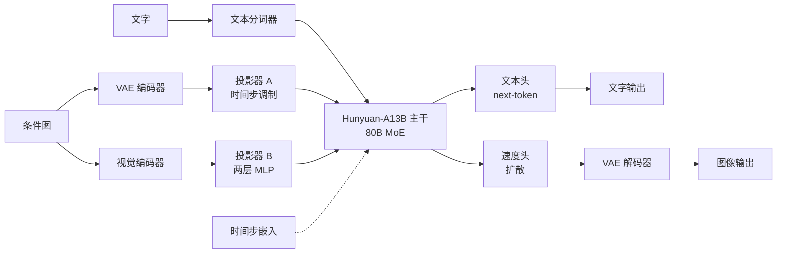
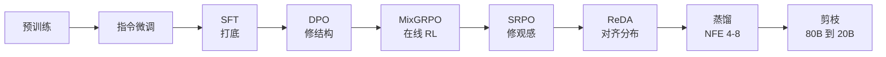

# HunyuanImage 3.0：让一个会说话的模型学会画画，而不忘掉怎么说话

<!-- release-date: 2025-09-28 -->

> 本文依据腾讯混元基础模型团队的 **HunyuanImage 3.0 Technical Report**，即 arXiv:2509.23951v3（2026-06-26 修订，17 页）。动笔前核对过 arXiv 官方提交历史：该论文共 v1（2025-09-28）、v2（2026-02-02）、v3（2026-06-26）三版，**v3 是最新版**；本地件与官方 v3 的 PDF 逐字节一致（md5 `0fe7d3c0675983bc5d4c5fa93ff5bcd4` ），未做替换。三个版本之间有实质内容差异，本文最后专门用一节讲清楚。
>
> 全文页码指 PDF 自身页码，本报告 PDF 页码与印刷页码一致。文中始终区分三件事：**报告写了什么**、**我们如何解释**、**哪些是外部补充**。凡是本文自己算出来的数、自己从图里读出来的东西，都会明说。

## 读之前：这一篇需要的几个词

这是本模块第二篇图像生成方向的解读（第一篇是 [Janus-Pro](../DeepSeek/Janus-Pro.md)）。下面这些词只解释到**读懂本篇所需的程度**，不展开成教科书。

**自回归（autoregressive，AR）与 next-token prediction**：语言模型的工作方式。把句子切成一串符号，模型每次只预测下一个符号，预测完接到序列后面，再预测下一个。它天生是**串行**的，也天生是**离散**的——输出是从词表里挑一个。

**tokenizer（分词器）**：把文字切成符号并映射成整数 ID 的那一层。词表可以扩，往里加几个新 ID 就等于给模型加了几个新"词"。这一点后面会用到。

**扩散模型（diffusion model）**：另一类生成模型。它从纯噪声出发，反复去噪几十次，每次把图往真实数据的方向推一点。它是**并行**的（整张图一起改）也是**连续**的（输出是一组实数，不是词表里的某一项）。

**流匹配（flow matching）与 velocity**：训练扩散模型的一种写法。不预测"该减掉多少噪声"，而是学一个速度场，让样本沿噪声到数据的一条路径走过去。模型每一步吐出的那个量就叫 **velocity（速度）**。报告的 Figure 3 里图像分支写的就是 `Velocity (diffusion prediction)`（PDF p. 6），引用的是 Lipman 等人的流匹配论文 [7]。报告**没有写出任何损失函数**，所以"流匹配具体长什么样"是外部背景，不是报告内容。

**VAE 与 latent（潜变量）**：直接在像素上做扩散太贵。先用一个自编码器（Variational Auto-Encoder）把图压成一个小得多的张量再做扩散，压完的张量叫 latent。压缩倍数叫**下采样因子**，通道数叫**潜空间维度**。

**patch 与 DiT**：把 latent 切成小方块（patch），摊平成一条序列，用 Transformer 而不是 U-Net 去做去噪，这就是 **DiT（Diffusion Transformer，扩散 Transformer）**。今天绝大多数文生图模型是 DiT。

**MoE（Mixture-of-Experts，混合专家）**：把 Transformer 里的前馈层换成很多个并列的"专家"，每个 token 只走其中几个。总参数很大，但单个 token 的计算量只对应被激活的那几个专家。

**RoPE（Rotary Position Embedding，旋转位置编码）**：告诉 Transformer "这个 token 排第几"的一种做法。它把位置编成一组正弦余弦，直接旋进注意力的 query 和 key 里。语言模型用的是一维版本——位置就是一个整数 $n$。

**CFG（Classifier-Free Guidance，无分类器引导）**：文生图推理时的常规技巧，一步里跑两遍网络再外推，让结果更贴提示词。之所以在这里提一句，是因为**这份报告从头到尾没有讨论推理时的引导策略**，连"CFG"三个字母都没出现。后面讲"报告没写的事"时会回到这一点。

## 一句话先说清

大多数文生图模型的做法是：找一个冻住的文本编码器（T5 或 CLIP）把提示词编成一组向量，再交给一个从零训练的 DiT 去画。文字和图像之间隔着一道墙，墙这边是理解，墙那边是绘画。

HunyuanImage 3.0 把这道墙拆了。它不训练一个"会读文字的画图模型"，而是**拿一个已经练好的 80B MoE 语言模型（Hunyuan-A13B），教它画画**（PDF p. 1）。文字和图像走同一条序列、同一套权重、同一个注意力。

这个决定听起来很自然，但它立刻制造了一堆不兼容：

| 维度 | 文字要什么 | 图像要什么 |
|---|---|---|
| 预测方式 | 离散，next-token | 连续，扩散去噪 |
| 注意力 | 因果（只看前面） | 全注意力（互相都看） |
| 位置 | 一维 | 二维 |
| 输入编码 | BPE 分词 | VAE / ViT 特征 |
| 画布大小 | 不存在这个概念 | 必须先定分辨率和长宽比 |

报告的第 3 节几乎每一小节都在解决表格里的一行。而且——这是本文认为**贯穿全篇的那条线**——每一个解法都刻意保证了同一件事：

> **当序列里没有图像 token 时，所有新机制都要退化回原来的语言模型。**

2D RoPE 在没有图像时逐位退化成 1D RoPE（PDF p. 8）；广义因果注意力在没有图像时就是普通因果注意力（PDF p. 6）；分辨率不是外部参数而是词表里新加的几个 token（PDF p. 8）。报告在 RoPE 那一小节把这条原则明说了：`maintains backward compatibility with the pretrained LLM`（PDF p. 8）。其余几处是本文归纳的，报告没有统一表述。

如果只记一句话：

> **想让大模型学会一个新模态，最省钱的做法不是给它接一个新模块，而是把新模态设计成"旧能力的一个特例"。**

## 报告地图：17 页里各写了什么

这份 PDF 17 页，其中正文 13 页、贡献者名单 1 页、参考文献 3 页。篇幅分布本身就是信息——**前半密后半疏**，数据与架构讲得很细，训练和后训练基本只给名字。先摊开，后面就知道哪里能深挖、哪里只能到此为止。

| 报告章节 | PDF 页 | 讲了什么 | 密度 |
|---|---|---|---|
| 摘要 + §1 引言 | p. 1 | 定位、基座选型、与 Transfusion/JanusFlow 的关系 | 中 |
| Figure 1 样例图 | p. 2 | 整页样例，无信息量 | 低 |
| §2.1 数据过滤 | p. 3–4 | 三级漏斗，从 100 亿到 50 亿 | 高 |
| §2.2 图像打标 | p. 4–5 | 分层 schema、组合合成、双向验证 | 高 |
| §2.3 推理数据 | p. 5 | T2T / T2TI / TI2TI 三类 CoT 数据 | 中 |
| §3.1.1 架构 | p. 6 | 骨干、tokenizer、VAE、双编码器、投影器 | 高 |
| §3.1.2 广义因果注意力 | p. 6–7 | 两类掩码，训练与推理不对称 | 高 |
| §3.1.3 位置编码 | p. 8 | 广义 2D RoPE 与向后兼容 | 高 |
| §3.1.4 自动分辨率 | p. 8 | 用特殊 token 让模型自己定画布 | 中 |
| §4.1 预训练 | p. 8–9 | 四阶段渐进表（Table 1） | 中 |
| §4.2 后训练 | p. 9–10 | SFT→DPO→MixGRPO→SRPO→ReDA 五道工序 | **低**（只有名字） |
| §4.3 蒸馏 | p. 10 | MeanFlow 扩到 80B，NFE 降到 4–8 | 低 |
| §4.4 剪枝 | p. 10 | TMP，80B→20B，单张 4090 | 低 |
| §5.1 SSAE | p. 10–11 | 自建对齐评测，只给雷达图 | 中 |
| §5.2 GSB | p. 11–12 | 人工双盲对比，四个胜率 | 中 |
| §5.3 专家激活分析 | p. 12 | MoE 专家自发按模态分工 | 中 |
| §6 结论 | p. 12–13 | 承认只放了文生图 | 低 |
| §7 贡献者 + 参考文献 | p. 14–17 | — | — |

需要提前知道的两件事：

1. **摘要承诺了 infra，正文一个字都没写。** 摘要里列的关键组件包含 `an efficient infrastructure that enables large-scale training and inference`（PDF p. 1），但全文再没有出现第二次 `infrastructure`。没有 GPU 数、没有并行策略、没有精度、没有训练时长。这是本报告最大的空洞，后面单独讲。
2. **摘要承诺了"统一理解与生成"，评测只测了生成。** 四个预训练阶段全都带 MMU（多模态理解）任务（PDF p. 9），结论也说 `robust capabilities in both image understanding and generation`（PDF p. 12），但第 5 节**没有任何一项理解类评测**，开源的也只有生成模块（PDF p. 1、p. 13）。

## 旧方法卡在哪：三道被报告点名的墙

报告没有写一段完整的"相关工作批判"，但它在三个不同位置各点了一处旧做法的名。把这三处拼起来，就是它要拆的三道墙。

### 墙一：DiT 的画布尺寸必须由人来定

报告原文：`DiT-like models typically require deterministic user input to specify the desired image size and aspect ratio`（PDF p. 8）。

这不是小事。DiT 的输入是一块固定形状的噪声张量，形状定了，2D 位置编码才定得下来。所以"画多大、什么比例"必须在模型跑起来之前由人填。用户说"给我画一张竖版海报"，中间必须有一层规则或一个小分类器把这句话翻译成 `768×1024`。

对一个语言模型来说这很别扭：它明明能读懂"竖版海报"，却不被允许自己做决定。

### 墙二：统一模型把视觉特征按任务切开

报告原文，说的是双编码器策略（PDF p. 6）：

> ...enables unified multimodal representation that supports both generation and understanding within a single sequence—a key different from previous unified models [33, 34, 35, 36], which often segregated visual features by task (e.g., using vision encoder features for understanding and VAE features for generation).

这里点名的 [34] 就是 **Janus-Pro**（PDF p. 17 参考文献）。本模块已经有一篇 [Janus-Pro 解读](../DeepSeek/Janus-Pro.md)，那篇的核心论点是"看图和画图不能共用一只眼睛"——理解任务要的是高层语义，生成任务要的是低层细节，一个编码器同时伺候两个相反目标会互相拖累，所以要**解耦**成两个编码器，按任务分岔。

HunyuanImage 3.0 承认要两个编码器，但**拒绝按任务分岔**：两个编码器的特征被**拼接**进同一条序列，任何时候都同时在场（PDF p. 6）。理由报告写了一句：这样才能在一段连续上下文里做"文字对话 → 生成图 → 理解图 → 编辑图"的交错交互，而不用在两条流水线之间切换。

这是两条真实分歧的路线，谁对还没有定论。**报告没有做消融实验来证明拼接优于分岔**，它只声明了这个设计选择和它带来的能力。这一点必须说清楚，不能替它补论据。两篇的对照到此为止，本文不再展开 Janus-Pro 的细节。

### 墙三：8 倍 VAE + 2 倍 patchify 这个约定俗成的组合

报告原文（PDF p. 6）：

> Prior approaches, such as those in DiT-like architectures typically combined an 8x downsampling VAE with an additional patchification layer that further reduced spatial resolution by a factor of 2. In contrast, we demonstrate that a single VAE with 16x downsampling offers a simpler and more effective alternative.

这一处后面单独讲，因为它里面藏着一个容易算错的账。

## 全景：一条序列，三种任务

先把整体形状建立起来，再逐项拆。下图依据 PDF p. 6 的 Figure 3 重画，属于**机制示意**，不含任何实测数据。

Figure 3 把这套东西画成三个并排的场景（PDF p. 6）：

- **图像理解**：条件图同时经 VAE 编码器和视觉编码器进来，主干做 next-token prediction，吐文字；
- **语言建模**：只有文字，主干退化成一个普通的 LLM；
- **图像生成**：文字进来，主干在图像位置上输出 velocity，扩散解码成图。

三条路走的是**同一个主干、同一份权重**。这就是"native multimodal（原生多模态）"这个词在这份报告里的确切含义——不是把几个模型拼起来，而是一个模型的三种运行模式。

主干配置（PDF p. 6）：

| 项目 | 值 |
|---|---|
| 基座 | Hunyuan-A13B [18]，decoder-only |
| 总参数 | 超过 80B |
| 专家数 | 64 个，外加 1 个共享 MLP |
| 每 token 激活 | 8 个专家 |
| 激活参数 | 约 13B |
| 文本分词器 | Hunyuan Tokenizer，扩了一批特殊 token |

> **外部补充**：Hunyuan-A13B 于 2025-06-27 由腾讯开源（[GitHub](https://github.com/Tencent-Hunyuan/Hunyuan-A13B)），是 32 层、80B 总参 / 13B 激活的细粒度 MoE，预训练 20T token，上下文 256K。报告参考文献 [18] 把年份写成 2024（PDF p. 15），与实际发布时间不符，属于引用年份笔误。层数 32 这个数在报告正文里没写，但可以从 Figure 8 的层索引轴（0–31）读出来（PDF p. 12），与外部信息一致。

## 设计一：一条序列里同时跑两种预测

### 旧问题

自回归和扩散是两种不兼容的生成方式。自回归一次吐一个离散符号，用交叉熵训练；扩散一次更新整块连续张量，用回归目标训练。把它们塞进一个 Transformer，最直接的困难是：**同一层网络的输出，要被两种完全不同的头和损失使用**。

### 新设计

报告的说法是 `hybrid discrete-continuous modeling strategy`：文字 token 走自回归 next-token prediction，图像 token 走基于扩散的预测框架（PDF p. 5）。做法上，报告明说是**沿用 Transfusion [22] 和 JanusFlow [23] 的方式**把扩散建模并进 LLM（PDF p. 1）。

### 工作机制

序列里每个位置带着自己的身份。文字位置上，主干的隐状态过语言头，算交叉熵；图像位置上，隐状态过速度头，算扩散目标。两种位置在同一次前向里被同一批权重处理，只是出口不同。

有一个配件容易被略过：**时间步嵌入被直接加进序列**（PDF p. 6）。扩散必须知道"现在是第几步去噪"，而语言模型的序列里本来没有这个概念，所以它被当成一路额外条件塞进去。

### 收益

三种任务共享一套权重，意味着语言模型二十万亿 token 学到的世界知识不需要经过任何压缩瓶颈就能作用在绘画上。同时，因为文字和图像在一条序列里，"多轮对话中反复修图"这类交互天然成立，不需要在两个模型间传状态。

### 代价与边界

- **推理时无法只跑一种模式来省钱。** 生成一张图要走完整个 80B MoE 的多步去噪，成本远高于一个专用 DiT。这也是后面为什么必须做蒸馏和剪枝。
- **报告没有写两个损失怎么加权。** 混合训练里最关键的那个配比——文字损失和扩散损失的权重、五个任务（T2I / LM / MMU / INTL / CoT）的采样比例——**全文没有任何数字**。这是复现这份工作最大的障碍之一。
- **报告没有写扩散目标的具体形式。** 只引用了 [7]（Lipman 流匹配），没有写出公式，也没说用哪种噪声调度。

### 可迁移启发

如果你要给一个已有模型加一个异质模态，先问"新模态的输出能不能表示成一个额外的头，而不是一个额外的塔"。共享塔、分头出口，是代价最低的一种加法；分塔则意味着你要重新解决对齐问题。

## 设计二：广义因果注意力，以及那个"洞"

### 旧问题

因果注意力（causal attention）是 LLM 的地基：第 $i$ 个 token 只能看到 $1$ 到 $i-1$。这保证了自回归的合法性——训练时并行算出来的每个位置，跟推理时一个一个生成出来的位置，看到的东西完全一样。

但图像不吃这一套。一张图的左上角和右下角必须互相看得见，否则模型没法建立全局构图。DiT 用的是全注意力（full attention）。

矛盾很直接：一条序列里既有必须"只看前面"的文字，又有必须"互相都看"的图像。

### 新设计

报告叫它 **Generalized Causal Attention（广义因果注意力）**，规则只有两条（PDF p. 6–7）：

- **文字 token**：只能看序列中在它之前的多模态 token；
- **图像 token**：能看它之前的所有多模态 token，**外加同一个图像片段内它后面的所有图像 token**。

用一句话说：因果关系保留在**片段之间**，全注意力保留在**片段内部**。序列里没有图像时，第二条规则失效，整个机制原样退化成普通因果注意力。

### 工作机制：两类掩码

报告按序列里"待生成图像（Gen Image）"的个数把训练掩码分成两类（PDF p. 7，Figure 4）：

**类型 (a)：零个或一个 Gen Image。** 对应图像理解任务（没有 Gen Image）和文生图任务（恰好一个）。掩码严格遵循上面那两条规则，形状是一个下三角，在图像片段的位置鼓出一个方块。

**类型 (b)：一条序列里多个 Gen Image。** 这时候需要一个额外修正：**上下文里出现过的 Gen Image，不能被序列后面的 token 注意到**。报告把这块被挖掉的区域叫做下三角里的一个"洞"（`hole`）。

为什么要挖这个洞？报告给的理由是要和推理保持一致。推理时序列里永远不会同时存在两个 Gen Image——因为一张图一旦生成完毕，它就变成后续 token 的**条件图（Cond Image）**，而不再是待去噪的目标（PDF p. 7）。

本文的解释（报告没有明说）：Gen Image 在训练时是被**加了噪的**。如果让后面的 token 去看一张带噪的图，它们学到的条件分布和推理时看到的干净图对不上。挖掉这个洞，等于强制后续 token 只能通过"这张图的干净版本"来了解它——而干净版本会以 Cond Image 的身份重新出现。

看 Figure 4(b) 的形状就很清楚：第二个 `Text` 段和第二个 `Gen Image` 段对着第一个 `Gen Image` 列的位置是空的（白的），中间竖着一条白带。

### 收益

一次训练可以吃下任意结构的交错序列——「文字、图、文字、图……」——而不需要为每种结构写一套特殊逻辑。这直接支撑了 §2.1 里那批超过 1 亿的图像对与多图样本（PDF p. 3）。

### 代价与边界

- **掩码不再是标准下三角，用不了 FlashAttention 的因果快路径。** 报告没有提这件事，也没有说他们的注意力算子是怎么实现的。这是一个真实的工程成本，被完全略过了。
- **训练和推理的掩码形状不一致。** 报告论证了这种不一致是合理的，但没有给出任何实验来验证"训练时挖洞"确实消除了训练–推理差距。
- 挖洞意味着**多图序列里前面那张图的梯度信号更稀薄**，因为看它的 token 变少了。报告没有讨论。

### 可迁移启发

当你要在一条序列里混合两种时序语义（严格因果 vs. 无序），先定义清楚**因果的粒度**。这里的答案是"片段级因果、片段内无序"。这个粒度一旦定死，掩码就能一条规则写完，而不是堆一堆 if。

## 设计三：广义 2D RoPE，一个真正优雅的向后兼容

### 旧问题

RoPE 给一维序列位置 $n$ 编码。标准形式是：

$$
\text{RoPE}(n) = [\cos(n\theta_0),\ \cos(n\theta_1),\ \dots,\ \sin(n\theta_0),\ \sin(n\theta_1),\ \dots]
$$

其中 $\theta_0, \theta_1, \dots$ 是一组事先定好的频率，$n$ 是这个 token 在序列里的序号。

图像 token 有两个坐标 $(x, y)$。最粗暴的办法是把图像摊平，当成一维序列——但这样模型就丢掉了"这两个 patch 是上下相邻"这个信息。所以 DiT 通常用 2D RoPE：把嵌入维度劈成两半，一半编 $x$，一半编 $y$。

问题来了：如果直接把这种"劈两半"的 2D RoPE 装到一个预训练 LLM 上，**文字 token 的位置编码也跟着变了形状**，那个模型辛辛苦苦学到的位置感知会被打乱。

### 新设计

报告采用的是 **Generalized 2D RoPE**，并在脚注里注明这是苏剑林提出的方案（PDF p. 8，脚注 2 指向 <https://kexue.fm/archives/10352> ）。它不劈维度，而是**换一种读法**：

$$
\text{RoPE2D}(x, y) = [\cos(x\theta_0),\ \cos(y\theta_1),\ \dots,\ \sin(x\theta_0),\ \sin(y\theta_1),\ \dots]
$$

对比一下就看出机关在哪：一维版本里每一项都用同一个 $n$；二维版本里，**偶数下标的频率配 $x$，奇数下标的频率配 $y$**，交替着来。报告把这个称为各向异性地（`anisotrapically`，原文拼写如此）解读同一个嵌入结构。

关键性质：**令 $x = y = n$，第二个式子逐项等于第一个式子。**

也就是说，一维位置 $n$ 就是二维平面上对角线点 $(n, n)$ 的特例。文字 token 保持走对角线，位置编码的数值和原来的 LLM **一模一样**，不是近似，是恒等。

### 工作机制

Figure 5（PDF p. 7）画得很直白。一条 11 个 token 的序列：位置 1–3 是文字，4–9 是一张图的 6 个 patch，10–11 是文字。

- 在 1D 里，它们就是 1 到 11 顺着排；
- 在 2D 里，位置 1、2、3 的文字落在对角线上的 $(1,1)$、$(2,2)$、$(3,3)$；那 6 个图像 patch 被**重排成一个 3 宽 × 2 高的矩形块**，放在对角线中间的空当里；随后的文字 token 从 $(10,10)$ 继续走对角线。

报告对这个安排的描述是：把一维图像位置 reshape 成二维位置，**放在两段文字之间**（PDF p. 7 图注）。

### 一个容易漏掉的补丁

在多 Gen Image 的训练序列里（就是上面那个挖洞的情况），**每张 Gen Image 之后的 token，在训练序列和推理序列里的位置编号是不同的**——因为训练时那张图还在序列里占着位置，推理时它已经变成 Cond Image，占的位置数可能不一样。

报告的处理是把这些 token 的位置**整体平移**回去对齐（PDF p. 8）。这是个很小的补丁，但它说明作者确实认真核对过训练与推理的一致性，而不只是让掩码看起来对。

### 收益

预训练 LLM 的语言能力被保护住了。报告的用词是 `minimizing disruptive effects on pre-trained linguistic capabilities`（PDF p. 8）。对一个花了 20T token 练出来的基座来说，这是最值钱的一件事。

### 代价与边界

- **报告没有给消融。** "退化成 1D RoPE 保住了语言能力"是一个非常可信的论证，但报告没有拿一个用普通 2D RoPE 的对照组来量化这件事到底值多少分。
- 频率交替分配意味着 $x$ 和 $y$ 用的是**不同的频率子集**，两个轴的位置分辨率因此不完全对称。报告没有讨论这是否有影响。
- 把图像块塞进对角线中间，会**吃掉一大段位置编号**。一张 1024×1024 的图在 16 倍下采样后是 $64 \times 64$，也就是位置轴上要跨出 64 格。多图序列会很快把位置索引推得很远。报告没有讨论上下文长度的预算。

### 可迁移启发

这是全篇最值得抄的一条：**给旧机制做扩展时，把旧机制设计成新机制的一个特例，而不是新机制的一个分支。** 判据很好用——写完新公式，代入退化条件，看能不能逐项还原成旧公式。能，就说明你没有破坏任何已有能力；不能，就说明你需要重新对齐。

## 设计四：16 倍 VAE，以及一笔容易算错的账

### 报告的主张

报告说，图像生成通路用的是一个自研 VAE，把原始像素投进**32 维**的潜空间，**下采样因子 16**；而旧做法是 8 倍 VAE 加一个 2 倍的 patchify 层。报告称单个 16 倍 VAE 是`a simpler and more effective alternative, yielding superior image generation quality`（PDF p. 6）。

### 先把账算清楚

$8 \times 2 = 16$。两条路线最后进 Transformer 的 **token 数完全一样**。

以 1024×1024 为例：

| 路线 | 空间尺寸变化 | 最终 token 数 |
|---|---|---|
| 8 倍 VAE + 2 倍 patchify | $1024 \to 128 \to 64$ | $64 \times 64 = 4096$ |
| 单个 16 倍 VAE | $1024 \to 64$ | $64 \times 64 = 4096$ |

所以这一刀**不是省算力的**。这一点报告没有明说，是本文自己算的，但它很重要——否则很容易误以为这是一个效率优化。

### 那差别在哪

本文的解释（报告只给了结论，没给机制）：差别在**这 16 倍压缩是被什么东西完成的**。

- 8 倍 VAE + patchify：前 8 倍由一个用重建损失训出来的卷积编码器完成，最后那 2 倍由 Transformer 入口处的一个**线性层**完成。线性层没有重建约束，它压掉的信息只对下游的扩散目标负责。
- 单个 16 倍 VAE：整个 16 倍都由一个**受重建损失约束**的网络完成。它必须保证压完还能解回原图。

再加上潜空间维度是 **32**（PDF p. 6），比常见的 4 维、16 维都宽。压缩得更狠、但通道更多，本质是把信息从空间轴挪到通道轴。

### 代价与边界

- **报告没有给这个 VAE 的任何训练细节**：架构、损失、训练数据、重建指标（PSNR/rFID）一概没有。只知道它是 `internal`（自研）。
- **也没有消融。** "yielding superior image generation quality"这句话背后没有任何对比数字。这是一句**作者观察，不是被实验支持的结论**，读的时候要打折。
- 16 倍单跳压缩对 VAE 本身的要求更高，训练难度更大。报告没提。

### 可迁移启发

当你在流水线里看到"两级压缩"时，问一句：这两级各自受什么损失约束？没有约束的那一级往往是可以合并掉的，合并之后信息损失反而更可控。

## 设计五：双编码器，但不分岔

条件图（Cond Image）进模型时同时走两条路，特征**拼接**在一起（PDF p. 6）：

| 编码器 | 提供什么 | 投影器 |
|---|---|---|
| VAE | 低层、可重建的像素信息 | 时间步调制的残差块 [28, 37] |
| 视觉编码器（ViT） | 高层语义 | 两层 MLP |

投影器的不对称设计值得注意。VAE 那一路用的是**带时间步调制的残差块**——也就是 DiT 里那种 AdaLN 式的结构，参数会随扩散时间步变化。ViT 那一路只是一个静态的两层 MLP。

本文的解释：VAE 特征参与扩散过程，它的作用会随去噪进度改变（早期需要粗结构、后期需要细节），所以它的投影必须是时间步的函数；ViT 特征提供的是与去噪进度无关的语义，用静态映射就够。报告没有解释这个设计，只描述了它。

**报告没有说视觉编码器是什么。** 没有型号、没有参数量、没有说是自研还是公开权重。只知道它是 `pre-trained`（PDF p. 1）、输入分辨率锚点固定在 512px（PDF p. 9，Table 1）。

## 设计六：让模型自己决定画多大

### 旧问题

见前面"墙一"：DiT 需要人来指定尺寸。

### 新设计

报告的做法是给语言模型的词表**加两组特殊 token**（PDF p. 8）：

- 尺寸锚点：`<img_size_256>`、`<img_size_512>`、`<img_size_768>`、……
- 长宽比：`<img_ratio_0>` 到 `<img_ratio_32>`，覆盖从 1:4 到 4:1

训练时，模型学会把这两个 token 和上下文对应起来。推理时，它**先自回归地预测出这两个 token**，才知道要开多大的画布，然后按这个形状给图像 token 分配 2D RoPE 坐标，开始去噪。

用户也可以直接在提示词里写「3:4」或「竖版」，把模型往某个比例上引（PDF p. 8）。

### 为什么这个设计比看上去重要

它把"分辨率"这个**外部超参数**变成了**模型内部的一次预测**。而做出这次预测的，是同一个读懂了整段提示词的语言模型。这意味着"给我画一张手机壁纸"和"给我画一张横幅 banner"能被正确地翻译成不同画布，靠的是模型的语言理解，不是外挂规则。

顺带还解决了一个训练侧的问题：报告说训练时**保留图像原始长宽比**（PDF p. 8），这样才能支持多分辨率生成。有了 ratio token，不同长宽比的样本可以混在同一个 batch 里训练，模型知道每张图该配哪个形状。

### 代价与边界

- 尺寸是**离散锚点**，不是连续值。33 个比例档位（`<img_ratio_0>` 到 `<img_ratio_32>` ）意味着 1:4 到 4:1 之间被切成 33 格。
- **多了一次可能出错的预测。** 如果模型预测错了 ratio token，整张图的画布就错了，而且这个错误发生在去噪开始之前，无法在去噪过程中纠正。报告没有报告 ratio token 的预测准确率。
- 报告没有说 `<img_size_*>` 一共有几档，只给了三个例子加省略号。

### 可迁移启发

**能被语言描述的配置项，就应该由语言模型来预测，而不是留在 API 参数里。** 判断标准很简单：如果这个参数的取值可以从用户的自然语言里推出来，那把它做成词表里的 token，比做成函数签名里的 `size=(768,1024)` 更有价值。

## 数据：从 100 亿张到 50 亿张

这是全报告最实在的一节。三级漏斗（PDF p. 3）：

| 阶段 | 做什么 | 留下多少 |
|---|---|---|
| 一级：技术缺陷 | 剔除分辨率低于 512 像素、文件损坏、过曝/欠曝、过饱和；按 MD5 去重 | — |
| 二级：客观过滤 + 主观打分 | 客观：水印、logo、大段文字（hy-OCR 模型）、拼贴、明显边框、AIGC 内容 主观：清晰度模型、美学模型 | — |
| 三级：语义去重 + 补充 | 按 embedding 聚类结果再去重，去掉约 **0.5%**；补充知识增强、文字相关、风格化、平面设计四类专门数据 | — |
| **合计** | 从 **超过 100 亿** 张原图 | 保留 **不到 45%**，最终得到 **接近 50 亿** 张 |

几个值得单独说的点：

**AIGC 过滤是两层的。** 报告说 AI 生成图会扭曲自然数据分布、损害收敛，处理方式是"自动检测模型 [24, 25, 26]"**加上**"把 AI 生成内容占比高的数据源整体剔除"（PDF p. 3）。第二层是关键——检测器一定有漏网，直接砍掉可疑来源比逐张判断更彻底。这个思路可以直接抄。

**美学模型的标准是画师定的。** 报告说为了让美学分数一致且可解释，公司的画师系统性地设计了一套标准，只考虑三个基本要素：**色彩、光影、构图**（PDF p. 3）。然后基于这套标准训自己的美学模型。这是个很克制的选择——三个维度，不是二十个。

**阈值是分档的。** 统一阈值先滤掉不合格的，再对特定门类用不同阈值挑出**后续训练阶段**用的数据（PDF p. 3）。也就是说，四个渐进训练阶段的数据不是重新采的，是同一批数据用不同阈值切出来的层。

**hy-OCR 模型标注了"to be released"**（PDF p. 3 脚注 1）。本文核对时，官方仓库尚未见到这个模型单独发布，属于**未兑现的公开承诺**。

### 图像对与多图数据

除了单图语料，还构建了**超过 1 亿**组图像对与多图样本，专门用来学"交错关系"（PDF p. 3）。来源有两条：

**路线一，图像聚类。** 分析了**超过 20 亿**个图像簇，从有潜在相似性的代表性簇里抽对，再过一个"图像关系判别算子"，只保留确实存在编辑关系的对；最后用图像复杂度模型 [27] 把元素过于复杂的图滤掉（PDF p. 3–4）。

**路线二，视频片段挖掘。** 这条流水线有四步（PDF p. 4）：

1. 镜头边界检测，切出对应统一场景的片段；
2. 相机运动分类算子，排除镜头变换过大的片段；
3. 结合目标检测与语义分割，挑出体现典型变换关系的关键帧；
4. 运动模糊检测算子，再滤一遍。

**为什么要从视频里挖图像对？** 本文的解释：图像编辑数据最难搞的是"同一个主体，只变了一件事"这种配对。互联网上很难找到天然的成对图，但视频里天然存在——同一个镜头的两帧，主体一致、只有某个属性变了。这是一个非常划算的数据来源，代价是必须把镜头切换和相机运动过滤干净，否则学到的就不是"编辑"而是"换机位"。

## 打标：让描述可控，也让描述可查

报告把这一节讲得很细，Figure 2（PDF p. 4）画了整条流水线。三个组件：

### 组件一：双语分层 schema

不写自由散文，而是把图像内容拆成多个定义清楚的语义字段（PDF p. 4）：

- **描述层级（Short 到 Extra-Long）**：四档详略，从一句话摘要到把前景背景全部铺开；
- **风格属性**：艺术风格、镜头景别、光照、氛围、构图；
- **事实实体**：专门一个字段放具名实体（IP）——特定角色、地标、品牌、艺术作品。

中英双语。

### 组件二：组合式描述合成

训练时**动态地采样并组合不同字段**，拼出长度和句式都不同的描述，长度覆盖**约 30 词到 1000 词**（PDF p. 4）。

这一步的作用报告说得很明白：提升泛化、缓解过拟合。本文补一句解释——如果每张图永远配同一段描述，模型学到的是"这段文字 ↔ 这张图"的死记；字段随机重组之后，同一张图会以几十种不同说法出现，模型被迫学的是"这些语义成分 ↔ 这张图"。这也直接解释了为什么这个模型能处理千字长提示词：**训练时它见过 1000 词的描述**。

### 组件三：两个 agent + 双向验证

标准 VLM 有两个已知短板：认不准图里的密集文字，认不出需要世界知识的实体。报告的补法是外挂两个专门 agent（PDF p. 4–5）：

- **OCR Agent**：抽取图中文字；
- **Named Entity (IP) Agent**：识别现实世界实体。

它们的输出作为**辅助输入**喂给打标模型。然后是关键一步——**双向验证回路（Bidirectional Verification Loop）**：把 agent 检测出的实体和生成的描述做交叉比对，**只有通过双向验证的样本才进最终训练集**（PDF p. 5）。

"双向"这个词报告没有展开。本文的理解是：既要检查"agent 找到的实体是否出现在描述里"（防漏），也要检查"描述里提到的实体是否被 agent 确认"（防幻觉）。两个方向都过，才算数。报告没有给通过率，也没有说被拒掉多少。

### 组件四：图像差异打标器

针对配对数据，专门训了一个 difference captioner，输入是**两张图 + 它们各自的描述 + 对应的两帧视频**，输出是前景和背景各变了什么，用来**模拟用户输入的编辑指令**（PDF p. 5）。

"对应的两帧视频"这个输入很有意思——它给模型提供了两张图之间的**过渡信息**，而不只是两个静态端点。报告说上下文信息对生成准确详细的差异描述很重要。

### 可迁移启发

这一节的核心思想是：**别让打标模型同时负责"看见"和"记得"。** OCR 和实体识别是检索型任务，交给专门工具；描述组织是生成型任务，交给 VLM。然后用一个双向一致性检查把两边缝起来。这个分工在任何"用大模型造训练数据"的场景都成立。

## 推理数据：CoT 是训出来的，不是提示出来的

报告说，这个模型的自动化思维链（Chain-of-Thought）能力是**在一小批专门数据上微调激活**的（PDF p. 5）。完整流程是：读懂原始提示词 → 进入一个中间的"思考"阶段做概念细化与改写 → 再合成目标图像。

三类数据（PDF p. 5）：

| 类型 | 全称 | 干什么 |
|---|---|---|
| **T2T** | Text-to-Text | 纯文本推理，覆盖写实渲染、艺术风格、UI 与海报设计、知识型查询、科学技术图示 |
| **T2TI** | Text-to-Text&Image | 从提示词到推理轨迹再到图；图从预训练集里按美学指标筛，配原始长短描述，另外收了一批维基百科信息图 |
| **TI2TI** | Text&Image-to-Text&Image | 编辑任务。源图 + 复杂编辑指令 + 真值编辑图，**外加一条"编辑轨迹"**，把复杂指令拆解成一串原子操作 |

TI2TI 这一类是 **v2 修订时才加进来的**（详见最后一节的版本差异）。

### 这为什么重要

普通文生图模型的"提示词增强"是一个外挂环节：用另一个 LLM 把用户的短提示改写成长提示，再喂给画图模型。这里不一样——**改写发生在同一个模型的同一条序列里**，而且推理部分的 token 也是用自回归 next-token prediction 建模的（PDF p. 9）。

这带来一个具体的好处：思考过程和绘画过程共享注意力。模型在"想"的时候产生的中间表示，会直接作为后面图像 token 的上下文。外挂改写做不到这一点，它只能把结果压缩成一段文字再传过去。

### 代价与边界

- **报告没有给 CoT 的量化收益。** 只说 `improves the multimodal performance significantly`（PDF p. 12）。没有开/关 CoT 的对照实验，没有分数。这是一句**未被本报告实验支持的结论**。
- 数据量报告只说 `a small, specialized dataset`（PDF p. 5），没有数字。
- 推理阶段的 token 消耗、思考长度分布，全部没写。

## 训练：四个阶段，谁在动谁不动

Table 1（PDF p. 9）是整个第 4 节唯一一张有结构的表：

| 阶段 | VAE 分辨率锚点 | ViT 分辨率锚点 | 训练哪部分 | 任务 |
|---|---|---|---|---|
| I | 256px | 512px | Transformer | T2I, LM, MMU |
| II | 256px | 512px | **ViT** | MMU |
| III | 512px | 512px | ViT + Transformer | T2I, LM, MMU, INTL |
| IV | 1024px | 512px | ViT + Transformer | T2I, LM, MMU, INTL, **CoT** |

两条正交的推进线：数据从粗到细，VAE 侧分辨率逐级抬高（256 → 256 → 512 → 1024），ViT 侧**始终固定在 512px**。

各阶段的具体安排（PDF p. 8–9）：

**阶段 I：先对齐，不动视觉编码器。** ViT 冻住，只训 Transformer 主干，三个任务并行（T2I、LM、MMU）。低分辨率（256px）配大 batch，目的是`learn from billions of images and align the latent representations of text and image modalities`。

**阶段 II：反过来，冻住主干只训 ViT。** 只用 MMU 数据，微调 ViT 和它的对齐模块。这一步很值得注意——**它是四个阶段里唯一一个主干不动的**。本文的解读：主干在阶段 I 已经建立了一套"图像特征该长什么样"的期望，这时候把主干冻住去调 ViT，等于让 ViT 去适应主干，而不是两边互相追。这比同时训两边更稳。

**阶段 III：两边一起训，分辨率抬到 512px 以上。** 数据集缩小以提高高质量图片的占比，同时引入交错图文数据（图像编辑、图生图）。

**阶段 IV：高分辨率 + 推理。** 训练图片被限制在短边至少 1024 像素的子集；MMU 任务的图也限制到高分辨率子集。报告在这里给了一个有意思的观察：**虽然 ViT 输入尺寸固定在 512px，但高分辨率的 VAE 特征同样能改善理解能力**（PDF p. 9）。这条不太直觉——理解通常被认为主要靠语义编码器，这里说像素通路的分辨率也在帮忙。报告没有给数据支持这个观察。同阶段引入推理数据，激活 CoT 能力。

**指令微调。** 四阶段之后，针对文生图做一轮指令微调，T2I、LM、CoT 三类数据套上指令模板一起优化（PDF p. 9）。

### 报告在这一节没写的

- 每个阶段用了多少 token、多少步、多少张图；
- 各任务之间的采样比例；
- 学习率、优化器、batch size（只有阶段 I 一句定性的 `a large batch size`）；
- 训练时长、集群规模、并行策略、数值精度；
- ViT 的身份和参数量。

这一节本可以是全篇最有复现价值的部分，实际上只留下了一张四行的表。

## 后训练：五道工序，只报菜名

报告的后训练是一条五段流水线（PDF p. 9–10）。下图依据 §4.2、§4.3、§4.4 的文字顺序重画，**只表示工序次序，不含时长或算力信息**：

逐个说清楚它们各自在修什么。

### SFT：先把风格底子打好

高质量文生图数据，覆盖风景、人像、OCR 等领域；再通过"图像类型 × 编辑操作"系统性配对扩成编辑数据集，用严格过滤保证空间一致性和身份保持；混入推理数据提升指令跟随；多阶段推进，后面的阶段用更高保真的样本（PDF p. 9）。

### DPO：修结构崩坏

**DPO** 的全称是 Direct Preference Optimization（直接偏好优化）。原始形态是语言模型的对齐方法：给一对回答（好的、差的），直接优化模型提高好回答的相对概率，跳过训练奖励模型这一步。报告引用的 [39] 是它在扩散模型上的版本（Wallace 等人的 Diffusion-DPO，PDF p. 16）。

这里分两个阶段（PDF p. 9）：

1. 用大量配对数据，提升**采样稳定性**和**编辑一致性**；
2. 用精选的高质量子集，专攻**视觉真实感**。

要治的问题是结构畸变、采样不稳定、可察觉的合成痕迹。

### MixGRPO：在线强化学习

**GRPO**（Group Relative Policy Optimization，组相对策略优化）是 RL 里用一组采样结果互相比较来估计优势、从而省掉价值网络的方法。**MixGRPO** [40] 是腾讯自己的工作，把 GRPO 扩展到流模型上，用的是 **ODE–SDE 混合采样策略**（PDF p. 9）。

本文的解释（报告没展开）：流模型的确定性采样是 ODE，没有随机性就没法做策略采样；全程用 SDE 又太慢。混合策略是在轨迹的一部分用随机采样来产生探索，其余用确定性采样来省算力。

报告在这一步做的事（PDF p. 9–10）：

- 用**自研奖励模型**优化美学（风格、构图、光照）、抑制畸变、减少伪影；
- 改进优势估计以加速收敛；
- 对图生图任务用**多任务平衡联合训练**，迭代训练多个奖励模型，每个盯一个质量维度；
- 为**人脸 ID 保持**专门调了一个奖励模型；
- 专门构造了一批有挑战性的图生图配对数据。

> 一个值得记的版本差异：v1 说的是`with both open-source and proprietary reward models`，v2 起改成了 **只用 proprietary（自研）奖励模型**。这可能意味着开源奖励模型在规模化训练中被弃用了，也可能只是措辞收紧。报告没有解释。

### SRPO：在轨迹前段做梯度引导

**SRPO** [41] 同样是腾讯自己的工作（PDF p. 16，论文题为 Directly aligning the full diffusion trajectory with fine-grained human preference）。它的做法（PDF p. 10）：

1. 直接往潜空间特征里注入噪声先验，然后**一步去噪**到干净图；
2. 选择去噪轨迹的**起始区间**做优化，因为在那里模型的改进空间最大；
3. 同时用**正向和负向文本引导**的可微奖励信号。

针对的是过饱和、光影与色彩不连贯、皮肤质感差这类 AI 图的典型毛病。

"选起始区间"这个选择本文认为是这一步最有信息量的地方：扩散轨迹的早期决定大结构和整体调性，晚期只调细节。想改"整张图的观感"，就该在早期动手。

### ReDA：向高奖励分布靠拢

**ReDA**（Reward Distribution Alignment，奖励分布对齐）是报告自称的新方法（`a novel, in-house` ，PDF p. 9）。做法（PDF p. 10）：

- 目标是最小化与一个**高奖励先验分布**的散度；
- 用**任务专属的投影器**把生成结果映射到一个压缩空间，在那里针对身份一致性、真实感等指标做定向优化；
- 有参考图时，引入**基于差值（transition）的目标**：不比较静态特征，而是计算参考图与生成图之间的**向量差**。报告说这个写法显著提升训练效率；
- 算法被设计成数据驱动的，能吃到数据规模和质量的提升。

"比较向量差而不是比较静态特征"这一点，本文的理解是：如果直接拉近生成图和参考图的特征，模型会倾向于抄参考图；而约束**差值**，等于约束"这次编辑做了什么"，允许结果和参考图有区别，只要变化方向对。这个区别在编辑任务里很关键。

### 这一节的整体判断

五道工序，五段描述，**没有一个数字**。没有奖励模型的规模、没有 RL 的步数或 batch、没有每一步带来的分数提升、没有任何消融说明五道工序是否都必要。第 5 节的评测只有一个最终模型，你无法知道 14.10% 的胜率里 DPO 贡献了多少、SRPO 贡献了多少。

这是本报告与 DeepSeek 或 Qwen 那类报告最明显的差距。工序清单是有价值的——它至少告诉你一条工业级文生图后训练流水线长什么样——但它不能被当作可复现的 recipe。

## 蒸馏与剪枝：从 80B 到能插在 4090 上

这两节是全报告最短的，但结论最硬。

### 蒸馏：NFE 降到 4–8

扩散推理慢的根源是要跑几十步。这里用的是 **MeanFlow** [42]（Geng 等人的 one-step 生成工作）。报告的贡献是**把 MeanFlow 扩展到 80B 规模的统一多模态模型上**，过程中解决了训练不稳定的问题，并把**轨迹分布对齐**并进 MeanFlow 目标以改善少步生成（PDF p. 10）。

结果：**NFE（Number of Function Evaluations，函数求值次数）降到 4–8**，同时保持有竞争力的性能（PDF p. 10）。

NFE 就是"跑几次网络"。从常见的几十步降到 4–8 次，是**接近一个数量级**的推理成本削减。对一个每次前向要激活 13B 参数的 MoE 来说，这一刀比什么都实在。

### 剪枝：TMP，80B → 20B

**TMP**（Tree-structured Mixed-policy Pruning，树结构混合策略剪枝）是**后蒸馏**的压缩框架，把启发式剪枝策略和**分层局部混合策略蒸馏**结合起来，支持稳定而激进的压缩（PDF p. 10）。

结果（PDF p. 10）：

| 指标 | 值 |
|---|---|
| 压缩前 | 80B |
| 压缩后 | 20B |
| 参数削减 | **75%** |
| 配合显存优化后可部署于 | **单张 24GB RTX 4090** |

从"需要多卡服务器"到"一张消费级显卡"，这是可及性上的质变。

**注意：§4.4 这一整节是 v3（2026-06-26）才加进来的**，v1 和 v2 都没有。见最后一节。

### 代价与边界

- 报告说压缩后`maintaining competitive generation quality`，但**没有给任何压缩前后的对比数字**。"competitive"是自评。
- 没有说 20B 版本是否开源、NFE 4–8 的蒸馏模型是否开源。
- TMP 的"树结构"和"混合策略"具体指什么，一句没解释。
- 没有说蒸馏和剪枝之后 CoT 能力是否保留。这是个真问题：思维链要跑自回归解码，而蒸馏针对的是扩散步数，两者是否互相影响，报告没提。

> **外部补充**：官方仓库的更新日志显示 2025-10-30 上线了 vLLM 加速支持，2026-01-26 发布了 HunyuanImage-3.0-Instruct 与 Instruct-Distil（推荐 8 步采样），见 <https://github.com/Tencent-Hunyuan/HunyuanImage-3.0> 。这些是报告之后发生的事，**不属于报告内容**，但和 §4.3 的 NFE 4–8 对得上。

## 评测：两个指标，各能证明什么

### SSAE：自己造的对齐尺子

报告先花了半页论证现有基准不够用（PDF p. 10–11）：

1. **提示词太简单、语义不够多样**。T2I-CompBench [43] 和 GenEval [44] 用的是 "a photo of a [object] with [attribute]" 这种公式化短句，测不出模型解析长而复杂的自然语言的能力；
2. **自动指标和人的判断对不上**。CLIP Score 这类指标可能给空间关系完全错误的图打高分——报告举的例子是把"a boy under a bee"和"a bee under a boy"混为一谈。

于是自建 **SSAE**（structured semantic alignment evaluation，结构化语义对齐评测），做法（PDF p. 11）：

- 收集 **500** 条多样化提示词；
- 用 LLM 解析器抽出 **3,500** 个关键点；
- 通过上下文学习把关键点分成 **12** 个细粒度字段：主体/次主体的名词、主要属性、动作，主体的其他属性，场景的名词与属性，以及镜头、风格、构图；
- 再用另一个 LLM 检查关键点与原提示的一致性，**过滤幻觉点、补全缺失点，最后人工校正**；
- 这批关键点之后**固定不变**，保证跨模型比较公平；
- 评分时用一个带思维链的 MLLM 做 **0-1 匹配**，算出字段级准确率和两个总指标：**Mean Image Accuracy**（按图平均后再平均）与 **Global Accuracy**（全数据集所有关键点的平均）。

平均每条提示 7 个关键点（$3500 / 500$，本文计算）。

**关键限制：报告只给了 Figure 6 的雷达图，没有给任何数值表**（PDF p. 11）。两张雷达图（英文提示、中文提示）上四条线——Seedream 4.0、Nano Banana、GPT-Image、HunyuanImage 3.0——几乎重叠。报告自己的措辞也很克制：`achieves performance on par with leading models in all fine-grained fields`（PDF p. 11）。

`on par`（持平）不是"领先"。这是全篇最诚实的一句评测结论，但也意味着 **SSAE 这个指标没有区分出这几个模型**。

还有一件事必须点出来：报告花大篇幅批评了 GenEval 和 T2I-CompBench，然后**自己一个都没跑**。读者无法把这个模型放到已有的公开榜单上比较。

### GSB：人工双盲对比

**GSB**（Good / Same / Bad）是让评测员两两对比、判断哪个更好的方法。设置（PDF p. 11）：

- **1,000** 条提示词，覆盖均衡场景；
- 每个模型每条提示**只推理一次**，不挑图（`without any cherry-picking` ）；
- 其他模型都用默认设置；
- **超过 100 位专业评测员**。

结果（PDF p. 11、Figure 7 在 p. 12）。先看报告直接给的相对胜率：

| 对手 | HunyuanImage 3.0 相对胜率 |
|---|---|
| Seedream 4.0 | **1.17%** |
| Nano Banana | **2.64%** |
| GPT-Image | **5.00%** |
| HunyuanImage 2.1 | **14.10%** |

再看 Figure 7 左侧的分项柱状图（PDF p. 12，以下数字为本文从图上读出）：

| 对比 | 3.0 更好 | 对手更好 | 一样好 | 一样差 |
|---|---|---|---|---|
| vs Nano Banana | 23.00% | 20.36% | 40.81% | 15.93% |
| vs Seedream 4.0 | 20.01% | 18.84% | 39.30% | 21.85% |

**本文的计算**：$23.00 - 20.36 = 2.64$，$20.01 - 18.84 = 1.17$。两个都和报告给的相对胜率精确吻合。所以：

> **"相对胜率" = 我方更好的比例 − 对手更好的比例。**

报告没有写出这个定义，是本文倒推出来的。知道这个定义之后，几件事就清楚了：

1. **1.17% 不是"赢了 1.17 个百分点的场次"，而是净胜率。** 分母是全部 1000 条，不是分出胜负的那部分。
2. **绝大多数对比是平局。** 对 Nano Banana，"一样好 + 一样差" $= 40.81\% + 15.93\% = 56.74\%$，超过一半（本文计算）。对 Seedream 4.0 是 $61.15\%$。
3. **"一样差"这一栏很重要。** 对 Seedream 4.0 有 **21.85%** 的样本两个模型都不行。这是报告里最诚实的一个数字——它说明在超过五分之一的提示上，当前最好的两个模型都交不出合格的图。
4. 1.17% 这个量级，在 1000 个样本、100 多个评测员的设置下，**统计意义相当脆弱**。报告没有给置信区间或显著性检验。

另外，Figure 7 左侧**只画了对 Nano Banana 和对 Seedream 4.0 两组分项**，对 GPT-Image 和对 HunyuanImage 2.1 的分项没画，只在右侧给了汇总胜率。所以 5.00% 和 14.10% 背后的平局比例，读者无从得知。

### 结论该怎么读

被证据支持的：**在这套 GSB 设置下，HunyuanImage 3.0 相对 HunyuanImage 2.1 有明显提升（14.10%），相对三个闭源模型是"略胜或持平"。**

不被证据支持的：任何"超越 GPT-Image / Nano Banana"的强主张。5.00% 的净胜率配上一个未公开的平局比例，只能说明"处在同一档"。

报告自己的措辞其实是准确的：`has reached a level of image generation quality comparable to leading closed-source commercial models`（PDF p. 12）——**comparable（可比）**，不是 superior。

## 一个观察：MoE 的专家会自己按模态分工

这是 §5.3 "Discovery"，报告把它单独列出来，说明作者也觉得有意思（PDF p. 12）。

做法：随机取 1,000 条提示做文生图，统计预训练模型每一层每个专家被两种模态的 token 激活的次数。设 $v_{ij}$ 和 $t_{ij}$ 分别是第 $i$ 层第 $j$ 个专家被图像 token 和文本 token 激活的次数，Figure 8 左边画的是这个量的热力图：

$$
\frac{\dfrac{v_{ij}}{\sum_j v_{ij}}}{\dfrac{v_{ij}}{\sum_j v_{ij}} + \dfrac{t_{ij}}{\sum_j t_{ij}}}
$$

分子是这个专家在图像 token 里占的份额，分母是它在图像和文本两个份额之和。值越接近 1，说明这个专家越偏向图像。分母做归一化是为了消除"图像 token 总数远多于文本 token"带来的偏差——直接比原始次数会得出所有专家都偏图像的错误结论。

Figure 8 右边画的是每一层内，图像激活分布 $\{v_{ik}/\sum_j v_{ij}\}_{k=0}^{64}$ 与文本激活分布 $\{t_{ik}/\sum_j t_{ij}\}_{k=0}^{64}$ 之间的 KL 散度。

**从图上读出来的**（PDF p. 12，本文读数）：横轴层索引 0 到 31（即 32 层），纵轴 KL 散度从第 0 层的约 0.2 一路升到第 27 层附近的约 2.5，最后几层回落到 1.75 上下。热力图的横轴是专家索引 0 到 63，正好对应 64 个专家。

结论（PDF p. 12）：**层越深，两种模态的专家激活分布分得越开**；专家越来越专门化于单一模态。报告的推测是 MoE 可能正是通过"把不同模态的职责分摊给专门化的专家"来增强多模态建模能力的。

### 该怎么看这个发现

**它是一个观察，不是一个被验证的机制。** 报告用的词是 `imply`（暗示）和 `suggests`（表明可能），很克制。没有做"强制专家不分化会怎样"的对照实验，也没有把这个分化程度和最终效果关联起来。

但它有一个很实际的推论，报告没说，本文提出来供参考：**如果深层专家确实高度模态特化，那么按模态做专家级剪枝在原理上是可行的**——一个只做文生图的部署，深层那些几乎只被文本激活的专家可能是可裁的。§4.4 的 TMP 把模型从 80B 砍到 20B，是否用了这个观察，报告没有说明。这两节在报告里是分开的，这条联系是本文的推测。

浅层专家不分化也符合直觉：底层学的是通用特征，模态无关；越往上语义越具体，模态差异越明显。

## 报告没有写的事

这一节尽量列全，因为它决定了这份报告能被用到什么程度。

### 明确承诺了但没兑现的

1. **infra。** 摘要把 `an efficient infrastructure that enables large-scale training and inference` 列为关键组件之一（PDF p. 1），全文再无第二次提及。没有 GPU 型号与数量、没有并行策略（TP/PP/EP/SP 一个都没有）、没有数值精度、没有通信优化、没有训练时长、没有成本。对一个 80B MoE + 扩散的混合训练来说，这恰恰是最难的部分。
2. **理解能力的评测。** 四个预训练阶段全程带 MMU 任务，结论声称理解与生成双强（PDF p. 12），但第 5 节**零个理解类基准**。没有 MMMU、没有 MMBench、没有任何 VQA 结果。
3. **hy-OCR 模型**标注 `to be released`（PDF p. 3 脚注 1）。

### 训练细节层面的空白

- 所有损失函数的具体形式（扩散目标、文本目标、两者的加权）；
- 五个任务（T2I / LM / MMU / INTL / CoT）的采样配比；
- 各阶段的 token 数、步数、学习率、优化器、batch size；
- VAE 的架构、训练方式、重建指标；
- 视觉编码器（ViT）的身份、规模、来源；
- `<img_size_*>` token 一共有几档；
- 后训练每一步的超参与消融；
- 蒸馏和剪枝前后的量化对比。

### 推理侧的空白

- **完全没有讨论 CFG 或任何引导策略**（全文没有出现 "CFG"、"classifier-free"）；
- 没有推理延迟、显存占用、吞吐的实测；
- 没有说 CoT 在推理时消耗多少 token；
- 注意力算子怎么实现（非标准掩码用不了因果 FlashAttention 快路径），只字未提。

### 评测侧的空白

- SSAE 的**数值表**（只有雷达图）；
- GenEval、T2I-CompBench、DPG-Bench 等公开榜单的成绩（批评了但没跑）；
- GSB 对 GPT-Image 和 HunyuanImage 2.1 的分项柱状图；
- 任何统计显著性说明；
- 编辑任务的评测——§2.3 有 TI2TI 数据、§4.2 有编辑相关的 SFT/DPO/RL，但**第 5 节没有一项编辑评测**。

### 报告自己承认的限制

结论最后一句（PDF p. 13）：

> While this release only includes the text-to-image ability, training for image-to-image tasks is ongoing, and this capability will be released in the near future.

也就是说：**报告描述的能力范围大于开源的能力范围。** 编辑、图生图、ID 保持这些在 §2.3 和 §4.2 里花了不少篇幅的东西，在这个版本里没有放出来。

> **外部补充**：图生图能力后来于 2026-01-26 以 HunyuanImage-3.0-Instruct 的形式发布，见官方仓库更新日志 <https://github.com/Tencent-Hunyuan/HunyuanImage-3.0> 。这是报告之后的事件，不属于报告内容。

## 这份 PDF 自己改了什么：v1 → v2 → v3

因为本报告有三个版本、且差异是实质性的，这里单列一节。以下逐版差异由本文用 `pdftotext -layout` 提取三个官方版本后逐句比对得出。

| 项目 | v1 | v2 | v3（本地件） |
|---|---|---|---|
| arXiv 日期 | 2025-09-28 | 2026-02-02 | 2026-06-26 |
| 页数 | 16 | 16 | **17** |

### v1 → v2 的实质修订：整体转向编辑能力

这一版几乎所有改动都指向同一件事——**把图生图/编辑写进报告**。时间上，它比 HunyuanImage-3.0-Instruct 的发布（2026-01-26）晚一周。

| 位置 | 改动 |
|---|---|
| §2.3 | **新增整段 "Text&Image to Text&Image"**，即 TI2TI 编辑语料与"编辑轨迹" |
| §4.2 SFT | 从"收集高质量图片，多阶段训练"扩写为"高质量数据 + 系统性配对的编辑数据集 + 推理数据 + 多阶段" |
| §4.2 DPO | 从"生成图 → 标注成好坏对 → 抑制畸变"改写为**两阶段**结构，第一阶段专攻采样稳定性与编辑一致性 |
| §4.2 MixGRPO | 删去 `open-source` 奖励模型，改为只用自研；**新增**图生图多任务联合训练与人脸 ID 奖励模型一整段 |
| §4.2 ReDA | 从三句话扩写为一整段，**新增**任务专属投影器与基于差值的目标 |
| §4.3 | **新增整节 Distillation**（MeanFlow，NFE 4–8）与参考文献 [42] |
| 参考文献 | 因插入 MeanFlow 为 [42]，其后编号整体后移一位（T2I-CompBench [42]→[43]，GenEval [43]→[44]，DreamBench++ [44]→[45]） |
| 贡献者 | Project Sponsor 中的 "Linus" 更正为 **"Liefeng Bo"**；核心贡献者增补数人 |

### v2 → v3 的实质修订：只加了剪枝

| 位置 | 改动 |
|---|---|
| §4.4 | **新增整节 Pruning**：TMP、80B→20B、75% 削减、单张 24GB RTX 4090 |

除此之外 v2 → v3 只有排版重排（章节跨页位置变化）和 arXiv 戳更新，正文其余部分逐字相同。

### 页码位移

本文所有页码均按 **v3**。若你手上是 v1，从第 6 页往后大致要减 1 页（v1 的 Figure 4 在 p. 6，v3 在 p. 7），且 v1 完全没有 §4.3 与 §4.4。

### 一个观察

这份报告的修订轨迹和产品发布节奏是**咬合**的：v2 补上编辑（对应 Instruct 发布），v3 补上剪枝（对应部署成本优化）。也就是说，**arXiv 上的"技术报告"在这里被当作一份持续更新的产品文档在维护**，而不是一次性的学术快照。读这类材料时，版本号不是格式细节，是内容边界。

## 可以带回自己项目的几条

### 1. 扩展旧机制时，让旧机制成为新机制的特例

广义 2D RoPE 是全篇最漂亮的一手：令 $x = y = n$ 就逐项还原成 1D RoPE。这不是"近似兼容"，是恒等。判据可以直接用：写完新公式，代入退化条件，看能不能还原。能，你就不需要重新验证已有能力；不能，你就欠一笔对齐债。广义因果注意力也是同一个模式——序列里没有图像时，它就是普通因果注意力。

### 2. 能被语言描述的配置项，交给语言模型预测

把分辨率和长宽比做成词表 token，而不是 API 参数。判断标准：如果这个参数的取值可以从用户的自然语言里推出来，那它就不该留在函数签名里。

### 3. 两级压缩里，没有损失约束的那一级往往可以合并

8 倍 VAE + 2 倍 patchify 和单个 16 倍 VAE 的 token 数完全相同，差别在于后 2 倍是被一个受重建约束的网络做掉的，还是被一个只对下游目标负责的线性层做掉的。看到串联的压缩层时，先问每一级受什么损失监督。

### 4. 数据源级别的过滤比样本级别的过滤更彻底

AIGC 污染的处理方式是"检测模型 + 直接砍掉高比例来源"。检测器一定有漏网率；来源级过滤没有。当你要清除一类系统性污染时，先找它的来源，再找它的样本。

### 5. 打标要把"看见"和"组织"分开

OCR 和实体识别交给专门工具，描述组织交给 VLM，中间用双向一致性检查缝起来。任何"用大模型造训练数据"的场景都适用：检索型子任务不要交给生成模型顺手做。

### 6. 结构化标注 + 随机重组 = 免费的数据增强

分层 schema 把描述拆成字段，训练时随机组合，同一张图能产出几十种说法，长度从 30 词到 1000 词。这比写死一段描述便宜得多，而且直接决定了模型能吃多长的提示词。

### 7. 从视频里挖图像编辑对

"同一主体、只变一件事"的配对数据在互联网上很稀缺，但在视频里天然存在。代价是必须把镜头切换和相机运动过滤干净。

### 8. 冻结顺序本身就是一种对齐策略

阶段 II 冻住主干、只训 ViT，是四个阶段里唯一一次主干不动。让新模块去适应已经稳定的主干，比两边同时动更稳。这个技巧在任何"给已有模型接新编码器"的场景都能用。

### 9. 看 GSB 类指标先问平局比例

"净胜率 1.17%"背后是 61% 的平局。汇总的相对胜率会把这个信息压掉。看到任何两两对比的胜率，先找分项分布；找不到，就把结论的强度调低。

### 10. 训练与推理的不一致要显式建模，而不是指望模型自己适应

多 Gen Image 训练时挖的那个"洞"，以及随后的位置平移补丁，都是为了让训练序列的信息可见性与推理时严格一致。这类补丁很不起眼，但它们是"训得好却推不好"这类问题的常见根因。

## 关键词回看

| 词 | 在这篇报告里指什么 |
|---|---|
| **原生多模态（native multimodal）** | 不是拼接多个模型，而是一个主干的三种运行模式：语言建模、图像理解、图像生成（PDF p. 5–6） |
| **混合离散-连续建模** | 文字走自回归交叉熵，图像走扩散目标，共享同一个 Transformer（PDF p. 5） |
| **广义因果注意力** | 片段之间保持因果，片段内部用全注意力；多 Gen Image 训练时在掩码上挖洞（PDF p. 6–7） |
| **Gen Image / Cond Image** | 待去噪的目标图 / 已生成完毕、转为条件的图。推理时同时只存在一个 Gen Image（PDF p. 7） |
| **广义 2D RoPE** | 频率交替配 $x$ 和 $y$；令 $x=y=n$ 时逐项退化成 1D RoPE（PDF p. 8） |
| **自动分辨率** | 用 `<img_size_*>` 与 `<img_ratio_*>` 特殊 token 让模型自己预测画布（PDF p. 8） |
| **双编码器** | VAE 与 ViT 特征拼接进同一条序列，不按任务分岔（PDF p. 6） |
| **组合式描述合成** | 从分层字段里随机采样重组，产出 30–1000 词的多样描述（PDF p. 4） |
| **双向验证回路** | agent 抽出的实体与生成描述交叉比对，只有通过的样本进训练集（PDF p. 5） |
| **T2T / T2TI / TI2TI** | 三类思维链训练数据：纯文本推理 / 文本推理到图 / 带编辑轨迹的图文编辑（PDF p. 5） |
| **MixGRPO** | 腾讯自研，用 ODE–SDE 混合采样把 GRPO 扩到流模型（PDF p. 9） |
| **SRPO** | 腾讯自研，在去噪轨迹起始区间用正负文本引导做可微奖励优化（PDF p. 10） |
| **ReDA** | 自研，向高奖励分布对齐；有参考图时约束向量差而非静态特征（PDF p. 10） |
| **NFE** | Number of Function Evaluations，跑几次网络。蒸馏后降到 4–8（PDF p. 10） |
| **TMP** | 树结构混合策略剪枝，80B→20B，可上单张 24GB RTX 4090（PDF p. 10） |
| **SSAE** | 自建的结构化语义对齐评测，500 提示 / 3500 关键点 / 12 字段（PDF p. 11） |
| **GSB** | Good/Same/Bad 人工双盲对比。相对胜率 = 我方更好 − 对手更好（后半句为本文倒推） |

## 最后的判断

**这份报告最有价值的部分是第 2、3 节。** 数据漏斗、打标流水线、以及第 3 节那四个为"把图像塞进语言模型"而设计的机制，讲得清楚、有因果、能直接借鉴。尤其是广义 2D RoPE 那条向后兼容的思路，脱离图像生成场景依然成立。

**这份报告最弱的部分是第 4 节。** 后训练五道工序只报了菜名，蒸馏和剪枝各一段话，infra 在摘要里承诺了、正文里消失了。你无法用这份报告复现训练，甚至无法判断五道工序里哪几道是必要的。

**评测部分应该按报告自己的措辞来读，而不是按传播口径。** `on par`（SSAE）和 `comparable`（GSB）都是"同一档"，不是"领先"。1.17% 的净胜率背后有 61% 的平局，21.85% 的样本两边都不合格。作者的表述是克制的，二次传播往往不是。

**被实验支持的结论：** 在 1000 条提示、100+ 评测员的 GSB 设置下，相对上一代 HunyuanImage 2.1 有 14.10% 的净胜率提升；相对三个闭源模型处于同一水平。

**属于作者观察、未被本报告实验验证的：** 16 倍 VAE 优于 8 倍 VAE + patchify；双编码器拼接优于按任务分岔；CoT 显著提升性能；高分辨率 VAE 特征改善理解能力；MoE 专家的模态特化增强了多模态建模。这五条每一条都合理，每一条都没有对照实验。

**没有公开的：** infra 全部、损失函数全部、训练超参全部、理解能力评测全部、编辑能力评测全部、SSAE 数值全部。

最后回到开头那条线。这份报告真正的贡献不是"我们训了一个 80B 的画图模型"，而是**演示了怎样在不损伤一个预训练语言模型的前提下，给它加一个异质模态**：新机制退化成旧机制、新配置项做成词表 token、新编码器让它去适应冻住的主干、训练与推理的不一致用显式补丁抹平。这套方法论比 80B 这个数字更值钱，因为它和规模无关。

## 资料与阅读边界

**本篇依据的唯一原件**：`papers/Tencent/HunyuanImage-3.0.pdf` = arXiv:2509.23951v3（2026-06-26，17 页，md5 `0fe7d3c0675983bc5d4c5fa93ff5bcd4` ）。所有 `(PDF p. N)` 均指该文件页码，与印刷页码一致。

**版本核验**：查阅 arXiv 官方提交历史确认 v3 为最新版；从 arXiv 官方下载 v3 后与本地件比对 md5 一致，未做替换。v1 与 v2 亦从 arXiv 官方下载，用于上文的逐版差异比对。

**本文自己算出来或从图里读出来的**（均已在正文标注）：

- 两条 VAE 路线在 1024×1024 下的 token 数都是 4096；
- SSAE 平均每条提示 7 个关键点；
- GSB 的"相对胜率 = 我方更好 − 对手更好"这条定义，及由此得出的平局比例 56.74% / 61.15%；
- Figure 7 左侧四个柱子的具体百分比；
- Figure 8 的层索引范围 0–31、专家索引范围 0–63，以及 KL 散度的大致走势。

**外部补充**（均非报告内容，已在正文各处标注来源）：

- Hunyuan-A13B 的发布日期、层数与预训练规模：<https://github.com/Tencent-Hunyuan/Hunyuan-A13B>
- 官方仓库更新日志（vLLM 加速、Instruct 与 Instruct-Distil 发布）：<https://github.com/Tencent-Hunyuan/HunyuanImage-3.0>
- 广义 2D RoPE 的出处，报告脚注自己给的链接：<https://kexue.fm/archives/10352>
- 权重仓库：<https://huggingface.co/tencent/HunyuanImage-3.0>

**release-date 取证**：`2025-09-28`。依据是官方仓库 README 的 News 段落，其中两条同为 September 28, 2025——技术报告发布与"推理代码和模型权重公开"。旁证：GitHub 仓库首次代码提交为 2025-09-27T17:16:25Z，按腾讯所在的北京时间（UTC+8）即 2025-09-28 凌晨，与官方日志一致；arXiv v1 亦提交于 2025-09-28。Hugging Face 仓库 `createdAt` 为 2025-09-25、权重 LFS 文件提交于 2025-09-27（UTC），均早于公开发布，属发布前的仓库预建，按本模块规则不作为首发日。证据强度：**强**（官方日志 + 官方仓库提交时间双重佐证）。

**本篇不覆盖的方向**：物体级 3D 资产生成见 Hunyuan3D-2.0，场景级 3D 世界生成见 HunyuanWorld-1.0，视频生成见 [HunyuanVideo-1.5](HunyuanVideo-1.5.md)。本报告未讨论图像能力如何被下游 3D 或世界生成复用。
