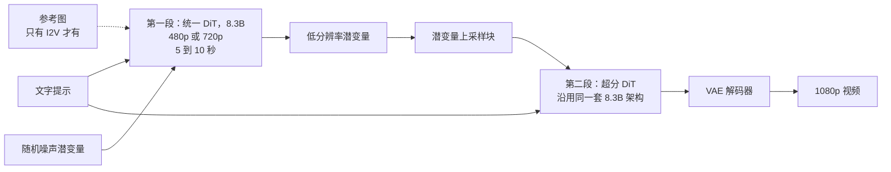
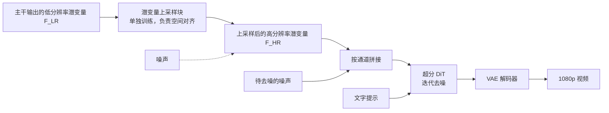
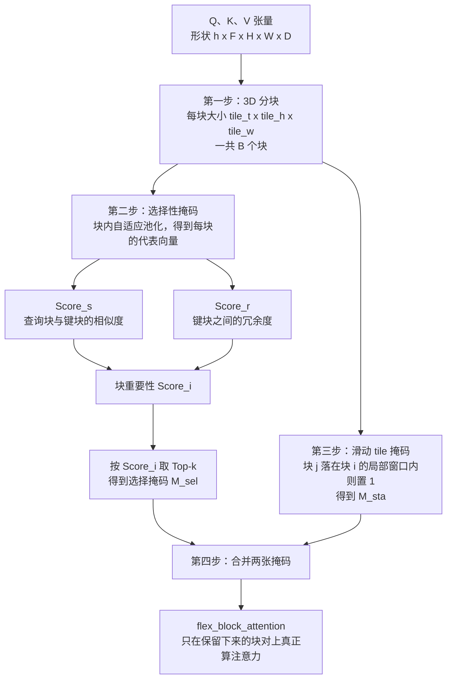
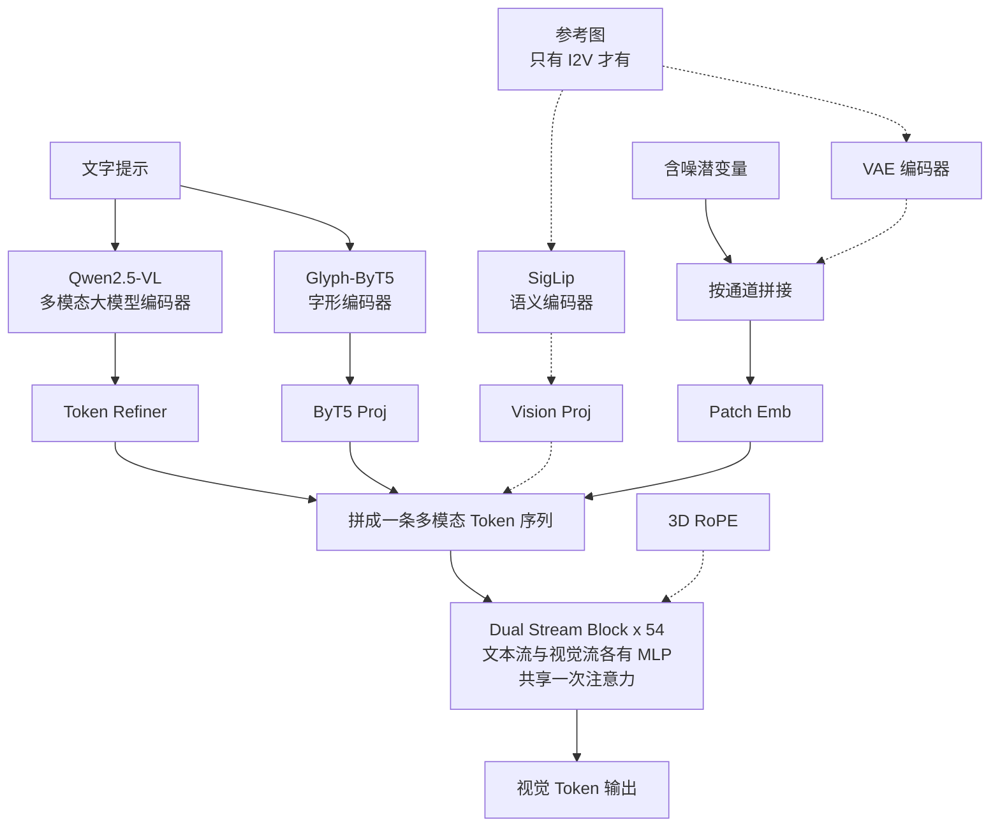
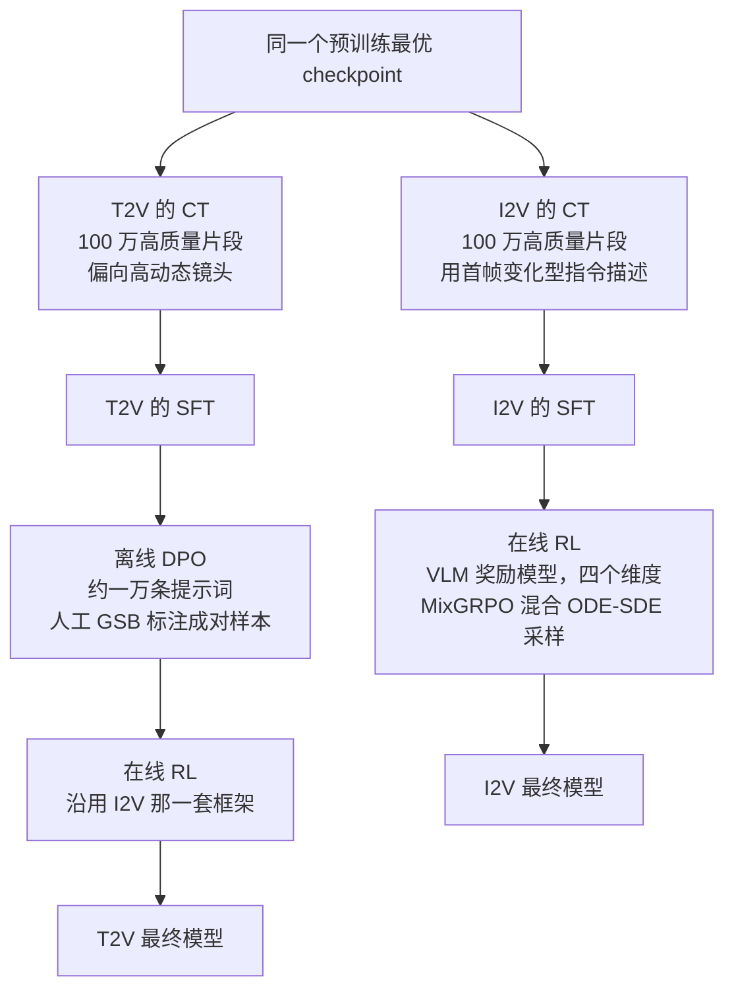

# HunyuanVideo 1.5：视频生成的账单上，参数量只是其中一栏

<!-- release-date: 2025-11-20 -->

> 本文依据腾讯混元基础模型团队的 **HunyuanVideo 1.5 Technical Report**，即 arXiv:2511.18870v2（2025-11-25 修订）。动笔前核对过 arXiv 提交历史与官方仓库：v2 是目前最新版本，官方仓库没有另放技术报告 PDF，本地件与 arXiv v2 逐字节一致，未做替换。
>
> 全文页码指 PDF 自身页码，本报告 PDF 页码与印刷页码一致。文中始终区分三件事：**报告写了什么**、**我们如何解释**、**哪些是外部补充**。凡是本文自己算出来的数、自己从图里读出来的东西，都会明说。

## 读之前：视频生成这条线的基本形状

这是本模块第一篇视频生成方向的解读。如果你之前只读过语言模型或图像模型的报告，下面这些词值得先花几分钟，否则后面每一节都会卡住。这一节里只解释报告真实用到的概念。

**扩散模型（diffusion model）**：一类生成模型。它不是一次画完，而是从一张纯噪声出发，反复"去噪"几十次，每一次都把图像往真实数据的方向推一点。每一次去噪叫一个 **step（步）**。报告里的 `diffusion step`、`50 diffusion steps` 说的就是这件事（PDF p. 11）。

**流匹配（flow matching）**：训练扩散模型的一种目标函数写法。它不去预测"这一步该减掉多少噪声"，而是学习一个速度场，让样本沿着从噪声到真实数据的一条路径匀速走过去。报告两处说自己用流匹配（PDF p. 6、p. 8），但**全文没有写出任何损失函数**，所以本段是外部背景，不是报告内容。

**潜空间（latent space）与 VAE**：直接在像素上做扩散太贵。主流做法是先用一个自编码器（Variational Auto-Encoder，VAE）把视频压成一个小得多的张量，扩散在这个压缩后的空间里进行，最后再用解码器还原成像素。压缩后的那个张量叫**潜变量（latent）**。图像的 VAE 只压空间两个轴，视频还要压时间轴，所以叫 **3D VAE**；**因果（causal）** 指压时间轴时某一时刻的潜变量只依赖它自己和之前的帧，不看未来帧——这样同一个编码器可以同时吃单张图片（当成长度为 1 的视频）和长视频。

**DiT（Diffusion Transformer，扩散 Transformer）**：把扩散模型的去噪网络从 U-Net 换成 Transformer。潜变量被切成小块（patch）后摊平成一条 Token 序列，Transformer 在这条序列上做注意力。这一步很关键：**视频扩散一旦用了 Transformer，注意力的平方复杂度就直接压在视频长度上**。

**T2V、I2V、T2I**：文生视频（Text-to-Video）、图生视频（Image-to-Video）、文生图（Text-to-Image）。T2V 只给文字；I2V 额外给一张参考图，这张图要成为视频的第一帧，文字负责描述"从这一帧开始要发生什么"（PDF p. 3、p. 7）。

**CFG（Classifier-Free Guidance，无分类器引导）**：推理时的一个常规技巧，同一步里跑两次网络——一次带提示词、一次不带——再把两个结果按一个系数外推，让输出更贴合提示。它的代价是每步的计算量翻倍。报告在两处提到 CFG（PDF p. 7 的采样策略、p. 11 的 `CFG distilled model`），但没有解释它是什么，本段是外部背景。

**超分（super-resolution）**：把已经生成好的低分辨率视频放大到高分辨率的后处理网络。它在流水线里排在生成之后，是**第二段模型**，不是主干的一部分。注意区分：报告里只有超分，**没有插帧**。24 fps 是在预训练阶段一级级练上去的（PDF p. 7），不是靠插帧补出来的。

## 一句话先说清

HunyuanVideo 1.5 的标题数字是 8.3B 参数（PDF p. 1）。但如果你只记住这个数字，就会错过这份报告真正在讲的事。

因为视频生成的成本不是"参数量 × 一次前向"。它大致是这样一笔账：

$$
\text{总成本} \;\approx\; \underbrace{\text{步数}}_{\text{迭代几十次}} \times \underbrace{\text{每步的前向}}_{\text{参数量} \,\times\, \text{Token 数} \;+\; \text{注意力的平方项}}
$$

这笔账上有四栏：**步数**、**参数量**、**Token 数**、**注意力复杂度**。参数量只是其中一栏，而且往往不是最大的那一栏——因为 Token 数由分辨率乘时长决定，很容易冲到几十万，而注意力对它是平方关系。

所以这份报告真正做的事，是**沿着这几栏分别下刀**，本文后面也按这个顺序展开：

- **分辨率**：级联超分，让主干永远不必在 1080p 上跑扩散（PDF p. 1、p. 6）；
- **Token 数**：高压缩比的 3D 因果 VAE，把要算的东西压掉三个数量级（PDF p. 2、p. 4）；
- **注意力复杂度**：SSTA（Selective and Sliding Tile Attention，选择性滑动 tile 注意力），把平方项砍成两块可控的部分（PDF p. 5）；
- **参数量**：8.3B 稠密 DiT，不走 MoE（PDF p. 1、p. 4）。

**唯独"步数"这一栏，报告基本没有下刀**：Table 8 的实测仍然是 50 步（PDF p. 11）。这一点后面会专门讲。

如果只记一句话：

> **在视频生成里，先问"我要算多少个 Token"，再问"我用了多少参数"。前者的杠杆比后者大得多。**

## 报告地图：14 页里各写了什么

这份报告只有 14 页，其中正文 11 页、贡献者名单 1 页、参考文献 2 页。体量本身就是信息：它不是一份从零讲起的基座报告，很多设计只给结论、不给推导。先把篇幅分布摊开，后面就知道哪些地方可以深挖、哪些地方只能到此为止。

| 报告章节 | PDF 页 | 讲了什么 | 密度 |
|---|---|---|---|
| 摘要 + §1 引言 | p. 1 | 目标、竞品定位、两段式流水线 | 中 |
| 五条贡献 | p. 2 | 全文最浓缩的一页 | 高 |
| §2.1 数据采集与过滤 | p. 2–3 | 数据漏斗与三级过滤 | 高 |
| §2.2 打标 + Figure 1 | p. 3 | 三种打标模型、OPA-DPO、镜头运动识别 | 中 |
| Table 1 + §3 模型设计 | p. 4 | 架构超参只有一行五个数 | 高 |
| §3.1 统一 DiT + Figure 2 | p. 4–5 | 多任务、VAE、双文本编码器、SSTA、优化器 | 高 |
| Algorithm 1 | p. 5 | SSTA 的完整伪代码，全文唯一的算法块 | 高 |
| §3.2 视频超分 + Figure 3 | p. 6 | 一段话 + 一张流程图 | 低 |
| §4.1 预训练 + Table 2 | p. 6–7 | 阶梯式课程与任务配比 | 中 |
| §4.2 后训练 | p. 6–7 | CT / SFT / RLHF，T2V 与 I2V 两条路线 | 高 |
| §4.3 超分训练 + Figure 4/5 | p. 8–9 | 一段话 + 两页样例图 | 低 |
| §5 模型性能 | p. 8–10 | Rating 与 GSB 两套人工评测，四张表 | 高 |
| §6 速度与显存 | p. 10–11 | Table 7、Table 8、13.6 GB | 高 |
| §7 结论 | p. 11 | 无新信息 | 低 |
| §8 贡献者 + 参考文献 | p. 12–14 | 21 条引用 | — |

三件事值得先知道：

- **全文没有一个损失函数。** 流匹配、扩散目标、DPO 目标、RL 目标一律只提名字。唯一的公式化内容是 Algorithm 1 里的三个打分式。
- **全文没有一次质量消融。** 唯一的开关对照是 Table 7 / Table 8 里稀疏注意力的开与关，而它们只测速度，不测画质；Muon 只有一句"半数步数就达到更低训练损失"，没有曲线也没有表。PDF 全文里 "loss" 一词只出现过一次，就在那句话里。
- **全文没有一个公开基准。** Table 3 到 Table 6 全是内部人工评测，提示词集与评分细则都没有公开。

因此，这篇解读的重心不放在"复现"，而放在**这套流水线里每一笔成本花在哪、每一条结论能撑到什么程度**。

## 分辨率那一栏：两段模型，一段管内容，一段管清晰度

这张图按报告 §1（PDF p. 1）与 Figure 3（PDF p. 6）重画，只表示模块连接关系，不含任何时间或性能信息。

**第一段**是一个统一的 DiT，8.3B 参数，同时支持 T2V 和 I2V，输出 480p 到 720p、5 到 10 秒的视频（PDF p. 1）。"统一"的意思是 T2I、T2V、I2V 三个任务共用同一套权重、一起训练（PDF p. 4），不是三个模型。**第二段**是一个独立的视频超分网络（Video Super-Resolution，VSR），把第一段的输出升到 1080p（PDF p. 1、p. 6）。

这里有个容易被标题数字盖住的事实：**第二段也是 8.3B**。报告写得很直接——超分模型"沿用主模型的架构，一个 8.3B 的视频扩散 Transformer"（PDF p. 6），权重从一个预训练好的 T2V 模型初始化（PDF p. 8）。所以完整跑一次 1080p 生成，要放两个 8.3B 模型、串行跑两遍扩散。**"8.3B"是每一段的规模，不是整条流水线的规模。** 报告没有把这一点摊开说，我们标出来，因为它直接影响部署成本的估算。

### 为什么要拆成两段，而不是直接生成 1080p

报告只给了目的（"进一步提升训练与推理效率，同时满足高分辨率视频生成的需求"，PDF p. 6），没有给推导。下面这段账是本文算的。

1080p 是 $1920\times1080$，720p 是 $1280\times720$，面积比 2.25 倍。Token 数按面积走，注意力按 Token 数的平方走。也就是说，**光是把主干从 720p 挪到 1080p，注意力部分的代价就要乘上大约 5 倍**，而且这 5 倍要乘在每一个扩散步上。

拆成两段之后，几十步的扩散全部留在 720p 及以下；超分模型虽然工作在 1080p，但报告在贡献里把它称作 **few-step（少步数）** 超分网络（PDF p. 2）。昂贵的迭代放在便宜的分辨率上，贵的分辨率只跑很少几次——朴素但有效的成本重排。

**但报告没写超分到底跑几步。** "few-step"只在贡献列表里出现过一次，正文和 Table 7、Table 8 都没有超分阶段的任何数字。所以这套账在方向上成立，在数量上无法核实。

### 超分内部长什么样

这张图按报告 Figure 3（PDF p. 6）重画，并补上了只写在正文里的两句话：低分辨率潜变量按**通道拼接**注入（PDF p. 6、p. 8），以及上采样块是**单独训练**的（PDF p. 6）。

图里那条虚线需要说明：Figure 3 在上采样之后画了一个噪声与 $F_{HR}$ 相加的符号。**这是我们从图里读出来的，报告正文完全没有解释它**——正文只说"把低分辨率潜变量和噪声按通道维拼接后送进 DiT"（PDF p. 8）。给条件加噪是级联扩散里的常见做法，但既然报告没写，我们就只标出图上有这一步，不替它补理由。

超分模型的训练数据是 100 万条高质量视频片段，分辨率从 1K 到 4K，每条 3 到 10 秒、24 fps，另外掺入一批高分辨率图片来强化细节（PDF p. 8）。全部权重可训练，训练目标同样是流匹配（PDF p. 8）。

这一段值得带走的不是"做个超分"，而是：**当某个维度上的成本是超线性的，就不要让整条流水线都在那个维度的最高档上跑完全程。** 长上下文的重排序、检索的粗排—精排、编译的 fast path 与 slow path，形状都一样。

## Token 数那一栏：让 VAE 先把视频压掉一千倍

这是四刀里最容易被略过、但杠杆最大的一刀。

报告对 VAE 的描述只有两句话：一个用于图像和视频联合编码的**因果 3D Transformer 架构**，空间压缩比 $16\times$、时间压缩比 $4\times$，潜变量通道维为 32（PDF p. 4）。

### 这个压缩比意味着什么

先把数字换算成直觉。以下推算是**本文自己算的**，报告没有给出 Token 数。

推算依赖一个理解：报告写的"空间 $16\times$"指**每个空间轴各压 16 倍**，而不是面积一共压 16 倍。报告本身没有澄清这一点，我们这样读的理由是——若按面积压 16 倍算，同样的视频会得到十几倍于此的 Token 量，与 Table 7 实测的每步耗时完全对不上（PDF p. 11）。

按每轴 16 倍算，720p（$1280\times720$）的一个潜变量帧是：

$$
\frac{1280}{16}\times\frac{720}{16}=80\times 45=3600
$$

时间轴压 4 倍，241 帧大约变成 60 个潜变量帧（报告没有写因果 VAE 具体的首帧对齐约定，这里只取近似）。于是一条 10 秒 720p 视频，进入 DiT 之前大约是：

$$
60\times 3600 \approx 2.16\times 10^{5}
$$

个潜变量位置。而原始像素位置是 $241\times1280\times720 \approx 2.22\times 10^{8}$ 个。两者相差约 1024 倍，正好是 $16\times16\times4$。

换一个角度更直观：**每 1024 个像素（每个像素 3 个通道，共 3072 个数）被压成 32 个数**，压缩比约 96 倍。

（提醒：$2.16\times10^5$ 是潜变量位置数，是 DiT Token 数的上界。DiT 前面还有一个 Patch Embedding，patch 大小报告没有给，所以真实 Token 数只会更少，具体多少无法核实。）

### 为什么这一刀比参数量重要

因为注意力的代价是 Token 数的平方。

$$
\text{注意力代价} \;\propto\; L^{2}
$$

如果 VAE 只压 8 倍而不是 16 倍（每轴），Token 数会变成 4 倍，注意力代价就是 16 倍。**没有任何参数量上的节省能补回这 16 倍。**

报告自己在解释推理速度时也是这么归因的：模型在没有工程加速的情况下就已经有不错的速度，原因是"紧凑的 8.3B 架构本身高效"以及"高 VAE 压缩率显著减少了参与计算的 Token 数"（PDF p. 10）。注意这句话把 VAE 和参数量并列成两个原因，而不是只提参数量。

### 代价与边界

报告没有讨论 VAE 的代价，下面是我们的判断。

压缩比越高，重建就越难。$16\times16\times4$ 意味着 VAE 解码器要从 32 个数里还原出 3072 个数，细小纹理、密集文字、快速运动的高频信息都可能在编码那一刻就丢了，而且后面所有环节都补不回来。报告给潜变量留了 32 个通道（对比常见的 4 或 16 通道），这本身就是对高压缩比的一种补偿，但**报告没有给 VAE 的任何重建质量指标**（PSNR、rFVD 之类一个都没有），也没有和低压缩比的 VAE 做对照。

所以准确的表述是：报告选择了一个激进的压缩比，并把由此得到的速度收益写进了实验；但**这个选择在画质上付出了多少，报告没有量化**。

## 注意力那一栏：SSTA 把平方项拆成两块

上一刀把 $L$ 压小了，但 $L$ 仍然是十万量级，$L^2$ 仍然是主要开销。这一刀直接动注意力本身。

### 旧问题：视频里的注意力有大量白算

报告的问题陈述很短（PDF p. 5）：标准自注意力的复杂度随序列长度平方增长，对基于 Transformer 的视频生成模型是明显的效率瓶颈；而视频数据本身存在固有的时空冗余，因此用稀疏注意力替换全注意力是一个有充分动机的优化。

把它说得更具体一点（这是我们的展开）：视频的相邻帧极其相似，画面里大片区域在几秒内几乎不变。让每个位置都去和全部二十多万个位置比一遍，其中绝大多数比较的结果都接近"无关"。

已有的两类做法各有各的问题：

- **只用固定局部窗口**（比如只看时空上邻近的块）：便宜、稳定，但视野被写死了。镜头一切换、主体一移动，真正需要参考的位置就落在窗口外。
- **只用动态选择**（每次算一遍相关性，挑最相关的若干块）：视野灵活，但完全依赖打分的准确性，一旦漏选就永远看不到，而且局部连续性容易被打碎。

SSTA 的答案是把两者放在一起用。报告的原话是：为了协同结合**静态局部窗口先验**与**动态全局自适应选择**的好处，提出 SSTA（PDF p. 5）。

### SSTA 怎么工作

SSTA 建立在已有工作 STA（Sliding Tile Attention，滑动 tile 注意力）之上（PDF p. 5，引用 [15]）。"tile"就是把三维的潜变量按时间、高、宽切成一个个小立方块；滑动 tile 注意力是让每个块只看它周围的一圈块。**SSTA 新增的是"selective"那一半**：在滑动窗口之外，再动态挑出一批值得看的块。

Algorithm 1（PDF p. 5）给了完整四步：

这张图按 Algorithm 1（PDF p. 5）重画，节点顺序与伪代码的四个步骤逐条对应，不含任何时间信息。

**第一步，3D 分块。** 把 $Q$ 和 $K$ 按 $N=\text{tile}_t\times\text{tile}_h\times\text{tile}_w$ 切成块，块数为 $B$（PDF p. 5）。之后所有决策都在**块的粒度**上做，不在单个 Token 上做——这一点是能落地的关键，因为块粒度的稀疏模式可以映射成高效的 block-sparse kernel。

**第二步，算出该选哪些块。** 每个块先做自适应池化，压成一个代表向量 $\bar Q_b$、$\bar K_b$。然后算两个分数：

$$
\text{Score}_s=\bar Q_b\bar K_b^{\top}
$$

这是查询块和键块之间的相似度，代表"这个键块和我现在要生成的内容有多相关"。

$$
\text{Score}_r=\frac{1}{N-1}\sum_{j\neq i}\left[\bar K_b\bar K_b^{\top}\right]_{ij}
$$

这是键块**之间**的相似度平均值，代表"这个键块和其他键块有多雷同"。报告把它叫作块级冗余度（PDF p. 5）。

两者合成块的重要性：

$$
\text{Score}_i=\lambda\cdot\text{Score}_s-\beta\cdot\text{Score}_r
$$

然后取 Top-$k$，转成掩码 $M_{sel}$（PDF p. 5）。

这个减号是 SSTA 里最有意思的一处设计。**它不只问"谁跟我像"，还问"谁是独一份的"。** 一个块如果和其他一堆块高度雷同，那看它一次和看它十次差别不大，把配额让给别的块更划算。用一个比喻：查资料时你不会把十份互相抄袭的报道都读完，你会各挑一份不同来源的。$\text{Score}_r$ 干的就是去重这件事。

而这正好补上了"纯 Top-k 选择"的一个具体弱点：视频里相邻帧极其相似，如果只按相似度选，Top-k 很容易被同一片区域的连续几帧全部占满，视野反而收窄了。减去冗余度，等于强迫选出来的 $k$ 个块彼此更分散。

**第三步，滑动 tile 掩码。** 遍历所有块对 $(i,j)$，若 $j$ 落在由窗口大小 $WS=(w_t,w_h,w_w)$ 定义的 $i$ 的局部窗口内，置 1，否则置 0，得到 $M_{sta}$（PDF p. 5）。这一步是纯静态的，不看内容。

**第四步，合并并计算。** 两张掩码合并成 $M_{combined}$，交给 `flex_block_attention` 做块稀疏注意力（PDF p. 5）。

### 算法写法上两处需要留意的地方

这两处不是我们的推断，而是报告里的字面与描述之间的张力。我们只标出来，不替报告改写。

**第一处：合并掩码用的符号。** Algorithm 1 第 20 行写的是 $M_{combined}\leftarrow M_{sel}\wedge M_{sta}$，即逻辑**与**（PDF p. 5）。但按字面取交集，会让局部窗口之外的所有"动态选择"结果全部作废——那样 SSTA 就退化成一个比 STA 更稀疏的 STA，和第 5 页正文"协同结合静态局部窗口先验与动态全局自适应选择"的说法正好相反。按描述反推，这里更像是并集。报告没有澄清，也没有给出对应的公式说明。

**第二处：冗余度的归一化分母。** 第 7 行的 $\text{Score}_r$ 写成除以 $N-1$，而 $N$ 在 Require 里被定义成**块的大小**（$\text{tile}_t\times\text{tile}_h\times\text{tile}_w$）；但同一行标注的输出形状是 $\mathbb{R}^{h\times1\times B}$，是按**块的个数** $B$ 索引的，求和自然也应该跑遍 $B$ 个块。也就是说这一行里 $N$ 和 $B$ 疑似串了。这不影响对设计意图的理解——它就是"某个键块对其余键块的平均相似度"——但如果你想照着实现，这里得自己判断。

### SSTA 的三个实际约束

**它是无参数的。** 报告强调 SSTA 是 parameter-free 设计，可以在任意训练阶段无缝接入（PDF p. 5）。这一点很实用：不用为了加稀疏注意力而重新预训练，也不用担心新引入的参数没练熟。

**但它实际是在蒸馏阶段才开始训的。** 报告写得很明确：在他们的实现里，稀疏训练是**在蒸馏阶段引入的**，这样能更有效地保住输出质量，同时保持高计算效率（PDF p. 5）。这句话说明"任意阶段都能插"是能力，不是他们的实际做法——他们仍然选择让模型先在稠密注意力下练好，最后才切换。

这里有个缺口要说清楚：**报告的 §4 训练章节从头到尾没有描述这个"蒸馏阶段"。** §4 只有预训练、CT、SFT、RLHF。而 §6 又说所有速度测量都在"CFG 蒸馏模型"上做（PDF p. 10）。所以蒸馏确实存在、确实是流水线的一环、SSTA 还依附在它上面，但它是什么、怎么做、蒸了几步，报告一个字都没写。

**关键超参一个都没给。** tile 的三个尺寸、窗口大小 $WS$、Top-$k$ 的 $k$、权重 $\lambda$ 和 $\beta$，全部缺失。这意味着这套方法的稀疏率无法从报告推算，你也无法据此复现。

### 它靠什么真的跑快

稀疏注意力最常见的失败模式是：理论上少算了一半，实测反而更慢，因为不规则的访存把 GPU 的算力优势吃掉了。SSTA 在两个地方回避了这件事：

- **决策在块粒度上做**，产生的是规整的块稀疏模式，而不是逐 Token 的散点；
- 团队为此写了一个专门的加速工具库 `flex-block-attn`，基于 **ThunderKittens** 框架实现 `flex_block_attention`（PDF p. 5，引用 [16][17]）。

`flex-block-attn` 是腾讯自己开源的库，报告给了仓库地址（PDF p. 13）。这属于外部链接，具体实现本文没有核对源码，不做断言。

这一节的可迁移启发有两条：**稀疏选择时"相关性"往往不够，还要加一项"多样性"**——相关性最高的前 $k$ 个很可能互相是同一条信息的重复；以及**决策粒度必须对齐硬件粒度**——SSTA 放弃了 Token 级的自由选择，把粒度锁在 tile 上，表达力上有损失，但换来了能真正跑快的 kernel。

## 参数量那一栏：8.3B 的稠密 DiT

### 报告为什么要跟 Wan2.2 过不去

引言里花了整整一段讲竞品（PDF p. 1），这段是理解整篇报告定位的钥匙。

报告说：Wan2.2 采用混合 MoE（Mixture of Experts，混合专家）架构，用**两个 14B 的专家模型**来提升视频质量，总参数 27B、激活 14B。让不同去噪阶段各用专门的专家确实提升了画质，但这本身带来计算上的低效——模型必须管理多套庞大的参数集。报告接着说：Wan2.2 也出过一个更紧凑的 5B 变体，用高压缩 3D VAE 降低显存占用，但这个轻量模型在跨帧运动稳定性和专业级审美质量上仍然达不到实用要求。于是报告给出自己的定位：**存在一个空白——没有一个开源模型同时做到高质量输出和高效推理**（PDF p. 1）。

这段对照很有信息量，因为它说明 HunyuanVideo 1.5 的目标不是"参数最少"，而是**在 8.3B 这个尺度上不掉质量**。它对标的是 Wan2.2 的 14B 激活参数，而不是 5B 变体。

### 架构超参：一行五个数

| 项 | 值 |
|---|---:|
| Dual-stream Blocks（双流块数） | 54 |
| Model Dimension（模型维度） | 2048 |
| FFN Dimension（前馈维度） | 8192 |
| Attention Heads（注意力头数） | 16 |
| Head dim（每头维度） | 128 |

（PDF p. 4，Table 1。这是报告给出的全部架构超参。）

$16\times128=2048$，与模型维度一致；FFN 维度是模型维度的 4 倍。这是很常规的比例。

值得注意的是这个形状本身：**2048 维、54 层**——对一个 8.3B 的模型来说，又窄又深。

顺着这五个数还能看出一件报告没说的事（以下是本文的粗算，依赖对双流块内部结构的假设）。若每条流各有一套完整的 QKVO 投影和两层 MLP，一个双流块约是 $2\times(4\times2048^2+2\times2048\times8192)\approx 1.0\times10^8$ 个参数，54 块合计约 5.4B。这离 8.3B 还差近三成。差额可能来自调制层、输入输出投影，也可能报告的"8.3B"口径本身就包含了别的东西。**报告没有给任何参数拆分**，所以这只能说明"Table 1 的五个数不足以复原 8.3B"，不能用来断言少的那部分是什么。

### 双流块：报告只画了，没有讲

"Dual-stream"这个词在报告正文里一次都没有出现过。它只出现在 Table 1 的表头和 Figure 2 的图注里（PDF p. 4）。

从 Figure 2 能读出它的结构：文本条件是一条流，视觉（含噪潜变量）是另一条流；两条流**各自有自己的 MLP 和自己的残差连接**，但在每个块中间**共享同一次注意力**——图里 `Self-Attention / Sparse-Attention` 那个框横跨两条流，两侧各有一个残差加法（PDF p. 4，Figure 2）。

也就是说：两种模态的参数是分开的，但信息交换是通过一次完整的联合注意力完成的，不是靠交叉注意力。这一点是我们从图里读出来的，报告正文没有描述。

### 条件是怎么进模型的

这张图按报告 Figure 2（PDF p. 4）重画。虚线表示**只有 I2V 任务才有**的通路，这是我们加的标注（Figure 2 用虚线箭头暗示了 SigLip 一路，但没有图例说明）。块数 54 取自 Table 1（PDF p. 4）；"按通道拼接"取自正文 §3.1 的文字描述（PDF p. 4），Figure 2 在那个位置画的是一个圆圈加号。3D RoPE 只出现在 Figure 2 里，报告正文完全没有提及。

四条输入通路各自的分工：

| 通路 | 编码器 | 送进去的是什么 | 出处 |
|---|---|---|---|
| 语义文本 | Qwen2.5-VL | 场景描述、人物动作、具体要求的深层理解 | p. 5 |
| 字形文本 | Glyph-ByT5 | 让画面里的文字能被准确渲染出来 | p. 5 |
| 参考图语义 | SigLip | I2V 的语义对齐与指令遵循 | p. 4 |
| 参考图像素 | VAE 编码器 | I2V 的细节重建 | p. 4 |

### 文生视频和图生视频，差别到底在哪

这是这条线上最容易混淆的一组概念，报告在 §3.1 给了很清楚的答案（PDF p. 4）。

**T2V**：输入只有文字。模型从纯噪声开始，把整段视频生成出来。

**I2V**：额外给一张参考图，这张图要当第一帧——§3.1 只称它为"参考图"，但打标那一节明确说 I2V 的描述写的是"相对初始帧的演变"（PDF p. 3、p. 7），所以它就是首帧。难点在于——这张图必须**同时**做两件互相冲突的事：

1. 它得被**精确复刻**成第一帧。用户给的是这张图，生成的视频第一帧就不能是"一张长得差不多的图"。
2. 它得被**语义理解**。模型要知道图里是什么、谁是主体，才能按文字描述让它动起来。

这正是本模块另一篇解读（Janus-Pro）里"理解和生成需要不同表示"的同一个矛盾，只是换到了条件注入这一侧。

报告的做法是**两条路一起上**，用的原词是"两种互补的策略"（PDF p. 4）：

- **VAE 编码路径**：把参考图编码成潜变量，沿**通道维**和含噪潜变量拼在一起。这条路利用 VAE"卓越的细节重建能力"，负责像素级还原。
- **SigLip 特征路径**：抽出语义嵌入，沿**序列维**拼接进去。这条路"增强语义对齐、强化 I2V 中的指令遵循"，负责让模型读懂图。

两条路的拼接维度不同，这不是随手选的：

- 沿**通道维**拼，意味着参考图的信息和噪声在**同一个空间位置上**对齐。第一帧的第 $(x,y)$ 个潜变量位置，直接看到参考图第 $(x,y)$ 处的内容。这是像素级对齐需要的形状。
- 沿**序列维**拼，意味着 SigLip 特征变成一批额外的 Token，任何位置都可以通过注意力去查它们，但没有硬性的空间对应。这是语义参考需要的形状。

（拼接维度的这层解释是本文的展开，报告只写了"沿通道维"和"依次拼接"两个事实。）

最后，报告引入了一个**可学习的类型嵌入（type embedding）**，用来显式区分不同类型的条件（PDF p. 4）。因为同一套权重要同时处理 T2I、T2V、I2V 三种任务，输入序列里有时有参考图、有时没有，模型需要一个明确的信号知道"现在这一段 Token 是什么身份"，而不是靠猜。

### 两个文本编码器：一个读意思，一个读字形

报告把这套设计叫**双通道文本编码器**（PDF p. 5）。

**Qwen2.5-VL** 是一个视觉—语言多模态编码器，用来获得对场景描述、人物动作和具体要求的更深理解（PDF p. 5）。用多模态模型而不是纯文本模型来编码提示词，好处是它的文本表示本来就是和视觉内容对齐着训出来的。

**Glyph-ByT5** 负责另一件很具体的事：让画面里的文字被正确写出来。ByT5 是字节级模型，不把文字切成词而是直接处理字节，因此能"看见"每个字的字形结构。对中文尤其重要：语义编码器知道"这是'混'字"，但要把它一笔一画画出来，需要的是字形层面的信息。Figure 2 里那个例子就是为此放的——提示词要求在宣纸上写出书法"混元视频 1.5"（PDF p. 4）。报告把这条路径的目的写成"增强各种语言下的文字渲染准确性"（PDF p. 5），并在贡献里说这是为**双语（中英）理解**服务的（PDF p. 2）。

**边界要说清楚：报告没有给任何文字渲染的量化指标。** 没有 OCR 准确率、没有中英对比、没有去掉 Glyph-ByT5 的消融。结论一节说模型"展现出出色的双语提示理解和准确的文字渲染"（PDF p. 11），这是作者的观察，不是实验证据。

### 优化器：Muon

报告用 Muon 优化器来获得更快的收敛（PDF p. 5）。它给出的观察是：**Muon 只用 AdamW 一半的训练步数就达到了更低的训练损失**，同时在多个文生图基准上表现更好；为保证训练稳定，权重衰减设为 0.01。

这段话的价值在于它是一个**跨领域的迁移证据**：Muon 主要是在语言模型训练里被验证的，这份报告说它在视频生成的 DiT 上同样有效。

但要注意三点：

- "一半步数"是报告陈述的观察，**没有给曲线、没有给表、没有给具体损失值**；
- "多个文生图基准"没有点名是哪些基准，也没有给分数；
- 报告引用 Muon 时给的是 **[8] Kimi K2 的论文**（PDF p. 5、p. 13），不是 Muon 的原始出处。这只是一个引用选择，不影响结论，但如果你顺着引用去找 Muon 的定义会找错地方。

## 数据：从一千万小时到八亿片段

模型设计讲完了，回过头看喂进去的东西。这一节报告写得反而比架构详细。

### 漏斗

**图像侧**（PDF p. 2）：沿用 HunyuanImage-3.0 的采集与处理流程，从**超过 100 亿**张的池子里挑出 **50 亿**张用于预训练，另留 **10 亿**张给后续阶段。

对照 Table 2 会发现这两个数正好落位：Stage I（256p，T2I）用 50 亿，Stage II（512p，T2I）用 10 亿（PDF p. 7）。所以"留给后续阶段的 10 亿"就是 512p 那一档。（这个对应关系是本文推出来的，报告没有明说。）

**视频侧**（PDF p. 2–3）的漏斗有五道：

1. **采集**：从多种渠道拿原始视频，覆盖不同内容、拍摄手法、镜头运动、风格和场景。基础去重、去掉损坏文件之后，得到**超过 1000 万小时**原始视频。
2. **切片**：原始视频长度差异极大，用 PySceneDetect 加自研切分算子检测场景边界，切成 **2 到 10 秒**的片段；再用一个专门的转场分类器做二次过滤，去掉还残留转场特效的片段。
3. **裁掉污染区域**：字幕、台标、水印所在的区域直接空间裁剪掉。但裁完之后如果剩下的画面**不足原始画幅的 60%**，整条片段丢弃——因为构图已经被破坏了。
4. **三级过滤**：
   - **基础过滤**：去掉有填充边框、拼接痕迹、宫格拼图，以及静止或低运动的片段；
   - **视觉质量过滤**：一个覆盖四个维度的质量评估算子——清晰度、细节保留、噪点与伪影、动态范围；
   - **审美过滤**：基于已有工作的审美打分算子，滤掉审美分低的。
5. **结果**：约 **8 亿**条高质量视频片段进入预训练（PDF p. 3）。

漏斗收得有多紧？下面是**本文的估算**，报告没有给：8 亿片段若按平均 6 秒算，约合 48 亿秒、约 **133 万小时**。相对超过 1000 万小时的原始素材，量级上大约只留下了一成多。（这个数完全取决于"平均 6 秒"这个假设，只用来建立数量级直觉。）

第 3 步那个 **60% 的阈值**特别值得记：它承认了"去水印"和"保构图"之间有真实冲突。裁得越干净，剩下的画面越可能不成构图；报告选择在这里放弃数据量，而不是留下构图被破坏的样本。

### 打标：三个模型，各管一件事

高质量的文字描述直接决定指令遵循能力，所以报告为三种数据各训了一个打标模型（PDF p. 3）：

- **图像打标**：沿用 HunyuanImage-3.0 的方法。
- **视频打标**：输出高度结构化的多组件描述——多层次的文字叙述，外加一整套电影与审美属性：**景别、机位角度、构图、光线、风格、色调、氛围**。
- **I2V 指令式打标**：这是报告称为"novel（新的）"的一个模块。它生成的不是"这段视频里有什么"，而是**从首帧开始发生了什么变化**，同时描述前景主体和背景环境的变化。

第三个为什么必须单独做？因为 I2V 的第一帧是用户给的，模型不需要被告知"画面里有一只猫"——它已经看得见。它需要被告知的是"猫要站起来走出画面"。**训练时的文字描述形状必须和推理时用户会写的东西一致**，否则模型学到的条件分布和实际使用的分布对不上。

这一条的可迁移性很强：**给条件生成任务做标注时，标注的是"增量"还是"全量"，取决于推理时哪一部分是已知的。**

### 打标模型自己也要做后训练

报告点出了一个具体矛盾（PDF p. 3）：描述的**丰富度**和**事实准确性**之间存在内在权衡——想生成更多细节，就更容易产生幻觉或事实错误。

它的解法是把强化学习引进打标模型的后训练，具体用 **OPA-DPO**（PDF p. 3）。Figure 1 画出了三步：

这张图按报告 Figure 1（PDF p. 3）重画，除了末端的"最终打标模型"是我们补的收束节点，其余每个节点的名称都直接来自图里的文字。**报告正文对这三步没有任何展开**，除了图之外只有一句"我们把 RL、具体说是 OPA-DPO，整合进打标模型的后训练流水线"，所以我们没有替它补机制说明。Figure 1 里的 0.2 / 0.4 / 0.8 是示意标注，不是实测数据。

值得记一笔的是第三步里那个 **Human Corrector（人工修正）** 的位置：它不是去标注"哪条更好"，而是去**修改模型自己采样出来的描述**。改完的版本仍然贴着模型自己的分布，只是把错的地方改对了——这比让人另写一条正确答案更贴近 on-policy，也是 OPA-DPO 名字里 OPA 的含义。（此处对 on-policy 的解释是本文的补充，报告未展开。）

### 镜头运动：为可控性预留的接口

报告另外训了一个镜头运动识别模型，能识别多种运镜类型，工作在两个粒度上——**片段级**（整段视频一个标签）和**时序级**（随时间变化）。高置信度的预测被转成自然语言，写进结构化的视频描述里，目的是**让生成模型具备可控的镜头运动能力**（PDF p. 3–4）。

这是"能力从数据来"的一个干净例子：想让模型听懂"镜头缓慢拉远"，最直接的办法不是加一个控制模块，而是保证训练数据里有大量画面确实在拉远、且描述里写着"拉远"的样本。**只有高置信度的预测才被写入**，也说明他们宁可少标，也不愿意用错误标签污染这个能力。

**边界**：报告没有给这个识别模型的准确率，也没有做任何运镜可控性的评测。

## 训练：从 256p 的图片一路爬到 720p 24fps

### 阶梯

报告的预训练是一条明确的课程（PDF p. 6–7）：

| 阶段 | 类型 | 训练分辨率 | 数据量 | 任务 |
|---|---|---|---:|---|
| I | 预训练 | 256p | 50 亿 | T2I |
| II | 预训练 | 512p | 10 亿 | T2I |
| III | 预训练 | 256p 16fps 2~10s | 8 亿 | T2V/I2V/T2I |
| IV | 预训练 | 480p 16fps 2~10s | 2 亿 | T2V/I2V/T2I |
| V | 预训练 | 720p 16fps 2~10s | 1 亿 | T2V/I2V/T2I |
| VI | 预训练 | 720p 24fps 2~10s | 1 亿 | T2V/I2V/T2I |
| VII | CT | 480p/720p 24fps 2~10s | 100 万 | T2V |
| VIII | CT | 480p/720p 24fps 2~10s | 100 万 | I2V |

（PDF p. 7，Table 2。原表用 "M" 表示 million，此处换成中文数量级。）

这张表有三个地方值得停一下。

**第一，先练图片。** 阶段 I 和 II 完全是 T2I，一个视频都不碰。报告的理由是：T2I 任务让模型学会文字和图像之间稳健的语义对齐，而他们发现这**显著加速了后续 T2V 和 I2V 训练的收敛与效果**（PDF p. 6）。结论一节也把整个模型描述成"从一个文生图模型渐进训练而来"（PDF p. 11）。

为什么合理（这是我们的解释）：文字对齐和时间建模是两件可以拆开的事。图片数据比视频便宜几个数量级——阶段 I 的 50 亿张图，换成同等数量的视频片段根本不可能。先用便宜的数据把"读懂文字"这件事学到位，再把昂贵的视频算力全部花在"时间怎么动"上。**这是很典型的把能力放在学得起的阶段。**

**第二，数据量随分辨率一档档掉。** 8 亿 → 2 亿 → 1 亿 → 1 亿。分辨率涨上去之后，每条样本的计算成本涨得很快，所以样本数必须降下来。这条曲线本身就是"计算预算守恒"的痕迹。

**第三，两个变量分开爬。** 阶段 V 是 720p 16fps，阶段 VI 才是 720p 24fps。分辨率和帧率不是一起提的，是先提空间、再提时间。报告没有解释这个顺序，我们也不猜原因，但可以确认一件事：**24 fps 是训出来的，不是插帧插出来的。**

### 三个任务怎么混

预训练全程混合 T2I、T2V、I2V 三个任务，配比是 **1 : 6 : 3**（PDF p. 6）。也就是说十分之一的算力仍然留给图片。报告给的理由是：大规模 T2I 数据增强语义理解和生成多样性，同时 T2V 与 I2V 保证足够的视频特有建模（PDF p. 6）。注意 T2I 在阶段 I、II 已经练过了，这里仍留 10% 继续陪跑——这是防遗忘的常规做法，不过报告没有这样解释。

### 流匹配里那个敏感的 shift

这是整个训练章节里最技术性的一句话，也是唯一一处报告承认"这里有坑"的地方（PDF p. 6）：

> 和已有工作类似，我们观察到，当视频 Token 长度在不同阶段之间变化时，基于流匹配的训练对 **shift 超参数**特别敏感。为了在变化的序列条件下保持训练稳定，我们精心设计了一系列适配不同 Token 长度的 shift 调度策略。

这里的 shift 指流匹配训练中对时间步采样分布的一个偏移参数（报告引用的 [18] 是 SD3 的整流流论文，该参数在那里被提出）。直觉上：Token 越多，同样的噪声水平对整体结构的破坏就越"稀释"，模型需要在不同的噪声档位上花不同的功夫。序列长度一变，最该被训练的噪声区间就跟着变。

这条经验对做渐进式课程的人非常实用：**当你把序列长度、分辨率或批量大小做成阶梯时，和长度耦合的那些超参必须跟着调，否则每次升档都会掉一次稳定性。**

**边界**：报告只说"精心设计了一系列策略"，**没有给任何公式、数值或调度曲线**。这一处只能作为方向性的提醒，不能照抄。

## 后训练：T2V 和 I2V 走了两条不同的路

预训练之后是三段后训练：CT（continuing training，继续训练）、SFT（监督微调）、RLHF（基于人类反馈的强化学习），而且 **T2V 和 I2V 是分开做的**（PDF p. 6–7）。

这张图按报告 §4.2（PDF p. 6–7）重画，只表示流程顺序，不含任何时间或性能信息。

### CT：先换数据分布，再谈偏好

CT 和 SFT 都在 480p 与 720p 上做。CT 阶段每个任务各用 **100 万**条高质量片段，按类别做过平衡，来自优质数据源（PDF p. 7）。

两个任务在 CT 阶段就已经岔开了：

- **T2V** 额外偏向**高动态运动**的片段，目的是强化时间建模；
- **I2V** 引入前面说过的**指令式描述**——只描述相对首帧的运动与变化，以此提升动作保真度。

两条路都从**同一个最优预训练 checkpoint** 出发（PDF p. 7），所以它们共享同一个高质量底座，只是往两个方向特化。

SFT 阶段的筛选标准报告列了三条：**审美吸引力、清晰度、运动流畅度**（PDF p. 7）。报告说经过 CT 和 SFT，两个任务在输出稳定性、画质、审美和时间一致性上都有明显改善——这是作者的观察，Figure 4（PDF p. 8）给了 CT / SFT / RLHF 三行的样例对比，属于定性展示，不是量化证据。

### RLHF：I2V 直接上在线 RL

I2V 的路线是纯在线 RL（PDF p. 7）：

- **提示词集**：从高审美图片出发，覆盖 **100 多个类别**。候选提示先由一个 VLM 生成，再**人工核验**，确保图文严格一致。
- **奖励模型**：微调一个基于 VLM 的奖励模型，从四个维度打分——**文本对齐、图像对齐、画质、运动动态性**。
- **采样策略**：同时变化**随机种子**和 **CFG 系数**做混合采样；采用 **MixGRPO** 这个混合 ODE–SDE 求解器，在保持采样质量的同时丰富探索。
- **效果**：所有评测指标一致提升，**运动真实感的提升尤其明显**。

这里有一个细节值得单独看：**用变化 CFG 系数的方式来增加探索**。扩散采样的随机性主要来自初始噪声，同一个提示反复采样，轨迹往往长得很像；而 CFG 系数直接改变引导强度，能拉开轨迹之间的差异。这是扩散模型 RL 里特有的一个探索旋钮，语言模型那边没有对应物（温度是最接近的类比，但作用位置完全不同）。

至于 MixGRPO 那个"混合 ODE–SDE"：ODE 求解是确定性的，同一个起点必然走到同一个终点；SDE 求解带随机项，同一个起点会走出不同轨迹。RL 需要多样的轨迹才能比较好坏，但纯 SDE 又会让采样质量下降。混合两者就是在"能探索"和"生成的东西还能看"之间找平衡。（这段对 ODE/SDE 的解释是本文的补充，报告只给了名字和引用。）

### RLHF：T2V 必须先离线，因为奖励模型不够用

T2V 那条路复杂一些，而报告把理由写得很清楚（PDF p. 7）：

> 我们发现现有的奖励模型难以有效区分细粒度的运动质量。

这是一句很有价值的坦白。它意味着：如果直接对 T2V 做在线 RL，奖励信号在最关键的那个维度上是模糊的——模型会朝着一个分不清好坏的方向优化。

所以他们改成**先离线、再在线**：

1. 构造一个平衡的、量级约一万条（报告写作 $O(10K)$）的提示词集，来源是大模型生成的提示词加训练视频的描述，覆盖运动、场景、主体等多个维度；
2. 用一个选定的高质量 SFT checkpoint，对每条提示生成 $N$ 个视频候选，两两组成不重复的对；
3. 这些对由**人工按 GSB 标注**，评的是语义保真度、运动质量和审美；
4. 在这批高质量成对数据上做 **DPO**（Direct Preference Optimization，直接偏好优化），报告说这显著减少了运动伪影，并建立了一个更好的策略起点；
5. 最后再接上和 I2V 完全相同的在线 RL 框架。

这条链的逻辑非常清楚：**当自动奖励在某个维度上不可靠时，先用人工偏好把策略推到一个更好的位置，再让不完美的自动奖励接手。** 离线 DPO 用的是人标的对，不需要奖励模型；在线 RL 用的是奖励模型，但此时策略已经不在那些"奖励模型分不清好坏"的糟糕区域里了。

另一条可以带走的是：**同一个底座向不同任务特化时，岔口可以开得比想象中早。** 这份报告在 CT 阶段就已经让 T2V 和 I2V 用不同的数据偏好和不同的描述形状，而不是等到 RLHF 才分家。

## 实验：赢在哪、输在哪、以及"两边都不行"占了多少

报告用了两套人工评测（PDF p. 8）：**Rating**（多维度打分，用来诊断短板）和 **GSB**（Good / Same / Bad，两两对比，用来看整体相对水平）。

评测设置（PDF p. 9–10）：300 条文本提示、300 张图片样本，覆盖平衡的应用场景；每个模型对每个输入生成同样数量的样本，**只跑一次、不挑结果**；所有竞品用各自的默认配置；评测由 **100 多位专业评测员**完成。"只跑一次、不挑结果"值得记一笔——生成模型的展示图几乎都是挑过的，明确声明不挑是负责任的做法。

### Rating：T2V

| 维度 | HY1.5 720p | Wan2.2 | Kling2.1 Master | Seedance Pro | Veo3 |
|---|---:|---:|---:|---:|---:|
| 指令遵循 | 61.57 | 44.07 | 50.03 | 53.19 | **73.77** |
| 单帧审美 | 63.30 | 65.98 | 68.00 | **68.22** | 67.98 |
| 画质 | 57.35 | 56.37 | 59.68 | **60.20** | 58.64 |
| 结构稳定性 | **79.75** | 73.75 | 66.74 | 68.69 | 75.62 |
| 运动效果 | 57.67 | 53.08 | 58.59 | 55.17 | **60.81** |

（PDF p. 9，Table 3。粗体是每行最高值，为本文所加。）

这张表很诚实，因为它把输赢都摊开了：

- **结构稳定性 79.75 是全表最高**，领先第二名 Veo3 的 75.62 有四分。所谓结构稳定性，就是人物不变形、物体不融化、手指不多长一根——这是视频生成最常见的翻车点。8.3B 的模型在这一项上排第一，是全表最硬的一个结果。
- **指令遵循 61.57 高于所有对手，除了 Veo3**，后者的 73.77 拉开了十二分。
- **单帧审美 63.30 和画质 57.35 都是全表最低**，四个竞品的审美分都在 65.98 到 68.22 之间。
- **运动效果 57.67 排在中间**，高于 Wan2.2 和 Seedance Pro，低于 Kling2.1 Master 和 Veo3。

把这五行连起来读，画像相当清楚：**这个模型不容易画坏，也比较听话，但单看一帧不够好看。** 报告没有做这个总结，这是我们从表里读出来的。

### Rating：I2V，以及"480p 再超分"这个选项

| 维度 | HY1.5 480pSR | HY1.5 720p | Wan2.2 | Kling2.1 Master | Seedance Pro | Veo3 |
|---|---:|---:|---:|---:|---:|---:|
| 指令遵循 | 63.11 | 63.05 | 56.19 | **68.43** | 62.90 | 67.86 |
| 图像一致性 | 68.82 | 72.07 | **73.53** | 64.09 | 73.06 | 72.19 |
| 画质 | 59.87 | **60.33** | 58.31 | 59.28 | 58.95 | 59.29 |
| 结构稳定性 | **70.13** | 66.67 | 69.03 | 59.71 | 68.01 | 69.25 |
| 运动效果 | 57.60 | 58.62 | 57.41 | 57.36 | 60.47 | **60.91** |

（PDF p. 10，Table 4。表注说明："HY1.5 480pSR"指先生成 480p 视频，再用他们的超分模型升到 720p。粗体为本文所加。）

这张表最有意思的是**前两列**，因为它是全篇唯一一次把"直接生成 720p"和"生成 480p 再超分到 720p"放在同样的评测下比较。结果不是一边倒：480pSR **赢**在结构稳定性（70.13 对 66.67）和指令遵循（63.11 对 63.05，几乎持平），**输**在图像一致性（68.82 对 72.07）、画质（59.87 对 60.33）和运动效果（57.60 对 58.62）。

以下是我们的解读，报告只给了表，没有做任何分析。

**为什么低分辨率生成再超分，结构反而更稳？** 因为在 480p 上，同样一段视频的 Token 数只有 720p 的四成多（本文按 $848\times480$ 与 $1280\times720$ 的面积比推算，约 $0.44$ 倍）。序列更短，主体在时空上的依赖关系更容易被建模，骨架更不容易崩。超分模型接手时拿到的已经是一个结构站住了的视频，它只需要补细节。

**为什么图像一致性会掉？** I2V 的"图像一致性"考的是生成视频和用户给的那张参考图有多像。参考图是全分辨率的，先降到 480p 生成再升回 720p，中间必然丢掉高频细节，超分补回来的细节是它"想象"的，不是原图的。

所以这两列不是"哪个更好"，而是**一组真实的取舍**：要结构稳，走 480p 再超分；要贴原图，直接生成 720p。报告没有给出推荐，也没有讨论这个取舍。另外注意 **Table 4 里的 480pSR 是升到 720p，不是 1080p**，所以它和 720p 那一列可比；流水线全景里那个"超分到 1080p"是同一个超分模型的另一种用法，报告在表注里说清楚了，但正文没有区分。

### GSB：两两对比里藏着最诚实的一栏

| T2V 720P | vs Wan2.2 | vs Kling2.1 Master | vs Seedance Pro | vs Veo3 |
|---|---:|---:|---:|---:|
| 混元更好 | 34.90% | 31.55% | 31.67% | 24.64% |
| 对方更好 | 17.78% | 18.95% | 20.65% | 34.96% |
| 两边都差 | 40.70% | 42.76% | 38.61% | 30.71% |
| 两边都好 | 6.62% | 6.75% | 9.06% | 9.69% |
| 混元胜率 | **17.12%** | **12.6%** | **11.02%** | **−10.32%** |

| I2V 720P | vs Wan2.2 | vs Kling2.1 Master | vs Seedance Pro | vs Veo3 |
|---|---:|---:|---:|---:|
| 混元更好 | 45.60% | 40.60% | 30.62% | 37.44% |
| 对方更好 | 32.95% | 30.88% | 36.39% | 41.05% |
| 两边都差 | 18.60% | 22.73% | 26.61% | 18.44% |
| 两边都好 | 2.85% | 5.79% | 6.38% | 3.07% |
| 混元胜率 | **12.65%** | **9.72%** | **−5.77%** | **−3.61%** |

（PDF p. 10，Table 5 与 Table 6。）

先说清楚"胜率"怎么来的：报告**没有定义**这个指标。但把八个数逐一验算就能确认——胜率 = 混元更好 − 对方更好，例如 $34.90-17.78=17.12$、$24.64-34.96=-10.32$，八个全部吻合。（这个推断是本文做的。）

结论层面：**T2V** 赢 Wan2.2、Kling2.1 Master、Seedance Pro，输 Veo3（−10.32%）；**I2V** 赢 Wan2.2、Kling2.1 Master，输 Seedance Pro（−5.77%）和 Veo3（−3.61%）。所以摘要里"在开源视频生成模型中达到新的 SOTA"这个说法是有边界的——**"开源"这个限定词是必要的**，闭源里它并没有全赢。报告自己也是这么写的（PDF p. 1），没有夸大。

但这两张表里最值得记住的其实是"**两边都差**"那一行。在 T2V 的四组对比里，它占 30.71% 到 42.76%；其中三组里，它是**四个选项中占比最大的单一结果**——比"混元更好"还多。而"两边都好"只有 6.62% 到 9.69%。这意味着：在 300 条提示的评测里，超过三分之一的情况下，**两个模型生成的视频在专业评测员眼里都是不合格的**。

对比之下 I2V 好很多，"两边都差"只有 18.44% 到 26.61%。这也符合直觉——给了第一帧，模型不用从零编一个世界出来。

报告完全没有讨论这一行。但它其实是全篇最重要的信息之一：**文生视频这件事，在 2025 年底的这批模型上仍然远未解决。** 排行榜上的相对胜负，是在一个绝对成功率不高的基础上比的。

## 速度和显存：1.87× 是怎么来的

### 测试条件必须先看清

所有速度测量都在 **CFG 蒸馏模型**上做，用 **8 张 NVIDIA H800**，全部设备上开启上下文并行（PDF p. 10）。三个条件都很关键：**CFG 蒸馏**意味着每步只跑一次网络而不是常规 CFG 的两次，所以这些数字已经包含了一个大约 2 倍的加速，而它来自一个**报告完全没有描述的蒸馏过程**；**8 卡 H800 加上下文并行**意味着这些是多卡数字；而后面那个 13.6 GB 的显存数字是在**单卡**上测的（PDF p. 11）。

所以**不能把速度表和显存数字拼在一起**说"RTX 4090 上二十几秒出一条 720p 视频"。这两组数来自两套完全不同的硬件配置，报告也没有给消费级显卡上的耗时。

### 不带工程加速的原始速度

报告特意先给了一组不带任何工程优化的数据，理由是这样才能看出稀疏注意力本身的效果。非稀疏配置用 FlashAttention v3 作为注意力后端；指标是**每个扩散步的墙钟时间**，多次运行取平均（PDF p. 10）。

| 任务 | 分辨率 | 总帧数 | 稀疏注意力 | 每步耗时（秒） |
|---|---|---:|:---:|---:|
| T2V | 480p (480×848) | 121 | 否 | 0.9064 ± 0.0062 |
| T2V | 480p (480×848) | 241 | 否 | 1.7015 ± 0.0203 |
| T2V | 720p (720×1280) | 121 | 否 | 2.0084 ± 0.0229 |
| T2V | 720p (720×1280) | 121 | 是 | 1.5638 ± 0.0150 |
| T2V | 720p (720×1280) | 241 | 否 | 5.5070 ± 0.0284 |
| T2V | 720p (720×1280) | 241 | 是 | 2.9475 ± 0.0206 |

（PDF p. 11，Table 7。）

先对齐一下帧数和时长：24 fps 下，121 帧约 5.0 秒，241 帧约 10.0 秒。所以最后两行就是"10 秒 720p"。

**贡献列表里那个 1.87× 就出自这里。** 报告在 p. 2 说 SSTA 在 10 秒 720p 视频合成上相对 FlashAttention-3 取得 $1.87\times$ 的端到端加速。按 Table 7 算：

$$
\frac{5.5070}{2.9475}=1.868\approx 1.87
$$

数字对得上。（这个验算是本文做的，报告没有把两处显式关联。需要留意的是 p. 2 用的词是"端到端"，而 Table 7 测的是每个扩散步；因为步数固定，两者在扩散循环这一段上是同一个比值，但严格的端到端还应包含 VAE 解码等环节，报告没有给。）

### 从这张表里还能读出两件报告没说的事

以下比值全部由本文按 Table 7 的数字计算。

**第一，SSTA 的收益随长度增长。**

| 配置 | 稠密 | SSTA | 加速比 |
|---|---:|---:|---:|
| 720p，121 帧（约 5 秒） | 2.0084 | 1.5638 | 1.28× |
| 720p，241 帧（约 10 秒） | 5.5070 | 2.9475 | 1.87× |

5 秒时只快 1.28 倍，10 秒时快到 1.87 倍。这完全符合稀疏注意力的性质：它砍掉的是平方项，序列越短、平方项占比越小，收益就越不明显。**如果你的场景只生成短视频，这类优化的回报会比论文标题上的数字小得多。**

**第二，SSTA 把长度的增长曲线从超线性掰回接近线性。** 720p 从 121 帧到 241 帧，帧数大约翻倍：稠密注意力的每步耗时从 2.0084 涨到 5.5070，是 **2.74 倍**——落在线性（2 倍）和平方（4 倍）之间，因为模型里只有注意力是平方的，FFN 等部分是线性的；而开了 SSTA 之后是 1.5638 涨到 2.9475，只有 **1.88 倍**，**几乎就是线性**。

这个对比比"1.87×"更能说明 SSTA 的意义：它改变的不是某个点上的常数，而是**成本随视频长度增长的斜率**。视频越长，这条曲线的差距越大。

作为对照，480p 从 121 帧到 241 帧只涨了 1.88 倍（$1.7015/0.9064$）——在这个分辨率下，就算不开稀疏注意力，序列也还没长到让平方项主导。这反过来解释了为什么 Table 7 里 480p 那两行根本没测稀疏注意力：**那里没什么可省的。**

### 带工程加速的实测

第二组实验开了基础的工程加速，报告说明这里不追求极致加速、不牺牲画质，只求在输出质量几乎不变的前提下取得明显提速（PDF p. 11）。用到三样东西：

- **SageAttention**：量化的注意力实现，降低访存和计算开销；
- **torch.compile**：编译 DiT，做算子融合与优化；
- **特征缓存（feature caching）**：在扩散采样过程中，对"非关键"的步复用缓存下来的中间特征，跳过冗余计算。

| 任务 | 分辨率 | 总帧数 | 稀疏注意力 | 50 步总耗时（秒） | 平均每步 |
|---|---|---:|:---:|---:|---:|
| T2V | 480p (480×848) | 121 | 否 | 13.90 | 0.2781 |
| T2V | 480p (480×848) | 241 | 否 | 27.08 | 0.5418 |
| T2V | 720p (720×1280) | 121 | 否 | 28.33 | 0.5667 |
| T2V | 720p (720×1280) | 121 | 是 | 26.41 | 0.5283 |
| T2V | 720p (720×1280) | 241 | 否 | 96.78 | 1.9356 |
| T2V | 720p (720×1280) | 241 | 是 | 58.39 | 1.1679 |

（PDF p. 11，Table 8。）

这张表提供了一个重要事实：**扩散步数是 50。** 这是全文唯一出现过的步数，而且是在加了缓存复用之后仍然是 50 步的名义步数。也就是说，报告**没有做步数蒸馏**，主干仍然按几十步的规格跑。

有一个反直觉的现象值得指出（本文计算）：开了工程加速之后，稠密配置从 121 帧到 241 帧涨了 $96.78/28.33=3.42$ 倍，比不加速时的 2.74 倍**更陡**。原因不难想：SageAttention、编译和缓存把非注意力部分压得更狠，注意力在总耗时里的占比反而上升，平方项就更显眼了。

这也解释了为什么报告要强调"即使开了工程加速，稀疏注意力仍然进一步降低长序列的推理时间"（PDF p. 11）：$96.78 \to 58.39$，仍有 1.66 倍（同样是本文按 Table 8 算的）。**工程加速和算法稀疏不是互相替代的，前者做得越好，后者反而越值钱。**

### 显存

显存测量在单卡上做，开启 **pipeline offloading、group offloading 和 VAE tiling** 之后，整条流水线完成 720p、121 帧的 T2V/I2V 端到端推理，**峰值显存 13.6 GB**，因此可以在单张消费级 GPU（例如 RTX 4090）上跑（PDF p. 11）。

三点需要看清楚：

- **13.6 GB 是靠 offloading 换来的。** offloading 是把暂时用不到的权重挪到内存、需要时再搬回显存。它省的是显存，付的是搬运时间。报告没有给开 offloading 之后的耗时，所以**这个显存数字和 Table 7/8 的速度数字不能相乘**。
- **这条 720p 生成里不包含超分阶段。** 报告写的是"720p 121 帧的 T2V/I2V 生成"，输出是 720p，而超分模型的输出是 1080p。跑完整的 1080p 流水线还要再加载一个 8.3B 的超分模型，峰值显存报告没有给。（这一点是我们从"720p"这个措辞读出来的，报告没有明确排除。）
- 121 帧约 5 秒。**10 秒 720p 的单卡显存，报告没有给。**

## 轻量化到底轻在哪：把功劳按证据分配

回到开头那笔账。现在可以逐栏结算了。

| 成本栏 | 报告做了什么 | 证据强度 | 出处 |
|---|---|---|---|
| **Token 数** | 3D 因果 VAE，每轴空间 16×、时间 4×，潜变量 32 通道，合计约 1024 倍压缩 | 设计明确；报告在 p. 10 把它列为速度的两大原因之一。但**无重建质量指标、无对照** | p. 2、p. 4、p. 10 |
| **分辨率** | 主干只跑 480p/720p，1080p 交给级联超分；超分被称为 few-step | 结构明确，Table 4 还提供了 480p+超分 与 直接 720p 的评测对照。但**超分的步数与耗时全部缺失** | p. 1、p. 2、p. 6、p. 10 |
| **注意力复杂度** | SSTA：滑动 tile 窗口 + 去冗余的 Top-k 选择，块粒度，专用 kernel | **本篇最实的一处**：Table 7 有稠密/稀疏同条件对照，1.87× 可验算。但**无画质影响的消融，全部超参缺失** | p. 2、p. 5、p. 11 |
| **参数量** | 8.3B 稠密 DiT，对标 Wan2.2 的 14B 激活 | 数字明确，Table 1 给了架构超参。但**口径未说明，也没有和自家前代做任何对比** | p. 1、p. 2、p. 4 |
| **步数** | **基本没做。** Table 8 实测仍是 50 步 | 报告未主张任何步数蒸馏；"few-step"只用于超分且无数字 | p. 2、p. 11 |
| **蒸馏** | CFG 蒸馏确实存在——所有速度数据都测在"CFG 蒸馏模型"上；SSTA 的稀疏训练也挂在"蒸馏阶段" | **报告完全没有描述这个蒸馏过程。** §4 训练章节里没有它 | p. 5、p. 10 |
| **缓存复用** | 特征缓存，对非关键步复用中间特征 | 有效，但报告把它归在**工程加速**，不是模型贡献 | p. 11 |
| **显存** | offloading + VAE tiling，峰值 13.6 GB | 数字明确，但**未给开启后的耗时代价，也未覆盖超分阶段** | p. 11 |

把这张表读一遍，"轻"的真实构成就清楚了：**主要来自结构性的 Token 削减**——高压缩 VAE 加分辨率级联，两者一起把主干要处理的东西量级性地压小；**其次来自注意力的稀疏化**，而且这一项只在长视频上才明显；**参数量本身是结果不是手段**——8.3B 是在上述前提下仍能保住质量的一个选择，不是"把模型改小"这个动作本身带来的加速。

而**报告没有下刀的地方也同样清楚**：步数还是几十步，这是扩散模型最大的一笔固定开销，这份报告没有碰它。CFG 蒸馏实际用了，按 CFG 的常规行为它应当把每步成本砍掉大约一半（这是外部背景，报告未说明），却完全没有被写进正文。

所以如果有人问"HunyuanVideo 1.5 轻在哪"，最准确的回答是：**轻在它要算的 Token 少，以及算这些 Token 时注意力更稀疏；不轻在它仍然要迭代几十次，而且完整的 1080p 流水线里其实站着两个 8.3B 模型。**

## 报告没有写的部分

一份 14 页的报告不可能是完整的复现说明。下面把缺口按类别列清楚，避免读者把"没写"误当成"不重要"或"我漏看了"。

**架构与算法层面**

- SSTA 的全部超参：tile 的三个尺寸、窗口大小 $WS$、Top-$k$ 的 $k$、$\lambda$、$\beta$，一个都没有。
- SSTA 对画质的影响没有任何消融。Table 7/8 只测速度；p. 5 那句"更有效地保住输出质量"没有对应实验。
- Algorithm 1 第 20 行合并掩码用的是 $\wedge$，与正文"协同结合"的描述存在冲突（见前文）。
- DiT 的 patch 大小没有给，所以真实 Token 数无法确定。
- 3D RoPE 与双流块的具体结构都只出现在 Figure 2 和 Table 1 里，正文零字描述。
- 全文没有任何损失函数：流匹配目标、DPO 目标、RL 目标都只有名字。
- "8.3B"的口径没有说明——是否包含 Qwen2.5-VL、Glyph-ByT5、SigLip 和 VAE，报告没有交代；这几个编码器的具体规格（哪个尺寸的 Qwen2.5-VL、哪个 SigLip）也没有给。

**训练层面**

- 蒸馏阶段完全缺席：CFG 蒸馏怎么做、蒸了多久、和 SSTA 的稀疏训练如何配合，全部没有。
- shift 调度策略只说"精心设计了一系列"，无公式无数值。
- 总训练算力、GPU 数量、训练时长、成本，以及各阶段的学习率、batch size、训练步数，一律没有。
- Muon 的"半数步数达到更低损失"没有曲线、没有表、没有基准名称。
- Table 2 的表注说 Data Volume 列用 "/" 分隔视频数据量和图像数据量，但**表里没有任何一个单元格含 "/"**，全是单个数字。所以阶段 III 到 VI 的"8 亿/2 亿/1 亿"到底是纯视频量还是混合量，无法从表中判断。
- RLHF 的奖励模型规格、RL 步数、超参，一律没有。
- VAE 本身的训练过程、重建指标，一律没有。

**评测层面**

- 全部是内部人工评测，**没有一个公开基准**（VBench 之类一个都没跑）。
- 300 条提示词与 300 张图片没有公开，评分细则、评测员筛选标准没有给。
- Rating 分数的量纲和满分没有说明（数值看起来在 0–100 区间，但报告没写）。
- **没有和自家上一代 HunyuanVideo 做任何对比。** Table 3 到 Table 6 的竞品是 Wan2.2、Kling2.1 Master、Seedance Pro、Veo3，自家前代一次都没出现。所以"1.5 相对 1.0 提升了多少"这个最自然的问题，报告没有回答。
- 速度表只测 T2V，没有 I2V；只测主干，没有超分阶段。
- 文字渲染、镜头运动可控性、双语能力都没有量化评测，只有结论一节的定性描述和 Figure 2 的一个例子。

**Figure 3 里那个"给条件加噪"的步骤**在正文中没有解释（见前文）。

## 可以带回自己项目的几条

**先找超线性的那一栏。** 视频生成的成本是"步数 × (参数量 × Token 数 + Token 数的平方)"，四栏里只有一栏是超线性的，而这份报告最大的两笔投入——VAE 压缩和 SSTA——都砸在那一栏上。做成本优化之前，先把成本写成式子，找出哪一项是超线性的；在那一项上砍 2 倍，往往抵得上在线性项上砍 10 倍。

**稀疏选择要同时看"相关"和"不重复"。** SSTA 的 $\text{Score}_i=\lambda\cdot\text{Score}_s-\beta\cdot\text{Score}_r$ 只多了一个减号，解决的却是 Top-$k$ 最常见的失效模式——选出来的 $k$ 个互相是同一条信息。实现成本极低：复用已经算好的代表向量再做一次两两相似度即可。检索去重、上下文压缩、日志采样、样本挑选都能用。

**决策粒度要对齐硬件粒度。** SSTA 放弃 Token 级选择、锁在 tile 上，牺牲表达力换 kernel 效率。稀疏方法能不能落地，常常就取决于这个粒度选择。

**把能力放在学得起的阶段。** 先用 50 亿张图片在 256p 上学文字对齐，再把昂贵的视频算力全部投给时间建模。判断标准是：这个能力能不能用更便宜的模态、更低的分辨率、更短的序列先学到？能，就挪到前面。

**标注的形状要匹配推理时的已知信息。** I2V 用的是"相对首帧的变化"描述，而不是"这段视频里有什么"，因为首帧是用户给的。任何条件生成任务都要问一遍：推理时哪部分是已知的？监督信号应该只覆盖未知的那部分。

**奖励模型的盲区决定人工介入的位置。** T2V 先离线 DPO，是因为现有奖励模型分不清细粒度运动质量。他们的做法不是"再训一个更好的奖励模型"，而是在那个具体维度上用人工偏好把策略先推过去，再交给自动奖励。先诊断奖励在哪个维度失灵，比笼统地"多标一些数据"有效得多。

**长度阶梯会带出超参耦合。** 流匹配的 shift 参数对序列长度敏感，这是报告唯一承认的一个坑。凡是做渐进式课程的，都要检查：有没有哪个超参的最优值其实是长度的函数？有，就必须跟着阶梯一起调。

**工程加速做得越好，算法稀疏越值钱。** Table 7 与 Table 8 的对比说明：把非注意力部分压得越狠，注意力占比越高，稀疏化的收益反而越大。不要因为"已经上了编译和量化"就觉得算法层面没必要动了——优化会改变瓶颈的位置，改完要重新 profile。

## 关键词回看

- **DiT（Diffusion Transformer）**：用 Transformer 做扩散去噪网络；代价是注意力对视频 Token 数是平方关系。
- **3D 因果 VAE**：同时压空间和时间的自编码器，压缩时不看未来帧，因此图片和视频能共用一个编码器。本报告是每轴空间 16×、时间 4×、潜变量 32 通道。
- **SSTA（Selective and Sliding Tile Attention）**：把静态滑动 tile 窗口和动态块选择放在一起的块稀疏注意力；块选择时同时看相关性和冗余度。
- **STA（Sliding Tile Attention）**：SSTA 里"滑动窗口"那一半，来自已有工作。
- **flex_block_attention / flex-block-attn**：报告为 SSTA 配套的块稀疏注意力实现，基于 ThunderKittens。
- **级联超分（cascaded VSR）**：主干在低分辨率生成，第二个模型把结果升到高分辨率；本报告的超分模型同样是 8.3B。
- **T2V / I2V / T2I**：文生视频 / 图生视频 / 文生图，本报告用一套权重同时训练三者，配比 1:6:3。
- **类型嵌入（type embedding）**：可学习的标记，让同一套权重知道当前输入序列里各段 Token 的身份。
- **Glyph-ByT5**：字节级文本编码器，负责画面内文字的字形准确性，与语义编码器并行。
- **流匹配（flow matching）**：训练扩散模型的一种目标写法；本报告观察到它的 shift 超参对序列长度敏感。
- **CT（continuing training）**：预训练之后、SFT 之前的一段继续训练，用小得多但质量高得多的数据换分布。
- **MixGRPO**：混合 ODE–SDE 求解器，用于扩散模型的在线 RL，在探索性和采样质量之间折中。
- **GSB（Good / Same / Bad）**：两两对比的人工评测方法；本报告的"胜率"= 更好占比 − 对方更好占比。
- **CFG 蒸馏**：让模型一步只跑一次前向就得到带引导的效果；本报告所有速度数据都基于它，但没有描述它。

## 最后的判断

这份报告的贡献不在于发明了一个新范式。它的 DiT、流匹配、VAE、DPO、RLHF 都在已有的框架内。

它真正值得读的地方是：**它把"轻量化"这件事拆成了几笔可以分别计价的账，而且大部分账都摊开给你看了。**

哪些结论被实验支持：

- SSTA 在长序列上确实快，Table 7 有同条件的稠密/稀疏对照，1.87× 可以从表里验算出来，而且加速比随长度增长的趋势清清楚楚。
- 8.3B 的模型在结构稳定性上排到全表第一（79.75），在指令遵循上仅次于 Veo3。这两项有 100 多位评测员和 300 条提示的支撑。
- "480p 生成再超分"和"直接 720p"是一组真实的取舍，Table 4 给了同评测下的五个维度对照。

哪些只是作者的观察：Muon 用一半步数达到更低损失（没有曲线、没有表）；SSTA 在蒸馏阶段引入能"更有效地保住输出质量"（没有画质消融）；双语理解和文字渲染出色（没有任何量化指标）。

哪些实现细节没有公开：SSTA 的全部超参、蒸馏阶段的全部内容、训练算力与超参、VAE 的重建质量、与自家前代的对比。

而最不该被漏掉的一行，是 GSB 表里的"两边都差"：在文生视频的四组对比里，它占了三成到四成，其中三组还是最大的单一结果。**排行榜上的胜负，是在一个绝对成功率还不高的基础上比出来的。** 报告没有讨论这一行，但把它读出来，比记住任何一个胜率数字都重要。如果只记一句话：

> **压缩比和稀疏度决定你要算多少，参数量只决定你每算一次有多贵。在视频这种 Token 数轻易上十万的任务里，前者的杠杆远大于后者。**

## 资料与阅读边界

**原件与版本**

- 原始依据：本地 `papers/Tencent/HunyuanVideo-1.5.pdf`，即 [arXiv:2511.18870v2](https://arxiv.org/abs/2511.18870)，2025-11-25 修订，14 页。
- 版本核对：arXiv 提交历史只有两版——v1（2025-11-24）与 v2（2025-11-25），v2 为当前最新。本地件与官方 v2 的 PDF 逐字节一致（MD5 `0f6e8b78fdb0bbf9acc710344537cafe`），未做替换。
- 官方仓库 [Tencent-Hunyuan/HunyuanVideo-1.5](https://github.com/Tencent-Hunyuan/HunyuanVideo-1.5) 未另行托管技术报告 PDF，只链向同一篇 arXiv。

**首发日证据**

`release-date` 取 **2025-11-20**，依据是三条互相印证的官方记录：

- 官方 GitHub 仓库 `Tencent-Hunyuan/HunyuanVideo-1.5` 的 News 条目："2025.11.20 We release the inference code and model weights of HunyuanVideo-1.5."
- 该仓库经 GitHub API 返回的 `created_at` 为 `2025-11-20T06:15:42Z`，与上一条同日。
- Hugging Face 官方模型卡 [tencent/HunyuanVideo-1.5](https://huggingface.co/tencent/HunyuanVideo-1.5) 的更新日志同样以 2025-11-20 为首条发布记录。

需要说明的是，该 Hugging Face 权重仓库的创建时间与最早的文件提交（VAE）都早于 11-20，属于发布前的仓库预建，按本模块规则不作为首发日。论文首次上传（2025-11-24）晚于权重开放，因此也不是首发事件。

**报告引用到的外部项目**（这些是报告的引用，不是本文的补充结论）

- [FlashAttention-3](https://arxiv.org/abs/2407.08608)：Table 7 中非稀疏配置的注意力后端。
- [Sliding Tile Attention](https://arxiv.org/abs/2502.04507)：SSTA 中滑动窗口那一半的来源。
- [ThunderKittens](https://arxiv.org/abs/2410.20399) 与 [flex-block-attn](https://github.com/Tencent-Hunyuan/flex-block-attn)：SSTA 的 kernel 实现基础。本文未核对该仓库源码，不对其实现细节作断言。
- [Qwen2.5-VL](https://arxiv.org/abs/2502.13923)、[Glyph-ByT5](https://arxiv.org/abs/2403.09622)：两个文本编码器。
- [MixGRPO](https://arxiv.org/abs/2507.21802)：I2V 在线 RL 使用的混合 ODE–SDE 求解器。
- [HunyuanImage-3.0](https://arxiv.org/abs/2509.23951)：图像数据流水线与图像打标方法的来源。
- [HunyuanVideo](https://arxiv.org/abs/2412.03603)：视频数据流水线的来源，也是本模型的前代。**报告没有给出前代的参数量，也没有与前代做任何对比**；如需了解前代规格请直接读该论文，不要把它的结论当成本报告的结论。
- 报告为 Muon 给出的引用是 [Kimi K2](https://arxiv.org/abs/2507.20534)，不是 Muon 的原始出处。

**本文中属于外部背景补充的部分**（报告未写）：扩散模型、流匹配、CFG、潜空间的基础定义（"读之前"一节）；ODE 求解与 SDE 求解在探索性上的差别；OPA-DPO 名字里 on-policy 的含义。

**本文中属于自行推算的部分**（报告未给出）

- 潜变量位置数（720p 10 秒约 $2.16\times10^5$）及其对"空间 16× 按每轴计"的依赖。
- 每 1024 像素压成 32 个数、约 96 倍的数值压缩比。
- 8 亿片段按平均 6 秒折算约 133 万小时。
- Table 7 各配置之间的加速比与增长倍数、Table 8 的对应比值。
- GSB "胜率" = 更好 − 对方更好 的定义（四组八个数验算一致）。
- 480p 与 720p 的面积比约 0.44。
- Table 2 的 Stage II 数据量与正文"预留 10 亿图像"的对应关系。
